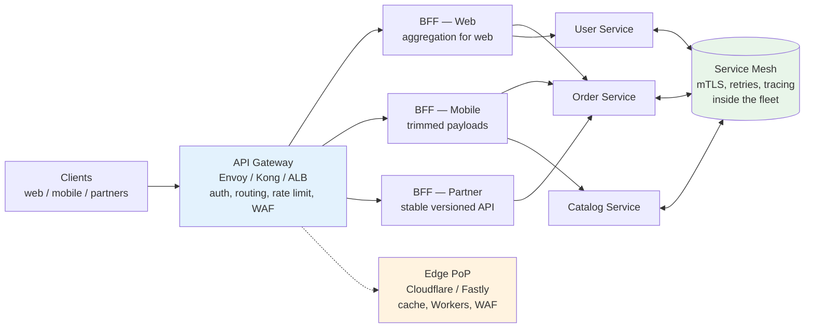
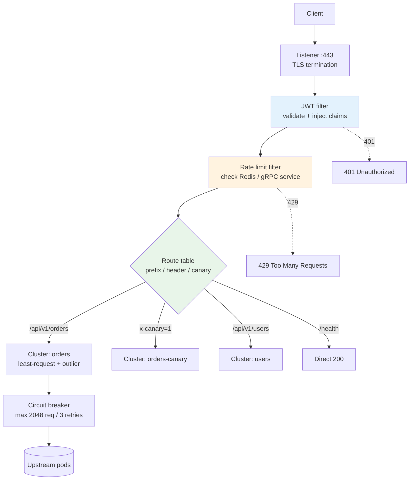
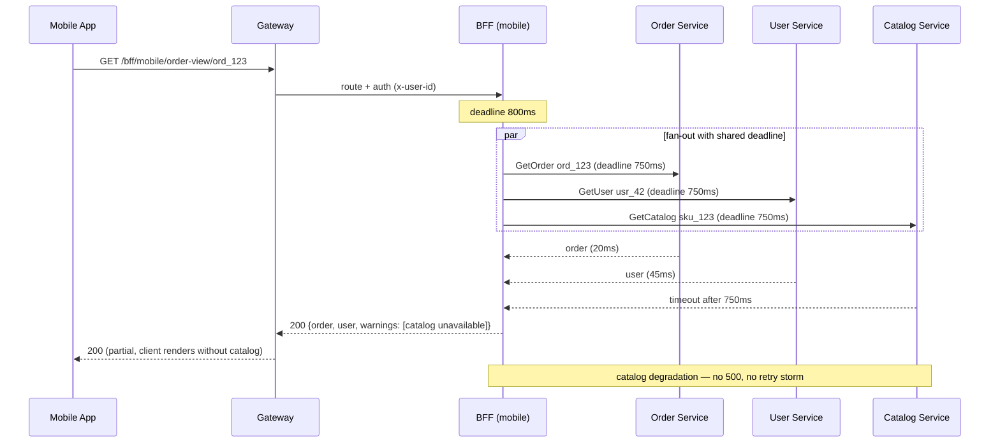
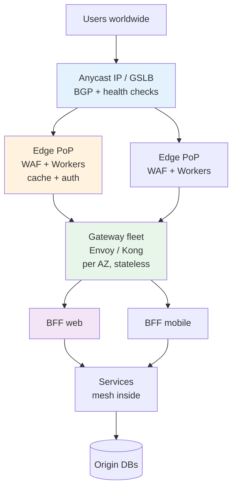
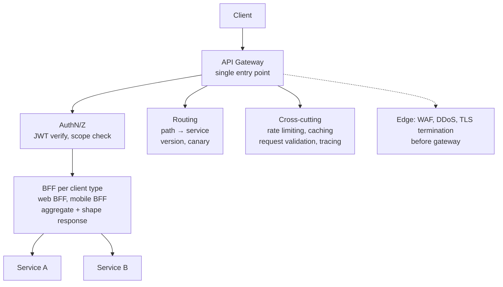
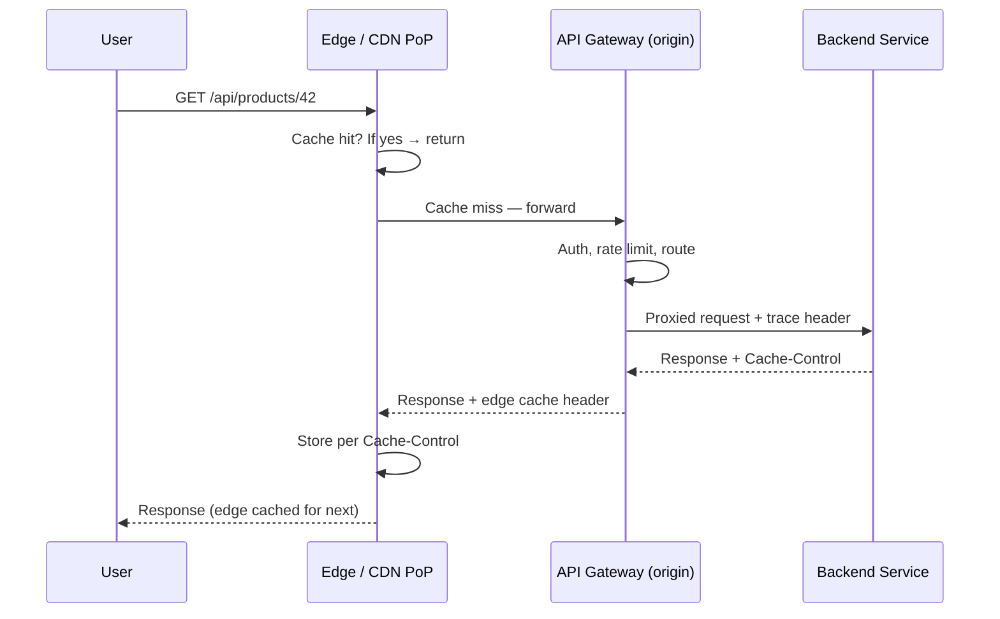
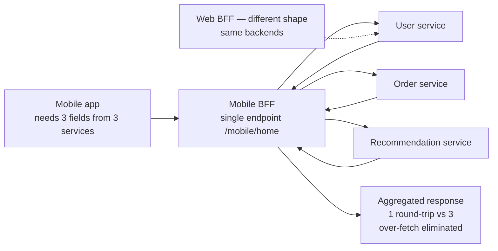

# Chapter 8 — API Gateways, BFF, and Edge

**What this chapter covers.** Chapter 4 placed load balancers in the traffic path and Chapter 6 split the monolith into services; this chapter puts a *facade* in front of that fleet and pushes logic to where users actually are. Without a gateway, every client must discover, authenticate to, and handle failures for N services — coupling clients to the service topology and leaking internal boundaries. An API gateway centralizes cross-cutting concerns (routing, authentication, rate limiting, transformation, observability) so that services stay focused on business logic. The Backend-for-Frontend (BFF) pattern refines the facade per client class so that mobile, web, and partner APIs each get the shape they need without forcing a lowest-common-denominator contract. Edge computing extends the facade to the CDN PoP, where requests can be authenticated, personalized, and even served without ever reaching the origin. We make each layer concrete: Envoy 1.30 and Kong Gateway 3.7 gateway configurations with JWT validation and request transformation, a BFF aggregation service with deadline-propagated fan-out, and edge logic with Cloudflare Workers and Fastly Compute — then close with the distributed-systems lens on why the gateway is simultaneously the best place to enforce policy and the most dangerous single point of failure.

Learning goals — after this chapter you should be able to:

- Explain what an API gateway owns versus what belongs in services or in the mesh, and name the failure mode when the boundary is wrong.
- Configure Envoy (1.30) and Kong (3.7) as gateways for routing, JWT authentication, header transformation, and rate-limit integration, and explain each field on the data path.
- Compare gateway, sidecar/mesh, and library (client-side) enforcement on latency, blast radius, and deploy coupling, and choose per concern.
- Design a BFF layer that aggregates, filters, and reshapes service responses per client without becoming a distributed monolith or a bottleneck.
- Implement edge logic (auth, A/B, personalization, caching) with Cloudflare Workers and Fastly Compute, reason about cold starts and consistency at the edge, and decide what must stay at the origin.
- Operate gateways at scale: canary routing, version-aware routing, observability (access logs, tracing, metrics), and the high-availability and multi-region deployment model that prevents the gateway from being a single point of failure.

---

## Why a gateway — and what it should not do

A gateway is a *reverse proxy with policy*. It terminates client connections, applies cross-cutting concerns once, and forwards to the appropriate backend — ideally without containing business logic.

What belongs at the gateway:

- **Routing** — path/host/header → upstream cluster. `/api/v1/orders/*` → order-service, `/api/v1/users/*` → user-service. Version-aware routing, canary splits, and header-based traffic steering (see below).
- **Authentication and coarse authorization** — validate JWT / mTLS client certificate, attach `x-user-id` / `x-tenant-id` headers for backends to trust. Fine-grained authorization (can this user edit this order?) stays in the owning service.
- **Rate limiting and quotas** — enforce per-client, per-route, per-tenant ceilings before traffic reaches backends. The algorithm lives here; the quota state may be local or in Redis (Chapter 9).
- **Transformation** — header injection, CORS, request/response rewriting, protocol translation (HTTP/1.1 → gRPC via grpc-web, REST → gRPC transcoding).
- **Observability** — access logs, metrics (requests, latency, error rate per route), distributed trace initiation (inject `traceparent`), and WAF / bot signals.
- **Resilience primitives** — timeouts, retries with budgets, circuit breaking, and outlier detection at the edge of the system (complements mesh-level resilience inside).

What does *not* belong at the gateway:

- Business logic, workflow orchestration, or data aggregation beyond thin BFF shaping (that is a service).
- Stateful session handling beyond token validation.
- Long-lived business transactions.

The anti-pattern is the "gateway monolith" — a gateway that accumulates business logic because it was the easiest place to add a new endpoint. It becomes the most coupled, most frequently deployed, and most fragile component in the system. The test: if removing the gateway (routing directly to services with mesh auth) would break business invariants, logic has leaked into the wrong layer.



*Figure 8-1: Gateway, BFF, mesh, and edge. The gateway enforces policy once at the perimeter; BFFs reshape per client; the mesh enforces policy inside; the edge enforces and serves before traffic reaches the origin.*

> **Boundary note.** Wire-level proxying, L4/L7 algorithms, and service mesh data-plane mechanics (Envoy sidecar, xDS, mTLS) are in Volume 3, Chapters 9–10 and Volume 12. API contract design, versioning, and schema evolution are in Volume 8. Rate-limiting algorithms at system scale are in Chapter 9 of this volume; algorithmic analysis of those same algorithms is in Volume 14, Chapter 8. This chapter treats the *gateway/BFF/edge as system-design components* — their responsibilities, configuration, and failure modes.

---

## Envoy as a gateway — configuration that matters

Envoy 1.30 is both the canonical gateway data plane and the sidecar inside Istio/Linkerd. Running it as an edge gateway means configuring listeners, routes, clusters, and filters explicitly.

### Static gateway with JWT auth, routing, and transformation

```yaml
# envoy-gateway.yaml — Envoy 1.30 as edge gateway (static config; xDS via control plane in prod)
admin:
  address:
    socket_address: { address: 127.0.0.1, port_value: 9901 }

static_resources:
  listeners:
  - name: https_ingress
    address:
      socket_address: { address: 0.0.0.0, port_value: 443 }
    filter_chains:
    - transport_socket:
        name: envoy.transport_sockets.tls
        typed_config:
          "@type": type.googleapis.com/envoy.extensions.transport_sockets.tls.v3.DownstreamTlsContext
          common_tls_context:
            tls_certificates:
            - certificate_chain: { filename: "/etc/envoy/tls/tls.crt" }
              private_key: { filename: "/etc/envoy/tls/tls.key" }
      filters:
      - name: envoy.filters.network.http_connection_manager
        typed_config:
          "@type": type.googleapis.com/envoy.extensions.filters.network.http_connection_manager.v3.HttpConnectionManager
          stat_prefix: ingress_http
          access_log:
          - name: envoy.access_loggers.file
            typed_config:
              "@type": type.googleapis.com/envoy.extensions.access_loggers.file.v3.FileAccessLog
              path: /var/log/envoy/access.log
              log_format:
                json_format:
                  start_time: "%START_TIME%"
                  method: "%REQ(:METHOD)%"
                  path: "%REQ(X-ENVOY-ORIGINAL-PATH?:PATH)%"
                  route: "%ROUTE_NAME%"
                  upstream: "%UPSTREAM_HOST%"
                  duration_ms: "%DURATION%"
                  response_code: "%RESPONSE_CODE%"
                  trace_id: "%REQ(X-REQUEST-ID)%"
          http_filters:
          # 1 — JWT validation (before routing)
          - name: envoy.filters.http.jwt_authn
            typed_config:
              "@type": type.googleapis.com/envoy.extensions.filters.http.jwt_authn.v3.JwtAuthentication
              providers:
                cognito:
                  issuer: https://cognito-idp.us-east-1.amazonaws.com/us-east-1_abc123
                  audiences: [api.example.com]
                  remote_jwks:
                    http_uri:
                      uri: https://cognito-idp.us-east-1.amazonaws.com/us-east-1_abc123/.well-known/jwks.json
                      cluster: jwks_cluster
                      timeout: 5s
                    cache_duration: { seconds: 300 }
                  forward: true
                  payload_in_metadata: jwt_payload
              rules:
              - match: { prefix: /api/ }
                requires: { provider_name: cognito }
              - match: { prefix: /health }
                requires: { allow_missing: true }
          # 2 — rate limiting (delegated to external service — see Chapter 9)
          - name: envoy.filters.http.ratelimit
            typed_config:
              "@type": type.googleapis.com/envoy.extensions.filters.http.ratelimit.v3.RateLimit
              domain: api_gateway
              request_type: external
              rate_limit_service:
                grpc_service:
                  envoy_grpc: { cluster_name: ratelimit }
                transport_api_version: V3
              failure_mode_deny: false  # fail-open on rate-limit service outage
          # 3 — router (must be last)
          - name: envoy.filters.http.router
            typed_config:
              "@type": type.googleapis.com/envoy.extensions.filters.http.router.v3.Router
          route_config:
            name: api_routes
            virtual_hosts:
            - name: api
              domains: ["api.example.com"]
              # CORS for browser clients
              cors:
                allow_origin_string_match: [{ safe_regex: { regex: "https://.*\\.example\\.com" } }]
                allow_methods: "GET, POST, PUT, DELETE, OPTIONS"
                allow_headers: "authorization,content-type,x-request-id,traceparent"
                max_age: "600"
              routes:
              # Version-aware routing — header pins canary
              - match: { prefix: /api/v1/orders, headers: [{ name: x-canary, string_match: { exact: "1" } }] }
                route:
                  cluster: orders_canary
                  timeout: 3s
                  retry_policy:
                    retry_on: 5xx
                    num_retries: 1
                    per_try_timeout: 2s
                    retry_host_predicate: [{ name: envoy.retry_host_predicates.previous_hosts }]
                  host_rewrite_literal: orders.internal
                request_headers_to_add:
                - header: { key: x-gateway-route, value: "orders-canary" }
              - match: { prefix: /api/v1/orders }
                route:
                  cluster: orders
                  timeout: 3s
                  retry_policy: { retry_on: 5xx, num_retries: 1, per_try_timeout: 2s }
                request_headers_to_add:
                - header: { key: x-user-id, value: "%DYNAMIC_METADATA(envoy.filters.http.jwt_authn:jwt_payload:sub)%" }
              - match: { prefix: /api/v1/users }
                route: { cluster: users, timeout: 2s }
              - match: { prefix: /health }
                direct_response: { status: 200, body: { inline_string: "ok\n" } }

  clusters:
  - name: orders
    connect_timeout: 0.5s
    type: STRICT_DNS
    lb_policy: LEAST_REQUEST
    health_checks:
    - timeout: 2s
      interval: 10s
      unhealthy_threshold: 3
      healthy_threshold: 2
      http_health_check: { path: /healthz }
    circuit_breakers:
      thresholds:
      - max_connections: 4096
        max_pending_requests: 1024
        max_requests: 2048
        max_retries: 3
    outlier_detection:
      consecutive_5xx: 3
      interval: 10s
      base_ejection_time: 30s
      max_ejection_percent: 50
    load_assignment:
      cluster_name: orders
      endpoints:
      - lb_endpoints:
        - endpoint: { address: { socket_address: { address: orders.internal, port_value: 8080 } } }
  - name: orders_canary
    connect_timeout: 0.5s
    type: STRICT_DNS
    lb_policy: LEAST_REQUEST
    load_assignment:
      cluster_name: orders_canary
      endpoints:
      - lb_endpoints:
        - endpoint: { address: { socket_address: { address: orders-canary.internal, port_value: 8080 } } }
  - name: users
    connect_timeout: 0.5s
    type: STRICT_DNS
    lb_policy: LEAST_REQUEST
    load_assignment:
      cluster_name: users
      endpoints:
      - lb_endpoints:
        - endpoint: { address: { socket_address: { address: users.internal, port_value: 8080 } } }
  - name: jwks_cluster
    connect_timeout: 1s
    type: LOGICAL_DNS
    lb_policy: ROUND_ROBIN
    load_assignment:
      cluster_name: jwks_cluster
      endpoints:
      - lb_endpoints:
        - endpoint: { address: { socket_address: { address: cognito-idp.us-east-1.amazonaws.com, port_value: 443 } } }
    transport_socket:
      name: envoy.transport_sockets.tls
      typed_config:
        "@type": type.googleapis.com/envoy.extensions.transport_sockets.tls.v3.UpstreamTlsContext
  - name: ratelimit
    connect_timeout: 0.25s
    type: STRICT_DNS
    lb_policy: ROUND_ROBIN
    typed_extension_protocol_options:
      envoy.extensions.upstreams.http.v3.HttpProtocolOptions:
        "@type": type.googleapis.com/envoy.extensions.upstreams.http.v3.HttpProtocolOptions
        explicit_http_config: { http2_protocol_options: {} }
    load_assignment:
      cluster_name: ratelimit
      endpoints:
      - lb_endpoints:
        - endpoint: { address: { socket_address: { address: ratelimit.internal, port_value: 8081 } } }
```

What each section does on the failure path:

- **`jwt_authn` before routing** — unauthenticated requests are rejected at the edge with 401 before any upstream sees them. `cache_duration: 300s` avoids fetching JWKS on every request. `forward: true` propagates the validated claims downstream if needed; `payload_in_metadata` lets `request_headers_to_add` inject `sub` as `x-user-id`.
- **`failure_mode_deny: false`** on the rate-limit filter — if the rate-limit service is down, traffic passes rather than black-holing the entire API. The alternative (`true`) is fail-closed — correct for auth, wrong for rate limiting in most products.
- **Outlier detection + circuit breakers** — Envoy ejects hosts that return `consecutive_5xx: 3` within `interval: 10s` for `base_ejection_time: 30s`, up to `max_ejection_percent: 50`. This is local to the gateway instance; for cross-instance ejection, use the mesh or a shared outlier store.
- **Retry predicate `previous_hosts`** — retries never hit the same host that just returned 5xx, avoiding amplification to a single failing pod.

### Kong Gateway 3.7 — declarative config with the same policy

Kong is a common alternative where teams want an admin API, plugin ecosystem, and declarative configuration without writing Envoy xDS control planes.

```yaml
# kong.yaml — Kong Gateway 3.7 declarative config (DB-less)
_format_version: "3.0"
services:
- name: orders
  url: http://orders.internal:8080
  routes:
  - name: orders-v1
    paths: [/api/v1/orders]
    strip_path: false
    plugins:
    - name: jwt
      config:
        uri_param_names: [jwt]
        key_claim_name: kid
        run_on_preflight: false
    - name: rate-limiting
      config:
        minute: 600
        hour: 10000
        policy: redis
        redis_host: redis.internal
        redis_port: 6379
        redis_timeout: 2000
        fault_tolerant: true
        hide_client_headers: false
        limit_by: consumer
    - name: cors
      config:
        origins: ["https://*.example.com"]
        methods: [GET, POST, PUT, DELETE, OPTIONS]
        headers: [authorization, content-type, x-request-id, traceparent]
        max_age: 600
    - name: request-transformer
      config:
        add:
          headers: ["x-gateway-route:orders", "x-request-id:$uuid"]
  - name: orders-canary
    paths: [/api/v1/orders]
    headers: { x-canary: ["1"] }
    strip_path: false
    service: orders-canary

- name: orders-canary
  url: http://orders-canary.internal:8080

consumers:
- username: mobile-app
  jwt_secrets:
  - key: mobile-app-key
    algorithm: RS256
    rsa_public_key: "-----BEGIN PUBLIC KEY-----\nMIIBIjANB...\n-----END PUBLIC KEY-----"

plugins:
- name: prometheus
  config:
    per_consumer: true
    status_code_metrics: true
    latency_metrics: true
- name: opentelemetry
  config:
    endpoint: http://otel-collector:4318/v1/traces
    resource_attributes:
      service.name: kong-gateway
```

Trade-offs: Kong's plugin model is simpler to operate than Envoy's filter chain, but less expressive for header-based routing and outlier detection. Both delegate rate-limit state to Redis or an external gRPC service — local counters diverge across gateway replicas.



*Figure 8-2: Gateway filter chain. Authentication runs first (fail fast, no upstream cost), rate limiting second (protect backends), routing last. Each filter can short-circuit with an error response without reaching upstream.*

---

## Backend for Frontend — one facade per client, not one facade for all

The BFF pattern (SoundCloud, 2015; popularized by Sam Newman) observes that a single "one size fits all" API forces every client to over-fetch, under-fetch, or work around a contract designed for someone else. A mobile app on a constrained network needs trimmed payloads and fewer round trips; a web app needs richer payloads with server-rendered fragments; a partner API needs a versioned, minimal, heavily rate-limited surface. One gateway route table cannot serve all three well.

A BFF is a thin, client-specific *aggregation and shaping layer* that sits behind the gateway (or is itself gateway-routed) and fans out to services. It owns no business invariants — it orchestrates reads.

```
Client → Gateway → BFF (per client class) → fan-out to services → aggregate → response
```

### What a BFF does and does not do

| BFF does | BFF does not |
|----------|-------------|
| Aggregate `GET /orders/{id}` + `GET /users/{id}` + `GET /catalog/{sku}` into one `GET /bff/mobile/order-view/{id}` | Own order or user business logic |
| Filter fields per client (mobile gets 12 fields, web gets 48) | Own the canonical schema (services do) |
| Batch and deduplicate downstream calls (DataLoader pattern) | Become a shared library imported by services |
| Enforce client-specific deadlines and fallbacks (return partial on timeout) | Implement distributed transactions |

The defining constraint: a BFF is *owned by the client team*, not the service team. The mobile BFF is owned by the mobile team, deploys with the mobile release cadence, and can be broken by service changes only through versioned contracts — the same boundary that Chapter 6 draws for services.

### BFF aggregation with deadline propagation

The hardest part of a BFF is not the fan-out — it is the failure handling when one of N backends is slow. The BFF must enforce a *client deadline*, propagate it downstream, and return a partial or degraded response rather than failing the entire aggregation because one dependency timed out.

```go
// bff/mobile/order_view.go — Go 1.22, fan-out with deadline propagation
package mobile

import (
    "context"
    "golang.org/x/sync/errgroup"
    "google.golang.org/grpc/metadata"
)

type OrderView struct {
    Order   *Order   `json:"order"`
    User    *User    `json:"user,omitempty"`
    Catalog *Catalog `json:"catalog,omitempty"`
    Warnings []string `json:"warnings,omitempty"`
}

func (h *Handler) GetOrderView(ctx context.Context, orderID string) (*OrderView, error) {
    // Client deadline is the budget; BFF reserves 50ms for serialization
    // Downstream calls share the remaining deadline via gRPC metadata / HTTP header
    ctx, cancel := context.WithTimeout(ctx, 800*time.Millisecond)
    defer cancel()

    var view OrderView
    g, ctx := errgroup.WithContext(ctx)

    g.Go(func() error {
        o, err := h.orders.GetOrder(ctx, orderID) // propagates ctx deadline via gRPC
        if err != nil {
            return err // order is required — fail the whole view
        }
        view.Order = o
        return nil
    })
    g.Go(func() error {
        // user and catalog are best-effort — degrade gracefully
        u, err := h.users.GetUser(ctx, extractUserID(ctx))
        if err != nil {
            view.Warnings = append(view.Warnings, "user unavailable")
            return nil // do not fail the group
        }
        view.User = u
        return nil
    })
    g.Go(func() error {
        c, err := h.catalog.GetCatalog(ctx, extractSKU(ctx))
        if err != nil {
            view.Warnings = append(view.Warnings, "catalog unavailable")
            return nil
        }
        view.Catalog = c
        return nil
    })

    if err := g.Wait(); err != nil {
        return nil, err // only hard failures (order) reach here
    }
    return &view, nil
}

// Downstream gRPC clients propagate deadline automatically via context;
// for HTTP, inject as header so the callee can enforce it too:
func injectDeadline(req *http.Request, ctx context.Context) {
    if dl, ok := ctx.Deadline(); ok {
        ms := time.Until(dl).Milliseconds()
        if ms > 0 {
            req.Header.Set("x-deadline-ms", fmt.Sprint(ms))
        }
    }
    if tp := trace.SpanContextFromContext(ctx); tp.IsValid() {
        req.Header.Set("traceparent", fmt.Sprintf("00-%s-%s-01", tp.TraceID(), tp.SpanID()))
    }
}
```

Key decisions:

- **`errgroup` with selective failure** — required data (`order`) fails the view; enrichment data (`user`, `catalog`) degrades. This is the difference between a BFF and a naive fan-out that returns 500 when any dependency is slow.
- **Deadline propagation** — without it, downstream services use their own default timeouts (often 5–30s) and the BFF waits long after the client has given up. gRPC propagates deadlines automatically via `grpc-timeout`; HTTP requires an explicit header and callee cooperation.
- **No shared BFF** — if one BFF serves web, mobile, and partners, it becomes the gateway monolith again. Split by client class; share nothing except observability and deploy tooling.



*Figure 8-3: BFF fan-out with deadline propagation and graceful degradation. The BFF's deadline is the client's budget; downstream calls share it and degrade individually rather than failing the entire aggregation.*

---

## Edge — serve and protect before the origin

The edge is the CDN PoP — Cloudflare (300+ cities), Fastly, Akamai, CloudFront — where the request arrives before it traverses the internet to your origin. Running logic at the edge cuts latency (no origin round trip), reduces origin load (cache hits and early rejects), and enforces policy closest to the attacker.

What to run at the edge, in order of safety:

1. **Cache and serve** — static assets, API responses with `Cache-Control`, stale-while-revalidate. No code, just headers.
2. **Reject** — WAF, bot detection, rate limiting, IP allow/deny. Fail fast before origin cost.
3. **Authenticate and personalize** — validate JWT at the edge, inject `x-user-id`, route to the right origin shard, A/B bucket, and set `Vary` correctly.
4. **Compute** — render, transform, or aggregate at the edge (Workers/Compute@Edge) when the working set fits in the PoP's memory and isolation budget.

What *not* to run at the edge: authoritative writes, cross-request state that must be strongly consistent, or logic that needs secrets you cannot scope to the edge trust boundary.

### Cloudflare Workers — auth and routing at the edge

Cloudflare Workers (V8 isolates, not containers — sub-millisecond cold starts, 128 MB per worker, CPU time limits) run on every PoP.

```javascript
// edge/auth-router.js — Cloudflare Worker (workerd, 2024+)
// Validates JWT at the edge, routes to origin shard, injects headers
export default {
  async fetch(request, env, ctx) {
    const url = new URL(request.url);

    // 1 — health and static bypass auth
    if (url.pathname === "/health" || url.pathname.startsWith("/static/")) {
      return fetch(request);
    }

    // 2 — validate JWT at the edge (no origin round trip for bad tokens)
    const auth = request.headers.get("authorization");
    if (!auth || !auth.startsWith("Bearer ")) {
      return new Response("missing token", { status: 401 });
    }
    const token = auth.slice(7);
    let claims;
    try {
      claims = await verifyJWT(token, env.JWKS_URL); // cached JWKS, see below
    } catch (e) {
      return new Response("invalid token", { status: 401 });
    }

    // 3 — route to origin shard by tenant (header-based sharding)
    const tenant = claims["custom:tenant_id"] || "default";
    const originHost = tenantShard(tenant); // e.g., "orders-us-east-1.internal"

    // 4 — A/B bucket at the edge (deterministic, no origin call)
    const bucket = hashBucket(claims.sub, "checkout-v2", 100);
    const variant = bucket < 10 ? "v2" : "v1";

    // 5 — forward with enriched headers, preserve tracing
    const outReq = new Request(request);
    outReq.headers.set("x-user-id", claims.sub);
    outReq.headers.set("x-tenant-id", tenant);
    outReq.headers.set("x-variant", variant);
    outReq.headers.set("x-edge-pop", request.cf.colo);
    // traceparent already present from gateway — pass through
    const outUrl = new URL(request.url);
    outUrl.hostname = originHost;

    // 6 — cache GETs at the edge (respect origin Cache-Control)
    if (request.method === "GET") {
      const cache = caches.default;
      let resp = await cache.match(outReq);
      if (resp) {
        resp = new Response(resp.body, resp);
        resp.headers.set("x-cache", "HIT");
        return resp;
      }
      const originResp = await fetch(new Request(outUrl, outReq));
      // only cache 200s with explicit cache-control
      if (originResp.ok && originResp.headers.get("cache-control")) {
        ctx.waitUntil(cache.put(outReq, originResp.clone()));
      }
      const r = new Response(originResp.body, originResp);
      r.headers.set("x-cache", "MISS");
      return r;
    }

    return fetch(new Request(outUrl, outReq));
  },
};

async function verifyJWT(token, jwksUrl) {
  // Minimal — in production use `jose` or `cloudflare/workers-jwt`
  // JWKS is cached in Workers KV / Cache API with 5m TTL
  const jwks = await fetch(jwksUrl, { cf: { cacheTtl: 300 } }).then((r) => r.json());
  // ... signature verification, exp/nbf/aud checks ...
  return claims;
}

function tenantShard(tenant) {
  const shards = { "tenant-a": "orders-us-east-1.internal", "tenant-b": "orders-eu-west-1.internal" };
  return shards[tenant] || "orders.internal";
}

function hashBucket(key, experiment, mod) {
  // FNV-1a or similar — deterministic per user per experiment
  let h = 2166136261;
  const s = `${key}:${experiment}`;
  for (let i = 0; i < s.length; i++) { h ^= s.charCodeAt(i); h = Math.imul(h, 16777619); }
  return (h >>> 0) % mod;
}
```

```toml
# wrangler.toml — Cloudflare Workers (Wrangler 3.x)
name = "auth-router"
main = "edge/auth-router.js"
compatibility_date = "2024-08-20"
route = { pattern = "api.example.com/*", zone_name = "example.com" }
[vars]
JWKS_URL = "https://cognito-idp.us-east-1.amazonaws.com/us-east-1_abc123/.well-known/jwks.json"
[observability]
enabled = true
head_sampling_rate = 0.1
```

### Fastly Compute — Rust at the edge with stronger isolation

Fastly Compute runs WebAssembly (Wasmtime) with a Rust/JS SDK, 128 MB, and no outbound connection pooling surprises.

```rust
// edge/fastly_auth/src/main.rs — Fastly Compute (Rust, fastly =0.10)
use fastly::{Request, Response, http::StatusCode};

#[fastly::main]
fn main(mut req: Request) -> Result<Response, fastly::Error> {
    // 1 — bypass for health
    if req.get_path() == "/health" {
        return Ok(Response::from_status(StatusCode::OK).with_body("ok\n"));
    }
    // 2 — JWT validation (JWKS cached in Config Store / KV)
    let token = req.get_header_str("authorization")
        .and_then(|v| v.strip_prefix("Bearer "))
        .ok_or_else(|| fastly::Error::msg("missing bearer"))?;
    let claims = verify_jwt(token)?; // uses jsonwebtoken crate, JWKS from Config Store

    // 3 — inject headers and route to origin shard
    let tenant = claims.tenant_id.as_deref().unwrap_or("default");
    let backend = match tenant {
        "tenant-a" => "orders_us_east_1",
        "tenant-b" => "orders_eu_west_1",
        _ => "orders_origin",
    };
    req.set_header("x-user-id", claims.sub);
    req.set_header("x-tenant-id", tenant);
    req.set_header("x-edge-pop", std::env::var("FASTLY_POP").unwrap_or_default());

    // 4 — stale-while-revalidate at the edge
    if req.get_method() == fastly::http::Method::GET {
        req.set_header("fastly-ttl", "60"); // cache 60s at edge
        req.set_header("fastly-stale-while-revalidate", "300");
    }

    // 5 — forward — Fastly handles connection pooling to named backend
    Ok(req.send(backend)?)
}
```

### Edge vs. origin — the consistency and trust boundary

The edge is eventually consistent with the origin by construction: cache entries are stale until revalidated, Config Store / KV writes propagate in seconds to minutes, and a PoP that has not seen a JWKS rotation will accept a revoked token until its cache TTL expires. Design for it:

- **Auth at the edge** is best-effort fast path; the origin must re-validate for authoritative decisions. The edge rejects the obviously bad; the origin is the source of truth.
- **Writes never complete at the edge** — they proxy to the origin. The edge can validate, rate-limit, and enrich, but the commit happens at the origin. Patterns like Cloudflare Durable Objects and CRDTs at the edge exist but are not a substitute for origin consensus.
- **Cache keys must include `Vary` dimensions** — `Vary: Authorization, Accept-Language, x-variant` or the edge serves one user's personalized response to another.

---

## Operating gateways at scale — availability, observability, canary

A gateway is a single point of failure if deployed as one. Production gateways are a *fleet* behind anycast or DNS, with independent failure domains per AZ and region.

Checklist for a gateway fleet that does not become the outage:

- **Anycast or GSLB in front** — one IP advertised from multiple PoPs/regions via BGP anycast (Cloudflare, GCP Cloud Load Balancing) or DNS with health checks (Route 53). No single LB node is special.
- **Per-AZ gateway replicas** — at least 2 per AZ, 3 AZs per region. Rolling deploys one replica at a time; health checks drain before termination.
- **No shared mutable state on the data path** — rate-limit counters in Redis (with fail-open), JWKS cached locally with TTL, route table from xDS/config reload — no DB query per request.
- **Progressive delivery for route changes** — canary gateway config (new route, new plugin) to 1% of traffic via header or weight, with automatic rollback on error-rate SLO breach (see Volume 11, Chapter 9).
- **Gateway is stateless** — any instance can handle any request. Session affinity at the gateway defeats horizontal scaling and creates hot shards.

Observability per route (not per gateway instance):

```yaml
# Prometheus recording rules — gateway SLOs per route (Prometheus 2.53)
groups:
- name: gateway_slo
  interval: 30s
  rules:
  - record: gateway:request_rate:by_route_5m
    expr: sum by (route) (rate(envoy_cluster_upstream_rq_total[5m]))
  - record: gateway:error_rate:by_route_5m
    expr: |
      sum by (route) (rate(envoy_cluster_upstream_rq_xx{response_code_class="5xx"}[5m]))
      / sum by (route) (rate(envoy_cluster_upstream_rq_total[5m]))
  - record: gateway:p99_latency:by_route_5m
    expr: histogram_quantile(0.99, sum by (route, le) (rate(envoy_cluster_upstream_rq_duration_bucket[5m])))
  - alert: GatewayRouteHighErrorRate
    expr: gateway:error_rate:by_route_5m > 0.01
    for: 5m
    labels: { severity: page }
    annotations:
      summary: "Route {{ $labels.route }} 5xx > 1% for 5m"
  - alert: GatewayRateLimitServiceDown
    expr: increase(envoy_cluster_circuit_breakers_default_cx_open[5m]) > 0
    labels: { severity: ticket }
    annotations:
      summary: "Rate-limit service circuit breaker opened — gateway is fail-open"
```

Access logs must be structured JSON with `route`, `upstream_host`, `duration`, `response_code`, `trace_id`, and `x-user-id` (if authenticated) — otherwise debugging "why did tenant-a see 429?" requires correlating N log formats.



*Figure 8-4: From users to origin through edge and gateway. Anycast/GSLB picks the PoP; the edge caches and authenticates; the gateway fleet (per AZ, stateless) routes to BFFs and services. No single box is special; every layer is horizontally scaled and independently deployable.*

The distributed-systems lens:

- **Policy placement is a consistency trade-off.** Gateway-enforced policy (auth, rate limits, WAF) is consistent at the perimeter but stale if the gateway's view of truth (JWKS, quota counters) lags the origin. Mesh-enforced policy is fresher (closer to the service) but multiplies enforcement points. Most systems enforce *coarsely* at the gateway (is this token valid? is this tenant over quota?) and *finely* at the service (can this user mutate this resource?).
- **The gateway amplifies failures.** A bad gateway config (route loop, auth regression, rate-limit misconfiguration) affects *every* route simultaneously. Treat gateway config changes with the same rigor as database migrations: canary, automatic rollback, and a break-glass bypass (direct-to-service via mesh for operators).
- **Edge and origin form a split-brain system.** The edge's cache and KV are eventually consistent with the origin. Never treat an edge write (cache purge, KV update) as synchronous — design idempotent purges and tolerate stale reads within the TTL window.

---

## Key takeaways

- A gateway centralizes cross-cutting concerns (auth, routing, rate limiting, transformation, observability) so services stay focused on business logic — but it must not accumulate business logic itself or it becomes the most coupled component in the system.
- Envoy as a gateway composes listeners, filter chains (JWT, rate limit, router), and clusters with outlier detection and circuit breakers; Kong provides the same policy via declarative config and plugins — both delegate quota state to an external store.
- Filter ordering matters: authenticate first (fail fast, no upstream cost), rate-limit second (protect backends), route last — each filter can short-circuit without reaching upstream.
- A BFF is a per-client-class aggregation layer owned by the client team, not a shared service — it fans out with deadline propagation and degrades gracefully when enrichment dependencies are slow, rather than failing the entire view.
- Edge computing (Cloudflare Workers, Fastly Compute) cuts latency and origin load by authenticating, routing, and caching at the PoP — but the edge is eventually consistent with the origin, so writes still commit at the origin and cache keys must include all `Vary` dimensions.
- Gateway fleets must be stateless, per-AZ, behind anycast/GSLB, with no per-request DB on the data path, progressive delivery for config changes, and per-route SLOs — otherwise the gateway is the single point of failure it was meant to eliminate.
- Policy placement is a consistency trade-off: enforce coarsely at the gateway (valid token? over quota?) and finely at the owning service (can this user mutate this resource?).








## Further reading

- Envoy 1.30 documentation — listeners, filter chains, JWT and rate-limit filters, outlier detection: https://www.envoyproxy.io/docs/envoy/v1.30.0/
- Kong Gateway 3.7 — declarative configuration, JWT and rate-limiting plugins: https://docs.konghq.com/gateway/3.7.x/
- Newman, S. *Building Microservices* (2nd ed.), Chapter 8 — API gateways and BFF: https://samnewman.io/books/building_microservices_2nd_edition/
- Cloudflare Workers documentation — isolates, routing, caching, and observability: https://developers.cloudflare.com/workers/
- Fastly Compute documentation — Rust SDK, backends, and edge caching: https://developer.fastly.com/learning/compute/
- Google Cloud Load Balancing — anycast and GSLB architecture: https://cloud.google.com/load-balancing/docs/load-balancing-overview
- W3C Trace Context — `traceparent` propagation through gateway and BFF hops: https://www.w3.org/TR/trace-context/
