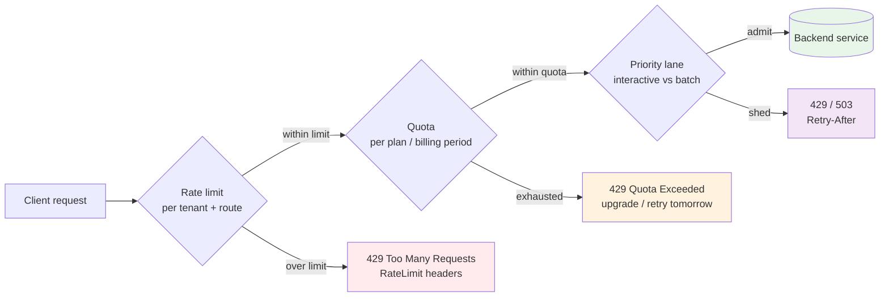
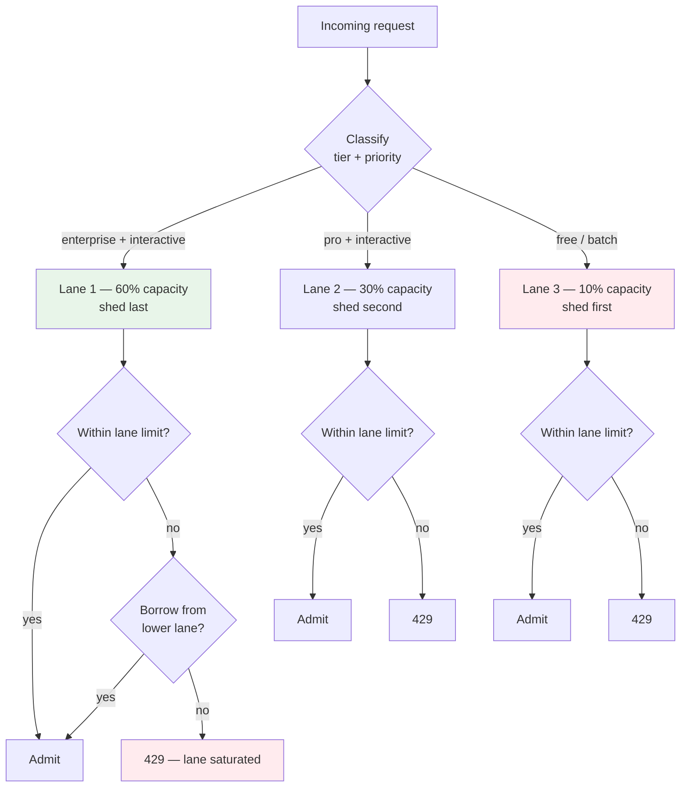
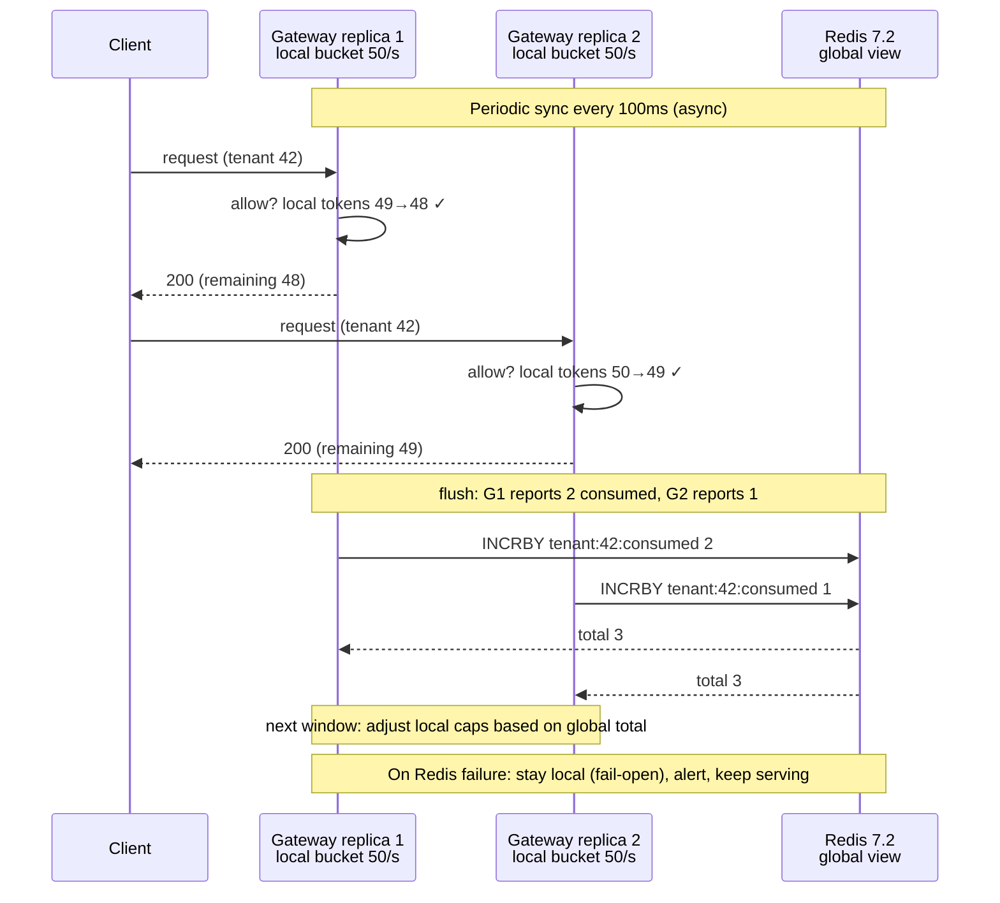
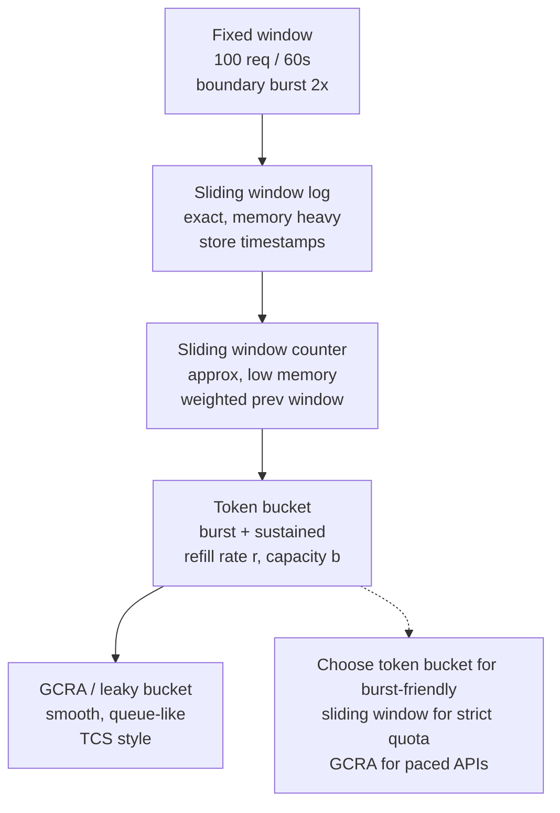
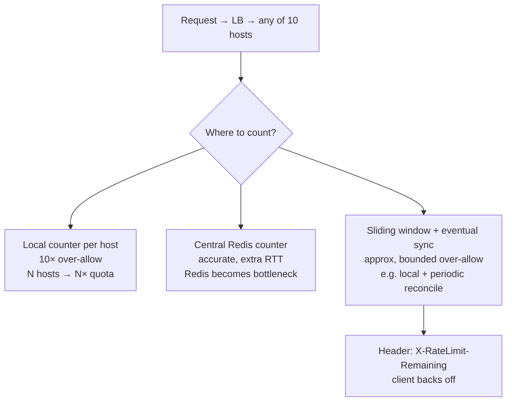
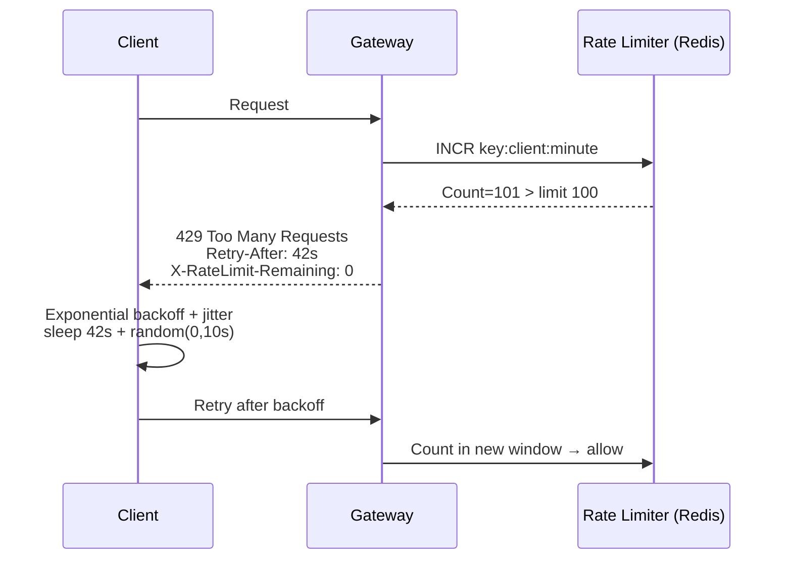

# Chapter 9 — Rate Limiting, Quotas, and Fairness

**What this chapter covers.** Chapters 4 and 8 can route and authenticate every request, but without limits a single misbehaving client — a runaway cron job, a scrape loop, a compromised API key — can consume the entire fleet's capacity and violate every tenant's SLO. Rate limiting is the mechanism that turns "best effort for everyone" into "guaranteed fair share for each." This chapter builds the primitives from first principles, makes them operational at scale, and shows how quotas (business-level budgets) and fairness policies (who gets what when capacity is scarce) compose on top. We compare the four algorithms that actually matter in production — fixed window, sliding window (log and counter), token bucket, and leaky bucket — on burst handling, memory cost, and behavior under clock skew, then implement them where they run: local in-process limiters (Go `x/time/rate`, Guava), distributed limiters backed by Redis 7.2 with atomic Lua, and Envoy's external `ratelimit` gRPC service as the gateway integration point. The second half covers quota design (per-tenant, per-route, tiered plans), fairness strategies (weighted fair queuing, priority lanes, and shed-vs-queue choices), and the operational realities of global limits — why local counters diverge, how to bound the error with probabilistic reconciliation, and when to accept eventual enforcement rather than pay the coordination cost. The chapter closes with the distributed-systems lens on why rate limiting is a consistency-availability trade-off in disguise.

Learning goals — after this chapter you should be able to:

- Compare fixed window, sliding window log/counter, token bucket, and leaky bucket on burst allowance, memory, precision at window boundaries, and sensitivity to clock skew, and choose per use case.
- Implement a correct token-bucket and sliding-window counter in application code and as an atomic Redis 7.2 Lua script, explain the failure mode if the script is not atomic, and handle Redis unavailability with fail-open vs. fail-closed semantics.
- Configure Envoy 1.30's external rate-limit service (Lyft `ratelimit` with Redis), Kong Gateway 3.7, and NGINX `limit_req` for gateway-level enforcement with per-route and per-tenant descriptors.
- Design a quota system that composes per-second rate limits, per-hour/day quotas, and burst allowances into tiered plans, with headers (`RateLimit-*`, `Retry-After`) and over-quota UX that does not create retry storms.
- Apply fairness strategies — weighted limits, priority lanes, and load shedding vs. queuing — to protect SLOs when the system is saturated, and explain when each harms tail latency.
- Reason about distributed rate limiting's fundamental trade-off: local counters are available but imprecise (N× over-allowance), global counters are precise but add latency and become a single point of failure — and choose the reconciliation strategy (sync interval, probabilistic allowance, or hierarchical caps) that bounds the error for your SLO.

---

## Why "just add more capacity" does not solve fairness

Rate limiting is often framed as protection against abuse. In practice it protects against four distinct failure modes, only one of which is malicious:

| Threat | Example | What fails without limits |
|--------|---------|--------------------------|
| **Buggy client** | Deploy pushes a tight retry loop (1k RPS per instance × 500 instances) | Backend thread pools exhaust; latency spikes for all tenants |
| **Noisy neighbor** | Tenant A backfills 10M rows through the same API tenant B uses interactively | Tenant B's p99 doubles; SLO breach despite no code change |
| **Cost and quota exhaustion** | LLM or search API billed per token/query; one key burns a month's budget in an hour | Business cost, downstream provider throttles everyone |
| **Intentional abuse / DoS** | Credential stuffing, scraping, volumetric flood | Availability loss, WAF bypass if rate limiting is the only line |

The distributed-systems consequence: without per-client limits, the system's *observed* capacity is the capacity of its *most aggressive client*. Every SLO becomes "as good as the worst tenant's behavior." Rate limiting makes each tenant's experience independent of others' load — the isolation primitive that lets Chapter 4's load balancing and Chapter 8's gateway actually deliver on their promises.

Quotas and fairness refine the guarantee:

- **Rate limit** — "at most R requests per second, with burst B." A *mechanism* enforced on the data path.
- **Quota** — "at most Q requests per hour/day/month." A *business contract* that may span multiple rate-limit windows and may be enforced asynchronously.
- **Fairness** — "when demand exceeds capacity, who is throttled first and who is protected." A *policy* that composes limits with priority.



*Figure 9-1: The enforcement stack. Rate limits protect per-second capacity, quotas enforce business budgets over longer windows, and fairness decides who is shed when both are saturated. Each layer returns distinct headers so clients can distinguish "slow down" from "out of budget."*

> **Boundary note.** This chapter treats rate limiting as a *system-design mechanism* — algorithm choice, gateway/service placement, quota composition, and fairness policy at fleet scale. The *algorithmic analysis* of the same structures — amortized cost, probabilistic structures for sliding windows, consistent hashing for sharded limits, and scheduling theory (WFQ, deficit round-robin) — is in Volume 14, Chapter 8 — Rate-Limiting and Scheduling Algorithms. Wire-level reliability that interacts with throttling (timeouts, retries, backoff, hedging) is in Volume 3, Chapter 11 — Network Reliability. Client-side retry discipline after receiving 429/503 is covered there; this chapter covers the server-side enforcement and header contract.

---

## The four algorithms — and when each is the right one

Every production limiter is a variant of one of four ideas. Understanding their burst behavior and window-boundary precision is what separates a limiter that protects backends from one that merely counts.

### 1. Fixed window counter

Count requests in the current window (e.g., 60 seconds). Reset to zero at the boundary. Allow if `count < limit`.

Pros: trivial, O(1) memory (one counter per key), easy to implement in Redis with `INCR` + `EXPIRE`.
Cons: **boundary spike** — 100 requests at 00:59 and 100 at 01:01 both pass a "100/min" limit but deliver 200 in 2 seconds. Under bursty traffic the effective limit is 2× the configured one.

```
Window 1 (00:00-01:00):  ██████████ 100 at 00:59 — allowed (count=100)
Window 2 (01:00-02:00):  ██████████ 100 at 01:01 — allowed (count reset to 0 → 100)
Actual in 2s window:    200 — double the intended rate
```

Never use fixed window alone for protecting latency-sensitive backends; the spike *is* the failure mode you were trying to prevent.

### 2. Sliding window log and sliding window counter

**Sliding window log** — store a timestamp per request, evict entries older than the window, count the remainder. Precise (true sliding window), but O(N) memory per key — prohibitive for high-cardinality keys (per-user, per-IP) at high rates.

**Sliding window counter (hybrid)** — keep two fixed-window counters (previous and current) and weight the previous window by overlap. `effective = prev_count × (1 - overlap_fraction) + current_count`. O(1) memory, ~1% error vs. true sliding window, and the standard choice for gateway-level limits.

Example: limit 100/min, at 01:15 (25% into current window), previous window had 80, current has 30. Effective = 80 × 0.75 + 30 = 90 → allow. At 01:45 with 60 in current, effective = 80 × 0.25 + 60 = 80 → allow. Smooths the boundary without per-request storage.

Cloudflare, Kong, and the Envoy `ratelimit` service all implement this variant by default.

### 3. Token bucket

A bucket holds at most `capacity` tokens, refilled at `refill_rate` per second. Each request consumes one token; if the bucket is empty, the request is throttled. Buckets can be described with two numbers: *sustained rate* and *burst*.

Pros: allows bursts up to `capacity` while enforcing a long-term rate — matches how backends actually behave (they can absorb a short burst but not a sustained overload). O(1) memory. The canonical choice for API rate limits ("100 RPS, burst 200").
Cons: burst size must be tuned — too large and bursts still overwhelm backends; too small and legitimate spikes are throttled.

### 4. Leaky bucket (and GCRA)

Requests enter a queue drained at a fixed rate; if the queue is full, requests are rejected. Equivalent to token bucket with the burst constrained to one — it *smooths* rather than *allows* bursts. GCRA (Generic Cell Rate Algorithm) is the formalization used in telecom and in some Redis modules.

Use leaky bucket when you need *shaping* (smooth the output to a constant rate — e.g., webhook delivery, outbound email) rather than *policing* (allow bursts but cap the average). For inbound API protection, token bucket is almost always the better fit.

| Algorithm | Burst | Memory/key | Precision | When to use |
|-----------|-------|-----------|-----------|-------------|
| **Fixed window** | 2× spike at boundary | O(1) | Poor at boundaries | Never alone for latency-sensitive paths; OK for coarse daily quotas |
| **Sliding window log** | None | O(N) | Exact | Low-cardinality keys where precision justifies cost |
| **Sliding window counter** | ~1% overshoot | O(1) | Approximate, smooth | Gateway per-route/per-tenant limits — best general default |
| **Token bucket** | Bounded by capacity | O(1) | Exact per token | API rate limits with explicit burst ("100/s, burst 200") |
| **Leaky bucket / GCRA** | None (smooths) | O(1) | Exact per drain | Outbound shaping (webhooks, queue consumers) |

```mermaid
flowchart TD
    subgraph Fixed[Fixed window — spikes at boundaries]
        F1[Window 1: 100 at 00:59 ✓] --> F2[Window 2: 100 at 01:01 ✓]
        F2 --> F3[200 in 2s — 2x limit!]
    end
    subgraph Sliding[Sliding window counter — smooth]
        S1[prev=80 cur=30 at 25% overlap] --> S2[effective 90 — allow]
        S1 --> S3[prev=80 cur=80 at 75% overlap]
        S3 --> S4[effective 100 — throttle]
    end
    subgraph Token[Token bucket — burst then steady]
        T1[Bucket 200 tokens<br/>refill 100/s] --> T2[Burst 200 in 1s — allowed]
        T2 --> T3[Then 100/s sustained<br/>empty bucket throttles]
    end
    subgraph Leaky[Leaky bucket — smooth output]
        L1[Bursty input] --> L2[Queue drains at 100/s]
        L2 --> L3[Overflow → reject<br/>no burst delivered]
    end
```



*Figure 9-2: Burst behavior of the four algorithms. Fixed window's boundary spike is the hazard; sliding-window counter smooths it; token bucket explicitly bounds bursts; leaky bucket eliminates them.*

---

## Local limiter — correct token bucket in application code

Every service should have a local limiter as the last line of defense, independent of the gateway. It protects against gateway bypass (internal callers), gateway failure (fail-open), and per-instance overload that a global counter cannot see.

Go's `golang.org/x/time/rate` (the standard library's rate limiter, used inside Kubernetes and many backends) is a token-bucket with a clean API:

```go
// local_limiter.go — Go 1.22, golang.org/x/time/rate
package limits

import (
    "context"
    "golang.org/x/time/rate"
    "time"
)

// Per-tenant limiters — one bucket per tenant, bounded map with TTL
type TenantLimiter struct {
    limiters map[string]*rate.Limiter
    mu       sync.RWMutex
    r        rate.Limit // tokens per second
    burst    int
}

func NewTenantLimiter(rps int, burst int) *TenantLimiter {
    return &TenantLimiter{
        limiters: make(map[string]*rate.Limiter),
        r:        rate.Limit(rps),
        burst:    burst,
    }
}

func (t *TenantLimiter) Allow(tenant string) bool {
    t.mu.RLock()
    lim, ok := t.limiters[tenant]
    t.mu.RUnlock()
    if !ok {
        t.mu.Lock()
        // double-check after acquiring write lock
        if lim, ok = t.limiters[tenant]; !ok {
            lim = rate.NewLimiter(t.r, t.burst)
            t.limiters[tenant] = lim
        }
        t.mu.Unlock()
    }
    return lim.Allow()
}

// Allow with context — waits up to deadline for a token (for non-interactive work)
func (t *TenantLimiter) Wait(ctx context.Context, tenant string) error {
    t.mu.RLock()
    lim, ok := t.limiters[tenant]
    t.mu.RUnlock()
    if !ok {
        t.mu.Lock()
        if lim, ok = t.limiters[tenant]; !ok {
            lim = rate.NewLimiter(t.r, t.burst)
            t.limiters[tenant] = lim
        }
        t.mu.Unlock()
    }
    return lim.Wait(ctx) // blocks until token available or ctx cancelled
}

// Evict idle tenants to bound memory — call periodically
func (t *TenantLimiter) EvictIdle(ttl time.Duration) {
    // In production, track last-access per limiter (e.g., sync.Map with timestamp)
    // and delete entries idle > ttl. Omitted for brevity — use github.com/hashicorp/golang-lru
    // or a TTL cache like github.com/jellydator/ttlcache for high-cardinality keys.
}
```

Python equivalent for scripting and data-plane helpers:

```python
# token_bucket.py — Python 3.11, no dependencies
import time
import threading

class TokenBucket:
    def __init__(self, rate: float, capacity: int):
        self.rate = rate            # tokens per second (sustained)
        self.capacity = capacity    # max burst
        self.tokens = float(capacity)
        self.updated_at = time.monotonic()
        self.lock = threading.Lock()

    def allow(self, tokens: int = 1) -> bool:
        with self.lock:
            now = time.monotonic()
            # refill based on elapsed time — monotonic clock, immune to NTP skew
            elapsed = now - self.updated_at
            self.tokens = min(self.capacity, self.tokens + elapsed * self.rate)
            self.updated_at = now
            if self.tokens >= tokens:
                self.tokens -= tokens
                return True
            return False

    def retry_after(self, tokens: int = 1) -> float:
        with self.lock:
            deficit = tokens - self.tokens
            return max(0.0, deficit / self.rate) if deficit > 0 else 0.0
```

Critical detail: **use `time.monotonic()` / `clock_gettime(CLOCK_MONOTONIC)`**, never wall-clock time. Wall clocks jump on NTP correction and leap seconds; a backward jump refills the bucket spuriously or, worse, a forward jump empties it and throttles all traffic.

---

## Distributed limiter — Redis 7.2 with atomic Lua

Local buckets diverge: 10 gateway replicas each allowing 100 RPS actually allow 1000 RPS globally. For per-tenant or global limits that must be precise, the counter must be shared. Redis 7.2 is the standard shared store — single-threaded execution makes Lua scripts atomic without distributed locks.

### Token bucket in Redis — atomic Lua

```lua
-- token_bucket.lua — Redis 7.2 Lua, atomic token bucket
-- KEYS[1] = bucket key (e.g., "ratelimit:tenant:{id}:orders")
-- ARGV[1] = capacity (burst)
-- ARGV[2] = refill_rate (tokens per second)
-- ARGV[3] = requested tokens (usually 1)
-- ARGV[4] = now_ms (client-supplied monotonic-ish millis; see note)
-- Returns: { allowed (1/0), remaining, retry_after_ms }

local key = KEYS[1]
local capacity = tonumber(ARGV[1])
local refill_rate = tonumber(ARGV[2])
local requested = tonumber(ARGV[3])
local now_ms = tonumber(ARGV[4])

local data = redis.call("HMGET", key, "tokens", "updated_at")
local tokens = tonumber(data[1])
local updated_at = tonumber(data[2])

if tokens == nil then
    tokens = capacity
    updated_at = now_ms
else
    local elapsed_ms = now_ms - updated_at
    if elapsed_ms < 0 then elapsed_ms = 0 end  -- clock skew guard
    local refill = elapsed_ms * refill_rate / 1000.0
    tokens = math.min(capacity, tokens + refill)
    updated_at = now_ms
end

local allowed = 0
local retry_after_ms = 0
if tokens >= requested then
    tokens = tokens - requested
    allowed = 1
else
    local deficit = requested - tokens
    retry_after_ms = math.ceil(deficit / refill_rate * 1000)
end

-- TTL: time to fully refill + 60s slack, so idle keys expire
local ttl_ms = math.ceil(capacity / refill_rate * 1000) + 60000
redis.call("HMSET", key, "tokens", tokens, "updated_at", updated_at)
redis.call("PEXPIRE", key, ttl_ms)

local remaining = math.floor(tokens)
return {allowed, remaining, retry_after_ms}
```

Invoke from application or gateway helper:

```bash
# Test with redis-cli (Redis 7.2)
redis-cli --eval token_bucket.lua ratelimit:tenant:42:orders , 200 100 1 1710000000000
# → 1) (integer) 1   -- allowed
#   2) (integer) 199  -- remaining
#   3) (integer) 0    -- retry_after_ms

# Under contention — 201st request in same millisecond
redis-cli --eval token_bucket.lua ratelimit:tenant:42:orders , 200 100 1 1710000000001
# → 1) (integer) 0   -- throttled
#   2) (integer) 0
#   3) (integer) 10  -- retry after 10ms (1 token / 100 per sec)
```

```python
# redis_limiter.py — Python 3.11, redis-py 5.0, atomic Lua
import time, redis

r = redis.Redis(host="redis.internal", port=6379, decode_responses=True)
with open("token_bucket.lua") as f:
    script = f.read()
token_bucket = r.register_script(script)

def allow(tenant: str, route: str, capacity=200, rate=100) -> dict:
    key = f"ratelimit:tenant:{tenant}:{route}"
    now_ms = int(time.time() * 1000)  # wall clock here is OK — Lua guards skew
    allowed, remaining, retry_after_ms = token_bucket(
        keys=[key], args=[capacity, rate, 1, now_ms]
    )
    return {
        "allowed": bool(allowed),
        "remaining": remaining,
        "retry_after_ms": retry_after_ms,
    }
```

### Sliding window counter in Redis — the gateway default

More precise at window boundaries than token bucket for fixed "N per minute" semantics; preferred for tiered plan quotas.

```lua
-- sliding_window.lua — Redis 7.2, sliding window counter (2-window hybrid)
-- KEYS[1] = current window key, KEYS[2] = previous window key
-- ARGV[1] = limit, ARGV[2] = window_ms, ARGV[3] = now_ms
-- Returns: { allowed, remaining, retry_after_ms }

local cur_key = KEYS[1]
local prev_key = KEYS[2]
local limit = tonumber(ARGV[1])
local window_ms = tonumber(ARGV[2])
local now_ms = tonumber(ARGV[3])

local cur_count = tonumber(redis.call("GET", cur_key) or "0")
local prev_count = tonumber(redis.call("GET", prev_key) or "0")

-- overlap fraction of previous window still in the sliding window
local elapsed_in_cur = now_ms % window_ms
local overlap = (window_ms - elapsed_in_cur) / window_ms
local effective = prev_count * overlap + cur_count

if effective >= limit then
    local retry_after = window_ms - elapsed_in_cur
    return {0, 0, retry_after}
end

-- allow — increment current window
cur_count = redis.call("INCR", cur_key)
if cur_count == 1 then
    redis.call("PEXPIRE", cur_key, window_ms * 2)
end
-- ensure prev key has TTL if it exists
redis.call("PEXPIRE", prev_key, window_ms * 2)

local remaining = math.max(0, limit - math.ceil(effective) - 1)
local retry_after = 0
return {1, remaining, retry_after}
```

Production note: for high-cardinality keys (per-IP, per-user at millions of distinct keys), storing two keys per limiter doubles memory. Alternatives: Redis Cell module (`CL.THROTTLE` — GCRA-based, single key, used by Lyft's `ratelimit` service) or a single sorted-set sliding log with `ZREMRANGEBYSCORE` (precise but heavier). Evaluate memory with `MEMORY USAGE` and `INFO memory` before choosing.

### Handling Redis failure — fail-open vs. fail-closed

Redis is now on the data path. When it is down, two choices:

- **Fail-open** (allow traffic) — preserves availability; risks backend overload during the Redis outage. Correct for most user-facing APIs where a brief over-allowance is preferable to a global 503.
- **Fail-closed** (reject traffic) — preserves backend safety; turns a Redis outage into a full API outage. Correct only for cost-bound or safety-critical limits (billing, abuse).

Implement both: fail-open for per-tenant rate limits, fail-closed for global abuse caps — and alert on `redis_up == 0` so the window of imprecision is short.

```python
def allow_with_fallback(tenant, route):
    try:
        return allow(tenant, route)
    except redis.ConnectionError:
        # metric + alert — we are now imprecise
        metrics.incr("ratelimit.redis_unavailable")
        # Fail-open for rate limits, fail-closed for abuse caps
        if route in ABUSE_CAPS:
            return {"allowed": False, "remaining": 0, "retry_after_ms": 1000}
        return {"allowed": True, "remaining": -1, "retry_after_ms": 0}
```

---

## Gateway integration — Envoy external rate limiting

Envoy delegates rate-limit decisions to an external gRPC service so the data plane stays fast and the policy lives in one place. The standard implementation is Lyft's `ratelimit` (Go, Redis-backed), which speaks Envoy's `RateLimitService` API.

### Envoy 1.30 — route descriptors

Building on the gateway from Chapter 8, add per-route and per-tenant descriptors:

```yaml
# envoy-gateway-ratelimit.yaml — additions to the Chapter 8 gateway
static_resources:
  listeners:
  - name: https_ingress
    filter_chains:
    - filters:
      - name: envoy.filters.network.http_connection_manager
        typed_config:
          "@type": type.googleapis.com/envoy.extensions.filters.network.http_connection_manager.v3.HttpConnectionManager
          http_filters:
          - name: envoy.filters.http.ratelimit
            typed_config:
              "@type": type.googleapis.com/envoy.extensions.filters.http.ratelimit.v3.RateLimit
              domain: api_gateway
              request_type: external
              rate_limit_service:
                grpc_service:
                  envoy_grpc: { cluster_name: ratelimit }
                transport_api_version: V3
              failure_mode_deny: false
              enable_x_ratelimit_headers: DRAFT_VERSION_03  # RateLimit-Limit/Remaining/Reset
              rate_limited_as_resource_exhausted: true     # 429, not 500
          route_config:
            virtual_hosts:
            - name: api
              domains: ["api.example.com"]
              routes:
              - match: { prefix: /api/v1/orders }
                route: { cluster: orders, timeout: 3s }
                typed_per_filter_config:
                  envoy.filters.http.ratelimit:
                    "@type": type.googleapis.com/envoy.extensions.filters.http.ratelimit.v3.RateLimitPerRoute
                    rate_limits:
                    # Descriptor: per-tenant (header x-tenant-id) + per-route
                    - actions:
                      - request_headers: { header_name: x-tenant-id, descriptor_key: tenant_id }
                      - generic_key: { descriptor_value: orders_write }
                    # Global abuse cap — per-IP
                    - actions:
                      - remote_address: {}
                      - generic_key: { descriptor_value: global_ip }
```

### Lyft ratelimit — configuration

```yaml
# ratelimit-config.yaml — Lyft ratelimit (v2, Redis 7.2)
domain: api_gateway
descriptors:
  # Per-tenant orders write: 100/s burst 200, 10000/hour
  - key: tenant_id
    rate_limit:
      requests_per_unit: 100
      unit: second
  - key: tenant_id
    value: tenant_a          # override for high-tier tenant
    rate_limit:
      requests_per_unit: 1000
      unit: second
  - key: tenant_id
    rate_limit:
      requests_per_unit: 10000
      unit: hour
  # Per-route — orders_write sub-key
  - key: orders_write
    rate_limit:
      requests_per_unit: 200
      unit: second
  # Global per-IP abuse cap
  - key: global_ip
    rate_limit:
      requests_per_unit: 50
      unit: second

# ratelimit deployment — Envoy cluster points here
# ratelimit.yaml — Kubernetes Deployment (ratelimit v2, image: envoyproxy/ratelimit:v1.6.0)
# Redis backend — single primary with replica; ratelimit handles failover
storage:
  type: redis
  redis:
    address: redis.internal:6379
    pool_size: 20
```

The `ratelimit` service implements GCRA/sliding-window internally and returns `OVER_LIMIT` with `RateLimit` headers; Envoy translates that to 429 with `RateLimit-Limit`, `RateLimit-Remaining`, `RateLimit-Reset`, and `Retry-After`. No Lua needed — but Redis is still on the path, with the same fail-open/fail-closed choice (`failure_mode_deny`).

### Kong and NGINX — alternatives at the gateway

```yaml
# kong.yaml — Kong Gateway 3.7, per-consumer rate limiting (DB-less, Redis)
services:
- name: orders
  url: http://orders.internal:8080
  routes:
  - name: orders-v1
    paths: [/api/v1/orders]
    plugins:
    - name: rate-limiting
      config:
        minute: 600
        hour: 10000
        policy: redis
        redis_host: redis.internal
        redis_port: 6379
        fault_tolerant: true     # fail-open when Redis down
        hide_client_headers: false
        limit_by: consumer       # per-consumer (JWT claim) — also: ip, header, service
```

```nginx
# nginx.conf — NGINX 1.25, local token bucket (no Redis — per-worker, imprecise across replicas)
limit_req_zone $http_x_tenant_id zone=tenant_orders:10m rate=100r/s;
limit_req_zone $binary_remote_addr zone=ip_global:10m rate=50r/s;
limit_req_status 429;
limit_req_log_level notice;

server {
    listen 443 ssl;
    location /api/v1/orders {
        limit_req zone=tenant_orders burst=200 nodelay;
        limit_req zone=ip_global burst=50 nodelay;
        proxy_pass http://orders.internal;
        add_header RateLimit-Limit $limit_req_remaining always;
        add_header Retry-After $limit_req_retry_after always;
    }
}
```

NGINX's `limit_req` is per-worker, not shared — with 8 workers, the effective limit is 8× the configured value unless `limit_req_dry_run` and shared memory are tuned. For precise multi-replica limits, delegate to Redis or the Envoy external service rather than relying on `limit_req` alone.

---

## Quotas, tiers, and the header contract

Rate limits protect per-second capacity; quotas enforce business budgets over hours, days, or months. A sane plan composes both:

| Tier | Per-second (burst) | Per-minute | Per-hour | Per-day | Over-quota behavior |
|------|-------------------|------------|----------|---------|---------------------|
| Free | 10/s (20) | 200/min | 5k/hour | 50k/day | 429 + upgrade CTA |
| Pro | 100/s (200) | 2k/min | 50k/hour | 500k/day | 429 + Retry-After |
| Enterprise | 1000/s (2000) | 20k/min | 500k/hour | 5M/day | 429, dedicated shard |

Implementation: hourly/daily quotas are counters in Redis or the billing DB, incremented per request and reset on a schedule. They need not be on the synchronous data path — an async counter (Kafka → aggregator → Redis) with a short staleness window (5–10s) is often sufficient, trading immediate precision for lower per-request latency. For billing-critical quotas (paid API with hard caps), enforce synchronously.

### The header contract — IETF RateLimit fields (RFC draft, widely adopted)

Every throttled or near-limit response should include:

```http
HTTP/1.1 429 Too Many Requests
RateLimit-Limit: 100
RateLimit-Remaining: 0
RateLimit-Reset: 42
Retry-After: 42
Content-Type: application/json

{"error":"rate_limited","message":"per-tenant limit 100/s exceeded","retry_after_ms":42}
```

And successful responses near the limit should warn:

```http
HTTP/1.1 200 OK
RateLimit-Limit: 100
RateLimit-Remaining: 3
RateLimit-Reset: 12
```

Envoy's `enable_x_ratelimit_headers: DRAFT_VERSION_03` emits these automatically; Kong's `hide_client_headers: false` does the same. Clients must respect `Retry-After` with jittered backoff — see Volume 3, Chapter 11 for the retry discipline that prevents thundering herds after a 429.

Over-quota UX must not create a retry storm: return 429 (not 503), include `Retry-After`, use exponential backoff with jitter on the client, and consider a `429` response cache at the edge so repeated over-quota requests from the same client do not each hit the origin.

---

## Fairness — who gets throttled when everyone is over

When the fleet is saturated, naive "first-come first-served" throttling punishes well-behaved tenants for noisy neighbors' load. Fairness policies decide the shedding order.

### Weighted limits and priority lanes

- **Weighted limits** — each tenant's limit is proportional to their tier weight. Enterprise tenants get 10× the tokens of free tenants from the same shared bucket. Implement as per-tenant buckets with tier-proportional `capacity`/`rate` (simplest) or as a single WFQ scheduler (more precise, more complex).
- **Priority lanes** — classify requests by criticality: `priority: interactive` (user-facing), `priority: batch` (backfill, analytics), `priority: internal` (cron). When saturated, shed batch first, then internal, then interactive last. Envoy supports this via `priority` on routes and `overload_manager` with shedding thresholds.
- **Queue vs. shed** — queuing (buffer and drain at capacity) trades latency for throughput; shedding (immediate 429) trades throughput for latency. For user-facing APIs, shedding is almost always correct — a queued request that takes 8 seconds is worse than a fast 429 the client can retry. For background work (webhooks, queue consumers), queuing with bounded depth and backpressure (Volume 10, Chapter 7) is appropriate.



*Figure 9-3: Priority lanes. Each lane has a weighted share of capacity; borrowing allows high-priority lanes to use idle capacity from lower lanes, but not vice versa. Shedding order is the inverse of priority.*

### Global limits — the consistency-availability trade-off

A truly global limit ("at most 1000 RPS across all 20 gateway replicas") is a distributed consensus problem. Options and their error bounds:

| Strategy | Precision | Latency per request | Availability when coordinator down | When to use |
|----------|-----------|---------------------|-----------------------------------|-------------|
| **Local counters only** | N× over-allowance (N = replicas) | 0 ms | Always available | Limits where 2–5× overshoot is tolerable; high RPS where per-request coordination is too expensive |
| **Synchronous global (Redis INCR per request)** | Exact | +1–3 ms (Redis RTT) | Fail-open or fail-closed — your choice | Precise per-tenant / abuse caps at moderate RPS |
| **Periodic sync (local + flush every 100ms)** | Bounded by `sync_interval × RPS` | 0 ms (async flush) | Degrades to local | High-RPS APIs needing bounded error without per-request coordination |
| **Probabilistic (allow with p = remaining/limit)** | Statistical, converges over window | 0 ms | Always available | Very high cardinality (per-IP at millions of IPs) where exact is infeasible |
| **Hierarchical (gateway cap + service cap)** | Two-level bound | 0 ms at service | Degrades gracefully | Defense in depth — gateway protects fleet, service protects itself |

For most products, **local with periodic sync** hits the sweet spot: each replica allows `limit/N` locally and reconciles every 100ms via Redis. The worst-case over-allowance is `sync_interval × RPS` — at 100 RPS and 100ms, at most 10 extra requests per window, negligible for capacity protection. At 10k RPS, the error grows and synchronous global may be warranted for the tighter abstraction.



*Figure 9-4: Hierarchical rate limiting with periodic reconciliation. Local buckets admit with zero added latency; an async flush reconciles the global view and adjusts the next window's local caps. Redis failure degrades to local enforcement — availability over precision.*

---

## Observability and tuning — what to measure and alert on

A limiter you cannot observe is a limiter that silently throttles legitimate traffic or silently over-allows abuse. Minimum per-route, per-tenant metrics:

- **Throttle rate** — `rate(http_requests_throttled_total[5m]) / rate(http_requests_total[5m])` — alert if > 1–5% for enterprise tenants (indicates under-provisioned limit or client bug).
- **Remaining distribution** — histogram of `RateLimit-Remaining` at admit time — if p50 remaining is near zero, the limit is too tight; if p99 remaining is near capacity, the limit is unused.
- **Redis error rate and p99 latency** — `rate(redis_errors_total[5m])` and `histogram_quantile(0.99, redis_command_duration_seconds)` — alert if error rate > 0 or p99 > 5ms (limiter is becoming the bottleneck).
- **Over-allowance estimate** — `sum(local_allowed) - sum(redis_global_count)` over the window — tracks divergence for local/periodic-sync strategies.
- **Retry-after compliance** — share of clients that retry within `Retry-After` vs. immediately — non-compliant clients amplify load; consider edge caching of 429s for repeat offenders.

```yaml
# Prometheus alerts — rate limiting (Prometheus 2.53)
groups:
- name: rate_limiting
  interval: 30s
  rules:
  - alert: TenantThrottledHighRate
    expr: |
      sum by (tenant) (rate(http_requests_throttled_total[5m]))
      / sum by (tenant) (rate(http_requests_total[5m])) > 0.05
    for: 10m
    labels: { severity: ticket }
    annotations:
      summary: "Tenant {{ $labels.tenant }} throttled > 5% for 10m — limit may be too tight or client buggy"
  - alert: RateLimitRedisDown
    expr: up{job="redis"} == 0
    for: 2m
    labels: { severity: page }
    annotations:
      summary: "Redis down — rate limiting is fail-open and imprecise"
  - alert: RateLimitRedisSlow
    expr: histogram_quantile(0.99, rate(redis_command_duration_seconds_bucket[5m])) > 0.005
    for: 5m
    labels: { severity: ticket }
    annotations:
      summary: "Redis p99 > 5ms — limiter latency may affect gateway p99"
```

Tuning loop:

1. Start with token bucket `rate = p95 legitimate RPS × 1.5`, `burst = rate × 2`. Measure throttle rate for legitimate traffic — target < 0.1%.
2. Set quota windows (hourly/daily) at 10× the per-second allowance scaled to the window — quotas should not throttle normal usage, only abuse.
3. Simulate noisy neighbor: one tenant at 10× its limit while others are at p50 — verify that other tenants' p99 latency and throttle rate are unchanged (isolation).
4. Chaos-test Redis failure — kill Redis, verify fail-open preserves availability and alert fires, restore Redis, verify global counts reconverge within one sync interval.

The distributed-systems lens:

- **Rate limiting is consistency vs. availability in disguise.** A precise global limit is a strongly consistent counter — it needs coordination (Redis, consensus) and pays latency and availability cost. A local limit is an eventually consistent counter — available and fast but imprecise. The reconciliation strategy is your consistency model.
- **Throttling is load shedding, not backpressure.** Backpressure (Volume 10, Chapter 7) asks the producer to slow down cooperatively; throttling rejects uncooperative producers. Use backpressure inside the fleet (queues, flow control) and throttling at the perimeter (gateway, edge) — mixing them (throttling internal services hard) creates cascading 429s that are harder to debug than explicit queue depth signals.
- **The header contract is the API.** A 429 without `Retry-After` and `RateLimit-*` is indistinguishable from a transient 503 to a client — it will retry immediately and amplify the overload. The headers turn throttling into a cooperative protocol.

---

## Key takeaways

- Rate limits protect per-second capacity, quotas enforce business budgets over longer windows, and fairness decides who is shed first — three layers that compose, not one mechanism.
- Fixed window spikes to 2× at boundaries; sliding-window counter smooths with ~1% error and O(1) memory (the gateway default); token bucket bounds bursts explicitly ("100/s, burst 200"); leaky bucket smooths for outbound shaping.
- Local limiters (per-instance token bucket) are the last line of defense and must use monotonic clocks; distributed limiters (Redis + atomic Lua) are needed for precise per-tenant/global caps and add 1–3 ms per request plus a Redis availability dependency.
- Redis Lua scripts are atomic because Redis is single-threaded — non-atomic read-then-write races over-count under contention; always use `EVAL` with all keys/args in one script.
- Gateway enforcement (Envoy external `ratelimit`, Kong, NGINX) keeps policy out of services but must handle Redis failure explicitly — fail-open for availability, fail-closed only for cost/safety-critical caps — and emit `RateLimit-*` / `Retry-After` headers so clients can cooperate.
- Fairness requires weighted limits, priority lanes, and a shed-vs-queue decision — shed for user-facing (fast 429 beats slow queue), queue with bounded depth for background work.
- Global limits are a consistency-availability trade-off: local is available but N× imprecise, synchronous global is precise but adds latency and a single point of failure, periodic sync bounds the error to `sync_interval × RPS` and is the right default for most fleets.








## Further reading

- Envoy 1.30 — external rate limiting and `enable_x_ratelimit_headers`: https://www.envoyproxy.io/docs/envoy/v1.30.0/configuration/http/http_filters/rate_limit_filter
- Lyft `ratelimit` service — configuration and GCRA semantics: https://github.com/envoyproxy/ratelimit
- Redis 7.2 — `EVAL`, Lua scripting, and `redis-cell` (`CL.THROTTLE`): https://redis.io/docs/latest/commands/eval/ and https://github.com/brandur/redis-cell
- Kong Gateway 3.7 — rate-limiting plugin (Redis policy): https://docs.konghq.com/hub/kong-inc/rate-limiting/
- NGINX `limit_req` — `limit_req_zone`, `burst`, `nodelay`: https://nginx.org/en/docs/http/ngx_http_limit_req_module.html
- IETF `RateLimit` header fields — `RateLimit-Limit/Remaining/Reset` and `Retry-After` (draft-ietf-httpapi-ratelimit-headers): https://datatracker.ietf.org/doc/draft-ietf-httpapi-ratelimit-headers/
- Volume 14, Chapter 8 — algorithmic analysis of rate-limiting and scheduling (WFQ, DRR, consistent hashing for sharded limits).
- Volume 3, Chapter 11 — client-side retry discipline after 429/503 (backoff, jitter, retry budgets, hedging).
