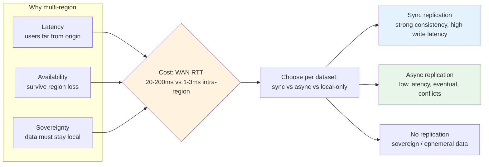
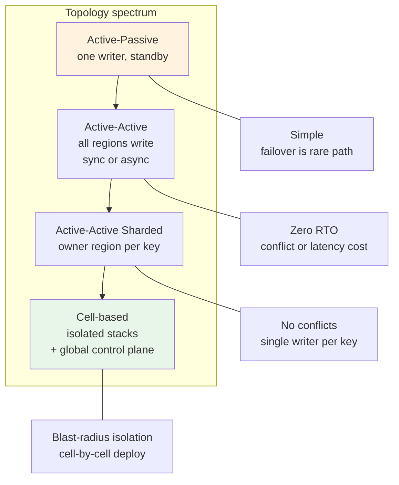
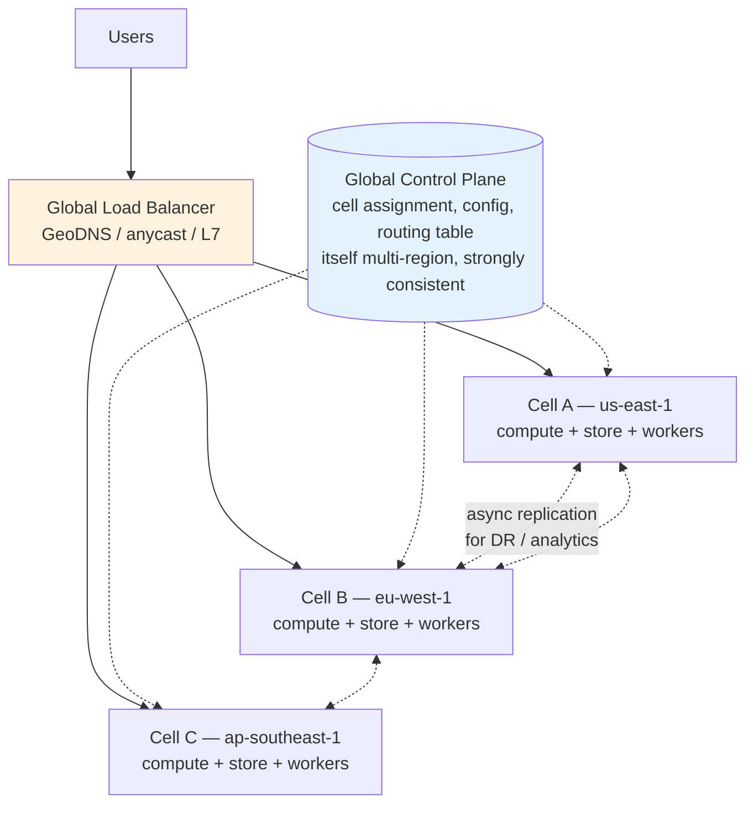
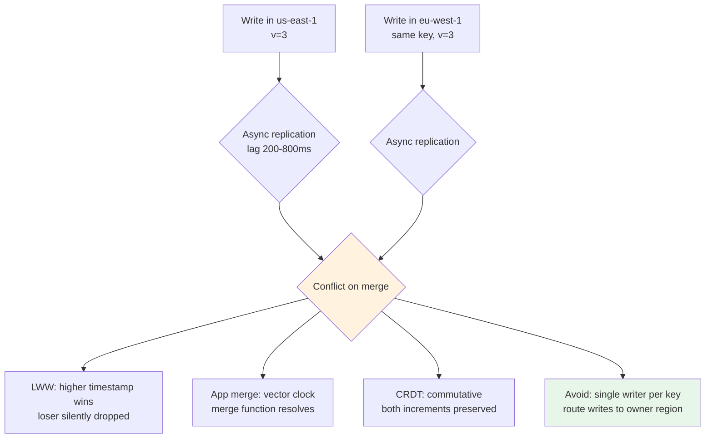
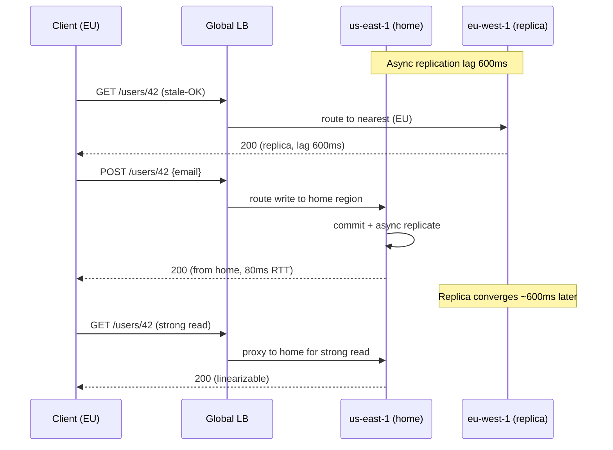

# Chapter 10 — Multi-Region and Geo-Distributed Systems

**What this chapter covers.** Chapters 1–9 built a system that scales within a single region — load balancing, caching, data modeling, and traffic policy that survive data-center failures. A regional system, even a well-run one, still has a single fate domain: a region-wide network partition, a control-plane outage, or a compliance mandate that data stay in-country is enough to take it offline or make it illegal to operate. This chapter moves the failure domain to the planet. We make explicit why teams go multi-region — latency, survival, and sovereignty — and the price they pay: the speed of light is not negotiable, and consistency across a WAN is a choice with a latency tax. We compare deployment topologies on a spectrum from active-passive through active-active to cell-based architectures, show how global traffic is actually steered (GeoDNS, anycast, and global L7 load balancers with health-checked failover) with real Route 53 and GCP configurations, then turn to the hard problem — data. Synchronous cross-region replication buys strong consistency and sells availability and tail latency; asynchronous buys the inverse and forces conflict resolution. We ground that trade-off in production systems — Spanner and CockroachDB for externally consistent SQL, DynamoDB Global Tables and Cassandra for tunable/eventual models, Aurora Global Database for single-writer relational — and in replication machinery you can operate (Postgres logical replication, Kafka MirrorMaker 2). We cover federation patterns (control plane vs. data plane separation, regional cells, data-residency sharding), consistency choices that determine where reads and writes may go, and the operational realities that determine whether a multi-region system actually survives the failure it was built for: deploy coordination, clock discipline, split-brain prevention, and failover drills that avoid thundering herds. The chapter closes with a distributed-systems lens on why multi-region is a CAP/PACELC exercise at 50–200 ms round trips.

Learning goals — after this chapter you should be able to:

- Name the three drivers of multi-region (latency, availability/survival, sovereignty) and quantify the latency budget imposed by the speed of light between common region pairs.
- Compare active-passive, active-active, active-active sharded, and cell-based topologies on write locality, failover RTO/RPO, operational complexity, and blast radius, and choose per workload.
- Configure global traffic steering with Route 53 (latency + failover + health checks), anycast, and GCP Global Load Balancing, and explain failover behavior under partial degradation and DNS caching.
- Decide per dataset between synchronous and asynchronous cross-region replication, name the consistency/latency/availability consequence of each, and select a conflict-resolution strategy (last-write-wins, vector clocks, CRDTs) when async is required.
- Operate multi-region data planes for four reference systems — Spanner/CockroachDB, DynamoDB Global Tables, Aurora Global Database, Cassandra multi-DC — including DDL/replication configuration and failure semantics.
- Design a cell-based architecture and a control-plane/data-plane split that isolates regional failures and supports data-residency constraints, and describe the deploy, observability, and failover-drill machinery that makes it actually work.
- Reason about multi-region through PACELC: what you give up on every write, what you gain on partition, and why read locality and write locality cannot both be optimal.

---

## Why one region is not enough

A single region — three availability zones, redundant power and networking inside one geography — survives a zone failure. It does not survive three classes of reality:

| Driver | What forces it | What breaks without a second region |
|--------|---------------|--------------------------------------|
| **Latency** | Users are global; light in fiber is ~200,000 km/s, so New York → Singapore is ~210 ms RTT before any processing. Interactive SLOs (p99 < 300 ms) are impossible from one origin. | Every distant user pays the RTT; edge caching (Chapter 8) helps reads but not writes. |
| **Survival** | Region-wide events — network backbone cuts, power grid failures, control-plane outages (us-east-1, December 2021, took down DynamoDB, EC2, and the console that operates them). | Total outage; RTO is however long the provider needs to restore the region. |
| **Sovereignty** | GDPR, data-residency laws (Russia FZ-152, China DSL/PIPL, Saudi PDPL), and contractual commitments require data to stay or be servable from a jurisdiction. | Non-compliance; in some markets, inability to operate at all. |

The cost of going multi-region is coordination over a wide-area network. Inside a region, p99 RTT between AZs is 1–3 ms; across regions it is 20–200 ms. That two-order-of-magnitude gap is where consistency, latency, and availability trade-offs live, and where naive "just replicate everything synchronously" designs collapse.



*Figure 10-1: The three drivers and the per-dataset decision they force. Most systems use all three strategies for different datasets in the same architecture.*

> **Boundary note.** Consistency models, linearizability, and consensus (Paxos/Raft) are in Volume 6, Chapters 3–6. Caching and edge delivery are in Chapter 3 and Chapter 8 (this volume). Replication mechanics inside a single region (leader-follower, quorum, WAL shipping) are in Volume 5, Chapter 8. This chapter treats those primitives as building blocks and asks what changes when the replication link is a WAN: latency budgets, conflict resolution at distance, and global traffic steering. Sovereignty as a security/compliance control is referenced here for architecture; the regulatory detail is in Companion Book 8 and Volume 9, Chapter 11. Capacity math for cross-region bandwidth is introduced here and analyzed formally in Volume 14.

---

## Topologies: from passive standby to cells

There is no single "multi-region architecture." There is a spectrum, and the choice is per service and per dataset.

### Active-passive (primary-standby)

One region serves all traffic; a second region has a warm standby that takes over on failure. Writes go to the primary; data is replicated asynchronously (occasionally synchronously for critical metadata).

- **RTO**: minutes (DNS failover + warm-up); **RPO**: seconds to minutes (async lag).
- **Pros**: Simple; no conflicts; strong consistency in the primary.
- **Cons**: Passive region is idle cost; failover is a rare code path that rots; thundering herd when traffic shifts.

Good for: relational primary with Aurora Global Database, control planes that can tolerate minutes of failover, and teams taking their first step multi-region.

### Active-active (multi-primary, shared dataset)

Every region serves reads and writes; each write is visible everywhere. Requires either synchronous replication (Spanner, CockroachDB) or async with conflict resolution (DynamoDB Global Tables, Cassandra).

- **RTO**: zero for surviving regions (no failover — traffic already there); **RPO**: zero if sync, bounded lag if async.
- **Pros**: Lowest latency for nearby writes; no idle capacity.
- **Cons**: Sync path adds 50–150 ms to every write; async path forces application-level conflict handling.

### Active-active sharded (partitioned by locality)

Each region owns a shard — e.g., users homed to their nearest region. Writes for a shard go to its home region (single writer per key); reads are local when possible. Cross-shard operations are rare and explicitly routed.

- **Pros**: No cross-region write latency on the hot path; no conflicts (single writer per key); sovereignty falls out naturally.
- **Cons**: Cross-shard transactions are expensive; re-homing a user is a migration; hot shard imbalance.

This is the dominant pattern for user-facing data at scale (Google, Meta, Uber) and the basis for cells.

### Cell-based architecture

A *cell* is a self-contained regional stack (compute + storage + async workers) that serves a subset of traffic. Cells are replicated across regions, and a global control plane assigns tenants/users to cells. Failure is contained to a cell; rollout is cell-by-cell.



*Figure 10-2: The topology spectrum. Complexity and isolation increase to the right; most mature platforms converge on sharded active-active or cells.*



*Figure 10-3: Cell-based architecture. The control plane (strongly consistent, multi-region) assigns each tenant/key to a cell; data planes are isolated so a cell failure does not cascade. Cross-cell replication is async and limited to DR/analytics — not on the write path.*

The control plane / data plane split is the key insight: the thing that decides *where* traffic goes must itself be strongly consistent and survive a region loss, but it is small and low-write-rate. Data planes can then be simple, regional, and eventually consistent. AWS, Google, and Meta all converge on this shape.

---

## The WAN changes everything: latency budgets and PACELC

The speed of light in fiber caps what any protocol can do. Useful RTTs to internalize:

| Pair | Fiber distance | RTT (typical) | What fits in a 300 ms SLO? |
|------|---------------|---------------|----------------------------|
| us-east-1 ↔ us-west-2 | ~4,000 km | 60–70 ms | One cross-region write + processing |
| us-east-1 ↔ eu-west-1 | ~6,500 km | 70–80 ms | Same |
| us-east-1 ↔ ap-northeast-1 | ~11,000 km | 150–170 ms | Barely one write; reads must be local |
| eu-west-1 ↔ ap-southeast-1 | ~11,000 km | 160–180 ms | Same |
| us-east-1 ↔ ap-southeast-1 | ~16,000 km | 200–230 ms | No cross-region round trip fits without blowing the SLO |

PACELC makes the trade-off precise: **if Partitioned, choose Availability vs. Consistency; Else, choose Latency vs. Consistency.** Across a WAN, "Else" dominates — even without a partition, synchronous replication pays latency on every write.

- **PA/EL** (Spanner, CockroachDB): Consistent when partitioned; consistent (and slower) even when healthy. Every write waits for a cross-region quorum or TrueTime commit wait.
- **PA/EC** (DynamoDB Global Tables, Cassandra): Consistent when partitioned (by being available and eventually consistent); consistent path is *not* taken when healthy — writes are local and replicate async.

Most user-facing systems choose **PA/EC for data-plane writes** (local latency matters) and **PA/EL for the control plane** (correctness matters more than latency, and write rate is low).

---

## Global traffic steering

### DNS-based steering (GeoDNS + health checks)

The oldest mechanism: authoritative DNS returns different answers by client geography and liveness.

```hcl
# Route 53 — latency-based routing with health-checked failover
# Two records for the same name; Route 53 picks the lowest-latency healthy endpoint
resource "aws_route53_record" "api_latency_use1" {
  zone_id = aws_route53_zone.example.zone_id
  name    = "api.example.com"
  type    = "A"
  set_identifier = "use1"
  latency_routing_policy { region = "us-east-1" }

  alias {
    name                   = aws_lb.use1_global.dns_name
    zone_id                = aws_lb.use1_global.zone_id
    evaluate_target_health = true
  }
  health_check_id = aws_route53_health_check.use1.id
}

resource "aws_route53_record" "api_latency_euw1" {
  zone_id = aws_route53_zone.example.zone_id
  name    = "api.example.com"
  type    = "A"
  set_identifier = "euw1"
  latency_routing_policy { region = "eu-west-1" }
  alias {
    name                   = aws_lb.euw1_global.dns_name
    zone_id                = aws_lb.euw1_global.zone_id
    evaluate_target_health = true
  }
  health_check_id = aws_route53_health_check.euw1.id
}

resource "aws_route53_health_check" "use1" {
  type              = "HTTPS"
  fqdn              = "api-us-east-1.example.com"
  port              = 443
  resource_path     = "/healthz"
  failure_threshold = 3
  request_interval  = 10
}
```

```yaml
# Route 53 failover variant — primary + secondary with active-passive semantics
# api.example.com -> primary (us-east-1) when healthy, else secondary (eu-west-1)
# Useful when you cannot serve from both regions for a given dataset.
```

DNS failover is simple and provider-independent, but `TTL` governs failover speed and many resolvers ignore low TTLs. Expect 30–120 s effective failover, not milliseconds.

### Anycast and global L7 load balancers

Anycast announces the same IP from multiple PoPs; BGP routes each client to the nearest healthy PoP. Cloudflare, Google Cloud Global LB, and AWS Global Accelerator use this to steer before DNS is even involved.

```
Client (Berlin)  --BGP-->  nearest PoP (Frankfurt)  --private backbone-->  origin region (eu-west-1)
Client (Tokyo)   --BGP-->  nearest PoP (Tokyo)      --private backbone-->  origin region (ap-northeast-1)
```

Global L7 LBs (GCP Global External LB, Cloudflare, AWS ALB + Global Accelerator) add health checking, failover, and L7 policy at the edge, with failover in seconds and no DNS TTL dependency. The trade-off is provider coupling and that failover policy lives in the provider's control plane — which itself must be multi-region.

### Sticky routing and locality-aware backends

Inside the mesh, locality matters too. Envoy's locality-aware routing keeps requests inside the region/AZ when possible and only spills over when local capacity is degraded.

```yaml
# Envoy — locality weighted load balancing + outlier detection for regional spillover
# Cluster with two localities (us-east-1a, eu-west-1a); Envoy prefers local, fails over.
cluster:
  name: api_upstream
  type: EDS
  eds_cluster_config: { eds_config: { ads: {} } }
  common_lb_config:
    locality_weighted_lb_config: {}
  outlier_detection:
    consecutive_5xx: 5
    interval: 10s
    base_ejection_time: 30s
    max_ejection_percent: 50
  load_assignment:
    endpoints:
      - locality: { region: "us-east-1", zone: "us-east-1a" }
        weight: 100
        lb_endpoints: [{ endpoint: { address: { socket_address: { address: 10.0.1.10, port_value: 8080 }}}}]
      - locality: { region: "eu-west-1", zone: "eu-west-1a" }
        weight: 100
        lb_endpoints: [{ endpoint: { address: { socket_address: { address: 10.1.2.10, port_value: 8080 }}}}]
```

---

## Data replication across the WAN

### The decision per dataset

Not every dataset needs the same guarantee. A mature multi-region system classifies each dataset:

| Dataset | Typical choice | Why |
|---------|---------------|-----|
| User profile, auth, billing | Sync (Spanner/CockroachDB) or sharded single-writer | Strong consistency; losing a write is worse than extra latency |
| Orders, payments | Sync or sharded single-writer per tenant | Correctness over latency |
| Feed, timeline, recommendations | Async (Cassandra/DynamoDB Global Tables) | Eventual is fine; latency matters |
| Analytics, logs, audit | Async (Kafka MM2, Kinesis) | Throughput; replay covers loss |
| Sovereign data (EU PII) | Local-only, no cross-region replication | Compliance boundary |
| Ephemeral (sessions, rate-limit counters) | Local or async best-effort | Loss is tolerable |

The mistake is choosing one replication mode for the whole system.

### Synchronous: Spanner, CockroachDB, Aurora Global Database

**Spanner** (Google) uses TrueTime (GPS + atomic clocks) to assign globally meaningful timestamps and runs Paxos per shard across regions. Writes wait for `commit wait` (~5–10 ms) plus cross-region quorum. Reads are strongly consistent and can be served from the nearest read-only replica without cross-region RTT if they use bounded staleness.

```sql
-- Spanner DDL — multi-region instance + interleaved tables for locality
-- Instance config: nam-eur-asia1 (multi-region, 3 read-write + 3 read-only replicas)
CREATE INSTANCE app_prod
WITH
  CONFIG = "nam-eur-asia1",
  NODES  = 3;

CREATE TABLE Users (
  user_id     STRING(36) NOT NULL,
  home_region STRING(16) NOT NULL,
  email       STRING(320) NOT NULL,
  created_at  TIMESTAMP OPTIONS (allow_commit_timestamp=true),
) PRIMARY KEY (user_id);

CREATE TABLE Orders (
  user_id   STRING(36) NOT NULL,
  order_id  STRING(36) NOT NULL,
  total     NUMERIC NOT NULL,
  status    STRING(16) NOT NULL,
) PRIMARY KEY (user_id, order_id),
  INTERLEAVE IN PARENT Users ON DELETE CASCADE;
-- Interleaving co-locates a user's orders with the user row → single-shard transaction.
```

**CockroachDB** is wire-compatible with Postgres and uses Raft per range. Leaseholder handles reads locally; writes replicate to a quorum.

```sql
-- CockroachDB — multi-region database with survival goals and table locality
CREATE DATABASE app;

ALTER DATABASE app SET PRIMARY REGION "us-east-1";
ALTER DATABASE app ADD REGION "eu-west-1";
ALTER DATABASE app ADD REGION "ap-southeast-1";
ALTER DATABASE app SURVIVE REGION FAILURE;  -- tolerate one region loss

-- Table homed to a region: all leaseholders (and thus low-latency reads/writes) stay there
ALTER TABLE app.users SET LOCALITY REGIONAL BY ROW;
ALTER TABLE app.users ALTER COLUMN crdb_region TYPE STRING DEFAULT "us-east-1";

-- Global table: every region has a replica, strongly consistent
ALTER TABLE app.feature_flags SET LOCALITY GLOBAL;
```

**Aurora Global Database** keeps a single primary region writable; secondaries are read-only with <1 s lag and can be promoted in <1 minute (RPO ~1 s, RTO ~60 s). Good when you need relational strong consistency on writes but can serve reads globally.

```bash
aws rds create-global-cluster \
  --global-cluster-identifier app-global \
  --source-db-cluster-identifier arn:aws:rds:us-east-1:123456789:cluster:app-primary

aws rds create-db-cluster \
  --db-cluster-identifier app-secondary-eu \
  --engine aurora-postgresql --engine-version 15.4 \
  --global-cluster-identifier app-global \
  --region eu-west-1
```

### Asynchronous: DynamoDB Global Tables, Cassandra, Postgres logical, Kafka

**DynamoDB Global Tables** replicate async with last-write-wins (vector-clock-like reconciliation under the hood). Writes are local (<10 ms); replication lag is typically <1 s.

```python
# DynamoDB Global Tables — create + write with version for application-level conflict handling
import boto3

client = boto3.client("dynamodb", region_name="us-east-1")
client.create_global_table(
    GlobalTableName="events",
    ReplicationGroup=[{"RegionName": "us-east-1"}, {"RegionName": "eu-west-1"}],
)

# Write with a conditional version — application resolves conflicts, not just LWW
table = boto3.resource("dynamodb", region_name="us-east-1").Table("events")
table.put_item(
    Item={"pk": "user#42", "sk": "order#99", "status": "placed", "v": 3, "updated_at": "2026-08-20T12:00:00Z"},
    ConditionExpression="attribute_not_exists(v) OR v < :v",
    ExpressionAttributeValues={":v": 3},
)
```

**Cassandra multi-DC** lets each DC have its own replication factor and uses tunable consistency per operation.

```yaml
# cassandra.yaml — multi-DC snitch + replication
endpoint_snitch: GossipingPropertyFileSnitch
# cassandra-rackdc.properties
dc=us-east
rack=rack1

# CQL — keyspace replicated to two DCs, RF 3 each
CREATE KEYSPACE app WITH replication = {
  'class': 'NetworkTopologyStrategy',
  'us-east': '3',
  'eu-west': '3'
};

-- Write local, read local — no WAN on either path; async repair handles divergence
INSERT INTO app.timeline (user_id, post_id, ts) VALUES ('u42', 'p99', toTimestamp(now()));
SELECT * FROM app.timeline WHERE user_id='u42' LIMIT 50; -- LOCAL_QUORUM
```

```yaml
# Kafka MirrorMaker 2 — async topic replication between regional clusters
# Replicates topic `orders` from us-east cluster to eu-west with offset translation.
clusters: us-east, eu-west
us-east.bootstrap.servers: kafka-us-east.example.com:9092
eu-west.bootstrap.servers: kafka-eu-west.example.com:9092

mirrors:
  - source: us-east
    target: eu-west
    topics: "orders, payments.*"
    replication.factor: 3
    sync.group.offsets.enabled: true
    emit.heartbeats.enabled: true
```

**Postgres logical replication** for selective cross-region tables (not whole-cluster physical streaming):

```sql
-- Primary region (us-east-1)
CREATE PUBLICATION app_pub FOR TABLE users, orders;
CREATE ROLE replicator WITH REPLICATION LOGIN PASSWORD '...';

-- Secondary region (eu-west-1)
CREATE SUBSCRIPTION app_sub
  CONNECTION 'host=pg-us-east.example.com dbname=app user=replicator password=...'
  PUBLICATION app_pub
  WITH (copy_data = true, create_slot = true);
-- Lag: SELECT now() - pg_last_xact_replay_timestamp();
```

### Conflict resolution when async is unavoidable

If two regions accept writes to the same key concurrently, replication must reconcile. Options, in order of increasing sophistication:

| Strategy | How it resolves | When to use | Cost |
|----------|----------------|-------------|------|
| **Last-write-wins (LWW)** | Highest timestamp wins; other write is lost | Counters, session state, cache — loss is tolerable | Simple; silent data loss |
| **Version + application merge** | App stores `v` or vector clock; conflict handler merges | Orders, carts — merge is domain-specific | App complexity |
| **CRDTs** | Commutative operations (G-Counter, OR-Set, LWW-Register) converge without coordination | Counters, sets, collaborative state | Limited data types (Vol 6, Ch 11) |
| **Single writer per key** | Shard by owner region — no concurrent writes to same key | User data, tenant data — dominant pattern | Requires routing + re-homing |

The single-writer-per-key rule eliminates conflicts by construction and is why sharded active-active is preferred whenever feasible. Reserve CRDTs/LWW for data where true multi-writer is required.



*Figure 10-4: Conflict resolution options when async replication allows concurrent writes. The cheapest is to avoid the conflict by routing.*

---

## Sharding and placement for the global dataset

For user- or tenant-scoped data, the pattern is: **home region per principal, local reads/writes, async for DR.**

```
user_id --hash--> home_region (us-east-1)
  |
  +--> All writes for user_id route to us-east-1 (single writer)
  +--> Reads from nearest region: if local replica is stale-but-acceptable, serve locally;
  |    if strong read required, proxy to home region.
  +--> Re-homing: copy data, flip routing table atomically (control plane transaction).
```

Key count matters: with millions of principals, consistent hashing spreads load; with thousands of large tenants, explicit assignment with capacity-weighted placement avoids hot regions. Re-homing must be online — double-write, backfill, cutover — and is itself a distributed transaction.

Data residency adds a placement constraint: EU users' rows must have `region = eu-west-1` and must not replicate outside the EU. That is a placement policy enforced in the control plane and in replication filters (e.g., Postgres publication filtered by `WHERE region = 'eu'` or Spanner row-level locality). Audit it.

---

## Operating multi-region: the parts that actually fail

**Deploy coordination.** Deploying to all regions at once couples their failure. Cell-by-cell rollout (one region, bake, next) with automatic rollback on SLO burn is the standard. The control plane that orchestrates deploys must itself be multi-region.

**Clock discipline.** Spanner depends on TrueTime; CockroachDB on `max_offset` (default 500 ms) with clock-offset monitoring; Cassandra on NTP. Monitor `clock_offset` as an SLO — a drifting clock causes lease violations and stale reads.

**Split-brain prevention.** Two regions must not both believe they are primary for the same shard. Use a strongly consistent control plane (Spanner, etcd, or Route 53 health checks with quorum) to elect/assign primaries. Fencing tokens (monotonic epoch per shard) reject stale writers after failover.

**Failover drills and thundering herds.** A failover that has never been exercised will not work. Run quarterly region-evacuation drills (drain, fail over, measure RTO/RPO, fail back). Pre-warm the receiving region (autoscaling, cache, DB connections) — a cold standby that receives 100% of global traffic will collapse. Shed or degrade non-critical traffic during evacuation.

**Observability across regions.** Trace context must propagate across regions (W3C `traceparent` over replication and RPC). Correlate replication lag, error rate, and latency per region pair. Alert on `replication_lag > SLO` before clients notice stale reads.



*Figure 10-5: Read locality vs. write locality. Stale-tolerant reads stay local; writes and strong reads go to the home region. The routing policy is per request, not per service.*

---

## Choosing per workload

| Question | Leads to |
|----------|----------|
| Can you tolerate 60–150 ms extra on every write? | If yes, consider sync (Spanner/CockroachDB). If no, async or sharded single-writer. |
| Is loss of a concurrent write acceptable? | If no, single writer per key — do not rely on LWW. |
| Must data stay in a jurisdiction? | Placement policy + filtered replication; audit the replication path, not just the primary store. |
| What is the real RTO/RPO? | Measure it with drills; DNS TTL, warm-up, and replication lag dominate, not the database's claimed failover. |
| Is the control plane itself multi-region? | If the thing that decides failover is single-region, the system is single-region. |

---

## Distributed-systems lens

Multi-region makes PACELC tangible. Every synchronous write pays latency even when the network is healthy; every async write risks conflict or staleness. There is no topology that gives you single-region latency, strong consistency, and survival of a region — you are choosing which dataset gets which property. The mature answer is to make that choice explicitly, per dataset, and to isolate the strongly consistent sliver (the control plane) so the rest of the system can be fast and eventually consistent. Cells are that isolation made operational: blast radius, deploy, and failure domain all aligned.

---

## Key takeaways

- Multi-region is driven by latency, survival, and sovereignty — each forces a different replication choice, and most systems need all three modes for different datasets.
- The topology spectrum (active-passive → active-active → sharded → cell-based) trades simplicity for isolation; cells with a strongly consistent control plane are the end state for large platforms.
- WAN RTT (20–230 ms) dominates SLOs; PACELC is lived on every write — PA/EL for the control plane, PA/EC for data-plane writes in most user-facing systems.
- Global traffic steering is a stack (anycast/Global LB at L4/L7 plus GeoDNS/latency routing at DNS plus locality-aware mesh inside); DNS TTL and health-check intervals bound failover speed — measure effective RTO, not claimed.
- Data replication is per-dataset: sync (Spanner, CockroachDB, Aurora Global) for correctness-critical data; async (DynamoDB Global Tables, Cassandra, Kafka MM2, Postgres logical) for latency-sensitive data, with explicit conflict resolution; local-only for sovereign/ephemeral data.
- Avoid conflicts by construction with single writer per key (home region per principal); reserve LWW/CRDTs for data where true multi-writer is required.
- Operability determines survival: cell-by-cell deploys, clock-offset SLOs, fencing tokens against split-brain, pre-warmed failover targets, and quarterly region-evacuation drills that measure real RTO/RPO.

## Further reading

- Google Spanner — TrueTime and externally consistent transactions. https://research.google/pubs/pub39966/
- CockroachDB — Multi-region patterns, survival goals, and table localities. https://www.cockroachlabs.com/docs/stable/multiregion-overview
- DynamoDB Global Tables — How it works and conflict handling. https://docs.aws.amazon.com/amazondynamodb/latest/developerguide/GlobalTables.html
- Marc Brooker (AWS) — Cell-based architecture and AZ/region isolation. https://brooker.co.za/blog/2021/12/06/region.html and https://aws.amazon.com/builders-library/static-stability-using-availability-zones/
- AWS Route 53 — Latency-based and failover routing, health checks. https://docs.aws.amazon.com/Route53/latest/DeveloperGuide/routing-policy.html
- Pat Helland — Life beyond distributed transactions (at-most-once, idempotence). https://queue.acm.org/detail.cfm?id=3025012
- Kleppmann — Designing Data-Intensive Applications, Ch. 5 (Replication) and Ch. 8 (Distributed Systems Troubles).
- CRDTs and eventual consistency — see Volume 6, Chapter 11 and Shapiro et al., A comprehensive study of CRDTs. https://arxiv.org/abs/1603.01529
