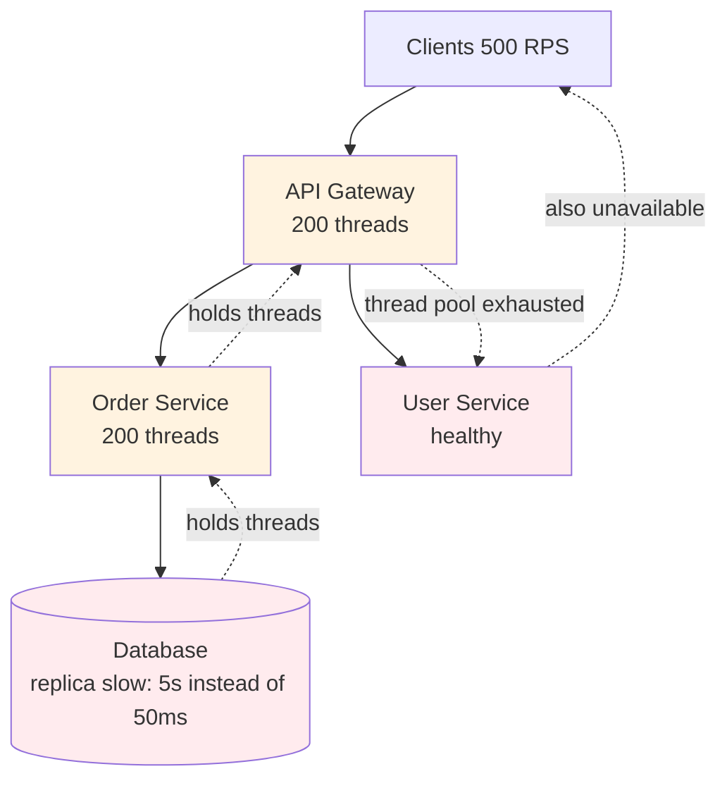
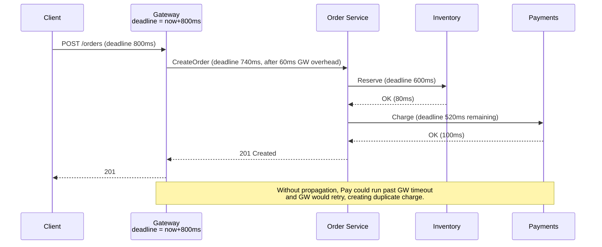
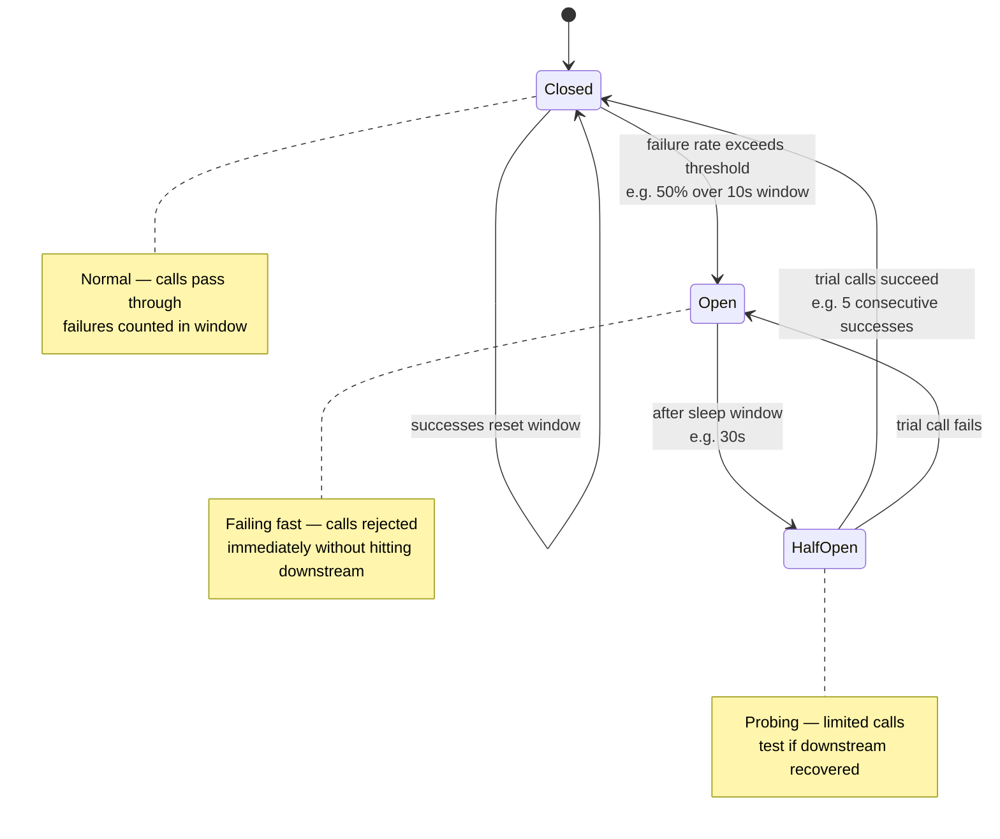
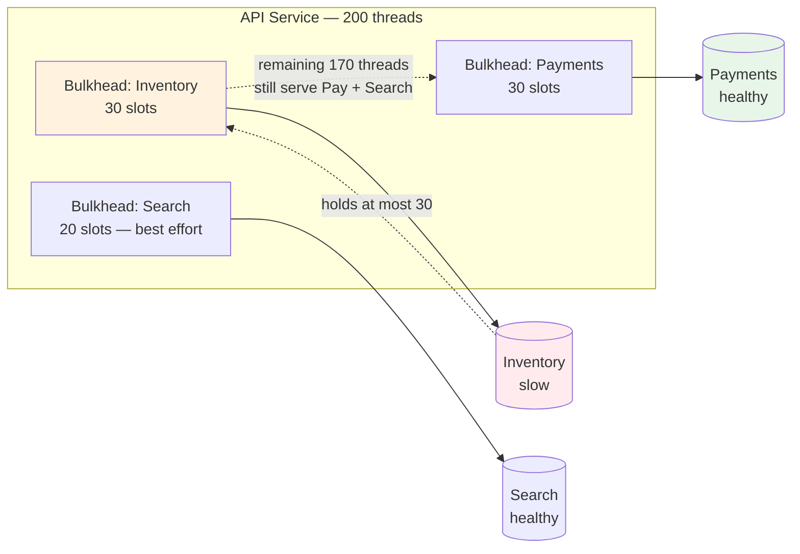

# Chapter 11 — Designing for Failure: Bulkheads, Circuit Breakers, and Load Shedding

**What this chapter covers.** Chapters 1–10 showed how to make a system fast; this chapter makes it survive when fast is not an option. In a fleet of dozens of services, failure is not an exception — it is the steady state: a downstream deploys bad code, a database replica lags, a dependency's p99 triples, a retry storm amplifies a blip into an outage. Without explicit failure design, one slow dependency cascades into every caller, every caller exhausts its threads, and the entire graph collapses — even though most services are healthy. We build the resilience toolkit from first principles: timeouts and deadline propagation that bound waiting, retries with budgets that help without amplifying, hedging that trades duplicate work for tail-latency reduction, bulkheads that partition failure, circuit breakers that stop calling what is already down, and load shedding that chooses *which* work to drop when there is more demand than capacity. Each pattern is made concrete — Go `context` and gRPC deadlines, Resilience4j and Envoy circuit-breaker configuration, bulkhead thread-pool sizing, and priority-aware shedding with real code — and we show how they compose into a coherent posture rather than a pile of knobs. The chapter closes with the distributed-systems lens on why resilience is about bounding blast radius and preserving partial availability, not preventing failure.

Learning goals — after this chapter you should be able to:

- Classify failure modes (fail-stop, fail-slow, overload, partial degradation) and explain why fail-slow is the most dangerous for cascading failures.
- Set timeouts and propagate deadlines correctly across a call graph (Go `context`, gRPC deadline, Envoy `timeout`/`retry`), and explain why timeouts without deadlines still cascade.
- Implement retries with exponential backoff, jitter, idempotency, and a retry budget that prevents amplification, and decide when *not* to retry.
- Implement the circuit-breaker state machine (closed → open → half-open) with Resilience4j/Envoy/istio, tune thresholds, and explain what breaks if the breaker is per-instance vs. per-cluster.
- Apply bulkheads — thread-pool, connection-pool, and semaphore isolation — to partition failure, size them from Little's Law, and avoid the "bulkhead that is just a smaller thread pool" anti-pattern.
- Design load shedding that protects SLOs under overload: priority lanes, shed-at-the-edge, queue-vs-drop, and graceful degradation with feature flags.
- Reason about hedging (hedged requests) and when duplicate work reduces p99 without collapsing the downstream.
- Compose timeouts, retries, breakers, bulkheads, and shedding into a single call-site policy and verify it with fault injection.

---

## Failure is the steady state

A useful taxonomy:

| Mode | What happens | Why it cascades | Example |
|------|-------------|-----------------|---------|
| **Fail-stop** | Process crashes or network partitions; callers get an error quickly | Least dangerous — callers learn fast and can fail over | Pod OOMKilled, AZ network cut |
| **Fail-slow** | Dependency is alive but p99 goes 10–100× (GC pause, lock contention, downstream overload) | Callers block, exhaust threads/connections, become fail-slow themselves | Database replica lag, downstream thread-pool exhaustion |
| **Overload** | Demand exceeds capacity; latency rises, errors climb, retries amplify | Retry storm: 1% error × 3 retries × N callers = 3× load on an already overloaded dependency | Flash sale, scrape loop, thundering herd after failover |
| **Partial degradation** | Subset of shards/regions/replicas unhealthy | Without isolation, unhealthy subset poisons healthy callers that happen to hit it | One Cassandra replica slow, one Kafka partition leader stalled |

Fail-slow is the killer. A dependency that fails fast costs one timeout; a dependency that responds in 5 s instead of 50 ms holds every caller's thread for 5 s. With a 200-thread pool and 100 RPS, 10 concurrent slow calls consume 5% of the pool for 5 s — and the next 500 requests queue behind them. This is *cascading failure*: healthy services become unhealthy because they wait on an unhealthy one.



*Figure 11-1: Cascading failure via fail-slow. A slow replica holds Order Service threads, which hold Gateway threads, which starve even healthy paths (User Service). One slow dependency makes the whole graph unavailable.*

Resilience patterns all answer one question: **how do you bound the blast radius of a slow or failing dependency?**

> **Boundary note.** Wire-level primitives (timeouts, retries, backoff, hedging) at the TCP/HTTP layer are introduced in Volume 3, Chapter 11 — Network Reliability. This chapter treats them as *system-design patterns* composed with bulkheads, breakers, and shedding at service and mesh scale, with sizing, tuning, and interaction. Rate limiting and quotas (backpressure at the edge) are in Chapter 9. Chaos and fault-injection as *operational practice* are in Volume 11, Chapter 8; Jepsen-style correctness testing is in Volume 6, Chapter 12. SLOs and error budgets that define "how much failure is acceptable" are in Volume 11, Chapter 1.

---

## Timeouts and deadline propagation — the first line of defense

A timeout says "do not wait longer than X." A deadline says "this entire causal chain must finish by wall-clock time T." Without deadlines, timeouts compose badly.

Suppose Gateway calls Order (timeout 500 ms), Order calls Inventory (timeout 500 ms) and Payments (timeout 500 ms) sequentially. Gateway's timeout is 1 s, but Order's two calls can take up to 1 s total — Gateway times out while Order is still waiting, and Order's work is wasted (and may have side effects). Worse, retries from Gateway create duplicate work in Order that is still running.

**Deadline propagation** fixes this: Gateway sets `deadline = now + 800 ms` and passes it to Order; Order passes `deadline - elapsed` to each downstream, so the whole tree respects one budget.



*Figure 11-2: Deadline propagation. Each hop forwards the remaining budget so no downstream outlives its caller.*

```go
// Go — deadline propagation via context (server side)
func (s *OrderService) CreateOrder(ctx context.Context, req *CreateOrderRequest) (*Order, error) {
    // ctx already carries the deadline from gRPC (grpc-timeout header).
    // Enforce it on every downstream call; do not use context.Background().
    invCtx, cancel := context.WithTimeout(ctx, 300*time.Millisecond)
    defer cancel()
    if err := s.inventory.Reserve(invCtx, req.Items); err != nil {
        return nil, fmt.Errorf("inventory: %w", err)
    }

    payCtx, cancel2 := context.WithTimeout(ctx, 300*time.Millisecond)
    defer cancel2()
    if err := s.payments.Charge(payCtx, req.Payment); err != nil {
        return nil, fmt.Errorf("payments: %w", err)
    }
    return s.store.Create(ctx, req)
}

// gRPC client — set deadline at the edge
ctx, cancel := context.WithTimeout(context.Background(), 800*time.Millisecond)
defer cancel()
order, err := orderClient.CreateOrder(ctx, req)
```

```yaml
# Envoy — timeout and retry that respects the deadline (x-envoy-expected-rq-timeout-ms)
route_config:
  virtual_hosts:
    - name: api
      routes:
        - match: { prefix: "/orders" }
          route:
            cluster: order_service
            timeout: 0.8s              # hard cap; Envoy cancels upstream after this
            retry_policy:
              retry_on: "5xx,reset,connect-failure"
              num_retries: 2
              per_try_timeout: 0.35s   # each try bounded; total still capped by route timeout
              retry_back_off: { base_interval: 25ms, max_interval: 200ms }
```

Rules:

- **Every outbound call gets a timeout derived from the incoming deadline**, never a fixed constant that ignores it.
- **Use `context` (Go), `Deadline` (gRPC), `timeout` (Envoy/HTTP) — never `context.Background()` on a downstream call.**
- **Timeout < SLO budget / depth of call graph.** If the call graph is 3 deep and the SLO is 500 ms, per-hop timeout cannot be 500 ms.
- **Hedge vs. retry interacts with deadlines** — see Hedging below.

---

## Retries — help that hurts

Retries turn transient failures into successes — and turn overload into collapse if unbounded. Three disciplines:

### 1. Retry only what is safe and likely to succeed

| Retry? | Condition |
|--------|-----------|
| Yes | Idempotent operations, transient errors (`503`, `429` with `Retry-After`, connect failures), safe to duplicate |
| No | Non-idempotent writes without idempotency key, `400`/`422` (client error), `429` without backoff, overloaded downstream (retry amplifies) |

Idempotency keys (Volume 6, Chapter 9; Volume 8, Chapter 6) make retries safe for writes: `Idempotency-Key: <uuid>` + server-side dedup by key.

### 2. Backoff with jitter — de-synchronize the herd

```go
// Exponential backoff with full jitter (decorrelated jitter variant is also common)
func backoff(attempt int) time.Duration {
    const base = 50 * time.Millisecond
    const cap_ = 2 * time.Second
    exp := base * time.Duration(1<<attempt) // 50, 100, 200, 400, ...
    if exp > cap_ {
        exp = cap_
    }
    // Full jitter: random in [0, exp) — prevents synchronized retries
    return time.Duration(rand.Int63n(int64(exp)))
}

// Retry with idempotency key and budget check
func doWithRetry(ctx context.Context, op func(context.Context) error) error {
    var last error
    for attempt := 0; attempt < 3; attempt++ {
        if attempt > 0 {
            select {
            case <-time.After(backoff(attempt)):
            case <-ctx.Done():
                return ctx.Err()
            }
        }
        if err := op(ctx); err == nil {
            return nil
        } else if !isRetryable(err) {
            return err
        } else {
            last = err
        }
        if !retryBudget.Allow() { // see below
            return fmt.Errorf("retry budget exhausted: %w", last)
        }
    }
    return last
}
```

Without jitter, 1,000 clients that fail at the same instant retry at the same instant — a thundering herd that re-overloads the dependency at the exact moment it is recovering.

### 3. Retry budgets — bound amplification

A retry budget caps the fraction of calls that may be retries (typical: 20–30% of total requests). Borrowed from Finagle/Envoy:

```
budget = min(0.2 * total_requests_in_window, max_retries)
```

If 1,000 RPS is flowing and 10% fails, a 20% budget allows 200 retries/s — enough to handle transients, not enough to 3× the load. When the budget is exhausted, fail fast instead of retrying.

```yaml
# Envoy retry budget (circuit-breaker-adjacent)
circuit_breakers:
  thresholds:
    - max_retries: 50          # cap concurrent retries
      retry_budget:
        budget_percent: 20
        min_retry_concurrency: 5
```

---

## Circuit breakers — stop calling what is already down

A circuit breaker wraps a downstream call and tracks its health. Three states:



*Figure 11-3: Circuit-breaker state machine. The breaker fails fast in Open, giving the downstream time to recover and the caller time to shed or fallback.*

Why not just rely on timeouts? A timeout still pays the timeout duration and still sends load to an overloaded dependency. An open breaker rejects in microseconds and sheds load — the downstream gets breathing room, the caller preserves threads.

```java
// Resilience4j — circuit breaker around a downstream call (Java)
CircuitBreakerConfig cfg = CircuitBreakerConfig.custom()
    .failureRateThreshold(50)                 // open if >=50% failures
    .slidingWindowSize(100)                   // over last 100 calls
    .minimumNumberOfCalls(20)                // need 20 calls before evaluating
    .waitDurationInOpenState(Duration.ofSeconds(30))
    .permittedNumberOfCallsInHalfOpenState(5)
    .recordExceptions(IOException.class, TimeoutException.class)
    .ignoreExceptions(BusinessException.class) // don't count 4xx as failure
    .build();

CircuitBreaker cb = CircuitBreaker.of("inventory", cfg);
Supplier<Order> decorated = CircuitBreaker.decorateSupplier(cb, () -> inventory.reserve(items));
Try<Order> result = Try.ofSupplier(decorated)
    .recover(CircuitBreakerOpenException.class, e -> fallbackOrder());

// Metrics — export to Prometheus via Micrometer
// circuitbreaker_calls_total{state="open"} / {state="closed"} / {state="half_open"}
```

```yaml
# Envoy — outlier detection as a distributed circuit breaker (per-host ejection)
outlier_detection:
  consecutive_5xx: 5
  interval: 10s
  base_ejection_time: 30s
  max_ejection_percent: 50
  failure_percentage_threshold: 50
  enforcing_consecutive_5xx: 100
  enforcing_failure_percentage: 100

# Istio DestinationRule — circuit breaker at mesh level
apiVersion: networking.istio.io/v1beta1
kind: DestinationRule
metadata: { name: inventory-breaker }
spec:
  host: inventory.default.svc.cluster.local
  trafficPolicy:
    outlierDetection:
      consecutive5xxErrors: 5
      interval: 10s
      baseEjectionTime: 30s
      maxEjectionPercent: 50
    connectionPool:
      tcp: { maxConnections: 200 }
      http: { http1MaxPendingRequests: 100, maxRequestsPerConnection: 10 }
```

Tuning guidance:

- **Window size** must be large enough to distinguish noise from failure (100 calls), small enough to react quickly (10 s).
- **Half-open probe count** low (3–5) — a recovering downstream should not be hit by full traffic.
- **Per-instance vs. per-cluster breaker**: local breakers trip independently (one slow pod does not open the breaker for all pods); cluster breakers (Envoy outlier detection) are needed when the downstream is a shared database. Use both: local breaker for thread protection, outlier ejection for host-level isolation.
- **Do not count business errors** (4xx, validation) as failures — they indicate caller bugs, not downstream health.

---

## Bulkheads — partition failure

A bulkhead isolates failure to a compartment. Two forms:

### Thread-pool / semaphore bulkheads

Give each downstream its own concurrency limit so a slow dependency cannot consume the caller's entire pool.

```java
// Resilience4j — bulkhead (semaphore) per downstream
BulkheadConfig bhCfg = BulkheadConfig.custom()
    .maxConcurrentCalls(30)          // at most 30 concurrent calls to inventory
    .maxWaitDuration(Duration.ofMillis(50)) // queue briefly, then reject
    .build();
Bulkhead inventoryBulkhead = Bulkhead.of("inventory", bhCfg);

// Compose with breaker: bulkhead -> breaker -> call
Supplier<Order> guarded = Bulkhead.decorateSupplier(inventoryBulkhead,
    CircuitBreaker.decorateSupplier(cb, () -> inventory.reserve(items)));
```

```go
// Go — semaphore bulkhead via weighted semaphore + context
var invSem = semaphore.NewWeighted(30)

func callInventory(ctx context.Context, req any) error {
    if err := invSem.Acquire(ctx, 1); err != nil {
        return fmt.Errorf("inventory bulkhead full: %w", err)
    }
    defer invSem.Release(1)
    return inventory.Reserve(ctx, req)
}
```

Sizing from Little's Law: `concurrency = throughput × latency`. If Inventory handles 100 RPS at p50 50 ms, steady-state concurrency is 5. A bulkhead of 30 allows 6× burst and bounds the blast radius to 30 threads. Size per downstream from its SLO, not from the caller's pool size.

### Connection-pool bulkheads

Separate pools per downstream (or per criticality tier) so a slow downstream does not exhaust the shared HTTP client.

```yaml
# Envoy — connection pool per cluster is already a bulkhead
clusters:
  - name: inventory
    connect_timeout: 0.25s
    circuit_breakers:
      thresholds: [{ max_connections: 100, max_pending_requests: 50, max_requests: 200 }]
  - name: payments   # separate pool — inventory slowness cannot exhaust payments connections
    connect_timeout: 0.25s
    circuit_breakers:
      thresholds: [{ max_connections: 100, max_pending_requests: 50, max_requests: 200 }]
```

The anti-pattern: creating one bulkhead for "all external calls" — that is just a smaller global pool, not isolation. Bulkheads must be per dependency and per criticality.



*Figure 11-4: Bulkheads partition the caller's concurrency. Inventory slowness can at most consume 30 slots; Payments and Search remain available.*

---

## Load shedding — choose what to drop

When demand exceeds capacity, every system sheds load — the question is whether it does so deliberately or by collapsing. Shedding is admission control at the server.

### Where to shed

| Layer | Mechanism | Granularity |
|-------|-----------|-------------|
| **Edge / Gateway** | Envoy `circuit_breakers.max_requests`, token-bucket admission | Per-route, per-tenant — best place to shed (closest to client, cheapest) |
| **Service** | Priority lanes, queue + drop, concurrency caps | Per-handler, per-priority |
| **Downstream** | DB `max_connections`, queue depth, backpressure signals | Coarse — already too late if shedding here |

Shed as early as possible. A request rejected at the gateway costs microseconds; a request that traverses three services before being rejected at the database costs milliseconds and holds resources in every hop.

### Priority lanes

Not all requests are equal. Interactive reads > writes > batch/backfill > health checks that are not readiness probes.

```go
// Priority-aware handler — shed low priority first under load
type Priority int

const (
    PrioInteractive Priority = iota // never shed until last
    PrioWrite
    PrioBatch                       // shed first
)

var (
    inflight   = make(map[Priority]*int32)
    limits     = map[Priority]int32{PrioInteractive: 100, PrioWrite: 80, PrioBatch: 20}
)

func handle(w http.ResponseWriter, r *http.Request) {
    prio := priorityOf(r) // from header / route / tenant tier
    n := inflight[prio]
    if atomic.AddInt32(n, 1) > limits[prio] {
        atomic.AddInt32(n, -1)
        // Shed low priority first: if batch is full, try shedding batch to admit interactive
        if prio == PrioInteractive && tryShedBatch() {
            // admitted by shedding batch
        } else {
            http.Error(w, "overloaded", http.StatusServiceUnavailable)
            w.Header().Set("Retry-After", "1")
            return
        }
    }
    defer atomic.AddInt32(n, -1)
    serve(w, r)
}
```

```yaml
# Envoy — priority routing + circuit breakers per priority
# High-priority cluster gets higher caps
clusters:
  - name: api_high
    circuit_breakers: { thresholds: [{ max_requests: 500 }] }
  - name: api_low
    circuit_breakers: { thresholds: [{ max_requests: 50 }] }

# Gateway sheds low-priority cluster first via rate limit / concurrency cap
```

### Queue vs. drop

| Strategy | Behavior | When to use |
|----------|----------|-------------|
| **Drop (fail fast)** | Reject immediately with `503`/`429` + `Retry-After` | Interactive path — caller can retry or fallback; queuing would blow latency SLO |
| **Bounded queue** | Buffer briefly (50–200 ms) then drop | Short bursts where a small queue absorbs jitter without violating SLO |
| **Unbounded queue** | Never — queue grows until OOM or latency is minutes | Never in production |

Graceful degradation composes with shedding: when shedding, serve a degraded response (cached, stale, partial) rather than an error where possible. Degradation is a product decision — "show stale feed with a banner" vs. "show error" — but the mechanism is a feature flag / fallback branch.

```go
func getFeed(ctx context.Context, userID string) (*Feed, error) {
    feed, err := feedService.Get(ctx, userID)
    if err != nil {
        if errors.Is(err, ErrOverloaded) || errors.Is(err, ErrCircuitOpen) {
            // Degrade: serve stale cached feed rather than error
            if cached := cache.Get("feed:" + userID); cached != nil {
                return cached, nil // caller adds Degraded: true header
            }
        }
        return nil, err
    }
    return feed, nil
}
```

---

## Hedging — duplicate work to cut tail latency

A hedged request sends the same RPC to two replicas (or retries quickly to a second replica) and takes the first response, cancelling the other. It trades extra load for lower p99.

```go
// Hedged request — send to replica 2 if replica 1 hasn't responded in hedgeDelay
func hedgedGet(ctx context.Context, key string) (Value, error) {
    const hedgeDelay = 30 * time.Millisecond // p90 of the downstream
    ctx1, cancel1 := context.WithCancel(ctx)
    defer cancel1()

    type result struct { v Value; err error }
    ch := make(chan result, 2)

    go func() { v, err := replica1.Get(ctx1, key); ch <- result{v, err} }()

    select {
    case r := <-ch:
        return r.v, r.err // first replica won
    case <-time.After(hedgeDelay):
        // Hedged call to second replica
        ctx2, cancel2 := context.WithCancel(ctx)
        defer cancel2()
        go func() { v, err := replica2.Get(ctx2, key); ch <- result{v, err} }()

        r := <-ch // first of the two to respond
        // The slower goroutine's context is cancelled when we return
        return r.v, r.err
    case <-ctx.Done():
        return nil, ctx.Err()
    }
}
```

Hedging helps when downstream p99 >> p50 (GC pauses, noisy neighbor) and hurts when the downstream is overloaded — duplicate requests increase load. Guard hedging with the same budget as retries, and only hedge idempotent reads.

---

## Composing the policy — a call-site template

A single outbound call should compose all patterns in order:

```
incoming deadline
  → bulkhead (admit? else 503)
    → breaker (open? else fail fast)
      → timeout (per-try, derived from deadline)
        → retry/hedge (bounded by budget, only idempotent)
          → actual RPC
        ← fallback / degrade on failure
```

```go
// Composed call site — bulkhead + breaker + timeout + retry + fallback
func getInventory(ctx context.Context, items []Item) (*Reservation, error) {
    // Bulkhead
    if err := invSem.Acquire(ctx, 1); err != nil {
        return fallbackReservation(items)
    }
    defer invSem.Release(1)

    // Breaker
    if !invBreaker.Allow() {
        return fallbackReservation(items)
    }

    var res *Reservation
    err := retry.Do(ctx, func(ctx context.Context) error {
        // Per-try timeout derived from incoming deadline
        tryCtx, cancel := context.WithTimeout(ctx, 200*time.Millisecond)
        defer cancel()
        var err error
        res, err = inventoryClient.Reserve(tryCtx, items)
        return err
    }, retry.WithBudget(retryBudget), retry.RetryIf(isRetryable))

    if err != nil {
        invBreaker.RecordFailure()
        return fallbackReservation(items)
    }
    invBreaker.RecordSuccess()
    return res, nil
}
```

```yaml
# Envoy — same composition declaratively
clusters:
  - name: inventory
    connect_timeout: 0.2s
    circuit_breakers:
      thresholds: [{ max_connections: 100, max_pending_requests: 50, max_requests: 200, max_retries: 20 }]
    outlier_detection: { consecutive_5xx: 5, interval: 10s, base_ejection_time: 30s, max_ejection_percent: 50 }
    common_http_protocol_options: { idle_timeout: 60s }
routes:
  - match: { prefix: "/orders" }
    route:
      cluster: inventory
      timeout: 0.6s
      retry_policy: { retry_on: "5xx,reset", num_retries: 2, per_try_timeout: 0.25s }
```

---

## Verifying resilience — fault injection

A resilience policy that has never been exercised is a hypothesis. Verify continuously:

- **Unit / integration**: inject latency (`tc qdisc`), errors (proxy that returns 503), and slow downstream (sleep) in tests; assert breaker opens, bulkhead rejects, fallback serves.
- **Staging chaos**: latency injection at the mesh (Istio `fault.delay`, Envoy `fault` filter), pod kills, partition via `iptables`.
- **Production**: controlled fault injection (Chaos Mesh, Litmus, AWS FIS) behind feature flags, during business hours, with automatic rollback on SLO burn — see Volume 11, Chapter 8.

```yaml
# Istio — fault injection for resilience testing (staging)
apiVersion: networking.istio.io/v1beta1
kind: VirtualService
metadata: { name: inventory-fault }
spec:
  hosts: [inventory.default.svc.cluster.local]
  http:
    - fault:
        delay: { percentage: { value: 5 }, fixedDelay: 2s } # 5% of requests delayed 2s
        abort: { percentage: { value: 1 }, httpStatus: 503 }
      route: [{ destination: { host: inventory.default.svc.cluster.local } }]
```

---

## Distributed-systems lens

Resilience is not "make failures go away" — it is "make failures local and partial." Timeouts bound waiting; breakers bound calling; bulkheads bound sharing; shedding bounds demand. Together they turn a graph where one slow node makes all nodes slow into a graph where one slow node makes only its callers degrade, and only for the blast radius you chose. The price is deliberate: some requests are rejected or degraded that could have succeeded if you had waited longer. That is the availability/consistency/latency trade-off made operational — preferring partial availability and bounded latency over unbounded waiting for strong consistency.

---

## Key takeaways

- Fail-slow is the most dangerous mode — it cascades by holding threads/connections; fail-stop is cheap by comparison. Design for fail-slow.
- Always propagate deadlines — a timeout without a deadline that covers the whole causal chain still cascades and wastes work; derive per-hop timeouts from the incoming deadline.
- Retry only idempotent operations with exponential backoff + jitter and a retry budget (20–30%) that bounds amplification; otherwise fail fast.
- Circuit breakers (closed/open/half-open) fail fast in microseconds and give overloaded downstreams breathing room; tune window size, half-open probes, and per-instance vs. per-cluster scope separately.
- Bulkheads partition concurrency per downstream (and per criticality) — size from Little's Law, not from the caller's pool; one shared bulkhead is not a bulkhead.
- Shed load at the edge, by priority (interactive > write > batch), with explicit queue-vs-drop policy and `Retry-After`; degrade to cached/stale responses where product allows.
- Hedging trades duplicate load for lower p99 — only for idempotent reads, guarded by a budget, with hedge delay ≈ p90.
- Compose at the call site (bulkhead → breaker → timeout → retry/hedge → fallback) and verify with fault injection from unit test through production chaos.

## Further reading

- Nygard — Release It! (2nd ed.), Stability patterns (Circuit Breaker, Bulkhead, Timeout).
- Netflix — Hystrix (historical) and resilience4j docs. https://resilience4j.readme.io/
- Envoy — Circuit breaking, outlier detection, retry budgets, fault injection. https://www.envoyproxy.io/docs/envoy/latest/configuration/http/http_filters/fault_filter
- Google SRE Book — Handling overload, load shedding, cascading failure. https://sre.google/sre-book/handling-overload/
- Finagle — Retry budgets and hedging. https://twitter.github.io/finagle/guide/Resilience.html
- Brooker et al. — Timeout and retry guidance (AWS Builders' Library). https://aws.amazon.com/builders-library/timeouts-retries-and-backoff-with-jitter/
- Volume 3, Chapter 11 — Network reliability primitives; Volume 11, Chapters 1 and 8 — SLOs and chaos engineering.
