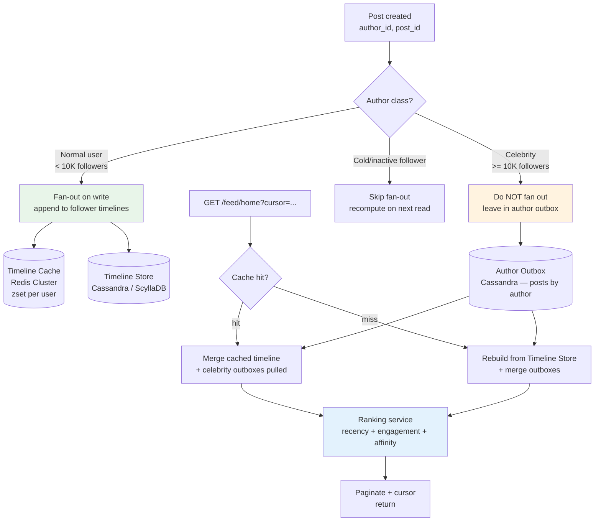
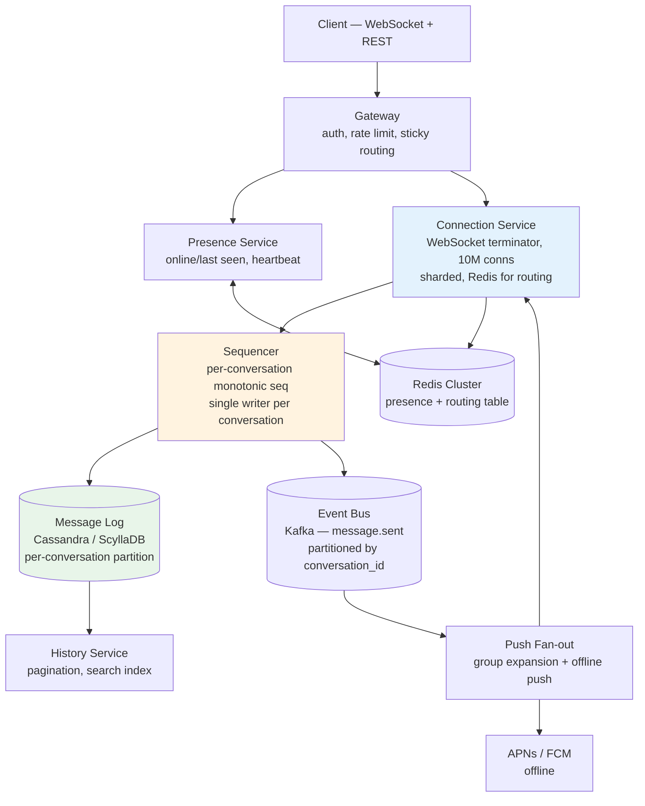
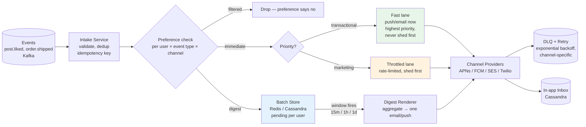
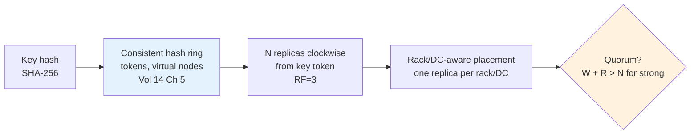
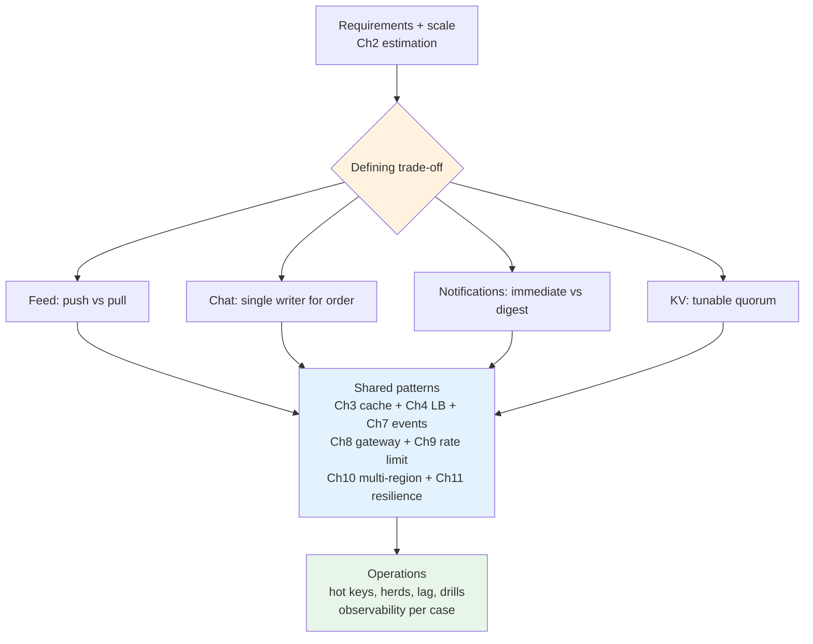

# Chapter 12 — Design Case Studies: Feed, Chat, Notifications, and a Global KV Store

**What this chapter covers.** Chapters 1–11 built the system-design vocabulary — scaling principles, estimation, caching, traffic management, data modeling, service decomposition, events, gateways, rate limiting, multi-region, and resilience. This chapter uses that vocabulary to design four systems that appear in almost every senior backend interview and, more importantly, in almost every large product. Each case is treated as a real build, not a whiteboard sketch: requirements with scale numbers, the trade-off that defines the architecture, a concrete component design with real configuration and code, storage and streaming choices with failure semantics, and the operational realities that determine whether the design survives contact with production. The four are chosen to cover the design space: **Feed** (read-heavy fan-out and ranking), **Chat** (real-time messaging with ordering and presence), **Notifications** (fan-out to heterogeneous channels with preferences and batching), and **Global KV** (the storage substrate that the other three could be built on). Together they exercise every pattern from the volume and show how the same primitives compose into very different systems when the requirements shift.

Learning goals — after this chapter you should be able to:

- Design a social feed that serves personalized, ranked timelines at 300M DAU / 100K RPS, compare fan-out-on-write vs. fan-out-on-read vs. hybrid on cost and tail latency, and choose per user class (normal, celebrity, cold).
- Design a 1:1 and group chat system with presence, typing indicators, and ordered, exactly-once delivery over WebSockets, with message storage, pagination, and multi-device sync that does not lose or duplicate messages.
- Design a notification platform that fans out events to push, email, and SMS with per-user preferences, batching/digest, priority lanes, rate limits, and idempotent delivery, and explain where it sheds or degrades under overload.
- Design a globally distributed key-value store with tunable consistency, consistent hashing, quorum replication, hinted handoff, and cross-region replication, and explain the CAP/PACELC trade-off per operation.
- Apply estimation (Chapter 2), caching (Chapter 3), traffic management (Chapter 4), data modeling (Chapter 5), events (Chapter 7), gateways/edge (Chapter 8), rate limiting (Chapter 9), multi-region (Chapter 10), and resilience (Chapter 11) inside each case, naming which pattern dominates where.
- Name the failure mode of each case (hot celebrity, thundering herd on reconnect, notification storm, ring imbalance) and the mitigation that bounds it.

---

## How to read these cases

Each case follows the same shape so you can compare them:

1. **Requirements and scale** — functional/invariants and back-of-envelope numbers.
2. **The defining trade-off** — the one decision that shapes the architecture.
3. **Architecture and data flow** — components, storage, streaming, and a Mermaid diagram.
4. **Deep dive** — the hard part (ranking, ordering, batching, consistency) with real config/code.
5. **Failure and operations** — what breaks at scale and how it is bounded.

A note on numbers: every scale estimate states its assumptions. Change the assumptions and the design may change — that is the point of Chapter 2's estimation discipline.

> **Boundary note.** These cases are *system-design compositions* of primitives defined elsewhere. Algorithmic depth (consistent hashing, probabilistic structures, scheduling) is in Volume 14. Queue/log/stream internals and delivery semantics are in Volume 10. Database engine internals are in Volume 5. Distributed-systems theory (consistency, consensus, quorums) is in Volume 6. This chapter shows how to *compose* those primitives into product systems and where to look up the mechanism underneath.

---

## Case 1 — Feed: the timeline problem

### Requirements and scale

Functional: users follow other users/topics; each user has a personalized home timeline (ranked) and a profile timeline (chronological); posts contain text, media refs, and engagement counts (likes, reposts, replies); clients paginate with cursor; edits/deletes propagate; ranking considers recency, engagement, and affinity.

Non-functional: 300M DAU, 500M posts/day, average 200 follows per user, p99 home-timeline read < 200 ms, write (post) p99 < 500 ms, available during AZ/region loss, strong enough consistency that a user sees their own post immediately (read-your-writes) but followers may see it within seconds.

| Quantity | Assumption | Result |
|----------|-----------|--------|
| Writes | 500M posts/day | ~5.8K posts/s avg, ~25K peak |
| Fan-out work (naive) | 200 followers/post | ~1.16M timeline inserts/s avg, ~5M peak |
| Reads | 300M users × 20 timeline reads/day | ~70K reads/s avg, ~200K peak |
| Read:write | ~12:1 | Read-heavy — cache and precomputation dominate |
| Storage (post) | 1 KB metadata + media refs | ~500 GB/day, ~180 TB/year before replication |

### The defining trade-off: fan-out on write vs. on read

| Strategy | Write path | Read path | Cost | Tail latency | When it wins |
|----------|-----------|-----------|------|-------------|-------------|
| **Fan-out on write (push)** | On post, append post ID to each follower's timeline (materialized) | Read pre-materialized timeline — O(1) | Write amplification 200× avg | Low, bounded | Read-heavy, normal users |
| **Fan-out on read (pull)** | Write only to author's outbox | On read, merge outboxes of all followees, rank, paginate | No write amplification | High, fan-in over 200 outboxes + ranking per read | Write-heavy celebrities, cold users |
| **Hybrid** | Push to active followers; pull for celebrities + inactive | Push path for most, pull/merge for the long tail | Balanced | Bounded with fallback | Production default |

Pure push collapses on celebrities (a 100M-follower account would require 100M inserts per post, 100M × 25K peaks is impossible). Pure pull collapses on reads (merging 200 outboxes per read at 200K RPS is 40M outbox reads/s). Every real feed is hybrid.



*Figure 12-1: Hybrid fan-out. Normal posts are pushed; celebrity posts are pulled at read time. Ranking merges both sources.*

### Architecture and data flow

```
Client -> Gateway (auth, rate limit) -> Feed Service -> [Timeline Cache -> Timeline Store]
                                        |                \
                                        +-> Post Service -> Outbox (Cassandra) -> Kafka (post.created)
                                        +-> Social Graph (follows) -> cache (Redis) + store (Cassandra/MySQL)
                                        +-> Ranking Service (feature store + model)
                                        +-> Fan-out Workers (consume post.created, write timelines)
                                        +-> Media Service (object store refs)
```

The write path is event-driven (Chapter 7): Post Service appends to Outbox + emits `post.created` via transactional outbox (Debezium or dual-write with outbox table); Fan-out Workers consume and write timelines asynchronously so post latency is not coupled to fan-out duration.

### Deep dive

**Timeline storage — two layers:**

```sql
-- Cassandra — timeline store (materialized per-user timeline, time-ordered)
CREATE TABLE timelines (
  user_id   uuid,
  posted_at timeuuid,        -- time-ordered clustering key
  post_id   uuid,
  author_id uuid,
  PRIMARY KEY (user_id, posted_at)
) WITH CLUSTERING ORDER BY (posted_at DESC)
  AND compaction = {'class': 'LeveledCompactionStrategy'};

-- Outbox — posts by author (source of truth for pull path)
CREATE TABLE posts_by_author (
  author_id uuid,
  posted_at timeuuid,
  post_id   uuid,
  body      text,
  media_ids list<uuid>,
  PRIMARY KEY (author_id, posted_at)
) WITH CLUSTERING ORDER BY (posted_at DESC);

-- Social graph — follows (with cache in front)
CREATE TABLE follows (
  follower_id uuid,
  followee_id uuid,
  created_at  timestamp,
  PRIMARY KEY (follower_id, followee_id)
);
```

```bash
# Redis Cluster — hot timeline cache (zset per user, trimmed to 800 entries)
# ZADD timeline:{user_id} {timestamp} {post_id}
# ZREVRANGE timeline:{user_id} {cursor} {cursor+page_size-1}
# Celebrity outboxes are NOT cached here — merged at read time.

# Fan-out worker (Go, pseudo) — push to active followers only
func onPostCreated(ev PostCreated) {
    followers := graph.Followers(ev.AuthorID)           // cached, paginated
    active := filterActive(followers)                   // last_active < 7d
    if len(active) > 10000 { active = active[:10000] } // cap; rest via pull
    pipe := redis.Pipeline()
    for _, uid := range active {
        pipe.ZAdd(ctx, "timeline:"+uid, redis.Z{Score: float64(ev.PostedAt.UnixNano()), Member: ev.PostID})
        pipe.ZRemRangeByRank(ctx, "timeline:"+uid, 0, -801) // trim
        // async persist to Cassandra in batch
    }
    pipe.Exec(ctx)
}
```

**Ranking at read time** merges the cached timeline with celebrity outboxes, scores, and paginates. Scoring is a separate service so the feed path does not block on ML inference — precomputed features (affinity, engagement) are in a feature store (Redis/Feast), and the model is a lightweight ranker (logistic regression or two-tower) — heavy models run offline to update features.

```go
// Read path — merge + rank + paginate (simplified)
func GetHomeTimeline(ctx context.Context, userID string, cursor string, n int) ([]Post, string, error) {
    // 1. Followees partitioned into pushed vs pulled
    followees := graph.Followees(userID)
    celebs, normal := partitionByFollowerCount(followees)

    // 2. Pushed timeline (cache → store fallback)
    ids, nextCursor, err := timelineCache.Get(ctx, userID, cursor, n*2) // over-fetch for merge
    if err != nil { ids, nextCursor, err = timelineStore.Get(ctx, userID, cursor, n*2) }

    // 3. Pull celebrity outboxes (parallel, bounded)
    celebPosts := pullOutboxes(ctx, celebs, 50) // cap: at most 50 celeb posts merged

    // 4. Merge, rank, paginate
    merged := mergeByTime(ids, celebPosts)
    scored := ranking.Score(ctx, userID, merged) // feature store lookup + model
    page := scored[:min(n, len(scored))]
    posts := postStore.Hydrate(ctx, page) // batch get post bodies
    return posts, nextCursor, nil
}
```

```yaml
# Kafka — post.created topic (log, partitioned by author_id for ordering per author)
# Replication factor 3, acks=all, compaction not needed (retention 7d)
topic: post.created
  partitions: 256
  replication.factor: 3
  min.insync.replicas: 2
  retention.ms: 604800000
producer:
  acks: all
  enable.idempotence: true
  max.in.flight.requests.per.connection: 5
```

**Pagination** uses `timeuuid` cursor (opaque, stable across ranking changes is hard — most feeds re-rank per page and accept that insertion order may shift; cursor encodes `posted_at` of last item + rank offset).

**Consistency:** read-your-writes via cache-aside on post: after `POST /posts`, the author's timeline cache is updated synchronously before `201` returns, so the author sees their post on next `GET`. Followers converge within fan-out lag (typically 200 ms–2 s; celebrity pull path is immediate).

### Failure and operations

| Failure | Mitigation |
|---------|-----------|
| Hot celebrity (100M followers) | Never fan out — pull path + per-celebrity outbox cache with short TTL; rate-limit celebrity post frequency |
| Fan-out lag (Kafka/worker backlog) | Monitor `consumer_lag`; autoscale workers; shed fan-out to inactive users first (Chapter 11 priority lanes) |
| Cache stampede on miss | Single-flight rebuild + jittered TTL; stale-while-revalidate (serve stale cache while async rebuild runs) |
| Ranking service slow | Bulkhead (Chapter 11) — ranking has its own pool; degrade to chronological merge if ranker times out |
| Cassandra hot partition (celebrity outbox) | Outbox is read-heavy but sharded by author; celebrity outbox gets a dedicated cache layer (Redis replica) |

---

## Case 2 — Chat: real-time messaging

### Requirements and scale

Functional: 1:1 and group chat (up to 500 members), message ordering per conversation, exactly-once delivery (no loss, no duplicates visible), typing indicators, presence (online/last seen), read receipts, multi-device sync, message edits/deletes, media attachments, search.

Non-functional: 50M DAU, 1B messages/day (~12K msgs/s avg, 60K peak), p99 send-to-delivery < 150 ms intra-region, < 300 ms cross-region, ordered per conversation, 99.99% delivery (loss only on explicit client failure), works through reconnects.

| Quantity | Assumption | Result |
|----------|-----------|--------|
| Messages | 1B/day, avg 200 bytes payload | ~200 GB/day payload, ~1 TB/day with metadata/index |
| Connections | 50M DAU, 20% concurrent | 10M concurrent WebSockets |
| Groups | 10% of conversations are groups, avg 20 members | Fan-out 20× on group send |
| Storage | Per-conversation log, 1-year retention hot | ~365 TB/year (before replication) — tier to cold store |

### The defining trade-off: ordering and delivery vs. availability

Chat needs per-conversation total order and at-least-once delivery with client-visible exactly-once (dedup). Strong cross-region ordering would require synchronous replication on every send — too slow. The standard choice: **single writer per conversation** (homed to a region or partition leader) gives total order without global sync; cross-region is async with ordering preserved per conversation via sequence numbers. Availability is per-conversation, not global — a partition affects only conversations homed to the partitioned region.



*Figure 12-2: Chat architecture. Single-writer sequencer gives per-conversation order; connection service shards WebSockets and routes via a presence/routing table.*

### Architecture and data flow

**Send path (ordered, exactly-once):**

```
Client --WebSocket--> Conn Service --gRPC--> Sequencer (per-conversation leader)
  Sequencer assigns seq = max_seq+1, writes to Cassandra (QUORUM), publishes to Kafka
  -> Fan-out: for each member, route to Conn shard holding their WebSocket (via Redis routing table)
  -> If member offline, enqueue offline push (APNs/FCM) + leave in log for sync on reconnect
```

**Why single writer per conversation:** without it, two concurrent sends to the same group from different regions would need distributed consensus per message. With it, order is local (one Raft/Kafka partition leader or one DB LWW per conversation) and replication is async.

### Deep dive

**Message storage — per-conversation ordered log:**

```sql
-- Cassandra — messages per conversation, clustered by sequence number
CREATE TABLE messages (
  conversation_id uuid,
  seq             bigint,           -- monotonic per conversation, assigned by sequencer
  message_id      uuid,             -- client-generated idempotency key
  sender_id       uuid,
  body            text,
  media_ids       list<uuid>,
  edited_at       timestamp,
  deleted         boolean,
  created_at      timeuuid,
  PRIMARY KEY (conversation_id, seq)
) WITH CLUSTERING ORDER BY (seq ASC);

-- Idempotency — dedup by (conversation_id, message_id) before assigning seq
CREATE TABLE message_ids (
  conversation_id uuid,
  message_id      uuid,
  seq             bigint,
  PRIMARY KEY ((conversation_id, message_id))
) USING ...; -- lightweight transaction (CAS) or separate dedup store (Redis SETNX)

-- Inbox per user for multi-device sync (materialized)
CREATE TABLE inbox (
  user_id         uuid,
  conversation_id uuid,
  last_read_seq   bigint,
  last_seq        bigint,
  PRIMARY KEY (user_id, conversation_id)
);
```

```go
// Sequencer — single writer per conversation (sharded by conversation_id hash)
func (s *Sequencer) Send(ctx context.Context, convID, msgID string, body string) (int64, error) {
    // Idempotency: if msgID already sequenced, return existing seq (exactly-once visible)
    if seq, ok := s.dedup.Get(convID, msgID); ok {
        return seq, nil
    }
    // Assign next seq under per-conversation lock (or via Kafka partition leader / Raft)
    s.mu.Lock(convID)
    defer s.mu.Unlock(convID)

    seq := s.nextSeq[convID] + 1
    // Write to Cassandra with LWT for seq assignment or idempotent insert
    if err := s.store.InsertMessage(ctx, convID, seq, msgID, body); err != nil {
        return 0, err
    }
    s.nextSeq[convID] = seq
    s.dedup.Set(convID, msgID, seq)
    s.bus.Publish(ctx, "message.sent", MessageSent{ConvID: convID, Seq: seq, MsgID: msgID})
    return seq, nil
}
```

**WebSocket and presence:**

```go
// Connection service — sharded WebSocket terminator
// Each instance holds ~50K connections; sharding via consistent hash of user_id
// Routing table in Redis: user_id -> {conn_server_id, last_seen}

func (c *ConnServer) OnMessage(ws *Conn, raw []byte) {
    var m ClientMessage
    json.Unmarshal(raw, &m)
    switch m.Type {
    case "send":
        seq, err := sequencer.Send(ctx, m.ConvID, m.MessageID, m.Body)
        ws.WriteJSON(ServerMessage{Type: "ack", MessageID: m.MessageID, Seq: seq, Err: err})
        // Fan-out is async via Kafka consumer, not in this hot path
    case "typing":
        c.broadcastTyping(m.ConvID, m.SenderID) // ephemeral, no persistence
    case "heartbeat":
        presence.Heartbeat(m.UserID) // Redis EXPIRE 60s
    }
}

// Fan-out consumer — group expansion + route to conn shard
func onMessageSent(ev MessageSent) {
    members := groupStore.Members(ev.ConvID)
    for _, uid := range members {
        route, ok := redis.HGet("route:" + uid)
        if ok {
            // Online — push via conn server RPC
            connServers[route.ServerID].Push(uid, ev)
        } else {
            // Offline — enqueue push notification + leave for sync
            pushQueue.Enqueue(uid, ev)
        }
    }
}
```

```yaml
# Gateway — sticky WebSocket routing (hash by user_id so reconnects land near state)
# Envoy consistent hashing on x-user-id header for WebSocket upgrade
route_config:
  virtual_hosts:
    - name: chat
      routes:
        - match: { prefix: "/ws" }
          route:
            cluster: conn_service
            hash_policy: { header: { header_name: "x-user-id" } }
            timeout: 0s              # WebSocket — no timeout
            upgrade_configs: [{ upgrade_type: "websocket" }]
```

**Multi-device sync:** each device maintains `last_seq` per conversation; on reconnect it calls `GET /conversations/{id}/messages?since_seq={last_seq}` (paginated, ordered) to catch up. The server never deletes from the log within retention — sync is replay.

**Ordering guarantee:** `seq` is monotonic per conversation, assigned by one writer. Clients sort by `seq`; gaps trigger a sync fetch. No global order across conversations is attempted — it would be expensive and unnecessary.

**Presence:** heartbeat every 30 s, `SETEX presence:{user_id} 60 online` in Redis; `last_seen` in a durable store updated on disconnect. Presence is eventually consistent and lossy — acceptable.

### Failure and operations

| Failure | Mitigation |
|---------|-----------|
| Sequencer leader loss | Raft/Kafka partition leader failover (seconds); clients retry with same `message_id` — idempotency guarantees no duplicate seq |
| 10M concurrent WebSockets | Shard conn servers (200 × 50K), consistent hash, connection draining on deploy; use `SO_REUSEPORT` + `epoll` (Vol 2, Ch 7) |
| Thundering herd on reconnect (region flap) | Exponential backoff + jitter on client reconnect (Chapter 11); gateway rate-limits `WS upgrade` per IP/user; stagger offline push |
| Group fan-out amplification (500 × 60K msgs/s) | Fan-out is async via Kafka; shed offline push first (Chapter 11 priority lanes); cap group size or shard large groups into chunks |
| Message loss on conn server crash | Log is durable — client re-syncs by `since_seq`; at-most-once WebSocket delivery + at-least-once log = exactly-once visible via dedup |
| Cross-region ordering | Conversations homed to a region (Chapter 10 sharding); cross-region delivery is async but per-conversation order is preserved via `seq` |

---

## Case 3 — Notifications: fan-out to heterogeneous channels

### Requirements and scale

Functional: events (like, comment, follow, order update) produce notifications delivered via push (APNs/FCM), email, SMS, and in-app inbox; per-user preferences (which events → which channels, quiet hours, frequency caps, digest vs. immediate); batching (digest every 15 min / hourly / daily); priority (transactional OTP vs. marketing); dedup (do not notify twice for same event).

Non-functional: 100M users, 2B events/day that may produce notifications, 500M notifications/day delivered, p99 event-to-push < 5 s for transactional, < 30 s for marketing, preference update visible within 10 s, survive downstream provider degradation (APNs/FCM/SES throttling).

| Quantity | Assumption | Result |
|----------|-----------|--------|
| Events in | 2B/day | ~23K events/s avg |
| Fan-out | Avg 1.2 channels per event (many filtered by prefs) | ~28K channel deliveries/s avg |
| Push | 60% of deliveries | ~17K pushes/s avg |
| Email | 30% | ~8K emails/s avg (batched) |
| Deduplication window | 24 h | ~2B dedup keys/day |

### The defining trade-off: immediacy vs. batching and preference filtering

Sending every event immediately is simple but noisy (a viral post would generate thousands of pushes per follower) and wasteful (user in quiet hours, digest preference). Batching and filtering reduce load and improve UX but add latency and state (pending batches, preference cache). The architecture must support both on the same pipeline — per-event routing that decides *whether*, *when*, and *via which channel* each notification is delivered.



*Figure 12-3: Notification pipeline. Preferences filter early; priority decides lane; digests batch; every channel has retry/DLQ.*

### Architecture and data flow

```
Event Producers -> Kafka (events) -> Intake (dedup + schema validation)
  -> Preference Service (Redis cache + PG store) -> filter
  -> Router: immediate (priority lane) vs. batch (pending store)
  -> Channel workers (push/email/SMS) -> Providers (APNs/FCM/SES/Twilio) with breaker + rate limit
  -> In-app inbox (Cassandra) + DLQ (Kafka) + metrics (delivered/bounced/throttled)
```

### Deep dive

**Preferences — the filter that saves most work:**

```sql
-- Postgres — preference store (strongly consistent, low write rate)
CREATE TABLE notification_prefs (
  user_id    uuid PRIMARY KEY,
  prefs      jsonb NOT NULL, -- { "like": {"push": true, "email": "digest_daily"}, ... }
  quiet_hours tstzrange,
  digest_at  time,           -- daily digest time in user's tz
  caps       jsonb,           -- { "marketing_push_per_day": 3 }
  updated_at timestamptz DEFAULT now()
);
-- Cache in Redis with 30s TTL + invalidation on update (CDC via Debezium or direct publish)
-- Preference check is on the hot path — must be <2ms, so local cache (Caffeine) + Redis.
```

```go
// Intake — dedup + preference filter (idempotent, exactly-once visible)
func HandleEvent(ctx context.Context, ev Event) error {
    key := fmt.Sprintf("notif:%s:%s:%s", ev.Type, ev.ActorID, ev.TargetID)
    if !dedup.TryOnce(ctx, key, 24*time.Hour) { // Redis SETNX with TTL
        return nil // duplicate
    }
    prefs, _ := prefCache.Get(ctx, ev.TargetUserID)
    channels := prefs.ChannelsFor(ev.Type) // e.g. ["push", "inbox"] or ["email:digest"]
    if len(channels) == 0 { return nil }   // filtered

    for _, ch := range channels {
        if ch.IsDigest() {
            batchStore.Add(ctx, ev.TargetUserID, ch, ev) // pending batch
        } else {
            priority := priorityOf(ev.Type) // transactional vs marketing
            queueFor(ch, priority).Enqueue(ctx, Notification{Event: ev, Channel: ch, Priority: priority})
        }
    }
    return nil
}
```

**Batching / digest:**

```python
# Digest worker — fires per user per window (Redis sorted set per user+channel, score=timestamp)
# Cron or Kafka delayed message triggers window close.
def flush_digest(user_id, channel, window):
    events = batch_store.pop_all(user_id, channel, window)  # atomic pop
    if not events:
        return
    # Aggregate — e.g. "Alice and 12 others liked your post" rather than 13 pushes
    rendered = render_digest(events, channel)  # template per channel
    # Respect caps/quiet hours at flush time too (user may have entered quiet hours)
    if in_quiet_hours(user_id) or over_cap(user_id, channel):
        # re-batch or drop per policy
        return
    channel_queue(channel, priority="marketing").enqueue(rendered)
```

**Channel delivery with resilience (Chapter 11):**

```yaml
# Push worker — per-provider breaker + rate limit + retry
# APNs/FCM each get their own breaker and bulkhead so FCM slowness doesn't block APNs.
providers:
  apns:
    breaker: { failureRateThreshold: 50, windowSize: 100, waitDurationInOpenState: 30s }
    bulkhead: { maxConcurrentCalls: 100 }
    rate_limit: { rps: 5000 }  # provider quota
    retry: { max: 3, backoff: exponential_jitter, retry_on: [503, 429] }
  fcm:
    breaker: { failureRateThreshold: 50, windowSize: 100, waitDurationInOpenState: 30s }
    bulkhead: { maxConcurrentCalls: 100 }
    rate_limit: { rps: 8000 }
  ses:
    breaker: { failureRateThreshold: 30, windowSize: 100, waitDurationInOpenState: 60s }
    bulkhead: { maxConcurrentCalls: 50 }  # SES throttles aggressively
```

```go
// Delivery with fallback: push fails -> still write in-app inbox (never lose)
func deliver(n Notification) error {
    err := providerFor(n.Channel).Send(ctx, n)
    if err != nil {
        if isRetryable(err) && retryBudget.Allow() {
            dlq.RetryLater(n, backoff(attempt)) // Kafka delayed retry or SQS delay queue
        } else {
            dlq.DeadLetter(n, err) // manual inspection
        }
    }
    // In-app inbox is always written, even if push/email fails
    inboxStore.Append(ctx, n.UserID, n)
    return nil // intake ack'd; DLQ handles retry
}
```

**Inbox storage:**

```sql
-- Cassandra — in-app inbox (per-user, time-ordered, TTL for retention)
CREATE TABLE inbox (
  user_id   uuid,
  notif_id  timeuuid,
  type      text,
  title     text,
  body      text,
  read      boolean,
  PRIMARY KEY (userId, notif_id)
) WITH CLUSTERING ORDER BY (notif_id DESC)
  AND default_time_to_live = 2592000; -- 30d
```

### Failure and operations

| Failure | Mitigation |
|---------|-----------|
| Notification storm (viral event → millions of like events) | Preference filter drops most; digest collapses remainder; marketing lane shed first (429 to producers); feature flag to disable non-critical types |
| Provider throttling (FCM 429, SES quota) | Per-provider breaker opens, queue backs up, DLQ with backoff; shed marketing, preserve transactional (Chapter 11 priority lanes) |
| Batch store loss | Batches are best-effort — loss means digest is short, not wrong; events can be replayed from Kafka within retention |
| Preference inconsistency (stale cache) | Stale preference may cause one extra/missed notification — acceptable; cache TTL 30 s + invalidation on write bounds staleness |
| Duplicate delivery | Dedup key on `(event_type, actor, target, dedup_window)` + provider-level idempotency key; at-least-once bus + dedup = exactly-once visible |

---

## Case 4 — Global KV: the storage substrate

### Requirements and scale

Functional: `GET(key)`, `PUT(key, value)`, `DELETE(key)`, optional `CAS(key, expected_version, value)`; tunable consistency per operation; TTL; range/bounded iteration is out of scope (use a document/search store — Chapter 5).

Non-functional: 10M RPS (80% reads), p99 read < 10 ms intra-region, < 40 ms cross-region, p99 write < 20 ms intra-region, survive AZ + region loss for critical keys, linear horizontal scale by adding nodes, no single master.

| Quantity | Assumption | Result |
|----------|-----------|--------|
| Keys | 10B keys, avg value 1 KB | 10 TB logical, ~30 TB with RF=3 |
| Throughput | 10M RPS | ~8M reads, 2M writes |
| Nodes | 100 nodes × 100K RPS each (with cache) | Fits with headroom; scale by adding nodes |
| Replication | RF=3 per DC, 2 DCs | 6 copies globally for critical data |

### The defining trade-off: consistency per operation

A global KV cannot be strongly consistent, highly available, and low-latency all at once (CAP/PACELC, Chapter 10). The answer is tunable quorums: the client chooses `W` + `R` per operation and the system guarantees `R + W > N` for strong consistency when needed, eventual otherwise. Dynamo-style systems push this choice to the caller; Spanner-style systems hide it behind TrueTime and transactions.

We design the Dynamo-style core (the pattern behind Cassandra, DynamoDB, Riak) because it exposes the trade-off most clearly and scales linearly. We then show where Spanner/CockroachDB diverge.

```mermaid
flowchart TB
    Client[Client<br/>chooses W/R per op] --> Router[Router / Coordinator<br/>consistent hash ring<br/>find N replicas for key]
    Router --> R1[Replica 1<br/>primary for key range]
    Router --> R2[Replica 2]
    Router --> R3[Replica 3<br/>N=3]
    R1 <--> Gossip[Gossip + Anti-entropy<br/>Merkle trees, hinted handoff]
    R2 <--> Gossip
    R3 <--> Gossip
    Router --> Hinted[Hinted handoff<br/>if replica down,<br/>write to hint + replay]
    Gossip --> Repair[Read repair<br/>on R<W or stale read,<br/>async fix]
    R1 --> CommitLog[(Commit log +<br/>Memtable → SSTable<br/>LSM — Vol 5 Ch 2)]
    R2 --> CommitLog
    R3 --> CommitLog

    style Router fill:#e3f2fd
    style Gossip fill:#fff3e0
    style Hinted fill:#f3e5f5
```



*Figure 12-4: Dynamo-style KV. Consistent hashing places keys; coordinator routes to N replicas; gossip + hinted handoff + read repair converge.*

### Architecture and data flow

**Ring and placement:**



*Figure 12-5: From key to replicas. Virtual nodes balance load; rack-aware placement survives rack/DC loss; quorum choice determines consistency.*

### Deep dive

**Consistent hashing (Vol 14, Ch 5):**

```python
# Ring with virtual nodes — 256 vnodes per physical node
# Tokens are sorted; key's token is first token >= hash(key) clockwise.
import hashlib, bisect

class Ring:
    def __init__(self, nodes, vnodes=256):
        self.ring = []  # sorted list of (token, node)
        for node in nodes:
            for i in range(vnodes):
                token = int(hashlib.sha256(f"{node}#{i}".encode()).hexdigest(), 16)
                self.ring.append((token, node))
        self.ring.sort()

    def replicas(self, key, n=3):
        h = int(hashlib.sha256(key.encode()).hexdigest(), 16)
        idx = bisect.bisect_left(self.ring, (h,))
        seen, out = set(), []
        for j in range(len(self.ring)):
            _, node = self.ring[(idx + j) % len(self.ring)]
            if node not in seen:
                seen.add(node)
                out.append(node)
                if len(out) == n:
                    break
        return out

    def add_node(self, node, vnodes=256):
        # Only O(vnodes) tokens move — only keys whose replica set includes the new vnodes
        for i in range(vnodes):
            token = int(hashlib.sha256(f"{node}#{i}".encode()).hexdigest(), 16)
            bisect.insort(self.ring, (token, node))
```

```yaml
# Cassandra — global KV as CQL (tunable consistency per operation)
# Keyspace with RF 3 per DC, NetworkTopologyStrategy for rack awareness
CREATE KEYSPACE kv WITH replication = {
  'class': 'NetworkTopologyStrategy',
  'us-east': '3',
  'eu-west': '3'
};
CREATE TABLE kv.data (
  k blob PRIMARY KEY,
  v blob,
  version bigint,          -- for CAS / vector clock
  ttl int,
  updated_at timeuuid
) WITH compaction = {'class': 'LeveledCompactionStrategy'};

# Client — choose consistency per operation
# Strong read:  SELECT * FROM kv.data WHERE k = ?  -- CONSISTENCY QUORUM (R=2, N=3)
# Fast read:    SELECT * FROM kv.data WHERE k = ?  -- CONSISTENCY ONE   (R=1)
# Strong write: INSERT ... USING CONSISTENCY QUORUM  -- W=2
# Fast write:   INSERT ... USING CONSISTENCY ONE     -- W=1
```

```go
// Coordinator — quorum write + hinted handoff + read repair
func (c *Coordinator) Put(ctx context.Context, key string, value []byte, opts PutOpts) error {
    replicas := c.ring.Replicas(key, c.N)
    // opts.W == 1 -> fast, eventually consistent; opts.W == quorum -> strong
    w := opts.W
    if w == 0 { w = c.defaultW }
    successes := 0
    var wg sync.WaitGroup
    errs := make(chan error, len(replicas))
    for _, r := range replicas {
        wg.Add(1)
        go func(node string) {
            defer wg.Done()
            err := c.rpc.Put(ctx, node, key, value, opts.Version)
            if err != nil {
                // Hinted handoff: store hint locally, replay when node recovers
                if isDown(err) { c.hints.Store(node, key, value) }
                errs <- err
                return
            }
            errs <- nil
        }(r)
    }
    // Wait for W acks or context deadline
    for i := 0; i < len(replicas); i++ {
        if err := <-errs; err == nil { successes++ }
        if successes >= w { return nil } // quorum satisfied — remaining writes continue async
    }
    return fmt.Errorf("quorum not reached: %d/%d", successes, w)
}

func (c *Coordinator) Get(ctx context.Context, key string, opts GetOpts) ([]byte, error) {
    replicas := c.ring.Replicas(key, c.N)
    r := opts.R
    if r == 0 { r = c.defaultR }
    // Read from R replicas, reconcile versions (vector clock / timestamp), repair if stale
    results := c.scatterGather(ctx, replicas, key, r)
    value, stale := reconcile(results) // LWW or vector clock merge
    if stale {
        go c.readRepair(key, value, results) // async fix out-of-date replicas
    }
    return value, nil
}
```

**Versioning and conflict resolution:**

| Strategy | How | When |
|----------|-----|------|
| **Last-write-wins (timestamp)** | Highest `updated_at` wins | Cache, session — loss tolerable |
| **Vector clocks** | Each replica increments its counter; concurrent versions are siblings the client merges | Shopping cart, collaborative — merge is domain-specific (Vol 6, Ch 11) |
| **CRDTs** | G-Counter / OR-Set converge without coordination | Counters, sets — limited types but no loss |
| **CAS / lightweight transactions** | `IF version = ?` — Paxos round, linearizable | Leader election, unique reservation — low throughput, strong guarantee |

```sql
-- Cassandra lightweight transaction — linearizable CAS for critical keys
-- Uses Paxos internally; p99 ~30-50ms — use sparingly, not on hot path
UPDATE kv.data SET v = 0x..., version = 4 WHERE k = 0x... IF version = 3;
-- Returns applied=true/false; caller retries on false (optimistic concurrency)
```

**Cross-region replication (Chapter 10):**

- **Sync (Spanner/CockroachDB path):** every write waits for cross-region quorum — strong but 60–150 ms per write. Use for `CAS` and control-plane keys.
- **Async (Dynamo/Cassandra path):** writes are `LOCAL_QUORUM` in the home region, replicated async via commit-log shipping or Kafka; reads with `LOCAL_QUORUM` are local and eventually consistent. Conflicts resolved by LWW/vector clock.

```yaml
# Cassandra — per-DC quorums keep WAN off the hot path
# Write: LOCAL_QUORUM (2/3 in local DC, async to remote)
# Read:  LOCAL_QUORUM (local, may be stale by replication lag <1s)
# Strong: EACH_QUORUM (2/3 in each DC) — pays WAN, use for critical keys only
consistency_levels:
  fast:   { write: LOCAL_QUORUM, read: LOCAL_ONE }      # lowest latency
  normal: { write: LOCAL_QUORUM, read: LOCAL_QUORUM }   # eventual, local
  strong: { write: EACH_QUORUM,  read: EACH_QUORUM }    # linearizable, pays WAN
```

### Failure and operations

| Failure | Mitigation |
|---------|-----------|
| Ring imbalance (hot keys, uneven vnodes) | Virtual nodes + load-aware token assignment; monitor per-node QPS and storage; move tokens or add nodes (only O(1/N) keys move) |
| Replica down | Hinted handoff (coordinator stores hint, replays on recovery) + anti-entropy (Merkle-tree comparison, repair) |
| Network partition | Tunable quorum: `W=1` stays available (AP), `W=quorum` prefers consistency (CP) — choose per operation, not per system |
| Thundering herd on cold key | Cache (Redis) in front with single-flight + jittered TTL; KV p99 stays bounded |
| Clock skew (LWW) | NTP/chrony + `max_offset` monitoring (Vol 6, Ch 2); prefer vector clocks for mergeable data where skew matters |
| Cross-region lag | `LOCAL_QUORUM` keeps reads local; monitor `replication_lag`; strong reads use `EACH_QUORUM` only when required |

**When to use Spanner/CockroachDB instead:** when you need transactions across keys, secondary indexes with strong consistency, or SQL. The Dynamo core is a better fit when you need linear scale, per-operation tunable consistency, and no master — and can live without multi-key transactions (use Saga, Chapter 7, for cross-key workflows).

---

## Cross-cutting lessons

These four cases share structure that generalizes:



*Figure 12-6: Every case is estimation → one defining trade-off → composition of the same patterns → operational hardening. The patterns repeat; the trade-off is what makes each system distinct.*

| Pattern from this volume | Where it dominates |
|--------------------------|-------------------|
| Estimation (Ch 2) | Every case — fan-out math, connection count, storage |
| Caching (Ch 3) | Feed timeline cache, chat presence/routing table, KV front-cache |
| Traffic management (Ch 4) | Chat sticky routing, feed fan-out sharding, KV ring routing |
| Data modeling (Ch 5) | Feed timeline/outbox tables, chat per-conversation log, KV LSM |
| Events (Ch 7) | Feed `post.created` fan-out, chat `message.sent` bus, notifications event intake |
| Gateways/Edge (Ch 8) | All cases — auth, rate limiting, WebSocket upgrade, edge cache for feed |
| Rate limiting (Ch 9) | Feed celebrity caps, chat send rate, notifications provider quotas |
| Multi-region (Ch 10) | Chat homed conversations, KV per-DC quorums, feed async replication |
| Resilience (Ch 11) | Feed ranker bulkhead, chat sequencer failover, notifications per-provider breakers, KV hinted handoff |

The senior move is not memorizing each architecture — it is recognizing which trade-off dominates a new problem and which patterns compose to bound it. A new case (search, payments, recommender) is another point in the same space.

---

## Distributed-systems lens

These cases make concrete why distributed systems is not a separate topic from system design — it *is* system design at scale. Feed's hybrid fan-out is a consistency/latency trade-off. Chat's single writer is consensus per conversation. Notifications' digest is batching and backpressure. KV's tunable quorum is CAP per operation. Each case chooses AP or CP per dataset and per operation, not per system — the same service is CP for one key and AP for another. That per-operation choice, made explicit and observable, is what lets a system be both fast and correct where it matters.

---

## Key takeaways

- Estimation is the first design step — fan-out amplification, connection count, and storage math decide the architecture before any component is chosen; state assumptions explicitly.
- Feed is hybrid fan-out by necessity — push for normal users (bounded write amplification), pull for celebrities (unbounded fan-out avoided), inactive skipped; ranking merges both sources and degrades to chronological when slow.
- Chat needs per-conversation total order via single writer (sequencer) and exactly-once visible delivery via idempotency keys + `seq`; WebSocket sharding + Redis routing table + async fan-out via log keeps p99 low and reconnects lossless via `since_seq` replay.
- Notifications is a pipeline of filter → route → batch-or-send → provider with per-provider breakers and priority lanes; preferences and digest collapse most work before it reaches providers; transactional never shed before marketing.
- Global KV is a Dynamo-style ring with consistent hashing, virtual nodes, quorum `R+W>N` for strong when needed, hinted handoff + anti-entropy + read repair for convergence; per-operation consistency (LOCAL vs. EACH quorum) is the API — strong only where required.
- Every case composes the same patterns (cache, LB, events, gateway, rate limit, multi-region, resilience) — the defining trade-off per case is what makes the composition distinct.
- Operability is the design — hot-key, herd, lag, and partition mitigations must be built in and drilled, not added after an outage.

## Further reading

- Feed — Twitter (now X) Manhattan and home-timeline architecture; Instagram feed ranking. https://blog.twitter.com/engineering/en_us/topics/infrastructure/2021/processing-billions-of-events-in-real-time-at-twitter and https://instagram-engineering.com/
- Chat — WhatsApp architecture (Erlang, Mnesia); Discord's real-time architecture; Slack's channel server. https://www.washingtonpost.com/news/the-switch/wp/2014/02/19/how-whatsapp-handles-50-billion-messages-a-day/ and https://discord.com/blog/how-discord-stores-billions-of-messages
- Notifications — Uber's notification platform; Airbnb's Dynein. https://www.uber.com/blog/notification-platform/ and https://medium.com/airbnb-engineering/dynein-building-a-self-service-notification-platform-4a322a3fad7a
- KV — Dynamo paper (DeCandia et al., SOSP 2007). https://www.allthingsdistributed.com/files/amazon-dynamo-sosp2007.pdf
- Cassandra — Architecture and tunable consistency. https://cassandra.apache.org/doc/latest/cassandra/architecture/overview.html
- Spanner — TrueTime and externally consistent transactions (Corbett et al., OSDI 2012). https://research.google/pubs/pub39966/
- Kleppmann — Designing Data-Intensive Applications, Ch. 5–6, 8–9, 12 (replication, partitioning, consistency, future of data systems).
- Volume 6 — Consistency, consensus, quorums, and CRDTs; Volume 5 — Storage engines (LSM/B-Tree); Volume 10 — Messaging and streaming internals.
