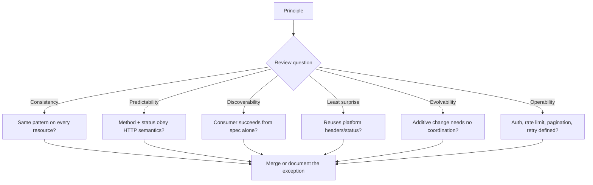
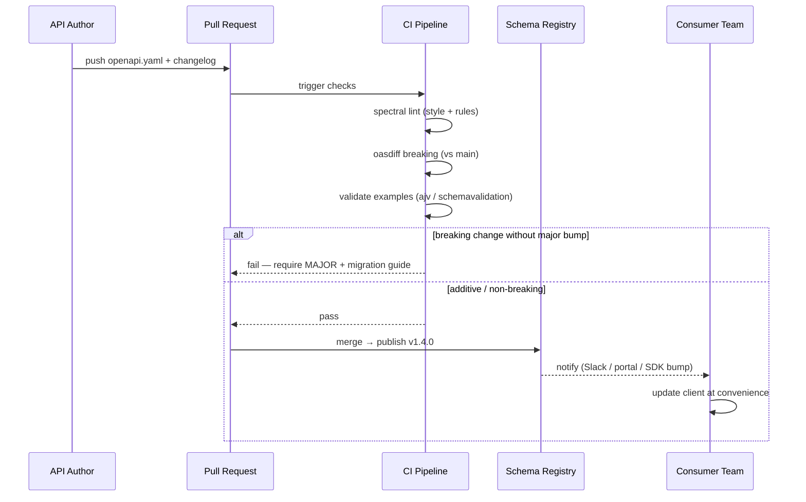
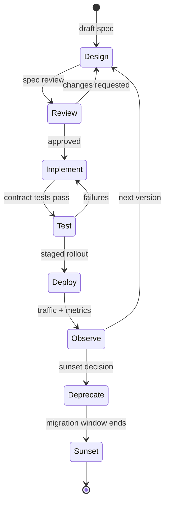
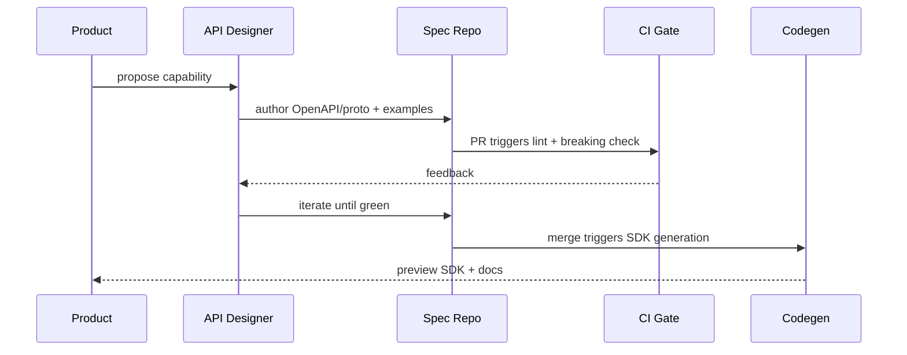
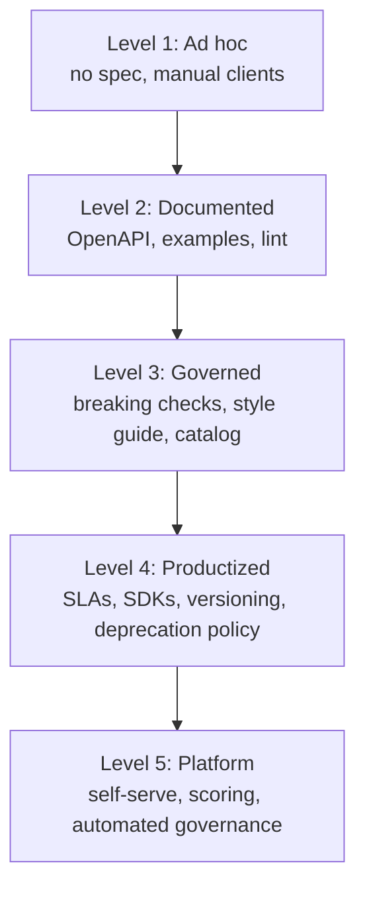
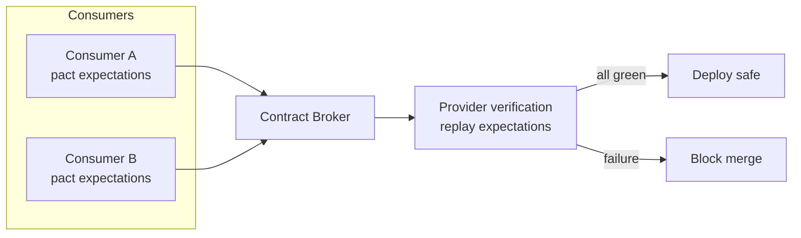

# Chapter 1 — API Design Principles and Contracts

**What this chapter covers.** Every distributed system is a graph of trust boundaries, and every edge in that graph is an API. Whether the caller is a browser, a mobile app, a partner's backend, or the service three hops away in your own mesh, the contract between producer and consumer determines how fast teams can ship, how safely they can evolve, and how gracefully they fail. This chapter builds the foundation for the entire volume: what an API contract is and why it matters more than the implementation behind it, the design principles that make contracts predictable and operable at scale, the lifecycle a contract moves through from sketch to sunset, and the tooling that makes contracts machine-checkable. We anchor the discussion in a real OpenAPI 3.1 contract and introduce the patterns — versioning, pagination, error semantics, idempotency — that later chapters treat in depth.

Learning goals — after this chapter you should be able to:

- Define an API contract precisely (syntax, semantics, and evolution guarantees) and explain why the contract, not the implementation, is the unit of coupling in a distributed system.
- Apply six design principles — consistency, predictability, discoverability, minimal surprise, evolvability, and operability — when reviewing or authoring an API surface.
- Distinguish design-first from code-first workflows, name when each is appropriate, and describe the distributed-systems cost of code-first drift.
- Read and author a version-pinned OpenAPI 3.1.0 contract (with components, security schemes, and validation) and explain how it feeds code generation, documentation, and contract testing.
- Sketch the contract lifecycle (design → review → publish → version → deprecate → sunset) and map each stage to a concrete gate (lint, breaking-change check, approval).
- Explain contracts through a distributed-systems lens: deadline propagation, backward/forward compatibility windows, and the blast radius of a breaking change across dozens of consumers.

---

## APIs as the stable seam in an unstable system

A single backend today may comprise 80 services owned by 12 teams deploying 30 times a day. The only thing that lets those teams move independently is the set of interfaces they agree not to break without coordination. An API contract is that agreement made precise.

Think of the contract as the *narrow waist* of your architecture. Implementations change — languages get replaced, databases migrate, frameworks churn — but if the contract holds, consumers do not need to care. When the contract is vague, every implementation detail leaks into every consumer, and a change in one service becomes a coordination event across ten.

For a senior backend engineer, API design is therefore not a cosmetic concern. It is the primary tool for managing coupling in a distributed organisation:

- **Coupling is proportional to contract surface.** A small, coherent contract limits the number of reasons a consumer can break. A large, inconsistent one maximises it.
- **Evolution cost is proportional to consumer count.** An internal RPC with two callers can be changed in an afternoon. A public REST endpoint with 400 consumers — some outside your company — cannot be changed without a multi-quarter deprecation.
- **Failure behaviour is part of the contract.** Timeouts, retries, rate limits, pagination semantics, and error codes determine whether a consumer can build a reliable system on top of yours. An undocumented retry policy is not a policy; it is an outage waiting to happen.

> **Distributed-systems lens.** In a monolith, a function signature is cheap to change — the compiler tells you every call site. In a distributed system, there is no global compiler. The contract *is* the compiler. A field renamed without a compatibility rule is a deserialization failure in a consumer you may not know exists, running a binary you did not build, in a region you do not operate.

---

## What a contract actually contains

A complete contract answers three questions. Most teams formalise only the first and learn about the other two during an incident review.

### 1. Syntax — what bytes are valid

The structural shape: resource paths, HTTP methods, message schemas, field types, required versus optional, string formats, enum values, and wire encoding (JSON, Protobuf). This is what an IDL or specification language captures. Example: "`GET /v1/orders/{id}` returns `200` with an `Order` where `status` is one of `pending`, `paid`, `shipped`, `cancelled`."

### 2. Semantics — what the bytes mean and what side effects occur

Two APIs can be syntactically identical and semantically opposite. Is `POST /v1/orders` idempotent? Does `DELETE /v1/users/{id}` hard-delete or soft-delete? What ordering guarantees does `GET /v1/orders?sort=created_at` provide when two orders share a timestamp? Semantics include idempotency, ordering, consistency (read-your-writes? eventual?), auth requirements, rate limits, and pagination stability. Semantics are often documented in prose alongside the schema — the most common source of ambiguity.

### 3. Evolution — what is allowed to change without breaking callers

A contract without evolution rules is a snapshot, not an agreement. Rules such as "adding an optional field is backward-compatible; removing a required field is breaking; changing an enum's meaning is breaking" determine whether a producer can ship on Monday without coordinating with every consumer. Chapter 5 (Versioning) and Chapter 8 (Compatibility) formalise these rules for REST and Protobuf respectively; this chapter establishes the mental model.

| Layer | Specified by | Enforced by | Example violation |
|-------|-------------|-------------|-------------------|
| Syntax | OpenAPI 3.1 / Protobuf IDL / JSON Schema | Linter, code generator, request validation | Renaming `order_id` to `id` without alias |
| Semantics | Documentation, RFC references, error model | Contract tests, example-based checks, review | Making `GET /orders` non-idempotent by adding a side effect |
| Evolution | Compatibility policy, deprecation header | Breaking-change detector (`oasdiff`, `buf breaking`) | Removing a field still read by 12% of traffic |

---

## Six principles for operable contracts

Principles are useful only if they can be checked in review. The six below each come with a concrete review question.

### 1. Consistency — one way to do one thing

If `GET /v1/users` paginates with `?page_token=&page_size=` then `GET /v1/orders` must not paginate with `?offset=&limit=&page=`. Consumers automate against your API; inconsistency forces per-endpoint special cases, which become per-endpoint bugs. Consistency applies to naming (`camelCase` vs `snake_case`), error envelopes, timestamp formats (RFC 3339 everywhere), and pagination (cursor everywhere or offset everywhere — never mixed without reason).

*Review check:* "Would a consumer who learned the pattern from one endpoint correctly predict the next?"

### 2. Predictability — honour the semantics you advertise

An operation labelled `GET` must be safe (no side effects) and idempotent. A `PUT` must be idempotent. A `DELETE` that returns `204` on success must not return `200` with a body on one resource and `204` on another. Predictability extends to status codes (Chapter 7): `400` means the client can fix the request; `500` means retrying the same bytes will not help.

### 3. Discoverability — a new consumer can succeed without asking you

Good contracts are self-describing: resource names match the domain language, errors carry machine-readable codes plus human-readable detail, and the contract is published where consumers already look (developer portal, schema registry, package registry). Stripe and AWS both invest heavily in discoverability not because their APIs are simple — they are not — but because scale makes one-to-one guidance impossible.

### 4. Least surprise — reuse what the platform already means

HTTP already defines methods, status codes, headers (`ETag`, `Cache-Control`, `Retry-After`, `Idempotency-Key`), and content negotiation. Protobuf already defines field presence and default values. An API that maps domain actions onto those platform semantics ("use `If-None-Match` for caching, not `?useCache=true`") is easier to operate because intermediaries — CDNs, gateways, service meshes — already understand the platform.

### 5. Evolvability — optimise for the second version, not the first

The first version of any API is wrong. The question is how expensive being wrong will be. Contracts that reserve extension points — optional fields, `additionalProperties: false` only where intentional, enumerated strings that consumers treat as open, `repeated` rather than fixed-arity — make the second version cheap. Contracts that require coordinated upgrades for every additive change make it expensive.

### 6. Operability — expose what operators need

Every contract should answer, before it is used in production: How is it authenticated? How is it rate-limited and what does `429` look like? What does pagination do under concurrent mutation? What is the timeout budget and is the operation retry-safe? An API whose happy-path example works but whose pagination is undefined under writes will cause correctness bugs at scale that no unit test catches.



*Figure 1-1: Six principles as review gates. Each principle maps to one question a reviewer can answer from the contract alone, before reading any implementation.*

---

## Contracts and schemas: choosing the description language

Different surfaces call for different contract languages. The table below is the decision you make before writing any schema.

| Contract language | Version pinned in this book | Wire format | Strength | When to use |
|-------------------|-----------------------------|-------------|----------|-------------|
| **OpenAPI 3.1.0** | OpenAPI 3.1.0 (2021-02-15), JSON Schema 2020-12 | JSON over HTTP | Human-readable, browser-native, rich ecosystem (linters, generators, gateways) | External REST, public APIs, partner integrations |
| **Protocol Buffers 3** | protobuf 4.25.x / 5.x, `protoc` 24.x, `buf` 1.32.2 | Binary (Protobuf) over HTTP/2 (gRPC) or JSON (gRPC-JSON transcoding) | Strong typing, efficient, streaming, codegen for 10+ languages | Internal service-to-service RPC |
| **AsyncAPI 3.0** | AsyncAPI 3.0.0 | JSON/Avro/Protobuf over Kafka, AMQP, etc. | Describes event-driven surfaces | Event buses, webhooks (see Vol 10) |
| **JSON Schema 2020-12** | JSON Schema 2020-12 | JSON | Standalone schema validation | Webhooks, config payloads, wherever OpenAPI envelope is too heavy |

No single language covers every surface. A typical organisation at scale uses OpenAPI for its edge and Protobuf for its interior, with AsyncAPI for its event layer. The discipline is not picking one — it is ensuring each surface has *a* machine-readable contract and that contracts are not allowed to drift from the implementation (see "Design-first vs code-first" below).

---

## The contract lifecycle

A contract is a living artifact with a lifecycle longer than any single deployment. Treating it as a file that is edited and forgotten is how breaking changes slip into production.

```mermaid
stateDiagram-v2
    [*] --> Draft: propose in RFC / design doc
    Draft --> Review: open PR with spec + examples
    Review --> Approved: lint + breaking check + human approval
    Approved --> Published: merge to main; version tag; registry publish
    Published --> Evolving: additive change proposed
    Evolving --> Review: same gate as initial
    Published --> Deprecated: Sunset + Deprecation headers; migration guide
    Deprecated --> Sunset: traffic < threshold; consumers notified
    Sunset --> [*]: remove route / archive schema
    Review --> Draft: requested changes
    Approved --> Draft: design flaw found pre-publish
```



*Figure 1-2: Contract lifecycle. Every transition has a gate; the most important gates are automated (lint, breaking-change detection) because human review alone does not scale.*

Each stage has a concrete meaning:

- **Draft.** Written alongside a design document (see Vol 15, Chapter 2). Includes at least one happy-path and one error example per operation. No traffic.
- **Review.** A pull request containing the spec file(s), generated diff, and a changelog entry. Automated checks run: spectral lint, `oasdiff` or `buf breaking`, and example validation.
- **Approved / Published.** Merged to `main`, tagged (`apis/orders@v1.4.0`), published to the registry (SwaggerHub, Buf Schema Registry, or an internal portal). From this point, compatibility rules apply.
- **Evolving.** Additive changes (new optional field, new endpoint) go through the same review gate. Consumers can adopt at their own pace.
- **Deprecated.** The contract is still served but signals deprecation (`Deprecation: true`, `Sunset: Sat, 31 Dec 2026 23:59:59 GMT` per RFC 8594, or gRPC `deprecated` option). Documentation points to the successor. Metrics track remaining traffic.
- **Sunset.** Traffic has dropped below an agreed threshold (often <1% or zero for internal surfaces after a migration deadline). The route is removed; the schema is archived, not deleted, so historical data can still be decoded.

The lifecycle matters for distributed systems because **multiple versions are in production simultaneously**. When you deprecate `GET /v1/orders`, the old and new versions will be served by different revisions of the same service — or by different services — for weeks or months. Your routing, documentation, and observability must all handle that.



*Figure 1-3: Automated contract gate in CI. Breaking changes are rejected unless the version bump and migration guide match policy; additive changes flow through.*

---

## Design-first versus code-first

**Design-first** means you write the contract before the implementation and generate or validate the implementation against it. **Code-first** means you write the implementation (often with annotations) and derive the contract from code.

Code-first is faster for a single team building a single service. It fails at organisational scale because:

- The contract inherits the implementation's accidental shape (framework defaults, language idioms) rather than the domain's intended shape.
- Two services built with different frameworks produce inconsistent contracts even for the same pattern (pagination looks different in Spring versus Express).
- There is no artifact to review before code exists, so cross-team feedback arrives late — after implementation is already coupled to the shape.

Design-first costs more upfront but pays back in **reviewability and consistency**. The contract PR can be reviewed by consumers before any producer code is written. Linters enforce naming and pagination conventions uniformly regardless of implementation language. The trade-off is that the contract and implementation can drift if validation is not automated. The mitigation is to validate in CI that the implementation *conforms* to the published contract (request/response validation middleware, or generated server stubs that fail to compile when the contract changes).

> **Recommendation for this volume:** Use design-first for any surface with more than one consumer or more than one producer team, which in practice means every edge API and every internal service that is called by more than one other service. Code-first is acceptable only for single-consumer, single-team internal endpoints that are co-deployed.

---

## A real contract: OpenAPI 3.1.0 for an Orders API

The contract below is a complete, lint-clean OpenAPI 3.1.0 document for a small Orders surface. It is deliberately small so you can read it end-to-end, but it includes every element a production contract needs: `info` with version, `servers`, reusable `components`, security, pagination, error envelope, and examples. Tool versions are pinned in comments.

```yaml
# openapi.yaml — Orders API v1.4.0
# Spec: OpenAPI 3.1.0 (https://spec.openapis.org/oas/v3.1.0.html)
# JSON Schema dialect: 2020-12 (https://json-schema.org/draft/2020-12/json-schema-core.html)
# Lint: Spectral 6.11.0 with @stoplight/spectral-owasp-ruleset 1.0.0
# Breaking check: oasdiff 1.9.2  (oasdiff breaking https://registry.example.com/apis/orders@v1.3.0 openapi.yaml)
openapi: 3.1.0
info:
  title: Orders API
  version: 1.4.0
  summary: Create and query customer orders
  description: |
    Design-first contract for the Orders bounded context.
    All timestamps are RFC 3339 (date-time). All IDs are ULIDs.
    Pagination is cursor-based; offset pagination is not supported.
  contact: { name: Platform API Team, url: https://docs.example.com/orders, email: api-team@example.com }
  license: { name: Proprietary }

servers:
  - url: https://api.example.com/v1
    description: Production
  - url: https://staging-api.example.com/v1
    description: Staging

security:
  - bearerAuth: []

paths:
  /orders:
    get:
      operationId: listOrders
      summary: List orders (cursor-paginated, filterable)
      parameters:
        - $ref: '#/components/parameters/PageSize'
        - $ref: '#/components/parameters/PageToken'
        - $ref: '#/components/parameters/FilterStatus'
        - $ref: '#/components/parameters/FilterCreatedAt'
        - $ref: '#/components/parameters/SortParam'
        - $ref: '#/components/parameters/FieldsParam'
      responses:
        '200':
          description: A page of orders
          headers:
            RateLimit-Limit: { $ref: '#/components/headers/RateLimitLimit' }
            RateLimit-Remaining: { $ref: '#/components/headers/RateLimitRemaining' }
            RateLimit-Reset: { $ref: '#/components/headers/RateLimitReset' }
          content:
            application/json:
              schema:
                $ref: '#/components/schemas/OrderList'
              examples:
                firstPage:
                  value:
                    data: [{ id: "01H8X1ABCDEF1234567890AB", status: "paid", total_cents: 2499, created_at: "2026-03-10T14:22:31Z" }]
                    pagination: { next_page_token: "eyJpZCI6IjAxSDhYMSJ9", has_more: true }
        '400': { $ref: '#/components/responses/BadRequest' }
        '401': { $ref: '#/components/responses/Unauthorized' }
        '429': { $ref: '#/components/responses/TooManyRequests' }
        default: { $ref: '#/components/responses/Error' }

    post:
      operationId: createOrder
      summary: Create an order (idempotent with Idempotency-Key)
      parameters:
        - name: Idempotency-Key
          in: header
          required: true
          schema: { type: string, format: uuid, maxLength: 64 }
          description: Client-generated idempotency key (RFC 7231 §4.2.2 semantics; server stores for 24h).
      requestBody:
        required: true
        content:
          application/json:
            schema: { $ref: '#/components/schemas/CreateOrderRequest' }
            examples:
              minimal:
                value: { customer_id: "01H8X1CUST1234567890ABCDE", items: [{ sku: "WIDGET-BLUE", quantity: 2 }] }
      responses:
        '201':
          description: Created
          headers:
            Location: { schema: { type: string, format: uri }, description: Canonical URL of the new order }
          content:
            application/json:
              schema: { $ref: '#/components/schemas/Order' }
        '400': { $ref: '#/components/responses/BadRequest' }
        '409': { $ref: '#/components/responses/Conflict' }
        default: { $ref: '#/components/responses/Error' }

  /orders/{id}:
    get:
      operationId: getOrder
      summary: Get order by ID
      parameters:
        - name: id
          in: path
          required: true
          schema: { type: string, pattern: '^[0-9A-HJKMNP-TV-Z]{26}$' }
      responses:
        '200':
          description: The order
          content:
            application/json:
              schema: { $ref: '#/components/schemas/Order' }
        '404': { $ref: '#/components/responses/NotFound' }
        default: { $ref: '#/components/responses/Error' }

components:
  securitySchemes:
    bearerAuth: { type: http, scheme: bearer, bearerFormat: JWT }

  parameters:
    PageSize: { name: page_size, in: query, schema: { type: integer, minimum: 1, maximum: 100, default: 20 } }
    PageToken: { name: page_token, in: query, schema: { type: string, description: Opaque cursor from previous response } }
    FilterStatus: { name: filter[status], in: query, schema: { type: string, enum: [pending, paid, shipped, cancelled] } }
    FilterCreatedAt: { name: filter[created_at.gte], in: query, schema: { type: string, format: date-time } }
    SortParam: { name: sort, in: query, schema: { type: string, enum: [created_at, -created_at, total_cents, -total_cents], default: "-created_at" } }
    FieldsParam: { name: fields, in: query, schema: { type: string, description: Sparse fieldset, e.g. fields=id,status,total_cents } }

  headers:
    RateLimitLimit: { schema: { type: integer }, description: "Requests allowed per window (RFC 6585 + draft-ietf-httpapi-ratelimit-headers)" }
    RateLimitRemaining: { schema: { type: integer } }
    RateLimitReset: { schema: { type: integer }, description: Seconds until window reset }

  schemas:
    Order:
      type: object
      required: [id, customer_id, status, total_cents, created_at]
      additionalProperties: false
      properties:
        id: { type: string, pattern: '^[0-9A-HJKMNP-TV-Z]{26}$', description: ULID }
        customer_id: { type: string, pattern: '^[0-9A-HJKMNP-TV-Z]{26}$' }
        status: { type: string, enum: [pending, paid, shipped, cancelled] }
        total_cents: { type: integer, minimum: 0 }
        created_at: { type: string, format: date-time }
        updated_at: { type: string, format: date-time, description: "Added in v1.4.0 — optional for backward compat" }
      example: { id: "01H8X1ABCDEF1234567890AB", customer_id: "01H8X1CUST1234567890ABCDE", status: "paid", total_cents: 2499, created_at: "2026-03-10T14:22:31Z" }

    CreateOrderRequest:
      type: object
      required: [customer_id, items]
      additionalProperties: false
      properties:
        customer_id: { type: string, pattern: '^[0-9A-HJKMNP-TV-Z]{26}$' }
        items:
          type: array
          minItems: 1
          maxItems: 100
          items:
            type: object
            required: [sku, quantity]
            additionalProperties: false
            properties:
              sku: { type: string, minLength: 1, maxLength: 64 }
              quantity: { type: integer, minimum: 1, maximum: 999 }

    OrderList:
      type: object
      required: [data, pagination]
      properties:
        data: { type: array, items: { $ref: '#/components/schemas/Order' } }
        pagination:
          type: object
          required: [has_more]
          properties:
            next_page_token: { type: string, nullable: true }
            has_more: { type: boolean }

    Error:
      type: object
      required: [code, message]
      properties:
        code: { type: string, description: "Machine-readable, e.g. ORDER_NOT_FOUND, RATE_LIMITED" }
        message: { type: string, description: Human-readable detail }
        details: { type: array, items: { type: object } }
        request_id: { type: string, format: uuid }

  responses:
    BadRequest: { description: Bad request, content: { application/json: { schema: { $ref: '#/components/schemas/Error' } } } }
    Unauthorized: { description: Unauthorized, content: { application/json: { schema: { $ref: '#/components/schemas/Error' } } } }
    NotFound: { description: Not found, content: { application/json: { schema: { $ref: '#/components/schemas/Error' } } } }
    Conflict: { description: Conflict (idempotency replay with different payload), content: { application/json: { schema: { $ref: '#/components/schemas/Error' } } } }
    TooManyRequests:
      description: Rate limited
      headers:
        Retry-After: { schema: { type: integer }, description: Seconds to wait before retry }
      content: { application/json: { schema: { $ref: '#/components/schemas/Error' } } }
    Error: { description: Unexpected error, content: { application/json: { schema: { $ref: '#/components/schemas/Error' } } } }
```

What this contract gives you that prose alone does not:

- **Machine-checkable syntax.** A Spectral rule can forbid `additionalProperties: true` on responses, require `operationId`, or ban `offset` pagination. An `oasdiff` check can block removal of `status`'s `cancelled` value as a breaking change.
- **Reusable components.** `Order`, `Error`, and header definitions appear once and are referenced everywhere, which is how consistency is enforced mechanically.
- **Evolvability by construction.** `updated_at` was added in v1.4.0 as an optional field — existing consumers that ignore unknown fields (as JSON consumers should) are unaffected. Removing `total_cents` would be caught as breaking because it is `required`.
- **Operability.** Rate-limit headers, `Idempotency-Key`, and the error envelope are part of the contract, not tribal knowledge.

Validating and linting this contract locally (versions pinned):

```bash
# Node 20.11.0, spectral 6.11.0
npm i -D @stoplight/spectral-cli@6.11.0 @stoplight/spectral-owasp-ruleset@1.0.0
npx spectral lint openapi.yaml --ruleset .spectral.yaml

# oasdiff 1.9.2 — breaking-change gate (compare against published version)
oasdiff breaking https://registry.example.com/apis/orders@v1.3.0 openapi.yaml --fail-on ERR

# Redocly 1.14.0 — bundle + validate examples against schemas
npx @redocly/cli@1.14.0 lint openapi.yaml
npx @redocly/cli@1.14.0 bundle openapi.yaml -o dist/openapi.json
```

A minimal `.spectral.yaml` that enforces the principles above:

```yaml
# .spectral.yaml — Spectral 6.11.0
extends:
  - spectral:oas
  - "@stoplight/spectral-owasp-ruleset"
rules:
  operation-operationId: error
  no-eval-in-description: off
  oas3-schema: error
  # custom: pagination must be cursor-based
  cursor-pagination-only:
    description: "Use page_token/page_size, not offset/limit/page"
    given: "$.paths.*.*.parameters[*].name"
    severity: error
    then:
      function: pattern
      functionOptions: { notMatch: "^(offset|limit|page)$" }
  # custom: every operation must have an error response
  has-error-response:
    given: "$.paths.*.*.responses"
    severity: error
    then:
      function: schema
      functionOptions:
        schema: { required: ["default"] }
```

---

## Consumer-driven contracts and conformance

A contract written by the producer and never tested from the consumer's perspective is a hypothesis. **Consumer-driven contract testing** (Chapter 11) inverts the perspective: each consumer publishes the subset of the contract it actually depends on — the fields it reads, the status codes it handles, the pagination it relies on — and the producer verifies that it still satisfies all consumers before shipping.

For REST, this is typically done with Pact or with OpenAPI example validation; for gRPC, with `buf breaking` plus consumer-specific proto tests. The key insight is that **not every breaking change as defined by the spec is breaking for your actual consumers**. Removing a field that no consumer reads is technically breaking but operationally safe; changing a field that every consumer reads is breaking even if the schema calls it "optional." Consumer contracts make that distinction explicit.

At scale, the registry becomes the source of truth. Whether it is SwaggerHub, Backstage, Buf Schema Registry, or a simple Git repository with version tags, the registry must answer: "What versions are currently served? Which consumers depend on which fields? What is the deprecation timeline?" Without those answers, deprecation is guesswork and sunset is risky.

---

## Distributed-systems lens: why contracts are harder than they look

Three properties of distributed systems make API contracts disproportionately important:

**1. Partial failure is the normal case.** A caller and a contract live in different processes, often different regions. The network between them can delay, drop, or duplicate requests. Contracts that are explicit about retry safety (`Idempotency-Key` required on `POST`, `PUT` is idempotent, `GET` is safe) let callers handle partial failure without creating duplicate side effects. Contracts that leave this implicit force every consumer to guess.

**2. Time and version are not global.** At any moment, three versions of your service may be running (old, current, canary), and consumers may be on five different client versions, some cached at the edge. Backward and forward compatibility are not theoretical — they are the steady state. A contract that requires lock-step upgrades is a contract that cannot be deployed safely.

**3. Coordination cost grows with consumer count.** Changing an internal RPC with one caller costs one conversation. Changing a public API with hundreds of consumers requires a deprecation period, migration guide, dual-serve window, and traffic-based sunset criteria. The contract is where you pay that cost upfront (by designing for extension) or later (by coordinating a breaking change).

> **Boundary note.** Protocol-level mechanics — HTTP/2 framing, gRPC wire format, Protobuf varint encoding, TLS, and the network path a request traverses — are covered in Volume 3 (Networking), Chapter 8 (gRPC and RPC Framework Internals). This volume treats the *design* of those surfaces: resource modelling, schema layout, versioning, and evolution. Where this chapter mentions the wire, it does so only to explain why a design choice matters for compatibility or performance.

---


<!-- Batch C: additional diagrams -->

#### API Lifecycle State Machine



#### Design-First Workflow



#### API Maturity Model



#### Consumer-Driven Contract Flow



## Key takeaways

- The contract, not the implementation, is the unit of coupling. Invest design effort where the blast radius is largest.
- A complete contract covers syntax, semantics, and evolution — and each layer needs a different enforcement mechanism (lint, docs, breaking-change detection).
- Consistency, predictability, discoverability, least surprise, evolvability, and operability are checkable in review; use them as gate criteria, not slogans.
- Design-first is the default at organisational scale; code-first is acceptable only for single-consumer, single-team surfaces where drift is cheap to detect.
- The contract lifecycle (draft → review → published → evolving → deprecated → sunset) must be automated — lint, `oasdiff`/`buf breaking`, and example validation in CI — because human review alone does not scale.
- OpenAPI 3.1.0 with Spectral and `oasdiff` gives you a machine-checkable REST contract today; the same discipline applies to Protobuf with `buf lint` and `buf breaking` (Chapter 3).
- Distributed systems require contracts to be explicit about retry safety, pagination stability, version windows, and multi-version serving — the things that are invisible in a single-process call.

## Further reading

- OpenAPI Initiative. *OpenAPI Specification 3.1.0* (2021-02-15). https://spec.openapis.org/oas/v3.1.0.html — the authoritative spec; read §4 (Schema Object) and §5 (JSON Schema 2020-12 alignment) carefully.
- JSON Schema. *JSON Schema 2020-12* — https://json-schema.org/draft/2020-12/json-schema-core.html. Needed to interpret OpenAPI 3.1 schemas correctly.
- Fielding, R. *Architectural Styles and the Design of Network-based Software Architectures* (2000), Chapter 5 — the REST dissertation; still the best statement of why REST's constraints exist.
- IETF. *RFC 8594 — The Sunset HTTP Header Field* (2019) and *RFC 9745 — The Deprecation HTTP Header Field* (2024) — standard headers for lifecycle signalling.
- Vaughan-Nicholson et al. *Spectral* (Stoplight, 6.11.0) and *oasdiff* (1.9.2) — the two most practical tools for linting and breaking-change detection on OpenAPI.
- Newman, S. *Building Microservices* 2nd ed. (O'Reilly, 2021), Chapters 4–5 — pragmatic treatment of coupling, contracts, and consumer-driven testing.
- Pact Foundation. *Pact: Consumer-Driven Contract Testing* — https://docs.pact.io/ — the reference for consumer-driven workflows that this chapter introduces and Chapter 11 implements.

