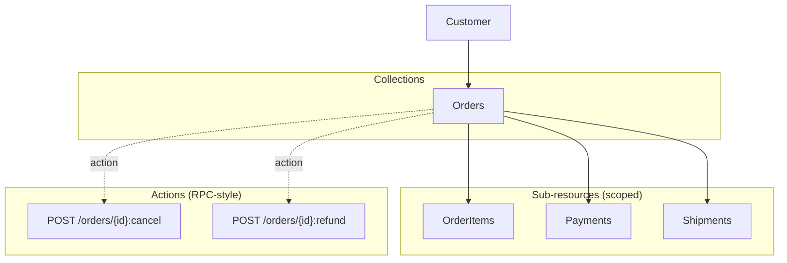
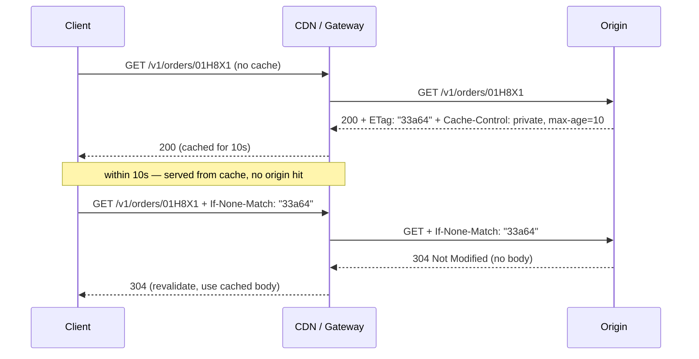
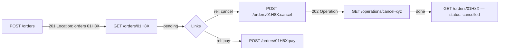
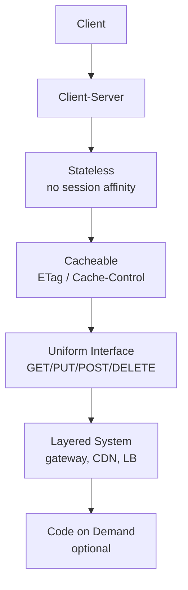
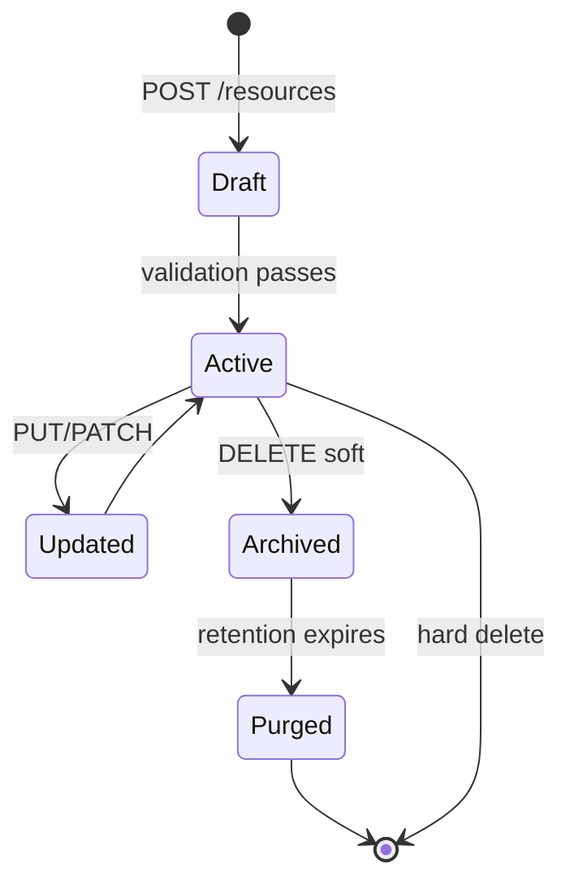
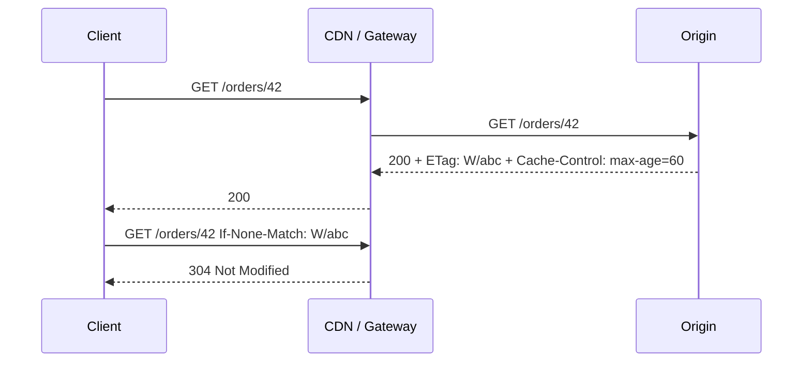

# Chapter 2 — REST in Depth

**What this chapter covers.** REST is simultaneously the most widely used and most loosely defined style in backend engineering. Every team claims to build "REST APIs," but the resulting surfaces range from careful resource-oriented designs that scale to thousands of consumers to ad-hoc JSON-over-HTTP that could be RPC with path segments. This chapter makes REST precise: what the constraints actually require, how to model resources and relationships so the URI structure earns its keep, the exact semantics of methods and status codes (and where teams most often violate them), how to design pagination, filtering, sorting, and field selection so consumers can build correct and efficient clients at scale, and how caching and conditional requests turn HTTP's built-in machinery into a performance and consistency tool. Along the way we build a realistic Express/Node handler with cursor pagination and a Go client that consumes it correctly. The chapter closes with where REST fits — and where it does not — in a distributed system that also speaks gRPC and events.

Learning goals — after this chapter you should be able to:

- State REST's six constraints, distinguish resource-oriented REST from JSON-over-HTTP, and place a given API on the Richardson Maturity Model.
- Model a domain as resources, sub-resources, and relationships — choosing collections, singletons, and actions deliberately — and design URIs, methods, and status codes that obey HTTP semantics.
- Implement and consume cursor-based pagination, compound filtering, stable sorting, sparse fieldsets, and `ETag`/`If-None-Match` caching correctly, including the distributed edge cases (concurrent mutation, clock skew).
- Decide when to use HATEOAS links, when to return `202 Accepted` versus `201 Created`, and how to model long-running operations and batch endpoints within REST.
- Explain REST's trade-offs versus gRPC (Chapter 3) and events (Vol 10) through a distributed-systems lens: cacheability, intermediary friendliness, browser reach, and debuggability.

---

## What REST actually is — and what it is not

REST (Representational State Transfer) is an architectural *style* defined by Roy Fielding's 2000 dissertation, not a protocol or a standard you can "comply" with in a binary sense. It imposes six constraints on the interaction between client and server:

1. **Client-server** — separation of concerns; the client holds UI state, the server holds resource state.
2. **Stateless** — every request carries all context the server needs (auth, resource identity); the server stores no per-client session between requests. This is what makes horizontal scaling trivial.
3. **Cacheable** — responses declare whether they may be cached, and for how long, so intermediaries (CDNs, gateways, browsers) can serve them without contacting the origin.
4. **Uniform interface** — four sub-constraints that together are what people usually mean by "REST": resource identification in requests (URIs), resource manipulation through representations (JSON bodies), self-descriptive messages (media types, status codes, headers), and hypermedia as the engine of application state (HATEOAS).
5. **Layered system** — intermediaries (load balancers, caches, meshes) can be inserted transparently because the interface is uniform.
6. **Code on demand (optional)** — the server may ship executable code to the client. Almost never used in backend APIs.

The constraints that matter operationally are **stateless**, **cacheable**, **uniform interface**, and **layered system**. Together they explain why REST scales organisationally: statelessness lets you add origin instances without session affinity, cacheability lets you shed read load without touching application code, and the uniform interface lets any intermediary understand the traffic without custom logic.

### REST versus JSON-over-HTTP versus RPC

Many surfaces labelled "REST" are really **JSON-over-HTTP**: they use HTTP as a tunnel (usually `POST` everything to `/api/execute`) and ignore method semantics, status codes, and caching. Others are **RPC-over-HTTP**: `POST /orders.cancel` looks like a procedure call, not a resource manipulation. Both can be perfectly good APIs — Stripe's API, for example, is deliberately RPC-flavoured in places (`POST /v1/refunds`) because the domain action does not map cleanly to CRUD.

The honest position is: be **resource-oriented where the domain is resource-shaped** (orders, users, invoices — things with identity and lifecycle) and **action-oriented where it is not** (cancel, refund, publish, search). Forcing every operation into `PUT`/`PATCH`/`DELETE` when the domain verb is inherently procedural creates awkwardness that consumers feel immediately.

### Richardson Maturity Model — a rough ruler, not a target

Leonard Richardson's model grades an API by how fully it exploits HTTP:

- **Level 0 — Swamp of POX.** One URI, one method (`POST`), payload carries everything. Not REST at all.
- **Level 1 — Resources.** Many URIs, but still one method. You can identify resources; you cannot manipulate them with HTTP semantics.
- **Level 2 — HTTP verbs.** Resources plus correct methods and status codes. This is where most well-designed REST APIs live.
- **Level 3 — Hypermedia (HATEOAS).** Responses include links/relations that tell the client what transitions are available. Rarely achieved fully; often approximated with `_links` or `Link` headers on paginated collections and state-machine resources.

Level 2 is the pragmatic target for most backend surfaces. Level 3 is valuable for state-machine resources (an order that can transition `pending → paid → shipped` but not `shipped → pending`) and for paginated collections, where the `next` cursor link removes client-side URL construction.

---

## Resource modelling

### From domain to resources

A resource is not a database row, though it often maps to one. It is a **concept with identity that a client wants to interact with over time**. Start from the domain language and ask: "What nouns do product and support use when they talk about this area? What lifecycle do those nouns have?"

For an e-commerce ordering domain, the nouns are `Order`, `OrderItem` (not independently addressable outside an order), `Payment`, `Shipment`, and `Customer`. That suggests:



*Figure 2-1: Resource model for an Orders domain. Collections are top-level; line items and nested entities are sub-resources scoped to their parent; state transitions that do not map to CRUD become custom actions.*

### URI design

URIs identify resources; they are not an encoding of query logic. Conventions that survive review:

- **Nouns, plural, kebab or snake consistently.** `GET /v1/orders` and `GET /v1/order-items` — not `GET /v1/getOrders` or `GET /v1/order_item`.
- **Hierarchy reflects ownership/lifecycle.** `GET /v1/orders/{orderId}/items/{itemId}` when items cannot exist without an order. If items are queryable independently, also expose `GET /v1/order-items?filter[order_id]=...`.
- **No verbs in paths — except explicit actions.** `POST /v1/orders/{id}:cancel` (Google AIP-136 style, colon-separated) or `POST /v1/orders/{id}/cancellations`. The colon convention signals "this is an action, not a sub-collection."
- **Version in the path or header — pick one and be consistent.** `GET /v1/orders` (path versioning, most common for REST) versus `Accept: application/vnd.example.v1+json` (header versioning, more correct per HTTP but worse for debuggability and CDN keying). Either way, Chapter 5 covers the evolution policy that versioning implies.
- **IDs are opaque.** Use ULIDs (`01H8X...`) or UUIDv7, not auto-increment integers that leak cardinality and make sharding painful.

| Pattern | Example | When to use |
|---------|---------|-------------|
| Collection | `GET /v1/orders` | List/search; always paginated |
| Singleton (by ID) | `GET /v1/orders/{id}` | Fetch, update, delete one |
| Sub-collection | `GET /v1/orders/{id}/payments` | Child resources scoped to parent |
| Singleton sub-resource | `GET /v1/orders/{id}/shipping-address` | One-per-parent (not a collection) |
| Custom action | `POST /v1/orders/{id}:cancel` | State transition that is not CRUD |
| Batch | `POST /v1/orders:batchGet` | Fetch many by ID without N round-trips |
| Search (complex) | `POST /v1/orders:search` | Query too large for query-string (large filter payload) |

### Methods and status codes — the semantics you must honour

HTTP methods have precise semantics that intermediaries and clients rely on:

| Method | Safe | Idempotent | Cacheable | Meaning |
|--------|------|------------|-----------|---------|
| `GET` | yes | yes | yes | Retrieve representation; must not mutate |
| `HEAD` | yes | yes | yes | Same as `GET` but without body (for `ETag`/`Content-Length` probes) |
| `PUT` | no | yes | no | Replace entire resource at URI (create or overwrite) |
| `PATCH` | no | no* | no | Partial update (JSON Merge Patch or JSON Patch); idempotent if the patch document is |
| `POST` | no | no | no† | Create subordinate, trigger action, or any non-idempotent operation |
| `DELETE` | no | yes | no | Remove resource; repeated `DELETE` returns `204`/`404` consistently |

\* `PATCH` idempotency depends on the patch format: `PATCH {"status":"paid"}` is idempotent; `PATCH [{"op":"add","path":"/tags/-","value":"x"}]` with JSON Patch may not be.
† `POST` responses are cacheable only if explicitly marked with `Cache-Control`.

Status codes are equally load-bearing. The minimum set a REST API should use correctly:

- `200 OK` — `GET`/`PATCH` success with body. `POST` that did not create a new URI-addressable resource.
- `201 Created` — `POST` that created a resource; include `Location: /v1/orders/{id}`.
- `202 Accepted` — request accepted for asynchronous processing; include `Location` to a status resource or `Retry-After`.
- `204 No Content` — `DELETE` or `PUT` success with no body to return.
- `304 Not Modified` — conditional `GET` with `If-None-Match` when `ETag` matches (not an error; saves bandwidth).
- `400 Bad Request` — malformed syntax the client can fix; include field-level `details`.
- `401 Unauthorized` / `403 Forbidden` — authentication vs authorisation (Vol 9, Ch 5–7).
- `404 Not Found` / `409 Conflict` / `422 Unprocessable Entity` — resource missing, state conflict, semantic validation failure.
- `429 Too Many Requests` — rate limited; include `Retry-After` and `RateLimit-*` headers.
- `500 Internal Server Error` / `503 Service Unavailable` — server fault; `503` may include `Retry-After` for shed load.

> **Common violation.** Returning `200` with `{ "error": "not_found" }` in the body breaks every intermediary and client that branches on status codes. Use `404` with a structured error body (Chapter 7) instead.

---

## Pagination, filtering, sorting, and field selection

These four concerns are where naive REST designs collapse under real load. A `GET /orders` that returns all rows works until the table has 10 million rows; a filter that is undocumented or inconsistent is a correctness bug in every consumer that depends on it.

### Pagination — cursor over offset

**Offset pagination** (`?offset=40&limit=20`) is simple and supports random access ("go to page 5"), but it degrades with data size (the database must still scan `offset` rows), and it breaks under concurrent mutation — if a row is inserted at position 10 while the client pages, rows shift and the client sees duplicates or misses.

**Cursor pagination** (`?page_token=eyJpZCI6...&page_size=20`) uses an opaque token that encodes the position (typically the last seen sort key). It is stable under concurrent inserts, efficient (a range scan on an indexed column), and the token can embed sort/filter context so tampering is detectable. The trade-off is no random access — you can only walk forward (and optionally backward with `prev_page_token`).

For any collection that is large, growing, or concurrently mutated — which is every production collection — **use cursor pagination**.

A minimal contract for pagination (OpenAPI fragment):

```yaml
parameters:
  PageSize: { name: page_size, in: query, schema: { type: integer, minimum: 1, maximum: 100, default: 20 } }
  PageToken: { name: page_token, in: query, schema: { type: string, description: Opaque cursor from previous page } }
```

Response envelope:

```json
{
  "data": [{ "id": "01H8X1ABC...", "status": "paid", "total_cents": 2499 }],
  "pagination": { "next_page_token": "eyJpZCI6IjAxSDhYMSJ9", "has_more": true }
}
```

The token should be opaque to the client (base64-encoded JSON or encrypted) even if it is just `{"last_id":"01H8X..."}` on the server side. Opaque tokens let you change the pagination strategy without breaking clients.

### Filtering, sorting, and sparse fieldsets

Adopt one convention for all three and apply it everywhere (Chapter 1 — consistency). The JSON:API-inspired bracket style works well and is widely tooled:

```
GET /v1/orders?filter[status]=paid&filter[created_at.gte]=2026-01-01T00:00:00Z
               &sort=-created_at
               &fields=id,status,total_cents
               &page_size=20&page_token=eyJp...
```

- **Filtering.** `filter[field]` for equality, `filter[field.gte]`/`lte` for ranges. Document which fields are filterable — not every column should be. Filters that require a full table scan should be rejected with `400` rather than served slowly.
- **Sorting.** `sort=field` ascending, `sort=-field` descending. When two rows share the sort key, add a deterministic tie-breaker (`id`) so pagination cursors are stable. Document the default sort.
- **Sparse fieldsets.** `fields=id,status` lets clients avoid over-fetching — the REST analogue of GraphQL field selection (Chapter 4) without the complexity. Useful for list views that only need 3 of 20 fields.

### Real code — cursor pagination in Node.js (Express 4.18)

The handler below is production-shaped: it validates query params, decodes the opaque cursor, runs a keyset query (no `OFFSET`), and returns `next_page_token` only when more data exists. Versions pinned in comments.

```js
// server.js — Node 20.11.0, Express 4.18.2, pg 8.11.3
// npm i express@4.18.2 pg@8.11.3 zod@3.22.4
import express from "express";
import { z } from "zod";
import { pool } from "./db.js"; // pg.Pool configured elsewhere

const app = express();
app.use(express.json());

const QuerySchema = z.object({
  page_size: z.coerce.number().int().min(1).max(100).default(20),
  page_token: z.string().optional(),
  "filter[status]": z.enum(["pending", "paid", "shipped", "cancelled"]).optional(),
  "filter[created_at.gte]": z.string().datetime().optional(),
  sort: z.enum(["created_at", "-created_at", "total_cents", "-total_cents"]).default("-created_at"),
  fields: z.string().optional(), // comma-separated allowlist checked below
});

const ALLOWED_FIELDS = new Set(["id", "customer_id", "status", "total_cents", "created_at", "updated_at"]);

function decodeCursor(token) {
  if (!token) return null;
  try {
    const json = Buffer.from(token, "base64url").toString("utf8");
    const obj = JSON.parse(json);
    // cursor is { last_created_at: string, last_id: string }
    if (typeof obj.last_created_at === "string" && typeof obj.last_id === "string") return obj;
    return null;
  } catch { return null; }
}
function encodeCursor(row) {
  return Buffer.from(JSON.stringify({ last_created_at: row.created_at.toISOString(), last_id: row.id })).toString("base64url");
}

app.get("/v1/orders", async (req, res) => {
  const parsed = QuerySchema.safeParse(req.query);
  if (!parsed.success) {
    return res.status(400).json({ code: "BAD_REQUEST", message: "Invalid query", details: parsed.error.issues, request_id: req.id });
  }
  const q = parsed.data;
  const cursor = q.page_token ? decodeCursor(q.page_token) : null;
  if (q.page_token && !cursor) {
    return res.status(400).json({ code: "BAD_REQUEST", message: "Invalid page_token", request_id: req.id });
  }

  // field selection — default to all if not requested
  const fields = q.fields ? q.fields.split(",").map(s => s.trim()).filter(Boolean) : [...ALLOWED_FIELDS];
  const badFields = fields.filter(f => !ALLOWED_FIELDS.has(f));
  if (badFields.length) return res.status(400).json({ code: "BAD_REQUEST", message: `Unknown fields: ${badFields.join(",")}` });
  const selectList = fields.map(f => `"${f}"`).join(", ");

  // sort — cursor pagination requires sort key in cursor; restrict to created_at for simplicity
  // For total_cents sort you would need a composite cursor on (total_cents, id)
  const sortDir = q.sort.startsWith("-") ? "DESC" : "ASC";
  const sortCol = q.sort.replace(/^-/, "");
  if (sortCol !== "created_at") {
    return res.status(400).json({ code: "BAD_REQUEST", message: "Cursor pagination currently supports sort=created_at only" });
  }

  // build WHERE with keyset condition when cursor present
  const where = [];
  const params = [];
  let paramIdx = 1;

  if (q["filter[status]"]) { where.push(`status = $${paramIdx++}`); params.push(q["filter[status]"]); }
  if (q["filter[created_at.gte]"]) { where.push(`created_at >= $${paramIdx++}`); params.push(q["filter[created_at.gte]"]); }
  if (cursor) {
    // keyset: (created_at, id) > (cursor_created_at, cursor_id) for ASC, < for DESC
    const op = sortDir === "ASC" ? ">" : "<";
    where.push(`(created_at, id) ${op} ($${paramIdx}, $${paramIdx + 1})`);
    params.push(cursor.last_created_at, cursor.last_id);
    paramIdx += 2;
  }

  const whereSQL = where.length ? `WHERE ${where.join(" AND ")}` : "";
  // fetch one extra to determine has_more without COUNT(*)
  const limit = q.page_size + 1;
  const sql = `SELECT ${selectList} FROM orders ${whereSQL} ORDER BY created_at ${sortDir}, id ${sortDir} LIMIT $${paramIdx}`;
  params.push(limit);

  const { rows } = await pool.query(sql, params);
  const hasMore = rows.length > q.page_size;
  const page = hasMore ? rows.slice(0, q.page_size) : rows;
  const nextPageToken = hasMore ? encodeCursor(page[page.length - 1]) : null;

  // cacheable for 10s, revalidated with ETag
  res.set("Cache-Control", "private, max-age=10, stale-while-revalidate=30");
  res.json({ data: page, pagination: { next_page_token: nextPageToken, has_more: hasMore } });
});

app.listen(8080, () => console.log("orders API on :8080"));
```

Key choices:

- **Keyset query** `WHERE (created_at, id) > ($cursor)` with `ORDER BY created_at, id` — no `OFFSET`, stable under inserts, uses a composite index on `(created_at, id)`.
- **One-extra trick** — fetch `page_size + 1` rows; the extra row tells you `has_more` without a separate `COUNT(*)` that would be expensive and immediately stale.
- **Opaque cursor** as `base64url(JSON)` — clients cannot construct or tamper with cursors without going through the server.

### Consuming pagination correctly — Go client (Go 1.22)

```go
// client.go — Go 1.22, net/http stdlib
package orders

import (
    "context"
    "encoding/json"
    "fmt"
    "net/http"
    "net/url"
)

type Order struct {
    ID         string `json:"id"`
    Status     string `json:"status"`
    TotalCents int    `json:"total_cents"`
    CreatedAt  string `json:"created_at"`
}
type ListResp struct {
    Data       []Order `json:"data"`
    Pagination struct {
        NextPageToken *string `json:"next_page_token"`
        HasMore       bool    `json:"has_more"`
    } `json:"pagination"`
}

// ListAll iterates all pages; ctx carries deadline (Vol 3, Ch 11).
func ListAll(ctx context.Context, baseURL string, pageSize int) ([]Order, error) {
    var all []Order
    var pageToken string
    client := &http.Client{}
    for {
        u, _ := url.Parse(baseURL + "/v1/orders")
        q := u.Query()
        q.Set("page_size", fmt.Sprint(pageSize))
        q.Set("sort", "-created_at")
        if pageToken != "" {
            q.Set("page_token", pageToken)
        }
        u.RawQuery = q.Encode()

        req, _ := http.NewRequestWithContext(ctx, "GET", u.String(), nil)
        req.Header.Set("Accept", "application/json")
        resp, err := client.Do(req)
        if err != nil {
            return nil, err
        }
        if resp.StatusCode == http.StatusTooManyRequests {
            // honour Retry-After (Chapter 7); simplified — real code should back off
            return nil, fmt.Errorf("rate limited: retry after %s", resp.Header.Get("Retry-After"))
        }
        if resp.StatusCode != http.StatusOK {
            resp.Body.Close()
            return nil, fmt.Errorf("list orders: %s", resp.Status)
        }
        var lr ListResp
        if err := json.NewDecoder(resp.Body).Decode(&lr); err != nil {
            resp.Body.Close()
            return nil, err
        }
        resp.Body.Close()
        all = append(all, lr.Data...)
        if !lr.Pagination.HasMore || lr.Pagination.NextPageToken == nil {
            break
        }
        pageToken = *lr.Pagination.NextPageToken
    }
    return all, nil
}
```

---

## Caching and conditional requests

REST's cacheability constraint is not optional decoration — it is a scalability mechanism. A `GET /v1/orders/{id}` served with correct `Cache-Control` and `ETag` can be cached at three layers without any application change: browser, CDN, and service-mesh sidecar.



*Figure 2-2: Conditional GET with ETag. The 304 saves bandwidth and origin work; with stale-while-revalidate the CDN can serve stale while refreshing in the background.*

Headers that matter:

- `Cache-Control: private, max-age=10, stale-while-revalidate=30` — private (per-user), fresh for 10s, may serve stale for 30s while revalidating. Adjust per resource volatility.
- `ETag: "33a64df551425fcc55e4d42a148795d9f25f89d4"` — opaque validator, typically a hash of the representation or a version counter. Weak validators (`W/"..."`) are sufficient when byte identity is not required.
- `Last-Modified` — weaker than `ETag` (second resolution, clock-sensitive); prefer `ETag`.
- `Vary: Accept, Authorization` — tells caches that the response varies by those request headers; omitting it when it is needed causes cache poisoning.

For collections, caching is subtler. `GET /v1/orders?page_token=...` should generally be `Cache-Control: private, no-store` or very short `max-age`, because the collection is concurrently mutated. Caching a single order by ID is safe; caching a filtered list is often not worth the invalidation complexity.

---

## Long-running operations, batch, and HATEOAS pragmatism

Not every operation fits `200`/`201`. Two patterns handle the rest:

**Long-running operations.** When `POST /v1/orders/{id}:cancel` triggers a workflow that takes minutes (refund, inventory restock), return `202 Accepted` with `Location: /v1/operations/abc123` and a `Retry-After`. The client polls `GET /v1/operations/abc123` (or subscribes via webhook/event) until `done: true`. Google's AIP-151 (`google.longrunning.Operation`) is a good template even outside Google.

**Batch.** `POST /v1/orders:batchGet { "ids": ["01H8X1...", "01H8X2..."] }` returning `{ "orders": [...], "not_found": [...] }` avoids N round-trips. Keep batch size bounded (e.g., max 100) and document partial-failure semantics — does one missing ID fail the whole batch, or return per-item status?

**HATEOAS.** Include `_links` where they carry state-machine information — e.g., an order with `status: "pending"` advertises `{"rel":"cancel","href":"/v1/orders/{id}:cancel","method":"POST"}` but not `refund` — and `Link` headers for pagination (`Link: <...?page_token=...>; rel="next"` per RFC 8288). Do not force clients to navigate solely via links; most REST consumers still construct URIs from an OpenAPI spec and treat links as hints.



*Figure 2-3: Resource lifecycle with hypermedia links and an asynchronous cancel operation. Links advertise valid transitions; the operation resource decouples the HTTP request from the workflow.*

---

## Where REST fits in a distributed system

REST's strengths at scale are:

- **Cacheability and intermediary friendliness.** Every cache, CDN, and gateway already speaks HTTP semantics. No custom protocol needed.
- **Browser and partner reach.** Any consumer with `fetch` can call your API; no codegen required.
- **Debuggability.** `curl`, browser devtools, and `jq` are universal. An on-call engineer can reproduce a failing request from a log line.

Its costs are:

- **Over/under-fetching.** `GET /orders/{id}` returns the whole order even when the client wants one field; `GET /orders` with N items either embeds or requires N follow-ups. Sparse fieldsets and batch endpoints mitigate but do not eliminate this — GraphQL (Chapter 4) exists for exactly this reason.
- **No streaming or bidirectional flow.** Server-sent events and WebSockets layer on top of HTTP but are not part of REST's uniform interface. For streaming telemetry or chat, gRPC streaming or events are better fits.
- **Text and schema overhead.** JSON field names repeat on every response; there is no built-in schema evolution contract beyond what OpenAPI documents. For high-throughput interior RPC, Protobuf over gRPC (Chapter 3) is more efficient and more strictly typed.

> **Distributed-systems lens.** At the edge, REST's cacheability and uniform interface reduce origin load and let CDNs absorb regional traffic without application changes — a direct win for multi-region latency (Vol 7, Ch 10). In the interior, where the caller and callee are both services you control, REST's text overhead and lack of streaming cost more than its debuggability is worth, which is why most large organisations use REST at the edge and gRPC in the mesh (Chapter 3). The decision is not "which is better" but "which edge of the system is this interface on."

> **Boundary note.** Low-level HTTP evolution — HTTP/1.1 vs HTTP/2 vs HTTP/3 framing, connection coalescing, header compression (HPACK/QPACK), and TLS negotiation — is covered in Volume 3, Chapters 7 and 10. This chapter uses HTTP as a *semantic* layer (methods, status, headers, caching) and assumes the transport beneath is correctly configured.

---


#### REST Constraints Applied



#### Resource Lifecycle



#### HTTP Caching and Conditional Requests



#### Richardson Maturity Model


## Key takeaways

- Model domains as resources with clear ownership; use sub-resources for scoped children and colon-actions for operations that are not CRUD.
- Honour method semantics (`GET` safe, `PUT` idempotent, `POST` neither) and use the full status-code vocabulary — especially `201`/`202`/`204`/`304`/`429` — so intermediaries and clients can behave correctly without parsing bodies.
- Use cursor (keyset) pagination everywhere that data is large or concurrently mutated; employ the one-extra trick and opaque tokens, and add a deterministic tie-breaker to the sort.
- Standardise filtering (`filter[field]`), sorting (`sort=-field`), and sparse fieldsets (`fields=...`) once and enforce them with Spectral rules.
- Make cacheability explicit: `Cache-Control`, `ETag`/`If-None-Match`, and `Vary` are load-bearing for origin offload; conditional `304` saves both bytes and work.
- Return `202` with an operation resource for long-running work and bounded batch endpoints for N-item fetches; use `_links`/`Link` headers pragmatically for state machines and pagination.
- Choose REST for edge and partner surfaces where cacheability, debuggability, and browser reach matter; prefer gRPC for interior high-throughput RPC.

## Further reading

- Fielding, R. *Architectural Styles and the Design of Network-based Software Architectures* (2000), Ch. 5 — the REST dissertation; the source for the six constraints and uniform-interface definition.
- Richardson, L. & Ruby, S. *RESTful Web Services* (O'Reilly, 2007) — Richardson Maturity Model and resource-oriented design in depth.
- Google Cloud. *API Improvement Proposals (AIPs)* — https://aip.dev/ — especially AIP-121 (resources), AIP-136 (custom methods), AIP-151 (long-running operations), AIP-158 (pagination). Opinionated but widely adopted conventions for resource naming and operation design.
- IETF. *RFC 8288 — Web Linking* (2017), *RFC 6585 — Additional HTTP Status Codes* (2012), *RFC 7232 — Conditional Requests* (2014), *RFC 9457 — Problem Details for HTTP APIs* (2023) — the header and error-envelope standards this chapter builds on.
- Lauret, A. *The Design of Web APIs* (Manning, 2019) — practical, example-heavy treatment of resource modelling and lifecycle.
- Express 4.18.x — https://expressjs.com/, `pg` 8.11.x — https://node-postgres.com/ — versions pinned for the handler example.

