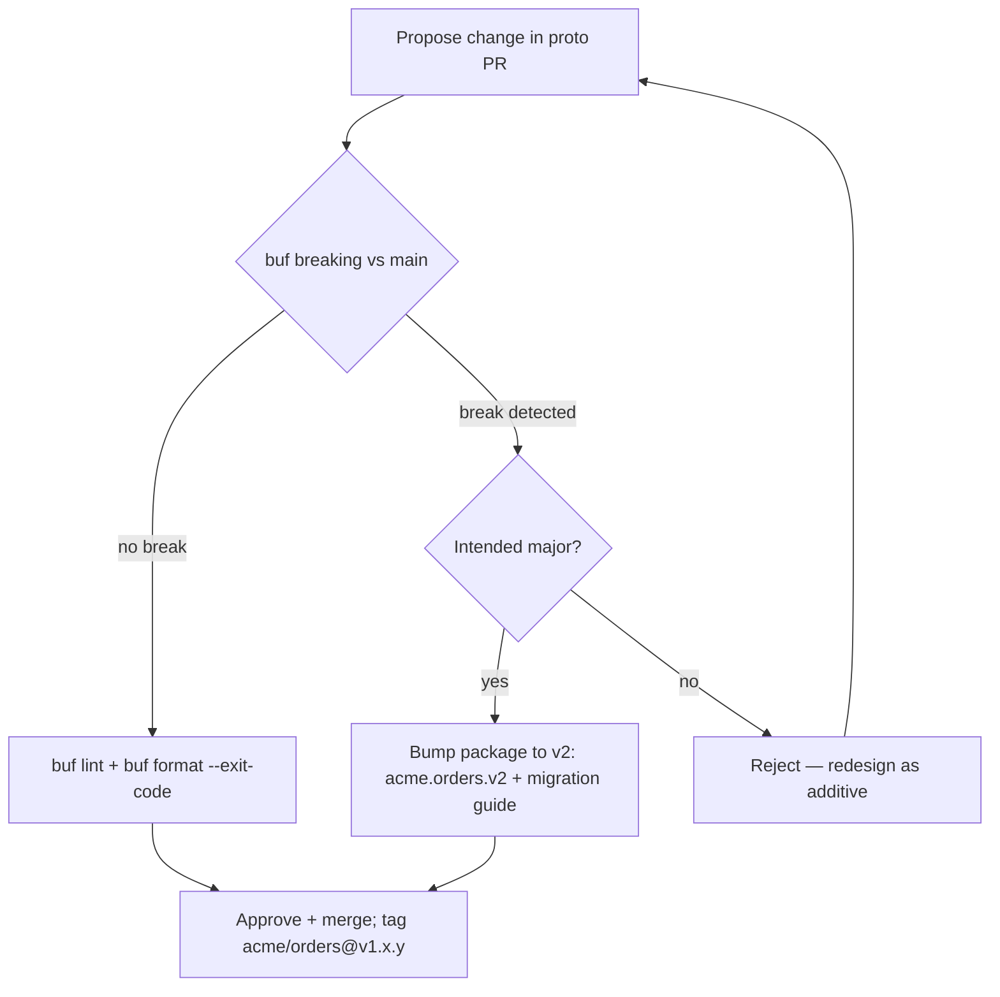
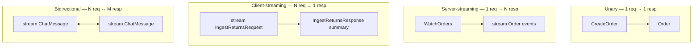
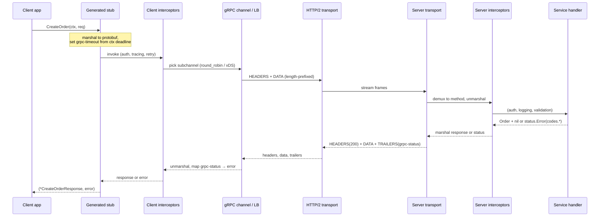
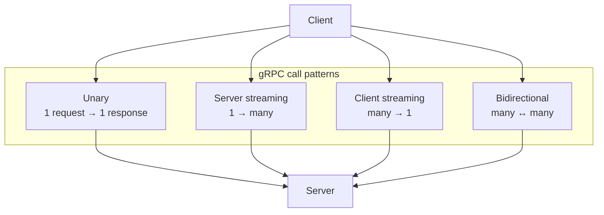
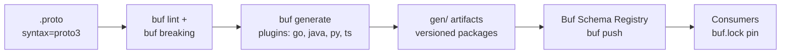
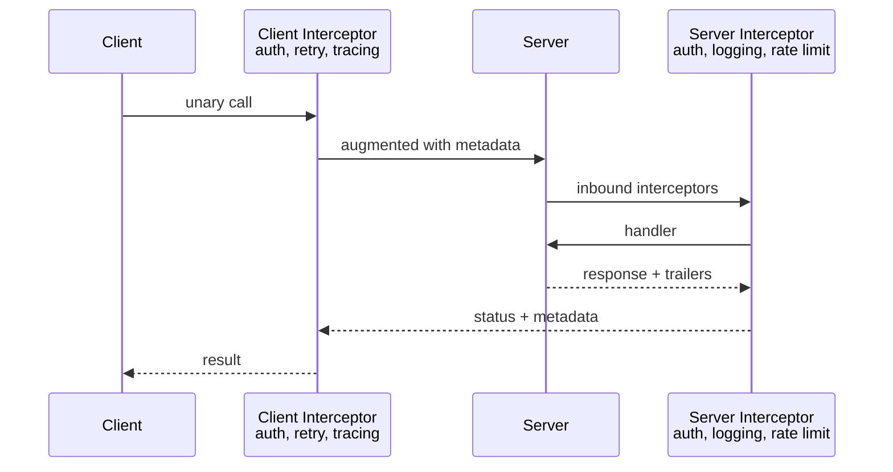
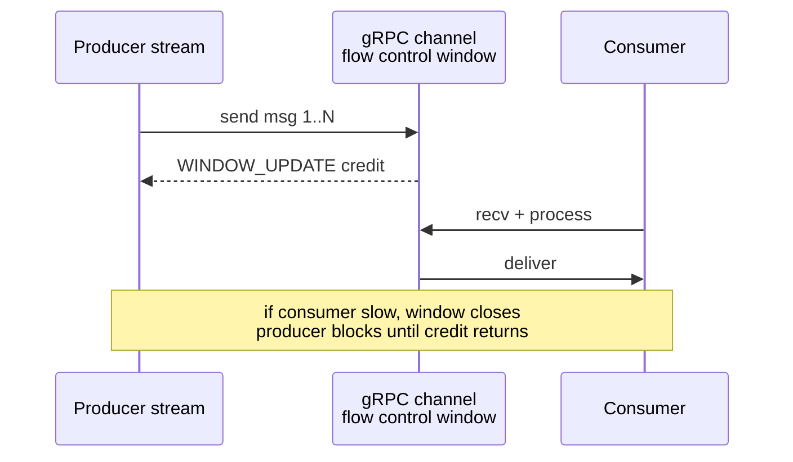

# Chapter 3 — gRPC and Protobuf Schema Design

**What this chapter covers.** Inside the perimeter — service to service — REST's virtues (human readability, cacheability, browser reach) cost more than they are worth. Calls are frequent, payloads are structured, consumers are other services you control, and the bottleneck is not debuggability but throughput, latency, and independent evolvability across dozens of teams. That is the niche gRPC and Protocol Buffers were designed for, and where they are now the default in most large backend organisations. This chapter is about *design*: how to lay out `.proto` schemas so they stay coherent at 200 services, how to model services, messages, and enums so compatibility is the steady state rather than the exception, how the four call shapes map to real problems, and how to operate a schema-driven workflow with `buf` that makes breaking changes fail in CI rather than in production. We treat the wire as context and the schema as the contract. If you want the bytes on the wire, HPACK tables, and HTTP/2 frame layout, that is Volume 3, Chapter 8.

Learning goals — after this chapter you should be able to:

- Explain why interior service-to-service traffic favours gRPC/Protobuf over REST/JSON, and where that trade-off reverses.
- Author a version-pinned, `buf lint`-clean Protobuf schema: packages, services, messages, enums, `oneof`, maps, well-known types, and field presence.
- Apply Protobuf compatibility rules (field numbers, `reserved`, enum handling, wire types) to evolve a schema without requiring coordinated deploys.
- Choose correctly among the four gRPC call shapes (unary, server-streaming, client-streaming, bidirectional) and model deadlines, metadata, and error details.
- Configure a `buf` workflow — `buf.yaml`, `buf.gen.yaml`, `buf lint`, `buf breaking`, `buf format` — and wire it into CI as the schema gate.
- Sketch a gRPC service flow from stub call through interceptors to handler, including deadline propagation and load-balancing implications in a distributed mesh.

---

## Why gRPC/Protobuf inside the mesh

At the edge (Chapter 2), REST wins because every client already speaks HTTP and every intermediary understands `GET` vs `POST` and `Cache-Control`. In the interior, the client is another service you build, deploy, and observe. The calculus changes:

| Concern | REST/JSON at interior | gRPC/Protobuf |
|---------|----------------------|---------------|
| Payload size | Field names repeated, numbers as ASCII, bytes as base64 (~33% overhead) | Binary TLV, varints, no field-name overhead; typically 2–6× smaller (measure your payloads) |
| Schema discipline | OpenAPI documents intent; nothing enforces that JSON matches at runtime without validation middleware | `.proto` *is* the contract; generated stubs make malformed requests a compile error |
| Streaming | Layered on (SSE, WebSocket) outside the uniform interface | First-class: server, client, and bidirectional streaming over one HTTP/2 stream |
| Code generation | From OpenAPI, but idioms vary by generator | One canonical generator per language (`protoc-gen-go`, `protoc-gen-grpc-java`, etc.) with consistent semantics |
| Debuggability | `curl` + `jq` universal | `grpcurl`, `grpcui`, server reflection; less ubiquitous than `curl` |
| Browser reach | Native | Requires proxy (gRPC-Web, Connect) — not the right tool for browsers |

The interior choice is therefore not aesthetic but economic: at thousands of RPCs per second per service, smaller payloads, strict typing, and streaming compound into measurable latency and cost differences, and generated stubs eliminate a class of integration bugs that `JSON.parse` cannot catch.

> **Boundary note.** This chapter covers gRPC *service and schema design* — how to structure `.proto` files, model messages, version packages, and choose call shapes so dozens of teams can evolve independently. The *wire mechanics* — HTTP/2 stream mapping, length-prefixed message framing, HPACK/QPACK header compression, flow control, TLS, and connection pinning — are covered in Volume 3, Chapter 8 — gRPC and RPC Framework Internals. Where this chapter mentions the wire, it is only to explain why a design rule exists.

---

## Protobuf schema design — the contract as source code

Protobuf's IDL is small, which is deceptive. A handful of rules determine whether your schema fleet stays coherent or accumulates breaking changes that surface as deserialization failures in production. Learn the rules before the patterns.

### Packages, versions, and file layout

Every `.proto` file declares a package that must include an explicit version segment. The version is part of the import path and the service name on the wire (`acme.orders.v1.OrderService/CreateOrder`). Never put unversioned packages in production.

File layout for an organisation with multiple bounded contexts:

```
proto/
  acme/
    orders/
      v1/
        order.proto          # messages + service for orders v1
        order_events.proto   # event payloads (used over Kafka — Vol 10)
    users/
      v1/
        user.proto
    common/
      v1/
        money.proto          # shared Money type
        pagination.proto     # shared PageRequest / PageResponse
  buf.yaml
  buf.gen.yaml
  buf.lock
```

Rules:

- **One bounded context per directory, one version per sub-directory.** `acme/orders/v1` is independent of `acme/orders/v2`; `acme/users/v1` is independent of both. Consumers import the version they depend on; the producer can serve multiple versions concurrently.
- **Shared types live in `common/v1`.** `Money`, `Pagination`, and error details are shared, but domain entities (`Order`) are not — copying a small type is cheaper than coupling two bounded contexts to a shared domain model.
- **`buf.lock` is committed.** It pins transitive dependencies (`google/protobuf/timestamp.proto`, `googleapis`) so builds are reproducible.

### A complete schema — Orders service

The schema below is a complete, `buf lint`-clean example covering the patterns you will use daily: service with unary and streaming RPCs, resource messages, enums with `UNSPECIFIED`, `oneof` for mutually exclusive payment methods, maps, well-known types, field presence, and deprecation. Versions pinned in comments.

```protobuf
// proto/acme/orders/v1/order.proto
// Protobuf: 4.25.x / 5.x  (protoc 24.x or buf 1.40.2 bundled compiler)
// Lint: buf 1.40.2 (buf lint), breaking: buf breaking against main
// gRPC: grpc-go 1.64.0, grpc-java 1.64.0, grpc-node 1.9.0
syntax = "proto3";

package acme.orders.v1;

option go_package = "github.com/acme/apis/gen/orders/v1;ordersv1";
option java_package = "com.acme.orders.v1";
option java_multiple_files = true;

import "google/protobuf/timestamp.proto";
import "google/protobuf/field_mask.proto";
import "acme/common/v1/money.proto";
import "acme/common/v1/pagination.proto";

// OrderService — resource-oriented service for the orders bounded context.
// All methods are unary except WatchOrders (server-streaming) and
// IngestReturns (client-streaming). See § "The four call shapes".
service OrderService {
  // CreateOrder is idempotent when the client supplies an idempotency_key.
  rpc CreateOrder(CreateOrderRequest) returns (CreateOrderResponse);

  // GetOrder fetches one order by ID.
  rpc GetOrder(GetOrderRequest) returns (GetOrderResponse);

  // ListOrders — cursor-paginated, filterable, sparse-field capable via FieldMask.
  rpc ListOrders(ListOrdersRequest) returns (ListOrdersResponse);

  // UpdateOrder — partial update with FieldMask (see § field presence).
  rpc UpdateOrder(UpdateOrderRequest) returns (UpdateOrderResponse);

  // CancelOrder — state transition that is not CRUD (cf. REST :cancel).
  rpc CancelOrder(CancelOrderRequest) returns (CancelOrderResponse);

  // WatchOrders — server-streaming: tail new/updated orders for a customer.
  rpc WatchOrders(WatchOrdersRequest) returns (stream WatchOrdersResponse);

  // IngestReturns — client-streaming: batch return ingestion (bulk upload).
  rpc IngestReturns(stream IngestReturnsRequest) returns (IngestReturnsResponse);

  // Chat — bidirectional: interactive order-assistance session (example).
  rpc Chat(stream ChatMessage) returns (stream ChatMessage);
}

// ---- Resource ----

message Order {
  // Resource name (AIP-122): orders/{id} where id is a ULID.
  string name = 1; // e.g. "orders/01H8X1ABCDEF1234567890AB"

  string customer_id = 2; // ULID — opaque, not auto-increment

  Status status = 3;

  acme.common.v1.Money total = 4;

  google.protobuf.Timestamp created_at = 5;
  google.protobuf.Timestamp updated_at = 6;

  // Line items — at least one on create.
  repeated LineItem line_items = 7;

  // Mutually exclusive payment method — oneof enforces exactly one (or none).
  oneof payment_method {
    CardPayment card = 8;
    InvoicePayment invoice = 9;
  }

  // Arbitrary labels — map is syntactic sugar for repeated entry.
  map<string, string> labels = 10;

  // Deprecated field — retained as reserved after removal (see § evolution).
  reserved 11;
  reserved "legacy_priority";

  enum Status {
    STATUS_UNSPECIFIED = 0; // proto3 requires zero default — must be UNSPECIFIED
    STATUS_PENDING = 1;
    STATUS_PAID = 2;
    STATUS_SHIPPED = 3;
    STATUS_CANCELLED = 4;
  }
}

message LineItem {
  string sku = 1;
  int32 quantity = 2; // validated: 1..999 in service logic (not in schema)
  acme.common.v1.Money unit_price = 3;
}

message CardPayment {
  string card_token = 1; // tokenised — never raw PAN
  string last_four = 2;
}

message InvoicePayment {
  string po_number = 1;
  google.protobuf.Timestamp due_date = 2;
}

// ---- Request / Response messages ----
// Every RPC gets its own request/response — even when the response is just an Order.
// This is how you add fields later without breaking the service signature.

message CreateOrderRequest {
  // Idempotency key — client-generated UUID; server stores 24h (cf. Ch 1 & 6).
  string idempotency_key = 1;
  string customer_id = 2;
  repeated LineItem line_items = 3;
  oneof payment_method {
    CardPayment card = 4;
    InvoicePayment invoice = 5;
  }
  map<string, string> labels = 6;
}

message CreateOrderResponse {
  Order order = 1;
}

message GetOrderRequest {
  string name = 1; // "orders/{id}"
  google.protobuf.FieldMask read_mask = 2; // sparse fieldset (cf. REST fields=)
}

message GetOrderResponse {
  Order order = 1;
}

message ListOrdersRequest {
  string parent = 1; // "customers/{id}" — collection owner (AIP-132)
  int32 page_size = 2; // 1..100, default 20 — server clamps
  string page_token = 3; // opaque cursor from previous response
  string filter = 4; // CEL-like: "status=STATUS_PAID && created_at > timestamp(\"2026-01-01T00:00:00Z\")"
  string order_by = 5; // e.g. "created_at desc"
  google.protobuf.FieldMask read_mask = 6;
}

message ListOrdersResponse {
  repeated Order orders = 1;
  string next_page_token = 2;
  int32 total_size = 3; // optional — only when caller needs count
}

message UpdateOrderRequest {
  Order order = 1;
  google.protobuf.FieldMask update_mask = 2; // which fields to apply
}

message UpdateOrderResponse {
  Order order = 1;
}

message CancelOrderRequest {
  string name = 1;
  string reason = 2;
}

message CancelOrderResponse {
  Order order = 1;
}

message WatchOrdersRequest {
  string parent = 1; // "customers/{id}"
  google.protobuf.Timestamp since = 2; // replay from this time
}

message WatchOrdersResponse {
  Order order = 1;
  ChangeType change_type = 2;
  enum ChangeType {
    CHANGE_TYPE_UNSPECIFIED = 0;
    CHANGE_TYPE_ADDED = 1;
    CHANGE_TYPE_MODIFIED = 2;
    CHANGE_TYPE_REMOVED = 3;
  }
}

message IngestReturnsRequest {
  string order_name = 1;
  string sku = 2;
  int32 quantity = 3;
}

message IngestReturnsResponse {
  int32 accepted = 1;
  int32 rejected = 2;
}

message ChatMessage {
  string session_id = 1;
  oneof payload {
    string text = 2;
    Order order_snapshot = 3;
  }
  google.protobuf.Timestamp sent_at = 4;
}
```

Shared types for completeness:

```protobuf
// proto/acme/common/v1/money.proto
syntax = "proto3";
package acme.common.v1;
option go_package = "github.com/acme/apis/gen/common/v1;commonv1";

message Money {
  string currency_code = 1; // ISO 4217, e.g. "USD"
  int64 units = 2;          // whole units
  int32 nanos = 3;          // fractional nanos, same sign as units
}
```

```protobuf
// proto/acme/common/v1/pagination.proto
syntax = "proto3";
package acme.common.v1;
option go_package = "github.com/acme/apis/gen/common/v1;commonv1";

message PageRequest {
  int32 page_size = 1;
  string page_token = 2;
}
message PageResponse {
  string next_page_token = 1;
  bool has_more = 2;
}
```

### Design choices in the schema

**Every RPC has its own request/response message** even when the response is trivially `Order`. This is the single most important Protobuf authoring habit. If `GetOrder` returned `Order` directly and you later needed to add `read_mask` behaviour that changes the response shape, you would need a new RPC. With `GetOrderResponse { Order order = 1; }` you add a field to the response message without touching the service definition.

**Enums always have `UNSPECIFIED = 0`.** Proto3 requires a zero default, and the zero value is what a client gets when it does not set the field. If `STATUS_PENDING` were zero, an unset field and an explicitly pending order would be indistinguishable. `UNSPECIFIED` makes "not set" detectable and forces server code to handle it (typically as `INVALID_ARGUMENT`).

**`oneof` for mutually exclusive alternatives.** `payment_method` can be `card` or `invoice`, never both. `oneof` enforces this in generated code (setting one clears the other) and on the wire (only one tag appears). Do not model this as two optional fields with application-level validation.

**Well-known types for cross-language semantics.** `google.protobuf.Timestamp` and `google.protobuf.FieldMask` have canonical JSON mappings and language-specific helpers (Go's `timestamppb`, Java's `Timestamps`). Using `string` for timestamps is a consistency failure that every consumer will parse differently.

**Resource names as strings (`orders/{id}`) not bare IDs.** AIP-122 resource names make routing, logging, and IAM policy uniform: `orders/01H8X...` is the resource, `customers/01H8Y.../orders` is the collection, and `parent` fields scope list calls. They also make gRPC-JSON transcoding produce REST-like URIs (`GET /v1/{name=orders/*}`) without a separate REST contract.

---

## Field presence, defaults, and the zero-value trap

Proto3's most surprising behaviour for newcomers is that scalar fields set to their zero value are indistinguishable on the wire from unset fields — both are absent. `int32 quantity = 2` set to `0` encodes as nothing; a receiver sees `0` whether the sender meant "zero" or "not set."

Three mechanisms address this, each with a trade-off:

- **`optional` keyword (proto3.15+).** `optional int32 quantity = 2;` restores explicit presence tracking — the generated code has `hasQuantity()` / `Quantity != nil`. Use this when you need to distinguish "set to zero" from "not set" on a scalar, including for `FieldMask`-driven partial updates.
- **Wrapper messages.** `google.protobuf.Int32Value` (now discouraged in favour of `optional`) wraps a scalar so absence is `null` in JSON and `nil` in Go. Prefer `optional` in new code.
- **`oneof` as presence wrapper.** A `oneof` containing a single scalar field gives it presence because the `oneof` case being set is the presence signal.

For `UpdateOrder`, the canonical pattern is `update_mask` + presence:

```go
// Server — apply only fields in the mask, honouring presence.
func (s *server) UpdateOrder(ctx context.Context, req *ordersv1.UpdateOrderRequest) (*ordersv1.UpdateOrderResponse, error) {
    if req.GetOrder() == nil || req.GetOrder().GetName() == "" {
        return nil, status.Errorf(codes.InvalidArgument, "order.name required")
    }
    existing, err := s.store.Get(ctx, req.GetOrder().GetName())
    if err != nil { return nil, status.Errorf(codes.NotFound, "order %q not found", req.GetOrder().GetName()) }

    mask := req.GetUpdateMask()
    if mask == nil || len(mask.GetPaths()) == 0 {
        return nil, status.Errorf(codes.InvalidArgument, "update_mask required")
    }
    for _, path := range mask.GetPaths() {
        switch path {
        case "labels":
            existing.Labels = req.GetOrder().GetLabels()
        case "status":
            if req.GetOrder().GetStatus() == ordersv1.Order_STATUS_UNSPECIFIED {
                return nil, status.Errorf(codes.InvalidArgument, "status: must not be UNSPECIFIED")
            }
            existing.Status = req.GetOrder().GetStatus()
        default:
            return nil, status.Errorf(codes.InvalidArgument, "update_mask: unsupported path %q", path)
        }
    }
    if err := s.store.Save(ctx, existing); err != nil { return nil, status.Error(codes.Internal, err.Error()) }
    return &ordersv1.UpdateOrderResponse{Order: existing}, nil
}
```

Without `update_mask`, a client that sends `{ order: { status: STATUS_PAID } }` would implicitly clear every field it did not set — a classic partial-update bug.

---

## Compatibility — the rules that let services evolve independently

Protobuf's wire format is what makes evolution safe, and the rules are mechanical. Internalize them as CI checks, not tribal knowledge.

### Wire type and field numbers

Every field is encoded as `key = (field_number << 3) | wire_type` followed by the value (Chapter 3 of Volume 3 covers the encoding). The field *number*, not the name, is the wire identity. This implies:

- **Never change a field's number.** Data already persisted (in a queue, a log, a database column that stores serialized protos) will be misinterpreted.
- **Never reuse a retired number.** Add `reserved 11; reserved "legacy_priority";` so the compiler forbids reuse. Reusing a number silently corrupts old data.
- **Field numbers 1–15 cost one byte for the tag; 16–2047 cost two.** Reserve 1–15 for frequently populated fields. Numbers 19000–19999 are reserved for the implementation; never use them.
- **Changing a field's type is usually breaking.** `int32`/`int64`/`uint32`/`bool`/`enum` share wire type 0 (varint) and may interconvert with truncation semantics, but `int32` → `string` (wire type 0 → 2) is always breaking. Assume breaking unless you have checked the compatibility matrix.

### What is safe and what is not

| Change | Safe? | Why |
|--------|-------|-----|
| Add new field with new number | yes | Old readers skip unknown fields by wire type |
| Add new enum value | yes* | Old readers preserve unknown enum as integer if code handles `UNSPECIFIED`/unknown |
| Rename field | wire-safe, source-breaking | Name not on wire; but generated code and JSON mapping break |
| Remove field (reserve number+name) | wire-safe going forward | Old data with that number is still skipped; but consumers that read it break |
| Change field number | no | Wire identity changed — old data misinterpreted |
| Change wire type | no | Parser cannot skip correctly |
| Change `repeated` ↔ `singular` | no | Different framing |
| Narrow required → optional | yes | Old writers always set it; new readers handle absence |
| Widen optional → required | no | Old writers may omit it |

\* Enum addition is safe only if every consumer handles the unknown value. This is why `STATUS_UNSPECIFIED = 0` exists and why server code must treat unknown enum integers as errors or defaults, not panics.

### The evolution workflow



*Figure 3-1: Schema evolution gate. Breaking changes require a new package version, not a justification comment.*

---

## The four call shapes — when to use each

gRPC defines four shapes distinguished by whether the client and server sides stream. All ride on one HTTP/2 stream; the difference is how many length-prefixed messages flow each way.



Each shape has a distinct fit:

| Shape | Proto syntax | Use when |
|-------|-------------|----------|
| **Unary** | `rpc CreateOrder(Req) returns (Resp)` | Request/response — the default; ~90% of RPCs |
| **Server-streaming** | `rpc WatchOrders(Req) returns (stream Resp)` | Server produces a sequence: tail, pagination-as-stream, large result set |
| **Client-streaming** | `rpc IngestReturns(stream Req) returns (Resp)` | Client uploads a sequence: bulk ingestion, aggregated upload |
| **Bidirectional** | `rpc Chat(stream Req) returns (stream Resp)` | Both sides send independently: chat, interactive sessions, multiplexed telemetry |

Guidance: **prefer unary** unless streaming buys something concrete. Streaming holds server resources (a goroutine or thread per stream) for the stream's lifetime, complicates load balancing (a long stream pins to one backend), and makes deadline and retry semantics subtler. Use server-streaming for `Watch`/`Tail` where the alternative is polling; use client-streaming for bulk upload where the alternative is many unary calls; use bidirectional only when both directions are genuinely independent.

---

## gRPC service flow — from stub to handler

A gRPC call traverses more layers than a typical REST handler because the framework owns framing, status mapping, and cross-cutting concerns via interceptors.



*Figure 3-2: gRPC service flow. Interceptors on both sides are the seam for auth, tracing, metrics, and retries without touching handler logic. The channel owns load balancing and deadline propagation.*

### Deadlines, metadata, and error details

**Deadlines** propagate as `grpc-timeout` (an absolute point in time, not a per-hop timeout). When service A calls B with a 300 ms deadline and B must call C, B passes the *same* deadline context to C — if 250 ms have elapsed, C sees ~50 ms remaining. This is the primary defence against cascading overload: work that cannot finish in the global budget is cancelled everywhere, rather than piling up.

```go
// Client — derive deadline from context; gRPC sets grpc-timeout automatically.
ctx, cancel := context.WithTimeout(context.Background(), 300*time.Millisecond)
defer cancel()
resp, err := client.CreateOrder(ctx, req)

// Server — honour ctx.Done(); pass ctx downstream so deadlines propagate.
func (s *server) CreateOrder(ctx context.Context, req *ordersv1.CreateOrderRequest) (*ordersv1.CreateOrderResponse, error) {
    if req.GetIdempotencyKey() == "" {
        return nil, status.Errorf(codes.InvalidArgument, "idempotency_key required")
    }
    order, err := s.store.Create(ctx, req) // ctx carries deadline
    if err != nil {
        if errors.Is(err, context.DeadlineExceeded) {
            return nil, status.Error(codes.DeadlineExceeded, "store timed out")
        }
        return nil, status.Errorf(codes.Internal, "create: %v", err)
    }
    return &ordersv1.CreateOrderResponse{Order: order}, nil
}
```

**Metadata** (`authorization`, `x-request-id`, `x-tenant-id`) travels as HTTP/2 headers, compressed via HPACK. Keys ending in `-bin` carry base64-encoded binary values. Metadata is the interceptor seam — do not smuggle large payloads through it.

**Status codes** are a closed set (~17 values), not HTTP codes. The retryability distinction matters operationally: `UNAVAILABLE` and `ABORTED` are typically retryable; `INVALID_ARGUMENT`, `NOT_FOUND`, `PERMISSION_DENIED`, and `UNIMPLEMENTED` are not. Structured details travel via `google.rpc.Status` and `grpc-status-details-bin`:

```go
// Rich error with typed details (google.golang.org/genproto/googleapis/rpc/errdetails)
st := status.New(codes.InvalidArgument, "validation failed")
ds, _ := st.WithDetails(
    &errdetails.BadRequest{
        FieldViolations: []*errdetails.BadRequest_FieldViolation{
            {Field: "customer_id", Description: "must be a ULID"},
        },
    },
    &errdetails.RetryInfo{RetryDelay: durationpb.New(0)}, // do not retry — client bug
)
return nil, ds.Err()
```

### Interceptors — the service mesh in process

Interceptors are the gRPC analogue of HTTP middleware, but they run on both sides:

```go
// server.go — Go 1.22, grpc-go 1.64.0
// go get google.golang.org/grpc@v1.64.0 google.golang.org/protobuf@v1.34.2

grpcServer := grpc.NewServer(
    grpc.ChainUnaryInterceptor(
        loggingInterceptor,   // structured log with request_id
        authInterceptor,      // validate bearer token → context.WithValue
        validationInterceptor,// optional: protovalidate (buf.build/protovalidate-go)
        recoveryInterceptor,  // panic → INTERNAL rather than crash
    ),
    grpc.ChainStreamInterceptor(loggingStreamInterceptor, authStreamInterceptor),
)
ordersv1.RegisterOrderServiceServer(grpcServer, &server{store: store})
lis, _ := net.Listen("tcp", ":50051")
grpcServer.Serve(lis)

// client — retry interceptor (retry only on retryable codes; honour idempotency)
conn, _ := grpc.Dial("orders.internal:50051",
    grpc.WithDefaultServiceConfig(`{
        "methodConfig": [{
            "name": [{"service":"acme.orders.v1.OrderService"}],
            "retryPolicy": {
                "maxAttempts": 3,
                "initialBackoff": "0.05s",
                "maxBackoff": "1s",
                "backoffMultiplier": 2,
                "retryableStatusCodes": ["UNAVAILABLE","ABORTED"]
            }
        }]
    }`),
    grpc.WithChainUnaryInterceptor(tracingInterceptor, retryInterceptor),
)
```

Retries are opt-in per method and must be paired with idempotency. Retrying a non-idempotent `CreateOrder` without an idempotency key duplicates the order — the same hazard as retrying a non-idempotent `POST` in REST (Chapter 6).

---

## buf workflow — lint, breaking, format, generate

`buf` (1.40.2) is the de-facto toolchain for Protobuf at scale. It replaces the ad-hoc `protoc` + shell-scripts setup with versioned, reproducible operations. Pin it — `buf` compatibility checks are only as good as the version that runs in CI.

`buf.yaml` — workspace and lint/breaking config:

```yaml
# buf.yaml — buf 1.40.2
version: v1
name: buf.build/acme/apis
deps:
  - buf.build/googleapis/googleapis
  - buf.build/grpc-ecosystem/grpc-gateway
breaking:
  use:
    - FILE  # strictest: any breaking change fails; relax to WIRE_JSON or WIRE as needed
lint:
  use:
    - DEFAULT
    - PACKAGE_VERSION_SUFFIX  # require version suffix (acme.orders.v1); needed because DEFAULT does not include it
  # forbid hand-written JSON names that diverge from proto naming
  allow_comment_ignores: false
```

`buf.gen.yaml` — code generation:

```yaml
# buf.gen.yaml — buf 1.40.2
version: v1
plugins:
  - plugin: buf.build/protocolbuffers/go:v1.34.2
    out: gen/go
    opt: paths=source_relative
  - plugin: buf.build/grpc/go:v1.4.0
    out: gen/go
    opt: paths=source_relative,require_unimplemented_servers=false
  - plugin: buf.build/protocolbuffers/java:v4.26.1
    out: gen/java
```

`buf.lock` — commit this; it pins transitive deps so `buf lint` and `buf breaking` are reproducible.

CI gate (GitHub Actions — `actions/checkout` 4.1.7, `bufbuild/buf-action` 1.0.0):

```yaml
# .github/workflows/proto-ci.yaml
name: proto-ci
on:
  pull_request:
    paths: ["proto/**", "buf.yaml", "buf.gen.yaml", "buf.lock"]
jobs:
  buf:
    runs-on: ubuntu-24.04
    steps:
      - uses: actions/checkout@v4.1.7
        with: { fetch-depth: 0 } # buf breaking needs git history
      - uses: bufbuild/buf-setup-action@v1.34.0
        with: { github_token: ${{ secrets.GITHUB_TOKEN }} }
      - run: buf lint
      - run: buf format -d --exit-code  # fail on unformatted files
      - run: buf breaking --against 'https://github.com/acme/apis.git#branch=main'
      - run: buf generate
      - run: git diff --exit-code gen/  # generated code must be committed
```

```bash
# Local equivalents — buf 1.40.2
buf lint
buf format -w          # format in place
buf breaking --against '.git#branch=main'
buf generate           # writes gen/go, gen/java per buf.gen.yaml
buf build -o image.bin # single-file image for BSR or code review
```

> **Versioning note.** When `buf breaking` reports a break that is intentional, the fix is not to suppress the check — it is to introduce a new package version (`acme.orders.v2`) and serve both, with a migration window. Suppressions (`// buf:lint:ignore`) are for false positives, not for compatibility violations.

---

## Distributed-systems lens and anti-patterns

**Why Protobuf's compatibility model is a distributed-systems mechanism.** At scale, producer and consumer deploy independently and run multiple versions simultaneously. Protobuf's rule — "unknown fields are skipped by wire type, new fields get new numbers" — is what makes independent deploys safe. Without it, every additive change would require coordinated rollout, and the coordination cost would grow with service count. The schema *is* the deployment decoupling.

**Deadlines as a cross-cutting contract.** A gRPC deadline is not a per-hop timeout; it is a global budget that propagates. This is load-bearing for tail latency and cascade prevention (Vol 3, Ch 11; Vol 11, Ch 10): without propagated deadlines, a slow leaf holds goroutines across the call graph until the caller exhausts its pool.

**Load balancing interacts with streaming.** A long-lived server-streaming `WatchOrders` stream pins to one backend (its HTTP/2 stream cannot migrate). During a rolling deploy, draining with `GOAWAY` must let streams finish or be cancelled; client-side `round_robin` or look-aside LB (xDS) must handle re-resolution. Prefer unary unless streaming is required.

Common anti-patterns to forbid in review:

- Reusing a field number or changing a field's wire type — silent data corruption on old persisted data.
- Returning raw domain errors as `INTERNAL` without `codes.Code` — callers cannot branch on whether to retry.
- Omitting `UNSPECIFIED = 0` on enums — unset and first-value become indistinguishable.
- Using `string` for timestamps or `double` for money — locale and precision bugs that cross every language boundary.

---


#### gRPC Call Types



#### Protobuf Build Pipeline



#### Interceptor Chain



#### Streaming Backpressure



## Key takeaways

- Use gRPC/Protobuf for interior service-to-service traffic where throughput, typing, and streaming outweigh REST's debuggability and cacheability; use REST at the edge.
- Every RPC gets its own request/response message; every enum gets `UNSPECIFIED = 0`; every `oneof` models a true mutual exclusion — these three habits prevent the most common schema debt.
- Field numbers are the wire identity: never change, never reuse (use `reserved`), and reserve 1–15 for hot fields; changing wire type is always breaking.
- `update_mask` + field presence (`optional` or `FieldMask`) is the correct partial-update pattern; without it, absent fields are misinterpreted as intentional clears.
- Choose unary by default; use server-streaming for tail/watch, client-streaming for bulk upload, and bidirectional only when both directions are genuinely independent.
- Deadlines propagate as `grpc-timeout` — treat them as a global budget, honour `ctx.Done()`, and map retryability to `codes.Code` (`UNAVAILABLE`/`ABORTED` retryable, `INVALID_ARGUMENT`/`NOT_FOUND` not).
- `buf` 1.40.2 gives you `lint`, `breaking`, `format`, and `generate` as a single versioned gate; wire it into CI with `fetch-depth: 0` and fail the PR on any break that is not a new package version.

## Further reading

- Protocol Buffers Language Specification (proto3) — https://protobuf.dev/programming-guides/proto3/ — the authoritative reference for field presence, `oneof`, maps, and well-known types.
- gRPC Core Concepts — https://grpc.io/docs/what-is-grpc/ — service definitions, the four call shapes, status codes, and metadata.
- Buf Documentation — https://buf.build/docs/ — especially *Lint*, *Breaking Changes*, and *Code Generation* (buf 1.40.2).
- Google Cloud. *API Improvement Proposals (AIPs)* — https://aip.dev/ — especially AIP-122 (resource names), AIP-132 (parent/collection), AIP-158 (pagination), AIP-234 (batch). Resource-oriented Protobuf conventions; even outside Google they prevent the most common design drift.
- Vol 3, Chapter 8 — gRPC and RPC Framework Internals — the wire companion to this chapter: HTTP/2 framing, varint encoding, HPACK, and the Fallacies of Distributed Computing.
- Souppaya et al. *Protovalidate* (buf.build/protovalidate) — declarative field constraints for Protobuf as a complement to service-side validation.

