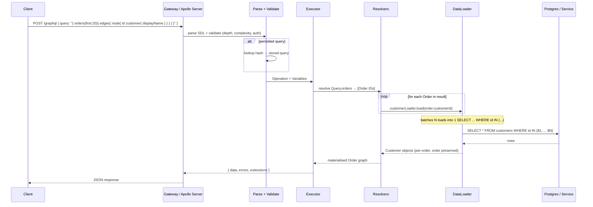
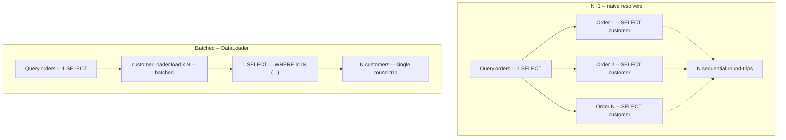
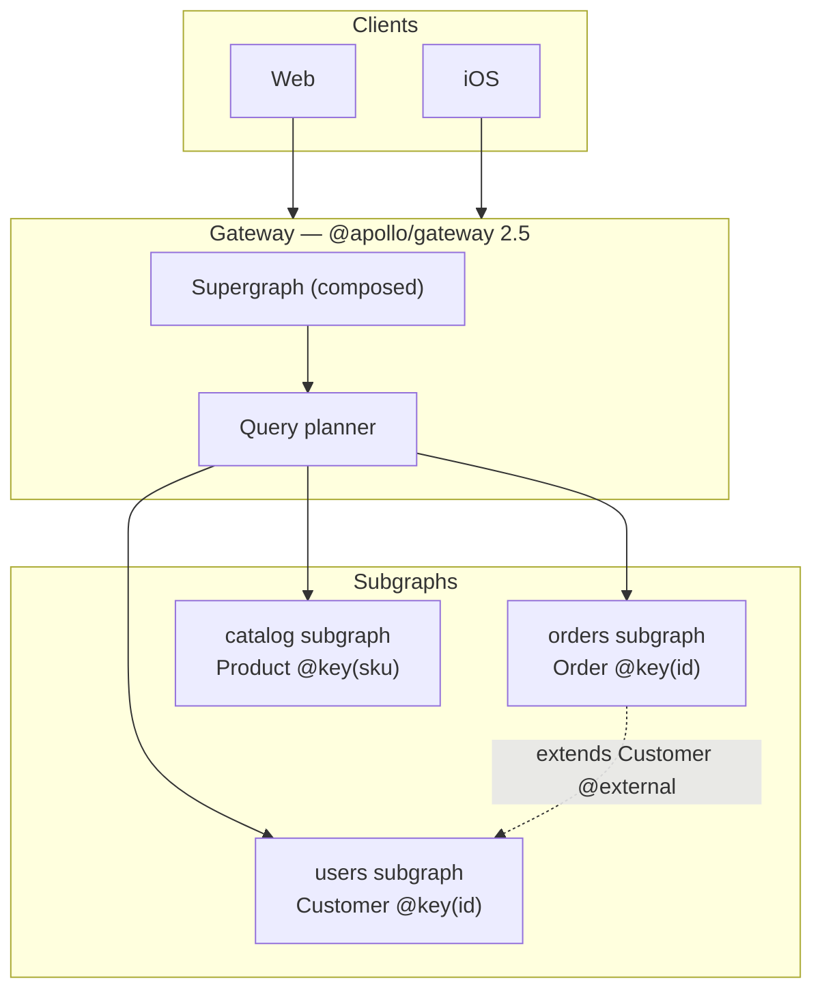
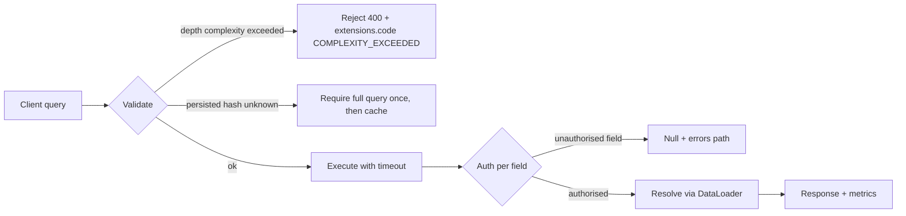
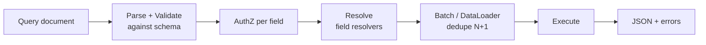
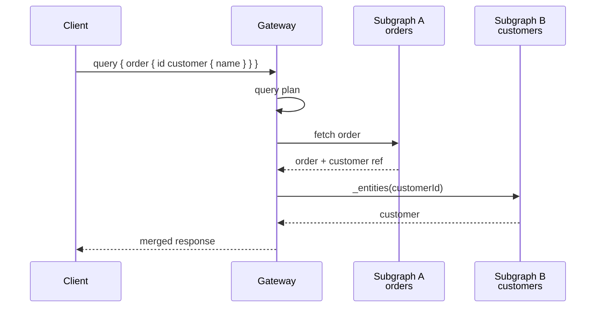
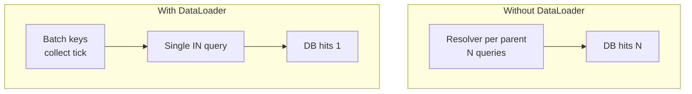

# Chapter 4 — GraphQL for Backend Engineers

**What this chapter covers.** REST gives you resources; gRPC gives you typed RPCs. GraphQL gives you a *queryable graph* — a single endpoint where clients describe the shape of the data they want and the server resolves it from whatever sources back it. That flexibility is why frontend teams love GraphQL (one round-trip, no over-fetching) and why backend teams approach it warily (arbitrary queries, the N+1 problem, cache-hostile POSTs, and a gateway that must orchestrate dozens of downstream services to answer one request). This chapter is the backend lens on GraphQL: when to choose it and — just as important — when *not* to; how to design a schema that remains coherent as it grows; how resolvers, batching, and DataLoader turn a naive graph traversal into an efficient execution plan; how federation and schema stitching distribute ownership without fragmenting the graph; and how to govern, secure, and observe a GraphQL gateway under production load. We anchor every pattern in real SDL and real Node.js code, pinned and runnable.

Learning goals — after this chapter you should be able to:

- Decide between GraphQL, REST (Chapter 2), and gRPC (Chapter 3) for a given surface using concrete criteria — consumer diversity, fetch patterns, cacheability, and team ownership — not fashion.
- Author a version-pinned GraphQL SDL with sound type design (objects, interfaces, unions, enums, input types), pagination, and error modelling, and explain why schema-first discipline matters.
- Trace a GraphQL execution from parse → validate → execute → resolve, diagnose the N+1 problem quantitatively, and implement DataLoader batching and caching to fix it.
- Configure Apollo Server 4 with depth/complexity limits, persisted queries, and tracing, and justify each as a production control.
- Compare schema stitching, Apollo Federation 2, and the monolithic gateway, and sketch a federated architecture that preserves team autonomy with a unified graph.
- Explain GraphQL's distributed-systems costs — gateway as a bottleneck, fan-out amplification, cache invalidation, and partial failure — and the mitigations that make it operable.

---

## Where GraphQL fits — and where it does not

GraphQL is not a replacement for REST or gRPC. It is a *product* for a specific consumer shape: many heterogeneous clients (web, iOS, Android, partner integrations) that need different projections of the *same* underlying domain, where the set of useful projections is too large to enumerate as REST endpoints and where the cost of over-fetching or waterfall requests is felt directly in user-perceived latency.

| Dimension | REST (Ch 2) | gRPC/Protobuf (Ch 3) | GraphQL |
|-----------|-------------|-----------------------|---------|
| Consumer | browsers, partners, any HTTP client | interior services you control | frontend apps with diverse data needs |
| Fetch shape | fixed per endpoint; client chooses endpoint | fixed per RPC; strongly typed | client chooses fields per query |
| Round-trips | often N (list then fetch each) without batch | 1 per RPC; streaming for sequences | 1 for an arbitrarily nested selection |
| Cacheability | excellent (`GET` + `ETag`/`Cache-Control`; CDN-friendly) | poor (binary, POST-like) | poor by default (POST, per-query shape) |
| Schema evolution | additive fields, versioned paths | package-versioned `.proto`, field-number compat | additive types/fields; `@deprecated`; no versioned URL |
| Tooling cost | low — `curl` + OpenAPI | codegen per language, `buf` | gateway, query analysis, DataLoader, federation |

The honest rule:

- **Use GraphQL** when a single domain (orders, users, catalog) is consumed by multiple frontend surfaces that need different field sets and relationship traversals, and where the alternative is either endpoint proliferation (`GET /orders?fields=...&include=...` growing without bound) or client-side waterfall fetches.
- **Do not use GraphQL** for service-to-service interior traffic (use gRPC), for cache-heavy public APIs behind a CDN (use REST), or for event-driven surfaces (use AsyncAPI/Kafka — Vol 10). Inserting GraphQL between two backend services you own trades debuggability and cacheability for flexibility neither caller needs.

> **Boundary note.** This chapter covers GraphQL *service design* — schema modelling, resolver execution, gateway architecture, and backend operability. The wire mechanics of the transports GraphQL rides on — HTTP/1.1 vs HTTP/2 vs WebSocket for subscriptions, TLS, and header compression — are covered in Volume 3, Chapters 7 and 10. The persistence and indexing that make paginated GraphQL queries fast are covered in Volume 5 (Databases), especially Chapters 3 (Indexing) and 4 (Query Optimization); this chapter notes the storage contract pagination depends on but does not re-derive it.

---

## Schema design — the graph as a contract

A GraphQL schema is the contract. Unlike REST, where the contract is spread across paths, methods, and an OpenAPI document, or gRPC where it lives in `.proto` files, the GraphQL SDL *is* the entire surface in one artifact. Every type, field, and directive is discoverable via introspection, which is both an asset (self-documenting, strongly typed clients via codegen) and a liability (the schema is a public commitment that is harder to version than a versioned REST path — see Chapter 5).

### Design principles

1. **Model the domain graph, not the storage graph.** Types should reflect product concepts (`Order`, `Customer`, `LineItem`) rather than tables. If a storage join is not a product relationship, do not expose it as one.
2. **Connections for collections, always.** The Relay Connection spec (`edges { node, cursor } + pageInfo`) is the GraphQL analogue of cursor pagination in Chapter 2 and Chapter 6. Use it for every list — even when the list is currently small — because changing a ` [Order!]!` to a `Connection` later is a breaking change.
3. **Input types for mutations, payload types for results.** `CreateOrderInput` and `CreateOrderPayload` give you room to add fields (e.g., `clientMutationId`, `errors`) without breaking the mutation signature.
4. **Enums with `@deprecated` and `UNSPECIFIED` discipline.** Like Protobuf enums (Chapter 3), GraphQL enums need a handling story for unknown values — clients must treat enums as open.
5. **Nullability is a design decision.** In GraphQL, `String` means nullable, `String!` means non-null. Be deliberate: a field that is non-null in the schema but nullable in storage will produce execution errors that null-bubble to the nearest nullable parent.

### A complete schema — Orders domain

The SDL below is a complete, `graphql@16.8.1`-valid schema covering the patterns you will use in production: object and input types, interfaces, unions, enums, the Relay Connection, directives, and deprecation. Versions pinned in comments.

```graphql
# schema.graphql — Orders subgraph (Apollo Federation 2.5 / graphql 16.8.1)
# Tooling: graphql@16.8.1, @apollo/server@4.10.0, @as-integrations/fastify@2.1.1
# Lint: graphql-eslint 3.20.1  (graphql-eslint --schema schema.graphql)
# Codegen: @graphql-codegen/cli@5.0.2
extend schema
  @link(url: "https://specs.apollo.dev/federation/v2.5", import: ["@key", "@shareable", "@external"])

# ---- Scalars ----
scalar DateTime  # RFC 3339, e.g. "2026-03-10T14:22:31Z"
scalar ULID      # 26-char Crockford Base32, e.g. "01H8X1ABCDEF1234567890AB"

# ---- Interfaces ----
interface Node {
  id: ULID!
}

# ---- Enums ----
enum OrderStatus {
  PENDING
  PAID
  SHIPPED
  CANCELLED
}

# ---- Objects ----
type Order implements Node @key(fields: "id") {
  id: ULID!
  customer: Customer!          # resolved via DataLoader (see § N+1)
  status: OrderStatus!
  totalCents: Int!             # Money as integer cents; Money object alternative in text
  createdAt: DateTime!
  updatedAt: DateTime!
  lineItems: [LineItem!]!
  labels: [Label!]!
  # Deprecated field retained for one sunset window (see Ch 5)
  legacyPriority: Int @deprecated(reason: "Use labels instead. Removal Sunsets 2026-12-31.")
}

type LineItem {
  sku: String!
  quantity: Int!
  unitPriceCents: Int!
}

type Label {
  key: String!
  value: String!
}

type Customer implements Node @key(fields: "id") {
  id: ULID!
  displayName: String!
  email: String!               # gateway should gate by auth scope
}

# ---- Connection (Relay) ----
type OrderConnection {
  edges: [OrderEdge!]!
  pageInfo: PageInfo!
  totalCount: Int              # optional; expensive — only when caller needs it
}

type OrderEdge {
  node: Order!
  cursor: String!              # opaque, base64url — see Ch 6 for construction
}

type PageInfo {
  hasNextPage: Boolean!
  hasPreviousPage: Boolean!
  startCursor: String
  endCursor: String
}

# ---- Inputs ----
input CreateOrderInput {
  customerId: ULID!
  lineItems: [LineItemInput!]!
  labels: [LabelInput!]
  idempotencyKey: String!       # UUID v4, see Ch 6
}

input LineItemInput {
  sku: String!
  quantity: Int!
}

input LabelInput {
  key: String!
  value: String!
}

input OrderFilter {
  status: OrderStatus
  createdAfter: DateTime
  customerId: ULID
}

enum OrderSort {
  CREATED_AT_ASC
  CREATED_AT_DESC
  TOTAL_CENTS_ASC
  TOTAL_CENTS_DESC
}

# ---- Payloads ----
type CreateOrderPayload {
  order: Order
  errors: [UserError!]!
}

type UserError {
  code: String!                # machine-readable, e.g. "BAD_REQUEST"
  message: String!
  path: [String!]
}

# Union for search results that span types
union SearchResult = Order | Customer

# ---- Root operations ----
type Query {
  node(id: ULID!): Node
  order(id: ULID!): Order
  orders(
    first: Int = 20
    after: String
    filter: OrderFilter
    sort: OrderSort = CREATED_AT_DESC
  ): OrderConnection!

  # Search across types — demonstrates union
  search(query: String!, first: Int = 10): [SearchResult!]!

  # Introspection-adjacent
  _service: String!
}

type Mutation {
  createOrder(input: CreateOrderInput!): CreateOrderPayload!
  cancelOrder(id: ULID!, reason: String): CreateOrderPayload!
}

type Subscription {
  # Requires WebSocket or SSE transport; see § subscriptions
  orderStatusChanged(customerId: ULID!): Order!
}
```

Design choices worth noting:

- **Relay Connections, not bare lists.** `orders` returns `OrderConnection`, not `[Order!]!`. Changing later would break every client that paginates. `first`/`after` cursors are opaque; the resolver builds them from `(created_at, id)` keyset columns — the same construction as the REST cursor in Chapter 2, whose storage mechanics are analysed in Volume 5, Chapter 3 (Indexing).
- **`Node` interface + `@key`.** Federation entities are identified by `@key(fields: "id")`. The gateway can resolve `Customer` from the users subgraph without the orders subgraph knowing how customers are stored.
- **Payload types with `errors`.** Mutations return `CreateOrderPayload { order, errors }` rather than throwing top-level GraphQL errors for user mistakes. Top-level `errors` are reserved for execution failures (auth, rate limiting); `payload.errors` carry validation problems the client can handle field-by-field.
- **`OrderFilter` as an input object**, not a string DSL. GraphQL's type system validates filters at parse time, unlike REST's `filter[status]` string convention — but the trade-off is that the filter set must be enumerated in the schema.

---

## Execution — from query to resolvers to DataLoader

A GraphQL request's lifecycle is more work than a REST handler's because the server must *plan* execution from the query shape:



*Figure 4-1: GraphQL execution lifecycle. The DataLoader batch window collapses N per-entity loads into one query — the critical optimisation for any non-trivial graph.*

### The N+1 problem — measured

The classic failure mode: a query asks for 20 orders and each order's customer. A naive resolver does:

```
1 query: SELECT * FROM orders ORDER BY created_at DESC LIMIT 20
20 queries: SELECT * FROM customers WHERE id = $1  (once per order)
```

At 20 orders this is 21 queries; at 200 (a large page or a nested traversal) it is 201. Under load, this is not merely slow — it exhausts connection pools and amplifies tail latency. At 1,000 RPS, 21 queries per request is 21,000 DB queries per second where 2,000 would suffice.



*Figure 4-2: N+1 versus batched execution. DataLoader's batch window turns N sequential point queries into one IN query, and its per-request memoisation prevents duplicate loads for the same entity within one operation.*

### Solving it — DataLoader

Facebook's `dataloader@2.2.2` is the standard solution. It provides two guarantees per request: **batching** (collect `load()` calls within one tick, dispatch as one function call) and **memoisation** (duplicate `load(id)` within one request hits cache, not the data source). Both are scoped to a single GraphQL operation — a new request gets a fresh loader, so cross-request staleness is not a concern.

Real, runnable implementation — Node 20.11.0, Apollo Server 4.10.0, DataLoader 2.2.2, pg 8.11.3:

```js
// loaders.js — Node 20.11.0, dataloader@2.2.2, pg@8.11.3
import DataLoader from "dataloader";
import { pool } from "./db.js"; // pg.Pool — configured in app.js

/**
 * Batch function: DataLoader calls this with all keys collected in one tick.
 * Must return Promise<Array<V>> of the same length and order as `ids`.
 * Missing keys map to null (or an Error) at that index.
 */
async function batchCustomers(ids) {
  // ids: string[] — ULIDs
  const { rows } = await pool.query(
    `SELECT id, display_name, email FROM customers WHERE id = ANY($1)`,
    [ids],
  );
  const byId = new Map(rows.map((r) => [r.id, r]));
  return ids.map((id) => byId.get(id) ?? null);
  // Alternative for strict: return Error for missing, so GraphQL null-bubbles correctly
  // return ids.map((id) => byId.get(id) ?? new Error(`Customer ${id} not found`));
}

export function createLoaders() {
  return {
    customerLoader: new DataLoader(batchCustomers, {
      cache: true,          // per-request memoisation (default true)
      maxBatchSize: 100,     // split large batches to stay under query param limit
    }),
    // Add loaders per entity — orderLoader, productLoader, etc.
  };
}
```

```js
// server.js — @apollo/server@4.10.0, @as-integrations/fastify@2.1.1, graphql@16.8.1
// Node 20.11.0
import Fastify from "fastify";
import { ApolloServer } from "@apollo/server";
import fastifyApollo, { fastifyApolloDrainPlugin } from "@as-integrations/fastify";
import { readFileSync } from "fs";
import { createLoaders } from "./loaders.js";
import { pool } from "./db.js";

const typeDefs = readFileSync("./schema.graphql", "utf8");

const resolvers = {
  Node: {
    __resolveType(obj) {
      if (obj.display_name !== undefined) return "Customer";
      if (obj.status !== undefined) return "Order";
      return null;
    },
  },
  SearchResult: {
    __resolveType(obj) {
      return obj.display_name !== undefined ? "Customer" : "Order";
    },
  },
  Query: {
    async order(_, { id }, { loaders }) {
      const { rows } = await pool.query(`SELECT * FROM orders WHERE id = $1`, [id]);
      return rows[0] ?? null;
    },
    async orders(_, { first = 20, after, filter, sort = "CREATED_AT_DESC" }) {
      // cursor pagination — decode opaque cursor (base64url JSON)
      let cursor = null;
      if (after) {
        try {
          cursor = JSON.parse(Buffer.from(after, "base64url").toString("utf8"));
        } catch {
          throw new Error("Invalid cursor");
        }
      }
      const limit = Math.min(first, 100) + 1; // one-extra trick
      const where = [];
      const params = [];
      let idx = 1;
      if (filter?.status) { where.push(`status = $${idx++}`); params.push(filter.status.toLowerCase()); }
      if (filter?.createdAfter) { where.push(`created_at >= $${idx++}`); params.push(filter.createdAfter); }
      if (filter?.customerId) { where.push(`customer_id = $${idx++}`); params.push(filter.customerId); }
      if (cursor) {
        // keyset on (created_at, id) — requires composite index; see Vol 5 Ch 3
        const op = sort.endsWith("_ASC") ? ">" : "<";
        where.push(`(created_at, id) ${op} ($${idx}, $${idx + 1})`);
        params.push(cursor.created_at, cursor.id);
        idx += 2;
      }
      const dir = sort.endsWith("_ASC") ? "ASC" : "DESC";
      const whereSQL = where.length ? `WHERE ${where.join(" AND ")}` : "";
      const { rows } = await pool.query(
        `SELECT * FROM orders ${whereSQL} ORDER BY created_at ${dir}, id ${dir} LIMIT $${idx}`,
        [...params, limit],
      );
      const hasNextPage = rows.length > first;
      const page = hasNextPage ? rows.slice(0, first) : rows;
      const edges = page.map((row) => ({
        node: row,
        cursor: Buffer.from(JSON.stringify({ created_at: row.created_at.toISOString(), id: row.id })).toString("base64url"),
      }));
      return {
        edges,
        pageInfo: {
          hasNextPage,
          hasPreviousPage: cursor !== null,
          startCursor: edges[0]?.cursor ?? null,
          endCursor: edges[edges.length - 1]?.cursor ?? null,
        },
        totalCount: null, // omit COUNT(*) at scale unless caller explicitly needs it
      };
    },
    search: async (_, { query, first }) => {
      // simplified — real implementation fans out to search index
      return [];
    },
  },
  Order: {
    // This resolver is where N+1 would happen — DataLoader fixes it
    customer(parent, _, { loaders }) {
      return loaders.customerLoader.load(parent.customer_id);
    },
    lineItems(parent) {
      // line items stored as JSONB or separate table — no N+1 if fetched with order
      return parent.line_items ?? [];
    },
    labels(parent) {
      return Object.entries(parent.labels ?? {}).map(([k, v]) => ({ key: k, value: v }));
    },
  },
  Mutation: {
    async createOrder(_, { input }, { loaders }) {
      // Idempotency handled by DB unique constraint on idempotency_key — see Ch 6
      try {
        const { rows } = await pool.query(
          `INSERT INTO orders (id, customer_id, status, total_cents, line_items, labels, idempotency_key)
           VALUES (gen_ulid(), $1, 'pending', $2, $3, $4, $5)
           ON CONFLICT (idempotency_key) DO NOTHING
           RETURNING *`,
          [input.customerId, 0, JSON.stringify(input.lineItems), JSON.stringify(input.labels ?? []), input.idempotencyKey],
        );
        if (rows.length === 0) {
          // replay — fetch original
          const existing = await pool.query(`SELECT * FROM orders WHERE idempotency_key = $1`, [input.idempotencyKey]);
          return { order: existing.rows[0], errors: [] };
        }
        return { order: rows[0], errors: [] };
      } catch (e) {
        return { order: null, errors: [{ code: "INTERNAL", message: e.message, path: ["createOrder"] }] };
      }
    },
  },
};

const app = Fastify({ logger: true });

const server = new ApolloServer({
  typeDefs,
  resolvers,
  introspection: process.env.NODE_ENV !== "production",
  plugins: [fastifyApolloDrainPlugin(app)],
});

await server.start();

await app.register(fastifyApollo(server), {
  context: async (request) => ({
    loaders: createLoaders(), // fresh per request — critical for correctness
    user: request.user,       // set by auth hook below
  }),
});

// Auth hook — parse JWT, attach user to request (see Vol 9 Ch 5)
app.addHook("onRequest", async (request) => {
  const auth = request.headers.authorization;
  if (auth?.startsWith("Bearer ")) {
    request.user = await verifyJWT(auth.slice(7)); // throws 401 on invalid
  }
});

await app.listen({ port: 4000, host: "0.0.0.0" });
```

Key choices:

- **`createLoaders()` per request.** DataLoader's cache is per-operation. Sharing a loader across requests would serve stale data; sharing across operations within one request is exactly what you want.
- **`maxBatchSize: 100`.** Postgres has a parameter limit and large `IN (...)` degrades. Splitting into chunks of 100 keeps each query bounded.
- **Keyset pagination in the resolver, not `OFFSET`.** Offset pagination (`LIMIT 20 OFFSET 40000`) forces the database to scan and discard 40,000 rows; keyset (`WHERE (created_at, id) > (...)`) is a range scan on the composite index. The storage implications — why that index exists and how the planner uses it — are the subject of Volume 5, Chapters 3 and 4; here we honour the contract that pagination must be stable and efficient.
- **One-extra trick.** Fetch `first + 1` rows; the extra row tells you `hasNextPage` without a separate `COUNT(*)`.

### Beyond DataLoader — when batching is not enough

DataLoader solves per-entity N+1. Two deeper cases remain:

- **Nested N+1.** `orders → customer → organisation → billingAccount` can still cascade loaders sequentially. The fix is either a join at the `orders` resolver (fetch customers with orders in one query when the traversal is known) or a look-ahead in the executor that batches across levels.
- **The fan-out problem.** A query ` { customers(first:100) { orders(first:50) { lineItems } } }` requests up to 5,000 orders and their line items in one operation. No batching strategy makes that cheap. The mitigation is *query complexity analysis* (next section) that rejects or budgets such queries before execution.

---

## Federation — scaling ownership of the graph

A single `schema.graphql` owned by one team does not scale. Ten teams each owning a bounded context need to contribute types to a unified graph without coordinating on a single file. Two patterns dominate:

| Approach | How it works | Trade-off |
|----------|--------------|-----------|
| **Schema stitching** | Each service exposes a GraphQL schema; gateway merges them with `mergeSchemas` + `delegateToSchema` | Flexible, but gateway owns all merge logic; type conflicts are runtime errors |
| **Apollo Federation 2** (`@apollo/subgraph@2.5`, `@apollo/gateway@2.5`, `federation@2.5`) | Each subgraph declares `@key` entities; gateway composes a supergraph via `rover supergraph compose` | Entities are first-class; composition is validated at build time; requires Federation-aware subgraphs |
| **Monolithic gateway** | One codebase, many resolvers | Simplest, but single ownership bottleneck |

For most organisations beyond ~5 subgraphs, **Federation 2** is the right default: composition is validated in CI, entity ownership is explicit, and teams deploy subgraphs independently.



*Figure 4-3: Federated graph. Each subgraph owns its entities; the gateway's query planner fans out one client query into subgraph queries and joins the results.*

Minimal federated subgraph (orders) — `@apollo/subgraph@2.5.2`:

```graphql
# orders subgraph — federation v2.5
extend schema @link(url: "https://specs.apollo.dev/federation/v2.5", import: ["@key", "@shareable", "@external"])

type Order @key(fields: "id") {
  id: ULID!
  customer: Customer!
  status: OrderStatus!
  totalCents: Int!
  createdAt: DateTime!
}

# Customer is owned by users subgraph; orders extends it
type Customer @key(fields: "id") @extends {
  id: ULID! @external
}

type Query {
  order(id: ULID!): Order
  orders(first: Int, after: String): OrderConnection!
}
```

Composition and validation in CI:

```bash
# rover 0.24.0 — compose supergraph, fail on composition errors
rover supergraph compose --config supergraph.yaml --output supergraph.graphql
# supergraph.yaml pins subgraph URLs and SDL locations
# rover validates: no duplicate type definitions, @key consistency, @external correctness

# Alternative: @apollo/composition without rover (Node 20)
npx @apollo/composition compose --config supergraph.yaml
```

> **Distributed-systems lens.** Federation moves the join from the database to the gateway. A query that traverses `Order → Customer → Organisation` fans out to three subgraphs, each with its own latency, failure mode, and rate limit. The gateway's query planner must handle partial failure (one subgraph times out but others succeed — return partial `data` with `errors`), deadline propagation (pass the caller's remaining budget to each subgraph), and result-size bounding. Treat the gateway as a distributed orchestrator, not a thin proxy.

---

## Securing and operating the gateway

GraphQL's power — arbitrary query shapes over a single endpoint — is also its threat surface. Four controls are non-negotiable in production:

### 1. Depth and complexity limits

Without limits, a client can send `{ order { customer { orders { customer { ... } } } } }` nested 50 levels deep, or request 100 fields each costing a DB query.

```js
// Apollo Server 4 — depth + complexity limits
// @apollo/server@4.10.0, graphql-depth-limit@1.1.0, graphql-validation-complexity@0.4.2
import depthLimit from "graphql-depth-limit";
import { createComplexityLimitRule } from "graphql-validation-complexity";

const server = new ApolloServer({
  typeDefs,
  resolvers,
  validationRules: [
    depthLimit(10),                                      // max nesting depth
    createComplexityLimitRule(1000, {                    // max complexity score
      scalarCost: 1,
      objectCost: 2,
      listFactor: 10,
      // field costs can be overridden per field via directive
    }),
  ],
});
```

### 2. Persisted queries (Automatic Persisted Queries — APQ)

Instead of sending the full query string each time, clients send a hash (SHA-256) of the query; the server stores the mapping. This saves bandwidth, makes `GET`-caching possible for queries (the hash is cache-key friendly), and restricts the surface to pre-registered queries if you disable ad-hoc execution — the strongest protection against query abuse.

```js
// Client (Apollo Client 3.9.4) — APQ enabled by default with HttpLink
// Server — Apollo Server 4 has APQ via cache; provide a Keyv/Redis backing
import Keyv from "keyv"; // keyv@4.5.4

const server = new ApolloServer({
  typeDefs,
  resolvers,
  cache: new Keyv("redis://localhost:6379"), // APQ + response cache
  persistedQueries: { ttl: 86_400 },          // 24h
  allowBatchedHttpRequests: false,             // disable unless you need it
});
```

Locking down to only persisted queries (no ad-hoc):

```js
// Reject queries not in the allowlist — best for production
import { createPersistedQueryMiddleware } from "./persisted-queries.js";
app.addHook("preHandler", createPersistedQueryMiddleware({ allowlistOnly: true }));
```

### 3. Timeouts, rate limiting, and auth

- **Per-query timeout.** Wrap execution with `Promise.race` or `AbortController`; propagate deadlines to DataLoader batch functions so slow DB queries do not hold the gateway.
- **Rate limiting by query cost, not request count.** One GraphQL request can cost 1,000× more than another. Rate-limit on complexity score or on DataLoader batch count.
- **Field-level auth.** `Customer.email` should not be resolvable without `read:customers:pii` scope. Use schema directives (`@auth(requires: READ_PII)`) checked in a `fieldResolver` wrapper, not in each resolver individually.

### 4. Observability

```js
// Apollo Server plugin — log per-field resolver latency
const timingPlugin = {
  async requestDidStart() {
    return {
      async executionDidStart() {
        return {
          willResolveField({ info }) {
            const start = performance.now();
            return () => {
              const ms = performance.now() - start;
              if (ms > 50) console.warn(`slow resolver ${info.parentType.name}.${info.fieldName}: ${ms.toFixed(1)}ms`);
            };
          },
        };
      },
    };
  },
};
```



*Figure 4-4: Production query lifecycle. Validation rejects abusive queries before execution; auth is field-level; DataLoader and timeouts bound the cost of what remains.*

---

## Caching — where GraphQL pays a price

REST's cacheability (Chapter 2: `GET` + `ETag` + `Cache-Control`) does not transfer cleanly to GraphQL because:

- Queries are `POST` by default (bodies are not cache keys in CDNs).
- Each query has a different shape, so response caching is per-query-hash, not per-resource.
- Mutations can invalidate many cached queries; the invalidation graph is the schema graph.

Mitigations:

| Strategy | How | When |
|----------|-----|------|
| **APQ over GET** | `GET /graphql?extensions={"persistedQuery":{"hash":"..."}}` — hash is the cache key | When CDN caching matters and queries are persisted |
| **Response cache per subgraph** | Gateway caches subgraph responses by entity key with short TTL | Interior fan-out where subgraph data changes slowly |
| **Client-side normalised cache** | Apollo Client `InMemoryCache` keyed by `__typename + id` | Frontend deduplication; not a server concern but reduces origin load |
| **`@cacheControl` directive** | `type Order @cacheControl(maxAge: 10)` — gateway emits `Cache-Control` per field | Fine-grained TTLs when the gateway speaks HTTP caching |

Do not try to replicate REST's `ETag`/`If-None-Match` semantics at the GraphQL layer. If cacheability at the edge is a primary requirement for a surface, that surface should be REST.

---

## Subscriptions — real-time over GraphQL

Subscriptions (`type Subscription { orderStatusChanged(customerId: ULID!): Order! }`) give clients a push stream for events. In production they ride on WebSocket (`graphql-ws@5.14.1`) or SSE, not HTTP/2 streaming.

```js
// Subscriptions with graphql-ws 5.14.1 + @apollo/server 4.10.0
import { WebSocketServer } from "ws"; // ws@8.16.0
import { useServer } from "graphql-ws/lib/use/ws";
import { PubSub } from "graphql-subscriptions"; // graphql-subscriptions@2.0.0

const pubsub = new PubSub();

const resolversWithSubs = {
  Subscription: {
    orderStatusChanged: {
      subscribe: (_, { customerId }) => pubsub.asyncIterator(`ORDER_STATUS:${customerId}`),
    },
  },
};

// Publish from mutation or event consumer (Vol 10)
await pubsub.publish(`ORDER_STATUS:${order.customer_id}`, { orderStatusChanged: order });

// Wire up on Fastify — separate WS server
const wsServer = new WebSocketServer({ server: app.server, path: "/graphql" });
useServer({ schema: server.schema, context: () => ({ loaders: createLoaders() }) }, wsServer);
```

> **Distributed-systems lens.** Each subscription holds a server resource (WebSocket + iterator) for its lifetime. At 100,000 concurrent subscriptions, that is 100,000 open connections — a different scaling regime from stateless `POST /graphql`. Use subscriptions only when polling is genuinely insufficient (sub-second updates, collaborative state). For everything else, short-poll the query or consume events via Kafka (Vol 10, Ch 3).

---


#### GraphQL Execution Pipeline



#### Federation Gateway



#### N+1 and DataLoader



## Key takeaways

- GraphQL's strength is client-shaped fetches over a unified graph; its cost is a gateway that must plan, batch, and bound arbitrary queries. Choose it for heterogeneous frontend consumers, not for interior service-to-service traffic.
- Design the schema as the contract: Relay Connections for all lists, input/payload types for mutations, `Node` + `@key` for federation, and deliberate nullability. Validate with `graphql-eslint` and generate typed clients with `graphql-codegen`.
- The N+1 problem is not theoretical — it is the default behaviour of naive resolvers. `dataloader@2.2.2` with per-request scoping and `maxBatchSize` bounds collapses N point queries into one `IN` query. Scope loaders per request and measure before and after.
- Federation 2 (`@apollo/subgraph@2.5`) distributes graph ownership to bounded-context teams with build-time composition validation via `rover supergraph compose`. The gateway becomes a query planner that must handle fan-out, partial failure, and deadline propagation.
- Production requires depth/complexity limits, persisted queries (with allowlist-only as the strictest posture), field-level auth, per-query timeouts, and resolver-level observability. Without these, one abusive query can saturate your data sources.
- Caching in GraphQL is per-query-hash, not per-resource — weaker than REST's `ETag` model. Use APQ over `GET` for CDN reach, subgraph response caching for interior fan-out, and normalised client caches for deduplication. When edge cacheability dominates, prefer REST.
- Subscriptions scale by connection count. Use `graphql-ws@5.14.1` and `PubSub` for true real-time, but default to polling or event streaming (Vol 10) unless sub-second push is required.

## Further reading

- GraphQL Foundation. *GraphQL Specification* (October 2021). https://spec.graphql.org/October2021/ — the authoritative spec; §5 (Validation) and §6 (Execution) are essential.
- Apollo. *Apollo Federation 2.5 Documentation*. https://www.apollographql.com/docs/federation/ — supergraph composition, `@key`/`@shareable` semantics, and gateway query planning.
- Apollo. *Apollo Server 4.10 Documentation*. https://www.apollographql.com/docs/apollo-server/ — `@apollo/server@4.10.0`, APQ, plugins, and Fastify integration.
- Facebook / GraphQL. *DataLoader 2.2.2*. https://github.com/graphql/dataloader — batching and per-request memoisation; read the source — it is ~300 lines.
- Relay. *GraphQL Cursor Connections Specification*. https://relay.dev/graphql/connections.htm — the `edges { node, cursor } + pageInfo` contract used throughout this chapter.
- Hartig, O. & Pérez, J. *Semantics and Complexity of GraphQL* (WWW 2018) — formal analysis of GraphQL query complexity and why depth/complexity bounding is necessary.
- `graphql-eslint@3.20.1`, `@graphql-codegen/cli@5.0.2`, `rover@0.24.0` — versions pinned for lint, codegen, and supergraph composition in this chapter.

