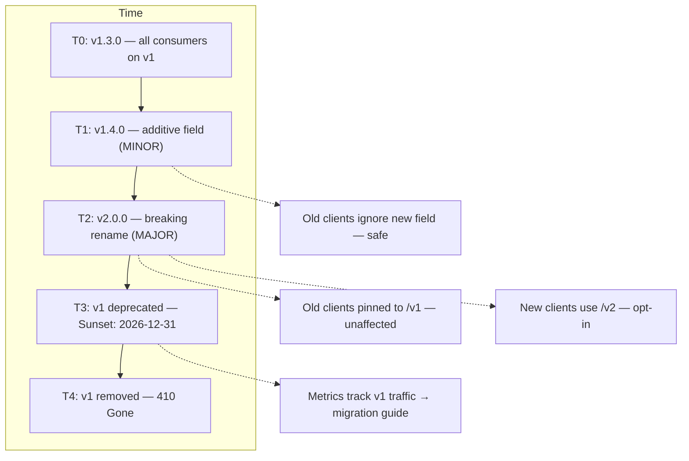
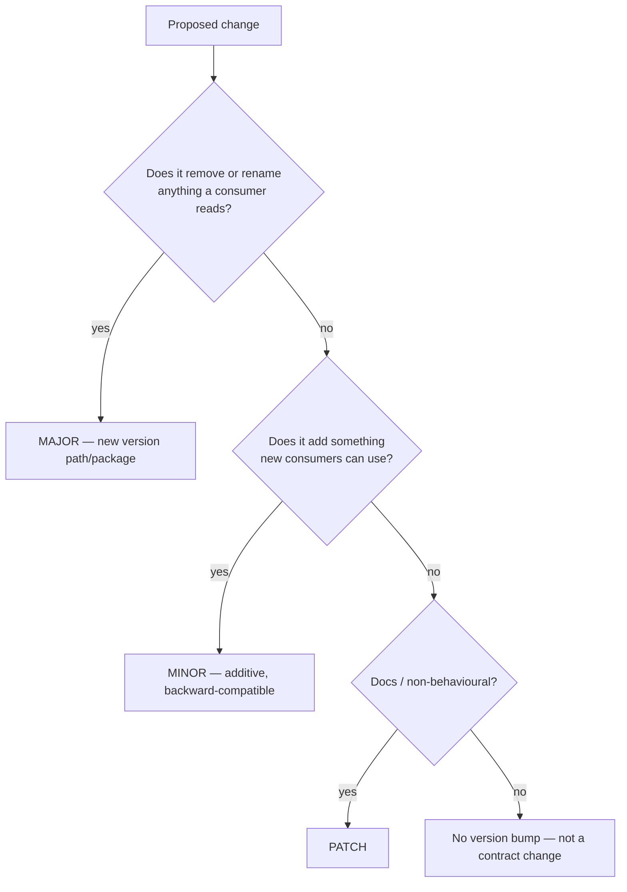
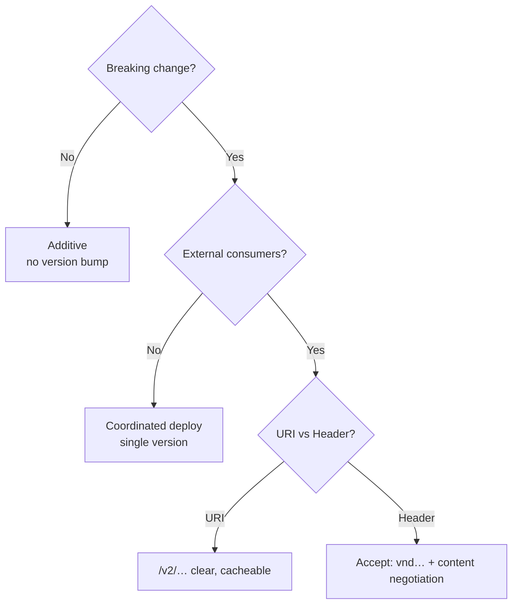
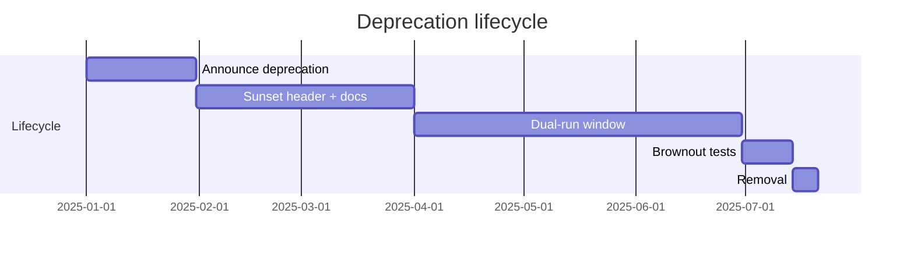
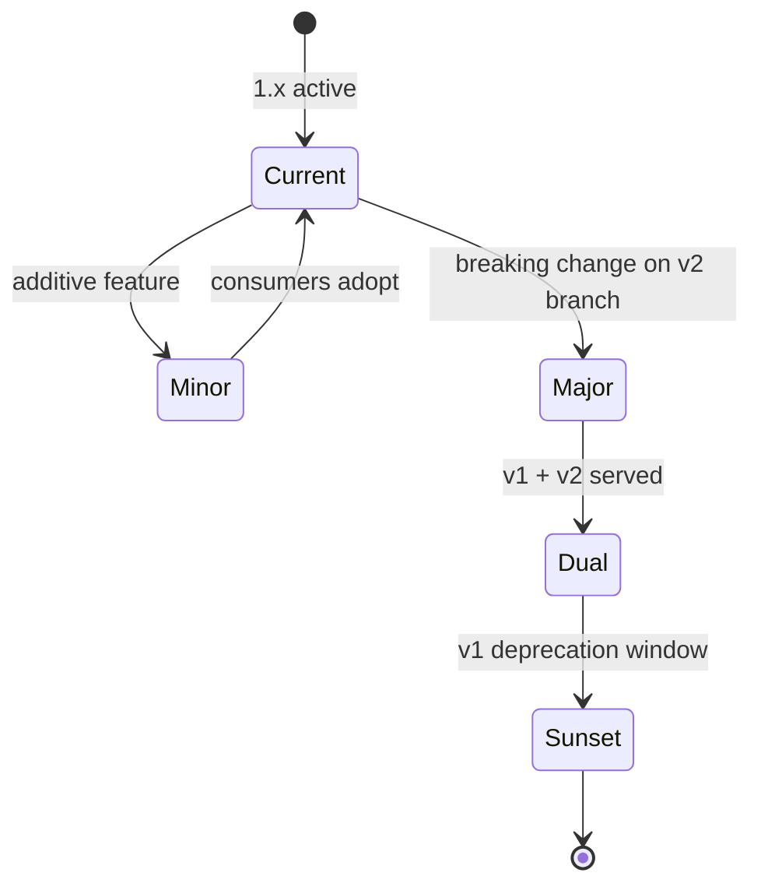

# Chapter 5 — Versioning and Evolution

**What this chapter covers.** Every API that reaches production acquires consumers you cannot synchronously update — other teams, other regions, cached mobile binaries, and partner integrations that will not redeploy because you asked nicely. Versioning is the discipline that lets producers and consumers evolve independently without coordination, and evolution is the set of compatibility rules that determine whether a change is safe to ship without bumping a version. This chapter makes both precise: the three versioning strategies (path, header, content negotiation) and when each fits, Semantic Versioning applied to API contracts rather than packages, the expand-contract pattern that lets you change persisted state and wire schemas without downtime, and the deprecation-and-sunset machinery (RFC 8594, RFC 9745, `Sunset`/`Deprecation` headers, migration guides, dual-serve windows) that retires old behaviour safely. We build the discussion around real OpenAPI and Protobuf examples, a version-pinned `buf breaking` gate, and SQL migrations that run while three revisions of the service are serving traffic.

Learning goals — after this chapter you should be able to:

- Apply Semantic Versioning to API contracts (not just libraries), explain what MAJOR/MINOR/PATCH mean for OpenAPI and Protobuf surfaces, and choose the correct bump for a given change.
- Compare URI, header, and content-negotiation versioning on debuggability, cacheability, gateway routing, and consumer ergonomics, and select correctly per surface.
- Execute the expand-contract pattern for both wire schemas and storage schemas, including the intermediate dual-read/dual-write window that makes zero-downtime evolution possible.
- Design a deprecation and sunset lifecycle with `Deprecation`/`Sunset` headers, `410 Gone` versus `404`, traffic-based sunset criteria, and a migration guide that consumers can actually follow.
- Wire `buf breaking` and `oasdiff breaking` into CI so breaking changes fail the build unless the version bump and migration guide match policy.
- Explain versioning through a distributed-systems lens: rolling deploys with mixed versions, version-aware routing, and the blast radius of a breaking change when old clients are still in the wild.

---

## Why APIs version — the distributed-systems reason

In a monolith, changing a function signature is a single commit: the compiler enumerates every call site and you fix them. In a distributed system, there is no global compiler. A service may have 40 consumers, three of which are outside your organisation, five of which cache a client binary on a mobile device you cannot force-upgrade, and two of which are batch jobs that deploy quarterly. Changing `status` from a string to an enum, or renaming `customer_id` to `customerId`, is not a rename — it is a deserialization failure in a process you did not build, running in a region you do not operate, at 03:00 when you are asleep.

Versioning is the answer to a single question: *how does a producer ship a change without requiring every consumer to ship at the same time?* The mechanisms differ, but the invariant is the same: at any moment, multiple versions of the contract are *in flight* — in different clients, different gateway routes, and different service revisions doing a rolling deploy.



*Figure 5-1: Version timeline. Additive changes ship as MINOR without coordination; breaking changes ship as MAJOR with a sunset window; old and new versions are served concurrently.*

> **Boundary note.** This chapter covers *API contract* versioning and evolution — how URIs, headers, and schemas change safely. *Storage* versioning — how tables, indexes, and serialized payloads evolve without downtime — is covered in Volume 5, Chapters 4 (Query Optimization), 7 (WAL/Recovery), and 14 (Pooling/Migrations). Where this chapter shows a SQL migration, it is to illustrate the wire-storage coordination point, not to re-derive storage internals. The wire-format compatibility matrix for Protobuf field types is detailed in Volume 8, Chapter 8 (Compatibility and Wire Formats).

---

## Semantic Versioning for contracts

Semantic Versioning (SemVer 2.0.0 — https://semver.org/) is often misapplied to APIs because it was written for packages. For a library, MAJOR means \"API-incompatible change to the package interface.\" For a service contract, the same words apply but the units differ: the version is the *contract* version, not the service's deploy version. Service `orders` at deploy `2026.03.15` may still be serving `GET /v1/orders` (contract `v1`) and `GET /v2/orders` (contract `v2`) simultaneously.

### What MAJOR, MINOR, PATCH mean for an API

| Bump | OpenAPI example | Protobuf example | Consumer action |
|------|-----------------|------------------|-----------------|
| **MAJOR** (`1.0.0 → 2.0.0`) | Remove `GET /v1/orders`, rename `status` values, change `required` to add a new required field | Change field number, remove field without `reserved`, change wire type, new package `acme.orders.v2` | Must migrate — old contract still served until Sunset |
| **MINOR** (`1.4.0 → 1.5.0`) | Add `GET /v1/orders/{id}/shipments`, add optional `updated_at` to `Order`, add enum value `refunded` | Add field with new number, add enum value with handling for unknown | No action — old clients ignore the addition |
| **PATCH** (`1.4.0 → 1.4.1`) | Fix `description`, correct `example`, tighten `pattern` without changing valid values | Fix `deprecated` annotation, add `option deprecated = true` | No action |

Rules that prevent the common mistakes:

- **Adding an optional field is MINOR** — but only if consumers treat unknown fields as ignorable (JSON) or unknown tags as skipped (Protobuf). If a consumer does strict `additionalProperties: false` validation on responses, your MINOR breaks them. Document that consumers must ignore unknown fields.
- **Adding a required field is MAJOR.** Existing clients that `POST /v1/orders` without the new field will get `400` after your deploy.
- **Changing validation (tightening) is MAJOR.** Adding `minLength: 1` to a field that previously accepted `""` rejects payloads that previously succeeded.
- **Deprecation is MINOR; removal is MAJOR.** Marking `legacyPriority` as `deprecated` warns consumers; removing it breaks them (see § Deprecation below).



*Figure 5-2: SemVer decision tree for API contracts. \"Remove or rename\" includes tightening validation and making an optional field required.*

### Versioning the artifact, not just the URL

A disciplined setup versions the spec artifact alongside the route:

```bash
# Artifact layout — same pattern for OpenAPI and Protobuf
apis/
  orders/
    openapi/
      v1/openapi.yaml        # 1.4.0 — served at /v1/orders
      v2/openapi.yaml        # 2.0.0 — served at /v2/orders
    proto/
      acme/orders/v1/order.proto   # package acme.orders.v1
      acme/orders/v2/order.proto   # package acme.orders.v2 (when needed)
```

Each version is tagged and published:

```bash
# Tag and publish — OpenAPI example
git tag apis/orders@v1.4.0 && git push origin apis/orders@v1.4.0
# Registry publish (choose one)
npx @redocly/cli@1.14.0 push apis/orders/openapi/v1/openapi.yaml --branch main
# Buf Schema Registry (for Protobuf)
buf push --tag v1.4.0
```

The service binary may serve both versions from the same deploy — or v1 and v2 may be separate deployments behind a gateway that routes by path/header. Either way, the version is a property of the *contract*, not the binary.

---

## Three strategies for carrying the version

There is no single correct place to put the version. The trade-off is debuggability and cacheability versus purity and evolvability, and the right answer depends on where the API sits.

### 1. URI versioning — `/v1/orders`, `/v2/orders`

The most common choice for REST at scale. The version is part of the resource path.

**Pros:** Visible in every log line and `curl` command; trivially routable at the gateway/CDN layer (`/v1/* → orders-v1`, `/v2/* → orders-v2`); cache keys are naturally versioned; `Host` + `path` is the cache identity — no `Vary` needed.

**Cons:** The version is not an HTTP-layer concern — it leaks API lifecycle into the resource identifier. Some REST purists consider it un-RESTful (Fielding's position was that versioning belongs in content negotiation). In practice, this objection has not prevented its adoption by AWS, Stripe, Google, and GitHub.

```yaml
# openapi.yaml — URI versioning
servers:
  - url: https://api.example.com/v1
    description: Orders v1
  - url: https://api.example.com/v2
    description: Orders v2 (MAJOR — breaking)
paths:
  /orders: { get: { operationId: listOrders, ... } }  # effective: GET /v1/orders or /v2/orders
```

Gateway routing (Envoy / NGINX example — any L7 proxy applies):

```yaml
# envoy.yaml fragment — Envoy 1.30.1
routes:
  - match: { prefix: "/v1/orders" }
    route: { cluster: orders-v1, prefix_rewrite: "/orders" }
  - match: { prefix: "/v2/orders" }
    route: { cluster: orders-v2, prefix_rewrite: "/orders" }
```

### 2. Header versioning — `Accept: application/vnd.example.v1+json`

The version rides in a media-type header. The URI stays stable (`GET /orders`).

**Pros:** More correct per HTTP semantics — versioning is a representation concern, not a resource identity concern. One URI identifies the resource; `Accept` selects the representation.

**Cons:** Harder to debug (`curl -H "Accept: ..."` is less obvious than a path), harder to cache (requires `Vary: Accept`), harder to route at L7 without header-aware rules, and not visible in naive access logs that only record the path.

```http
GET /orders HTTP/1.1
Host: api.example.com
Accept: application/vnd.example.orders.v1+json
```

```js
// Express 4.18.2 — header-versioned dispatch (when you must)
app.get("/orders", (req, res) => {
  const accept = req.headers.accept ?? "";
  if (accept.includes("vnd.example.orders.v2")) return handleV2(req, res);
  if (accept.includes("vnd.example.orders.v1")) return handleV1(req, res);
  return res.status(406).json({ code: "NOT_ACCEPTABLE", message: "Unknown version" });
});
```

### 3. Content negotiation via `Accept` with profile — `Accept: application/json; profile="v2"`

A lighter variant of header versioning using a parameter rather than a vendor media type. Rare in practice; mentioned for completeness because some standards (e.g., `application/merge-patch+json` — RFC 7396) use it.

**Recommendation:**

- **External/partner REST:** URI versioning (`/v1/...`). It wins on debuggability and cacheability, which dominate at the edge.
- **Interior gRPC/Protobuf:** Package versioning (`acme.orders.v1`, `acme.orders.v2`) — the `.proto` package *is* the version; no HTTP path needed.
- **GraphQL (Ch 4):** No versioned URL. Evolution is additive with `@deprecated` and field-level deprecation; breaking changes use new fields/types rather than a new endpoint. Chapter 4 covers this — GraphQL's graph is versioned by *capability*, not by *path*.
- **Header versioning:** Only when a single stable URI is a hard requirement (e.g., a resource that is also a web page whose URL must not change). Otherwise, prefer URI for REST.

> **Distributed-systems lens.** Whatever strategy you pick, the gateway must be able to route multiple versions concurrently. During a migration window, `orders-v1` and `orders-v2` may be separate deployments with separate capacity. The gateway's route table is the version registry at runtime; treat it as a versioned artifact (checked in, reviewed, deployed via CI) rather than a manual console edit.

---

## Evolution without downtime — the expand-contract pattern

Most breaking changes are not wire-only. Renaming `customer_id` to `customerId` in the API touches the JSON field, the Protobuf tag, the database column, the search index, and every consumer that reads the field. Doing all of that in one deploy requires coordination — exactly what versioning is meant to avoid.

The **expand-contract** pattern (also called parallel change) eliminates coordination by splitting a breaking change into three backward-compatible deploys:

1. **Expand** — add the new representation alongside the old; producers write both, consumers can read either.
2. **Migrate** — move all producers and consumers to the new representation; backfill stored data.
3. **Contract** — remove the old representation.

At no point is there a state where a writer has stopped writing the old field but a reader still needs it.

```mermaid
sequenceDiagram
    participant P as Producer (deploy)
    participant S as Storage
    participant C as Consumer
    Note over P,S: Phase 1 — Expand (MINOR)
    P->>S: write old + new (dual-write)
    C->>S: read old (unchanged)
    Note over P,S: Phase 2 — Migrate
    P->>S: backfill old → new for existing rows
    C->>C: switch to reading new
    Note over P,S: Phase 3 — Contract (MAJOR, after Sunset)
    P->>S: stop writing old; drop column
    C->>S: read new only
```

*Figure 5-3: Expand-contract. Each phase is independently deployable and rollback-safe; no phase requires producer and consumer to deploy simultaneously.*

### Example 1 — Renaming a REST/JSON field

**Goal:** Rename `customer_id` (snake_case) to `customerId` (camelCase) in `POST /v1/orders` and `GET /v1/orders/{id}`.

**Phase 1 — Expand (v1.5.0, MINOR):** Accept and return *both* fields. Writers populate both; readers may use either.

```yaml
# openapi.yaml — v1.5.0 (expand)
components:
  schemas:
    Order:
      type: object
      required: [id, status, created_at]
      # Neither customer field is required during expand — allows either/both
      properties:
        customer_id:  { type: string, pattern: '^[0-9A-HJKMNP-TV-Z]{26}$', deprecated: true }
        customerId:   { type: string, pattern: '^[0-9A-HJKMNP-TV-Z]{26}$' }
        status: { type: string, enum: [pending, paid, shipped, cancelled] }
        created_at: { type: string, format: date-time }
```

```js
// handler.js — Phase 1: dual-write, dual-read (Node 20.11.0, Express 4.18.2)
// Accept either field on input; return both on output.
function normalizeCustomerId(body) {
  const id = body.customerId ?? body.customer_id;
  if (!id) throw Object.assign(new Error("customerId required"), { status: 400 });
  return id;
}
app.post("/v1/orders", async (req, res) => {
  const customerId = normalizeCustomerId(req.body);
  const order = await db.createOrder({ customer_id: customerId, customerId, ...req.body });
  // Return both for backward compatibility
  res.status(201).json({ ...order, customer_id: order.customerId, customerId: order.customerId });
});
```

**Phase 2 — Migrate:** Update all consumers to send and read `customerId`. Backfill is trivial here (no stored JSON column to rewrite — but see storage example below). Monitor traffic: when `customer_id` usage drops below threshold (e.g., <1% of requests over 7 days), proceed.

**Phase 3 — Contract (v2.0.0, MAJOR):** Remove `customer_id`. Return `400` with a migration hint if it is sent.

```yaml
# openapi.yaml — v2.0.0 (contract)
components:
  schemas:
    Order:
      type: object
      required: [id, customerId, status, created_at]
      additionalProperties: false
      properties:
        customerId: { type: string, pattern: '^[0-9A-HJKMNP-TV-Z]{26}$' }
        # customer_id removed — sending it now fails validation
```

### Example 2 — Renaming a database column (storage expand-contract)

This is the case most teams get wrong, because the wire and storage evolutions are often attempted in one PR.

**Goal:** Rename `orders.customer_id` → `orders.customer_id_v2` or simply change its semantics (e.g., from `TEXT` to `ULID`-validated `CHAR(26)`).

```sql
-- Phase 1 — Expand (deploy 1): add new column, dual-write, backfill
-- Postgres 16.2
ALTER TABLE orders ADD COLUMN customer_id_v2 CHAR(26);
-- Backfill in batches (avoid long exclusive lock) — pg 16+ with CONCURRENTLY friendly
-- Application now writes both columns on every INSERT/UPDATE
UPDATE orders SET customer_id_v2 = customer_id
  WHERE customer_id_v2 IS NULL AND id IN (
    SELECT id FROM orders WHERE customer_id_v2 IS NULL LIMIT 10000
  );
-- Repeat until 0 rows remain; or use a background job

-- Dual-read in application: COALESCE(customer_id_v2, customer_id)
-- CREATE INDEX CONCURRENTLY on new column before switching reads to it
CREATE INDEX CONCURRENTLY idx_orders_customer_v2 ON orders (customer_id_v2);

-- Phase 2 — Migrate: switch all reads to customer_id_v2
-- Application now reads customer_id_v2 exclusively

-- Phase 3 — Contract (after sunset window): drop old column
ALTER TABLE orders DROP COLUMN customer_id;
-- If column rename is desired, do it as a separate step after drop:
-- ALTER TABLE orders RENAME COLUMN customer_id_v2 TO customer_id;
-- (requires brief lock — schedule during low traffic or use pg_repack)

-- For Protobuf-backed storage (serialized protos in a column), the same
-- expand-contract applies: write both field numbers, backfill by re-serializing,
-- then reserve the old number (see Ch 3 & Ch 8).
```

> **Boundary note.** The indexing, locking, and WAL implications of `ADD COLUMN`, `CREATE INDEX CONCURRENTLY`, and batched `UPDATE` are the subject of Volume 5, Chapters 3 (Indexing), 5 (Transactions), and 7 (WAL/Recovery). The pattern here is the *coordination* — two columns coexisting so rolling deploys never see a missing column — not the storage engine's internal handling of the DDL.

### Example 3 — Protobuf field evolution

Chapter 3 covered the wire rules; here is the expand-contract for a field that changes type (e.g., `string priority` → `enum Priority`):

```protobuf
// v1 — original
message Order {
  string priority = 11; // "low" | "medium" | "high" — stringly typed
}

// Phase 1 — Expand (MINOR): add new enum field, keep old string
message Order {
  string priority = 11 [deprecated = true]; // still written
  Priority priority_v2 = 12;                // new — producers write both
  enum Priority {
    PRIORITY_UNSPECIFIED = 0;
    PRIORITY_LOW = 1;
    PRIORITY_MEDIUM = 2;
    PRIORITY_HIGH = 3;
  }
  reserved 13; // guard against accidental reuse
}

// Phase 3 — Contract (MAJOR, package v2): remove old string
// acme/orders/v2/order.proto
message Order {
  Priority priority = 12; // promoted to canonical number in v2 (or keep 12)
  enum Priority { ... }
  reserved 11; reserved "priority";
}
```

---

## Deprecation and sunset — retiring old behaviour

A breaking change without a deprecation period is a coordination failure. Consumers need three things: notice, time, and a migration path.

### The lifecycle

```mermaid
stateDiagram-v2
    [*] --> Active: publish v1
    Active --> Deprecated: mark field/route deprecated
    Deprecated --> SunsetAnnounced: set Sunset header + date
    SunsetAnnounced --> Sunset: date reached; traffic < threshold
    Sunset --> Removed: 410 Gone or 404 with Link to successor
    Removed --> [*]
```



*Figure 5-4: Deprecation lifecycle. Each transition is gated on traffic metrics and consumer notification, not on a calendar alone.*

### Headers — RFC 8594 (Sunset) and RFC 9745 (Deprecation)

Two standard headers signal lifecycle state on every response that serves deprecated behaviour:

```http
HTTP/1.1 200 OK
Deprecation: true
Sunset: Sat, 31 Dec 2026 23:59:59 GMT
Sunset: Sat, 31 Dec 2026 23:59:59 GMT
Link: <https://docs.example.com/migration/v1-to-v2>; rel="successor-version"
Link: <https://docs.example.com/migration/v1-to-v2>; rel="deprecation"
Deprecation: version="v1"
Content-Type: application/json
```

And the companion request header that lets consumers declare their intent:

```http
GET /v1/orders HTTP/1.1
Sunset: Sat, 31 Dec 2026 23:59:59 GMT
```

In practice, most APIs emit `Deprecation` + `Sunset` on the response and consumers read them via middleware or gateway logs.

```js
// Express 4.18.2 — deprecation middleware
function deprecationMiddleware(req, res, next) {
  if (req.path.startsWith("/v1/")) {
    res.setHeader("Deprecation", 'version="v1"');
    res.setHeader("Sunset", "Sat, 31 Dec 2026 23:59:59 GMT");
    res.setHeader("Link", '<https://docs.example.com/migration/v1-to-v2>; rel="successor-version"');
    // Optional: emit metric for traffic tracking
    req.app.locals.metrics.increment("api.deprecated.v1.hits", { route: req.path });
  }
  next();
}
app.use(deprecationMiddleware);
```

For Protobuf/gRPC, deprecation is at the schema level:

```protobuf
// Deprecated field — still served, but codegen emits warnings
string legacy_priority = 11 [deprecated = true];
service OrderService {
  rpc LegacySearch(LegacySearchRequest) returns (LegacySearchResponse) {
    option deprecated = true;
  }
}
```

### Removal: `410 Gone` versus `404 Not Found`

When the sunset date passes and traffic has dropped below threshold, stop serving the old version. The correct status is `410 Gone` (the resource *was* here and was intentionally removed) rather than `404` (unknown), with a `Link` to the successor:

```http
HTTP/1.1 410 Gone
Link: <https://api.example.com/v2/orders>; rel="successor-version"
Content-Type: application/problem+json

{
  "type": "https://docs.example.com/errors/sunset",
  "title": "API version v1 has been sunset",
  "detail": "v1 was sunset on 2026-12-31. Migrate to v2: https://docs.example.com/migration/v1-to-v2",
  "code": "API_VERSION_SUNSET"
}
```

### Sunset criteria — not just a date

A date alone is insufficient. Require *both*:

- **Time threshold:** Sunset date has passed (e.g., 6 months after deprecation for internal surfaces, 12+ months for external).
- **Traffic threshold:** Remaining traffic on the deprecated version is below an agreed level (e.g., <0.5% of total requests over the trailing 7 days, or explicitly waived per consumer).

Track this with a dashboard that breaks down deprecated-version traffic by consumer (API key, `User-Agent`, or `X-Client-Version`). Sunset without knowing *who* still calls the old version is an outage plan, not a deprecation plan.

---

## Enforcement in CI — making the rules mechanical

Versioning policy that lives in a wiki is not policy. Wire it into CI so breaking changes cannot merge without the correct version bump and migration guide.

### OpenAPI — `oasdiff` 1.9.2

```bash
# Compare against published version — fail on breaking without MAJOR
oasdiff breaking https://registry.example.com/apis/orders@v1.4.0 openapi.yaml --fail-on ERR

# In CI (GitHub Actions — actions/checkout@v4, oasdiff 1.9.2)
# .github/workflows/api-contract.yaml
name: api-contract
on: { pull_request: { paths: ["apis/orders/**"] } }
jobs:
  breaking:
    runs-on: ubuntu-22.04
    steps:
      - uses: actions/checkout@v4
      - uses: oasdiff/oasdiff-action@v1 # or install binary
        with:
          base: https://registry.example.com/apis/orders@v1.4.0
          revision: apis/orders/openapi/v1/openapi.yaml
          fail-on: ERR
```

### Protobuf — `buf breaking` (buf 1.32.2)

```yaml
# buf.yaml — buf 1.32.2
version: v2
lint:
  use: [DEFAULT]
  except: [PACKAGE_DIRECTORY_MATCH]
breaking:
  use: [FILE]  # FILE level — catches field removal, type changes, number reuse
```

```bash
# Compare against main — fail if breaking
buf breaking --against '.git#branch=main'
# Or against a published module
buf breaking --against 'buf.build/acme/orders:v1.4.0'

# CI gate
buf lint && buf breaking --against '.git#branch=main' && buf format --exit-code
```

### Version-bump check

```bash
# Ensure the version in openapi.yaml / buf.yaml matches the expected bump
# scripts/check-version-bump.sh — bash 5.2
BASE_VERSION=$(oasdiff version https://registry.example.com/apis/orders@v1.4.0 | jq -r .version)
NEW_VERSION=$(yq '.info.version' apis/orders/openapi/v1/openapi.yaml)
# Simple semver compare — require MINOR for additive, MAJOR for breaking
# (use semver CLI: npm i -g semver@7.6.0)
if oasdiff breaking --fail-on ERR ...; then
  semver --range ">${BASE_VERSION}" "${NEW_VERSION}" || exit 1
else
  # breaking detected — require MAJOR
  semver --range ">=${BASE_VERSION%%.*}.0.0" "${NEW_VERSION}" # ... check major bump
fi
```

---

## Distributed-systems lens — version skew in the wild

Three realities make versioning a runtime concern, not just a design-time one.

**Rolling deploys create mixed-version windows.** When you deploy `orders` v1.5.0 (expand phase) as a rolling update, for ~5 minutes some pods serve v1.4.0 and some serve v1.5.0. If phase 1 writes a new column that old pods do not know about, the old pods must not crash on the column's presence. The expand step guarantees this (old code ignores the new column/field). Contract-phase deploys require the opposite: old consumers must have already migrated before you remove what they read — hence the traffic-based sunset gate.

**Gateways and clients cache version decisions.** A mobile client that cached `GET /v1/orders` with `Cache-Control: max-age=3600` will still call `/v1/` after you sunset it, until the cache expires or the binary updates. CDNs and service-mesh sidecars add more cache layers. The `Sunset` header must be honoured by intermediaries, and the gateway should continue serving deprecated versions with deprecation headers until traffic truly drains — not merely until the calendar says so.

**Version-aware routing is infrastructure.** At scale, `/v1/` and `/v2/` may be different capacity pools. The gateway's route table must be versioned and deployed atomically with the contract. A canary that routes 1% of `/v2/` traffic to a new `orders-v2` deployment while 99% stays on `orders-v1` is a standard technique for validating a MAJOR before full cutover — the same pattern as deployment strategies in Volume 11, Chapter 9, applied to API versions.

---


#### Versioning Strategy Decision



#### Deprecation Timeline



#### SemVer State Transitions



## Key takeaways

- SemVer for contracts: MAJOR = breaking (remove/rename/tighten), MINOR = additive (new optional field/endpoint), PATCH = non-behavioural. Adding an optional field is MINOR only if consumers ignore unknown fields — document that requirement.
- URI versioning (`/v1/...`) wins for external REST on debuggability and cacheability; package versioning (`acme.orders.v2`) is the Protobuf/gRPC equivalent; GraphQL evolves additively with `@deprecated` rather than versioned paths.
- Expand-contract is the only safe way to make breaking changes without coordination: expand (dual-write/both fields served, MINOR) → migrate (backfill + consumers switch) → contract (remove old, MAJOR after Sunset). Each phase is independently deployable and rollback-safe.
- Deprecation uses `Deprecation` (RFC 9745) + `Sunset` (RFC 8594) + `Link: rel="successor-version"` on every deprecated response. Sunset requires both a date and a traffic threshold (e.g., <0.5% over 7 days broken down by consumer). Removal returns `410 Gone`, not `404`.
- Enforce mechanically: `oasdiff breaking --fail-on ERR` for OpenAPI and `buf breaking --against main` for Protobuf in CI, plus a version-bump check that requires MAJOR when breaking is detected. Policy in the wiki is not policy; policy in CI is.

## Further reading

- Preston-Werner, T. *Semantic Versioning 2.0.0*. https://semver.org/ — the MAJOR/MINOR/PATCH definitions applied here to contracts.
- IETF. *RFC 8594 — The Sunset HTTP Header Field* (2019) and *RFC 9745 — The Deprecation HTTP Header Field* (2024) — standard headers for deprecation and sunset signalling.
- IETF. *RFC 9457 — Problem Details for HTTP APIs* (2023) — the `application/problem+json` envelope used for `410 Gone` responses.
- Google. *API Improvement Proposals (AIPs)* — https://aip.dev/ — AIP-122 (resource names), AIP-136 (custom methods), AIP-149 (versioning), AIP-151 (long-running operations).
- `buf` 1.32.2 — https://buf.build/docs/breaking — FILE vs PACKAGE vs WIRE breaking checks for Protobuf.
- `oasdiff` 1.9.2 — https://github.com/Tufin/oasdiff — breaking-change detection for OpenAPI 3.x.
- Fowler, M. *Parallel Change* (https://martinfowler.com/bliki/ParallelChange.html) — the expand-contract pattern's original formulation.
- Newman, S. *Building Microservices* 2nd ed. (O'Reilly, 2021), Ch. 4 — versioning trade-offs and consumer-driven contracts.

