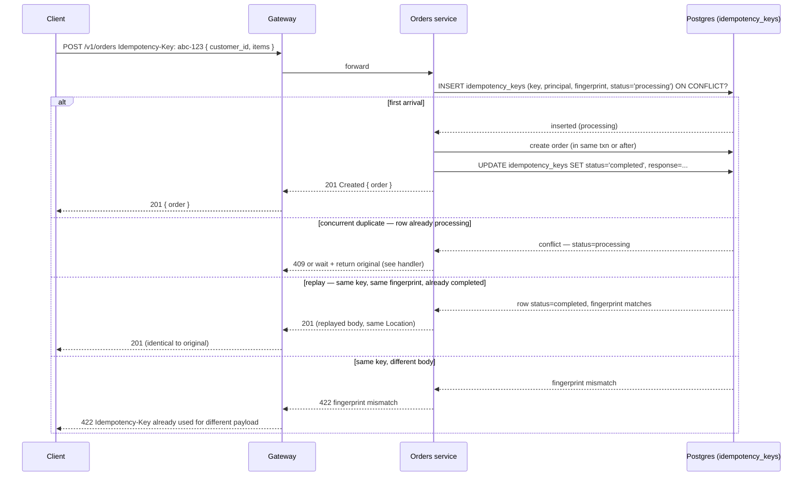
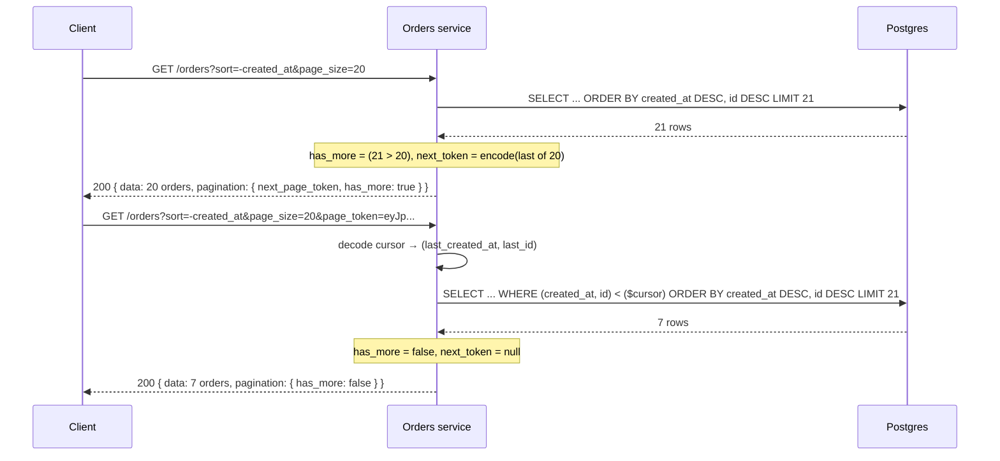
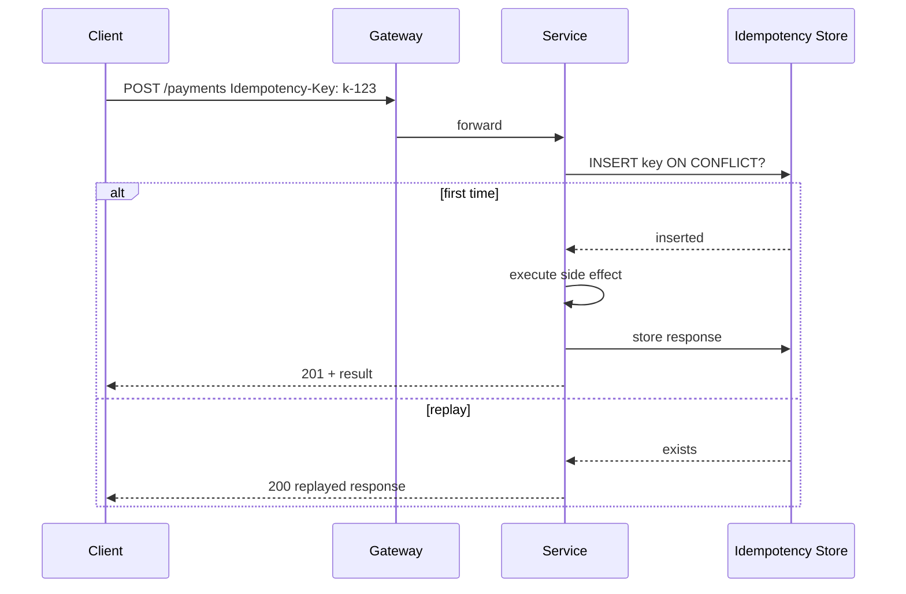
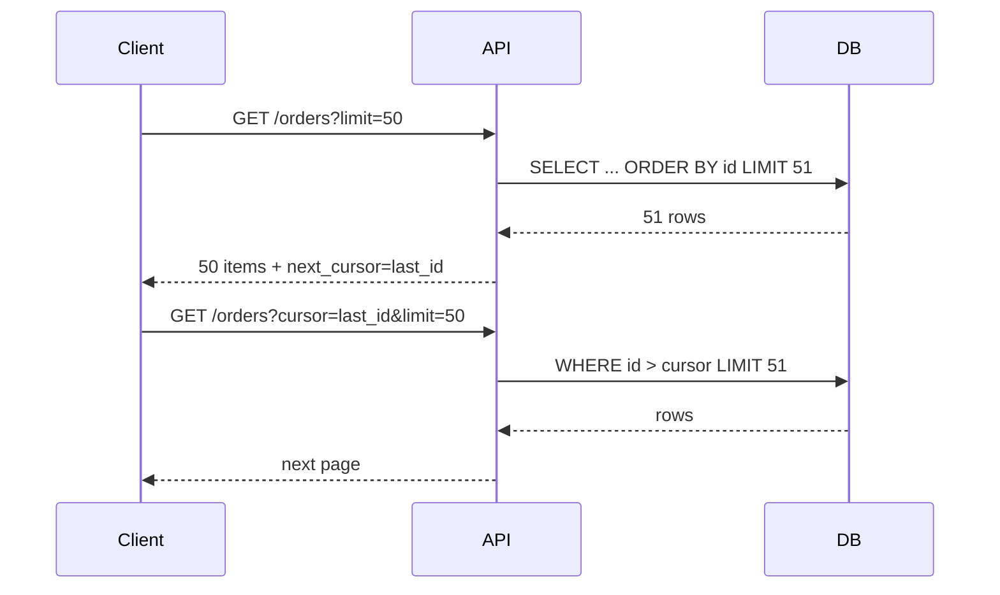
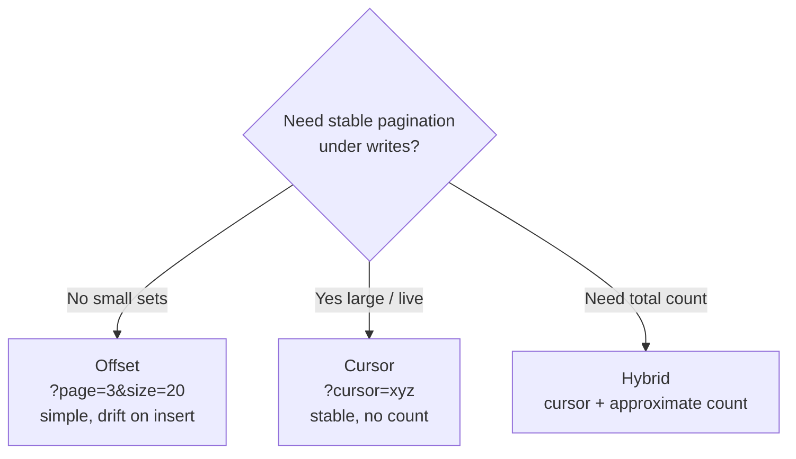
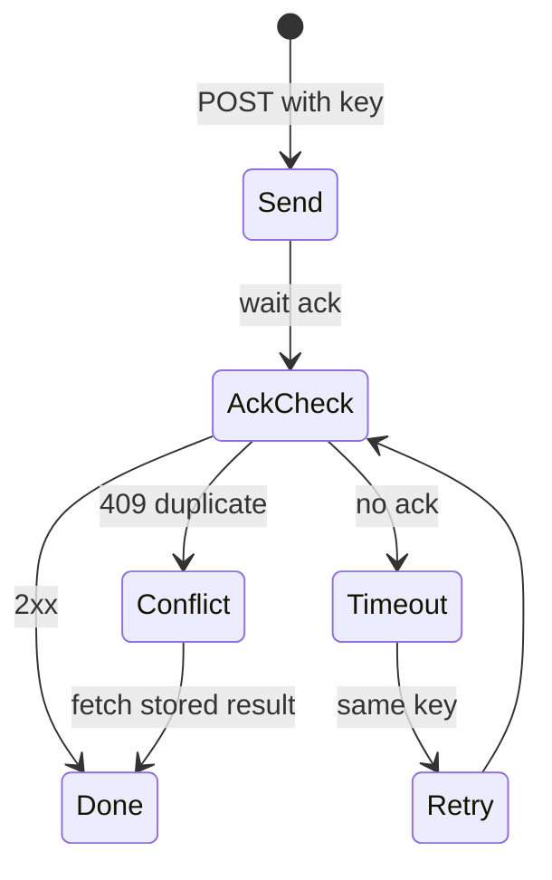

# Chapter 6 — Idempotency, Pagination, and Filtering

**What this chapter covers.** Three concerns that every production list or write endpoint must get right — and that most teams get subtly wrong until the bug surfaces as duplicate charges, missing rows during pagination, or a filter that table-scans 100 million rows. Idempotency makes retries safe, which makes *every* network call safe to retry. Pagination makes listing bounded, which makes every collection operable as it grows. Filtering, sorting, and sparse fieldsets make listing *useful*, which is the difference between an API consumers can build on and one they work around by fetching everything and filtering client-side. This chapter treats all three as infrastructure: the distributed-systems reason each matters, the contract each presents to consumers, and the production implementation that honours it under concurrency, retries, and rolling deploys. Every pattern is anchored in runnable, version-pinned code — an `Idempotency-Key` handler with Postgres and Redis, a cursor-paginated list with keyset queries and opaque tokens, and a filter/sort pipeline with validation and index awareness.

Learning goals — after this chapter you should be able to:

- Define idempotency precisely per RFC 7231, distinguish idempotent *methods* from idempotent *operations*, and decide when a `POST` must be made idempotent via `Idempotency-Key`.
- Implement a correct `Idempotency-Key` handler that is safe under concurrent duplicate requests, distinguishes replay-with-same-payload from conflict-with-different-payload (`409`/`422`), and expires keys on a bounded TTL.
- Implement cursor (keyset) pagination with opaque tokens and a deterministic tie-breaker, explain why offset pagination breaks under concurrent mutation, and return `has_more` without a separate `COUNT(*)`.
- Design a filter/sort/field-selection contract that is parseable, validatable, and index-aware, and reject or bound queries that would table-scan.
- Explain all three through a distributed-systems lens: at-least-once delivery, retry storms, gateway fan-out, and the storage contract pagination depends on.

---

## Idempotency — making retries safe

### Why idempotency is non-negotiable

Every request between two distributed processes can fail in a way where the sender does not know whether the receiver acted. The classic case:

```
Client → POST /v1/orders { customer_id, items }  →  Server
         ← timeout (no response)
Did the order get created? Retry or not?
```

Without idempotency, retrying risks duplicate side effects (two orders, two charges). Not retrying risks data loss (order never created). The only general solution is to make the operation *retry-safe* — sending the same request twice has the same effect as sending it once.

> **Distributed-systems lens.** The network provides at-least-once delivery unless you add exactly-once *semantics* on top — and exactly-once *delivery* is impossible in the presence of failures (see Vol 6, Ch 9 — Idempotency, Deduplication, and Exactly-Once, and Vol 10, Ch 2 — Delivery Semantics). Idempotency keys give you exactly-once *effect* per key: the first write wins, replays return the original result, and the system is correct even though the network retried. This is the same principle as the outbox pattern (Vol 10, Ch 6) and deduplication at the consumer — the edge that makes retries a reliability tool instead of a correctness hazard.

### HTTP method idempotency versus operation idempotency

RFC 7231 §4.2.2 defines an idempotent method as one where `N > 0` identical requests have the same *effect* as a single request:

| Method | Idempotent per RFC 7231? | Safe? | What it means |
|--------|--------------------------|-------|---------------|
| `GET`, `HEAD` | yes | yes | No side effects; retry freely |
| `PUT`, `DELETE` | yes | no | Side effect, but repeating is safe (put same bytes, delete same resource) |
| `POST`, `PATCH` | no | no | Repeating may create duplicates or apply partial updates twice |

For `PUT`/`DELETE`, idempotency is inherent in the method: `PUT /orders/{id}` with the same body twice writes the same state; `DELETE /orders/{id}` twice leaves the resource absent. For `POST` (create) and sometimes `PATCH`, the *operation* must be made idempotent explicitly — that is what `Idempotency-Key` does.

### The `Idempotency-Key` contract

The pattern, popularised by Stripe and now the de facto standard:

1. **Client generates** a unique key per *intent* (UUID v4, ULID, or hash of the operation) and sends it in `Idempotency-Key: <key>`.
2. **Server stores** the key with the request fingerprint (hash of method + path + body) and the response, scoped to the authenticated principal.
3. **Replay with same key + same fingerprint** → return the stored response (`200` or `201`, not an error).
4. **Replay with same key + different fingerprint** → `422 Unprocessable Entity` or `409 Conflict` — the client reused a key for a different operation, which is a bug.
5. **Key expires** after a TTL (24 hours is conventional; Stripe uses 24h). After expiry, the same key is treated as new.

Critically, the key must be **scoped to the caller** (API key, user, tenant). Two different users sending the same UUID must not collide. And the server must handle **concurrent duplicate requests** — two identical `POST`s arriving within milliseconds, before either has stored a result.



*Figure 6-1: Idempotency-Key lifecycle. The `processing` state is the concurrency guard; the fingerprint check prevents key reuse for a different operation; TTL bounds storage.*

### Real code — Idempotency-Key handler (Node 20.11.0, Express 4.18.2, pg 8.11.3, Redis 7.2 / ioredis 5.3.2)

This handler is production-shaped: concurrent-safe via `INSERT ... ON CONFLICT`, fingerprint-validated, TTL-bounded, and scoped to the authenticated principal. Two storage options are shown — Postgres (durable, transactional with the domain write) and Redis (lower latency, suitable when the idempotency store is separate from the domain store).

**Postgres DDL — the idempotency table:**

```sql
-- Postgres 16.2 — idempotency_keys (one row per key per principal)
CREATE TABLE idempotency_keys (
  key         TEXT        NOT NULL,
  principal   TEXT        NOT NULL,  -- api_key_id or user_id — scopes the key
  fingerprint TEXT        NOT NULL,  -- sha256(method + path + body)
  status      TEXT        NOT NULL CHECK (status IN ('processing','completed','failed')),
  response_status INT,
  response_body JSONB,
  created_at  TIMESTAMPTZ NOT NULL DEFAULT now(),
  expires_at  TIMESTAMPTZ NOT NULL DEFAULT now() + INTERVAL '24 hours',
  PRIMARY KEY (principal, key)
);
CREATE INDEX idx_idempotency_expires ON idempotency_keys (expires_at);
-- Expire via periodic DELETE or pg_cron; alternatively use pg_partman TTL partition
```

**Express middleware — Postgres-backed (transactional with the domain write):**

```js
// idempotency.js — Node 20.11.0, Express 4.18.2, pg@8.11.3
import crypto from "crypto";
import { pool } from "./db.js";

function fingerprintOf(req) {
  // Hash method + path + raw body — canonical, order-independent for JSON
  const body = typeof req.body === "string" ? req.body : JSON.stringify(req.body ?? {});
  return crypto.createHash("sha256").update(`${req.method}:${req.path}:${body}`).digest("hex");
}

/**
 * Idempotency middleware for POST/PATCH that require Idempotency-Key.
 * Mount before the route handler: app.post("/v1/orders", idempotency, createOrder)
 */
export async function idempotency(req, res, next) {
  const key = req.headers["idempotency-key"];
  if (!key) {
    return res.status(400).json({
      code: "IDEMPOTENCY_KEY_REQUIRED",
      message: "Idempotency-Key header is required for this operation",
      request_id: req.id,
    });
  }
  if (typeof key !== "string" || key.length === 0 || key.length > 64) {
    return res.status(400).json({ code: "BAD_REQUEST", message: "Idempotency-Key must be 1..64 chars" });
  }

  const principal = req.auth?.apiKeyId ?? req.auth?.userId ?? "anonymous";
  const fp = fingerprintOf(req);

  // Try to claim the key — INSERT with ON CONFLICT handles concurrency
  const claimed = await pool.query(
    `INSERT INTO idempotency_keys (key, principal, fingerprint, status, expires_at)
     VALUES ($1, $2, $3, 'processing', now() + INTERVAL '24 hours')
     ON CONFLICT (principal, key) DO NOTHING
     RETURNING (xmax = 0) AS inserted`,
    [key, principal, fp],
  );

  if (claimed.rows.length === 0) {
    // Key already exists — fetch it
    const { rows } = await pool.query(
      `SELECT fingerprint, status, response_status, response_body FROM idempotency_keys
       WHERE principal = $1 AND key = $2`,
      [principal, key],
    );
    const row = rows[0];
    if (!row) return next(); // race — retry insert path (or return 500)

    if (row.fingerprint !== fp) {
      return res.status(422).json({
        code: "IDEMPOTENCY_KEY_REUSE",
        message: "Idempotency-Key already used for a different request payload",
        request_id: req.id,
      });
    }
    if (row.status === "processing") {
      // Concurrent duplicate still in flight — 409 with Retry-After
      // Alternative: poll/wait for completion (shown in Redis variant below)
      res.setHeader("Retry-After", "1");
      return res.status(409).json({
        code: "CONFLICT_IN_PROGRESS",
        message: "A request with this Idempotency-Key is already being processed",
        request_id: req.id,
      });
    }
    if (row.status === "completed") {
      // Replay — return original response identically
      return res.status(row.response_status).json(row.response_body);
    }
    if (row.status === "failed") {
      // Previous attempt failed server-side — allow retry by resetting to processing
      await pool.query(
        `UPDATE idempotency_keys SET fingerprint=$3, status='processing', response_status=NULL, response_body=NULL
         WHERE principal=$1 AND key=$2 AND status='failed'`,
        [principal, key, fp],
      );
      // fall through to handler
    }
  }

  // Claim succeeded (or reset from failed) — wrap res.json to capture response for storage
  const originalJson = res.json.bind(res);
  let capturedStatus, capturedBody;
  res.json = (body) => {
    capturedStatus = res.statusCode;
    capturedBody = body;
    return originalJson(body);
  };

  // After handler finishes, persist the result. Use 'finish' so we capture even on errors.
  res.on("finish", async () => {
    try {
      // Only store definitive outcomes — 2xx/4xx are terminal; 5xx -> mark failed so client can retry with same key
      const terminal = capturedStatus >= 200 && capturedStatus < 500;
      await pool.query(
        `UPDATE idempotency_keys
         SET status = $3, response_status = $4, response_body = $5::jsonb
         WHERE principal = $1 AND key = $2 AND status = 'processing'`,
        [principal, key, terminal ? "completed" : "failed", capturedStatus, JSON.stringify(capturedBody ?? {})],
      );
    } catch (e) {
      // Log but do not fail the response — it was already sent
      console.error("idempotency persist failed", e);
    }
  });

  next();
}
```

**Redis variant — lower latency, with wait-for-completion on concurrent duplicate:**

```js
// idempotency-redis.js — ioredis@5.3.2, Redis 7.2
import Redis from "ioredis";
import crypto from "crypto";

const redis = new Redis(process.env.REDIS_URL); // redis://localhost:6379
const TTL_SECONDS = 24 * 3600;

function fingerprintOf(req) {
  const body = typeof req.body === "string" ? req.body : JSON.stringify(req.body ?? {});
  return crypto.createHash("sha256").update(`${req.method}:${req.path}:${body}`).digest("hex");
}

export async function idempotencyRedis(req, res, next) {
  const key = req.headers["idempotency-key"];
  if (!key) return res.status(400).json({ code: "IDEMPOTENCY_KEY_REQUIRED", message: "Idempotency-Key required" });

  const principal = req.auth?.apiKeyId ?? "anonymous";
  const fp = fingerprintOf(req);
  const redisKey = `idem:${principal}:${key}`;

  // SET NX — atomic claim
  const claimed = await redis.set(redisKey, JSON.stringify({ status: "processing", fingerprint: fp }), "EX", TTL_SECONDS, "NX");
  if (claimed === null) {
    // Already exists — fetch
    const raw = await redis.get(redisKey);
    if (!raw) return next();
    const row = JSON.parse(raw);
    if (row.fingerprint !== fp) {
      return res.status(422).json({ code: "IDEMPOTENCY_KEY_REUSE", message: "Key already used for different payload" });
    }
    if (row.status === "processing") {
      // Wait briefly for the in-flight request to finish (up to 5s), then return its result
      for (let i = 0; i < 10; i++) {
        await new Promise((r) => setTimeout(r, 500));
        const polled = await redis.get(redisKey);
        if (!polled) break;
        const p = JSON.parse(polled);
        if (p.status === "completed") return res.status(p.response_status).json(p.response_body);
        if (p.status === "failed") break; // fall through to retry
      }
      res.setHeader("Retry-After", "1");
      return res.status(409).json({ code: "CONFLICT_IN_PROGRESS", message: "Request with this key is still processing" });
    }
    if (row.status === "completed") return res.status(row.response_status).json(row.response_body);
  }

  // Captured response — same pattern as Postgres variant
  const originalJson = res.json.bind(res);
  let capturedStatus, capturedBody;
  res.json = (body) => { capturedStatus = res.statusCode; capturedBody = body; return originalJson(body); };
  res.on("finish", async () => {
    const terminal = capturedStatus >= 200 && capturedStatus < 500;
    const payload = JSON.stringify({
      status: terminal ? "completed" : "failed",
      fingerprint: fp,
      response_status: capturedStatus,
      response_body: capturedBody,
    });
    await redis.set(redisKey, payload, "EX", TTL_SECONDS);
  });
  next();
}
```

Key choices:

- **`INSERT ... ON CONFLICT DO NOTHING` / `SET NX`** — the concurrency guard. Two concurrent requests with the same key: one inserts, one conflicts. No `SELECT`-then-`INSERT` race.
- **Fingerprint as SHA-256 of method + path + body** — distinguishes replay (same intent) from misuse (different payload, same key). Never compare bodies with `===` on JSON — key order differs.
- **`processing` state** — avoids the thundering-herd where 10 retries all try to create the order. The first wins; the rest get `409` (or wait and return the winner's result in the Redis variant).
- **TTL (24h)** — bounds storage. Keys must expire; otherwise the table grows without bound. After expiry, the same key is treated as new — which is correct because the caller's retry window has closed.
- **Scoped to principal** — prevents cross-tenant collisions on the same UUID.
- **Failed → retryable** — a `500` that marked `failed` allows the client to retry with the same key, which is the whole point. Do not mark `500` as `completed`; otherwise retries would replay the error forever.

> **Distributed-systems lens.** The idempotency store must be as available as the domain store. If `idempotency_keys` is in Postgres and Postgres is down, idempotency checks fail — but so does the domain write, so the request fails anyway. If the idempotency store is in Redis and Redis is down, decide explicitly: fail closed (`503` — do not process the write without deduplication) or fall back to Postgres. Failing open (process the write without the key) risks duplicates under retry — the worse failure mode for money-moving operations.

---

## Pagination — listing at scale

### Why pagination is infrastructure, not convenience

An unbounded `GET /v1/orders` that returns every row works until the table has 10,000 rows, then it times out, OOMs, or saturates the database. Every collection that can grow — which is every production collection — must be paginated, and the pagination contract determines whether clients can build correct views over data that is concurrently mutated.

### Offset versus cursor — the decision

**Offset pagination** (`?offset=40&limit=20` → `LIMIT 20 OFFSET 40`) is intuitive and supports random access (\"go to page 7\"), but it breaks in two ways that matter:

1. **Performance.** `OFFSET 40000` forces the database to scan and discard 40,000 rows on every page. Cost grows linearly with page number. At large offsets, the query is a table scan that happens to return few rows. The fix (Postgres `OFFSET` still scans; MySQL similar) is to avoid offset entirely at scale.
2. **Correctness under mutation.** If a row is inserted at position 10 while the client pages through results, rows shift: the client sees duplicates or misses. Offset pagination is a snapshot of a moving target with no stability guarantee.

**Cursor (keyset) pagination** (`?page_token=eyJpZ...&page_size=20` → `WHERE (sort_key, id) > (cursor)`) fixes both:

- **Performance** — a range scan on an indexed column, cost independent of page depth.
- **Stability** — the cursor encodes the last seen sort key, so inserts before the cursor do not affect the next page. Inserts after the cursor appear on a subsequent page (or not at all if they sort before the cursor — which is correct for a forward walk).

Rule: **use cursor pagination for every collection that is large, growing, or concurrently mutated** — which is every production collection. Reserve offset for small, static, admin-only lists where random access matters and the dataset is bounded (<1,000 rows).

> **Boundary note.** *Why* cursor pagination is fast and offset pagination is slow is a storage-engine question — B-Tree range scans versus heap scans, composite index design, index-only scans, and how the query planner chooses a path. That analysis belongs to Volume 5, Chapter 3 (Indexing) and Chapter 4 (Query Processing and Optimization). This chapter uses the conclusion — *keyset on an indexed `(sort_key, id)` is an efficient range scan; offset is not* — and focuses on the API contract: token shape, tie-breaker, `has_more`, and consumer iteration.

### The contract

```
GET /v1/orders?filter[status]=paid&sort=-created_at&page_size=20&page_token=eyJp...

Response 200:
{
  "data": [{ "id": "01H8X1...", "status": "paid", ... }, ...],
  "pagination": { "next_page_token": "eyJpZC...MSJ9", "has_more": true }
}
```

- **`page_token` is opaque.** Base64url-encoded JSON on the server side, but clients must treat it as an opaque string and never construct or decode it. Opaque tokens let you change the pagination strategy without breaking clients.
- **`has_more` + `next_page_token`** — `has_more: false` and `next_page_token: null` on the last page. The client loops until `!has_more`.
- **No `total_count` by default.** `COUNT(*)` over a filtered large table is expensive and immediately stale. Return `total_count` only when callers explicitly need it and accept the cost (and note it as approximate).

### Real code — cursor pagination in Express 4.18.2 (pg 8.11.3)

This handler is the REST counterpart to the GraphQL resolver in Chapter 4, now combined with filtering and sorting. It shares the same keyset construction and one-extra trick.

```js
// orders-list.js — Node 20.11.0, Express 4.18.2, pg@8.11.3, zod@3.22.4
import { z } from "zod";

const QuerySchema = z.object({
  page_size: z.coerce.number().int().min(1).max(100).default(20),
  page_token: z.string().optional(),
  "filter[status]": z.enum(["pending", "paid", "shipped", "cancelled"]).optional(),
  "filter[created_at.gte]": z.string().datetime().optional(),
  sort: z.enum(["created_at", "-created_at", "total_cents", "-total_cents"]).default("-created_at"),
  fields: z.string().optional(), // sparse fieldset — comma-separated allowlist
});

const ALLOWED_FIELDS = new Set(["id", "customer_id", "status", "total_cents", "created_at", "updated_at"]);
const ALLOWED_SORTS = new Set(["created_at", "-created_at", "total_cents", "-total_cents"]);

function decodeCursor(token) {
  if (!token) return null;
  try {
    const json = Buffer.from(token, "base64url").toString("utf8");
    const obj = JSON.parse(json);
    if (typeof obj.last_created_at === "string" && typeof obj.last_id === "string") return obj;
    if (typeof obj.last_total_cents === "number" && typeof obj.last_id === "string") return obj;
    return null;
  } catch { return null; }
}
function encodeCursor(row, sortCol) {
  const payload = sortCol === "total_cents"
    ? { last_total_cents: row.total_cents, last_id: row.id }
    : { last_created_at: row.created_at.toISOString(), last_id: row.id };
  return Buffer.from(JSON.stringify(payload)).toString("base64url");
}

export async function listOrders(req, res) {
  const parsed = QuerySchema.safeParse(req.query);
  if (!parsed.success) {
    return res.status(400).json({ code: "BAD_REQUEST", message: "Invalid query", details: parsed.error.issues, request_id: req.id });
  }
  const q = parsed.data;

  // Validate cursor
  const cursor = q.page_token ? decodeCursor(q.page_token) : null;
  if (q.page_token && !cursor) {
    return res.status(400).json({ code: "BAD_REQUEST", message: "Invalid page_token", request_id: req.id });
  }

  // Sparse fieldset — allowlist, default to all
  const fields = q.fields ? q.fields.split(",").map((s) => s.trim()).filter(Boolean) : [...ALLOWED_FIELDS];
  const badFields = fields.filter((f) => !ALLOWED_FIELDS.has(f));
  if (badFields.length) return res.status(400).json({ code: "BAD_REQUEST", message: `Unknown fields: ${badFields.join(",")}` });
  const selectList = fields.map((f) => `"${f}"`).join(", ");

  // Sort — cursor pagination requires the sort key in the cursor
  const sortDir = q.sort.startsWith("-") ? "DESC" : "ASC";
  const sortCol = q.sort.replace(/^-/, "");
  // For compound sort, extend cursor to include both keys; kept simple here
  const cursorCol = sortCol === "total_cents" ? "total_cents" : "created_at";

  // WHERE with keyset condition when cursor present
  const where = [];
  const params = [];
  let idx = 1;
  if (q["filter[status]"]) { where.push(`status = $${idx++}`); params.push(q["filter[status]"]); }
  if (q["filter[created_at.gte]"]) { where.push(`created_at >= $${idx++}`); params.push(q["filter[created_at.gte]"]); }
  if (cursor) {
    const op = sortDir === "ASC" ? ">" : "<";
    // Tie-breaker on id ensures deterministic ordering when sort key is not unique
    if (cursorCol === "total_cents") {
      where.push(`(total_cents, id) ${op} ($${idx}, $${idx + 1})`);
      params.push(cursor.last_total_cents, cursor.last_id);
    } else {
      where.push(`(created_at, id) ${op} ($${idx}, $${idx + 1})`);
      params.push(cursor.last_created_at, cursor.last_id);
    }
    idx += 2;
  }
  const whereSQL = where.length ? `WHERE ${where.join(" AND ")}` : "";
  const limit = q.page_size + 1; // one-extra trick
  const sql = `SELECT ${selectList} FROM orders ${whereSQL} ORDER BY ${cursorCol} ${sortDir}, id ${sortDir} LIMIT $${idx}`;
  params.push(limit);

  const { rows } = await pool.query(sql, params);
  const hasMore = rows.length > q.page_size;
  const page = hasMore ? rows.slice(0, q.page_size) : rows;
  const nextPageToken = hasMore ? encodeCursor(page[page.length - 1], cursorCol) : null;

  // List responses are short-lived cacheable only with caution — collection is concurrently mutated
  res.setHeader("Cache-Control", "private, no-store"); // or very short max-age if acceptable
  res.json({ data: page, pagination: { next_page_token: nextPageToken, has_more: hasMore } });
}
```



*Figure 6-2: Cursor pagination walk. Each page fetches one extra row to determine `has_more` without a separate count query; the cursor encodes the last seen sort key and tie-breaker.*

Key choices:

- **Composite condition `(created_at, id) > (...)` with tie-breaker on `id`.** When two orders share the same `created_at`, ordering by `id` alone ensures the cursor is stable. Without the tie-breaker, rows with identical sort keys would be skipped or duplicated across pages.
- **One-extra trick.** Fetch `page_size + 1`; the extra row tells you `has_more` without `COUNT(*)`. `COUNT(*)` with filters over large tables is a sequential scan that is both expensive and stale by the time you return it.
- **Opaque `base64url(JSON)` cursor.** Clients cannot construct cursors; the server can change the encoding (e.g., encrypt the cursor to prevent tampering) without breaking clients.
- **Cursor encodes sort context.** A cursor from `sort=-created_at` cannot be used with `sort=total_cents` — the server should reject the mismatch. The simplest enforcement is to encode the sort column in the cursor or require the client to pass the same `sort` on every page.

### Consuming pagination — Go client (Go 1.22)

```go
// client.go — Go 1.22, net/http stdlib
package orders

import (
    "context"
    "encoding/json"
    "fmt"
    "net/http"
    "net/url"
)

type Order struct {
    ID        string `json:"id"`
    Status    string `json:"status"`
    CreatedAt string `json:"created_at"`
}
type ListResp struct {
    Data       []Order `json:"data"`
    Pagination struct {
        NextPageToken *string `json:"next_page_token"`
        HasMore       bool    `json:"has_more"`
    } `json:"pagination"`
}

func ListAll(ctx context.Context, baseURL string, pageSize int) ([]Order, error) {
    var all []Order
    var pageToken string
    client := &http.Client{}
    for {
        u, _ := url.Parse(baseURL + "/v1/orders")
        q := u.Query()
        q.Set("page_size", fmt.Sprint(pageSize))
        q.Set("sort", "-created_at")
        if pageToken != "" {
            q.Set("page_token", pageToken)
        }
        u.RawQuery = q.Encode()
        req, _ := http.NewRequestWithContext(ctx, "GET", u.String(), nil)
        resp, err := client.Do(req)
        if err != nil { return nil, err }
        if resp.StatusCode == http.StatusTooManyRequests {
            return nil, fmt.Errorf("rate limited: retry after %s", resp.Header.Get("Retry-After"))
        }
        if resp.StatusCode != http.StatusOK {
            resp.Body.Close()
            return nil, fmt.Errorf("list orders: %s", resp.Status)
        }
        var lr ListResp
        if err := json.NewDecoder(resp.Body).Decode(&lr); err != nil {
            resp.Body.Close()
            return nil, err
        }
        resp.Body.Close()
        all = append(all, lr.Data...)
        if !lr.Pagination.HasMore || lr.Pagination.NextPageToken == nil {
            break
        }
        pageToken = *lr.Pagination.NextPageToken
    }
    return all, nil
}
```

---

## Filtering, sorting, and sparse fieldsets

Pagination bounds the result size; filtering, sorting, and field selection make the bounded result *useful*. Without them, clients fetch every page and filter locally — the most expensive possible implementation of a query.

### The contract — one convention, applied everywhere

Adopt one style for all three and enforce it with a Spectral rule (Chapter 1). The bracket style (`filter[status]=paid`, `sort=-created_at`, `fields=id,status`) is widely tooled and maps cleanly to query-string parsing:

```
GET /v1/orders?filter[status]=paid&filter[created_at.gte]=2026-01-01T00:00:00Z
               &sort=-created_at
               &fields=id,status,total_cents
               &page_size=20&page_token=eyJp...
```

| Concern | Param | Example | Notes |
|---------|-------|---------|-------|
| Equality filter | `filter[field]=value` | `filter[status]=paid` | Only on indexed, allowlisted fields |
| Range filter | `filter[field.gte/lte]=value` | `filter[created_at.gte]=2026-01-01T00:00:00Z` | RFC 3339 for timestamps; numeric for amounts |
| Sort | `sort=field` / `sort=-field` | `sort=-created_at` | One field at a time for cursor stability; compound sort is a future extension |
| Sparse fieldset | `fields=a,b,c` | `fields=id,status` | Allowlist; default to all if omitted |

For GraphQL, the same concerns are typed inputs (Chapter 4): `filter: OrderFilter`, `sort: OrderSort`, selection set for field selection. The validation is at the GraphQL type level rather than query-string parsing, but the index and pagination implications are identical.

### Validation and index awareness

Not every column should be filterable. A filter on an unindexed column (`filter[notes]=%foo%`) that triggers a sequential scan over 100 million rows is a denial-of-service vector, not a feature. The API must:

1. **Allowlist filterable fields.** Reject `filter[arbitrary_column]` with `400`.
2. **Bound range filters.** Reject `filter[created_at.gte]=1970-01-01` that would return the entire table — require a minimum selectivity or a mandatory time window.
3. **Reject unindexed sort.** If `sort=total_cents` has no index, either add the index or reject the sort with a message that names the supported sorts.

```js
// Validation fragment — extends the handler above
const FILTERABLE = new Set(["status", "created_at.gte", "customer_id"]);
const SORTABLE = new Set(["created_at", "-created_at", "total_cents", "-total_cents"]);

function validateFilters(query) {
  for (const key of Object.keys(query)) {
    if (key.startsWith("filter[")) {
      const field = key.slice(7, -1); // "status" from "filter[status]"
      if (!FILTERABLE.has(field)) {
        throw Object.assign(new Error(`filter[${field}] is not filterable`), { status: 400 });
      }
    }
  }
}
```

> **Boundary note.** *Which* filters can be served efficiently depends on the indexes that exist and how the planner uses them — composite indexes, partial indexes, and index-only scans. The storage-engine reasoning for why `filter[status]=paid AND created_at >= ...` needs a composite index on `(status, created_at, id)` versus two single-column indexes is covered in Volume 5, Chapters 3 (Indexing) and 4 (Query Processing). The API contract here is the seam: it declares *which* filters are supported, and the storage layer must honour that declaration with an index. If the contract advertises a filter without a backing index, the API is correct but slow — a bug that surfaces as a latency regression, not a functional failure.

### Combining pagination, filtering, and sorting — the full pipeline

```mermaid
flowchart LR
    A[GET /orders?filter + sort + page_token] --> B{Validate}
    B -->|unknown field/sort| C[400 Bad Request]
    B -->|ok| D[Decode cursor]
    D --> E[Build WHERE: filters + keyset]
    E --> F[SELECT ... ORDER BY sort, id LIMIT page_size+1]
    F --> G{Rows > page_size?}
    G -->|yes| H[has_more=true, next_token=encode(last)]
    G -->|no| I[has_more=false, next_token=null]
    H --> J[200 + Cache-Control: private, no-store]
    I --> J
```

*Figure 6-3: Combined list pipeline. Validation rejects unsupported filters/sorts before touching the database; the keyset condition and filters share the same WHERE clause so one index can cover both when designed correctly.*

---

## Idempotency meets pagination — the retry story

Pagination and idempotency interact: a client that pages through a large collection may retry a page fetch after a timeout. Because `GET` is idempotent and safe, retrying a page fetch with the same `page_token` is correct — it returns the same page. But two subtleties arise:

- **Cursors are not idempotency keys.** A `page_token` identifies a *position*, not an *intent`. Retrying `GET /orders?page_token=abc` is safe because `GET` is inherently idempotent. Do not require `Idempotency-Key` on `GET`.
- **Mutating while paginating.** If the client creates orders while paginating the same collection, cursor pagination guarantees the walk does not miss or duplicate rows that existed at the start — but newly created rows that sort before the current cursor will not appear (they are behind the cursor). This is correct for a forward walk; document it.

> **Distributed-systems lens.** At scale, list endpoints are called by batch jobs that page through millions of rows. Those jobs must be restartable: if the job crashes on page 842, it resumes from the last cursor, not from the beginning. Opaque cursors make this trivial (persist the cursor), while offset pagination makes it expensive (re-scan from zero). Design pagination for the batch consumer, not just the UI.

---


<!-- Batch C: additional diagrams -->

#### Idempotency Key Flow



#### Cursor Pagination Sequence



#### Offset vs Cursor Tradeoff



#### Retry with Idempotency Safety



## Key takeaways

- Make every `POST` that creates or mutates state idempotent via `Idempotency-Key`. The server must handle concurrent duplicate arrivals (`INSERT ... ON CONFLICT` / `SET NX`), distinguish replay (same fingerprint → return stored response) from misuse (different fingerprint → `422`), scope keys to the principal, and expire them on a bounded TTL (24h).
- Use the `processing` state to guard against thundering retries — one request proceeds, concurrent duplicates get `409` (or wait and return the winner's result). Mark `5xx` as `failed` so the client can retry with the same key.
- Use cursor (keyset) pagination for every production collection: `WHERE (sort_key, id) > (cursor)` as a range scan on a composite index, opaque `base64url(JSON)` tokens, a deterministic tie-breaker on `id`, and the one-extra trick (`LIMIT page_size+1`) for `has_more` without `COUNT(*)`.
- Offset pagination (`LIMIT/OFFSET`) is reserved for small, static, admin-only lists. At scale it is a performance and correctness hazard (scan cost grows with offset; rows shift under concurrent mutation).
- Filtering and sorting must be allowlisted and index-aware. Advertise only filters and sorts that have backing indexes; reject unindexed queries with `400` rather than serving them slowly. The index design that makes a filter fast is the subject of Volume 5, Chapters 3–4; the API contract is where you declare the promise.
- Sparse fieldsets (`fields=id,status`) reduce over-fetching for list views; validate against an allowlist and default to all fields if omitted.
- `GET` pagination is inherently retry-safe; do not require `Idempotency-Key` on reads. Batch consumers that page through millions of rows depend on cursor stability for restartability — design for them.

## Further reading

- IETF. *RFC 7231 §4.2.2 — Idempotent Methods* (2014) — the definition of method idempotency that this chapter builds on.
- Stripe. *Idempotent Requests* — https://stripe.com/docs/api/idempotent_requests — the industry reference for the `Idempotency-Key` pattern, including the `processing`/`completed` lifecycle.
- IETF. *RFC 6648 — Deprecating Use of the \"X-\" Prefix* (2012) and *RFC 6648 successors* — why `Idempotency-Key` (no `X-`) is the correct header name.
- `pg` 8.11.3 — https://node-postgres.com/, `ioredis` 5.3.2 — https://github.com/redis/ioredis, `zod` 3.22.4 — https://zod.dev/ — versions pinned for the handler examples.
- Redis 7.2 — https://redis.io/docs/latest/commands/set/ — `SET key value EX seconds NX` semantics for the atomic claim.
- Postgres 16.2 — https://www.postgresql.org/docs/16/sql-insert.html — `INSERT ... ON CONFLICT` for the concurrent-safe claim.
- Volume 5, Chapters 3 (Indexing) and 4 (Query Processing and Optimization) — the storage-engine analysis of why keyset pagination is a range scan and offset pagination is not, and how composite indexes cover filtered, sorted pagination.
- Volume 6, Chapter 9 (Idempotency, Deduplication, Exactly-Once) — the theory of exactly-once effect that idempotency keys implement.
- Volume 10, Chapter 6 (The Outbox Pattern) — deduplication at the event layer, the streaming counterpart to request-level idempotency.

