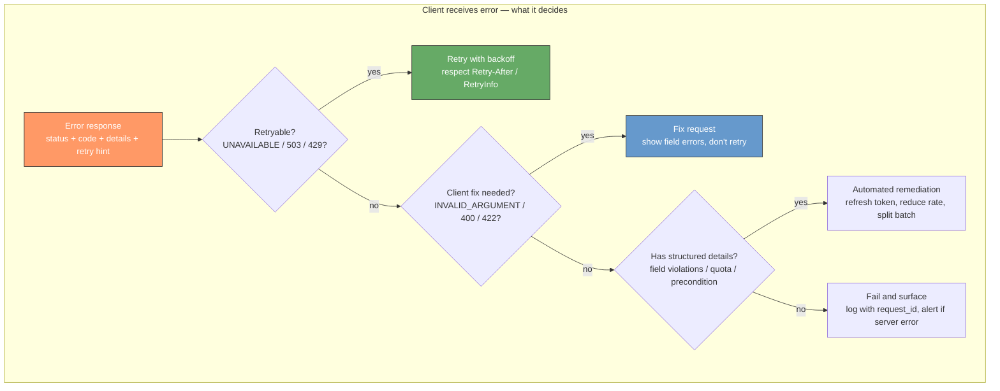
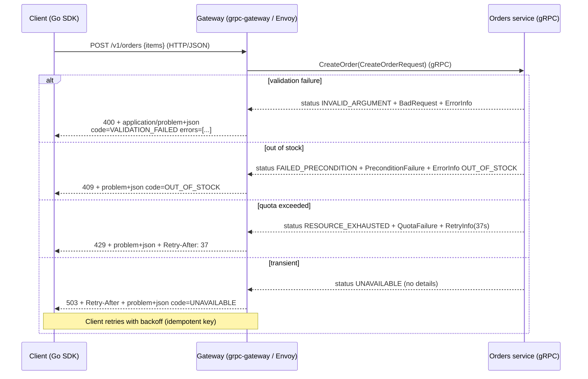
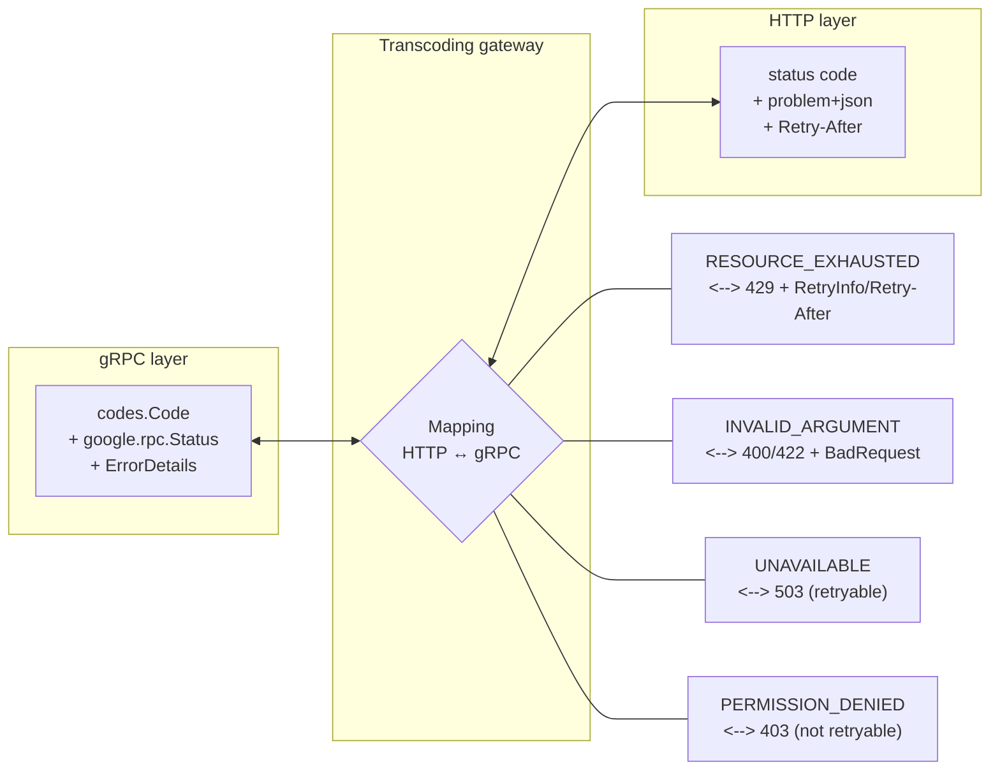
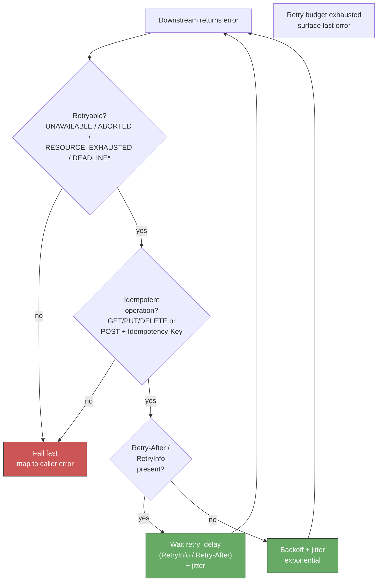
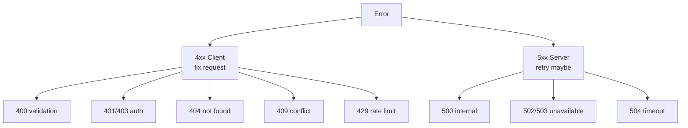
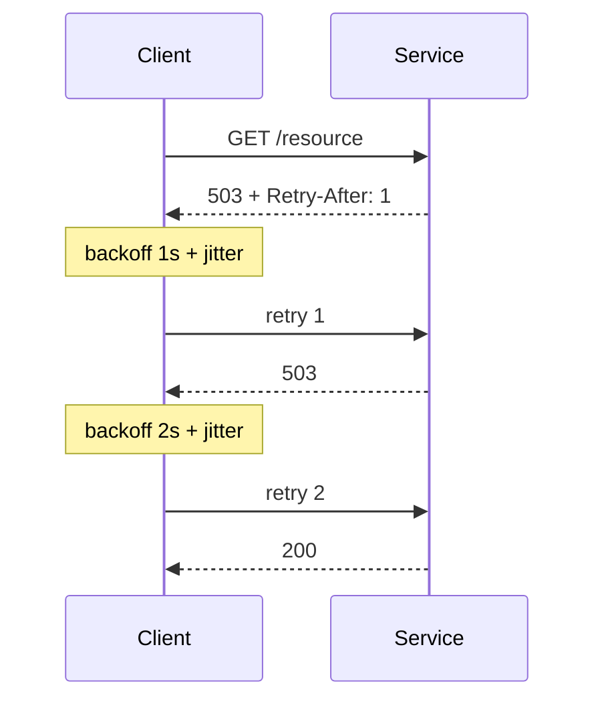
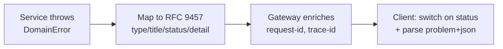

# Chapter 7 — Error Handling and Status Semantics

**What this chapter covers.** Every API call can fail, and the question is never *whether* it will fail but *how clearly* the failure will be communicated to a caller that cannot attach a debugger to your service. In a monolith, a stack trace is a few frames away. In a distributed system with five hops, a gateway, a gRPC-to-HTTP transcoding layer, and three different client SDKs, a lazy `500 Internal Server Error` with no machine-readable code is an incident multiplier: callers cannot distinguish "retry" from "fix your request," operators cannot alert without false positives, and canaries cannot auto-roll back. This chapter makes error handling a design discipline. It defines the contract an error *is* — code, message, details — and shows how to model it consistently across REST, gRPC, and mixed environments. We dissect HTTP status semantics under RFC 9110, RFC 9457 Problem Details, and the gRPC status model (17 codes, `google.rpc.Status`, and rich `ErrorDetails`), build a bidirectional mapping between the two that preserves retry semantics, and implement production patterns: structured problem+json envelopes, gRPC rich errors in Go and Java, interceptor-based error translation, and client-side handling that classifies retryable versus fatal errors. Every pattern is grounded in runnable, version-pinned code and viewed through the distributed-systems lens where retries, idempotency, and observability make or break the design.

Learning goals — after this chapter you should be able to:

- Choose correct HTTP status codes per RFC 9110 and explain why `400`, `404`, `409`, `422`, `429`, and `503` are routinely misused — and what an API-aware load balancer or gateway *does* with the code you return.
- Design and implement an RFC 9457 (`application/problem+json`) error envelope that carries a stable machine-readable `type`/`code`, a human-readable `detail`, and extension members — and reject vague `message`-only contracts.
- Use the gRPC status model correctly — the 17 canonical `codes.Code` values, `status.Status`, and rich `ErrorDetails` (`BadRequest`, `ErrorInfo`, `RetryInfo`, `QuotaFailure`, `PreconditionFailure`, `LocalizedMessage`) — to return errors that clients can program against.
- Map errors bidirectionally between HTTP/REST and gRPC (`google.rpc.Code` ↔ HTTP status) without losing retry semantics, and explain why `grpc-status` trailers and `google.api.http` transcoding matter.
- Implement server-side error creation and translation (Go `status.Errorf` / `status.ErrorDetails`, Java `StatusRuntimeException`, middleware/interceptor normalization) and client-side handling that classifies `UNAVAILABLE`/`DEADLINE_EXCEEDED`/`RESOURCE_EXHAUSTED` correctly for retries.
- Reason about errors in a distributed call graph — propagation versus translation at service boundaries, correlation with `request_id`/`trace_id`, error budgets, and why `Retry-After` and `RetryInfo` must agree.

---

## Why errors are a contract, not an afterthought

An API's success path gets the design review. Its error path gets whatever the framework defaults to — usually a stack trace in development and a bare `500` in production. The cost surfaces months later: a partner team cannot programmatically distinguish "your `payment_method_id` is invalid" from "our payments service is down," so they retry both — one floods logs, the other risks duplicate charges. A gateway cannot decide whether to fail fast or retry on the next upstream. An SRE cannot write an alert that fires on *server* errors without firing on *client* errors.

The distributed-systems reason is sharper: in a call graph that fans out across five services, each hop must make a *local* decision — retry, fail, or translate — using only the error the downstream returned. If that error is imprecise, the wrong decision propagates. A `503 UNAVAILABLE` should be retried with backoff; a `404 NOT_FOUND` on a resource that was just created should be retried briefly for read-after-write consistency; a `400 INVALID_ARGUMENT` must never be retried without changing the request. Collapsing all three into `500` defeats the retry, circuit-breaker, and backpressure machinery that keeps the system alive (see Vol 6, Ch 9 — Idempotency; Vol 7, Ch 11 — Designing for Failure; Vol 11, Ch 10 — Resilience Patterns).

An error contract answers five questions for every failure:

1. **What happened?** A stable, machine-readable code (`code`/`type`) the client switches on.
2. **Whose fault?** Client error (fix the request) versus server error (retry or escalate) — encoded in the status code family and the code itself.
3. **Is it retryable?** Whether the same request, unchanged, could succeed — and after how long (`Retry-After` / `RetryInfo`).
4. **What to do next?** Field-level violations, quota that was exceeded, a precondition that failed — structured details so the client can act, not parse English.
5. **How to correlate?** A `request_id` / `trace_id` that ties the client-side error to the server's logs and traces.

> **Invariant.** An error response is part of the API's versioned contract exactly like a success response. Changing a machine-readable error `code`, reclassifying a `400` as `404`, or removing a detail field is a breaking change — see Chapter 8 (Compatibility). Treat errors with the same versioning discipline you give resources.



---

## HTTP status semantics — what RFC 9110 actually says

HTTP status codes are not marketing labels ("we use `200` for everything and put the real status in the JSON"). They are routing and retry signals read by every intermediary between client and server: CDNs, API gateways, service meshes, and `fetch` itself.

### The five classes

| Class | Range | Meaning | Retry? |
|-------|-------|---------|--------|
| `1xx` | 100–199 | Informational | — |
| `2xx` | 200–299 | Success (`200 OK`, `201 Created`, `202 Accepted`, `204 No Content`) | — |
| `3xx` | 300–399 | Redirection (`301`, `302`, `307`, `308` — method-preserving vs not; `304 Not Modified`) | — |
| `4xx` | 400–499 | Client error — fix the request, don't retry unchanged | No (except `408`, `409`, `429` with hints) |
| `5xx` | 500–599 | Server error — retry *may* succeed | Conditional |

The single most important distinction is `4xx` versus `5xx`. A `4xx` says *the client must change something*; a gateway that retries `4xx` on the next upstream will just fail there again. A `5xx` says *the server failed to fulfill a valid request*; a gateway that does not retry `503` when the next replica is healthy leaves availability on the floor. Mixing them — returning `500` for validation failures because "it was an exception on the server" — poisons every retry and alert downstream.

### The codes you will use (and misuse)

| Code | Name | When to return | Common misuse |
|------|------|----------------|---------------|
| `200` | OK | Successful read/update | Returning `200` for errors with `{ "success": false }` — breaks intermediaries |
| `201` | Created | `POST` that created a resource — include `Location: /v1/orders/{id}` | Returning `200` with the created resource and no `Location` |
| `202` | Accepted | Request accepted for async processing (`Location` or status resource) | Using `200` for async work so the client thinks it is done |
| `204` | No Content | Successful `DELETE` or `PUT` with no body | Returning `200` with `{}` |
| `400` | Bad Request | Malformed syntax — invalid JSON, unparseable field | Using `400` for semantic validation (prefer `422`) |
| `401` | Unauthorized | Missing or invalid authentication — client should re-authenticate | `403` for "not logged in" — `401` means *unauthenticated* |
| `403` | Forbidden | Authenticated but not authorized — do not retry with same credentials | `401` for permission denied — `403` means *authenticated, not allowed* |
| `404` | Not Found | Resource does not exist — be careful to not leak existence (see security note) | Returning `404` for "not found because your filter matched nothing" (return `200` with empty list) |
| `405` | Method Not Allowed | Method not supported on this resource — include `Allow` header | `404` or `400` when the path is right but the verb is wrong |
| `406` | Not Acceptable | `Accept`/`Accept-Encoding` negotiation failed | Rarely used directly; content negotiation belongs in Ch 8 |
| `408` | Request Timeout | Server timed out waiting for the request | Client may retry |
| `409` | Conflict | State conflict — duplicate `Idempotency-Key` with different payload, concurrent modification (`If-Match` failed), already exists | Using `400` for idempotency conflicts — see Ch 6 |
| `410` | Gone | Resource permanently gone (sunset/deprecated) — cacheable | `404` for sunset — `410` tells the client to stop looking (Ch 5) |
| `412` | Precondition Failed | `If-Match`/`If-None-Match`/`If-Unmodified-Since` failed | `409` for preconditions — `412` is condition-specific |
| `413` | Payload Too Large | Body exceeds `max_bytes` | — |
| `415` | Unsupported Media Type | `Content-Type` not accepted | — |
| `422` | Unprocessable Entity | Well-formed but semantically invalid — validation failures, often with RFC 9457 detail | Overloading `400` — `422` signals *parseable but invalid*, ideal for field violations |
| `429` | Too Many Requests | Rate limited — **must** include `Retry-After` | `503` for rate limits — `429` lets the client distinguish quota from outage (Ch 7/Vol 7 Ch 9) |
| `500` | Internal Server Error | Unexpected server failure — no retry hint | Using `500` for validation or auth failures |
| `501` | Not Implemented | Method/endpoint not implemented | Rarely; usually `404` or `405` is closer |
| `502` | Bad Gateway | Gateway received invalid response from upstream | Distinguish from `503`/`504` — `502` is protocol/parse failure upstream |
| `503` | Service Unavailable | Temporary overload or maintenance — **should** include `Retry-After` | Using `500` for overload — `503` is the retry signal |
| `504` | Gateway Timeout | Upstream did not respond in time | Retries depend on whether the upstream is idempotent — see distributed lens |

> **Security note — enumeration via `404` vs `403`.** Returning `404` for "you lack permission to see whether this resource exists" versus `403` for "it exists but you cannot access it" leaks existence. For sensitive resources, return `404` (or `403` uniformly) regardless of existence — document the choice (Vol 9, Ch 7 — Authorization, Ch 9 — AppSec).

### Headers that belong on errors

- **`Retry-After: <http-date>` or `Retry-After: <seconds>`** on `429` and `503` — clients, gateways, and SDKs respect it; without it they guess.
- **`WWW-Authenticate`** on `401` — tells the client *how* to authenticate.
- **`Allow`** on `405` — lists the allowed methods.
- **`Deprecation` / `Sunset`** (RFC 8594/RFC 9745) — on errors that signal a deprecated or sunset path (Ch 5).
- **`X-Request-Id` / `traceparent`** — always echo the request's correlation ID on *errors* so the caller can ask "what happened to `req_abc123`?"

---

## RFC 9457 Problem Details — the error envelope

RFC 9457 (`application/problem+json`, successor to RFC 7807) gives HTTP errors a standard envelope so clients can handle them generically. The alternative — every endpoint inventing `{ "message": "...", "error": "..." }` differently — forces client code to branch per endpoint. A problem+json envelope is:

```json
{
  "type": "https://api.example.com/problems/out-of-stock",
  "title": "Out of stock",
  "status": 409,
  "code": "OUT_OF_STOCK",
  "detail": "SKU 'SKU-881' has 0 units available; requested 2.",
  "instance": "/v1/orders/req_abc123",
  "request_id": "req_abc123",
  "errors": [
    { "field": "items[0].quantity", "code": "INSUFFICIENT_STOCK", "message": "Only 0 units available" }
  ]
}
```

RFC 9457 defines `type` (URI identifying the problem type), `title` (human-readable summary), `status` (mirrors the HTTP status), `detail` (human-readable, specific to this occurrence), and `instance` (URI for this occurrence). The spec explicitly permits **extension members** — `code`, `request_id`, `errors` above — which is where the machine-readable contract lives. Use them.

**Design rules:**

1. **`type` is a URI.** It should dereference to human-readable docs (`https://api.example.com/problems/out-of-stock`) — not `"OUT_OF_STOCK"`. The `code` extension member carries the switchable enum.
2. **`code` is enum-stable.** `OUT_OF_STOCK`, `PAYMENT_DECLINED`, `QUOTA_EXCEEDED` — clients `switch` on `code`, never on `detail`. Adding a `code` is minor; changing one is breaking.
3. **`detail` is for humans.** It may contain interpolated values ("SKU 'SKU-881'..."), but never structured data the client must parse.
4. **`errors[]` for field violations.** Each entry names `field` (JSON Pointer or dotted path), `code`, and `message`. This powers form-level UX without parsing `detail`.
5. **`status` mirrors the HTTP status.** Don't diverge — caches and generic HTTP clients read `status` without parsing the body.
6. **Content type matters.** Return `Content-Type: application/problem+json` so a generic problem+json client (`problem+json` aware `fetch` wrapper) can deserialize without knowing your API.
7. **Never leak internals.** No stack traces, no SQL, no file paths — even in `detail` — outside debug builds.

A real middleware pair (Express, Go) looks like:

```typescript
// Express (TypeScript) — problem+json envelope helper (RFC 9457)
import type { Request, Response, NextFunction } from "express";

type FieldViolation = { field: string; code: string; message: string };
type Problem = {
  type: string; title: string; status: number;
  code: string; detail: string;
  instance: string; request_id: string;
  errors?: FieldViolation[];
};

export function problem(
  res: Response, req: Request,
  status: number,
  code: string,
  title: string,
  detail: string,
  opts: { type?: string; errors?: FieldViolation[] } = {},
) {
  const requestId = (req.headers["x-request-id"] as string) ?? res.getHeader("x-request-id") as string;
  const body: Problem = {
    type: opts.type ?? `https://api.example.com/problems/${code.toLowerCase().replace(/_/g,"-")}`,
    title, status, code, detail,
    instance: req.originalUrl,
    request_id: requestId,
    ...(opts.errors ? { errors: opts.errors } : {}),
  };
  return res.status(status)
    .type("application/problem+json")
    .json(body);
}

// Usage:
// problem(res, req, 422, "VALIDATION_FAILED", "Validation failed",
//   "One or more fields are invalid.", { errors: [{ field:"email", code:"INVALID_FORMAT", message:"Not a valid email" }] });
// problem(res, req, 429, "RATE_LIMITED", "Too many requests", "Quota 100/min exceeded. Retry after 37s.");
```

```go
// Go — RFC 9457 problem+json helper
package httpx

import (
	"encoding/json"
	"net/http"
)

type FieldViolation struct {
	Field   string `json:"field"`
	Code    string `json:"code"`
	Message string `json:"message"`
}

type Problem struct {
	Type      string           `json:"type"`
	Title     string           `json:"title"`
	Status    int              `json:"status"`
	Code      string           `json:"code"`
	Detail    string           `json:"detail"`
	Instance  string           `json:"instance"`
	RequestID string           `json:"request_id"`
	Errors    []FieldViolation `json:"errors,omitempty"`
}

func WriteProblem(w http.ResponseWriter, r *http.Request, status int, code, title, detail string, violations []FieldViolation) {
	w.Header().Set("Content-Type", "application/problem+json")
	w.Header().Set("X-Request-Id", r.Header.Get("X-Request-Id"))
	w.WriteHeader(status)
	_ = json.NewEncoder(w).Encode(Problem{
		Type:      "https://api.example.com/problems/" + code,
		Title:     title,
		Status:    status,
		Code:      code,
		Detail:    detail,
		Instance:  r.URL.Path,
		RequestID: r.Header.Get("X-Request-Id"),
		Errors:    violations,
	})
}
```

---

## The gRPC status model

gRPC errors are not exceptions tacked on — they are typed values on the wire. Every gRPC response is either *success* (status `OK = 0`, trailers absent of `grpc-status`) or *error* (non-zero `grpc-status` trailer, HTTP/2 `200` over the wire with gRPC status in trailers — see Vol 3, Ch 8). The model has three layers:

### Layer 1 — the 17 canonical codes

From `google.golang.org/grpc/codes` / `io.grpc.Status` / `grpc/status`:

| gRPC code | Value | HTTP equiv | Retryable? | Use when |
|-----------|-------|------------|------------|----------|
| `OK` | 0 | 200 | — | Success |
| `CANCELLED` | 1 | 499* | No | Client cancelled the call |
| `UNKNOWN` | 2 | 500 | No | Unknown — avoid; use a specific code |
| `INVALID_ARGUMENT` | 3 | 400 | No | Bad field / malformed |
| `DEADLINE_EXCEEDED` | 4 | 504/408* | Conditional (idempotent only) | Deadline/timeout hit |
| `NOT_FOUND` | 5 | 404 | No | Resource not found |
| `ALREADY_EXISTS` | 6 | 409 | No | Create that already exists |
| `PERMISSION_DENIED` | 7 | 403 | No | Authenticated but not authorized |
| `RESOURCE_EXHAUSTED` | 8 | 429 | After `RetryInfo` | Quota/rate limit, out of space |
| `FAILED_PRECONDITION` | 9 | 400/412 | No | System not in required state |
| `ABORTED` | 10 | 409 | Yes (with backoff) | Concurrency conflict, transaction aborted |
| `OUT_OF_RANGE` | 11 | 400 | No | Cursor/offset past range |
| `UNAVAILABLE` | 14 | 503 | Yes (with backoff) | Transient — safe to retry |
| `UNIMPLEMENTED` | 12 | 501 | No | Method not implemented |
| `INTERNAL` | 13 | 500 | No (unless known transient) | Invariant broken |
| `DATA_LOSS` | 15 | 500 | No | Unrecoverable data corruption |
| `UNAUTHENTICATED` | 16 | 401 | No (after re-auth) | Missing/invalid auth |

`*` `CANCELLED` maps to HTTP `499` (nginx/client closed) or is not HTTP-mapped; `DEADLINE_EXCEEDED` maps to `504 Gateway Timeout` externally and `408 Request Timeout` in some mappings — document your gateway's choice.

> **Rule.** `UNKNOWN` means "the author did not choose a code." Never return it intentionally. `INTERNAL` is strictly for "this should never happen and did" — bugs and invariant violations. If you can name what went wrong, name it (`INVALID_ARGUMENT`, `FAILED_PRECONDITION`, `OUT_OF_RANGE`).

### Layer 2 — `google.rpc.Status` and layer 3 — rich ErrorDetails

A gRPC error with details is a `google.rpc.Status` message whose `details` carry typed `Any` payloads (`google.rpc.*`):

```protobuf
// google/rpc/status.proto (simplified)
message Status {
  int32 code = 1;    // google.rpc.Code (same 17)
  string message = 2; // human-readable, not for switching
  repeated google.protobuf.Any details = 3;
}
```

The standard detail types (`google/rpc/error_details.proto`) are:

- **`BadRequest`** + `FieldViolation` — field-level validation (`field`, `description`).
- **`ErrorInfo`** — stable `reason` + `domain` + `metadata` map — the switchable identity (like `code` in problem+json). Example: `reason: "ORDER_OUT_OF_STOCK" domain: "api.example.com" metadata: { "sku": "SKU-881" }`.
- **`RetryInfo`** — `retry_delay` (`Duration`) — how long to wait before retrying. The gRPC equivalent of `Retry-After`.
- **`QuotaFailure`** + `Violation` — which quota (`subject`) was exceeded.
- **`PreconditionFailure`** + `Violation` — which precondition failed (`type` / `subject` / `description`).
- **`ResourceInfo`** — which `resource_type` / `resource_name` triggered the error.
- **`Help`** + `Link` — human help links.
- **`LocalizedMessage`** — locale-aware `message` (separate from the English `Status.message`).
- **`DebugInfo`** — `stack_entries` + `detail` — only in debug builds.

### Creating gRPC errors (Go)

```go
// Go — rich gRPC errors (grpc-go 1.64+, google.golang.org/grpc, google.golang.org/genproto/googleapis/rpc/errdetails)
package orders

import (
	"context"
	"time"

	"google.golang.org/grpc/codes"
	"google.golang.org/grpc/status"
	"google.golang.org/genproto/googleapis/rpc/errdetails"
	"google.golang.org/protobuf/types/known/durationpb"
)

func (s *Server) CreateOrder(ctx context.Context, req *CreateOrderRequest) (*Order, error) {
	if err := req.Validate(); err != nil {
		// INVALID_ARGUMENT with BadRequest field violations — client can map to form errors
		st := status.New(codes.InvalidArgument, "validation failed")
		br := &errdetails.BadRequest{}
		for _, v := range err.FieldViolations() {
			br.FieldViolations = append(br.FieldViolations, &errdetails.BadRequest_FieldViolation{
				Field: v.Field, Description: v.Message,
			})
		}
		// Also attach ErrorInfo for stable switching
		ei := &errdetails.ErrorInfo{
			Reason: "VALIDATION_FAILED", Domain: "api.example.com",
			Metadata: map[string]string{"request_id": reqIdFrom(ctx)},
		}
		st, _ = st.WithDetails(br, ei)
		return nil, st.Err()
	}

	if !s.inventory.HasStock(req.Items) {
		st := status.New(codes.FailedPrecondition, "insufficient stock")
		pf := &errdetails.PreconditionFailure{
			Violations: []*errdetails.PreconditionFailure_Violation{
				{Type: "STOCK", Subject: "sku/SKU-881", Description: "0 units available, requested 2"},
			},
		}
		ei := &errdetails.ErrorInfo{Reason: "OUT_OF_STOCK", Domain: "api.example.com",
			Metadata: map[string]string{"sku": "SKU-881"}}
		st, _ = st.WithDetails(pf, ei)
		return nil, st.Err()
	}

	if limited, retryAfter := s.limiter.Check(ctx); limited {
		st := status.New(codes.ResourceExhausted, "quota exceeded: orders.create 100/min")
		st, _ = st.WithDetails(
			&errdetails.QuotaFailure{
				Violations: []*errdetails.QuotaFailure_Violation{
					{Subject: "quota:orders.create/100 per minute", Description: "quota exceeded"},
				},
			},
			&errdetails.RetryInfo{RetryDelay: durationpb.New(retryAfter)},
		)
		return nil, st.Err()
	}

	order, err := s.store.Create(ctx, req)
	if err != nil {
		return nil, status.Errorf(codes.Internal, "create order: %v", err)
	}
	return order, nil
}

// Client side — handling rich errors
func placeOrder(ctx context.Context, c OrdersClient, req *CreateOrderRequest) error {
	_, err := c.CreateOrder(ctx, req)
	if err == nil {
		return nil
	}
	st, ok := status.FromError(err)
	if !ok {
		return err
	}
	switch st.Code() {
	case codes.InvalidArgument:
		for _, d := range st.Details() {
			if br, ok := d.(*errdetails.BadRequest); ok {
				for _, v := range br.FieldViolations {
					log.Printf("field %q: %s", v.Field, v.Description)
				}
			}
		}
		return fmt.Errorf("validation failed: %s", st.Message())
	case codes.ResourceExhausted:
		for _, d := range st.Details() {
			if ri, ok := d.(*errdetails.RetryInfo); ok {
				log.Printf("retry after %s", ri.RetryDelay.AsDuration())
				time.Sleep(ri.RetryDelay.AsDuration())
			}
		}
		return fmt.Errorf("rate limited: %s", st.Message())
	case codes.Unavailable, codes.Aborted:
		// retry with backoff (idempotent only — see Ch 6)
		return errRetryable{err: err}
	default:
		return err
	}
}
```

```java
// Java — same model (grpc-java 1.66+, google.rpc.* from grpc-proto)
import io.grpc.Status;
import io.grpc.StatusRuntimeException;
import io.grpc.protobuf.StatusProto;
import com.google.rpc.BadRequest;
import com.google.rpc.ErrorInfo;
import com.google.rpc.RetryInfo;

public Order createOrder(CreateOrderRequest req) {
    if (!req.isValid()) {
        com.google.rpc.Status status = com.google.rpc.Status.newBuilder()
            .setCode(Status.INVALID_ARGUMENT.getCode().value())
            .setMessage("validation failed")
            .addDetails(Any.pack(BadRequest.newBuilder()
                .addFieldViolations(BadRequest.FieldViolation.newBuilder()
                    .setField("email").setDescription("invalid format").build())
                .build()))
            .addDetails(Any.pack(ErrorInfo.newBuilder()
                .setReason("VALIDATION_FAILED").setDomain("api.example.com").build()))
            .build();
        throw StatusProto.toStatusRuntimeException(status);
    }
    // ... rate-limit branch adds QuotaFailure + RetryInfo similarly
    return store.create(req);
}
```



---

## Mapping HTTP and gRPC without losing meaning

Most systems are not pure REST or pure gRPC — a gRPC service sits behind an HTTP gateway (Envoy, `grpc-gateway`, `Connect`) that transcodes `google.api.http` bindings to JSON, or a REST service is called by a gRPC client via `grpc-status` trailers. The mapping must preserve two things: the *category* (`4xx` vs `5xx`, retryable vs not) and the *retry hint*.

### gRPC code → HTTP status (server → gateway → client)

Canonical mapping used by `grpc-gateway` and `google.rpc.Code` docs:

| gRPC code | HTTP | Notes |
|-----------|------|-------|
| `OK` | 200 (or 201/204 per binding) | Success |
| `CANCELLED` | 499 | Client closed request |
| `INVALID_ARGUMENT` | 400 | Use `422` through an envelope if the API prefers `422` for validation — overrides are fine if documented |
| `DEADLINE_EXCEEDED` | 504 | Also 408 in some proxies — pick one and document |
| `NOT_FOUND` | 404 | |
| `ALREADY_EXISTS` | 409 | |
| `PERMISSION_DENIED` | 403 | |
| `RESOURCE_EXHAUSTED` | 429 | Preserve `RetryInfo` → `Retry-After` |
| `FAILED_PRECONDITION` | 400 (or 409/412 for state conflicts) | Split `FAILED_PRECONDITION` finely in the envelope |
| `ABORTED` | 409 | Retryable with backoff |
| `OUT_OF_RANGE` | 400 | |
| `UNIMPLEMENTED` | 501 | |
| `INTERNAL` | 500 | |
| `UNAVAILABLE` | 503 | Retryable |
| `DATA_LOSS` | 500 | |
| `UNAUTHENTICATED` | 401 | Include `WWW-Authenticate` when transcoding |

HTTP → gRPC is the inverse (e.g., `429` → `RESOURCE_EXHAUSTED` with `RetryInfo`). If your gateway does not propagate `RetryInfo` to `Retry-After` and back, fix the gateway — not the service. The contract is the *cross-protocol* pair:

```
gRPC:  status RESOURCE_EXHAUSTED + RetryInfo{ retry_delay: 37s }
HTTP:  429 Too Many Requests + Retry-After: 37 + problem+json { code: "RATE_LIMITED", retry_after: 37 }
```

Both say the same thing: "retry after 37 seconds."



### `google.api.http` transcoding (where the mapping is declared)

```protobuf
// orders.proto — the mapping lives in the proto, not in ad-hoc gateway config
syntax = "proto3";
package api.orders.v1;
import "google/api/annotations.proto";
import "google/api/http.proto";

service OrdersService {
  rpc CreateOrder(CreateOrderRequest) returns (Order) {
    option (google.api.http) = {
      post: "/v1/orders"
      body: "*"
    };
  }
  rpc GetOrder(GetOrderRequest) returns (Order) {
    option (google.api.http) = {
      get: "/v1/orders/{order_id}"
    };
  }
  rpc ListOrders(ListOrdersRequest) returns (ListOrdersResponse) {
    option (google.api.http) = {
      get: "/v1/orders"
    };
  }
}
```

The gateway reads `google.api.http` at generation time (`protoc-gen-grpc-gateway` / `protoc-gen-connect-openapi` / Envoy `grpc_json_transcoder`) and emits routes whose error transcoding respects the `gRPC code → HTTP status` table. Hand-rolling routes without this annotation is how teams end up mapping `RESOURCE_EXHAUSTED` to `503` "because it felt like a server error."

---

## The distributed-systems lens — errors in a call graph

### Retryability is the only classification that matters for reliability

Every automated actor — client SDK, service mesh, gateway, workflow engine — must decide *retry or fail* without human judgement. Split codes into two sets and wire the automation off the split:

- **Retryable (same request may succeed):** `UNAVAILABLE`/`503`, `ABORTED`/`409` (with backoff), `RESOURCE_EXHAUSTED`/`429` (after `Retry-After`), `DEADLINE_EXCEEDED`/`504` *only* if the handler is known idempotent. Use exponential backoff with jitter and a bounded attempt count (Vol 3, Ch 11; Vol 7, Ch 11).
- **Not retryable without changing the request:** `INVALID_ARGUMENT`/`400`, `NOT_FOUND`/`404`, `PERMISSION_DENIED`/`403`, `UNAUTHENTICATED`/`401`, `ALREADY_EXISTS`/`409` (idempotency conflict — see Ch 6), `FAILED_PRECONDITION`/`400`/`412`, `OUT_OF_RANGE`/`400`, `UNIMPLEMENTED`/`501`.
- **`INTERNAL`/`500`:** Treat as non-retryable by default. If a specific `INTERNAL` is known transient (brief invariant violation during a deploy), mark it with an `ErrorInfo` reason that the retry layer whitelists — don't make all `500`s retryable.



> **Critical.** Non-idempotent `POST` without an `Idempotency-Key` must not be retried automatically on `UNAVAILABLE`/`DEADLINE_EXCEEDED`. The caller's retry turns a transient error into a duplicate order. Gateways that retry blindly on `503` must check `Idempotency-Key` or the operation's idempotency claim (Ch 6) before retrying.

### Propagation versus translation — the boundary rule

When service A calls service B and B returns an error, A has two choices:

- **Propagate:** return B's error unchanged (same code, same details). Correct when A is a thin proxy and the client can handle B's errors.
- **Translate:** map B's error to A's contract. Correct when A abstracts B — the client should not learn that `api.orders` internally calls `api.inventory` and that inventory returned `OUT_OF_STOCK`.

Default to *translate* at ownership boundaries and *propagate* inside a bounded context. In both cases, preserve `request_id`/`trace_id` and add context — wrapping a `NOT_FOUND` from `inventory.GetSKU` into an `INVALID_ARGUMENT` on `orders.CreateOrder` with `detail: "SKU 'SKU-881' not found"` is translation done well. Wrapping it into `INTERNAL` "failed to create order" is a lie that breaks observability.

Logging: log the *original* downstream error (with `trace_id`, downstream `code`, `retryable` bit) at the call site; return the *translated* contract to the caller. Never log the translated message and discard the cause.

### Observability — errors as metrics, not just messages

- **Cardinality control.** Metric label `code` should be the stable `ErrorInfo.reason` / problem+json `code` (`OUT_OF_STOCK`), not `detail`. A `detail` that contains SKU IDs would explode cardinality.
- **SLOs.** Count `5xx` and gRPC `INTERNAL`/`UNAVAILABLE`/`DATA_LOSS` against the server error budget; count `4xx` / `INVALID_ARGUMENT`/`NOT_FOUND` etc. separately. Alerting on *all* non-`2xx` fires on client bugs.
- **Sampling.** Sample or always trace error responses (OpenTelemetry `StatusCode.ERROR` with the RPC code as an attribute). Gateways should echo `traceparent` on errors so the client can hand you an ID.
- **Idempotency-aware dashboards.** Track `409`/`ALREADY_EXISTS` with `Idempotency-Key` conflicts distinctly from business-logic conflicts — they require different runbooks.

---

## Anti-patterns (and what to do instead)

| Anti-pattern | Why it hurts | Fix |
|--------------|--------------|-----|
| `200` with `{ "success": false, "error": "..." }` | Intermediaries, caches, and SDKs treat it as success; retries and alerts break | Use real status codes + problem+json / gRPC codes |
| `500` for everything "exceptional" on the server | Client cannot distinguish retryable from fatal; error budget polluted | Classify: `4xx`/`INVALID_ARGUMENT` vs `5xx`/`INTERNAL` |
| Machine-readable text in `detail`/`message` | Clients `string.contains("out of stock")` and break on rewording | Use stable `code`/`ErrorInfo.reason`; `detail` is for humans |
| Returning stack traces / SQL in production errors | Information disclosure (Vol 9, Ch 9); payload bloat | Strip `DebugInfo` in production; emit a `request_id` instead |
| `UNKNOWN` / `INTERNAL` for known cases (quota, validation) | Loses retry signal and field details | Return `RESOURCE_EXHAUSTED` + `RetryInfo`, `INVALID_ARGUMENT` + `BadRequest` |
| `400` for validation and `404` for "validation: SKU not found" inconsistently | Callers cannot program against errors | Policy: unknown SKU on *create* is `INVALID_ARGUMENT` (client fix); on *get* is `NOT_FOUND` |
| No `Retry-After` on `429`/`503` | Clients hammer retries | Always attach `Retry-After` (HTTP) / `RetryInfo` (gRPC) |

---


#### Error Taxonomy



#### Retry with Backoff and Jitter



#### ProblemDetails Propagation



## Key takeaways

- Treat every error response as versioned contract. Stable `code`/`ErrorInfo.reason` values are what clients switch on; `detail`/`message` are for humans. Changing a code is a breaking change.
- Respect RFC 9110: `4xx` means "fix the request," `5xx` means "server failed, retry *may* work." Intermediaries, gateways, and meshes route and retry based on this split — misclassification is a reliability bug.
- Use RFC 9457 `application/problem+json` for HTTP APIs: `type` (docs URI), `title`, `status`, `code`, `detail`, `instance`, `request_id`, `errors[]` with `Retry-After` where applicable. Use `codes.Code` + `google.rpc.Status` + typed `ErrorDetails` (`BadRequest`, `ErrorInfo`, `RetryInfo`, `QuotaFailure`, `PreconditionFailure`) for gRPC.
- Wire a bidirectional HTTP ↔ gRPC mapping that preserves retryability and carries `RetryInfo` ↔ `Retry-After`. Declare it in `google.api.http` and let the gateway (`grpc-gateway`/`Connect`/Envoy) enforce it — do not hand-map per route.
- Classify retryable versus non-retryable sharply and only retry idempotent operations (or `POST` with an `Idempotency-Key` — Ch 6). Retry `UNAVAILABLE`/`ABORTED`/`RESOURCE_EXHAUSTED` (after delay) and non-transactional `DEADLINE_EXCEEDED` on idempotent handlers; fail fast on `INVALID_ARGUMENT`/`NOT_FOUND`/`PERMISSION_DENIED`/`UNAUTHENTICATED`/`FAILED_PRECONDITION`.
- At service boundaries translate errors to the caller's contract while preserving correlation (`request_id`/`trace_id`) and logging the untranslated cause. Propagate raw downstream errors only inside a bounded context.
- Observe errors as typed signals: metric label on stable `code`, not on `detail`; error-budget SLOs on `5xx`/retryable gRPC codes only; always sample/trace error responses with OpenTelemetry (`StatusCode.ERROR` + RPC code attribute).

## Further reading

- RFC 9110 — HTTP Semantics (status code definitions). https://www.rfc-editor.org/rfc/rfc9110.html
- RFC 9457 — Problem Details for HTTP APIs (obsoletes RFC 7807, `application/problem+json`). https://www.rfc-editor.org/rfc/rfc9457.html
- RFC 6585 — Additional HTTP Status Codes (`429`, `511`). https://www.rfc-editor.org/rfc/rfc6585.html
- RFC 8594 / RFC 9745 — `Deprecation` / `Sunset` headers for API lifecycle (Ch 5). https://www.rfc-editor.org/rfc/rfc8594.html / https://www.rfc-editor.org/rfc/rfc9745.html
- gRPC Status Codes — canonical list and semantics. https://grpc.io/docs/guides/status/
- `google.rpc.Status` / `google.rpc.Code` — `googleapis/google/rpc/status.proto`, `code.proto`. https://github.com/googleapis/googleapis/tree/master/google/rpc
- `google.rpc.ErrorDetails` — `BadRequest`, `ErrorInfo`, `RetryInfo`, `QuotaFailure`, `PreconditionFailure`, `ResourceInfo`, etc. `google/rpc/error_details.proto`. https://github.com/googleapis/googleapis/blob/master/google/rpc/error_details.proto
- AIP-193 — Errors (Google API Improvement Proposals) — guidance on `google.rpc.Status` usage. https://google.aip.dev/193
- gRPC-Gateway — HTTP/JSON transcoding for gRPC (`google.api.http`). https://grpc-ecosystem.github.io/grpc-gateway/
- ConnectRPC — `Connect` protocol error model and HTTP mapping. https://connectrpc.com/docs/protocol/
- OpenTelemetry — Semantic conventions for RPC and HTTP status. https://opentelemetry.io/docs/specs/semconv/rpc/
- Envoy — `grpc_json_transcoder` filter (gRPC ↔ JSON error translation). https://www.envoyproxy.io/docs/envoy/latest/configuration/http/http_filters/grpc_json_transcoder_filter

