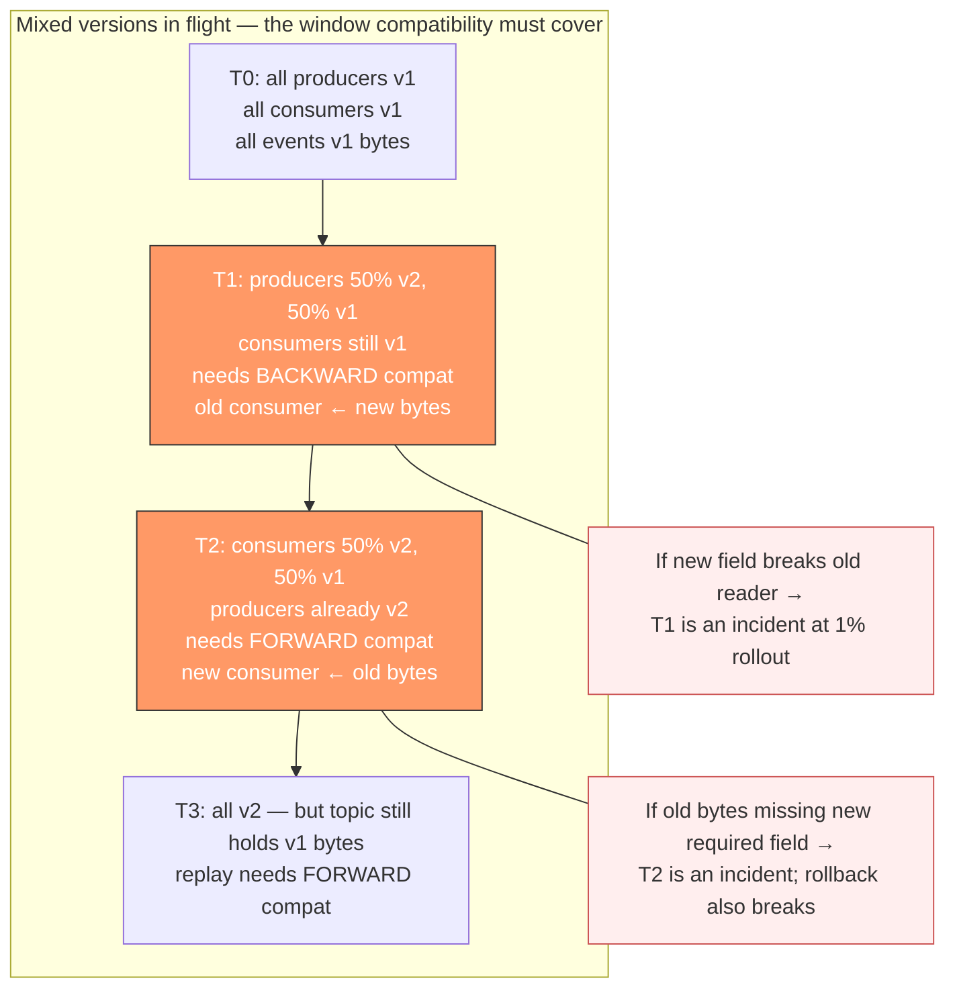
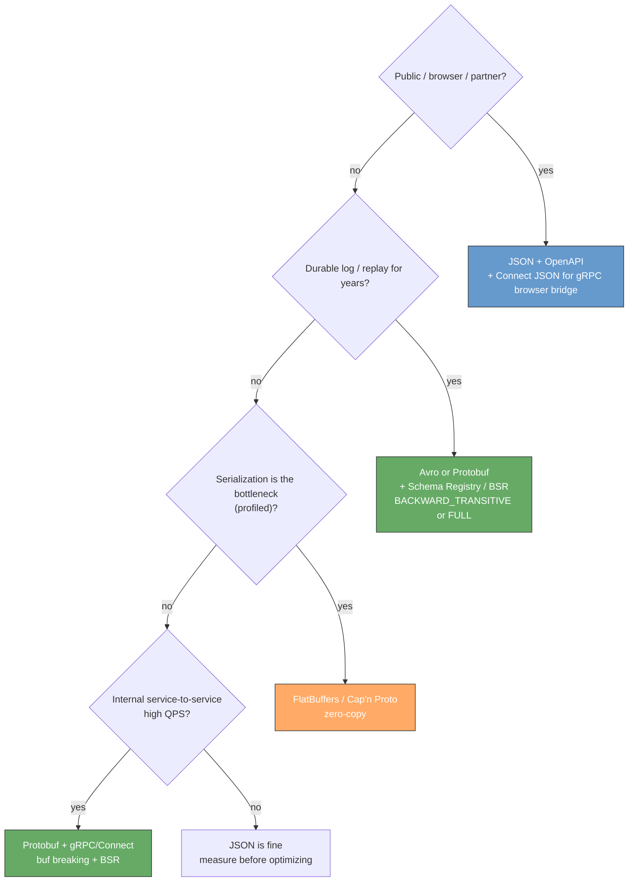
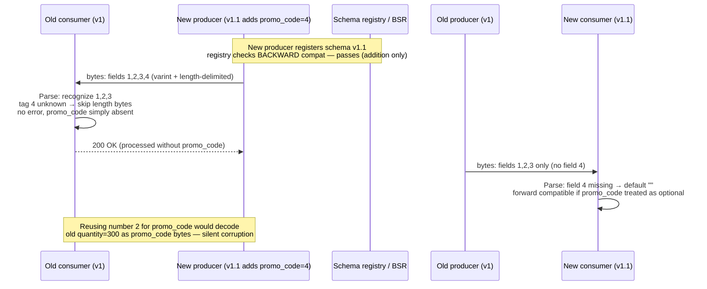
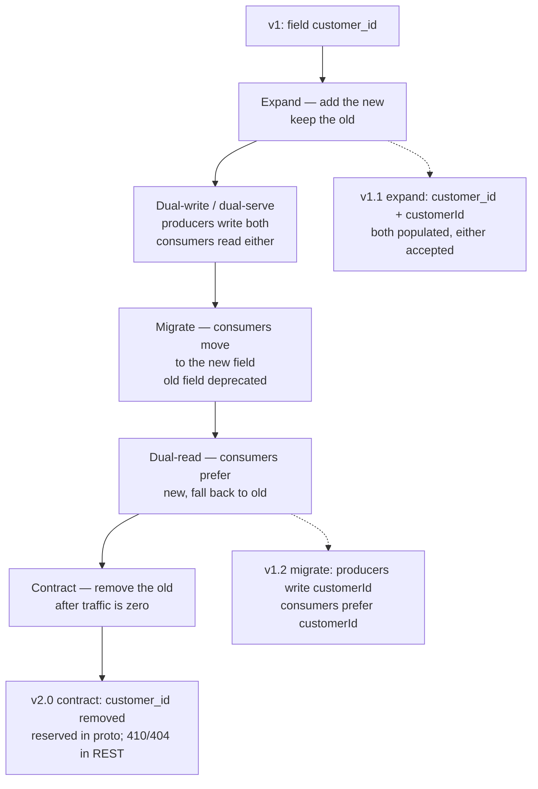
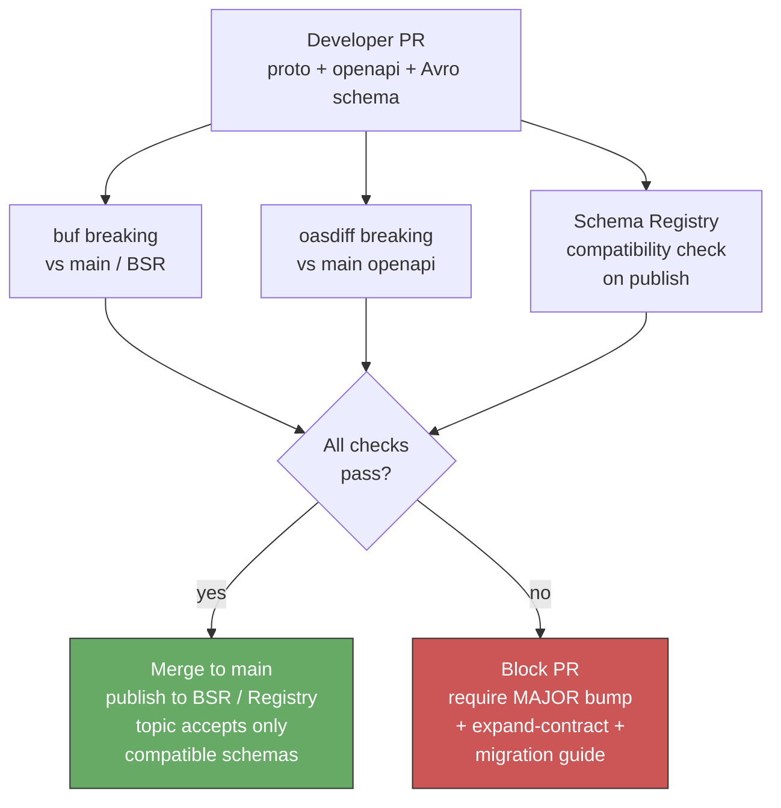
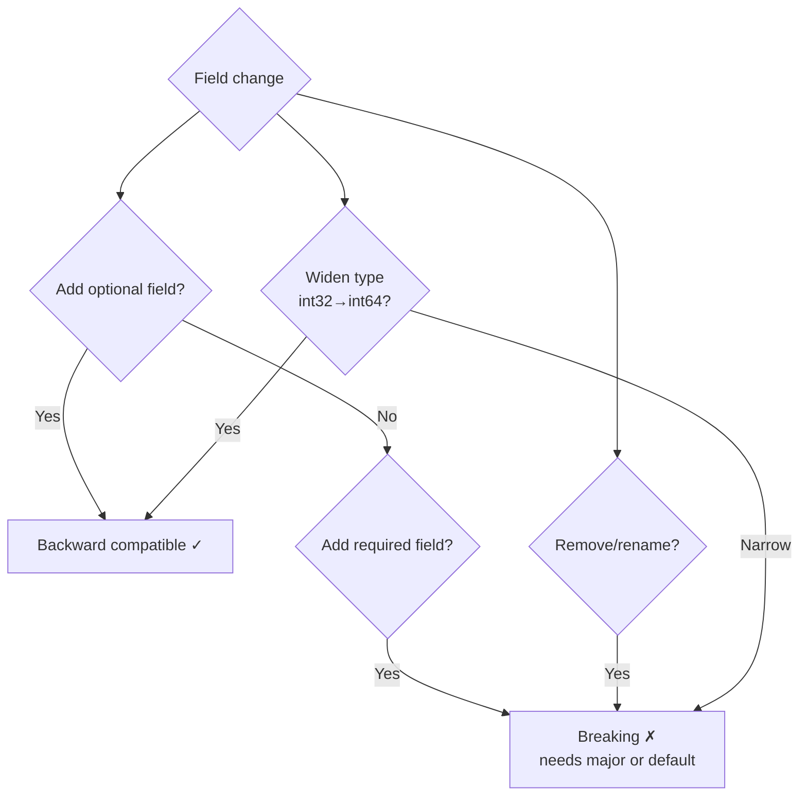
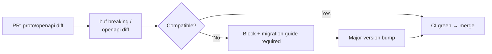
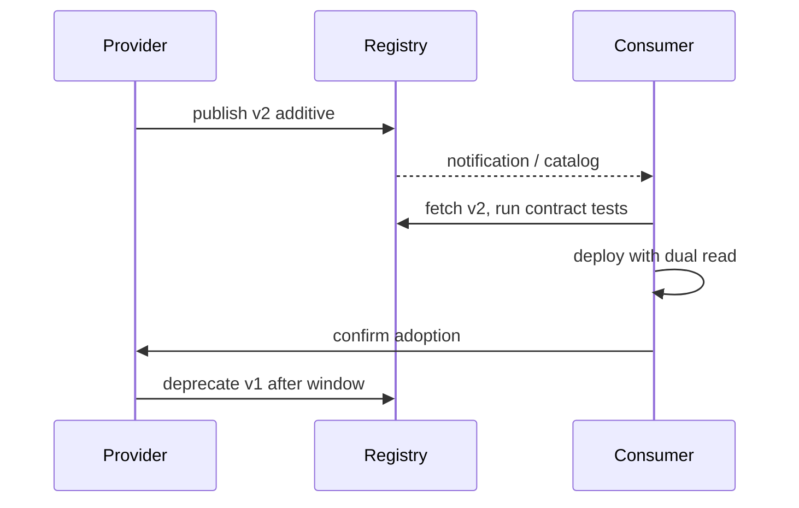

# Chapter 8 — Compatibility and Wire Formats

**What this chapter covers.** An API's wire format is the contract that outlives every deploy: the bytes that cross the network after the producer has upgraded but before every consumer has. Choosing JSON versus Protobuf versus Avro is not a style preference — it determines what kinds of evolution are safe, how large payloads are on the wire, whether a consumer that has not yet upgraded can ignore fields it does not understand, and whether a gateway can validate and route without knowing every schema version. Compatibility is the discipline that keeps the system correct when *mixed versions* are in flight — during rolling deploys, canary analysis, blue/green cuts, and the months-long tails of mobile and partner upgrades that never converge to a single version (see Chapter 5 — Versioning and Evolution). This chapter makes both precise. We dissect the Protobuf wire format at the byte level (varints, tags, length-delimited fields, unknown-field preservation), contrast it with JSON and Avro/Thrift/FlatBuffers on size, speed, schema discipline, and browser reachability, define backward, forward, and full compatibility crisply and show which breaks each format tolerates, and build the production machinery: the expand-contract pattern for storage and wire schemas, the `buf breaking` and `oasdiff`/`openapi-diff` gates that fail CI on breaking changes, and the schema-registry designs (Confluent/Apicurio/Buf Schema Registry) that enforce compatibility at publish time. Every pattern is anchored in runnable, version-pinned proto/Avro/JSON examples and viewed through the distributed-systems lens where rolling deploys, serialization-aware routing, and dual-version serving make or break the design.

Learning goals — after this chapter you should be able to:

- Describe the Protobuf binary wire format (tag = `field_number << 3 | wire_type`, varint/ZigZag, length-delimited, unknown-field preservation) and explain why it enables forward compatibility by default — and where it does not.
- Compare JSON, Protobuf, Avro, Thrift, FlatBuffers, and MessagePack on payload size, encode/decode cost, schema discipline, browser support, and compatibility guarantees — and choose correctly per surface (public REST, internal gRPC, event log, edge/browser).
- Classify any schema change as backward-compatible, forward-compatible, full-compatible, or breaking — and apply the correct expand-contract step rather than a flag-day migration.
- Apply Protobuf compatibility rules precisely: safe additions (new `optional`/`repeated` fields with fresh numbers), safe `reserved` discipline, `oneof` evolution, `enum` aliasing, and the five changes that are always breaking (number reuse, type-widening, `required`-like semantics, `oneof` removal, enum value reuse).
- Apply JSON/OpenAPI compatibility rules: additive fields and `x-` extensions are backward-compatible, type changes/renames/removals and tightening `required`/`enum` are breaking, and why JSON's schemaless convenience trades away the safety Protobuf gives you for free.
- Wire compatibility enforcement into CI and the registry: `buf breaking` against `main` (or BSR), `oasdiff breaking`/`openapi-diff` for OpenAPI, Confluent/Apicurio compatibility modes (`BACKWARD`/`FORWARD`/`FULL`/`TRANSITIVE`), and Schema Registry validation on Kafka/BSR publish.

---

## Why wire format and compatibility are the same problem

A wire format defines *how* data is serialized; compatibility defines *when* a change to that serialization breaks someone who has not yet upgraded. The two are inseparable: the wire format's design determines which evolutions are invisible to old readers and old writers.

In a single-process system, changing a struct field from `string status` to `enum Status status` is a compile-time error you fix in one commit. In a distributed system, that field is serialized, pushed to a topic, written to a database, cached at the edge, and polled by a mobile binary you last released three months ago. Changing it is *three* deployments (writer, reader, storage) across *two* time windows with *mixed versions* in flight. The only question that matters is: *will the bytes produced by version N still be readable by version N−1, and will the bytes produced by version N−1 still be readable by version N?*

That question splits into three guarantees:

| Guarantee | Question | Consumer that benefits |
|-----------|----------|------------------------|
| **Backward compatible** | Can an *old* consumer read data produced by a *new* producer? | Old readers during rollout (the common case) |
| **Forward compatible** | Can a *new* consumer read data produced by an *old* producer? | New readers that rolled first, or replays of old events |
| **Full compatible** | Both directions — old↔new interop | Safe rolling deploys in either direction; event replays |

> **Distributed-systems lens.** Every rolling deploy, blue/green cut, and Kafka topic has a window where *both* versions coexist. If the new producer's bytes break the old consumer, the rollout turns into an incident the moment 1% of traffic hits the new version. Backward compatibility is what lets you roll forward; forward compatibility is what lets you roll back or replay. Full compatibility is what lets you do either without coordination — and it is the invariant a schema registry *enforces* (see Vol 6, Ch 7 — Quorum Systems, on why coordination-free evolution matters, and Vol 10, Ch 3 — Kafka Architecture, on log immutability).



The rest of the chapter shows how each wire format answers this question — and how to verify the answer mechanically.

---

## Wire formats compared — what to use where

No single format wins everywhere. The trade-off is *size/speed* versus *human readability and ubiquity* versus *schema discipline and compatibility safety*.

| Format | Encoding | Schema? | Size (vs JSON) | Speed | Browser-native | Compatibility safety | Best for |
|--------|----------|---------|----------------|-------|----------------|----------------------|----------|
| **JSON** | Text, self-describing | Optional (JSON Schema / OpenAPI) | 1× (baseline) | Baseline | Yes | Low — additive fields safe, but nothing enforced by the wire | Public REST, webhooks, browser, debugging |
| **Protobuf** (proto3) | Binary, tag-value | Required (`.proto`) | ~0.25–0.5× | 2–5× faster than JSON | No (via `grpc-web` / Connect JSON or `protobuf-es`) | High — unknown fields, `reserved`, `buf breaking` | Internal gRPC, service-to-service, BSR/Schema Registry |
| **Avro** | Binary, schema + data | Required (Avro schema, often with Registry) | ~0.2–0.4× (with registry, no schema per message) | Fast; schema resolution at read time | No | High — reader/writer schema resolution; `BACKWARD`/`FULL` enforced by Registry | Kafka/event log, data lake, batch |
| **Thrift** (compact/binary) | Binary, field IDs | Required (`.thrift`) | ~0.3–0.5× | Fast | No | Medium-high — similar to Protobuf but `required` is dangerous | Legacy RPC, some data pipelines |
| **FlatBuffers / Cap'n Proto** | Binary, zero-copy | Required | Smallest; zero-copy read | Fastest (no parse) | No | Medium — zero-copy trades evolution flexibility | Games, ultra-low-latency, on-device |
| **MessagePack / CBOR** | Binary, self-describing | No | ~0.5–0.7× | ~1.5× JSON | Partial (JS libs) | Low — like JSON, no schema guard | Cache payloads, small embedded, CBOR for COSE/CWT |
| **gRPC JSON** (`protojson`) / Connect JSON | Text (JSON mapping of proto) | Required (proto) but JSON on wire | ~1× | JSON speed | Yes (Connect) | Medium — field presence rules still apply via proto | Browser ↔ gRPC (Connect, `grpc-web`) |

**Selection heuristics for a senior backend engineer:**

1. **Public API consumed by browsers/partners:** JSON over HTTPS (OpenAPI), with a JSON Schema/BSR-compatible check. Add Connect/gRPC-JSON transcoding if the same service also serves internal gRPC (see Ch 3, Ch 5 `google.api.http`).
2. **Internal service-to-service (low latency, high QPS):** Protobuf over gRPC (HTTP/2) or Connect (HTTP/1.1/2/3). Binary, code-generated, `buf`-checked.
3. **Durable event log / streaming (Kafka, Pulsar, Kinesis):** Avro with a Schema Registry (Confluent `BACKWARD_TRANSITIVE` / `FULL`) or Protobuf with BSR — never schemaless JSON on a log you will replay for years (Vol 10, Ch 3).
4. **Ultra-low-latency or zero-copy (feature store, game, device):** FlatBuffers/Cap'n Proto — only if profiling shows serialization is the bottleneck.
5. **Cache/memoization payloads (Redis, Memcached):** MessagePack/CBOR if size matters and the reader is controlled; otherwise JSON for debuggability.



---

## Protobuf wire format — the bytes that make compatibility work

Protobuf's compatibility story is not magic — it falls out of the wire encoding. Understanding the bytes explains *why* unknown fields are ignored, why field numbers must never be reused, and why `reserved` exists.

### Encoding at a byte level

Every field on the wire is a **tag** followed by a **value**. The tag is `field_number << 3 | wire_type` encoded as a varint.

| Wire type | Value | Used for | Value encoding |
|-----------|-------|----------|----------------|
| `0` | Varint | `int32`, `int64`, `uint32`, `uint64`, `sint32`, `sint64`, `bool`, `enum` | Varint (7 bits per byte, MSB = continuation) |
| `1` | 64-bit | `fixed64`, `sfixed64`, `double` | 8 bytes little-endian |
| `2` | Length-delimited | `string`, `bytes`, embedded messages, `repeated` packed | Varint length + N bytes |
| `5` | 32-bit | `fixed32`, `sfixed32`, `float` | 4 bytes little-endian |

Varint with **ZigZag** for signed types: `sint32`/`sint64` map `(0, -1, 1, -2, 2, …)` → `(0, 1, 2, 3, 4, …)` so small negatives do not become 10-byte varints.

**Example.** This proto:

```protobuf
// orders.proto
syntax = "proto3";
package api.orders.v1;

message CreateOrderRequest {
  string customer_id = 1;  // tag = 1<<3|2 = 10 (0x0A)
  int32  quantity    = 2;  // tag = 2<<3|0 = 16 (0x10)
  bool   expedited   = 3;  // tag = 3<<3|0 = 24 (0x18)
}
```

Request `{ customer_id: "42", quantity: 300, expedited: true }` encodes as:

```
0A 02 34 32    field 1, length-delimited, len=2, bytes "42"
10 AC 02       field 2, varint, 300 = 0xAC 0x02 (varint)
18 01          field 3, varint, true = 1
```

If a *new* producer adds `string promo_code = 4` and an *old* consumer does not know field 4, the old consumer sees tag `34` (`4<<3|2`) — unrecognized — and **skips** `length` bytes. New field, old reader, no failure: backward compatibility for free. Conversely, an old producer that never writes field 4 leaves it at its default (`""`) on the new consumer — forward compatibility, provided the new field is not treated as required.

Unknown fields are **preserved** on parse and re-serialized by proto3 runtimes (since 3.5) — a proxy that does not understand field 4 can still forward it. That is full compatibility at the byte level — as long as you never reuse numbers or change wire types.

### What is allowed, what breaks — the Protobuf rules

Safe (non-breaking) changes:

- **Add a new field** with a fresh number, `optional` or `repeated`, with a sensible default. Old readers ignore it; new readers see default when reading old bytes.
- **`reserved` a number or name you will never reuse.** `reserved 6, 9 to 11; reserved "old_field";` prevents accidental reuse.
- **Add a value to an `enum`** — but only if consumers handle unknown enum values (they arrive as the numeric value; generated `UNRECOGNIZED` in Java/Go). Always include `UNSPECIFIED = 0` as the default.
- **Add a new `oneof` alternative** (old readers ignore the new case as unknown field on the `oneof`'s tag).
- **Widen from `optional` to `repeated` via a new field** — never change the same number's cardinality.

Always-breaking changes:

| Breaking change | Why it breaks |
|---|---|
| **Reuse a field number** (even with a different name/type) | Old bytes for the old field are decoded as the new field — silent data corruption |
| **Change wire type** (`int32`→`string`, `int32`→`fixed32`) | Decoder reads the wrong number of bytes |
| **Change `int32`↔`uint32`↔`sint32` semantics without care** | Varint/ZigZag mismatch; negative values corrupt |
| **Remove a `oneof` or change its kind** | `oneof` discriminant lost; unknown-field handling differs |
| **Remove or rename an `enum` value that old producers still emit** | Old numeric value becomes `UNRECOGNIZED`; switch statements that lack a `default` misbehave |
| **Tighten a constraint the wire does not enforce** (`string` → `enum`, add `required`-like validation) | Wire-compatible but *semantically* breaking — old producer sends a value the new consumer rejects (see expanding below) |

```protobuf
// api/orders/v1/order.proto — safe evolution discipline (version-pinned: buf 1.40+, protobuf 5.x)
syntax = "proto3";
package api.orders.v1;

import "google/protobuf/timestamp.proto";

message Order {
  string customer_id = 1;
  int32  quantity    = 2;
  bool   expedited   = 3;

  // Added in v1.1 — safe: fresh number, optional semantics (proto3 optional)
  optional string promo_code = 4;

  // Added in v1.2 — safe: new enum value at end
  enum Status {
    STATUS_UNSPECIFIED = 0;
    STATUS_PENDING     = 1;
    STATUS_SHIPPED     = 2;
    STATUS_DELIVERED   = 3;
    // Added in v1.2:
    STATUS_RETURNED    = 4;
  }
  Status status = 5;

  google.protobuf.Timestamp created_at = 6;

  // Numbers 7-9 reserved — never reuse if you remove a field
  reserved 7, 8, 9;
  reserved "legacy_discount_code";
}

// Breaking — DO NOT DO:
// message Order { string customer_id = 1; string quantity = 2; }  // type change: int32 -> string
// message Order { string promo_code = 2; }  // reuse of number 2
```



### JSON / OpenAPI compatibility — additive is safe, everything else is suspect

JSON has no wire-level field numbers — compatibility is purely conventional and must be enforced by tooling.

| Change | Backward? (old reader ← new bytes) | Forward? (new reader ← old bytes) | Verdict |
|--------|------------------------------------|-----------------------------------|---------|
| Add optional field | Yes — old reader ignores unknown keys | Yes — new reader sees missing → default/null | Safe |
| Add `required` field | **No** — old writer omits it, new reader may reject | — | Breaking (tightening) |
| Remove field (even optional) | — | **No** — new reader may still expect it | Breaking if any client still sends it |
| Rename field | **No** — old reader looks for old name | **No** — new reader looks for new name | Breaking (two-field expand-contract instead) |
| Change type (`string`→`number`, `string`→`enum`) | **No** — old reader parses wrong type | **No** | Breaking |
| Tighten `enum` (remove value) | — | **No** — old writer emits removed value | Breaking |
| Widen `enum` (add value) | **No** if old reader lacks default case | Yes | Conditionally safe — document unknown-value handling |
| Tighten numeric range / `pattern` / `maxLength` | — | **No** — old valid values now invalid | Breaking |
| Add `x-` extension / additive header | Yes | Yes | Safe |

The implication: JSON APIs need the same discipline Protobuf gives for free — and a CI gate that catches what the wire does not. That gate is `oasdiff`/`openapi-diff` (see below). Without it, "just add a field" discipline is a handshake agreement waiting to be violated.

---

## Expand-contract — the only safe migration

When the change *is* breaking (rename, type change, tighten), the flag-day alternative — "everyone upgrades at once" — fails at any non-trivial consumer count. Expand-contract (also called parallel change) is the mechanical alternative.



Concrete storage + wire example:

```sql
-- Phase 1 — Expand (backward compatible). Old code still reads customer_id; new code writes both.
ALTER TABLE orders ADD COLUMN customer_id_v2 TEXT;  -- nullable
-- Application dual-writes: SET customer_id_v2 = customerId, customer_id = customer_id_v2

-- Phase 2 — Migrate + Dual-read. Backfill then switch reads.
UPDATE orders SET customer_id_v2 = customer_id WHERE customer_id_v2 IS NULL;
-- Application: read customer_id_v2 if present else customer_id

-- Phase 3 — Contract. Only after old producer traffic is 0 and backfill is verified.
ALTER TABLE orders DROP COLUMN customer_id;  -- proto: reserved "customer_id"; reserved 1;
```

```protobuf
// Proto expand-contract — rename customer_id -> customer_id_v2 without breaking
message Order {
  // Phase 1: keep old, add new
  string customer_id    = 1; // deprecated = true
  string customer_id_v2 = 7; // new canonical

  // Phase 3 after migration:
  // reserved 1;
  // reserved "customer_id";
  // string customer_id_v2 = 7;
}
```

Wire rules during expand: producers populate *both* fields with the same value; consumers read the *new* field if present, else the old. Validation accepts either but prefers the new. Traffic metrics confirm the old field's `present` rate falls to zero before `reserved` is applied — see observability below.

---

## Enforcement — failing the build on breaking changes

Discipline without enforcement drifts. Two gates cover the two surfaces:

### Protobuf — `buf breaking` (Buf 1.40+, BSR)

```yaml
# buf.yaml — module at api/orders
version: v2
modules:
  - path: proto
lint:
  use: [DEFAULT]
  # Enforce reserved discipline, enum zero value, field naming
breaking:
  use: [FILE]           # FILE = strict; PACKAGE/WIRE_JSON are looser
  except: []            # never except breaking without a reason
```

```yaml
# buf.lock is committed; CI compares against main's BSR or git
# .github/workflows/buf.yaml
name: buf
on: [pull_request]
jobs:
  breaking:
    runs-on: ubuntu-latest
    steps:
      - uses: actions/checkout@v4
        with: fetch-depth: 0
      - uses: bufbuild/buf-action@v1
        with:
          setup_only: true
      - run: buf lint proto
      - run: buf breaking proto --against '.git#branch=main'
        # or against BSR: --against 'buf.build/acme/orders:main'
```

A PR that reuses field number `2`, changes `int32 quantity` to `string quantity`, or removes `STATUS_PENDING` fails with a line-precise diagnostic:

```
proto/api/orders/v1/order.proto:8:3: Field "2" on message "Order" changed type from "int32" to "string".
proto/api/orders/v1/order.proto:7:3: Field "2" on message "Order" changed name from "quantity" to "promo_code".
Failure: 2 breaking changes detected.
```

Wire-compatibility categories map to `buf breaking` groups: `WIRE` (wire-type changes) versus `WIRE_JSON` (+ JSON name changes) — choose `FILE` for public APIs; `WIRE_JSON` is tolerable for internal-only.

### OpenAPI — `oasdiff` / `openapi-diff` (oasdiff 1.10+, openapi-diff 2.1+)

```bash
# Compare PR's openapi.yaml against main — fail on breaking changes
oasdiff breaking https://raw.githubusercontent.com/acme/orders/main/openapi.yaml \
                 ./openapi.yaml \
                 --fail-on ERR \
                 --composed  # also catch allOf/anyOf/oneOf breaks

# Alternative (Java, Redocly ecosystem):
openapi-diff --fail-on-incompatible \
  https://raw.githubusercontent.com/acme/orders/main/openapi.yaml \
  ./openapi.yaml
```

Outputs are stability-graded: `ERR` (breaking: removed field, new `required`, type change) fails CI; `WARN` (added optional field) is informational. Back that with a Schema Registry for event surfaces:

```properties
# Confluent Schema Registry / Apicurio — topic-level compatibility
# Admin API or Terraform (confluent_schema, apicurio registry)
confluent.value.schema.validation=true
# Per-subject compatibility (the invariant the registry enforces on publish)
# BACKWARD: new schema can read data written by old schema (old consumer ← new bytes)
# FORWARD: old schema can read data written by new schema (new consumer ← old bytes)
# FULL: both; TRANSITIVE variants check against *all* prior versions, not just the latest
subject.orders-value.compatibilityLevel=FULL_TRANSITIVE
```

Publishing a schema that reuses a field number, tightens `required`, or narrows an `enum` is rejected at `POST /subjects/orders-value/versions` with a compatibility error — before any bytes hit the topic. Apicurio's `FULL_TRANSITIVE` and Buf Schema Registry's `breaking` check are the same idea: the registry is the compatibility gate for the log.



---

## The distributed-systems lens — living with mixed versions

### Rolling deploys and the two invariants

A rolling deploy is the steady state, not the exception — especially with canaries, blue/green, and multi-region traffic shifting (Vol 7, Ch 10–11). At any moment, two service revisions serve traffic. Compatibility determines whether the gateway can safely route either version to either revision:

- **New gateway + old service** needs forward compatibility (new consumer ← old bytes).
- **Old gateway + new service** needs backward compatibility (old consumer ← new bytes).

Full compatibility lets you roll in either direction without coordinating producer/consumer deployment order. Anything weaker forces deploy ordering ("producers first" for backward, "consumers first" for forward") — and ordering assumptions break the first time someone deploys out of order.

### Deserialization-aware routing and validation

Gateways and meshes that validate `Content-Type` or decode Protobuf for authZ/routing (Envoy `ext_authz`, `grpc_json_transcoder`, JSON Schema validation) are *deserializers*. A gateway that was not redeployed with the new schema may reject new fields it does not recognize — even though the destination service would ignore them safely. Mitigate by: (a) treating gateway validation as part of the compatibility surface and deploying it with the schema, or (b) configuring gateways to `ignore_unknown_fields` and pass through bytes they do not understand.

### Caching, storage, and replays

Wire bytes outlive the request that produced them:

- **CDN / gateway cache** (Vol 7, Ch 8) may serve old serialized responses to new clients — cache keys must not assume a single schema version, and `Vary: Accept` / versioned `ETag` prevents serving stale-serialized bytes.
- **Database / object store** holds the *storage schema*, which evolves separately from the wire schema — apply expand-contract to storage (nullable column / dual-read) and wire (new field) in the same window, and do not `DROP COLUMN` / `reserved` until both are migrated.
- **Kafka / event log** holds bytes for months or years. `FULL_TRANSITIVE` is the right default for topics you replay; `BACKWARD` alone lets new consumers break on old events after a new required field is added. Measure replay: a single old event that fails to deserialize on a new consumer halts the partition.

### Observability that earns its keep

- **Unknown-field counters.** Protobuf runtimes can log/count unknown fields (or a proxy can). A spike in unknown fields after a deploy confirms the new producer is live before the new consumer — use it as a canary signal.
- **Deserialize-failure rate.** Track separately from business errors — a rise in `InvalidProtocolBufferException` / `JsonMappingException` during a rollout is a compatibility break, not a product bug.
- **Field-presence metrics.** During expand-contract, emit `field_present{field="customer_id_v2"}` — contract only when the old field's presence is zero across all producers for longer than the retention window.

---

## Anti-patterns (and what to do instead)

| Anti-pattern | Why it hurts | Fix |
|--------------|--------------|-----|
| Reusing a field number "since the old field is deleted" | Old bytes silently decode as the new field — data corruption | `reserved` every deleted number/name forever |
| Changing `int32`→`int64` on the same number "because it's wider" | Wire-type compatible but value semantics change; JSON mapping changes; truncation on old readers | New field with new number; expand-contract |
| `required` in proto2 / "required" by validation on a new field | Old writers omit it; new readers reject every old event — breaks forward compat and replays | All wire fields optional; validation only tightens *after* dual-write window |
| Schemaless JSON on a durable topic "for flexibility" | No compatibility gate; renames/type changes are invisible until a replay fails months later | Avro/Protobuf + Schema Registry with `FULL_TRANSITIVE` |
| Hand-editing `buf.yaml` `except:` to silence a breaking error | Bypasses the gate that prevents incidents | `except` only with a `MAJOR` bump + migration guide + `Sunset` |
| "Wire and storage schemas are the same thing" | Conflates two evolution surfaces with different lifetimes and rollback windows | Version wire and storage independently; expand-contract both |

---


#### Compatibility Matrix



#### Breaking Change Detection Pipeline



#### Consumer Upgrade Safe Path



## Key takeaways

- Compatibility is about *mixed versions in flight*, not single-version correctness. Backward (old ← new) lets you roll forward; forward (new ← old) lets you roll back and replay; full (both) lets you do either without deploy ordering.
- Wire format choice determines the compatibility you get for free. Protobuf gives tag-based unknown-field skipping and `reserved` discipline; Avro gives reader/writer schema resolution via the Registry; JSON gives nothing for free and must be gated by `oasdiff`/`openapi-diff` and a Registry.
- Know the Protobuf bytes: `tag = field_number << 3 | wire_type`, varint/ZigZag, length-delimited, 32/64-bit fixed. That encoding is *why* adding a field with a fresh number is safe and reusing a number is silent corruption.
- Protobuf-safe changes are additions with fresh numbers (`optional`/`repeated`), `reserved` on deletion, additive `enum` values with `UNSPECIFIED = 0`, and additive `oneof` cases. Breaking changes are number reuse, wire-type changes, cardinality changes on the same number, `oneof` removal, and `enum` value reuse — all caught by `buf breaking`.
- JSON-safe changes are additive optional fields and `x-` extensions; renames, removals, type changes, and tightening `required`/`enum`/`pattern` are breaking. Gate every OpenAPI change with `oasdiff breaking`.
- For any breaking shape, use expand-contract: expand (add new, keep old, dual-write), migrate (consumers prefer new, dual-read), contract (remove old, `reserved` the number/name, enforce with metrics on field presence). Apply it to wire *and* storage in the same window.
- Enforce mechanically: `buf breaking` vs `main` or BSR in CI (`FILE` for public APIs), `oasdiff breaking --fail-on ERR` for OpenAPI, and Schema Registry `FULL_TRANSITIVE` on Kafka/BSR publish — a breaking schema must not reach the topic, the gateway, or the cache.
- Operate mixed versions deliberately: deploy-order independence requires full compatibility; gate gateways/proxies for `ignore_unknown_fields` so they do not reject new fields they do not understand; track unknown-field counts, deserialize-failure rates, and field-presence metrics during expand-contract; and never `DROP COLUMN`/`reserved` until presence of the old shape is zero for longer than the retention/replay window.

## Further reading

- Protocol Buffers — Encoding (varint, wire types, tag) and Language Guide (proto3). https://protobuf.dev/programming-guides/encoding/ / https://protobuf.dev/programming-guides/proto3/
- Protocol Buffers — Field presence and `optional` in proto3. https://protobuf.dev/programming-guides/field_presence/
- Buf — Breaking change detection (`buf breaking`, `WIRE`/`WIRE_JSON`/`FILE`). https://buf.build/docs/breaking/overview
- Buf Schema Registry (BSR) — schema governance and `buf breaking` against BSR. https://buf.build/docs/bsr/overview
- Confluent Schema Registry — compatibility types (`BACKWARD`/`FORWARD`/`FULL`/`TRANSITIVE`). https://docs.confluent.io/platform/current/schema-registry/fundamentals/schema-evolution.html
- Apicurio Registry — compatibility and artifact rules. https://www.apicurio.io/registry/docs/apicurio-registry/3.0.x/getting-started/assembly-configuring-the-registry.html
- `oasdiff` — OpenAPI breaking-change detection. https://github.com/oasdiff/oasdiff
- `openapi-diff` (OpenAPITools) — OpenAPI comparison. https://github.com/OpenAPITools/openapi-diff
- `openapi-compat` / Spectral — OpenAPI linting that catches compatibility-adjacent issues. https://github.com/stoplightio/spectral
- Avro — Specification and schema resolution. https://avro.apache.org/docs/current/specification/
- Thrift — IDL and protocol documentation. https://thrift.apache.org/docs/idl
- FlatBuffers / Cap'n Proto — zero-copy trade-offs and evolution. https://flatbuffers.dev/ / https://capnproto.org/language.html
- AIP-122 — Resource names, AIP-123 — Resource revisions (Google API Improvement Proposals) — expand-contract context. https://google.aip.dev/122 / https://google.aip.dev/123
- ConnectRPC — JSON/Protobuf wire negotiation and `Connect` protocol. https://connectrpc.com/docs/protocol/
- RFC 9457 — Problem Details (error envelopes referenced for compatibility of error `code`s — see Ch 7). https://www.rfc-editor.org/rfc/rfc9457.html
- Transcoding — `google.api.http` and `grpc-gateway` / Envoy `grpc_json_transcoder` (where wire-format negotiation meets the gateway). https://grpc-ecosystem.github.io/grpc-gateway/ / https://www.envoyproxy.io/docs/envoy/latest/configuration/http/http_filters/grpc_json_transcoder_filter

