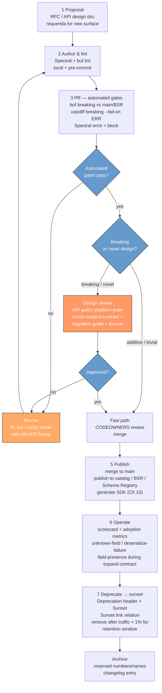
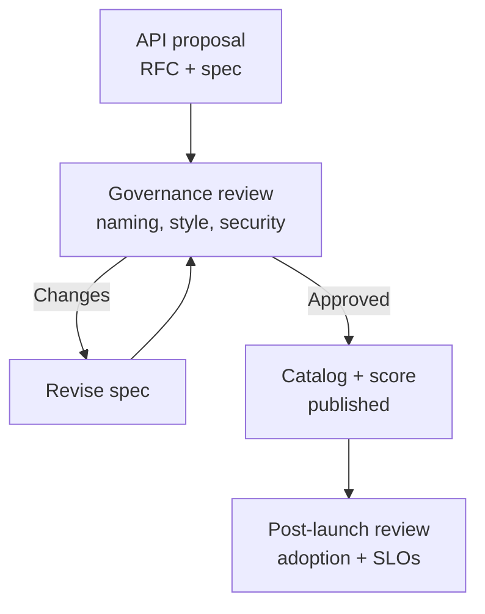
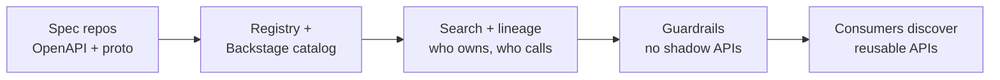
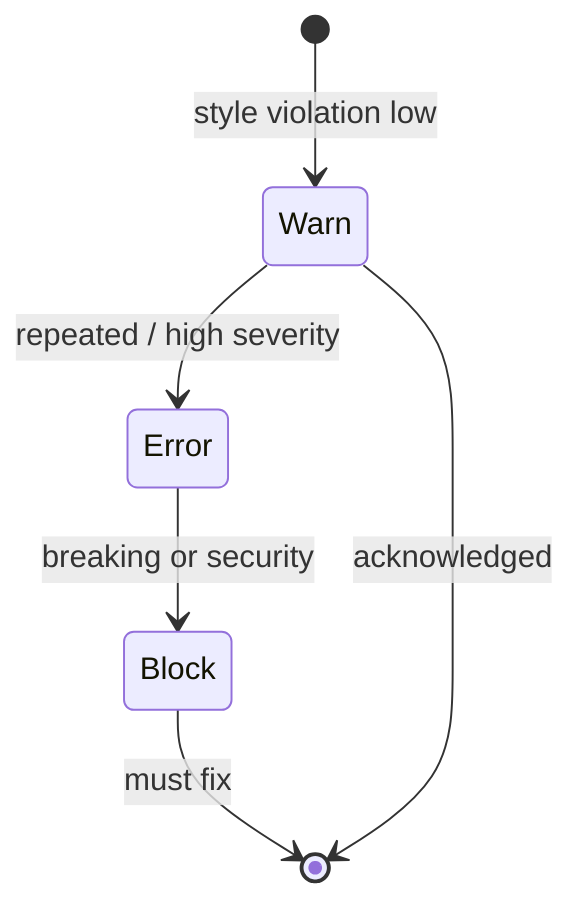

# Chapter 9 — API Governance, Linting, and Breaking-Change Detection

**What this chapter covers.** At ten services, API consistency is a matter of taste. At three hundred services owned by forty teams deploying fifty times a day, it is a matter of survival. Without governance, every team invents its own pagination, its own error envelope, its own naming convention, and its own definition of "breaking change" — and the cost compounds every time a consumer integrates. This chapter makes governance operational: not a committee that meets quarterly to produce a PDF, but a set of automated gates that make the right thing the easy thing. We define what API governance actually governs (naming, structure, lifecycle, compatibility), compare centralized, federated, and platform-enabled governance models, build a linting pipeline that enforces standards with Spectral and buf lint before a human ever reviews, wire breaking-change detection with `oasdiff`, `openapi-diff`, and `buf breaking` into CI so that no breaking change merges without an explicit major-version bump and migration guide, and show how to measure governance with catalogs and scorecards rather than compliance theatre. Every rule is anchored in runnable, version-pinned config — the same gates you run in CI on Monday morning.

Learning goals — after this chapter you should be able to:

- Compare centralized, federated, and platform-enabled API governance models and choose the right operating model for a given org size and service count — explaining where each model breaks down and how to avoid governance theatre.
- Author and enforce an API style guide as machine-checkable rules: Spectral rulesets for OpenAPI (naming, structure, pagination, error envelope, security) and buf lint rules for Protobuf (package versioning, field naming, `reserved` discipline).
- Classify any OpenAPI or Protobuf change as breaking, non-breaking, or risky — and explain why `required` field additions, type changes, and enum tightening are breaking even when they "look small."
- Wire linting and breaking-change detection into CI as blocking gates: Spectral in GitHub Actions, `buf breaking` against `main` or BSR, `oasdiff breaking` / `openapi-diff` for OpenAPI, with correct `fetch-depth`, baseline handling, and `fail-on` thresholds.
- Design the governance lifecycle (proposal → lint → breaking check → design review → publish → deprecate → sunset) with CODEOWNERS, branch protection, and catalog automation — and measure it with scorecards, not manual audits.
- Reason about governance through the distributed-systems lens: why shared standards are a coordination problem, how to scale review without becoming a bottleneck, and what to do when a governed API is also a wire format on a durable log.

---

## Why governance, and why now

Every distributed system is a socio-technical system. Conway's law is not a metaphor — it is a prediction that, left unguided, your API surface will mirror your org chart's inconsistencies. One team paginates with `?page=2&per_page=50`, another with `?offset=100&limit=25`, a third with cursor `?after=eyJpZCI6MTAwfQ==`. One team returns errors as `{ "error": "not found" }`, another as `{ "code": "RESOURCE_NOT_FOUND", "message": "...", "details": [...] }` per RFC 9457 (see Chapter 7), a third as a bare HTTP status with no body. Consumers that integrate with five services write five adapters. Consumers that integrate with fifty give up and build a brittle hand-rolled client for each.

The cost is not aesthetic. Inconsistent naming forces consumers to memorize per-service conventions. Inconsistent pagination and filtering (see Chapter 6) forces them to reimplement iteration for every resource. Inconsistent error envelopes defeat the retry and circuit-breaker machinery (Chapter 7). Inconsistent versioning (see Chapter 5) means some teams version by URL path, some by header, some not at all — and the gateway must handle all three. And inconsistent evolution discipline means breaking changes ship because no gate caught them — the subject of this chapter's second half.

Governance is the answer, but only if it is automated, measured, and scaled to the org.

> **Distributed-systems lens.** API governance is a coordination problem. At ten services, coordination is cheap (one Slack channel, one staff engineer who reviews every design). At three hundred, the coordination cost of human-only review grows superlinearly. Automated linting and breaking-change gates are the equivalent of consensus for process: they let many teams make local decisions — adding a field, deprecating an endpoint — that are globally consistent without a global meeting. The governance pipeline is to team velocity what a schema registry (Chapter 10) is to data correctness: a shared invariant enforced mechanically.

---

## What governance governs

A common failure mode is governing too little (only naming) or too much (every field's business semantics). The tractable surface is:

| Domain | What is governed | Example rule |
|--------|-----------------|--------------|
| **Naming** | Resource, field, enum, path conventions | `snake_case` fields in JSON, `kebab-case` paths, `CamelCase` messages in proto; `GET /v1/orders/{order_id}` not `/getOrders` |
| **Structure** | Pagination, filtering, error envelope, idempotency keys | Every collection supports cursor pagination (`page_token`/`page_size`), errors use `application/problem+json`, mutations accept `Idempotency-Key` (Ch 6, 7) |
| **Lifecycle** | Versioning, deprecation, sunset, `Sunset` header | `Sunset: Sat, 31 Dec 2026 23:59:59 GMT` + `Deprecation: true` + `Sunset` link relation; removal only after traffic < 1% for one retention window (Ch 5) |
| **Compatibility** | What counts as breaking; how it is detected | Adding `required` is breaking; `buf breaking --against main` and `oasdiff breaking --fail-on ERR` block the PR |
| **Security** | Auth, scopes, rate-limit headers | Every operation declares `security: [bearerAuth: []]` or `apiKey`; `429` + `Retry-After` on rate-limited endpoints (Vol 9) |
| **Documentation** | Description, examples, `operationId`, contact | Every operation has `summary`, `description`, `operationId`, at least one `example`; every schema has `description` |

What is *not* governed centrally: the domain model within those constraints. The orders team decides whether an order has a `promo_code` field; governance decides that the field is `promo_code` (not `promoCode` or `promo-code`), that it is optional when added, and that removing it follows expand-contract (Chapter 8).

---

## Governance operating models

### Centralized — the API platform team

One team owns the style guide, the linting config, and the design-review gate. Every new or changed API requires platform-team approval. Works brilliantly at 5–30 services: standards are coherent, enforcement is simple, drift is near zero. Fails at 100+ services because the platform team becomes a bottleneck and teams learn to route around it — shipping unreviewed APIs behind feature flags and asking forgiveness later.

### Federated — guilds and RFCs

Standards are proposed as RFCs, discussed in an API guild (a cross-team community of practice), and adopted by consensus. Each domain team enforces the standard locally. Scales socially — ownership is distributed — but without automated enforcement, adoption is uneven. The team that disagreed with the pagination RFC quietly ignores it.

### Platform-enabled — the model that scales

Standards are codified as machine-checkable rules (Spectral, buf lint) and shipped as a shared config package. CI enforces the rules automatically. Human review is reserved for the cases automation cannot judge — novel resource modeling, cross-domain consistency, deprecation planning. The platform team owns the *tooling*, not every decision.

```mermaid
flowchart TB
    subgraph Centralized["Centralized — bottlenecks at scale"]
        C1["Platform team<br/>owns guide + review"] --> C2["Every API → platform approval<br/>single queue"]
        C2 --> C3["Coherent, but queue grows<br/>with service count"]
        style C3 fill:#c55,stroke:#333,color:#fff
    end

    subgraph Federated["Federated — drifts without enforcement"]
        F1["Guild / RFC process<br/>consensus standard"] --> F2["Each team enforces locally<br/>no automated gate"]
        F2 --> F3["Socially scalable<br/>but uneven adoption"]
        style F3 fill:#fa6,stroke:#333,color:#fff
    end

    subgraph PlatformEnabled["Platform-enabled — scales (recommended)"]
        P1["Platform team ships<br/>shared Spectral + buf configs<br/>as versioned packages"] --> P2["CI enforces automatically<br/>lint + breaking check<br/>on every PR"]
        P2 --> P3["Human review only for<br/>novel design + deprecation<br/>fast path for additive changes"]
        P3 --> P4["Coherent + scalable<br/>right thing is the easy thing"]
        style P4 fill:#6a6,stroke:#333,color:#fff
    end
```



**Recommendation for a senior backend engineer:** start centralized if you are under ~30 services, federate socially as you grow, and invest in platform-enabled automation the moment the API review queue has a wait time. The automation is not optional at scale — it is the only way to keep review latency flat while service count grows.

The canonical artifact is an **API style guide** — not a wiki page, but a lintable config. The next two sections build it.

---

## Linting — making the style guide executable

Linting is the cheapest governance gate. It runs in under a second, requires no human, and catches the violations that would otherwise consume design-review time.

### Spectral — OpenAPI linting (Stoplight Spectral 6.11+)

Spectral is the standard OpenAPI linter. It evaluates an OpenAPI document against a ruleset — built-in rules (`spectral:oas`) plus your org's extensions — and reports errors, warnings, and info.

```yaml
# .spectral.yaml — Acme API style guide (Spectral 6.11+, OpenAPI 3.1)
# Install: npm i -D @stoplight/spectral-cli@6.11.0 @stoplight/spectral-rulesets
extends: spectral:oas   # base OAS 3.x rules (valid schema, resolvable refs, etc.)

# Severity: error = blocks CI, warn = visible but non-blocking, off = disabled
rules:
  # ---- Naming ----
  path-kebab-case:
    description: "Paths MUST be kebab-case and lowercase"
    severity: error
    given: "$.paths[*]~"          # every path key
    then:
      function: pattern
      functionOptions:
        match: "^/v[0-9]+/[a-z0-9-]+(/[a-z0-9-]+|/\\{[a-z_]+\\})*$"

  operation-operationId:
    description: "Every operation MUST have an operationId (for codegen — Ch 10)"
    severity: error
    given: "$.paths[*][*]"
    then:
      field: operationId
      function: truthy

  operation-summary:
    description: "Every operation SHOULD have a summary"
    severity: warn
    given: "$.paths[*][*]"
    then:
      field: summary
      function: truthy

  field-snake-case:
    description: "JSON field names MUST be snake_case"
    severity: error
    given: "$.components.schemas[*].properties[*]~"
    then:
      function: pattern
      functionOptions:
        match: "^[a-z][a-z0-9_]*$"

  enum PascalCase-or-SCREAMING:
    description: "Enum values SHOULD be SCREAMING_SNAKE_CASE"
    severity: warn
    given: "$.components.schemas[*].properties[?(@.enum)]"
    then:
      field: enum
      function: schema
      functionOptions:
        schema:
          type: array
          items:
            type: string
            pattern: "^[A-Z][A-Z0-9_]*$"

  # ---- Structure ----
  pagination-required:
    description: "Collection GET MUST support cursor pagination (page_token + page_size)"
    severity: error
    given: "$.paths[?(@property.match(/^\\/.*/) )].get"
    then:
      function: schema
      functionOptions:
        schema:
          type: object
          required: [parameters]
          properties:
            parameters:
              type: array
              contains:
                type: object
                properties:
                  name: { const: page_token }
                  in: { const: query }

  error-envelope:
    description: "Error responses SHOULD use application/problem+json (RFC 9457, Ch 7)"
    severity: warn
    given: "$.paths[*][*].responses[?(@property >= '400')].content"
    then:
      field: "application/problem+json"
      function: truthy

  idempotency-key:
    description: "Non-idempotent mutations (POST) SHOULD accept Idempotency-Key"
    severity: warn
    given: "$.paths[*].post.parameters"
    then:
      function: schema
      functionOptions:
        schema:
          type: array
          contains:
            type: object
            properties:
              name: { const: Idempotency-Key }
              in: { const: header }

  # ---- Lifecycle ----
  sunset-header:
    description: "Deprecated operations MUST include Sunset header and deprecation docs"
    severity: error
    given: "$.paths[*][*][?(@.deprecated == true)]"
    then:
      field: description
      function: pattern
      functionOptions:
        match: "(?i)sunset"

  # ---- Security ----
  operation-security:
    description: "Every operation MUST declare security (or explicitly security: [])"
    severity: error
    given: "$.paths[*][*]"
    then:
      field: security
      function: truthy

  no-http-basic:
    description: "HTTP Basic auth MUST NOT be used"
    severity: error
    given: "$.components.securitySchemes[*]"
    then:
      field: type
      function: pattern
      functionOptions:
        notMatch: "http"
        # allow bearer/JWT, apiKey, oauth2, openIdConnect

  # ---- Documentation ----
  schema-description:
    description: "Every schema SHOULD have a description"
    severity: warn
    given: "$.components.schemas[*]"
    then:
      field: description
      function: truthy

  tag-description:
    description: "Every tag SHOULD have a description"
    severity: warn
    given: "$.tags[*]"
    then:
      field: description
      function: truthy
```

```bash
# Run locally (Spectral 6.11+, Node 20+)
npx @stoplight/spectral-cli@6.11.0 lint openapi.yaml --ruleset .spectral.yaml --format stylish

# Example output — two errors, one warning:
# openapi.yaml:42:7  error  path-kebab-case     Path "/v1/getOrders" must be kebab-case
# openapi.yaml:87:11 error  field-snake-case    Property "promoCode" must be snake_case
# openapi.yaml:103:9 warn   error-envelope      Error responses should use application/problem+json
```

**Distributing the ruleset.** Publish it as a versioned npm package so every repo consumes the same rules without copy-paste drift:

```json
// packages/acme-spectral-ruleset/package.json
{
  "name": "@acme/spectral-ruleset",
  "version": "2.4.0",
  "main": "ruleset.yaml",
  "publishConfig": { "registry": "https://registry.acme.internal" }
}
```

```yaml
# Consumer repo — .spectral.yaml
extends: "@acme/spectral-ruleset"
# Per-repo overrides only with a comment and a linked RFC:
rules:
  pagination-required: off  # webhook collection — not paginated by design (RFC-042)
```

### buf lint — Protobuf linting (buf 1.40+)

For gRPC/Protobuf surfaces (Chapter 3), `buf lint` is the equivalent. It checks package structure, naming, field discipline, and breaking-change-adjacent rules (like `reserved` hygiene).

```yaml
# buf.yaml — module at api/orders (buf 1.40+, protobuf 5.x)
# Docs: https://buf.build/docs/configuration/v2/buf-yaml
version: v2
modules:
  - path: proto
lint:
  use:
    - DEFAULT              # sensible defaults (field naming, imports, package)
    - PACKAGE_VERSION_SUFFIX  # require version suffix: api.orders.v1
  except: []               # never except without a // buf:lint:ignore + justification
  enum_zero_value_suffix: _UNSPECIFIED
  service_suffix: Service
  disallow_comment_ignores: false

breaking:
  use:
    - FILE                 # strictest: any file-level break is an error
    # Alternatives: WIRE (wire-compat only), WIRE_JSON (+ JSON name), PACKAGE
```

```bash
buf lint proto
# proto/acme/orders/v1/order.proto:14:10: Field name "promoCode" should be lower_snake_case.
# proto/acme/orders/v1/order.proto:22:3: Enum zero value name "UNKNOWN" should be suffixed with "_UNSPECIFIED".
```

Key rules that earn their keep:

| Rule | What it catches | Why it matters |
|------|----------------|----------------|
| `PACKAGE_VERSION_SUFFIX` | `package acme.orders` without `.v1` | Versions are a directory — omitting them makes evolution impossible (Ch 5) |
| `FIELD_LOWER_SNAKE_CASE` | `promoCode` in proto (JSON name is auto `promoCode`) | Proto fields are `snake_case`; JSON mapping is handled by `protojson` — mixing them breaks codegen (Ch 10) |
| `ENUM_ZERO_VALUE_SUFFIX` | `UNKNOWN = 0` vs `STATUS_UNSPECIFIED = 0` | Zero value is the default on missing field — it must be explicit (Ch 3, Ch 8) |
| `ENUM_FIRST_VALUE_ZERO` | `PENDING = 1` as first value | Proto3 enums must start at 0 — otherwise default is undefined |
| `IMPORT_USED` / `PACKAGE_SAME_DIRECTORY` | Unused imports, mixed packages per directory | Keeps the module graph clean for `buf breaking` and BSR |

---

## Breaking-change detection — failing the build before the incident

Linting catches style drift. Breaking-change detection catches *semantic* drift — the changes that are syntactically valid, pass every unit test, and break a consumer in production.

### What is breaking — a precise taxonomy

| Change | OpenAPI / JSON | Protobuf | Verdict |
|--------|---------------|----------|---------|
| Add optional field | Non-breaking | Non-breaking (fresh number, `optional`/`repeated`) | Safe — old readers ignore |
| Add `required` field | **Breaking** — old writers omit it | **Breaking** if validated as required (proto3 fields are optional on wire) | Block unless major bump |
| Remove field (even optional) | **Breaking** if any client sends it | **Breaking** — must `reserved` number/name | Expand-contract (Ch 8) |
| Rename field | **Breaking** — old name disappears | **Breaking** — field number is identity, but JSON name change breaks `protojson` | Expand-contract |
| Change type (`string`→`number`, `int32`→`string`) | **Breaking** | **Breaking** — wire-type change | New field, new number |
| Tighten `enum` (remove value) | **Breaking** — old writer emits removed value | **Breaking** — `UNRECOGNIZED` handling required | Expand-contract or alias |
| Widen `enum` (add value) | Risky — old reader lacks default branch | Conditionally safe — if consumers handle `UNRECOGNIZED` | Warn — document handling |
| Tighten constraint (`maxLength`, `pattern`, `minimum`) | **Breaking** — old valid values now invalid | **Breaking** by validation (wire-compatible but semantically breaking) | Validate only after dual-write window |
| Remove `enum` value / `oneof` case | **Breaking** | **Breaking** | `reserved` |
| Change `optional` → `repeated` on same number | — | **Breaking** — cardinality change | New field |
| Add `x-` extension / additive header | Non-breaking | — | Safe |

The critical insight: **wire-compatible is not semantically compatible**. A field can be wire-compatible (old bytes still parse) but semantically breaking (old values now fail validation). Breaking-change tools catch the structural half; validation-semantics review catches the other half — which is why the governance flow has both an automated gate and a human review.

### OpenAPI — `oasdiff` and `openapi-diff`

Two mature tools cover OpenAPI diffing. `oasdiff` (Go, `oasdiff/oasdiff` 1.10+) is the more granular; `openapi-diff` (Java, `OpenAPITools/openapi-diff` 2.1+) integrates with the Redocly/Java ecosystem. Use one.

```bash
# oasdiff 1.10+ — compare PR branch against main (Go 1.22+)
# Install: go install github.com/oasdiff/oasdiff@latest
# Or via Docker: docker run --rm -v $PWD:/specs oasdiff/oasdiff breaking ...

# 1) Changelog — human-readable diff of every change (informational)
oasdiff changelog \
  https://raw.githubusercontent.com/acme/orders/main/openapi.yaml \
  ./openapi.yaml \
  --format json | jq .

# 2) Breaking gate — exits non-zero on ERR, zero on WARN/INFO
oasdiff breaking \
  https://raw.githubusercontent.com/acme/orders/main/openapi.yaml \
  ./openapi.yaml \
  --fail-on ERR \
  --composed          # also descend into allOf/anyOf/oneOf

# 3) With a local baseline (avoids network in CI — recommended)
git show origin/main:openapi.yaml > /tmp/baseline.yaml
oasdiff breaking /tmp/baseline.yaml ./openapi.yaml --fail-on ERR --composed

# Example ERR output (blocks CI):
# breaking: added required field 'customer_id_v2' to schema Order — ERR
# breaking: removed enum value 'PENDING' from OrderStatus — ERR
# breaking: changed type of field 'quantity' from integer to string — ERR
```

```bash
# Alternative: openapi-diff 2.1+ (Java 17+, Redocly ecosystem)
# Install: via Maven/Gradle or download the fat JAR
java -jar openapi-diff.jar \
  --fail-on-incompatible \
  /tmp/baseline.yaml ./openapi.yaml

# Output: INCOMPATIBLE — REST API backward compatibility broken
#   - Missing property: legacy_discount_code (removed)
#   - Changed required: customer_id is now required
```

**`oasdiff` stability levels** (what `--fail-on` thresholds mean):

| Level | Meaning | CI action |
|-------|---------|-----------|
| `ERR` | Breaking — consumer that worked before will break | Block PR |
| `WARN` | Potentially breaking / risky — widened enum, new optional field that changes semantics | Surface as PR comment, do not block |
| `INFO` | Non-breaking additive change | Informational |

### Protobuf — `buf breaking` (buf 1.40+, BSR)

`buf breaking` compares the current module against a baseline — `main` on Git, or a published version on the Buf Schema Registry (BSR).

```yaml
# buf.yaml — breaking config (continuing from lint above)
breaking:
  use: [FILE]       # strictest — any file-level incompatibility is an error
  # WIRE      — only wire-compat breaks (reuse number, change wire type)
  # WIRE_JSON — WIRE + JSON name changes (proto field → JSON key)
  # FILE      — WIRE_JSON + file-level (package, import, option changes)
  # PACKAGE   — FILE + package-level (most strict — any cross-file break)
  except: []
```

```bash
# Against git — most common in CI
buf breaking proto --against '.git#branch=main'

# Against BSR — when main has already published to the registry
buf breaking proto --against 'buf.build/acme/orders:main'

# Example output — blocks CI:
# proto/acme/orders/v1/order.proto:8:3: Field "2" on message "Order" changed type
#   from "int32" to "string".
# proto/acme/orders/v1/order.proto:14:3: Field "4" on message "Order" changed name
#   from "promo_code" to "promoCode".
# Failure: 2 breaking changes detected.
```

**Choosing the baseline.** In a trunk-based repo, `--against '.git#branch=main'` is correct. In a registry-centric workflow (many repos consuming the same proto), `--against 'buf.build/acme/orders:main'` is better — it compares against the *published* schema, not just the git branch, and catches the case where two concurrent PRs each add field number `7`.

### Complementary — Optic, Bump.sh, Swagger Diff

| Tool | Surface | Strength | When to use |
|------|---------|----------|-------------|
| [Optic](https://www.useoptic.com/) (`useoptic/optic` 0.40+) | OpenAPI + live traffic | Compares spec against *observed* traffic — finds undocumented endpoints and drift | Alongside `oasdiff` when you want traffic-aware governance |
| [Bump.sh](https://bump.sh/) | OpenAPI / AsyncAPI | Hosted diff + changelog + API catalog with breaking labels | When you want a hosted catalog + CI gate in one |
| `swagger-diff` (JS) | OpenAPI 2.0/3.x | Lightweight JS diff | Legacy or JS-native CI where Go/Java tooling is heavy |

---

## The governance pipeline — from proposal to sunset

Linting and breaking-change detection are gates. The lifecycle that connects them is:



```mermaid
sequenceDiagram
    participant Dev as Developer
    participant GH as GitHub PR + CI
    participant Spec as Spectral / buf lint
    participant Break as oasdiff / buf breaking
    participant Review as CODEOWNERS / Guild
    participant Reg as Catalog / BSR / Registry

    Dev->>GH: open PR (openapi.yaml / proto)
    GH->>Spec: spectral lint + buf lint
    Spec-->>GH: errors / warnings (annotated on PR)
    GH->>Break: oasdiff breaking vs main<br/>buf breaking vs main/BSR
    Break-->>GH: ERR blocks merge<br/>WARN as PR comment
    alt automated gates fail
        GH-->>Dev: block — fix or justify with MAJOR bump
    else gates pass
        GH->>Review: route by CODEOWNERS
        alt additive / trivial
            Review-->>GH: fast-path approve
        else breaking / novel
            Review->>Review: guild / platform review<br/>expand-contract + migration guide + Sunset
            Review-->>GH: approve or request changes
        end
        GH->>Reg: merge → publish spec to catalog/BSR<br/>trigger SDK generation (Ch 10)<br/>trigger contract tests (Ch 11)
    end
```

**The `Sunset` / `Deprecation` lifecycle in HTTP headers** (RFC 8594 + `draft-ietf-httpapi-deprecation-header`):

```http
HTTP/1.1 200 OK
Deprecation: true
Sunset: Sat, 31 Dec 2026 23:59:59 GMT
Link: <https://docs.acme.internal/deprecations/orders-v1-legacy-discount>; rel="sunset"
Link: <https://docs.acme.internal/migrations/orders-v1-to-v2>; rel="deprecation"
Warning: 299 - "legacy_discount_code is deprecated, use promo_code (field 4). Sunset 2026-12-31."

{
  "data": { "id": "ord_123", "promo_code": "SAVE20" },
  "meta": { "deprecation": "legacy_discount_code is deprecated — migrate to promo_code by 2026-12-31" }
}
```

### CI — the gates as code

```yaml
# .github/workflows/api-governance.yaml — Spectral + oasdiff + buf (Node 20, Go 1.22, buf 1.40)
name: api-governance
on:
  pull_request:
    paths: ["openapi.yaml", "openapi/**", "proto/**", "buf.yaml", ".spectral.yaml"]

jobs:
  spectral:
    runs-on: ubuntu-latest
    steps:
      - uses: actions/checkout@v4
      - uses: actions/setup-node@v4
        with: { node-version: 20 }
      - run: npm ci
      - name: Spectral lint (blocking on error)
        run: npx @stoplight/spectral-cli@6.11.0 lint openapi.yaml --ruleset .spectral.yaml --format github

  oasdiff:
    runs-on: ubuntu-latest
    steps:
      - uses: actions/checkout@v4
        with: { fetch-depth: 0 }  # full history — baseline is origin/main
      - uses: actions/setup-go@v5
        with: { go-version: "1.22" }
      - run: go install github.com/oasdiff/oasdiff@latest
      - name: Baseline from main
        run: git show origin/main:openapi.yaml > /tmp/baseline.yaml
      - name: Breaking-change gate (fail on ERR)
        run: oasdiff breaking /tmp/baseline.yaml ./openapi.yaml --fail-on ERR --composed
      - name: Changelog comment (informational)
        if: always()
        run: oasdiff changelog /tmp/baseline.yaml ./openapi.yaml --format markdown > /tmp/changelog.md
      - uses: marocchino/sticky-pull-request-comment@v2
        if: always()
        with:
          path: /tmp/changelog.md

  buf:
    runs-on: ubuntu-latest
    steps:
      - uses: actions/checkout@v4
        with: { fetch-depth: 0 }
      - uses: bufbuild/buf-action@v1
        with:
          setup_only: true
      - run: buf lint proto
      - run: buf breaking proto --against '.git#branch=origin/main'
      # Alternative baseline — BSR (uncomment when publishing to BSR):
      # - run: buf breaking proto --against 'buf.build/acme/orders:main'

  # Optional — Optic traffic-aware check (when running against observed traffic)
  # optic:
  #   runs-on: ubuntu-latest
  #   steps:
  #     - uses: actions/checkout@v4
  #     - run: npx @useoptic/optic@0.40.0 diff openapi.yaml --base origin/main:openapi.yaml --check
```

**Key CI details that prevent false confidence:**

- `fetch-depth: 0` — without full history, `git show origin/main:openapi.yaml` and `buf breaking --against '.git#branch=main'` have no baseline. The default `fetch-depth: 1` silently makes every PR look non-breaking.
- `oasdiff breaking --fail-on ERR` — failing on `WARN` is too noisy (every additive field would block). Fail on `ERR` (structural breaks), surface `WARN` as a PR comment for reviewer judgment.
- `buf breaking` baseline choice — `.git#branch=origin/main` for trunk-based repos, `buf.build/acme/orders:main` for registry-centric workflows where concurrent PRs could collide on field numbers.
- `Spectral --format github` — annotates violations directly on the PR diff, so the developer fixes in context rather than hunting logs.

### Pre-commit — shift left

```yaml
# .pre-commit-config.yaml — runs before push, same rules as CI
repos:
  - repo: https://github.com/stoplightio/spectral
    rev: v6.11.0
    hooks:
      - id: spectral
        entry: npx @stoplight/spectral-cli@6.11.0 lint
        args: [openapi.yaml, --ruleset, .spectral.yaml, --fail-severity, error]
        files: openapi\.yaml$

  - repo: https://github.com/bufbuild/buf
    rev: v1.40.0
    hooks:
      - id: buf-lint
        entry: buf lint proto
        files: proto/.*\.proto$
```

### CODEOWNERS and branch protection

```ini
# .github/CODEOWNERS — route API changes to the right reviewers
openapi.yaml              @acme/api-platform @acme/orders-owners
openapi/**                @acme/api-platform @acme/orders-owners
proto/                    @acme/api-platform @acme/orders-owners
buf.yaml                  @acme/api-platform
.spectral.yaml            @acme/api-platform
packages/acme-spectral-ruleset/  @acme/api-platform
```

Branch protection: require `api-governance` (all three jobs) to pass, require CODEOWNERS review on governed paths, and require linear history so the baseline is unambiguous. A breaking change that bumps `MAJOR` (Chapter 5) additionally requires platform-team approval — encode that as a separate required check that only the platform team can satisfy.

---

## Catalogs and scorecards — measuring governance

Governance without measurement is theatre. The catalog is the source of truth; the scorecard is the feedback loop.

**API catalog** — a searchable inventory of every API surface, owner, lifecycle stage, and spec location. At minimum: Backstage (Spotify, OSS), Bump.sh, or a homegrown registry backed by `openapi.yaml` / `buf.lock` discovery. Each entry links to the spec, the lint score, the last breaking-change result, the deprecation schedule, and the SDK (Chapter 10).

**Scorecard** — a per-service, per-team grade that rolls up the gates:

| Dimension | Metric | Source |
|-----------|--------|--------|
| Lint compliance | Spectral `error` count = 0, `warn` count trending down | Spectral CI |
| Breaking-change hygiene | Breaking changes only with `MAJOR` bump + migration guide | `oasdiff`/`buf breaking` + changelog |
| Documentation | Every operation has `summary`/`description`/`operationId` + example | Spectral `operation-summary`, `schema-description` |
| Lifecycle | Deprecated surfaces have `Sunset` + `Link: rel=sunset` + traffic < threshold | Catalog + gateway metrics |
| Security | Every operation declares `security`, no `http: basic`, scopes reviewed | Spectral `operation-security`, `no-http-basic` |
| Adoption | SDK version adoption, consumer count, field-presence during expand-contract | Registry + gateway metrics (see Ch 8, Ch 10) |

Scorecards work when they are *visible* — a dashboard that teams check, not a quarterly report. The best implementations post the scorecard as a PR comment or Slack summary on every merge, so the feedback is immediate. At scale, scorecard trends (not point-in-time grades) drive investment: a team whose `warn` count is climbing gets a nudge before it becomes a migration.

---

## The distributed-systems lens — governance at scale

### Review as a throughput problem

Human design review is a single-threaded resource. If every PR with a spec change requires a guild review, review latency grows with PR rate, and teams learn to batch spec changes into large, hard-to-review PRs — the opposite of what you want. The mitigation is the **fast path**: additive, lint-clean, non-breaking changes (the majority) auto-pass the automated gates and require only CODEOWNERS approval. Only breaking or novel changes enter the guild queue. Measure the queue — if median time-to-approval exceeds a day, the fast path is too narrow.

### The durable-log problem

When an API's wire format is also the storage or log format (Kafka topic, object store, database column — see Chapter 8 and Volume 10), governance has a longer tail. A breaking schema change that is safe for request/response (old consumers ignore the new field) may be breaking for the log (new consumers replay old bytes that lack the new `required` field). The governance gate for log-backed schemas must enforce `FULL` compatibility (Confluent `FULL_TRANSITIVE`, `buf breaking --against BSR` with `FILE`), not just backward compatibility. The catalog should mark log-backed schemas explicitly so reviewers apply the stricter check.

### Versioning the governance itself

The Spectral ruleset and `buf.yaml` are versioned artifacts. A rule change (e.g., tightening `field-snake-case` or enabling `PACKAGE_VERSION_SUFFIX`) is itself a breaking change for consumers of the ruleset. Version the ruleset package (`@acme/spectral-ruleset@3.0.0`), publish a changelog, and give teams a migration window. Do not push a new `error`-severity rule without a `warn`-first deprecation window — or you will block every open PR simultaneously.

---

## Anti-patterns (and what to do instead)

| Anti-pattern | Why it hurts | Fix |
|--------------|--------------|-----|
| Handbook-only governance — a PDF no CI enforces | Drifts immediately; the team that disagrees quietly ignores it | Codify every rule as a Spectral / buf lint rule; CI blocks on `error` |
| `except:` / `x-spectral-ignore` without a linked RFC | Silences the gate that prevents incidents; spreads via copy-paste | `except` only with a `// reason: RFC-042` comment and a `warn`-first window |
| `fetch-depth: 1` in the breaking-change job | Baseline is empty — every PR looks non-breaking | `fetch-depth: 0` and `git show origin/main:openapi.yaml` |
| Failing CI on `WARN` (e.g., every additive field) | Noisy gate that teams learn to ignore or bypass | `--fail-on ERR` for blocking; `WARN` as a PR comment for reviewer judgment |
| One global review queue for every spec change | Bottleneck; teams batch changes into unreviewable PRs | Fast path for additive + lint-clean + non-breaking; guild only for breaking/novel |
| Governing business semantics centrally | Platform team cannot judge every domain's field meaning; review stalls | Govern structure/lifecycle/compat centrally; domain semantics stay with the owning team |
| Versioning the ruleset without a changelog | Teams blindsided by new `error` rules that block open PRs | Versioned package + changelog + `warn` window before promoting to `error` |

---


<!-- Batch C: additional diagrams -->

#### Governance Council Flow



#### CI Governance Pipeline

```mermaid
sequenceDiagram
    participant Dev as Developer
    participant CI as CI
    participant Lint as Spectral / buf lint
    participant Break as Breaking check
    participant Score as API Scoreboard
    Dev->>CI: push spec
    CI->>Lint: lint + style
    Lint-->>CI: report
    CI->>Break: diff vs main
    Break-->>CI: pass/fail
    CI->>Score: publish score
    Score-->>Dev: badge + merge gate
```

#### Catalog Discovery



#### Style Guide Enforcement Levels



## Key takeaways

- Governance at scale is platform-enabled, not committee-driven. Codify standards as machine-checkable rules (Spectral, buf lint), ship them as versioned packages, enforce them in CI, and reserve human review for breaking or novel changes — the fast path keeps review latency flat as service count grows.
- What you govern is naming, structure, lifecycle, compatibility, security, and documentation — not every domain field's business semantics. Keep the boundary crisp so the platform team owns the invariant and domain teams own the model.
- Linting is the cheapest gate. Spectral (`spectral:oas` + org extensions) catches naming, pagination, error-envelope, and security drift in under a second; `buf lint` (`DEFAULT` + `PACKAGE_VERSION_SUFFIX` + `ENUM_ZERO_VALUE_SUFFIX`) does the same for Protobuf — both run locally, pre-commit, and in CI.
- Breaking-change detection is the gate that prevents incidents. Classify every change (add optional = safe, add `required` / remove / rename / type change / tighten = breaking) and enforce with `oasdiff breaking --fail-on ERR --composed` for OpenAPI and `buf breaking --against '.git#branch=main'` (or BSR) for Protobuf — wire-compatible is not semantically compatible.
- Wire the gates correctly: `fetch-depth: 0` so the baseline exists, `--fail-on ERR` so the gate is not noisy, BSR baseline when concurrent PRs could collide on field numbers, and `Spectral --format github` so violations annotate the PR diff.
- Measure with catalogs and scorecards (lint compliance, breaking hygiene, docs, lifecycle, security, adoption) — posted on every PR, trended over time, not as a quarterly compliance report. Scorecard trends drive investment before drift becomes a migration.
- For log-backed schemas (Kafka, object store), enforce `FULL` / `FULL_TRANSITIVE` compatibility — request/response backward-compat is not enough when old bytes are replayed. Mark log-backed schemas in the catalog so reviewers apply the stricter check.
- Version the governance itself. The Spectral ruleset and `buf.yaml` are versioned artifacts — promote new `error` rules via a `warn` window with a changelog, or you will block every open PR at once.

## Further reading

- Spectral — OpenAPI linting, custom rules, `spectral:oas` ruleset. https://docs.spectral.sh/ / https://github.com/stoplightio/spectral
- Buf — Lint (`buf lint`) and breaking-change detection (`buf breaking`), `WIRE`/`WIRE_JSON`/`FILE`/`PACKAGE`. https://buf.build/docs/lint/overview / https://buf.build/docs/breaking/overview
- Buf Schema Registry (BSR) — `buf breaking --against buf.build/...`, published-schema baseline. https://buf.build/docs/bsr/overview
- oasdiff — OpenAPI breaking-change detection (`breaking`, `changelog`, `diff`), `ERR`/`WARN`/`INFO` levels, `--composed`. https://github.com/oasdiff/oasdiff
- openapi-diff (OpenAPITools) — OpenAPI comparison, `--fail-on-incompatible`. https://github.com/OpenAPITools/openapi-diff
- Optic — Traffic-aware OpenAPI diff and governance (`optic diff --check`). https://www.useoptic.com/docs / https://github.com/useoptic/optic
- Bump.sh — Hosted API catalog, diff, and breaking-change labels. https://bump.sh/ / https://docs.bump.sh/
- Spectral + GitHub Actions — CI patterns for OpenAPI governance. https://docs.spectral.sh/guides/github-actions
- RFC 8594 — The Sunset HTTP Header Field. https://www.rfc-editor.org/rfc/rfc8594.html
- draft-ietf-httpapi-deprecation-header — The Deprecation HTTP Header Field. https://www.ietf.org/archive/id/draft-ietf-httpapi-deprecation-header-02.html
- Google API Improvement Proposals — AIP-122 (Resource names), AIP-128 (Pagination), AIP-193 (Errors), AIP-162 (Deprecation). https://google.aip.dev/
- Zalando RESTful API Guidelines / Microsoft API Guidelines — mature org-level style guides to mine for rules. https://opensource.zalando.com/restful-api-guidelines/ / https://github.com/microsoft/api-guidelines
- Backstage — API catalog and scorecards (Spotify, OSS). https://backstage.io/docs/features/software-catalog/ / https://backstage.io/docs/features/techdocs/
