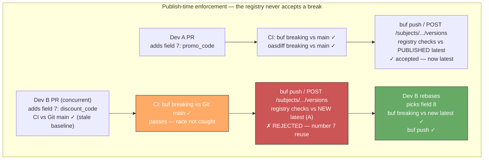
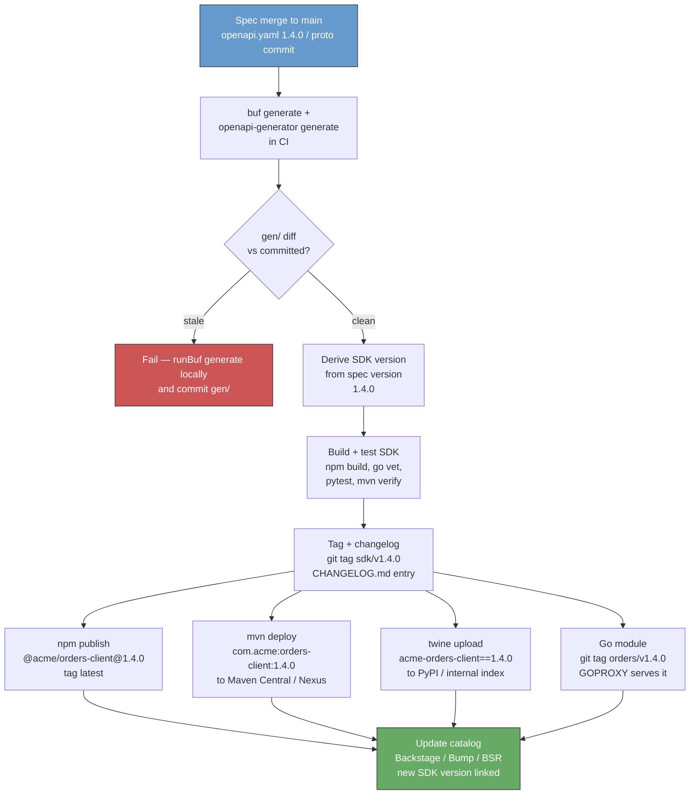

# Chapter 10 — Schema Registry, Code Generation, and SDK Delivery

**What this chapter covers.** A schema that lives only in a Git repo is a promise without enforcement. A schema that lives in a registry — versioned, compatibility-checked, discoverable, and code-generated — is an invariant that every producer, consumer, gateway, and code-generated client respects. This chapter closes the loop that Chapters 8 and 9 opened: Chapter 8 defined what compatibility *means* at the byte level, Chapter 9 built the CI gates that *detect* violations — this chapter builds the infrastructure that *prevents* them from being published and the delivery machinery that turns a published schema into type-safe clients in every language your consumers use. We dissect schema registries for the three surfaces you run — HTTP/REST (OpenAPI registries), gRPC/Protobuf (Buf Schema Registry), and event streaming (Confluent/Apicurio/Karica for Kafka) — their subject naming, compatibility enforcement, and evolution mechanics; build a code-generation pipeline with `buf generate` and OpenAPI Generator that produces idiomatic, versioned clients; and design SDK delivery as a product — versioned packages, changelogs, deprecation, and the CI/CD that publishes to npm/Maven Central/PyPI/Go without drift. Every pattern is anchored in runnable, version-pinned config and viewed through the distributed-systems lens where the registry is the single source of truth that keeps hundreds of services and clients consistent without a global lockstep deploy.

Learning goals — after this chapter you should be able to:

- Compare Confluent Schema Registry, Apicurio Registry, and Buf Schema Registry (BSR) on data model (subjects/artifacts), compatibility modes, storage, and when to use each — and sketch a subject-naming scheme for a multi-team Kafka + gRPC + REST estate.
- Configure compatibility enforcement (`BACKWARD`/`FORWARD`/`FULL`/`TRANSITIVE`) on Confluent/Apicurio and `buf breaking` on BSR, and explain why `FULL_TRANSITIVE` is the right default for topics you replay and `BACKWARD` for request/response.
- Wire a schema registry into producers and consumers: Confluent serializers (`KafkaAvroSerializer` / `ProtobufSerializer`), `buf` publishing (`buf push`), and Apicurio's Kafka SerDes — including schema references and canonical JSON for OpenAPI.
- Design a code-generation pipeline with `buf generate` (Protobuf → Go/Java/TypeScript/Python) and OpenAPI Generator (OpenAPI → typed clients), including `buf.gen.yaml` and `openapi-generator` config, templates, and CI wiring — and explain where codegen breaks down.
- Own SDK delivery end-to-end: versioning that tracks the API version (SemVer + API major), publishing to npm/Maven Central/PyPI/Go modules, changelog and migration-guide generation, and the GitHub Actions workflow that publishes on every spec merge without manual steps.
- Reason about the distributed-systems trade-offs: registry availability as a control-plane dependency, schema caching and stale-read handling, codegen staleness versus hand-written clients, and the catalog as the discovery surface that prevents shadow APIs.

---

## Why a registry — from file to contract

In Chapter 9, the schema lived in Git: `openapi.yaml` and `proto/` at the head of `main`. That works for a single team. At fleet scale it has three failure modes:

1. **No single source of truth.** Two teams each vendor a copy of `orders.proto` at different commits. One adds field number `7`, the other also adds field number `7` with a different type. Both pass `buf breaking` against their own `main`, both merge, and the wire corrupts — the classic concurrent-evolution race that Git alone cannot catch.
2. **No publish-time enforcement.** A producer that embeds an Avro schema per message (or a JSON payload with no registry) can publish bytes that no consumer can deserialize. The break is discovered at consumption time — possibly during a replay months later.
3. **No discovery.** A new team that needs to call the orders service has no way to find the canonical spec, the supported versions, the deprecation schedule, or the generated client. They reverse-engineer the API from traffic or copy a stale example.

A schema registry solves all three by making the schema a *versioned, addressable, compatibility-checked artifact* — not just a file. Publishing is an API call (`POST /subjects/orders-value/versions` / `buf push`) that either succeeds (compatible) or fails (breaking) — before any bytes hit the wire. Consumers resolve schemas by ID, not by vendored copy. The catalog is the directory.

> **Distributed-systems lens.** The registry is *control plane*, not data plane. Producers and consumers cache schemas locally and fetch by ID; the registry does not sit on the hot path of every message. But its availability matters: if the registry is down, producers cannot publish *new* schemas (safe failure — they keep producing with the last schema), and consumers with cold caches cannot deserialize (mitigated by bundling schemas or by a registry-backed cache like Karapace/Apicurio's read-through). Treat the registry like etcd/ZooKeeper (Vol 6, Ch 8) — a strongly consistent coordination service whose writes are gated and whose reads are cached.

---

## Schema registries compared

| Capability | Confluent Schema Registry (CSR) 7.6+ | Apicurio Registry 3.0+ | Buf Schema Registry (BSR) | Karapace / Redpanda Registry |
|------------|--------------------------------------|------------------------|---------------------------|------------------------------|
| Primary surface | Avro / Protobuf / JSON Schema on Kafka | Avro / Protobuf / JSON Schema / OpenAPI / AsyncAPI on Kafka + HTTP | Protobuf (Buf modules) for gRPC / Connect | Avro / Protobuf / JSON Schema — CSR-compatible API |
| Data model | *Subjects* (`topic-value`, `topic-key`) + versions + global/compat config | *Artifacts* + groups + versions + rules; artifact types include `AVRO`, `PROTOBUF`, `OPENAPI`, `ASYNCAPI` | *Modules* (`buf.build/acme/orders`) + commits + tracks (`main`) | Subjects (CSR API compat) |
| Compatibility at publish | `BACKWARD`/`FORWARD`/`FULL`/`BACKWARD_TRANSITIVE`/`FORWARD_TRANSITIVE`/`FULL_TRANSITIVE`/`NONE` | `BACKWARD`/`FORWARD`/`FULL` + `BACKWARD_TRANSITIVE`/`FORWARD_TRANSITIVE`/`FULL_TRANSITIVE` | `buf breaking` against the registry's latest on `buf push` (enforced per module) | Same as CSR |
| Storage | Kafka topic `_schemas` (single-partition, compacted) | SQL (PostgreSQL), Kafka (`kafkasql`), or in-memory | BSR-managed (hosted); Enterprise self-hosted | PostgreSQL / Kafka |
| Self-hosted | Yes — Java, Kafka-adjacent | Yes — Quarkus/Java, many storage backends | Enterprise self-hosted; otherwise hosted at `buf.build` | Yes — Python (Karapace), C++ (Redpanda) |
| HTTP/OpenAPI registry | No (Avro/Protobuf/JSON Schema only) | Yes — `OPENAPI` artifacts, first-class | No (Protobuf only) | No |
| Codegen trigger | No (catalog-level) | No | `buf generate` + BSR-generated SDKs | No |

**Selection heuristic:**

- **Kafka/Avro/Protobuf on Kafka:** Confluent CSR if you already run Confluent Platform; Apicurio if you want OpenAPI + Avro/Protobuf in one registry or need PostgreSQL storage without a Kafka dependency for the registry itself; Redpanda's registry if you run Redpanda.
- **gRPC/Protobuf across many repos:** BSR — it solves the concurrent-evolution race that CSR/Apicurio do not (module-level `buf breaking` on `buf push`), and `buf generate` is the native codegen.
- **HTTP/REST OpenAPI catalog:** Apicurio (`OPENAPI` artifacts) or a dedicated catalog (Backstage, Bump.sh, SwaggerHub) — CSR and BSR do not store OpenAPI.
- **Many teams, many surfaces:** Apicurio or a split — BSR for Protobuf, CSR/Apicurio for Kafka schemas, Backstage/Bump as the unified catalog that links to both. The unified catalog (see Chapter 9) is what consumers actually browse; the registries are what CI publishes to.

### Subject and artifact naming

A consistent naming scheme prevents the "which subject is the canonical one" confusion that plagues ungoverned registries.

```text
# Confluent / Karapace — TopicNameStrategy (default) vs RecordNameStrategy
# Recommended: TopicNameStrategy for topic-per-aggregate, RecordNameStrategy for shared topics

orders-value          # topic 'orders', message value schema (TopicNameStrategy)
orders-key            # topic 'orders', message key schema
com.acme.orders.OrderCreated  # RecordNameStrategy — schema FQN as subject

# Apicurio — group + artifactId (group = team or domain, artifactId = schema name)
group: orders
artifactId: OrderCreated        # AVRO or PROTOBUF artifact
artifactId: orders-openapi      # OPENAPI artifact — type=OPENAPI, group=orders

# BSR — module path + track (module = repo-level unit, track = version line)
buf.build/acme/orders           # module
buf.build/acme/orders:main      # track (like a branch — main, dev)
buf.build/acme/orders:1.4.0     # label (like a tag — SemVer label on a commit)
```

Rule of thumb: one subject/artifact/module per *bounded context* (Vol 15, DDD — Ch 5), not per topic or per file. The orders team's `orders.proto` is one BSR module; its Kafka `OrderCreated` Avro schema is one Apicurio artifact; the same logical `Order` published to two topics (`orders`, `orders-retry`) shares the same schema via `RecordNameStrategy` or a referenced artifact rather than two forked copies.

---

## Enforcement at publish time — compatibility that cannot be bypassed

Chapter 8 defined the compatibility taxonomy; Chapter 9 wired breaking-change detection into CI (`oasdiff`, `buf breaking` vs Git). The registry moves the gate one step further: even if a developer bypasses CI, the registry *refuses* an incompatible publish.

### Confluent / Apicurio — compatibility modes

```bash
# --- Confluent Schema Registry 7.6+ ---
# Set default compatibility (global)
curl -X PUT http://registry:8081/config \
  -H 'Content-Type: application/vnd.schemaregistry.v1+json' \
  -d '{"compatibility": "FULL_TRANSITIVE"}'

# Per-subject override — orders-value needs FULL_TRANSITIVE (replayable log)
curl -X PUT http://registry:8081/config/orders-value \
  -H 'Content-Type: application/vnd.schemaregistry.v1+json' \
  -d '{"compatibility": "FULL_TRANSITIVE"}'

# Per-subject for a request/response topic that is never replayed — BACKWARD is enough
curl -X PUT http://registry:8081/config/rpc-replies-value \
  -H 'Content-Type: application/vnd.schemaregistry.v1+json' \
  -d '{"compatibility": "BACKWARD"}'

# Publish — rejected if incompatible with the configured mode
curl -X POST http://registry:8081/subjects/orders-value/versions \
  -H 'Content-Type: application/vnd.schemaregistry.v1+json' \
  -d @- <<'JSON'
{
  "schemaType": "AVRO",
  "schema": "{\"type\":\"record\",\"name\":\"Order\",\"namespace\":\"com.acme.orders\",\"fields\":[{\"name\":\"order_id\",\"type\":\"string\"},{\"name\":\"promo_code\",\"type\":[\"null\",\"string\"],\"default\":null}]}"
}
JSON
# 409 Conflict if incompatible:
# {"error_code":409,"message":"Schema being registered is incompatible with an earlier schema"}

# --- Apicurio Registry 3.0+ (compat via rules) ---
# Create artifact with a compatibility rule — FULL_TRANSITIVE
curl -X POST http://apicurio:8080/apis/registry/v3/groups/orders/artifacts \
  -H 'Content-Type: application/json' \
  -d '{
    "artifactId": "OrderCreated",
    "artifactType": "AVRO",
    "firstVersion": { "content": { "content": "{\"type\":\"record\",\"name\":\"OrderCreated\",...}" } }
  }'

# Add compatibility rule to an existing artifact
curl -X POST http://apicurio:8080/apis/registry/v3/groups/orders/artifacts/OrderCreated/rules \
  -H 'Content-Type: application/json' \
  -d '{"config": "FULL_TRANSITIVE", "ruleType": "COMPATIBILITY"}'
```

**Choosing the mode (see Chapter 8 for the wire-level why):**

| Mode | Question the registry asks on publish | Use when |
|------|---------------------------------------|----------|
| `BACKWARD` | Can *old* consumers read *new* data? (`new` is superset of `old`) | Request/response, non-replayed topics — new producer is safe, old consumer ignorance is fine |
| `FORWARD` | Can *new* consumers read *old* data? (`old` is superset of `new`) | Rollback-sensitive, replay from old offsets after consumer upgrade |
| `FULL` | Both directions vs *latest* version | Rolling deploys in either direction (common default if you are unsure) |
| `FULL_TRANSITIVE` | Both directions vs *all* prior versions | Durable log you replay for months/years — never replays an incompatible generation (Kafka — Vol 10, Ch 3) |
| `NONE` | No check | Never on a shared topic — only for prototyping with a single producer |

Default to `BACKWARD` for ephemeral request/response and `FULL_TRANSITIVE` for any topic whose bytes outlive the deploy that wrote them.

### Buf Schema Registry — `buf push` as the gate

BSR enforces via the same `buf breaking` rules as CI, but against the *published* module — catching the concurrent-PR race that Git comparison misses.

```bash
# buf.yaml at api/orders (buf 1.40+) — breaking already configured (Ch 9)
# buf.yaml
# version: v2
# modules: [{ path: proto }]
# breaking: { use: [FILE] }

# Publish — fails if breaking vs the registry's latest on 'main'
buf push
# Failure example (concurrent PRs both added field 7):
# Failure: Field "7" on message "Order" already exists in the pushed module.

# Push to a dev track first, promote to main after review (like a feature branch for schemas)
buf push --label dev
# ... review ...
buf push --label 1.4.0   # tag the promotion

# Consumer pins to a label or track in buf.lock
# buf.lock — committed, so every build resolves the same schema
# version: v2
# deps:
#   - remote: buf.build/acme/orders
#     commit: 01h8x1abcdef1234567890ab
#     track: main
```



---

## Wiring producers and consumers

### Kafka — Confluent serializers (Java, Go, Python)

The serializer fetches (or registers) the schema on first write, caches the schema ID, and prepends the wire header. The consumer fetches by ID and deserializes — no schema per message.

```java
// Java — Avro with Confluent Schema Registry (confluent-kafka 7.6+, avro 1.11+)
// Producer — application.properties
// spring.kafka.producer.properties.schema.registry.url=http://registry:8081
// spring.kafka.producer.value-serializer=io.confluent.kafka.serializers.KafkaAvroSerializer

Properties producerProps = new Properties();
producerProps.put(ProducerConfig.BOOTSTRAP_SERVERS_CONFIG, "kafka:9092");
producerProps.put(ProducerConfig.KEY_SERIALIZER_CLASS_CONFIG, StringSerializer.class);
producerProps.put(ProducerConfig.VALUE_SERIALIZER_CLASS_CONFIG, KafkaAvroSerializer.class);
producerProps.put(AbstractKafkaSchemaSerDeConfig.SCHEMA_REGISTRY_URL_CONFIG, "http://registry:8081");
producerProps.put(AbstractKafkaSchemaSerDeConfig.AUTO_REGISTER_SCHEMAS, false); // governance: CI registers, not producers
producerProps.put(KafkaAvroSerializerConfig.AVRO_USE_LOGICAL_TYPE_CONVERTERS_CONFIG, true);

KafkaProducer<String, OrderCreated> producer = new KafkaProducer<>(producerProps);
// OrderCreated is Avro-generated (avro-maven-plugin) — type-safe, registry-validated
OrderCreated event = OrderCreated.newBuilder()
    .setOrderId("ord_123")
    .setCustomerId("cus_456")
    .setPromoCode("SAVE20")   // nullable — default null keeps FULL_TRANSITIVE compat
    .build();
producer.send(new ProducerRecord<>("orders", event.getOrderId().toString(), event));

// Consumer — symmetric, plus specific Avro reader for type safety
Properties consumerProps = new Properties();
consumerProps.put(ConsumerConfig.BOOTSTRAP_SERVERS_CONFIG, "kafka:9092");
consumerProps.put(ConsumerConfig.GROUP_ID_CONFIG, "orders-projector");
consumerProps.put(ConsumerConfig.VALUE_DESERIALIZER_CLASS_CONFIG, KafkaAvroDeserializer.class);
consumerProps.put(AbstractKafkaSchemaSerDeConfig.SCHEMA_REGISTRY_URL_CONFIG, "http://registry:8081");
consumerProps.put(KafkaAvroDeserializerConfig.SPECIFIC_AVRO_READER_CONFIG, true);
// Deserialization failure = poison message — route to DLT (Vol 10, Ch 8), do not block the partition
```

```go
// Go — Protobuf on Kafka with Confluent's Go serializer (confluent-kafka-go 2.4+, protobuf 1.34+)
// go.mod: github.com/confluentinc/confluent-kafka-go/v2, google.golang.org/protobuf, github.com/confluentinc/schemaregistry

import (
    "github.com/confluentinc/confluent-kafka-go/v2/schemaregistry"
    "github.com/confluentinc/confluent-kafka-go/v2/schemaregistry/serde"
    "github.com/confluentinc/confluent-kafka-go/v2/schemaregistry/serde/protobuf"
    orderpb "acme/orders/proto/acme/orders/v1"
)

client, _ := schemaregistry.NewClient(schemaregistry.NewConfig("http://registry:8081"))
ser, _ := protobuf.NewSerializer(client, serde.ValueSerde, protobuf.NewSerializerConfig())
des, _ := protobuf.NewDeserializer(client, serde.ValueSerde, protobuf.NewDeserializerConfig())

// Produce — serializer registers (or validates) the schema, caches ID, prepends 5-byte header (magic + schema ID)
payload, _ := ser.Serialize("orders", &orderpb.OrderCreated{OrderId: "ord_123", PromoCode: proto.String("SAVE20")})
producer.Produce(&kafka.Message{TopicPartition: kafka.TopicPartition{Topic: &topic, Partition: kafka.PartitionAny}, Value: payload}, nil)

// Consume — deserializer fetches by ID, caches, unknown fields preserved (Ch 8)
msg, _ := consumer.ReadMessage(-1)
var event orderpb.OrderCreated
_ = des.DeserializeInto("orders", msg.Value, &event)
```

```python
# Python — Avro with Confluent's Python client (confluent-kafka 2.4+, fastavro)
from confluent_kafka import Producer
from confluent_kafka.schema_registry import SchemaRegistryClient
from confluent_kafka.schema_registry.avro import AvroSerializer, AvroDeserializer
from confluent_kafka.serialization import StringSerializer, SerializationContext, MessageField

sr = SchemaRegistryClient({"url": "http://registry:8081"})
avro_serializer = AvroSerializer(sr, schema_str=open("OrderCreated.avsc").read())
avro_deserializer = AvroDeserializer(sr, schema_str=open("OrderCreated.avsc").read())

producer = Producer({"bootstrap.servers": "kafka:9092"})
producer.produce(
    topic="orders",
    key=StringSerializer("utf_8")("ord_123", SerializationContext("orders", MessageField.KEY)),
    value=avro_serializer(event_dict, SerializationContext("orders", MessageField.VALUE)),
)
```

**Wire header (Confluent wire format — 5 bytes prepended to every message):**

```
0x00 | 4-byte big-endian schema ID | Avro/Protobuf/JSON Schema bytes
 ^magic byte       ^registry lookup key     ^payload validated against that schema
```

The consumer reads the magic byte, extracts the ID, fetches (or cache-hits) the schema, and deserializes. The schema is not in the message — only the ID — so payloads stay ~0.2–0.4× JSON size (Chapter 8).

**Schema references** — compose schemas without duplication:

```json
// Avro — OrderCreated references Address (registered as a separate subject)
{
  "type": "record",
  "name": "OrderCreated",
  "namespace": "com.acme.orders",
  "fields": [
    {"name": "order_id", "type": "string"},
    {"name": "shipping_address", "type": "com.acme.common.Address"}
  ]
}
```

```bash
# Register Address first, then OrderCreated with a reference
curl -X POST http://registry:8081/subjects/com.acme.common.Address/versions \
  -H 'Content-Type: application/vnd.schemaregistry.v1+json' \
  -d '{"schemaType":"AVRO","schema":"{\"type\":\"record\",\"name\":\"Address\",...}"}'

curl -X POST http://registry:8081/subjects/orders-value/versions \
  -H 'Content-Type: application/vnd.schemaregistry.v1+json' \
  -d '{
    "schemaType": "AVRO",
    "schema": "{\"type\":\"record\",\"name\":\"OrderCreated\",...}",
    "references": [{"name":"com.acme.common.Address","subject":"com.acme.common.Address","version":1}]
  }'
```

### gRPC — `buf push` and consumer resolution

No Kafka header — gRPC consumers resolve the schema via `buf.lock` at build time, not per-message. The registry's job is to be the *publish-time* gate and the *discovery* source for `buf generate`.

```bash
# Consumer repo — pin the schema version you build against
buf dep update          # resolves buf.lock to the latest commit on the tracked track
buf generate            # generates code from the pinned commit (see codegen below)
```

### OpenAPI — publishing to Apicurio / catalog

```bash
# Publish OpenAPI 3.1 to Apicurio as an OPENAPI artifact (Apicurio Registry 3.0+)
curl -X POST http://apicurio:8080/apis/registry/v3/groups/orders/artifacts \
  -H 'Content-Type: application/json' \
  -d @- <<'JSON'
{
  "artifactId": "orders-openapi",
  "artifactType": "OPENAPI",
  "firstVersion": {
    "content": { "contentType": "application/json", "content": "{\"openapi\":\"3.1.0\",...}" },
    "isLatest": true
  }
}
JSON

# Add a compatibility rule — Apicurio can lint OpenAPI on publish via rules
curl -X POST http://apicurio:8080/apis/registry/v3/groups/orders/artifacts/orders-openapi/rules \
  -H 'Content-Type: application/json' \
  -d '{"ruleType":"COMPATIBILITY","config":"BACKWARD"}'
```

For Backstage/Bump catalogs, publishing is typically a `catalog-info.yaml` or a CI step that uploads `openapi.yaml` — the catalog links to the registry artifact, not a duplicate copy.

---

## Code generation — from schema to type-safe client

Hand-written HTTP clients drift. A field renamed in the spec but not in the hand-written client is a bug that tests may not catch — especially when the field is optional and the test fixtures are stale. Code generation makes the schema the *single source of code*: the client and server stubs are derived, not authored, and a schema change that breaks the client is a compile error, not a runtime incident.

### Protobuf — `buf generate` (buf 1.40+)

`buf generate` replaces the `protoc` + shell-script tangle with a declarative `buf.gen.yaml` that pins plugin versions and runs reproducibly in CI and locally.

```yaml
# buf.gen.yaml — generate Go, Java, TypeScript, Python from one proto module (buf 1.40+)
# Docs: https://buf.build/docs/generate/overview
version: v2
managed:
  enabled: true
  override:
    - file_option: go_package
      value: acme/orders/gen/go/acme/orders/v1;ordersv1
    - file_option: java_package
      value: com.acme.orders.v1
plugins:
  # Go — protobuf + gRPC/Connect
  - remote: buf.build/protocolbuffers/go:v1.34.2
    out: gen/go
    opt: paths=source_relative
  - remote: buf.build/connectrpc/go:v1.17.0
    out: gen/go
    opt: paths=source_relative
  # Java — protobuf + gRPC
  - remote: buf.build/protocolbuffers/java:v4.27.0
    out: gen/java
  - remote: buf.build/grpc/java:v1.66.0
    out: gen/java
  # TypeScript — protobuf-es + Connect (browser + Node)
  - remote: buf.build/bufbuild/es:v1.10.0
    out: gen/ts
    opt: target=ts
  - remote: buf.build/connectrpc/es:v1.6.1
    out: gen/ts
    opt: target=ts
  # Python — protobuf + gRPC
  - remote: buf.build/protocolbuffers/python:v5.27.0
    out: gen/python
  - remote: buf.build/grpc/python:v1.66.0
    out: gen/python

# Alternative — local plugins (when you need a custom protoc plugin):
# - plugin: buf.build/protocolbuffers/go:v1.34.2
#   out: gen/go
```

```bash
# Local — requires buf CLI 1.40+
buf generate          # reads buf.gen.yaml, fetches remote plugins, writes gen/
buf generate --template buf.gen.yaml --path proto/acme/orders/v1/order.proto

# CI — identical command, no local protoc installation
# .github/workflows/codegen.yaml (excerpt)
# - uses: bufbuild/buf-action@v1
#   with: { setup_only: true }
# - run: buf generate
# - run: git diff --exit-code gen/   # fail if generated code is stale
```

**What `managed: enabled` does.** Without it, every `.proto` needs `option go_package` and `option java_package` per file — a frequent source of "it generates but won't compile." Managed mode injects those options at generation time from `buf.gen.yaml`, so `.proto` files stay language-agnostic.

**Server and client stubs (Go, ConnectRPC 1.17+):**

```go
// Server — implement the generated interface (gen/go/acme/orders/v1/ordersv1connect)
type OrderServiceHandler struct{}

func (h *OrderServiceHandler) CreateOrder(
    ctx context.Context, req *connect.Request[ordersv1.CreateOrderRequest],
) (*connect.Response[ordersv1.CreateOrderResponse], error) {
    // req.Msg.CustomerId, req.Msg.Quantity — type-safe, field presence via proto3 optional
    if req.Msg.Quantity <= 0 {
        return nil, connect.NewError(connect.CodeInvalidArgument,
            errors.New("quantity must be > 0"))
    }
    // ...
    return connect.NewResponse(&ordersv1.CreateOrderResponse{OrderId: "ord_123"}), nil
}

// Client — type-safe, no hand-written HTTP
client := ordersv1connect.NewOrderServiceClient(http.DefaultClient, "https://api.acme.internal")
resp, err := client.CreateOrder(ctx, connect.NewRequest(&ordersv1.CreateOrderRequest{
    CustomerId: "cus_456",
    Quantity:   2,
    PromoCode:  proto.String("SAVE20"),
}))
```

### OpenAPI — OpenAPI Generator (7.8+)

OpenAPI Generator covers the REST surface that `buf generate` does not. It generates typed clients and server stubs for 50+ languages from an `openapi.yaml`.

```yaml
# openapi-generator-config.yaml — TypeScript + Go clients from one spec (generator 7.8+)
# Docs: https://openapi-generator.tech/docs/generators
generatorName: typescript-fetch
outputDir: gen/ts
inputSpec: openapi.yaml
additionalProperties:
  npmName: "@acme/orders-client"
  npmVersion: "1.4.0"          # tracks the API version — see SDK versioning below
  supportsES6: true
  withInterfaces: true
  useSingleRequestParameter: true
typeMappings:
  # map OpenAPI formats to idiomatic types
  date-time: Date
  ulid: string
importMappings: {}
templateDir: templates/typescript-fetch  # optional — override Mustache templates for org style

# --- Go client (second execution) ---
# generatorName: go
# outputDir: gen/go
# additionalProperties: { packageName: orders, isGoSubmodule: true }
```

```bash
# Install — version-pinned (OpenAPI Generator 7.8+, Java 17+, Node 20+)
npm i -D @openapitools/openapi-generator-cli@2.12.0
npx @openapitools/openapi-generator-cli@2.12.0 version-manager set 7.8.0

# Generate — one command per target (or a batch script)
npx @openapitools/openapi-generator-cli generate -c openapi-generator-config.yaml

# Via Docker — no Java locally
docker run --rm -v $PWD:/local openapitools/openapi-generator-cli:v7.8.0 generate \
  -c /local/openapi-generator-config.yaml

# Verify — generated client compiles (fail CI if stale)
npm --prefix gen/ts run build
go vet ./gen/go/...

# Server stub (optional) — generate Echo/Gin/Chi stubs for Go, Spring for Java
# generatorName: go-echo-server  /  spring
```

**Custom templates** — when the default Mustache output does not match org conventions (e.g., injecting `Idempotency-Key` headers, `Retry-After` handling, or tracing interceptors), vendor the templates:

```bash
# Extract default templates, then edit
npx @openapitools/openapi-generator-cli author template -g typescript-fetch -o templates/typescript-fetch
# Edit templates/typescript-fetch/api.mustache to add idempotency, tracing, etc.
```

**Where codegen breaks down and what to do:**

| Limitation | Mitigation |
|------------|------------|
| Generated code is verbose / not idiomatic | Custom Mustache templates; post-process with `prettier`/`gofmt`; wrap generated clients in a thin hand-written facade that exposes the ergonomic surface |
| `oneOf`/`anyOf` polymorphism generates awkward unions | Model polymorphism as separate endpoints or use `discriminator` + codegen `oneOf` support (generator 7.8+ improved this) |
| Generator bugs / lag behind spec | Pin the generator version, vendor templates, and run `generated --check` in CI — do not float `latest` |
| "Generated code in Git" vs "generate at build" | Commit generated code — consumers need a readable diff on schema changes, and CI can `git diff --exit-code gen/` to catch staleness. For Go, the generated module is a real `go.mod` dependency. |

---

## SDK delivery — the schema's last mile

A generated client that lives only in the producer's repo is not an SDK. An SDK is a *versioned, published, documented package* that consumers install with `npm install` / `go get` / `pip install` and that tracks the API's version.

### Versioning — API version drives SDK version

The SDK version must communicate compatibility at a glance. The convention that scales:

- **SDK major tracks API major.** `openapi.yaml` at `1.4.0` → SDK `@acme/orders-client@1.4.0`. API `2.0.0` (breaking per SemVer and Chapter 5) → SDK `2.0.0`. Consumers know that `1.x` → `2.0` is breaking without reading the changelog.
- **SDK minor/patch track additive changes.** New optional field → API `1.5.0` → SDK `1.5.0`. Bug fix in the SDK (retry logic, header handling) without a spec change → SDK `1.4.1`.
- **Pre-release for `dev` track.** `buf push --label dev` → SDK `1.5.0-dev.0` (npm `next` tag, Maven `SNAPSHOT`, Python `dev0`).

```json
// gen/ts/package.json — generated client's package manifest (npm)
{
  "name": "@acme/orders-client",
  "version": "1.4.0",
  "description": "Acme Orders API — TypeScript client (generated from openapi.yaml 1.4.0)",
  "repository": "github:acme/orders",
  "publishConfig": { "registry": "https://registry.acme.internal" },
  "files": ["dist/"],
  "main": "dist/index.js",
  "types": "dist/index.d.ts"
}
```

### Publishing — one workflow, every registry



```yaml
# .github/workflows/sdk-publish.yaml — publish SDKs on spec merge (Node 20, Java 17, Python 3.12, buf 1.40)
name: sdk-publish
on:
  push:
    branches: [main]
    paths: ["openapi.yaml", "proto/**", "buf.gen.yaml", "openapi-generator-config.yaml", "gen/**"]

jobs:
  generate-and-verify:
    runs-on: ubuntu-latest
    steps:
      - uses: actions/checkout@v4
      - uses: bufbuild/buf-action@v1
        with: { setup_only: true }
      - uses: actions/setup-node@v4
        with: { node-version: 20 }
      - uses: actions/setup-java@v4
        with: { java-version: 17, distribution: temurin }
      - uses: actions/setup-python@v4
        with: { python-version: "3.12" }

      - run: buf generate
      - run: npx @openapitools/openapi-generator-cli@2.12.0 generate -c openapi-generator-config.yaml
      - name: Fail if generated code is stale
        run: git diff --exit-code gen/
      - run: npm --prefix gen/ts ci && npm --prefix gen/ts run build && npm --prefix gen/ts test
      - run: go vet ./gen/go/... && go test ./gen/go/...
      - run: pip install -e gen/python && pytest gen/python/tests

  publish-npm:
    needs: generate-and-verify
    runs-on: ubuntu-latest
    permissions: { contents: write, id-token: write }  # OIDC for npm provenance
    steps:
      - uses: actions/checkout@v4
      - uses: actions/setup-node@v4
        with: { node-version: 20, registry-url: "https://registry.npmjs.org" }
      - run: npm --prefix gen/ts ci && npm --prefix gen/ts run build
      - name: Derive version from spec
        id: ver
        run: echo "version=$(yq .info.version openapi.yaml)" >> "$GITHUB_OUTPUT"
      - run: npm --prefix gen/ts version "${{ steps.ver.outputs.version }}" --no-git-tag-version
      - run: npm --prefix gen/ts publish --provenance --access public
        env: { NODE_AUTH_TOKEN: "${{ secrets.NPM_TOKEN }}" }

  publish-maven:
    needs: generate-and-verify
    runs-on: ubuntu-latest
    permissions: { contents: write }
    steps:
      - uses: actions/checkout@v4
      - uses: actions/setup-java@v4
        with: { java-version: 17, distribution: temurin, server-id: central, server-username: MAVEN_USERNAME, server-password: MAVEN_PASSWORD }
      - name: Derive version from spec
        id: ver
        run: echo "version=$(yq .info.version openapi.yaml)" >> "$GITHUB_OUTPUT"
      - run: mvn -pl gen/java versions:set -DnewVersion="${{ steps.ver.outputs.version }}"
      - run: mvn -pl gen/java deploy -DskipTests
        env: { MAVEN_USERNAME: "${{ secrets.MAVEN_USERNAME }}", MAVEN_PASSWORD: "${{ secrets.MAVEN_PASSWORD }}" }

  publish-python:
    needs: generate-and-verify
    runs-on: ubuntu-latest
    permissions: { contents: write, id-token: write }  # OIDC for PyPI trusted publishing
    steps:
      - uses: actions/checkout@v4
      - uses: actions/setup-python@v4
        with: { python-version: "3.12" }
      - run: pip install build twine
      - name: Derive version from spec
        id: ver
        run: echo "version=$(yq .info.version openapi.yaml)" >> "$GITHUB_OUTPUT"
      - run: python -m build gen/python --outdir dist/
      - uses: pypa/gh-action-pypi-publish@release/v1
        with: { packages-dir: dist/ }

  tag-and-catalog:
    needs: [publish-npm, publish-maven, publish-python]
    runs-on: ubuntu-latest
    permissions: { contents: write }
    steps:
      - uses: actions/checkout@v4
      - name: Derive version
        id: ver
        run: echo "version=$(yq .info.version openapi.yaml)" >> "$GITHUB_OUTPUT"
      - run: |
          git tag "sdk/v${{ steps.ver.outputs.version }}"
          git push origin "sdk/v${{ steps.ver.outputs.version }}"
      - name: Append changelog (conventional commits → changelog)
        run: |
          npx conventional-changelog-cli -p angular -i CHANGELOG.md -s
          git add CHANGELOG.md && git commit -m "docs(changelog): sdk v${{ steps.ver.outputs.version }}" && git push
      - name: Notify catalog (Backstage / Bump.sh)
        run: curl -X POST https://catalog.acme.internal/api/refresh -H "Authorization: Bearer ${{ secrets.CATALOG_TOKEN }}"
```

**Changelog and migration guide.** Every SDK minor/major must link to a changelog entry. For breaking majors, a `MIGRATION.md` with before/after snippets is the difference between consumers upgrading in a week versus pinning the old version forever. Generate the changelog from conventional commits (`feat:`, `fix:`, `BREAKING CHANGE:`) and curate the migration guide by hand — automation cannot explain *why* a field was renamed.

**Deprecation in the SDK.** When the spec deprecates a field (`deprecated: true` in OpenAPI, `option deprecated = true` in proto), the generated client should surface it — JSDoc `@deprecated`, Java `@Deprecated`, Python `warnings.warn`. A custom Mustache template or a `buf generate` plugin option can inject deprecation annotations so consumers see the warning at compile/lint time, not at runtime.

### The thin facade — generated core, hand-written surface

Raw generated clients are correct but rarely ergonomic. The pattern that scales is a thin hand-written facade that wraps the generated core:

```typescript
// sdk/orders.ts — hand-written facade over gen/ts (TypeScript 5.4+)
import { OrdersApi, Configuration } from "../gen/ts/dist";

export class OrdersClient {
  private readonly api: OrdersApi;

  constructor(opts: { baseUrl: string; token: string; timeoutMs?: number }) {
    const cfg = new Configuration({
      basePath: opts.baseUrl,
      accessToken: opts.token,
      middleware: [tracingMiddleware, retryMiddleware({ maxRetries: 2 })],
      fetchApi: (url, init) => fetch(url, { ...init, signal: AbortSignal.timeout(opts.timeoutMs ?? 5000) }),
    });
    this.api = new OrdersApi(cfg);
  }

  // Ergonomic — single call, domain types, idempotency handled
  async createOrder(input: CreateOrderInput): Promise<Order> {
    const resp = await this.api.createOrder({
      createOrderRequest: toGenerated(input),
      idempotencyKey: input.idempotencyKey ?? crypto.randomUUID(),
    });
    return fromGenerated(resp);
  }
}
```

Consumers import from `sdk/orders.ts`, not `gen/ts/dist`. The generated code is an internal detail; the facade is the public surface that adds retries, tracing, timeouts, and ergonomic types. The facade is tested with contract tests (Chapter 11) so it does not drift from the spec.

---

## The distributed-systems lens — registry as control plane

### Availability and caching

The registry is not on the hot path per message — schemas are cached by ID — but its control-plane availability still matters:

- **Producer with warm cache:** keeps producing with the last schema ID even if the registry is down. No impact.
- **Producer publishing a new schema:** blocked until the registry recovers. Safe — it keeps producing with the old schema.
- **Consumer with warm cache:** keeps consuming. No impact.
- **Consumer with cold cache (new deploy, new topic):** cannot deserialize until the registry recovers. Mitigate by bundling schemas into the consumer image (generated code already has the schema) or by a local registry cache (Apicurio's `kafkasql` storage, Karapace's PostgreSQL, or a sidecar proxy like `confluent-schema-registry-proxy`).

Run the registry with the same care as etcd/ZooKeeper: replicated storage (Kafka `_schemas` topic with `replication.factor=3`, PostgreSQL with streaming replication), health checks, and alerting on publish latency and cache hit rate.

### Staleness — generated code versus hand-written drift

A consumer that pins `buf.lock` at commit `abc123` and never updates is frozen at that schema. New fields added at `def456` are invisible until `buf dep update && buf generate`. The catalog and scorecard (Chapter 9) surface staleness — "47 consumers still on orders `1.2.0`, latest is `1.5.0`" — and the SDK's `Sunset` header tells them what breaks and when. Without that feedback loop, staleness silently accumulates until a breaking `2.0.0` forces a flag-day migration.

### Shadow APIs and the catalog

The registry prevents *published* drift. It does not prevent *unpublished* drift — the team that ships an endpoint without registering it. The catalog's job is to make shadow APIs visible: every route the gateway serves (Envoy access logs, OpenAPI discovery) should have a corresponding catalog entry. A periodic reconciliation — "gateway serves `/v1/widgets` but no spec exists in the catalog" — is the same idea as the SBOM reconciliation in Companion Book 3, applied to APIs.

---

## Anti-patterns (and what to do instead)

| Anti-pattern | Why it hurts | Fix |
|--------------|--------------|-----|
| Producers with `AUTO_REGISTER_SCHEMAS=true` on a shared topic | Any producer can publish any schema — compatibility gate bypassed; concurrent races create duplicate field numbers | `AUTO_REGISTER_SCHEMAS=false`; CI registers via `buf push` / `POST /subjects/.../versions` with compatibility checks |
| One subject per topic copy-pasted across teams | Same logical `Order` forked into `orders-value`, `orders-retry-value`, `orders-dlq-value` — three schemas to keep in sync | `RecordNameStrategy` or schema references; one canonical artifact, many topics |
| `NONE` compatibility on a durable topic | Topic accepts incompatible schemas; replay fails months later when old bytes cannot be deserialized by the new consumer | `FULL_TRANSITIVE` for any replayable log; `BACKWARD` minimum for ephemeral topics |
| Generated code at `latest` with no pinned version | "Works on my machine" — CI and local generate different output; consumers cannot reproduce the build | Pin generator + plugin versions in `buf.gen.yaml` / `openapi-generator-config.yaml`; commit `buf.lock` |
| Publishing SDKs by hand (`npm publish` from a laptop) | Forgotten changelog, skipped tests, wrong version, no provenance | CI-only publish on `main` merge; `git diff --exit-code gen/` gate; OIDC provenance (`--provenance` / PyPI trusted publishing) |
| Raw generated client as the public SDK surface | Verbose, non-idiomatic, leaks generator quirks; no place to add retries/tracing/timeouts | Thin hand-written facade over generated core — generated code is internal, facade is public |
| No catalog — "the Git repo is the catalog" | New teams cannot discover the API; shadow APIs proliferate; deprecation is invisible | Backstage / Bump.sh / Apicurio as the searchable catalog; gateway ↔ catalog reconciliation |

---

## Key takeaways

- A schema in Git is a promise; a schema in a registry is an invariant. The registry — Confluent/Apicurio for Kafka (Avro/Protobuf/JSON Schema), BSR for Protobuf/gRPC, Apicurio for OpenAPI — makes the schema versioned, compatibility-checked, and discoverable, and refuses incompatible publishes before any bytes hit the wire.
- Subject naming is architecture: one canonical artifact per bounded context (`RecordNameStrategy` / schema references for Kafka, one BSR module per domain, one Apicurio `OPENAPI` artifact per REST surface), not one copy per topic or per file — duplication is how concurrent evolution creates field-number collisions.
- Compatibility at publish is the gate that even bypassed CI cannot evade. Confluent/Apicurio `FULL_TRANSITIVE` for replayable logs and `BACKWARD` for ephemeral request/response; BSR's `buf push` enforces the same `buf breaking` rules against the *published* module, catching the concurrent-PR race that Git comparison misses.
- Producers and consumers wire to the registry via serializers that cache by schema ID (5-byte Confluent header: magic + ID) and via `buf.lock`-pinned generation — the registry is control plane, not data plane, and must be replicated and cached like any coordination service.
- Code generation (`buf generate` with `buf.gen.yaml` managed mode for Protobuf, OpenAPI Generator 7.8+ for REST) makes the schema the single source of code — generated clients are type-safe and break at compile time when the schema changes, not at runtime. Pin generator + plugin versions, commit `gen/`, and fail CI on staleness.
- SDK delivery is a product: SDK major tracks API major, minors track additive spec changes, CI publishes to npm/Maven Central/PyPI/Go on every `main` merge with OIDC provenance, a changelog, and a migration guide for majors. Wrap the generated core in a thin hand-written facade that adds retries, tracing, timeouts, and ergonomic types.
- Distinguish the registry (publish-time gate, schema storage) from the catalog (discovery, scorecards, deprecation visibility). The catalog — Backstage, Bump.sh, or Apicurio's UI — is what consumers browse; reconcile it against the gateway to surface shadow APIs. Staleness (`buf.lock` pin age, SDK adoption lag) is a metric, not an accident.

## Further reading

- Confluent Schema Registry — subjects, compatibility, serializers, wire format. https://docs.confluent.io/platform/current/schema-registry/fundamentals/index.html
- Confluent — Schema evolution and compatibility types. https://docs.confluent.io/platform/current/schema-registry/fundamentals/schema-evolution.html
- Apicurio Registry — artifacts, groups, rules, Kafka SerDes, OpenAPI artifacts. https://www.apicurio.io/registry/docs/apicurio-registry/3.0.x/getting-started/assembly-intro-to-the-registry.html
- Buf Schema Registry (BSR) — modules, tracks, `buf push`, `buf breaking` against BSR. https://buf.build/docs/bsr/overview / https://buf.build/docs/bsr/module/track
- Buf — `buf generate`, `buf.gen.yaml`, managed mode, remote plugins. https://buf.build/docs/generate/overview / https://buf.build/docs/generate/managed
- Karapace — CSR-compatible registry for Kafka/Redpanda. https://docs.redpanda.com/current/manage/schema-reg/ / https://github.com/Aiven-Open/karapace
- OpenAPI Generator — generators, config, templates, `typescript-fetch`/`go`/`java`. https://openapi-generator.tech/docs/generators / https://openapi-generator.tech/docs/usage
- ConnectRPC — `buf generate` with `connectrpc/go` and `connectrpc/es` plugins. https://connectrpc.com/docs/
- Backstage — API catalog and discovery. https://backstage.io/docs/features/software-catalog/
- Bump.sh — API catalog, diff, and SDK hosting. https://bump.sh/ / https://docs.bump.sh/
- Conventional Commits + conventional-changelog — changelog generation for SDK releases. https://www.conventionalcommits.org/ / https://github.com/conventional-changelog/conventional-changelog
- npm provenance / PyPI trusted publishing / Maven Central — OIDC-backed publish. https://docs.npmjs.com/generating-provenance-statements / https://docs.pypi.org/trusted-publishers/ / https://central.sonatype.org/publish/publish-guide/
