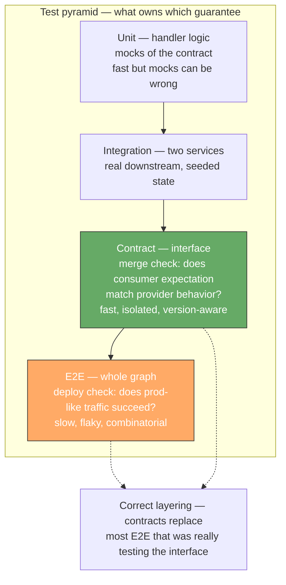
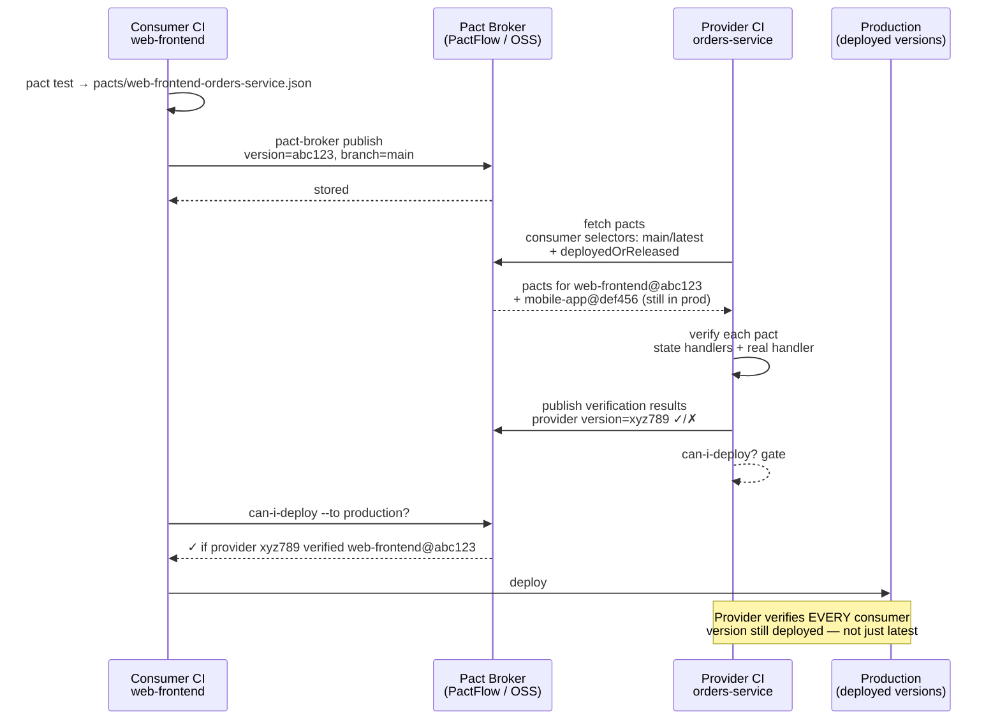
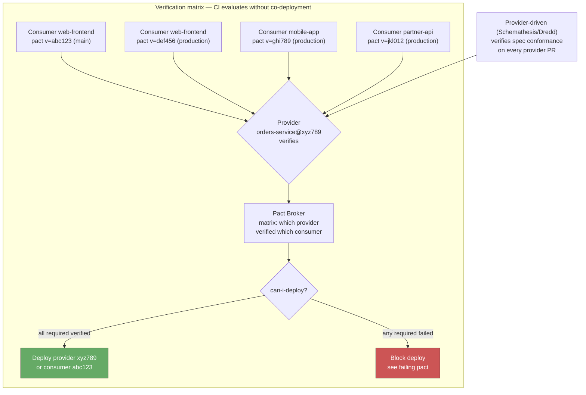
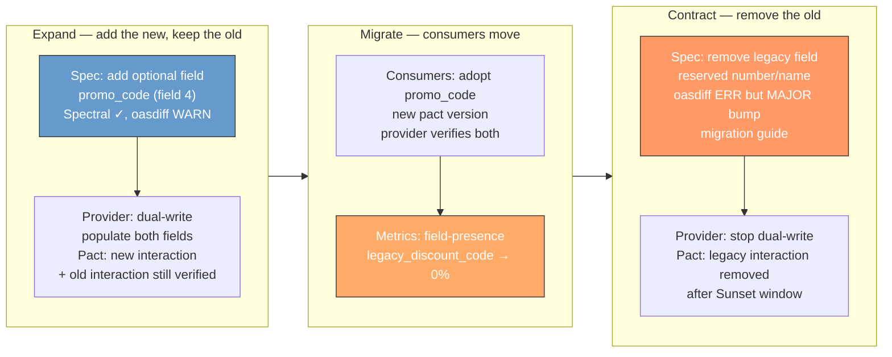
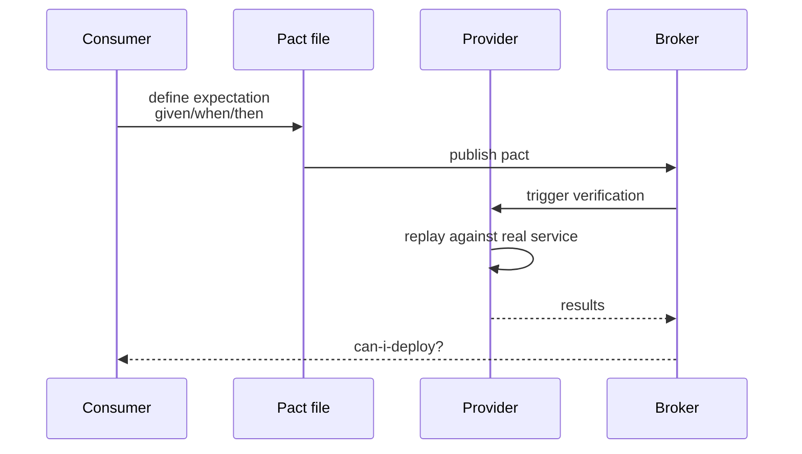
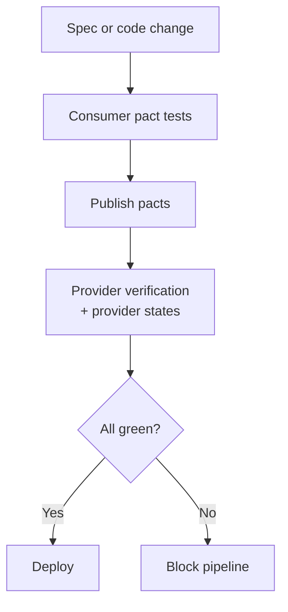
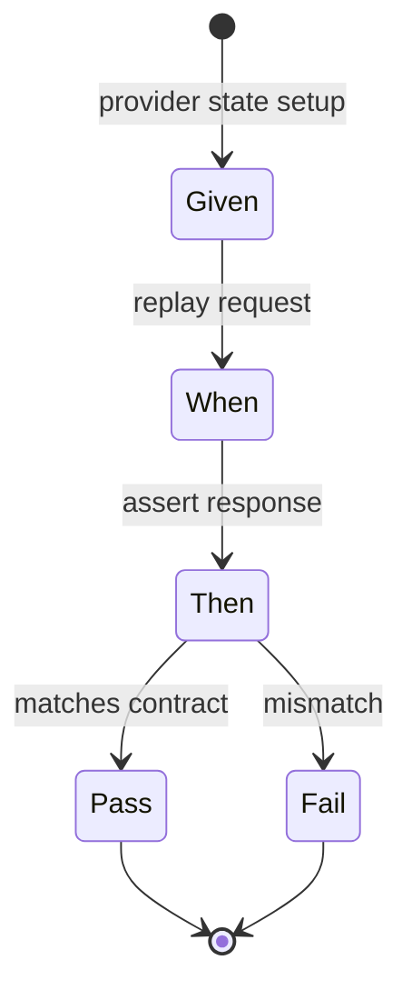

# Chapter 11 — Contract Testing and API Evolution in Practice

**What this chapter covers.** Chapters 8, 9, and 10 built the machinery that keeps schemas correct: the wire-format discipline that makes evolution safe, the linting and breaking-change gates that catch drift, and the registry + codegen pipeline that makes the schema the single source of truth. This chapter builds the machinery that proves the *implementation* honors that truth — and stays operable as it evolves. A schema that is compatible on paper but violated by a handler that returns a `string` where the spec promises an `int32` is a lie that the registry cannot catch. Contract testing is what catches it — not by testing the behavior of a service (unit/integration tests) nor by testing the whole graph end-to-end (E2E tests), but by testing the *contract* at the producer/consumer boundary so that both sides can evolve independently without a flag-day. We build the discipline from first principles: consumer-driven contracts (Pact) versus provider-driven schemas (OpenAPI + Dredd/Schemathesis), when to use each, how to wire them into CI as a verification matrix that scales with consumer count, and how to make API evolution a daily practice rather than a quarterly migration — expand-contract in code, deprecation and `Sunset` in headers, traffic-aware verification, and the observability that tells you when the old shape is safe to remove. Every pattern is anchored in runnable, version-pinned code (Pact 13+, OpenAPI + Schemathesis/Dredd, WireMock) and viewed through the distributed-systems lens where independent deployability is the invariant contract testing preserves.

Learning goals — after this chapter you should be able to:

- Distinguish contract tests from unit, integration, and E2E tests by what they isolate (the *interface* vs the *implementation* vs the *graph*), explain the test-pyramid economics that make E2E the wrong tool for contract verification at scale, and draw the boundary where contract tests own the guarantee.
- Author and verify consumer-driven contracts with Pact (consumer `given`/`uponReceiving`/`willRespondWith`, provider `verify` with state handlers), run them in CI with a Pact Broker (PactFlow or OSS), and interpret `can-i-deploy` as a deployment gate.
- Verify provider-driven contracts against an OpenAPI spec with Dredd, Schemathesis, and Prism — including `example`/`schema` alignment, property-based fuzzing, and the CI wiring that fails the build when the implementation diverges from the spec.
- Choose between consumer-driven (Pact) and provider-driven (OpenAPI) contract testing — or both — per surface (partner-facing REST, internal gRPC, event log) and explain how they compose rather than compete.
- Design API evolution as a production workflow: expand-contract with dual-write/dual-read, deprecation headers (`Deprecation`/`Sunset`/`Link: rel=sunset`), traffic-aware contract coverage, and the field-presence / error-rate metrics that tell you when to contract.
- Reason about contract testing through the distributed-systems lens: independent deployability without coordination, the verification matrix that replaces E2E combinatorial explosion, version-aware verification (provider verifies every consumer version it still serves), and why E2E is a deploy check but contracts are a merge check.

---

## Why contracts need tests — the gap schemas leave

A schema is a *specification*. An implementation is a *behavior*. The two drift for mundane reasons: a handler returns `quantity: "2"` (string) where the schema promises `quantity: 2` (integer); a new code path returns a `404` body that omits the `code` field the error envelope requires (Chapter 7); a database migration changes a timestamp from `RFC 3339` to epoch millis and the handler faithfully serializes the new format without updating the spec. Linting (Chapter 9) checks the spec. Breaking-change detection checks the spec's evolution. Neither runs the implementation.

Three naive alternatives, and why they fail at scale:

| Approach | What it proves | Why it fails at fleet scale |
|----------|---------------|-----------------------------|
| Unit tests against mocks/hand-written stubs | The handler's logic, given a *mock* contract | Mocks are authored by the same team — they encode the same misunderstanding as the handler. The mock and the implementation can be consistently wrong. |
| Integration tests with a real downstream | The two services work *in this environment* | Requires the downstream to be running, seeded, and at the right version — flaky, slow, and couples deployments. Ten consumers × five provider versions = fifty environments. |
| E2E tests of the whole call graph | The graph works end-to-end | Slowest, flakiest, hardest to attribute (which hop broke?), and combinatorial — adding one service multiplies the graph. E2E is a deploy check, not a merge check. |

Contract tests fill the precise gap: they prove the *consumer's expectation* and the *provider's behavior* agree on the *contract* — without requiring both to run together.



> **Distributed-systems lens.** Independent deployability is the invariant. In a system with fifty services, the cost of coordinating deploys ("deploy the provider, then deploy all ten consumers in order") is untenable. Contract tests preserve the ability for any service to deploy at any time — the consumer's contract is a *versioned expectation* that the provider verifies against every version it still serves. The provider does not need to be at the same commit as the consumer; it needs to satisfy every *published* contract that has not yet sunset.

---

## Two families — consumer-driven versus provider-driven

### Consumer-driven contracts (CDC) — Pact

The consumer writes the contract: "when I send *this* request, I expect *this* response." The consumer test generates a *pact* (a JSON file describing the interaction). The provider verifies that it can satisfy the pact. New consumers add new pacts; the provider verifies all of them. The name "consumer-driven" is literal — the consumer drives what is verified.

Best for: **partner-facing and team-to-team REST** where consumers are heterogeneous, the provider cannot enumerate every use case, and the consumer's actual usage (not the spec's theoretical surface) is what matters.

### Provider-driven contracts — OpenAPI + Dredd/Schemathesis/Prism

The provider publishes the OpenAPI spec. Tools verify that the running provider *conforms* to the spec — every example validates against the schema, every response matches the declared type, and property-based fuzzing against the schema does not crash the handler.

Best for: **public REST** where the spec is the product, **event schemas** where the registry is the source of truth, and as a complement to Pact on internal surfaces.

### They compose

| Surface | Primary | Complement |
|---------|---------|------------|
| Public REST (many external consumers) | Provider-driven (spec is the surface, consumers unknown) | Consumer-driven for key partners whose usage you want to lock |
| Internal REST between two teams | Consumer-driven (two sides, explicit expectations) | Provider-driven as a smoke test on the provider |
| gRPC / Protobuf | Provider-driven (proto is the contract, `buf breaking` already gates) | Consumer-driven via `pact-protobuf-plugin` when the consumer's field usage is narrower than the schema |
| Kafka / events | Provider-driven (registry + `FULL_TRANSITIVE`) | Consumer-driven (Pact event plugin or Avro-specific verification) when consumers project a subset of fields |

The rest of the chapter builds both, then shows how evolution uses them.

---

## Consumer-driven contracts — Pact in depth

Pact's model is four verbs: `given` (provider state), `uponReceiving` (request description), `withRequest` (request details), `willRespondWith` (expected response). The consumer test declares an interaction; Pact records it as a JSON pact; the provider replays it.

### Consumer test — TypeScript (Pact 13+, Node 20+)

```typescript
// pacts/orders-consumer.spec.ts — consumer: web front-end (Pact 13+, Vitest/Jest)
import { PactV4, MatchersV3, SpecificationVersion } from "@pact-foundation/pact";
import { OrdersClient } from "../src/orders-client"; // hand-written facade over generated client (Ch 10)

const { like, eachLike, regex, integer, uuid, iso8601DateTime } = MatchersV3;

const provider = new PactV4({
  consumer: "web-frontend",
  provider: "orders-service",
  spec: SpecificationVersion.SPECIFICATION_VERSION_V4,
  dir: "pacts/",                 // pact JSON written here for the broker
  pactfileWriteMode: "merge",
});

describe("Orders API — consumer contract (web-frontend → orders-service)", () => {
  it("creates an order and receives the created order", async () => {
    await provider
      .given("a customer exists with id cus_456")
      .uponReceiving("a request to create an order")
      .withRequest({
        method: "POST",
        path: "/v1/orders",
        // Pact matchers — flexible where the consumer is flexible, exact where it matters
        headers: { "Content-Type": "application/json", "Idempotency-Key": regex(".*", "[0-9a-f-]{8}-[0-9a-f-]{4}-[0-9a-f-]{4}-[0-9a-f-]{4}-[0-9a-f-]{12}") },
        body: {
          customer_id: "cus_456",
          quantity: integer(2),
          promo_code: like("SAVE20"),   // consumer accepts any string — like()
        },
      })
      .willRespondWith({
        status: 201,
        headers: { "Content-Type": "application/json" },
        body: {
          order_id: uuid("01h8x1abcdef1234567890abcd"),
          customer_id: "cus_456",
          quantity: integer(2),
          promo_code: like("SAVE20"),
          status: regex("PENDING", "PENDING|PAID|SHIPPED|CANCELLED"),
          created_at: iso8601DateTime("2026-03-10T14:22:31Z"),
        },
      })
      .executeTest(async (mockServer) => {
        const client = new OrdersClient({ baseUrl: mockServer.url, token: "test-token" });
        const order = await client.createOrder({ customerId: "cus_456", quantity: 2, promoCode: "SAVE20" });
        expect(order.orderId).toMatch(/^[0-9a-z]{26}$/);
        expect(order.status).toBe("PENDING");
      });
  });

  it("lists orders with cursor pagination", async () => {
    await provider
      .given("customer cus_456 has 3 orders")
      .uponReceiving("a request to list orders with pagination")
      .withRequest({
        method: "GET",
        path: "/v1/orders",
        query: { customer_id: "cus_456", page_size: "2" },
      })
      .willRespondWith({
        status: 200,
        headers: { "Content-Type": "application/json" },
        body: {
          data: eachLike({                              // consumer expects an array of order shapes
            order_id: uuid("01h8x1abcdef1234567890abcd"),
            status: regex("PENDING", "PENDING|PAID|SHIPPED|CANCELLED"),
            quantity: integer(2),
          }, { min: 1 }),
          pagination: {
            next_page_token: like("eyJpZCI6Im9yZF8xMjMifQ=="),
            total_count: integer(3),
          },
        },
      })
      .executeTest(async (mockServer) => {
        const client = new OrdersClient({ baseUrl: mockServer.url, token: "test-token" });
        const page = await client.listOrders({ customerId: "cus_456", pageSize: 2 });
        expect(page.data.length).toBeGreaterThan(0);
        expect(page.pagination.totalCount).toBe(3);
      });
  });
});
```

```bash
# Run consumer tests — writes pacts/web-frontend-orders-service.json
npx vitest run pacts/orders-consumer.spec.ts
# or: npm test -- pacts/

# Output — pact JSON (abridged, V4):
# {
#   "consumer": { "name": "web-frontend" },
#   "provider": { "name": "orders-service" },
#   "interactions": [{
#     "description": "a request to create an order",
#     "providerStates": [{ "name": "a customer exists with id cus_456" }],
#     "request": { "method": "POST", "path": "/v1/orders", "body": {...}, "matchingRules": {...} },
#     "response": { "status": 201, "body": {...}, "matchingRules": {...} }
#   }]
# }
```

**Matchers — the flexibility contract.** `like("SAVE20")` means "any string matching this example" — not "exactly SAVE20." `regex`, `integer`, `uuid`, `iso8601DateTime`, `eachLike` encode the *shape* the consumer depends on, not the example value. This is what keeps pacts from being brittle: the consumer declares what varies (IDs, timestamps) and what is exact (`customer_id: "cus_456"` is exact — the consumer looks it up by that key).

### Provider verification — Go + Pact Broker (Pact 13+, Go 1.22+)

The provider replays every interaction against its real handler. `given` maps to state setup; the request is sent to the handler under test; the response is matched.

```go
// provider/pact_verify_test.go — provider: orders-service (Go 1.22+, Pact 2.x Go DSL)
package provider_test

import (
    "fmt"
    "net/http"
    "testing"

    "github.com/pact-foundation/pact-go/v2/models"
    "github.com/pact-foundation/pact-go/v2/provider"
    "github.com/pact-foundation/pact-go/v2/utils"
)

func TestPactProvider(t *testing.T) {
    // 1) Start the provider under test (real handler, test database/seed)
    //    In CI this is the built binary or the handler with a test double for storage.
    srv := newTestServer(t) // returns *httptest.Server with the real router
    defer srv.Close()

    // 2) State handlers — given("...") maps to setup/teardown
    stateHandlers := models.StateHandlers{
        "a customer exists with id cus_456": func(setup bool, s models.ProviderState) error {
            if setup {
                return seedCustomer(s.Params["id"] /* or s.Params — depending on Pact version */)
                // e.g. INSERT INTO customers (id) VALUES ('cus_456') in test DB
            }
            return teardownCustomer("cus_456")
        },
        "customer cus_456 has 3 orders": func(setup bool, s models.ProviderState) error {
            if setup {
                return seedOrders("cus_456", 3)
            }
            return teardownOrders("cus_456")
        },
    }

    verifier := provider.NewVerifier()
    err := verifier.VerifyProvider(t, provider.VerifyRequest{
        Provider:              "orders-service",
        ProviderBaseURL:       srv.URL,
        PactBrokerURL:         utils.GetEnv("PACT_BROKER_URL", "http://pact-broker:9292"),
        BrokerToken:           utils.GetEnv("PACT_BROKER_TOKEN", ""),
        PublishVerificationResults: true,
        ProviderVersion:       utils.GetEnv("GIT_SHA", "local"),
        ProviderBranch:        utils.GetEnv("GIT_BRANCH", "main"),
        ConsumerVersionSelectors: []models.Selector{
            // Verify against every consumer version still in production (not just latest)
            {Tag: "main", Latest: true},
            {Tag: "production", Latest: true},
            // Or: deployedOrReleased:true (PactFlow) — every version with a deployed/prod tag
            {DeployedOrReleased: true},
        },
        StateHandlers: stateHandlers,
        // Optional — verify only pacts for this provider version's branch (speed)
        // ProviderTags: []string{"main"},
    })
    if err != nil {
        t.Fatalf("pact verification failed: %v", err)
    }
}

func newTestServer(t *testing.T) *http.Server {
    // Wire the real router with a test double for storage — not mocks of the contract
    // handlers.NewRouter(storage.NewMemoryStore()) or a test Postgres
    t.Helper()
    // ...
    return nil // placeholder — replace with real test server
}
func seedCustomer(id string) error  { fmt.Println("seed", id); return nil }
func teardownCustomer(id string) error { return nil }
func seedOrders(customerID string, n int) error { return nil }
func teardownOrders(customerID string) error { return nil }
```

```yaml
# .github/workflows/pact-provider.yaml — verify on every provider PR (Pact 13+, Go 1.22+)
name: pact-provider
on:
  pull_request:
    paths: ["provider/**", "openapi.yaml", "proto/**"]

jobs:
  verify:
    runs-on: ubuntu-latest
    services:
      postgres:
        image: postgres:16
        env: { POSTGRES_PASSWORD: test }
        ports: ["5432:5432"]
        options: --health-cmd="pg_isready" --health-interval=5s
    steps:
      - uses: actions/checkout@v4
      - uses: actions/setup-go@v5
        with: { go-version: "1.22" }
      - run: go test ./provider -run TestPactProvider -count=1
        env:
          PACT_BROKER_URL: ${{ secrets.PACT_BROKER_URL }}
          PACT_BROKER_TOKEN: ${{ secrets.PACT_BROKER_TOKEN }}
          GIT_SHA: ${{ github.sha }}
          GIT_BRANCH: ${{ github.head_ref || github.ref_name }}
```

### Pact Broker and `can-i-deploy`

The Broker is the store of record for pacts and verification results. PactFlow (hosted) or the OSS `pact-broker` (Ruby, Docker `pactfoundation/pact-broker:2.113+`) both expose the same API.

```bash
# Publish consumer pacts to the broker (Pact CLI 2.x / PactFlow)
pact-broker publish pacts/ \
  --consumer-app-version "$(git rev-parse --short HEAD)" \
  --branch "$(git branch --show-current)" \
  --broker-base-url "$PACT_BROKER_URL" \
  --broker-token "$PACT_BROKER_TOKEN"

# Tag as deployed/released (so DeployedOrReleased selectors work)
pact-broker create-version-tag \
  --pacticipant web-frontend --version "$(git rev-parse --short HEAD)" --tag production \
  --broker-base-url "$PACT_BROKER_URL" --broker-token "$PACT_BROKER_TOKEN"

# Gate — can this version deploy? (fails if any required verification is missing/red)
pact-broker can-i-deploy \
  --pacticipant web-frontend --version "$(git rev-parse --short HEAD)" \
  --to-environment production \
  --broker-base-url "$PACT_BROKER_URL" --broker-token "$PACT_BROKER_TOKEN"
# Exit 0 = all required pacts verified; non-zero = blocked — see which pact failed

# Record deployment (so the matrix knows what is live)
pact-broker record-deployment \
  --pacticipant web-frontend --version "$(git rev-parse --short HEAD)" --environment production \
  --broker-base-url "$PACT_BROKER_URL" --broker-token "$PACT_BROKER_TOKEN"

# Docker — OSS broker (no PactFlow account needed)
# docker run -d -p 9292:9292 --name pact-broker pactfoundation/pact-broker:2.113.0
# Broker UI: http://localhost:9292  — matrix view: which consumer versions are verified by which provider versions
```



**Version-aware verification** is the key insight for distributed systems: the provider does not verify against "the consumer" — it verifies against *every pact version that is still deployed or released*. A consumer that ships weekly will have several versions in prod (canary, blue/green, mobile binaries). `DeployedOrReleased: true` (or `Tag: production` + `Tag: main`) ensures the provider cannot break an older consumer that has not yet upgraded.

---

## Provider-driven contracts — the spec as the test

When the consumer set is open-ended (public API) or the spec is short-lived (events), verifying the implementation against its own spec is more direct than waiting for consumers to publish pacts.

### Prism — mock server from OpenAPI (Stoplight Prism 5.6+)

Prism turns `openapi.yaml` into a mock server that validates requests and generates spec-compliant responses — useful as a local development double and as a validation proxy.

```bash
# Prism 5.6+ — mock server (Node 20+)
npx @stoplight/prism-cli@5.6.0 mock openapi.yaml --port 4010 --errors
# Mock server at http://localhost:4010
# --errors = return 422 when request fails schema validation (strict mode)
# --validate-requests + --validate-responses = enforce both directions

# Validate that examples in the spec are schema-valid (catches spec bugs)
npx @stoplight/prism-cli@5.6.0 mock openapi.yaml --validate-requests --validate-responses --errors
curl -s http://localhost:4010/v1/orders/ord_123 | jq .
```

### Dredd — implementation conformance (Dredd 14.3+)

Dredd replays the `example` and `schema` definitions in `openapi.yaml` against the running provider and asserts the responses match.

```yaml
# dredd.yaml — Dredd 14.3+ (Node 20+), OpenAPI 3.1
# Docs: https://dredd.org/en/latest/
color: true
dry-run: null
hookfiles: ./dredd-hooks.js
language: nodejs
only: []
server: npm start          # or: go run ./cmd/orders-service
server-wait: 5
endpoint: http://localhost:3000
blueprint: openapi.yaml    # or: openapi.yaml (Dredd reads OpenAPI via api-description)
```

```javascript
// dredd-hooks.js — seed state before the transaction that needs it (Dredd 14.3+)
const hooks = require('hooks');

hooks.before('/v1/orders > POST > 201 > application/json', (transaction, done) => {
  // Seed the state that the 201 example assumes
  transaction.request.body = JSON.stringify({ customer_id: "cus_456", quantity: 2 });
  done();
});

hooks.beforeValidation('/v1/orders > GET > 200 > application/json', (transaction, done) => {
  // Loosen validation where the spec is intentionally flexible (e.g., total_count is int64)
  done();
});
```

```bash
npx dredd@14.3.0 --config dredd.yaml
# pass: POST /v1/orders 201 — response matches schema
# fail: GET /v1/orders/ord_xyz 200 — body missing required field 'status'
# Complete: 12 passing, 1 failing
```

### Schemathesis — property-based fuzzing against the schema (Schemathesis 3.38+)

Schemathesis reads the schema and *generates* requests — valid, invalid, and edge-case — to find crashes, 500s, and contract violations that examples do not cover. It is the most powerful provider-driven tool for hardening.

```bash
# Schemathesis 3.38+ — property-based API testing (Python 3.11+)
pip install schemathesis==3.38.0 hypothesis==6.100.0

# 1) Smoke — every example in the spec returns a schema-valid response
schemathesis run openapi.yaml --base-url http://localhost:3000 --checks all

# 2) Fuzz — generate valid + invalid requests from the schema and assert:
#    no 500s, every response matches the schema, documented errors are correct
schemathesis run openapi.yaml --base-url http://localhost:3000 \
  --checks all \
  --hypothesis-max-examples 200 \
  --workers 4

# 3) In CI — fail on any 500 or schema mismatch, report as JUnit for GitHub
schemathesis run openapi.yaml --base-url http://localhost:3000 \
  --checks all \
  --hypothesis-max-examples 100 \
  --junit-xml junit.xml

# 4) Stateful — follow links (create then fetch) to exercise sequences
schemathesis run openapi.yaml --base-url http://localhost:3000 \
  --checks all --stateful links

# Example failure — handler returns string quantity where schema says integer:
# FAILED — POST /v1/orders  — response body $.quantity: "2" is not of type "integer"
```

```yaml
# .github/workflows/openapi-contract.yaml — Schemathesis + Dredd on every provider PR
name: openapi-contract
on:
  pull_request:
    paths: ["openapi.yaml", "provider/**", "src/**"]

jobs:
  prism-validate:
    runs-on: ubuntu-latest
    steps:
      - uses: actions/checkout@v4
      - uses: actions/setup-node@v4
        with: { node-version: 20 }
      - run: npx @stoplight/prism-cli@5.6.0 mock openapi.yaml --validate-requests --validate-responses --errors &
      - run: npx wait-on http://localhost:4010 && echo "Prism mock validated spec examples"

  dredd:
    runs-on: ubuntu-latest
    services:
      postgres: { image: postgres:16, env: { POSTGRES_PASSWORD: test }, ports: ["5432:5432"], options: --health-cmd="pg_isready" --health-interval=5s }
    steps:
      - uses: actions/checkout@v4
      - uses: actions/setup-node@v4
        with: { node-version: 20 }
      - run: npm ci
      - run: npx dredd@14.3.0 --config dredd.yaml --reporter junit --output dredd-junit.xml
      - uses: actions/upload-artifact@v4
        if: always()
        with: { name: dredd-junit, path: dredd-junit.xml }

  schemathesis:
    runs-on: ubuntu-latest
    services:
      postgres: { image: postgres:16, env: { POSTGRES_PASSWORD: test }, ports: ["5432:5432"], options: --health-cmd="pg_isready" --health-interval=5s }
    steps:
      - uses: actions/checkout@v4
      - uses: actions/setup-python@v4
        with: { python-version: "3.11" }
      - run: pip install schemathesis==3.38.0 hypothesis==6.100.0
      - run: npm ci && npm start &
      - run: npx wait-on http://localhost:3000
      - run: schemathesis run openapi.yaml --base-url http://localhost:3000 --checks all --hypothesis-max-examples 100 --junit-xml junit.xml
      - uses: actions/upload-artifact@v4
        if: always()
        with: { name: schemathesis-junit, path: junit.xml }
```

### Legacy and staging traffic — Optic and coverage

Optic (`useoptic/optic` 0.40+) and similar tools compare the spec against *observed* traffic — finding endpoints the spec does not document and requests the tests do not cover. WireMock / Mountebank as record-replay proxies serve the same role for legacy services where the contract was never written down.

```bash
# Optic 0.40+ — diff spec vs observed traffic (informational, complements Pact/Schemathesis)
npx @useoptic/optic@0.40.0 diff openapi.yaml --base origin/main:openapi.yaml --check
# Undocumented endpoint: GET /v1/orders/internal/reindex — add to spec or remove
```

---

## The verification matrix — contracts at fleet scale

With N consumers and M provider versions, naive E2E needs N×M environments. Contracts collapse it to a verification matrix that CI evaluates without running both sides together:



The key property: the matrix grows *additively* (one more pact per consumer release, one more verification per provider release), not *multiplicatively* (one more E2E environment per N×M combination). At ten consumers with five versions in prod, E2E needs fifty environments; contracts need ten pacts and one provider verification that iterates over ten pacts.

---

## API evolution in practice — the daily discipline

Contract tests make evolution a merge-time concern. The workflow that keeps the system moving without flag-days:

### 1) Expand-contract — additive first, removal last (see Chapter 8)



```typescript
// Consumer contract during expand — both fields expected during the window
willRespondWith({
  status: 200,
  body: {
    order_id: uuid("01h8x1abcdef1234567890abcd"),
    promo_code: like("SAVE20"),                         // new canonical
    legacy_discount_code: like("SAVE20"),               // old — still verified until contract
  },
})
```

### 2) Deprecation headers — the removal schedule

```http
HTTP/1.1 200 OK
Deprecation: true
Sunset: Sat, 31 Dec 2026 23:59:59 GMT
Link: <https://docs.acme.internal/deprecations/legacy-discount>; rel="sunset"
Link: <https://docs.acme.internal/migrations/orders-1-to-2>; rel="deprecation"
Warning: 299 - "legacy_discount_code is deprecated, use promo_code. Sunset 2026-12-31."

{
  "data": { "order_id": "ord_123", "promo_code": "SAVE20" },
  "meta": { "warnings": ["legacy_discount_code is deprecated — migrate to promo_code by 2026-12-31"] }
}
```

### 3) Traffic-aware coverage — what contracts do not cover

Contract tests verify the *declared* interactions. They do not verify what no consumer declared but production still sends. Complement with:

- **WireMock / production traffic shadowing** — record real traffic, replay against the new provider, diff responses (like Optic's traffic diff but for verification).
- **Schema coverage** — "which response fields are exercised by at least one contract" — a coverage report analogous to code coverage. Schemathesis's `--checks all` plus `eachLike`/`like` matchers drive coverage up; audit the gap.
- **Error-path contracts** — most pacts only cover the happy path. Add interactions for `400`, `404`, `422`, `429`, `503` (Chapter 7) — the error envelope is part of the contract.

### 4) Observability — when to contract

Do not guess when the old shape is safe to remove. Measure:

| Signal | How | Contract when |
|--------|-----|---------------|
| Field-presence | `field_present{field="legacy_discount_code"}` from gateway or handler | 0% for longer than the retention/replay window (Kafka) and the mobile-binary tail (public API) |
| Unknown-field count | Protobuf `unknown_fields` counter on the consumer or proxy | Spike confirms new producer is live; flat zero confirms old consumers are gone |
| Deserialize-failure rate | `InvalidProtocolBufferException` / `JsonMappingException` rate during rollout | Must stay flat during expand; rise is a break |
| Contract verification lag | Pact Broker matrix — which consumer versions are still `deployed` | No `production`-tagged consumer still verifies against the legacy interaction |
| Gateway traffic by version | `http_requests{api_version="1"}` vs `api_version="2"` | Old version < 1% for one full release cycle |

Only when all of the above agree is the old field safe to `reserved` / `x-sunset` / `DROP COLUMN` (Chapters 8, 10).

---

## gRPC and event contracts — beyond REST

### gRPC — Pact's Protobuf plugin

Pact's core is HTTP, but the Protobuf plugin (`pact-protobuf-plugin`) extends it to gRPC:

```bash
# Pact Protobuf plugin — consumer test for gRPC (Pact 13+, pact-protobuf-plugin 0.3+)
# Consumer declares the Protobuf interaction; Pact generates a pact with Protobuf payload
# Provider verifies via the gRPC handler (same state-handler pattern, gRPC transport)
```

For most gRPC estates, provider-driven verification (`buf breaking` + generated-code compile + handler unit tests against the generated types) is sufficient — the schema's `buf lint` + `buf breaking` already enforces compatibility, and the generated stubs make type mismatches compile errors. Add Pact's Protobuf plugin when the consumer projects a narrow subset of fields and you want to lock that projection.

### Events — Avro/Protobuf on Kafka

Event contracts have two layers: the *registry* (Confluent/Apicurio `FULL_TRANSITIVE` — Chapter 10) guarantees wire compatibility, and the *contract test* guarantees the producer actually writes bytes the consumer can deserialize and the consumer actually handles every event the producer emits. Tools:

- **Pact's event plugin** — declare an event interaction (like an HTTP interaction but with a topic/queue address).
- **Spec-driven event verification** — generate events from the Avro/JSON Schema and assert the consumer's handler does not throw (similar to Schemathesis but for consumers).
- **Kafka-specific** — `kafka-schema-registry` + `avro-maven-plugin` + a test that produces with `KafkaAvroSerializer(autoRegister=false)` and consumes with `KafkaAvroDeserializer` — the same wiring as Chapter 10, but under test.

---

## The distributed-systems lens — contracts as coordination

### E2E is a deploy check; contracts are a merge check

E2E proves the *deployed* graph works — the canary analysis, the smoke test after a deploy, the synthetic that runs every minute in prod. It is valuable *after* merge. Contracts prove the *proposed* change will not break a peer — they run *before* merge, on the PR, without deploying either side. Confusing the two leads to the antipattern of "we need E2E to test the contract" — which means every PR waits for a full environment, and the feedback loop is hours, not minutes.

### Independent deployability without coordination

The property contracts preserve is that any service can deploy at any time without coordinating with its peers — provided it satisfies every *published* contract that has not yet sunset. This is the service-boundary analogue of linearizability (Vol 6, Ch 3): the contract is the linearization point between consumer expectation and provider behavior, and the Broker's matrix is the log that proves they agreed.

### The version problem that contracts solve

In a fleet with fifty services, a breaking provider change that is "compatible with the latest consumer" still breaks the four consumers that have not yet upgraded. Version-aware verification (`DeployedOrReleased: true`, `Tag: production`) is the fix — the provider verifies against every version still in production, not just `main`. The lifecycle that makes it tractable: consumers publish pacts tagged `production` on deploy, providers verify with `DeployedOrReleased`, and `can-i-deploy` gates both sides. When a consumer's `production` tag moves past a contract, the old pact is no longer required — the provider can safely remove the legacy shape after the `Sunset` window.

---

## Anti-patterns (and what to do instead)

| Anti-pattern | Why it hurts | Fix |
|--------------|--------------|-----|
| E2E as the contract test — "spin up all ten services to test one field" | Slow, flaky, combinatorial, couples deployments; failures unattributable | Contract tests on the PR (Pact/Schemathesis — minutes, isolated); E2E as a post-deploy smoke |
| Mocks of the contract authored by the provider team | Mock and implementation share the same misunderstanding — consistently wrong | Consumer authors the pact (consumer-driven); provider verifies against it — two teams, one truth |
| Pacts without matchers — exact `promo_code: "SAVE20"` | Pact breaks on every new example value — brittle, teams disable it | `like("SAVE20")`, `regex`, `uuid`, `iso8601DateTime` — match the shape, not the example |
| Provider verifies only `main` latest | Breaks four consumers still on older versions in prod (canary, mobile binary tail) | `DeployedOrReleased: true` or `Tag: production` — verify every deployed version |
| Happy-path-only pacts — no error interactions | Error envelope drift (Chapter 7) undetected; retry/circuit-breaker breakage invisible | Add interactions for `400`/`404`/`422`/`429`/`503` — the error contract is part of the interface |
| `AUTO_REGISTER_SCHEMAS=true` with no contract test | Producer publishes incompatible bytes that pass the registry (`NONE` compat) but break the consumer | `AUTO_REGISTER_SCHEMAS=false` + contract tests + `FULL_TRANSITIVE` on replayable topics (Ch 10) |
| Contract tests that require a real downstream (integration tests relabeled) | Flaky, needs seeded state across services, couples CI | Consumer test uses `PactV4` mock server; provider test uses state handlers + test double for storage — no real peer required |

---


<!-- Batch C: additional diagrams -->

#### Pact Consumer-Driven Flow



#### Contract Test CI Pipeline



#### Provider Verification States



## Key takeaways

- A schema proves the *specification* is compatible; a contract test proves the *implementation* honors it. Schemas catch evolution errors in the spec; contracts catch drift between spec and handler — neither replaces the other, and the registry cannot catch a handler that returns `string` where the spec promises `integer`.
- Contract tests isolate the *interface* — faster and more attributable than E2E, and not consistently wrong like mocks authored by the same team. Layer correctly: unit (handler logic) → contract (interface, merge check) → integration (two real services) → E2E (whole graph, deploy check).
- Consumer-driven contracts (Pact 13+) put the consumer in charge: `given`/`uponReceiving`/`withRequest`/`willRespondWith` with `like`/`regex`/`uuid`/`eachLike` matchers, pacts published to a Broker (PactFlow/OSS), provider verification via state handlers and `DeployedOrReleased:true`, and `can-i-deploy` as a deployment gate. Use when consumers are heterogeneous and the consumer's actual usage is what matters.
- Provider-driven contracts (`Dredd` 14.3+, `Schemathesis` 3.38+, `Prism` 5.6+) verify the running provider against its own OpenAPI spec — examples vs schema, response conformance, and property-based fuzzing that finds 500s and type mismatches no example covered. Best for public REST and as a complement to Pact internally.
- The verification matrix — not N×M E2E environments — is what scales. One pact per consumer release, one provider verification that iterates over every pact still `deployed`/`released` — additive, not multiplicative. `can-i-deploy` gates both consumer and provider deploys.
- Evolution is expand-contract with telemetry: add optional + dual-write, migrate consumers (new pact version), measure field-presence / unknown-field / deserialize-failure / gateway version traffic, and only `reserved`/`DROP` after the `Sunset` window and all signals agree. Deprecation headers (`Deprecation`, `Sunset`, `Link: rel=sunset`) make the schedule machine-readable.
- Cover the gaps: error-path contracts (`400`/`404`/`422`/`429`/`503`), traffic-aware diffing (Optic), WireMock/production-shadowing for undeclared usage, and schema coverage ("which response fields have at least one contract").
- For gRPC, `buf breaking` + generated-code compilation already enforce most of the contract — add `pact-protobuf-plugin` when the consumer's field projection is narrow. For Kafka, registry (`FULL_TRANSITIVE`) + contract tests on both producer and consumer (Pact event plugin or Avro SerDes under test) close the loop.

## Further reading

- Pact — Consumer-driven contracts, Pact V4 spec, matchers, Broker, `can-i-deploy`. https://docs.pact.io/ / https://docs.pact.io/pact_broker / https://docs.pact.io/pact_broker/can_i_deploy
- Pact — Language guides (JS/TS `@pact-foundation/pact` 13+, Go `pact-go` 2.x, Java `pact-jvm`, Python `pact-python`). https://docs.pact.io/implementation_guides/
- PactFlow — Hosted Pact Broker, `deployedOrReleased` selectors. https://docs.pactflow.io/docs/bi-directional-contracts
- Pact Protobuf Plugin — gRPC contract testing. https://github.com/pact-foundation/pact-protobuf-plugin
- Dredd — HTTP API testing against OpenAPI/API Blueprint. https://dredd.org/en/latest/ / https://github.com/apiaryio/dredd
- Schemathesis — Property-based OpenAPI testing (Hypothesis). https://schemathesis.readthedocs.io/en/stable/ / https://github.com/schemathesis/schemathesis
- Stoplight Prism — OpenAPI mock server, request/response validation. https://docs.stoplight.io/docs/prism / https://github.com/stoplightio/prism
- Optic — Traffic-aware OpenAPI diff and coverage. https://www.useoptic.com/docs / https://github.com/useoptic/optic
- WireMock / Mountebank — Record-replay and traffic shadowing for legacy and staging. https://wiremock.org/docs/ / http://www.mbtest.org/
- RFC 8594 — The Sunset HTTP Header Field. https://www.rfc-editor.org/rfc/rfc8594.html
- draft-ietf-httpapi-deprecation-header — The Deprecation HTTP Header Field. https://www.ietf.org/archive/id/draft-ietf-httpapi-deprecation-header-02.html
- *Consumer-Driven Contracts* — Ian Robinson (martinfowler.com). https://martinfowler.com/articles/consumerDrivenContracts.html
- *Testing Microservices: Contract Tests* — Pact / Atlassian. https://www.atlassian.com/continuous-delivery/principles/contract-tests
