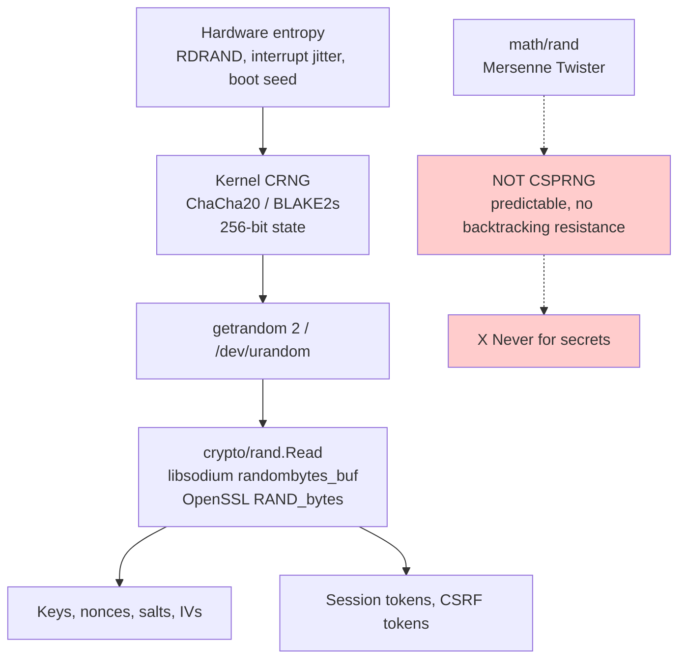
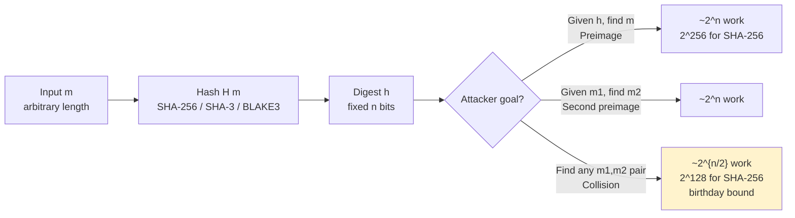
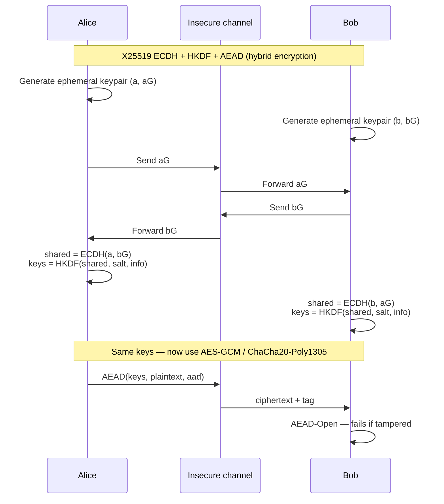
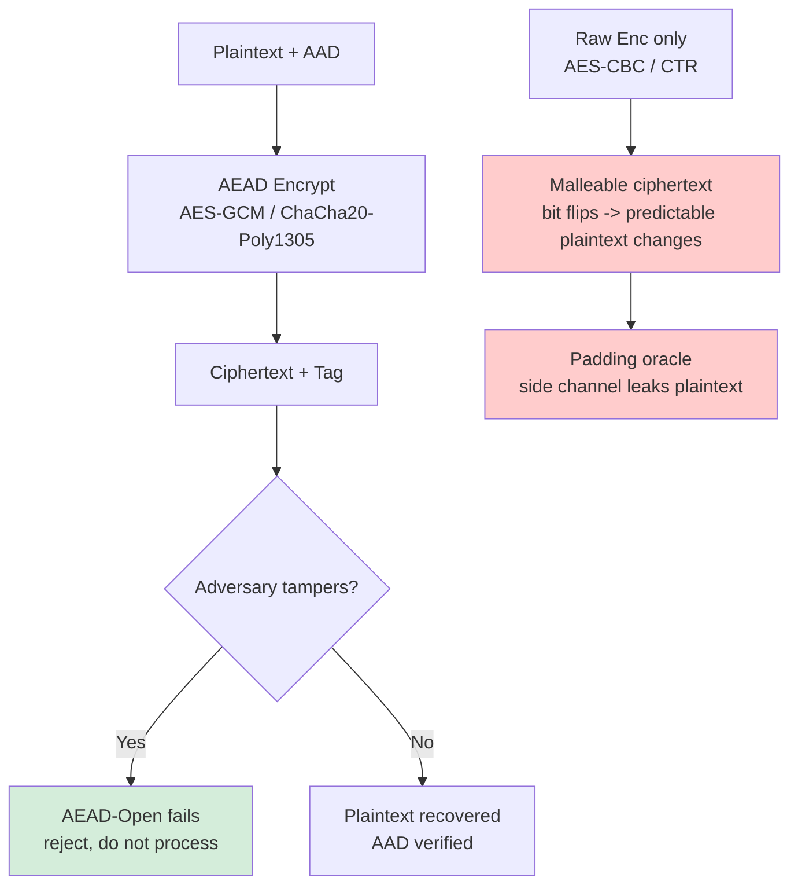
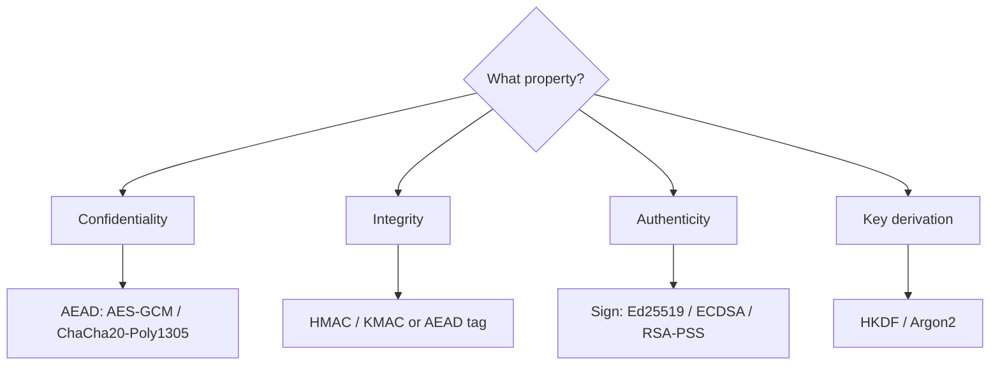
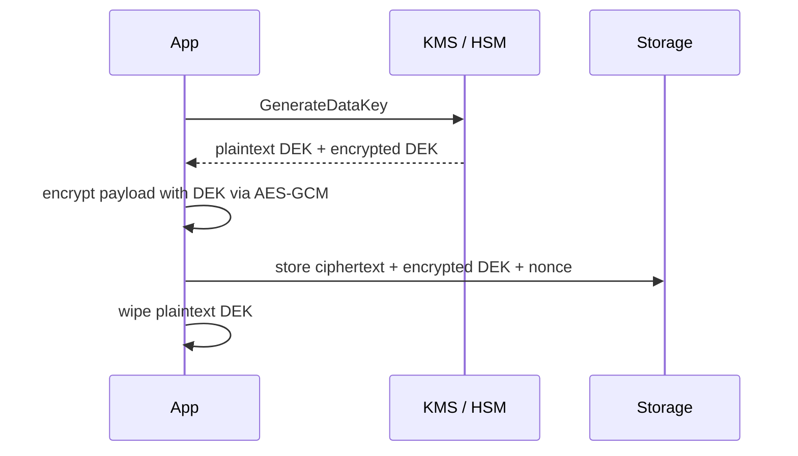
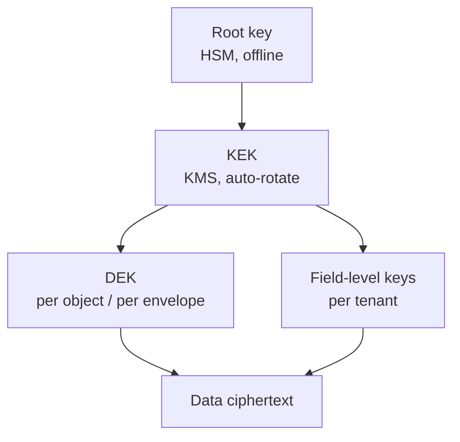

# Chapter 1 — Applied Cryptography for Engineers

**What this chapter covers.** This is the foundation for everything in Volume 9 and a prerequisite for Volume 7 (System Design) and Volume 8 (APIs). Cryptography is the mechanism that makes authentication, confidentiality, and integrity possible in a distributed system where every network hop is attacker-controlled and every storage layer is potentially exfiltrated. This chapter gives you the working mental model: what primitives exist, what guarantees each provides and — crucially — what it does *not* provide, how they compose into protocols, and how to use them without building a bespoke cryptosystem that silently fails. We cover random number generation, hash functions, message authentication codes, key derivation, authenticated encryption, key exchange, and digital signatures at the level a senior backend engineer needs: enough to choose correctly, use the right library call, review code for misuse, and reason about failure modes. We do not derive the mathematics of AES or elliptic curves — we treat them as well-specified black boxes with known properties and known misuse modes.

Learning goals — after this chapter you should be able to:

- Distinguish the six primitive families (RNG, hash, MAC, KDF, encryption, signature) by the security property each provides and the threat it assumes.
- Explain why "encrypt then MAC" and "encrypt and MAC" are broken compositions and why AEAD (RFC 5116) is the only safe default for symmetric encryption.
- Choose SHA-256 vs SHA-3 vs BLAKE3 for a given task and explain length-extension, collision, and preimage resistance in operational terms.
- Use `crypto/rand`, OpenSSL, and libsodium to generate keys, hash, and sign — and explain why `math/rand` and `/dev/urandom` misuse are the most common crypto bugs in backend services.
- Reason about when to use symmetric vs asymmetric primitives and why hybrid construction (asymmetric key exchange + symmetric bulk encryption) is universal at scale.
- Describe the distributed-systems consequences of crypto choices: key distribution, rotation, forward secrecy, and the blast radius of a compromised key.

> **Boundary notes.** This chapter covers *primitives and their correct use*. The wire protocol that composes them into TLS 1.3 (RFC 8446) is covered in Vol 3, Ch 6 — read that for handshake mechanics, record framing, and 0-RTT. The *operational* side of that same protocol — certificate lifecycle, PKI chains, rotation, revocation, and mTLS deployment — is Vol 9, Ch 4. This chapter gives you the vocabulary; those chapters give you the system.

## Why applied crypto is different from textbook crypto

Textbook cryptography proves theorems about ideal primitives. Applied cryptography keeps services from being breached when engineers glue those primitives together under deadline pressure. The gap between the two is where nearly every real-world crypto failure lives — not in a broken AES, but in a reused nonce, a timing side-channel, an unauthenticated ciphertext, or a key that was never rotated.

Three principles govern this entire volume:

**1. Never invent primitives or protocols.** If you are designing a new cipher mode, a custom key-derivation loop, or a novel hand-rolled signature scheme, you are almost certainly introducing a vulnerability. Use vetted, version-pinned constructions: AES-GCM or ChaCha20-Poly1305 for AEAD (RFC 5116 / RFC 8439), HKDF (RFC 5869), Argon2id (RFC 9106) for passwords, Ed25519 (RFC 8032) or ECDSA P-256 for signatures. The standard *is* the safety.

**2. Misuse resistance matters more than primitive strength.** AES-256 is not meaningfully safer than AES-128 against any realistic adversary — both are far beyond brute force — but AES-GCM with a reused nonce is catastrophically broken with *either* key length. Most audit findings are misuse, not primitive weakness.

**3. Keys are the system.** A cryptosystem is only as strong as its key management: generation, distribution, storage, rotation, and destruction. Chapters 4, 8, and 10 are entirely about this. This chapter notes the key lifecycle at every step because a primitive without a key-management story is incomplete.

## Randomness: the root of everything

Every other primitive consumes random bytes: keys, nonces, IVs, salts. If the RNG is weak, everything built on it falls.

### What "cryptographically secure" means

A Cryptographically Secure PRNG (CSPRNG) has two properties beyond statistical uniformity: *unpredictability* (given all past output, the next byte is still unpredictable) and *backtracking resistance* (given current state, past outputs remain unpredictable). The OS CSPRNG — `getrandom(2)` on Linux, `BCryptGenRandom` on Windows, `arc4random` on BSDs — is seeded from hardware entropy at boot and continuously reseeded from interrupt timing, RDRAND/RDSEED on x86, and other sources.

On Linux, `getrandom(2)` blocks until the entropy pool is initialized (since kernel 5.6, ChaCha20-based CRNG with 256-bit state), then never blocks again. `/dev/urandom` is equivalent on modern kernels. `/dev/random` blocking behavior is a historical artifact — do not use it to "get better randomness."

### Generating keys correctly

```bash
# Generate a 256-bit (32-byte) symmetric key — hex-encoded for config
$ openssl rand -hex 32
a3f7c9e2d1b0485f6a2e9c7d03f8b1a4e5c6d7f8091a2b3c4d5e6f708192a3b4c5

# 32 random bytes as raw binary (for piping to a KMS or file)
$ openssl rand 32 | od -An -tx1
 a3 f7 c9 e2 d1 b0 48 5f 6a 2e 9c 7d 03 f8 b1 a4
 e5 c6 d7 f8 09 1a 2b 3c 4d 5e 6f 70 81 92 a3 b4

# libsodium (C) — the reference for correct-by-default crypto
# Generates a 32-byte key using the OS CSPRNG
unsigned char key[crypto_secretbox_KEYBYTES]; // 32
crypto_secretbox_keygen(key);  // wraps randombytes_buf internally
```

In Go, the distinction is sharp and frequently confused in code review:

```go
package main

import (
    "crypto/rand"  // CSPRNG — backed by getrandom(2)
    mathrand "math/rand" // NOT cryptographically secure — Mersenne Twister
    "encoding/hex"
    "fmt"
    "log"
)

func GenerateKey() []byte {
    key := make([]byte, 32) // 256 bits
    if _, err := rand.Read(key); err != nil {
        log.Fatal(err) // getrandom failed — do not continue
    }
    return key
}

func main() {
    k := GenerateKey()
    fmt.Println(hex.EncodeToString(k))
    // Output: e.g. 7f3a9c... (64 hex chars = 32 bytes)
    // NEVER use math/rand for keys, nonces, or tokens:
    //   mathrand.Read(key) — predictable after observing 624 outputs
}
```



**Review checklist for RNG usage:**

| Pattern | Verdict |
|---|---|
| `crypto/rand.Read` (Go), `randombytes_buf` (libsodium), `RAND_bytes` (OpenSSL) | Correct |
| `math/rand`, `random.random()` (Python stdlib), `Math.random()` (JS) | Never for secrets |
| `uuid.New()` / `uuid.NewV4()` (Go `google/uuid` uses `crypto/rand`) | OK for random IDs |
| `uuid.New()` from `satori/go.uuid` V1 (MAC + timestamp) | Not random — predictable |
| Seeding with `time.Now().UnixNano()` | Broken |

## Hash functions: integrity fingerprints

A cryptographic hash function `H: {0,1}* -> {0,1}^n` maps arbitrary input to a fixed-size digest. Three security properties matter, each resisting a different attack:

- **Preimage resistance:** given `h`, finding any `m` with `H(m) = h` takes ~2^n work. Protects password hashes and commitment schemes.
- **Second-preimage resistance:** given `m1`, finding `m2 != m1` with `H(m1) = H(m2)` takes ~2^n. Protects integrity checks where the original is known.
- **Collision resistance:** finding *any* pair `m1 != m2` with `H(m1) = H(m2)` takes ~2^(n/2) (birthday bound). Protects signatures and deduplication where the attacker controls both inputs. This is the hardest property to maintain — collisions are quadratically easier than preimages.

### Choosing a hash

| Function | Output | Standard | Notes |
|---|---|---|---|
| SHA-256 | 256 bits | FIPS 180-4 | Conservative default; ubiquitous, hardware-accelerated (SHA-NI) |
| SHA-512 | 512 bits | FIPS 180-4 | Faster than SHA-256 on 64-bit CPUs; use SHA-512/256 for truncated variant |
| SHA-3-256 (Keccak) | 256 bits | FIPS 202 | Different construction (sponge); hedge against SHA-2 cryptanalysis |
| BLAKE3 | 256 bits | Informal (BLAKE3 spec) | Fastest in software; parallelizable; not yet NIST-standardized |
| SHA-1, MD5 | 160/128 bits | Broken | Collision attacks are practical (SHA-1 shattered, 2017). Never for security. |

```bash
# Hashing with OpenSSL — note the hex digest is deterministic for the same input
$ echo -n "hello" | openssl dgst -sha256
SHA2-256(stdin)= 2cf24dba5fb0a30e26e83b2ac5b9e29e1b161e5c1fa7425e73043362938b9824

$ echo -n "hello" | openssl dgst -sha3-256
SHA3-256(stdin)= 3338be694f50c5f33854368fea51034a4364dd52019b6de187a6575026b8e9f4d

# Go — SHA-256
```

```go
import (
    "crypto/sha256"
    "encoding/hex"
    "fmt"
)

func main() {
    h := sha256.Sum256([]byte("hello"))
    fmt.Println(hex.EncodeToString(h[:]))
    // Output: 2cf24dba5fb0a30e26e83b2ac5b9e29e1b161e5c1fa7425e73043362938b9824
}
```



### Where hashes go wrong

**Length-extension attacks** affect Merkle-Damgard hashes (SHA-256, SHA-512) but not SHA-3 or BLAKE3. Given `H(key || message)` an attacker can compute `H(key || message || extension)` without knowing `key`. This is why `HMAC-SHA256(key, message)` exists rather than `SHA256(key || message)`. If you must use SHA-256 in a MAC-like construction, use HMAC.

**Do not use raw hashes for passwords.** SHA-256("password123") is computed in nanoseconds on a GPU. Password storage requires a deliberately slow, salted KDF — see Chapter 2.

## Message Authentication Codes

A hash tells you *what* was hashed. A MAC tells you *who* vouched for it. `MAC(K, m)` is a keyed primitive: only someone holding key `K` can produce or verify the tag.

**HMAC (RFC 2104)** is the standard construction: `HMAC(K, m) = H((K' xor opad) || H((K' xor ipad) || m))`. It is safe with any approved hash (HMAC-SHA256 is the default).

```go
import (
    "crypto/hmac"
    "crypto/sha256"
    "encoding/hex"
)

func computeHMAC(key, message []byte) string {
    mac := hmac.New(sha256.New, key)
    mac.Write(message)
    return hex.EncodeToString(mac.Sum(nil))
}

// Example — webhook signature verification (Stripe, GitHub style)
func verifyWebhook(secret, payload, claimedTag []byte) bool {
    mac := hmac.New(sha256.New, secret)
    mac.Write(payload)
    expected := mac.Sum(nil)
    // hmac.Equal is constant-time — never use == for tags
    return hmac.Equal(expected, claimedTag)
}
```

The critical detail is in that last line. A naive `==` comparison short-circuits on the first differing byte, leaking timing information that lets an attacker forge a tag byte-by-byte. `hmac.Equal` (Go), `hmac.compare_digest` (Python), `crypto.timingSafeEqual` (Node) all run in constant time regardless of where the mismatch occurs.

**KMAC / HMAC-SHA3** variants exist but HMAC-SHA256 remains the conservative choice. For new systems where you control both sides, consider using an AEAD instead — it authenticates and encrypts in one step.

## Key Derivation Functions

A KDF stretches a shared secret, password, or keying material into one or more cryptographically strong keys.

| KDF | Input | Standard | Use case |
|---|---|---|---|
| HKDF (RFC 5869) | High-entropy IKM (e.g., ECDH shared secret) | RFC 5869 | Derive session keys from a handshake secret (TLS 1.3 key schedule) |
| PBKDF2 (RFC 8018) | Password | PKCS#5, NIST SP 800-132 | Legacy password hashing; use Argon2 for new code |
| scrypt (RFC 7914) | Password | RFC 7914 | Memory-hard; better than PBKDF2, superseded by Argon2 |
| Argon2id (RFC 9106) | Password | RFC 9106 | Current best practice for password storage (Ch 2) |

```go
import "golang.org/x/crypto/hkdf"
import "crypto/sha256"
import "io"

// Derive two independent keys from one ECDH shared secret
func deriveKeys(ikm, salt, info []byte) (encKey, macKey []byte) {
    // HKDF-Extract: salt + IKM -> PRK (pseudorandom key)
    // HKDF-Expand: PRK + info -> output keys
    r := hkdf.New(sha256.New, ikm, salt, []byte("enc-key"))
    encKey = make([]byte, 32)
    io.ReadFull(r, encKey)

    r2 := hkdf.New(sha256.New, ikm, salt, []byte("mac-key"))
    macKey = make([]byte, 32)
    io.ReadFull(r2, macKey)
    return
}
```

HKDF's two-step structure matters: *Extract* concentrates dispersed entropy into a uniform PRK, *Expand* stretches it to the desired length with domain separation via `info`. In TLS 1.3 (RFC 8446, Section 7.1), the entire key schedule is HKDF — handshake secrets, traffic keys, resumption secrets all derive through HKDF-Extract/Expand with distinct labels.

## Authenticated encryption: the only symmetric encryption you should use

Unauthenticated encryption (AES-CBC, AES-CTR alone) is malleable: an attacker can flip bits in the ciphertext to produce predictable changes in the plaintext. Every classic padding-oracle and bit-flipping attack exploits this. The fix is **AEAD** — Authenticated Encryption with Associated Data (RFC 5116) — which encrypts and authenticates in a single operation and returns an error on any tampering.

Two AEADs dominate modern practice:

- **AES-GCM** — hardware-accelerated via AES-NI + CLMUL on x86/ARMv8. The default where hardware support is assumed (servers, cloud VMs). Nonce is 96 bits (12 bytes); tag is 128 bits.
- **ChaCha20-Poly1305** (RFC 8439) — fast in pure software, no timing side-channels from S-box lookups. Preferred on mobile, embedded, and where constant-time AES is unavailable.

```go
package main

import (
    "crypto/aes"
    "crypto/cipher"
    "crypto/rand"
    "fmt"
    "io"
    "log"

    "golang.org/x/crypto/chacha20poly1305"
)

// AES-GCM — server-side default (requires AES-NI for performance)
func encryptAESGCM(key, plaintext, aad []byte) (nonce, ciphertext []byte) {
    block, err := aes.NewCipher(key) // key must be 16, 24, or 32 bytes
    if err != nil { log.Fatal(err) }
    aead, err := cipher.NewGCM(block)
    if err != nil { log.Fatal(err) }

    nonce = make([]byte, aead.NonceSize()) // 12 bytes for GCM
    if _, err := io.ReadFull(rand.Reader, nonce); err != nil { log.Fatal(err) }

    // Seal appends ciphertext + 16-byte auth tag; aad is authenticated but not encrypted
    ciphertext = aead.Seal(nil, nonce, plaintext, aad)
    return nonce, ciphertext
}

func decryptAESGCM(key, nonce, ciphertext, aad []byte) ([]byte, error) {
    block, _ := aes.NewCipher(key)
    aead, _ := cipher.NewGCM(block)
    return aead.Open(nil, nonce, ciphertext, aad) // error if tag invalid
}

// ChaCha20-Poly1305 — alternative with no hardware dependency
func encryptChaCha(key, plaintext, aad []byte) (nonce, ciphertext []byte) {
    aead, err := chacha20poly1305.New(key) // 32-byte key
    if err != nil { log.Fatal(err) }
    nonce = make([]byte, aead.NonceSize()) // 12 bytes (or 24 for X variant)
    io.ReadFull(rand.Reader, nonce)
    ciphertext = aead.Seal(nil, nonce, plaintext, aad)
    return
}

func main() {
    key := make([]byte, 32)
    rand.Read(key)

    nonce, ct := encryptAESGCM(key, []byte("payment: $100 to alice"), []byte("header-v1"))
    fmt.Printf("nonce: %x\nct+tag: %x (%d bytes)\n", nonce, ct, len(ct))
    // Output: nonce: 7f3a... (12 bytes)
    //         ct+tag: 9c1e... (21 bytes plaintext + 16 byte tag = 37 bytes)
}
```

```bash
# OpenSSL AES-GCM round-trip (for ops debugging — prefer libsodium/Go in services)
$ echo -n "payment: \$100 to alice" | openssl enc -aes-256-gcm \
    -K $(openssl rand -hex 32) -iv $(openssl rand -hex 12) -a
# Output: base64 ciphertext+tag (OpenSSL appends tag; format is tool-specific — not interoperable wire format)
```

The `aad` (Additional Authenticated Data) parameter is the feature that makes AEAD more than "encryption that checks integrity." AAD is authenticated but sent in cleartext — use it for headers, sequence numbers, or tenant IDs that must not be tampered with even though they are not secret.

### Nonce discipline

Both AES-GCM and ChaCha20-Poly1305 fail catastrophically on nonce reuse with the same key. For GCM, reusing a nonce leaks the authentication key and then the plaintext XOR. Rules:

- **Random 96-bit nonce:** safe if you never encrypt more than ~2^32 messages under one key (birthday bound at 2^48 for 96 bits — 2^32 is the conservative limit per NIST SP 800-38D).
- **Counter nonce:** safe if you have a reliable persistent counter (not safe across restarts or distributed replicas without coordination).
- **XChaCha20-Poly1305 (192-bit nonce):** safe to generate randomly for practically unlimited messages — prefer this for long-lived keys or distributed encryptors that cannot coordinate counters.

> **Distributed-systems note.** Nonce coordination is a hidden distributed-systems problem. Two replicas sharing a key and generating random 96-bit nonces will eventually collide. Either give each replica a distinct key (via HKDF with a replica ID as `info`), use XChaCha20-Poly1305 with 192-bit random nonces, or partition the nonce space (e.g., 32-bit replica ID + 64-bit counter). Shared-key nonce reuse across replicas has caused real outages.

## Asymmetric primitives: key exchange and signatures

Symmetric crypto needs a shared secret. Asymmetric crypto solves the distribution problem at the cost of slower operations. Two operations matter:

**Key exchange (KEM / ECDH):** two parties derive a shared secret over an insecure channel. Modern practice is **X25519** (RFC 7748, ECDH over Curve25519) or **ECDH P-256**. The shared secret is then fed through HKDF to derive symmetric keys — this is the hybrid construction that TLS 1.3, Noise, and nearly every encrypted channel uses.

**Signatures:** one party proves authorship and integrity with a private key; anyone with the public key can verify. Standards: **Ed25519** (RFC 8032, deterministic, 64-byte signatures) and **ECDSA P-256** (FIPS 186-4, requires careful RNG — nonce reuse leaks the private key). RSA signatures (RSASSA-PSS, RFC 8017) remain common for X.509 but are larger and slower.

```go
import (
    "crypto/ecdh"
    "crypto/ed25519"
    "crypto/rand"
    "fmt"
)

// X25519 key exchange — hybrid encryption pattern
func keyExchangeExample() {
    // Alice generates a keypair
    alicePriv, _ := ecdh.X25519().GenerateKey(rand.Reader)
    alicePub := alicePriv.PublicKey()

    // Bob generates a keypair
    bobPriv, _ := ecdh.X25519().GenerateKey(rand.Reader)
    bobPub := bobPriv.PublicKey()

    // Shared secret — both sides derive the same 32 bytes
    aliceShared, _ := alicePriv.ECDH(bobPub)
    bobShared, _ := bobPriv.ECDH(alicePub)
    fmt.Printf("shared equal: %v\n", string(aliceShared) == string(bobShared)) // true
    // Feed aliceShared through HKDF to get AEAD keys — never use raw ECDH output as a key
}

// Ed25519 signing — deterministic, no RNG needed at sign time
func signatureExample() {
    pub, priv, _ := ed25519.GenerateKey(rand.Reader)
    message := []byte("deploy artifact sha256:abc123...")
    sig := ed25519.Sign(priv, message)
    fmt.Printf("sig: %x (%d bytes)\n", sig, len(sig)) // 64 bytes
    fmt.Printf("valid: %v\n", ed25519.Verify(pub, message, sig)) // true
}
```

```bash
# libsodium — sealed box (X25519 + XSalsa20-Poly1305, anonymous sender)
# Generate keypair
$ openssl genpkey -algorithm X25519 -out x25519-priv.pem
$ openssl pkey -in x25519-priv.pem -pubout -out x25519-pub.pem
$ cat x25519-pub.pem
-----BEGIN PUBLIC KEY-----
MCowBQYDK2VwAyEA...
-----END PUBLIC KEY-----
```



### When to use which

| Goal | Primitive | Example |
|---|---|---|
| Bulk data encryption (at rest, in transit) | AEAD (AES-GCM / ChaCha20-Poly1305) | Encrypting a database field, a message queue payload |
| Key exchange over insecure channel | X25519 ECDH + HKDF | TLS 1.3 handshake, Noise protocol |
| Authentication / non-repudiation | Ed25519 / ECDSA signatures | Signing artifacts (Sigstore), JWTs (asymmetric), certificate chains |
| Password storage | Argon2id (Ch 2) | Never use plain hash or fast KDF |

> **Forward secrecy.** Ephemeral key exchange (ECDHE — the "E" is ephemeral) means each session uses a fresh keypair that is discarded afterward. An attacker who later steals the long-term identity key cannot decrypt recorded sessions. TLS 1.3 (RFC 8446) mandates (EC)DHE for this reason — it removed static RSA key transport entirely. For service-to-service encryption at scale, prefer ephemeral exchange even if it costs an extra round trip.

## Composition and misuse patterns

Real systems compose primitives. The composition can be secure or broken independently of the primitives' strength.

**Authenticated encryption is the safe composition.** Do not build "encrypt then MAC" yourself — use an AEAD. If you must compose manually (legacy protocol), the order matters and is easy to get wrong:

- *Encrypt-and-MAC* (`C = Enc(K1, m), T = MAC(K2, m)`) — leaks plaintext equality through the MAC.
- *MAC-then-Encrypt* (`T = MAC(K1, m), C = Enc(K2, m||T)`) — vulnerable to padding oracles (the TLS 1.0/1.1 CBC debacle).
- *Encrypt-then-MAC* (`C = Enc(K1, m), T = MAC(K2, C)`) — the only manually safe order, but still requires two independent keys and constant-time verification. Just use an AEAD.

**Hybrid encryption** (asymmetric KEM + symmetric AEAD) is how you encrypt to a public key at scale: generate an ephemeral symmetric key, encrypt the payload with the AEAD, encrypt the symmetric key to the recipient's public key. Libraries like libsodium `crypto_box_seal` and Google Tink do this correctly — do not reimplement it.

**Key separation:** never use the same key for two purposes. Derive purpose-specific subkeys with HKDF and distinct `info` labels. A key used for both encryption and MAC, or for two different protocols, can create cross-protocol attacks.




## Signatures in the backend: supply chain, tokens, and logs

Signatures solve a different problem than encryption: they bind an identity to a statement so that anyone can verify it without being able to forge it. Three verification patterns dominate backend systems.

**Artifact signing** proves that a container image, binary, or SBOM was produced by a trusted builder. Sigstore (Cosign + Fulcio + Rekor) uses short-lived Ed25519/ECDSA keys bound to an OIDC identity, with the signature and certificate logged in a transparency log. Verification checks the signature, the certificate chain to Fulcio, and inclusion in Rekor. The key insight for this chapter is that the primitive — Ed25519 over SHA-512 — is only one link: the system also needs a trust anchor (Fulcio root), a distribution mechanism (OCI annotations or in-toto attestations), and a revocation story (short-lived certs, not CRLs). Companion Book 5, Chapters 3–5 covers this end-to-end; the primitive alone is insufficient.

**Token signing** proves that a JWT or PASETO token was issued by your auth service. Two modes exist: symmetric (HMAC-SHA256, `HS256`) where every verifier holds the shared key, and asymmetric (RS256, ES256, EdDSA) where verifiers hold only the public key. Symmetric mode is simpler but every verifier can forge tokens — a single compromised service can mint arbitrary JWTs. Asymmetric mode isolates the signing key to the auth service; verifiers fetch the public key via JWKS. For distributed fleets, prefer asymmetric (Ed25519 or ECDSA P-256) with a JWKS endpoint and `kid` rotation as described in Chapter 5. Never accept `alg: none` and never let the token dictate the algorithm — both have produced real forgeries.

**Log and audit signing** proves that a record existed at a point in time. Rekor and Certificate Transparency use Merkle-tree-backed transparency logs: each entry is signed, the tree head is signed, and inclusion/exclusion proofs are verifiable. The signature primitive is again Ed25519 or ECDSA, but the system property is append-only verifiability. If your audit pipeline signs each batch of logs with a per-batch Ed25519 signature and publishes the public key, an attacker who tampers with stored logs must also forge a signature or break the chain. This is covered in depth in Companion Book 5, Chapter 5; the takeaway here is that signing without a verifiable log is repudiation without evidence.

Signature verification has its own misuse class. ECDSA requires a fresh random nonce per signature — reusing the nonce leaks the private key (this has drained cryptocurrency wallets). Ed25519 is deterministic and avoids this failure mode, which is one reason it is preferred for new systems. RSA-PSS (RFC 8017) requires a proper salt length; PKCS#1 v1.5 signatures are malleable. Always verify that the library you call implements constant-time scalar multiplication and rejects small-subgroup points for ECDH/ECDSA — Go `crypto/ecdh` and `crypto/ed25519` do; some older OpenSSL versions required explicit checks.

## RNG failures: the bugs that break everything above

If the RNG fails, every key, nonce, and salt above is predictable. The failures are not hypothetical.

**Debian OpenSSL (2008).** A patch removed entropy sources from OpenSSL's RNG to silence a Valgrind warning, reducing the keyspace to 15 bits. Thousands of SSH and TLS keys were factorable. The fix was to restore the entropy sources — but the lesson is that RNG code is fragile and must not be patched without cryptographic review.

**Android SecureRandom (2013).** `SecureRandom` was seeded with insufficient entropy on some devices, producing repeated ECDSA nonces in Bitcoin wallets. Nonce reuse leaked private keys and funds were stolen. The fix was to seed from `/dev/urandom` and to move to deterministic ECDSA (RFC 6979) or Ed25519.

**VM snapshot cloning.** Cloning a VM or container without reseeding the RNG produces identical keys and nonces on every clone. Cloud images must reseed from host entropy on first boot; containers that fork many workers must call `getrandom(2)` per worker, not once before forking. Systemd's `random-seed` service and the kernel's CRNG reseeding on fork (Linux 5.6+) mitigate this, but application-level caching of keys across forks reintroduces the bug.

The operational response is threefold: never cache RNG output across forks, never seed your own PRNG from `time.Now()` or PID, and monitor for duplicate keys or nonces in production (a duplicate X25519 public key or AES-GCM nonce across hosts is an RNG failure until proven otherwise).


## Crypto agility: versioning primitives without flag days

Primitives age. SHA-1 was standard, then broken. RSA-1024 was sufficient, then factored. TLS 1.2's CBC ciphersuites were recommended, then removed in TLS 1.3. Every cryptosystem you ship must be replaceable without a coordinated flag day across the fleet — a property called crypto agility.

Agility has three concrete mechanisms. First, every encrypted or signed value carries an algorithm identifier: the `alg` field in a JWT header, the `cipher_suite` in a TLS ClientHello, the `kek_version` in an envelope, or the `$argon2id$v=19$` prefix in a PHC string. Verifiers use the identifier to select the correct code path, which means old and new values coexist during migration. Second, negotiation is explicit and server-driven: the server advertises what it accepts and selects the strongest mutual option, rather than trusting a client-supplied preference unauthenticated. Third, deprecation is phased: add the new algorithm, dual-issue or dual-verify for a window, measure adoption, then remove the old algorithm only after the tail drops below a threshold. The TLS 1.3 design is the canonical example — it removed renegotiation, compression, and static RSA in one revision but did so by defining a new version number and requiring implementations to negotiate it, not by patching the old version in place.

For backend services, the practical implication is that no crypto choice should be a hardcoded constant. Key lengths, hash choices, AEAD selections, and KDF parameters belong in versioned configuration, not in string literals. A service that writes `aes.NewCipher(key)` with a fixed assumption of AES-256-GCM cannot migrate to ChaCha20-Poly1305 for a fleet of ARM edge nodes without a code change and redeploy. A service that writes `aeadForVersion(v).Seal(...)` with a registry of algorithms can migrate by changing config and doing a rolling deploy with dual-read. Build the registry on day one — retrofitting agility after a primitive is broken is an emergency migration under incident pressure, which is exactly when you will get it wrong.

Agility also governs failure response. When a primitive is weakened — as SHA-1 was after SHAttered (2017) demonstrated a practical collision in ~2^63 work — the question is not whether to migrate but how fast. Teams with agility migrated by bumping a version identifier and rehashing affected objects in a background job. Teams without agility faced a choice between mass invalidation (downtime, user impact) and continued exposure. The same dynamics apply to post-quantum migration, which NIST has begun standardizing with ML-KEM (FIPS 203) and ML-DSA (FIPS 204) — even if you do not deploy them today, your agility layer is what will let you deploy them when you must.

## Distributed-systems lens

Cryptography in a single process is a library call. Cryptography in a distributed system is a coordination problem.

**Key distribution** is the central challenge. Symmetric keys must be shared among replicas that need to encrypt/decrypt, but every copy is additional blast radius. Prefer asymmetric patterns where possible: each service holds its own private key, public keys are distributed freely. Where symmetric keys are unavoidable (e.g., data-at-rest encryption), use envelope encryption — a data key encrypts the payload, a KMS-held key-encrypting key (KEK) encrypts the data key — so rotation and revocation happen at the KEK layer without re-encrypting all data. This is the pattern AWS KMS, GCP KMS, and Vault Transit all implement.

**Rotation and versioning.** Keys must rotate without downtime. Every encrypted value or token should carry a key identifier (`kid` in JWTs, key version in KMS ciphertext) so verifiers can select the correct key during the rotation window. Dual-read (try new key, fall back to old) during rotation is the standard technique — see Chapter 8 for full lifecycle.

**Consistency of trust stores.** Certificate roots, public keys, and revocation lists must be consistent across the fleet. A rolling deploy that updates a trust store on half the fleet before the other half creates a window where inter-service authentication fails in one direction. Treat trust-store updates like schema migrations: backward-compatible, dual-trust windows, then cleanup.

**Forward secrecy at scale** means session keys are ephemeral and short-lived. For long-lived connections (gRPC streams, WebSocket), re-key periodically. For stored data, forward secrecy is approximated by prompt re-encryption after KEK rotation.


#### Crypto Primitive Selection



#### Envelope Encryption



#### Key Hierarchy



## Key takeaways

- Use vetted, version-pinned primitives: AES-GCM or ChaCha20-Poly1305 for AEAD (RFC 5116/8439), HMAC-SHA256 for MACs, HKDF (RFC 5869) for key derivation, X25519 (RFC 7748) for key exchange, Ed25519 (RFC 8032) for signatures. Do not invent constructions.
- RNG failures are the most common crypto bug — always use the OS CSPRNG via `crypto/rand`, `randombytes_buf`, or `RAND_bytes`; never `math/rand`, `Math.random()`, or time-seeded PRNGs.
- Hash functions provide preimage, second-preimage, and collision resistance at different cost levels; SHA-256 and SHA-3-256 are conservative defaults, BLAKE3 is the fast alternative. Never use MD5 or SHA-1 for security.
- AEAD is the only safe symmetric-encryption interface — it binds confidentiality and integrity in one operation with a single misuse mode (nonce reuse). Prefer XChaCha20-Poly1305 where nonce coordination across replicas is hard.
- Asymmetric crypto is for key exchange and signatures, not bulk encryption — hybrid construction (ECDH + HKDF + AEAD) is how real protocols compose them.
- Keys are the system: generation, distribution, rotation, and destruction dominate the security of any cryptosystem. Every key should have an identifier, a rotation schedule, and a defined blast radius.

## Further reading

- **Standards:** RFC 5116 (AEAD), RFC 5869 (HKDF), RFC 7748 (X25519/X448), RFC 8032 (Ed25519/Ed448), RFC 8439 (ChaCha20-Poly1305), RFC 8446 (TLS 1.3), FIPS 180-4 (SHA-2), FIPS 202 (SHA-3), FIPS 186-4 (ECDSA), NIST SP 800-38D (GCM).
- D. J. Bernstein et al. — *The Security Impact of a New Cryptographic Library* (libsodium design rationale, 2012).
- Ferguson, Schneier, Kohno — *Cryptography Engineering* (Wiley, 2010). The practitioner counterpart to textbook crypto.
- Latacora — *Cryptographic Right Answers* (https://latacora.micro.blog/2018/04/03/cryptographic-right-answers.html) — opinionated, regularly updated primitive choices.
- libsodium documentation — https://doc.libsodium.org/ — the best single reference for correct-by-default API usage.
- Go `crypto/*` package docs — https://pkg.go.dev/crypto — authoritative for Go service implementations.
