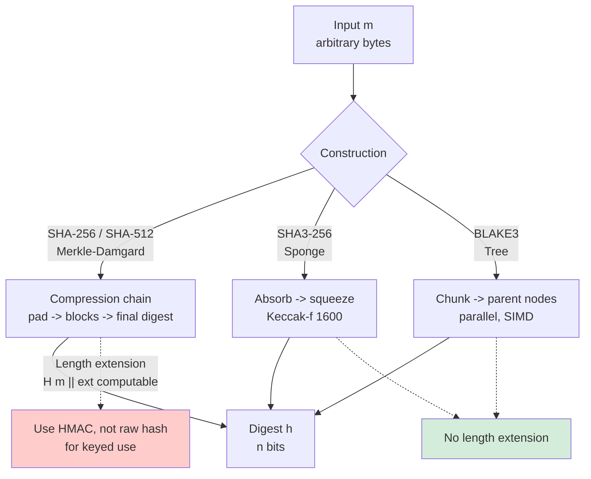
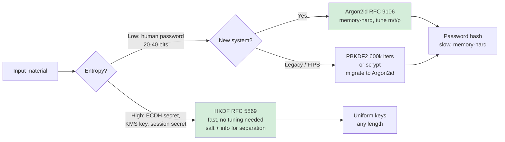
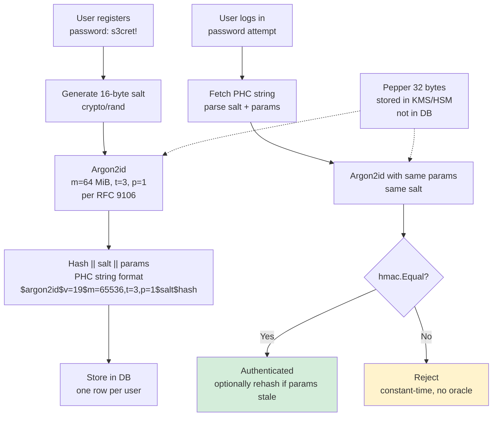
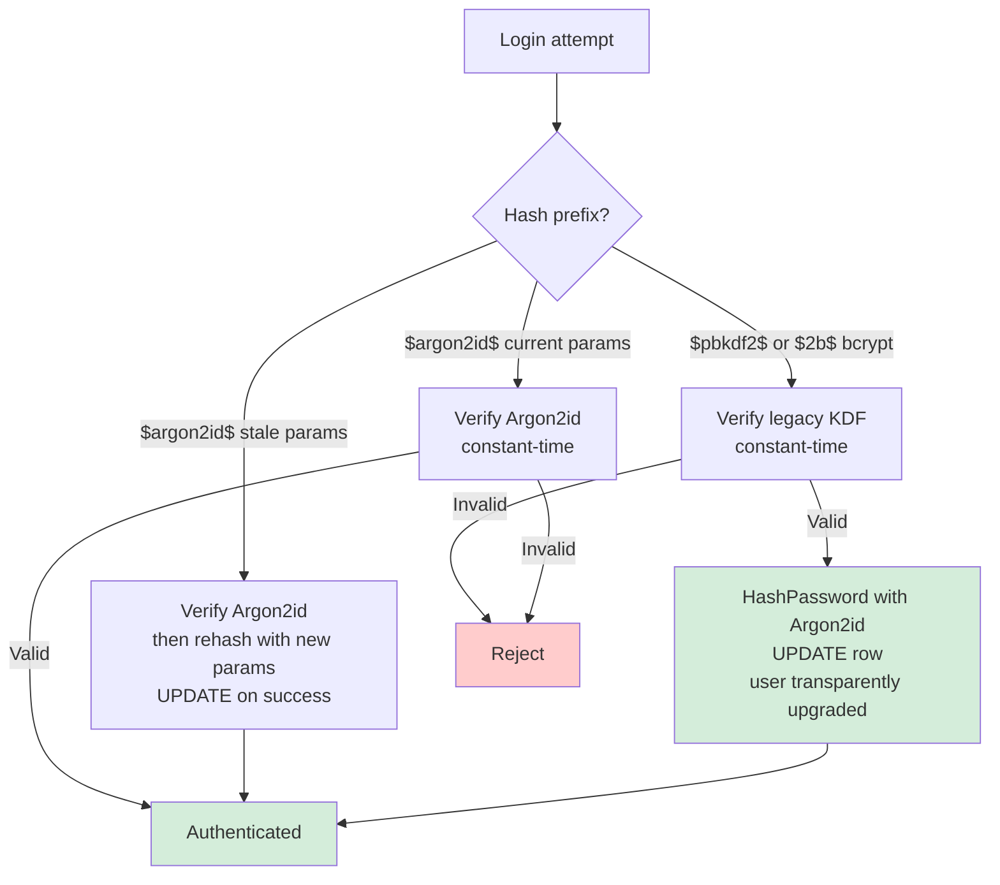
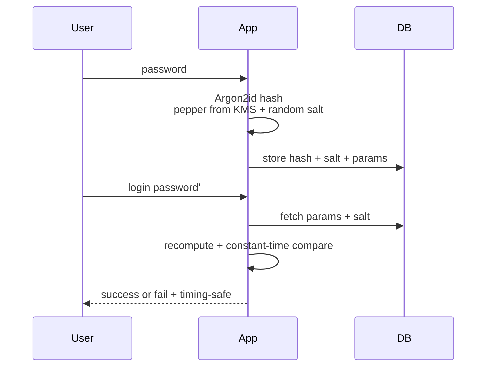
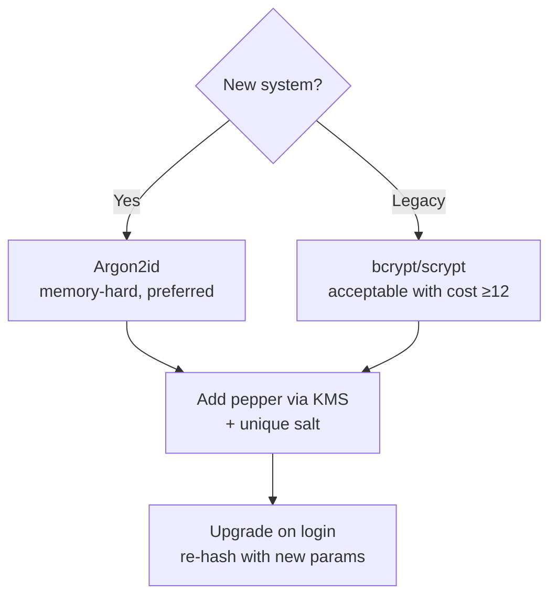
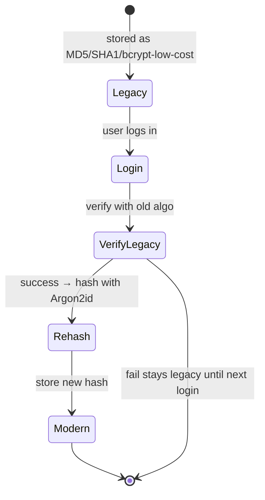

# Chapter 2 — Hashing, MACs, KDFs, and Password Storage

**What this chapter covers.** Hash functions are the most misused primitive in backend systems — not because the mathematics is subtle, but because engineers reach for the wrong tool for the job: SHA-256 where Argon2id is required, a fast hash where a slow one is needed, or no salt where uniqueness is essential. This chapter gives you the complete decision tree. We start with unkeyed cryptographic hashes (SHA-2, SHA-3, BLAKE3), their security properties, and their operational limits — length extension, collision bounds, and performance. We then add a key: message authentication codes (HMAC, KMAC, Poly1305) and their role in tamper detection. We then stretch and derive: key derivation functions from HKDF (RFC 5869) for high-entropy inputs to memory-hard password hashes — scrypt (RFC 7914) and Argon2 (RFC 9106) — for low-entropy human secrets. The chapter closes where most breaches begin: password storage done correctly per NIST SP 800-63B (2023 update), including salting, peppering, upgrade paths, and breach-response rotation.

Learning goals — after this chapter you should be able to:

- State the three hash security properties (preimage, second-preimage, collision resistance) with their quantitative bounds and explain why collision resistance fails first.
- Explain length-extension attacks on Merkle-Damgard hashes and why HMAC-SHA256 (RFC 2104) or SHA-3 is required for keyed use.
- Use HMAC correctly — including constant-time verification — and distinguish it from a plain hash and from an AEAD.
- Choose among HKDF, PBKDF2, scrypt, and Argon2id by input entropy: HKDF for key derivation from high-entropy secrets, Argon2id for password hashing, nothing else for new code.
- Implement Argon2id password storage in Go and with libsodium, with concrete parameters (RFC 9106) and guidance on tuning for your hardware.
- Apply NIST SP 800-63B rules for password handling: no composition rules, no periodic rotation, rate limiting, breach-corpus checks, and verifier requirements.
- Plan a password-hash migration (e.g., PBKDF2 or bcrypt to Argon2id) without forcing a mass password reset.

> **Boundary notes.** The hash and MAC primitives introduced here underpin much of the rest of the volume. AEAD construction (AES-GCM, ChaCha20-Poly1305) and hybrid encryption are Ch 3. How hashes and signatures compose into certificate chains and the TLS 1.3 key schedule is Vol 3, Ch 6 (wire) and Vol 9, Ch 4 (operations). Token integrity via HMAC vs asymmetric signatures is Ch 5. Secrets management and KMS envelope encryption are Ch 8 — the operational home for the keys this chapter derives.

## Hash functions in depth

Chapter 1 introduced hashes as fixed-output fingerprints. This section makes that precise and operational.

### Properties and bounds

For a hash `H` with `n`-bit output:

| Property | Attacker is given | Must find | Classical work |
|---|---|---|---|
| Preimage resistance | `h = H(m)` | any `m'` with `H(m') = h` | ~2^n |
| Second-preimage resistance | `m1`, `h = H(m1)` | `m2 != m1` with `H(m2) = h` | ~2^n |
| Collision resistance | — | any `m1 != m2` with `H(m1) = H(m2)` | ~2^(n/2) |

Collision resistance at `n/2` bits is not a flaw — it is the birthday paradox, and it is why hash output lengths must be double the desired collision security. SHA-256 offers 128-bit collision security, which remains comfortably beyond feasible computation. MD5 (128-bit output, 64-bit collision security) and SHA-1 (160-bit output, ~63-bit collision security after the 2017 SHAttered attack) are below the threshold and must not be used for security decisions.

Two additional properties matter in practice:

- **Avalanche:** flipping one input bit flips roughly half the output bits. All approved hashes provide this.
- **Length extension (Merkle-Damgard):** given `H(m)` with unknown `m`, an attacker can compute `H(m || pad || extension)` for SHA-256/SHA-512 without knowing `m`. SHA-3 (sponge) and BLAKE3 are immune.

### Choosing a hash — version-pinned

| Function | Output | Spec | Construction | Hardware accel | Notes |
|---|---|---|---|---|---|
| SHA-256 | 256 | FIPS 180-4 | Merkle-Damgard | SHA-NI (x86/ARM) | Conservative default; TLS 1.3 transcript hash |
| SHA-512/256 | 256 | FIPS 180-4 | Merkle-Damgard | 64-bit faster than SHA-256 | Truncated SHA-512; not vulnerable to length extension in HMAC use |
| SHA3-256 | 256 | FIPS 202 | Sponge (Keccak) | No | Hedge against SHA-2 breaks; no length extension |
| BLAKE3 | 256 | BLAKE3 spec (2020) | Tree / parallel | SIMD (AVX2/NEON) | Fastest software hash; not NIST-standardized; excellent for content addressing |

For content-addressable storage, deduplication, and Merkle trees (Vol 5, Ch 7; Vol 6, Ch 11), BLAKE3's parallel tree mode gives near-linear speedup on large inputs. For interoperability and compliance, SHA-256 remains the safe default — every KMS, HSM, and FIPS module implements it.

```bash
# OpenSSL — deterministic digests for the same input
$ echo -n "hello" | openssl dgst -sha256
SHA2-256(stdin)= 2cf24dba5fb0a30e26e83b2ac5b9e29e1b161e5c1fa7425e73043362938b9824

$ echo -n "hello" | openssl dgst -sha3-256
SHA3-256(stdin)= 3338be694f50c5f33854368fea51034a4364dd52019b6de187a6575026b8e9f4d

# BLAKE3 via b3sum (https://github.com/BLAKE3-team/BLAKE3)
$ echo -n "hello" | b3sum
2f151418a81243880bedc5d1af6ab91f93c15380f5ac69ff5ed9e4bced5ff14f  -
```

```go
import (
    "crypto/sha256"
    "encoding/hex"
    "fmt"

    "golang.org/x/crypto/blake2b" // BLAKE2b is in x/crypto; BLAKE3 via lukechampine/blake3
)

func hashSHA256(data []byte) string {
    h := sha256.Sum256(data)
    return hex.EncodeToString(h[:])
}

func hashBLAKE2b(data []byte) string {
    h := blake2b.Sum256(data)
    return hex.EncodeToString(h[:])
}

func main() {
    fmt.Println(hashSHA256([]byte("hello")))
    // 2cf24dba5fb0a30e26e83b2ac5b9e29e1b161e5c1fa7425e73043362938b9824
    fmt.Println(hashBLAKE2b([]byte("hello")))
    // e4cfa39a3d37be31c59609e80797079307b24b114c59bcc19813160b5abe84c4e
}
```



## Message authentication codes

A MAC answers a different question than a hash. A hash says "this is what was hashed." A MAC says "someone holding key K vouches for this message." Without a MAC (or AEAD), an attacker who can modify bytes in transit or at rest can forge valid-looking data.

### HMAC (RFC 2104)

HMAC is the standard keyed-hash construction:

```
HMAC(K, m) = H((K' xor opad) || H((K' xor ipad) || m))
```

where `K'` is `K` padded/hashed to the block size, `ipad = 0x36…`, `opad = 0x5c…`. The double-hash structure is what defeats length extension — even with a Merkle-Damgard `H`.

**HMAC-SHA256** is the conservative default. HMAC-SHA512 is faster on 64-bit hardware and gives a longer tag if truncated appropriately. KMAC (Keccak MAC, NIST SP 800-185) is the SHA-3 counterpart but sees less deployment — prefer HMAC-SHA256 unless you have a SHA-3-only requirement.

```go
import (
    "crypto/hmac"
    "crypto/sha256"
    "encoding/hex"
)

func signWebhook(secret, payload []byte) string {
    mac := hmac.New(sha256.New, secret)
    mac.Write(payload)
    return hex.EncodeToString(mac.Sum(nil))
}

func verifyWebhook(secret, payload []byte, claimedHex string) bool {
    claimed, _ := hex.DecodeString(claimedHex)
    mac := hmac.New(sha256.New, secret)
    mac.Write(payload)
    expected := mac.Sum(nil)
    // Constant-time comparison — never use bytes.Equal or == for tags
    return hmac.Equal(expected, claimed)
}

func main() {
    secret := []byte("whsec_very_secret_key_32_bytes!!")
    payload := []byte(`{"event":"payment.succeeded","id":"evt_123"}`)
    tag := signWebhook(secret, payload)
    fmt.Println(tag)
    // e.g. 7f8a3b2c9e1d04f5... (64 hex chars = 32 bytes)
    fmt.Println(verifyWebhook(secret, payload, tag)) // true
}
```

The constant-time comparison is not optional. A naive `==` leaks timing: it returns faster when the first differing byte is earlier. An attacker can forge a tag byte-by-byte by measuring response time — this has been exploited against real webhook verifiers and token comparators. In Go use `hmac.Equal`, in Python `hmac.compare_digest`, in Node `crypto.timingSafeEqual`.

> **Flow.** Sender computes `tag = HMAC-SHA256(K, message)` and sends `message || tag`. Receiver recomputes `expected = HMAC-SHA256(K, message')` and checks `hmac.Equal(expected, tag')` in constant time — accept on match, reject without leaking which byte differed on mismatch.

### When a MAC is not enough

A MAC authenticates but does not encrypt. If the payload is sensitive, you need both — which is exactly what AEAD (Ch 3) provides in one operation. Use HMAC when:

- You need to authenticate an unencrypted value (webhook signatures, cookie integrity, cache keys).
- You are deriving a subkey with domain separation (HKDF-Expand uses HMAC internally).
- You need a deterministic authenticator for a public value.

Do not use HMAC as a password hash — it is fast by design, which is the opposite of what password storage requires.

## Key derivation functions

A KDF turns input keying material of varying quality into one or more uniform, cryptographically strong keys. The right KDF depends entirely on the input's entropy.

### HKDF (RFC 5869) — high-entropy inputs

HKDF is for inputs that are already uniformly random or computationally hard to guess: ECDH shared secrets, master keys from a KMS, or session secrets from a handshake. It has two steps:

- **Extract:** `PRK = HMAC-SHA256(salt, IKM)` — concentrates dispersed entropy into a pseudorandom key. Salt can be zero bytes if IKM is already uniform, but a per-context salt is better.
- **Expand:** `OKM = HMAC-SHA256(PRK, info || counter)` — stretches PRK to the desired length with domain separation via `info`.

In TLS 1.3 (RFC 8446, Section 7.1), the entire key schedule is HKDF — handshake secrets, application traffic keys, exporter keys, and resumption PSKs all derive through HKDF with distinct labels. Getting HKDF wrong breaks forward secrecy.

```go
import (
    "crypto/sha256"
    "io"

    "golang.org/x/crypto/hkdf"
)

// Derive independent subkeys from one ECDH shared secret
func deriveServiceKeys(ikm, salt []byte) (encKey, macKey []byte) {
    // Domain separation via info — never reuse the same (ikm, salt, info) for two purposes
    r1 := hkdf.New(sha256.New, ikm, salt, []byte("service-a:enc:v1"))
    encKey = make([]byte, 32)
    io.ReadFull(r1, encKey)

    r2 := hkdf.New(sha256.New, ikm, salt, []byte("service-a:mac:v1"))
    macKey = make([]byte, 32)
    io.ReadFull(r2, macKey)
    return
}
```

```bash
# OpenSSL HKDF via KDF command (OpenSSL 3.x) — derive 32 bytes
$ openssl kdf -keylen 32 -kdfopt digest:SHA2-256 \
    -kdfopt key:"master secret hex" \
    -kdfopt salt:"random salt hex" \
    -kdfopt info:"service-a:enc:v1" HKDF 2>&1 | od -An -tx1
# Output: 32 derived bytes (hex)
```

### PBKDF2, scrypt, Argon2 — low-entropy passwords

Human passwords have ~20–40 bits of entropy. An attacker can enumerate the likely space. The KDF's job is to make each guess expensive.

| KDF | Spec | Hardness | Parallelism resistance | Recommendation |
|---|---|---|---|---|
| PBKDF2-HMAC-SHA256 | RFC 8018 (PKCS#5) | CPU (iterations) | None — trivially GPU/ASIC-parallel | Legacy only; use for FIPS compliance when required |
| scrypt | RFC 7914 | CPU + memory | Memory-hard; better | Good; superseded by Argon2 |
| Argon2id | RFC 9106 | CPU + memory | Memory-hard, side-channel resistant | **Current best practice for password hashing** |

PBKDF2 with 600,000 iterations (OWASP 2023 guidance) is still seen in compliance-driven systems, but it is not memory-hard — a GPU can try billions of SHA-256 compressions per second with minimal memory. scrypt and Argon2 force each guess to consume significant RAM, raising the attacker's cost by orders of magnitude.

**Argon2 variants (RFC 9106):**

- **Argon2d** — data-dependent memory access, fastest but side-channel vulnerable.
- **Argon2i** — data-independent access, side-channel resistant but slightly weaker against TMTO.
- **Argon2id** — hybrid: first pass Argon2i, rest Argon2d. **Use Argon2id** unless you have a specific reason not to.



## Password storage done correctly

Password storage is not "hash the password." It is: salt, hash with a memory-hard function, store metadata for verification and upgrades, enforce verifier policy, and plan for breach.

### NIST SP 800-63B (2023 update) — what changed

NIST SP 800-63B Digital Identity Guidelines (rev. 4 draft, 2023; rev. 3 is 2017) made several changes backend engineers must internalize:

- **No composition rules.** Do not require "one uppercase, one number, one symbol." They reduce entropy and frustrate users into `Password1!`.
- **No periodic rotation.** Do not force password changes on a schedule. Rotate only on compromise indication.
- **Minimum 8 characters, support at least 64.** Check against a breach corpus (e.g., Have I Been Pwned k-anonymity API) and reject known-compromised passwords.
- **Rate limiting and throttling** on the verifier, not just client-side. Slow, memory-hard hashing is part of the throttling.
- **Verifiers must use a suitable KDF** — specifically, a memory-hard function with appropriate cost. PBKDF2 is listed as acceptable, Argon2id and scrypt are preferred per the 2023 guidance and OWASP.

### The full storage scheme



**Parameters (RFC 9106, Section 4):**

- **Memory `m`:** 64 MiB (65536 KiB) is a reasonable floor for interactive login in 2024–2026. Increase with available RAM — the goal is to make each guess consume enough memory that GPU/ASIC parallelism is uneconomical.
- **Iterations `t`:** 3 is the RFC 9106 minimum for Argon2id. Tune so hashing takes ~500 ms–1 s on your login hardware. Measure; do not guess.
- **Parallelism `p`:** 1 for single-threaded login handlers; increase if you have dedicated cores for hashing.
- **Salt:** 16 bytes (128 bits) from `crypto/rand` — unique per password, never reused, never derived from the username.
- **Output length:** 32 bytes (256 bits).

### Go implementation — Argon2id with PHC format

```go
package main

import (
    "crypto/rand"
    "crypto/subtle"
    "encoding/base64"
    "fmt"
    "log"
    "strings"

    "golang.org/x/crypto/argon2"
)

const (
    argonTime    = 3         // iterations
    argonMemory  = 64 * 1024 // 64 MiB in KiB
    argonThreads = 1
    argonKeyLen  = 32
    argonSaltLen = 16
)

// HashPassword returns a PHC-format string: $argon2id$v=19$m=65536,t=3,p=1$salt$hash
func HashPassword(password string) (string, error) {
    salt := make([]byte, argonSaltLen)
    if _, err := rand.Read(salt); err != nil {
        return "", err
    }
    hash := argon2.IDKey([]byte(password), salt, argonTime, argonMemory, argonThreads, argonKeyLen)

    b64Salt := base64.RawStdEncoding.EncodeToString(salt)
    b64Hash := base64.RawStdEncoding.EncodeToString(hash)
    phc := fmt.Sprintf("$argon2id$v=%d$m=%d,t=%d,p=%d$%s$%s",
        argon2.Version, argonMemory, argonTime, argonThreads, b64Salt, b64Hash)
    return phc, nil
}

// VerifyPassword parses PHC and compares in constant time
func VerifyPassword(phc, password string) (bool, error) {
    parts := strings.Split(phc, "$")
    // ["", "argon2id", "v=19", "m=65536,t=3,p=1", salt, hash]
    if len(parts) != 6 {
        return false, fmt.Errorf("invalid PHC format")
    }
    salt, _ := base64.RawStdEncoding.DecodeString(parts[4])
    expectedHash, _ := base64.RawStdEncoding.DecodeString(parts[5])

    computed := argon2.IDKey([]byte(password), salt, argonTime, argonMemory, argonThreads, argonKeyLen)
    // Constant-time comparison — same principle as HMAC verification
    if subtle.ConstantTimeCompare(expectedHash, computed) == 1 {
        return true, nil
    }
    return false, nil
}

func main() {
    phc, _ := HashPassword("s3cret! correct horse")
    fmt.Println(phc)
    // $argon2id$v=19$m=65536,t=3,p=1$Qj4f...$k9x2...

    ok, _ := VerifyPassword(phc, "s3cret! correct horse")
    fmt.Println("valid:", ok) // true
    ok, _ = VerifyPassword(phc, "wrong")
    fmt.Println("valid:", ok) // false

    // libsodium equivalent (C) — single call, same result:
    //   char hash[crypto_pwhash_STRBYTES];
    //   crypto_pwhash_str(hash, passwd, len, opslimit, memlimit);
    //   // produces $argon2id$v=19$m=... format, verified by crypto_pwhash_str_verify
}
```

```bash
# libsodium CLI via Python binding (for ops verification)
$ python3 -c "
import nacl.pwhash, base64
passwd = b's3cret! correct horse'
h = nacl.pwhash.str(passwd)  # Argon2id, opslimit/mmlimit = interactive
print(h.decode())
# \$argon2id\$v=19\$m=65536,t=2,p=1\$...
print(nacl.pwhash.verify(h, passwd))  # True
"

# Benchmark Argon2id cost on your hardware — target ~500ms
$ python3 -c "
import time, nacl.pwhash
passwd = b'benchmark'
start = time.time()
h = nacl.pwhash.str(passwd, opslimit=nacl.pwhash.OPSLIMIT_INTERACTIVE, memlimit=nacl.pwhash.MEMLIMIT_INTERACTIVE)
print(f'hash time: {time.time()-start:.3f}s')
# hash time: 0.642s  (tune opslimit/memlimit until this is ~0.5-1.0s on your login hosts)
"
```

### Peppering

A **pepper** is a 32-byte secret stored separately from the database — in a KMS, HSM, or environment-injected secret (Ch 8) — and mixed into the hash input: `Argon2id(password || pepper, salt)`. If the database is exfiltrated without the pepper, offline cracking is infeasible even for weak passwords. The pepper should be versioned (`pepper_v1`, `pepper_v2`) and rotated by rehashing on next login, same as KDF parameters.

Peppering is defense-in-depth, not a substitute for a strong KDF. It also creates an operational dependency: losing the pepper locks all users out. Store it in a durable, replicated KMS — not a single config file.

### Migration without mass reset

Most teams inherit a weaker scheme — SHA-256, PBKDF2 with low iterations, or bcrypt. Forcing every user to reset their password at once creates support load and drives users to weaker, reused passwords. Migrate incrementally:

```go
// Upgrade path: verify with old hash, then rehash with Argon2id on success
func VerifyAndUpgrade(phcOrLegacy, password string) (newPHC string, ok bool) {
    // 1. Detect format by prefix
    if strings.HasPrefix(phcOrLegacy, "$argon2id$") {
        ok, _ := VerifyPassword(phcOrLegacy, password)
        if !ok {
            return "", false
        }
        // Optionally rehash if params are stale (e.g., memory increased)
        if paramsNeedUpgrade(phcOrLegacy) {
            newPHC, _ := HashPassword(password)
            return newPHC, true // caller should UPDATE users SET phc = newPHC
        }
        return "", true
    }
    // 2. Legacy path — e.g., PBKDF2 or bcrypt
    if verifyPBKDF2(phcOrLegacy, password) { // constant-time inside
        newPHC, _ := HashPassword(password) // upgrade to Argon2id now that we have plaintext
        return newPHC, true
    }
    return "", false
}

func paramsNeedUpgrade(phc string) bool {
    // Parse m=,t=,p= and compare to current policy
    // If stored m < 65536 or t < 3, return true
    return false // simplified
}
```



> **Distributed-systems note.** Password-hash upgrades are eventually consistent by nature — each user's hash upgrades on their next login, so the database contains a mix of schemes for weeks or months. Queries must handle both formats. Do not run a batch job that rehashes without the plaintext — you cannot upgrade a hash without the password. The `VerifyAndUpgrade` pattern above is the standard technique used by large identity providers to roll forward KDF parameters without downtime.


## Timing side-channels and verifier hardening

Constant-time comparison is necessary but not sufficient. Verifiers leak timing in other places that attackers exploit when they can make many online guesses.

**Early exit on user lookup.** If your login handler returns faster for "user not found" than for "user found, password wrong" — because it skips the Argon2id computation — an attacker can enumerate valid usernames by measuring response time. The fix is to always execute a dummy hash when the user does not exist, or to return in constant time regardless of the lookup result. The same pattern applies to HMAC verification for webhooks: always compute the expected tag even when the request is otherwise malformed.

**Variable-time KDF comparison.** Some frameworks compare password hashes with `==` on hex strings or with `bytes.Equal` on raw digests. Both short-circuit. Use `subtle.ConstantTimeCompare` or `hmac.Equal` as shown above. For PHC strings, decode the hash bytes before comparing — comparing the base64 strings in variable time leaks length and prefix information.

**Cache and branch predictors.** On shared hardware, cache-timing and branch-predictor side channels can leak HMAC and KDF intermediate state. For HMAC verification on high-value paths (token verification, KMS request authentication), prefer implementations that use constant-time primitives end-to-end. For Argon2id, the `p` parameter controls parallelism but also affects side-channel surface; `p=1` is simplest for login handlers that do not need multi-core throughput.

**Rate limiting as a timing control.** Even with constant-time verification, online guessing must be bounded. NIST SP 800-63B requires the verifier to limit consecutive failed attempts, with exponential backoff per account and per IP, and to alert on credential-stuffing patterns. Argon2id's 500 ms cost is part of this budget: it bounds the verifier's throughput to roughly 2 guesses per second per core, which composes with network-level rate limiting to make online attacks infeasible while keeping offline attacks expensive through memory hardness.

## Breach response and rotation playbook

Assume the credential database will be exfiltrated — plan for it. The playbook has four stages.

**1. Detection.** Monitor for anomalous bulk reads on the users table, unexpected replication lag, or access from unrecognized principals. Credential databases should emit audit logs for every bulk query, with alerting on thresholds. Have I Been Pwned and similar corpora provide a post-breach check: after any incident, test whether new credentials appear in public dumps.

**2. Containment.** Rotate the pepper immediately in KMS — new hashes use the new pepper, old hashes remain verifiable during the dual-read window. Do not invalidate all sessions at once unless the session store is also compromised; mass invalidation creates a thundering herd on the login path that is itself a denial-of-service vector. Instead, mark sessions as requiring step-up authentication on next request.

**3. Forced upgrades where needed.** For users whose passwords were weak (those that would have been rejected by the breach-corpus check had it been in place), force a password reset with an email that does not contain a reset link — direct users to navigate to the site independently to avoid phishing. For users with strong, uncompromised passwords, transparent upgrade via `VerifyAndUpgrade` on next login is sufficient.

**4. Parameter hardening.** Use the incident as justification to increase Argon2id memory or time parameters. The upgrade is incremental and requires no mass reset — stale hashes rehash on next successful authentication. Document the new parameters as `argon2id:v2` so future audits can distinguish cohorts.


## Hashing at scale: caching, sharding, and DoS resistance

Hash functions sit on hot paths — request deduplication, cache keys, sharding, and content addressing — where performance and adversarial robustness matter as much as collision resistance. Three operational concerns recur.

**Hash flooding and DoS.** If an attacker controls the keys you hash — for example, JSON object keys, HTTP headers, or hash-table bucket selection — a non-cryptographic hash like MurmurHash or FNV lets the attacker craft many keys that collide, turning O(1) hash-table operations into O(n) chains and causing CPU exhaustion. This was exploited against language runtimes in 2011–2012 (the `oCERT-2011-003` hash-flooding attacks against Python, Ruby, Java, and others). The fix is to use a keyed hash (SipHash, BLAKE3 keyed mode, or HMAC-SHA256 truncated) with a per-process random key for hash-table randomization, or to use a cryptographic hash where the attacker controls the input. Deterministic sharding hashes (e.g., consistent hashing for request routing) must also use a cryptographic hash if the sharding key is externally supplied — otherwise an attacker can force all requests onto one shard.

**Content addressing and deduplication.** On the storage side, hashes are addresses. Container image layers (OCI digests), Git objects, and CAS blocks all use SHA-256 hex digests as names. Collision resistance is load-bearing: a collision means two distinct objects share an address, causing silent data loss or cache poisoning. For large objects, BLAKE3's tree mode gives near-linear parallel speedup by hashing chunks independently and combining — a 1 GiB file hashes in roughly half the time on a 4-core machine compared to SHA-256's serial Merkle-Damgard chain. For small keys (cache lookups, dedup at row level), SHA-256's hardware acceleration makes the difference negligible — choose based on interoperability rather than microbenchmarks.

**HMAC for cache and queue integrity.** Distributed caches (Redis, Memcached) and queues (SQS, Kafka) are often treated as trusted, but a compromised cache or a confused-deputy write can poison downstream consumers. Adding an HMAC tag to cached values — `value || HMAC-SHA256(cacheKey, value)` — lets readers detect tampering without encrypting the value. The cost is 32 bytes per entry and one HMAC on read/write, which is negligible compared to network latency. For queues where the producer and consumer share a key, the same pattern authenticates messages end-to-end even when the broker is untrusted. When the key cannot be shared — for example, an external webhook producer — the consumer verifies with the producer's public key via Ed25519 instead, which shifts key distribution from symmetric sharing to PKI.

## Choosing parameters under concurrency constraints

Argon2id's memory parameter competes with the rest of the service for RAM. A login handler that hashes at 64 MiB per attempt and handles 50 concurrent logins holds 3.2 GiB in Argon2 working sets alone, plus heap, GC, and request buffers. On a 4 GiB container, this causes OOM kills under burst load — precisely when you can least afford them during a credential-stuffing attack.

Three strategies bound the memory. First, cap concurrent hashes with a semaphore: queue excess login attempts rather than hashing them in parallel, returning `429 Too Many Requests` with `Retry-After` when the queue is full. Second, tune `p` (parallelism) to 1 for handlers that are already concurrent at the request level — intra-hash parallelism only helps when the handler is otherwise idle. Third, consider libsodium's `crypto_pwhash` `OPSLIMIT_INTERACTIVE` / `MEMLIMIT_INTERACTIVE` presets, which are calibrated for interactive login, or its `OPSLIMIT_SENSITIVE` / `MEMLIMIT_SENSITIVE` for high-value credentials where slower verification is acceptable. Measure peak RSS under simulated burst, not just mean hash latency, and set container memory limits to accommodate the worst case plus headroom for GC.


### Pepper rotation and incident-triggered rehashing

Pepper rotation deserves its own runbook because it touches every stored hash and the coordination is easy to get wrong. Keep peppers versioned in KMS — `pepper_v1`, `pepper_v2` — and store the version that was used alongside each hash, either as a column (`pepper_version`) or embedded in the PHC string's associated data. Verification tries the current pepper first and falls back to the previous one during the rotation window, which is the same dual-read pattern used for Argon2 parameter upgrades and for KEK rotation in Chapter 3. Rehashing to the new pepper happens lazily on the next successful login, when the plaintext is available, so no bulk plaintext recovery is needed. For high-value accounts where waiting for the next login is unacceptable, trigger an out-of-band step-up flow that asks the user to re-authenticate explicitly, which gives you the plaintext for immediate rehashing. The old pepper remains readable until the last hash has migrated — track migration progress with a metric (`users.pepper_version == v1`) and alert if the tail stalls. Only after the metric hits zero should the old pepper be scheduled for deletion in KMS, with a 7 to 30 day recovery window in case of rollback.

## Operational guidance

**Benchmark on production-like hardware.** Argon2's cost is hardware-dependent. A parameter set that takes 500 ms on your M-series laptop may take 2 s on a burstable cloud VM with noisy neighbors. Benchmark on the actual login fleet, under load, with memory limits that account for concurrent logins (64 MiB × 100 concurrent hashes = 6.4 GiB).

**Do not cap password length below 64.** Long passphrases are the strongest passwords. Argon2 handles arbitrary-length inputs. If you must cap for DoS protection, cap at 512–1024 bytes and document it — truncating silently at 72 bytes (the bcrypt limit) has caused credential bugs where `very-long-password + "a"` and `very-long-password + "b"` both authenticate.

**Rate limiting is mandatory.** Even with Argon2id, online guessing must be throttled: exponential backoff per account, CAPTCHA after N failures, and alerting on credential-stuffing patterns. NIST SP 800-63B requires the verifier to limit consecutive failed attempts.

**Breach-corpus checks.** On registration and password change, check the candidate against a corpus of known-compromised passwords (HIBP Pwned Passwords k-anonymity API: send first 5 hex chars of SHA-1, receive suffix list, compare locally — the full password never leaves your service).

## Distributed-systems lens

Hashing and KDF choices have fleet-wide consequences.

**Consistency of pepper and parameters.** If the Argon2 pepper or cost parameters differ across replicas, a password hashed on one replica may fail verification on another. Distribute pepper via a strongly consistent store (Ch 8 — Vault, KMS) and roll parameter changes as versioned config with dual-read windows, exactly like key rotation in Ch 1.

**Hash agility.** Every stored hash should be self-describing (PHC format) so verifiers can select the correct algorithm and parameters. This is the same principle as key identifiers (`kid`) in JWTs (Ch 5) and envelope-encryption key versions (Ch 3, Ch 8). Without agility, a fleet-wide KDF upgrade requires synchronized deploys.

**Deduplication and content addressing.** Where hashes are used for deduplication (CAS, Merkle trees, container layer digests in Vol 12), collision resistance is load-bearing — a collision means two distinct objects map to one address, causing silent data loss. Use at least 256-bit output and consider BLAKE3 for large objects where parallel hashing matters. Where hashes are used for sharding or load balancing, uniformity matters more than collision resistance — but still use a cryptographic hash if the input is attacker-controlled, to prevent hash-flooding DoS (Vol 14, Ch 2).


#### Password Hashing Flow



#### Hash Algorithm Choice



#### Weak Hash Migration



## Key takeaways

- Hash functions provide preimage (~2^n), second-preimage (~2^n), and collision (~2^(n/2)) resistance — collisions fail first, which is why MD5 and SHA-1 are broken and SHA-256/SHA-3-256/BLAKE3 are the current choices (FIPS 180-4, FIPS 202).
- Never use a raw hash as a MAC — length extension on SHA-256/SHA-512 lets an attacker forge `H(key || message || extension)`. Use HMAC-SHA256 (RFC 2104) or an AEAD, and always verify tags in constant time (`hmac.Equal`, `subtle.ConstantTimeCompare`).
- KDF selection is determined by input entropy: HKDF (RFC 5869) for high-entropy secrets (ECDH, KMS keys), Argon2id (RFC 9106) for low-entropy passwords. PBKDF2 (RFC 8018) and scrypt (RFC 7914) are legacy — migrate to Argon2id.
- Argon2id parameters must be tuned on production hardware: 64 MiB / t=3 / p=1 is a floor, target ~500 ms–1 s per hash, 16-byte random salt, 32-byte output, PHC string format for agility.
- Follow NIST SP 800-63B (2023): no composition rules, no periodic rotation, minimum 8 characters (support 64+), breach-corpus checks, rate limiting, and a memory-hard verifier.
- Peppering (KMS-held secret mixed into the hash) adds defense-in-depth against DB exfiltration but creates an operational dependency — version and replicate the pepper.
- Migrate hashes incrementally with `VerifyAndUpgrade` — verify with the old scheme, rehash with Argon2id on success, never force a mass reset and never rehash without the plaintext.

## Further reading

- **Standards:** FIPS 180-4 (SHA-2), FIPS 202 (SHA-3), RFC 2104 (HMAC), RFC 5869 (HKDF), RFC 7914 (scrypt), RFC 8018 (PKCS#5 / PBKDF2), RFC 9106 (Argon2), NIST SP 800-63B (Digital Identity Guidelines, 2023 update), NIST SP 800-185 (KMAC).
- OWASP Password Storage Cheat Sheet — https://cheatsheetseries.owasp.org/cheatsheets/Password_Storage_Cheat_Sheet.html — concrete Argon2/scrypt/PBKDF2 parameter guidance, updated 2023.
- Latacora — *How to Safely Store a Password* (2018, updated 2023) — https://latacora.micro.blog/ — concise practitioner guidance aligned with this chapter.
- BLAKE3 specification — https://github.com/BLAKE3-team/BLAKE3-specs — performance and tree-mode details.
- libsodium `crypto_pwhash` docs — https://doc.libsodium.org/password_hashing — the reference implementation for Argon2id password hashing.
