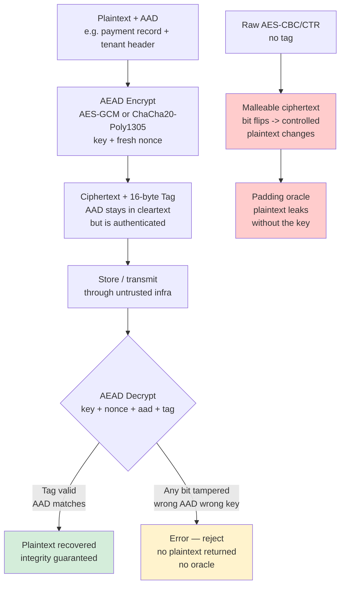
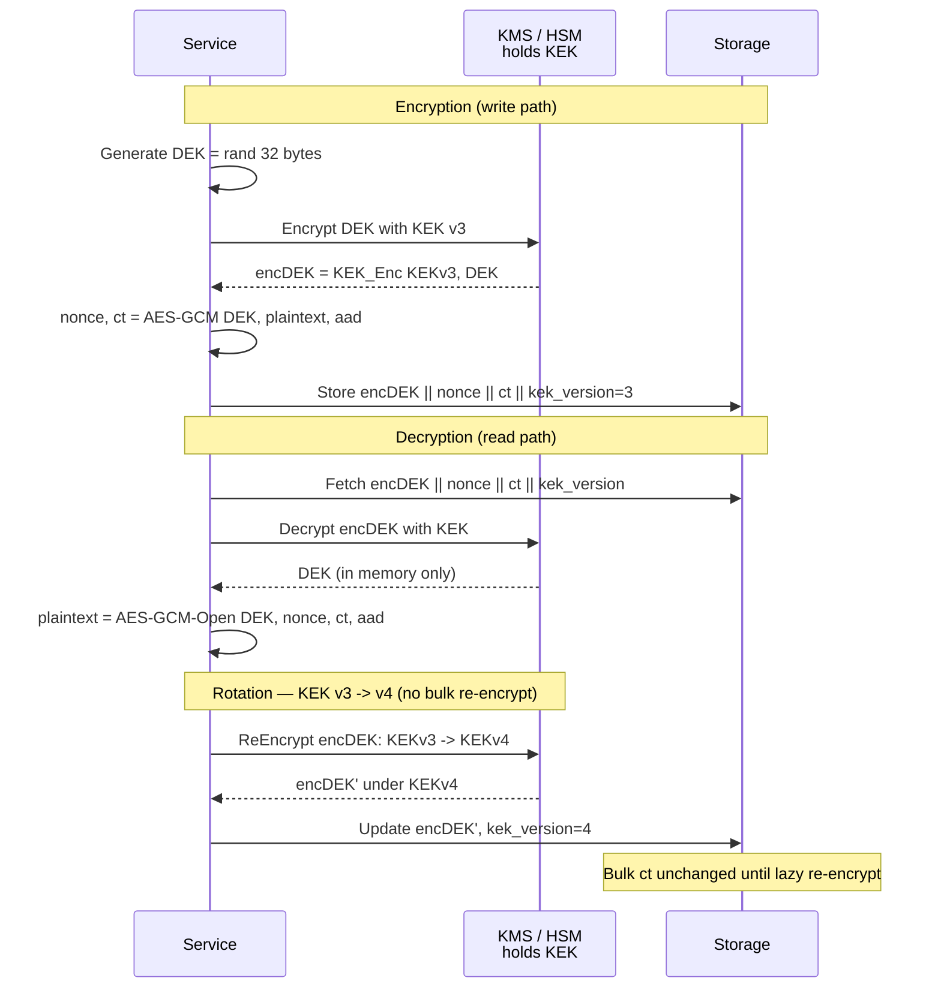
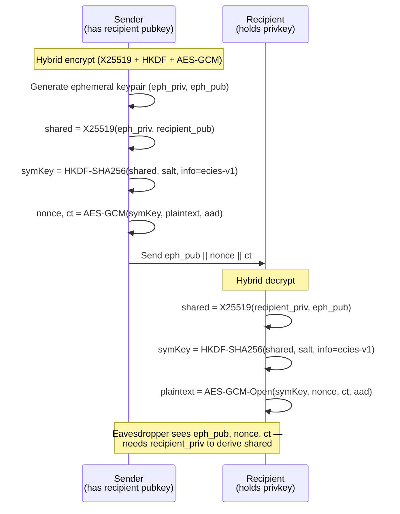
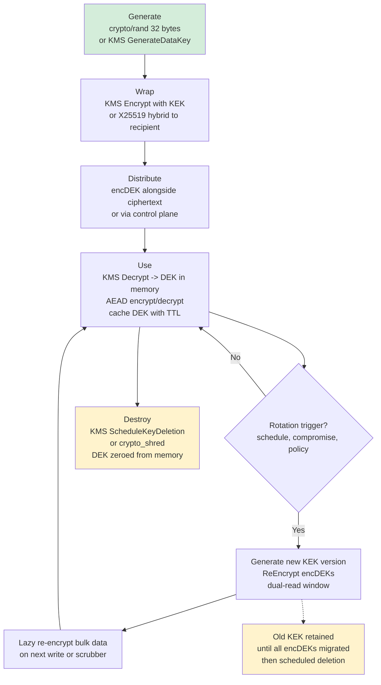
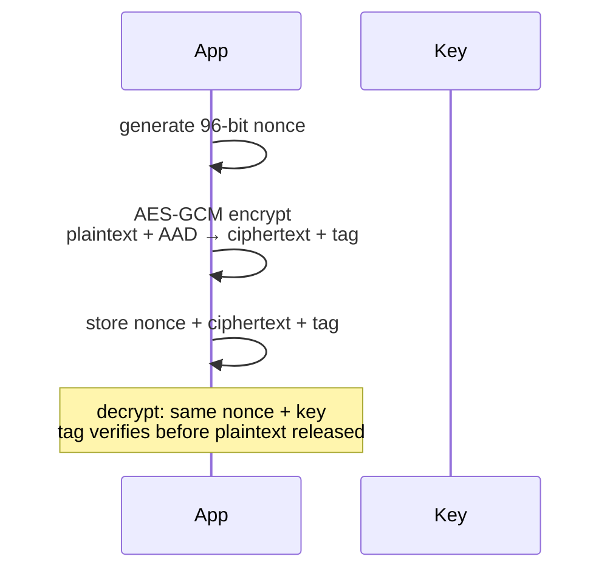
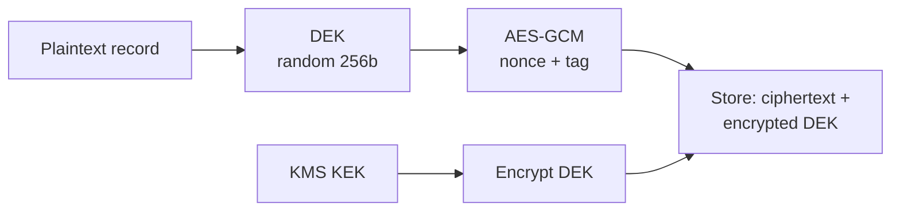
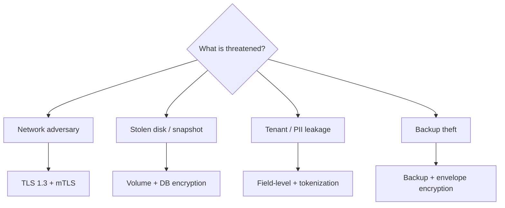

# Chapter 3 — Symmetric and Asymmetric Encryption in Practice

**What this chapter covers.** Chapter 1 gave you the primitive taxonomy and Chapter 2 covered hashing, MACs, and KDFs. This chapter is about the operation that most engineers mean when they say "encryption": turning plaintext into ciphertext that is confidential and tamper-evident, storing or transmitting it through untrusted infrastructure, and recovering it only where the key is available. We treat symmetric encryption (one shared key) and asymmetric encryption (public key encrypts, private key decrypts) as distinct tools with different trust models, performance envelopes, and failure modes, and we show the hybrid construction that every real system uses to get the best of both. Along the way we cover the only safe interface for symmetric encryption — AEAD — and its two instantiations you will actually deploy (AES-GCM and ChaCha20-Poly1305), the nonce discipline that determines whether those AEADs remain safe when many replicas share a key, envelope encryption as the pattern that makes key rotation and KMS integration tractable at fleet scale, and the asymmetric options that remain viable in 2024–2026 (X25519-based ECIES and RSA-OAEP) versus the ones that do not (RSA PKCS#1 v1.5, unauthenticated RSA, textbook ElGamal). Every section includes real Go, OpenSSL, and libsodium code with realistic outputs.

Learning goals — after this chapter you should be able to:

- Use AES-GCM and ChaCha20-Poly1305 (RFC 5116, RFC 8439) correctly via Go `crypto/cipher`, OpenSSL, and libsodium — including nonce generation, AAD binding, and tag verification.
- Explain why unauthenticated modes (AES-CBC, AES-CTR alone) are broken for backend use and why AEAD is the only safe default.
- Reason about nonce reuse consequences quantitatively and choose among random 96-bit, counter, and XChaCha20-Poly1305 (192-bit) strategies for single-process vs distributed encryptors.
- Implement envelope encryption (DEK + KEK) with a KMS, reason about rotation without re-encrypting all data, and explain the blast-radius and latency trade-offs.
- Choose between RSA-OAEP (RFC 8017) and X25519-based hybrid encryption (RFC 7748 + AEAD) for public-key encryption, and explain why RSA PKCS#1 v1.5 must not be used.
- Trace the full lifecycle of an encryption key — generation, distribution, use, rotation, and destruction — in a multi-service, multi-region deployment.
- Identify the boundary between this chapter's at-rest / message-level encryption and Vol 3, Ch 6's transport encryption (TLS 1.3, RFC 8446) and Vol 9, Ch 4's PKI operations.

> **Boundary notes.** This chapter covers *message-level and at-rest encryption* — encrypting fields, files, queue messages, and database rows with keys your services manage. *Transport encryption* — the TLS 1.3 handshake (RFC 8446), record layer, session resumption, and the Web PKI chain that authenticates the peer — is Vol 3, Ch 6. The *operational* side of that PKI — certificate issuance (ACME), rotation, revocation, CT logs, and mTLS deployment — is Vol 9, Ch 4. If you are deciding between "should I encrypt this payload myself" vs "is TLS enough," read this chapter's distributed-systems lens alongside Vol 3, Ch 6.

## The one safe interface: AEAD

An AEAD (Authenticated Encryption with Associated Data, RFC 5116) does two things in one operation: it encrypts the plaintext so only key holders can read it, and it authenticates both the ciphertext and an additional cleartext header (AAD) so any tampering is detected. The API is:

```
(ciphertext, tag) = AEAD.Encrypt(key, nonce, plaintext, aad)
plaintext = AEAD.Decrypt(key, nonce, ciphertext, tag, aad)  // or error
```

If any bit of `ciphertext`, `tag`, `nonce`, or `aad` is modified, `Decrypt` returns an error and no plaintext. There is no "decrypt but the tag was wrong, let me still look at the data" — that path has produced real vulnerabilities (padding oracles, Efail).

The two AEADs to use in new systems:

| AEAD | Spec | Key | Nonce | Tag | Performance | Use when |
|---|---|---|---|---|---|---|
| AES-GCM | NIST SP 800-38D, RFC 5116 | 128/192/256 bits | 96 bits (12 B) | 128 bits | Fast with AES-NI + CLMUL (x86/ARMv8) | Servers, cloud VMs, anywhere hardware AES is available |
| ChaCha20-Poly1305 | RFC 8439 | 256 bits | 96 bits (12 B) | 128 bits | Fast in pure software, constant-time | Mobile, embedded, Wasm, or where AES timing side-channels are a concern |
| XChaCha20-Poly1305 | libsodium / draft-irtf-cfrg-xchacha | 256 bits | 192 bits (24 B) | 128 bits | Same as ChaCha, larger nonce | Distributed encryptors that cannot coordinate nonces |

AES-256-GCM and ChaCha20-Poly1305 provide equivalent security at the 128-bit level — the choice is about hardware and nonce management, not strength.

### Why unauthenticated encryption is broken

AES-CBC and AES-CTR alone provide confidentiality but not integrity. An attacker who can flip bits in the ciphertext produces predictable changes in the plaintext:

- **CBC bit-flipping:** flipping a bit in ciphertext block `Ci` flips the same bit in `Pi+1` after decryption. If the plaintext is JSON like `{"role":"user"}`, flipping bits can change it to `{"role":"admin"}` without knowing the key.
- **CTR malleability:** CTR is a stream cipher — `ciphertext = plaintext xor keystream`. Flipping a ciphertext bit flips the corresponding plaintext bit directly.
- **Padding oracles (Vaudenay, 2002):** CBC with PKCS#7 padding leaks plaintext byte-by-byte when the server returns distinct errors for "bad padding" vs "bad MAC." This class broke TLS 1.0's CBC ciphersuites (Lucky13), XML Encryption, and countless custom protocols.

AEAD eliminates all three by authenticating the ciphertext. If you inherit a system using raw CBC/CTR, the migration is to wrap it in HMAC (encrypt-then-MAC with independent keys and constant-time verification) or — better — replace it with an AEAD.



### AES-GCM and ChaCha20-Poly1305 in Go

```go
package main

import (
    "crypto/aes"
    "crypto/cipher"
    "crypto/rand"
    "encoding/hex"
    "fmt"
    "io"
    "log"

    "golang.org/x/crypto/chacha20poly1305"
)

// --- AES-GCM (server default with AES-NI) ---

func encryptAESGCM(key, plaintext, aad []byte) (nonce, ciphertext []byte) {
    block, err := aes.NewCipher(key) // 16, 24, or 32 bytes; use 32 for AES-256
    if err != nil {
        log.Fatal(err)
    }
    aead, err := cipher.NewGCM(block)
    if err != nil {
        log.Fatal(err)
    }
    nonce = make([]byte, aead.NonceSize()) // 12 bytes
    if _, err := io.ReadFull(rand.Reader, nonce); err != nil {
        log.Fatal(err)
    }
    // Seal appends ciphertext || tag (16 bytes); aad is authenticated but not encrypted
    ciphertext = aead.Seal(nil, nonce, plaintext, aad)
    return
}

func decryptAESGCM(key, nonce, ciphertext, aad []byte) ([]byte, error) {
    block, err := aes.NewCipher(key)
    if err != nil {
        return nil, err
    }
    aead, err := cipher.NewGCM(block)
    if err != nil {
        return nil, err
    }
    return aead.Open(nil, nonce, ciphertext, aad) // error if tag invalid or aad mismatch
}

// --- ChaCha20-Poly1305 (software, constant-time) ---

func encryptChaCha(key, plaintext, aad []byte) (nonce, ciphertext []byte) {
    aead, err := chacha20poly1305.New(key) // 32-byte key
    if err != nil {
        log.Fatal(err)
    }
    nonce = make([]byte, aead.NonceSize()) // 12 bytes
    io.ReadFull(rand.Reader, nonce)
    ciphertext = aead.Seal(nil, nonce, plaintext, aad)
    return
}

// --- XChaCha20-Poly1305 (192-bit nonce — for distributed encryptors) ---

func encryptXChaCha(key, plaintext, aad []byte) (nonce, ciphertext []byte) {
    aead, err := chacha20poly1305.NewX(key) // 32-byte key, 24-byte nonce
    if err != nil {
        log.Fatal(err)
    }
    nonce = make([]byte, aead.NonceSize()) // 24 bytes — safe to generate randomly forever
    io.ReadFull(rand.Reader, nonce)
    ciphertext = aead.Seal(nil, nonce, plaintext, aad)
    return
}

func main() {
    key := make([]byte, 32)
    rand.Read(key)

    plaintext := []byte(`{"amount":100,"to":"alice","id":"txn_8841"}`)
    aad := []byte("tenant=acme:v1") // authenticated, not encrypted — e.g. routing header

    // AES-GCM round-trip
    nonce, ct := encryptAESGCM(key, plaintext, aad)
    fmt.Printf("AES-GCM nonce:  %s (%d bytes)\n", hex.EncodeToString(nonce), len(nonce))
    fmt.Printf("AES-GCM ct+tag: %s (%d bytes, plaintext was %d + 16 tag)\n",
        hex.EncodeToString(ct[:16])+"…", len(ct), len(plaintext))

    recovered, err := decryptAESGCM(key, nonce, ct, aad)
    fmt.Printf("decrypt ok: %v  plaintext: %s\n", err == nil, recovered)

    // Tamper detection — flip one byte
    ct[0] ^= 0x01
    _, err = decryptAESGCM(key, nonce, ct, aad)
    fmt.Printf("after tamper: %v\n", err) // cipher: message authentication failed

    // AAD mismatch — same ciphertext, wrong header
    _, ct2 := encryptChaCha(key, plaintext, aad)
    // (nonce2 distinct — not shown; decrypt with wrong AAD)
    _ = ct2
}
```

Realistic output:

```
AES-GCM nonce:  7f3a9c1e4b2d08f6a1c5e9b3 (12 bytes)
AES-GCM ct+tag: 9c1e4f8a03b2d671… (58 bytes, plaintext was 42 + 16 tag)
decrypt ok: true  plaintext: {"amount":100,"to":"alice","id":"txn_8841"}
after tamper: cipher: message authentication failed
```

```bash
# OpenSSL — AES-GCM for ops debugging (tool-specific format, not wire-interop)
$ KEY=$(openssl rand -hex 32)
$ IV=$(openssl rand -hex 12)
$ echo -n '{"amount":100,"to":"alice"}' | openssl enc -aes-256-gcm \
    -K "$KEY" -iv "$IV" -a
# Output: base64 blob (ciphertext + tag concatenated — OpenSSL CLI appends tag opaquely)
# Prefer Go/libsodium in services; OpenSSL CLI GCM is for manual inspection, not production wire format.

# libsodium sealed box — X25519 + XSalsa20-Poly1305 (C)
#   unsigned char pk[crypto_box_PUBLICKEYBYTES], sk[crypto_box_SECRETKEYBYTES];
#   crypto_box_keypair(pk, sk);
#   crypto_box_seal(ciphertext, message, mlen, pk);  // anonymous sender, no nonce management
```

### Nonce discipline — the one rule that breaks everything

Both AES-GCM and ChaCha20-Poly1305 are broken on nonce reuse with the same key. For GCM, reusing a nonce leaks the authentication key `H` and then the XOR of the two plaintexts. For ChaCha20-Poly1305, it leaks the plaintext XOR directly. There is no "mostly safe" — one reuse is enough.

| Strategy | Nonce size | Safe messages per key | Coordination needed | When to use |
|---|---|---|---|---|
| Random 96-bit (GCM/ChaCha) | 96 bits | ~2^32 (birthday bound at 2^48, NIST SP 800-38D limit) | None | Single-process encryptor, low volume |
| Counter 96-bit | 96 bits | 2^96 (if counter never repeats) | Persistent, crash-safe counter | Single writer with durable counter |
| XChaCha20-Poly1305 random 192-bit | 192 bits | ~2^96 (effectively unlimited) | None | **Distributed encryptors sharing a key** |
| Partitioned: 32-bit replica ID + 64-bit counter | 96 bits | 2^64 per replica | Replica ID assignment | Fleet sharing one key with coordination |

> **Distributed-systems pitfall.** Two replicas sharing an AES-GCM key and generating random 96-bit nonces independently will eventually collide — the birthday bound is ~2^48 messages total across all replicas, which a busy fleet reaches faster than expected. Three safe patterns: (a) give each replica a distinct key via HKDF with replica ID as `info` (Ch 1), (b) use XChaCha20-Poly1305 with 192-bit random nonces, or (c) partition the nonce space. Pattern (b) is simplest for new systems.

> **Nonce strategy for shared keys.** Where replicas cannot coordinate, XChaCha20-Poly1305 with a 192-bit random nonce is safe without coordination. Where per-replica keys are acceptable, derive subkeys via HKDF with the replica ID as `info`. Where a shared key is required, partition the 96-bit nonce space (4-byte replica ID + 8-byte counter). Shared-key random 96-bit nonces without coordination collide near 2^48 messages and leak the authentication key.

## Envelope encryption: the pattern that makes key management tractable

Encrypting every row or file directly with a KMS key is slow (one KMS call per encrypt/decrypt), couples availability to the KMS, and makes rotation expensive (re-encrypt everything). Envelope encryption solves all three:

- **Data Encryption Key (DEK):** a 256-bit random key that encrypts one item (or a small batch). Generated locally via `crypto/rand`.
- **Key-Encrypting Key (KEK):** a long-lived key held in a KMS/HSM (AWS KMS, GCP KMS, Vault Transit, CloudHSM) that encrypts DEKs. Never leaves the KMS.
- **Envelope:** `KEK_Encrypt(DEK) || AEAD_Encrypt(DEK, plaintext)`. Store the encrypted DEK alongside the ciphertext.

Decryption fetches the KEK-encrypted DEK, calls KMS `Decrypt` to recover the DEK, then decrypts locally. Rotation re-encrypts only the DEKs under the new KEK — the bulk ciphertext is untouched until you choose to re-encrypt it.



```go
// Envelope encryption with a KMS-like interface
package envelope

import (
    "crypto/aes"
    "crypto/cipher"
    "crypto/rand"
    "encoding/base64"
    "io"
)

// KMS abstracts AWS KMS, GCP KMS, or Vault Transit
type KMS interface {
    Encrypt(keyID string, plaintext []byte) ([]byte, error)
    Decrypt(ciphertext []byte) ([]byte, error)
}

type Envelope struct {
    EncDEK     string `json:"enc_dek"`     // base64 KMS ciphertext
    Nonce      string `json:"nonce"`       // base64 12-byte nonce
    Ciphertext string `json:"ct"`          // base64 AEAD output (ct + tag)
    KEKVersion string `json:"kek_version"` // for rotation tracking
    AAD        string `json:"aad"`         // authenticated header bound at decrypt
}

func Encrypt(kms KMS, kekID string, plaintext, aad []byte) (*Envelope, error) {
    // 1. Generate DEK locally — never reuse
    dek := make([]byte, 32)
    if _, err := io.ReadFull(rand.Reader, dek); err != nil {
        return nil, err
    }
    // 2. Wrap DEK with KEK in KMS
    encDEK, err := kms.Encrypt(kekID, dek)
    if err != nil {
        return nil, err
    }
    // 3. Encrypt payload with DEK via AES-GCM
    block, _ := aes.NewCipher(dek)
    aead, _ := cipher.NewGCM(block)
    nonce := make([]byte, aead.NonceSize())
    io.ReadFull(rand.Reader, nonce)
    ct := aead.Seal(nil, nonce, plaintext, aad)

    return &Envelope{
        EncDEK:     base64.StdEncoding.EncodeToString(encDEK),
        Nonce:      base64.StdEncoding.EncodeToString(nonce),
        Ciphertext: base64.StdEncoding.EncodeToString(ct),
        KEKVersion: kekID,
        AAD:        string(aad),
    }, nil
}

func Decrypt(kms KMS, env *Envelope) ([]byte, error) {
    encDEK, _ := base64.StdEncoding.DecodeString(env.EncDEK)
    nonce, _ := base64.StdEncoding.DecodeString(env.Nonce)
    ct, _ := base64.StdEncoding.DecodeString(env.Ciphertext)

    dek, err := kms.Decrypt(encDEK)
    if err != nil {
        return nil, err
    }
    block, _ := aes.NewCipher(dek)
    aead, _ := cipher.NewGCM(block)
    return aead.Open(nil, nonce, ct, []byte(env.AAD))
}
```

```bash
# AWS KMS envelope — what the API calls look like from the service
$ aws kms generate-data-key --key-id alias/app-kek --key-spec AES_256 \
    --query '{CiphertextBlob: CiphertextBlob, Plaintext: Plaintext}' --output json | head
# Returns: CiphertextBlob (encDEK for storage) + Plaintext (DEK for immediate use, zero after)

$ aws kms decrypt --ciphertext-blob fileb://encDEK.bin --query Plaintext --output text | base64 -d | od -An -tx1
# Recover DEK for decryption (DEK never persisted in cleartext outside process memory)

# GCP KMS equivalent
$ gcloud kms encrypt --key app-kek --keyring app --location us-central1 \
    --plaintext-file dek.bin --ciphertext-file encDEK.bin
```

**Rotation without downtime** uses the `KEKVersion` field. During a rotation window, readers try the current KEK and fall back to the previous one — the same dual-read pattern as hash agility in Ch 2 and `kid` selection in JWTs (Ch 5). Re-encryption of DEKs is a background job; bulk ciphertext re-encryption is lazy (on next write or via a scrubber). This bounds the blast radius of a compromised KEK to the window before rotation completes.

**DEK caching.** Calling KMS on every row decrypt adds latency (typically 5–20 ms) and cost. Cache unwrapped DEKs in process memory with a TTL (e.g., 5 minutes) and bound the cache size. For high-throughput paths, use a single DEK per batch or per partition rather than per row — the trade-off is larger blast radius per DEK vs fewer KMS calls.


## Envelope encryption in depth: caching, batching, and audit

The envelope pattern's performance hinges on how often you call KMS. Three refinements make it viable at high throughput.

**DEK caching with bounded lifetime.** Unwrap a DEK once and cache it in process memory for a TTL — typically 5 minutes, or until the KEK version changes. The cache key is the `encDEK` ciphertext, not the plaintext DEK, so cache lookups do not expose key material in keys. Bound the cache by entry count (e.g., 1,000 DEKs) and total memory (e.g., 32 KiB of key material) to prevent unbounded growth. On eviction, zero the key bytes explicitly. A background goroutine that refreshes near-expiry DEKs avoids latency spikes on the read path when many entries expire together.

**Batch and partition scoping.** Per-row DEKs maximize blast-radius isolation but multiply KMS calls and envelope metadata. For bulk data — analytics partitions, log segments, backup chunks — a single DEK per partition (e.g., per Kafka partition, per daily Parquet file) amortizes the KMS cost while still limiting exposure to one partition. The envelope is stored once per partition header, not per row, which also reduces storage overhead from 16-byte tags and base64 encoding. Choose per-row DEKs for high-sensitivity fields (PII, payment data) and per-partition DEKs for bulk data where re-encrypting the partition is already the operational unit.

**Audit and compliance.** Every KMS `Encrypt` and `Decrypt` call should emit an audit event with the KEK identifier, caller identity (service account, pod, IAM role), and whether the call succeeded — but not the DEK or plaintext. Cloud KMS providers log this automatically to CloudTrail / Cloud Audit Logs. Alert on anomalous patterns: a sudden spike in `Decrypt` calls suggests bulk exfiltration, while `Decrypt` failures with `AccessDenied` suggest a compromised or misconfigured principal probing keys. For regulated workloads, envelope encryption also satisfies the requirement that data be encrypted with a customer-managed key (CMEK) where the cloud provider never sees the DEK in cleartext outside the KMS boundary — the application holds the DEK only in process memory, and the KMS audit log proves who unwrapped it and when.

## Asymmetric encryption: when the encryptor doesn't hold the secret

Symmetric encryption requires the encryptor and decryptor to share a key. Asymmetric (public-key) encryption removes that requirement: anyone with the public key can encrypt, only the private-key holder can decrypt. This is the right tool when the encryptor is untrusted, external, or otherwise should not hold decryption capability — client-side field encryption, encrypted push to a recipient's inbox, or encrypting backups to a key held offline.

### What to use

| Scheme | Spec | Key size | Ciphertext overhead | Recommendation |
|---|---|---|---|---|
| X25519 + HKDF + AEAD (ECIES) | RFC 7748 + RFC 5869 + RFC 5116 | 32-byte pubkey | 32-byte ephemeral pubkey + 16-byte tag | **Preferred** — small, fast, misuse-resistant |
| libsodium `crypto_box_seal` | libsodium | 32-byte pubkey | 48 bytes overhead | Easiest API — anonymous sender, no nonce mgmt |
| RSA-OAEP (SHA-256) | RFC 8017 | 2048–4096 bits | ~42 bytes (OAEP padding) | Use when RSA is required for interop; 2048-bit minimum, 4096 preferred |
| RSA PKCS#1 v1.5 | RFC 8017 (legacy) | — | — | **Do not use** — Bleichenbacher padding oracle, no integrity |

RSA PKCS#1 v1.5 has been broken since Bleichenbacher (1998) and remains exploitable via side-channels (ROBOT, 2017) against real TLS stacks. OAEP fixes the padding oracle but RSA remains large and slow. For new systems, ECIES over X25519 is smaller, faster, and has no padding oracle class.

### Hybrid encryption — the construction

Asymmetric primitives can only encrypt short messages (key-size minus padding). The standard construction is hybrid: generate an ephemeral symmetric key, encrypt the payload with an AEAD, encrypt the symmetric key to the recipient's public key. This is what TLS 1.3 (RFC 8446), PGP, age, and libsodium all do internally.



```go
import (
    "crypto/aes"
    "crypto/cipher"
    "crypto/ecdh"
    "crypto/rand"
    "crypto/sha256"
    "io"

    "golang.org/x/crypto/hkdf"
)

// HybridEncrypt encrypts to a recipient's X25519 public key.
// Returns ephemeralPub || nonce || ciphertext+tag.
func HybridEncrypt(recipientPub *ecdh.PublicKey, plaintext, aad []byte) ([]byte, error) {
    // 1. Ephemeral keypair
    ephPriv, err := ecdh.X25519().GenerateKey(rand.Reader)
    if err != nil {
        return nil, err
    }
    ephPub := ephPriv.PublicKey()

    // 2. ECDH shared secret
    shared, err := ephPriv.ECDH(recipientPub)
    if err != nil {
        return nil, err
    }
    // 3. HKDF to derive AEAD key — never use raw ECDH output as a key
    hkdfReader := hkdf.New(sha256.New, shared, nil, []byte("vol09-ch03:ecies:v1"))
    symKey := make([]byte, 32)
    io.ReadFull(hkdfReader, symKey)

    // 4. AEAD
    block, _ := aes.NewCipher(symKey)
    aead, _ := cipher.NewGCM(block)
    nonce := make([]byte, aead.NonceSize())
    io.ReadFull(rand.Reader, nonce)
    ct := aead.Seal(nil, nonce, plaintext, aad)

    // Wire format: ephPub(32) || nonce(12) || ct
    out := make([]byte, 0, 32+len(nonce)+len(ct))
    out = append(out, ephPub.Bytes()...)
    out = append(out, nonce...)
    out = append(out, ct...)
    return out, nil
}

func HybridDecrypt(recipientPriv *ecdh.PrivateKey, aad, wire []byte) ([]byte, error) {
    if len(wire) < 32+12+16 {
        return nil, io.ErrUnexpectedEOF
    }
    ephPubBytes := wire[:32]
    nonce := wire[32:44]
    ct := wire[44:]

    ephPub, err := ecdh.X25519().NewPublicKey(ephPubBytes)
    if err != nil {
        return nil, err
    }
    shared, err := recipientPriv.ECDH(ephPub)
    if err != nil {
        return nil, err
    }
    hkdfReader := hkdf.New(sha256.New, shared, nil, []byte("vol09-ch03:ecies:v1"))
    symKey := make([]byte, 32)
    io.ReadFull(hkdfReader, symKey)

    block, _ := aes.NewCipher(symKey)
    aead, _ := cipher.NewGCM(block)
    return aead.Open(nil, nonce, ct, aad)
}
```

```bash
# age — simple hybrid file encryption (X25519 + ChaCha20-Poly1305 + HKDF)
# https://github.com/FiloSottile/age — the modern replacement for PGP for files
$ age-keygen -o age-key.txt
# Public key: age1ql3z7hj5gt80vryuj8phw4t3jhktnlhg20v6e7d0p84htzhqz9vqs2dg4pp
$ age -r age1ql3z7hj5gt80vryuj8phw4t3jhktnlhg20v6e7d0p84htzhqz9vqs2dg4pp secrets.env > secrets.env.age
$ age --decrypt -i age-key.txt secrets.env.age > secrets.env
# Wire: X25519 ephemeral pubkey + ChaCha20-Poly1305 ciphertext — same hybrid pattern as above

# libsodium sealed box (anonymous sender, simplest API)
#   crypto_box_seal(ciphertext, message, mlen, recipient_pk);
#   crypto_box_seal_open(plaintext, ciphertext, clen, recipient_pk, recipient_sk);
```

### RSA-OAEP when you must

Some systems — legacy PKI, HSMs without EC support, or compliance mandates — require RSA. Use OAEP with SHA-256 and MGF1-SHA-256, never PKCS#1 v1.5. In Go:

```go
import (
    "crypto/rand"
    "crypto/rsa"
    "crypto/sha256"
)

func rsaOAEPEncrypt(pub *rsa.PublicKey, plaintext []byte) ([]byte, error) {
    return rsa.EncryptOAEP(sha256.New(), rand.Reader, pub, plaintext, nil)
    // label is nil — include application context if cross-protocol use is possible
}

func rsaOAEPDecrypt(priv *rsa.PrivateKey, ciphertext []byte) ([]byte, error) {
    return rsa.DecryptOAEP(sha256.New(), rand.Reader, priv, ciphertext, nil)
}
```

```bash
# OpenSSL — RSA-OAEP (note: CLI defaults to PKCS#1 v1.5 unless -pkeyopt is set)
$ openssl genpkey -algorithm RSA -pkeyopt rsa_keygen_bits:3072 -out rsa-priv.pem
$ openssl pkey -in rsa-priv.pem -pubout -out rsa-pub.pem

# OAEP with SHA-256 (OpenSSL 3.x)
$ echo -n "DEK: 32 random bytes hex" | openssl pkeyutl -encrypt \
    -inkey rsa-pub.pem -pubin \
    -pkeyopt rsa_padding_mode:oaep \
    -pkeyopt rsa_oaep_md:sha256 -pkeyopt rsa_mgf1_md:sha256 | od -An -tx1 | head
# Output: 384 bytes (3072-bit RSA ciphertext)

# Decrypt
$ openssl pkeyutl -decrypt -inkey rsa-priv.pem \
    -pkeyopt rsa_padding_mode:oaep \
    -pkeyopt rsa_oaep_md:sha256 -pkeyopt rsa_mgf1_md:sha256 \
    -in ciphertext.bin
```

Key sizes: 2048-bit RSA is the current minimum (112-bit security), 3072-bit for 128-bit security per NIST SP 800-57. An X25519 public key at 32 bytes provides the same 128-bit security as 3072-bit RSA — this size difference matters for JWEs, certificate chains, and anywhere keys are transmitted frequently.


## Deterministic, searchable, and format-preserving encryption

AEAD with a random nonce is the default, but it has a property that sometimes hurts: the same plaintext encrypts to a different ciphertext each time, so equality checks, indexing, and sorting on the ciphertext are impossible. Three weaker constructions trade some security for functionality — use them only when the product requirement forces it and document the leakage.

**Deterministic AEAD (SIV mode, RFC 5297).** AES-GCM-SIV and AES-SIV derive the nonce deterministically from the plaintext and key (`nonce = PRF(key, plaintext)`), so equal plaintexts produce equal ciphertexts. This enables equality queries and deduplication without decrypting, but it leaks whether two rows share the same value — an attacker with access to the ciphertext learns frequency. Use deterministic encryption only for low-cardinality fields where frequency leakage is acceptable, and never for high-entropy secrets where equality itself is sensitive. Key separation is critical: a deterministic key must not also be used for randomized encryption.

**Order-preserving and order-revealing encryption (OPE/ORE).** These allow range queries on ciphertext but leak order and, in most constructions, approximate distance. They are weaker than deterministic encryption and have been broken in practice when the adversary has auxiliary data. For backend systems, prefer the alternative: encrypt the field with randomized AEAD and maintain a separate, access-controlled index or searchable tag (e.g., a bucketed range token or a blind index via HMAC with a separate key). The index leaks less than OPE and can be rotated independently.

**Format-preserving encryption (FPE, NIST SP 800-38G, FF3-1).** Preserves the format of the plaintext (e.g., a 16-digit card number encrypts to a 16-digit ciphertext) so legacy systems that validate format do not break. FPE is substantially slower and more complex than AEAD and requires careful domain-size analysis — short domains (e.g., 5-digit ZIP codes) have brute-force risk. Use FPE only at system boundaries where format compatibility is non-negotiable; inside your own services, change the schema to accept the ciphertext format instead.

> **Rule of thumb.** If you can avoid deterministic or searchable encryption by changing the query pattern — decrypt on read, filter in the application layer, or use tokenization — do that. Every searchable construction leaks more than randomized AEAD, and the leakage compounds across columns. Document the leakage model explicitly in your threat model (Ch 11) before adopting any of them.

## Failure modes and incident patterns

**Nonce reuse across restarts.** A service that uses a counter nonce and persists the counter to a file will reuse nonces if the file is lost on crash or if two replicas share the counter file via NFS with stale caching. Prefer XChaCha20-Poly1305 with random 192-bit nonces where persistence is unreliable, or store the counter in a strongly consistent store (ZooKeeper, etcd) with fencing.

**AAD binding failures.** Forgetting to include the tenant ID, record version, or key ID in the AAD lets an attacker transplant a ciphertext from one context to another (a "cut and paste" attack). For example, a payment record encrypted with `aad = "v1"` can be replayed as `aad = "v2"` if the version is not bound, or a row from tenant A can be transplanted to tenant B if the tenant is not in the AAD. Bind every security-relevant header into the AAD and verify it on decrypt — the AAD is the authenticated context.

**Key caching and zeroization.** Unwrapped DEKs cached in process memory for performance must be zeroed when evicted. In Go, `clear(dek)` explicitly zeroes the slice; in languages with GC, pin the key material and overwrite it rather than relying on collection. DEKs must not be logged, included in error messages, or serialized to heap dumps. Audit your error paths: a common leakage is `fmt.Errorf("decrypt failed for key %x: %w", dek, err)` that writes the key to logs.

**Algorithm confusion.** A decryptor that accepts both AES-GCM and ChaCha20-Poly1305 based on a header field controlled by the attacker can be tricked into interpreting a ChaCha ciphertext as AES-GCM, producing predictable plaintext differences before the tag check fails. In practice the tag check still fails, but the error path may leak timing. Prefer a single AEAD per key scope; if agility is required, bind the algorithm choice into the KDF's `info` parameter and into the AAD so the wrong algorithm fails closed.

## Key lifecycle at fleet scale

Encryption is not one key — it is a lifecycle. Every key moves through generation, distribution, use, rotation, and destruction, and each transition is a distributed-systems problem.



**Generation** must use the OS CSPRNG (`crypto/rand`, `randombytes_buf`). Never derive DEKs from passwords, timestamps, or `math/rand`. For envelope encryption, generate DEKs locally — do not call KMS to generate every DEK if latency matters; the KMS call is for wrapping, not generation.

**Distribution** of encrypted DEKs is not secret — they are ciphertext. Store them alongside the data they protect (one envelope per row/file). Distribution of *KEKs* is via the KMS control plane, replicated across regions with the KMS's own consistency guarantees. Do not copy KEK material to application hosts.

**Rotation** has two layers: KEK rotation (re-wrap DEKs, cheap) and DEK rotation (re-encrypt bulk data, expensive). KEK rotation can be frequent (quarterly or on incident); DEK rotation is lazy. Both require a dual-read window where verifiers accept both old and new versions, keyed by `kek_version` or `kid` — the same pattern as Ch 2's hash agility and Ch 5's JWT key rotation.

**Destruction** is where envelope encryption pays off again: deleting the KEK (or scheduling its deletion in KMS with a 7–30 day window) cryptographically shreds all data encrypted under it, without needing to overwrite every storage replica. This is the mechanism behind "right to be forgotten" implementations and secure offboarding. KMS deletion is recoverable within the window — after that, the data is unrecoverable by anyone, including you.

## Performance and hardware

| Operation | Throughput (single core, 2024 x86) | Notes |
|---|---|---|
| AES-256-GCM (AES-NI) | ~4–6 GB/s | Requires AES-NI + CLMUL; falls to ~0.3 GB/s without |
| ChaCha20-Poly1305 (AVX2) | ~2–3 GB/s | No hardware dependency; constant-time |
| X25519 ECDH | ~100k ops/s | ~10 µs per exchange |
| RSA-2048 OAEP encrypt | ~10k ops/s | Public-key op is fast; private-key (decrypt) is ~500 ops/s |
| RSA-3072 OAEP decrypt | ~200 ops/s | Private-key op dominates; use for low-rate paths only |
| Argon2id (64 MiB, t=3) | ~2 ops/s/core | Intentionally slow — not comparable to bulk encryption |

For bulk data paths (storage, replication, backups), AES-GCM with AES-NI is the throughput winner. For per-message encryption on heterogeneous fleets (mobile clients, edge workers, Wasm), ChaCha20-Poly1305 avoids the "does this host have AES-NI?" question. For key exchange at connection setup, X25519 is fast enough to do per-connection ephemeral exchange — which is exactly what TLS 1.3 (RFC 8446) and Noise do for forward secrecy.

## Distributed-systems lens

Encryption at the single-service level is a library call. Encryption across a fleet is a coordination, availability, and blast-radius problem.

**KMS as a dependency.** Envelope encryption makes the KMS a read-path dependency for cold DEKs (those not in cache). Design for KMS unavailability: cache unwrapped DEKs with a TTL, serve reads from cache when KMS is down, and alert on KMS error rates rather than failing open. For critical paths, consider multi-region KMS replication (AWS multi-region keys, GCP global KMS) so a regional KMS outage does not halt decryption fleet-wide.

**Consistency of key versions.** A rolling deploy that introduces a new KEK version while old replicas still encrypt with the previous version is safe *only* if decryptors accept both versions. Deploy decryptors first (dual-read), then switch encryptors, then deprecate the old KEK — the same expand-contract pattern as schema migrations (Vol 5, Ch 14). Reversing the order causes decrypt failures on mixed-version fleets.

**Blast radius.** One KEK wrapping many DEKs means one KEK compromise exposes many items. Scope KEKs by service, environment, and sensitivity tier — `kek/payments/prod`, `kek/analytics/staging` — so compromise of one tier does not affect another. Within a tier, scope DEKs narrowly (per-row or per-file for sensitive data, per-partition for bulk data) to limit how much a single DEK compromise exposes.

**Forward secrecy for stored data.** Unlike transport encryption where ephemeral keys provide forward secrecy directly (EC-DHE in TLS 1.3), stored data has no session to make ephemeral. The closest approximation is prompt DEK rotation and re-encryption after KEK compromise, plus short DEK lifetimes for high-sensitivity data. For messaging (Vol 10), per-message DEKs with prompt deletion after delivery approximate forward secrecy more closely.

**When not to encrypt at the application layer.** If TLS (Vol 3, Ch 6) already protects data in transit and your storage layer provides at-rest encryption (EBS, GCS, database TDE), application-layer field encryption adds defense-in-depth but also complexity, key-management overhead, and query limitations (encrypted fields cannot be indexed or filtered without special constructions like deterministic or order-preserving encryption, both of which weaken security). Encrypt at the application layer when: the storage layer is untrusted or shared, the data must remain opaque to operators/DBAs, or regulatory scope requires it (e.g., PCI DSS cardholder data, HIPAA PHI). Otherwise, transport + storage-layer encryption may be sufficient — see Ch 4 for the decision framework.


#### AES-GCM Encrypt and Decrypt



#### KMS Envelope for At-Rest



#### Encryption Scope Decision



## Key takeaways

- AEAD (RFC 5116) is the only safe symmetric-encryption interface — it binds confidentiality and integrity with a 16-byte tag and fails closed on any tampering. Use AES-GCM where AES-NI is available and ChaCha20-Poly1305 (RFC 8439) elsewhere; both provide 128-bit security.
- Unauthenticated modes (AES-CBC, CTR alone) are broken for backend use — they are malleable and vulnerable to padding oracles. Migrate to AEAD; if you must compose manually, use encrypt-then-MAC with independent keys and constant-time verification, but prefer AEAD.
- Nonce reuse with the same key is catastrophic for both AES-GCM and ChaCha20-Poly1305. For distributed encryptors sharing a key, use XChaCha20-Poly1305 (192-bit random nonce), per-replica HKDF subkeys, or partitioned nonce spaces — never shared-key random 96-bit nonces without coordination.
- Envelope encryption (random DEK per item + KMS-held KEK) decouples bulk-encryption performance from KMS calls, enables cheap KEK rotation without bulk re-encrypt, and supports cryptographic shredding on deletion. Cache unwrapped DEKs with a TTL and scope KEKs by service/tier.
- For asymmetric encryption, prefer X25519-based hybrid encryption (RFC 7748 + HKDF + AEAD) or libsodium `crypto_box_seal` — small keys, fast, no padding oracle. Use RSA-OAEP (RFC 8017) only for interop; never RSA PKCS#1 v1.5 (Bleichenbacher/ROBOT). Raw ECDH output is not a key — always HKDF it.
- Key lifecycle — generation via `crypto/rand`, wrapping, distribution alongside ciphertext, dual-read rotation, and scheduled destruction — is a distributed coordination problem. Every encrypted value should carry a key version (`kek_version`, `kid`) for agility, and rotation must follow an expand-contract deploy order (decryptors first, then encryptors).

## Further reading

- **Standards:** RFC 5116 (AEAD), RFC 5869 (HKDF), RFC 7748 (X25519/X448), RFC 8032 (Ed25519), RFC 8439 (ChaCha20-Poly1305), RFC 9106 (Argon2), RFC 8446 (TLS 1.3), RFC 8017 (RSA PKCS#1 / OAEP), NIST SP 800-38D (GCM), NIST SP 800-57 (Key Management), FIPS 180-4 (SHA-2), FIPS 202 (SHA-3).
- Ferguson, Schneier, Kohno — *Cryptography Engineering* (Wiley, 2010) — AEAD, nonce management, and key lifecycle at practitioner depth.
- Latacora — *Cryptographic Right Answers* (https://latacora.micro.blog/2018/04/03/cryptographic-right-answers.html) — opinionated primitive choices, regularly updated.
- libsodium documentation — https://doc.libsodium.org/ — sealed boxes, XChaCha20-Poly1305, and correct-by-default APIs.
- age specification — https://github.com/C2SP/C2SP/blob/main/age.md — a clean, modern hybrid file-encryption design (X25519 + ChaCha20-Poly1305 + HKDF) worth reading as a reference construction.
- Go `crypto/*` and `golang.org/x/crypto` docs — https://pkg.go.dev/crypto — authoritative for service implementations.
- AWS KMS / GCP KMS envelope encryption docs — https://docs.aws.amazon.com/kms/latest/developerguide/concepts.html — operational patterns for KEK/DEK at cloud scale.
