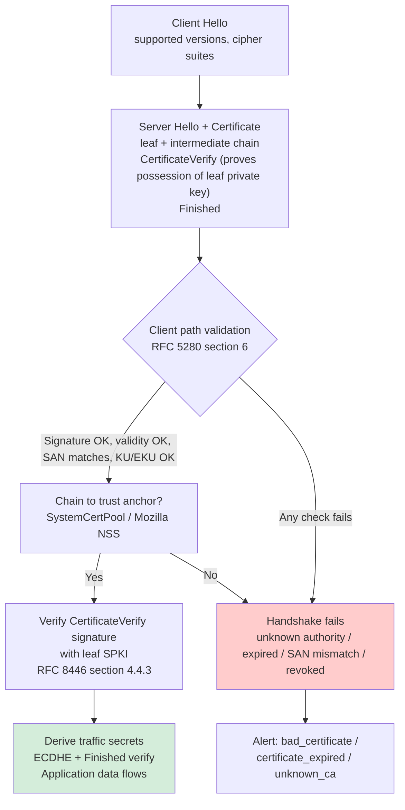
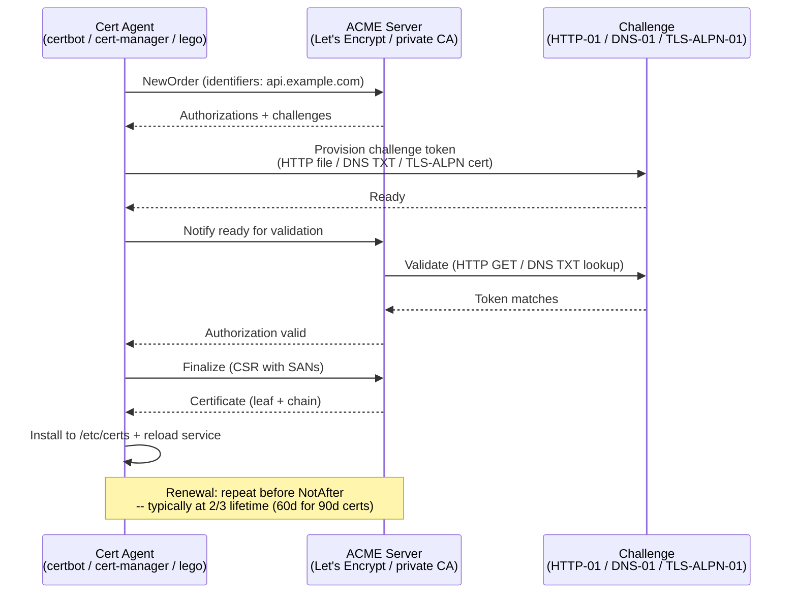
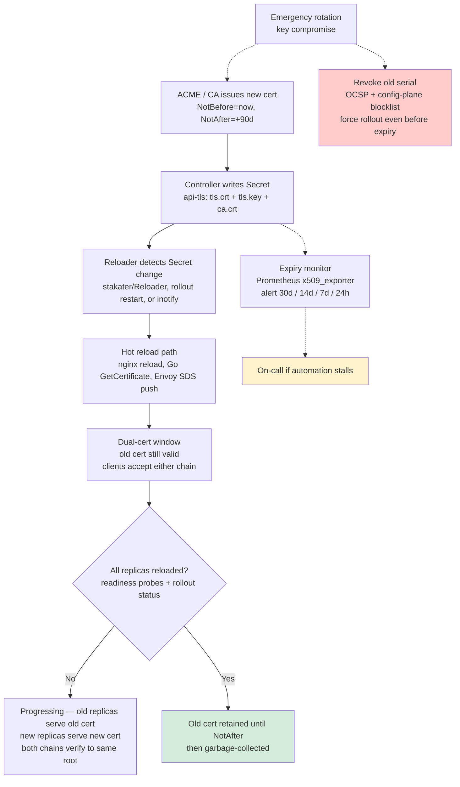
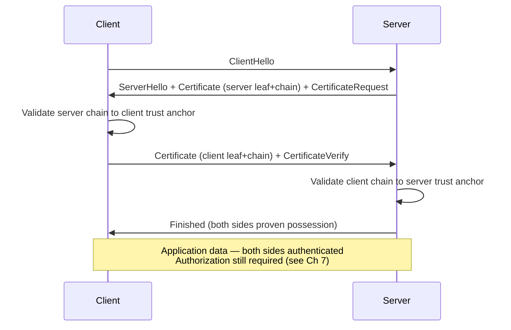

# Chapter 4 — Certificates, PKI, and TLS Operations

**What this chapter covers.** TLS protects every byte your backend sends — between users and edge, between services, between services and databases. But TLS without a working public-key infrastructure is just expensive math. This chapter is the operational companion to Volume 3, Chapter 6: where Vol 3 describes the TLS 1.3 wire protocol (handshake, record layer, 0-RTT per RFC 8446) and the cryptographic guarantees it provides, this chapter describes how certificates are issued, chained, verified, revoked, and rotated at scale — the system that makes TLS usable and, when neglected, the most common cause of production outages. We build a CA from scratch with OpenSSL, automate issuance through ACME and cert-manager, configure TLS termination correctly, and design rotation strategies that do not require a fleet-wide restart at 3 a.m.

Learning goals — after this chapter you should be able to:

- Parse an X.509 certificate (RFC 5280): distinguish Subject, Issuer, SAN, Key Usage, Extended Key Usage, Basic Constraints, and Authority/Key Identifier extensions, and explain why the legacy Common Name (CN) is insufficient.
- Build and verify a chain from leaf through intermediate to root, explain why every production PKI uses at least one intermediate, and describe how path validation and name constraints work.
- Create a private CA hierarchy with OpenSSL: generate a root, an intermediate, CSRs, and signed leaf certificates with SANs — and verify the chain with `openssl verify`.
- Operate revocation (CRL, OCSP per RFC 6960, OCSP stapling per RFC 6961, and short-lived certificates) and explain why revocation is the least reliable part of the Web PKI and how to design around it.
- Configure a TLS server (nginx, Go `tls.Config`, Envoy) with safe defaults: TLS 1.2 floor, correct cipher ordering, ALPN, OCSP stapling, and session ticket hygiene.
- Design certificate rotation at fleet scale — automated issuance via ACME/cert-manager, hot reload without connection drops, dual-certificate deploys, expiry monitoring, and emergency rotation after compromise — and explain why short-lived certificates (hours, not months) are the modern direction.
- Diagnose the most common PKI failures: expiry, incomplete chains, clock skew, intermediate rotation, and private-key leakage.

> **Boundary notes.** The TLS *wire protocol* — handshake state machine, record framing, cipher suites, key exchange (ECDHE), 0-RTT, and session resumption per RFC 8446 — is covered in **Vol 3, Ch 6**. Read that for what happens on the wire between two peers. This chapter covers the *operational PKI* around that protocol: certificate lifecycle, chain-of-trust management, automation, and deployment. The *intra-service* mutual-TLS (mTLS) control plane — SPIFFE/SPIRE, workload identity, and zero-trust service mesh — is covered in **Ch 10**; this chapter introduces mTLS as a server-TLS extension and leaves identity federation to Ch 10. For supply-chain signing PKI (Fulcio, Sigstore) see Companion Book 5, Ch 3.

## X.509 in one page

An X.509 v3 certificate (RFC 5280) is a signed binding between a public key and an identity. It contains:

- **Subject** and **Issuer** distinguished names (DNs). For a leaf, Subject is the entity (e.g., `CN=api.example.com` — legacy) and Issuer is the CA that signed it. For a root, they are identical (self-signed).
- **Subject Public Key Info (SPKI)** — the public key (RSA-2048+, ECDSA P-256/P-384, or Ed25519) and its algorithm identifier.
- **Validity** — `NotBefore` / `NotAfter` (UTCTime or GeneralizedTime). Every TLS implementation rejects certificates outside this window; clock skew is a real failure mode.
- **Serial number** — unique per CA, used for revocation lookups.
- **Extensions** (the part that actually matters for verification):
  - **Subject Alternative Name (SAN)** — the set of DNS names, IP addresses, URIs, or wildcards the cert is valid for. Since RFC 6125 and CA/Browser Forum Baseline Requirements, clients validate SAN, not CN. Every leaf must have a SAN containing every name it serves. A `CN`-only certificate is rejected by modern browsers and Go's `crypto/tls`.
  - **Basic Constraints** — `CA:TRUE/FALSE` plus `pathLenConstraint`. A leaf must be `CA:FALSE`; violating this has caused real CA mis-issuance incidents.
  - **Key Usage (KU)** and **Extended Key Usage (EKU)** — KU declares what operations the key may be used for (`digitalSignature`, `keyEncipherment` for RSA, `keyAgreement` for ECDH); EKU declares the *purpose* (`serverAuth`, `clientAuth`, `codeSigning`, `OCSPSigning`). A cert with `EKU=serverAuth` must not be accepted for client authentication.
  - **Authority Key Identifier (AKI)** and **Subject Key Identifier (SKI)** — hash of the issuer/subject public key, used to build the chain unambiguously when a leaf could chain to multiple intermediates with the same DN.
  - **Authority Information Access (AIA)** — URL of the issuer's certificate and OCSP responder.
  - **CRL Distribution Points (CRLDP)** — where to fetch the revocation list.
  - **Subject Information Access / Certificate Transparency** is carried via the `ct_precert_scts` extension (RFC 6962) on precertificates.

```bash
# Inspect any certificate you are given — memorize this incantation
$ openssl x509 -in leaf.pem -noout -text | head -n 80
Certificate:
    Data:
        Version: 3 (0x2)
        Serial Number:
            04:8e:3a:7b:91:c2:00:1f:44:d3:9a:11:b7:06:aa:2e
        Signature Algorithm: ecdsa-with-SHA384
        Issuer: C=US, O=Example Corp Intermediate CA, CN=Example Intermediate G1
        Validity
            Not Before: Aug 20 00:00:00 2026 GMT
            Not After : Nov 18 23:59:59 2026 GMT
        Subject: C=US, O=Example Corp, CN=api.example.com
        Subject Public Key Info:
            Public Key Algorithm: id-ecPublicKey
                Public-Key: (256 bit)
                pub:
                    04:a1:...:9f
                ASN1 OID: prime256v1
                NIST CURVE: P-256
        X509v3 extensions:
            X509v3 Basic Constraints: critical, CA:FALSE
            X509v3 Key Usage: critical, Digital Signature
            X509v3 Extended Key Usage: TLS Web Server Authentication
            X509v3 Subject Alternative Name: critical,
                DNS:api.example.com, DNS:api.internal.example.com
            X509v3 Authority Key Identifier: keyid:8F:2A:....
            X509v3 Subject Key Identifier: 3C:91:....
            Authority Information Access:
                CA Issuers - URI:http://aia.example.com/intermediate.crt
                OCSP - URI:http://ocsp.example.com
```

If you cannot read the output above and spot a missing SAN, a `CA:TRUE` leaf, or an expired `NotAfter`, you cannot review a TLS deployment. Practice on real certificates until you can.

## How chains and trust work

No client ships every leaf certificate. Clients ship a **trust store** — a set of self-signed root certificates deemed trustworthy (Mozilla NSS, Apple, Microsoft, Go's `x509.SystemCertPool()` backed by the OS). A leaf is trusted if a chain can be built from the leaf through zero or more intermediates to a root in the trust store, and *every* signature and constraint in the chain validates.

```
Root CA (self-signed, in trust store)
  └─ Intermediate CA (signed by Root, CA:TRUE, pathLen 0 or 1)
       └─ Leaf (signed by Intermediate, CA:FALSE, SAN=api.example.com)
```

Why an intermediate exists at all: the **root private key is the most sensitive material in the PKI**. It is kept offline in an HSM or air-gapped host, often under a quorum ceremony (two or more custodians present). Issuing directly from the root would require bringing the root key online for every certificate — unacceptable risk. Instead the root signs a small number of intermediates, the intermediates (online, in HSMs in data centers) sign leaves, and if an intermediate key is compromised, the root can revoke it and issue a new intermediate without replacing the trust anchor on every client. This is the same reason KMS hierarchies use a root KEK to wrap data KEKs (Ch 3) — compartmentalization of the blast radius.

**Path validation** (RFC 5280 §6) checks, for the full chain:

1. Each certificate's signature verifies with the issuer's public key.
2. Each certificate is within its validity window (requires correct clocks).
3. `BasicConstraints` and `KeyUsage` are satisfied at each level (a leaf cannot act as a CA; an intermediate with `pathLenConstraint=0` cannot issue a subordinate CA).
4. Name constraints, if present on an intermediate, are satisfied (e.g., an intermediate constrained to `permitted;DNS:.example.com` cannot issue for `evil.com`).
5. Revocation status is checked (CRL/OCSP — see below).
6. The chain terminates at a trust anchor.

Most verification failures at 02:00 UTC are item 6: the server sent an incomplete chain (leaf without intermediate), the client has no path to a trust anchor, and the error surfaces as `x509: certificate signed by unknown authority` (Go) or `ERR_CERT_AUTHORITY_INVALID` (Chrome). Servers must send the full chain minus the root — `leaf + intermediate` concatenated — not just the leaf. Clients must not need to fetch intermediates via AIA chasing in the hot path; if they do, the first connection before the fetch fails.



## Building a CA hierarchy with OpenSSL

Theory is not enough — you should build a chain once so the abstractions become concrete. What follows is a minimal, correct hierarchy. For production, replace file-based keys with an HSM (YubiHSM, AWS CloudHSM) and OpenSSL's `engine` or `provider` interface, but the certificate logic is identical.

> **Version pins.** OpenSSL 3.0+ (current stable 3.3/3.4). Flags shown are stable across 3.0–3.4. Go `crypto/x509` behavior notes reference Go 1.22+.

```bash
#!/usr/bin/env bash
set -euo pipefail
mkdir -p pki/{root,intermediate,leaf} && cd pki

# ── 1. Root CA: 4096-bit RSA, self-signed, 10-year lifetime, offline in reality ─
openssl genpkey -algorithm RSA -pkeyopt rsa_keygen_bits:4096 -out root/root-ca.key
chmod 400 root/root-ca.key

cat > root/root-ca.cnf <<'CNF'
[ req ]
distinguished_name = dn
x509_extensions    = v3_ca
prompt             = no
[ dn ]
C  = US
O  = Example Corp Root CA
CN = Example Root G1
[ v3_ca ]
basicConstraints       = critical, CA:TRUE, pathlen:1
keyUsage               = critical, keyCertSign, cRLSign
subjectKeyIdentifier   = hash
authorityKeyIdentifier = keyid:always,issuer
CNF

openssl req -x509 -new -nodes \
  -key root/root-ca.key -sha384 -days 3650 \
  -config root/root-ca.cnf -extensions v3_ca \
  -out root/root-ca.crt

# ── 2. Intermediate CA: ECDSA P-256, CSR signed by root ──────────────
openssl ecparam -genkey -name prime256v1 -noout -out intermediate/intermediate.key
chmod 400 intermediate/intermediate.key

cat > intermediate/intermediate-csr.cnf <<'CNF'
[ req ]
distinguished_name = dn
prompt             = no
[ dn ]
C  = US
O  = Example Corp Intermediate CA
CN = Example Intermediate G1
CNF

openssl req -new -key intermediate/intermediate.key \
  -config intermediate/intermediate-csr.cnf -out intermediate/intermediate.csr

cat > intermediate/intermediate-ext.cnf <<'CNF'
basicConstraints       = critical, CA:TRUE, pathlen:0
keyUsage               = critical, keyCertSign, cRLSign
extendedKeyUsage       = serverAuth, clientAuth
subjectKeyIdentifier   = hash
authorityKeyIdentifier = keyid:always,issuer
crlDistributionPoints  = URI:http://crl.example.com/root.crl
authorityInfoAccess    = caIssuers;URI:http://aia.example.com/root.crt, OCSP;URI:http://ocsp.example.com
CNF

openssl x509 -req -in intermediate/intermediate.csr \
  -CA root/root-ca.crt -CAkey root/root-ca.key -CAcreateserial \
  -sha384 -days 1825 -extfile intermediate/intermediate-ext.cnf \
  -out intermediate/intermediate.crt

# ── 3. Leaf: ECDSA P-256, SAN is mandatory ────────────────────────────
openssl ecparam -genkey -name prime256v1 -noout -out leaf/leaf.key
chmod 400 leaf/leaf.key

cat > leaf/leaf-csr.cnf <<'CNF'
[ req ]
distinguished_name = dn
req_extensions     = v3_req
prompt             = no
[ dn ]
C  = US
O  = Example Corp
CN = api.example.com
[ v3_req ]
subjectAltName = @alt_names
[ alt_names ]
DNS.1 = api.example.com
DNS.2 = api.internal.example.com
CNF

openssl req -new -key leaf/leaf.key \
  -config leaf/leaf-csr.cnf -out leaf/leaf.csr

cat > leaf/leaf-ext.cnf <<'CNF'
basicConstraints       = critical, CA:FALSE
keyUsage               = critical, digitalSignature
extendedKeyUsage       = serverAuth
subjectAltName         = @alt_names
subjectKeyIdentifier   = hash
authorityKeyIdentifier = keyid,issuer
crlDistributionPoints  = URI:http://crl.example.com/intermediate.crl
authorityInfoAccess    = caIssuers;URI:http://aia.example.com/intermediate.crt, OCSP;URI:http://ocsp.example.com
[ alt_names ]
DNS.1 = api.example.com
DNS.2 = api.internal.example.com
CNF

openssl x509 -req -in leaf/leaf.csr \
  -CA intermediate/intermediate.crt -CAkey intermediate/intermediate.key -CAcreateserial \
  -sha256 -days 90 -extfile leaf/leaf-ext.cnf \
  -out leaf/leaf.crt

# ── 4. Verify — the command that should be in your CI pipeline ──────
echo "=== Verify leaf against root (via intermediate) ==="
openssl verify -CAfile root/root-ca.crt -untrusted intermediate/intermediate.crt leaf/leaf.crt
# Expected: leaf/leaf.crt: OK

echo "=== Full chain file for servers (leaf + intermediate, NOT root) ==="
cat leaf/leaf.crt intermediate/intermediate.crt > leaf/fullchain.pem

echo "=== TLS test with s_server / s_client ==="
# In one terminal: openssl s_server -cert leaf/fullchain.pem -key leaf/leaf.key -www -port 8443
# In another:       openssl s_client -connect localhost:8443 -CAfile root/root-ca.crt -servername api.example.com
```

**What to test in CI:** every certificate your pipeline produces should pass `openssl verify -CAfile root.crt -untrusted intermediate.crt leaf.crt` and a SAN check (`openssl x509 -noout -ext subjectAltName`). If either fails, the build fails — do not let an unverifiable certificate reach staging.

**Private keys** are the crown jewels. `chmod 400` is the minimum; in production they live in an HSM and never touch disk. If a private key is ever written to a log, a heap dump, an error message, or a world-readable file, treat it as compromised and rotate immediately — there is no way to prove it was not exfiltrated. This is the same discipline as Ch 3's KMS hygiene.

## Revocation: the hard part

Issuance is the easy half of PKI. Revocation — telling the world that a previously valid certificate is no longer trustworthy because its key was compromised or its identity is no longer valid — is where the Web PKI is weakest.

| Mechanism | How it works | Failure mode |
|---|---|---|
| **CRL** (Certificate Revocation List, RFC 5280) | CA periodically publishes a signed list of revoked serial numbers. Clients fetch and cache it. | CRLs grow without bound; fetches are slow, cached, and often skipped. Many clients soft-fail (accept the cert if the CRL cannot be fetched). |
| **OCSP** (RFC 6960) | Client queries the CA's OCSP responder in real time: is serial X revoked? | Adds a blocking network round-trip to every handshake; responder must be highly available; privacy leak (CA learns which sites you visit); soft-fail again dominates. |
| **OCSP stapling** (RFC 6961, `status_request` / `status_request_v2`) | Server periodically fetches a signed OCSP response from the CA and staples it to the handshake. Client verifies the staple instead of calling the CA. | Requires server configuration and periodic refresh (response is valid 24–72 h); if the staple is missing, clients still soft-fail unless `Must-Staple` is set. |
| **Must-Staple** (RFC 7633, `1.3.6.1.5.5.7.1.24`) | Leaf extension telling clients to hard-fail if no valid staple is present. | Opt-in per certificate; if the server misconfigures stapling, the site becomes unreachable — high operational cost, low adoption. |
| **CRLite / OneCRL / CRLSets** | Browser vendors aggregate revocations centrally and push compact filters to browsers. | Covers only the browser ecosystem; not available to backend service-to-service verification. |
| **Short-lived certificates** | Validity of hours to days instead of months; expiry *is* revocation. | Requires robust automation; clock skew becomes the dominant failure. Let's Encrypt's move toward 6-day certs and ACME renewals is this direction. |

The practical consequence: **revocation is unreliable for immediate containment**. If a leaf key is compromised, revoking the cert and hoping clients check is not a containment plan. The real containment is rotating the key and certificate, and — for high-value keys — rotating the intermediate. For backend services, add an explicit blocklist (revoked serials / SPKI hashes) distributed through your config plane or service mesh control plane, checked on every connection; this gives you hard-fail revocation with your own availability properties instead of depending on the Web PKI's soft-fail semantics.

## Configuring TLS termination

### nginx (1.25+, OpenSSL 3.x)

```nginx
# /etc/nginx/conf.d/tls.conf
server {
    listen 443 ssl;
    server_name api.example.com;

    # Leaf + intermediate concatenated; key never world-readable
    ssl_certificate     /etc/nginx/certs/fullchain.pem;
    ssl_certificate_key /etc/nginx/certs/leaf.key;

    # Protocol floor: TLS 1.2 minimum, prefer 1.3. Disable 1.0/1.1.
    ssl_protocols TLSv1.2 TLSv1.3;

    # TLS 1.2 cipher suite: ECDHE + AEAD + PFS only. No CBC, no RC4, no SHA-1.
    # Order matters when ssl_prefer_server_ciphers is on.
    ssl_ciphers ECDHE-ECDSA-AES128-GCM-SHA256:ECDHE-ECDSA-AES256-GCM-SHA384:
                ECDHE-ECDSA-CHACHA20-POLY1305:ECDHE-RSA-AES128-GCM-SHA256:
                ECDHE-RSA-AES256-GCM-SHA384:ECDHE-RSA-CHACHA20-POLY1305;
    ssl_prefer_server_ciphers on;

    # TLS 1.3 ciphers are negotiated separately (no cipher config needed;
    # Go/OpenSSL choose TLS_AES_128_GCM_SHA256, TLS_AES_256_GCM_SHA384,
    # TLS_CHACHA20_POLY1305_SHA256 automatically)

    # ALPN for HTTP/2 and future HTTP/3 — must match Vol 3 Ch 7
    # nginx negotiates h2/http/1.1 via ALPN with the client.

    # OCSP stapling — nginx fetches and staples on behalf of clients
    ssl_stapling on;
    ssl_stapling_verify on;
    ssl_trusted_certificate /etc/nginx/certs/intermediate.crt;
    resolver 1.1.1.1 valid=300s;
    resolver_timeout 5s;

    # Session tickets: rotate keys, or disable and use session IDs with shared cache
    # For 0-RTT (Vol 3 Ch 6) do NOT enable without replay-safe design; prefer to leave off
    # for sensitive APIs. If needed: ssl_session_tickets on with external ticket key rotation.

    ssl_session_cache shared:SSL:50m;
    ssl_session_timeout 4h;

    # HSTS — after verifying TLS is correct, add preload
    add_header Strict-Transport-Security "max-age=63072000; includeSubDomains; preload" always;

    location / { proxy_pass http://upstream; }
}
```

### Go `crypto/tls` (Go 1.22+, `crypto/tls` Config)

Go negotiates TLS 1.3 by default and does not expose TLS 1.3 cipher suite configuration — the right default. Hardening is about floors, verification, and hot reload:

```go
package main

import (
    "crypto/tls"
    "crypto/x509"
    "log"
    "net/http"
    "os"
    "time"
)

func tlsConfig(certFile, keyFile, caFile string) *tls.Config {
    // System roots + private CA for internal PKI
    pool, err := x509.SystemCertPool()
    if err != nil {
        log.Fatal(err)
    }
    if caFile != "" {
        pem, err := os.ReadFile(caFile)
        if err != nil {
            log.Fatal(err)
        }
        if !pool.AppendCertsFromPEM(pem) {
            log.Fatal("failed to append private CA")
        }
    }

    // Load leaf + chain. Go's LoadX509KeyPair handles leaf+intermediate bundles
    // if fullchain.pem is leaf followed by intermediate.
    cert, err := tls.LoadX509KeyPair(certFile, keyFile)
    if err != nil {
        log.Fatal(err)
    }

    return &tls.Config{
        Certificates: []tls.Certificate{cert},

        // Enforce TLS 1.2 floor. TLS 1.3 is preferred automatically when both sides support it.
        MinVersion: tls.VersionTLS12,

        // Curve preferences — X25519 first, then P-256. RSA key exchange is not offered in TLS 1.3.
        CurvePreferences: []tls.CurveID{tls.X25519, tls.CurveP256},

        // Root pool for outbound verification (client side) and for mTLS client-cert verification.
        RootCAs: pool,

        // OCSP stapling and SCTs are handled by the server automatically if the cert contains them.

        // Session Tickets: disable at the server if you do not need resumption,
        // or rotate SessionTicketKey externally. Never leave a static ticket key in source.
        // SessionTicketsDisabled: false, // enable only with managed rotation
    }
}

func main() {
    cfg := tlsConfig("/etc/certs/fullchain.pem", "/etc/certs/leaf.key", "/etc/certs/root.crt")

    srv := &http.Server{
        Addr:              ":8443",
        TLSConfig:         cfg,
        ReadHeaderTimeout: 5 * time.Second,
        IdleTimeout:       120 * time.Second,
    }

    // Hot reload: watch cert files and swap TLSConfig atomically via GetCertificate.
    // See "Rotation at fleet scale" below for the GetCertificate pattern.
    log.Fatal(srv.ListenAndServeTLS("", "")) // certs already in TLSConfig
}

// Hot-reload pattern — prefer GetCertificate over static Certificates for long-lived processes.
func reloadingCert(certFile, keyFile string) func(*tls.ClientHelloInfo) (*tls.Certificate, error) {
    return func(*tls.ClientHelloInfo) (*tls.Certificate, error) {
        cert, err := tls.LoadX509KeyPair(certFile, keyFile)
        if err != nil {
            return nil, err
        }
        return &cert, nil
    }
}
// Usage: cfg.GetCertificate = reloadingCert("/etc/certs/fullchain.pem", "/etc/certs/leaf.key")
```

### Envoy (1.29+) — typical for service-mesh sidecars

Envoy validates TLS via SDS (Secret Discovery Service) so certificates can be rotated without restarting the proxy:

```yaml
# envoy.yaml — transport socket with SDS-backed rotation
transport_sockets:
- name: envoy.transport_sockets.tls
  typed_config:
    "@type": type.googleapis.com/envoy.extensions.transport_sockets.tls.v3.DownstreamTlsContext
    common_tls_context:
      tls_certificate_sds_secret_configs:
      - name: "leaf-and-chain"
        sds_config:
          resource_api_version: V3
          api_config_source:
            api_type: GRPC
            grpc_services:
            - envoy_grpc: { cluster_name: sds_cluster }
      combined_validation_context:
        default_validation_context:
          match_typed_subject_alt_names:
          - san_type: DNS
            matcher: { exact: "api.example.com" }
        validation_context_sds_secret_config:
          name: "root-ca"
          sds_config: { resource_api_version: V3, api_config_source: { api_type: GRPC, grpc_services: [{ envoy_grpc: { cluster_name: sds_cluster }}]}}
```

### Hardening checklist

- **TLS 1.2 floor, 1.3 preferred.** Disable TLS 1.0/1.1. Clients that cannot do 1.2 are unacceptably broken.
- **ECDHE + AEAD only** for TLS 1.2. No `RSA` key exchange (no forward secrecy), no `CBC` (padding oracle risk), no `SHA1`.
- **ALPN** — negotiate `h2`/`http/1.1` correctly; misconfigured ALPN causes silent fallback to HTTP/1.1 and confuses load balancers.
- **HSTS** — enable after proving the chain is stable; include `preload` only when you are sure every subdomain serves valid TLS.
- **Certificate Transparency** — SCTs embedded by the CA or delivered via OCSP/TLS extension; required by Chrome since 2018.
- **Private key file permissions** `400` or HSM; never commit to git; scan with `gitleaks` / `truffleHog` (see Ch 8).

## Automation: ACME, Let's Encrypt, and cert-manager

Manual issuance does not scale past a handful of hosts and guarantees an expiry incident. Automation via ACME (RFC 8555) is the standard.

> **Version pins.** ACME RFC 8555; Let's Encrypt current chain ISRG Root X1/X2; CA/Browser Forum baseline lifetime is shrinking — ~90 days (Let's Encrypt default) moving toward 47 days and eventually days/hours. Design for 30-day renewal windows regardless of current max lifetime.



**Challenge types:**

| Challenge | How it proves control | When to use |
|---|---|---|
| **HTTP-01** (RFC 8555 §8.3) | Agent places a file at `http://domain/.well-known/acme-challenge/<token>` | Single host, port 80 reachable. Not suitable for wildcard certs. |
| **DNS-01** (RFC 8555 §8.4) | Agent creates a `_acme-challenge.domain` TXT record | Wildcards (`*.example.com`), internal hosts not reachable from the internet, Kubernetes clusters. Requires DNS API credentials — treat them as high-value secrets. |
| **TLS-ALPN-01** (RFC 8737) | Agent serves a special cert on port 443 during validation | Alternative to HTTP-01 when port 80 is blocked; less commonly used. |

### cert-manager on Kubernetes (v1.14+)

cert-manager is the dominant ACME controller for Kubernetes and a good template for non-Kubernetes automation too — the pattern (Issuer → Certificate → Secret, with renewal controller) generalizes.

```yaml
# 1. ClusterIssuer — single ACME account for the cluster
apiVersion: cert-manager.io/v1
kind: ClusterIssuer
metadata:
  name: letsencrypt-prod
spec:
  acme:
    server: https://acme-v02.api.letsencrypt.org/directory
    email: platform@example.com
    privateKeySecretRef:
      name: le-account-key
    solvers:
    - dns01:
        cloudDNS:
          project: prod-network
          serviceAccountSecretRef:
            name: clouddns-sa
            key: key.json
      selector:
        dnsZones: ["example.com"]
    - http01:
        ingress:
          class: nginx
---
# 2. Certificate — what to issue and where to store it
apiVersion: cert-manager.io/v1
kind: Certificate
metadata:
  name: api-example-com
  namespace: api
spec:
  secretName: api-tls          # resulting Secret: tls.crt, tls.key, ca.crt
  issuerRef:
    name: letsencrypt-prod
    kind: ClusterIssuer
  commonName: api.example.com
  dnsNames:
  - api.example.com
  - api.internal.example.com
  duration: 2160h              # 90d — explicit; do not rely on CA default
  renewBefore: 720h            # renew when 30d remain (1/3 of duration)
  privateKey:
    algorithm: ECDSA
    size: 256
  usages:
  - server auth
---
# 3. Ingress consuming the Secret — nginx example
apiVersion: networking.k8s.io/v1
kind: Ingress
metadata:
  name: api
  namespace: api
  annotations:
    cert-manager.io/cluster-issuer: letsencrypt-prod
spec:
  ingressClassName: nginx
  tls:
  - hosts: [api.example.com]
    secretName: api-tls
  rules:
  - host: api.example.com
    http:
      paths:
      - path: /
        pathType: Prefix
        backend:
          service: { name: api, port: { number: 8080 }}
```

cert-manager's renewal controller watches `NotAfter` and re-issues at `renewBefore`. The updated `Secret` triggers a rolling update of any pod that mounts it — but only if you wire that trigger (see rotation below).

For private PKI (internal mTLS), replace the ACME `ClusterIssuer` with a `CA` or `Vault` issuer pointing at your intermediate, or use SPIRE (Ch 10) for workload certificates with even shorter lifetimes (hours).

## Rotation at fleet scale

A certificate that is valid for 90 days and renewed every 60 days is healthy. A certificate that expires in 20 minutes and is renewed by an automation that pages at 03:00 is an incident waiting to happen. Rotation must be designed as a system, not a cron job.



### Patterns that actually work

**1. Hot reload, not restart.** Every TLS server in the fleet must reload certificates without dropping connections.

| Server | Mechanism |
|---|---|
| nginx | `nginx -s reload` — zero-downtime reload; existing connections keep the old cert until they close, new connections use the new cert. |
| Go `net/http` | `tls.Config.GetCertificate` — called on every handshake, so swapping the underlying `tls.Certificate` is atomic and lock-free. |
| Envoy | SDS — the control plane pushes the new `Secret` over xDS; Envoy swaps without listener drain. |
| Java (Jetty/Netty) | `SSLContext` reload via `KeyManagerFactory` reinit, or sidecar Envoy termination. |
| Kubernetes | `stakater/Reloader` or `Rollout` annotation `secret.reloader.stakater.com/reload: "true"` — or better, mount via SDS/cert-manager `cainjector` rather than `Secret` rollout. |

**2. Dual-certificate deploys.** During rotation, both the old and new certificates are valid (their validity windows overlap). Clients must accept either chain. Deploy verifiers (clients that pin or cache the old leaf) *after* servers have the new cert, or use chain-level trust (verify to root, not to leaf) so new leaves are trusted automatically. This is the same expand-contract pattern as Ch 3's encryption key rotation — decryptors/verifiers first, then encryptors/signers.

**3. Short-lived certs as the endgame.** A certificate valid for 6 hours that is renewed every 4 hours reduces the revocation problem to near-irrelevance — expiry *is* revocation. The trade-off is tighter coupling to automation availability. For internal workloads, SPIFFE/SPIRE (Ch 10) issues SVIDs with 1-hour lifetimes via the Workload API, rotated automatically by the SPIRE agent. For public leaves, ACME clients that renew at 2/3 lifetime with jittered scheduling already approximate this.

**4. Monitoring that prevents the 3 a.m. page.**

```yaml
# Prometheus alert — fires before the cert actually expires
groups:
- name: tls-certs
  rules:
  - alert: TLSCertExpiringSoon
    expr: (x509_cert_not_after - time()) / 86400 < 30
    for: 1h
    labels: { severity: warning }
    annotations: { summary: "Certificate {{ $labels.cn }} expires in <30d" }
  - alert: TLSCertExpiringCritical
    expr: (x509_cert_not_after - time()) / 86400 < 7
    for: 15m
    labels: { severity: critical }
    annotations: { summary: "Certificate {{ $labels.cn }} expires in <7d — rotation stalled" }
  - alert: TLSCertInvalid
    expr: x509_cert_verify_success == 0
    for: 5m
    labels: { severity: critical }
    annotations: { summary: "Certificate {{ $labels.cn }} fails verification" }
```

**5. Emergency rotation.** When a private key is compromised, waiting for expiry is not an option:

1. Revoke the old certificate (OCSP + CRL) — but assume clients soft-fail, so this is not containment by itself.
2. Push the compromised serial/SPKI hash to your config-plane blocklist; service-mesh proxies and internal verifiers hard-fail on it.
3. Issue a new key pair (new private key — rotating only the cert with the same key defeats the purpose) and certificate with a new serial.
4. Force a rolling update fleet-wide before the old cert's `NotAfter`, even if automation would have waited.
5. Rotate the intermediate if the compromise scope warrants it, and audit whether the root ceremony needs to be invoked. Keep the root offline ceremony documented and rehearsed — you do not want to be writing it during an incident.

### Private PKI at scale (beyond public Web PKI)

For service-to-service TLS, the Web PKI is the wrong tool — you control both sides. Options:

- **Private CA with Vault PKI / step-ca / EJBCA** — issue internal certs via ACME or Vault API, with short lifetimes and automated renewal. Clients trust your private root via `SystemCertPool` augmentation or Envoy `validation_context`.
- **SPIFFE/SPIRE (Ch 10)** — workload identity via SVID (X.509 or JWT) with attestation, rotation, and federation. The preferred path for Kubernetes fleets.
- **cert-manager CA/Vault issuers** — reuse the cert-manager control loop for internal certs, same `Certificate` CRD, different `Issuer`.

Do not use the same CA for public-facing and internal certs. Scope and separation limit blast radius exactly as with KEK scoping (Ch 3).

## mTLS in one section (bridge to Ch 10)

Mutual TLS reuses the same PKI machinery but verifies certificates in both directions: the server presents a leaf verified against the client's trust store, and the client presents a leaf verified against the server's trust store.



In Go, enabling mTLS is one field — `ClientAuth` — but the operational complexity is in trust-store distribution and client certificate provisioning:

```go
pool := x509.NewCertPool()
pem, _ := os.ReadFile("/etc/certs/internal-root.crt")
pool.AppendCertsFromPEM(pem)

cfg := &tls.Config{
    Certificates: []tls.Certificate{serverCert},
    ClientAuth:   tls.RequireAndVerifyClientCert, // hard-fail without valid client cert
    ClientCAs:    pool,                            // trust anchor for client certs
    MinVersion:   tls.VersionTLS12,
}
```

Do not conflate mTLS authentication with authorization — proving the client holds a key for `service-a.prod.example.com` does not tell you what `service-a` is allowed to do (Ch 7). And do not use mTLS with long-lived client certs baked into images; issue short-lived certs via SPIRE or Vault Agent and rotate them like server certs. The full workload-identity story, including attestation and federation, is Ch 10.

## Failure modes and incident patterns

**Expiry.** Still the most common TLS incident. A cert issued 90 days ago with a renewal job that silently failed 30 days ago expires at `NotAfter` and every new handshake fails simultaneously — a fleet-wide outage with no gradual signal. Mitigations: monitor at 30/14/7/1 days, test renewal in staging with the same automation, and use short-lived certs where the renewal loop is exercised so often that failures are caught quickly.

**Incomplete chain.** Server sends leaf without intermediate. Works in browsers that have cached the intermediate from another site, fails for fresh clients, mobile apps, and `curl`/`Go` with a minimal trust store. Symptom: `x509: certificate signed by unknown authority` that is intermittent. Fix: send `fullchain.pem` (leaf + intermediate), test with `openssl s_client -connect host:443 -servername host -showcerts | openssl verify` from a clean environment.

**Clock skew.** A service whose clock is hours behind will reject a freshly issued cert (it thinks `NotBefore` is in the future); a service whose clock is ahead will accept expired certs. NTP/chrony must be healthy before TLS can be healthy. Monitor `chrony tracking` alongside cert expiry.

**Intermediate rotation.** A CA rotates its intermediate (new key, new cert). Servers still serving the old chain are fine until clients prune the old intermediate from their trust-path caches or the old intermediate expires. Servers that fetch intermediates via AIA on every handshake hide the problem until AIA is slow. Pin automation to track the issuer's current intermediate and alert on issuer change.

**Private-key leakage.** Keys committed to git, echoed in CI logs, included in heap dumps, or stored in world-readable `Secret` mounts. Detection: `gitleaks`, `truffleHog`, `detect-secrets` in pre-commit and CI; OPA/Kyverno policy `deny` on `Secret` without `type: kubernetes.io/tls` + RBAC that restricts `Secret` reads. Remediation is rotation, not redaction.

## Distributed-systems lens

PKI at single-host scale is `openssl req`. PKI at fleet scale is a distributed scheduling, monitoring, and blast-radius problem.

- **Issuance as a distributed cron.** Every certificate has a renewal deadline; the renewal controller (cert-manager, lego, Vault agent) is a distributed cron that must fire exactly once per cert, handle leader election on restart, and retry with backoff on CA unavailability. Treat renewal failures as `critical` — a missed renewal is a future outage, not a warning.
- **Consistency window on rotation.** For a brief window, some replicas serve the old cert and some serve the new cert. Both must be valid. Clients that verify to the root handle this automatically; clients that pin the old leaf or cache the old SPKI do not. Design verification around stable trust anchors (roots), not leaves.
- **KMS/HSM as a dependency for private keys.** If private keys live in an HSM or KMS (as they should for intermediates), issuance depends on HSM availability. Cache issued certs with slack (do not issue with `NotAfter` hours away if HSM availability is regional), and replicate HSM-backed CAs across regions or use multi-region intermediates.
- **Config-plane propagation for trust anchors.** Rotating a root or adding a new trust anchor requires pushing the new PEM to every verifier — every Go service's `SystemCertPool` augmentation, every Envoy `validation_context`, every nginx `ssl_trusted_certificate`, every Java truststore. Use your config plane (Kubernetes `ConfigMap` with reload, Envoy xDS, Vault Agent templates) and version the anchor bundle (`ca-bundle:v3`) so you can roll back.
- **Observability.** Export `x509_cert_not_after`, `x509_cert_verify_success`, `ocsp_staple_expiry`, and `tls_handshake_errors` as metrics from every terminator. Alert on time-to-expiry, stapling staleness, and handshake error rate — a spike in `unknown_ca` after a deploy is the signal that a chain was broken by the change.

## Key takeaways

- Every TLS certificate is an X.509 v3 binding of a public key to identities via SANs — not CN — with KU/EKU and Basic Constraints that restrict how it may be used. Clients validate SAN, validity window, chain signatures, and constraints before trusting a leaf; servers must send leaf + intermediate, not just leaf.
- Chains exist for blast-radius compartmentalization: an offline root signs a small number of intermediates, intermediates sign leaves. Compromise of an intermediate is recoverable without replacing the trust anchor on every client. The same KEK/DEK scoping principle from Ch 3 applies.
- OpenSSL can build a correct hierarchy (root → intermediate → leaf) in a few commands; verification is `openssl verify -CAfile root.crt -untrusted intermediate.crt leaf.crt`. Wire this into CI — no unverifiable certificate should reach staging.
- Revocation (CRL, OCSP, stapling, CRLite) is soft-fail and unreliable for immediate containment. For backend systems, add a hard-fail blocklist on serial/SPKI distributed through your config plane, and prefer short-lived certificates (hours–days) where expiry *is* revocation.
- TLS termination must enforce a TLS 1.2 floor (1.3 preferred), ECDHE + AEAD only, ALPN, OCSP stapling, and HSTS — whether in nginx, Go `tls.Config`, or Envoy SDS. Private keys live in HSMs or `400`-permissioned files, never in git or logs.
- Automation via ACME (RFC 8555) and cert-manager is mandatory past a handful of hosts. Use DNS-01 for wildcards, HTTP-01 for single hosts, and renew at 2/3 lifetime with jitter. For internal PKI, use private CA issuers or SPIFFE/SPIRE (Ch 10).
- Rotation at fleet scale requires hot reload (nginx reload, Go `GetCertificate`, Envoy SDS), a dual-cert validity window, expiry monitoring at 30/14/7/1 days, and an emergency playbook that includes key replacement (not just cert replacement) and config-plane blocklists.

## Further reading

- **Standards:** RFC 5280 (X.509 PKI), RFC 6960 (OCSP), RFC 6961 (OCSP stapling / multi-stapling), RFC 7633 (Must-Staple), RFC 8555 (ACME), RFC 6962 (Certificate Transparency), RFC 8446 (TLS 1.3), RFC 6125 (Name validation), CA/Browser Forum Baseline Requirements (https://cabforum.org/baseline-requirements/).
- Dierks, Rescorla — *The Transport Layer Security (TLS) Protocol Version 1.2* (RFC 5246) and Rescorla — *TLS 1.3* (RFC 8446) — read alongside Vol 3 Ch 6 for wire vs ops context.
- Barnes et al. — *ACME* (RFC 8555) — concise spec for automation.
- Langley, Eckersley — *Certificate Transparency* (RFC 6962) — log structure and SCT validation.
- cert-manager docs — https://cert-manager.io/docs/ — the operational reference for Kubernetes fleets.
- smallstep `step-ca` / `step-cli` docs — https://smallstep.com/docs/step-ca — private CA with ACME and JWK provisioners; a good alternative to Vault PKI for smaller fleets.
- `openssl(1)`, `openssl-x509(1)`, `openssl-verify(1)` man pages (OpenSSL 3.3) — authoritative for command flags.
- Go `crypto/tls` and `crypto/x509` docs — https://pkg.go.dev/crypto/tls — the reference for Go server and client TLS behavior.
