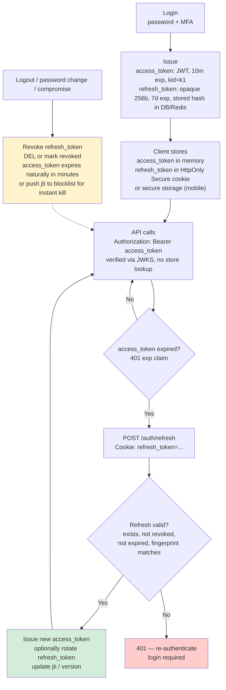
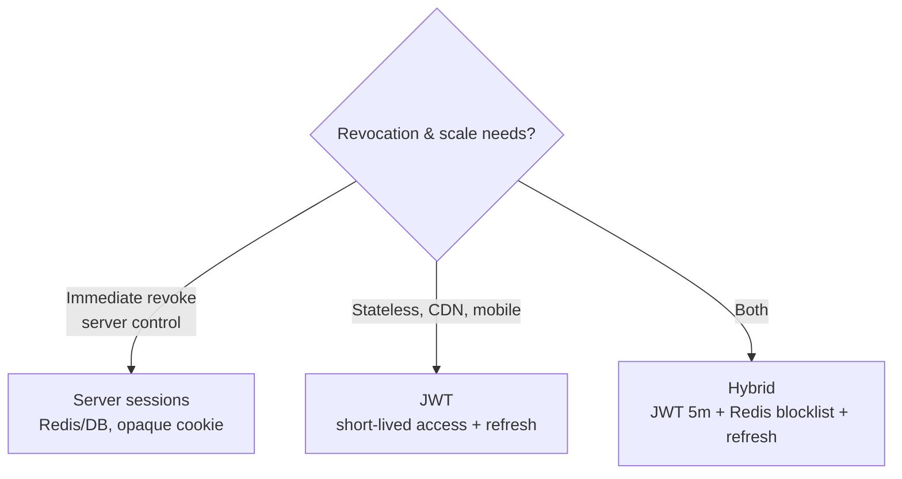
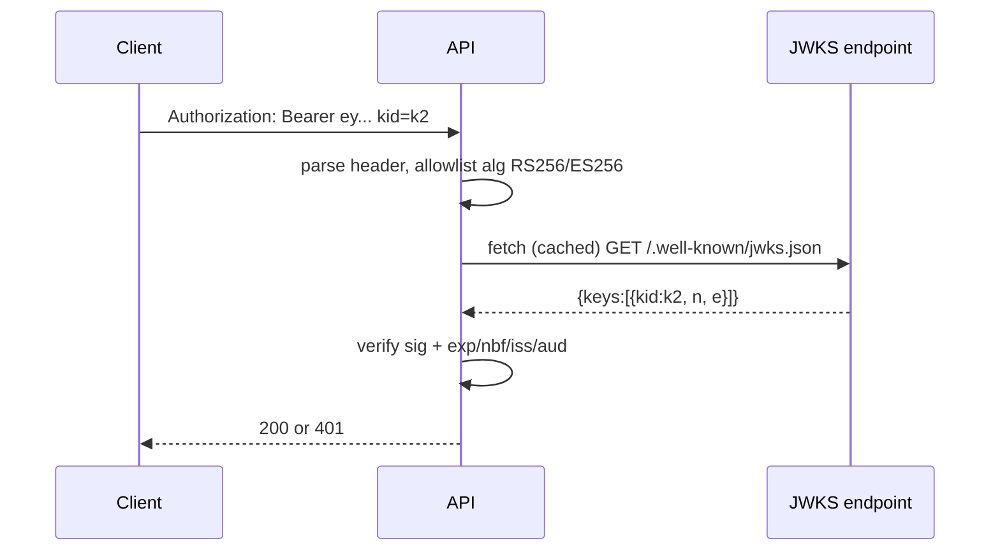
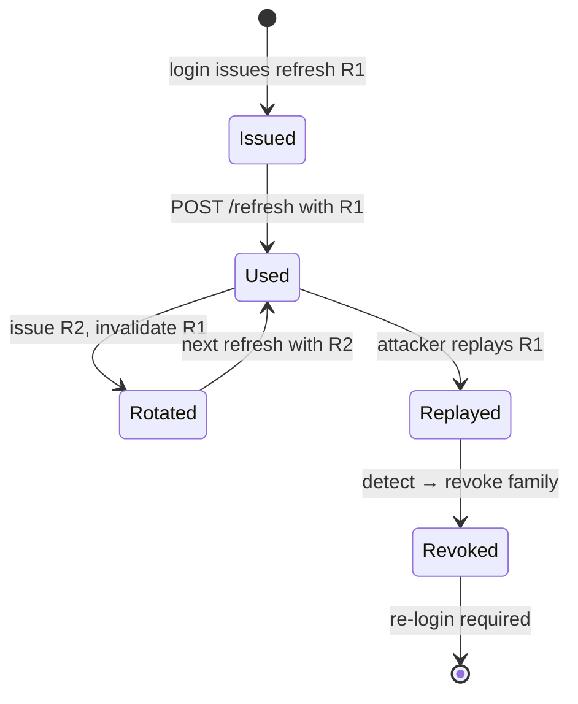

# Chapter 5 — Authentication: Sessions, Tokens, and JWTs

**What this chapter covers.** Every request that reaches your backend carries a claim — "I am user 4821" or "I am service `payments-prod`" — and the system's job is to decide whether to believe it. This chapter is the mechanism behind that decision: how a successful login becomes a session or token, how that artifact is presented on every request, and how the server validates it efficiently and safely at scale. We contrast server-side sessions (opaque handles backed by a store) with client-side bearer tokens (JWTs per RFC 7519), show exactly when to use each, demonstrate secure cookie discipline, CSRF defense, and token binding, and implement issued-and-verified JWTs in Go and Python that you can run and test. The distributed-systems lens is front and center: session stickiness vs shared stores, cache coherence, clock skew for expiry, revocation of stateless tokens, and key rotation without logging everyone out.

Learning goals — after this chapter you should be able to:

- Distinguish authentication (who you are) from authorization (what you may do — Ch 7) and from session management (how the proof of authentication is carried across requests).
- Compare server-side sessions and client-side tokens (JWTs) by trust model, revocation, size, and failure mode — and choose correctly per use case rather than defaulting to one.
- Implement secure session cookies: `HttpOnly`, `Secure`, `SameSite`, `__Host-` prefix, rotation on privilege change, and CSRF defense via double-submit or `SameSite`.
- Issue, verify, and rotate JWTs correctly: `alg`, `kid`, `exp`/`nbf`/`iat` discipline, JWKS (RFC 7517) distribution, asymmetric (RS256/ES256) vs symmetric (HS256) trade-offs, and why `alg: none` and key confusion are not theoretical.
- Design session storage for a fleet — sticky vs shared (Redis/database), cache-coherent verification, and the consistency window that matters.
- Handle revocation and logout for both stateful sessions and stateless JWTs, including short-lived access tokens + refresh tokens, blocklists, and versioned token binding.
- Audit an auth flow for the classic failures: session fixation, session hijacking via XSS, CSRF, replay, and leaked tokens in logs/URLs.

> **Boundary notes.** The *transport* that protects authentication artifacts in transit — TLS 1.3 (RFC 8446), certificates, and PKI operations — is covered in **Vol 3, Ch 6** (wire) and **Ch 4** (operations) of this volume. This chapter assumes TLS is already in place and focuses on the *application-layer* proof of identity carried inside that channel. Delegated authorization (letting one service act on a user's behalf) is **Ch 6** (OAuth 2.0 / OIDC); this chapter is *first-party* authentication — the user's relationship with your system. Service-to-service identity (mTLS, SPIFFE/SPIRE) is **Ch 10**.

## Why authentication is a distributed-systems problem

On a single server, authentication is trivial: validate a password (Ch 2), set a cookie, keep a map from session ID to user in memory. In a fleet it is a coordination, consistency, and availability problem:

- A login handled by instance A must be verifiable by instance B on the next request — even if the request is routed to a different availability zone, even if A has crashed and restarted and lost its memory.
- A password change or logout must invalidate proofs that are already in the wild — on other replicas, in caches, on the client — within a bounded window, not "eventually when the token expires."
- A signing key rotation must not invalidate every in-flight session at once, and verifiers that have cached the old public key must learn the new one without a fleet-wide restart.

Every mechanism in this chapter trades consistency, availability, and latency for the authentication proof. The right trade-off depends on the product: a banking session has different revocation and expiry requirements than a read-heavy content API. We will call those trade-offs out explicitly.

### The request lifecycle

```
        Login (password, MFA)          Every subsequent request
User ───────────────────────► Auth Service ──────────────────────► Any backend
         401 if bad creds              200 if proof valid
         Set-Cookie / token            401 if missing/expired/revoked
```

The artifact that bridges those two phases — cookie or token — and the server's method of verifying it are the design decisions this chapter covers.

## Server-side sessions

A server-side session treats the cookie as an opaque handle. The browser stores `session_id=abc123`; the server stores the mapping `abc123 → {user_id, roles, issued_at, …}` in a durable store. The handle itself carries no meaning and requires a lookup on every request.

```mermaid
sequenceDiagram
    participant B as Browser
    participant E as Edge / App
    participant S as Session Store<br/>(Redis / DB)

    B->>E: POST /login {email, password}
    E->>E: Verify password (Argon2id, Ch 2)
    E->>S: Create session {id=random 256b, user_id, expires_at}
    S-->>E: OK
    E-->>B: 200 + Set-Cookie: session_id=abc123; HttpOnly; Secure; SameSite=Lax; Path=/; __Host-

    B->>E: GET /api/profile Cookie: session_id=abc123
    E->>S: GET session:abc123
    S-->>E: {user_id: 4821, roles: [user]}
    E->>E: Authorize (Ch 7) + serve
    E-->>B: 200 {profile}

    B->>E: POST /logout
    E->>S: DEL session:abc123
    E-->>B: 200 + Set-Cookie: session_id=; Max-Age=0
```

### Generating and storing the handle

The session ID must be unpredictable — it is a bearer secret equivalent to a password for the life of the session.

```go
// Go — correct session ID generation (Go 1.22+)
package main

import (
    "crypto/rand"
    "encoding/base64"
    "net/http"
    "time"
)

func generateSessionID() string {
    b := make([]byte, 32) // 256 bits
    if _, err := rand.Read(b); err != nil {
        panic(err) // CSPRNG failure is fatal — do not fall back
    }
    return base64.RawURLEncoding.EncodeToString(b) // 43 chars, URL-safe
}

func setSessionCookie(w http.ResponseWriter, sessionID string) {
    http.SetCookie(w, &http.Cookie{
        Name:     "__Host-session_id", // __Host- prefix: requires Secure + Path=/ + no Domain
        Value:    sessionID,
        Path:     "/",
        MaxAge:   3600, // 1h — short; refresh via sliding window or refresh token
        HttpOnly: true, // JS cannot read — mitigates XSS exfiltration
        Secure:   true, // TLS only — never over plaintext
        SameSite: http.SameSiteLaxMode, // CSRF mitigation; Strict for sensitive apps
        // Domain deliberately absent with __Host- prefix
    })
}
```

| Cookie attribute | Why it matters |
|---|---|
| `HttpOnly` | Prevents `document.cookie` reads — an XSS that can run JS still cannot steal the cookie via JS. Not a fix for XSS, but reduces blast radius. |
| `Secure` | Browser sends only over HTTPS. Without it, an HTTP downgrade or mixed-content page leaks the session. |
| `SameSite=Lax` | Browser omits the cookie on cross-site `POST` (CSRF defense). `Strict` omits even on top-level `GET` navigations — stronger but breaks some OAuth flows; choose per product. |
| `__Host-` prefix | Browser enforces `Secure`, `Path=/`, no `Domain` — prevents a sibling subdomain from overwriting the cookie. Use on every auth cookie. |
| `__Secure-` prefix | Weaker variant: requires `Secure` but allows `Domain`. Prefer `__Host-`. |

On the server, the session store is typically Redis, Memcached, or a relational row. The store must:

- Support TTL/expiry natively (Redis `SET session:abc EX 3600` or DB `expires_at` + periodic sweep).
- Be available on the request path — a session store outage is an auth outage. Replicate across AZs and fail with `503` (not "anonymous") if unreachable; failing open is worse than failing closed.
- Be keyed by a hash of the session ID if you want to avoid storing the raw bearer value verbatim — though most teams store it directly and rely on TLS + store ACLs.

### The Redis session helper (Python, redis-py 5.x)

```python
# sessions.py — production-shaped session helpers (Python 3.12, redis-py 5.0+)
import secrets, json, time
from typing import Optional
import redis

r = redis.Redis(host="sessions.internal", port=6379, ssl=True, decode_responses=True)

SESSION_TTL = 3600          # 1h
REFRESH_THRESHOLD = 600     # refresh in background when <10m remain

def create_session(user_id: int, roles: list[str]) -> str:
    sid = secrets.token_urlsafe(32)  # 256 bits, uses os.urandom via secrets
    payload = json.dumps({"user_id": user_id, "roles": roles, "iat": int(time.time())})
    # NX ensures no collision (vanishingly unlikely but correct)
    r.set(f"session:{sid}", payload, ex=SESSION_TTL, nx=True)
    return sid

def get_session(sid: str) -> Optional[dict]:
    raw = r.get(f"session:{sid}")
    if raw is None:
        return None
    data = json.loads(raw)
    # Sliding window: extend TTL in the background when close to expiry
    # Do this async (Celery/RQ) or piggyback a pipeline EXPIRE to avoid extra RTT
    ttl = r.ttl(f"session:{sid}")
    if 0 < ttl < REFRESH_THRESHOLD:
        r.expire(f"session:{sid}", SESSION_TTL)
    return data

def revoke_session(sid: str) -> None:
    r.delete(f"session:{sid}")

def revoke_all_for_user(user_id: int) -> None:
    # Requires secondary index or scan — see "Revocation" below
    for key in r.scan_iter(match="session:*", count=500):
        raw = r.get(key)
        if raw and json.loads(raw).get("user_id") == user_id:
            r.delete(key)
```

In production the `scan_iter` loop is expensive — maintain a `user_sessions:{user_id}` set as a secondary index, or scope revocation to JWTs with a version check instead (see below).

### CSRF: the session's shadow

Server-side sessions that rely on cookies are automatically sent by the browser — which is exactly the property Cross-Site Request Forgery exploits. An attacker page `evil.com` that triggers `POST https://api.example.com/transfer` will carry the victim's cookie if the browser considers it same-site-eligible.

Two defenses, use both in depth:

1. **`SameSite=Lax` or `Strict`** — the browser omits the cookie on cross-site POST. This is the primary defense and, for most teams, sufficient. Verify every auth cookie sets it; audit with `curl -v` and browser DevTools.
2. **Double-submit / synchronizer token** — issue a `csrf_token` (random 256 bits, stored server-side or as `__Host-csrf_token` with `SameSite=Lax`) and require the client to send it as a header (`X-CSRF-Token`) that JavaScript must set explicitly — a cross-origin page cannot set custom headers without CORS preflight, which the server can deny. Frameworks (Django, Rails, Spring) do this automatically; wire it yourself if you are not using one.

APIs consumed only by non-browser clients (mobile apps, service-to-service) that use `Authorization: Bearer` tokens are not vulnerable to CSRF — the browser does not auto-send `Authorization` headers — so they do not need CSRF tokens. But any endpoint that accepts cookies must defend.

## Bearer tokens and JWTs

A bearer token is a self-contained proof: the client holds `Authorization: Bearer <token>` and the server verifies it without a per-request store lookup (or with a cached-key lookup). JWT (JSON Web Token, RFC 7519) is the dominant format — a signed (JWS, RFC 7515) or encrypted (JWE, RFC 7516) JSON object with a well-known serialization.

A JWT has three Base64url parts: `header.payload.signature`.

```
eyJhbGciOiJFUzI1NiIsInR5cCI6IkpXVCIsImtpZCI6ImsxIn0  ← header:  {"alg":"ES256","typ":"JWT","kid":"k1"}
eyJzdWIiOiI0ODIxIiwiaXNzIjoiaHR0cHM6Ly9hdXRoLmV4YW1wbGUuY29tIiwiYXVkIjoiYXBpIiwiZXhwIjoxNzI0MTk... ← payload
MEUCIQDx... ← signature over header.payload with ES256 private key k1
```

JWT libraries exist for every language — but JWT misuse is the most audited auth vulnerability class. The rules below are non-optional.

### Header and payload discipline

```json
{
  "alg": "ES256",
  "typ": "JWT",
  "kid": "k1"
}
```

```json
{
  "sub": "4821",
  "iss": "https://auth.example.com",
  "aud": "api",
  "exp": 1724197200,
  "nbf": 1724193600,
  "iat": 1724193600,
  "jti": "b2e8b2c0-9b0a-4f3a-9c1a-8f3d2e1a0b9c",
  "roles": ["user"]
}
```

| Claim | Required? | Why |
|---|---|---|
| `alg` | Yes | Declares the signature algorithm. Verifier must *allowlist* acceptable `alg` values — never trust the token's `alg` blindly (see `alg:none` and key confusion). |
| `kid` | Yes at fleet scale | Identifies which key signed the token. Without `kid`, rotation requires trying every key or coupling token issuance to verifier deploys. |
| `exp` | Yes | Absolute expiry — verifier rejects after this. Keep access tokens short (5–15 min). |
| `nbf` / `iat` | Yes | `nbf` prevents use before issuance; `iat` supports clock-skew leeway and audit. |
| `iss` / `aud` | Yes | Bind the token to its issuer and intended audience — a token for `aud: analytics` must not be accepted by `aud: payments`. |
| `jti` | For revocation | Unique token ID — the handle a blocklist can reference. |
| `sub` | Yes | The subject the token asserts. |

A token without `exp` is a forever-credential. A token without `aud` is a cross-service replay. A token whose `alg` is not allowlisted is a signature-bypass waiting to happen.

### Issuing and verifying JWTs

> **Version pins.** `PyJWT` 2.8+ (Python), Go `github.com/golang-jwt/jwt/v5` + `golang.org/x/crypto` for ECDSA, `cryptography` 42+ or `PyJWT[crypto]` for ES256. JWT specs: RFC 7519 (JWT), RFC 7515 (JWS), RFC 7517 (JWK/JWKS), RFC 7518 (JWA).

Choose **asymmetric** (RS256/ES256/EdDSA) for tokens verified by multiple services — verifiers hold the *public* key, so compromise of a verifier does not let it forge tokens. Use **symmetric** (HS256) only when the issuer and the single verifier share a secret and no other service touches the token (rare at fleet scale).

**ES256 (ECDSA P-256) is the default** for new systems: small keys and signatures, fast, constant-time in well-maintained libraries, and no RSA padding decisions to get wrong.

#### Python — issue and verify (PyJWT 2.8+, `cryptography` for ES256)

```python
# jwt_auth.py — issue + verify with ES256 and JWKS rotation (Python 3.12)
import time, uuid, json
import jwt  # PyJWT 2.8+
from jwt import PyJWKClient
from cryptography.hazmat.primitives.asymmetric import ec
from cryptography.hazmat.primitives import serialization

ISSUER   = "https://auth.example.com"
AUDIENCE = "api"
KID      = "k1"

# ── Key generation (once, stored in KMS/HSM in production) ──────────
private_key = ec.generate_private_key(ec.SECP256R1())
private_pem = private_key.private_bytes(
    serialization.Encoding.PEM,
    serialization.PrivateFormat.PKCS8,
    serialization.NoEncryption(),
)
public_pem = private_key.public_key().public_bytes(
    serialization.Encoding.PEM,
    serialization.PublicFormat.SubjectPublicKeyInfo,
)

# ── Issue ─────────────────────────────────────────────────────────────
def issue_token(user_id: str, roles: list[str], ttl: int = 600) -> str:
    now = int(time.time())
    payload = {
        "sub": user_id,
        "iss": ISSUER,
        "aud": AUDIENCE,
        "exp": now + ttl,
        "nbf": now,
        "iat": now,
        "jti": str(uuid.uuid4()),
        "roles": roles,
    }
    return jwt.encode(payload, private_pem, algorithm="ES256",
                      headers={"kid": KID, "typ": "JWT"})

# ── Verify — allowlist alg, verify iss/aud/exp, fetch key by kid ────
# In production, cache the JWKS response (Cache-Control / Expires) and
# reuse the PyJWKClient across requests — do not fetch JWKS per request.
jwks_client = PyJWKClient(f"{ISSUER}/.well-known/jwks.json")

def verify_token(token: str) -> dict:
    # Fetch signing key by kid from JWKS (cached internally by PyJWKClient)
    signing_key = jwks_client.get_signing_key_from_jwt(token)
    return jwt.decode(
        token,
        signing_key.key,
        algorithms=["ES256"],          # allowlist — never accept "none" or HS256 here
        issuer=ISSUER,
        audience=AUDIENCE,
        leeway=30,                     # 30s clock skew tolerance
        options={"require": ["exp", "iat", "iss", "aud", "sub"]},
    )

# Demo
if __name__ == "__main__":
    tok = issue_token("4821", ["user"])
    print(tok)
    print(json.dumps(verify_token(tok), indent=2))
    # Tamper test — flipping a byte must fail verification:
    #   bad = tok[:-4] + "AAAA"
    #   verify_token(bad)  # -> jwt.InvalidSignatureError
```

#### Go — verify with JWKS and `kid` (net/http middleware, Go 1.22+)

```go
package auth

import (
    "context"
    "encoding/json"
    "fmt"
    "net/http"
    "strings"
    "sync"
    "time"

    "github.com/golang-jwt/jwt/v5"
)

// JWKS cache — refresh on kid miss or TTL, not per request.
type JWKSCache struct {
    mu      sync.RWMutex
    url     string
    keys    map[string]any // kid -> public key
    fetched time.Time
    ttl     time.Duration
}

func NewJWKSCache(url string) *JWKSCache {
    return &JWKSCache{url: url, keys: make(map[string]any), ttl: 10 * time.Minute}
}

func (c *JWKSCache) KeyFunc(token *jwt.Token) (any, error) {
    // Hard allowlist — reject anything that is not ES256
    if token.Method.Alg() != jwt.SigningMethodES256.Alg() {
        return nil, fmt.Errorf("unexpected alg: %s", token.Header["alg"])
    }
    kid, _ := token.Header["kid"].(string)
    if kid == "" {
        return nil, fmt.Errorf("missing kid")
    }
    c.mu.RLock()
    k, ok := c.keys[kid]
    fresh := time.Since(c.fetched) < c.ttl
    c.mu.RUnlock()
    if ok && fresh {
        return k, nil
    }
    if err := c.refresh(); err != nil {
        return nil, err
    }
    c.mu.RLock()
    defer c.mu.RUnlock()
    k, ok = c.keys[kid]
    if !ok {
        return nil, fmt.Errorf("unknown kid: %s", kid)
    }
    return k, nil
}

func (c *JWKSCache) refresh() error {
    // Fetch JWKS JSON (RFC 7517), parse jwkSet, populate c.keys by kid
    // Omitted for brevity — use github.com/MicahParks/keyfunc or
    // golang.org/x/oauth2/jws patterns; handle HTTP timeout + retry.
    // Pseudocode:
    //   resp, _ := http.Get(c.url) ; var set jwkSet ; json.NewDecoder(resp.Body).Decode(&set)
    //   for _, jwk := range set.Keys { c.keys[jwk.Kid] = jwk.PublicKey() }
    return fmt.Errorf("refresh: implement JWKS fetch (see keyfunc library)")
}

// Middleware — use as http.Handler wrapper
func RequireJWT(cache *JWKSCache, issuer, audience string) func(http.Handler) http.Handler {
    return func(next http.Handler) http.Handler {
        return http.HandlerFunc(func(w http.ResponseWriter, r *http.Request) {
            tok := strings.TrimPrefix(r.Header.Get("Authorization"), "Bearer ")
            if tok == "" {
                http.Error(w, "missing bearer token", http.StatusUnauthorized)
                return
            }
            claims := jwt.MapClaims{}
            _, err := jwt.ParseWithClaims(tok, claims, cache.KeyFunc,
                jwt.WithIssuer(issuer),
                jwt.WithAudience(audience),
                jwt.WithLeeway(30*time.Second),
                jwt.WithExpirationRequired(),
            )
            if err != nil {
                http.Error(w, "invalid token", http.StatusUnauthorized)
                return
            }
            ctx := context.WithValue(r.Context(), "claims", claims)
            next.ServeHTTP(w, r.WithContext(ctx))
        })
    }
}

var _ = json.Marshal // keep import
```

> **Library note.** The `refresh()` stub is the only part you should not hand-roll in production — use `github.com/MicahParks/keyfunc` (JWKS auto-refresh) or `github.com/lestrrat-go/jwx/v2/jwk` which handles caching, rotation, and `kid` lookup out of the box. The `KeyFunc` allowlist pattern above is what to audit regardless of library.

### The JWT pitfalls you must block

| Pitfall | Mechanism | Defense |
|---|---|---|
| **`alg: none`** | Attacker sets `alg` to `none`, removes signature; naive verifiers that trust the header accept an unsigned token. | Allowlist `algorithms=["ES256"]` (or your one chosen alg) — never accept `none`. Libraries that default to allowlisting (PyJWT `algorithms=` required) are safer; audit every `jwt.decode` / `jwt.Parse` call. |
| **Key confusion (RS256 ↔ HS256)** | Attacker sets `alg: HS256` and signs with the RSA *public* key as if it were an HMAC secret — verifier that accepts both RS256 and HS256 will verify with the public key as the HMAC key. | Accept exactly one algorithm family. If you use ES256, the allowlist is `["ES256"]` — not `["ES256","HS256"]`. Never mix asymmetric and symmetric verification in the same code path. |
| **Weak HS256 secret** | HS256 secret is a short password; attacker brute-forces the HMAC key offline. | If you must use HS256, the secret must be 256+ random bits (`secrets.token_bytes(32)`), stored in a KMS/secret manager, never in source. Prefer ES256 to avoid the problem entirely. |
| **Missing `exp` / `aud`** | Forever-token or cross-service replay. | `require: ["exp","aud"]` and verify both. Keep `exp` short (minutes). |
| **Large payload / header DoS** | Attacker stuffs many claims or a huge header to exhaust parser memory. | Enforce token size limits (e.g., 8 KB) before parsing; reject tokens with unexpected claims. |
| **Leaked tokens in logs/URLs** | `GET /api?token=...` or `Authorization` header logged verbatim. | Tokens travel in `Authorization` header or `Secure`/`HttpOnly` cookie only — never query params or fragment. Scrub `Authorization` from access logs; alert on its presence in error messages. |

### Sessions vs JWTs — the decision

| Dimension | Server-side session | JWT (asymmetric) |
|---|---|---|
| **State** | Stateful — store lookup per request | Stateless verification — no per-request store hit if JWKS is cached |
| **Size** | Cookie ~50 bytes | Token ~500–1500 bytes (header + claims + signature) — too large for many cookies, fine in `Authorization` header |
| **Revocation** | Immediate — `DEL session:abc` | Delayed — must wait for `exp` or maintain a blocklist (see below) |
| **Horizontal scale** | Requires shared store (Redis) or sticky routing | Any replica with the JWKS verifies — no store on the hot path |
| **Key compromise** | Store ACL compromise vs session theft | Private signing key compromise forges any token — protect with HSM/KMS |
| **Best for** | Traditional web apps with cookies, admin consoles, flows that need instant logout | Microservice APIs, mobile/SPA backends, service-to-mesh calls where replicas scale rapidly |

Most production systems use **both**: a session cookie for the web app (where instant logout and CSRF discipline matter) and short-lived JWTs for the API layer (where stateless verification at the edge matters). They are not mutually exclusive.

## Refresh tokens and the token lifecycle

A JWT that is stolen is valid until `exp`. The mitigation is to keep `exp` short (5–15 min) and use a **refresh token** — a longer-lived, opaque, revocable handle that can mint new access tokens — so compromise of an access token has a bounded window and refresh can be gated and monitored.



Refresh tokens **must** be:

- **Opaque and random** — not JWTs. Generated with `secrets.token_urlsafe(32)` (256 bits), stored as a hash (SHA-256) in the database/Redis, looked up on refresh. Leaking the DB should not leak usable tokens.
- **Bound** — to a device fingerprint, IP class, or DPoP proof (RFC 9449) so theft requires more than the token alone. At minimum, store the issuing `user_agent` hash and alert on mismatch.
- **Single-use or versioned** — on each refresh, either rotate (issue a new refresh token, invalidate the old one — detects replay if the old one is reused) or maintain a `token_version` per user (see Ch 6) so password change invalidates all outstanding refresh tokens in one increment.
- **Scoped and short-lived for their type** — 7–30 days, not months. Require re-authentication for sensitive actions regardless of refresh validity.

```python
# refresh.py — minimal refresh token store (PostgreSQL + Redis cache sketch)
import hashlib, secrets, time
import psycopg  # psycopg 3.x

def hash_token(tok: str) -> str:
    return hashlib.sha256(tok.encode()).hexdigest()

def issue_refresh(user_id: str, ttl: int = 7*86400) -> str:
    raw = secrets.token_urlsafe(32)
    h = hash_token(raw)
    exp = int(time.time()) + ttl
    with psycopg.connect("dbname=auth") as conn:
        conn.execute(
            "INSERT INTO refresh_tokens(hash, user_id, expires_at, created_at) VALUES (%s,%s,to_timestamp(%s), now())",
            (h, user_id, exp),
        )
    return raw  # send to client over TLS only

def verify_refresh(raw: str) -> str | None:
    h = hash_token(raw)
    with psycopg.connect("dbname=auth") as conn:
        row = conn.execute(
            "SELECT user_id FROM refresh_tokens WHERE hash=%s AND expires_at > now() AND revoked_at IS NULL",
            (h,),
        ).fetchone()
        return row[0] if row else None

def revoke_refresh(raw: str) -> None:
    h = hash_token(raw)
    with psycopg.connect("dbname=auth") as conn:
        conn.execute("UPDATE refresh_tokens SET revoked_at=now() WHERE hash=%s", (h,))

def revoke_all_for_user(user_id: str) -> None:
    with psycopg.connect("dbname=auth") as conn:
        conn.execute("UPDATE refresh_tokens SET revoked_at=now() WHERE user_id=%s AND revoked_at IS NULL", (user_id,))
```

## Revocation for stateless tokens

The fundamental tension: JWTs are valuable because they are stateless, but revocation is a stateful operation. Options, in order of practicality:

1. **Short expiry + refresh** — the default. Revoke the refresh token; outstanding access tokens expire in minutes. For most products this is sufficient and the simplest. The window is `exp` — keep it short.
2. **Versioned tokens** — embed `token_version` (or `auth_version`) in the JWT, store the current version per user in Redis/DB, reject tokens whose version does not match. Password change or "log out everywhere" increments the version and invalidates all outstanding tokens in one write, with one lookup added to verification (cacheable):
   ```python
   # On verify: after signature checks
   if claims["ver"] != redis.get(f"auth_ver:{claims['sub']}"):
       raise InvalidToken("stale token version — re-authenticate")
   ```
3. **JTIs blocklist (denylist)** — on logout/compromise, push the `jti` to a Redis set with TTL = remaining `exp`. Verifiers check the set (single `SISMEMBER` / `EXISTS`). Scales to the number of *revoked* tokens, not total tokens — manageable if revocation is rare, expensive if you revoke on every logout in a high-traffic system (prefer versioned tokens or short-TTL there).
4. **Stateful introspection** — verifiers call the auth service to check token validity (RFC 7662 token introspection). Correct but reintroduces a store lookup on every request — at which point you have rebuilt server-side sessions with JWT serialization overhead.

Do not try to have it both ways: if your threat model requires instant revocation of individual access tokens at high rate, use sessions or versioned tokens, not a naive JWT that you then bolt a per-request DB check onto.

## Session and token binding

A bearer token that can be replayed from any machine is a password-equivalent secret in transit. Binding raises the bar:

- **DPoP (Demonstrating Proof-of-Possession, RFC 9449, 2023)** — the client generates an ephemeral key pair, sends the public key (as a `jwk` in the DPoP header), and signs a proof JWT over the request method, URI, and a server nonce. The auth server binds the access token to the DPoP public key (`cnf.jkt` thumbprint); verifiers check that the request's DPoP proof matches the bound key. Stolen tokens cannot be replayed without the DPoP private key. Increasingly required for high-value APIs and FAPI profiles — implement with `dpop` libraries rather than hand-rolling the proof.
- **mTLS binding (RFC 8705, OAuth 2.0 Mutual-TLS Client Authentication and Certificate-Bound Access Tokens)** — bind the access token to the client's mTLS certificate thumbprint (`cnf.x5t#S256`). Verification is that the same client certificate is presented on the TLS connection. Natural fit alongside Ch 4/Ch 10 mTLS.
- **Cookie `__Host-` + `Secure` + `HttpOnly`** is itself a weak binding — it ties the session to the TLS origin and prevents JS exfiltration, but not replay.

For backend service-to-service tokens, DPoP or mTLS binding is strongly recommended. For browser sessions, `__Host-` cookies plus short-lived JWTs plus refresh with rotation is the pragmatic baseline.

## Clock skew, expiry, and the distributed clock

Every `exp`/`nbf` check compares the verifier's clock to the issuer's clock. In a fleet with NTP/chrony drift, a token that is valid on the issuer may be considered expired on a verifier whose clock is ahead, or not-yet-valid on a verifier whose clock is behind. The fix:

- Keep clocks synchronized — `chrony` with PTP-backed NTP, alert on `chrony tracking` offset > 50 ms. This is an infrastructure invariant TLS (Ch 4), sessions, and token expiry all depend on.
- Allow **leeway** (30–60 s is typical) — `leeway=30` in PyJWT, `WithLeeway(30*time.Second)` in Go `jwt`. This is not "accept expired tokens" — it is "tolerate bounded clock disagreement." Do not set leeway to minutes; fix the clocks instead.
- Log `iat` skew on verification — `verifier_now - claims["iat"]` — as a time-series. A growing positive skew means the verifier is ahead and will start rejecting fresh tokens soon.

## Distributed-systems lens — two architectures

### Sticky sessions (avoid if you can)

Route each user to the same backend via consistent hashing or `Set-Cookie` affinity (`affinity: cookie` in nginx/ALB). Then sessions can live in process memory. It is simple but fragile: instance failure loses sessions, scaling requires draining affinity, and canary deploys leak sticky users across versions. Use only for legacy state you cannot externalize. The modern default is a shared store or stateless JWT.

### Shared store + cache-coherent verification

```
               ┌─► App A ─► Redis Cluster (sessions / auth_ver / jti blocklist)
Client ─► LB ──┤
               └─► App B ─► JWKS cache (10m TTL) ─► Auth Service /.well-known/jwks.json
```

- Session lookups are `GET session:{id}` to Redis — single-digit milliseconds in the same AZ, ~10 ms cross-AZ. Pipeline the session fetch with the business query to hide the RTT, or cache hot sessions in-process with a short TTL (5–30 s) and accept a bounded staleness window on revocation.
- JWKS is fetched from the auth service's `/.well-known/jwks.json` (RFC 8414 / OIDC Discovery), cached in each verifier with a TTL, and refreshed on `kid` miss. The JWKS endpoint must be highly available — it is on the verification path for cold `kid`s. Serve it from a CDN or replicated cache, not a single auth instance, and version keys (`kid: k1, k2, …`) so rotation is additive.
- `auth_ver` / JTI blocklist checks are one more Redis lookup on the hot path. Weigh that against the security requirement: if instant revocation is not required, skip it and rely on short `exp` + refresh. Every lookup you add is latency and a failure mode.

## Failure modes and incident patterns

**Session fixation.** Attacker sets `session_id=known_value` in the victim's browser (via `Set-Cookie` in an HTTP response, subdomain cookie, or XSS), victim logs in and the app associates the victim's identity with the attacker-known session ID, attacker reuses it. Defense: **regenerate the session ID on authentication** — issue a fresh random ID after login, invalidate the old one. Test: log in twice and assert the cookie value changed.

**Session hijacking via XSS.** Any XSS that can run `fetch(document.cookie)` steals `HttpOnly`-less cookies and, if `Secure` is missing, can exfiltrate over HTTP. Defense is layered: `HttpOnly` + `Secure` + `__Host-` as above, plus Content Security Policy (Ch 9) to prevent the XSS in the first place, plus short TTLs so stolen sessions die quickly. Audit: no auth cookie may be readable from JS — verify with DevTools → Application → Cookies.

**JWT replay after theft.** Stolen `Authorization` header from a log file or a compromised edge. Defenses: short `exp`, DPoP/mTLS binding, do not log `Authorization` headers, encrypt tokens at rest on the client (mobile Keychain/Keystore, not `localStorage`), and prefer `HttpOnly` cookies for refresh tokens so JS cannot read them.

**Key rotation without `kid`.** New signing key deployed, old key deleted, every in-flight token fails verification and every user is logged out. Defense: publish both keys in JWKS with distinct `kid`s, issue new tokens with the new `kid`, keep the old key verifiable until every token signed with it has expired (max `exp` window), then remove it. This is the same dual-read pattern as Ch 3 and Ch 4. Monitor `kid` distribution in issued tokens to know when the old `kid` is safe to retire.


#### Session vs JWT Decision



#### Login and Session Creation

```mermaid
sequenceDiagram
    participant B as Browser
    participant App as App
    participant Store as Redis
    B->>App: POST /login
    App->>App: verify password + MFA
    App->>Store: SET session:abc user=42 ex=15m
    App-->>B: Set-Cookie: __Host-sid=abc; HttpOnly; Secure; SameSite=Lax
    B->>App: GET /profile Cookie: sid=abc
    App->>Store: GET session:abc
    Store-->>App: hit
    App-->>B: 200 profile
```

#### JWT Validation via JWKS



#### Refresh Token Rotation



## Key takeaways

- Server-side sessions (opaque handle + store lookup) and JWTs (self-contained signed object, RFC 7519) are not rivals — they are different trade-offs. Sessions give instant revocation at the cost of a store on the hot path; JWTs give stateless verification at the cost of delayed revocation bounded by `exp`. Most fleets use sessions for web (cookies) and short-lived JWTs for APIs.
- Secure cookies require `HttpOnly` + `Secure` + `SameSite=Lax` (or `Strict`) + `__Host-` prefix, with session IDs from a CSPRNG (`crypto/rand`, `secrets.token_urlsafe`) and regeneration on login to prevent fixation.
- JWTs must be issued with `exp`, `iss`, `aud`, `kid`, and `jti`, verified with an allowlisted `alg` (one value, e.g., `ES256`), checked `iss`/`aud`/`exp`, and distributed via JWKS (RFC 7517). Never accept `alg: none`, never mix RS256 and HS256 in the same verifier, and never trust the header's `alg` without an allowlist.
- Keep access tokens short (5–15 min), use opaque random refresh tokens (256 bits, stored as hashes) bound to a fingerprint, and detect replay via rotation or versioning. Long-lived bearer tokens are a breach waiting to happen.
- Revocation for JWTs is bounded by `exp` unless you add state: versioned tokens (`auth_ver` per user) or JTI blocklists give instant revocation with one extra lookup; introspection reintroduces per-request state. Choose based on whether your product actually needs instant individual-token revocation.
- Bind high-value tokens with DPoP (RFC 9449) or mTLS (RFC 8705) so theft does not give replay; at minimum, do not leak tokens via URLs or logs and keep refresh tokens in `HttpOnly` cookies or secure device storage.
- At fleet scale, session stores (Redis) and JWKS are availability dependencies — replicate, cache with TTL, refresh on `kid` miss, tolerate 30–60 s clock skew with leeway, and version/overlap signing keys so rotation does not invalidate in-flight tokens. Every `exp`/`nbf` check depends on healthy NTP/chrony.

## Further reading

- **Standards:** RFC 7519 (JWT), RFC 7515 (JWS), RFC 7517 (JWK/JWKS), RFC 7518 (JWA), RFC 7638 (JWK Thumbprint), RFC 7662 (Token Introspection), RFC 8705 (mTLS Token Binding), RFC 9449 (DPoP), RFC 6750 (Bearer Token Usage), RFC 6265 / RFC 6265bis (Cookies), RFC 6797 (HSTS), OWASP ASVS 3.x (Session Management) and OWASP Cheat Sheet Series (Session Management, JWT, CSRF Prevention).
- Lodderstedt et al. — *OAuth 2.0 Security Best Current Practice* (IETF draft-ietf-oauth-security-topics, updates RFC 6749/6750) — even for first-party auth, §4 describes token hygiene that applies directly.
- OWASP — *JWT Cheat Sheet for Java* / *JSON Web Token Cheat Sheet* — concise pitfall catalog (alg:none, key confusion); readable as a code-review checklist outside Java.
- `PyJWT` docs — https://pyjwt.readthedocs.io/ (2.8+) and `golang-jwt/jwt` — https://github.com/golang-jwt/jwt — authoritative for library behavior and `kid` handling.
- `cryptography` (Python) — https://cryptography.io/ — for correct ES256 key handling; avoids foot-guns in raw `ecdsa` libraries.
- Jones, Bradley, Sakimura — *JSON Web Token (JWT)* RFC 7519 + *JWS* RFC 7515 + *JWK* RFC 7517 — read as a trio; JWT alone is underspecified without them.
