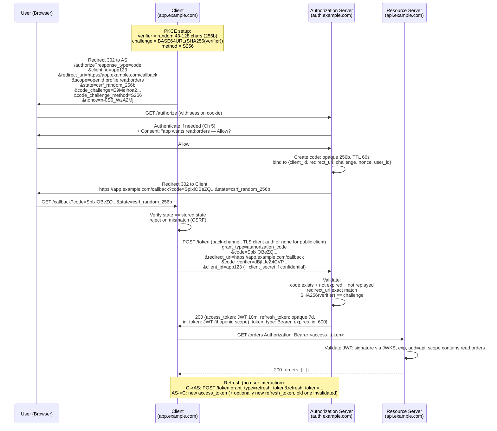
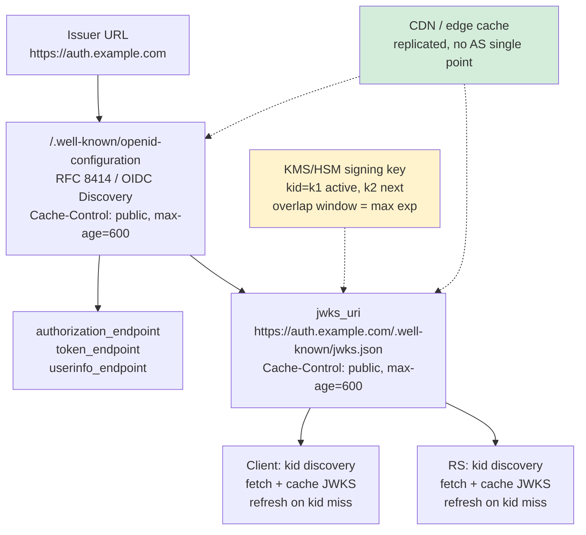
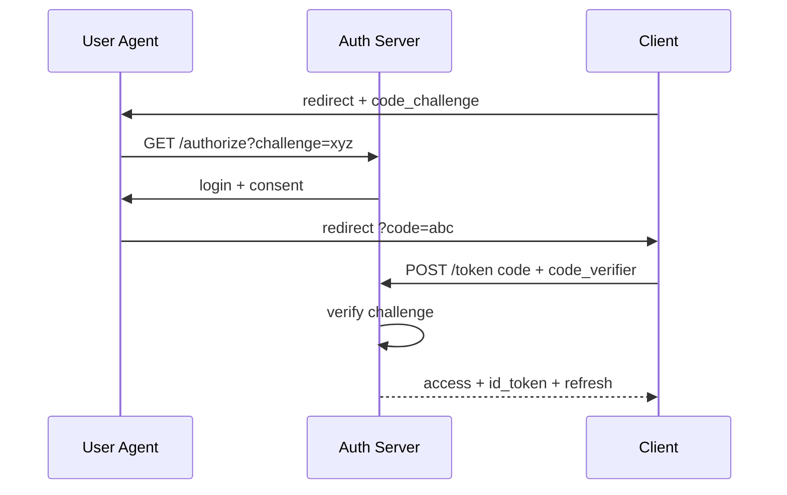
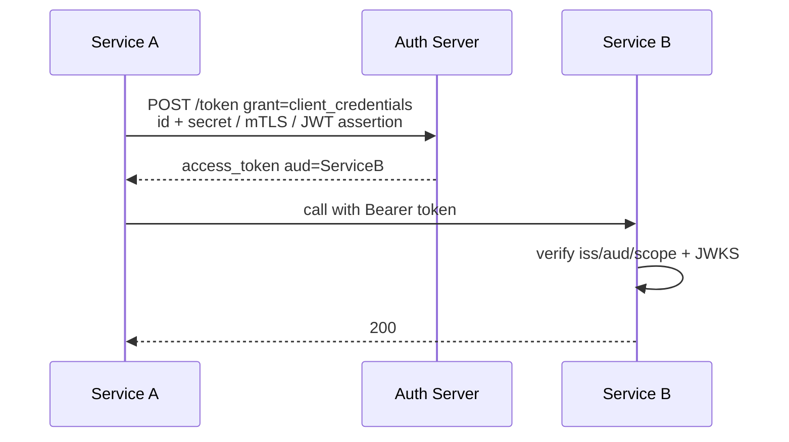
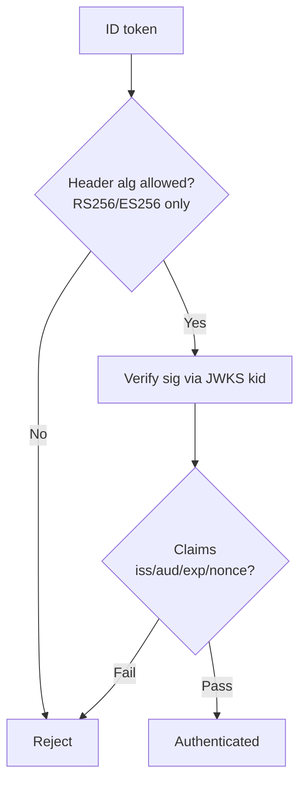
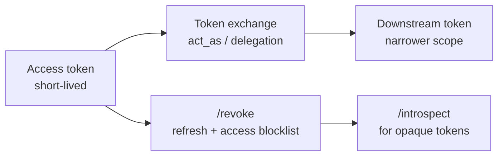

# Chapter 6 — OAuth 2.0 and OpenID Connect

**What this chapter covers.** Chapter 5 solved first-party authentication — the user proves who they are to *your* system. But modern backends rarely live alone: a mobile app needs to call your API on the user's behalf without seeing their password, a partner service needs scoped access to one user's data, and your own microservices need to act as a user across service boundaries. OAuth 2.0 (RFC 6749 + RFC 6750) is the delegation protocol for "let app A act on user U's behalf, within scope S, for time T, revocably." OpenID Connect (OIDC 1.0) is the identity layer on top — "and tell app A who U is, with a verifiable ID token." This chapter implements both at the level a backend engineer needs: the authorization code flow with PKCE (RFC 7636) end-to-end, the threat model (code interception, token leakage, open redirector), OIDC Discovery and JWKS, token handling (JWT vs opaque, introspection per RFC 7662, revocation), and the distributed-systems reality of an authorization server fleet that must issue, verify, and revoke tokens under load without becoming a single point of failure.

Learning goals — after this chapter you should be able to:

- Explain OAuth 2.0's four roles, four grant types, and why only authorization code + PKCE is recommended for new systems (per OAuth 2.0 Security Best Current Practice, draft-ietf-oauth-security-topics).
- Implement and verify the authorization code flow with PKCE: `code_challenge`/`code_verifier`, `state` binding, `redirect_uri` exact-match validation, and token exchange with client authentication (or public-client PKCE without a secret).
- Distinguish OIDC's ID token (identity assertion, JWT, validated by the client) from OAuth's access token (delegation credential, validated by the resource server) and from the UserInfo endpoint — and explain when each is used.
- Operate OIDC Discovery (`.well-known/openid-configuration` per RFC 8414 / OIDC Discovery 1.0) and JWKS rotation (RFC 7517) so clients and resource servers discover keys without redeploy.
- Handle tokens correctly: short-lived JWT access tokens vs opaque tokens, refresh rotation, introspection (RFC 7662) vs local JWT verification, audience/scope enforcement at every resource server, and why `implicit` and `password` grants must not be used.
- Run a minimal OAuth authorization server and a confidential client in Go/Python, and integrate a relying party via `golang.org/x/oauth2` or `authlib`.
- Design the authorization server for scale — stateless JWT issuance with cached JWKS vs stateful introspection, horizontal scaling of the code/token stores, revocation propagation, and multi-region discovery.

> **Boundary notes.** The *transport* that protects every OAuth redirect and token exchange — TLS 1.3 (RFC 8446) and PKI operations — is covered in **Vol 3, Ch 6** (wire) and **Ch 4** (operations) of this volume; every endpoint in this chapter must be `https://` and both sides must validate certificates (Ch 4) — OAuth over plaintext is broken by definition. *First-party* session/token mechanics (cookies, JWT structure, `kid`/`exp` discipline, JWKS caching) are **Ch 5**; this chapter reuses that machinery for delegated access and adds the redirect dance and cross-party trust. *Service-to-service* identity without a user (workload identity, SPIFFE/SPIRE, mTLS) is **Ch 10**; OAuth client-credentials is the user-absent grant covered here, but workload attestation is Ch 10. *Authorization* (what a token's `scope`/`claims` allow — RBAC/ABAC/ReBAC) is **Ch 7**.

## Why delegation, not password sharing

Before OAuth, the only way for app A to act on user U's behalf was to get U's password — the "password anti-pattern" that still appears in legacy `password` grants and screen-scraping. The password gives *full* access, cannot be scoped or revoked per app, and compromise of A leaks U's credential for every service where it is reused. OAuth replaces it with a scoped, revocable token whose lifetime is independent of the password and whose compromise is bounded to one client and one scope.

The pattern appears everywhere in a distributed backend even when the spec language is not used:

- A web app's frontend (SPA) calling its own API gateway — the gateway validates an access token scoped to that user.
- A partner integration ("connect your calendar") — the partner receives a token scoped to `calendar:read` that the user can revoke without changing their password.
- An internal job that fans out across services as a user — the job propagates the user's access token (or exchanges it via token exchange, RFC 8693) and each service enforces `aud`/`scope` locally.

All of these are OAuth-shaped, whether they speak RFC 6749 on the wire or a proprietary analogue. Learning the spec is learning the shape.

## Roles, tokens, and grant types

### The four roles

| Role | What it is | Example |
|---|---|---|
| **Resource Owner** | The user (or entity) that owns the resource | Alice, `user_id=4821` |
| **Client** | The app requesting delegated access on the owner's behalf | `calendar-sync` partner app, your SPA, a backend service |
| **Authorization Server (AS)** | Issues tokens after authenticating the owner and obtaining consent | `https://auth.example.com` |
| **Resource Server (RS)** | Hosts the protected resource, validates the access token | `https://api.example.com` — validates `Authorization: Bearer …` |

In many production systems the AS and RS are operated by the same team (your auth service + your API), but the spec keeps them distinct because in federated deployments they are not — Google's AS issues tokens that your RS validates via Google's JWKS.

### The two tokens that matter

- **Access token** (RFC 6749 §1.4, RFC 6750) — the credential the client presents to the RS. Short-lived (minutes), scoped (`scope=read:profile`), audience-bound (`aud=api.example.com`). The RS validates signature, `exp`, `aud`, and `scope` on every request. Format may be JWT (Ch 5) or opaque — both are specified; the choice is a distributed-systems trade-off (see below).
- **Refresh token** (RFC 6749 §1.5) — a longer-lived opaque handle that the client exchanges at the AS for a new access token without involving the user. Stored as a hash server-side (like Ch 5's refresh), bound to the client, optionally rotated on each use to detect replay.
- **Authorization code** — not a token but a single-use, short-lived (30–60 s), opaque handle that the AS returns via redirect and the client exchanges for tokens. The indirection is the security boundary: the code traverses the browser redirect (where it could be intercepted), the tokens traverse a direct back-channel between client and AS (where they cannot).

OIDC adds a third: the **ID token** — a JWT that asserts *who the user is* (`sub`, `iss`, `aud=client_id`, `exp`, `nonce`, `acr`/`amr` for auth strength). It is consumed by the *client*, not the RS, and must be validated as a JWT (Ch 5: allowlisted `alg`, `iss`/`aud`/`exp` checks, `kid`-based JWKS lookup). The ID token is proof of authentication; the access token is proof of delegation — conflating them leaks identity claims to resource servers that should not see them or grants delegation power to an identity assertion.

### Grant types — and which to use

> **Version pins.** OAuth 2.0 RFC 6749 + Bearer RFC 6750 (2012, RFC 6749 is being revised as draft-ietf-oauth-v2-1). PKCE RFC 7636 (2015, required for authorization code by OAuth 2.1 and Security BCP). Token Introspection RFC 7662, Token Revocation RFC 7009, AS Metadata RFC 8414, JWT Access Token profile RFC 9068. OIDC Core/Discovery 1.0 (2014, with errata; implement against current Final).

| Grant | Flow | When to use | Status |
|---|---|---|---|
| **Authorization code + PKCE** (RFC 6749 §4.1 + RFC 7636) | Browser redirect → code → back-channel token exchange with `code_verifier` | Every user-facing delegation — web, mobile, SPA, native apps | **Recommended for all new clients** — public or confidential |
| **Client credentials** (RFC 6749 §4.4) | Client authenticates with its own credential, no user | Service-to-service / machine-to-machine (no resource owner) | Correct for M2M — scoped to the client, not a user |
| **Device code** (RFC 8628) | User enters a code on a second device | TVs, CLI tools, IoT with limited input | Correct for input-constrained devices |
| **Refresh token** (RFC 6749 §6) | `grant_type=refresh_token` with the stored refresh handle | Renew an access token without user interaction | Correct — with rotation and binding (Ch 5) |
| **Implicit** (`response_type=token`, RFC 6749 §4.2) | Token returned directly in the redirect fragment | Legacy SPAs before PKCE existed | **Must not be used** — token exposed in URL/history, no PKCE, no client auth (Security BCP §2.1.2) |
| **Resource Owner Password Credentials** (`password`, RFC 6749 §4.3) | Client collects the user's password and exchanges it for a token | Migration from password anti-pattern only | **Must not be used** except for narrow legacy migration; removed in OAuth 2.1 |

If your design includes `response_type=token` or `grant_type=password`, stop and redesign around authorization code + PKCE.

## Authorization code + PKCE, step by step

PKCE (Proof Key for Code Exchange, RFC 7636, pronounced "pixy") closes the code-interception attack: even if an attacker intercepts the authorization code in the redirect, they cannot exchange it without the `code_verifier` that never left the legitimate client's memory.



### Why every field matters

| Field | Role | If omitted or wrong |
|---|---|---|
| `state` | CSRF binding between the authorize request and the callback — random 256 bits, stored in `__Host-` cookie or server session, compared exactly on callback | Attacker initiates `code` for their account, victim completes it and links their session to attacker's identity (login CSRF / code injection) |
| `nonce` (OIDC) | Replay binding for the ID token — client sends `nonce`, AS echoes it in `id_token.nonce`, client validates | ID token replay: attacker replays a captured ID token to impersonate the user |
| `redirect_uri` | Exact-match validated by the AS against the client's pre-registered set — not prefix, not regex, not "starts with" | Open redirector: attacker registers `https://evil.com?redirect_uri=https://app.example.com/callback@evil.com` or exploits lax matching to steal the code |
| `code_challenge` / `code_verifier` | PKCE — proves the client that requested the code is the same client exchanging it | Code interception: on mobile, a malicious app registers the same redirect scheme and captures the code; without PKCE, it can exchange it |
| `code` single-use | AS deletes the code on first exchange; replay attempts fail | Code replay — attacker that observed the code reuses it before the legitimate client |
| `client_secret` / `private_key_jwt` | Authenticates a *confidential* client (server that can keep a secret); public clients (SPA, mobile) use PKCE alone and must not be issued a static secret | Secret leakage via mobile binary decompilation or JS bundle; treating a public client as confidential gives false assurance |

## OIDC: identity on top of delegation

OIDC (OpenID Connect Core 1.0) adds a thin, well-specified identity layer to the OAuth 2.0 code flow. When the client includes `scope=openid` (plus optionally `profile`, `email`, `address`, `phone`), the AS:

1. Returns an **ID token** (JWT) in the token response alongside the access token. The ID token's `aud` is the `client_id` (it is for the client), `iss` is the issuer URL, `sub` is the user, `nonce` echoes the request nonce, and `exp` is short (minutes). The client validates it (Ch 5 JWT discipline: allowlisted `alg`, `iss`/`aud`/`exp`/`nonce` checks, `kid` JWKS lookup) and uses it to establish the user's identity — typically to look up or create a local session.
2. Exposes a **UserInfo endpoint** (`GET /userinfo` with the access token) that returns claims (`sub`, `name`, `email`, `email_verified`, …) as JSON, governed by the granted scopes. The client should prefer the ID token for basic identity and call UserInfo only for claims that may have changed since issuance or that are too large for a JWT.

The RS does not consume the ID token. The client does not send the ID token to the RS. The access token (JWT per RFC 9068 or opaque) is what the RS validates; the ID token is what the client validates to know who logged in. Mixing them — sending the ID token as a bearer to the RS, or treating the access token as an identity assertion — is a common bug that leaks `email`/`profile` to every RS and grants identity-token audience to delegation.

### Discovery and JWKS — how clients find the truth

OIDC Discovery 1.0 and AS Metadata (RFC 8414) let a client discover the AS's endpoints and keys from a single issuer URL, without hardcoding:

```
GET https://auth.example.com/.well-known/openid-configuration
→ 200 {
     "issuer": "https://auth.example.com",
     "authorization_endpoint": "https://auth.example.com/authorize",
     "token_endpoint": "https://auth.example.com/token",
     "userinfo_endpoint": "https://auth.example.com/userinfo",
     "jwks_uri": "https://auth.example.com/.well-known/jwks.json",
     "scopes_supported": ["openid","profile","email","read:orders"],
     "response_types_supported": ["code"],
     "grant_types_supported": ["authorization_code","refresh_token","client_credentials"],
     "code_challenge_methods_supported": ["S256"],
     "token_endpoint_auth_methods_supported": ["client_secret_basic","private_key_jwt","none"],
     ...
   }

GET https://auth.example.com/.well-known/jwks.json   (RFC 7517)
→ 200 {"keys":[
     {"kty":"EC","crv":"P-256","x":"...","y":"...","kid":"k1","alg":"ES256","use":"sig"},
     {"kty":"EC","crv":"P-256","x":"...","y":"...","kid":"k2","alg":"ES256","use":"sig"}
   ]}
```

Clients and RSs cache both responses by `Cache-Control` / `Expires` or a local TTL (5–15 min), refresh on `kid` miss, and pin the `issuer` to the `iss` claim. In a multi-region deploy, the discovery document and JWKS are static, CDN-cacheable assets replicated to the edge — they must not depend on a single AS instance's liveness.

## A minimal authorization server (Go)

What follows is deliberately stripped to the mechanics — storage is in maps for readability, adapted to Redis/DB at fleet scale. For production, prefer a hardened AS (ORY Hydra / Ory Kratos, Keycloak, Auth0/Okta) or a library (`ory/fosite` for Go, `node-oidc-provider`) over hand-rolling — the spec edge cases (exact `redirect_uri` matching, token binding, DPoP, JAR/PAR) are where hand-rolled servers break. Read this to understand the shape, then use a vetted implementation.

> **Version pins.** Go 1.22+, `github.com/golang-jwt/jwt/v5`, `golang.org/x/crypto` for S256, `google/uuid` for token IDs.

```go
// Minimal AS — authorization code + PKCE (S256), token issuance (Go 1.22+)
// Focus: PKCE verification, code single-use, redirect_uri exact match, JWT minting.
package main

import (
    "crypto/rand"
    "crypto/sha256"
    "encoding/base64"
    "encoding/json"
    "fmt"
    "log"
    "net/http"
    "sync"
    "time"

    "github.com/golang-jwt/jwt/v5"
    "github.com/google/uuid"
)

// ── Domain ──────────────────────────────────────────────────────────
type Client struct {
    ID           string
    RedirectURIs map[string]bool // exact-match set — not prefix, not regex
    IsPublic     bool            // true: no secret, PKCE required
    Secret       string          // only for confidential clients
}

type codeEntry struct {
    ClientID      string
    RedirectURI   string
    Challenge     string // code_challenge (BASE64URL(SHA256(verifier)))
    UserID        string
    Scope         string
    Nonce         string
    ExpiresAt     time.Time
}

// In-memory stores — replace with Redis/DB in production
var (
    clients = map[string]Client{
        "app123": {ID: "app123", RedirectURIs: map[string]bool{"https://app.example.com/callback": true}, IsPublic: true},
        "svc-payments": {ID: "svc-payments", RedirectURIs: map[string]bool{}, IsPublic: false, Secret: "s3cr3t-not-in-source-use-vault"},
    }
    codes    = map[string]codeEntry{}
    codesMu  sync.Mutex
    // refreshStore: hash -> {user_id, client_id, exp} — store hashes, not raw tokens (Ch 5)
)

// ── Helpers ─────────────────────────────────────────────────────────
func randURLSafe(n int) string {
    b := make([]byte, n)
    if _, err := rand.Read(b); err != nil {
        panic(err)
    }
    return base64.RawURLEncoding.EncodeToString(b)
}

// JWKS key — in production load from KMS/HSM, rotate via kid
var hmacKey = []byte(randURLSafe(32)) // HS256 demo key — use ES256 asymmetric in production

func mintAccessToken(userID, clientID, scope string) (string, error) {
    now := time.Now()
    claims := jwt.MapClaims{
        "sub":   userID,
        "iss":   "https://auth.example.com",
        "aud":   "api",
        "scope": scope,
        "exp":   now.Add(10 * time.Minute).Unix(),
        "iat":   now.Unix(),
        "jti":   uuid.NewString(),
    }
    tok := jwt.NewWithClaims(jwt.SigningMethodHS256, claims)
    tok.Header["kid"] = "k1"
    return tok.SignedString(hmacKey)
}

func mintIDToken(userID, clientID, nonce string) (string, error) {
    now := time.Now()
    claims := jwt.MapClaims{
        "sub":   userID,
        "iss":   "https://auth.example.com",
        "aud":   clientID, // ID token audience is the client, not the RS
        "exp":   now.Add(10 * time.Minute).Unix(),
        "iat":   now.Unix(),
        "nonce": nonce,
    }
    tok := jwt.NewWithClaims(jwt.SigningMethodHS256, claims)
    tok.Header["kid"] = "k1"
    return tok.SignedString(hmacKey)
}

// ── Handlers ────────────────────────────────────────────────────────
// GET /authorize?response_type=code&client_id=...&redirect_uri=...&scope=...&state=...&code_challenge=...&code_challenge_method=S256&nonce=...
func authorizeHandler(w http.ResponseWriter, r *http.Request) {
    q := r.URL.Query()
    if q.Get("response_type") != "code" {
        http.Error(w, "unsupported_response_type", http.StatusBadRequest)
        return
    }
    clientID, redirectURI := q.Get("client_id"), q.Get("redirect_uri")
    cl, ok := clients[clientID]
    if !ok || !cl.RedirectURIs[redirectURI] {
        http.Error(w, "unauthorized_client or invalid redirect_uri", http.StatusBadRequest)
        return
    }
    if q.Get("code_challenge") == "" || q.Get("code_challenge_method") != "S256" {
        http.Error(w, "code_challenge (S256) required", http.StatusBadRequest)
        return
    }
    if q.Get("state") == "" {
        http.Error(w, "state required", http.StatusBadRequest)
        return
    }
    // Authenticate the user (Ch 5) — stubbed as ?user_id=... for demo
    userID := q.Get("user_id")
    if userID == "" {
        // In production: redirect to login, then back here with session
        http.Error(w, "login required", http.StatusUnauthorized)
        return
    }
    code := randURLSafe(32)
    codesMu.Lock()
    codes[code] = codeEntry{
        ClientID:    clientID,
        RedirectURI: redirectURI,
        Challenge:   q.Get("code_challenge"),
        UserID:      userID,
        Scope:       q.Get("scope"),
        Nonce:       q.Get("nonce"),
        ExpiresAt:   time.Now().Add(60 * time.Second),
    }
    codesMu.Unlock()

    // Consent would happen here — omitted for brevity
    loc := fmt.Sprintf("%s?code=%s&state=%s", redirectURI, code, q.Get("state"))
    http.Redirect(w, r, loc, http.StatusFound)
}

// POST /token  grant_type=authorization_code&code=...&redirect_uri=...&code_verifier=...&client_id=...
func tokenHandler(w http.ResponseWriter, r *http.Request) {
    if err := r.ParseForm(); err != nil {
        http.Error(w, "invalid_request", http.StatusBadRequest)
        return
    }
    if r.Form.Get("grant_type") != "authorization_code" {
        http.Error(w, "unsupported_grant_type", http.StatusBadRequest)
        return
    }
    codeStr := r.Form.Get("code")
    codesMu.Lock()
    entry, ok := codes[codeStr]
    if ok {
        delete(codes, codeStr) // single-use — delete immediately
    }
    codesMu.Unlock()
    if !ok || time.Now().After(entry.ExpiresAt) {
        http.Error(w, `{"error":"invalid_grant"}`, http.StatusBadRequest)
        return
    }
    if r.Form.Get("redirect_uri") != entry.RedirectURI {
        http.Error(w, `{"error":"invalid_grant","error_description":"redirect_uri mismatch"}`, http.StatusBadRequest)
        return
    }
    cl := clients[entry.ClientID]
    // Confidential client: verify secret (or private_key_jwt — omitted)
    if !cl.IsPublic {
        _, pass, _ := r.BasicAuth()
        if pass == "" {
            pass = r.Form.Get("client_secret")
        }
        if pass != cl.Secret {
            http.Error(w, `{"error":"invalid_client"}`, http.StatusUnauthorized)
            return
        }
    }
    // PKCE: S256(verifier) == challenge
    verifier := r.Form.Get("code_verifier")
    if verifier == "" {
        http.Error(w, `{"error":"invalid_grant","error_description":"code_verifier required"}`, http.StatusBadRequest)
        return
    }
    h := sha256.Sum256([]byte(verifier))
    computed := base64.RawURLEncoding.EncodeToString(h[:])
    if computed != entry.Challenge {
        http.Error(w, `{"error":"invalid_grant","error_description":"pkce verification failed"}`, http.StatusBadRequest)
        return
    }

    access, _ := mintAccessToken(entry.UserID, entry.ClientID, entry.Scope)
    resp := map[string]any{
        "access_token": access,
        "token_type":   "Bearer",
        "expires_in":   600,
        "scope":        entry.Scope,
    }
    // OIDC: include id_token when openid scope was requested
    if containsScope(entry.Scope, "openid") {
        idTok, _ := mintIDToken(entry.UserID, entry.ClientID, entry.Nonce)
        resp["id_token"] = idTok
    }
    // Refresh token would be added here (opaque random, stored hash)
    w.Header().Set("Content-Type", "application/json")
    w.Header().Set("Cache-Control", "no-store")
    json.NewEncoder(w).Encode(resp)
}

func containsScope(scope, want string) bool {
    for _, s := range splitScope(scope) {
        if s == want {
            return true
        }
    }
    return false
}
func splitScope(s string) []string {
    var out []string
    for _, p := range base64.StdEncoding.EncodeToString([]byte(s)) {
        _ = p
    }
    // Simple split on space — replace with strings.Fields in production
    start := 0
    for i := 0; i <= len(s); i++ {
        if i == len(s) || s[i] == ' ' {
            if start < i {
                out = append(out, s[start:i])
            }
            start = i + 1
        }
    }
    return out
}

func main() {
    http.HandleFunc("/authorize", authorizeHandler)
    http.HandleFunc("/token", tokenHandler)
    http.HandleFunc("/.well-known/jwks.json", func(w http.ResponseWriter, r *http.Request) {
        // Minimal JWKS — expose only the public part in production (ES256 JWK)
        w.Header().Set("Content-Type", "application/json")
        w.Header().Set("Cache-Control", "public, max-age=600")
        json.NewEncoder(w).Encode(map[string]any{"keys": []map[string]any{
            {"kty": "oct", "k": base64.RawURLEncoding.EncodeToString(hmacKey), "kid": "k1", "alg": "HS256"},
        }})
    })
    log.Println("AS on :8081 — authorize at /authorize, token at /token")
    log.Fatal(http.ListenAndServe(":8081", nil))
}
```

At fleet scale, the `codes` and `refreshStore` maps become Redis hashes with TTLs (code: 60 s, refresh: 7 d), sharded by code/refresh ID so any AS instance can validate. Token minting moves to `ES256` with a KMS-backed private key — the `hmacKey` above is for brevity only — and JWKS serves the public key set with cache headers.

## The client — three shapes

### Confidential client (Go, server-side web app, `golang.org/x/oauth2` v0.20+)

```go
package main

import (
    "context"
    "crypto/rand"
    "crypto/sha256"
    "encoding/base64"
    "fmt"
    "log"
    "net/http"

    "golang.org/x/oauth2"
)

var conf = &oauth2.Config{
    ClientID:     "app123",
    ClientSecret: "", // public client with PKCE — no secret (or set for confidential)
    Scopes:       []string{"openid", "profile", "read:orders"},
    Endpoint: oauth2.Endpoint{
        AuthURL:  "https://auth.example.com/authorize",
        TokenURL: "https://auth.example.com/token",
    },
    RedirectURL: "https://app.example.com/callback",
}

func handleLogin(w http.ResponseWriter, r *http.Request) {
    verifier := randURLSafe(32)
    h := sha256.Sum256([]byte(verifier))
    challenge := base64.RawURLEncoding.EncodeToString(h[:])
    state := randURLSafe(16)

    // Persist verifier + state in session (Ch 5) keyed by a short-lived cookie
    http.SetCookie(w, &http.Cookie{Name: "__Host-oauth_state", Value: state, Path: "/", Secure: true, HttpOnly: true, MaxAge: 300, SameSite: http.SameSiteLaxMode})
    http.SetCookie(w, &http.Cookie{Name: "__Host-pkce_verifier", Value: verifier, Path: "/", Secure: true, HttpOnly: true, MaxAge: 300, SameSite: http.SameSiteLaxMode})

    url := conf.AuthCodeURL(state,
        oauth2.SetAuthURLParam("code_challenge", challenge),
        oauth2.SetAuthURLParam("code_challenge_method", "S256"),
        oauth2.SetAuthURLParam("nonce", randURLSafe(16)),
    )
    http.Redirect(w, r, url, http.StatusFound)
}

func handleCallback(w http.ResponseWriter, r *http.Request) {
    wantState, _ := r.Cookie("__Host-oauth_state")
    if r.URL.Query().Get("state") != wantState.Value {
        http.Error(w, "state mismatch — possible CSRF", http.StatusBadRequest)
        return
    }
    verifier, _ := r.Cookie("__Host-pkce_verifier")
    code := r.URL.Query().Get("code")
    // oauth2 lib handles code_verifier injection via WithPKCEVerifier
    tok, err := conf.Exchange(
        r.Context(), code,
        oauth2.VerifierOption(verifier.Value),
    )
    if err != nil {
        http.Error(w, fmt.Sprintf("token exchange: %v", err), http.StatusBadRequest)
        return
    }
    _ = tok // tok.AccessToken, tok.RefreshToken, tok.Extra("id_token")
    // Validate id_token (iss/aud/exp/nonce, kid JWK) before creating local session
    http.Redirect(w, r, "/dashboard", http.StatusFound)
}

func randURLSafe(n int) string {
    b := make([]byte, n)
    rand.Read(b)
    return base64.RawURLEncoding.EncodeToString(b)
}

func main() {
    http.HandleFunc("/login", handleLogin)
    http.HandleFunc("/callback", handleCallback)
    log.Fatal(http.ListenAndServe(":8080", nil))
}
```

### Public client (SPA / mobile — no secret, PKCE only)

The flow is identical except `ClientSecret` is empty, the `code_verifier` is kept in `sessionStorage` (SPA) or secure storage (mobile), and the token exchange uses `client_id` without `client_secret`. The AS treats the client as public and relies on PKCE + exact `redirect_uri` matching alone to prevent code interception. Native apps must use a claimed `https` redirect (Android App Links / iOS Universal Links) or loopback `http://127.0.0.1:PORT/callback` (RFC 8252 §7.3), not a custom scheme that any app can register.

### Service client (client credentials, Go)

```go
import (
    "context"
    "golang.org/x/oauth2/clientcredentials"
)

var svcConf = clientcredentials.Config{
    ClientID:     "svc-payments",
    ClientSecret: "from-vault-not-source",
    TokenURL:     "https://auth.example.com/token",
    Scopes:       []string{"payments:write"},
}

func callPaymentsAPI(ctx context.Context) {
    tok, err := svcConf.Token(ctx) // POST /token grant_type=client_credentials
    if err != nil {
        log.Fatal(err)
    }
    req, _ := http.NewRequestWithContext(ctx, "GET", "https://api.example.com/charges", nil)
    req.Header.Set("Authorization", "Bearer "+tok.AccessToken)
    // ...
}
```

### Python relying party (Flask + `authlib` 1.3+)

```python
# app.py — Flask OIDC relying party (authlib 1.3+, Python 3.12)
from flask import Flask, redirect, session, request, url_for
from authlib.integrations.flask_client import OAuth

app = Flask(__name__)
app.secret_key = "change-me-via-vault"  # used to sign session cookies

oauth = OAuth(app)
oauth.register(
    name="example",
    server_metadata_url="https://auth.example.com/.well-known/openid-configuration",
    client_id="app123",
    client_secret=None,  # public client with PKCE
    client_kwargs={"scope": "openid profile read:orders", "code_challenge_method": "S256"},
)

@app.route("/login")
def login():
    redirect_uri = url_for("callback", _external=True)
    return oauth.example.authorize_redirect(redirect_uri)

@app.route("/callback")
def callback():
    token = oauth.example.authorize_access_token()  # validates state + PKCE + id_token
    # token["access_token"], token["id_token"], token["refresh_token"]
    session["user"] = oauth.example.parse_id_token(token)  # validates iss/aud/exp/nonce/kid
    return redirect("/dashboard")

@app.route("/orders")
def orders():
    token = oauth.example.fetch_access_token()  # uses refresh if needed (if configured)
    resp = oauth.example.get("https://api.example.com/orders", token=token)
    return resp.json()
```

### OIDC discovery as a distributed contract



Clients and RSs discover endpoints and keys from the issuer URL alone — no hardcoded key material. The discovery document and JWKS are CDN-cachable static JSON; `kid` rotation is additive and observed as a distribution histogram across issued tokens before the old `kid` is retired (see Ch 5). For private PKI, the same pattern serves `/.well-known/openid-configuration` from the internal AS with a private issuer URL.

## Token design for the fleet

### JWT access tokens (RFC 9068) vs opaque tokens

| Dimension | JWT (RFC 9068 profile) | Opaque (random handle) |
|---|---|---|
| **Verification** | Local — RS checks signature via cached JWKS, no AS call | Remote — RS calls `POST /introspect` (RFC 7662) on the hot path |
| **Latency / availability** | One-time JWKS fetch, then no dependency — RS is autonomous | Every request pays an AS round-trip; AS is a critical dependency |
| **Size** | 500–1500 bytes — fine in `Authorization` header, too large for cookies/URLs | ~43 chars — storable anywhere |
| **Revocation** | Bounded by `exp` (minutes) or `auth_ver` / JTI blocklist (Ch 5) | Immediate — AS flips a bit, introspection returns `active: false` |
| **Confidentiality** | Claims visible to anyone with the token (Base64url) — do not put secrets in JWT claims; encrypt (JWE) if you must | Claims stay on the AS — token is meaningless without introspection |

The modern default for high-throughput APIs is **JWT access tokens with short `exp` (5–15 min) + opaque refresh tokens**. This gives local verification at the edge (no AS call per request) with bounded revocation via short expiry and refresh revocation. If your threat model requires instant per-token revocation at high rate, either shorten `exp` further or use opaque tokens with introspection caching (short TTL, e.g., 30 s — reintroduces a bounded staleness window on revocation).

### Audience and scope enforcement

Every RS **must** validate `aud` and `scope` — an access token for `aud: analytics` must not be accepted by `payments`, and a token with `scope: read:orders` must not allow `write:orders`. The checks are inexpensive and the most commonly skipped.

```go
// RS middleware — aud + scope (Go)
func requireScope(aud, scope string) func(http.Handler) http.Handler {
    return func(next http.Handler) http.Handler {
        return http.HandlerFunc(func(w http.ResponseWriter, r *http.Request) {
            claims := r.Context().Value("claims").(jwt.MapClaims)
            if claims["aud"] != aud {
                http.Error(w, "invalid audience", http.StatusForbidden)
                return
            }
            if !hasScope(claims["scope"].(string), scope) {
                http.Error(w, "insufficient_scope", http.StatusForbidden)
                return
            }
            next.ServeHTTP(w, r)
        })
    }
}
```

### Introspection (RFC 7662) and revocation (RFC 7009)

When the RS cannot (or does not want to) verify JWTs locally, it calls the AS:

```bash
# Introspection — RS asks AS: is this token active and what are its claims?
$ curl -u svc-payments:secret -X POST https://auth.example.com/introspect \
    -d token=SplxlOBeZQ... \
    -d token_type_hint=access_token
{
  "active": true,
  "sub": "4821",
  "client_id": "app123",
  "scope": "read:orders",
  "aud": "api",
  "exp": 1724197200,
  "iat": 1724193600
}

# Revocation — client or AS revokes a refresh or access token
$ curl -u app123:secret -X POST https://auth.example.com/revoke \
    -d token=refresh_abc... -d token_type_hint=refresh_token
# 200 — token is now inactive; introspection returns active:false
```

Cache introspection responses for a short TTL (e.g., 30 s) at the RS to avoid per-request AS load, but understand the revocation delay that caching introduces.

## Distributed-systems lens — the authorization server at scale

```
                ┌─► RS-A (api.example.com) ── JWKS cache ─┐
                │                                         │
Client ─► AS ───┤                                         ├─► Discovery /.well-known/... (CDN)
                │                                         │
                └─► RS-B (analytics.example.com) ── JWKS cache ─┘
                        │
                        └─► Redis Cluster: codes (60s TTL), refresh hashes, auth_ver
                        └─► KMS/HSM: signing private key (never on disk)
```

- **Horizontal scale of the AS.** Authorization codes, refresh hashes, and `auth_ver` counters live in Redis Cluster with short TTLs; any AS instance can validate any code/refresh. Token *minting* is stateless given the signing key (held in KMS/HSM), so AS instances are interchangeable — put them behind a load balancer and scale horizontally. The bottleneck is the refresh/code store, not minting.
- **JWKS as a CDN asset.** The `/.well-known/jwks.json` and `/.well-known/openid-configuration` responses are static JSON with `Cache-Control: public, max-age=600`. Serve them from the edge (CloudFront/Cloud CDN) or a replicated cache, not a single AS pod — a JWKS outage blinds every RS that needs to verify a new `kid`. Version `kid`s additively and monitor `kid` distribution to know when an old key is safe to retire (same overlap pattern as Ch 3/Ch 4/Ch 5).
- **Refresh token rotation and replay detection.** Issue a new refresh token on every `grant_type=refresh_token` exchange, keep the previous one valid for a short grace window (10–30 s) to handle concurrent refresh races (two replicas refreshing simultaneously), and detect replay outside that window as token theft — revoke the token family and alert. This is the same fencing used for distributed idempotency (Vol 6, Ch 9).
- **Multi-region AS.** Run the AS in ≥2 regions with the same issuer URL (anycast or latency-routed DNS), replicate the signing key via KMS multi-region keys, and replicate the discovery/JWKS documents. Codes and refresh state can be regional if clients are sticky to a region, or globally replicated if clients roam — choose based on latency vs consistency requirements. The discovery `issuer` must be the same string everywhere — `iss` validation fails if regions disagree.
- **Token binding at scale.** DPoP (RFC 9449) and mTLS binding (RFC 8705) add per-request proof that the presenter holds the key bound to the token (`cnf.jkt` / `cnf.x5t#S256`). At fleet scale, the RS validates the binding proof on every request — no AS call — so binding adds CPU but not a dependency. Roll it out per-sensitive scope (e.g., require DPoP only for `payments:write`) rather than globally to control cost.

## Failure modes and incident patterns

**Open redirect via `redirect_uri` mismatch.** The AS validates `redirect_uri` against a prefix or regex instead of exact equality, or preserves query parameters, letting an attacker craft `redirect_uri=https://app.example.com/callback@evil.com` or `redirect_uri=https://app.example.com/callback?next=//evil.com`. The authorization code is delivered to the attacker, who exchanges it (with or without PKCE, depending on client type). Defense: exact string equality against a pre-registered set, no wildcards, no prefix matching — one line in the AS, enforced in code review and tested with a redirect-URI fuzzer.

**Code interception on mobile / loopback.** A malicious app registers the same custom scheme (`myapp://callback`) and captures the code. Without PKCE, it exchanges the code directly. With PKCE, it fails because it does not have the `verifier`. Defense: PKCE `S256` is mandatory for every client — confidential or public — and custom schemes must be replaced with claimed `https` redirects (App Links / Universal Links) where the OS verifies domain ownership.

**Token leakage via referrer / logs / history.** The code or access token appears in `Referer` headers, browser history, or server access logs because the callback URL or an API URL included it in a query parameter. Defense: tokens travel in `POST` bodies and `Authorization` headers only, never query params; set `Referrer-Policy: no-referrer` on the callback; scrub `Authorization` / `code` from logs; return `Cache-Control: no-store` on token responses (RFC 6749 §5.1).

**Refresh token replay / theft.** A stolen refresh token is replayed to mint new access tokens indefinitely. Defenses layered: bind refresh tokens to a client fingerprint and `aud`, rotate on each use with a short grace window, detect replay outside the window and revoke the token family, keep refresh lifetime bounded (7–30 d), and require re-authentication for sensitive scopes. Monitor `token_refresh_rate` per client/user — a spike is the signal.

**Confused deputy / audience confusion.** A token issued for `aud: analytics` is accepted by `aud: payments` because the RS skips `aud` validation. Defense: every RS validates `aud` == itself and `scope` contains the required scope for the endpoint — fail closed on missing or mismatched `aud`/`scope`. Test with a token for one RS against another in CI.

**Authorization code replay.** The code is used twice — the legitimate client and an attacker both exchange it. Defense: single-use codes deleted on first read (the `delete(codes, codeStr)` in the AS above), with the first exchange winning; the second gets `invalid_grant`. Log and alert on replay attempts — they are near-certain attacks or bugs.


<!-- Batch C: additional diagrams -->

#### Authorization Code with PKCE



#### Client Credentials Flow



#### OIDC ID Token Validation



#### Token Exchange and Revocation



## Key takeaways

- OAuth 2.0 (RFC 6749/6750) delegates authority via scoped, revocable access tokens; OIDC (1.0) adds identity via ID tokens and Discovery. The access token is for the RS (`aud: api`, `scope`-checked), the ID token is for the client (`aud: client_id`, `nonce`-checked) — they are not interchangeable.
- Only authorization code + PKCE (RFC 7636 S256) is recommended for new user-facing clients — public or confidential — with `state` (CSRF), `nonce` (OIDC replay), exact `redirect_uri` matching, single-use codes (60 s TTL), and `code_verifier` that never leaves the client. `implicit` and `password` grants must not be used (Security BCP).
- OIDC Discovery (`/.well-known/openid-configuration` per RFC 8414 / OIDC Discovery 1.0) and JWKS (RFC 7517) let clients and RSs discover endpoints and keys without redeploy — cache them, refresh on `kid` miss, and serve them from the edge.
- Prefer short-lived JWT access tokens (5–15 min, RFC 9068) verified locally via cached JWKS for high-throughput RSs, and opaque refresh tokens (256 bits, stored as hashes) rotated on each use. Use introspection (RFC 7662) or revocation (RFC 7009) only where instant per-token revocation is required, and cache with a bounded staleness window.
- Every RS must validate `aud`, `scope`, and `exp` on every request — skipping any of them is a confused-deputy or privilege-escalation bug. Token binding (DPoP RFC 9449 or mTLS RFC 8705) ties the token to the holder's key and prevents replay of stolen tokens.
- The AS at scale is a stateless minter (KMS/HSM signing key, horizontally scalable) backed by a shared store for codes/refresh and a CDN-cached JWKS. `kid`-versioned keys with an overlap window, refresh rotation with a grace period, and regional replication of the `issuer` string are the fleet-scale invariants.
- Test redirects with a fuzzer, keep every token out of URLs/logs/referrers (`Cache-Control: no-store`, `Referrer-Policy`), and alert on code replay, refresh replay, and `aud` mismatches — they are the near-certain signals of an attack.

## Further reading

- **Standards:** RFC 6749 (OAuth 2.0), RFC 6750 (Bearer Token Usage), RFC 7636 (PKCE), RFC 7662 (Token Introspection), RFC 7009 (Token Revocation), RFC 8414 (AS Metadata), RFC 9068 (JWT Access Tokens), RFC 8693 (Token Exchange), RFC 8705 (mTLS Binding), RFC 9449 (DPoP), RFC 8252 (OAuth for Native Apps), RFC 9126 (Pushed Authorization Requests, PAR), RFC 9396 (Rich Authorization Requests, RAR); OIDC Discovery 1.0, OIDC Core 1.0, OIDC JWT Secured Authorization Response Mode (JARM).
- Lodderstedt, Bradley, Labunets, Fett — *OAuth 2.0 Security Best Current Practice* (draft-ietf-oauth-security-topics, replaces RFC 6819) — the single most important companion to RFC 6749; read §2–§4 before shipping any flow.
- Parecki — *OAuth 2.0 Simplified* (https://aaronparecki.com/oauth-v2/) — concise flow diagrams aligned with the Security BCP.
- `golang.org/x/oauth2` docs — https://pkg.go.dev/golang.org/x/oauth2 — `AuthCodeURL`/`Exchange` with PKCE verifier support.
- `authlib` (Python) — https://docs.authlib.org/ — OIDC discovery, JWKS, and DPoP in Python.
- ORY Hydra / `ory/fosite` — https://www.ory.sh/hydra + https://github.com/ory/fosite — production AS and Go OAuth2 framework; the `fosite` examples are the reference for handler patterns.
- Fett, Küsters, Schmitz — *A Comprehensive Formal Security Analysis of OAuth 2.0* (CCS 2016) — the formal underpinning of the Security BCP's recommendations, useful for protocol reasoning.
