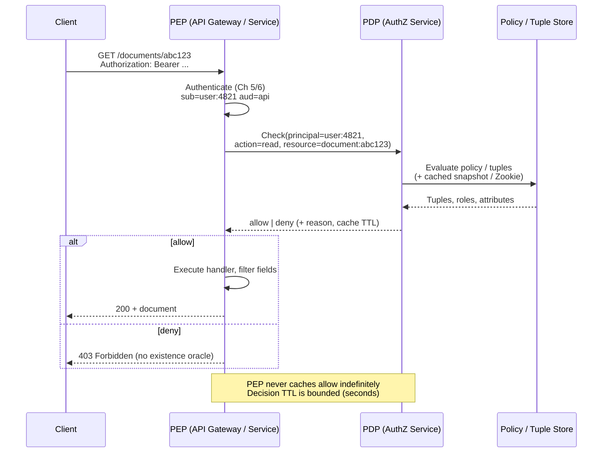
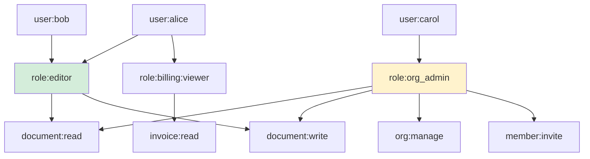
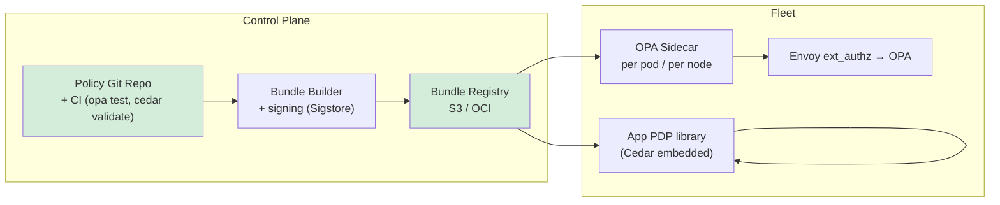
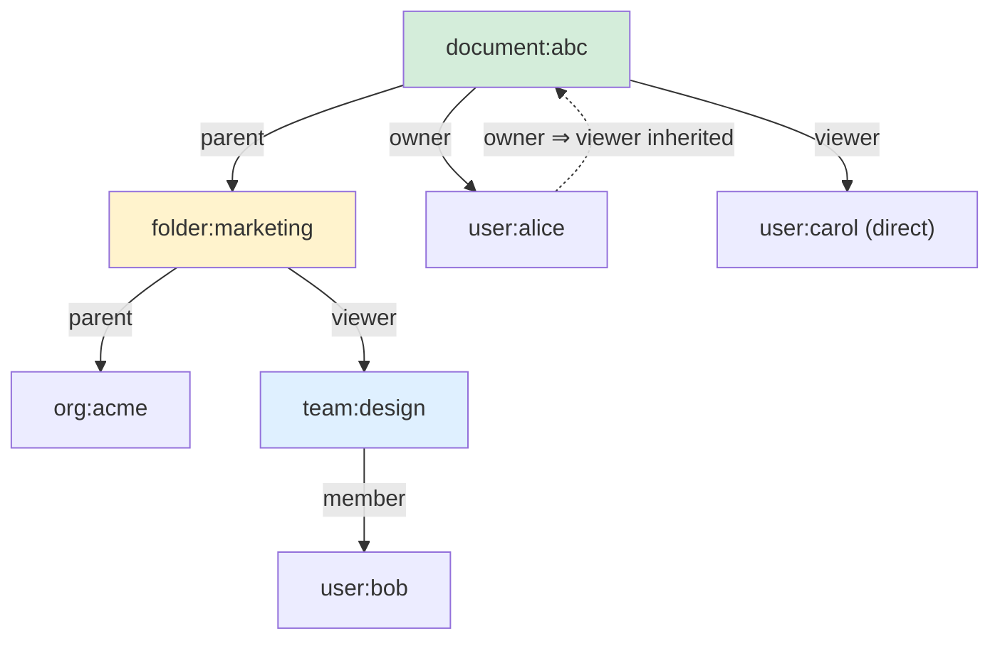
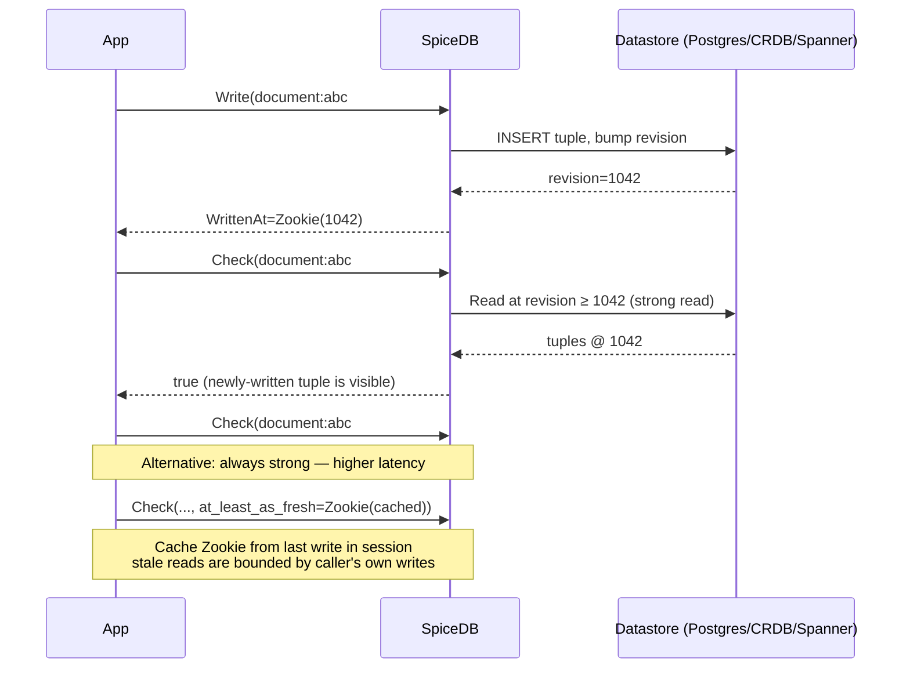
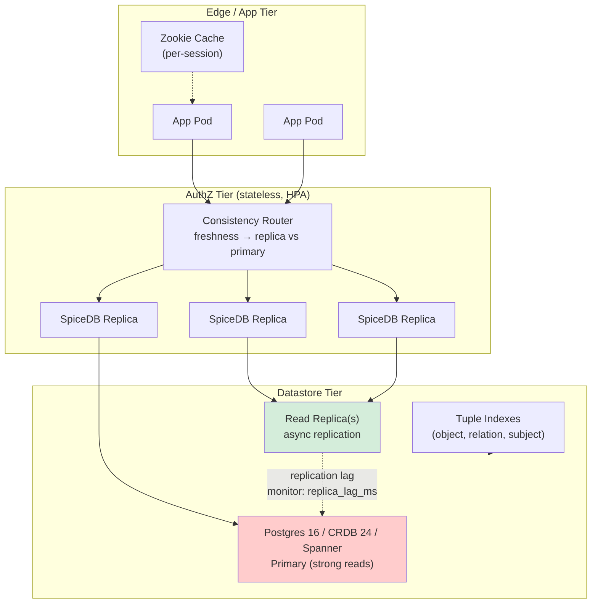
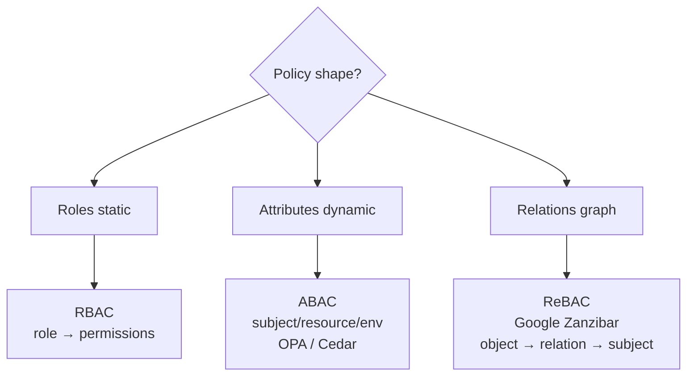
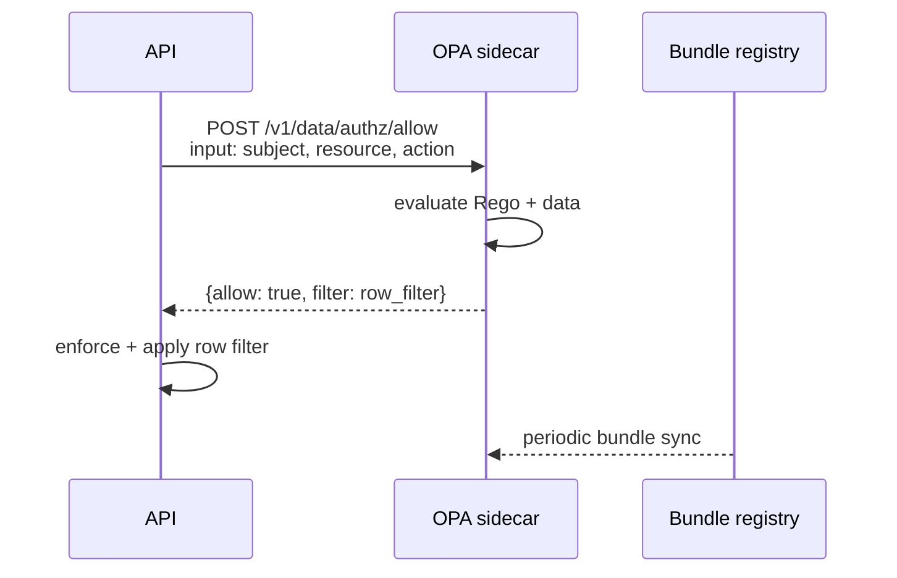

# Chapter 7 — Authorization: RBAC, ABAC, and ReBAC (Zanzibar)

**What this chapter covers.** Authentication (Ch 5) proves *who* you are; OAuth/OIDC (Ch 6) lets you delegate that proof. Authorization decides *what* you may do once your identity is established — the `allow` or `deny` at every API endpoint, every row, every field. At single-service scale this is an `if user.isAdmin` check. At fleet scale — thousands of services, millions of resources, hierarchical ownership, sharing, and revocation with bounded staleness — it is a distributed data and consistency problem whose wrong answer is a privilege escalation or a data leak. This chapter builds the three models every backend engineer must be able to design and operate: Role-Based Access Control (RBAC), Attribute-Based Access Control (ABAC), and Relationship-Based Access Control (ReBAC) as realized by Google Zanzibar (2019 paper) and its open-source incarnation AuthZed SpiceDB (v1.35+, CNCF). We implement all three, compare their expressiveness and operational cost, and show how centralized policy decision points scale without becoming a single point of failure or a p99 latency cliff.

Learning goals — after this chapter you should be able to:

- Distinguish authentication, authorization, and audit — and explain why `scope`/`claims` in a token are not an authorization decision, only an input to one.
- Design and implement RBAC (core + hierarchical) with role explosion mitigations, and explain where RBAC breaks (resource-instance granularity, contextual conditions).
- Design and implement ABAC with attribute-based policies (OPA/Rego v0.70+, Cedar 4.x) — policy-as-code, decision inputs, and bundle distribution.
- Model and operate ReBAC with Zanzibar/SpiceDB: schema, relation tuples, `Check`/`Expand`/`LookupResources`, Zookie-based consistency (`at_least_as_fresh`), and caveated relationships.
- Choose among RBAC, ABAC, and ReBAC (and their hybrids) by comparing expressiveness, latency, consistency, and operability at fleet scale.
- Architect a distributed authorization plane — PDP/PEP separation, decision caching, bulk checks, and revocation propagation — and test it for confused-deputy, TOCTOU, and inheritance-escalation bugs.

> **Boundary notes.** *Authentication* — proving identity via sessions, JWTs, and PKI — is **Ch 4–6** (PKI/TLS ops, sessions/JWTs, OAuth 2.0/OIDC). This chapter assumes the caller is already authenticated and the `sub`/`iss`/`aud`/`exp` on the presented credential have been validated; it decides what that authenticated principal may do. *Service-to-service* workload identity that feeds authorization (SPIFFE/SPIRE, mTLS) is **Ch 10**. *Policy-as-code for admission and compliance* (OPA/Kyverno for Kubernetes) shares tooling with ABAC but targets platform policy — covered here as policy engines, in the Companion Book 6 for cloud-native admission. *Threat modeling* the authorization boundary as an attack surface is **Ch 11**; data-layer row/column enforcement (RLS, views) is **Vol 5, Ch 5–6** (transactions/isolation is not access control). Secrets that gate access (Ch 8) are inputs to authorization, not authorization itself.

## Authorization at the request boundary

Every authenticated request converges on the same question inside the handler:

```
principal (who) + action (what) + resource (which) + context (when/where/how) ──► allow | deny
```

The principal is a `sub` (user `4821`), a service identity (`spiffe://prod/payments`), or a group membership expanded from the token. The action is `read`, `write`, `delete`, `publish`, `admin`. The resource is `document:abc123`, `org:acme/billing`, or `GET /v1/documents/{id}`. Context is time, IP, device posture, or a caveat (`only during business hours`).

Getting this check wrong is silent: the service returns `200` with data the caller should not have seen. There is no crash signal — only an access log that looks normal until an audit or a breach report reveals the leak. This is why authorization is tested as a *negative* property (enumerate what must be denied), not just a positive one.

In a monolith, authorization lives next to the data:

```go
func GetDocument(w http.ResponseWriter, r *http.Request) {
    user := auth.FromContext(r.Context()) // validated in Ch 5/6
    doc  := store.Get(r.PathValue("id"))
    if !canRead(user, doc) { // ← authorization
        http.Error(w, "forbidden", http.StatusForbidden)
        return
    }
    // ...
}
```

In a fleet, `canRead` cannot be a local function. The data it needs — roles, attributes, relationships — lives in other services, changes concurrently, and must be evaluated with a bounded staleness guarantee. The enforcement point (PEP) and the decision point (PDP) separate.



Two security properties govern the PEP/PDP contract:

1. **Fail-closed.** Any error in the PDP (timeout, store unavailable) denies by default. Fail-open authorization is a bypass.
2. **No oracle.** A `403` must not reveal whether the resource exists. `404` vs `403` distinguishes existence — return `404` for both "not found" and "not visible" when enumeration matters, or `403` uniformly when you do not need to hide existence. Choose per resource class and document it.

## RBAC: roles as the indirection layer

### Core model

RBAC (ANSI INCITS 359-2004, NIST RBAC) replaces per-principal, per-resource ACLs with two indirection tables:

```
Users ──(UA)──► Roles ──(PA)──► Permissions (action × resource class)
```

- **UA** (user assignment): `alice → {editor, billing:viewer}`.
- **PA** (permission assignment): `editor → {document:read, document:write}`.
- A **session** activates a subset of a user's roles (relevant when role sets are large or mutually exclusive constraints exist).

The payoff is administrative: when a permission changes, you update the role, not every user.



### Implementing RBAC in a service

The simplest correct implementation is a table plus middleware — no external PDP required — and is the right starting point for most teams.

```sql
-- Postgres 16 — RBAC core tables
CREATE TABLE roles (
    id   text PRIMARY KEY,          -- 'editor', 'billing:viewer'
    description text NOT NULL
);
CREATE TABLE permissions (
    id   text PRIMARY KEY,          -- 'document:read'
    action text NOT NULL,
    resource_class text NOT NULL
);
CREATE TABLE role_permissions (
    role_id text REFERENCES roles(id) ON DELETE CASCADE,
    permission_id text REFERENCES permissions(id) ON DELETE CASCADE,
    PRIMARY KEY (role_id, permission_id)
);
CREATE TABLE user_roles (
    user_id text NOT NULL,
    role_id text REFERENCES roles(id) ON DELETE CASCADE,
    scope_id text,                  -- NULL = global; 'org:acme' = scoped role
    granted_by text NOT NULL,
    granted_at timestamptz NOT NULL DEFAULT now(),
    PRIMARY KEY (user_id, role_id, coalesce(scope_id,''))
);
CREATE INDEX ON user_roles(user_id);
```

```go
// Go 1.22 — RBAC middleware (net/http). Validates aud/scope are not
// confused with authorization — Ch 6's access token claims are *inputs*,
// not the decision.

type Authorizer struct {
    db *sql.DB
    // Decision cache: userID+permission → bool, TTL 30s.
    // Revocation reduces TTL via pub/sub invalidation (see below).
    cache *lru.Cache
}

func (a *Authorizer) Require(permission string) func(http.Handler) http.Handler {
    return func(next http.Handler) http.Handler {
        return http.HandlerFunc(func(w http.ResponseWriter, r *http.Request) {
            p := auth.FromContext(r.Context())
            if p == nil {
                http.Error(w, "unauthenticated", http.StatusUnauthorized)
                return
            }
            ok, err := a.hasPermission(r.Context(), p.Subject, permission, p.OrgID)
            if err != nil {
                // Fail-closed: PDP error → deny, not 500 with data.
                slog.Error("authz check failed", "err", err, "sub", p.Subject)
                http.Error(w, "forbidden", http.StatusForbidden)
                return
            }
            if !ok {
                // No oracle: 403 without confirming resource existence.
                http.Error(w, "forbidden", http.StatusForbidden)
                return
            }
            next.ServeHTTP(w, r)
        })
    }
}

func (a *Authorizer) hasPermission(ctx context.Context, subject, perm, scope string) (bool, error) {
    key := subject + ":" + perm + ":" + scope
    if v, ok := a.cache.Get(key); ok {
        return v.(bool), nil
    }
    var exists bool
    err := a.db.QueryRowContext(ctx, `
        SELECT EXISTS(
            SELECT 1 FROM user_roles ur
            JOIN role_permissions rp ON rp.role_id = ur.role_id
            WHERE ur.user_id = $1
              AND rp.permission_id = $2
              AND (ur.scope_id IS NULL OR ur.scope_id = $3)
        )`, subject, perm, scope).Scan(&exists)
    if err != nil {
        return false, err
    }
    a.cache.Add(key, exists)
    time.AfterFunc(30*time.Second, func() { a.cache.Remove(key) })
    return exists, nil
}

// Usage:
// mux.Handle("GET /v1/documents/{id}",
//     authz.Require("document:read")(handleGetDocument))
```

Performance note: cache TTL is a *security* parameter, not just a latency one. A `30 s` TTL means a revocation (removing `alice` from `editor`) is visible fleet-wide within `30 s` plus replication lag. For sensitive permissions (`org:manage`, `billing:write`), use `5 s` or bypass the cache and serve from a replicated read model. Expose `authz_decision_cache_hit` and `authz_decision_latency_ms` as metrics — a sudden hit-rate drop is a revocation-burst or cache-poisoning signal.

### Hierarchical RBAC and its limits

Hierarchical RBAC (ANSI RBAC-2) adds role inheritance:

```
org_admin ⊃ editor ⊃ viewer        viewer ⊂ editor ⊂ org_admin
```

Inheritance is convenient (grant `org_admin` once, get all child permissions) but introduces the first scaling trap — **role explosion**. When teams need `editor of folder X but viewer of folder Y`, the instinct is to mint new roles per resource: `editor:folder:abc`, `viewer:folder:xyz`. With *R* resource instances and *P* permission classes, the role space grows as *O(R × P)*. At thousands of folders and dozens of teams, the role catalog becomes ungovernable, and every new product feature ("share a document with one user for 24 hours") requires a schema migration.

Two mitigations before abandoning RBAC:

- **Scoped roles.** Store `scope_id` alongside the role assignment (`alice is editor scoped to folder:abc`). The middleware checks `(user, role, scope)` rather than minting a new role per scope. This keeps the role catalog small (*P* roles) and pushes cardinality into the assignment table (which is indexed).
- **Team/Group indirection.** Assign roles to groups (`team:backend → editor`), and users to groups. A join replaces a flood of per-user rows, and team changes propagate without per-user writes.

When scoped roles still force per-instance rows and business logic needs contextual conditions (*"allow if owner or if shared and not expired"*), move to ABAC or ReBAC rather than minting more roles.

## ABAC: policy as code

Attribute-Based Access Control (NIST SP 800-162) replaces the role indirection with a **policy evaluated over attributes** of the principal, the resource, the action, and the environment:

```
policy: allow if
    principal.department == resource.department
    && action == "read"
    && environment.time ∈ business_hours
    && resource.classification ≤ principal.clearance
```

The PDP evaluates these policies per request. Two dominant policy engines in 2024–2026:

| Engine | Language | Distribution | Strength |
|---|---|---|---|
| **OPA / Styra** (OPA v0.70+, Rego) | Rego — Datalog-inspired, JSON over HTTP | Bundle (tar.gz over HTTPS) or sidecar (`opa` container) | Mature, large ecosystem, Envoy/Istio integration |
| **Cedar** (AWS, v4.x, Apache-2.0) | Cedar — typed, formally verified authorization | Embedded library (Rust/Go/Java) | Strong typing, formal analysis, analyzer tool |

Both are version-pinned here because policy semantics change across releases — pin the engine exactly as you pin compilers.

### OPA/Rego example: document access

Policies live in versioned bundles, not in application code. The application sends a JSON `input` and reads `result.allow`.

```rego
# bundle/policy/document.rego — OPA v0.70+, Rego
package document.authz

import future.keywords.in

default allow := false

# Rule 1: org_admin on the same org can do anything
allow if {
    input.principal.roles[_] == "org_admin"
    input.principal.org_id == input.resource.org_id
}

# Rule 2: owner can read/write their document
allow if {
    input.action in {"read", "write"}
    input.principal.sub == input.resource.owner_id
}

# Rule 3: shared-with user can read if share is active and not expired
allow if {
    input.action == "read"
    some share in input.resource.shares
    share.principal == input.principal.sub
    share.revoked == false
    time.now_ns() < time.parse_rfc3339_ns(share.expires_at)
}

# Rule 4: deny if resource classification exceeds clearance
deny_reason["insufficient clearance"] if {
    input.resource.classification == "confidential"
    input.principal.clearance != "confidential"
}
allow if {
    not deny_reason[_]
    # ... positive rules above
}
```

```go
// Go — OPA sidecar check (OPA bundle served at localhost:8181)
func opaAllow(ctx context.Context, input any) (bool, error) {
    body, _ := json.Marshal(map[string]any{"input": input})
    req, _ := http.NewRequestWithContext(ctx, "POST",
        "http://localhost:8181/v1/data/document/authz/allow", bytes.NewReader(body))
    req.Header.Set("Content-Type", "application/json")
    resp, err := http.DefaultClient.Do(req)
    if err != nil {
        return false, err // fail-closed: treat PDP error as deny upstream
    }
    defer resp.Body.Close()
    var out struct{ Result bool `json:"result"`}
    if err := json.NewDecoder(resp.Body).Decode(&out); err != nil {
        return false, err
    }
    return out.Result, nil
}
```

Deployment for ABAC at scale:



- **Bundle distribution** is the consistency problem. OPA polls bundles over HTTPS with ETag; Cedar libraries reload from S3. Use bundle signing and `bundle.activate` only after `opa test` passes in CI. Canary bundle rollout per region before fleet-wide.
- **Latency.** OPA sidecar adds ~1–3 ms p50 per check on the same host (Unix socket preferred). For p99-sensitive paths, evaluate inline (Cedar embedded library, zero hop) or batch checks.
- **Debuggability.** Every deny must log a *reason* (`deny_reason` above) at `debug` level with a request correlation ID — otherwise ABAC denials become unactionable and operators widen policies to "make it work."

ABAC's weakness is operational: when every permission is a policy expression over arbitrary attributes, the policy set grows without a data model. Review becomes hard ("does any policy grant `alice` access to `doc:xyz`?"), and performance depends on attribute fetch latency. ReBAC gives that policy set a graph structure.

## ReBAC: relationships as the data model

ReBAC treats authorization as a **graph question**: is there a path from the principal to the resource through typed relationships? Google introduced the model in the *Zanzibar: Google's Consistent, Global Authorization System* paper (USENIX ATC 2019), the system behind Drive, Calendar, YouTube, and ~500 other Google services. AuthZed SpiceDB (CNCF, v1.35+ in 2025–2026) is the widely adopted open-source Zanzibar implementation; OpenFGA (CNCF) and Keto offer compatible models.

### The Zanzibar mental model

Every check is `Check(subject, relation, object)` — "does `user:alice` have `viewer` on `document:abc`?"

Relationships are **tuples** of the form `object#relation@subject`:

```
document:abc#owner@user:alice
document:abc#viewer@user:bob
folder:marketing#viewer@team:design
team:design#member@user:bob           // bob is a member of team:design
document:abc#parent@folder:marketing   // abc lives in folder marketing
```

Schema defines how relations compose — union, intersection, exclusion, and indirection through other relations:



Reading the graph: `user:bob` has `viewer` on `document:abc` not because of a direct tuple, but because `document:abc#parent@folder:marketing`, `folder:marketing#viewer@team:design`, and `team:design#member@user:bob` chain transitively. This transitivity is declared in schema, evaluated by the server.

### SpiceDB schema

SpiceDB schemas (v1.35+ DSL, validated with `zed validate`) declare object types, relations, and permission composition:

```c
// schema.zed — SpiceDB v1.35+ (AuthZed)
// Validate:  zed schema validate schema.zed
// Write:     zed schema write schema.zed

definition user {}

definition team {
    relation member: user
}

definition org {
    relation admin: user
    relation member: user | team#member
    // org member includes direct users and members of teams assigned to the org
    permission view = member + admin
    permission manage = admin
}

definition folder {
    relation parent: org
    relation viewer: user | team#member | org#member
    relation editor: user | team#member | org#admin
    relation owner: user

    // Permissions compose relations + parent indirection:
    permission view = viewer + editor + owner + parent->view
    permission edit = editor + owner + parent->manage
}

definition document {
    relation parent: folder | org
    relation owner: user
    relation viewer: user | team#member
    relation editor: user | team#member
    relation viewer_via_share: user  // populated by share service, with caveat

    // viewer_via_share is caveated (expiry check) — see below
    permission view = viewer + viewer_via_share + editor + owner + parent->view
    permission edit = editor + owner + parent->edit
    permission delete = owner + parent->manage
}
```

Key composition operators:

- `+` — union (any path grants).
- `&` — intersection (all paths must grant, e.g., `member & not_blocked`).
- `-` — exclusion (e.g., `viewer - banned`).
- `->` — indirection through a relation on another object (`parent->view` means "if the parent grants `view`, so do we").

### Tuples, checks, and caveats

Tuples are the data plane. The control plane is tiny; the data plane holds billions of tuples at Google scale and millions in a typical SpiceDB deployment.

```bash
# AuthZed SpiceDB 1.35+ — zed CLI (github.com/authzed/zed v0.20+)
# Assumes spicedb running locally (docker run quay.io/authzed/spicedb serve ...)

# Write tuples
zed relationship create document:abc#owner@user:alice
zed relationship create document:abc#parent@folder:marketing
zed relationship create folder:marketing#parent@org:acme
zed relationship create folder:marketing#viewer@team:design
zed relationship create team:design#member@user:bob
zed relationship create document:abc#viewer@user:carol

# Check: does bob have viewer on document:abc? (via folder→team indirection)
zed permission check document:abc#view@user:bob
# → true (via folder:marketing#viewer@team:design#member)

# Expand: show *why* bob has viewer (for debuggability / audit)
zed permission expand document:abc#view

# Bulk check: which documents can bob view? (fan-out for list endpoints)
zed permission lookup-resources document#view --subject user:bob
```

**Caveated relationships** (SpiceDB v1.30+; Zanzibar "contextual tuples") attach a condition evaluated at check time — the bridge from pure ReBAC to ABAC-style context:

```c
// Caveat definition in schema
caveat expiry_caveat(expires_at timestamp) {
    expires_at > now()
}

definition document {
    // ...
    relation viewer_via_share: user with expiry_caveat
    permission view = viewer + viewer_via_share + editor + owner + parent->view
}
```

```bash
# Tuple with caveat context supplied at check time
zed relationship create document:abc#viewer_via_share@user:dave \
    --caveat expiry_caveat --context '{"expires_at": "2026-09-01T00:00:00Z"}'

# Check supplies `now()` from server time; expired shares deny automatically.
zed permission check document:abc#view@user:dave
```

This keeps the tuple store from needing background reapers for expiry — the condition is evaluated live, and revocation is a tuple delete.

### Consistency: Zookies and `at_least_as_fresh`

Zanzibar's central contribution is a consistency token — the **Zookie** (SpiceDB's `ZedToken`, an opaque string encoding a datastore revision). Every write returns a Zookie; every read accepts one as a freshness bound:



In practice:

- **After a write you control** (share a document, revoke access), pass the returned Zookie as `at_least_as_fresh` on the next check. The user who just shared a doc sees it shared immediately — causal consistency without paying strong-read latency on every check.
- **On the hot path**, cache a Zookie per request or per session and reuse it — SpiceDB can serve from a read replica at that revision, preserving horizontal read scaling.
- **`fully_consistent=true`** forces a strong read from the primary — use for sensitive checks (delete, billing) where staleness is unacceptable, and accept the latency cost.

SpiceDB exposes this as:

```go
// Go — authzed-go v1.0+ (github.com/authzed/authzed-go v1.2+)
import (
    pb "github.com/authzed/authzed-go/proto/authzed/api/v1"
    "github.com/authzed/authzed-go/v1"
)

client, _ := authzed.NewClient("localhost:50051",
    grpc.WithTransportCredentials(insecure.NewCredentials()),
    grpcutil.WithInsecureBearerToken("s3cr3t"), // preshared key; mTLS in prod (Ch 10)
)

// Check with Zookie from a prior write
resp, err := client.CheckPermission(ctx, &pb.CheckPermissionRequest{
    Resource:   &pb.ObjectReference{ObjectType: "document", ObjectId: "abc"},
    Permission: "view",
    Subject:    &pb.SubjectReference{Object: &pb.ObjectReference{ObjectType: "user", ObjectId: "bob"}},
    Consistency: &pb.Consistency{
        Requirement: &pb.Consistency_AtLeastAsFresh{
            AtLeastAsFresh: zookieFromPriorWrite, // *pb.ZedToken or nil
        },
    },
})
// resp.Permissionship == PERMISSIONSHIP_HAS_PERMISSION

// Bulk check for list endpoints — which of 100 docs can bob view?
bulk, _ := client.BulkCheckPermission(ctx, &pb.BulkCheckPermissionRequest{
    Consistency: &pb.Consistency{Requirement: &pb.Consistency_MinimizeLatency{MinimizeLatency: true}},
    Items: items, // []*BulkCheckPermissionRequestItem, up to ~100 per call
})
```

For HTTP list filtering without N+1 checks, prefer `LookupResources` — the server does the fan-out:

```bash
# Which documents can bob view? (server-side graph traversal)
zed permission lookup-resources document#view --subject user:bob --consistency minimize_latency
```

### Distributed Zanzibar at scale



- **Stateless serving tier.** SpiceDB replicas are stateless — they dispatch graph traversal (Watch + dispatch) across the cluster. Scale with HPA on `spicedb_check_latency_p99`. The bottleneck is the datastore, not the dispatch tier.
- **Datastore choice.** Postgres 16 (single-region, simpler), CockroachDB 24.x or Spanner (multi-region, strong reads without a single primary). SpiceDB's datastore interface abstracts this; choose by region requirements.
- **Indexing.** Every tuple lookup is `(object_type, object_id, relation)` or `(subject_type, subject_id)`. Undersized indexes turn a `Check` from `~5 ms` into a table scan. SpiceDB's `migrate` creates them — do not drop them.
- **Watch API for cache invalidation.** SpiceDB's `Watch` streams tuple changes as Zookies. Use it to invalidate PEP decision caches — `Watch` from the last seen Zookie, invalidate cache entries whose resource appeared in the stream.

## Choosing among RBAC, ABAC, and ReBAC

| Dimension | RBAC | ABAC | ReBAC (Zanzibar/SpiceDB) |
|---|---|---|---|
| **Model** | `user→role→permission` | `policy(attributes) → allow` | `graph(subject—relation→object) → allow` |
| **Granularity** | Class-level ("editors can edit docs") | Arbitrary conditions | Instance-level ("bob can view doc abc via folder") |
| **Delegation / sharing** | New role or assignment | New policy rule | New tuple (cheap, no deploy) |
| **Hierarchy / inheritance** | Role hierarchy (limited) | Explicit in policy | `parent->permission` in schema |
| **Context (time, IP, expiry)** | No | First-class | Via caveats (ABAC inside ReBAC) |
| **Audit ("who can access X?")** | Query `user_roles` | Policy analysis (hard) | `Expand` / `LookupResources` (graph query) |
| **Latency** | Cacheable DB lookup (µs–ms) | Policy eval + attribute fetch (ms–10s ms) | Graph traversal + datastore read (5–20 ms p50) |
| **Consistency** | DB replication lag | Bundle + attribute staleness | Zookie-bounded (causal) |
| **Ops cost** | Low | Medium (policy lifecycle) | Medium-High (tuple store, schema migrations) |

Practical guidance at fleet scale:

- **Default to RBAC** for coarse, class-level permissions (`org_admin`, `billing:read`). It is simple, fast, and sufficient for most service-level gates.
- **Add ABAC** when decisions need environmental context (clearance, time window, device posture) that does not fit a relation. OPA/Cedar policies can call ReBAC as one input (`spicedb_check` as a built-in).
- **Adopt ReBAC** when resources are hierarchical (org → folder → document), sharing is user-driven, or you need to answer "which resources can this principal access?" efficiently. If your permission model has ever required a `shared_with` table that joins through folders and teams, ReBAC is that join as a service.
- **Hybrid is normal.** A mature platform runs RBAC for coarse gates, ReBAC for resource-instance decisions, and a thin ABAC policy layer for cross-cutting conditions (blocklists, geo-fencing). Keep the hybrid explicit — document which layer owns which permission, or operators will check the wrong one during an incident.

## Failure modes and incident patterns

**Role explosion → privilege creep.** Teams mint `viewer_plus_one_permission` roles to avoid a policy change, and the catalog grows until no one can audit it. Mitigation: cap the role catalog (e.g., ≤20 roles), require scoped assignments instead of new roles, and alert on role count growth.

**Confused deputy.** Service A presents a token with `scope: document:read` to Service B, but B serves `document:write` because it checks "is the caller authenticated?" not "does the caller's scope cover this action?" Mitigation: every PEP validates `scope`/`permission` against the requested action, not just identity; test cross-scope tokens in CI (request `write` with a `read` token, expect `403`).

**TOCTOU (time-of-check, time-of-use).** Check passes, then the resource is deleted or permissions change before the use. A `Check` followed by a `Get` without atomicity leaks a deleted resource or bypasses a revocation. Mitigation: where consistency matters, bundle check+fetch via the same Zookie / same transaction, or re-check at use time. For bulk operations, `LookupResources` already returns only currently-visible resources.

**Inheritance escalation.** Schema `permission view = viewer + parent->view` plus an overly broad `folder:marketing#viewer@user:*` grants every document under the folder to every user. Mitigation: never use wildcard tuples in production; model "everyone" as an explicit group (`team:all`) whose membership is audited, and review schema `parent->` chains for transitive blast radius.

**Cache-poisoned allow.** A PEP caches `allow=true` for `TTL=5 min`; a revocation deletes the tuple but the cache still allows. Mitigation: short TTLs (5–30 s), `Watch`-based invalidation, and `at_least_as_fresh` on sensitive paths. Monitor `authz_stale_allow_total` estimated from `Watch` lag.

**Schema migration without backfill.** Adding `permission view = ... + new_relation` before tuples for `new_relation` exist silently narrows access; removing a composition silently widens it. Mitigation: SpiceDB schema migrations are additive — deploy new schema, backfill tuples, then rely on the new permission. Test schema changes with `zed validate` and a shadow check (compare old vs new schema results on sampled requests) before promoting.

## Distributed-systems lens

Authorization at scale is a *data system* problem with availability and partition implications distinct from authentication:

- **Authorization data is a hot, graph-structured dataset with strong consistency needs on revocation.** A login (Ch 5) can tolerate seconds of staleness; a revoke ("remove eve from document") must be visible before the next `Check` that matters. Zookies give you the knob — causal freshness per caller without forcing every check to the primary. Use it.
- **Decision fan-out on list endpoints.** `GET /documents?filter=mine` naively checks `N` resources with `N` round-trips — an N+1 that becomes a p99 cliff at `N=100`. `LookupResources` / `BulkCheck` pushes the fan-out to the authz tier, which parallelizes traversal against the tuple store. Push filter-then-authorize queries down; never filter in the app loop.
- **Cross-region authorization.** Tuple replication lag across regions delays revocation visibility. Options: (a) serve checks from the write region for sensitive resources (higher latency, strong), (b) accept bounded staleness (low latency, needs TTL discipline), or (c) use CRDB/Spanner with strong cross-region reads. Do not pretend a single-region tuple store is multi-region consistent — document the staleness SLA per resource class.
- **Bulkhead the PDP.** The authz tier is a hard dependency — every request validates against it. Apply the same resilience patterns as any critical dependency (Vol 7, Ch 11; Vol 11, Ch 10): circuit breaker (fail-closed), bulkhead (isolate authz thread pool), timeout (`50 ms` budget for a check, `200 ms` for `LookupResources`), and a degraded mode only where explicitly approved (e.g., read-only cache for `view` but never for `delete`). A PDP outage must not become an authz bypass.
- **Observability.** Emit `authz_check_total{result=allow|deny, permission, cached}`, `authz_check_latency_ms`, `spicedb_datastore_replica_lag_ms`, and `authz_policy_version`. Alert on `deny` rate spikes (misconfigured rollout), `p99` latency regression (missing index), and replica lag exceeding the decision TTL.


#### RBAC vs ABAC vs ReBAC



#### OPA Policy Evaluation



## Key takeaways

- Authorization answers `principal × action × resource × context → allow|deny`. Authentication (Ch 5–6) is a prerequisite, not a substitute — validating a token's `aud`/`exp`/`scope` is only the input to the decision.
- RBAC (`user→role→permission`, ANSI 359) is the right default for class-level gates. Implement with `(user_roles, role_permissions)` tables, scoped assignments (`scope_id`), and short-TTL decision caches (5–30 s) that fail closed on PDP error and hide existence on deny.
- ABAC (OPA/Rego v0.70+, Cedar 4.x) expresses arbitrary attribute conditions (`clearance`, `time`, `classification`) as versioned policy bundles. Ship bundles via CI with signing, sidecar or embedded evaluation, and per-decision `deny_reason` for operability.
- ReBAC (Zanzibar 2019, SpiceDB v1.35+) models permissions as a typed graph (`object#relation@subject` tuples) with schema-declared composition (`+`, `&`, `-`, `parent->permission`). It is the correct model for hierarchical resources and user-driven sharing.
- SpiceDB's Zookie (`ZedToken`) gives causal consistency without forcing every check to the primary: pass `at_least_as_fresh=Zookie(write)` after a write you control, `fully_consistent` for sensitive paths, `minimize_latency` otherwise. Use `LookupResources`/`BulkCheck` for list endpoints to avoid N+1.
- At fleet scale, authorization is a tiered architecture — coarse RBAC + instance-level ReBAC + thin ABAC for context — served by a stateless dispatch tier (SpiceDB HPA) over a replicated tuple store (Postgres 16 / CRDB 24) with `Watch`-based cache invalidation and circuit-broken, fail-closed PEPs.

## Further reading

- **Papers:** Pang et al. — *Zanzibar: Google's Consistent, Global Authorization System* (USENIX ATC 2019) — the definitive ReBAC paper; read §2–§4 for model and consistency, §5 for scale. Sandhu et al. — *The NIST Model for Role-Based Access Control* (ACM RBAC 2000) and ANSI INCITS 359-2004 — RBAC reference model. NIST SP 800-162 — *Guide to ABAC Definition and Considerations*.
- **Standards:** ANSI INCITS 359 (RBAC), NIST SP 800-162 (ABAC). OPA Policy Reference (https://www.openpolicyagent.org/docs/latest/policy-reference/) — Rego semantics. Cedar Language Reference (https://docs.cedarpolicy.com/) — typed policy, validation, and formal analysis.
- **SpiceDB / Zanzibar:** AuthZed SpiceDB docs (https://authzed.com/docs/spicedb) — schema DSL, consistency modes, `zed` CLI, datastore backends. `authzed-go` v1.2+ (https://github.com/authzed/authzed-go). OpenFGA docs (https://openfga.dev/docs) — alternative Zanzibar implementation; compare schema ergonomics. Google Zanzibar whitepaper errata and AuthZed blog — caveats and `LookupResources` performance notes.
- **OPA/Cedar:** OPA v0.70+ docs — https://www.openpolicyagent.org/docs/latest/ — bundle lifecycle, Envoy `ext_authz` integration, `opa test`. Cedar 4.x docs — https://docs.cedarpolicy.com/ — schema, entities, and the `cedar validate` / `cedar analyze` toolchain.
- **Operational:** *Ship authorization as a platform* — AuthZed blog series on `Watch`, bulk checks, and CRDB/Spanner deployment. Kyverno/OPA Gatekeeper docs for admission policy contrast (platform policy vs data-plane authz).
