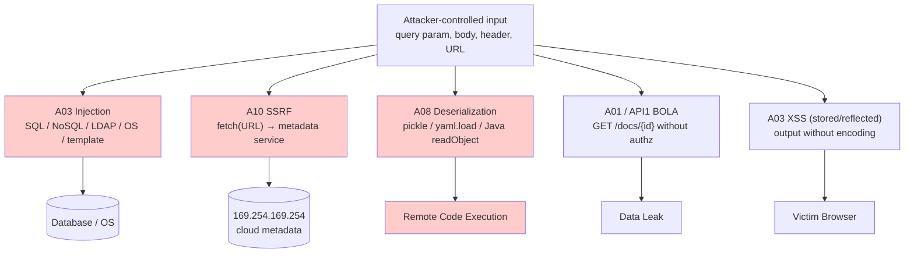
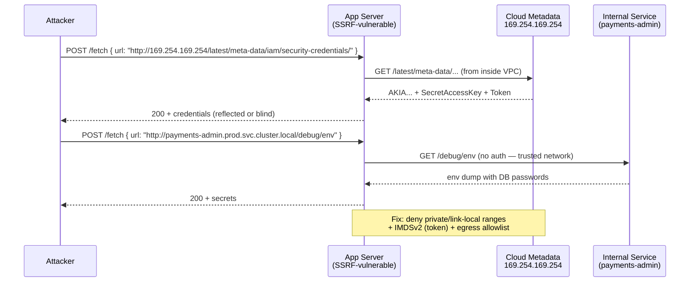
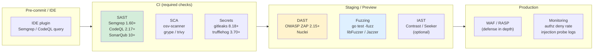

# Chapter 9 — Application Security: OWASP, Injection, SSRF, and Deserialization

**What this chapter covers.** Cryptography (Ch 1–4), authentication (Ch 5–6), authorization (Ch 7), and secrets (Ch 8) form the perimeter and the control plane. Application security is what happens *inside* the handler — where user-controlled input meets string interpolation, query builders, HTTP clients, template engines, and deserializers. A single unsanitized concatenation can become SQL injection; a single unchecked URL fetch can become Server-Side Request Forgery (SSRF) that reaches the cloud metadata service; a single `pickle.loads` on untrusted bytes can become remote code execution. These are not exotic bugs — they are the top entries on the OWASP Top 10 (2021, with 2023 API Top 10 and the emerging 2025 draft) year after year, and they dominate breach reports because they bypass every perimeter control at once. This chapter builds a systematic AppSec practice for backend engineers: input handling as a discipline, injection prevention by construction (parameterized queries, not escaping), SSRF defense in depth for cloud-native backends, deserialization and template-injection safety, and the surrounding controls — security headers, dependency and supply-chain risk, and verification (SAST/DAST/IAST, fuzzing) — that make the practice durable at fleet scale.

Learning goals — after this chapter you should be able to:

- Map OWASP Top 10 2021 and OWASP API Security Top 10 2023 to concrete backend risks — and explain where each risk traverses the Fleet/Vol 7–8 boundary vs where it lives inside a single handler.
- Prevent injection by construction — parameterized queries (SQL), safe query builders (NoSQL/LDAP/XPath), and output encoding (XSS) — and explain why escaping/blacklisting is the wrong primitive.
- Defend against SSRF in cloud-native backends — URL parsing pitfalls, allowlist-based egress, metadata-service hardening (IMDSv2), and per-request egress policy.
- Eliminate dangerous deserialization — `pickle`/`yaml.load`/`Java deserialization` as RCE — and safely handle untrusted structured input (JSON schema validation, strict codecs).
- Apply the remaining OWASP controls that matter for backends — authentication/authorization failures, security misconfiguration, vulnerable dependencies, and logging/monitoring — with version-pinned tooling.
- Operate verification — SAST, DAST, IAST, SCA, and fuzzing — in CI/CD without drowning in false positives, and measure AppSec posture with actionable metrics.

> **Boundary notes.** *Cryptography and hashing* that underpin AppSec controls (CSRF tokens, signed URLs) are **Ch 1–3**; *session and token mechanics* (CSRF defense via `SameSite`/double-submit, JWT validation) are **Ch 5**; *delegation* (OAuth/OIDC) is **Ch 6**; *authorization* (IDOR/BOLA, access-control checks) is **Ch 7**; *secrets that AppSec must not leak* (keys, tokens in logs) are **Ch 8**; *mTLS and workload identity* that harden service-to-service calls (relevant for SSRF egress) are **Ch 10**; *threat modeling* the application as an attack surface is **Ch 11**. *Supply-chain* depth (SBOMs, SLSA, signing, CI/CD hardening) is the Companion Series (Books 1–6) — this chapter covers the *application* side of dependency risk (SCA, reachability), not the *pipeline* side. *Database isolation and RLS* are **Vol 5, Ch 5–6**; *API design* (idempotency, pagination, error handling) is **Vol 8**; *observability* (logging at scale, SIEM) is **Vol 11, Ch 3**.

## The OWASP lens for backend engineers

> **Version pins.** **OWASP Top 10 2021** (current stable as of 2025–2026; 2025 draft in public review) — the primary map used here. **OWASP API Security Top 10 2023** — the API-specific overlay (BOLA, BFLA, etc.) that matters for every backend that exposes REST/gRPC/GraphQL. **OWASP ASVS 4.0.3** — the verification standard for control depth. Tool versions pinned inline (Semgrep, CodeQL, ZAP, etc.) as of 2025–2026.

OWASP Top 10 2021 — the eight categories that dominate backend risk (two are frontend/broad and noted):

| # | Category (2021) | Backend meaning | Where it lives |
|---|---|---|---|
| **A01** | Broken Access Control | Missing or bypassable authorization checks — Ch 7's problem, AppSec's most exploited entry | Every handler (Ch 7) |
| **A02** | Cryptographic Failures | Weak TLS, leaked secrets, insufficient encryption — Ch 3–4, Ch 8 | Transport + storage |
| **A03** | Injection | SQL/NoSQL/LDAP/XPath/OS command, XSS, template injection | **This chapter — § Injection** |
| **A04** | Insecure Design | Missing threat model, no security requirements — Ch 11 | Design phase |
| **A05** | Security Misconfiguration | Default creds, verbose errors, open S3 buckets, permissive CORS | **This chapter — § Misconfig** |
| **A06** | Vulnerable Components | Outdated libs with known CVEs — SCA/reachability | **This chapter — § Dependencies** |
| **A07** | Auth Failures | Broken session, credential stuffing, MFA gaps — Ch 5–6 | AuthN (Ch 5–6) |
| A08 | Software & Data Integrity Failures | Deserialization, unsigned updates — CI/CD + **§ Deserialization** | Pipeline + **this chapter** |
| **A09** | Logging & Monitoring Failures | Insufficient detection, no alerting — Vol 11, Ch 3–5 | Observability |
| **A10** | SSRF | Server fetches attacker-controlled URL — cloud metadata exfil | **This chapter — § SSRF** |

OWASP API Security Top 10 2023 adds precision for backends:

- **API1 BOLA** (Broken Object Level Authorization) — `GET /v1/documents/{id}` without verifying the caller may access *that* `id` (IDOR). Ch 7 + this chapter.
- **API3 BFLA** (Broken Function Level Authorization) — unprotected admin/debug endpoints. Ch 7.
- **API8 Security Misconfiguration** — excessive CORS, missing rate limits (Vol 7, Ch 9), verbose GraphQL introspection.

The Top 10 is a *prioritization* tool, not a checklist. Use it to allocate review and testing effort: every handler gets injection + access-control review; every outbound fetch gets SSRF review; every deserialization boundary gets a codec review.



## Injection: the failure to separate code from data

Every injection flaw has the same root cause: **user input is concatenated into a string that is later parsed as code** — SQL, shell, LDAP filter, XPath, template directive, or HTML. The fix is the same in every case: **never build code by string interpolation; use a parameterized API that keeps code and data on separate channels.**

Escaping and blocklisting are not fixes — they are filters that the next encoding bypasses. Parameterization is construction.

### SQL injection

The canonical example — and still the most damaging at scale because it exfiltrates or mutates the entire database:

```go
// ❌ VULNERABLE — Go 1.22, database/sql — string interpolation
func getUserVulnerable(db *sql.DB, username string) (*User, error) {
    // Attacker sends username = `' OR '1'='1' --`  → returns all users
    // or `'; DROP TABLE users; --`               → destructive
    query := fmt.Sprintf("SELECT id, email FROM users WHERE username = '%s'", username)
    row := db.QueryRow(query)
    var u User
    err := row.Scan(&u.ID, &u.Email)
    return &u, err
}

// ✅ SAFE — parameterized query (prepared statement), same driver
func getUserSafe(db *sql.DB, ctx context.Context, username string) (*User, error) {
    // Data travels as a bound parameter, never parsed as SQL.
    row := db.QueryRowContext(ctx,
        "SELECT id, email FROM users WHERE username = $1", // Postgres $1; MySQL ?, SQLite ?
        username,
    )
    var u User
    if err := row.Scan(&u.ID, &u.Email); err != nil {
        return nil, err
    }
    return &u, nil
}
```

```python
# Python — psycopg 3.1+ (psycopg[binary]) — same principle
# ❌ VULNERABLE
cur.execute(f"SELECT id, email FROM users WHERE username = '{username}'")
# ✅ SAFE — server-side parameter binding
cur.execute("SELECT id, email FROM users WHERE username = %s", (username,))
# ✅ SAFE — SQLAlchemy 2.0+ — expression builder, no string concatenation
stmt = select(User).where(User.username == username)  # bound parameter
```

This extends beyond `SELECT`:

- **Dynamic table/column names** cannot be parameterized — they are *identifiers*, not *values*. Allowlist them:

```go
var allowedSortCols = map[string]bool{"created_at": true, "name": true, "email": true}

func listUsersSafe(db *sql.DB, sortCol string) ([]User, error) {
    if !allowedSortCols[sortCol] {
        return nil, fmt.Errorf("invalid sort column: %q", sortCol)
    }
    // Identifier is allowlisted, not parameterized — safe after validation.
    query := fmt.Sprintf("SELECT id, email FROM users ORDER BY %s", sortCol)
    rows, err := db.Query(query)
    // ...
}
```

- **ORMs are not automatically safe.** `User.objects.raw("SELECT ... %s" % username)` (Django) or `query("SELECT ... " + input)` (any string-concatenated ORM call) reintroduces injection. Use the ORM's parameterized API (`filter(username=...)`) and lint for `raw`/`extra`/`RawSQL`.

- **Second-order injection.** Data that was safely stored (via parameterized `INSERT`) is later concatenated into a new query without parameterization. The store does not sanitize — the *use* must parameterize.

### NoSQL, LDAP, XPath, OS command

The same code-vs-data confusion appears wherever a backend builds a query or command from input:

```javascript
// ❌ MongoDB injection — Node.js mongodb driver 6.x
// Attacker sends { "username": { "$ne": null }, "password": { "$ne": null } } as JSON body
db.collection("users").findOne({ username: req.body.username, password: req.body.password })
// → matches any user when $ne is parsed as an operator

// ✅ SAFE — validate type, use strict equality, or use an ODM with schema
if (typeof req.body.username !== "string" || typeof req.body.password !== "string") {
    return res.status(400).send("invalid input");
}
db.collection("users").findOne({ username: req.body.username, password: hash(req.body.password) })

// ❌ OS command injection — Go os/exec
cmd := exec.Command("sh", "-c", "convert "+inputPath+" "+outputPath) // inputPath="; rm -rf /;"

// ✅ SAFE — no shell, args as separate elements, allowlisted paths
cmd := exec.Command("convert", validatedInputPath, validatedOutputPath)
// validatedInputPath must be allowlisted (e.g., regex ^/data/uploads/[a-z0-9_-]+\.png$)
```

LDAP filter injection (`*` `(` `)` `\\` `\0`), XPath (`' or '1'='1`), and template injection (Jinja2 `{{ }}`) follow the same rule — use the engine's parameterized/bound API, never string concatenation.

### XSS as an injection at the output boundary

Cross-Site Scripting is injection where the *output* is parsed as code by the victim's browser. The backend fix is **context-aware output encoding** at every render boundary:

- **HTML body:** `html/template` (Go, auto-escapes), Jinja2 autoescape, React JSX (auto-escapes by default — `dangerouslySetInnerHTML` is the escape hatch that reintroduces the bug).
- **HTML attribute / URL / JS context:** different encoders — `url.QueryEscape`, `jsEncoder`. Encoding for the wrong context is still vulnerable.
- **Content Security Policy (CSP)** as defense in depth — not a substitute for encoding, but limits blast radius when encoding is missed. See § Security Headers below.

## SSRF: the server as a confused deputy

SSRF (OWASP A10 2021, after climbing from the API Top 10) is the backend analogue of open redirect — the server fetches a URL that the attacker controls, and that fetch originates from *inside* the trust boundary. In a cloud-native backend, SSRF reaches:

- **Cloud metadata service** — `http://169.254.169.254/latest/meta-data/` (AWS IMDSv1), `http://metadata.google.internal/` (GCP), `http://169.254.169.254/metadata/` (Azure). With IMDSv1, a single SSRF leaks IAM credentials. IMDSv2 (token-required) mitigates but is not universally enforced.
- **Internal services** — `http://internal-payments.prod.svc.cluster.local/admin`, Redis, Elasticsearch, or any unauthenticated internal endpoint reachable from the fetching pod.
- **File scheme / gopher / dict** — `file:///etc/passwd`, `gopher://` (if the HTTP client supports it) — depending on client library.



### Why naive validation fails

```go
// ❌ BROKEN — blocklist of private IPs, checked before DNS — bypassed by:
// - DNS rebinding: attacker domain resolves to 1.2.3.4 (allowed) then to 169.254.169.254 on fetch
// - 0xA9FEA9FE (hex), 2852039166 (decimal), http://0.0.0.0, http://[::ffff:169.254.169.254]
// - Redirect: allowed URL 302-redirects to metadata service
// - URL parser mismatch: Go net/url vs HTTP client parse differently
func isAllowedBypassable(raw string) bool {
    u, _ := url.Parse(raw)
    host := u.Hostname()
    ip := net.ParseIP(host)
    if ip != nil && ip.IsPrivate() {
        return false
    }
    return true
}
```

### Defense in depth for SSRF (cloud-native)

No single check is sufficient. Layer all of these:

**1. Allowlist-based egress — the primary control.**

If the feature is "fetch a webhook URL" or "fetch an image for processing," the set of legitimate destinations is small. Allowlist it.

```go
// Go 1.22 — SSRF-safe fetch with allowlist + no redirects + private-IP deny
var allowedHosts = map[string]bool{
    "hooks.example.com": true,
    "cdn.example.com":   true,
}

func fetchAllowlisted(ctx context.Context, rawURL string) ([]byte, error) {
    u, err := url.Parse(rawURL)
    if err != nil {
        return nil, err
    }
    if u.Scheme != "https" {
        return nil, errors.New("only https allowed")
    }
    if !allowedHosts[u.Hostname()] {
        return nil, errors.New("host not in allowlist")
    }
    // Resolve DNS ourselves and deny private/link-local/metadata ranges
    ips, err := net.DefaultResolver.LookupIP(ctx, "ip", u.Hostname())
    if err != nil {
        return nil, err
    }
    for _, ip := range ips {
        if isBlockedIP(ip) {
            return nil, fmt.Errorf("resolved IP %s is blocked", ip)
        }
    }
    // No redirects — attacker-controlled redirect bypasses the allowlist
    client := &http.Client{
        CheckRedirect: func(*http.Request, []*http.Request) error {
            return http.ErrUseLastResponse
        },
        Timeout: 5 * time.Second,
    }
    req, _ := http.NewRequestWithContext(ctx, "GET", u.String(), nil)
    resp, err := client.Do(req)
    if err != nil {
        return nil, err
    }
    defer resp.Body.Close()
    if resp.StatusCode >= 300 && resp.StatusCode < 400 {
        return nil, errors.New("redirects not followed")
    }
    return io.ReadAll(io.LimitReader(resp.Body, 5<<20)) // 5 MiB cap
}

func isBlockedIP(ip net.IP) bool {
    blocked := []net.IPNet{
        {IP: net.ParseIP("10.0.0.0"), Mask: net.CIDRMask(8, 32)},
        {IP: net.ParseIP("172.16.0.0"), Mask: net.CIDRMask(12, 32)},
        {IP: net.ParseIP("192.168.0.0"), Mask: net.CIDRMask(16, 32)},
        {IP: net.ParseIP("169.254.0.0"), Mask: net.CIDRMask(16, 32)}, // link-local + metadata
        {IP: net.ParseIP("127.0.0.0"), Mask: net.CIDRMask(8, 32)},
        {IP: net.ParseIP("::1"), Mask: net.CIDRMask(128, 128)},
        {IP: net.ParseIP("fc00::"), Mask: net.CIDRMask(7, 128)}, // unique local
        {IP: net.ParseIP("fe80::"), Mask: net.CIDRMask(10, 128)}, // link-local v6
    }
    for _, n := range blocked {
        if n.Contains(ip) {
            return true
        }
    }
    return false
}
```

```python
# Python — equivalent allowlist with ipaddress (stdlib)
import ipaddress, socket
from urllib.parse import urlparse

ALLOWED_HOSTS = {"hooks.example.com", "cdn.example.com"}
BLOCKED_NETS = [ipaddress.ip_network(cidr) for cidr in
                ["10.0.0.0/8","172.16.0.0/12","192.168.0.0/16","169.254.0.0/16","127.0.0.0/8"]]

def fetch_allowlisted(url: str) -> bytes:
    u = urlparse(url)
    if u.scheme != "https" or u.hostname not in ALLOWED_HOSTS:
        raise ValueError("URL not allowlisted")
    for _, _, _, _, (ip_str, *_) in socket.getaddrinfo(u.hostname, 443):
        if any(ipaddress.ip_address(ip_str) in net for net in BLOCKED_NETS):
            raise ValueError(f"resolved IP {ip_str} is blocked")
    # Use httpx with follow_redirects=False, timeout, and size cap
    import httpx
    with httpx.Client(follow_redirects=False, timeout=5.0) as c:
        r = c.get(url)
        if 300 <= r.status_code < 400:
            raise ValueError("redirects not followed")
        r.raise_for_status()
        return r.content[: 5 * 1024 * 1024]
```

**2. IMDSv2 and metadata hardening (cloud control).**

- AWS: enforce IMDSv2 (`HttpTokens: required`, `HttpPutResponseHopLimit: 1` — so a container cannot hop to the host's metadata). Prefer IMDSv2-only at the org SCP level. Use IRSA/Workload Identity (Ch 10) so pods have no host-level IAM role to leak.
- GCP: `metadata concealment` is deprecated — use Workload Identity and disable legacy metadata endpoints.
- Azure: IMDS requires `Metadata: true` header — reject that header at the egress proxy if the app should never contact IMDS.

**3. Egress proxy / service mesh policy.**

Even with allowlists in code, enforce at the network layer — code allowlists have parser bugs, network policy does not:

```yaml
# Kubernetes NetworkPolicy — default deny egress, allow only listed hosts (via EgressGateway or Cilium)
apiVersion: networking.k8s.io/v1
kind: NetworkPolicy
metadata: { name: deny-metadata-egress, namespace: prod }
spec:
  podSelector: { matchLabels: { app: payments } }
  policyTypes: [Egress]
  egress:
  - to: [{ namespaceSelector: { matchLabels: { name: prod } } }]  # internal
    ports: [{ port: 443 }, { port: 5432 }]
  - to: [{ ipBlock: { cidr: 0.0.0.0/0, except: [169.254.0.0/16, 10.0.0.0/8] } }]
    ports: [{ port: 443 }]  # external only, no link-local
---
# Cilium CiliumNetworkPolicy — DNS-aware allowlist (Cilium 1.15+)
apiVersion: cilium.io/v2
kind: CiliumNetworkPolicy
metadata: { name: payments-egress-allowlist, namespace: prod }
spec:
  endpointSelector: { matchLabels: { app: payments } }
  egress:
  - toFQDNs: [{ matchName: hooks.example.com }, { matchName: cdn.example.com }]
    toPorts: [{ ports: [{ port: "443", protocol: TCP }] }]
  # No other egress — metadata IP never matches a FQDN
```

## Deserialization and template injection

Deserialization of untrusted bytes into objects that execute code during construction is **remote code execution by design**. The fix is to never deserialize untrusted input with a codec that permits code execution — use a strict, schema-validated codec instead.

### The danger list (do not use on untrusted input)

| Language | Dangerous codec | What it can execute | Safe replacement |
|---|---|---|---|
| Python | `pickle.loads`, `marshal.loads`, `yaml.load` (without `SafeLoader`) | Arbitrary Python via `__reduce__` | `json.loads` + jsonschema, `yaml.safe_load`, `msgpack` with `strict` |
| Java | `ObjectInputStream.readObject`, Jackson `enableDefaultTyping`, SnakeYAML | Gadget chains → RCE | Jackson without default typing + allowlist, `jackson-databind` 2.15+ `BlockHound` |
| Node.js | `unserialize` (PHP-compat), `eval`, `vm.runInNewContext` on input | JS execution | `JSON.parse` + `zod`/`joi` validation |
| Ruby | `Marshal.load`, `YAML.load` | Object instantiation + method call | `JSON.parse`, `YAML.safe_load` |
| Go | `encoding/gob` on untrusted bytes (less common) | Type confusion | `encoding/json` + `go-playground/validator` |

```python
# ❌ RCE — Python pickle on untrusted input (e.g., from a queue, cache, or cookie)
import pickle, base64
payload = base64.b64decode(user_input)  # attacker crafts a pickle that calls os.system
obj = pickle.loads(payload)             # executes during deserialization

# ✅ SAFE — JSON with schema validation (jsonschema 4.21+)
import json, jsonschema

schema = {
    "type": "object",
    "properties": {
        "action": {"type": "string", "enum": ["create", "update"]},
        "document_id": {"type": "string", "pattern": "^[a-z0-9-]{8,64}$"},
        "title": {"type": "string", "maxLength": 200},
    },
    "required": ["action", "document_id"],
    "additionalProperties": False,  # reject unexpected fields — fail-closed
}
data = json.loads(user_input)
jsonschema.validate(data, schema)  # raises ValidationError on mismatch

# YAML — safe variant
import yaml
data = yaml.safe_load(user_input)  # never yaml.load without Loader=yaml.SafeLoader
```

```java
// ❌ VULNERABLE — Java Jackson with default typing (gadget chain via @class)
ObjectMapper mapper = new ObjectMapper();
mapper.enableDefaultTyping(); // attacker sends {"@class":"com.sun.org.apache..."}
Object obj = mapper.readValue(untrustedJson, Object.class);

// ✅ SAFE — Jackson 2.15+ with BlockHound + explicit allowlist, no default typing
ObjectMapper safe = new ObjectMapper();
safe.activateDefaultTyping(
    BasicPolymorphicTypeValidator.builder()
        .allowIfBaseType(AllowedBase.class) // only subtypes of an allowlisted base
        .build(),
    ObjectMapper.DefaultTyping.NON_FINAL
);
// Or better: no polymorphic typing at all — deserialize to a concrete, validated DTO
DocumentRequest req = safe.readValue(untrustedJson, DocumentRequest.class);
validator.validate(req); // jakarta.validation — @NotNull, @Pattern, @Size
```

Template injection follows the same pattern — user input interpolated into a template that is then rendered as code:

```python
# ❌ SSTI — Jinja2 (Flask) — user_input = "{{ config.__class__.__init__.__globals__ }}"
from jinja2 import Template
Template("Hello " + user_input).render()  # executes template directives

# ✅ SAFE — autoescape + no string concatenation into template source
from jinja2 import Environment, select_autoescape
env = Environment(autoescape=select_autoescape())
template = env.from_string("Hello {{ name }}")  # name is a variable, not template source
template.render(name=user_input)                # user_input is escaped, not executed
```

For Java (Thymeleaf, Freemarker) and Go (`html/template` vs `text/template` — `html/template` auto-escapes, `text/template` does not — always use `html/template` for HTML), the same rule holds: user input is a *variable*, never *template source*.

## Security headers, misconfiguration, and the surrounding controls

Headers are not a primary defense, but they are a cheap, fleet-wide hardening layer that limits blast radius when a handler bug slips through:

```yaml
# Envoy / nginx / API Gateway — security headers (all responses, including errors)
# Envoy HttpConnectionManager.response_headers_to_add (Envoy 1.30+)
response_headers_to_add:
- header: { key: "Strict-Transport-Security", value: "max-age=31536000; includeSubDomains; preload" }
- header: { key: "X-Content-Type-Options", value: "nosniff" }
- header: { key: "X-Frame-Options", value: "DENY" }
- header: { key: "Referrer-Policy", value: "no-referrer" }
- header: { key: "Permissions-Policy", value: "camera=(), microphone=(), geolocation=()" }
- header: { key: "Content-Security-Policy", value: "default-src 'self'; script-src 'self'; object-src 'none'; base-uri 'self'; frame-ancestors 'none'" }
# CSP: start with report-only, then enforce — report-uri / report-to for violation telemetry
- header: { key: "Content-Security-Policy-Report-Only", value: "default-src 'self'; report-uri /csp-report" }
```

```go
// Go 1.22 — security headers middleware (net/http)
func securityHeaders(next http.Handler) http.Handler {
    return http.HandlerFunc(func(w http.ResponseWriter, r *http.Request) {
        h := w.Header()
        h.Set("Strict-Transport-Security", "max-age=31536000; includeSubDomains")
        h.Set("X-Content-Type-Options", "nosniff")
        h.Set("X-Frame-Options", "DENY")
        h.Set("Referrer-Policy", "no-referrer")
        h.Set("Content-Security-Policy", "default-src 'self'; script-src 'self'; object-src 'none'")
        h.Set("Permissions-Policy", "camera=(), microphone=(), geolocation=()")
        // No Cache-Control here — per-handler (Ch 5: no-store on token responses)
        next.ServeHTTP(w, r)
    })
}
```

| Header | What it prevents | Notes |
|---|---|---|
| **HSTS** (`Strict-Transport-Security`) | SSL stripping, cookie over HTTP | `includeSubDomains` + preload; requires HTTPS everywhere (Ch 4) |
| **CSP** (`Content-Security-Policy`) | XSS payload execution, even if injection occurred | `default-src 'self'` baseline; `report-uri` for telemetry; nonce/hash for inline scripts |
| **X-Content-Type-Options: nosniff** | MIME-sniffing XSS | Cheap, always on |
| **X-Frame-Options / CSP frame-ancestors** | Clickjacking | `DENY` unless framing is intentional |
| **Referrer-Policy** | Token/URL leakage via `Referer` | `no-referrer` on OAuth callbacks (Ch 6) |
| **Permissions-Policy** | Unwanted browser features | Disable `camera`/`mic` unless needed |

**Misconfiguration (OWASP A05 / API8)** is the rest of the hardening surface:

- **CORS** — `Access-Control-Allow-Origin: *` with `Allow-Credentials: true` is a data leak. Allowlist origins exactly; prefer `Vary: Origin`; never reflect `Origin` without validation. For non-browser backends, CORS is irrelevant — do not add it "just in case."
- **Verbose errors** — stack traces, SQL errors, and internal hostnames in `500` responses leak internals. Return `{"error":"internal_error","request_id":"..."}` externally; log details with the request ID internally.
- **Unprotected debug endpoints** — `/debug/pprof`, `/metrics`, `/admin`, `/.env` must be behind mTLS/network policy, not just "undocumented." Scan your own fleet with `nmap`/`nuclei` for exposed endpoints.
- **Rate limiting** (Vol 7, Ch 9) — every auth and mutation endpoint needs it; without it, credential stuffing and enumeration bypass all other controls.

## Vulnerable dependencies: SCA and the supply-chain edge

OWASP A06 (Vulnerable Components) and the Companion Series overlap here. For AppSec, the question is narrower: *which vulnerable dependencies are actually reachable and exploitable in your service?*

```bash
# SCA in CI — OSV-Scanner 1.8+ (google/osv-scanner), pinned to OSV DB
osv-scanner --recursive --format sarif --output osv.sarif ./...

# Reachability-aware — CodeQL / Semgrep supply-chain (filter to called code)
# Semgrep 1.60+ — supply-chain + reachability (semgrep supply-chain)
semgrep ci --supply-chain --sarif --output semgrep.sarif

# Dependency update automation — Renovate / Dependabot with grouping + auto-merge for patches
# + osv-scanner as a required check before auto-merge
```

- **Pin versions** — `requirements.txt` / `go.mod` / `package-lock.json` with hashes (Ch 1 of Companion). `npm ci`, `pip install --require-hashes`, `go mod download` with `GOSUMDB`.
- **Reachability, not just presence.** A CVE in a transitive dependency that your service never calls is lower priority than a CVE on the hot path. Tools that trace call graphs (CodeQL, Semgrep supply-chain) reduce alert fatigue by an order of magnitude — use them.
- **Container base images** (Companion Book 6) — distroless/minimal bases reduce the CVE surface before SCA even runs. Scan images with `grype` (Anchore, 0.80+) or `trivy` (Aqua, 0.55+) in CI and as an admission gate.

## Verification: SAST, DAST, IAST, and fuzzing

No single verification method catches all AppSec bugs. Layer them by phase and cost:



| Method | What it finds | When | False-positive rate |
|---|---|---|---|
| **SAST** (Semgrep, CodeQL, SonarQube) | Injection, hardcoded secrets, weak crypto, taint flow | CI, per PR | Medium — tune rules, use taint mode |
| **SCA** (osv-scanner, grype, trivy) | Known CVEs in dependencies | CI, nightly, admission | Low (with reachability) |
| **Secrets** (gitleaks, TruffleHog) | Leaked creds in diff | Pre-commit + CI | Low (verified-only) |
| **DAST** (ZAP, Nuclei) | Runtime misconfig, exposed endpoints, SSRF probes | Staging, nightly | Medium — needs authenticated crawl |
| **Fuzzing** (`go test -fuzz`, libFuzzer, Jazzer) | Parser bugs, deserialization, input validation | CI (minutes) + nightly (hours) | Very low — every finding is a crash |
| **IAST** (Contrast, Seeker) | Same as SAST but with runtime context | Staging (agent) | Low — but agent overhead |

Tuning for signal, not noise:

- **SAST taint rules** — prefer taint-tracking rules (`source → sink`) over generic pattern matches. Semgrep `taint` mode and CodeQL `Security` suite are high-signal; generic `hotspot` rules are noisy — run them as warnings, not blocking checks.
- **DAST with auth** — crawl with a real session/JWT, not anonymous. An unauthenticated DAST scan misses every BOLA/IDOR behind auth (API1) — which is most of them.
- **Fuzz the parser boundary** — every handler that parses user input (JSON, XML, URL, query string) is a fuzz target:

```go
// Go 1.22 — native fuzzing (go test -fuzz FuzzParseWebhookURL)
func FuzzParseWebhookURL(f *testing.F) {
    f.Add("https://hooks.example.com/callback")
    f.Fuzz(func(t *testing.T, raw string) {
        // Must not panic, must not allow SSRF — only allowlisted hosts
        data, err := fetchAllowlisted(context.Background(), raw)
        if err != nil {
            return // rejected input — expected for fuzz noise
        }
        _ = data
        // If fetchAllowlisted returns without error, raw must be allowlisted
        // and must not resolve to a blocked IP — assert that here
    })
}
```

```bash
go test -fuzz FuzzParseWebhookURL -fuzztime 60s ./internal/fetch
# Run nightly for 30m+ — every crash is a bug, no triage needed
```

WAF/RASP (ModSecurity, AWS WAF, Cloudflare, Google Cloud Armor) are **defense in depth**, not a fix. They buy time while a code fix ships, and they mitigate 0-days in dependencies — but they have bypasses, add latency, and create a false sense of coverage if used as the primary control. Deploy in `log`/`count` mode first, tune to your traffic, then enforce per-rule.

## Distributed-systems lens

- **Input validation at the edge, authorization at the resource.** Validate shape (schema, length, charset) at the API gateway / BFF (Vol 7, Ch 8) to reject malformed input before it fans out; enforce authorization (BOLA/BFLA) at the owning service (Ch 7) where the resource graph lives. Gateway validation without service-level authz is bypassable via service-to-service calls.
- **SSRF blast radius in a mesh.** In a flat network, one SSRF-vulnerable service can reach every internal endpoint. Microsegmentation (Kubernetes `NetworkPolicy`, Cilium `CiliumNetworkPolicy`, mTLS with `AuthorizationPolicy` in Istio) limits SSRF to the compromised pod's network scope. mTLS alone does not fix SSRF — the fetch originates from a legitimate identity — but network policy does.
- **Consistency of security controls.** A WAF rule, a CSP header, or a CORS policy that is enforced in `us-east-1` but not in `eu-west-1` is a bypass. Distribute controls via the same config plane as routing (Envoy xDS, Gateway API) and verify parity with a cross-region probe.
- **Centralized logging for AppSec signals.** Injection probes (`' OR 1=1`, `{{7*7}}`, `169.254.169.254`), deserialization errors, and authz denials must flow to a SIEM (Vol 11, Ch 3) with alerts on rate spikes — a burst of `403` with `reason: BOLA` is an active enumeration, not background noise.
- **Dependency blast radius at scale.** One vulnerable transitive dependency shared across 200 services is a fleet-wide incident. Centralize SCA results in a dependency inventory (OSV + SBOM per Companion Book 3), prioritize by reachability, and roll out patches via the same progressive delivery as feature flags (Vol 11, Ch 9) — canary, then fleet.

## Key takeaways

- OWASP Top 10 2021 (with API Top 10 2023 overlay) is the prioritization map: A01/BOLA (access control, Ch 7), A03 (injection), A10 (SSRF), and A08 (deserialization) are the handler-level risks this chapter owns. Every handler gets injection + authz review; every outbound fetch gets SSRF review; every deserialization boundary gets a codec review.
- Injection is code-vs-data confusion — the fix is parameterized APIs (SQL `$1`/`?`, MongoDB strict types, `exec.Command` without shell) and allowlisted identifiers for dynamic names. Escaping and blocklisting are not fixes. Second-order injection (stored data later concatenated) requires parameterization at the *use*, not just the store.
- SSRF in cloud-native backends requires defense in depth: allowlist-based egress (small host set), DNS resolution + private/link-local/metadata IP deny, no redirects, IMDSv2 (`HttpTokens: required`, `HopLimit: 1`), and network-layer enforcement (`NetworkPolicy`/`CiliumNetworkPolicy`/mTLS `AuthorizationPolicy`). Naive blocklists and parser-dependent checks are bypassable.
- Deserialization of untrusted bytes with `pickle`/`yaml.load`/`readObject`/template concatenation is RCE. Replace with strict codecs (`json` + `jsonschema`, `yaml.safe_load`, Jackson without default typing, `html/template` with variables) and `additionalProperties: false` / allowlisted DTOs. User input is always a variable, never template source.
- Security headers (HSTS, CSP, `X-Content-Type-Options`, `Referrer-Policy`) and misconfiguration hardening (exact CORS, no verbose errors, no exposed debug endpoints, rate limits) are cheap, fleet-wide blast-radius limiters — distribute via Envoy/Gateway and verify parity cross-region.
- Dependencies are AppSec — pin with hashes, scan with `osv-scanner`/`grype`/`trivy` in CI and admission, prioritize by reachability (CodeQL/Semgrep supply-chain), and roll out patches progressively. Container minimal bases reduce surface before scanning.
- Verification layers as SAST (Semgrep/CodeQL taint, CI), SCA + secrets (osv-scanner, gitleaks/TruffleHog), DAST (ZAP/Nuclei, authenticated crawl, staging), fuzzing (`go test -fuzz`, libFuzzer/Jazzer, nightly), and WAF as defense in depth — tune for signal (taint mode, verified-only, authenticated crawl) and measure via `authz_deny_rate`, `injection_probe_rate`, and `mean_time_to_patch_critical`.

## Further reading

- **Standards:** OWASP Top 10 2021 (https://owasp.org/Top10/) and OWASP API Security Top 10 2023 (https://owasp.org/API-Security/) — read both; the API Top 10 is the backend overlay. OWASP ASVS 4.0.3 (https://owasp.org/www-project-application-security-verification-standard/) — control depth per level. OWASP Cheat Sheet Series (https://cheatsheetseries.owasp.org/) — injection, SSRF, deserialization, XSS prevention — concise, actionable.
- **Injection & XSS:** OWASP *SQL Injection Prevention Cheat Sheet* and *XSS Prevention Cheat Sheet*. Go `database/sql` docs (https://pkg.go.dev/database/sql) — prepared statements. psycopg 3.1+ docs — parameter binding. MongoDB driver docs — BSON type safety.
- **SSRF:** OWASP *SSRF Prevention Cheat Sheet*. AWS IMDSv2 docs (https://docs.aws.amazon.com/AWSEC2/latest/UserGuide/configuring-instance-metadata-service.html) — `HttpTokens: required`. HackerOne SSRF reports — real bypasses (DNS rebinding, parser mismatch, redirect). Cilium NetworkPolicy docs (https://docs.cilium.io/en/stable/security/policy/) — DNS-aware egress.
- **Deserialization:** OWASP *Deserialization Cheat Sheet*. Python `pickle` docs — `__reduce__` warning. Jackson `deserialization` docs (https://github.com/FasterXML/jackson-databind) — `BlockHound`, polymorphic typing. `jsonschema` 4.21+ (https://python-jsonschema.readthedocs.io/).
- **Verification:** Semgrep 1.60+ (https://semgrep.dev/docs/) — taint mode, supply-chain. CodeQL 2.17+ (https://codeql.github.com/docs/) — security queries. OWASP ZAP 2.15+ (https://www.zaproxy.org/docs/) — authenticated crawl. `go test -fuzz` (https://go.dev/doc/fuzz/) — native fuzzing. gitleaks 8.18+ / TruffleHog 3.70+ — secret scanning.
- **Headers & misconfig:** Mozilla Web Security (https://infosec.mozilla.org/guidelines/web_security) — HSTS, CSP, CORS. Envoy `response_headers_to_add` (https://www.envoyproxy.io/docs/envoy/latest/configuration/http/http_conn_man/headers) — fleet-wide header injection.
