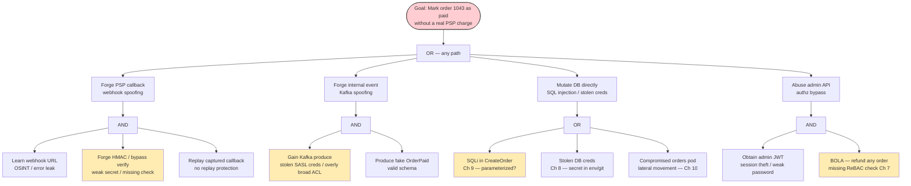
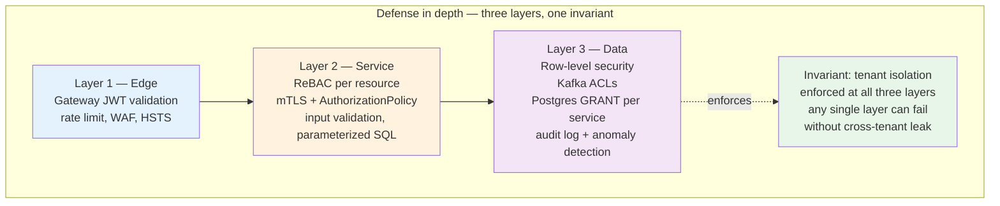
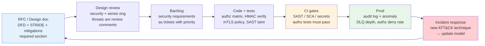

# Chapter 11 — Threat Modeling and Secure Design

**What this chapter covers.** Every control in Volumes 9 and the Companion Series — cryptography, authentication, authorization, mTLS, secrets, AppSec, signing — answers a *how*. Threat modeling answers *what* and *why*: what are we protecting, who are we protecting it from, what can go wrong, and what is worth fixing first. Without it, security is a checklist of controls applied uniformly and expensively, with gaps where the real risk lives. This is the capstone of Volume 9: we build a repeatable, team-scale threat-modeling discipline that turns architecture into prioritized, testable security requirements. We cover the STRIDE-per-element method (with data-flow diagrams), attack trees and kill chains, risk scoring (DREAD, CVSS, and qualitative severity × likelihood), trust boundaries and the data-flow diagram (DFD) as the modeling language, secure design principles (least privilege, defense in depth, fail-closed, complete mediation, economy of mechanism), and the operational loop — how a threat model lives inside design docs, code review, CI gates, and incident response. Every pattern is shown with realistic artifacts (DFD, STRIDE table, attack tree, mitigations mapped to controls from Ch 1–10) and viewed through the distributed-systems lens where a threat model must scale across dozens of services, teams, and deploys without becoming shelfware.

Learning goals — after this chapter you should be able to:

- Define threat modeling precisely — assets, threat actors, attack surface, trust boundaries, and risk — and explain why it precedes and prioritizes controls rather than following them.
- Draw a data-flow diagram (DFD) for a backend service or multi-service flow (processes, data stores, data flows, external entities, trust boundaries) and use it as the single modeling artifact.
- Apply STRIDE-per-element (Spoofing, Tampering, Repudiation, Information Disclosure, Denial of Service, Elevation of Privilege) to enumerate threats systematically, with backend-relevant examples for each.
- Build attack trees and reason about kill chains / MITRE ATT&CK for backend-relevant techniques (initial access via SSRF/deserialization, lateral movement via flat network — Ch 10, credential access via leaked secrets — Ch 8).
- Score and prioritize risk with qualitative (severity × likelihood), DREAD, and CVSS, and map the result to fix-or-accept decisions, SLOs, and roadmaps.
- Apply secure design principles — least privilege, defense in depth, fail-closed/secure, complete mediation, separation of duties, economy of mechanism, and zero trust (Ch 10) — as design constraints, not afterthoughts.
- Run the operational loop: embed threat modeling in design docs/RFCs, generate testable security requirements, gate them in code review and CI (SAST/DAST/fuzz — Ch 9), and refresh the model on every material architecture change.

> **Boundary note.** This chapter is the *method* that justifies every control in Volume 9: cryptography (Ch 1–3) for tampering/information disclosure, authentication (Ch 5–6) for spoofing, authorization (Ch 7) for elevation of privilege, secrets (Ch 8) for information disclosure, AppSec (Ch 9) for injection/tampering/SSRF, and zero trust/mTLS (Ch 10) for lateral movement and spoofing. The Companion Series, Books 1–8, threat-models the *supply chain* (dependencies, build, CI/CD, signing); this chapter models *runtime* backend systems. Volume 7 (System Design) and Volume 11 (Reliability/SRE) provide the architecture and incident-response context the model lives inside.

---

## What threat modeling is — and what it is not

Threat modeling is a structured, design-time activity that answers four questions (Shostack's framing):

1. **What are we building?** — the DFD: components, data flows, trust boundaries.
2. **What can go wrong?** — threat enumeration (STRIDE, attack trees, ATT&CK).
3. **What are we going to do about it?** — mitigations mapped to design and controls.
4. **Did we do a good job?** — verification (tests, gates, review, red-team) and iteration.

What it is not:

- **Not a vulnerability scan.** Scans find known bugs in built code; threat modeling finds design flaws before code exists — missing authz on an internal endpoint, a trust boundary drawn in the wrong place, a secret that transits plaintext between two services.
- **Not a compliance checklist.** SOC 2 / ISO 27001 / SSDF ask *whether* controls exist; threat modeling asks *which* controls matter for *this* system and *this* adversary.
- **Not a one-time document.** A threat model is a living artifact tied to the architecture. When the architecture changes — a new service, a new data store, a new external integration, a new trust domain — the model is updated and re-scored.

The output is not the diagram. The output is **prioritized, testable security requirements** that enter the backlog, the design doc, and the CI gates.

---

## The modeling language — data-flow diagrams and trust boundaries

A DFD has four element types plus the trust boundary that is the modeling primitive for backend systems:

| Element | Symbol | Meaning | Backend example |
|---------|--------|---------|-----------------|
| **External entity** | Rectangle | Outside the system's control | Browser, mobile app, partner API, attacker |
| **Process** | Circle/rounded rect | Computation that transforms data | API gateway, `orders` service, `payments` service, worker |
| **Data store** | Parallel lines / cylinder | Persistent state | Postgres, Redis, S3, Kafka topic |
| **Data flow** | Arrow | Data in motion with protocol | `HTTPS POST /v1/orders`, `gRPC Charge()`, `Kafka produce orders` |
| **Trust boundary** | Dashed line | Privilege or control transition | Internet → VPC, VPC → service, service → service (zero trust — Ch 10), unauthenticated → authenticated |

Trust boundaries are where threats live. Every flow that crosses a boundary is an attack surface. In a zero-trust architecture (Ch 10) *every service-to-service flow* is a trust boundary — which is the point.

### Worked example — order placement flow

We will carry one example through the chapter: a user places an order via the gateway; the `orders` service writes Postgres (via the outbox — Vol 10, Ch 6), publishes `OrderPlaced` to Kafka, and the `payments` service charges via an external PSP. An admin UI reads orders for support.

```mermaid
flowchart TB
    U([User / Browser<br/>External entity])
    P([Partner webhook<br/>External entity])
    GW[Gateway / BFF<br/>Process]
    Auth[Auth service<br/>OIDC IdP<br/>Process]
    Orders[Orders service<br/>Process]
    Payments[Payments service<br/>Process]
    Admin[Admin UI<br/>Process]
    DB[(Postgres<br/>orders + outbox<br/>Data store)]
    Cache[(Redis<br/>session cache<br/>Data store)]
    Kafka[(Kafka<br/>orders topic<br/>Data store)]
    PSP([External PSP<br/>External entity])

    U -->|1 HTTPS POST /v1/orders<br/>JWT bearer| GW
    GW -->|2 Validate JWT<br/>OIDC userinfo| Auth
    GW -->|3 gRPC CreateOrder<br/>mTLS + JWT| Orders
    Orders -->|4 SQL INSERT<br/>orders + outbox| DB
    Orders -->|5 Produce OrderPlaced<br/>mTLS + SASL| Kafka
    Kafka -->|6 Consume OrderPlaced| Payments
    Payments -->|7 HTTPS POST /charge<br/>API key + mTLS| PSP
    P -->|8 Webhook POST /v1/psp/callback<br/>HMAC verify| GW
    GW -->|9 gRPC PaymentCallback| Payments
    Admin -->|10 HTTPS GET /v1/orders/{id}<br/>RBAC| GW
    GW -->|11 gRPC GetOrder| Orders
    Orders -->|12 SQL SELECT| DB
    GW --- Cache
    Orders --- Cache

    subgraph Internet[Trust boundary — Internet]
        U
        P
        PSP
    end
    subgraph VPC[Trust boundary — VPC / mesh]
        GW
        Orders
        Payments
        Admin
        DB
        Cache
        Kafka
    end
    subgraph AuthN[Trust boundary — Authenticated]
        Orders
        Payments
        DB
        Kafka
    end

    style GW fill:#e3f2fd
    style Orders fill:#fff3e0
    style Payments fill:#fff3e0
    style DB fill:#f3e5f5
    style Kafka fill:#e8f5e9
```

Numbered flows 1–12 are the *attack surface*. Every flow is labeled with its protocol and auth — missing labels are findings.

---

## STRIDE-per-element

STRIDE enumerates six threat classes. Applied per DFD element, it is systematic — every element is checked against the STRIDE categories that apply to it, so gaps become visible rather than relying on brainstorming.

| Threat | Property violated | Applies to | Backend example |
|--------|-------------------|------------|-----------------|
| **S**poofing | Authentication | External entity, Process | Attacker forges JWT, spoofs `X-User-ID` header, compromises pod identity (Ch 10) |
| **T**ampering | Integrity | Data flow, Data store, Process | MITM on HTTP between gateway and orders, SQL injection (Ch 9) mutates `orders`, Kafka message tampered |
| **R**epudiation | Non-repudiation | Process, Data store | Orders service denies it created order 1043 — no audit log, no signed event |
| **I**nformation disclosure | Confidentiality | Data flow, Data store, Process | `GET /v1/orders/{id}` returns another user's order (BOLA — Ch 7), Postgres snapshot exfiltrated, Kafka topic world-readable |
| **D**enial of service | Availability | Process, Data flow, Data store | `POST /v1/orders` without rate limit (Ch 9), poison message stalls partition (Vol 10, Ch 8), slow query locks `orders` table |
| **E**levation of privilege | Authorization | Process | Tenant A calls `POST /v1/orders` with Tenant B's `tenant_id` in body (BFLA), admin UI lacks RBAC and any user can refund |

### Applicability matrix

Not every STRIDE category applies to every element — this is what makes the method finite:

| Element | S | T | R | I | D | E |
|---------|:--|:--|:--|:--|:--|:--|
| External entity | ✓ |  | ✓ |  |  |  |
| Process | ✓ | ✓ | ✓ | ✓ | ✓ | ✓ |
| Data flow |  | ✓ |  | ✓ | ✓ |  |
| Data store |  | ✓ | ✓ | ✓ | ✓ |  |

A process is the richest element — all six apply.

### STRIDE table for the order flow (abridged — full model has one row per flow × applicable STRIDE)

| # | Element / Flow | S | T | R | I | D | E | Threat (one per row) | Mitigation (maps to Ch) |
|---|----------------|---|---|---|---|---|---|----------------------|-------------------------|
| 1 | `U→GW` `POST /v1/orders` | ✓ |  |  |  |  |  | Attacker forges JWT or replays stolen token | OIDC issuer validation, `aud`/`iss` check, short-lived JWT (5m), `jti` replay cache (Ch 5–6) |
| 1 | `U→GW` |  | ✓ |  |  |  |  | MITM / request tampering on public internet | TLS 1.3, HSTS, certificate pinning for mobile (Ch 4) |
| 1 | `U→GW` |  |  |  |  | ✓ |  | Unauthenticated flood — no rate limit | Per-IP + per-user token bucket at gateway, WAF (Ch 9, Vol 7 Ch 9) |
| 1 | `U→GW` |  |  |  |  |  | ✓ | Tenant A sets `tenant_id=B` in body | Tenant binding from JWT `sub`/`tenant` claim, not from body (Ch 7 ReBAC) |
| 3 | `GW→Orders` `gRPC CreateOrder` | ✓ |  |  |  |  |  | Compromised gateway or lateral movement — caller spoofs internal service | mTLS with SPIFFE ID `spiffe://prod/ns/api/svc/gateway` + `AuthorizationPolicy` allow only gateway → orders (Ch 10) |
| 3 | `GW→Orders` |  | ✓ |  |  |  |  | gRPC payload tampered in transit (mesh MITM) | mTLS (encryption + integrity), protobuf strict validation (Ch 10, Ch 8) |
| 3 | `GW→Orders` |  |  |  | ✓ |  |  | Internal gRPC leaks PII to logs | Structured logging with PII redaction, log pipeline classification (Vol 11 Ch 3) |
| 4 | `Orders→DB` `INSERT orders` |  | ✓ |  |  |  |  | SQL injection via order fields | Parameterized queries, ORM safe APIs, SAST taint (Ch 9) |
| 5 | `Orders→Kafka` `Produce OrderPlaced` |  | ✓ |  |  |  |  | Event tampered or forged — downstream acts on ghost order | Sign events (outbox + idempotency key — Vol 10 Ch 6), SASL/SCRAM + ACLs on `orders` topic (Vol 10 Ch 3) |
| 5 | `Orders→Kafka` |  |  |  | ✓ |  |  | `orders` topic world-readable — any service can consume PII | Kafka ACLs: only `payments` group may consume `orders`; encryption at rest (Ch 1–3) |
| 6 | `Kafka→Payments` `Consume` |  |  | ✓ |  |  |  | `payments` denies it processed order 1043 — no audit trail | Append-only audit log (Vol 10 Ch 5 event sourcing), idempotent inbox with `messageId` dedup (Vol 6 Ch 9) |
| 7 | `Payments→PSP` `POST /charge` |  |  |  | ✓ |  |  | API key leaked in logs / env / exception | Secrets manager (Vault/AWS SM), no secret in env, `SecretString` type (Ch 8) |
| 7 | `Payments→PSP` |  |  |  |  | ✓ |  | PSP slow/down — payments handler blocks, partition stalls | Timeout (2s) + circuit breaker + non-blocking retry topic (Vol 10 Ch 8), backpressure (Vol 10 Ch 7) |
| 8 | `P→GW` `Webhook /psp/callback` | ✓ |  |  |  |  |  | Attacker forges PSP callback — marks unpaid order as paid | HMAC signature verification with PSP public key / shared secret from secrets manager, replay cache on `eventId` |
| 10 | `Admin→GW` `GET /v1/orders/{id}` |  |  |  | ✓ |  |  | Support user reads another tenant's order (BOLA) | ReBAC check: `user` `can_read` `order` if `user.tenant == order.tenant` via Zanzibar (Ch 7) |
| 10 | `Admin→GW` |  |  |  |  |  | ✓ | Any authenticated user can `POST /v1/admin/refund` | RBAC: `refund` requires `role=payments-admin`; tested with authz matrix (Ch 7) |

A real threat model for this flow has 30–50 rows. The table is the artifact — every empty cell is a conscious *not applicable* or a missing mitigation.

---

## Attack trees and kill chains

STRIDE enumerates *what* can go wrong per element; attack trees show *how* an attacker composes steps into a path to a goal. The root is the attacker's objective; children are sub-goals combined with **AND** (all required) or **OR** (any suffices).

### Worked attack tree — forge a payment (mark order as paid without charging)



Reading the tree bottom-up, the mitigations that *cut the most branches* are the highest leverage:

- **HMAC verification + replay cache** on the webhook (T1) — cuts the cheapest external path.
- **Kafka ACLs + SASL scoped to topic+principal + mTLS** (T2) — without them, any compromised pod can forge events.
- **Parameterized queries + SAST taint** (T3a1) and **secrets manager + no env secrets** (T3a2) — the classic code-level cuts.
- **ReBAC on every resource access** (T4a2) — the BOLA cut that removes an entire class.

### Kill chains and MITRE ATT&CK for backend

An attack tree is static; a kill chain orders the steps in time and maps them to ATT&CK techniques:

| Phase | ATT&CK technique | Backend instance | Mitigation (Ch) |
|-------|------------------|------------------|-----------------|
| **Initial access** | T1190 Exploit Public-Facing App | SSRF in `POST /v1/orders` `webhook_url` fetches `169.254.169.254` | Allowlist egress + IMDSv2 + NetworkPolicy (Ch 9) |
| **Execution** | T1059 Command and Scripting | Deserialization RCE via `pickle`/`yaml.load` | Strict codecs, `additionalProperties: false` (Ch 9) |
| **Credential access** | T1552 Unsecured Credentials | DB password in env var dumped via `/debug/vars` | Secrets manager, no `pprof`/`debug` in prod (Ch 8) |
| **Lateral movement** | T1021 Remote Services | Flat network — compromised `orders` pod calls `payments` `POST /charge` with no mTLS | mTLS + `AuthorizationPolicy` per hop (Ch 10) |
| **Exfiltration** | T1048 Exfiltration Over Alt Protocol | `SELECT * FROM orders` exfiltrated via DNS tunnel | Egress filtering, DB audit log, anomaly detection (Vol 11 Ch 5) |
| **Impact** | T1496 Resource Hijacking | Poison message stalls partition, lag grows, orders delayed | DLQ + non-blocking retries (Vol 10 Ch 8), backpressure (Vol 10 Ch 7) |

---

## Risk scoring — what to fix first

Enumeration without prioritization is a backlog that never shrinks. Three scoring models are common — use the lightest that still forces a decision.

### Qualitative — severity × likelihood (recommended default)

|  | Low likelihood | Medium likelihood | High likelihood |
|--|---|---|---|
| **High severity** (PII leak, payment forgery, tenant isolation break) | **High** — fix soon | **Critical** — fix now | **Critical** — fix now + incident |
| **Medium severity** (DoS, non-PII leak, partial bypass) | **Low** — backlog | **Medium** — next sprint | **High** — fix soon |
| **Low severity** (verbose error, missing header) | **Low** — accept or backlog | **Low** — backlog | **Medium** — next sprint |

Severity is *business impact* (what the attacker gains), not *CVSS base score*. A `CVSS 9.8` RCE in a dev-only service with no production data is lower severity than a `CVSS 6.5` BOLA that leaks every tenant's PII.

### DREAD (when you need numbers for a roadmap)

| Factor | 1 (low) | 5 (medium) | 10 (high) |
|--------|---------|------------|-----------|
| **D**amage | Verbose error | Single-tenant PII leak | Cross-tenant PII, payment forgery |
| **R**eproducibility | Race condition, 1 in 10k | Authenticated, needs setup | Anonymous, `curl` |
| **E**xploitability | Custom exploit, deep knowledge | Script available | `sqlmap` / trivial |
| **A**ffected users | One tenant, one endpoint | All tenants, one flow | All tenants, all flows |
| **D**iscoverability | Hidden internal endpoint | Authenticated enumeration | Public endpoint, indexed |

`DREAD = (D+R+E+A+D)/5`. `8–10` = critical, `5–7` = high, `3–4` = medium, `<3` = low. DREAD is subjective — use it to *order* the backlog, not to compute a precise risk dollar.

### CVSS (for dependency and vulnerability prioritization — not for design flaws)

CVSS 3.1/4.0 scores *known vulnerabilities* (CVEs) on exploitability + impact + scope. Use it for SCA findings (Ch 9, Companion Book 2) — *which CVE to patch first* — not for design threats like missing authz, which have no CVE. A threat model that scores everything with CVSS is misapplying the tool.

### Worked scoring — the order flow

| Threat | Severity | Likelihood | Priority | Fix |
|--------|----------|------------|----------|-----|
| Webhook HMAC bypass (forge payment) | High | High (public endpoint, well-known pattern) | **Critical** | HMAC verify + replay cache — ship before launch |
| BOLA `GET /v1/orders/{id}` | High | High (IDOR is top API risk — Ch 7, OWASP API1) | **Critical** | ReBAC check — blocking launch |
| Kafka topic world-readable | High | Medium (requires internal access, but flat network) | **High** | ACLs + SASL scope — next sprint |
| SQL injection in `CreateOrder` | High | Low (parameterized + SAST, but verify) | **High** | SAST taint gate in CI — this sprint |
| DoS — no rate limit on `POST /v1/orders` | Medium | High | **High** | Gateway token bucket — this sprint |
| Verbose error leaks stack trace | Low | Medium | **Low** | Generic error envelope — backlog |

---

## Secure design principles — the constraints

Threats enumerate *what* is missing; principles constrain *how* the design must be shaped. Apply them as invariants in design review.

| Principle | Means in this system | Violation |
|-----------|----------------------|-----------|
| **Least privilege** | Each service's Kafka ACL, DB grant, and IAM role allows only the topics/tables/APIs it needs | `orders` can `SELECT *` on `payments` table because it shares a DB user |
| **Defense in depth** | Gateway JWT validation *and* service-level ReBAC *and* DB row-level security — any one can fail without full bypass | Only gateway checks tenant — service trusts `X-Tenant-ID` header |
| **Fail-closed / secure default** | New endpoint denies by default; new topic denies produce/consume; new feature flag is off | New `POST /v1/admin/export` ships without authz because review missed it |
| **Complete mediation** | Every access to `order` checks `can_read(user, order)` — no cached "already authorized" bypass | `GET /v1/orders/{id}` checks on first page but `GET /v1/orders?cursor=` skips check |
| **Separation of duties** | Deploying `payments` and approving its ACL change are different identities/approvals | One engineer can push `payments` and widen its Kafka ACL in the same PR |
| **Economy of mechanism** | One authz path (ReBAC via Zanzibar — Ch 7) for all resource checks, not three ad-hoc `if` branches | `orders` checks tenant in handler, `payments` checks in middleware, `admin` checks in frontend |
| **Zero trust (Ch 10)** | Every hop authenticates with mTLS + SPIFFE ID and authorizes by that identity — network location is not a credential | Service trusts caller because it is inside the VPC |
| **Minimize attack surface** | No `debug`/`pprof`/`actuator` in prod, no wildcard CORS, no `SELECT *`, no overly broad IAM `*` | `GET /debug/vars` exposes env vars including secrets |



---

## The threat model as a living document

### Template — one page per service or flow

```markdown
# Threat model — Order placement flow (orders + payments)
Owner: @backend-security — Review: quarterly or on material change
DFD: ./threat-models/orders-dfd.mmd  —  STRIDE table: ./threat-models/orders-stride.csv

## Assets
- PII: user email, shipping address (orders DB, Kafka topic, logs)
- Money: order total, charge idempotency (payments → PSP)
- Tenant isolation: orders must never cross tenant boundary

## Trust boundaries
- Internet → Gateway (unauthenticated → JWT)
- Gateway → Orders/Payments (mTLS + SPIFFE ID)
- Orders → Postgres/Kafka (SASL + ACL + GRANT)

## Top threats (STRIDE, scored)
| # | Threat | STRIDE | Severity | Likelihood | Priority | Mitigation | Owner | Status |
|---|--------|--------|----------|------------|----------|------------|-------|--------|
| T-01 | Webhook HMAC bypass | S | High | High | Critical | HMAC verify + jti replay cache | @payments | Done |
| T-02 | BOLA GET /orders/{id} | I/E | High | High | Critical | ReBAC can_read(user, order) | @orders | Done |
| ... | ... | ... | ... | ... | ... | ... | ... | ... |

## Attack tree
- Root: forge payment — see ./threat-models/orders-attack-tree.mmd

## Residual risk (accepted)
- R-01: Kafka delayed retry breaks ordering on replay — accepted, downstream idempotent (Vol 6 Ch 9 inbox)

## Verification
- SAST taint (Semgrep/CodeQL) in CI — blocks on new SQLi/XSS — gate: .github/workflows/sast.yml
- DAST authenticated crawl (ZAP) nightly on staging — gate: staging-dast
- Fuzz: FuzzParseWebhookURL (go test -fuzz) — nightly 30m
- Authz matrix test: 12 BOLA/BFLA cases — gate: authz-matrix-test

## Changelog
- 2026-08-15: Added PSP webhook flow (T-01), re-scored after HMAC fix
- 2026-08-20: Admin UI added (T-10/11), ReBAC required — design doc #482
```

### Where the model lives in the engineering loop



- **Design doc gate:** No RFC merges without a threat-model section (DFD + top threats + mitigations) for any new service, external integration, or authz change. The reviewer checks the STRIDE table for empty cells, not for prose quality.
- **Code review:** Security requirements from the model are *testable* — `HMAC verification exists and is tested with a forged callback`, `ReBAC check exists on every `GetOrder` path and is covered by 12 BOLA cases`. Review verifies the requirement and the test, not just the code.
- **CI:** SAST taint (SQLi/XSS), SCA (known CVEs), secrets (gitleaks/TruffleHog), and authz-matrix tests are blocking gates (Ch 9). A new endpoint without an authz test fails CI.
- **Prod + IR:** Every incident or near-miss updates the model — a new ATT&CK technique, a missed trust boundary, a DLQ poison that was a schema threat not in the table. The model is the postmortem's *prevention* section.
- **Refresh cadence:** Quarterly for stable services, on every material change (new external dependency, new data store, new auth flow, new trust domain) otherwise. A model that is not refreshed is a model that is wrong.

---

## Choosing what not to fix

Not every threat is fixed. The model makes *acceptance* explicit:

| Decision | Means | Example |
|----------|-------|---------|
| **Mitigate** | Ship a control before or soon after launch | HMAC on webhook, ReBAC on `GetOrder` — critical, blocks launch |
| **Transfer** | Move risk to a party better placed to handle it | PSP handles PCI DSS scope — we tokenize, never store PAN |
| **Accept** | Document residual risk, monitor, revisit | Kafka replay breaks ordering — accepted because downstream is idempotent; logged as R-01 |
| **Avoid** | Remove the feature or integration | Drop `yaml.load` webhook config — use `json` + schema; no deserialization risk to mitigate |

Acceptance without a written residual-risk entry and a compensating detection (alert on DLQ, anomaly on authz deny rate) is not acceptance — it is neglect. Every accepted risk has an owner, a review date, and a detection.

---

## Distributed-systems lens

- **Threat models must compose.** A fleet of 40 services cannot have one monolithic model. Own a per-flow model (order placement, payment callback, admin read) and a per-service model, then compose trust boundaries: the gateway's *outbound* mTLS guarantee is the orders service's *inbound* assumption. Inconsistency between the two is a finding.
- **Zero trust is the trust-boundary discipline at scale.** In a flat network, the DFD has one trust boundary (Internet → VPC) and lateral movement is invisible. With mTLS + SPIFFE + `AuthorizationPolicy` (Ch 10), every service-to-service flow is a boundary — the DFD and the `AuthorizationPolicy` are the same artifact, and a missing policy is a missing boundary.
- **The DFD is the contract between teams.** When the `orders` team adds a new Kafka topic that `analytics` consumes, the DFD change is the notification that `analytics` now has PII and needs ACLs, retention, and audit. Without the DFD as a shared artifact, the data flow is discovered during an incident.
- **Verification must be as distributed as the system.** SAST/SCA/secrets gates run per repo, authz-matrix tests run per service, DAST crawls per environment, and audit-log anomaly detection runs centrally. The threat model maps each mitigation to *where* it is verified — a mitigation with no gate is a mitigation that will regress.

## Key takeaways

- Threat modeling is the design-time discipline that turns architecture (DFD + trust boundaries) into prioritized, testable security requirements — it precedes and directs controls, not the reverse. Its output is tickets and tests, not just diagrams.
- The DFD (external entity, process, data store, data flow, trust boundary) is the modeling language; every flow that crosses a boundary is attack surface and every unlabeled flow is a finding.
- STRIDE-per-element makes enumeration systematic: check each element against its applicable STRIDE categories and record one row per threat with a mitigation mapped to a control in Ch 1–10. Empty cells are conscious, not accidental.
- Attack trees (AND/OR composition to a goal) and ATT&CK-mapped kill chains show how steps compose into paths; the mitigations that cut the most branches are the highest leverage.
- Score with qualitative severity × likelihood (default) or DREAD for roadmaps; reserve CVSS for known CVEs (SCA), not design flaws. Severity is business impact — tenant isolation break outranks RCE in dev.
- Secure design principles (least privilege, defense in depth, fail-closed, complete mediation, separation of duties, economy of mechanism, zero trust) are invariants enforced at every layer — the same invariant (tenant isolation) at edge, service, and data.
- The model lives in the RFC, is reviewed as code, gates CI (SAST/SCA/secrets/authz tests), and is refreshed on every material architecture change and every incident — with explicit, owned residual-risk entries for accepted threats.

## Further reading

- **Method:** Shostack *Threat Modeling: Designing for Security* (2014) — DFD, STRIDE-per-element, and the four questions — the most practical single book. OWASP *Threat Modeling Cheat Sheet* (https://cheatsheetseries.owasp.org/IndexTopTen.html) and OWASP *Threat Modeling Playbook* — concise, actionable. Microsoft SDL *Threat Modeling Tool* 7.x (https://aka.ms/threatmodelingtool) — DFD + STRIDE automation.
- **STRIDE & DFD:** Microsoft *STRIDE fundamentals* (https://learn.microsoft.com/en-us/security/engineering/threat-modeling) — per-element applicability and examples. Seifert & Shostack *STRIDE-per-element* — the matrix that makes enumeration finite.
- **Attack trees & ATT&CK:** Schneier *Attack Trees* (Dr. Dobb's, 1999) — AND/OR composition. MITRE ATT&CK (https://attack.mitre.org/) — techniques T1190, T1059, T1552, T1021, T1048 as they map to backend flows. Lockheed Martin *Cyber Kill Chain* and Mandiant *Attack Lifecycle*.
- **Risk scoring:** OWASP *Risk Rating Methodology* (https://owasp.org/www-project-risk-rating-methodology/) — likelihood × impact with business factors. FIRST CVSS 3.1/4.0 spec (https://www.first.org/cvss/) — when to use CVSS and when not to. NIST SP 800-30 — risk assessment.
- **Secure design principles:** Saltzer & Schroeder *The Protection of Information in Computer Systems* (1975) — least privilege, complete mediation, economy of mechanism — still the best source. NIST SP 800-160 Vol 1 — systems security engineering. Ch 1–10 of this volume for each control mapped to STRIDE.
- **Operationalizing:** OWASP SAMM 2.0 (https://owaspsamm.org/) — threat modeling maturity. Snyk / Semgrep / CodeQL docs — SAST taint gates that verify the model in CI (see Ch 9). Google *Building Secure and Reliable Systems* — Ch 13 (threat modeling at scale).
