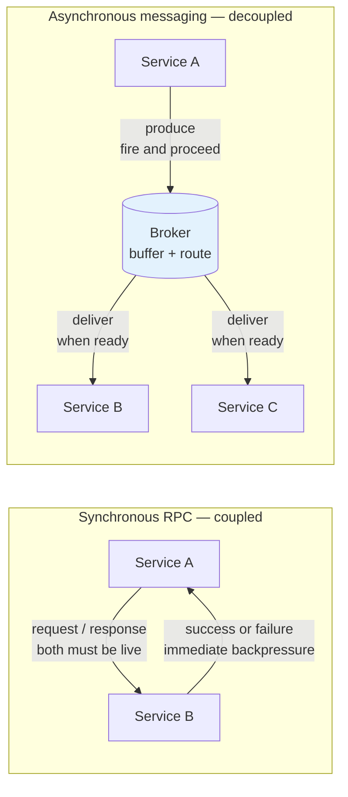
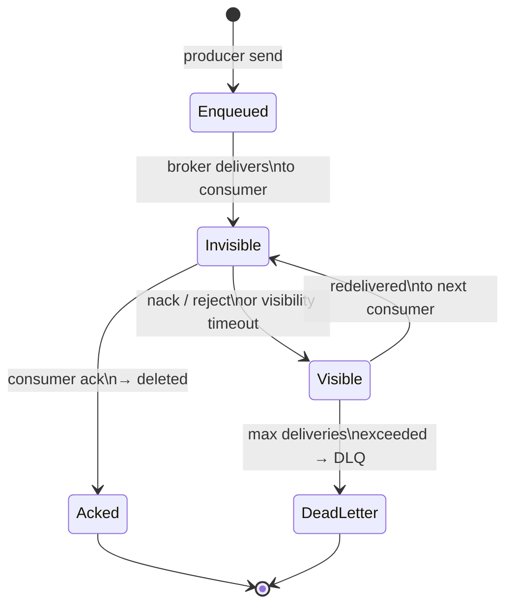
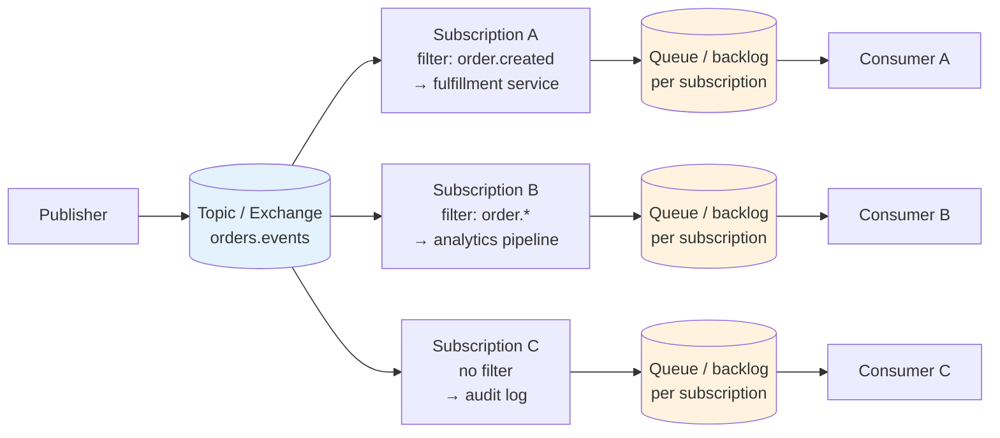
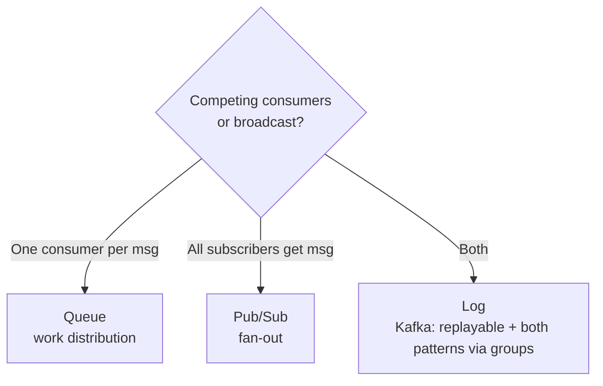
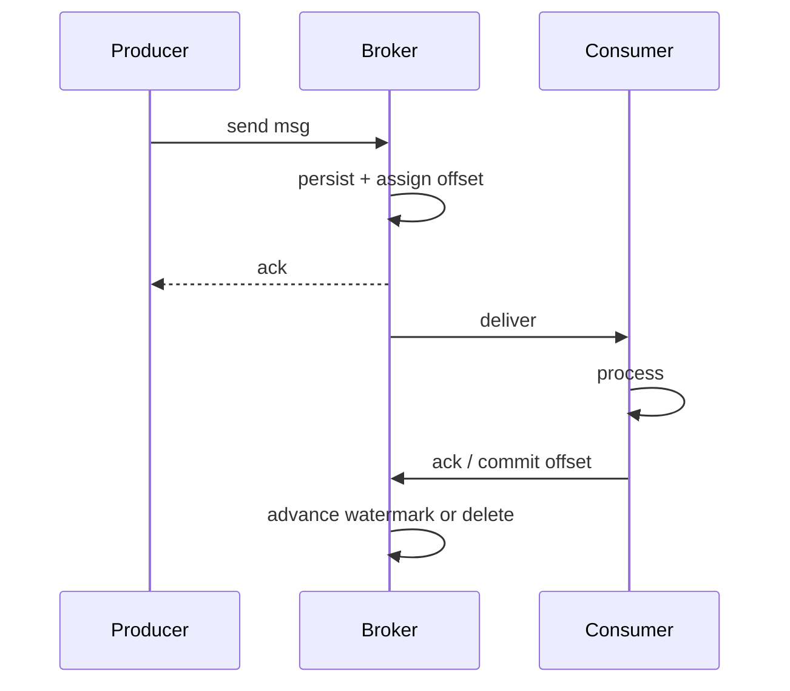

# Chapter 1 — Messaging Fundamentals: Queues, Logs, Pub/Sub

**What this chapter covers.** Every interesting backend is a distributed system, and distributed systems communicate through messages. Whether you call it an RPC, an event, a task, or a notification, the question is the same: how does information move between services that fail independently, deploy independently, and scale independently? This chapter builds the taxonomy that the rest of Volume 10 depends on. Three abstractions — **queues**, **logs**, and **publish/subscribe** — cover essentially every messaging system you will encounter, from Amazon SQS to Apache Kafka to Google Pub/Sub to RabbitMQ. They differ in their data model (destructive consume vs. retained log), their consumption model (competing vs. broadcast vs. partitioned), and their ordering and durability guarantees. Get these distinctions right and every broker becomes a variation on a theme; get them wrong and you will build ordering assumptions on a system that never promised them.

Learning goals — after this chapter you should be able to:

- Distinguish queue, log, and pub/sub semantics on five axes: consumption model, retention, ordering scope, delivery topology, and replay capability.
- Explain the distributed-systems reason messaging exists — temporal, spatial, and failure decoupling — and when synchronous RPC is the wrong choice.
- Describe how a point-to-point queue works end to end: enqueue, competing consumers, acknowledgment, visibility timeout, and poison-message handling.
- Describe how a partitioned log works: append-only segments, offsets, sequential I/O, retention, replay, and partitioned parallelism.
- Describe how pub/sub fan-out works: topics, subscriptions, filtering, and the push-vs.-pull delivery choice.
- Map real systems (SQS, RabbitMQ, Kafka, Kinesis, Redis Streams, NATS, Google Pub/Sub) onto the taxonomy and explain where hybrids blur the lines.
- Choose correctly among queue, log, and pub/sub for a given workload using a concrete decision framework.

---

## Why messaging: decoupling in a distributed system

A monolith calls a function. A distributed system sends a message. The difference is not syntax — it is the failure model. A function call either happens or it does not; the caller and callee share fate. A message crosses a network between processes that fail independently, and the sender cannot know whether the message was processed without an explicit acknowledgment that itself can be lost (see Vol 6, Ch 1 — the Two Generals problem).

Messaging infrastructure exists to manage that reality. It provides three kinds of decoupling:

| Decoupling | Without messaging | With messaging |
|---|---|---|
| **Temporal** | Producer and consumer must be alive at the same instant (synchronous RPC) | Producer writes now, consumer reads later — hours or days later if needed |
| **Spatial** | Producer must know consumer addresses and cardinality | Producer knows a queue/topic name; the broker handles routing and scaling |
| **Failure** | A slow or crashed consumer blocks or fails the producer | The broker buffers durably; producer and consumer fail and recover independently |

This decoupling is not free. It trades latency for durability, ordering simplicity for throughput, and request/response clarity for eventual processing. Understanding when the trade is worthwhile is the first design judgment in any messaging architecture.

> **When not to use messaging.** If the caller needs the answer before it can proceed ("what is this user's current balance?"), a synchronous request — REST, gRPC, or a read from a replicated store — is simpler and faster. Messaging shines when the producer can proceed without waiting: "an order was placed," "resize this image," "reindex this document." The heuristic: if you can name the event in the past tense and the producer does not need the result, a message is likely the right shape.



*Figure 1-1: Synchronous coupling versus asynchronous decoupling. The broker turns a temporal rendezvous into a durable handoff, at the cost of an extra hop and eventual delivery.*

---

## The three models at a glance

Most confusion about messaging comes from treating every broker as "a queue." In fact there are three distinct data models, each with different guarantees. Real products often implement more than one, but the models themselves are cleanly separable.

| Axis | **Queue (point-to-point)** | **Log (partitioned, append-only)** | **Pub/Sub (fan-out)** |
|---|---|---|---|
| **Core verb** | *Send* to a queue, *receive* from it | *Append* to a log, *read* from an offset | *Publish* to a topic, *subscribe* to it |
| **Consumption** | Competing consumers; each message to **one** consumer | Partitioned readers; each partition to **one** consumer in a group, but many groups can read independently | Broadcast; each message to **every** subscription |
| **After delivery** | Removed (or hidden until ack) — destructive consume | Retained by retention policy — immutable, replayable | Depends on subscription — often acked and removed per-subscription |
| **Ordering** | Best-effort FIFO per queue (often no global order) | Total order **within a partition**; no order across partitions | Usually unordered or best-effort per-publisher |
| **Replay** | No — once acked, gone | Yes — seek to any offset, re-read any window | Sometimes — subscription seek/replay if the broker retains |
| **Scaling axis** | More consumers drain faster, but single queue is the bottleneck | More partitions = more parallel readers and writers | More subscriptions = more fan-out; each subscription scales independently |
| **Canonical examples** | Amazon SQS Standard/FIFO, RabbitMQ classic queue, ActiveMQ queue | Apache Kafka, Amazon Kinesis, RabbitMQ Streams, Redpanda | Google Pub/Sub, Amazon SNS, NATS core, Redis Pub/Sub |

The mental model: a **queue** is a mailbox — mail is removed when collected. A **log** is a commit history — entries are never removed by reading, only by retention, and you read by moving a cursor. **Pub/sub** is a mailing list — one post reaches every subscriber's copy.

```mermaid
flowchart TB
    subgraph Queue["Queue — competing consumers"]
        P1[Producer] --> Q[(Queue)]
        Q --> C1[Consumer A]
        Q --> C2[Consumer B]
        Q --> C3[Consumer C]
        note1>"Each message → exactly one consumer<br/>Destructive consume, ack removes it"
    end
    subgraph Log["Log — partitioned, replayable"]
        P2[Producer] --> L1[Partition 0<br/>offset 0 1 2 3 ...]
        P2 --> L2[Partition 1<br/>offset 0 1 2 3 ...]
        L1 --> G1A[Group A / Consumer 1]
        L2 --> G1B[Group A / Consumer 2]
        L1 -.-> G2A[Group B / Consumer 1<br/>independent offset]
        L2 -.-> G2A
        note2>"Append-only, retained, replayable<br/>Order within partition only"
    end
    subgraph PubSub["Pub/Sub — fan-out"]
        P3[Publisher] --> T[(Topic)]
        T --> S1[Subscription 1<br/>→ Consumer A]
        T --> S2[Subscription 2<br/>→ Consumer B]
        T --> S3[Subscription 3<br/>→ Consumer C]
        note3>"Each message → every subscription<br/>Per-subscription ack"
    end
    style Q fill:#fff3e0
    style L1 fill:#e8f5e9
    style L2 fill:#e8f5e9
    style T fill:#e3f2fd
```

*Figure 1-2: The three consumption topologies. Queue drains to one winner; log fans out by partition to groups that track their own offsets; pub/sub replicates to every subscription.*

> **Boundary note.** This chapter classifies the *broker data model* — what happens to a message after it is written and who can read it. Delivery guarantees (at-most/at-least/effectively-once, redelivery, deduplication, and transactional consumption) are a separate concern, covered in Chapter 2. Exactly-once processing theory (the end-to-end argument, idempotency keys, and the atomic check-and-record pattern) is developed formally in Vol 6, Chapter 9 — Idempotency, Deduplication, and Exactly-Once; Chapter 2 here focuses on what the *broker* can and cannot promise.

---

## Queues: point-to-point and competing consumers

### The contract

A queue provides **point-to-point** semantics: a producer enqueues a message; exactly one consumer dequeues it. If multiple consumers are attached, they compete — the broker delivers each message to one consumer, typically round-robin or based on prefetch and readiness.

The lifecycle of a queue message:

1. **Enqueue** — producer sends; broker persists (durably or in memory, per configuration) and acknowledges the write.
2. **Deliver** — broker selects a consumer and pushes or lets it pull the message. The message becomes *invisible* or *unacked* but is not yet deleted.
3. **Acknowledge** — consumer signals success (`ack`). The broker deletes the message.
4. **Negative-acknowledge or timeout** — consumer signals failure (`nack`/`reject`) or crashes before acking; the visibility timeout expires; the broker makes the message visible again for redelivery, often with a redelivery count.
5. **Dead-letter** — after N failed deliveries, the broker routes the message to a dead-letter queue (DLQ) for inspection. See Chapter 8 for DLQ design.



*Figure 1-3: Queue message lifecycle. The invisible state is the at-least-once window — a crash between delivery and ack causes redelivery.*

### Ordering and scaling limits

A single queue with a single consumer gives total FIFO order — trivially, because there is only one reader. The moment you add competing consumers, global ordering is lost: message 2 may be acked before message 1 if consumer B is faster than consumer A. Systems that promise FIFO queues (SQS FIFO, RabbitMQ quorum queues with single active consumer) do so by constraining concurrency — one active consumer per queue or per message group — and paying the throughput price.

A single queue is also a scaling bottleneck. Throughput is bounded by the broker node owning the queue and by the serial ack/delete path. The standard scale-out is **more queues**: sharding by tenant, entity, or hash, each with its own consumer set.

### Prefetch, backpressure, and fairness

Without flow control, a fast broker will overwhelm a slow consumer. Queues implement **prefetch** (RabbitMQ `basic.qos`, SQS long polling + max messages, Kafka `max.poll.records` analogue for queue-like use):

```python
# RabbitMQ 3.13 — competing consumers with fair dispatch (amqp 5.x, Python 3.11)
# pip install pika==1.3.2
import pika

conn = pika.BlockingConnection(pika.ConnectionParameters("rabbitmq.internal"))
ch = conn.channel()

# Durable classic queue — survives broker restart
ch.queue_declare(queue="orders.process", durable=True, arguments={
    "x-dead-letter-exchange": "orders.dlx",
    "x-dead-letter-routing-key": "orders.failed",
})

# Fair dispatch: only 10 unacked messages per consumer at a time
ch.basic_qos(prefetch_count=10)

def on_message(ch, method, props, body):
    try:
        process_order(body)          # may raise
        ch.basic_ack(delivery_tag=method.delivery_tag)
    except TransientError:
        # requeue — will be redelivered, redelivery_count increments
        ch.basic_nack(delivery_tag=method.delivery_tag, requeue=True)
    except PermanentError:
        # reject without requeue — broker routes to DLX → DLQ
        ch.basic_nack(delivery_tag=method.delivery_tag, requeue=False)

ch.basic_consume(queue="orders.process", on_message_callback=on_message)
ch.start_consuming()
```

```yaml
# Amazon SQS — queue with DLQ via AWS CLI / CloudFormation snippet (SQS, 2024)
# Key parameters that affect queue semantics:
Resources:
  OrdersQueue:
    Type: AWS::SQS::Queue
    Properties:
      QueueName: orders-process
      VisibilityTimeout: 60          # seconds invisible after delivery; must exceed handler time
      MessageRetentionPeriod: 1209600  # 14 days — after this, message is dropped
      RedrivePolicy:
        deadLetterTargetArn: !GetAtt OrdersDLQ.Arn
        maxReceiveCount: 5           # after 5 failed receives → DLQ
      # For FIFO:
      # FifoQueue: true
      # ContentBasedDeduplication: false  # or true; see Ch02 for dedup window

  OrdersDLQ:
    Type: AWS::SQS::Queue
    Properties:
      QueueName: orders-process-dlq
      MessageRetentionPeriod: 1209600
```

The distributed-systems lens: prefetch is **consumer-side backpressure made explicit**. Without it, the broker buffers unboundedly in consumer memory (RabbitMQ) or the consumer OOMs. With it, a slow consumer naturally receives fewer messages and the broker retains the backlog durably — which is exactly the decoupling you wanted.

---

## Logs: the append-only, replayable foundation

### The contract

A log is an **append-only, totally ordered, replayable** sequence. Producers append; consumers read from an offset. Reading does not remove anything — retention (time or size) does. A consumer tracks its position as an **offset** (a monotonic index per partition), and it can seek backward to re-read.

A single log with a single writer gives total order and trivial reasoning — but a single log is also a single bottleneck and a single failure domain. Every production log system therefore **partitions** the log: the topic is split into N ordered sub-logs (partitions), each independently ordered and replicated. Ordering is guaranteed *within* a partition; across partitions, there is no order. Producers choose a partition (by key hash, round-robin, or explicit assignment); consumers in a group are assigned partitions exclusively.

This is the core idea behind Kafka, Kinesis, Pulsar, and RabbitMQ Streams. It is worth internalizing:

> **A partitioned log is not a queue with extra features. It is a different data structure.** Queues model *tasks to be done once*; logs model *facts that happened*, retained for any number of readers to consume at their own pace.

### Why logs scale

Sequential append to a file is the fastest durable write a disk can do — no random seeks, no B-tree updates, just `write()` to the end. Modern logs exploit this ruthlessly: Kafka and Redpanda write batches sequentially to segment files and rely on the OS page cache and `sendfile(2)` for zero-copy reads. A single partition can sustain hundreds of MB/s on commodity SSDs; adding partitions scales throughput linearly (until the broker or network saturates).

Retention is the other scaling lever. Because reads do not delete, multiple consumer groups can read the same data independently and at different speeds — an ETL group reading from the beginning for a backfill while a serving group reads the tail at near-real-time. The log becomes the **system of record** for events, not just a transport.

### Retention, compaction, and the replay superpower

Two retention modes cover most use cases:

- **Time/size retention** — keep N days or N bytes, then delete oldest segments. The default for event streams.
- **Compaction** — for each key, keep only the latest value. Turns the log into a durable, replayable key-value snapshot (Kafka compacted topics, used for changelog and configuration topics).

Replay is the superpower that justifies the complexity. New consumer? Start from offset 0. Bug in yesterday's deploy that corrupted downstream state? Seek back to yesterday's offset and reprocess. Schema migration? Re-read the log through the new code. No queue can do this without an out-of-band store.

```mermaid
flowchart LR
    Prod[Producer\nkey=user-42] --> Part0[Partition 0\n0: {k:A,v:1}\n1: {k:B,v:1}\n2: {k:A,v:2} ← latest A]
    Prod --> Part1[Partition 1\n0: {k:C,v:1}\n1: {k:D,v:1}]

    Part0 --> SegA[Segment 00000000.log\n+ index + timeindex]
    Part1 --> SegB[Segment 00000000.log]

    SegA --> RetTime[Retention:\n7 days / 10 GB]
    SegA --> RetCompact[Compaction:\nkeep latest per key\nA:1 → A:2 tombstones A:1]

    G1[Consumer Group: serving\nreads tail, offset 3] -.-> Part0
    G2[Consumer Group: backfill\nreads from offset 0] -.-> Part0
    G2 -.-> Part1

    style Part0 fill:#e8f5e9
    style Part1 fill:#e8f5e9
```

*Figure 1-4: Partitioned log anatomy — segments, retention, compaction, and independent consumer groups reading the same partitions at different offsets.*

```python
# Kafka 3.7 — producing to a partitioned log (confluent-kafka 2.4, Python 3.11)
# pip install confluent-kafka==2.4.0
from confluent_kafka import Producer

conf = {
    "bootstrap.servers": "kafka-1.internal:9092,kafka-2.internal:9092",
    "client.id": "orders-producer",
    "acks": "all",                 # wait for ISR ack — see Ch03 for ISR
    "enable.idempotence": True,    # exactly-once per partition (broker dedup window)
    "compression.type": "lz4",
    "linger.ms": 10,               # micro-batch for throughput
    "batch.size": 65536,
}
p = Producer(conf)

def delivery(err, msg):
    if err:
        print(f"failed: {err}")

# Key determines partition — same key → same partition → total order for that key
p.produce("orders", key="user-42", value=b'{"order_id": 123, "amount": 5000}', on_delivery=delivery)
p.flush(10)
```

### Ordering is per-partition — design for it

The single most common log bug is assuming global order. There is none. If order matters for a group of messages (all events for one order, one user, one device), they must share a **partition key** so they land on the same partition. Random or round-robin partitioning maximizes throughput but destroys any cross-message ordering. Choose deliberately:

| Partitioning strategy | Ordering guarantee | Throughput | Use when |
|---|---|---|---|
| Key hash (`hash(key) % N`) | All messages for a key ordered | Skewed if keys are hot | Order matters per entity (user, order, device) |
| Round-robin / sticky | None | Even, maximal | Order irrelevant, pure fan-out or ingestion |
| Manual partition | Caller controls | Caller controls | Low-level replication or migration tooling |

Hot keys are the distributed-systems catch: one celebrity user or one noisy device can saturate a single partition while others idle. Monitor partition produce rate and consumer lag per partition, not just per topic.

---

## Publish/subscribe: fan-out and filtering

### The contract

Pub/sub decouples producers (publishers) from consumers (subscribers) through a **topic** (or exchange + binding). A publisher publishes to a topic without knowing who subscribes; each subscription receives its own copy. One message, many deliveries — **fan-out**.

Two delivery styles:

- **Push** — the broker actively delivers to subscribers (SNS → SQS/HTTP, RabbitMQ push to consumers).
- **Pull** — subscribers poll or long-poll for messages (SQS, Google Pub/Sub pull, Kafka poll loop).

Most managed pub/sub leans push for latency and pull for flow control. Many systems support both (Google Pub/Sub subscriptions can be push or pull; RabbitMQ is push with prefetch as pull-like backpressure).

### Topics, subscriptions, and filtering

A topic is a named channel. Subscriptions bind to topics, optionally with **filters**:

- **Subject/routing-key filtering** — NATS subject wildcards (`orders.*.created`), RabbitMQ topic exchange (`orders.#`), SNS filter policies.
- **Attribute filtering** — Google Pub/Sub filter expressions, SNS filter policies on message attributes, EventBridge event patterns.
- **Content filtering** — less common at the broker; usually done in a stream processor (see Ch 4).

Filtering at the broker avoids delivering every message to every subscriber and then discarding — critical when fan-out is large.



*Figure 1-5: Pub/sub fan-out. The topic is the rendezvous; each subscription has its own backlog and ack state, so a slow subscriber does not block others.*

The per-subscription queue is the key insight: pub/sub is internally **one queue per subscription** sharing a topic. That is why a slow subscriber does not affect a fast one — their backlogs are independent. It is also why cost scales with subscriptions: each subscription stores a copy (or a reference + separate ack state) of every matching message.

```python
# Google Cloud Pub/Sub — publisher and pull subscriber (google-cloud-pubsub 2.21, Python 3.11)
# pip install google-cloud-pubsub==2.21.0
from google.cloud import pubsub_v1

publisher = pubsub_v1.PublisherClient()
subscriber = pubsub_v1.SubscriberClient()
topic = publisher.topic_path("my-project", "orders.events")
sub   = subscriber.subscription_path("my-project", "orders-fulfillment")

# Publish with attributes for broker-side filtering
future = publisher.publish(topic, b'{"order_id": 123}', type="order.created", region="us-east")
msg_id = future.result(timeout=10)

# Pull subscription — long poll, explicit ack (at-least-once)
def callback(msg):
    try:
        handle(msg.data, msg.attributes)
        msg.ack()          # removes from this subscription only
    except TransientError:
        msg.nack()         # redelivers
    except PermanentError:
        msg.ack()          # avoid poison loop — forward to DLQ topic explicitly
        publish_to_dlq(msg)

streaming_pull = subscriber.subscribe(sub, callback=callback)
streaming_pull.result()  # blocks
```

```python
# Redis Streams — log-like pub/sub with consumer groups (redis-py 5.0, Python 3.11)
# pip install redis==5.0.4
import redis
r = redis.Redis(host="redis.internal", port=6379)

# Append (log) — each entry gets an auto-generated ID (timestamp-seq)
r.xadd("orders", {"order_id": "123", "status": "created"}, maxlen=100000)

# Consumer group — queue-like competing consumption over a log, with replay
r.xgroup_create("orders", "fulfillment", id="0", mkstream=True)

# Read — block 5s, at most 10 entries, claim pending on restart via XPENDING/XCLAIM
msgs = r.xreadgroup("fulfillment", "worker-1", {"orders": ">"}, count=10, block=5000)
for stream, entries in msgs:
    for msg_id, fields in entries:
        try:
            handle(fields)
            r.xack("orders", "fulfillment", msg_id)
        except Exception:
            pass  # left pending — visibility via XPENDING, reclaim via XCLAIM
```

---

## Hybrids and the real world

Textbook taxonomies are clean; production brokers are not. Most systems blend models:

| System | Primary model | Hybrid capability |
|---|---|---|
| **RabbitMQ** | Queue (classic, quorum) | Streams (log), topic/fanout exchanges (pub/sub), quorum queues add log-like replication |
| **Apache Kafka** | Log | Consumer groups act as queues over the log; no per-message ack, only offset commits |
| **Amazon SQS** | Queue | FIFO queues add ordering + dedup; no log replay |
| **Amazon SNS + SQS** | Pub/sub + queue | SNS fans out to SQS queues — textbook pub/sub built from queue primitives |
| **Google Pub/Sub** | Pub/sub | Pull subscriptions are queues; seek/replay adds log behavior; exactly-once delivery is per-subscription |
| **NATS** | Pub/sub (core) | JetStream adds log (streams) with retention, replay, and queue groups (competing consumers) |
| **Redis Streams** | Log | Consumer groups add queue semantics; Pub/Sub channels are ephemeral pub/sub with no persistence |

The pattern: **queues are easy to build on top of logs** (add consumer groups + offset commits), and **pub/sub is easy to build on top of queues** (one queue per subscription). The reverse is harder — you cannot add replay to a destructive queue without an external store.

This is why many teams converge on a log (Kafka, Redpanda, Kinesis) as the durable center and layer queue and pub/sub semantics on the consumer side. It is also why understanding the *log* deeply — partitions, offsets, retention, ISR — pays for itself even if you primarily think in queue terms. Chapter 3 turns to Kafka as the canonical log implementation.

---

## Choosing among the models

Use this decision tree. Start from the consumer's need, not the producer's.

```
Is there exactly one logical consumer per message?
  YES → Do you need replay / reprocessing?
          YES → Partitioned log (Kafka, Kinesis, RabbitMQ Streams)
          NO  → Queue (SQS, RabbitMQ classic/quorum)
  NO — multiple independent consumers per message
      → Do consumers need independent replay and retention?
          YES → Log with multiple consumer groups (Kafka multi-group)
          NO  → Pub/Sub (SNS+SQS, Google Pub/Sub, NATS)
              → If filtering at the broker matters, prefer topic with filter policy
```

Additional forcing functions:

- **Ordering required?** If total order per entity, you need keyed partitioning (log) or FIFO queue — not a standard queue or unordered pub/sub.
- **Backpressure?** If consumers are bursty or slow, a log's retention and offset-based flow control is more robust than a queue's bounded buffer + DLQ.
- **Exactly-once aspiration?** No broker gives it alone. But logs with transactional producers/consumers (Kafka transactions, see Ch 2–3) get closest, because offsets and writes can be committed atomically. Queues require consumer-side dedup tables.
- **Operations budget?** A managed queue/pub-sub (SQS, Pub/Sub) is nearly zero-ops; a self-managed log (Kafka) is a distributed system you now operate.

---

## Anti-patterns

- **Treating a queue as a log.** Polling a queue for replay, or expecting to re-read after ack. If you need replay, use a log.
- **Assuming global order from a partitioned log.** Order is per-partition. A consumer reading multiple partitions sees interleaving that is not meaningful. If you need cross-partition order, you need a single partition (and you have a bottleneck) or application-level sequencing.
- **One topic/queue per tenant without bounds.** Topic count, partition count, and queue count are broker metadata that must be replicated and watched. Thousands are fine; hundreds of thousands require careful broker sizing and often a control-plane service.
- **Synchronous RPC disguised as messaging.** Producing a message and then polling for a reply message with a correlation ID is a distributed RPC with extra steps and worse failure modes. If you need a response, use RPC; use messaging for fire-and-forget.
- **Ignoring the visibility/ack deadline.** In any at-least-once queue, a handler that exceeds the visibility timeout causes duplicate delivery while the first attempt is still running. The result is two concurrent executions of a non-idempotent handler. Size your timeout above p99 handler latency or use heartbeat extensions (SQS `ChangeMessageVisibility`, RabbitMQ consumer ack timeout).

---


#### Queue vs PubSub Decision



#### Message Lifecycle



## Key takeaways

- Messaging exists to decouple services in time, space, and failure mode. It trades latency and ordering simplicity for durability and independence.
- Queues give point-to-point, destructive, competing consumption — one message to one consumer. They are the right primitive for tasks.
- Logs give append-only, retained, replayable, per-partition-ordered storage. They are the right primitive for events and system-of-record streams, and they scale by partitioning.
- Pub/sub gives fan-out — one message to every subscription, each with independent backlog and ack state. It is the right primitive for notifications and broadcast.
- Most production brokers are hybrids. Logs can emulate queues (consumer groups) and pub/sub (multiple groups); queues can be composed into pub/sub (one queue per subscription). The log is the most general primitive.
- Ordering, replay, and scaling guarantees are not interchangeable. Choosing the wrong model produces subtle correctness bugs that only appear under failure or load.
- Prefetch, visibility timeouts, and per-subscription backlogs are not tuning knobs — they are the backpressure mechanism that keeps the decoupling honest.

## Further reading

- Kleppmann, M. *Designing Data-Intensive Applications*, Ch. 11 — Stream Processing and Ch. 12 — The Future of Data Systems. O'Reilly, 2017. The definitive treatment of logs vs. queues and the log as system of record.
- Kreps, J. "The Log: What every software engineer should know about real-time data's unifying abstraction." LinkedIn Engineering Blog, 2013. https://engineering.linkedin.com/distributed-systems/log-what-every-software-engineer-should-know-about-real-time-datas-unifying
- Apache Kafka documentation 3.7 — Introduction and design. https://kafka.apache.org/37/documentation.html
- RabbitMQ documentation — Queues, Exchanges, Streams. https://www.rabbitmq.com/docs/queues https://www.rabbitmq.com/docs/streams
- Google Cloud Pub/Sub documentation — Publisher/subscriber model, push vs. pull, filtering, exactly-once delivery. https://cloud.google.com/pubsub/docs
- Amazon SQS and SNS documentation — Queue types, visibility timeout, fan-out pattern. https://docs.aws.amazon.com/sqs/ https://docs.aws.amazon.com/sns/
- NATS JetStream documentation — Streams, consumers, queue groups. https://docs.nats.io/nats-concepts/jetstream
- Redis Streams documentation — `XADD`, `XREADGROUP`, `XPENDING`. https://redis.io/docs/latest/commands/xadd/
