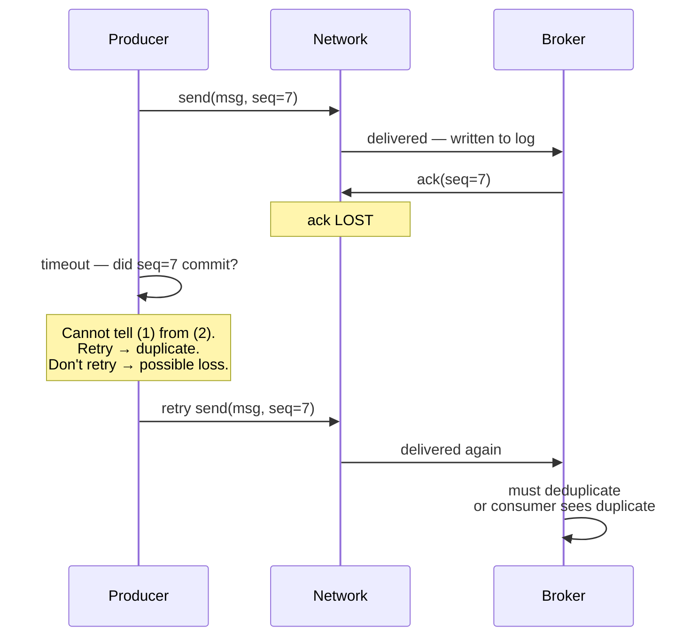
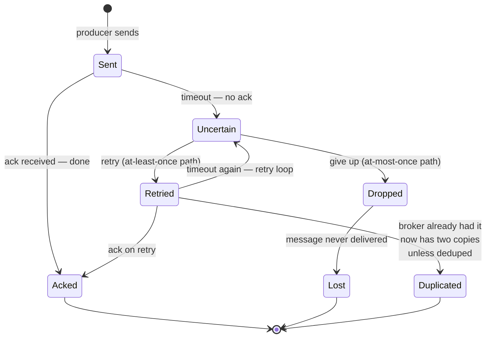
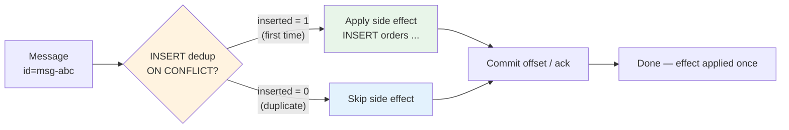

# Chapter 2 — Delivery Semantics: At-Most, At-Least, Exactly-Once

**What this chapter covers.** "Exactly once" is the most expensive phrase in messaging. Every broker advertises it, almost none delivers what the phrase seems to promise, and the gap between marketing and mechanism causes real outages. This chapter makes delivery semantics precise: what at-most-once, at-least-once, and effectively-once (often mislabeled exactly-once) actually guarantee, where the guarantee lives (broker, consumer, or end-to-end), and what you must build to get the behavior your domain requires. We start from the impossibility that forces the taxonomy — the sender's ambiguity when an acknowledgment is lost — then define each semantic with its cost and failure mode, show how brokers implement redelivery and deduplication (Kafka 3.7 idempotent producer and transactions, SQS FIFO dedup, RabbitMQ confirms), and build the consumer-side patterns that determine the real guarantee: ack ordering, deduplication tables, the transactional outbox, and the transactional consume-transform-produce loop. The chapter closes with a decision framework and the operational cost of each choice.

Learning goals — after this chapter you should be able to:

- State why exactly-once *delivery* is impossible over a lossy network and why the achievable property is exactly-once *effect*.
- Define at-most-once, at-least-once, and effectively-once precisely, including what is lost or duplicated under each and what each costs in latency, throughput, and complexity.
- Explain the broker mechanisms that implement each semantic: fire-and-forget, ack + redelivery, and deduplication windows.
- Describe Kafka 3.7's idempotent producer (PID + sequence) and transactions (transactional ID, transaction coordinator, LSO) and what they do and do not guarantee.
- Implement the consumer-side dedup table and the offset-commit ordering discipline that actually determines delivery semantics.
- Choose correctly among the three semantics for a given workload and explain the choice in terms of domain tolerance for loss vs. duplication.

> **Boundary note.** The *theory* of idempotency — its formal definition `f(f(x)) = f(x)`, the conversion of non-idempotent operations into idempotent ones by naming the effect, the atomic check-and-record protocol, storage choices for idempotency keys, and Stripe-style key discipline — is developed in Vol 6, Chapter 9 — Idempotency, Deduplication, and Exactly-Once. This chapter treats *broker mechanics*: what Kafka, SQS, RabbitMQ, and Google Pub/Sub actually promise on the wire, how their deduplication windows work, and what consumer-side code must add to reach end-to-end guarantees. Read Vol 6 Ch 9 for the why and the application protocol; read this chapter for the broker contract and the wiring.

---

## The forcing function: silence is ambiguous

Delivery semantics exist because networks lose messages and processes crash. The minimal case from Vol 6 Ch 9 is worth restating here in broker terms:

A producer sends a message and waits for the broker's ack. Three indistinguishable cases produce the same observation — silence:

1. The message was lost on the way to the broker. Nothing was written.
2. The message was written and the ack was lost on the way back. The message *is* in the log/queue.
3. Everything is slow. The message may be written at any moment.

The producer cannot distinguish (1) from (2) without additional information, and no amount of waiting resolves (3) in an asynchronous network. This is the Two Generals problem in work clothes. The consequence is a forced choice:

- If the producer **does not retry**, a message lost in case (1) is gone forever — **at-most-once**.
- If the producer **does retry**, a message already written in case (2) will be written again — **at-least-once**, with duplicates.

There is no third option at the transport layer. Exactly-once delivery — "every message is delivered once and only once, regardless of failures" — would require the producer to solve the indistinguishability. It cannot. What systems label "exactly once" is therefore always **effectively once**: at-least-once delivery plus deduplication and idempotent handling that make duplicates invisible to the application.



*Figure 2-1: The producer's ambiguity. After a timeout, retrying risks duplication and not retrying risks loss. The broker's deduplication window and the consumer's dedup table exist to contain this.*



*Figure 2-2: Delivery state machine. The uncertain state is unavoidable; the outgoing edge chosen there defines the semantic.*

---

## The three semantics, precisely

### At-most-once: fire and forget

**Guarantee:** each message is delivered **zero or one** times. No retries on the send path; no redelivery on the consume path.

**Mechanism:** producer sends with `acks=0` (Kafka) or `autoAck=true` / `noAck` (RabbitMQ, SQS without visibility retry), and moves on. On the consume side, the message is deleted or its offset committed *before* processing, or processing failures are ignored.

**What is lost:** any message that encounters a transient failure — network blip, broker crash before fsync, consumer crash before processing completes.

**When it is correct:** when loss is acceptable and duplication or latency from retries is not. Telemetry, metrics, best-effort presence, high-volume sampling where a few dropped points do not change the signal. Never for money, inventory, or state transitions that must not be lost.

```
Producer                          Broker                          Consumer
  |--- send (acks=0) ------------->|                                 |
  |   (no ack expected)            |--- deliver (auto-ack) --------->|
  |                                |   (deleted on send)             |--- process
  |                                |                                 |    (if crash, message is gone)
```

Cost: minimal latency and maximal throughput — no ack round-trip, no retry state, no dedup table.

### At-least-once: retry and redeliver

**Guarantee:** each message is delivered **one or more** times. No message is lost due to transient failures, but duplicates are possible and expected.

**Mechanism:** producer retries on timeout/error until acked; broker retains until consumer acks; on consumer failure or visibility timeout, the broker redelivers.

**What duplicates:** every retry that races with a successful but unacked write, and every consumer crash or timeout between delivery and ack. Duplicates are not rare edge cases — they are the normal consequence of the guarantee.

**When it is correct:** when loss is unacceptable and the consumer can tolerate or deduplicate duplicates. This is the **default correct choice** for most backend work: order processing, notifications, ETL, event-driven state machines.

The consumer discipline that makes at-least-once safe:

1. **Process, then ack** — commit the offset / ack the message *after* the side effect is durable. Acking before processing turns at-least-once into at-most-once on crash.
2. **Make the handler idempotent or deduplicated** — so redelivery is harmless. See Vol 6 Ch 9 for the idempotency-key protocol; this chapter shows the broker side.
3. **Bound redelivery** — DLQ after N attempts (see Ch 8) so poison messages do not loop forever.

In practice this discipline interacts with batching and concurrency. A consumer that processes messages in parallel (thread pool, async handlers) must not ack a batch until *all* messages in the batch have been processed — otherwise a crash after acking the batch but before the slowest handler finishes loses that message. Either ack per-message after each handler completes, or track per-message completion within the batch and commit the high watermark only after the last one succeeds. The same applies to Kafka's `max.poll.records`: a batch of 500 that acks after the first 10 is at-most-once for the remaining 490.

### Effectively-once (what brokers call "exactly once"): at-least-once plus dedup

**Guarantee:** each message *affects the system* once, even though it may be delivered more than once on the wire. The application cannot observe duplication.

**Mechanism:** at-least-once delivery plus **two** deduplication layers:

- **Broker-side dedup window** — the broker suppresses duplicate writes within a bounded window (Kafka PID + sequence per partition, SQS FIFO 5-minute dedup, Pub/Sub exactly-once ack with retry window).
- **Consumer-side dedup table** — the consumer (or sink) records processed message IDs and skips duplicates durably, atomically with the side effect.

Neither layer alone suffices. The broker window is time- or size-bounded and partition-scoped; the consumer table is durable and cross-partition but must be maintained. True end-to-end "exactly once" is the composition of both, plus transactional commit of offsets with side effects where the broker supports it.

> **Why vendors say "exactly once" and mean effectively once.** Kafka's "exactly-once semantics" (EOS) and Google Pub/Sub's "exactly-once delivery" both mean: within their stated conditions (Kafka: idempotent producer + transactions + `isolation.level=read_committed` + correct consumer commit; Pub/Sub: ack deadline + dedup window + exactly-once ack semantics enabled), a consumer that follows the prescribed protocol will not *observe* duplicates. The wire still carries at-least-once; the dedup makes it look like once.

| Semantic | Producer behavior | Broker behavior | Consumer behavior | Duplicate? | Loss? | Cost |
|---|---|---|---|---|---|---|
| **At-most-once** | No retry | Delete on send | Ack before or without processing | No | Yes — on any failure | Lowest |
| **At-least-once** | Retry until ack | Retain until ack; redeliver on timeout | Process then ack; handler must be idempotent/deduped | Yes — on retry or crash | No (modulo retention) | Moderate — retries + DLQ |
| **Effectively-once** | Retry with dedup identity | Dedup window + transactions | Dedup table + atomic offset commit | Wire yes, effect no | No | Highest — transactions, dedup storage, LSO lag |

---

## Broker mechanisms in detail

### Kafka 3.7: idempotent producer and transactions

Kafka's path from at-least-once to effectively-once is the most instructive because it exposes the mechanism.

**Idempotent producer (per-partition, intra-session dedup).** When `enable.idempotence=true` (Kafka 3.7, default with `acks=all`), the broker assigns each producer a **Producer ID (PID)** and the producer tags every batch with a **monotonic sequence number** per partition. The broker's log keeps `lastSequence[PID][partition]` and rejects any batch whose sequence is not `last + 1` — a duplicate retry is detected and acked without appending.

```python
# Kafka 3.7 — idempotent producer (librdkafka / confluent-kafka 2.4, Python 3.11)
# pip install confluent-kafka==2.4.0
from confluent_kafka import Producer

conf = {
    "bootstrap.servers": "kafka-1.internal:9092,kafka-2.internal:9092",
    "client.id": "payments-producer",
    "acks": "all",                      # required for idempotence
    "enable.idempotence": True,         # enables PID + sequence dedup per partition
    "retries": 5,
    "max.in.flight.requests.per.connection": 5,  # safe with idempotence (was 1 pre-2.0)
    "compression.type": "lz4",
    "transactional.id": "payments-tx-1",  # enables transactions (EOS) — see below
}
p = Producer(conf)
p.init_transactions(timeout=10)          # registers transactional.id with coordinator

# Transactional produce — atomically commit messages + offsets
p.begin_transaction()
p.produce("payments", key="order-123", value=b'{"amount": 5000}')
# ... produce to other topics/partitions ...
p.send_offsets_to_transaction(
    [{"topic": "payments", "partition": 0, "offset": 42}],  # consumer offsets, if consuming
    group_metadata=None,
)
p.commit_transaction(timeout=10)        # or abort_transaction() on error
# Consumers with isolation.level=read_committed skip aborted messages (LSO)
```

Limits that matter:

- **Scope:** per `(PID, partition)` — not cross-partition. Producing the same logical message to two partitions creates two independent sequences.
- **Window:** bounded by broker retention of PID state (`transactional.id.expiration.ms` 7 days by default; PID sequence state lives in memory + log). A producer that restarts with a new PID gets a new sequence space — duplicates across restarts require the transactional ID fence (see below).
- **Throughput:** `acks=all` + ISR replication adds latency; batching (`linger.ms`, `batch.size`) amortizes it.

**Transactions (cross-partition, consume-transform-produce).** Transactions extend the guarantee across partitions and across the consume-produce loop. The producer registers a `transactional.id`; the **transaction coordinator** (a broker, elected via KRaft metadata quorum) fences old producers with the same ID (epoch bump) and manages two-phase commit. On `commit_transaction`, the coordinator writes transaction markers; consumers with `isolation.level=read_committed` advance their **Last Stable Offset (LSO)** past aborted transactions, hiding them.

What transactions give you: atomic multi-partition produce + atomic offset commit — the consume-transform-produce loop commits "I consumed offset N and produced result R" atomically. A crash between consume and produce either fully commits or fully aborts; no partial effect, no duplicate downstream write.

What they do not give you: exactly-once interaction with an external system (database, HTTP service). If the transaction produces to Kafka and also writes to Postgres, the two commits are not atomic without an outbox (see Ch 6). And LSO lag means `read_committed` consumers see higher end-to-end latency when transactions are open — monitor `kafka.server:type=BrokerTopicMetrics` and transaction coordinator metrics.

### SQS, RabbitMQ, and Google Pub/Sub

| Broker | At-most-once | At-least-once | Effectively-once mechanism |
|---|---|---|---|
| **Amazon SQS Standard** | Not offered — always at-least-once | Default. Visibility timeout + redelivery, DLQ after `maxReceiveCount` | Client-side dedup table only; no broker dedup |
| **Amazon SQS FIFO** | Not offered | Default within message group ordering | 5-minute dedup window on `MessageDeduplicationId` (or `ContentBasedDeduplication` SHA-256 of body); 20k in-flight dedup IDs per queue |
| **RabbitMQ 3.13** | `autoAck=true` or `basic.get` without ack | `manualAck`, publisher confirms (`confirm.select`), redelivery with `redelivered` flag | No broker dedup — consumer dedup table or quorum-queue dedup plugin; publisher confirms catch nacks but not dedup |
| **Google Pub/Sub** | Not offered for pull/push subscriptions | Default. Ack deadline (10s–600s) + redelivery, DLQ topic | Exactly-once delivery (enabled per subscription): server-side ack dedup + retry window; still requires idempotent handler for best-effort window edge |
| **Kafka 3.7** | `acks=0` produce, `enable.auto.commit=true` before processing | `acks=all` + manual offset commit after processing | Idempotent producer (PID+seq) + transactions + `isolation.level=read_committed` + consumer dedup table for sink side |

```python
# SQS FIFO — broker dedup window (boto3 1.35, Python 3.11)
# pip install boto3==1.35.0
import boto3, hashlib, json
sqs = boto3.client("sqs", region_name="us-east-1")
payload = json.dumps({"order_id": "ord-123", "amount": 5000})
sqs.send_message(
    QueueUrl="https://sqs.us-east-1.amazonaws.com/123/orders.fifo",
    MessageBody=payload,
    MessageGroupId="user-42",                          # ordering scope — one in-flight per group
    MessageDeduplicationId=hashlib.sha256(payload.encode()).hexdigest(),  # 5-min window
)
# Duplicate send within 5 minutes with same dedup ID → broker returns same MessageId, no enqueue
```

```python
# RabbitMQ 3.13 — publisher confirms + manual ack (pika 1.3.2, Python 3.11)
# pip install pika==1.3.2
import pika
conn = pika.BlockingConnection(pika.ConnectionParameters("rabbitmq.internal"))
ch = conn.channel()
ch.confirm_delivery()  # enable publisher confirms — broker acks each publish
ch.queue_declare(queue="orders.process", durable=True)
# publish — wait for confirm (at-least-once)
if not ch.basic_publish(exchange="", routing_key="orders.process", body=b'{"id":123}',
                        properties=pika.BasicProperties(delivery_mode=2)):  # persistent
    raise RuntimeError("nack — broker did not accept, retry")
# consume — manual ack after processing
for method, props, body in ch.consume("orders.process", inactivity_timeout=1):
    if body is None:
        continue
    try:
        handle(body)
        ch.basic_ack(method.delivery_tag)
    except TransientError:
        ch.basic_nack(method.delivery_tag, requeue=True)
    except PermanentError:
        ch.basic_nack(method.delivery_tag, requeue=False)  # → DLX / DLQ
```

---

## The consumer is the guarantee

Whatever the broker promises, the consumer determines the effective semantic. Two disciplines matter above all others.

### Ack ordering

```
WRONG — at-most-once on crash:          RIGHT — at-least-once, safe on crash:

on message(msg):                         on message(msg):
    ack(msg)        // deleted              result = handle(msg)  // may crash here
    handle(msg)     // if crash, lost      ack(msg)              // only after success
```

For log offsets, the same rule: **commit offset after processing**, and commit the *next* offset to read. Auto-commit before processing (`enable.auto.commit=true` with Kafka's default 5s interval) is at-most-once on crash — a rebalance or crash after commit but before processing loses the message.

```python
# Kafka 3.7 — correct offset discipline (confluent-kafka 2.4, Python 3.11)
from confluent_kafka import Consumer

conf = {
    "bootstrap.servers": "kafka-1.internal:9092",
    "group.id": "orders-processor",
    "enable.auto.commit": False,           # manual commit — we control the guarantee
    "isolation.level": "read_committed",   # hide aborted transactions
    "auto.offset.reset": "earliest",
}
c = Consumer(conf)
c.subscribe(["orders"])

while True:
    msg = c.poll(1.0)
    if msg is None:
        continue
    if msg.error():
        continue  # handle
    try:
        handle(msg.value(), msg.key())     # side effect — must be idempotent/deduped
        c.commit(msg)                      # commit offset only after success
    except TransientError:
        # don't commit — will be redelivered after poll timeout / rebalance
        continue
    except PermanentError:
        publish_to_dlq(msg)                # see Ch08
        c.commit(msg)                      # skip poison message — commit to advance
```

### The deduplication table: the reliable backstop

When the sink is an external system (database, downstream HTTP), broker transactions do not help — the consumer must deduplicate. The canonical pattern, from Vol 6 Ch 9, applied at the consumer:

```sql
-- Postgres 16 — consumer dedup table, committed atomically with the effect
-- The dedup key is the producer's idempotency key or message ID, not the offset

CREATE TABLE consumer_dedup (
    message_id  TEXT PRIMARY KEY,          -- idempotency key from producer
    processed_at TIMESTAMPTZ NOT NULL DEFAULT now()
);
-- Optional TTL for bounded storage: DELETE WHERE processed_at < now() - interval '7 days'
-- Size the TTL beyond max redelivery window + DLQ max retention

-- Atomic insert-and-process: the INSERT is the dedup gate
BEGIN;
INSERT INTO consumer_dedup(message_id) VALUES ('msg-abc-123')
ON CONFLICT DO NOTHING;
-- Check row_count: 0 means duplicate — skip processing, still commit offset
-- 1 means first time — process and commit

-- ... perform side effect (INSERT INTO orders ...) in same transaction ...

COMMIT;
-- Only after COMMIT succeeds, commit the Kafka offset / ack the SQS message
```

The transactional variant folds the offset commit into the same database transaction when the broker supports it (Kafka `send_offsets_to_transaction`), or commits the offset to the *same database* as the effect (storing `__consumer_offsets` in Postgres rather than in Kafka) — the outbox pattern of Chapter 6 is this idea generalized.



*Figure 2-3: Consumer-side dedup — the INSERT is the atomic gate. Duplicate deliveries take the skip branch; the effect is applied exactly once.*

### End-to-end effectively-once requires both sides

```
Producer                          Broker                          Consumer + Sink
  |--- send (idempotent, retry) -->|                                 |
  |<-- ack (PID+seq dedup) --------|                                 |
  |                                |--- deliver (at-least-once) ---->|
  |                                |                                 |--- INSERT dedup (atomic gate)
  |                                |                                 |--- side effect (if first time)
  |                                |<-- ack / commit offset ---------|
```

The producer dedup prevents duplicate *writes* from retries; the consumer dedup prevents duplicate *effects* from redelivery. Remove either and a failure window reopens. This is why "the broker gives exactly once" is never the whole story — the end-to-end property is a *protocol* between producer discipline, broker window, and consumer discipline.

---

## Choosing a semantic

| Workload | Tolerates loss? | Tolerates duplication? | Right semantic | Handler requirement |
|---|---|---|---|---|
| Metrics / telemetry sampling | Yes | Yes (counter increment is idempotent) | At-most-once or at-least-once | None or idempotent increment |
| Email / push notification | No | No (user sees two emails) | Effectively-once | Dedup table on (user, campaign, idempotency key) |
| Payment / charge | No | No | Effectively-once | Idempotency key on payment intent (Vol 6 Ch 9) |
| Order state machine | No | No (double decrement) | Effectively-once | Dedup + conditional state transition |
| Search index / cache refresh | No | Yes (last write wins) | At-least-once | Idempotent upsert (natural) |
| Log ingestion / ETL | No | Yes if sink is append + dedup | At-least-once + sink dedup | Dedup on event ID at sink |

Rule of thumb: **default to at-least-once with an idempotent handler**. It is the only semantic that survives transient failures without data loss, and idempotence is cheaper than reasoning about which messages can be lost. Reserve at-most-once for sampled signals and effectively-once transactions for money-adjacent paths where the dedup and LSO cost is justified.

### Failure scenarios and what each semantic does

Two concrete failures make the taxonomy visceral:

**Scenario A — producer retry after ack loss.** The producer sends `msg-42` to a Kafka partition with `acks=all`. The broker appends at offset 100, replicates to ISR, and sends the ack — which is lost. The producer times out and retries. With `enable.idempotence=false`, offset 101 is a duplicate `msg-42`; the consumer will see both unless it dedups. With `enable.idempotence=true`, the broker sees `PID=7, seq=4` already at offset 100 and returns success for offset 100 without appending — a wire duplicate suppressed at the log.

**Scenario B — consumer crash between processing and commit.** A consumer polls `msg-42` at offset 100, inserts the order into Postgres, and crashes before `commit(offset 101)`. On restart (or rebalance), the group re-delivers offset 100. Without a dedup table, the order is inserted twice. With the `INSERT ... ON CONFLICT DO NOTHING` gate in the same Postgres transaction as the order insert, the second delivery hits the dedup row and skips the effect — the offset is then committed and the group advances.

In both scenarios, at-most-once would have lost `msg-42` (no retry in A, committed before processing in B), at-least-once would have duplicated the effect, and effectively-once — broker dedup in A, consumer dedup in B — makes the duplication invisible.

### Retry budgets and backoff: the distributed-systems cost of at-least-once

At-least-once is not free. Every retry is load, and naive retries amplify failures.

- **Exponential backoff with jitter** — `retry.backoff.ms` (default 100ms in `librdkafka`) with full jitter prevents thundering herds when a broker recovers and every producer retries at once. Without jitter, synchronized retries create a second outage.
- **Delivery timeout as a circuit breaker** — `delivery.timeout.ms` (120s default) bounds total retry time. A producer that retries forever holds memory and can OOM; one that times out too quickly surfaces spurious failures. Size it from p99 produce latency plus replication lag.
- **Consumer-side retry budgets** — a consumer that nacks and redelivers on every transient error can loop faster than it makes progress. Cap retries per message (SQS `maxReceiveCount`, RabbitMQ `x-death` count, Kafka manual DLQ after N attempts — see Ch 8) and add backoff between deliveries (SQS delay queues, RabbitMQ delayed exchange, Kafka retry topics with timestamp-based re-enqueue).
- **Idempotence makes retries safe, but not cheap** — the dedup table and transaction coordinator add latency (LSO lag) and storage. Measure duplicate rate under failure injection (kill a broker, pause a consumer) to verify the budget holds.

Operational signals to watch:

- **Duplicate rate** — `redelivered` flag (RabbitMQ), `duplicate` ack (Pub/Sub), consumer dedup hit rate. A rising duplicate rate usually means visibility/ack deadlines are too short or consumers are too slow.
- **LSO lag** (Kafka transactions) — `kafka.server:type=BrokerTopicMetrics,name=...` and `LogEndOffset - LastStableOffset`. Open transactions hold back `read_committed` consumers.
- **DLQ depth** — the poison-message rate. See Chapter 8.

---

## Key takeaways

- Exactly-once delivery is impossible over a lossy network; the achievable property is exactly-once *effect* via at-least-once delivery plus deduplication and idempotent handling.
- At-most-once loses messages on any failure; at-least-once duplicates on retry or crash; effectively-once composes at-least-once with dedup to make duplicates invisible, at higher cost.
- Producer dedup (Kafka PID+sequence, SQS FIFO dedup ID) suppresses duplicate *writes* within a bounded window; consumer dedup (INSERT-gated table, transactional offset commit) suppresses duplicate *effects* durably.
- Ack/commit ordering determines the real guarantee: ack before processing is at-most-once on crash; process then ack is at-least-once.
- Kafka 3.7 transactions give atomic consume-transform-produce across partitions via the transaction coordinator and LSO, but add latency and do not extend to external sinks — there the outbox (Ch 6) and consumer dedup table do.
- Default to at-least-once with idempotent handlers; pay for effectively-once transactions only where duplication is unacceptable and the cost is measured.

## Further reading

- Vol 6, Chapter 9 — Idempotency, Deduplication, and Exactly-Once. Formal idempotency theory, the idempotency-key protocol, and the atomic check-and-record pattern.
- Kleppmann, M. *Designing Data-Intensive Applications*, Ch. 11. The end-to-end argument for exactly-once and why it is an application property.
- Apache Kafka documentation 3.7 — Producer idempotence and transactions, `isolation.level`. https://kafka.apache.org/37/documentation.html#semantics
- Amazon SQS documentation — FIFO queues, deduplication interval, `MessageDeduplicationId`. https://docs.aws.amazon.com/AWSSimpleQueueService/latest/SQSDeveloperGuide/FIFO-queues.html
- RabbitMQ documentation 3.13 — Publisher confirms, consumer acknowledgements, quorum queues. https://www.rabbitmq.com/docs/confirms https://www.rabbitmq.com/docs/quorum-queues
- Google Cloud Pub/Sub documentation — Exactly-once delivery. https://cloud.google.com/pubsub/docs/exactly-once-delivery
- Kreps, J. "Exactly-once Support in Apache Kafka." Confluent Blog, 2017 (updated for transactions and KRaft). https://www.confluent.io/blog/exactly-once-semantics-are-possible-heres-how-apache-kafka-does-it/

