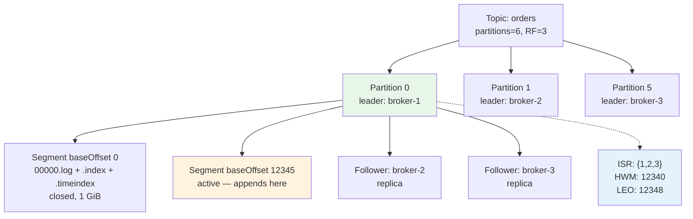
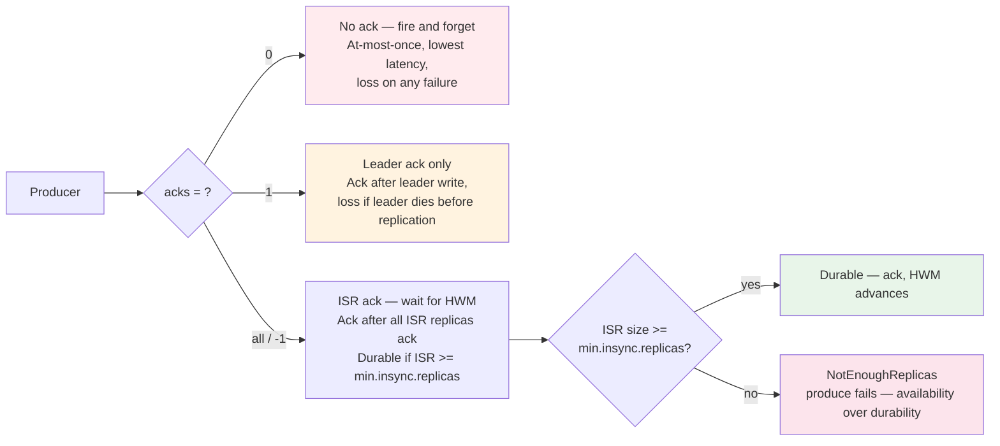
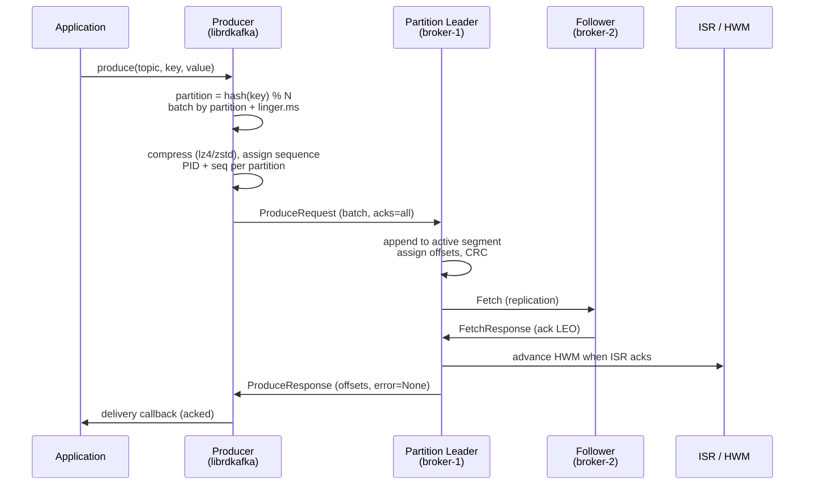
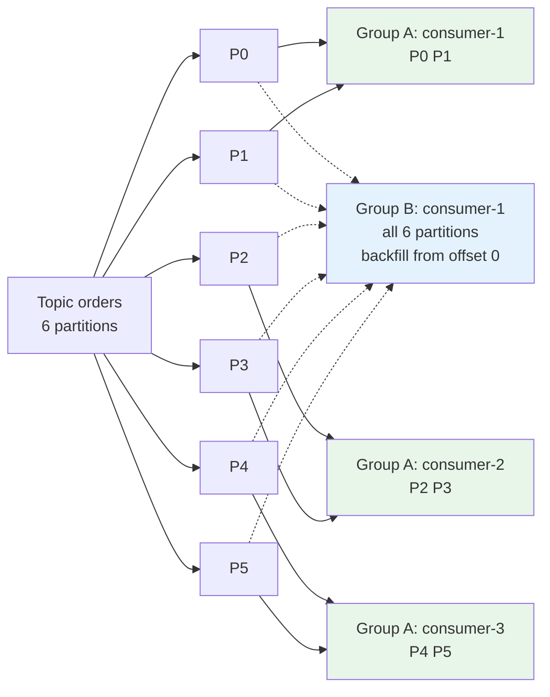
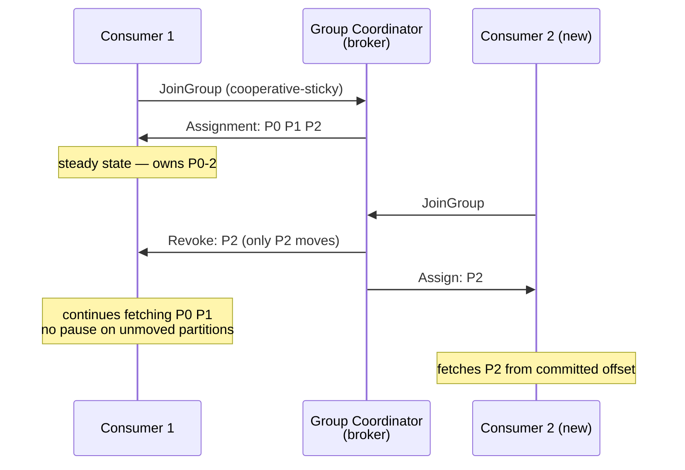
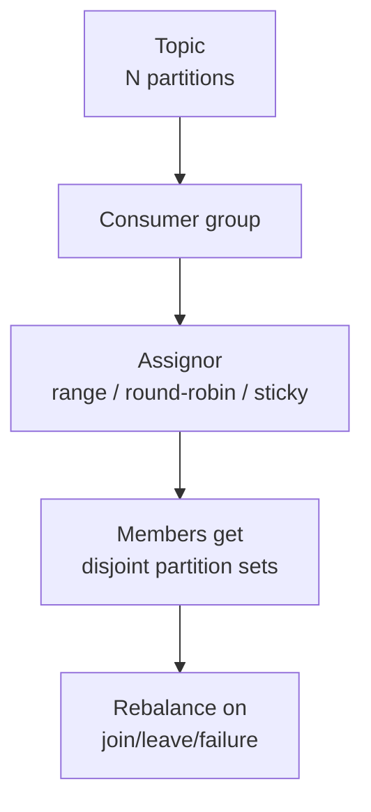
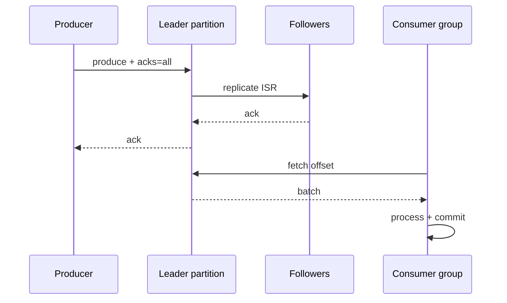

# Chapter 3 — Apache Kafka Architecture

**What this chapter covers.** Kafka is the most widely deployed log in backend systems and the most commonly misunderstood. Teams adopt it as "a queue," discover partitions, lose ordering, misconfigure `acks`, and learn about ISR the day a broker dies. This chapter builds Kafka from the metal up as a **partitioned, replicated, append-only log** — what it stores, how it replicates, how it serves reads and writes, and how the control plane has evolved from ZooKeeper to KRaft. We cover the durable core (topics, partitions, segments, indexes, zero-copy reads), the replication protocol (leader, followers, ISR, high watermark, `acks` and `min.insync.replicas`), the producer and consumer paths (batching, compression, fetch, consumer groups and cooperative rebalancing), and the operational surface that determines whether the cluster survives a failure (KRaft metadata quorum, rack awareness, unclean leader election, tiered storage). Every configuration is pinned to **Kafka 3.7** (KRaft stable, Scala 2.13, Java 17) and uses `confluent-kafka` / `librdkafka` and `kafka` CLI as the concrete client.

Learning goals — after this chapter you should be able to:

- Describe the storage layout: topic → partitions → segments → batch/index/timeindex, and how sequential I/O and page cache make the log fast.
- Explain the replication protocol: leader, followers, ISR, high watermark (HWM), leader epoch, and how `acks` and `min.insync.replicas` trade durability for availability.
- Configure a producer and consumer correctly for each delivery semantic (Ch 2) in Kafka 3.7, including idempotence and transactions.
- Explain consumer groups, partition assignment, and the cooperative rebalancing protocol, including why `max.poll.interval.ms` and `session.timeout.ms` exist.
- Describe the KRaft metadata quorum (Raft over the `__cluster_metadata` log) and how it replaces ZooKeeper.
- Reason about failure: broker loss, ISR shrinkage, unclean leader election, and the durability/availability trade-off at each `acks` setting.
- Operate the cluster: topic sizing, partition count, replication factor, rack awareness, monitoring (JMX/Metrics), and tiered storage.

> **Boundary note.** Vol 6, Chapter 9 — Idempotency, Deduplication, and Exactly-Once develops the *theory* of idempotency (formal definition, naming the effect, the atomic check-and-record protocol, and Stripe-style key discipline). Chapter 2 in this volume maps that theory onto *broker delivery semantics* generally. This chapter is narrower still: the *Kafka broker mechanism* — PID + sequence, transaction coordinator, LSO, and ISR — that implements those semantics on a partitioned log. For system-level idempotency design, read Vol 6 Ch 9; for the broker contract, read Ch 2; for the Kafka wire, read here.

---

## The log, physically

### Topics, partitions, segments

A **topic** is a named log. It is split into **partitions** — ordered, append-only sub-logs numbered `0 … N-1`. Each partition is stored as a sequence of **segment files** on the leader broker's disk:

```
/var/lib/kafka/data/orders-0/
  00000000000000000000.log        # segment — batches of records
  00000000000000000000.index      # offset → file position
  00000000000000000000.timeindex  # timestamp → offset
  00000000000000000123.log        # next segment after roll
  00000000000000000123.index
  leader-epoch-checkpoint
```

The base filename is the **base offset** of the first batch in the segment. Segments roll on size (`segment.bytes`, default 1 GiB) or time (`segment.ms`, default 7 days). The **active segment** is the one currently appended to; closed segments are immutable and eligible for retention or tiered-storage offload.

A **record** (Kafka 3.7, magic 2) carries `timestamp`, `key`, `value`, `headers`, `offset` (assigned by the leader, monotonic per partition), and `sequence` (for idempotent producers). Records are written in **batches** (a `RecordBatch` with CRC, compression, and producer/sequence metadata) — batching is the throughput lever.

### Why sequential I/O is fast

The log does almost no random I/O. Writes are sequential appends to the active segment; reads are sequential scans from an offset, often served from the OS **page cache** without hitting disk. Consumers use `sendfile(2)` (zero-copy) to transfer bytes from page cache to socket without copying through userspace. The result: a single partition can sustain hundreds of MB/s on commodity SSDs, and throughput scales linearly with partitions (until network or broker CPU saturates).

Three indexes make random access cheap when needed:

- **Offset index** — sparse map `offset → file position`, one entry per `index.interval.bytes` (default 4 KiB of batch data) so it stays small.
- **Time index** — `timestamp → offset` for `offsetsForTimes` and retention by timestamp.
- **Leader epoch checkpoint** — `leaderEpoch → startOffset` for truncation after failover (see ISR section).



*Figure 3-1: Topic → partitions → segments. Each partition has one leader that serves all reads and writes; followers replicate the log; the ISR tracks in-sync replicas and the HWM marks committed data.*

---

## Replication: ISR, high watermark, and the durability contract

### Leader, followers, ISR

For each partition, one replica is the **leader** and the rest are **followers**. All produces and reads go through the leader. Followers fetch from the leader (same fetch path as consumers, but with `replica.fetch.*` tuning) and append to their local log. A follower that has caught up to the leader's **Log End Offset (LEO)** — the offset of the next write — is **in-sync** and belongs to the **In-Sync Replica set (ISR)**. Liveness is tracked by `replica.lag.time.max.ms` (default 30s in Kafka 3.7): a follower that has not fetched within that window is ejected from the ISR.

```
Partition 0, RF=3, ISR={1,2,3}, LEO=100 on all replicas:

broker-1 (leader)  log: [0 ... 99][100 LEO]   HWM=100
broker-2 (follower) log: [0 ... 99][100 LEO]  in ISR — caught up
broker-3 (follower) log: [0 ... 99][100 LEO]  in ISR — caught up

After broker-3 stalls (GC pause):

broker-3 log: [0 ... 90]                      lag 10, still within replica.lag.time.max.ms → ISR
... 30s later without fetch → ejected → ISR={1,2}, HWM still 100 (needs min ISR acks)
```

### High watermark and committed data

The **high watermark (HWM)** is the offset of the last *committed* record — the highest offset such that every replica in the ISR has that record. Consumers only see data up to the HWM (or LSO when transactions are active — see below). The HWM is the durability line: data above the HWM is not yet replicated to the ISR and can be lost on leader failure.

```
Leader log:  offset 0 1 2 3 4 5 6 7 8 9  LEO=10
Follower A:  offset 0 1 2 3 4 5 6 7        LEO=8
Follower B:  offset 0 1 2 3 4 5            LEO=6
ISR={leader, A, B}  (all within lag window)
HWM = 6  (min LEO across ISR = 6) — offsets 6..9 are uncommitted
Consumer fetch returns up to 6; offsets 7..9 invisible until B catches up
```

With `acks=all`, a produce is acked only after the HWM advances past the new records — i.e., after every ISR replica has them. This is the durability guarantee; the producer blocks (or times out at `delivery.timeout.ms`) until it holds.

### `acks` and `min.insync.replicas`: the durability/availability dial



*Figure 3-2: The acks/min.insync.replicas dial. acks=all with min.insync.replicas=2 on RF=3 survives one replica loss durably; a second loss makes the partition unavailable for writes rather than risking data loss.*

| `acks` | `min.insync.replicas` (RF=3) | Durability | Availability on one replica down | Availability on two replicas down |
|---|---|---|---|---|
| `0` | — | None — loss on leader crash | Available (no ISR check) | Available |
| `1` | — | Leader durable only | Available | Available |
| `all` | `1` | At least one replica durable | Available | Available |
| `all` | `2` | At least two replicas durable | Available (ISR=2 meets min) | **Unavailable** — `NotEnoughReplicas` |
| `all` | `3` | All three durable | **Unavailable** — ISR=2 < 3 | Unavailable |

The production default for data you cannot afford to lose: `acks=all`, `min.insync.replicas=2`, `replication.factor=3`. This survives one replica failure with no data loss and remains writable; a second failure makes the partition unwritable (fail-closed) rather than risking loss. Setting `min.insync.replicas=1` keeps the partition writable through two failures but admits loss if the sole ISR replica dies before a new follower catches up.

### Leader election, leader epoch, and unclean election

When a leader dies, the controller (KRaft quorum, see below) elects a new leader from the ISR. **Leader epoch** (a monotonic integer per partition, stored in `leader-epoch-checkpoint`) fences stale leaders: a new leader increments the epoch, and followers truncate any divergent tail written by a zombie old leader that was partitioned but still serving writes.

**Unclean leader election** — promoting a replica outside the ISR — is disabled by default (`unclean.leader.election.enable=false`) because it can lose committed data (the out-of-sync replica may be missing records up to the HWM). Enable it only for availability-at-all-costs topics where loss is preferable to unavailability, and monitor `UnderReplicatedPartitions`.

---

## The write path: producer



*Figure 3-3: The produce path. Batching and compression happen client-side; durability is the HWM advance after ISR replication.*

```python
# Kafka 3.7 — producer for each semantic (confluent-kafka 2.4, Python 3.11)
# pip install confluent-kafka==2.4.0
from confluent_kafka import Producer

# At-least-once with durability (default for important data)
durable = Producer({
    "bootstrap.servers": "kafka-1.internal:9092,kafka-2.internal:9092,kafka-3.internal:9092",
    "client.id": "orders-producer",
    "acks": "all",
    "enable.idempotence": True,            # PID+seq dedup — no extra cost, leave on
    "retries": 5,
    "delivery.timeout.ms": 120000,
    "compression.type": "lz4",             # or zstd for better ratio at higher CPU
    "linger.ms": 10,                       # batch up to 10ms
    "batch.size": 65536,
})

# At-most-once / lowest latency (telemetry) — not recommended for important data
fire_and_forget = Producer({
    "bootstrap.servers": "kafka-1.internal:9092",
    "acks": "0",
    "enable.idempotence": False,           # must be false with acks=0
})

# Exactly-once (effectively-once) — transactional (see Ch02 for full discussion)
tx = Producer({
    "bootstrap.servers": "kafka-1.internal:9092,kafka-2.internal:9092,kafka-3.internal:9092",
    "client.id": "payments-producer",
    "acks": "all",
    "enable.idempotence": True,
    "transactional.id": "payments-tx-01",  # stable ID — fencing on restart
})
tx.init_transactions(timeout=10)
tx.begin_transaction()
tx.produce("payments", key="order-123", value=b'{"amount": 5000}')
# ... produce to multiple partitions/topics ...
tx.commit_transaction(timeout=10)          # coordinator writes commit marker, LSO advances
```

Key producer tunables for the distributed-systems lens:

- `delivery.timeout.ms` (default 120s) caps total retry time — after this, the delivery callback gets an error even if `retries` remain. Size it above `retries * retry.backoff.ms` + replication lag.
- `max.in.flight.requests.per.connection` — safe at 5 with idempotence (ordering preserved by sequence), was 1 without.
- `compression.type` — `lz4` is the balanced default; `zstd` gives better ratio for JSON-heavy payloads at higher CPU. Compression is per batch, so larger batches compress better.
- `partitioner` — default is murmur2 hash of key; `sticky` partitioner batches without a key to fewer partitions for better compression when order is irrelevant.

---

## The read path: consumer, groups, and rebalancing

### Fetch

Consumers **pull** (long-poll `FetchRequest`). The leader serves from page cache / `sendfile`; `fetch.min.bytes` and `fetch.max.wait.ms` let the broker wait briefly to accumulate a batch rather than returning a tiny response. `fetch.max.bytes` and `max.partition.fetch.bytes` bound the response size so a single large partition does not starve others.

Two watermarks bound what a consumer sees:

- **HWM** — committed data (ISR-acked) — visible to all consumers.
- **LSO (Last Stable Offset)** — HWM minus open transactions' first offsets — visible to `isolation.level=read_committed` consumers. Aborted transactions are skipped (the broker sends the abort markers and the client filters).

### Consumer groups and partition assignment

A **consumer group** (`group.id`) is a set of consumers cooperating to consume a topic. Each partition is assigned to **exactly one** consumer in the group; a consumer may own multiple partitions. Two consumers in the same group never share a partition — that is how ordering per partition is preserved (one reader, one order). Different groups read independently at their own offsets.



*Figure 3-4: Consumer groups. Group A scales by adding consumers up to partition count; Group B reads the same partitions independently at a different offset.*

Assignment strategies (Kafka 3.7, `partition.assignment.strategy`):

| Strategy | Behavior | When to use |
|---|---|---|
| `range` | Contiguous partitions per topic per consumer | Default, but can be uneven with many topics |
| `roundrobin` | Round-robin across all topic-partitions | Even, simple |
| `cooperative-sticky` | Sticky + cooperative rebalance — minimal partition movement, no stop-the-world | **Preferred in 3.7** — incremental rebalance without global pause |
| `cooperative-sticky` + `group.instance.id` (static membership) | Partitions stay pinned across restarts — no rebalance on rolling deploy | Rolling restarts without churn |

### Rebalancing: why it exists and why it hurts

When a consumer joins or leaves (or crashes past `session.timeout.ms`), the group must reassign partitions. In the **eager** protocol (legacy), all consumers revoke all partitions, the leader recomputes assignment, and everyone re-fetches — a stop-the-world pause proportional to `max.poll.interval.ms` and downstream commit latency. In the **cooperative** protocol (Kafka 2.4+, default in 3.7 with `cooperative-sticky`), only the partitions that must move are revoked, and the rebalance is incremental — no global pause.

Two timeouts govern liveness:

- `session.timeout.ms` (default 45s in 3.7 with `group.consumer` session) — heartbeat timeout. If the broker misses heartbeats for this long, the consumer is considered dead and a rebalance is triggered.
- `max.poll.interval.ms` (default 5 minutes) — maximum time between `poll()` calls. If the consumer's handler blocks longer than this without polling, the consumer is considered failed even though heartbeats may still flow (in the old protocol, heartbeats were tied to poll; in 3.7 with KIP-848 the next-gen consumer separates them, but the timeout still applies).

The production pitfall: a handler that occasionally takes 6 minutes (large batch, slow downstream) exceeds `max.poll.interval.ms`, triggers a rebalance, and causes duplicate processing as partitions move. Either raise the interval, reduce `max.poll.records`, or move heavy work off the poll thread.

```python
# Kafka 3.7 — consumer with correct commit discipline (confluent-kafka 2.4, Python 3.11)
from confluent_kafka import Consumer

conf = {
    "bootstrap.servers": "kafka-1.internal:9092,kafka-2.internal:9092,kafka-3.internal:9092",
    "group.id": "orders-processor",
    "group.instance.id": "orders-proc-1",          # static membership — no rebalance on restart
    "partition.assignment.strategy": "cooperative-sticky",
    "enable.auto.commit": False,                   # manual commit — we control the guarantee
    "isolation.level": "read_committed",           # hide aborted transactions
    "auto.offset.reset": "earliest",
    "fetch.min.bytes": 1024,
    "fetch.max.wait.ms": 500,
    "max.poll.interval.ms": 300000,                # 5 min — must exceed worst handle() time
    "session.timeout.ms": 45000,
    "max.poll.records": 500,                       # bound handler work per poll
}
c = Consumer(conf)
c.subscribe(["orders"])

try:
    while True:
        msg = c.poll(1.0)
        if msg is None:
            continue
        if msg.error():
            # handle INVALID_OFFSET, etc.
            continue
        try:
            handle(msg.value(), msg.key())         # must be idempotent/deduped for at-least-once
            c.commit(msg)                          # commit offset after success
        except TransientError:
            # don't commit — redelivery after poll timeout / rebalance
            continue
        except PermanentError:
            publish_to_dlq(msg)                    # see Ch08
            c.commit(msg)                          # advance past poison message
finally:
    c.close()  # leaves group cleanly — no rebalance timeout
```



*Figure 3-5: Cooperative rebalance. Only the migrating partition pauses; the rest of the group continues fetching — no stop-the-world.*

---

## The control plane: KRaft

### From ZooKeeper to KRaft

Kafka 3.7 runs KRaft (Kafka Raft) as the stable metadata quorum; ZooKeeper is deprecated and removed in 4.0. The controller quorum is a Raft group (typically 3 or 5 controller nodes) that replicates a single **metadata log** (`__cluster_metadata` topic, `TopicId` `AAAAAAAAAAAAAAAAAAAAAA`). All metadata — topic configs, partition assignments, ISR, configs, ACLs — is a record in this log. Brokers act as Raft followers for metadata and apply records to their in-memory image.

Why this matters operationally:

- No external ZooKeeper ensemble to operate, secure, and version-skew.
- Metadata replication is Raft-linearizable — no ZK session expiry or ephemeral-node subtleties.
- Controller failover is Raft leader election, not ZK leader election + broker controller election — one fewer moving part.
- `process.roles=broker,controller` allows colocated nodes for small clusters; production clusters separate them.

```yaml
# Kafka 3.7 KRaft — controller quorum (server.properties / kraft/server.properties)
process.roles=broker,controller
node.id=1
controller.quorum.voters=1@kafka-1.internal:9093,2@kafka-2.internal:9093,3@kafka-3.internal:9093
listeners=PLAINTEXT://:9092,CONTROLLER://:9093
inter.broker.listener.name=PLAINTEXT
controller.listener.names=CONTROLLER
log.dirs=/var/lib/kafka/data
num.network.threads=8
num.io.threads=8
# Topic defaults
num.partitions=6
default.replication.factor=3
min.insync.replicas=2
offsets.topic.replication.factor=3
transaction.state.log.replication.factor=3
transaction.state.log.min.isr=2
# KRaft requires explicit cluster ID on format
# kafka-storage.sh format -t <uuid> -c server.properties  (once, before first start)
```

### What the quorum does

The active controller (Raft leader) is the sole writer of metadata. On broker failure, it:

1. Detects liveness via broker heartbeat to the quorum.
2. Removes the failed broker from ISRs it belonged to (ISR shrinkage).
3. Elects new partition leaders from the remaining ISR (or triggers unclean election if enabled and ISR is empty).
4. Writes the new leader/ISR to the metadata log; all brokers apply it.

The quorum size determines availability: 3 controllers survive 1 failure, 5 survive 2. Never run 2 or 4 — even numbers do not improve fault tolerance over the next odd number.

---

## Failure, durability, and the operator's dials

### Broker failure walkthrough (RF=3, min ISR=2)

```
t0: P0 ISR={1,2,3} leader=1 HWM=100 LEO=100 on all
t1: broker-3 dies (disk failure)
    → ISR={1,2} (3 ejected after replica.lag.time.max.ms or heartbeat loss)
    → HWM still 100 (2 replicas remain, meets min ISR=2) — writes continue
t2: producer with acks=all writes offset 100..109
    → leader 1 appends, follower 2 replicates, HWM advances to 110 — acked
t3: broker-2 dies as well
    → ISR={1} — now below min ISR=2
    → partition becomes unwritable: NotEnoughReplicasException
    → consumers can still read up to HWM=110
t4: broker-2 returns, catches up, ISR={1,2} — writes resume
    (if unclean election were enabled, broker-3 could have been elected at t3 with data loss)
```

The lesson: `min.insync.replicas` is the **durability floor that trades availability**. With `RF=3, minISR=2` you survive one failure with no loss and remain writable; the second failure makes the partition read-only until a replica returns. That is the correct default for important topics. For availability-at-all-costs topics (metrics, traces), use `minISR=1`.

### Rack awareness and tiered storage

- **Rack awareness** (`broker.rack=us-east-1a`) — the controller places replicas across racks/AZs so a rack loss does not take all replicas. The replica selector also prefers fetching from the closest replica (KIP-392, `client.rack`).
- **Tiered storage** (KIP-405, early access in 3.7 — GA semantics in 3.8+, `remote.log.storage`) — closed segments are offloaded to S3/GCS; the broker retains only the active working set. Consumers reading far behind fetch from remote storage via the broker. This decouples retention (now bounded by object-store cost, not broker disk) from broker sizing.

### Monitoring that matters

| Signal | JMX / metric | What it tells you |
|---|---|---|
| Under-replicated partitions | `UnderReplicatedPartitions` | ISR < RF — replication lagging or broker down |
| Offline partitions | `OfflinePartitionsCount` | No ISR replica available — partition unavailable |
| ISR shrink/expand rate | `IsrShrinksPerSec` / `IsrExpandsPerSec` | Flapping followers — GC, network, or disk issue |
| Request latency (produce/fetch) | `RequestMetrics` per `request` | Broker overload or disk stall |
| Consumer lag | `consumer lag` (per group/partition) or Burrow / `kafka-consumer-groups.sh` | Consumer falling behind — scale consumers or partitions |
| LSO lag | `LogEndOffset - LastStableOffset` | Open transactions holding back `read_committed` readers |
| Controller queue | `ControllerEventManager` queue size | Metadata overload — topic creation storm or broker flapping |

```bash
# Kafka 3.7 — essential CLI checks (KRaft, no ZooKeeper flag)
kafka-topics.sh --bootstrap-server kafka-1.internal:9092 --describe --topic orders
# Topic: orders  PartitionCount: 6  ReplicationFactor: 3  Configs: min.insync.replicas=2,...
#   Partition: 0  Leader: 1  Replicas: 1,2,3  Isr: 1,2  (replica 3 lagging)

kafka-consumer-groups.sh --bootstrap-server kafka-1.internal:9092 --describe --group orders-processor
# GROUP              TOPIC   PARTITION  CURRENT-OFFSET  LOG-END-OFFSET  LAG
# orders-processor   orders  0          12340           12348           8

# JMX via jmxterm or Prometheus jmx_exporter — scrape UnderReplicatedPartitions
```

---

## Sizing guidance

- **Partition count** — partitions are the parallelism unit. More partitions = more throughput and more consumers, but also more file handles, more ISR replication, and higher controller metadata. Start with `partitions ≈ max expected consumer parallelism × 1.5`; grow by splitting (KIP-848 topic auto-split or manual `kafka-topics --alter --partitions`). Never use hundreds of thousands of partitions without testing controller and file-handle limits.
- **Replication factor** — 3 for important data, 2 for ephemeral or cost-sensitive data, 1 only for development.
- **Retention** — `retention.ms` / `retention.bytes` or tiered storage. Size for the longest consumer's catch-up window (backfill, reprocessing) plus compliance needs, not just "a few days."
- **Batch and linger** — `linger.ms=5–10ms` and `batch.size=32–64 KiB` are sensible defaults; increase for throughput, decrease for latency.
- **Compression** — `lz4` or `zstd` for JSON/text payloads; measure — binary payloads (Protobuf, Avro) compress less.

---


#### Partition Assignment



#### End-to-End Kafka Flow



## Key takeaways

- Kafka is a partitioned, replicated log — sequential segment files, offset/index/timeindex, page cache + `sendfile` for speed. Partitions scale throughput; replication scales durability.
- ISR + HWM + `acks`/`min.insync.replicas` is the durability contract. `acks=all` with `RF=3, minISR=2` survives one failure with no loss and fails closed on two — the right default for important topics.
- The producer batches, compresses, and sequences per partition (PID+seq for idempotence); the broker appends, replicates to ISR, and advances the HWM before acking.
- Consumers pull via fetch, see only HWM (or LSO with transactions), and coordinate through consumer groups with cooperative-sticky assignment — no stop-the-world on rebalance.
- KRaft (Raft over `__cluster_metadata`) replaces ZooKeeper; the controller quorum manages ISR, leader election, and leader epoch fencing. Run 3 or 5 controllers, separate from brokers in production.
- Rack awareness, tiered storage, and the two timeouts (`session.timeout.ms`, `max.poll.interval.ms`) are the operational levers that determine whether the cluster survives a failure and whether consumers make progress.
- Monitor under-replicated partitions, offline partitions, consumer lag, and LSO lag — they are the early warning for replication, availability, and transaction health.

## Further reading

- Apache Kafka documentation 3.7 — Design, replication, KRaft, producer/consumer configs. https://kafka.apache.org/37/documentation.html
- Kafka Improvement Proposals: KIP-500 (KRaft), KIP-848 (next-gen consumer group protocol), KIP-405 (tiered storage), KIP-392 (rack-aware fetch).
- Kleppmann, M. *Designing Data-Intensive Applications*, Ch. 11 — The log abstraction and Kafka's place in it.
- Kreps, J., Narkhede, N., Rao, J. "Kafka: a Distributed Messaging System for Log Processing." NetDB 2011.
- Confluent blog — "Exactly-once Semantics are Possible" (transactions), "Introducing KRaft". https://www.confluent.io/blog/
- `librdkafka` / `confluent-kafka` configuration reference 2.4. https://github.com/confluentinc/librdkafka/blob/master/CONFIGURATION.md
- Narkhede, N. et al. *Kafka: The Definitive Guide*, 2nd ed. O'Reilly, 2021 (supplement with 3.7 KRaft changes).

