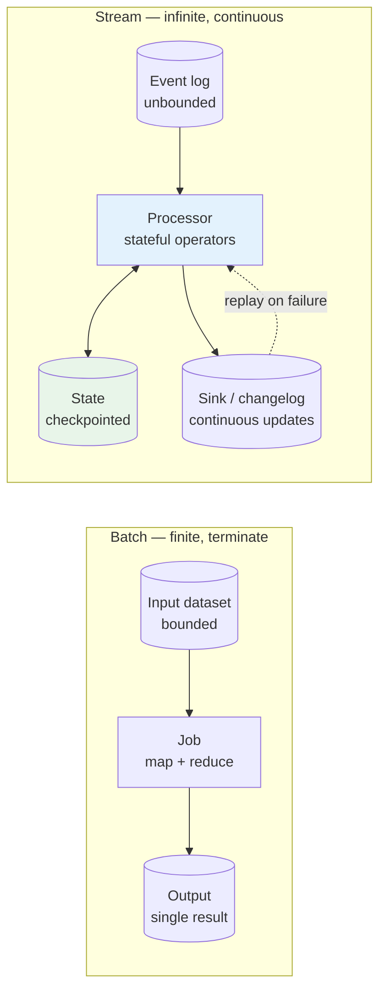
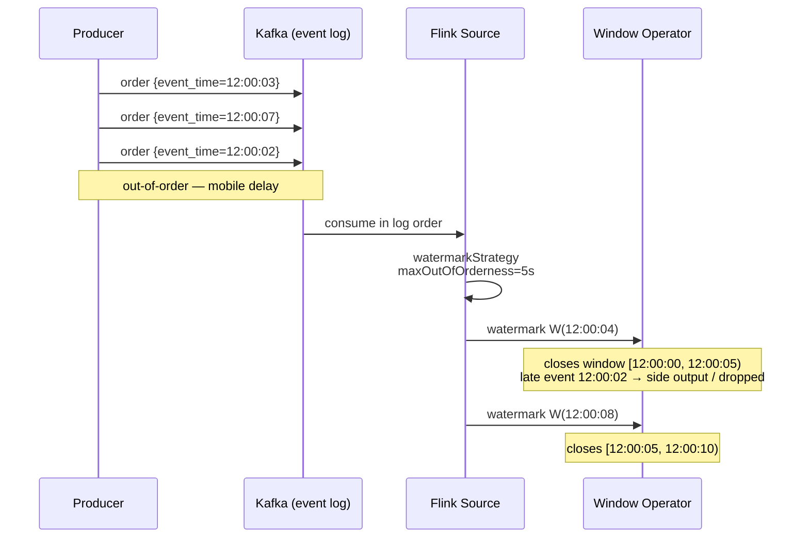
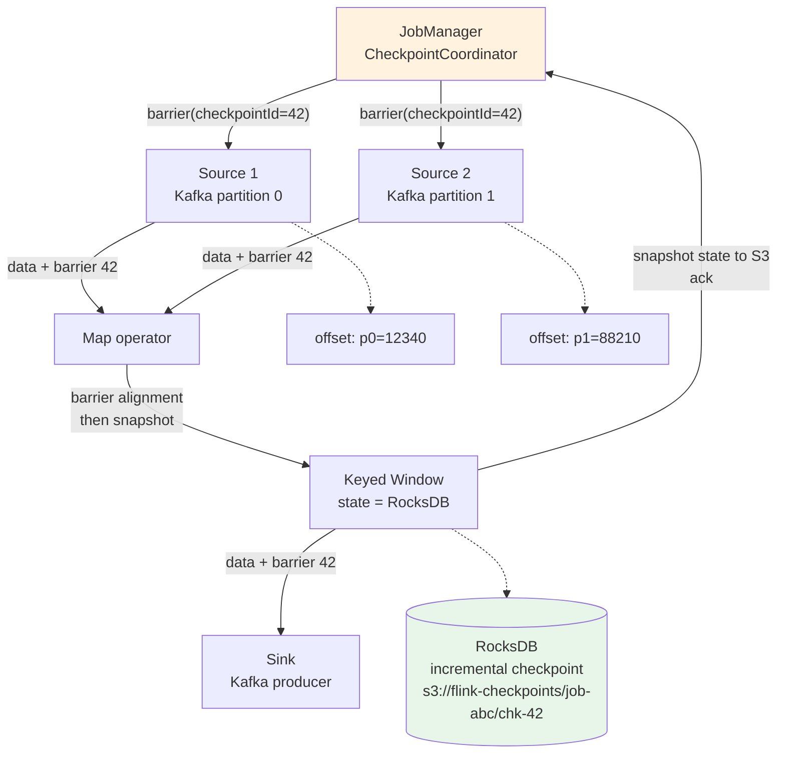
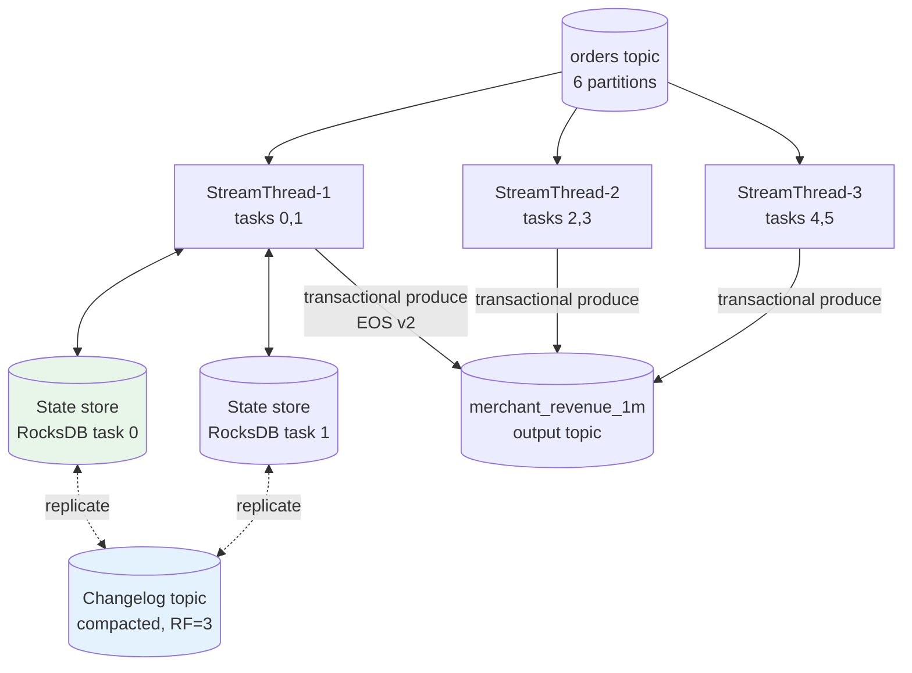
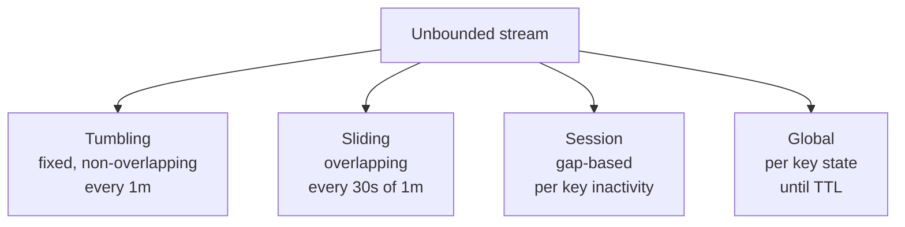
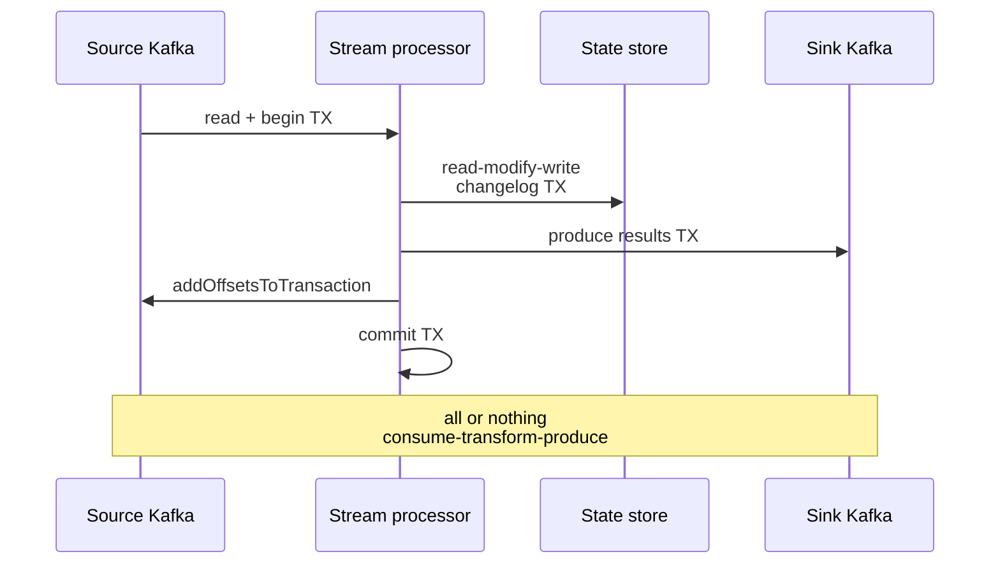

# Chapter 4 — Stream Processing

**What this chapter covers.** Batch says "process what arrived yesterday." Stream processing says "process what is arriving right now, continuously, and never stop." The difference is not just latency — it is a fundamentally different execution model: unbounded data, event-time semantics, incremental state, and failure recovery that must preserve correctness without reprocessing the world. This chapter builds stream processing from its primitives — streams vs. tables, event time vs. processing time, windows, watermarks, and keyed state — then makes it concrete in the two dominant engines you will operate in production: **Apache Flink 1.19/1.20** and **Kafka Streams 3.7**. We cover Flink's checkpointing barrier protocol and exactly-once state, Kafka Streams' state stores and transactional topology, windowing and watermarks in both, and the operational reality of scaling, rebalancing, late data, and backpressure. Every config is pinned to real versions and uses the Kafka 3.7 and Flink 1.19 APIs you will actually deploy.

Learning goals — after this chapter you should be able to:

- Distinguish stream vs. batch vs. micro-batch and explain why the unbounded-data model changes correctness, latency, and failure semantics.
- Define event time, processing time, and ingestion time, explain why event time is necessary, and describe how watermarks bound lateness.
- Describe window types (tumbling, sliding, session, global) and triggers, and choose correctly for counting, sessionization, and session-timeout workloads.
- Explain keyed state, operator state, checkpointing, and the Chandy-Lambert barrier protocol that gives Flink exactly-once state without stopping the world.
- Build a stateful Flink DataStream job (1.19): Kafka source with watermarks, keyed windowed aggregation, checkpointed state, and a Kafka sink with exactly-once commit.
- Build a Kafka Streams 3.7 topology: KStream/KTable, state stores, windowed aggregation, and exactly-once via `processing.guarantee=exactly_once_v2`.
- Reason about ordering (per-key total order, cross-key partial order), exactly-once end-to-end (source → state → sink), and the scaling/recovery path when a task manager or stream thread dies.
- Decide between Flink and Kafka Streams for a given workload and operational context.

> **Boundary note.** Vol 6 — Distributed Systems — develops the *theory* that constrains stream processing: time and clocks (Ch 2), consistency models (Ch 3), consensus that underpins checkpoint coordination, and the impossibility arguments behind exactly-once delivery (Ch 9 — the producer ambiguity after a lost ack). This chapter is *mechanics*: how streaming engines implement event time, watermarks, windowed state, and fault tolerance on top of a partitioned log. Vol 7, Chapter 7 — Event-Driven Architecture — treats streams at the *system-design* level — when to choose events over RPC, choreography vs. orchestration — and names Kafka as the log without opening the processing engine. For why exactly-once is impossible at the transport layer and what "effectively once" costs, read Vol 6 Ch 9; for when to stream at all, read Vol 7 Ch 7; for how the engine actually keeps state correct under failure, read here.

---

## Streams, tables, and why batch is not enough

A **batch** computation has a start and an end: read a finite dataset, compute, write a result, terminate. A **stream** computation never terminates: it consumes an unbounded sequence of events and continuously maintains results that evolve as new data arrives. The canonical duality (Kreps, "The Log") is:

- **Stream as log** — an append-only sequence of events keyed by time: `... e1, e2, e3, ...` with no end.
- **Table as state** — the materialized view of a stream at a point in time: `SELECT COUNT(*) FROM events` is a table whose rows update as the stream advances.

Every stream processor is a bridge between the two: it reads a stream, holds **state** (a table), and emits a new stream (changelog) or updates a sink table. The "stream-table duality" is literal in Kafka Streams (`KStream` vs. `KTable`) and implicit in Flink (a `DataStream` keyed and aggregated becomes queryable state).

| Property | Batch (e.g., Spark batch, MapReduce) | Stream (Flink, Kafka Streams) |
|---|---|---|
| Input | Bounded — "all orders from yesterday" | Unbounded — "every order as it is placed" |
| Latency | Minutes to hours (job launch + full scan) | Milliseconds to seconds (per-event or per-window) |
| State | Ephemeral per job | Durable, keyed, checkpointed across failures |
| Correctness on failure | Re-run the job | Restore state from checkpoint + replay from last offset |
| Output | Single result | Continuous updates, retractions, or windowed aggregates |

Micro-batch (Spark Structured Streaming in micro-batch mode) splits the difference: it runs tiny batch jobs on short intervals (100ms–1s). It simplifies reasoning for teams that think in batch, but it trades latency floor and per-event state semantics for scheduler simplicity. True streaming (Flink event-at-a-time, Kafka Streams per-record) processes each event through the operator graph as it arrives.



*Figure 4-1: Batch terminates; streaming holds state and emits continuously. Failure recovery for streaming is state restore plus log replay, not full recomputation.*

---

## Time: the hard part

Stream correctness lives or dies on how you handle time. There are three clocks, and conflating them is the most common source of silent data errors.

| Clock | Meaning | Who assigns it | Affected by |
|---|---|---|---|
| **Event time** | When the thing *happened* at the source | Producer — `event.occurred_at` in the payload | Nothing — it is a fact, even if delayed |
| **Ingestion time** | When the broker *received* the record | Broker — Kafka's `LogAppendTime` | Broker clock skew, produce latency |
| **Processing time** | When the processor *sees* the record | Processor — `System.currentTimeMillis()` on the task manager | Scheduling, GC, backpressure, lag |

Processing time is trivial to use and almost always wrong for business logic. If a mobile device buffers events offline for 6 hours and delivers them late, a processing-time window of "orders in the last 5 minutes" will count the event 6 hours late — or miss the window entirely. **Event time** is the only clock that preserves correctness when events are delayed, reordered, or backfilled.

But event time introduces a hard question: *when has all data for a given window arrived?* In an unbounded stream you can never be sure. The answer is **watermarks**.

### Watermarks

A **watermark** is a monotone assertion from the source: "I have observed all events with event time ≤ T (up to some bounded lateness)." It flows through the operator graph and tells window operators when to close and fire.

Formally, a watermark `W(T)` means no future event with `event_time < T` is expected (or will be considered on-time). Events that arrive after their window's watermark has passed are **late**.

```
event_time:   0s   2s   5s   4s   7s   11s   8s  ...
watermark:    ---- W(3s) ---- W(6s) ---- W(10s) ---
                        ↑ late: 4s < W(6s)
                                    ↑ late: 8s < W(10s)
```

In Flink, watermarks are generated at the source and propagated operator-to-operator. In Kafka Streams, the equivalent is `grace period` on windowed aggregations (how long after window end to accept late events).



*Figure 4-2: Event-time processing with watermarks. The watermark advances based on observed event times minus bounded out-of-orderness; late events are handled explicitly.*

### Windows

A **window** slices an infinite stream into finite buckets that can be aggregated. The type determines the slicing rule.

| Window | Definition | Trigger | Example — "count orders" |
|---|---|---|---|
| **Tumbling** | Fixed-size, non-overlapping | Every N seconds | Orders per 1-minute bucket — no overlap |
| **Sliding** | Fixed-size, overlapping (period < size) | Every P seconds | Orders in last 5 min, updated every 30s |
| **Session** | Activity-based, gap-defined | Gap of inactivity closes session | User session = events within 30 min of each other |
| **Global** | One window per key, never closes by time | Custom trigger (count, punctuation) | "First 100 events per user, then fire" |

```mermaid
gantt
    title Windows over event time — key = user_42
    dateFormat X
    axisFormat %S s
    section Tumbling 10s
    window [0,10) :0, 10
    window [10,20) :10, 20
    window [20,30) :20, 30
    section Sliding 10s / every 5s
    w1 [0,10) :0, 10
    w2 [5,15) :5, 15
    w3 [10,20) :10, 20
    section Session gap=8s
    session 1 (events at 1,4,9) :0, 12
    gap :12, 20
    session 2 (events at 22,24) :20, 30
```



*Figure 4-3: Tumbling windows partition time cleanly; sliding windows overlap for rolling aggregates; session windows merge events separated by less than the gap timeout.*

Late-data handling is explicit: allow lateness with a side output (Flink `allowedLateness` + `sideOutputLateData`), or drop after grace (Kafka Streams `grace(Duration)`). There is no implicit "correct" choice — dropping loses data, allowing lateness emits retractions/updates. Your sink must handle both.

---

## Stateful processing and the exactly-once state problem

A stateless `map` or `filter` needs no memory across events. Anything interesting — counting, joining, deduplication, sessionization — needs **state**: per-key counters, window buffers, join tables, dedup sets. State is partitioned ("keyed") and colocated with the key's processor.

Failure makes state correctness hard. Consider a counter `count[user_42] = 137` on task manager TM-1. TM-1 crashes. The replacement task restores from ... what? If it replays the log from the last committed offset but re-applies events already counted, the counter double-counts. If it restores stale state and skips replay, it under-counts.

The correct answer is **checkpointed state + replay from checkpoint offset atomically**. Both Flink and Kafka Streams implement this, differently.

### Flink: barriers, checkpoints, savepoints

Flink's fault tolerance is the **Chandy-Lamport distributed snapshot** via **barrier injection**.

1. The `CheckpointCoordinator` (JobManager) periodically injects a **barrier** (a control event carrying `checkpointId`) into every source.
2. Barriers flow with data through the operator graph, aligned per operator (an operator waits until it has received the barrier on *all* inputs before snapshotting — "barrier alignment").
3. Each operator snapshots its state to durable storage (RocksDB incremental checkpoint to S3/GCS/HDFS) and records its input offsets.
4. When all operators have acked, the checkpoint is **completed**. Offsets and state are now durably paired.
5. On failure, the job restores every operator to the last completed checkpoint and rewinds sources to the checkpointed offsets.

Because barriers flow with data, the snapshot is *consistent* — it reflects a cut across the graph where no in-flight event is counted twice or lost — without stopping processing (aside from brief alignment stalls).



*Figure 4-4: Flink barrier protocol. Barriers flow with data; each operator snapshots state and offsets. The completed checkpoint is the consistent restore point.*

An **exactly-once sink** (Kafka) participates in the checkpoint via Flink's **two-phase commit sink** (`KafkaSink` with `DeliveryGuarantee.EXACTLY_ONCE`): the sink pre-commits the Kafka transaction on checkpoint, and the JobManager commits it only after the checkpoint completes. If the checkpoint fails, the transaction aborts. This extends exactly-once from Flink state to the external sink.

A **savepoint** is a manually triggered checkpoint that includes additional metadata for job upgrades (topology changes, rescaling). Use savepoints for deploys; checkpoints for automatic recovery.

### Kafka Streams: state stores, changelog, and transactions

Kafka Streams embeds the processor inside your application process — there is no separate cluster. Each `KafkaStreams` instance runs **stream threads**; each thread owns a set of **tasks**, each task owns a set of **partitions**, and each task has a **state store** (RocksDB by default, or in-memory) backed by a **changelog topic** (an internal compacted Kafka topic that replicates state).

Fault tolerance: on failure, the task migrates to another instance, restores its state store by replaying the changelog topic from the last checkpoint (offset commit), then resumes processing. There is no barrier protocol — ordering is per-partition and recovery is per-task replay.

Exactly-once in Kafka Streams is `processing.guarantee=exactly_once_v2` (EOS v2, Kafka 3.7): the consumer, state update, and producer commit are wrapped in a single Kafka transaction per task, coordinated by the transaction coordinator. The guarantee is **read-process-write exactly once within the topology** — end-to-end exactly once requires a transactional sink (Kafka topic) and a read-committed downstream consumer.

| Dimension | Flink | Kafka Streams |
|---|---|---|
| Deployment | Separate cluster (JobManager + TaskManagers) or Application mode on K8s | Library embedded in your service (no cluster) |
| State | RocksDB / heap, checkpointed to object store via barriers | RocksDB / in-memory, changelog topic on Kafka |
| Scaling | Rescale via savepoint, reactive mode | Partition count = max parallelism; add instances, tasks rebalance |
| Exactly-once | Checkpoint + 2PC sink (Kafka), `EXACTLY_ONCE` | `exactly_once_v2` (transactions per task) |
| Latency | Milliseconds (event-at-a-time, pipelined) | Milliseconds (per-record) |
| Operations | Checkpoint tuning, TM memory, RocksDB tuning | Consumer group rebalances, state-store sizing, changelog retention |
| When to choose | Complex topologies, large state, multi-source/sink, needs SQL (Flink SQL) | Kafka-in/Kafka-out, team wants no extra cluster, moderate state |

---

## Flink in practice — a stateful windowed job

A realistic job: from an `orders` Kafka topic (Avro, event time in `occurred_at`), compute **per-merchant revenue per 1-minute tumbling window**, with 10s of allowed lateness for late mobile events, and write results to a `merchant_revenue_1m` Kafka topic exactly once.

```java
// Flink 1.19 — DataStream API, Java 17
// Dependencies: flink-streaming-java, flink-connector-kafka 3.1, flink-avro, flink-statebackend-rocksdb
import org.apache.flink.api.common.eventtime.*;
import org.apache.flink.api.common.functions.AggregateFunction;
import org.apache.flink.connector.kafka.sink.KafkaSink;
import org.apache.flink.connector.kafka.sink.KafkaRecordSerializationSchema;
import org.apache.flink.connector.kafka.source.KafkaSource;
import org.apache.flink.connector.kafka.source.enumerator.initializer.OffsetsInitializer;
import org.apache.flink.streaming.api.datastream.DataStream;
import org.apache.flink.streaming.api.environment.StreamExecutionEnvironment;
import org.apache.flink.streaming.api.windowing.assigners.TumblingEventTimeWindows;
import org.apache.flink.streaming.api.windowing.time.Time;
import org.apache.flink.streaming.api.windowing.triggers.EventTimeTrigger;
import org.apache.flink.util.OutputTag;

import java.time.Duration;

public class MerchantRevenueJob {

    // Late events that arrive after allowed lateness go here for reprocessing / DLQ
    private static final OutputTag<Order> LATE_TAG = new OutputTag<Order>("late-orders") {};

    public static void main(String[] args) throws Exception {
        StreamExecutionEnvironment env = StreamExecutionEnvironment.getExecutionEnvironment();

        // --- Checkpointing: exactly-once state ---
        env.enableCheckpointing(30_000); // every 30s
        env.getCheckpointConfig().setMinPauseBetweenCheckpoints(10_000);
        env.getCheckpointConfig().setCheckpointTimeout(5 * 60_000);
        env.getCheckpointConfig().setMaxConcurrentCheckpoints(1);
        env.getCheckpointConfig().setTolerableCheckpointFailureNumber(3);
        // Retain on cancellation so you can resume from savepoint after deploy
        env.getCheckpointConfig().setExternalizedCheckpointCleanup(
            org.apache.flink.runtime.state.ExternalizedCheckpointCleanup.RETAIN_ON_CANCELLATION);

        // --- Kafka source with event-time watermarks ---
        KafkaSource<Order> source = KafkaSource.<Order>builder()
            .setBootstrapServers("kafka-1.internal:9092,kafka-2.internal:9092,kafka-3.internal:9092")
            .setTopics("orders")
            .setGroupId("flink-merchant-revenue")
            .setStartingOffsets(OffsetsInitializer.committedOffsets(
                org.apache.flink.connector.kafka.source.enumerator.initializer.OffsetsInitializer.OffsetResetStrategy.EARLIEST))
            .setValueOnlyDeserializer(new AvroOrderDeserializationSchema())
            .setProperty("isolation.level", "read_committed") // only committed transactional writes
            .build();

        WatermarkStrategy<Order> wmStrategy = WatermarkStrategy
            .<Order>forBoundedOutOfOrderness(Duration.ofSeconds(5)) // max expected reordering
            .withTimestampAssigner((order, ts) -> order.getOccurredAt().toEpochMilli())
            .withIdleness(Duration.ofSeconds(30)); // mark idle partitions so watermarks advance

        DataStream<Order> orders = env.fromSource(source, wmStrategy, "kafka-orders");

        // --- Keyed tumbling window: 1 minute, event time, 10s lateness ---
        DataStream<MerchantRevenue> revenue = orders
            .keyBy(Order::getMerchantId)
            .window(TumblingEventTimeWindows.of(Time.minutes(1)))
            .trigger(EventTimeTrigger.create())
            .allowedLateness(Time.seconds(10))
            .sideOutputLateData(LATE_TAG)
            .aggregate(new RevenueAggregate(), new RevenueWindowFunction());

        // Late events — send to DLQ / reprocessing topic
        revenue.getSideOutput(LATE_TAG)
            .map(o -> new LateOrder(o, "late beyond 10s grace"))
            .sinkTo(buildLateSink());

        // --- Kafka sink with exactly-once (2PC) ---
        KafkaSink<MerchantRevenue> sink = KafkaSink.<MerchantRevenue>builder()
            .setBootstrapServers("kafka-1.internal:9092,kafka-2.internal:9092,kafka-3.internal:9092")
            .setRecordSerializer(KafkaRecordSerializationSchema.builder()
                .setTopic("merchant_revenue_1m")
                .setKeySerializationSchema(o -> o.getMerchantId().getBytes())
                .setValueSerializationSchema(new AvroRevenueSerializationSchema())
                .build())
            .setDeliveryGuarantee(
                org.apache.flink.connector.kafka.sink.KafkaSink.DeliveryGuarantee.EXACTLY_ONCE)
            .setTransactionalIdPrefix("flink-merchant-revenue-")
            // Transaction timeout must exceed checkpoint interval + max checkpoint duration
            .setProperty("transaction.timeout.ms", "600000")
            .build();

        revenue.sinkTo(sink);
        env.execute("merchant-revenue-1m");
    }

    // Incremental aggregate — keeps running sum in RocksDB, not full window buffer
    static class RevenueAggregate implements AggregateFunction<Order, RevenueAcc, RevenueAcc> {
        @Override public RevenueAcc createAccumulator() { return new RevenueAcc(0L, 0L); }
        @Override public RevenueAcc add(Order o, RevenueAcc acc) {
            return new RevenueAcc(acc.count + 1, acc.totalCents + o.getTotalCents());
        }
        @Override public RevenueAcc getResult(RevenueAcc acc) { return acc; }
        @Override public RevenueAcc merge(RevenueAcc a, RevenueAcc b) {
            return new RevenueAcc(a.count + b.count, a.totalCents + b.totalCents);
        }
    }
}
```

```yaml
# flink-conf.yaml — production-relevant settings (Flink 1.19 on Kubernetes Application mode)
jobmanager.memory.process.size: 2048m
taskmanager.memory.process.size: 4096m
taskmanager.numberOfTaskSlots: 4
parallelism.default: 12                       # should divide evenly by Kafka partitions (e.g., 24 partitions → 12 parallelism OK)

state.backend: rocksdb
state.backend.incremental: true              # incremental checkpoints — only SST diff, not full state
state.backend.rocksdb.memory.managed: true
state.checkpoints.dir: s3://my-flink-checkpoints/merchant-revenue/
state.savepoints.dir: s3://my-flink-savepoints/merchant-revenue/
state.checkpoints.num-retained: 3

execution.checkpointing.interval: 30s
execution.checkpointing.mode: EXACTLY_ONCE
execution.checkpointing.timeout: 5min
execution.checkpointing.tolerable-failed-checkpoints: 3

# RocksDB tuning for large keyed state (per-merchant windows)
state.backend.rocksdb.block.cache-size: 256m
state.backend.rocksdb.writebuffer.size: 64m
```

Key choices and why:

- `forBoundedOutOfOrderness(5s)` — watermark lags the max observed event time by 5s, so an event up to 5s out of order is still on-time. Larger bound = more latency before windows fire, but fewer late events.
- `withIdleness(30s)` — if a Kafka partition goes idle (no events for a merchant), the watermark would stall forever without this. Idleness marks the source idle so downstream watermarks advance on other partitions.
- `allowedLateness(10s)` + `sideOutputLateData` — windows fire on watermark, then accept updates for 10s more (emitting retractions/updates to the sink). Beyond that, events go to the side output for offline reprocessing.
- `EXACTLY_ONCE` sink — the `KafkaSink` participates in the checkpoint as a two-phase commit. On checkpoint, it flushes and pre-commits the Kafka transaction; the JobManager commits on checkpoint completion. A failed checkpoint aborts the transaction — no partial writes visible to `read_committed` consumers.
- RocksDB incremental checkpoints — for large state (millions of merchant windows), full checkpoints would be too large and slow. Incremental checkpoints upload only new SST files since the last checkpoint.

---

## Kafka Streams in practice — topology, state, and EOS

Same business logic in Kafka Streams: per-merchant 1-minute revenue from `orders` → `merchant_revenue_1m`.

```java
// Kafka Streams 3.7, Java 17
// Dependencies: kafka-streams 3.7.0, kafka-clients 3.7.0
import org.apache.kafka.common.serialization.Serdes;
import org.apache.kafka.streams.*;
import org.apache.kafka.streams.kstream.*;
import org.apache.kafka.streams.state.Stores;

import java.time.Duration;
import java.util.Properties;

public class MerchantRevenueStreams {

    public static void main(String[] args) {
        Properties props = new Properties();
        props.put(StreamsConfig.APPLICATION_ID_CONFIG, "merchant-revenue-streams");
        props.put(StreamsConfig.BOOTSTRAP_SERVERS_CONFIG,
            "kafka-1.internal:9092,kafka-2.internal:9092,kafka-3.internal:9092");
        props.put(StreamsConfig.DEFAULT_KEY_SERDE_CLASS_CONFIG, Serdes.String().getClass());
        props.put(StreamsConfig.DEFAULT_VALUE_SERDE_CLASS_CONFIG, AvroSerde.class);
        // Exactly-once within the topology (EOS v2 — requires Kafka 3.7 brokers, transactional.id fencing)
        props.put(StreamsConfig.PROCESSING_GUARANTEE_CONFIG, StreamsConfig.EXACTLY_ONCE_V2);
        props.put(StreamsConfig.REPLICATION_FACTOR_CONFIG, 3);           // for internal topics (changelog, repartition)
        props.put(StreamsConfig.NUM_STANDBY_REPLICAS_CONFIG, 1);         // warm standby for fast failover
        props.put(StreamsConfig.STATE_DIR_CONFIG, "/var/lib/kafka-streams");
        props.put(StreamsConfig.COMMIT_INTERVAL_MS_CONFIG, 5_000);       // commit/produce interval
        props.put(StreamsConfig.CACHE_MAX_BYTES_BUFFERING_CONFIG, 10 * 1024 * 1024);
        // Consumer isolation — only read committed transactional writes from upstream
        props.put("isolation.level", "read_committed");

        StreamsBuilder builder = new StreamsBuilder();

        KStream<String, Order> orders = builder.stream("orders",
            Consumed.with(Serdes.String(), new AvroSerde<>())
                .withTimestampExtractor(new OrderEventTimeExtractor())); // event time from payload, not LogAppendTime

        // 1-minute tumbling window, 10s grace for late events (Kafka Streams 3.7 window API)
        TimeWindows oneMinute = TimeWindows.ofSizeWithNoGrace(Duration.ofMinutes(1))
            .grace(Duration.ofSeconds(10));

        KTable<Windowed<String>, RevenueAcc> revenue = orders
            .groupBy((key, order) -> order.getMerchantId(),
                Grouped.with(Serdes.String(), new AvroSerde<>()))
            .windowedBy(oneMinute)
            .aggregate(
                () -> new RevenueAcc(0L, 0L),
                (merchantId, order, acc) -> new RevenueAcc(acc.count + 1, acc.totalCents + order.getTotalCents()),
                Materialized.<String, RevenueAcc>as(
                    Stores.persistentWindowStore("merchant-revenue-store",
                        Duration.ofMinutes(5),          // retention — must exceed window + grace
                        Duration.ofMinutes(1),          // window size
                        false))
                    .withKeySerde(Serdes.String())
                    .withValueSerde(new JsonSerde<>())
            );

        // Emit to output topic — EOS ensures this produce is part of the same transaction as the consume + state update
        revenue.toStream()
            .map((windowedKey, acc) -> {
                String merchantId = windowedKey.key();
                long windowStart = windowedKey.window().start();
                MerchantRevenue out = new MerchantRevenue(merchantId, windowStart, acc.count, acc.totalCents);
                return KeyValue.pair(merchantId, out);
            })
            .to("merchant_revenue_1m", Produced.with(Serdes.String(), new AvroSerde<>()));

        KafkaStreams streams = new KafkaStreams(builder.build(), props);
        // Uncaught exception handler — close and let K8s restart; state restores from changelog
        streams.setUncaughtExceptionHandler(ex -> {
            // Log, emit metric, then shutdown — do not silently swallow
            org.slf4j.LoggerFactory.getLogger(MerchantRevenueStreams.class)
                .error("Streams uncaught exception — shutting down for restart", ex);
            return StreamsUncaughtExceptionHandler.StreamThreadExceptionResponse.SHUT_DOWN_CLIENT;
        });
        streams.start();
        Runtime.getRuntime().addShutdownHook(new Thread(streams::close));
    }

    // Event-time extractor — business time, not wall clock
    static class OrderEventTimeExtractor implements org.apache.kafka.clients.consumer.ConsumerRecordTimestampExtractor {
        @Override
        public long extract(org.apache.kafka.clients.consumer.ConsumerRecord<Object, Object> record) {
            Order order = (Order) record.value();
            return order.getOccurredAt().toEpochMilli();
        }
    }
}
```

Operational notes:

- `EXACTLY_ONCE_V2` wraps each task's `poll → process → state update → produce → commit` in one Kafka transaction. If the instance crashes mid-transaction, the transaction aborts and the next owner replays from the last committed offset — no duplicates in the output topic when consumed with `isolation.level=read_committed`.
- **Changelog topics** (`merchant-revenue-streams-merchant-revenue-store-changelog`) are internal, compacted, and replicated per `REPLICATION_FACTOR_CONFIG`. Monitor their lag — a large state restore on rebalance replays this topic.
- **Standby replicas** (`NUM_STANDBY_REPLICAS=1`) keep a warm copy of each task's state on another instance. On failure, promotion is near-instant instead of replaying minutes of changelog.
- **Grace period** (`grace(10s)`) is the Kafka Streams equivalent of Flink's `allowedLateness`. After `window_end + grace`, the window is closed and purged. Late events beyond grace are dropped (or routed via a branch + side topic if you explicitly handle them).
- **Partition count is the parallelism ceiling.** A topic with 6 partitions can run at most 6 stream threads doing useful work (one task per partition). Over-provision partitions up front or plan a partition-split migration.



*Figure 4-5: Kafka Streams deployment. Each task owns partitions and a RocksDB state store backed by a changelog topic. EOS v2 makes consume + state update + produce atomic per task.*

---

## Distributed-systems lens: ordering, exactly-once, and failure

Stream processing inherits every distributed-systems constraint from Vol 6 and adds one more: it must stay correct while never stopping.

### Ordering

- **Within a key, total order.** All events for `merchant_42` go to one Kafka partition and one Flink subtask / one Kafka Streams task. Within that partition the log offset is the total order. Use a deterministic partition key (`merchant_id`) at produce time — without it, there is no ordering guarantee at all.
- **Across keys, partial order.** `merchant_42` and `merchant_99` may be processed on different tasks in any interleaving. If your logic needs cross-key ordering (e.g., global sequence), you must either repartition through a single-partition topic (a correctness bottleneck) or redesign to avoid the requirement.
- **Across windows, watermark order.** Windows fire in watermark order, not arrival order. An event with `event_time=12:00:02` that arrives after the watermark has passed `12:00:05` is late by definition — the engine did exactly what you told it to.

### Exactly-once — what is actually guaranteed

"Exactly once" in stream processing means **each event's effect on state and output is applied once**, even under failure. It does not mean each event is delivered to the processor once — the log will redeliver after a failure. The guarantee is that redelivery's effect is deduplicated by restoring state to the checkpoint and replaying from the checkpointed offset, and by committing output transactionally so partial writes are invisible.

End-to-end exactly-once requires **all three** to be transactional: source offsets, operator state, and sink writes. In Flink that is barrier checkpoints + RocksDB snapshot + 2PC KafkaSink. In Kafka Streams that is `exactly_once_v2` + changelog + transactional produce. If your sink is not transactional (e.g., HTTP POST, non-transactional Postgres without idempotency keys), you have at-least-once output regardless of engine — see Vol 6 Ch 9 for the consumer-side dedup table that makes at-least-once effectively once.

### Failure and scaling

| Failure | Flink behavior | Kafka Streams behavior |
|---|---|---|
| TaskManager / stream thread crash | JobManager restores from last checkpoint, rewinds sources, replays | Task migrates to another instance, restores RocksDB from changelog, replays |
| Kafka broker loss | Source stalls on affected partitions until ISR recovers; checkpoint may timeout and retry | Consumer stalls / rebalance; tasks reassigned |
| Checkpoint / commit timeout | Checkpoint marked failed, next one retries; job continues | Transaction timeout → abort, retry on next commit interval |
| Backpressure (sink slow) | Network buffers fill, upstream operators throttle, checkpoint barriers delayed | `poll` slows, consumer lag grows, `max.poll.interval.ms` risk |

Scaling out means increasing parallelism and repartitioning state. In Flink, rescale from a savepoint (state is redistributed by key group). In Kafka Streams, add instances — the group rebalance assigns unowned partitions/tasks automatically, with standby replicas warming the move.

> **Anti-patterns that cause incidents.**
> - Using **processing time** for business windows and calling it "real-time" — then discovering the 3% of late mobile events silently corrupt aggregates.
> - **No idleness handling** — one idle Kafka partition stalls the global watermark forever and windows never fire.
> - **Sink without exactly-once** (plain `KafkaProducer` or HTTP) behind an exactly-once engine — the engine guarantees state, not output.
> - **Partition count = 1** for "simplicity" — then throughput hits a single-task ceiling and scaling requires a disruptive repartition.

---

## Choosing between Flink and Kafka Streams

Use **Flink** when: topology is complex (multi-source joins, async I/O, Flink SQL / Table API), state is large (GBs per key, incremental checkpoints to S3), you need exactly-once to non-Kafka sinks (JDBC 2PC, Pulsar), or the team can operate a Flink cluster (or use a managed Flink / Ververica).

Use **Kafka Streams** when: data is already in Kafka and stays in Kafka (Kafka-in/Kafka-out), state is moderate, the team prefers a library over a cluster, and operational simplicity outweighs Flink's richer operator set. The ceiling is partition count and RocksDB-on-local-disk.

Many organizations run both: Kafka Streams for lightweight per-service transformations colocated with the service, Flink for the central streaming platform that powers large windowed analytics, joins, and ML feature pipelines.

---


#### Windowing Types



#### Exactly-Once Stream Processing



## Key takeaways

- Streaming processes unbounded data continuously, holding keyed state and emitting incremental results — failure recovery is state restore plus log replay, not batch recomputation.
- Correctness depends on **event time** and **watermarks**; processing time is fast but wrong for delayed or reordered events. Watermarks bound lateness and drive window firing.
- **Windows** (tumbling, sliding, session, global) slice the infinite stream into finite aggregates; choose by whether you need non-overlapping buckets, rolling views, or activity-defined sessions. Late data is explicit — allowed lateness / grace or side output.
- **Flink** achieves exactly-once state via Chandy-Lamport barriers and incremental RocksDB checkpoints; an exactly-once KafkaSink participates as a two-phase commit so output is also exactly once.
- **Kafka Streams** achieves exactly-once via `exactly_once_v2` transactions per task, with RocksDB state backed by a compacted changelog topic and warm standbys for fast failover.
- Ordering is per-key total order (one partition → one task); cross-key order is partial. End-to-end exactly-once requires transactional source offsets, state, and sink — without a transactional sink, make the sink idempotent (Vol 6 Ch 9).
- Operate with idle-source handling, partition-key discipline, checkpoint/commit monitoring, and savepoints for deploys — and never assume a sink is exactly once just because the engine is.

## Further reading

- Flink documentation 1.19/1.20 — Streaming Concepts, Event Time & Watermarks, Checkpointing, Kafka Connector (exactly-once). https://nightlies.apache.org/flink/flink-docs-release-1.19/ and https://flink.apache.org/
- Kafka Streams documentation 3.7 — Concepts, windowing, exactly-once (EOS v2), state stores. https://kafka.apache.org/37/documentation/streams/
- Kleppmann, M. *Designing Data-Intensive Applications*, Ch. 11 — Stream processing, watermarks, and the log.
- Akidau, T. et al. *Streaming Systems* (O'Reilly, 2018) — The definitive treatment of watermarks, windows, and triggers (the Dataflow/Beam model that Flink implements).
- Carbone, P. et al. "Apache Flink: Stream and Batch Processing in a Single Engine." IEEE Data Engineering Bulletin, 2015. And Flink Forward talks on checkpointing barriers and RocksDB state.
- Kreps, J. "The Log: What every software engineer should know about real-time data's unifying abstraction." LinkedIn Engineering, 2013.
- Confluent / Kafka Improvement Proposals: KIP-129 (EOS), KIP-447 (EOS v2 / transactional fencing), KIP-441 (grace period semantics).
