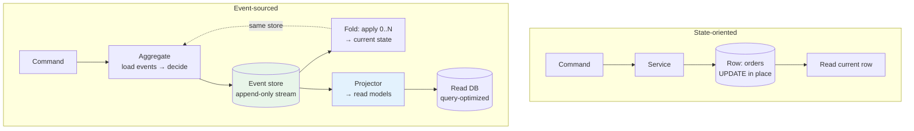
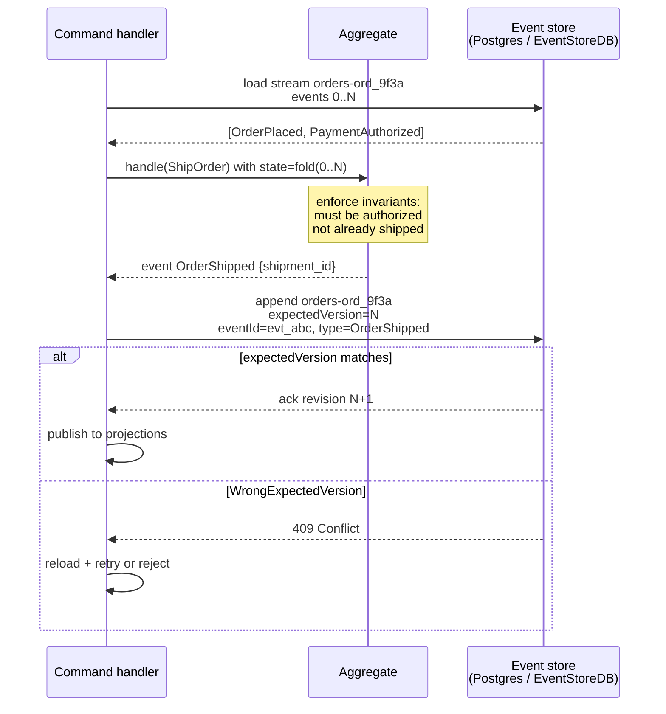
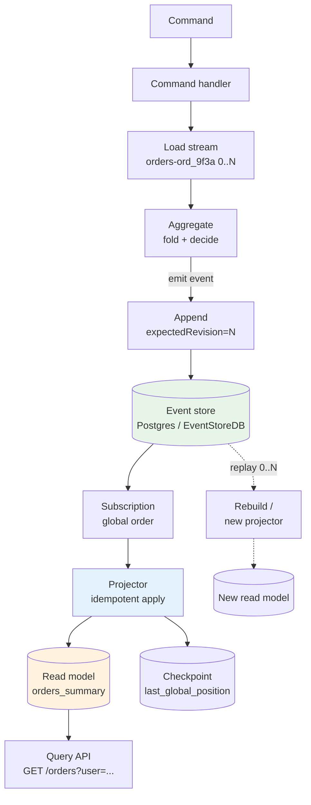
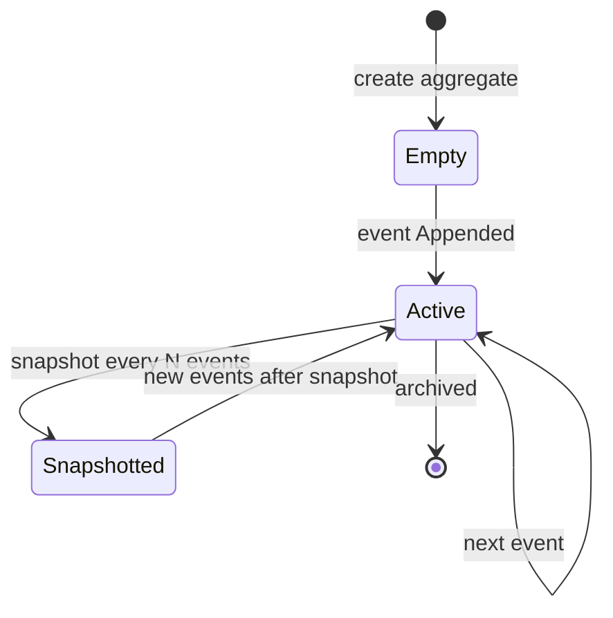
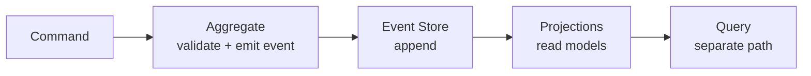
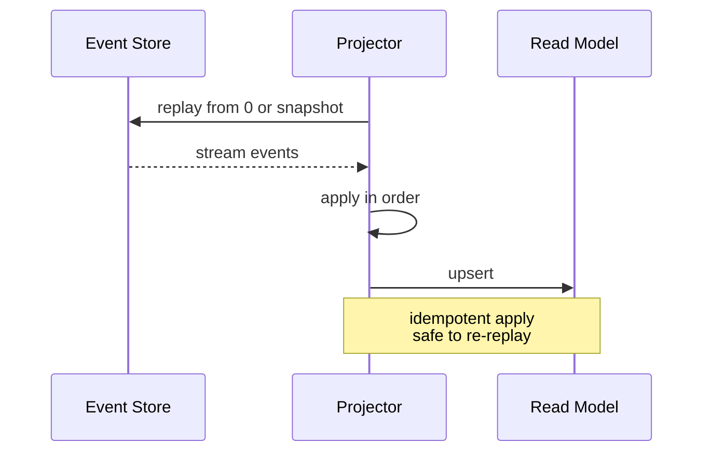

# Chapter 5 — Event Sourcing and CQRS

**What this chapter covers.** Most services store *current state* — `UPDATE orders SET status='shipped' WHERE id=...` — and discard how they got there. When you need an audit trail, temporal queries ("what did this order look like last Tuesday?"), or the ability to rebuild a read model after a bug, that choice is irreversible: the history is gone. **Event sourcing** inverts the model: the append-only sequence of domain events *is* the source of truth, and current state is a left-fold over that sequence. **CQRS** (Command Query Responsibility Segregation) is its common companion: separate the write model that enforces invariants from the read models optimized for queries, with projections bridging the two. Together they power the most auditable, replayable architectures — and the most commonly over-applied. This chapter builds both patterns from mechanics: the event store as a per-aggregate ordered log with optimistic concurrency, aggregates as consistency boundaries, projections as derived read models, snapshots as an optimization, and the distributed-systems reality of eventual consistency between writes and reads. We implement a concrete event store on **Postgres 16** and on **EventStoreDB 23/24**, show a CQRS command handler with idempotent projection, cover schema evolution without breaking replays, and name the operational costs that determine whether these patterns earn their keep.

Learning goals — after this chapter you should be able to:

- Define event sourcing precisely — stream per aggregate, append-only events, current state as a fold — and contrast it with state-oriented persistence on auditability, temporal query, and replay.
- Describe the event store contract: per-stream total order, global ordering options, expected-version optimistic concurrency, idempotent append, and why the stream *is* the lock.
- Model an aggregate as a consistency boundary: commands vs. events, invariant enforcement, and why an aggregate must be small and transactionally loaded whole.
- Distinguish CQRS from event sourcing and explain when each earns its complexity: CQRS without event sourcing, and event sourcing without CQRS.
- Implement the pattern on Postgres (DDL, append with `FOR UPDATE` / advisory lock, projection poller) and on EventStoreDB (streams, expected revision, subscriptions).
- Build a projection that is idempotent, ordered per aggregate, and resumable from a checkpoint — with exactly-once effect via a dedup/position table.
- Handle schema evolution (upcasting, weak schema, versioned events) and snapshots without breaking replay or time travel.
- Reason about the distributed lens: eventual consistency between write and read models, ordering guarantees for cross-aggregate projections, and failure/recovery when a projector falls behind.

> **Boundary note.** Vol 6 develops the *theory* behind event sourcing: consistency models and linearizability that constrain what a store can promise (Ch 3), optimistic concurrency and compare-and-swap as a coordination primitive (Ch 7–8), and idempotency/deduplication that makes projected-at-least-once safe (Ch 9). Vol 7, Chapter 7 — Event-Driven Architecture — treats events at the *system-design* level — when to use events at all, choreography vs. orchestration, and service-boundary scoping — and introduces the term "domain event" without opening the store. This chapter is *mechanics*: the event store's per-stream ordering and concurrency contract, aggregate design, projection correctness, and the outbox/CDC wiring that publishes events durably. For the dual-write problem that arises when publishing events from an event-sourced aggregate, see Chapter 6 — The Outbox Pattern; the two chapters share the same transactional invariant and are best read together.

---

## From state to events: what changes

In a state-oriented service, persistence answers "what is true now?"

```sql
-- State-oriented: current row, history lost
UPDATE orders SET status = 'shipped', shipped_at = now() WHERE id = 'ord_9f3a';
-- What was the status before? Who changed it? In what order did transitions happen? — not in this row.
```

In an event-sourced service, persistence answers "what has happened?" — and current state is derived:

```
stream: orders-ord_9f3a  (one stream per aggregate instance)
  event 0: OrderPlaced      {order_id, user_id, items[], total_cents, placed_at}
  event 1: PaymentAuthorized {payment_id, amount_cents}
  event 2: InventoryReserved {items[], warehouse_id}
  event 3: OrderShipped      {shipment_id, carrier, shipped_at}
  ───────────────────────────────────────────────
  current state = fold(apply, empty, [0..3]) → {status: shipped, ...}
```

The consequences are not subtle:

| Property | State-oriented | Event-sourced |
|---|---|---|
| Source of truth | Current row / document | Append-only event stream |
| History | Lost unless separately audited | Complete, ordered, by construction |
| Temporal query | Requires extra tables / CDC | Replay stream to any point in time |
| Invariant enforcement | Constraints / transactions on current state | Aggregate logic on the fold of past events |
| Bug recovery | Restore from backup, lose intervening writes | Replay events into a fixed projector; re-derive the read model |
| Complexity | Lower for CRUD | Higher — modeling, versioning, projection ops |

Event sourcing is not "store JSON blobs instead of rows." It is a persistence *discipline* with a precise store contract and modeling constraints that must be understood before adopting it.



*Figure 5-1: State-oriented persistence overwrites; event sourcing appends and derives state. The read model in CQRS is a separate projection, not the aggregate's own state.*

---

## The event store contract

An event store is not a generic message broker. It is a **per-aggregate ordered log with optimistic concurrency**. The minimal contract every implementation must provide — whether Postgres, EventStoreDB, DynamoDB conditional writes, or Kafka with per-aggregate partitioning — is:

### Streams, order, and append

- **Stream identity** — a stream is named for one aggregate instance: `orders-ord_9f3a`, `inventory-sku_123`, `account-usr_42`. Many designs also expose **category streams** (`$ce-orders` = all order streams) and a **global log** (`$all`) for cross-aggregate subscriptions.
- **Per-stream total order** — events in a single stream have a strict, gap-free sequence (`streamRevision 0,1,2,...`). This is the *only* hard ordering guarantee. Global order is best-effort or logical if it exists at all.
- **Append-only** — streams are never updated or deleted in place (tombstoning/soft-deletion aside). Compaction, if any, is a read-time projection concern, not a store mutation.
- **Expected version (optimistic concurrency)** — each append carries the revision it *expects* to follow. If the store's current revision does not match, the append is rejected with a concurrency conflict. There is no pessimistic lock — the stream *is* the lock.

Why optimistic concurrency matters: two concurrent commands loading the same aggregate at revision 5 and both trying to append revision 6 — only one can win. The loser reloads, re-evaluates invariants against the new history, and retries or rejects. This is the distributed-systems primitive that prevents lost updates without distributed locks (cf. Vol 6, Ch 7–8).

```
client A: load 0..5, decide → append event 6 with expectedVersion=5  → ✓  stream now at 6
client B: load 0..5, decide → append event 6 with expectedVersion=5  → ✗  WrongExpectedVersion (now at 6)
client B: reload 0..6, re-decide → append event 7 with expectedVersion=6 → ✓
```

- **Idempotent append** — an idempotency key (typically `eventId`) makes retries safe: re-appending the same `eventId` returns success without duplicating. Without this, the producer ambiguity from Ch 2 / Vol 6 Ch 9 reappears inside the store.



*Figure 5-2: The event-store append path. The aggregate is pure decision logic; the store's expected-version check is the concurrency gate.*

---

## Aggregates: the consistency boundary

An **aggregate** (DDD) is a cluster of domain objects treated as a unit for invariants and persistence. In event sourcing the aggregate is the **consistency boundary**: all invariants that must hold atomically live inside one aggregate instance, and one command touches one aggregate.

- A **command** is an imperative request: `PlaceOrder {items, user_id}`. It may be rejected.
- An **event** is a fact that has happened: `OrderPlaced {order_id, ...}`. It is immutable and past-tense.
- The aggregate **handles** a command by loading its event history, folding to current state, checking invariants, and **emitting** zero or more events (or rejecting the command).

```
aggregate Order (stream: orders-{orderId}):
  state: {status, items[], totalCents, paymentId?, shipmentId?}

  on PlaceOrder(cmd):
    require cmd.items non-empty
    require cmd.totalCents > 0
    emit OrderPlaced {order_id, user_id, items, total_cents, placed_at}

  on AuthorizePayment(cmd):
    require state.status == placed
    require cmd.amount == state.totalCents
    emit PaymentAuthorized {payment_id, amount}

  on ShipOrder(cmd):
    require state.status == authorized
    require not already shipped
    emit OrderShipped {shipment_id, carrier, shipped_at}
```

Design rules that prevent incidents:

- **Small aggregates.** An aggregate is loaded whole on every command (`load 0..N, fold`). A stream with tens of thousands of events is a latency and concurrency hazard — split the boundary or snapshot (below). Canonical aggregates are one order, one account, one cart — not "all orders for a merchant."
- **One aggregate per transaction.** Cross-aggregate invariants ("total inventory across SKUs must not exceed...") cannot be enforced atomically by the store's per-stream OCC. They require a process manager / saga at a higher level — eventual, compensating, not atomic (see Vol 7 Ch 7 for choreography vs. orchestration).
- **No queries inside aggregates.** An aggregate decides from *its own* history, not by querying other aggregates or read models. If you need data from elsewhere, pass it in the command or model the workflow as a saga.
- **Events are the API.** Renaming `OrderPlaced` to `OrderCreated` is a breaking change for every projector. Treat event names and shapes as versioned contracts (schema section below).

---

## CQRS: separating writes from reads

**CQRS** says: use different models for **commands** (writes, invariant enforcement) and **queries** (reads, view optimization). The command side is the aggregate + event store; the query side is one or more **read models** (projections) tailored to specific access patterns.

```
Write side (commands)                          Read side (queries)
┌─────────────────────┐     events     ┌─────────────────────────────────┐
│  Command handler     │──append──────▶│  Projector(s)                    │
│  Aggregate           │   ordered     │  fold events → denormalized rows │
│  Event store         │   per-stream  │  e.g. orders_by_user, revenue_1m │
└─────────────────────┘               └──────────────┬──────────────────┘
                                                     ▼
                                              ┌──────────────┐
                                              │  Read DB     │◀── API queries
                                              │  (Postgres / │    (no aggregate load)
                                              │   Elastic /  │
                                              │   cache)     │
                                              └──────────────┘
```

Why separate? Write and read needs conflict:

| Concern | Write model | Read model(s) |
|---|---|---|
| Shape | Normalized, invariant-rich aggregate | Denormalized, query-shaped (join-free) |
| Consistency | Strong per-aggregate (OCC) | Eventual — lags writes by projector latency |
| Scale | Write throughput = aggregate concurrency | Read throughput = independently scalable view |
| Evolution | Events are append-only, versioned | Views are disposable and rebuildable by replay |

Crucially, **CQRS and event sourcing are independent**. You can do CQRS with a CRUD write model (write to one table, project to another) and you can do event sourcing without CQRS (fold the stream on every read). They pair well because a durable event log makes projections reliable and replayable, but neither implies the other.

The distributed-systems cost: the read model is **eventually consistent** with the write model. After `OrderPlaced` is appended, a query to `GET /orders?user=usr_42` may not see it for milliseconds to seconds, depending on projector lag. Clients that need read-after-write (e.g., "I just placed an order, show it") must either read from the aggregate stream, wait for the projection checkpoint, or accept the window — there is no way to make a derived view strongly consistent without reintroducing coupling (Vol 6, Ch 3).

---

## Implementation I — Event store on Postgres 16

Postgres is the most common event store in teams that already operate it. The schema is small; correctness is in the append protocol.

```sql
-- Postgres 16 — event store DDL
-- One table for the ordered log, one for snapshots (optional), one for projector checkpoints.

CREATE TABLE event_store (
    stream_id       TEXT        NOT NULL,          -- e.g., 'orders-ord_9f3a'
    stream_revision BIGINT      NOT NULL,          -- 0,1,2,... per stream — gap-free, unique
    event_id        UUID        NOT NULL UNIQUE,   -- globally unique, idempotency key
    event_type      TEXT        NOT NULL,          -- e.g., 'OrderPlaced'
    event_version   INT         NOT NULL DEFAULT 1,-- schema version of this event type
    payload         JSONB       NOT NULL,          -- event body — validated by app, not DB
    metadata        JSONB       NOT NULL DEFAULT '{}'::jsonb, -- causationId, correlationId, userId, traceparent
    created_at      TIMESTAMPTZ NOT NULL DEFAULT now(),
    PRIMARY KEY (stream_id, stream_revision)
);
CREATE INDEX event_store_global_order ON event_store (created_at, stream_id, stream_revision);
CREATE INDEX event_store_type ON event_store (event_type);

-- Checkpoints for each projector — exactly-once effect depends on this
CREATE TABLE projection_checkpoint (
    projector_name TEXT PRIMARY KEY,
    last_position  BIGINT NOT NULL DEFAULT 0,       -- last global position processed (or per-stream map as JSONB)
    updated_at     TIMESTAMPTZ NOT NULL DEFAULT now()
);

-- Snapshots — optional optimization, not a separate source of truth
CREATE TABLE aggregate_snapshot (
    stream_id       TEXT        PRIMARY KEY,
    stream_revision BIGINT      NOT NULL,
    state           JSONB       NOT NULL,           -- folded state at that revision
    created_at      TIMESTAMPTZ NOT NULL DEFAULT now()
);
```

### Append with optimistic concurrency and idempotency

```java
// Java 17, Spring + jOOQ/JDBC — append with OCC + idempotent retry
// Postgres 16, SERIALIZABLE or READ COMMITTED + explicit locking both work; this uses advisory/row-level discipline.

public record AppendResult(long newRevision, boolean wasDuplicate) {}

public class PostgresEventStore {
    private final DataSource ds;

    /**
     * Append a single event to a stream.
     * @param streamId        e.g., "orders-ord_9f3a"
     * @param expectedRevision the revision the caller believes is current (-1 for new stream, 0..N otherwise)
     * @param eventId         globally unique — idempotency key; retrying the same eventId is a no-op
     * @param eventType       e.g., "OrderPlaced"
     * @param payload         JSON payload
     * @return new revision on success
     * @throws WrongExpectedVersion if OCC check fails
     */
    public AppendResult append(String streamId, long expectedRevision, UUID eventId,
                               String eventType, String payloadJson) throws SQLException {
        // Idempotency check first — if this eventId already exists, return its revision without duplicating
        try (Connection c = ds.getConnection()) {
            try (PreparedStatement ps = c.prepareStatement(
                    "SELECT stream_id, stream_revision FROM event_store WHERE event_id = ?")) {
                ps.setObject(1, eventId);
                try (ResultSet rs = ps.executeQuery()) {
                    if (rs.next()) {
                        return new AppendResult(rs.getLong(2), true);
                    }
                }
            }

            long nextRevision = expectedRevision + 1;

            // For a new stream, expectedRevision == -1 and nextRevision == 0
            // Acquire a per-stream lock to serialize concurrent appends to the same stream.
            // pg_advisory_xact_lock is transaction-scoped and avoids table-level contention.
            // Key: hashtext(stream_id) — collisions are vanishingly rare and only cause extra serialization, not correctness loss.
            try (PreparedStatement lock = c.prepareStatement("SELECT pg_advisory_xact_lock(hashtext(?))")) {
                lock.setString(1, streamId);
                lock.execute();
            }

            // Verify expected revision still holds after lock
            long currentMax = -1;
            try (PreparedStatement ps = c.prepareStatement(
                    "SELECT COALESCE(MAX(stream_revision), -1) FROM event_store WHERE stream_id = ?")) {
                ps.setString(1, streamId);
                try (ResultSet rs = ps.executeQuery()) { rs.next(); currentMax = rs.getLong(1); }
            }
            if (currentMax != expectedRevision) {
                throw new WrongExpectedVersion(
                    "stream " + streamId + " expected " + expectedRevision + " but is at " + currentMax);
            }

            try (PreparedStatement ps = c.prepareStatement(
                    "INSERT INTO event_store(stream_id, stream_revision, event_id, event_type, payload, metadata) "
                  + "VALUES (?, ?, ?, ?, ?::jsonb, ?::jsonb)")) {
                ps.setString(1, streamId);
                ps.setLong(2, nextRevision);
                ps.setObject(3, eventId);
                ps.setString(4, eventType);
                ps.setString(5, payloadJson);
                ps.setString(6, "{\"correlation_id\":\"" + eventId + "\"}");
                ps.executeUpdate();
            }
            c.commit();
            return new AppendResult(nextRevision, false);
        }
    }

    /** Load a stream's events in order — for aggregate rehydration. */
    public List<StoredEvent> load(String streamId, long fromRevisionInclusive) throws SQLException {
        try (Connection c = ds.getConnection();
             PreparedStatement ps = c.prepareStatement(
                 "SELECT stream_revision, event_id, event_type, payload, created_at "
               + "FROM event_store WHERE stream_id = ? AND stream_revision >= ? ORDER BY stream_revision")) {
            ps.setString(1, streamId);
            ps.setLong(2, fromRevisionInclusive);
            try (ResultSet rs = ps.executeQuery()) {
                List<StoredEvent> out = new ArrayList<>();
                while (rs.next()) out.add(new StoredEvent(rs.getLong(1), (UUID) rs.getObject(2),
                    rs.getString(3), rs.getString(4), rs.getTimestamp(5).toInstant()));
                return out;
            }
        }
    }
}
```

Notes:

- `pg_advisory_xact_lock(hashtext(stream_id))` serializes appends per stream without blocking appends to unrelated streams. For very high throughput per stream (rare — aggregates are small), consider an explicit `SELECT ... FOR UPDATE` on a `stream_head` table instead.
- The primary key `(stream_id, stream_revision)` enforces gap-free ordering structurally; a duplicate revision is a constraint violation, which surfaces as OCC failure.
- For global subscriptions (projectors that consume across all streams), order by `created_at` + `(stream_id, stream_revision)` or introduce a `global_position BIGSERIAL` column if strict global total order is needed. Postgres sequences give per-insert order but not transactional commit order — document the guarantee.

### Projector — poll, checkpoint, idempotent apply

```java
// Polling projector: reads new events in global order, applies to a read model, checkpoints atomically.
// The transaction is: (update read model) + (update checkpoint) atomically → effectively-once.

public class OrderSummaryProjector {
    private final DataSource ds;
    private static final String PROJECTOR = "order_summary";

    // Poll loop — run every 200ms or via LISTEN/NOTIFY
    public void tick() throws SQLException {
        long lastPos;
        try (Connection c = ds.getConnection();
             PreparedStatement ps = c.prepareStatement(
                 "SELECT last_position FROM projection_checkpoint WHERE projector_name = ?")) {
            ps.setString(1, PROJECTOR);
            try (ResultSet rs = ps.executeQuery()) {
                lastPos = rs.next() ? rs.getLong(1) : 0L;
            }
        }

        // Read next batch in global order — adjust batch size for lag/throughput
        List<StoredEvent> batch = readGlobalBatch(lastPos, 500);
        if (batch.isEmpty()) return;

        for (StoredEvent e : batch) {
            // Idempotent apply: INSERT ... ON CONFLICT DO NOTHING / UPDATE guarded by event_id
            // Example: maintain orders_summary read model
            try (Connection c = ds.getConnection()) {
                c.setAutoCommit(false);
                applyEvent(c, e); // writes to read-model tables, deduped by event_id

                // Advance checkpoint transactionally with the side effect — this is the exactly-once-effect primitive.
                // If this transaction commits, the event will not be reprocessed; if it rolls back, it will.
                try (PreparedStatement ps = c.prepareStatement(
                        "INSERT INTO projection_checkpoint(projector_name, last_position) VALUES (?, ?) "
                      + "ON CONFLICT (projector_name) DO UPDATE SET last_position = EXCLUDED.last_position")) {
                    ps.setString(1, PROJECTOR);
                    ps.setLong(2, e.globalPosition());
                    ps.executeUpdate();
                }
                c.commit();
            }
        }
    }

    private void applyEvent(Connection c, StoredEvent e) throws SQLException {
        // Each event type maps to a deterministic, idempotent mutation of the read model.
        // Example for OrderPlaced — insert if not already present (dedup by event_id in a side table if needed).
        if ("OrderPlaced".equals(e.eventType())) {
            try (PreparedStatement ps = c.prepareStatement(
                    "INSERT INTO orders_summary(order_id, user_id, status, total_cents, placed_at) "
                  + "VALUES ((?::jsonb)->>'order_id', (?::jsonb)->>'user_id', 'placed', ((?::jsonb)->>'total_cents')::bigint, now()) "
                  + "ON CONFLICT (order_id) DO NOTHING")) {
                ps.setString(1, e.payload()); ps.setString(2, e.payload()); ps.setString(3, e.payload());
                ps.executeUpdate();
            }
        } else if ("OrderShipped".equals(e.eventType())) {
            try (PreparedStatement ps = c.prepareStatement(
                    "UPDATE orders_summary SET status='shipped', shipped_at=now() WHERE order_id=(?::jsonb)->>'order_id'")) {
                ps.setString(1, e.payload());
                ps.executeUpdate();
            }
        }
        // Record event_id in a dedup table if the mutation itself is not naturally idempotent
        try (PreparedStatement ps = c.prepareStatement(
                "INSERT INTO projection_dedup(projector_name, event_id) VALUES (?, ?) ON CONFLICT DO NOTHING")) {
            ps.setString(1, PROJECTOR); ps.setObject(2, e.eventId()); ps.executeUpdate();
        }
    }
}
```

For lower latency than polling, use `LISTEN`/`NOTIFY` or Debezium CDC on `event_store` (see Ch 6 for CDC wiring), but keep the checkpoint discipline identical — the channel is an optimization, not the correctness mechanism.

---

## Implementation II — EventStoreDB 23/24

EventStoreDB is a purpose-built event store with first-class streams, expected-revision concurrency, and persistent subscriptions.

```java
// EventStoreDB Java client 5.x — append with expected revision, subscribe to $all
import com.eventstore.dbclient.*;

EventStoreDBClient client = EventStoreDBClient.create(
    EventStoreDBConnectionString.parse("esdb://esdb-1.internal:2113,esdb-2.internal:2113,esdb-3.internal:2113?tls=true"));

// Append to a single aggregate stream — OCC via expectedRevision
EventData orderPlaced = EventData.builderAsJson("OrderPlaced", new OrderPlaced("ord_9f3a", "usr_42", 4999))
    .eventId(UUID.randomUUID()) // idempotency key — server dedups on eventId
    .build();

// expectedRevision: NO_STREAM (-1) for new aggregate, or exact revision, or ANY for no OCC (avoid)
AppendToStreamOptions opts = AppendToStreamOptions.get()
    .expectedRevision(ExpectedRevision.expectedRevision(5L)); // we loaded 0..5, so next is 6 with expected 5
    // For a new stream: ExpectedRevision.NO_STREAM
    // For blind append (no concurrency check): ExpectedRevision.ANY — loses OCC, do not use for aggregates

try {
    WriteResult result = client.appendToStream("orders-ord_9f3a", opts, orderPlaced).get();
    long nextRevision = result.getNextExpectedRevision(); // 6
} catch (WrongExpectedVersionException ex) {
    // Another writer won — reload 0..current, re-evaluate, retry
}

// Subscribe a projector to the global log — ordered, resumable from checkpoint
// Persistent subscription or catch-up subscription; catch-up is simpler to reason about for exactly-once-effect

CheckpointStore checkpointStore = new PostgresCheckpointStore(dataSource); // same table as above

SubscriptionListener listener = new SubscriptionListener() {
    @Override public void onEvent(Subscription sub, ResolvedEvent re) {
        // Idempotent apply — same pattern as Postgres projector: (apply + checkpoint) atomically
        // EventStoreDB delivers at-least-once; dedup by eventId in the read model transaction
        applyToReadModel(re.getEvent()); // must be idempotent
        checkpointStore.save("order_summary", re.getEvent().getPosition()); // commit position atomically with apply
    }
};

// Catch-up: read from last checkpoint, then stay subscribed
Position lastPos = checkpointStore.load("order_summary"); // Position.START for first run
client.subscribeToAll(listener,
    SubscribeToAllOptions.get().fromPosition(lastPos)); // resumes from checkpoint, no missed or duplicated effect
```

Operational notes for EventStoreDB:

- **Streams are cheap** — one per aggregate instance is the intended design. Do not multiplex aggregates into a single stream; you lose per-aggregate OCC.
- **Projections** — EventStoreDB has server-side projections (JavaScript) that can emit linked streams. Use them for simple category/global transforms, but keep business projections in your own service for testability and exactly-once checkpoint control.
- **Scavenging** — deleted/tombstoned streams still occupy index space until scavenged. Schedule scavenges in low-traffic windows.
- **Clustering** — 3-node cluster with Raft-like leader election; writes go to leader, reads can go to followers with `NodePreference`. Monitor `esdb WorthExpectedVersion` conflicts and subscription lag.



*Figure 5-3: CQRS + event sourcing topology. The write path is per-aggregate OCC; the read path is a lagging, replayable projection with a checkpoint. New read models are built by replaying, not by migrating the write model.*

---

## Schema evolution: events live forever

Events are persisted forever, so their schemas must evolve without breaking replay. The rule: **never mutate a persisted event in place** — version and upcast.

### Strategies

| Strategy | How | When |
|---|---|---|
| **Versioned event types** | `OrderPlaced_v1`, `OrderPlaced_v2` as distinct types | Explicit, simple for large breaking changes |
| **Weak schema (JSON + optional fields)** | Add optional fields, never remove required ones | Works for additive changes (new optional `coupon_code`) |
| **Upcaster chain** | `v1 JSON → v2 JSON` transformer applied on read | Keeps storage on v1 while code reads v2; chain `v1→v2→v3` |
| **Copy-on-write migration** | Rewrite old events into new streams offline, switch readers | For deep restructures; requires careful cutover |

```java
// Upcaster — applied on load before folding
public interface Upcaster { JsonNode upcast(JsonNode payload, int fromVersion, int toVersion); }

public class OrderPlacedUpcaster implements Upcaster {
    @Override public JsonNode upcast(JsonNode payload, int fromVersion, int toVersion) {
        // v1 had `total` as string "49.99"; v2 is `total_cents` int
        if (fromVersion == 1 && toVersion >= 2) {
            ObjectNode n = (ObjectNode) payload;
            String totalStr = n.get("total").asText(); // "49.99"
            long cents = Math.round(Double.parseDouble(totalStr) * 100);
            n.remove("total");
            n.put("total_cents", cents);
            n.put("event_version", 2);
        }
        // chain further: v2 → v3 if needed
        return payload;
    }
}

// On load: read event_version from row, upcast stepwise to current domain version before apply
StoredEvent raw = loadOne(...);
JsonNode current = upcasterChain.upcast(raw.payload(), raw.eventVersion(), OrderPlaced.CURRENT_VERSION);
OrderPlaced domain = objectMapper.treeToValue(current, OrderPlaced.class);
```

Rules:

- **Additive only on the wire.** New consumers must handle old events (missing optional fields). Old events are never rewritten to add new fields retroactively.
- **Keep the event name stable.** `OrderPlaced` stays `OrderPlaced`; bump `event_version` inside. Renaming creates a new stream of type that replays diverge on.
- **Test replay.** Your CI should load a fixture of real historical events (v1..vN) and assert that `fold(apply, empty, history) == expectedState`. Without this, a schema change silently breaks time travel.

---

## Snapshots: optimization, not truth

Replaying thousands of events to load one aggregate is slow. A **snapshot** caches the folded state at a revision so loading becomes `load snapshot at N + replay N+1..current`.

```sql
-- Save snapshot every 100 events or when stream exceeds a threshold
INSERT INTO aggregate_snapshot(stream_id, stream_revision, state)
VALUES ('orders-ord_9f3a', 100, '{"status":"authorized","total_cents":4999}'::jsonb)
ON CONFLICT (stream_id) DO UPDATE SET stream_revision=EXCLUDED.stream_revision, state=EXCLUDED.state;
```

```java
AggregateState loadAggregate(String streamId) {
    Snapshot snap = snapshotStore.load(streamId); // may be null
    long from = (snap == null) ? 0 : snap.revision() + 1;
    List<StoredEvent> tail = eventStore.load(streamId, from);
    AggregateState state = (snap == null) ? AggregateState.EMPTY : snap.state();
    for (StoredEvent e : tail) state = apply(state, upcast(e));
    return state;
}
```

Constraints:

- Snapshots are **derived** — they can be deleted and rebuilt from events without loss. Never treat a snapshot as authoritative over the event stream.
- Snapshot frequency is a throughput knob: every 50–200 events for hot aggregates, less for cold ones. Measure load latency vs. write amplification.
- EventStoreDB has built-in `$maxCount` / explicit snapshot streams — same principle, different API.

---

## Distributed-systems lens: consistency, ordering, and failure

### Eventual consistency between write and read

After a successful `append`, the aggregate's state is immediately visible to the next command on that aggregate (it reloads the new event), but read models lag by projector latency (milliseconds to seconds). This is inherent to CQRS — there is no cross-model transaction. Clients must be designed for it:

- **Read-after-write for the writer** — redirect or poll the aggregate stream, not the read model, or return the new state in the command response.
- **Other readers** — accept staleness, or expose a `projection_lag` metric and let callers wait if they need freshness.
- **Cross-aggregate queries** — a read model that joins `orders` and `payments` sees each stream at a different watermark; there is no global snapshot isolation across streams without additional coordination. State the staleness bound in the API contract.

### Ordering for projections

- **Per-aggregate order** — guaranteed by per-stream revisions; a projector that processes one aggregate's events sequentially is correct by construction.
- **Cross-aggregate order** — only eventual in the global log. If two aggregates emit causally related events (order placed → payment authorized in a different aggregate), the projector may see them in either global order unless you enforce causation metadata (`causationId`, `correlationId`) and make projection logic commutative or explicitly ordered.
- **Partition key for scale** — when fanning projections to multiple consumers, partition by `stream_id` (aggregate id) so all events for one aggregate go to one projector instance — otherwise you lose per-aggregate ordering.

### Failure and recovery

| Failure | Effect | Recovery |
|---|---|---|
| Projector crashes mid-batch | Some events applied, checkpoint not advanced | On restart, replay from last checkpoint — apply is idempotent, so reprocessing is safe |
| Event store unavailable | Commands fail (cannot load or append) | No partial writes — OCC ensures all-or-nothing per append; retry with backoff |
| Read model DB unavailable | Projections stall, commands still succeed | Projector retries; read model catches up when DB returns — no data loss |
| Schema bug in projector | Read model diverges | Fix projector, **replay** the event log into a fresh read model, cut over — no migration of the write side |

The essential property: the event log is durable and replayable, so any derived state can be rebuilt. This is why the log — not any read model — is the system of record.

```mermaid
stateDiagram-v2
    [*] --> Empty: stream does not exist
    Empty --> Placed: PlaceOrder → OrderPlaced
    Placed --> Authorized: AuthorizePayment → PaymentAuthorized
    Authorized --> Reserved: ReserveInventory → InventoryReserved
    Reserved --> Shipped: ShipOrder → OrderShipped
    Placed --> Cancelled: CancelOrder → OrderCancelled
    Authorized --> Cancelled: CancelOrder → OrderCancelled
    Shipped --> [*]
    Cancelled --> [*]
    Note right of Authorized: Aggregate enforces:<br/>placed before authorized<br/>authorized before shipped<br/>no ship after cancel
```

*Figure 5-4: Aggregate state machine — the set of valid event sequences. The aggregate rejects commands that would emit an invalid transition; the projector never needs to enforce these invariants again.*

---

## When not to use event sourcing and CQRS

These patterns have real costs — model them before adopting:

- **Modeling overhead** — every state change becomes an explicit event type with versioning, upcasting, and projection logic. For CRUD-heavy domains with little audit or replay value (user preferences, CMS content), a current-state table with an audit log side table is simpler and sufficient.
- **Operational overhead** — you now operate an event store, projector(s) with checkpoint monitoring, snapshot strategy, replay tooling, and schema evolution discipline. Teams that adopt event sourcing for one aggregate and then avoid operating its projector create the worst outcome: history without the ability to use it.
- **Query complexity** — ad-hoc queries against an event log are painful. Without a well-maintained read model, even "count orders by status" requires a full fold.
- **Small aggregates only** — if your invariant spans many entities ("no more than 100 active orders per merchant"), an aggregate-per-order cannot enforce it atomically. You need a different boundary or a saga — not a larger aggregate.

Heuristics for when the trade is worthwhile:

- The domain has **audit, compliance, or temporal query** requirements that are load-bearing, not decorative.
- You need **replay** to fix bugs or build new read models without backfilling from backups.
- The write and read access patterns are **sharply different** (high-write, fan-out reads, or per-query denormalization that would burden the write model).
- The team will **operate the projector** with the same seriousness as the write path — lag alerting, checkpoint durability, replay runbooks.

Otherwise, keep a normalized write table, add an `audit_log` table or CDC (Ch 6), and use CQRS only where a specific query just says it needs it.

---


#### Aggregate Lifecycle



#### CQRS Flow



#### Projection Rebuild



## Key takeaways

- Event sourcing stores the ordered sequence of domain events as the source of truth; current state is a pure left-fold over that sequence — giving complete audit history, temporal queries, and replay for free.
- The event store contract is **per-stream total order + expected-version optimistic concurrency + idempotent append by eventId** — the stream is the lock, and two concurrent writers to the same aggregate are serialized or rejected.
- Aggregates are **consistency boundaries**: one command, one aggregate, invariant enforcement on the fold — small, transactionally loaded whole, with no cross-aggregate queries inside.
- **CQRS** separates a normalized write model from denormalized read models; the two are bridged by **projectors** that consume the global log in order, apply idempotently, and checkpoint atomically with their side effects for effectively-once projection.
- **Schema evolution** is append-only: version events, upcast on read, test replay against historical fixtures — never mutate persisted events.
- **Snapshots** are a load-time optimization (state at revision N plus tail replay), not a source of truth — they can be rebuilt or discarded without loss.
- The read model is **eventually consistent** with the write model; design clients for the window, partition projectors by aggregate id to preserve per-aggregate order, and remember that any derived state can be rebuilt by replaying the log.
- Do not adopt these patterns for CRUD without audit/replay needs — the modeling and operational costs are substantial and must be justified per aggregate, not per system.

## Further reading

- Fowler, M. "Event Sourcing." martinfowler.com, 2005. https://martinfowler.com/eaaDev/EventSourcing.html — The canonical definition.
- Young, G. "CQRS Documents." cqrs.wordpress.com — The original CQRS formulation and its separation from event sourcing.
- Vernon, V. *Implementing Domain-Driven Design* (Addison-Wesley, 2013) — Ch. on aggregates and bounded contexts as consistency boundaries.
- EventStoreDB documentation 23/24 — Streams, expected revision, subscriptions, projections. https://developers.eventstore.com/
- Kleppmann, M. *Designing Data-Intensive Applications*, Ch. 11 — The log, event sourcing, and stream-table duality.
- Postgres documentation 16 — Transaction isolation, advisory locks, `LISTEN`/`NOTIFY`. https://www.postgresql.org/docs/16/
- Rinat Abdullin / Event Sourcing articles — Upcasting, snapshotting, and versioning patterns. https://abdullin.com/
- Brandolini, A. *EventStorming* — Collaborative modeling technique for discovering events, commands, and aggregates before cutting code.

