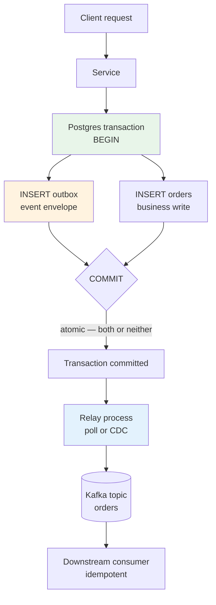
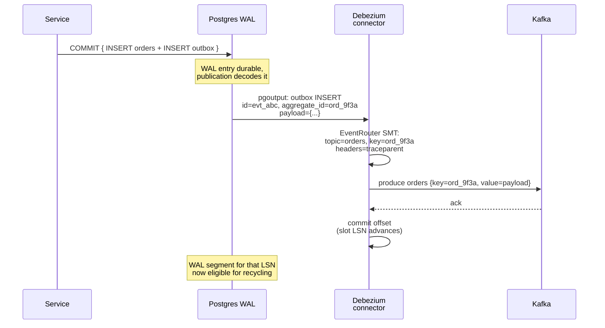
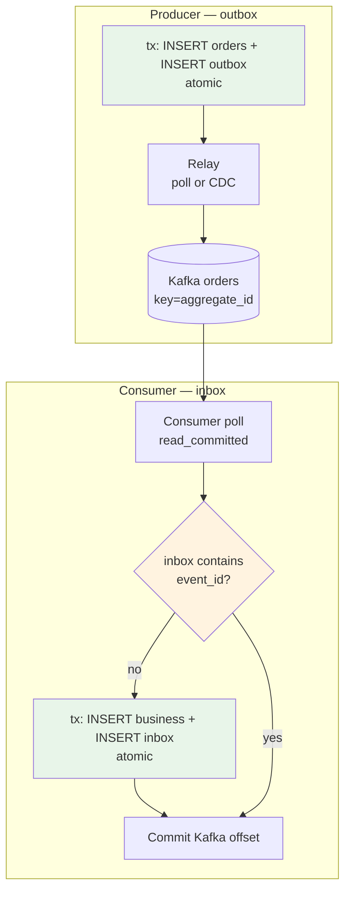

# Chapter 6 — The Outbox Pattern and the Dual-Write Problem

**What this chapter covers.** Every service that writes to a database and publishes an event faces the same trap: `UPDATE db` then `publish(event)` is two writes with no atomicity. If the process crashes between them, the database and the event log diverge — silently, permanently, without an error to alert on. This is the **dual-write problem**, and it is the most common source of ghost orders, missing payments, and phantom inventory in event-driven systems. This chapter names the failure precisely, shows why naive fixes (publish-then-commit, two-phase commit, last-resource gambit) do not solve it, and builds the two production patterns that do: the **transactional outbox** (polling relay and CDC/transaction-log tailing with Debezium) and, where needed, the **inbox** on the consumer. We implement both with real **Postgres 16**, **Debezium 2.5**, and **Kafka 3.7** configuration, cover the distributed-systems guarantees (exactly-once effect, ordering, and the idempotent-consumer contract that makes at-least-once delivery safe), and close with operational guidance: monitoring the relay, handling poison outbox rows, and when to reach for Kafka transactions instead.

Learning goals — after this chapter you should be able to:

- Define the dual-write problem and enumerate the four failure cases of `commit-then-publish` and `publish-then-commit` with their observable consequences.
- Explain why distributed transactions (XA/2PC) are the wrong fix for database-plus-broker atomicity in modern backends.
- Implement the transactional outbox on Postgres 16: DDL, atomic business write + outbox insert, and the relay that publishes to Kafka exactly once (effectively).
- Configure Debezium 2.5 CDC as the relay: `pgoutput` logical replication, connector config, outbox event router (SMT), and offset durability.
- Contrast polling relay vs. CDC on latency, load, ordering, failure modes, and operational cost, and choose correctly.
- Describe the end-to-end exactly-once-effect pipeline: transactional outbox → at-least-once publish → idempotent consumer with inbox/dedup table, and what each stage guarantees.
- Reason about ordering (per-aggregate outbox order → per-partition Kafka order via deterministic key), and what breaks ordering and how to detect it.
- Operate the pattern: relay lag monitoring, poison-row handling, exactly-once sink options (Kafka transactions vs. idempotent consumers), and schema evolution of outbox payloads.

> **Boundary note.** Vol 6, Chapter 9 — Idempotency, Deduplication, and Exactly-Once — develops the *theory* that makes the outbox correct end-to-end: why exactly-once delivery is impossible over a lossy network, the atomic check-and-record protocol, and the idempotency-key discipline that makes at-least-once safe. Chapter 2 in this volume maps that theory onto *broker delivery semantics* (at-most/at-least/effectively-once, Kafka PID+sequence and transactions). Chapter 5 — Event Sourcing and CQRS — uses the same event-store append invariant (expected-version OCC) and publishes derived events from the log. This chapter is narrower and more operational: the *dual-write between a business table and a broker* and the *transactional outbox mechanics* (polling vs. CDC) that eliminate it. For the formal reasoning about idempotency and the event-store's own concurrency contract, read Vol 6 Ch 9 and Ch 5 respectively; for the relay wire and its failure modes, read here.

---

## The dual-write problem: two writes, no atomicity

Consider the canonical order service that must both update its relational database and publish an event so downstream services (inventory, payments, search) can react:

```java
// The naive sequence — looks correct, is not
public void placeOrder(PlaceOrder cmd) {
    db.execute("INSERT INTO orders(id, status, total_cents) VALUES (?, 'placed', ?)",
               cmd.orderId(), cmd.totalCents());          // write 1: database
    kafkaProducer.send(new ProducerRecord<>("orders",     // write 2: broker
        cmd.orderId(), new OrderPlaced(cmd.orderId(), cmd.totalCents())));
    // What if the process dies here, between the two writes?
}
```

There are two orderings, and both fail:

```mermaid
sequenceDiagram
    participant S as Service
    participant DB as Postgres
    participant K as Kafka
    Note over S: Case A: commit then publish
    S->>DB: BEGIN; INSERT orders ...; COMMIT
    DB-->>S: ack — row durable
    Note over S: CRASH — publish never happens
    Note over K: Event never published.<br/>Downstream never learns<br/>order exists. Silent divergence.
    S->>K: send(OrderPlaced) — never reached
```

```mermaid
sequenceDiagram
    participant S as Service
    participant DB as Postgres
    participant K as Kafka
    Note over S: Case B: publish then commit
    S->>K: send(OrderPlaced)
    K-->>S: ack — event durable
    S->>DB: BEGIN; INSERT orders ...; COMMIT
    Note over S: CRASH — commit never happens<br/>or COMMIT fails (constraint, deadlock)
    Note over K: Event published for an order<br/>that does not exist.<br/>Downstream acts on a ghost.
```

More precisely, there are four failure modes and each is observable as a different incident:

| Sequence | Failure point | DB state | Broker state | Observable bug |
|---|---|---|---|---|
| Commit → publish | Crash after commit, before publish | Row exists | No event | **Ghost write** — order in DB, inventory never reserved, search never indexed |
| Commit → publish | Publish fails (broker down, timeout, serialization error) | Row exists | No event or ambiguous (was it written?) | Same as above, plus retry ambiguity |
| Publish → commit | Crash after publish, before commit | No row | Event exists | **Ghost event** — inventory reserved for non-existent order, payment attempted |
| Publish → commit | Commit fails (constraint violation, deadlock) | No row | Event exists | Same as above |

A retry wrapper does not help — it can only turn ghost writes into ghost events or vice versa. The root cause is that two independent systems (database and broker) have no shared transaction. There is no `BEGIN` that spans Postgres and Kafka.

> **Why not XA / two-phase commit?** XA (distributed transactions across DB and broker) provides atomicity via a coordinator, prepare, and commit phase. In theory it solves dual writes. In practice: (1) most managed Postgres and virtually no cloud Kafka expose XA to application code; (2) the coordinator is a single point of failure and a latency tax on every write; (3) a failed coordinator leaves participants holding locks with heuristic outcomes; (4) Kafka's transaction model (Ch 3) is broker-internal, not XA. The industry consensus for business-transaction + event publishing is the transactional outbox, not XA. See Vol 6, Ch 7 for why coordinator-based atomic commit scales poorly.

---

## The invariant: one local transaction

The outbox pattern replaces two distributed writes with **one local transaction plus an asynchronous relay**:

- **Inside one database transaction**, atomically write the business row(s) *and* an outbox row that describes the event to be published.
- **After commit**, a relay process reads outbox rows and publishes them to the broker. Publishing may be at-least-once, but the outbox row's lifecycle makes the effect exactly once when paired with an idempotent consumer.

```
BEFORE (dual write — no atomicity):
  tx { INSERT orders }  +  send(Kafka)    — two systems, no shared commit

AFTER (outbox — one atomic write):
  tx { INSERT orders + INSERT outbox }    — one system, one commit
       ────────────────┬───────────────
                       └── relay ──► Kafka (at-least-once, deduped downstream)
```

The database is the single source of truth for "what must be published." The broker is a derived, eventually consistent copy. If the relay is down, events accumulate in the outbox — no divergence, just lag.



*Figure 6-1: The transactional outbox invariant. Business state and the intent to publish are committed atomically; the relay makes that intent durable in the broker. The only observable delay is relay lag, not divergence.*

---

## Implementing the outbox on Postgres 16

### DDL

```sql
-- Postgres 16 — transactional outbox
CREATE TABLE orders (
    id          TEXT PRIMARY KEY,
    user_id     TEXT        NOT NULL,
    status      TEXT        NOT NULL DEFAULT 'placed',
    total_cents BIGINT      NOT NULL CHECK (total_cents > 0),
    created_at  TIMESTAMPTZ NOT NULL DEFAULT now()
);

-- The outbox: one row per event to be published. Rows are deleted (or marked) after successful publish.
CREATE TABLE outbox (
    id            UUID        PRIMARY KEY DEFAULT gen_random_uuid(),
    aggregate_type TEXT       NOT NULL,              -- e.g., 'Order'
    aggregate_id   TEXT       NOT NULL,              -- e.g., 'ord_9f3a' — used as Kafka partition key
    event_type     TEXT       NOT NULL,              -- e.g., 'OrderPlaced'
    event_version  INT        NOT NULL DEFAULT 1,
    payload        JSONB      NOT NULL,              -- event body — validated by app
    headers        JSONB      NOT NULL DEFAULT '{}'::jsonb, -- traceparent, correlation_id, causation_id
    created_at     TIMESTAMPTZ NOT NULL DEFAULT now(),
    -- publish tracking — used by polling relay; CDC relay can omit these and delete on publish
    published_at   TIMESTAMPTZ,
    -- idempotency: event_id == id; retries use the same UUID
    UNIQUE (id)
);
CREATE INDEX outbox_unpublished ON outbox (created_at, id) WHERE published_at IS NULL;
CREATE INDEX outbox_aggregate ON outbox (aggregate_type, aggregate_id, created_at);

-- Consumer-side inbox/dedup (see "Closing the loop" below) — often colocated with the consumer's DB
CREATE TABLE inbox (
    event_id   UUID        PRIMARY KEY,              -- outbox.id — dedup key
    event_type TEXT        NOT NULL,
    processed_at TIMESTAMPTZ NOT NULL DEFAULT now()
);
```

Design choices:

- **`aggregate_id` as partition key.** All events for one aggregate must land on one Kafka partition to preserve per-aggregate order. The outbox stores `aggregate_id` so the relay can set the Kafka key deterministically.
- **`payload` as JSONB.** Keeps the outbox decoupled from a specific serialization (Avro/Protobuf bytes can be stored as `BYTEA` if you prefer wire fidelity; JSONB is simpler for polling).
- **`published_at` vs. delete.** Polling relays usually `UPDATE ... SET published_at=now()` or `DELETE` after publish. CDC relays delete or tombstone via the connector — no `published_at` column needed. Choose one discipline and be consistent.
- **Retention.** Published rows should be deleted or archived after a retention window (e.g., 7 days) — the Kafka topic is the durable copy after publish. Keep them long enough to debug "was this event published?" without growing unbounded.

### Atomic business write + outbox insert

```java
// Java 17, plain JDBC — one transaction, two inserts, one commit
public class OrderService {
    private final DataSource ds;

    public void placeOrder(PlaceOrder cmd) throws SQLException {
        UUID eventId = UUID.randomUUID(); // stable for this attempt; on retry from caller, reuse the same eventId
        String payload = """
            {"order_id":"%s","user_id":"%s","total_cents":%d,"placed_at":"%s"}
            """.formatted(cmd.orderId(), cmd.userId(), cmd.totalCents(), Instant.now());

        try (Connection c = ds.getConnection()) {
            c.setAutoCommit(false);
            try {
                // 1. Business write
                try (PreparedStatement ps = c.prepareStatement(
                        "INSERT INTO orders(id, user_id, status, total_cents) VALUES (?, ?, 'placed', ?)")) {
                    ps.setString(1, cmd.orderId());
                    ps.setString(2, cmd.userId());
                    ps.setLong(3, cmd.totalCents());
                    ps.executeUpdate();
                }

                // 2. Outbox write — same transaction, same commit
                try (PreparedStatement ps = c.prepareStatement(
                        "INSERT INTO outbox(id, aggregate_type, aggregate_id, event_type, payload, headers) "
                      + "VALUES (?, 'Order', ?, 'OrderPlaced', ?::jsonb, ?::jsonb)")) {
                    ps.setObject(1, eventId);
                    ps.setString(2, cmd.orderId());
                    ps.setString(3, payload);
                    ps.setString(4, """
                        {"traceparent":"%s","correlation_id":"%s"}
                        """.formatted(currentTraceparent(), cmd.correlationId()));
                    ps.executeUpdate();
                }

                c.commit(); // ← atomic boundary: both rows or neither
            } catch (SQLException ex) {
                c.rollback();
                // Constraint violation, deadlock, etc. — no event will be published, which is correct
                throw ex;
            }
        }
        // After commit, the relay will publish. The service does not publish directly.
    }
}
```

What this guarantees:

- If `commit` succeeds, both the order row and the outbox row are durable. The relay *will* publish — eventually, at-least-once — even if the service crashes immediately after commit.
- If `commit` fails, neither row is durable. No event will be published. No ghost event.
- The `eventId` (`outbox.id`) is the end-to-end idempotency key. If the HTTP caller retries `placeOrder` with the same `orderId`, the `INSERT orders` will conflict (primary key) and the second `INSERT outbox` will use a *new* `eventId` only if a new row is actually created — never publish a duplicate for a failed command.

> **Idempotent command handling.** If the API layer retries `placeOrder` with a client-supplied idempotency key (Vol 6 Ch 9), check that key *inside the same transaction* before inserting. Otherwise two concurrent requests with the same business key can both commit and produce two outbox rows for one logical command.

---

## Relay I — Polling publisher

The simplest relay: a background process polls `outbox WHERE published_at IS NULL` in `created_at` order, publishes each row to Kafka, and marks it published.

```java
// Polling relay — Java 17, kafka-clients 3.7, single-threaded for ordering
public class OutboxPollingRelay implements Runnable {
    private final DataSource ds;
    private final KafkaProducer<String, String> producer;
    private static final String TOPIC = "orders";
    private static final int BATCH = 200;
    private static final Duration POLL_INTERVAL = Duration.ofMillis(500);

    @Override public void run() {
        while (!Thread.currentThread().isInterrupted()) {
            try {
                List<OutboxRow> batch = fetchUnpublished(BATCH);
                for (OutboxRow row : batch) {
                    // Deterministic key → per-aggregate order on one Kafka partition
                    ProducerRecord<String, String> rec = new ProducerRecord<>(
                        TOPIC, row.aggregateId(), row.payload());
                    rec.headers().add("event_type", row.eventType().getBytes());
                    rec.headers().add("event_id", row.id().toString().getBytes());
                    rec.headers().add("traceparent", row.headers().get("traceparent").getBytes());

                    // Synchronous send — do not mark published until Kafka acks
                    // acks=all, enable.idempotence=true on the producer (see Ch 3) prevents broker-side duplicates on retry
                    RecordMetadata meta = producer.send(rec).get(10, TimeUnit.SECONDS);

                    // Mark published only after ack — at-least-once publish, at-most-once mark
                    markPublished(row.id());
                    // Alternatively DELETE FROM outbox WHERE id=? — leaner table, same guarantee
                }
                if (batch.size() < BATCH) Thread.sleep(POLL_INTERVAL.toMillis());
            } catch (Exception ex) {
                // Publish failed or DB error — do not mark published; next tick will retry (at-least-once)
                log.warn("Outbox relay tick failed — will retry", ex);
                sleepQuietly(POLL_INTERVAL);
            }
        }
    }

    private List<OutboxRow> fetchUnpublished(int limit) throws SQLException {
        // FOR UPDATE SKIP LOCKED — multiple relay instances can run concurrently without double-publishing
        // Each row is locked by the relay that fetched it; others skip it.
        try (Connection c = ds.getConnection();
             PreparedStatement ps = c.prepareStatement(
                 "SELECT id, aggregate_type, aggregate_id, event_type, payload, headers "
               + "FROM outbox WHERE published_at IS NULL "
               + "ORDER BY created_at, id LIMIT ? FOR UPDATE SKIP LOCKED")) {
            ps.setInt(1, limit);
            try (ResultSet rs = ps.executeQuery()) {
                List<OutboxRow> out = new ArrayList<>();
                while (rs.next()) out.add(mapRow(rs));
                return out;
            }
        }
    }

    private void markPublished(UUID id) throws SQLException {
        try (Connection c = ds.getConnection();
             PreparedStatement ps = c.prepareStatement(
                 "UPDATE outbox SET published_at = now() WHERE id = ?")) {
            ps.setObject(1, id);
            ps.executeUpdate();
            c.commit();
        }
    }
}
```

```properties
# Kafka producer for the relay — durability first (Ch 3)
acks=all
enable.idempotence=true
retries=5
delivery.timeout.ms=120000
max.in.flight.requests.per.connection=5
compression.type=lz4
```

Behavior under failure:

- **Relay crashes after publish but before `markPublished`.** The row stays unpublished; the next relay tick republishes — **at-least-once** to Kafka. Two records with the same `event_id` may exist in the topic. The consumer's dedup table (inbox) makes the effect exactly once.
- **Relay crashes before publish.** Row stays unpublished; next tick publishes — no duplicate.
- **Multiple relay instances.** `FOR UPDATE SKIP LOCKED` shards work naturally. Two instances never publish the same row concurrently; on failover, an unmarked row is picked up by the survivor.
- **Poison row** (payload that always fails to serialize/publish). Without handling, the relay retries the same row forever and stalls the batch behind it. Mitigate with a `publish_attempts` counter and a dead-letter outbox table (see Ch 8) — after N failures, move the row aside and alert.

Pros and cons:

| Aspect | Polling relay |
|---|---|
| Latency | Poll interval (500ms–2s typical) + DB round-trip; no sub-millisecond streaming |
| DB load | Periodic `SELECT` with index scan; fine for thousands/sec, visible at tens of thousands/sec |
| Ordering | `ORDER BY created_at, id` gives global publish order; Kafka partition key restores per-aggregate order |
| Ops | No extra infrastructure; just the service + DB + Kafka |
| Failure mode | At-least-once publish; relies on consumer dedup for correctness |
| Schema coupling | Reads JSONB; must handle payload evolution |

---

## Relay II — CDC with Debezium 2.5

Change Data Capture tails the database's own transaction log (Postgres WAL) and streams committed changes to Kafka with no polling and no `published_at` column. **Debezium** is the standard CDC engine.

### Postgres setup

```sql
-- postgresql.conf (or ALTER SYSTEM)
wal_level = logical                 -- must be logical for decoding
max_replication_slots = 10
max_wal_senders = 10
max_replication_slots and max_wal_senders must exceed the number of Debezium connectors + reserves
```

```sql
-- One publication for Debezium — limit to the outbox table so only outbox changes are streamed
CREATE PUBLICATION debezium_outbox_pub FOR TABLE outbox;
-- Alternative: publish the business tables too if you want CDC for other projections — but scope tightly

-- Role for Debezium — REPLICATION privilege, plus SELECT on the published tables
CREATE ROLE debezium_user WITH LOGIN REPLICATION PASSWORD '...';
GRANT SELECT ON outbox TO debezium_user;
GRANT SELECT ON orders TO debezium_user; -- if also published
```

### Debezium connector configuration

```json
// Debezium 2.5 — Postgres connector with outbox event router (SMT)
// POST to /connectors  {"name":"pg-outbox-connector","config":{ ... }}
{
  "connector.class": "io.debezium.connector.postgresql.PostgresConnector",
  "database.hostname": "pg-primary.internal",
  "database.port": "5432",
  "database.user": "debezium_user",
  "database.password": "${file:/secrets/pg-password.properties:password}",
  "database.dbname": "orders_db",
  "topic.prefix": "pg",
  "publication.name": "debezium_outbox_pub",
  "slot.name": "debezium_outbox_slot",
  "plugin.name": "pgoutput",
  "publication.autocreate.mode": "filtered",

  // Snapshot — take consistent snapshot on first start, then stream WAL
  "snapshot.mode": "initial",

  // Offsets and schema history — both must be durable (Kafka topics, RF=3)
  "offset.storage.topic": "debezium-offsets",
  "offset.storage.replication.factor": 3,
  "schema.history.internal.kafka.topic": "debezium-schema-history",
  "schema.history.internal.kafka.bootstrap.servers": "kafka-1.internal:9092,kafka-2.internal:9092",
  "schema.history.internal.kafka.recovery.poll.interval.ms": 5000,

  // Heartbeats — keep WAL slot advancing even when outbox is idle, so WAL does not grow unbounded
  "heartbeat.interval.ms": "10000",
  "heartbeat.topic.prefix": "__debezium-heartbeat",

  // Outbox Event Router SMT — turns each outbox row into one Kafka record on the right topic/partition
  "transforms": "outbox",
  "transforms.outbox.type": "io.debezium.transforms.outbox.EventRouter",
  "transforms.outbox.table.field.event.id": "id",
  "transforms.outbox.table.field.event.key": "aggregate_id",
  "transforms.outbox.table.field.event.payload": "payload",
  "transforms.outbox.table.field.event.payload.id": "aggregate_id",
  "transforms.outbox.table.expand.json.payload": "true",
  "transforms.outbox.route.by.field": "aggregate_type",
  "transforms.outbox.route.topic.replacement": "${routedByValue}",

  // Tombstone handling — delete outbox row after routing to avoid re-emission on snapshot
  "tombstones.on.delete": "false",
  "delete.handling.mode": "rewrite",
  "transforms.outbox.table.fields.additional.placement": "headers:headers"
}
```

How the outbox event router works:

1. Debezium captures the committed `INSERT INTO outbox` from WAL (not by polling, but by decoding `pgoutput`).
2. The **EventRouter SMT** reads `aggregate_type` to choose the destination topic (e.g., `Order` → `orders`), `aggregate_id` to set the Kafka key (per-aggregate ordering), and `payload` as the Kafka value. Headers flow through as Kafka headers.
3. The resulting Kafka record is produced transactionally by the connector's internal producer. The connector commits its WAL offset only after the Kafka produce succeeds — so **WAL position and Kafka publish are atomically paired** at the connector's offset granularity.
4. After routing, the connector can be configured to emit a tombstone or the application can `DELETE FROM outbox` — either way, the row does not remain to be re-polled.



*Figure 6-2: CDC relay. The WAL is the source of truth; Debezium decodes committed outbox inserts and routes them to Kafka. No publish-before-commit is possible because only committed WAL entries are decoded.*

Pros and cons:

| Aspect | CDC / Debezium |
|---|---|
| Latency | Near-real-time — WAL decode + SMT + Kafka produce, typically 10–100ms |
| DB load | Negligible on hot path — reads WAL, not the table; no polling queries |
| Ordering | Per-aggregate order preserved via key; global order is WAL commit order |
| Ops | Extra infrastructure — Kafka Connect cluster (3 workers, RF=3), replication slot, WAL retention monitoring, SMT versioning |
| Failure modes | Slot lag → WAL retention → disk pressure on primary; connector offset loss → re-emission (at-least-once, dedup downstream) |
| Schema coupling | SMT reads row shape; outbox schema changes require connector reconfiguration + snapshot consideration |

### WAL retention — the operational non-negotiable

A Debezium replication slot **pins WAL** — Postgres cannot recycle WAL segments that the slot has not consumed. If the connector is down or lagging, WAL accumulates on the primary's disk and can fill it, stalling or crashing the database.

Monitor relentlessly:

```sql
-- Check slot lag — run every minute, alert on threshold
SELECT slot_name, slot_type, active, restart_lsn, confirmed_flush_lsn,
       pg_size_pretty(pg_wal_lsn_diff(pg_current_wal_lsn(), restart_lsn)) AS retained_wal
FROM pg_replication_slots WHERE slot_name = 'debezium_outbox_slot';
-- retained_wal > 1 GiB → investigate connector lag
-- restart_lsn far behind confirmed_flush_lsn → connector not acking

-- Heartbeat lag — last heartbeat in Kafka
SELECT now() - max(created_at) AS heartbeat_age FROM debezium_heartbeat; -- via heartbeat topic consumer
```

Mitigations:

- Set `heartbeat.interval.ms=10000` so the slot advances even when the outbox is idle.
- Alert on `retained_wal > 4 GiB` or `slot active = false` for > 5 min.
- Have a runbook: if the slot is abandoned, `SELECT pg_drop_replication_slot('debezium_outbox_slot')` (after confirming no data loss window) and resnapshot — but understand this loses CDC continuity.
- Never set `max_slot_wal_keep_size = -1` (unlimited) without monitoring — it trades safety for disk exhaustion.

---

## Closing the loop: the inbox and idempotent consumers

The outbox makes **publishing** at-least-once with no ghost writes. To make **consumption** effectively once, the consumer must be idempotent — processing the same `event_id` twice must have the same effect as once. The standard primitive is the **inbox** (consumer-side dedup table).

```sql
-- Colocated with the consumer's own database (same Postgres that holds the consumer's business tables)
CREATE TABLE inbox (
    event_id     UUID        PRIMARY KEY,         -- outbox.id
    event_type   TEXT        NOT NULL,
    received_at  TIMESTAMPTZ NOT NULL DEFAULT now()
);
-- Optional: TTL cleanup after 30 days — beyond the max expected redelivery window
```

```java
// Consumer — exactly-once effect via (business write + inbox insert) in one transaction
// Kafka 3.7, kafka-clients, Postgres 16

public class InventoryConsumer {
    private final DataSource ds;

    // Called for each record from Kafka topic "orders"
    public void handle(ConsumerRecord<String, String> rec) throws SQLException {
        UUID eventId = UUID.fromString(new String(rec.headers().lastHeader("event_id").value()));
        String payload = rec.value();
        String aggregateId = rec.key(); // ord_9f3a — for partitioning/ordering assertion

        try (Connection c = ds.getConnection()) {
            c.setAutoCommit(false);
            try {
                // 1. Dedup check + insert — the inbox IS the lock for this event
                // INSERT ... ON CONFLICT DO NOTHING returns 0 rows if already processed
                int inserted;
                try (PreparedStatement ps = c.prepareStatement(
                        "INSERT INTO inbox(event_id, event_type) VALUES (?, ?) ON CONFLICT DO NOTHING")) {
                    ps.setObject(1, eventId);
                    ps.setString(2, new String(rec.headers().lastHeader("event_type").value()));
                    inserted = ps.executeUpdate();
                }
                if (inserted == 0) {
                    c.rollback(); // already processed — idempotent no-op, but still commit the offset
                    // Still commit the Kafka offset so we do not re-deliver forever — see offset commit below
                    return;
                }

                // 2. Business logic — guarded by the inbox row, so redelivery with same event_id will not re-execute
                // Example: reserve inventory for the order
                JsonNode order = objectMapper.readTree(payload);
                try (PreparedStatement ps = c.prepareStatement(
                        "INSERT INTO inventory_reservations(order_id, sku, qty, status) VALUES (?, ?, ?, 'reserved') "
                      + "ON CONFLICT (order_id, sku) DO NOTHING")) {
                    for (JsonNode item : order.get("items")) {
                        ps.setString(1, order.get("order_id").asText());
                        ps.setString(2, item.get("sku").asText());
                        ps.setInt(3, item.get("qty").asInt());
                        ps.addBatch();
                    }
                    ps.executeBatch();
                }

                c.commit(); // business write + inbox insert atomically — the exactly-once-effect primitive
            } catch (SQLException ex) {
                c.rollback();
                throw ex; // retry via Kafka redelivery (do not commit offset)
            }
        }
    }
}
```

The consumer's offset commit discipline determines whether the inbox guarantee holds:

- **Commit offset only after the `inbox + business` transaction commits.** If you auto-commit offsets before the transaction, a crash loses the event without processing it — at-most-once.
- **Do not commit offset when dedup short-circuits.** Or rather, do commit — but as a separate step after recognizing the duplicate. The event is already processed; advancing the offset is correct and prevents endless redelivery.



*Figure 6-3: End-to-end effectively-once pipeline. The outbox makes publish at-least-once with no ghosts; the inbox makes consume idempotent; offset commit after the transaction prevents loss.*

### When you can skip the inbox

- The consumer's business operation is **naturally idempotent** (`INSERT ... ON CONFLICT DO NOTHING`, `SET status='shipped'` applied twice is the same). Then the inbox table is still useful for observability but not required for correctness.
- The consumer writes to a system that has its own dedup (e.g., an idempotency-keyed HTTP API) — pass `event_id` as the key and rely on that layer.

### Kafka transactions as an alternative for the producer

If the producer is itself a Kafka consumer (stream processor), Kafka transactions (`transactional.id`, `sendOffsetsToTransaction`) can make the **consume-transform-produce** loop atomic without an outbox — see Ch 3 and Ch 4. The outbox is the right pattern when the source of truth is a relational database, not a Kafka topic.

---

## Ordering: what is preserved and what is not

The outbox preserves **per-aggregate order** if every link respects the key:

1. **Outbox table** — `ORDER BY created_at, id` (polling) or WAL commit order (CDC) gives a deterministic publish order per aggregate when transactions commit sequentially. Concurrent transactions committing in arbitrary order can interleave events for *different* aggregates — this is fine; only per-aggregate order matters.
2. **Kafka publish** — setting `key = aggregate_id` ensures all events for one aggregate land on one partition, which has total order. Without a deterministic key, two events for the same aggregate could land on different partitions and be consumed out of order.
3. **Consumer** — a single consumer instance per partition (one thread per partition) processes in offset order. Increasing `concurrency` beyond partition count does not increase parallelism for one aggregate but does not break order either.

What breaks ordering:

- **Republishing out of order** after a poison row is skipped — ensure the relay does not reorder around failures (process rows strictly in `created_at` order, or use per-aggregate sequence numbers).
- **Changing the partition count** on the destination topic — existing keys hash to different partitions after the change; new events for old aggregates may land elsewhere. Avoid changing partition count on outbox topics, or use custom partitioner with stable mapping.
- **Concurrent transactions** for the *same* aggregate — two concurrent `placeOrder` + `shipOrder` for `ord_9f3a` could commit in either order; the outbox will publish whichever committed first. Prevent with per-aggregate serialization at the application layer (`SELECT ... FOR UPDATE` on the aggregate row, or advisory lock) before the outbox insert.

```sql
-- Per-aggregate serialization to preserve causal order for one aggregate's events
-- Acquire before the business + outbox transaction for contended aggregates
SELECT pg_advisory_xact_lock(hashtext('orders-ord_9f3a'));
-- Now INSERT orders + INSERT outbox atomically — concurrent writers for the same aggregate serialize here
```

Detecting disorder downstream: include `stream_revision` or `aggregate_version` in the payload and have the consumer assert monotonicity per `aggregate_id` — log or DLQ on gaps/inversions.

---

## Operating the outbox in production

### Monitoring

| Signal | Query / metric | Alert threshold |
|---|---|---|
| Outbox lag (unpublished rows) | `SELECT count(*) FROM outbox WHERE published_at IS NULL` | > 1000 or > 5s p99 publish latency |
| Oldest unpublished age | `SELECT now() - min(created_at) FROM outbox WHERE published_at IS NULL` | > 30s |
| WAL retention (CDC) | `pg_replication_slots.retained_wal` (query above) | > 4 GiB |
| Slot active | `pg_replication_slots.active` | `false` for > 5 min |
| Connector task failed | Kafka Connect REST `GET /connectors/pg-outbox-connector/status` | `FAILED` |
| Consumer inbox duplicates | `SELECT count(*) FROM inbox WHERE received_at > now() - '1h'` vs. publish count | divergence > expected at-least-once rate |
| Poison rows | `SELECT id, event_type, created_at FROM outbox WHERE published_at IS NULL AND created_at < now() - '5m'` | any row stuck > 5 min |

### Poison outbox rows

A row that always fails to publish (serialization bug, oversized payload > `max.request.size`, invalid topic) will stall a single-threaded ordered relay. Handle it:

```sql
ALTER TABLE outbox ADD COLUMN publish_attempts INT NOT NULL DEFAULT 0;
ALTER TABLE outbox ADD COLUMN last_error TEXT;

-- Relay increments attempts on failure; after N, move to DLQ table and alert
-- DLQ table has same schema + error metadata, never auto-retried
CREATE TABLE outbox_dead_letter (LIKE outbox INCLUDING ALL);
ALTER TABLE outbox_dead_letter ADD COLUMN failed_at TIMESTAMPTZ NOT NULL DEFAULT now();
ALTER TABLE outbox_dead_letter ADD COLUMN error TEXT NOT NULL;
```

### Exactly-once at the Kafka layer — when to use transactions

- **Polling relay with idempotent consumer (inbox)** — the default. Relay publishes at-least-once (`acks=all, enable.idempotence=true` prevents broker-side duplicates on retry but not relay-level republishing), consumer dedups — simple, correct, and works with any sink database.
- **Kafka transactions on the relay** — if you need the relay's offset tracking to be transactional (CDC connector already is), or if the producer is also a Kafka consumer in a stream processor, use `transactional.id` and `isolation.level=read_committed` on downstream consumers. Do not add transactions to a polling relay just to avoid an inbox — the inbox is cheaper.
- **Outbox deletion vs. marking.** CDC deletes (or tombstones) after routing; polling marks. Either way, ensure the "published" state is not lost before Kafka ack — otherwise you create ghost writes.

### Payload evolution

Outbox payloads are events — apply the same versioning discipline as Ch 5:

- Add optional fields, never remove required ones without a major version and upcaster.
- Include `event_version` in the outbox row so consumers can dispatch correctly.
- For binary payloads (Avro/Protobuf), store `BYTEA` and pass `schema_id` in headers so the consumer can decode with the right schema — but keep `headers` JSONB for observability.

---

## Anti-patterns and common incidents

- **Dual write "with retry"** — wrapping `commit; publish` in a retry loop turns ghost writes into ghost events nondeterministically. The incident is silent divergence that surfaces days later in reconciliation ("why does Postgres say 10,000 orders but the search index says 9,982?").
- **Outbox without inbox and without idempotent consumer** — at-least-once publish with a non-idempotent consumer doubles side effects (double charge, double inventory decrement). The outbox is half the pattern; the inbox completes it.
- **Publishing before commit** (or CDC on uncommitted WAL) — ghost events. Postgres `pgoutput` only decodes committed transactions, so CDC is safe; polling is safe only if it reads committed rows (it does, under `READ COMMITTED`).
- **No `aggregate_id` → no deterministic Kafka key → no per-aggregate ordering** — downstream consumers see `OrderShipped` before `OrderPlaced` for the same order and apply logic out of order.
- **Unmonitored replication slot** — WAL fills disk, primary stalls, all writes stop. The most operationally expensive CDC failure mode and entirely preventable with the queries above.
- **Outbox table as an audit log forever** — unbounded growth without deletion/archival after publish exhausts table bloat and vacuum. Retain 7–30 days, then archive or delete.

---

## Key takeaways

- The dual-write problem is fundamental: a database commit and a broker publish have no shared atomicity — `commit-then-publish` creates ghost writes, `publish-then-commit` creates ghost events, and retries cannot fix it.
- The transactional outbox replaces two distributed writes with one local transaction: business row + outbox row committed atomically; an asynchronous relay publishes to the broker.
- The polling relay is simple and correct (poll `WHERE published_at IS NULL`, publish with `acks=all, enable.idempotence=true`, mark after ack, `FOR UPDATE SKIP LOCKED` for concurrency) with poll-interval latency and `SELECT` load.
- The CDC relay (Debezium 2.5 on `pgoutput` WAL decoding) is near-real-time with negligible hot-path load, using the outbox event router SMT to map rows to Kafka records — but requires operating Kafka Connect, monitoring replication-slot WAL retention, and heartbeats to keep the slot advancing.
- End-to-end effectively-once requires **both sides**: outbox (at-least-once publish, no ghosts) + idempotent consumer with inbox/dedup table (business write + inbox insert atomically, offset commit after) — together they make duplicates invisible.
- Per-aggregate order is preserved by deterministic `aggregate_id` as Kafka key (one partition per aggregate), strictly ordered relay, and per-partition consumer concurrency — concurrent writes to the same aggregate must be serialized (advisory lock) to preserve causal order.
- Operate with lag/age/WAL/slot monitoring, poison-row handling (attempt counter → DLQ), payload versioning, and bounded outbox retention — and never treat the outbox as optional once the system relies on events for correctness.

## Further reading

- Kleppmann, M. *Designing Data-Intensive Applications*, Ch. 11 — The dual-write problem and the log as the unifying abstraction.
- Debezium documentation 2.5 — Postgres connector, `pgoutput`, outbox event router, slot management. https://debezium.io/documentation/reference/2.5/connectors/postgresql.html and https://debezium.io/documentation/reference/stable/transformations/outbox-event-router.html
- Postgres documentation 16 — Logical replication, `wal_level=logical`, `pg_replication_slots`, `pgoutput`. https://www.postgresql.org/docs/16/logical-replication.html
- Kafka documentation 3.7 — Producer `acks`, `enable.idempotence`, transactions, `isolation.level`. https://kafka.apache.org/37/documentation.html
- Garcia-Molina, H. & Salem, K. "Sagas." ACM SIGMOD, 1987 — The saga context for long-lived transactions that outbox workflows often participate in.
- Richardson, C. *Microservices Patterns* (Manning, 2018) — Ch. 3 — Transactional outbox pattern (original popularization).
- Confluent / Apache Kafka — Exactly-once semantics, KIP-98 (EOS), KIP-129 — Broker idempotence and transactions.
