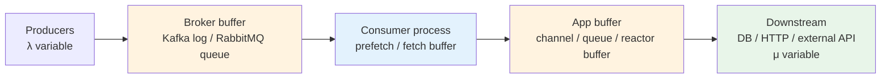
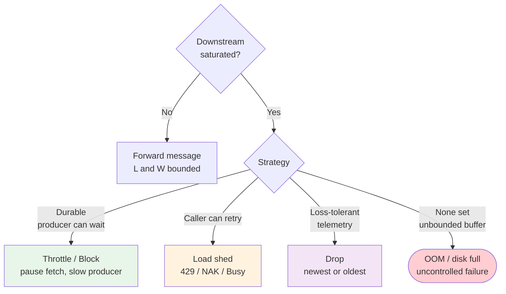
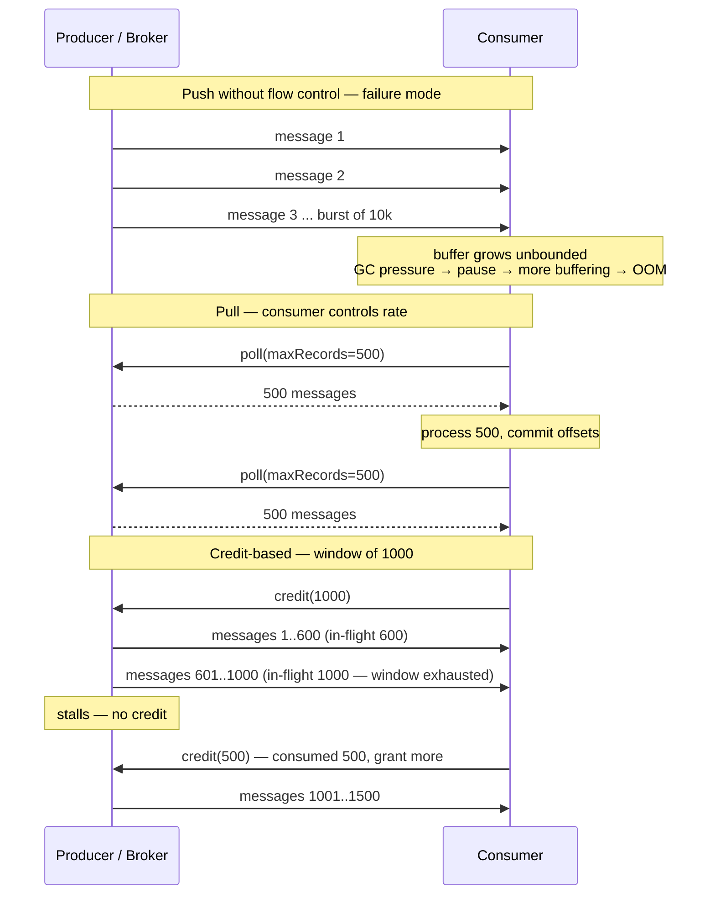
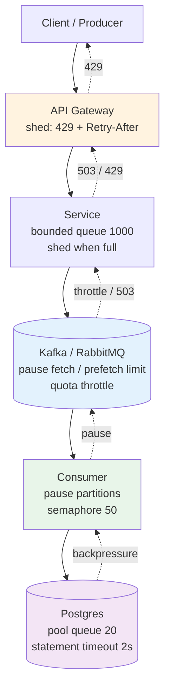
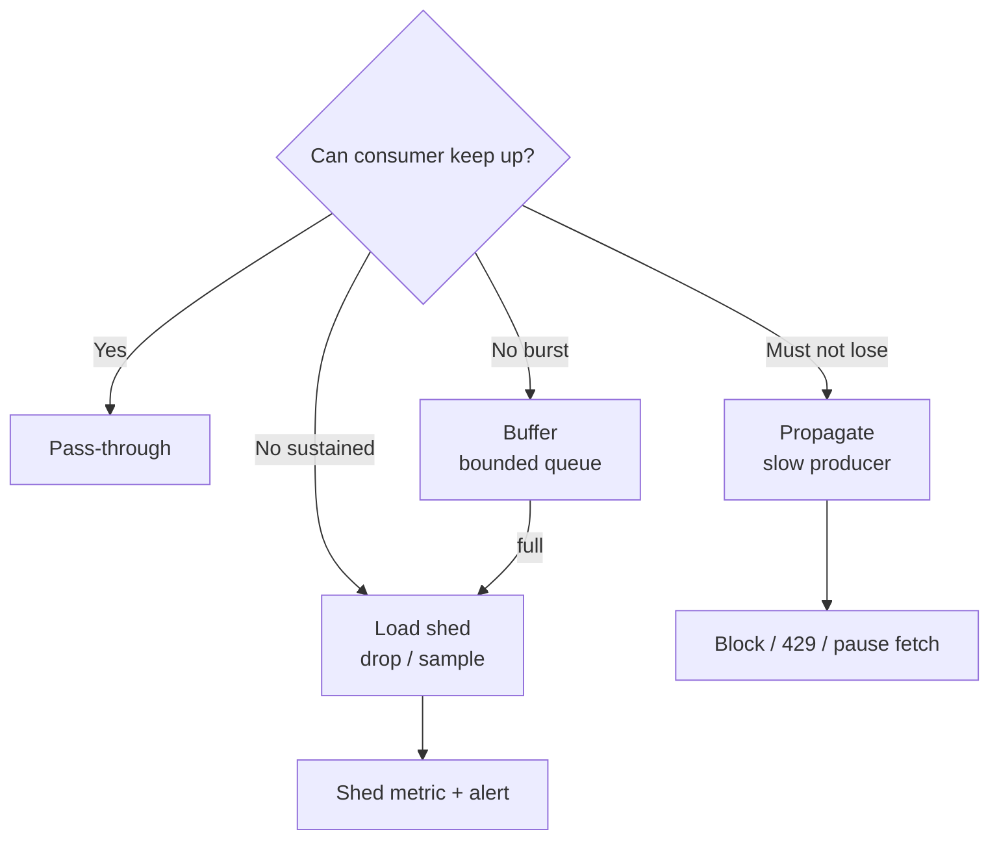
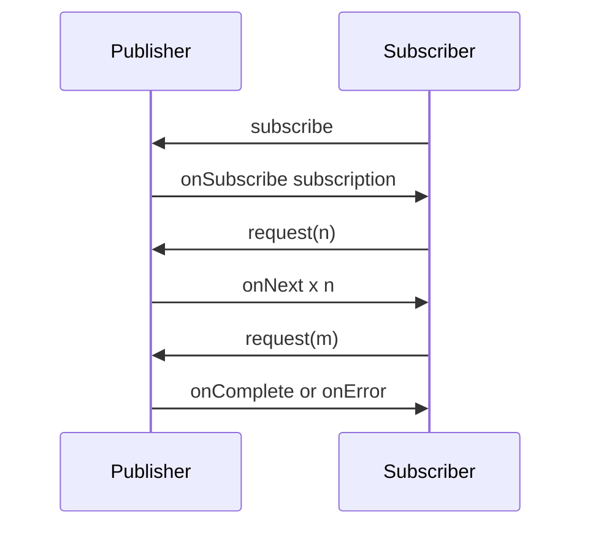
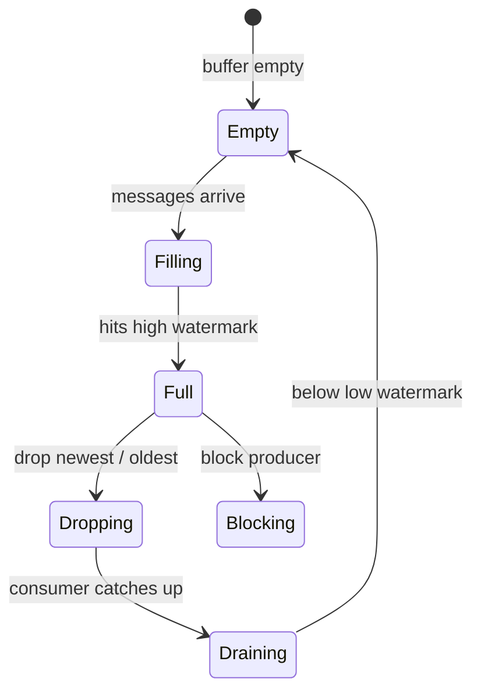

# Chapter 7 — Backpressure and Flow Control

**What this chapter covers.** Every messaging system is a producer-consumer pipeline where the two sides run at independent rates. When producers outpace consumers — during a traffic spike, a slow downstream dependency, a GC pause, or a poison-message stall — messages accumulate somewhere. Without explicit flow control, that *somewhere* is an unbounded buffer that exhausts memory, spills to disk, and eventually collapses the broker, the consumer, or both. This is the **backpressure problem**: how to signal *upstream* that *downstream* is saturated, and how to react without losing data, violating ordering, or cascading failure. This chapter builds the full backpressure discipline from queueing theory to wire protocol. We cover Little's Law and queueing fundamentals, the taxonomy of backpressure strategies (buffer, drop, throttle, shed, block), push vs. pull and credit-based flow control, and the concrete mechanisms in **Kafka 3.7** (fetch flow control, `pause`/`resume`, quotas), **RabbitMQ 3.13** (prefetch, publisher confirms, global flow control), **gRPC/HTTP/2** (window-based flow control), and reactive frameworks (**Reactive Streams**, **Project Reactor**, **Akka Streams**, **Node.js streams**). Every pattern is shown with runnable, version-pinned configuration and code, and viewed through the distributed-systems lens where backpressure propagated across five hops determines whether overload is isolated or becomes a fleet-wide outage.

Learning goals — after this chapter you should be able to:

- State Little's Law and the stability condition (arrival rate vs. service rate) and explain why an unbounded buffer is not a flow-control strategy.
- Enumerate the five backpressure strategies — buffer (bounded), drop, throttle, shed, block — and choose correctly by durability, ordering, and loss-tolerance requirements.
- Contrast push vs. pull and credit-based flow control, and explain how each maps to Kafka, RabbitMQ, gRPC/HTTP/2, and Reactive Streams.
- Configure Kafka consumer flow control: `max.poll.records`, `max.poll.interval.ms`, `fetch.max.bytes`, `pause()`/`resume()`, and broker quotas (`client.quota.callback`, `quota.producer.default`).
- Configure RabbitMQ flow control: `prefetch` (`basic.qos`), publisher confirms, credit-flow, memory/disk alarms, and stream `credit` protocol.
- Implement application-level backpressure in Go (`context` + buffered channels + `semaphore`), Java (Reactor `onBackpressure*`, `OverflowStrategy`), and Node.js (`Readable`/`Writable` highWaterMark, `pipe`).
- Reason about end-to-end backpressure propagation across gateway → service → broker → consumer → database, and detect saturation with queue depth, consumer lag, and `pause` metrics.

> **Boundary note.** This volume's Chapter 1 — Messaging Fundamentals — introduces queues vs. logs vs. pub/sub and where buffers live. Chapter 2 — Delivery Semantics — covers at-least/at-most/effectively-once and how retries interact with backpressure. Volume 5, Chapter 7 (WAL/Recovery) and Volume 3, Chapter 7 (HTTP/2 flow control) provide the storage and transport primitives. Volume 7, Chapter 9 — Rate Limiting, Quotas, and Fairness — covers *admission control at the edge*; this chapter covers *flow control inside the pipeline* after admission. Volume 11, Chapter 2 — Metrics and the Golden Signals — defines the saturation signals (queue depth, lag, p99 processing latency) we alert on here. For the outbox relay's own backpressure (CDC lag vs. polling interval), see Chapter 6.

---

## Why backpressure is not optional

### The stability condition

A messaging pipeline is a queueing system. Let:

- λ = mean arrival rate (messages/s) into the buffer
- μ = mean service rate (messages/s) of the consumer
- L = mean number in system, W = mean time in system

**Little's Law**: `L = λ · W` holds for any stable queueing system — no distribution assumptions. The stability condition is `λ < μ` (arrival slower than service). When `λ > μ` for any sustained interval, `L` grows without bound and `W` (latency) grows linearly with it. A buffer does not fix instability — it only delays the failure and hides the signal.

```
Stable:    λ = 800/s, μ = 1000/s  →  L bounded, W ≈ 1/μ × queue depth
Unstable:  λ = 1200/s, μ = 1000/s  →  L grows at 200/s, W grows without bound
                                          memory exhausted in L / capacity seconds
```

In production the rates are not constant. A downstream database slows from 2 ms to 80 ms p99 during a compaction, μ drops by 40×, and a pipeline that was stable at 60% utilization is suddenly unstable at 2400% overload. Without backpressure, the only observable before OOM is *increasing queue depth* — which every system already has but few alert on.

### Where messages accumulate



Buffers exist at four layers: broker (log segments, queue pages), consumer client (fetch/prefetch buffer), application (in-memory channels, Reactor buffers), and downstream (DB connection pool queue, HTTP client queue). Backpressure must be *propagated* across all four — a consumer that applies backpressure to the broker but buffers unboundedly in application memory has only moved the OOM one hop downstream.

---

## The five backpressure strategies

| Strategy | Behaviour when saturated | Data loss | Latency effect | Ordering | When to use |
|----------|--------------------------|-----------|----------------|----------|-------------|
| **Buffer (bounded)** | Enqueue up to N; then apply next strategy | None (until next strategy) | Increases with depth | Preserved | Default — but N must be bounded and the overflow strategy explicit |
| **Drop (newest/oldest)** | Discard incoming or oldest message | Yes — intentional | Bounded | Preserved for survivors | Telemetry, metrics, best-eńort notifications where loss is cheaper than stall |
| **Throttle** | Slow the producer — `sleep`, rate-limit, `pause` | None | Increases upstream | Preserved | Durable pipelines where producers can be slowed (internal services, CDC) |
| **Shed (load shedding)** | Reject/NAK with `Busy`/`429`/`Unavailable` | No — caller retries | Caller sees error quickly | Preserved | Edge and synchronous hops — fail fast, let caller back off |
| **Block** | Block the producer thread/coroutine | None | Producer stalls | Preserved | Only inside a single process with bounded concurrency — never across network without timeout |

No pipeline uses one strategy everywhere. The correct design is layered: throttle the broker fetch when downstream is slow, shed at the gateway when the service is saturated, and drop only for explicitly loss-tolerant streams. An *unbounded* buffer is not a sixth strategy — it is the absence of a strategy.



### Choosing by durability and loss tolerance

- **Orders, payments, inventory events (durable, loss-intolerant)**: throttle + shed at the edge. Never drop. Buffer bounded (e.g., 10k in-memory + broker log), then throttle (pause Kafka partition), then shed (return `429`/`503` to caller who retries with backoff).
- **Metrics, traces, clickstream (loss-tolerant, high-volume)**: bounded buffer + drop-oldest. A 1% drop during a spike is cheaper than stalling the pipeline that carries payments on the same broker.
- **Synchronous RPC inside the mesh**: shed. Blocking the caller thread across a network hop holds a connection and a goroutine/thread. Return `UNAVAILABLE`/`429` with `Retry-After` and let the caller back off or hedge (Vol 3, Ch 11).

---

## Push vs. pull vs. credit-based flow control

| Model | Who controls rate | How it signals | Example |
|-------|-------------------|----------------|---------|
| **Push** | Producer pushes; consumer must accept or drop | Consumer slow → buffer grows → OOM | Classic RabbitMQ `basic.deliver` without prefetch, naive TCP without windowing |
| **Pull** | Consumer pulls when ready | Consumer controls `poll()`/`fetch` cadence | Kafka `poll()`, SQS `ReceiveMessage` long-poll, gRPC server-streaming with `request(n)` |
| **Credit-based** | Consumer grants credits; producer sends only within credits | `credit = window - in-flight`; producer stalls at 0 | RabbitMQ Streams, AMQP 1.0 `flow`, HTTP/2 `WINDOW_UPDATE`, Reactive Streams `request(n)` |

Push without a credit or prefetch limit is the most common source of consumer OOM. Every production consumer must use one of pull or credit-based consumption.



---

## Kafka flow control

Kafka is a **pull** system: consumers fetch from the log at their own pace. That is the primary backpressure mechanism — a slow consumer simply calls `poll()` less often, and the log retains messages on disk. But three tuning points determine whether that pull is well-behaved.

### Consumer-side fetch control

```java
// Java — Kafka 3.7 consumer with explicit flow-control tuning
Properties props = new Properties();
props.put(ConsumerConfig.BOOTSTRAP_SERVERS_CONFIG, "kafka.prod:9092");
props.put(ConsumerConfig.GROUP_ID_CONFIG, "payments-processor");
props.put(ConsumerConfig.KEY_DESERIALIZER_CLASS_CONFIG, StringDeserializer.class);
props.put(ConsumerConfig.VALUE_DESERIALIZER_CLASS_CONFIG, JsonDeserializer.class);

// Flow-control knobs — the important ones
props.put(ConsumerConfig.MAX_POLL_RECORDS_CONFIG, 500);          // max records per poll()
props.put(ConsumerConfig.MAX_POLL_INTERVAL_MS_CONFIG, 300_000);  // max time between poll() before rebalance
props.put(ConsumerConfig.FETCH_MAX_BYTES_CONFIG, 52_428_800);     // max bytes per fetch (50 MiB)
props.put(ConsumerConfig.FETCH_MAX_WAIT_MS_CONFIG, 500);          // broker waits up to 500ms to fill fetch
props.put(ConsumerConfig.FETCH_MIN_BYTES_CONFIG, 1);              // return as soon as any data available
props.put(ConsumerConfig.MAX_PARTITION_FETCH_BYTES_CONFIG, 1_048_576); // 1 MiB per partition
props.put(ConsumerConfig.SESSION_TIMEOUT_MS_CONFIG, 45_000);
props.put(ConsumerConfig.ENABLE_AUTO_COMMIT_CONFIG, false);       // manual commit — essential for backpressure

KafkaConsumer<String, PaymentEvent> consumer = new KafkaConsumer<>(props);
consumer.subscribe(List.of("payments"));

while (true) {
    ConsumerRecords<String, PaymentEvent> records = consumer.poll(Duration.ofMillis(1000));
    for (ConsumerRecord<String, PaymentEvent> rec : records) {
        // Downstream may be slow — check before processing each batch
        if (downstreamSaturated()) {
            // Pause only the saturated partitions — other partitions continue
            consumer.pause(consumer.assignment());
            // Back off, then resume — cooperative, no rebalance
            Thread.sleep(1000);
            consumer.resume(consumer.paused());
            break;
        }
        process(rec);
    }
    consumer.commitSync(); // commit only after successful processing
}
```

```java
// Pause/resume by partition — finer-grained backpressure
// Pause hot partitions (tenant with burst) while continuing to drain others
Set<TopicPartition> hotPartitions = detectHotPartitions(records);
if (!hotPartitions.isEmpty()) {
    consumer.pause(hotPartitions);
    scheduleResume(hotPartitions, Duration.ofSeconds(5));
}
```

Key invariants:

- **`max.poll.records` + `fetch.max.bytes` bound the per-`poll()` batch.** Without them a single `poll()` can return tens of thousands of large messages and OOM the consumer heap.
- **`max.poll.interval.ms` is the liveness contract.** If processing a batch takes longer than this (because downstream is slow and backpressure is not applied), the group coordinator considers the consumer dead and triggers a rebalance — which reassigns partitions and causes duplicate processing. Either keep batch processing under the interval or call `poll()` heartbeats on a separate thread.
- **`pause()`/`resume()` is cooperative.** It stops fetching from the named partitions without leaving the group, so other consumers do not take over. Use it when downstream (DB, HTTP) is saturated per-partition.

### Broker quotas — throttling producers and consumers

```properties
# server.properties — Kafka 3.7 quotas (KIP-848 client quota overrides)
# Throttle producers that exceed 10 MiB/s per client-id
quota.producer.default=10485760
# Throttle consumers that exceed 20 MiB/s per client-id
quota.consumer.default=20971520
# Per-client override via kafka-configs.sh
```

```bash
# Set a per-client-id quota: order-service may produce at most 5 MiB/s
kafka-configs.sh --bootstrap-server kafka.prod:9092 \
  --alter --add-config 'producer_byte_rate=5242880,consumer_byte_rate=10485760' \
  --entity-type clients --entity-name order-service

# Describe quotas
kafka-configs.sh --bootstrap-server kafka.prod:9092 \
  --describe --entity-type clients --entity-name order-service

# Quota throttling shows as throttle-time-ms in client metrics
# kafka.producer:type=producer-metrics,client-id=order-service -> throttle-time-avg
```

When a client exceeds its quota, the broker **throttles** — it delays the response by `throttle-time-ms` proportional to the excess. This is true backpressure: the producer's `send()` blocks (or times out) and the client must handle `ThrottleTimeMs`. It prevents a single noisy producer from starving other tenants on the same cluster.

### Monitoring consumer backpressure

```promql
# Consumer lag — the primary saturation signal (per partition)
kafka_consumer_group_lag{group="payments-processor"} > 10000

# Time since last poll — detects stalled consumers before rebalance
time() - kafka_consumer_last_poll_seconds > 60

# Throttle time — quota-induced backpressure
rate(kafka_producer_throttle_time_ms_sum[5m]) > 100

# Pause duration — how long partitions stay paused
histogram_quantile(0.99, rate(consumer_partition_pause_seconds_bucket[5m])) > 10
```

---

## RabbitMQ flow control

RabbitMQ is a **push** system by default — the broker pushes `basic.deliver` to consumers. Without flow control, a fast queue and a slow consumer reproduce the classic push failure. RabbitMQ provides three layers.

### Prefetch — consumer credit

```java
// Java — RabbitMQ 3.13 consumer with prefetch (credit-based)
ConnectionFactory factory = new ConnectionFactory();
factory.setHost("rabbitmq.prod");
Connection conn = factory.newConnection();
Channel ch = conn.createChannel();

// QoS: at most 100 unacked messages per consumer, shared across all queues on this channel
ch.basicQos(100, false);
// Per-queue variant for heterogeneous consumers:
// ch.basicQos(50, false) on channel serving the slow queue, 500 on the fast queue

DeliverCallback callback = (tag, delivery) -> {
    try {
        process(delivery);
        ch.basicAck(delivery.getEnvelope().getDeliveryTag(), false);
    } catch (DownstreamSaturatedException e) {
        // Reject and requeue — but see Ch 8 for why requeue is dangerous without backoff
        ch.basicNack(delivery.getEnvelope().getDeliveryTag(), false, true);
        // Better: pause consumption on this channel until downstream recovers
        ch.basicQos(0, false); // global prefetch 0 — stops delivery
        scheduleResume(ch, Duration.ofSeconds(5));
    } catch (Exception e) {
        ch.basicNack(delivery.getEnvelope().getDeliveryTag(), false, false); // to DLX — Ch 8
    }
};
ch.basicConsume("payments", false, callback, tag -> {});
```

```yaml
# Spring AMQP — prefetch + concurrency as flow-control
spring:
  rabbitmq:
    listener:
      simple:
        prefetch: 100              # basic.qos per consumer
        concurrency: 4             # 4 consumers per listener container
        max-concurrency: 8         # scale to 8 under load
        default-requeue-rejected: false  # never silently requeue — route to DLQ
        acknowledge-mode: manual   # ack only after downstream succeeds
```

| Prefetch value | Behaviour | When |
|----------------|-----------|------|
| 0 (unlimited) | Broker pushes as fast as it can | Never in production — unbounded consumer buffer |
| 1 | Strict fair dispatch, highest isolation, lowest throughput | Slow, order-sensitive consumers |
| 20–100 | Balanced — good throughput, bounded memory | Typical HTTP→DB consumers |
| 500+ | High throughput, higher memory, less fair dispatch | Fast consumers, large messages, batch processing |

### Publisher-side flow control

```java
// Publisher confirms — backpressure on the producer side
ch.confirmSelect(); // enable publisher confirms (async ACK from broker)

ch.addConfirmListener(
    (seqNo, multiple) -> { /* ack — message durable */ },
    (seqNo, multiple) -> { /* nack — broker rejected, retry with backoff */ }
);

// Wait for confirms with timeout — blocks if broker is saturated
if (!ch.waitForConfirms(5000)) {
    throw new BrokerSaturatedException("publisher confirm timeout");
}

// Spring AMQP — correlated confirms
rabbitTemplate.setConfirmCallback((correlationData, ack, cause) -> {
    if (!ack) log.error("nack: {} cause={}", correlationData, cause);
});
rabbitTemplate.convertAndSend("orders", order, m -> {
    m.getMessageProperties().setDeliveryMode(MessageDeliveryMode.PERSISTENT);
    return m;
}, new CorrelationData(order.id()));
```

```yaml
# RabbitMQ memory and disk alarms — broker-level backpressure
# rabbitmq.conf — RabbitMQ 3.13
vm_memory_high_watermark.relative = 0.6   # block publishers at 60% RAM
vm_memory_high_watermark_paging_ratio = 0.5
disk_free_limit.relative = 1.5            # block at 1.5× queue index size
credit_flow_default_credit = {400, 200}   # credit-flow window per connection
```

When the broker hits the memory or disk watermark, it **blocks publishers** — `basic.publish` returns a `ResourceAlarm` and the client must handle it. This is the broker propagating backpressure upstream. Clients that ignore `BlockedListener` will see publish timeouts.

### RabbitMQ Streams — explicit credit

```java
// RabbitMQ Streams 3.13 — credit-based consumption (like Kafka pull)
Environment env = Environment.builder().uri("rabbitmq-stream://rabbitmq.prod:5552").build();
Consumer consumer = env.consumerBuilder()
    .stream("payments-stream")
    .offset(OffsetSpecification.first())
    .flow()
        .initialCredits(1000)       // grant 1000 credits (messages)
        .creditBatchSize(500)       // replenish 500 at a time
    .build();
```

---

## gRPC / HTTP/2 window-based flow control

HTTP/2 (and thus gRPC) has **connection-level and stream-level flow control** via `WINDOW_UPDATE` frames. Each side advertises a window (default 64 KiB connection, 32 KiB stream) and the sender must not send more than the window. The receiver grants more credit with `WINDOW_UPDATE`.

```go
// Go 1.22 — gRPC server streaming with explicit flow control via context + semaphore
// The gRPC HTTP/2 window is automatic; application-level backpressure is the semaphore.
func (s *OrderService) StreamOrders(req *pb.StreamRequest, stream pb.OrderService_StreamOrdersServer) error {
    // Limit in-flight downstream calls to 50 — application backpressure
    sem := make(chan struct{}, 50)
    for {
        select {
        case <-stream.Context().Done():
            return stream.Context().Err()
        case sem <- struct{}{}:
        }
        order, err := s.nextOrder(stream.Context())
        if err != nil {
            <-sem
            return err
        }
        // Downstream call with timeout — shed if slow
        ctx, cancel := context.WithTimeout(stream.Context(), 2*time.Second)
        err = s.enrichOrder(ctx, order)
        cancel()
        if err != nil {
            <-sem
            if errors.Is(err, context.DeadlineExceeded) {
                return status.Error(codes.ResourceExhausted, "downstream saturated")
            }
            return err
        }
        if err := stream.Send(order); err != nil {
            <-sem
            return err // client gone or window exhausted
        }
        <-sem
    }
}
```

```yaml
# Envoy — HTTP/2 flow-control window tuning (per cluster)
clusters:
  - name: payments
    http2_protocol_options:
      initial_stream_window_size: 65535      # 64 KiB per stream
      initial_connection_window_size: 1048576 # 1 MiB per connection
    circuit_breakers:
      thresholds:
        - max_pending_requests: 1000
          max_requests: 500
          max_retries: 3
          retry_budget:
            percent: 20
            min_retry_concurrency: 5
```

Envoy circuit breakers are the **load-shedding** layer on top of HTTP/2 flow control: when `max_pending_requests` is exceeded, Envoy returns `503` immediately rather than queueing — that `503` is backpressure propagated to the caller.

---

## Reactive Streams and application-level backpressure

Reactive Streams (`Publisher`/`Subscriber`/`Subscription` with `request(n)`) makes backpressure a first-class protocol signal: a subscriber *requests* `n` items and the publisher must not emit more than requested.

```java
// Java 17 — Project Reactor 3.6 — backpressure strategies
Flux<OrderEvent> events = orderEventSource() // fast publisher
    .onBackpressureBuffer(10_000,               // bounded buffer — 10k
        dropped -> log.warn("dropped {}", dropped),
        BufferOverflowStrategy.DROP_LATEST)     // drop newest when full
    // Alternatives by use case:
    // .onBackpressureDrop(dropped -> metrics.increment("dropped"))
    // .onBackpressureLatest()                  // keep only latest — for state updates
    // .onBackpressureError()                   // fail fast — no silent loss
    // .onBackpressureBuffer(1000, false)       // unbounded — never use in prod
    .publishOn(Schedulers.boundedElastic(), 500) // prefetch 500, bounded scheduler
    .flatMap(event -> enrichAsync(event)
        .subscribeOn(Schedulers.boundedElastic()), 8); // max 8 concurrent enrichments

events.subscribe(
    event -> persist(event),
    err  -> log.error("stream failed", err),
    ()   -> log.info("stream complete")
);
```

```java
// Akka Streams 2.6 — explicit buffer + overflow strategy
Source<OrderEvent, NotUsed> source = orderEventSource();
source
    .buffer(1000, OverflowStrategy.backpressure()) // block upstream when full — throttle
    // OverflowStrategy.dropHead() — drop oldest
    // OverflowStrategy.dropTail() — drop newest
    // OverflowStrategy.dropBuffer() — drop entire buffer
    // OverflowStrategy.fail() — fail the stream
    .mapAsync(8, event -> enrichAsync(event))      // max 8 in-flight
    .async()                                        // async boundary — backpressure propagates
    .to(Sink.foreach(this::persist))
    .run(materializer);
```

```javascript
// Node.js 20 — stream backpressure via highWaterMark and pipe
import { Readable, Writable, Transform } from 'node:stream';
import { pipeline } from 'node:stream/promises';

const orderSource = new Readable({
    objectMode: true,
    highWaterMark: 500, // buffer at most 500 objects before push() returns false
    read() { /* push() orders from Kafka/RabbitMQ */ }
});

const enrich = new Transform({
    objectMode: true,
    highWaterMark: 200,
    async transform(order, _enc, cb) {
        try {
            const enriched = await enrichOrder(order); // may be slow
            cb(null, enriched);
        } catch (err) { cb(err); }
    }
});

const persist = new Writable({
    objectMode: true,
    highWaterMark: 100,
    async write(order, _enc, cb) {
        try { await db.insert(order); cb(); }
        catch (err) { cb(err); }
    }
});

// pipeline() propagates backpressure: persist slow -> enrich pauses -> orderSource pauses
await pipeline(orderSource, enrich, persist);
// write() returning false / push() returning false is the backpressure signal
```

```go
// Go — channel + semaphore as manual backpressure between Kafka poll and DB pool
func runConsumer(ctx context.Context, consumer *kafka.Consumer, db *sql.DB) {
    sem := make(chan struct{}, 50) // at most 50 in-flight DB inserts
    for {
        select {
        case <-ctx.Done():
            return
        default:
        }
        msg, err := consumer.ReadMessage(1 * time.Second)
        if err != nil { continue; }
        sem <- struct{}{} // blocks when 50 in-flight — backpressure to poll loop
        go func(m *kafka.Message) {
            defer func() { <-sem }()
            ctx, cancel := context.WithTimeout(ctx, 2*time.Second)
            defer cancel()
            if err := persistOrder(ctx, db, m); err != nil {
                log.Printf("persist failed offset=%d err=%v", m.TopicPartition.Offset, err)
                return // Ch 8: retry/DLQ decision
            }
            consumer.CommitMessage(m)
        }(msg)
    }
}
```

---

## End-to-end propagation

Backpressure that stops at one hop is not backpressure — it is a buffer. The full path must propagate:



The signals and thresholds at each hop:

| Hop | Signal | Threshold | Action |
|-----|--------|-----------|--------|
| DB pool | `pool.wait_queue_depth`, `statement_timeout` | queue > 10, p99 > 500 ms | Consumer stops committing, pauses partitions |
| Consumer | `consumer_lag`, `in_flight`, `pause_duration` | lag > 10k, in-flight = cap | `pause()` partitions, stop `poll()` |
| Broker | `quota throttle-time`, `disk watermark`, `memory alarm` | throttle > 100 ms, watermark 60% | Delay produce/fetch, block publishers |
| Service | `queue_depth`, `latency p99`, `circuit open` | queue > 80%, p99 > SLO | Return `503`/`429`, open circuit |
| Gateway | `pending_requests`, `429 rate` | pending > 1000, 429 > 5% | Return `429` to client with `Retry-After` |

Without propagation, a slow database causes the consumer buffer to grow, the broker log to retain longer, the service heap to grow, and the gateway to queue — until the first OOM or disk-full kills a process that was otherwise healthy. With propagation, the database slowness surfaces as `429` at the edge within seconds, the caller backs off, and the system degrades gracefully.

---

## Distributed-systems lens

- **Backpressure is a correctness property, not a performance optimization.** An unbounded buffer that OOMs the consumer violates durability (unacked messages lost on crash) and ordering (rebalance reassigns partitions). Bounded buffers with explicit overflow strategies make the failure mode *chosen* rather than *accidental*.
- **Pull and credit-based protocols are the only safe defaults across a network.** Push without a window (RabbitMQ without prefetch, HTTP without `WINDOW_UPDATE`) delegates flow control to the receiver's memory — which is not flow control. Default to `prefetch`/`request(n)`/`WINDOW_UPDATE` and treat unlimited push as a bug.
- **Pause is cooperative, rebalance is not.** Kafka `pause()` keeps partition ownership and resumes without rebalancing; exceeding `max.poll.interval.ms` triggers a rebalance that reassigns partitions and causes duplicate processing. Size `max.poll.interval.ms` above the worst-case batch processing time under backpressure, or heartbeat on a separate thread.
- **Quotas are multi-tenancy isolation.** A single noisy producer or consumer can starve every other tenant on the same Kafka or RabbitMQ cluster. Per-client quotas turn a noisy-neighbour incident into local throttling rather than a cluster-wide outage.
- **The edge must shed.** Internal backpressure (pause, throttle) protects durability but increases latency for every caller. At the edge (gateway, BFF), shedding with `429`/`503` + `Retry-After` bounds tail latency and gives callers a signal they can act on (backoff, hedge, degrade). A system that only throttles internally and never sheds at the edge will meet its durability SLO and miss its latency SLO on every overload.


#### Backpressure Strategy Choice



#### Reactive Streams Protocol



#### Buffer and Drop Policies



## Key takeaways

- Little's Law (`L = λ·W`) and the stability condition (`λ < μ`) govern every pipeline: a sustained `λ > μ` makes queue depth and latency grow without bound — a buffer only delays the failure.
- The five strategies are buffer (bounded), drop, throttle, shed, and block — layered by hop: throttle/shed for durable pipelines, drop only for loss-tolerant telemetry, never unbounded.
- Push without a credit/window is unsafe across a network; pull (`poll`/`fetch`) and credit-based (`request(n)`, `WINDOW_UPDATE`, `basic.qos`) are the safe primitives.
- Kafka flow control is pull + `max.poll.records`/`fetch.max.bytes` + `pause()`/`resume()` + broker quotas; RabbitMQ is `basic.qos` prefetch + publisher confirms + memory/disk alarms + stream credits; gRPC/HTTP/2 is `WINDOW_UPDATE` + Envoy circuit breakers.
- Reactive Streams (`request(n)`), Akka `OverflowStrategy`, and Node.js `highWaterMark`/`pipe` make backpressure explicit in application code — bounded buffers with named overflow strategies, never unbounded.
- End-to-end propagation (DB pool → consumer pause → broker throttle → service `503` → gateway `429`) turns a slow downstream into a fast, actionable signal at the edge instead of a cascading OOM.

## Further reading

- **Queueing theory:** Kleinrock *Queueing Systems, Volume 1* (1975) — Little's Law and stability. Harchol-Balter *Performance Modeling and Design of Computer Systems* (2013) — Ch 3 (Little's Law), Ch 11 (scheduling under load).
- **Reactive Streams:** Reactive Streams spec 1.0.4 (https://www.reactive-streams.org/) — `Publisher`/`Subscriber`/`Subscription`/`request(n)` contract. Project Reactor 3.6 reference (https://projectreactor.io/docs/core/release/reference/) — `onBackpressure*` operators. Akka Streams 2.6 docs (https://doc.akka.io/docs/akka/current/stream/index.html) — `OverflowStrategy`, `async` boundaries.
- **Kafka:** Kafka 3.7 docs — Consumer configs (`max.poll.records`, `max.poll.interval.ms`, `fetch.*`), quotas (`quota.producer.default`, `client.quota.callback`), `pause()`/`resume()` (https://kafka.apache.org/documentation/#consumerconfigs). KIP-848 (client quotas).
- **RabbitMQ:** RabbitMQ 3.13 docs — Consumer prefetch (`basic.qos`), publisher confirms, flow control / credit flow, memory/disk alarms (https://www.rabbitmq.com/docs/flow-control), Streams credit protocol (https://www.rabbitmq.com/docs/streams).
- **gRPC / HTTP/2:** RFC 9113 (HTTP/2) §5.2 — flow control (`WINDOW_UPDATE`). gRPC flow-control docs (https://grpc.io/docs/guides/flow-control/). Envoy circuit breakers (https://www.envoyproxy.io/docs/envoy/latest/configuration/upstream/circuit_breaking).
- **Node.js / Go:** Node.js 20 stream docs (https://nodejs.org/api/stream.html) — `highWaterMark`, `pipeline()`, backpressure. Go `context` + `golang.org/x/sync/semaphore` 0.17+ — bounded concurrency.
