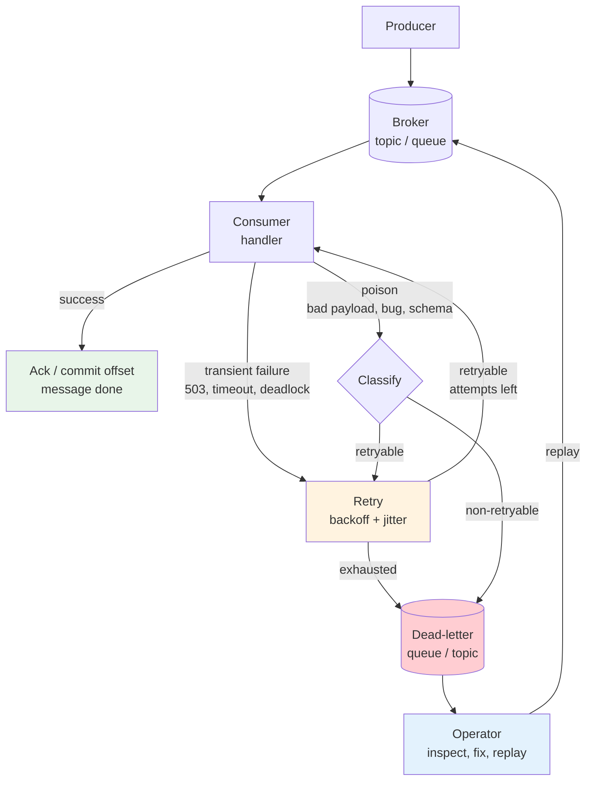
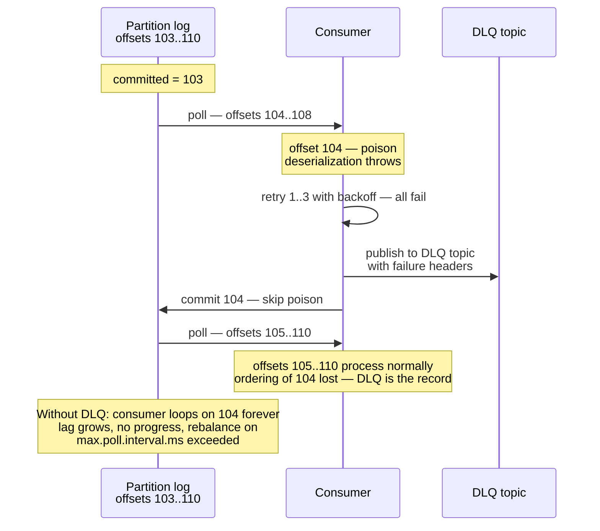
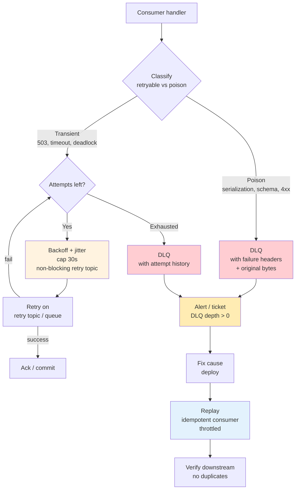
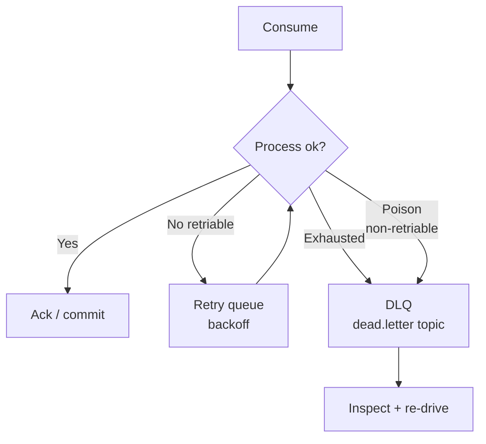
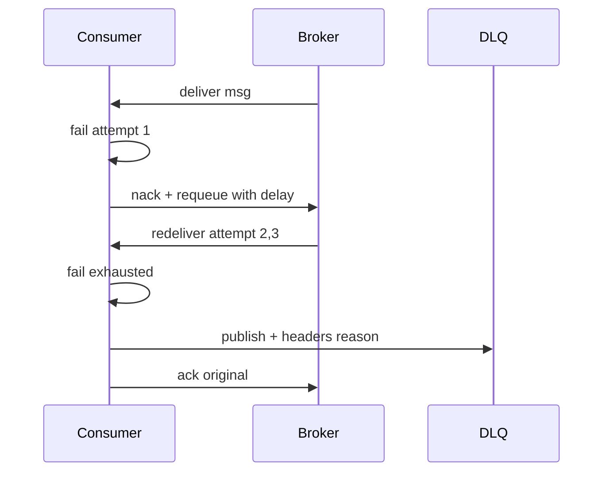
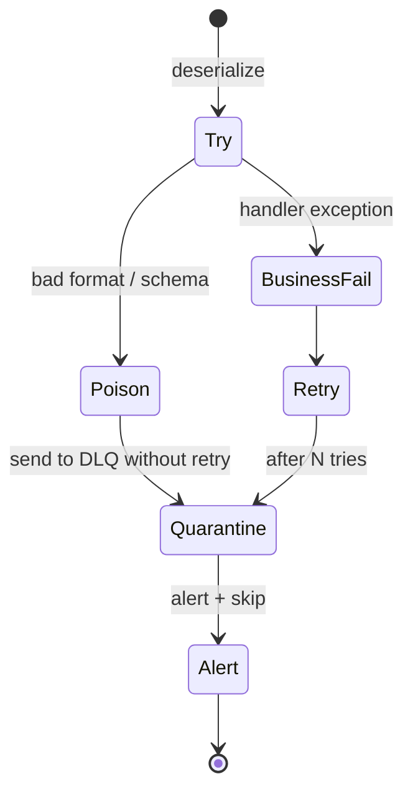

# Chapter 8 — Dead Letters, Retries, Poison Messages

**What this chapter covers.** In a healthy pipeline every message is consumed, processed, and acknowledged. In production a fraction inevitably is not — the payload is malformed, the schema changed, a downstream dependency is down, or the handler has a bug that throws on one specific input. Without an explicit failure discipline, the system has two bad defaults: retry forever and block the partition, or acknowledge and silently drop the message. The correct discipline is ** retries with backoff and a dead-letter queue (DLQ)** — a durable, observable, replayable sink for messages that cannot be processed after a bounded number of attempts. This chapter builds that discipline end to end: why poison messages stall ordered logs, the retry taxonomy (immediate, delayed, exponential backoff with jitter, non-retryable classification), DLQ design (what to store, how to route, how to operate and replay), poison-message handling (detect, quarantine, skip, fix, replay), and the concrete wiring in **Kafka 3.7** (Spring Kafka `DeadLetterPublishingRecoverer`, Kafka Streams `ProductionExceptionHandler`, `errors.tolerance` in Kafka Connect) and **RabbitMQ 3.13** (dead-letter exchanges, `x-dead-letter-exchange`, quorum-queue DLX, delayed retry via TTL + DLX or delayed-message plugin/exchange and quorum-queue delayed semantics). Every pattern is shown with runnable, version-pinned configuration and code and viewed through the distributed-systems lens where a single poison message can stall a partition, inflate lag, and invalidate exactly-once-effect guarantees if the failure path is not idempotent and observable.

Learning goals — after this chapter you should be able to:

- Define *poison message*, *dead letter*, and *retry* precisely and explain why `ack-on-failure` (silent drop) and `retry forever` (partition stall) are both unacceptable defaults.
- Classify failures as retryable (transient downstream 503, DB deadlock, timeout) vs. non-retryable (poison — deserialization, schema violation, invariant bug) and route correctly on the first failure.
- Design a retry policy: immediate vs. delayed, fixed vs. exponential backoff with jitter, max attempts, and the per-partition ordering cost of blocking retries.
- Design a DLQ: what to store (original payload + headers + failure metadata + stack trace), how to route (DLX, `DeadLetterPublishingRecoverer`, dead-letter topic naming), and the operational loop (alert, inspect, fix, replay, verify).
- Handle poison messages without stalling the log: detect (deserialization exception, repeated NACK), quarantine (DLQ), skip (commit offset past poison), and replay after a fix — with ordering implications stated.
- Configure Kafka and RabbitMQ DLQ/retry wiring: Spring Kafka `DefaultErrorHandler` + `DeadLetterPublishingRecoverer`, non-blocking retry topics (Spring Kafka `RetryTopicConfiguration`), Kafka Connect `errors.*`, RabbitMQ `x-dead-letter-exchange` + `x-message-ttl` / `x-delayed-message` / quorum-queue considerations.
- Operate DLQs: monitor DLQ depth and retry exhaustion, replay safely (idempotent consumers — see Ch 2 and Vol 6, Ch 9), and prevent DLQ backpressure from re-stalling the main pipeline.

> **Boundary note.** Chapter 2 — Delivery Semantics — defines at-least/at-most/effectively-once and why retries are at-least-once, requiring idempotent consumers (Vol 6, Ch 9). Chapter 6 — The Outbox Pattern — makes the *producer* side idempotent via the outbox; this chapter owns the *consumer* failure path. Chapter 7 — Backpressure and Flow Control — shows how retries amplify load and why retry storms must be throttled; retries without backoff are an anti-pattern. Vol 5, Ch 10 (Sagas) covers compensating transactions that may consume DLQ events. For the formal idempotency-key and exactly-once-effect protocol, see Vol 6, Ch 9; for broker delivery mechanics, see Ch 2.

---

## The failure path nobody drew

The happy-path diagram in every messaging intro shows `produce → broker → consume → ack`. The production diagram has a second path:



Without explicit wiring for `R` and `DLQ`, the consumer has only two options — both wrong:

| Default | What happens | Consequence |
|---------|--------------|-------------|
| **Ack on failure** (swallow exception, commit offset) | Message acknowledged as if processed | **Silent data loss** — payment never charged, inventory never updated, no signal to alert on |
| **Retry forever** (requeue / redeliver immediately) | Same message redelivered in a tight loop | **Partition stall** — Kafka consumer never advances past the poison offset; RabbitMQ queue drains no other messages; CPU/log I/O burned on a message that will never succeed |

The DLQ is the third option that makes both failure modes observable and recoverable: after a bounded number of retries, the message is moved to a durable side queue with full failure context, the main partition/queue advances, and an operator (or automation) can fix the cause and replay.

---

## Poison messages — definition and taxonomy

A **poison message** is any message that will fail deterministically on every retry — the failure is in the message or the handler, not in a transient dependency.

| Category | Example | Fails where | Retry helps? |
|----------|---------|-------------|--------------|
| **Deserialization poison** | `JSON` field `amount` is a string `"12.00"` but handler expects `int64` cents | Deserializer before handler | Never — same bytes every time |
| **Schema poison** | Producer upgraded to Avro schema v3, consumer still on v2, new required field `currency` missing | Schema Registry / deserializer | Only after consumer upgrades |
| **Invariant poison** | `order.total_cents = -400` violates `CHECK (total_cents > 0)` | Handler validation / DB constraint | Never — message is logically invalid |
| **Handler bug** | `nil` dereference on `order.coupon.code` when `coupon` is `null` | Handler code | Only after handler fix + deploy |
| **Oversized poison** | Message 12 MiB exceeds `fetch.max.bytes` or DB `max_allowed_packet` | Broker fetch / DB driver | Never without config change |

Contrast with **retryable (transient) failures**, where the same message will likely succeed after a delay:

| Transient | Example | Retry helps? |
|-----------|---------|--------------|
| Downstream 503 / timeout | `POST /payments/charge` returns `503 Service Unavailable` | Yes — with backoff |
| DB deadlock / connection pool exhaustion | `SQLSTATE 40P01 deadlock detected` | Yes — immediate or short backoff |
| Broker not reachable | `NotEnoughReplicas`, `LeaderNotAvailable` | Yes — broker recovers |
| Rate-limited downstream | `429 Too Many Requests` with `Retry-After: 2` | Yes — respect `Retry-After` |

Classification must happen **before** the first retry. Retrying a poison message with exponential backoff still stalls the partition for `sum(backoffs)` and still fails — it just fails slowly.

```java
// Classification at the handler boundary — the single place that decides retry vs. DLQ
public enum FailureKind { RETRYABLE, NON_RETRYABLE }

public FailureKind classify(Throwable t) {
    if (t instanceof SerializationException
        || t instanceof SchemaViolationException
        || t instanceof ConstraintViolationException
        || t instanceof IllegalArgumentException) {
        return FailureKind.NON_RETRYABLE; // poison — never retry, straight to DLQ
    }
    if (t instanceof DataAccessException de) {
        // Postgres deadlock — retryable; constraint violation — poison
        if (de.getMessage().contains("40P01")) return FailureKind.RETRYABLE;
        if (de.getMessage().contains("23514")) return FailureKind.NON_RETRYABLE; // CHECK violation
    }
    if (t instanceof HttpStatusException he) {
        if (he.status() == 503 || he.status() == 429 || he.status() == 504) return FailureKind.RETRYABLE;
        if (he.status() >= 400 && he.status() < 500) return FailureKind.NON_RETRYABLE; // client error — bug or bad data
    }
    if (t instanceof TimeoutException || t instanceof ConnectException) return FailureKind.RETRYABLE;
    return FailureKind.NON_RETRYABLE; // default — treat unknown as poison to avoid retry storms
}
```

---

## Why poison stalls ordered logs

In Kafka, offsets are sequential per partition. A consumer that cannot process offset 104 cannot `commit` 104, and the committed offset stays at 103 — even though offsets 105–10000 may be processable. Lag (`end - committed`) grows monotonically and *no other consumer can help* because the partition is owned by one consumer at a time. A single poison message can make lag look like the consumer is down when it is actually livelocked on one offset.



RabbitMQ has the same shape with different mechanics: a poison message that is `basic.nack(requeue=true)` is redelivered immediately to the same consumer, which fails again — a tight loop that starves the queue. `requeue=false` with a DLX moves it aside; without a DLX it is dropped.

---

## Retry design

### The retry taxonomy

| Strategy | Delay | Ordering cost | When |
|----------|-------|---------------|------|
| **Immediate retry** (blocking) | None — retry in same `poll()` loop | Blocks partition until success or exhaustion | Only for very fast transient (DB deadlock) with very few retries (1–2) |
| **Delayed retry** (non-blocking) | Fixed or exponential backoff, message parked elsewhere | Partition advances — retry happens on a retry topic/queue | Default for HTTP 503/timeouts — does not stall the main partition |
| **Scheduled retry topic** | Message forwarded to `topic.retry` with TTL/delay | Main partition advances immediately | Kafka non-blocking retries (Spring `RetryTopic`), RabbitMQ TTL+DLX or delayed exchange |
| **No retry** | — | — | Poison — straight to DLQ |

### Backoff with jitter

Exponential backoff without jitter creates **retry storms**: 100 consumers failing on the same downstream outage all retry at `1s, 2s, 4s, 8s` in lockstep, thundering-herding the downstream the moment it recovers.

```
delay(n) = min(base * 2^n + jitter, cap)
jitter   = random(0, base * 2^n * jitterFactor)   # full jitter or decorrelated jitter
cap      = 30s–60s typical; prevents 10-minute stalls on long retry chains
```

```java
// BackOff with jitter — used by Spring Kafka DefaultErrorHandler and manual retry loops
long backoffWithJitter(int attempt, long baseMs, long capMs, double jitterFactor) {
    long exp = baseMs * (1L << Math.min(attempt, 20)); // cap exponent to avoid overflow
    long jitter = (long) (ThreadLocalRandom.current().nextDouble() * exp * jitterFactor);
    return Math.min(exp + jitter, capMs);
}
// attempt 0: ~1000ms ± 300ms
// attempt 1: ~2000ms ± 600ms
// attempt 2: ~4000ms ± 1200ms
// attempt 3: ~8000ms ± 2400ms — cap at 30000ms thereafter
```

### Ordering and blocking vs. non-blocking retries

- **Blocking retry** (retry inside the `poll` loop before committing) preserves per-partition ordering but *stalls* the partition for `sum(backoffs)` per failing message. Acceptable only when the failure is rare and fast.
- **Non-blocking retry** (publish to a retry topic/queue, commit the original offset, consume the retry topic separately) keeps the main partition moving but *breaks ordering* between the retried message and later messages on the same key. For many workloads (payments, inventory) this is acceptable because the retried message is delayed anyway; for strictly ordered event sourcing (Ch 5), blocking may be required and poison must go to DLQ rather than retry.

---

## Dead-letter queue design

### What to store

A DLQ message must be *replayable* and *debuggable* without access to the producer's logs:

| Field | Source | Purpose |
|-------|--------|---------|
| Original payload (bytes, not deserialized) | Raw `ConsumerRecord.value()` / `delivery.body` | Replay after fix — deserialization poison would be lost if only the exception is stored |
| Original headers + key + topic/queue + partition + offset | `ConsumerRecord` / `Envelope` | Routing and dedup on replay |
| Failure metadata | Exception class, message, stack trace (trimmed), handler name | Root-cause without reproducing |
| Attempt count + backoff history | Retry handler | Distinguish poison (attempt 1) from exhausted retries (attempt 5) |
| Timestamp + consumer identity | `Instant.now()`, `group.id` / `consumerTag` | Correlation with deploys and downstream incidents |

### Naming and topology

```
Main:   orders                  →  retry: orders.retry            →  DLQ: orders.dlt
        payments                →         payments.retry           →       payments.dlt
        inventory.events        →         inventory.events.retry   →       inventory.events.dlt

RabbitMQ:
  orders (quorum)  --DLX-->  orders.dlq (quorum)   with x-dead-letter-exchange
  orders.retry (quorum, TTL 30s) --DLX--> orders   (delayed retry loop)
  or: orders --x-delayed-message exchange--> orders.retry (delayed plugin)
```

DLQ topics/queues should be **durable, quorum-replicated, and separately monitored** — a DLQ that pages to disk and is never alerted on is just a slower silent drop.

---

## Kafka — DLQ and retries (Spring Kafka 3.1 / Kafka 3.7)

### Blocking retry + DLQ via DefaultErrorHandler

```java
// Spring Boot 3.2 + Spring Kafka 3.1 — blocking retries with exponential backoff + DLQ
@Configuration
class KafkaErrorHandling {

    @Bean
    DefaultErrorHandler errorHandler(KafkaTemplate<String, byte[]> dlqTemplate) {
        // Backoff: 1s, 2s, 4s, 8s — 4 attempts, then DLQ
        ExponentialBackOffWithMaxRetries backOff = new ExponentialBackOffWithMaxRetries(4);
        backOff.setInitialInterval(1_000L);
        backOff.setMultiplier(2.0);
        backOff.setMaxInterval(30_000L);

        DeadLetterPublishingRecoverer recoverer = new DeadLetterPublishingRecoverer(
            dlqTemplate,
            // DLQ topic = original topic + ".dlt"
            (record, ex) -> new TopicPartition(record.topic() + ".dlt", record.partition())
        );
        // Enrich DLQ headers with failure context
        recoverer.setHeadersFunction((record, ex) -> {
            Headers h = new RecordHeaders();
            h.add("x-original-topic", record.topic().getBytes(StandardCharsets.UTF_8));
            h.add("x-original-partition", String.valueOf(record.partition()).getBytes(StandardCharsets.UTF_8));
            h.add("x-original-offset", String.valueOf(record.offset()).getBytes(StandardCharsets.UTF_8));
            h.add("x-exception-class", ex.getClass().getName().getBytes(StandardCharsets.UTF_8));
            h.add("x-exception-message", String.valueOf(ex.getMessage()).getBytes(StandardCharsets.UTF_8));
            h.add("x-stacktrace", trimStacktrace(ex, 4000).getBytes(StandardCharsets.UTF_8));
            return h;
        });

        DefaultErrorHandler handler = new DefaultErrorHandler(recoverer, backOff);

        // Poison — never retry, straight to DLQ
        handler.addNotRetryableExceptions(SerializationException.class);
        handler.addNotRetryableExceptions(SchemaViolationException.class);
        handler.addNotRetryableExceptions(ConstraintViolationException.class);
        // Transient — retryable (default)
        handler.addRetryableExceptions(TimeoutException.class);
        handler.addRetryableExceptions(HttpStatusException.class); // filtered by classify() if needed

        // Optional: custom classifier for finer control
        handler.setClassifyFunction((record, ex) ->
            ex instanceof HttpStatusException he && he.status() >= 400 && he.status() < 500
                ? false // 4xx — poison
                : !(ex instanceof SerializationException) // everything else retryable except serialization
        );
        handler.setCommitRecovered(true); // commit offset after DLQ publish — advances partition
        return handler;
    }

    @Bean
    CommonErrorHandler deserializationErrorHandler(KafkaTemplate<String, byte[]> dlqTemplate) {
        // Deserialization failures happen before the listener — handle at container level
        DeadLetterPublishingRecoverer recoverer = new DeadLetterPublishingRecoverer(dlqTemplate,
            (record, ex) -> new TopicPartition(record.topic() + ".dlt", -1));
        return new DefaultErrorHandler(recoverer, new FixedBackOff(0L, 0L)); // no retry for deser poison
    }
}
```

```java
// Listener — no try/catch needed; the error handler owns the retry/DLQ decision
@KafkaListener(topics = "orders", groupId = "order-processor")
void handle(ConsumerRecord<String, OrderEvent> record) {
    // Throwing here enters the error handler above
    orderService.process(record.value());
}
```

### Non-blocking retry topics (does not stall the partition)

```java
// Spring Kafka 3.1 — non-blocking retries via retry topics (partition keeps moving)
@Configuration
@EnableKafka
class NonBlockingRetryConfig {

    @Bean
    RetryTopicConfiguration retryTopic(KafkaTemplate<String, OrderEvent> template) {
        return RetryTopicConfigurationBuilder
            .newInstance()
            // Backoff for retry topics: 1s -> 2s -> 4s, each on its own topic
            .exponentialBackoff(1_000, 2.0, 30_000)
            .maxAttempts(4)
            .includeTopics(List.of("orders"))
            // DLQ after exhaustion
            .dltHandlerMethod("dlqHandler", "handleDlt")
            // Retry topics are auto-created: orders-retry-1000, orders-retry-2000, orders-retry-4000, orders-dlt
            .create(template);
    }

    @Component
    static class DlqHandler {
        void handleDlt(ConsumerRecord<String, OrderEvent> record) {
            log.error("DLQ orders-dlt offset={} key={} headers={} ex={}",
                record.offset(), record.key(), record.headers(), record.value());
            // Alert, persist to incident table, or forward to PagerDuty
        }
    }
}
```

### Kafka Connect — poison tolerance

```properties
# Kafka Connect 3.7 — sink connector DLQ for poison records
errors.tolerance=all
errors.deadletterqueue.topic.name=connect-dlq
errors.deadletterqueue.topic.replication.factor=3
errors.deadletterqueue.context.headers.enable=true
errors.log.enable=true
errors.log.include.messages=true
errors.retry.timeout=60000
errors.retry.delay.max.ms=10000
# Without this, a single poison record kills the connector task — with it, poison goes to DLQ and the task continues
```

### Kafka Streams — deserialization poison

```java
// Kafka Streams 3.7 — ProductionExceptionHandler for poison on the produce side
Properties streamsProps = new Properties();
streamsProps.put(StreamsConfig.DEFAULT_PRODUCTION_EXCEPTION_HANDLER_CLASS_CONFIG,
    LogAndContinueExceptionHandler.class); // log poison, continue processing
// Alternative: LogAndFailExceptionHandler — fail the thread (strict, for must-not-lose)
```

---

## RabbitMQ — DLQ and retries

### Dead-letter exchange (DLX)

Every poison or exhausted-retry message should land on a DLX, not be dropped or requeued:

```java
// RabbitMQ 3.13 — declare main queue with DLX, DLQ, and quorum queues
Channel ch = conn.createChannel();

// DLQ — durable quorum queue (replicated, safe)
ch.queueDeclare("orders.dlq", true, false, false,
    Map.of("x-queue-type", "quorum"));

// Main queue — quorum, with DLX pointing to the DLQ
ch.exchangeDeclare("orders.dlx", BuiltinExchangeType.DIRECT, true);
ch.queueBind("orders.dlq", "orders.dlx", "orders");

ch.queueDeclare("orders", true, false, false, Map.of(
    "x-queue-type", "quorum",
    "x-dead-letter-exchange", "orders.dlx",
    "x-dead-letter-routing-key", "orders" // lands in orders.dlq
));

// Consumer — poison goes to DLQ, transient can requeue with backoff (see below)
DeliverCallback cb = (tag, delivery) -> {
    try {
        process(delivery);
        ch.basicAck(delivery.getEnvelope().getDeliveryTag(), false);
    } catch (Exception e) {
        FailureKind kind = classify(e);
        if (kind == FailureKind.NON_RETRYABLE) {
            // Poison — NACK without requeue → routed to orders.dlq via DLX
            ch.basicNack(delivery.getEnvelope().getDeliveryTag(), false, false);
        } else {
            // Transient — requeue via delayed retry (not immediate requeue)
            publishToRetryQueue(delivery, e); // see next section
            ch.basicAck(delivery.getEnvelope().getDeliveryTag(), false); // ack original, retry is a new message
        }
    }
};
ch.basicConsume("orders", false, cb, tag -> {});
```

### Delayed retry — TTL+DLX vs. delayed-message plugin vs. quorum delayed

| Mechanism | How | Ordering | Caveat |
|-----------|-----|----------|--------|
| **TTL + DLX** (classic) | Retry queue with `x-message-ttl` + `x-dead-letter-exchange` back to main | Head-of-line blocking — one long-TTL message blocks shorter-TTL ones behind it | Use per-delay retry queues (`orders.retry.1s`, `orders.retry.5s`) not one queue with mixed TTLs |
| **Delayed-message plugin** (`x-delayed-message`) | Exchange holds message for `x-delay` header ms | No head-of-line blocking | Plugin required; not available on all managed RabbitMQ |
| **Quorum queue + at-least-once retry publish** | Publish to `orders.retry` with application-level `visibleAt` timestamp, consumer polls with delay | No blocking | Most portable; application controls backoff |

```java
// TTL+DLX delayed retry — one queue per delay level (avoids head-of-line blocking)
void declareRetryQueues(Channel ch) throws IOException {
    for (int ttl : new int[]{1000, 5000, 30000}) {
        String retryQueue = "orders.retry." + ttl;
        ch.queueDeclare(retryQueue, true, false, false, Map.of(
            "x-queue-type", "quorum",
            "x-message-ttl", ttl,
            "x-dead-letter-exchange", "",              // back to default exchange
            "x-dead-letter-routing-key", "orders"      // → main queue
        ));
    }
}

void publishToRetryQueue(Delivery delivery, Exception failure) throws IOException {
    int attempt = attemptCount(delivery); // from x-attempt header
    int ttl = backoffMs(attempt);         // 1000, 5000, 30000
    String retryQueue = "orders.retry." + ttl;
    AMQP.BasicProperties props = new AMQP.BasicProperties.Builder()
        .deliveryMode(2) // persistent
        .headers(Map.of(
            "x-attempt", attempt + 1,
            "x-original-exchange", delivery.getEnvelope().getExchange(),
            "x-exception", failure.getMessage(),
            "x-first-failure-at", Instant.now().toString()))
        .build();
    ch.basicPublish("", retryQueue, props, delivery.getBody());
    // Max attempts → DLQ instead of retry
    if (attempt + 1 >= 4) {
        ch.basicPublish("orders.dlx", "orders", props, delivery.getBody());
    }
}
```

```yaml
# RabbitMQ delayed-message plugin alternative (when available)
# Requires: rabbitmq-plugins enable rabbitmq_delayed_message_exchange
# Declare a delayed exchange and publish with x-delay header
# No extra queues — exchange holds the message
```

> **Quorum queues and DLX.** Quorum queues support `x-dead-letter-exchange` but the poison message is enqueued to the DLQ only after `basic.nack(requeue=false)` or `basic.reject`. `requeue=true` never touches the DLX. Always use `requeue=false` for poison/DLQ and `ack + publish to retry` for delayed retries.

---

## Operating the DLQ

### Alerting

```promql
# DLQ depth — any message in DLQ is an incident or a poison source to investigate
rabbitmq_queue_messages{queue=~".+\\.dlq"} > 0
kafka_topic_partition_current_offset{topic=~".+\\.dlt"} - kafka_topic_partition_oldest_offset{topic=~".+\\.dlt"} > 0

# Retry exhaustion rate — how fast are messages hitting the DLQ
rate(spring_kafka_retry_exhausted_total[5m]) > 0.1

# Poison classification rate — early signal that a producer deployed bad schema
rate(consumer_poison_total{reason="serialization"}[5m]) > 0
```

Every DLQ message should fire an alert or create a ticket. A DLQ that grows silently is a backlog of lost business events.

### Replay — safely

Replay must be **idempotent** — the consumer that already processed offsets after the poison must handle the replayed message without double-charging or double-inserting. This requires the idempotent-consumer contract from Vol 6, Ch 9: an inbox/dedup table keyed by `messageId` or `topic+partition+offset`.

```java
// Idempotent replay — safe to reprocess a DLQ message after the fix is deployed
@Transactional
void replayDlqMessage(ConsumerRecord<String, byte[]> dlqRecord) {
    String messageId = new String(dlqRecord.headers().lastHeader("x-original-offset").value());
    // inbox table: (messageId) PK — insert fails if already processed
    boolean inserted = jdbc.update(
        "INSERT INTO inbox(message_id, topic, payload) VALUES (?, ?, ?) ON CONFLICT DO NOTHING",
        messageId, dlqRecord.topic(), dlqRecord.value()) == 1;
    if (!inserted) {
        log.info("replay deduped messageId={}", messageId);
        return;
    }
    OrderEvent event = deserialize(dlqRecord.value()); // now succeeds after fix
    orderService.process(event);
}
```

```bash
# Kafka — replay DLQ topic back to main after a fix (kafka-consumer + producer loop)
# Use a dedicated replay consumer group so offsets are independent
kafka-console-consumer.sh --bootstrap-server kafka.prod:9092 \
  --topic orders.dlt --group replay-2026-08-20 --from-beginning \
  | kafka-console-producer.sh --bootstrap-server kafka.prod:9092 --topic orders

# Better — replay with kcat preserving headers and key:
kcat -b kafka.prod:9092 -C -t orders.dlt -o beginning -f '%k|%h|%s\n' \
  | while IFS='|' read -r key headers payload; do
      # filter, transform, then produce back to orders with original key
      echo "$payload" | kcat -b kafka.prod:9092 -P -t orders -k "$key"
    done
```

```java
// Spring Kafka — programmatic replay via KafkaTemplate (preserves headers)
void replayDlt(KafkaTemplate<String, byte[]> template, String dltTopic, String mainTopic) {
    // Consume DLT with a throwaway group, produce back to main
    // Run once after the fix is deployed and verified in staging
}
```

Replay checklist:

1. Fix the cause (schema, handler bug, downstream) and deploy — verify in staging that the DLQ payload now deserializes/processes.
2. Replay with idempotent consumer — dedup by `messageId`/`offset` so double-replay is safe.
3. Verify downstream effects — did the replayed `OrderPlaced` create a duplicate search index entry? Idempotent downstream too.
4. Monitor — watch `consumer_lag` and `dlq_depth` during replay; throttle replay rate if downstream is still fragile (Ch 7 backpressure).

### Preventing DLQ backpressure

A DLQ that is consumed slowly (or not at all) can itself grow without bound. Treat the DLQ as a queue with its own SLO: alert on depth, set retention (Kafka `retention.ms` on `.dlt` topics, RabbitMQ `x-max-length` + overflow on `.dlq` queues), and never let DLQ consumption share the same consumer group or thread pool as the main pipeline.

```properties
# Kafka — DLQ topic retention (don't retain poison forever, but long enough to investigate)
# 30 days, 3 replicas, compact + delete if the DLQ is replayable by key
retention.ms=2592000000
cleanup.policy=delete
min.insync.replicas=2
```

---

## Putting it together — the failure discipline



Rules that survive production:

1. **Never ack on failure.** Every failure either retries (bounded, with backoff) or goes to DLQ. Silent ack is silent loss.
2. **Classify before you retry.** Poison retried is poison delayed — it still stalls the partition for `sum(backoffs)` and still hits DLQ, just slower and with more load.
3. **Non-blocking retries by default.** Blocking (in-loop) retries stall the partition; non-blocking (retry topic/queue) keeps the main pipeline moving. Use blocking only when ordering is strictly required and poison goes to DLQ, not retry.
4. **DLQ is durable, observable, and replayable.** Store original bytes + failure metadata, alert on any DLQ depth, and replay through an idempotent consumer.
5. **Backoff with jitter, cap, and max attempts.** No unbounded retries, no synchronized thundering herds, no 10-minute stalls on a single message.
6. **Replay is a deployment, not a button.** Fix, verify in staging, replay idempotently, verify downstream, throttle if needed.

---

## Distributed-systems lens

- **Ordering vs. availability on poison.** An ordered log cannot both preserve strict per-key ordering and make progress past poison without skipping. The DLQ is the explicit choice to favour availability (partition advances) over ordering (poison message's position is lost). For workloads where ordering is safety-critical (event sourcing Ch 5), the correct response to poison may be to *halt the partition and page* rather than skip — that is a business decision, not a framework default.
- **Retries amplify load — backpressure and retries interact.** A downstream that is slow (Ch 7) and a consumer that retries immediately will amplify the load by `attempts × consumers` and turn a transient slowdown into a retry storm. Every retry policy must include jitter, cap, and a circuit breaker or it becomes a distributed denial-of-service against its own dependency.
- **Exactly-once effect requires idempotent replay.** A DLQ message replayed after a fix is *at-least-once* — the main pipeline may have already processed later messages that assumed the poison was skipped. The consumer must be idempotent (Vol 6, Ch 9 inbox pattern) or replay will double-apply.
- **DLQ is a queue like any other.** It needs retention, replication (quorum / ISR), monitoring, and capacity planning. A DLQ that fills disk or is never consumed reintroduces the same failure it was meant to solve.


<!-- Batch C: additional diagrams -->

#### Dead Letter Routing



#### Retry with DLQ Sequence



#### Poison Pill Handling



## Key takeaways

- Two bad defaults — ack-on-failure (silent loss) and retry-forever (partition stall) — are replaced by bounded retries with backoff + DLQ.
- Classify first: poison (serialization, schema, 4xx, invariant) goes straight to DLQ; transient (503, timeout, deadlock) retries with exponential backoff + jitter, cap, and max attempts.
- Poison stalls ordered logs: Kafka cannot commit past the poison offset and RabbitMQ `requeue=true` tight-loops — quarantine to DLQ and commit past the poison.
- Non-blocking retries (retry topic/queue, TTL+DLX or delayed exchange) keep the main partition moving; blocking retries stall it — choose by ordering requirements.
- DLQ stores original bytes + headers + failure metadata + attempt history; it is durable (quorum/ISR), alerted on any depth, and replayed only through an idempotent consumer after the cause is fixed.
- Spring Kafka `DefaultErrorHandler` + `DeadLetterPublishingRecoverer` (+ `RetryTopicConfiguration` for non-blocking), Kafka Connect `errors.deadletterqueue.*`, and RabbitMQ `x-dead-letter-exchange` + per-TTL retry queues (or `x-delayed-message`) are the version-pinned wirings.

## Further reading

- **Patterns:** Enterprise Integration Patterns — *Dead Letter Channel*, *Retry*, *Throttler* (https://www.enterpriseintegrationpatterns.com/) — the canonical vocabulary. Nygard *Release It!* (2nd ed) — Ch 4 (stability patterns) — retry, circuit breaker, and bulkhead as they interact with messaging.
- **Kafka:** Spring Kafka 3.1 reference — `DefaultErrorHandler`, `DeadLetterPublishingRecoverer`, `RetryTopicConfiguration` (https://docs.spring.io/spring-kafka/reference/) — blocking vs. non-blocking retries. Kafka 3.7 docs — `errors.tolerance`, `errors.deadletterqueue.*` (Connect), `ProductionExceptionHandler` (Streams) (https://kafka.apache.org/documentation/). Confluent *Kafka retry and DLQ* guide — retry topic topology trade-offs.
- **RabbitMQ:** RabbitMQ 3.13 docs — Dead Letter Exchanges (`x-dead-letter-exchange`), TTL + DLX, delayed-message plugin (`x-delayed-message`), quorum queues (https://www.rabbitmq.com/docs/dlx) (https://www.rabbitmq.com/docs/quorum-queues). RabbitMQ Streams — retry and DLQ considerations.
- **Backoff & reliability:** AWS *Exponential Backoff and Jitter* (https://aws.amazon.com/blogs/architecture/exponential-backoff-and-jitter/) — full, decorrelated, and equal jitter. Google SRE Workbook — Ch 11 (Handling Overload) — retry storms and backpressure.
- **Idempotency for replay:** Vol 6, Ch 9 — Idempotency, Deduplication, and Exactly-Once — the inbox/dedup table that makes DLQ replay safe. Ch 2 and Ch 6 of this volume — broker delivery semantics and outbox idempotency.
