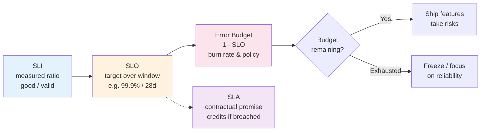
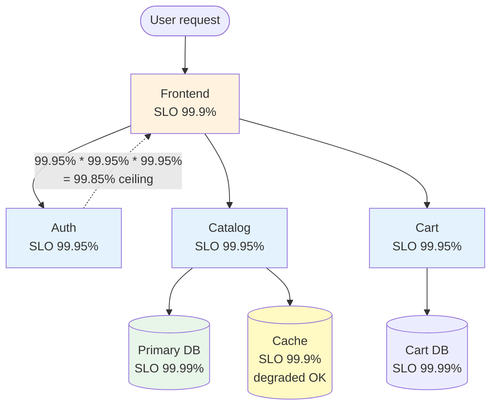
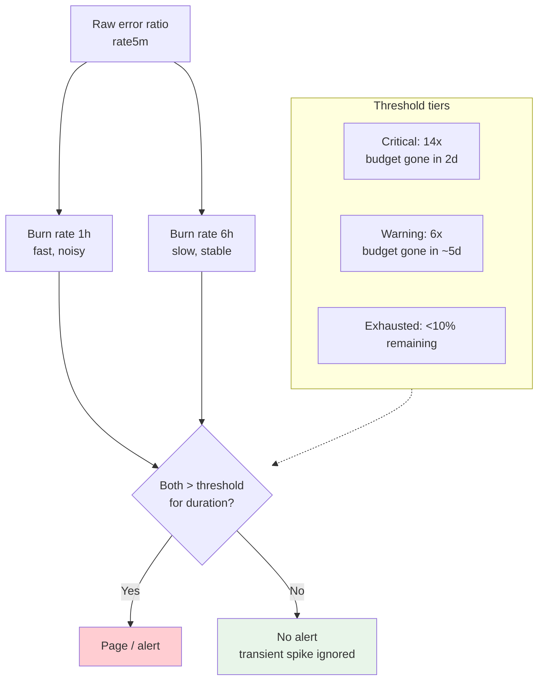

# Chapter 1 — SLIs, SLOs, and Error Budgets

**What this chapter covers.** Reliability without a definition is a wish. Service Level Indicators (SLIs), Service Level Objectives (SLOs), and Error Budgets turn "the service should be reliable" into a measurable, enforceable contract between a service and its consumers — and between engineering and product. This chapter builds the full framework from first principles: how to choose SLIs that reflect user experience, how to set SLOs that balance reliability and velocity, and how to use error budgets to make shipping decisions objectively rather than emotionally. Every concept is grounded in production configuration — OpenSLO / Sloth definitions, Prometheus recording and alerting rules, and multi-window burn-rate alerts — so you can apply it directly.

Learning goals — after this chapter you should be able to:

- Define SLIs precisely for availability, latency, throughput, and correctness, and explain why server-side metrics must approximate the user experience, not the server's convenience.
- Choose SLO targets using the "happy users" method and justify them with data rather than round numbers.
- Compute error budgets, reason about budget consumption, and connect budget state to release policy.
- Write SLOs as code (OpenSLO, Sloth, Pyrra) and wire them to Prometheus recording rules and multi-window, multi-burn-rate alerts.
- Explain the distributed-systems consequences: how per-service SLOs compose (or fail to compose) into user-journey SLOs, and how dependency SLOs propagate.

---

## Why SLOs exist

Every service has two competing pressures: ship features fast and keep the service reliable. Without a shared, quantitative definition of "reliable enough," these pressures resolve through politics — the loudest voice wins, release freezes are declared after outages and quietly lifted under deadline pressure, and reliability work is perpetually deprioritized until the next incident.

SLOs break this cycle by making reliability a budgeted resource, like CPU or money.

The vocabulary, inherited from Google's SRE tradition, is precise:

| Term | Definition | Example |
|------|-----------|---------|
| **SLI** — Service Level Indicator | A measured ratio or percentile over a window: `good_events / valid_events` | "Proportion of HTTP requests that returned 2xx within 300 ms over the last 28 days" |
| **SLO** — Service Level Objective | A target value for an SLI over a rolling window | "99.9% of valid requests succeed within 300 ms over any 28-day window" |
| **SLA** — Service Level Agreement | A contractual commitment with consequences (credits, penalties) | "99.9% monthly uptime or 10% service credit" — negotiated with customers |
| **Error budget** | `1 - SLO` — the allowed fraction of bad events | For a 99.9% SLO, the error budget is 0.1% of valid events |

The critical distinction: the **SLI is the measurement**, the **SLO is the target**, the **SLA is the contract**, and the **error budget is the consequence**. Teams confuse these constantly. An SLI without an SLO is a dashboard. An SLO without an error budget policy is a poster. An SLA without an SLO underneath it is a promise you cannot verify.



*Figure 1-1: The SLO chain. SLIs are measured, SLOs set the target, error budgets drive decisions, and SLAs are the outward contract built on top.*

> **Boundary note.** This chapter defines reliability targets and how to enforce them. How those targets are *observed* — metrics pipelines, Prometheus internals, log aggregation, distributed tracing — is covered in Chapters 2–4. How budget exhaustion translates into *operational* response — incident management, on-call, and postmortems — is covered in Chapters 5–6. Deployment safety mechanisms that consume error budgets are covered in Chapter 9.

---

## SLIs: measuring what matters to users

### The cardinal rule

An SLI must measure the user's experience, not the server's internal state. CPU utilization, queue depth, and replica count are useful signals for capacity planning and alerting, but they are not SLIs — a service can have 40% CPU and still serve 100% errors, or 95% CPU and serve every request correctly. The SLI answers: "of the valid interactions a user attempted, how many were good?"

The canonical form is a ratio:

```
SLI = (good events) / (valid events)   over window W
```

Both numerator and denominator must be defined precisely. Vagueness here produces SLIs that look green while users suffer.

### Choosing the right SLI type

| SLI type | Good event definition | When to use | Pitfall |
|----------|----------------------|-------------|---------|
| **Availability** | Request returned a non-error (2xx/3xx, or application-level success) | Every user-facing service | Counting 4xx as failures punishes the service for client bugs; exclude or separate them |
| **Latency** | Request completed within threshold T | Latency-sensitive paths (search, checkout, feed) | Averages hide tail suffering; always use percentiles |
| **Throughput / freshness** | Data was processed within freshness bound | Pipelines, replication, search indexing | "Throughput" as raw QPS is not an SLI; freshness or lag is |
| **Correctness** | Response was semantically correct | Where wrong answers are worse than errors (payments, recommendations) | Hard to measure automatically; often requires probing or auditing |
| **Durability** | Written data survives failures | Storage systems | Measured over long windows; loss events are rare but catastrophic |

Most services need **two SLIs**: an availability SLI and a latency SLI. Throughput and correctness SLIs are added where the domain demands them. More than four SLIs per service is usually a sign that the service boundary is too broad.

### Availability: what counts as "valid" and "good"

The denominator — valid events — is where most SLI bugs hide. Consider an HTTP API:

- Should health-check probes count? No — they inflate the denominator and mask real errors.
- Should requests that never reached the service (client timeout, DNS failure) count? Only if you can measure them — often you cannot, so be explicit about the measurement point.
- Should 4xx responses count as failures? Generally no for the availability SLI. A `400 Bad Request` or `404 Not Found` is the service behaving correctly given invalid input. But `429 Too Many Requests` is ambiguous — if your rate limiter is too aggressive, users experience it as unavailability. Many teams track `4xx`-excluding-`429` as valid-but-not-failures and alert on `429` rate separately.

A practical HTTP availability SLI:

```
valid_events  = count of requests where response code is not synthetic
                (exclude health checks, exclude canary probes if separately tagged)
good_events   = valid_events where status is 2xx or 3xx
                (or: status < 500, depending on whether you count 4xx as good)
SLI           = good_events / valid_events
```

For gRPC, the mapping uses status codes: `OK` is good, `INVALID_ARGUMENT` / `NOT_FOUND` / `UNAUTHENTICATED` are valid-but-not-failures, `UNAVAILABLE` / `DEADLINE_EXCEEDED` / `INTERNAL` are failures.

### Latency: percentiles, not averages

Latency SLIs must use percentiles. The mean is dominated by the common case and hides the experience of the slowest users — who are often the most valuable (large accounts with more data, users on slow networks, requests that hit cold caches).

A typical latency SLI:

```
good_events  = count of valid requests where duration <= threshold T
               (e.g., T = 300 ms for an API, T = 100 ms for an internal RPC)
SLI          = good_events / valid_events
```

Many teams define two latency SLOs — a strict threshold for the median and a relaxed threshold for the tail:

- 90% of requests complete within 100 ms (p90 SLI).
- 99% of requests complete within 500 ms (p99 SLI).

The implementation matters: Prometheus histograms and summaries compute percentiles differently (see Chapter 2 for the full mechanics). For SLO purposes, prefer histograms with well-chosen buckets so the percentile is computed server-side from bucket counts, not estimated from a sampled summary.

### Data freshness and correctness SLIs

For asynchronous systems — replication pipelines, search indexes, materialized views — the user-visible property is not request latency but **freshness**: how stale is the data the user reads?

```
freshness SLI = proportion of reads where data age < bound B
                (e.g., 99% of reads return data written within 5 seconds)
```

This is measured by injecting synthetic writes with known timestamps and measuring the time until they appear at the read path (a pattern sometimes called "canary documents" or "watermark probes").

Correctness SLIs are the hardest to automate. For a payment service, "the correct amount was charged" requires reconciliation against an expected value. For a search service, "results were relevant" requires human judgment or a proxy metric. Where direct correctness measurement is infeasible, teams use **prober-based SLIs**: synthetic transactions with known expected outcomes, run continuously, whose success rate is the SLI.

---

## SLOs: setting the target

### The SLO is a product decision, not an engineering preference

Setting an SLO at 99.9% because "three nines sounds right" is cargo culting. The correct method is to work backwards from user happiness and business constraints:

1. **Determine the user tolerance.** Through user research, support ticket analysis, or experimentation, find the reliability level below which users notice and complain, churn, or lose trust. For many consumer services this is around 99.5–99.9%. For infrastructure services consumed by other services, it may be 99.95–99.99%.

2. **Check what you actually achieve.** Measure the current SLI over the last 1–3 months. If you are already at 99.95% with no special effort, setting the SLO at 99.9% ratifies reality and gives you budget to move faster. Setting it at 99.99% when you have never exceeded 99.9% creates permanent budget deficit and alert fatigue.

3. **Consider the cost of each additional nine.** Each nine is roughly an order of magnitude more engineering investment. Moving from 99.9% to 99.99% typically requires multi-region failover, automated remediation, and significant architectural changes. The business must decide whether the revenue retained justifies the cost.

4. **Set the window.** The SLO window determines how quickly the budget recovers and how sensitive the SLO is to brief incidents. Common choices:

| Window | Budget recovery | Sensitivity | Use when |
|--------|----------------|-------------|----------|
| 7 days | Fast — one bad day clears in a week | High — a single incident can exhaust the budget | Fast-moving services that want tight feedback |
| 28/30 days | Moderate — the industry default | Balanced | Most user-facing services |
| 90 days | Slow — incidents linger for a quarter | Low — smooths over brief spikes | Infrastructure with infrequent but impactful failures |

Google's practice is 28-day rolling windows. Many teams use 30 days for calendar simplicity. The window should be **rolling** (continuously evaluated), not calendar-aligned — a calendar month SLO that resets on the 1st creates perverse incentives to ship recklessly on the 2nd and freeze on the 29th.

### How many nines do you actually need?

| SLO | Allowed downtime/error | Typical consumer | Architectural implications |
|-----|----------------------|-----------------|---------------------------|
| 99% (two nines) | 7.2 h/month, 3.65 d/year | Internal batch jobs, best-effort features | Single zone, manual remediation acceptable |
| 99.9% (three nines) | 43 m/month, 8.76 h/year | Most user-facing web services | Multi-zone, automated failover, on-call |
| 99.95% | 21 m/month, 4.38 h/year | Payment processing, critical APIs | Multi-zone, fast detection, runbooks tested |
| 99.99% (four nines) | 4.3 m/month, 52 m/year | Infrastructure primitives (DNS, load balancer) | Multi-region, automated remediation, chaos tested |
| 99.999% (five nines) | 26 s/month, 5.26 m/year | Telephony, medical devices | Active-active, formal verification territory |

The key insight: **100% is the wrong SLO for almost everything.** It implies zero error budget, which means no deploys, no experiments, and no changes can ever be made without violating the objective. Worse, it forces engineers to optimize for reliability beyond the point where users benefit, at the expense of features users actually want. An SLO deliberately acknowledges that some unreliability is acceptable — and that the budget for it should be spent intentionally.

### SLOs for internal and dependency services

A user-facing service depends on many internal services. Its availability cannot exceed the joint availability of its critical dependencies. If service A depends on B and C in series (both must succeed for A to succeed):

```
A_availability <= B_availability * C_availability
```

If B is 99.9% and C is 99.9%, A cannot exceed 99.8% even if A itself never fails. This has two consequences:

- Internal services that sit on many critical paths need **tighter SLOs** than the user-facing services that depend on them. A common pattern is to set internal SLOs one nine tighter than the external SLO (external 99.9%, internal 99.95%).
- Dependency budgets must account for **fan-out**. A frontend that calls 10 microservices, each at 99.99%, still has a theoretical ceiling of 99.9% if any single dependency failure fails the request. Reducing critical-path fan-out, adding fallbacks, and making dependencies non-blocking are reliability strategies that directly improve the achievable SLO.



*Figure 1-2: SLO composition. Internal dependencies need tighter SLOs than the frontend they support. A non-critical dependency like the cache can have a looser SLO if the service degrades gracefully without it.*

---

## Error budgets: the mechanism that makes SLOs actionable

### Computing the budget

The error budget is the complement of the SLO:

```
error_budget = 1 - SLO_target
```

For a 99.9% SLO over 28 days with 10 million valid requests in the window:

```
budget = 0.001 * 10,000,000 = 10,000 bad requests allowed per 28 days
```

For time-based SLIs (common for availability measured in seconds):

```
budget_seconds = (1 - 0.999) * 28 * 24 * 3600 = 2,419 seconds (~40 minutes) of downtime per 28 days
```

Budget is consumed by bad events. When a 5-minute outage causes 2% of requests to fail, and the service handles ~250 requests/second:

```
consumed = 0.02 * 250 * 300 = 1,500 requests
budget_remaining = 10,000 - 1,500 = 8,500
burn_rate = consumed / elapsed_budget  (are we burning faster than the SLO allows?)
```

### Burn rate

Burn rate compares the current error rate to the budgeted error rate:

```
burn_rate = (current_error_rate) / (budgeted_error_rate)
          = (current_error_rate) / (1 - SLO)
```

- `burn_rate = 1` — burning exactly at the rate the SLO allows. You will exhaust the budget precisely at the end of the window if this continues.
- `burn_rate = 10` — burning 10x faster than allowed. At this rate the 28-day budget is consumed in 2.8 days.
- `burn_rate < 1` — under budget, accumulating headroom.

Burn rate is the correct quantity to alert on, not raw error rate, because it normalizes across SLO tightness. A 1% error rate is catastrophic for a 99.99% SLO (burn rate 100x) but tolerable for a 99% SLO (burn rate 1x).

### Error budget policy

An SLO without a policy is unenforceable. The policy connects budget state to concrete actions:

| Budget state | Policy |
|-------------|--------|
| > 50% remaining | Normal operations. Ship features, run experiments, accept risk. |
| 25–50% remaining | Caution. Require additional review for risky changes. Prioritize reliability work in the next sprint. |
| 0–25% remaining | Restrict deploys to fixes and low-risk changes. Reliability work takes priority over features. |
| Exhausted (≤ 0%) | Freeze non-essential releases. All effort goes to reliability until the window rolls forward and budget recovers. |

The freeze is not a punishment — it is the mechanism that makes the SLO credible. If the team ships through budget exhaustion without consequence, the SLO was never real. Conversely, if the budget is consistently under-consumed (e.g., 80% remaining every window), the SLO is too loose — tighten it or acknowledge that the service is more reliable than required and reallocate effort.

> **Practical nuance.** Most organizations implement budget policy as a **conversation**, not an automated gate. A hard deploy freeze triggered by budget exhaustion can block a security fix or a reliability improvement. The policy should require explicit, documented approval to ship while over budget — with the approver accepting the risk — rather than an unbreakable lock.

### Budget visibility

Every team should have a dashboard that shows, at a glance:

- Current SLI value over the SLO window (are we above or below the target?).
- Budget remaining (absolute count and percentage).
- Budget burn rate over the last 1 hour and 6 hours (are we currently burning fast?).
- Projected exhaustion time at the current burn rate.

This is not optional instrumentation — without it, error budgets are numbers in a document that nobody checks until after an incident.

---

## SLOs as code: from YAML to Prometheus

SLOs must be version-controlled, reviewed, and applied declaratively — just like any other infrastructure. Three widely used approaches are OpenSLO, Sloth, and Pyrra. All three generate Prometheus recording and alerting rules from a higher-level SLO definition.

### OpenSLO

OpenSLO is a vendor-neutral specification (v2alpha1 as of 2024) for declaring SLOs in YAML. It separates the SLI definition, the SLO target, and the alerting configuration:

```yaml
# openslo.yaml — OpenSLO v2alpha1 definition
apiVersion: openslo/v1alpha
kind: SLO
metadata:
  name: http-availability
  displayName: HTTP Availability
spec:
  description: 99.9% of valid HTTP requests return non-5xx over 28 days
  service: web-api
  budgetingMethod: Occurrences  # vs. Timeslices
  objectives:
    - displayName: availability-28d
      target: 0.999
      op: gte
      timeWindow:
        duration: 28d
        isRolling: true
      indicator:
        metadata:
          name: http-availability-sli
        spec:
          ratioMetric:
            counter: true
            good:
              source: prometheus
              queryType: promql
              query: |
                sum(rate(http_requests_total{service="web-api",code=~"2..|3.."}[5m]))
            total:
              source: prometheus
              queryType: promql
              query: |
                sum(rate(http_requests_total{service="web-api",code!~"5..",job!~"healthcheck"}[5m]))
  alertPolicies:
    - name: availability-burn-rate
      alertName: HighErrorBudgetBurn
      alertDesc: "Burn rate {{ .burnRate }}x — budget will exhaust in {{ .timeToExhaustion }}"
```

For latency, the SLI uses histogram buckets — the good events are those within the threshold:

```yaml
  # Latency SLI fragment — 90% of requests under 300 ms
  indicator:
    spec:
      ratioMetric:
        counter: true
        good:
          source: prometheus
          queryType: promql
          query: |
            sum(rate(http_request_duration_seconds_bucket{
              service="web-api",le="0.3"}[5m]))
        total:
          source: prometheus
          queryType: promql
          query: |
            sum(rate(http_request_duration_seconds_count{
              service="web-api"}[5m]))
```

### Sloth

Sloth generates Prometheus recording and alerting rules from a simpler SLO manifest. It is widely used where OpenSLO's generality is more than needed:

```yaml
# sloth.yaml — Sloth SLO manifest
version: "prometheus/v1"
service: "web-api"
labels:
  team: platform
  tier: "1"
slos:
  - name: "http-availability"
    objective: 99.9
    description: "99.9% of valid HTTP requests succeed"
    sli:
      events:
        error_query: |
          sum(rate(http_requests_total{service="web-api",code=~"5.."}[5m]))
        total_query: |
          sum(rate(http_requests_total{service="web-api",code!~"healthcheck"}[5m]))
    alerting:
      name: WebApiAvailability
      labels:
        severity: critical
        team: platform
      annotations:
        summary: "High error budget burn for web-api availability"

  - name: "http-latency-p99"
    objective: 99
    description: "99% of requests complete within 300 ms"
    sli:
      events:
        error_query: |
          sum(rate(http_request_duration_seconds_bucket{service="web-api",le="0.3"}[5m]))
        total_query: |
          sum(rate(http_request_duration_seconds_count{service="web-api"}[5m]))
      # Note: for latency the error_query counts GOOD events; Sloth's
      # events model computes SLI as 1 - (error/total), so invert accordingly.
      # Alternatively use the raw query mode:
    alerting:
      name: WebApiLatency
      labels:
        severity: warning

  - name: "http-latency-p99-raw"
    objective: 99
    description: "99% of requests under 300 ms (raw form)"
    sli:
      raw:
        error_ratio_query: |
          (
            sum(rate(http_request_duration_seconds_count{service="web-api"}[5m]))
            -
            sum(rate(http_request_duration_seconds_bucket{service="web-api",le="0.3"}[5m]))
          )
          /
          sum(rate(http_request_duration_seconds_count{service="web-api"}[5m]))
    alerting:
      name: WebApiLatencyRaw
      labels:
        severity: warning
```

Applied with:

```bash
sloth generate -i ./sloth.yaml -o ./prometheus-rules/
# Produces prometheus-rules/web-api.yml with recording + alerting rules
```

### What Sloth / OpenSLO generate: Prometheus rules

Whether authored via OpenSLO, Sloth, or hand-written, the generated Prometheus rules follow a consistent pattern — recording rules that precompute SLI values and burn rates, and alerting rules that fire on multi-window burn conditions:

```yaml
# prometheus-rules/web-api-slos.yml — generated recording + alerting rules
groups:
  - name: slos-web-api-availability
    interval: 30s
    rules:
      # --- Recording rules: precompute SLI components ---

      # Total valid request rate (denominator)
      - record: sli:http_requests:valid:rate5m
        expr: |
          sum(rate(http_requests_total{service="web-api",code!~"healthcheck"}[5m]))

      # Good request rate (numerator) — non-5xx
      - record: sli:http_requests:good:rate5m
        expr: |
          sum(rate(http_requests_total{service="web-api",code=~"2..|3..|4.."}[5m]))

      # Instantaneous error ratio
      - record: sli:http_availability:error_ratio:rate5m
        expr: |
          1 - (sli:http_requests:good:rate5m / sli:http_requests:valid:rate5m)

      # SLI over the full SLO window (28 days) — for dashboard + budget calc
      - record: sli:http_availability:sli_28d
        expr: |
          1 - (
            sum(increase(http_requests_total{service="web-api",code=~"5.."}[28d]))
            /
            sum(increase(http_requests_total{service="web-api",code!~"healthcheck"}[28d]))
          )

      # Budget remaining (0 = exhausted, 1 = full)
      - record: sli:http_availability:budget_remaining
        expr: |
          (sli:http_availability:sli_28d - 0.999) / (1 - 0.999)

      # Burn rates at two horizons — short (fast detection) and long (confirmation)
      - record: sli:http_availability:burn_rate_1h
        expr: |
          sli:http_availability:error_ratio:rate5m / (1 - 0.999)
      - record: sli:http_availability:burn_rate_6h
        expr: |
          (
            sum(increase(http_requests_total{service="web-api",code=~"5.."}[6h]))
            /
            sum(increase(http_requests_total{service="web-api",code!~"healthcheck"}[6h]))
          ) / (1 - 0.999)

  - name: slos-web-api-availability-alerts
    interval: 30s
    rules:
      # Multi-window, multi-burn-rate alerts (SRE Workbook pattern)
      # Page only when BOTH short and long windows confirm high burn.

      # Critical: burning at 14x — 28d budget gone in 2 days
      - alert: HighErrorBudgetBurnCritical
        expr: |
          sli:http_availability:burn_rate_1h > 14
          and
          sli:http_availability:burn_rate_6h > 14
        for: 5m
        labels:
          severity: critical
        annotations:
          summary: "Critical burn rate {{ $value | humanize }}x for web-api availability"
          description: "At this rate the 28-day error budget is consumed in ~2 days."

      # Warning: burning at 6x — budget gone in ~4.7 days
      - alert: HighErrorBudgetBurnWarning
        expr: |
          sli:http_avability:burn_rate_1h > 6
          and
          sli:http_availability:burn_rate_6h > 6
        for: 15m
        labels:
          severity: warning
        annotations:
          summary: "Elevated burn rate {{ $value | humanize }}x for web-api availability"

      # Exhaustion warning: budget nearly gone regardless of burn rate
      - alert: ErrorBudgetExhausted
        expr: |
          sli:http_availability:budget_remaining < 0.1
        for: 10m
        labels:
          severity: warning
        annotations:
          summary: "Less than 10% error budget remaining for web-api"
```

### Multi-window, multi-burn-rate alerting

The pattern above — alerting only when both a short window (1 hour) and a long window (6 hours) agree that burn rate is high — is the standard technique from the SRE Workbook (Chapter 5). It solves a fundamental tension:

- Alerting on a short window alone is **fast but noisy** — a brief spike pages someone even though the 28-day budget is barely affected.
- Alerting on a long window alone is **accurate but slow** — by the time the 6-hour average confirms the problem, significant budget has already been consumed.

Requiring both windows to exceed the threshold gives fast detection (the 1-hour window) with confirmation (the 6-hour window), dramatically reducing false positives while preserving responsiveness.



*Figure 1-3: Multi-window burn-rate alerting. Both the short and long window must agree before paging, suppressing transient spikes without sacrificing detection speed.*

### Pyrra (Kubernetes-native alternative)

Pyrra manages SLOs as Kubernetes custom resources and auto-generates both Prometheus rules and Grafana dashboards:

```yaml
# pyrra ServiceLevelObjective CR
apiVersion: pyrra.dev/v1alpha1
kind: ServiceLevelObjective
metadata:
  name: web-api-availability
  namespace: monitoring
  labels:
    prometheus: k8s
    role: alert-rules
spec:
  target: "99.9"
  window: 28d
  indicator:
    ratio:
      errors:
        metric: http_requests_total{code=~"5..",service="web-api"}
      total:
        metric: http_requests_total{service="web-api"}
  alerting:
    burnrates: true
```

```bash
kubectl apply -f slo-availability.yaml
# Pyrra operator generates PrometheusRule + Grafana dashboard automatically
kubectl get prometheusrule -n monitoring
```

Choose based on your platform: OpenSLO for vendor-neutral portability, Sloth for Prometheus-centric simplicity, Pyrra for Kubernetes-native GitOps.

---

## SLOs in a distributed system

### User-journey SLOs vs. service SLOs

Service-level SLOs (one per microservice) are necessary but not sufficient. Users experience **journeys** — sequences of service calls that together accomplish a goal (search → view product → add to cart → checkout). A journey SLO is measured at the edge (the frontend or API gateway) and reflects the actual user experience across all dependencies.

```
journey SLI = good_journeys / valid_journeys
  where a journey is good only if every step succeeded within its latency bound
```

Journey SLOs are harder to instrument — they require either end-to-end synthetic probes or careful propagation of journey context through the call graph — but they are the SLOs that correlate most directly with user satisfaction and business metrics.

A common structure is two tiers:

- **Journey SLOs** (2–4 per product, e.g., "99.9% of checkout journeys succeed within 3 seconds") — owned by product teams, measured at the edge.
- **Service SLOs** (one or two per service) — owned by service teams, measured at the service boundary, with targets derived from the journey SLOs they contribute to.

### Error budget distribution

When a user-facing journey has a 99.9% SLO (0.1% budget) and depends on 5 services in series, the budget must be **allocated** across those services. Naive equal allocation gives each service a 0.02% budget (99.98% SLO), which may be unachievable for some and wastefully loose for others.

A better approach allocates budget proportionally to each service's **contribution to journey failure** — services with higher historical error rates or greater architectural complexity receive more budget, while inherently reliable services (e.g., a cache that can be bypassed) receive less. This allocation is revisited periodically as architecture and reliability evolve.

For services behind fan-out (the frontend calls 10 services in parallel, and any failure fails the journey), the math is harsher:

```
P(journey succeeds) = P(all parallel calls succeed)   (if no fallbacks)
                    = product of individual availabilities
```

Adding fallbacks, graceful degradation, and making non-critical dependencies non-blocking are the primary tools for improving journey SLOs without requiring every dependency to achieve extreme reliability.

### The distributed tracing connection

Accurate journey SLIs require knowing which service caused a journey to fail — and that requires distributed tracing (Chapter 4). Without traces, an SLO dashboard can tell you *that* the checkout journey is failing but not *which* service is responsible, forcing incident responders to check every dependency dashboard sequentially. With traces, the journey SLI can be broken down by contributing service, and error budget attribution becomes automatic.

---

## Common failure modes

**Too many SLOs.** A service with 8 SLOs has 8 error budgets to track, 8 sets of alerts, and 8 policies to enforce. Nobody can reason about that. Two SLOs (availability + latency) per service is the right default. Add a third only when a distinct user-visible property (freshness, correctness, durability) demands it.

**SLIs that measure the wrong thing.** An SLI based on server-side success rate will look healthy even when users experience failures caused by client-side issues (DNS, CDN, TLS errors) or by load balancer rejections that never reach the server. Measure as close to the user as possible — at the edge load balancer or via Real User Monitoring (RUM) — and reconcile with server-side SLIs to identify the gap.

**Alerting on SLOs without burn-rate context.** Firing an alert every time the instantaneous error rate exceeds the SLO threshold creates noise during brief spikes that barely affect the 28-day budget. Always alert on burn rate with multi-window confirmation.

**Treating the SLO as a target to hit rather than a lower bound.** Teams that consistently achieve 99.99% against a 99.9% SLO sometimes relax their practices because "we have budget." The SLO is a floor, not a ceiling — consistently exceeding it is good, and the surplus budget is an opportunity to take well-judged risks, not to become complacent.

**Setting SLOs before measuring.** An SLO set without historical data is a guess. Measure the current SLI for at least one full window before setting the target. The initial SLO should usually be set at or slightly below the current measured value, then tightened as reliability improves.

---

## Key takeaways

- An SLI measures the user's experience as `good_events / valid_events` over a window; an SLO is the target for that ratio; the error budget (`1 - SLO`) is the allowed fraction of bad events; an SLA is the contractual promise built on top.
- Availability and latency (using percentiles, never averages) cover most services; freshness and correctness SLIs are added for pipelines and systems where wrong answers are worse than errors.
- SLO targets should be set from user tolerance and measured reality, not round numbers. 100% is almost never the right target — it implies zero budget for change.
- Error budgets make reliability actionable: they connect budget state to release policy, and burn rate (`current_error_rate / budgeted_error_rate`) is the correct quantity to alert on.
- Multi-window, multi-burn-rate alerting (requiring both a short and long window to agree) gives fast detection with low noise — the standard pattern from the SRE Workbook.
- SLOs should be declared as code (OpenSLO, Sloth, or Pyrra), version-controlled, and compiled into Prometheus recording and alerting rules.
- In a distributed architecture, internal services on critical paths need tighter SLOs than the user-facing journeys that depend on them; journey SLOs measured at the edge are the ground truth for user experience.

---

## Further reading

- Google SRE Book, Chapter 4 — *Service Level Objectives* (https://sre.google/sre-book/service-level-objectives/) — the foundational treatment of SLIs, SLOs, and error budgets.
- Google SRE Workbook, Chapter 5 — *Alerting on SLOs* (https://sre.google/workbook/alerting-on-slos/) — the definitive guide to multi-window burn-rate alerting, with worked examples.
- OpenSLO Specification v2alpha1 (https://openslo.cloud/) — vendor-neutral SLO-as-code spec.
- Sloth — Easy SLO generation for Prometheus (https://sloth.dev/) — practical SLO-as-code for Prometheus-centric stacks.
- Pyrra — SLOs with Prometheus (https://pyrra.dev/) — Kubernetes-native SLO management.
- optimizer: SLO optimizer notebook (https://github.com/metalmatze/slo-libsonnet, https://github.com/google/slo-burn) — tools for analyzing historical data to choose SLO targets.
- Niall Murphy et al., *Site Reliability Engineering* (O'Reilly, 2016) and *The Site Reliability Workbook* (O'Reilly, 2018) — Chapters 4–6 of the SRE Book and Chapters 5–6 of the Workbook are the canonical references for this chapter's material.
