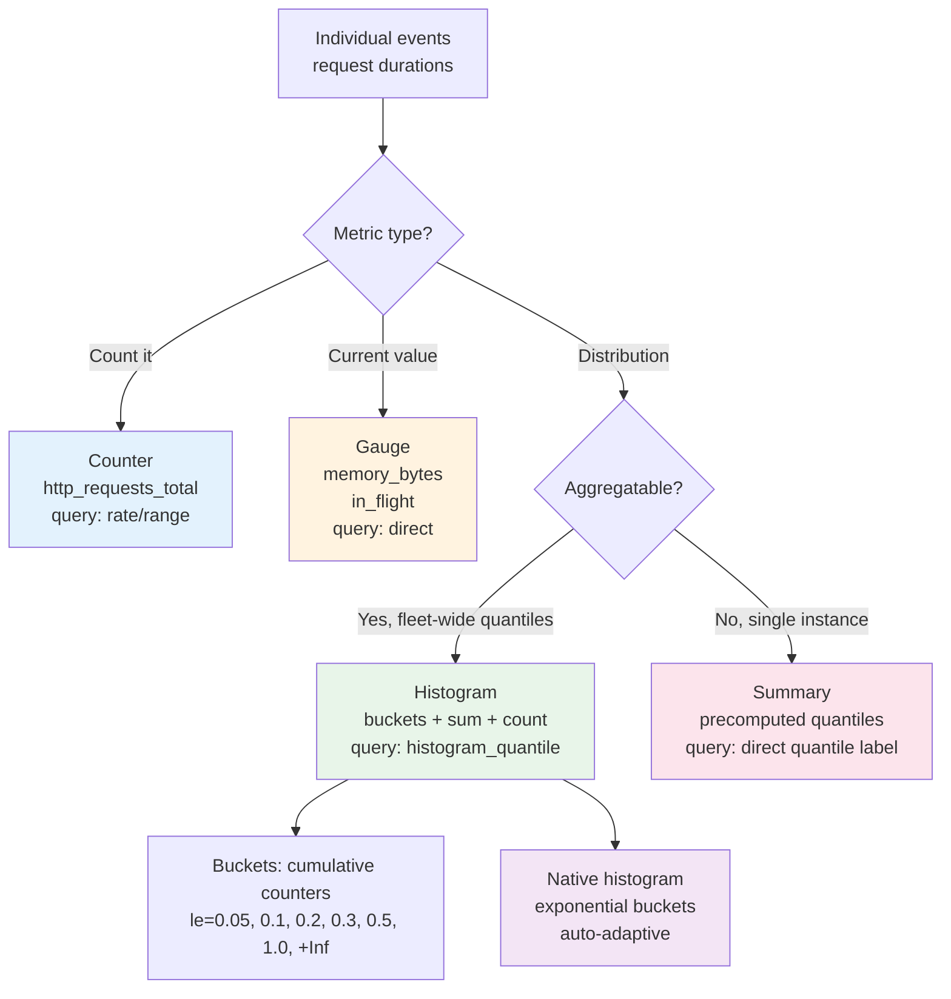
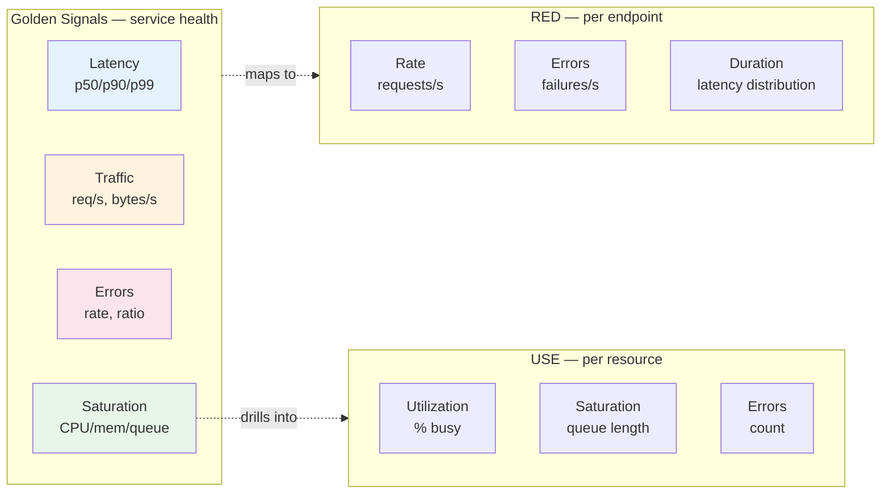
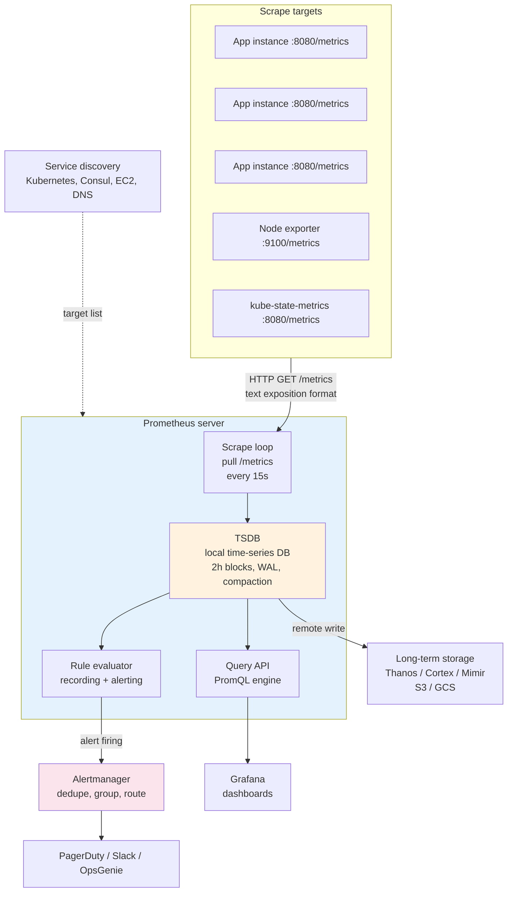
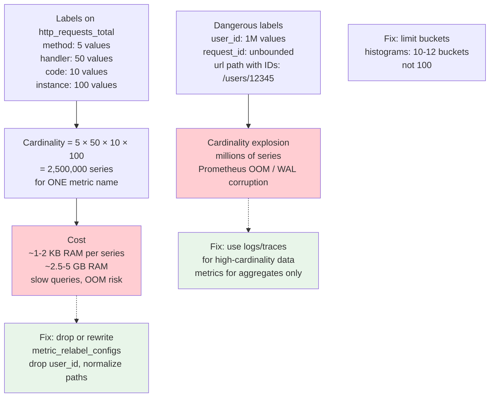
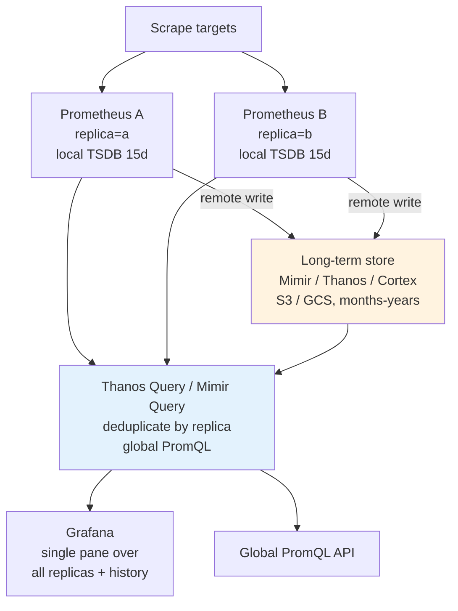
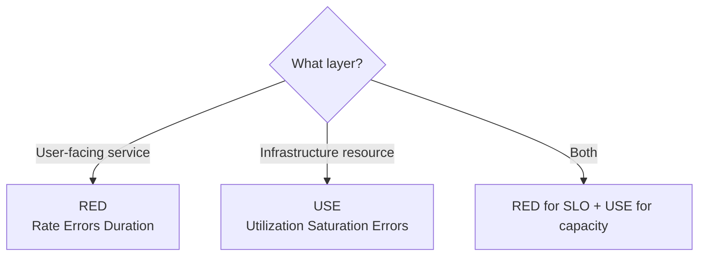

# Chapter 2 — Metrics and the Golden Signals

**What this chapter covers.** Metrics are the primary sensory system of any production backend — the numerical time series that tell you whether the system is healthy, where it is struggling, and how it behaved during the last incident. This chapter covers the full metrics pipeline from instrumentation to collection to storage to alerting, grounded in the Prometheus ecosystem that dominates cloud-native observability. You will learn the four metric types and when to use each, why histograms and summaries are not interchangeable, how the four Golden Signals (latency, traffic, errors, saturation) organize dashboards and alerts, and how to build recording rules, alerting rules, and PromQL queries that remain accurate at scale. Every abstraction is connected to running configuration — Prometheus scrape configs, recording and alerting rules, Grafana dashboards, and Pushgateway and federation patterns for distributed deployments.

Learning goals — after this chapter you should be able to:

- Distinguish counter, gauge, histogram, and summary metric types and choose correctly for any signal, explaining the monotonicity, aggregation, and cardinality implications of each.
- Explain the difference between histograms and summaries for latency measurement, including bucket selection, quantile computation, and why summaries cannot be aggregated across instances.
- Apply the four Golden Signals (and the complementary USE and RED methods) to design dashboards and alerts for any service.
- Write PromQL queries for SLI computation, burn-rate alerting, capacity forecasting, and anomaly detection, and explain range vectors, instant vectors, and subquery evaluation.
- Configure Prometheus for production — scrape targets, service discovery, relabeling, federation, remote write, and high-availability — and reason about storage, retention, and cardinality costs.
- Diagnose common metrics failure modes: cardinality explosion, stale series, counter resets, histogram bucket misconfiguration, and scrape aliasing.

---

## Why metrics

A backend system produces three kinds of observability data: metrics (numbers over time), logs (discrete events), and traces (request-scoped causality). Metrics are the coarsest but most universally available signal. Every production system — from a single binary on a VM to a thousand microservices on Kubernetes — can expose a `/metrics` endpoint and be scraped. Metrics answer the first question in any incident — "is something wrong, and roughly where?" — before anyone opens a log viewer or trace waterfall.

The defining properties of metrics are:

- **Numerical and temporal.** Each data point is a float (or integer) at a timestamp. This makes metrics amenable to mathematical operations: rates, percentiles, aggregations, derivatives, forecasting.
- **Pre-aggregated and lossy.** Unlike logs and traces, which record individual events, metrics collapse many events into summary statistics (counts, sums, bucket distributions). You gain efficiency and lose detail — a counter tells you 1,000 requests failed but not which ones or why.
- **Cheap to store and fast to query.** A well-designed metrics pipeline retains months of data at second or minute granularity and answers queries in milliseconds, precisely because individual events have been aggregated away.

The trade-off is fundamental: metrics tell you *that* something is wrong and *how much*, but not *why* for a specific request. That "why" requires logs (Chapter 3) and traces (Chapter 4). The three pillars are complementary, not competing.

---

## Metric types: the four primitives

Prometheus defines four metric types. Choosing the wrong type produces metrics that look correct on a dashboard but give wrong answers when aggregated or alerted on. The type determines the wire format, the query semantics, and the aggregation behavior.

### Counter

A counter is a monotonically increasing cumulative value — it only goes up (and resets to zero on process restart). It represents the total count or sum of events since the process started.

```
# HELP http_requests_total Total HTTP requests by status and method.
# TYPE http_requests_total counter
http_requests_total{method="GET",code="200"} 48213
http_requests_total{method="GET",code="500"} 127
http_requests_total{method="POST",code="200"} 8934
```

Use a counter for anything you want to count or sum: requests, errors, bytes transferred, tasks completed. The key property is that the **rate of increase** is the useful signal, not the absolute value. You query counters with `rate()` or `increase()`:

```promql
# Request rate per second over the last 5 minutes, by status code
sum by (code) (rate(http_requests_total[5m]))

# Error rate as a fraction of total traffic
sum(rate(http_requests_total{code=~"5.."}[5m]))
/
sum(rate(http_requests_total[5m]))
```

> **Counter resets.** When a process restarts, its counters reset to zero. `rate()` and `increase()` handle this automatically by detecting decreases and compensating — but only if the reset is visible within the range window. A range window shorter than the scrape interval can miss resets and produce incorrect rates. Always use a range window of at least `4 * scrape_interval`.

### Gauge

A gauge is a value that can go up or down arbitrarily. It represents a point-in-time measurement.

```
# HELP process_resident_memory_bytes Resident memory size.
# TYPE process_resident_memory_bytes gauge
process_resident_memory_bytes 134217728

# HELP http_requests_in_flight Current in-flight HTTP requests.
# TYPE http_requests_in_flight gauge
http_requests_in_flight{handler="/api/search"} 42

# HELP node_cpu_seconds_total Seconds of CPU time by mode (actually a counter, despite the name)
```

Use a gauge for: current resource utilization (memory, CPU, disk), queue depth, number of in-flight requests, pool sizes, temperatures, feature-flag states. Gauges are queried directly — no `rate()` needed:

```promql
# Memory usage per instance
process_resident_memory_bytes / 1024 / 1024  # in MiB

# 95th percentile of in-flight requests over 10 minutes
quantile_over_time(0.95, http_requests_in_flight[10m])
```

The critical distinction: **a counter measures events, a gauge measures state.** If you can meaningfully ask "how many have happened so far?" it is a counter. If you ask "what is the current value?" it is a gauge. Confusing the two — for example, using a gauge to count requests by incrementing it — breaks `rate()` and makes the metric unaggregatable.

### Histogram

A histogram samples observations (typically request durations or response sizes) and counts them into configurable buckets. It exposes multiple time series per metric: one counter per bucket boundary, plus `_sum` and `_count`.

```
# HELP http_request_duration_seconds HTTP request latency.
# TYPE http_request_duration_seconds histogram
http_request_duration_seconds_bucket{le="0.05"} 24054
http_request_duration_seconds_bucket{le="0.1"}  33444
http_request_duration_seconds_bucket{le="0.2"}  38034
http_request_duration_seconds_bucket{le="0.5"}  39204
http_request_duration_seconds_bucket{le="1.0"}  39830
http_request_duration_seconds_bucket{le="+Inf"} 40000
http_request_duration_seconds_sum  4123.53
http_request_duration_seconds_count 40000
```

Each `le` (less-than-or-equal) bucket is **cumulative** — `le="0.5"` counts all observations ≤ 500 ms, including those already counted in `le="0.05"`, `le="0.1"`, and `le="0.2"`. The `+Inf` bucket always equals `_count`.

Histograms are the correct type for measuring **distributions** — latency, request size, queue wait time — where you need to compute quantiles. The quantile is computed server-side via `histogram_quantile()`:

```promql
# p99 latency over the last 5 minutes
histogram_quantile(0.99,
  sum by (le) (rate(http_request_duration_seconds_bucket[5m]))
)

# p50 latency per handler
histogram_quantile(0.50,
  sum by (le, handler) (rate(http_request_duration_seconds_bucket[5m]))
)
```

**Bucket selection is the most important histogram design decision.** Buckets that are too coarse lose resolution where it matters; buckets that are too fine create cardinality explosion. Choose buckets that are dense around your SLO thresholds and expected latency range:

```go
// Go — histogram with buckets tuned for an API with a 300 ms SLO
var httpDuration = prometheus.NewHistogramVec(
    prometheus.HistogramOpts{
        Name:    "http_request_duration_seconds",
        Help:    "HTTP request latency by handler and method.",
        Buckets: []float64{0.005, 0.01, 0.025, 0.05, 0.1, 0.2, 0.3, 0.5, 1.0, 2.5, 5.0},
        //                ^^^^^ fine near SLO threshold (0.3s) ^^^^
    },
    []string{"method", "handler", "code"},
)
```

For workloads with wide dynamic range (caches that serve in microseconds and fall back to seconds), consider **exponential buckets** or Prometheus native histograms (see below).

### Summary

A summary also samples observations but computes quantiles **client-side** (inside the instrumented process) using a streaming quantile estimator. It exposes precomputed quantiles directly:

```
# HELP rpc_duration_seconds RPC latency summary.
# TYPE rpc_duration_seconds summary
rpc_duration_seconds{quantile="0.5"}  0.045
rpc_duration_seconds{quantile="0.9"}  0.112
rpc_duration_seconds{quantile="0.99"} 0.342
rpc_duration_seconds_sum  4123.53
rpc_duration_seconds_count 40000
```

Summaries have one advantage: no bucket configuration needed, and quantiles are computed with higher accuracy for a single instance. But they have a critical limitation that makes them unsuitable for most distributed systems:

> **Summaries cannot be aggregated across instances.** The p99 of instance A and the p99 of instance B cannot be combined to produce the p99 of A+B. Averaging quantiles is mathematically incorrect, and no PromQL function can merge summary quantiles. If you run 10 replicas, you get 10 independent p99 values with no way to compute the fleet-wide p99.

Histograms, by contrast, **can** be aggregated — you sum the bucket counters across instances and then compute the quantile from the merged distribution. This is why **histograms are the default choice for latency in any multi-instance service**, and summaries should only be used for single-instance measurements or where client-side quantile accuracy is more important than aggregatability.

| Property | Histogram | Summary |
|----------|-----------|---------|
| Quantile computed | Server-side (`histogram_quantile`) | Client-side (streaming estimator) |
| Aggregatable across instances | Yes — sum buckets, then quantile | No — quantiles cannot be merged |
| Configuration | Bucket boundaries (chosen by operator) | Quantile objectives + error tolerance |
| Accuracy | Depends on bucket density near the quantile | Higher for single-instance quantiles |
| Cardinality | Buckets × label combinations | Quantiles × label combinations |
| Recommendation | Default for distributed services | Single-instance or leader-only metrics |

### Native histograms (exponential histograms)

Traditional histograms require manually chosen buckets. Prometheus native histograms (stable since Prometheus 2.50+, OpenTelemetry exponential histograms) solve this by using an **exponential bucket scheme** that automatically adapts to the data distribution. They provide higher resolution with lower cardinality and more accurate quantile estimation, especially for wide-dynamic-range signals.

```yaml
# prometheus.yml — enable native histograms
scrape_configs:
  - job_name: 'web-api'
    scrape_interval: 15s
    scrape_protocols: ["OpenMetricsText1.0.0", "OpenMetricsText0.0.4", "PrometheusText0.0.4"]
    enable_native_histograms: true
```

```go
// Go — native histogram (requires prometheus client >= 1.19)
var httpDurationNative = prometheus.NewHistogramVec(
    prometheus.HistogramOpts{
        Name:                        "http_request_duration_seconds",
        Help:                        "HTTP request latency (native histogram).",
        NativeHistogramBucketFactor: 1.1,  // ~10% bucket width growth
        NativeHistogramMaxBuckets:   160,
    },
    []string{"method", "handler"},
)
```

Native histograms are the future for latency measurement but require compatible visualization (Grafana ≥ 10.4) and careful migration — you cannot mix classic and native histogram queries without handling both.



*Figure 2-1: Choosing the metric type. Counters for events, gauges for state, histograms for distributions that need fleet-wide quantiles, summaries only when aggregation is not needed.*

---

## The Golden Signals

Google's SRE discipline organizes monitoring around four Golden Signals — the minimum set of metrics that, if healthy, mean the service is healthy, and if unhealthy, tell you where to look next. They are not the only metrics you need, but they are the first dashboard you open and the first alerts you configure.

### The four signals

| Signal | What it measures | Typical metric | Alert condition |
|--------|-----------------|----------------|-----------------|
| **Latency** | Time to process a request, by percentile | Histogram: `http_request_duration_seconds` | p99 exceeds SLO threshold; or p50 degrades (indicates systemic slowdown) |
| **Traffic** | Demand on the service — request rate, data rate | Counter: `http_requests_total` | Sudden drop (upstream failure) or spike (abuse, retry storm) |
| **Errors** | Rate of failed requests | Counter: `http_requests_total{code=~"5.."}` or application error counter | Error rate or burn rate exceeds threshold |
| **Saturation** | How "full" the service is — resource exhaustion | Gauges: CPU, memory, disk, thread pools, queue depth, connection pools | Saturation approaching 100% — predicts imminent failure |

Two complementary frameworks organize the same signals differently:

- **USE** (Utilization, Saturation, Errors) — Brendan Gregg's method for **resources** (CPU, memory, disk, network). For each resource: is it utilized, is it saturated (queued work), are there errors?
- **RED** (Rate, Errors, Duration) — Tom Wilkie's method for **request-driven services**. For each service endpoint: what is the request rate, error rate, and duration distribution?

In practice you need all three lenses: Golden Signals for service health, USE for infrastructure, RED for per-endpoint service behavior.



*Figure 2-2: Three complementary lenses. Golden Signals give the service-level health check, RED breaks it down per endpoint, and USE explains saturation by drilling into each resource.*

### Latency in detail

Latency is the most nuanced Golden Signal because a single number cannot represent a distribution. At minimum, track three percentiles:

- **p50 (median)** — the typical experience. A p50 regression indicates a systemic slowdown affecting most users.
- **p90 or p95** — the experience of users having a noticeably slow interaction.
- **p99 (or p99.9)** — the tail. Tail latency is often dominated by a different cause than median latency (GC pauses, cold caches, retry amplification, noisy neighbors) and requires separate investigation.

```promql
# p50, p90, p99 latency — the standard latency panel
histogram_quantile(0.50, sum by (le) (rate(http_request_duration_seconds_bucket[5m])))
histogram_quantile(0.90, sum by (le) (rate(http_request_duration_seconds_bucket[5m])))
histogram_quantile(0.99, sum by (le) (rate(http_request_duration_seconds_bucket[5m])))

# Latency per handler — identifies which endpoint is slow
histogram_quantile(0.99,
  sum by (le, handler) (rate(http_request_duration_seconds_bucket[5m]))
)

# Latency heatmap — bucket fill rate over time (for Grafana heatmap panel)
sum by (le) (rate(http_request_duration_seconds_bucket[5m]))
```

> **Bimodal distributions hide behind percentiles.** If your p50 is 20 ms and your p99 is 2 seconds, the mean and even p90 may look healthy. Always visualize the full distribution (heatmap of bucket fill rates over time) alongside percentile lines. A bimodal latency distribution — fast cache hits and slow cache misses — appears as two distinct bands in a heatmap but is invisible in a single percentile.

### Traffic

Traffic measures demand. For an HTTP service it is requests per second; for a streaming service it is messages or bytes per second; for a database it is queries per second. Traffic is essential context for the other three signals — an error rate of 10/second means something very different at 100 requests/second (10% failure) versus 10,000 requests/second (0.1% failure).

```promql
# Total request rate
sum(rate(http_requests_total[5m]))

# Request rate per handler — identifies hot endpoints
sum by (handler) (rate(http_requests_total[5m]))

# Traffic composition — for capacity planning
sum by (method) (rate(http_requests_total[5m]))
```

Traffic anomalies are often the first sign of trouble: a sudden drop may mean an upstream service stopped sending traffic (or DNS broke); a sudden spike may mean a retry storm, a scrape loop, or an abuse pattern.

### Errors

Errors are failed requests. The definition of "failed" depends on the protocol and the SLI (see Chapter 1):

```promql
# Error rate — 5xx responses per second
sum(rate(http_requests_total{code=~"5.."}[5m]))

# Error ratio — the SLI error fraction
sum(rate(http_requests_total{code=~"5.."}[5m]))
/
sum(rate(http_requests_total[5m]))

# Error ratio per handler — pinpoints the failing endpoint
sum by (handler) (rate(http_requests_total{code=~"5.."}[5m]))
/
sum by (handler) (rate(http_requests_total[5m]))

# Application-level errors (business logic failures that return 200)
sum(rate(app_operation_errors_total[5m]))
/
sum(rate(app_operations_total[5m]))
```

> **Application errors that return HTTP 200.** Many services return `200 OK` with an error body for business logic failures (e.g., `{"status": "insufficient_funds"}`). These are invisible to `code=~"5.."` filters. Instrument a separate application-level error counter or use response-body-aware metrics to capture them. Otherwise your error SLI will look green while users experience failures.

### Saturation

Saturation is the most predictive signal — it tells you the service is *about to* fail, while the other three tell you it *is* failing. Common saturation metrics:

| Resource | Saturation metric | Prometheus source |
|----------|------------------|-----------------|
| CPU | Utilization approaching limits; throttling | `container_cpu_usage_seconds_total`, `container_cpu_cfs_throttled_seconds_total` |
| Memory | Usage vs. limit; OOM kills | `container_memory_working_set_bytes`, `container_oom_events_total` |
| Disk | Space and inode exhaustion | `node_filesystem_avail_bytes`, `node_filesystem_files_free` |
| Thread / goroutine pools | Active vs. max; queue depth | `http_server_threads_busy`, `go_goroutines`, custom pool gauges |
| Connection pools | Active/idle/pending | `db_pool_in_use_connections`, `db_pool_pending_requests` |
| Network | Bandwidth, conntrack, file descriptors | `node_network_receive_bytes_total`, `process_open_fds` |

```promql
# CPU saturation — throttling ratio (cgroup CFS)
sum(rate(container_cpu_cfs_throttled_seconds_total[5m]))
/
sum(rate(container_cpu_usage_seconds_total[5m]))

# Memory pressure — working set as fraction of limit
container_memory_working_set_bytes / container_spec_memory_limit_bytes

# Thread pool saturation — busy threads / max threads
http_server_threads_busy / http_server_threads_max

# Connection pool exhaustion — pending requests (queued, waiting for a connection)
db_pool_pending_requests  # gauge — any sustained > 0 means saturation
```

---

## PromQL: the query language

PromQL is the functional query language for Prometheus. Understanding its data model is essential for writing correct queries — many production PromQL bugs produce results that look plausible but are numerically wrong.

### Data model

Every Prometheus time series is identified by a **metric name** plus a set of **labels**:

```
http_requests_total{method="GET", handler="/api/search", code="200", instance="web-3:8080"}
│                   │                                                           │
metric name         label set                                                   one time series
```

A PromQL expression evaluates to one of:

- **Instant vector** — a set of time series, each with a single value at one timestamp.
- **Range vector** — a set of time series, each with values over a time range (used as input to aggregation functions).
- **Scalar** — a single float.
- **String** — rarely used.

```
http_requests_total                          # instant vector — current counter values
http_requests_total[5m]                      # range vector — last 5 minutes of samples
rate(http_requests_total[5m])                # instant vector — per-second rate over 5 min
sum(rate(http_requests_total[5m]))           # scalar (if no by/without) or instant vector grouped
```

### Essential PromQL patterns

```promql
# --- Rates and ratios ---

# Request rate per second (use rate for counters)
sum(rate(http_requests_total[5m]))

# Error ratio (fraction of requests that are 5xx)
sum(rate(http_requests_total{code=~"5.."}[5m]))
/
sum(rate(http_requests_total[5m]))

# Apdex-like satisfaction ratio (fast + tolerable/2) / total
(
  sum(rate(http_request_duration_seconds_bucket{le="0.1"}[5m]))   # fast: < 100 ms
  + sum(rate(http_request_duration_seconds_bucket{le="0.5"}[5m])) / 2  # tolerable: 100-500 ms (half credit)
) / sum(rate(http_request_duration_seconds_count[5m]))

# --- Percentiles ---

# p99 latency (histogram)
histogram_quantile(0.99, sum by (le) (rate(http_request_duration_seconds_bucket[5m])))

# p99 latency per handler
histogram_quantile(0.99, sum by (le, handler) (rate(http_request_duration_seconds_bucket[5m])))

# --- Saturation ---

# CPU usage per instance (irate for fast-moving gauges used as counters)
sum by (instance) (rate(container_cpu_usage_seconds_total[5m]))

# Memory usage ratio
container_memory_working_set_bytes / container_spec_memory_limit_bytes

# --- Availability / SLI ---

# Availability SLI over 30 days (for SLO dashboard)
1 - (
  sum(increase(http_requests_total{code=~"5.."}[30d]))
  /
  sum(increase(http_requests_total[30d]))
)

# --- Capacity / forecasting ---

# Predict when disk will fill (linear regression over last 6 hours, predict 4 hours ahead)
predict_linear(node_filesystem_free_bytes[6h], 4 * 3600) < 0

# Days until disk full
(
  node_filesystem_avail_bytes / node_filesystem_size_bytes
) < 0.1  # alert when < 10% free

# --- Aggregation ---

# Top 5 handlers by request rate
topk(5, sum by (handler) (rate(http_requests_total[5m])))

# Average CPU across fleet (not correct for latency — see histogram section)
avg(container_cpu_usage_seconds_total)

# Count of instances per job
count by (job) (up)
```

### Common PromQL pitfalls

**Staleness and lookback.** Prometheus marks a series as stale 5 minutes after the last scrape. A `rate(metric[5m])` query requires at least two samples in the window to compute a rate. If the scrape interval is 30 seconds, a 1-minute range window may contain only one or two samples and produce no data or inaccurate rates. **Rule of thumb:** range window ≥ `4 * scrape_interval`.

**Counter resets and extrapolation.** `rate()` and `increase()` extrapolate to the window boundaries and handle counter resets. But `increase(metric[1h])` on a counter that resets within the hour will undercount if the window does not capture the reset. For SLO calculations over long windows (28 days), prefer `increase(...[28d])` with recording rules that precompute daily increments.

**`irate` vs `rate`.** `irate` uses only the last two samples — it is fast-reacting but noisy. `rate` averages over the full window — it is smooth but slow. Use `rate` for alerting and dashboards; use `irate` only for highly volatile signals where you need instant feedback (and accept the noise).

**Label aggregation traps.** `sum(metric)` without `by` collapses all labels. `sum by (handler) (metric)` preserves the `handler` dimension. Forgetting `by` when you need per-handler breakdown, or including it when you need a fleet total, are among the most common PromQL errors. Always verify which labels survive the aggregation.

---

## Prometheus architecture: scrape, store, query



*Figure 2-3: Prometheus pull architecture. Targets expose metrics, Prometheus scrapes them, evaluates rules, and fans out to Alertmanager and long-term storage. Service discovery automates target management.*

### Scrape configuration

Prometheus **pulls** metrics over HTTP. Each target exposes a text endpoint (default `/metrics`) in the Prometheus exposition format. The scrape configuration controls what to scrape, how often, and how to discover targets:

```yaml
# prometheus.yml — production scrape configuration
global:
  scrape_interval: 15s         # default scrape frequency
  evaluation_interval: 15s     # how often to evaluate recording/alerting rules
  external_labels:
    cluster: prod-us-central1
    replica: prom-a            # identifies this Prometheus in HA / federation

# Alertmanager — where firing alerts are sent
alerting:
  alertmanagers:
    - static_configs:
        - targets: ["alertmanager:9093"]

# Rule files — recording + alerting rules
rule_files:
  - /etc/prometheus/rules/*.yml
  - /etc/prometheus/slos/*.yml

scrape_configs:
  # Kubernetes pod discovery — scrape any pod annotated with prometheus.io/scrape=true
  - job_name: kubernetes-pods
    kubernetes_sd_configs:
      - role: pod
    relabel_configs:
      - source_labels: [__meta_kubernetes_pod_annotation_prometheus_io_scrape]
        action: keep
        regex: "true"
      - source_labels: [__meta_kubernetes_pod_annotation_prometheus_io_path]
        action: replace
        target_label: __metrics_path__
        regex: (.+)
      - source_labels: [__address__, __meta_kubernetes_pod_annotation_prometheus_io_port]
        action: replace
        regex: "([^:]+)(?::\\d+)?;(\\d+)"
        replacement: "${1}:${2}"
        target_label: __address__
      - source_labels: [__meta_kubernetes_namespace, __meta_kubernetes_pod_name]
        separator: "/"
        target_label: pod
      - source_labels: [__meta_kubernetes_pod_label_app]
        target_label: app
    metric_relabel_configs:
      # Drop high-cardinality labels that cause storage explosion
      - source_labels: [user_id]
        action: drop
        regex: ".+"
      # Keep only needed metrics from verbose exporters
      - source_labels: [__name__]
        regex: "go_gc.*"
        action: drop

  # Static targets — node exporters, external services
  - job_name: node-exporter
    static_configs:
      - targets: ["node-1:9100", "node-2:9100", "node-3:9100"]
    relabel_configs:
      - source_labels: [__address__]
        regex: "([^:]+):.*"
        target_label: instance
        replacement: "${1}"

  # Federated scrape — pull aggregated metrics from edge Prometheus
  - job_name: federate
    honor_labels: true
    metrics_path: /federate
    params:
      match[]:
        - '{job="web-api"}'
        - '{__name__=~"sli:.*"}'
    static_configs:
      - targets: ["prometheus-edge:9090"]

  # Blackbox probing — synthetic checks for SLI validation
  - job_name: blackbox-http
    metrics_path: /probe
    params:
      module: [http_2xx]
    static_configs:
      - targets:
          - https://api.example.com/health
          - https://api.example.com/v1/search
    relabel_configs:
      - source_labels: [__address__]
        target_label: __param_target
      - source_labels: [__param_target]
        target_label: instance
      - target_label: __address__
        replacement: "blackbox-exporter:9115"
```

### Recording and alerting rules

Recording rules precompute expensive queries into new time series. Alerting rules evaluate conditions and fire alerts to Alertmanager:

```yaml
# rules/golden-signals.yml
groups:
  - name: golden-signals
    interval: 30s
    rules:
      # --- Recording rules: precompute Golden Signal components ---

      # Traffic: request rate per service
      - record: golden:traffic:rate5m
        expr: sum by (service) (rate(http_requests_total[5m]))

      # Error ratio per service
      - record: golden:errors:ratio_rate5m
        expr: |
          sum by (service) (rate(http_requests_total{code=~"5.."}[5m]))
          /
          sum by (service) (rate(http_requests_total[5m]))

      # Latency p99 per service
      - record: golden:latency:p99_rate5m
        expr: |
          histogram_quantile(0.99,
            sum by (le, service) (rate(http_request_duration_seconds_bucket[5m]))
          )

      # Saturation: CPU throttling ratio
      - record: golden:saturation:cpu_throttle_ratio
        expr: |
          sum by (pod) (rate(container_cpu_cfs_throttled_seconds_total[5m]))
          /
          sum by (pod) (rate(container_cpu_usage_seconds_total[5m]))

      # --- Alerting rules ---

      # Latency SLO burn (also see Chapter 1 for full burn-rate pattern)
      - alert: HighLatencyP99
        expr: golden:latency:p99_rate5m > 0.5
        for: 10m
        labels:
          severity: warning
          signal: latency
        annotations:
          summary: "p99 latency {{ $value }}s exceeds 500 ms for {{ $labels.service }}"
          runbook: "https://runbooks.example.com/high-latency"

      # Error rate
      - alert: HighErrorRate
        expr: golden:errors:ratio_rate5m > 0.01
        for: 5m
        labels:
          severity: critical
          signal: errors
        annotations:
          summary: "Error rate {{ $value | humanizePercentage }} for {{ $labels.service }}"

      # Saturation — predict exhaustion before it happens
      - alert: DiskFillingUp
        expr: predict_linear(node_filesystem_free_bytes[6h], 4 * 3600) < 0
        for: 30m
        labels:
          severity: warning
          signal: saturation
        annotations:
          summary: "Disk on {{ $labels.instance }} predicted to fill in 4 hours"

      # Absence — traffic drop (upstream failure or scrape failure)
      - alert: TrafficDropAnomaly
        expr: |
          (
            golden:traffic:rate5m
            / ignoring(service) group_left
            avg_over_time(golden:traffic:rate5m[1w] offset 1w)
          ) < 0.5
        for: 10m
        labels:
          severity: warning
          signal: traffic
        annotations:
          summary: "Traffic for {{ $labels.service }} dropped below 50% of last week's average"

      # Target down
      - alert: PrometheusTargetDown
        expr: up == 0
        for: 5m
        labels:
          severity: warning
        annotations:
          summary: "Prometheus cannot scrape {{ $labels.job }}/{{ $labels.instance }}"
```

### Cardinality: the cost model

Every unique combination of label values creates a new time series in the TSDB. Cardinality is the dominant cost driver for Prometheus — in storage, memory, and query latency. A single metric with 3 labels, each with 100 values, can produce up to 1,000,000 series.



*Figure 2-4: Cardinality is the cost model. Each label value multiplies the series count. High-cardinality labels like user_id or request_id must never appear on metrics.*

Rules for cardinality hygiene:

- **Never put unbounded values in labels** — user IDs, email addresses, request IDs, raw URL paths with embedded IDs. Use logs or traces for per-request identity.
- **Normalize URL paths** — `/users/{id}` not `/users/12345`. Rewrite at instrumentation time or via `metric_relabel_configs`.
- **Limit histogram buckets** — 10–12 buckets is sufficient for most latency distributions. 50 buckets with 10 label combinations is 500 series per histogram.
- **Drop verbose metrics at scrape time** — use `metric_relabel_configs` to discard `go_*` or `process_*` metrics you do not need.
- **Monitor cardinality directly:**

```promql
# Top 10 metrics by series count
topk(10, count by (__name__) ({__name__=~".+"}))

# Total series per job
count by (job) ({__name__=~".+"})

# Series count for a specific metric
count({__name__="http_requests_total"})
```

### High availability and long-term storage

A single Prometheus server is a single point of failure and has finite retention (typically 15 days local). Production deployments address both:

**HA pair with deduplication.** Run two identical Prometheus servers scraping the same targets. Both evaluate the same alerting rules, but Alertmanager deduplicates via grouping. For queries, Thanos Query or Cortex deduplicates by `replica` label:

```yaml
# prometheus-ha.yml — two replicas with distinct external_labels
global:
  external_labels:
    replica: prom-a   # second instance uses replica: prom-b
```

```yaml
# thanos-query.yml — deduplicates across replicas
query:
  replicaLabels: ["replica"]
```

**Remote write for long-term retention.** Prometheus streams samples to a remote system for durable, long-term storage:

```yaml
# prometheus.yml — remote write to Mimir / Thanos / Cortex
remote_write:
  - url: "http://mimir:9009/api/v1/push"
    queue_config:
      capacity: 10000
      max_shards: 200
      max_samples_per_send: 5000
    write_relabel_configs:
      - source_labels: [__name__]
        regex: "go_.*"
        action: drop
```

**Thanos / Mimir / Cortex** provide global query, downsampling, and object-storage-backed retention (S3/GCS) so that dashboards can query months of data without keeping it all in Prometheus local TSDB.



*Figure 2-5: HA Prometheus with long-term storage. Two replicas scrape identically, remote-write to durable storage, and a global query layer deduplicates and fans out.*

---

## Instrumentation: exposing metrics from application code

Metrics are only as good as the instrumentation that produces them. The Prometheus client libraries (Go, Java, Python, Rust, Node.js) follow a consistent pattern:

```go
// Go — complete instrumentation for an HTTP service
package main

import (
    "net/http"
    "time"

    "github.com/prometheus/client_golang/prometheus"
    "github.com/prometheus/client_golang/prometheus/promauto"
    "github.com/prometheus/client_golang/prometheus/promhttp"
)

var (
    httpRequestsTotal = promauto.NewCounterVec(
        prometheus.CounterOpts{
            Name: "http_requests_total",
            Help: "Total HTTP requests by method, handler, and code.",
        },
        []string{"method", "handler", "code"},
    )
    httpDuration = promauto.NewHistogramVec(
        prometheus.HistogramOpts{
            Name:    "http_request_duration_seconds",
            Help:    "HTTP request latency by method and handler.",
            Buckets: []float64{0.005, 0.01, 0.025, 0.05, 0.1, 0.2, 0.3, 0.5, 1.0, 2.5, 5.0},
        },
        []string{"method", "handler"},
    )
    httpInFlight = promauto.NewGaugeVec(
        prometheus.GaugeOpts{
            Name: "http_requests_in_flight",
            Help: "Current in-flight HTTP requests by handler.",
        },
        []string{"handler"},
    )
)

func instrumentedHandler(handler string, h http.HandlerFunc) http.HandlerFunc {
    return func(w http.ResponseWriter, r *http.Request) {
        httpInFlight.WithLabelValues(handler).Inc()
        defer httpInFlight.WithLabelValues(handler).Dec()

        start := time.Now()
        rw := &responseWriter{ResponseWriter: w, code: 200}
        h(rw, r)
        duration := time.Since(start).Seconds()

        code := http.StatusText(rw.code)
        // Normalize to class for cardinality control if needed: 2xx, 4xx, 5xx
        httpRequestsTotal.WithLabelValues(r.Method, handler, rw.code.String()).Inc()
        httpDuration.WithLabelValues(r.Method, handler).Observe(duration)
    }
}

type responseWriter struct {
    http.ResponseWriter
    code int
}

func (rw *responseWriter) WriteHeader(code int) {
    rw.code = code
    rw.ResponseWriter.WriteHeader(code)
}

func main() {
    http.Handle("/metrics", promhttp.Handler())
    http.HandleFunc("/api/search", instrumentedHandler("/api/search", searchHandler))
    http.HandleFunc("/api/checkout", instrumentedHandler("/api/checkout", checkoutHandler))
    http.ListenAndServe(":8080", nil)
}
```

```python
# Python — equivalent instrumentation with prometheus_client
from prometheus_client import Counter, Histogram, Gauge, start_http_server
import time

http_requests_total = Counter(
    "http_requests_total", "Total HTTP requests",
    labelnames=["method", "handler", "code"],
)
http_duration = Histogram(
    "http_request_duration_seconds", "HTTP request latency",
    labelnames=["method", "handler"],
    buckets=[0.005, 0.01, 0.025, 0.05, 0.1, 0.2, 0.3, 0.5, 1.0, 2.5, 5.0],
)
http_in_flight = Gauge(
    "http_requests_in_flight", "In-flight HTTP requests",
    labelnames=["handler"],
)

def handle_request(method: str, handler: str, func, *args, **kwargs):
    http_in_flight.labels(handler=handler).inc()
    start = time.monotonic()
    try:
        status_code = func(*args, **kwargs)
    finally:
        duration = time.monotonic() - start
        http_in_flight.labels(handler=handler).dec()
        http_requests_total.labels(method=method, handler=handler, code=str(status_code)).inc()
        http_duration.labels(method=method, handler=handler).observe(duration)
```

### Push vs. pull and the Pushgateway

Prometheus pulls metrics. Short-lived jobs (batch tasks, CronJobs, CI pipelines) may exit before the next scrape. The Pushgateway is a bridge — jobs push their final metric values there, and Prometheus scrapes the gateway:

```bash
# Batch job pushes its metrics on completion
cat <<EOF | curl --data-binary @- http://pushgateway:9091/metrics/job/batch/instance/worker-1
# TYPE batch_job_duration_seconds gauge
batch_job_duration_seconds 42.5
# TYPE batch_job_last_success gauge
batch_job_last_success 1713628800
# TYPE batch_job_records_processed counter
batch_job_records_processed 150000
EOF
```

```yaml
# prometheus.yml — scrape the Pushgateway
scrape_configs:
  - job_name: pushgateway
    honor_labels: true
    static_configs:
      - targets: ["pushgateway:9091"]
```

> **Pushgateway is not a general metrics pipeline.** It is a workaround for jobs that cannot be scraped. Long-lived services should always expose `/metrics` directly. Metrics pushed to the gateway persist until overwritten — a stale metric from a dead job looks identical to a current one unless you add timestamp or staleness handling.

For Kubernetes CronJobs, the modern alternative is to expose metrics via a sidecar or to use OpenTelemetry with push-based export (OTLP) alongside Prometheus scraping.

---

## Metrics in a distributed system

### Service discovery and label consistency

In a microservices architecture with hundreds of services, consistent labeling is what makes global queries possible. Every metric should carry at minimum:

- `service` or `job` — which service produced the metric.
- `instance` — which replica (host:port or pod name).
- `env` / `cluster` — which environment (prod, staging).

Kubernetes service discovery with relabeling automates this, but label naming must be standardized across teams. A service that labels its HTTP metric `service="checkout"` and another that uses `app="checkout"` cannot be queried together without relabeling normalization.

### Distributed aggregation

Fleet-wide queries (total QPS, global p99, error budget across all services) require aggregating metrics from many instances. Prometheus handles this via `sum by` and `histogram_quantile` over aggregated buckets — but only if the metric types support it (histograms yes, summaries no). For cross-cluster aggregation, federation or remote-write with a global query layer (Thanos/Mimir) is required.

### Metrics and the observability triangle

Metrics are the coarsest signal. When a Golden Signal alert fires, the next step is to narrow down:

1. **Metrics** tell you *which* service and *which* signal is unhealthy (Golden Signal dashboard).
2. **Logs** (Chapter 3) tell you *what* happened for specific requests — error messages, stack traces, state transitions.
3. **Traces** (Chapter 4) tell you *where* in the call graph the latency or error originated — which downstream dependency is responsible.

No single pillar is sufficient. A metrics-only observability strategy can detect that p99 latency doubled but cannot tell you whether the cause is a slow database query, a saturated thread pool, or a downstream service regression — that requires correlating metrics with logs and traces via shared identifiers (trace IDs, request IDs).

---

## Common failure modes

**Cardinality explosion.** The most common Prometheus operational failure. A single high-cardinality label (user ID, URL path with IDs, container ID) can create millions of series, exhaust memory, and crash the TSDB. Enforce cardinality budgets via `metric_relabel_configs`, code review of new metrics, and automated cardinality monitoring.

**Histogram bucket misconfiguration.** Buckets that are too coarse around the SLO threshold make `histogram_quantile` inaccurate precisely where accuracy matters most. Buckets that are too fine waste cardinality. Review bucket boundaries against actual latency distributions (use the heatmap) and SLO thresholds.

**Stale series and phantom alerts.** When a target disappears (pod evicted, instance terminated), its last value persists as stale for 5 minutes. Queries like `sum(metric)` include stale series, and `up == 0` alerts may fire late. Use `absent()` or `absent_over_time()` for presence checks on critical metrics.

**Scrape interval aliasing.** A scrape interval that is too long relative to the phenomenon being measured aliases short spikes. A 30-second scrape interval cannot reliably detect a 5-second latency spike. For latency SLOs with tight thresholds, 10–15 second scrape intervals are recommended, with recording rules that smooth appropriately.

**Pushgateway staleness.** Metrics pushed to the Pushgateway never expire automatically. A batch job that stops running leaves its last push visible forever, making dashboards and alerts believe the job is still succeeding. Always include a `push_time_seconds` gauge and alert when it goes stale.

---


#### RED vs USE Decision



#### Metrics Pipeline


## Key takeaways

- Four metric types cover all use cases: **counters** for events (monotonically increasing, queried via `rate`/`increase`), **gauges** for state (up/down, queried directly), **histograms** for distributions that need fleet-wide aggregation, and **summaries** only for single-instance quantiles.
- Histograms expose cumulative bucket counters plus `_sum` and `_count`; quantiles are computed server-side via `histogram_quantile()` after summing buckets across instances. Summaries compute quantiles client-side and cannot be aggregated — prefer histograms for distributed services.
- The four Golden Signals — **latency** (percentiles, not averages), **traffic** (request rate), **errors** (rate and ratio), and **saturation** (resource exhaustion) — are the minimum dashboard for any service; USE (per resource) and RED (per endpoint) provide complementary drill-down.
- PromQL's data model (instant vectors, range vectors, labels) determines query correctness; always use a range window ≥ 4× the scrape interval for `rate()`, and verify which labels survive each aggregation.
- Cardinality is the cost model: every unique label-value combination creates a new time series. Never put unbounded values (user IDs, request IDs, raw paths) in metric labels.
- Prometheus pulls metrics via HTTP scraping with service discovery, relabeling, recording/alerting rules, and optional remote-write to long-term storage (Thanos/Mimir/Cortex) for HA and retention.
- Metrics detect *that* something is wrong and *how much*; logs and traces explain *why* for specific requests — the three pillars are complementary and correlated via shared identifiers.

---

## Further reading

- Prometheus Documentation — *Metric Types*, *Querying Basics*, *Histogram and Summary* (https://prometheus.io/docs/concepts/metric_types/, https://prometheus.io/docs/practices/histograms/)
- Prometheus Histograms — Past, Present, and Future (https://www.robustperception.io/how-does-a-prometheus-histogram-work) — Björn Rabenstein's detailed explanation of histogram mechanics.
- Native Histograms in Prometheus (https://prometheus.io/docs/specs/native_histograms/) — exponential histogram specification.
- Google SRE Book, Chapter 10 — *Practical Alerting* and Chapter 6 — *Monitoring Distributed Systems* (https://sre.google/sre-book/monitoring-distributed-systems/) — the Golden Signals framework and alerting philosophy.
- Brendan Gregg, *USE Method* (https://www.brendangregg.com/usemethod.html) and Tom Wilkie, *RED Method* (https://grafana.com/blog/2018/08/02/the-red-method-how-to-instrument-your-services/) — complementary monitoring methodologies.
- Robust Perception Blog (https://www.robustperception.io/blog/) — Brian Brazil's Prometheus best practices, cardinality management, and PromQL pitfalls.
- *Prometheus: Up & Running* (O'Reilly, 2nd ed.) — comprehensive operational guide for Prometheus at scale.
