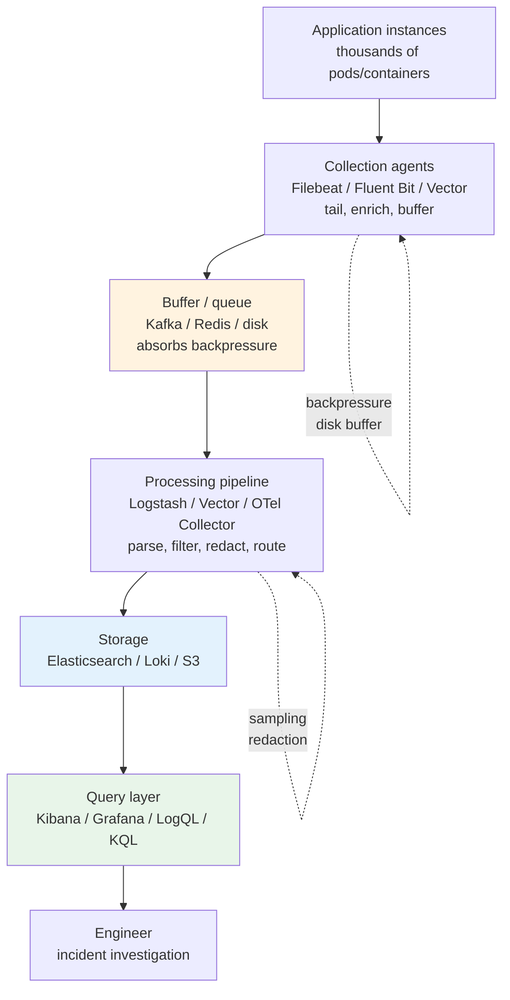
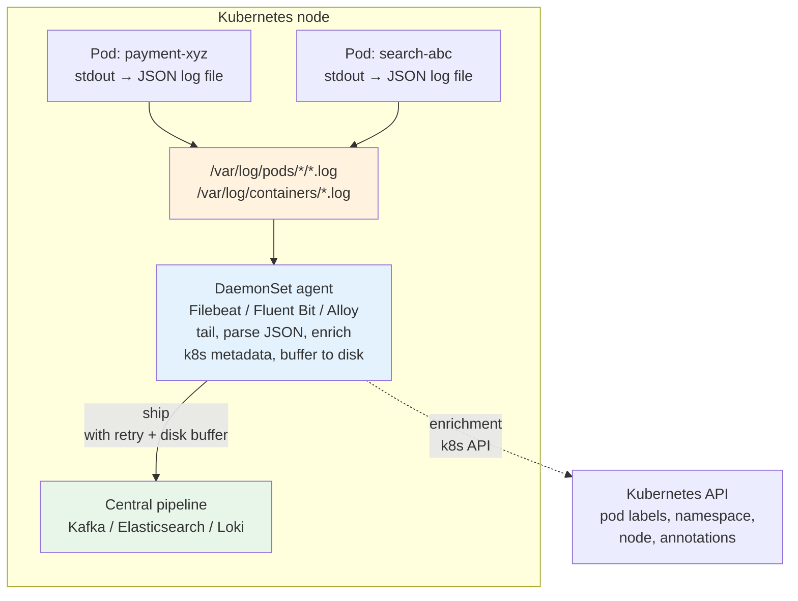
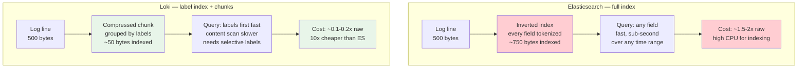
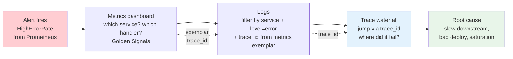

# Chapter 3 — Logging at Scale

**What this chapter covers.** Metrics tell you *that* something is wrong; logs tell you *what happened* for a specific request, task, or state transition. At scale — thousands of services, millions of log lines per second, terabytes per day — logging becomes a distributed systems problem in its own right: collection must be lossless under backpressure, storage must balance cost against query speed, and querying must remain fast over weeks of retention without drowning in cardinality. This chapter covers the full logging pipeline from structured emission in application code to collection, transport, storage, indexing, and query, with production configurations for the two dominant stacks — the ELK/EFK (Elasticsearch, Logstash/Fluent Bit, Kibana) and Grafana Loki — plus the emerging OpenTelemetry Logs path that unifies them. Every concept is grounded in running configuration: Filebeat and Fluent Bit collectors, Logstash and Vector pipelines, Elasticsearch index lifecycle management, Loki compactor and ruler configs, and Promtail/Alloy scrapers.

Learning goals — after this chapter you should be able to:

- Explain why structured (JSON) logging is the only viable format at scale and what fields every log line must carry for distributed correlation.
- Compare the ELK/EFK and Loki architectures on indexing strategy, storage cost, query model, and operational complexity, and choose between them for a given workload.
- Configure collection agents (Filebeat, Fluent Bit, Vector, Alloy/Promtail) to tail container logs, enrich with Kubernetes metadata, and ship reliably under backpressure.
- Configure Elasticsearch index templates, lifecycle policies, and Kibana data views, and configure Loki tenants, retention, and LogQL queries for production use.
- Design a retention, sampling, and redaction strategy that controls cost without losing the logs you need during incidents.
- Correlate logs with metrics and traces via trace IDs, request IDs, and exemplars, and explain how OpenTelemetry Logs bridges the three pillars.

---

## Why logging, and why it is hard at scale

### What logs are for

Every observability signal has a distinct role:

| Signal | Granularity | Question it answers | Example |
|--------|-------------|---------------------|---------|
| **Metrics** (Ch 2) | Aggregated over many events | "Is the service healthy? How much is failing?" | Error rate spiked to 5% |
| **Logs** (this chapter) | One line per discrete event | "What happened for this specific request/task?" | `ERROR request_id=abc123 user_id=42 payment failed: insufficient_funds` |
| **Traces** (Ch 4) | One record per request, spanning services | "Where in the call graph did the latency/error originate?" | Trace waterfall showing 2 s spent in `payment-service` |

Logs are the most *detailed* signal — they carry arbitrary context (user IDs, error messages, stack traces, business state) that metrics and traces cannot. But that detail is also what makes them expensive: a service handling 10,000 requests/second that logs 5 lines per request produces 50,000 log lines/second. At ~500 bytes per JSON line, that is ~2 TB/day from a single service.

### The scale challenges

At the scale of a modern backend — hundreds of services, thousands of instances, tens of terabytes per day — five problems dominate:

1. **Volume and cost.** Storing every log line verbatim in a full-text index (ELK) is powerful but expensive. Storage, indexing CPU, and query latency all scale with volume. Without retention and sampling discipline, logging costs exceed compute costs.

2. **Collection reliability.** Logs must be collected from every instance without loss, even when the central pipeline is temporarily overloaded or down. Agents must handle backpressure, disk buffering, and retransmission — otherwise the most critical logs (those emitted during an outage) are the ones most likely to be dropped.

3. **Query performance over time.** During an incident you need to search across hours or days of logs from dozens of services in seconds. A naive `grep` over flat files is unusable; an index must exist. But indexing every field of every log line is what drives cost — the tension between query speed and storage cost is the central trade-off in logging architecture.

4. **Cardinality and structure.** Logs with inconsistent formats, missing correlation IDs, or unstructured messages ("something went wrong") are unqueryable. At scale, log quality must be enforced by convention and validated by tooling, not left to individual developer discipline.

5. **Security and compliance.** Logs routinely contain PII, credentials, and business-sensitive data. At scale, manual review is impossible — redaction, access control, and retention enforcement must be automated.



*Figure 3-1: The logging pipeline. Every stage — collection, buffering, processing, storage, query — must handle scale, backpressure, and failure independently.*

---

## Structured logging: the foundation

### Unstructured logs do not scale

Consider two log lines that record the same event:

```
# Unstructured — human-readable, machine-hostile
2026-01-15 14:32:11 ERROR payment failed for user 42: insufficient_funds (request abc123, took 234ms)

# Structured — JSON, every field is a queryable attribute
{"timestamp":"2026-01-15T14:32:11.234Z","level":"error","service":"payment","handler":"charge","request_id":"abc123","trace_id":"4bf92f3577b34da6a3ce929d0e0e4736","user_id":"42","error":"insufficient_funds","duration_ms":234}
```

The unstructured line requires regex parsing to extract any field, breaks when the message format changes, and cannot be filtered or aggregated without fragile pattern matching. The structured line is trivially queryable: `level="error" AND service="payment" AND error="insufficient_funds"` — no parsing needed, no regex, no ambiguity.

**At scale, every log line must be structured JSON (or equivalent) with a consistent schema.** This is not a style preference — it is a prerequisite for every downstream stage to function without per-service parsing logic.

### The required field set

Every log line emitted by any service should carry at minimum:

| Field | Purpose | Example |
|-------|---------|---------|
| `timestamp` | When the event occurred (UTC, ISO 8601 / RFC 3339, millisecond precision) | `2026-01-15T14:32:11.234Z` |
| `level` | Severity — `debug`, `info`, `warn`, `error`, `fatal` | `error` |
| `service` | Which service emitted the log | `payment` |
| `message` | Human-readable description (still useful for quick scanning) | `payment charge failed` |
| `request_id` | Unique ID for the request/operation (propagated via header) | `abc123` |
| `trace_id` | Distributed trace ID (W3C `traceparent` or B3) for correlation with traces | `4bf92f3577b34da6a...` |
| `span_id` | Span within the trace | `00f067aa0ba902b7` |
| `duration_ms` | How long the operation took (for latency-relevant events) | `234` |

Additional fields that should be present on relevant log lines:

- `user_id` / `tenant_id` — for per-customer investigation (subject to PII handling).
- `error` / `error.type` / `error.stack` — structured error classification, not just a string.
- `http.method`, `http.path`, `http.status_code` — for HTTP request logs.
- `k8s.pod`, `k8s.namespace`, `k8s.node` — injected by the collection agent, not the application.

### Levels and when to use them

| Level | When to emit | Production volume | Retention |
|-------|-------------|-------------------|-----------|
| `debug` | Detailed diagnostic state — variable values, branch decisions | Very high — disabled in production by default, enabled per-service during investigation | Hours to 1 day, or sampled |
| `info` | Normal operational events — request completed, task started/finished | High — the bulk of production logs | Days to weeks |
| `warn` | Unexpected but handled — retry, fallback, deprecated usage, slow path | Low | Weeks |
| `error` | Operation failed — request errored, task failed, invariant violated | Low — but the most queried during incidents | Weeks to months |
| `fatal` | Process cannot continue — crash, unrecoverable state | Very low | Months |

> **The most common logging mistake is logging at `info` what should be a metric.** "Request completed in 234 ms" as a log line at 10,000 requests/second produces 10,000 log lines/second that must be stored and indexed. The same data as a Prometheus histogram costs a handful of time series and supports quantile queries that log aggregation cannot. Rule of thumb: if you will aggregate it (count, average, percentile), it is a metric. If you need the individual event with full context, it is a log.

### Instrumentation: structured logging in application code

```go
// Go — structured logging with slog (stdlib since Go 1.21) + trace correlation
package main

import (
    "context"
    "log/slog"
    "net/http"
    "os"
    "time"

    "go.opentelemetry.io/otel/trace"
)

var logger = slog.New(slog.NewJSONHandler(os.Stdout, &slog.HandlerOptions{
    Level:     slog.LevelInfo,
    AddSource: false, // set true for debug; adds file:line
}))

func loggingMiddleware(next http.Handler) http.Handler {
    return http.HandlerFunc(func(w http.ResponseWriter, r *http.Request) {
        start := time.Now()
        traceID := trace.SpanContextFromContext(r.Context()).TraceID().String()
        spanID := trace.SpanContextFromContext(r.Context()).SpanID().String()
        requestID := r.Header.Get("X-Request-ID")

        rw := &responseWriter{ResponseWriter: w, statusCode: 200}
        next.ServeHTTP(rw, r)

        duration := time.Since(start)

        attrs := []slog.Attr{
            slog.String("service", "payment"),
            slog.String("handler", r.URL.Path),
            slog.String("method", r.Method),
            slog.Int("status_code", rw.statusCode),
            slog.Int64("duration_ms", duration.Milliseconds()),
            slog.String("request_id", requestID),
            slog.String("trace_id", traceID),
            slog.String("span_id", spanID),
        }

        switch {
        case rw.statusCode >= 500:
            logger.LogAttrs(r.Context(), slog.LevelError, "request failed",
                append(attrs, slog.String("error", http.StatusText(rw.statusCode)))...)
        case rw.statusCode >= 400:
            logger.LogAttrs(r.Context(), slog.LevelWarn, "request client error", attrs...)
        case duration > 500*time.Millisecond:
            logger.LogAttrs(r.Context(), slog.LevelWarn, "request slow", attrs...)
        default:
            logger.LogAttrs(r.Context(), slog.LevelInfo, "request completed", attrs...)
        }
    })
}

// Structured error logging with full context
func chargeCard(ctx context.Context, userID string, amount int64) error {
    traceID := trace.SpanContextFromContext(ctx).TraceID().String()
    err := doCharge(ctx, userID, amount)
    if err != nil {
        logger.ErrorContext(ctx, "payment charge failed",
            slog.String("user_id", userID),
            slog.Int64("amount_cents", amount),
            slog.String("error", err.Error()),
            slog.String("error_type", errorType(err)),
            slog.String("trace_id", traceID),
        )
        return err
    }
    logger.InfoContext(ctx, "payment charge succeeded",
        slog.String("user_id", userID),
        slog.Int64("amount_cents", amount),
        slog.String("trace_id", traceID),
    )
    return nil
}
```

```python
# Python — structured logging with structlog + trace correlation
import structlog
import logging
import time
from opentelemetry import trace

structlog.configure(
    processors=[
        structlog.contextvars.merge_contextvars,
        structlog.processors.add_log_level,
        structlog.processors.TimeStamper(fmt="iso"),  # ISO 8601 UTC
        structlog.processors.JSONRenderer(),
    ],
    wrapper_class=structlog.make_filtering_bound_logger(logging.INFO),
    context_class=dict,
    logger_factory=structlog.PrintLoggerFactory(),
)

logger = structlog.get_logger(service="payment")

def handle_charge(request_id: str, user_id: str, amount_cents: int):
    start = time.monotonic()
    span = trace.get_current_span()
    ctx = span.get_span_context()
    trace_id = format(ctx.trace_id, "032x") if ctx.is_valid else "none"

    log = logger.bind(
        request_id=request_id,
        trace_id=trace_id,
        user_id=user_id,
        amount_cents=amount_cents,
    )
    try:
        do_charge(user_id, amount_cents)
        log.info("payment charge succeeded", duration_ms=int((time.monotonic() - start) * 1000))
    except InsufficientFundsError as e:
        log.error("payment charge failed",
            error="insufficient_funds",
            error_type="InsufficientFundsError",
            duration_ms=int((time.monotonic() - start) * 1000),
        )
        raise
    except Exception as e:
        log.error("payment charge failed",
            error=str(e),
            error_type=type(e).__name__,
            duration_ms=int((time.monotonic() - start) * 1000),
            exc_info=True,  # includes stack trace
        )
        raise
```

```json
// Output — every line is parseable JSON with consistent fields
{"time":"2026-01-15T14:32:11.234Z","level":"error","service":"payment","handler":"/api/charge","method":"POST","status_code":402,"duration_ms":234,"request_id":"abc123","trace_id":"4bf92f3577b34da6a3ce929d0e0e4736","span_id":"00f067aa0ba902b7","msg":"payment charge failed","error":"insufficient_funds","error_type":"InsufficientFundsError","user_id":"42","amount_cents":1999}
{"time":"2026-01-15T14:32:12.001Z","level":"info","service":"payment","handler":"/api/charge","method":"POST","status_code":200,"duration_ms":45,"request_id":"def456","trace_id":"5c92f3577b34da6a3ce929d0e0e4912","span_id":"11a067aa0ba903c8","msg":"request completed"}
```

---

## Collection: getting logs off the host

Logs are written to stdout/stderr (the 12-factor and Kubernetes convention) or to files. Collection agents tail these outputs, enrich them with metadata, and ship them to the pipeline. The agent is the most reliability-critical component — if it drops logs during an outage, the evidence needed to diagnose that outage is gone.

### Kubernetes log collection model

In Kubernetes, every container's stdout/stderr is captured by the kubelet into files on the node:

```
/var/log/pods/<namespace>_<pod>_<uid>/<container>/0.log   — kubelet-managed, JSON per line
/var/log/containers/<pod>_<namespace>_<container>-<id>.log — symlink for convenience
```

Each line is a JSON object with `log` (the raw application output), `stream` (stdout/stderr), and `time`. The collection agent runs as a **DaemonSet** (one pod per node) that tails these files.



*Figure 3-2: Kubernetes log collection. The DaemonSet agent tails kubelet-managed log files, enriches with Kubernetes metadata, and ships with disk buffering for reliability.*

### Filebeat (Elastic stack)

Filebeat is the Elastic-recommended lightweight shipper for the ELK stack. It tails files, handles rotation, maintains a registry of read offsets, and ships to Logstash or directly to Elasticsearch:

```yaml
# filebeat.yml — production DaemonSet configuration
filebeat.inputs:
  - type: container
    paths:
      - /var/log/containers/*.log
    # Parse the kubelet's JSON wrapper (log, stream, time)
    json.keys_under_root: false
    json.add_error_key: true
    # Multiline: combine stack traces into a single event
    multiline:
      type: pattern
      pattern: '^\s+at |^\s+... \d+ more|^\s*Caused by:'
      negate: false
      match: after

processors:
  # Enrich with Kubernetes metadata from the API server
  - add_kubernetes_metadata:
      host: ${NODE_NAME}
      matchers:
        - logs_path:
            logs_path: /var/log/containers/
  # Drop health-check noise
  - drop_event:
      when:
        contains:
          log: 'GET /health'
  # Parse application JSON logs (the inner "log" field)
  - decode_json_fields:
      fields: ["log"]
      target: ""
      overwrite_keys: true
      add_error_key: true
  # Redact PII — drop or hash sensitive fields
  - script:
      lang: javascript
      source: |
        function process(event) {
            var email = event.Get("user_email");
            if (email) { event.Put("user_email", "***REDACTED***"); }
            var card = event.Get("card_number");
            if (card) { event.Put("card_number", "***REDACTED***"); }
        }

# Backpressure handling — spool to disk when downstream is slow
queue:
  spool:
    file:
      path: /var/lib/filebeat/spool.dat
      size: 512MiB
      page_size: 16KiB
    write:
      buffer_size: 10MiB
      flush.timeout: 5s
      flush.events: 2048

output.elasticsearch:
  hosts: ["https://elasticsearch:9200"]
  index: "logs-%{[kubernetes.namespace]}-%{+yyyy.MM.dd}"
  # Or use data streams (recommended for ILM):
  # index: "logs-generic-default"
  ssl.certificate_authorities: ["/etc/certs/ca.crt"]
  username: "${ES_USERNAME}"
  password: "${ES_PASSWORD}"
  # Retry with backoff
  backoff:
    init: 1s
    max: 60s
  worker: 2
  bulk_max_size: 2048

# Alternative: ship to Logstash for heavier processing
# output.logstash:
#   hosts: ["logstash:5044"]
#   ssl.certificate_authorities: ["/etc/certs/ca.crt"]

logging:
  level: info
  json: true

monitoring.enabled: true
```

### Fluent Bit (lightweight, widely used in Kubernetes)

Fluent Bit is a CNCF project with lower resource overhead than Filebeat or Logstash, making it popular for resource-constrained DaemonSets:

```ini
# fluent-bit.conf — Kubernetes DaemonSet configuration
[SERVICE]
    Flush           5
    Daemon          Off
    Log_Level       info
    Parsers_File    parsers.conf
    storage.path    /var/log/flb-storage
    storage.sync    normal
    storage.checksum Off
    storage.backlog.mem_limit 50M
    HTTP_Server     On
    HTTP_Listen     0.0.0.0
    HTTP_Port       2020

[INPUT]
    Name              tail
    Path              /var/log/containers/*.log
    Parser            docker          # parses kubelet JSON wrapper
    Tag               kube.*
    Refresh_Interval  5
    Mem_Buf_Limit     50M
    Skip_Long_Lines   On
    DB                /var/log/flb_kube.db        # offset registry
    DB.Sync           Normal
    storage.type      filesystem                   # disk buffer for backpressure

[FILTER]
    Name              kubernetes
    Match             kube.*
    Kube_URL          https://kubernetes.default.svc:443
    Kube_CA_File      /var/run/secrets/kubernetes.io/serviceaccount/ca.crt
    Kube_Token_File   /var/run/secrets/kubernetes.io/serviceaccount/token
    Merge_Log         On            # merge JSON log field into record
    Keep_Log          Off
    K8S-Logging.Parser On
    K8S-Logging.Exclude On

[FILTER]
    Name              multiline
    Match             kube.*
    multiline.key_content log
    multiline.parser  java, python, go   # combine stack traces

[FILTER]
    Name              modify
    Match             kube.*
    Condition         Key_value_equals    stream  stderr
    Add               level               error

[FILTER]
    Name              grep
    Match             kube.*
    Exclude           log    GET /health  # drop health checks

[OUTPUT]
    Name              es
    Match             kube.*
    Host              elasticsearch
    Port              9200
    Index             logs
    Type              _doc
    Logstash_Format   On
    Logstash_Prefix   logs
    Replace_Dots      On
    Suppress_Type_Name On
    Trace_Output      Off
    Trace_Error       On
    Suppress_Type_Name On
    tls               On
    tls.verify        On
    HTTP_User         ${ES_USERNAME}
    HTTP_Passwd       ${ES_PASSWORD}
    # Retry with exponential backoff
    Retry_Limit       5
    storage.total_limit_size  128M

# Alternative output — Loki
# [OUTPUT]
#     Name            loki
#     Match           kube.*
#     Host            loki-gateway
#     Port            3100
#     Labels          job=kube, namespace=$kubernetes['namespace_name'], app=$kubernetes['labels.app'], pod=$kubernetes['pod_name']
#     Auto_Kubernetes_Labels On
```

```ini
# parsers.conf — multiline parsers for stack traces
[PARSER]
    Name        docker
    Format      json
    Time_Key    time
    Time_Format %Y-%m-%dT%H:%M:%S.%L
    Time_Keep   On

[MULTILINE_PARSER]
    name          java
    type          regex
    flush_timeout 1000
    rule      "start_state"   "/^(Dec \d+|20\d{2}-\d{2}-\d{2}).*at /"     "cont"
    rule      "cont"          "/^\s+at.*|^\s+... \d+ more|^\s*Caused by:/"  "cont"

[MULTILINE_PARSER]
    name          python
    type          regex
    flush_timeout 1000
    rule      "start_state"   "/^Traceback.*:$/"       "cont"
    rule      "cont"          "/^\s+.*$/"               "cont"

[MULTILINE_PARSER]
    name          go
    type          regex
    flush_timeout 1000
    rule      "start_state"   "/^(panic|goroutine \d+).*/"  "cont"
    rule      "cont"          "/^(.*|\\t.*)$/"              "cont"
```

### Vector (high-performance, Rust-based)

Vector is a newer alternative that handles both collection and transformation with strong backpressure and exactly-once delivery semantics:

```yaml
# vector.yaml — DaemonSet + aggregator topology
sources:
  kubernetes_logs:
    type: kubernetes_logs
    self_node_name: "${VECTOR_SELF_NODE_NAME}"
    extra_label_selector: ""
    exclude_paths_glob_patterns:
      - "**_kube-system_**"

transforms:
  # Parse JSON application logs
  parse_json:
    type: remap
    inputs: [kubernetes_logs]
    source: |
      . = parse_json!(.message)
      # Normalize level field
      .level = downcase(string(.level) ?? "info")
      # Redact PII
      if exists(.user_email) { .user_email = "***REDACTED***" }
      if exists(.card_number) { .card_number = "***REDACTED***" }
      # Enrich: add cluster label
      .cluster = "prod-us-central1"

  # Route: errors to P1 index, everything else to default
  route_errors:
    type: route
    inputs: [parse_json]
    route:
      errors: '.level == "error" || .level == "fatal"'
      default: 'true'

  # Sample debug logs — keep 10% to control volume
  sample_debug:
    type: sample
    inputs: [route_errors.default]
    rate: 10
    condition: '.level == "debug"'

sinks:
  es_errors:
    type: elasticsearch
    inputs: [route_errors.errors]
    endpoints: ["https://elasticsearch:9200"]
    index: "logs-errors-%Y-%m-%d"
    auth:
      strategy: basic
      user: "${ES_USERNAME}"
      password: "${ES_PASSWORD}"
    batch:
      max_bytes: 10485760
      timeout_secs: 5
    request:
      retry_attempts: 5
      retry_initial_backoff_secs: 1
    buffer:
      type: disk
      max_size: 536870912  # 512 MiB disk buffer per sink
      when_full: block     # backpressure — block instead of dropping

  es_default:
    type: elasticsearch
    inputs: [sample_debug, "route_errors.default"]
    endpoints: ["https://elasticsearch:9200"]
    index: "logs-%Y-%m-%d"
    auth:
      strategy: basic
      user: "${ES_USERNAME}"
      password: "${ES_PASSWORD}"
    batch:
      max_bytes: 10485760
      timeout_secs: 5
    buffer:
      type: disk
      max_size: 536870912
      when_full: block

  # Fan-out to Loki for cheap long-term retention
  loki:
    type: loki
    inputs: [parse_json]
    endpoint: "http://loki:3100"
    labels:
      service: "{{ service }}"
      level: "{{ level }}"
      namespace: "{{ kubernetes.pod_namespace }}"
    encoding:
      codec: json
    batch:
      max_bytes: 1048576
      timeout_secs: 2
```

---

## Storage and indexing: ELK vs. Loki

The choice between ELK (Elasticsearch) and Loki is the most consequential architectural decision in logging at scale. They represent fundamentally different trade-offs between indexing cost and query power.

### Elasticsearch (ELK/EFK): full-text indexing

Elasticsearch indexes **every field** of every log line into an inverted index. Any field can be searched, filtered, aggregated, and visualized with sub-second latency over large time ranges. The cost is storage and indexing overhead — typically 1.5–2× the raw log volume for the index, plus significant CPU for indexing.

```
Raw log JSON (500 bytes)
  → Elasticsearch document
    → Inverted index (per field tokenization + posting lists)
    → Doc values (columnar, for aggregations)
    → Stored fields (for retrieval)
  Total: ~750-1000 bytes indexed per 500-byte log line
```

**When to choose ELK:**

- You need ad-hoc full-text search across any field ("find all logs mentioning `insufficient_funds` regardless of field").
- You need aggregations and analytics on log data (top error types, error rate over time, cardinality analysis).
- You need Kibana's visualization and alerting (Lens, Discover, Watcher/Alerting).
- Your log volume is moderate (< 1 TB/day) or your budget supports the indexing cost.
- You need cross-cluster search and SQL-like query (ES|QL).

**Elasticsearch production configuration:**

```json
// elasticsearch-templates/logs-template.json — index template for log data streams
{
  "index_patterns": ["logs-*"],
  "data_stream": {},
  "template": {
    "settings": {
      "number_of_shards": 3,
      "number_of_replicas": 1,
      "refresh_interval": "5s",
      "index.lifecycle.name": "logs-ilm-policy",
      "index.codec": "best_compression",
      "index.mapping.total_fields.limit": 2000,
      "index.mapping.ignore_malformed": true
    },
    "mappings": {
      "dynamic": "strict",
      "properties": {
        "@timestamp":    { "type": "date", "format": "strict_date_optional_time||epoch_millis" },
        "level":         { "type": "keyword" },
        "service":       { "type": "keyword" },
        "handler":       { "type": "keyword" },
        "message":       { "type": "text", "analyzer": "standard", "fields": { "keyword": { "type": "keyword", "ignore_above": 256 } } },
        "request_id":    { "type": "keyword" },
        "trace_id":      { "type": "keyword" },
        "span_id":       { "type": "keyword" },
        "user_id":       { "type": "keyword" },
        "error":         { "type": "keyword" },
        "error_type":    { "type": "keyword" },
        "duration_ms":   { "type": "long" },
        "status_code":   { "type": "integer" },
        "kubernetes": {
          "properties": {
            "namespace": { "type": "keyword" },
            "pod_name":  { "type": "keyword" },
            "labels":    { "type": "object", "dynamic": true }
          }
        }
      }
    }
  }
}
```

```json
// elasticsearch-ilm/logs-ilm-policy.json — lifecycle management: hot → warm → cold → delete
{
  "policy": {
    "phases": {
      "hot": {
        "min_age": "0ms",
        "actions": {
          "rollover": {
            "max_primary_shard_size": "50GB",
            "max_age": "1d"
          },
          "set_priority": { "priority": 100 }
        }
      },
      "warm": {
        "min_age": "7d",
        "actions": {
          "forcemerge": { "max_num_segments": 1 },
          "shrink": { "number_of_shards": 1 },
          "set_priority": { "priority": 50 },
          "allocate": { "number_of_replicas": 1 }
        }
      },
      "cold": {
        "min_age": "30d",
        "actions": {
          "searchable_snapshot": { "snapshot_repository": "s3-snapshots" },
          "set_priority": { "priority": 0 }
        }
      },
      "frozen": {
        "min_age": "60d",
        "actions": {
          "searchable_snapshot": { "snapshot_repository": "s3-snapshots" }
        }
      },
      "delete": {
        "min_age": "90d",
        "actions": { "delete": {} }
      }
    }
  }
}
```

```yaml
# logstash-pipeline/logstash.conf — central processing pipeline (alternative to Vector)
input {
  beats {
    port => 5044
    ssl => true
    ssl_certificate_authorities => ["/etc/certs/ca.crt"]
    ssl_certificate => "/etc/certs/logstash.crt"
    ssl_key => "/etc/certs/logstash.key"
  }
}

filter {
  # Parse application JSON (already partially parsed by Filebeat)
  if [log] =~ /^\{/ {
    json {
      source => "log"
      target => "app"
      skip_on_invalid_json => true
    }
    if "_jsonparsefailure" not in [tags] {
      mutate { rename => { "[app][level]" => "level" } }
      mutate { rename => { "[app][trace_id]" => "trace_id" } }
      # ... additional field promotion
    }
  }

  # GeoIP enrichment for access logs
  if [service] == "edge-proxy" and [client_ip] {
    geoip { source => "client_ip" }
  }

  # Drop health checks that slipped through
  if [handler] == "/health" or [handler] == "/readyz" {
    drop {}
  }

  # Redact sensitive fields
  mutate {
    gsub => ["user_email", ".+", "***REDACTED***"]
    gsub => ["card_number", ".+", "***REDACTED***"]
  }

  date {
    match => ["timestamp", "ISO8601"]
    target => "@timestamp"
  }
}

output {
  elasticsearch {
    hosts => ["https://elasticsearch:9200"]
    data_stream => true
    data_stream_type => "logs"
    data_stream_dataset => "generic"
    data_stream_namespace => "default"
    ssl => true
    cacert => "/etc/certs/ca.crt"
    user => "${ES_USERNAME}"
    password => "${ES_PASSWORD}"
    # Dead letter queue for indexing failures
  }
  # Fan-out to S3 for long-term archive (cheaper than keeping in ES)
  # s3 {
  #   bucket => "logs-archive-prod"
  #   prefix => "%{+YYYY}/%{+MM}/%{+dd}/"
  #   codec => "json_lines"
  # }
}
```

### Loki: label-indexed, content-unindexed

Loki takes the opposite approach from Elasticsearch. It indexes **only labels** (small, low-cardinality key-value pairs like `service`, `level`, `namespace`) and stores log content as **compressed chunks** (gzipped log lines grouped by label set and time). Queries first filter by labels to find relevant chunks, then scan chunk content with grep-like filters.

```
Raw log lines grouped by label set {service="payment", level="error"}
  → Compressed chunks (gzip, ~10:1 compression)
  → Index: only the label → chunk pointer mapping
  Total: ~50-100 bytes indexed per 500-byte log line (10-20x less than ES)
```

This makes Loki dramatically cheaper — roughly 10× lower storage cost than Elasticsearch for the same log volume — but with a query trade-off: filtering by label is fast (indexed), while searching within log content requires scanning decompressed chunks (slower, especially over large time ranges without selective labels).

**When to choose Loki:**

- Cost is a primary concern and log volume is high (> 500 GB/day).
- Your query pattern is predominantly label-filtered ("all `error` logs from `payment` in the last hour") rather than full-text search.
- You already use Grafana and Prometheus — Loki integrates natively with the same label model and query UX.
- You need long retention (weeks to months) at manageable cost — Loki's S3-backed chunk storage with compaction is designed for this.



*Figure 3-3: Indexing trade-off. Elasticsearch indexes everything for fast arbitrary queries at high cost; Loki indexes only labels and scans chunk content, trading query flexibility for 10× lower cost.*

**Loki / Grafana Alloy production configuration:**

```yaml
# loki-config.yaml — production Loki deployment (monolithic or microservices)
auth_enabled: true

server:
  http_listen_port: 3100
  grpc_listen_port: 9096
  log_level: info

common:
  path_prefix: /loki
  storage:
    filesystem:
      chunks_directory: /loki/chunks
      rules_directory: /loki/rules
  replication_factor: 1
  ring:
    instance_addr: 127.0.0.1
    kvstore:
      store: inmemory

# For production with S3/GCS long-term storage:
storage:
  type: s3
  s3:
    endpoint: s3.amazonaws.com
    bucketnames: loki-chunks-prod
    region: us-central1
    s3forcepathstyle: false
  boltdb_shipper:
    active_index_directory: /loki/index
    cache_location: /loki/index_cache
    cache_ttl: 24h
    shared_store: s3

# Compactor — deduplicates and merges index + manages retention
compactor:
  working_directory: /loki/compactor
  shared_store: s3
  compaction_interval: 10m
  retention_enabled: true
  retention_delete_delay: 2h
  retention_delete_worker_count: 150

# Retention — per-tenant + global defaults
limits_config:
  retention_period: 744h  # 31 days default
  retention_stream:
    - selector: '{level="debug"}'
      period: 24h          # debug logs: 1 day only
    - selector: '{level="error"}'
      period: 2160h        # error logs: 90 days
  ingestion_rate_mb: 16
  ingestion_burst_size_mb: 32
  max_label_name_length: 1024
  max_label_value_length: 2048
  max_label_names_per_series: 15
  reject_old_samples: true
  reject_old_samples_max_age: 168h
  # Cardinality protection — the most important Loki safeguard
  max_global_streams_per_user: 10000
  ingestion_rate_strategy: local

# Ruler — alerting on log content
ruler:
  alertmanager_url: http://alertmanager:9093
  storage:
    type: local
    local:
      directory: /loki/rules
  ring:
    kvstore:
      store: inmemory
  enable_api: true

# Query performance
querier:
  max_concurrent: 8
query_range:
  align_queries_with_step: true
  max_retries: 5
  cache_results: true
  results_cache:
    cache:
      embedded_cache:
        enabled: true
        max_size_mb: 100

# Ingester — where chunks are built before flushing to storage
ingester:
  lifecycler:
    ring:
      kvstore:
        store: inmemory
      replication_factor: 1
  chunk_idle_period: 1h
  max_chunk_age: 2h
  chunk_target_size: 1572864  # 1.5 MB — target compressed chunk size
  chunk_retain_period: 30s

# Structured metadata (Grafana Loki 2.8+ — attach arbitrary fields without indexing)
allow_structured_metadata: true
volume_enabled: true
```

```yaml
# alloy-config.alloy — Grafana Alloy (successor to Promtail) as DaemonSet collector
logging {
  level  = "info"
  format = "json"
}

loki.source.kubernetes "pods" {
  targets = discovery.kubernetes.pods.targets
  forward_to = [loki.process.enrich.receiver]
}

discovery.kubernetes "pods" {
  role = "pod"
}

discovery.relabel "pods" {
  targets = discovery.kubernetes.pods.targets

  // Keep only pods with logs
  rule {
    source_labels = ["__meta_kubernetes_pod_phase"]
    regex         = "Running"
    action        = "keep"
  }

  // Map Kubernetes metadata to Loki labels — LOW cardinality only
  rule {
    source_labels = ["__meta_kubernetes_namespace"]
    target_label  = "namespace"
  }
  rule {
    source_labels = ["__meta_kubernetes_pod_label_app"]
    target_label  = "app"
  }
  rule {
    source_labels = ["__meta_kubernetes_pod_container_name"]
    target_label  = "container"
  }
  // Do NOT add pod name, trace_id, or user_id as labels — cardinality explosion
}

loki.process "enrich" {
  stage.json {
    expressions = {
      level    = "level",
      service  = "service",
      trace_id = "trace_id",
      msg      = "msg",
    }
  }

  // Promote structured fields as Loki structured metadata (not labels — queryable without cardinality cost)
  stage.structured_metadata {
    values = {
      trace_id = "trace_id",
      level    = "level",
    }
  }

  // Drop health-check noise before shipping
  stage.drop {
    source = "msg"
    expression = "GET /health"
  }

  // Multiline: reassemble stack traces
  stage.multiline {
    firstline   = "^\\{.*level.*\\}"
    max_wait_time = "3s"
  }

  forward_to = [loki.write.default.receiver]
}

loki.write "default" {
  endpoint {
    url = "http://loki-gateway:3100/loki/api/v1/push"
    tenant_id = "prod"
  }
  external_labels = {
    cluster = "prod-us-central1",
  }
}
```

### Choosing between them — or both

Many organizations run **both**: Loki for the bulk of application logs (cheap, good enough for label-filtered incident queries) and Elasticsearch for specific high-value log types that need full-text search (audit logs, security events, access logs that feed analytics). Vector and Alloy both support fanning out to multiple sinks, making a dual-stack deployment straightforward.

| Dimension | Elasticsearch (ELK) | Loki | Dual-stack |
|-----------|---------------------|------|------------|
| Index cost | ~1.5–2× raw volume | ~0.1–0.2× raw volume | Loki for bulk, ES for critical |
| Query: label filter | Fast | Fast (indexed) | — |
| Query: full-text / any field | Fast (inverted index) | Slow (chunk scan) | ES for ad-hoc search |
| Query: aggregation | Powerful (ES|QL, aggregations) | Limited (LogQL metric queries) | ES for analytics |
| Retention cost | High — index on hot storage | Low — chunks on S3/GCS | Loki retains longer cheaply |
| Operational complexity | High — shard management, mapping, ILM | Lower — fewer moving parts, S3-native | Highest — two systems |
| Ecosystem | Kibana, Beats, Logstash, ES|QL | Grafana, LogQL, Prometheus-compatible labels | Both UIs |

---

## Querying: LogQL and Kibana

### LogQL (Loki)

LogQL is Loki's query language, deliberately modeled on PromQL. Every query starts with a **label filter** (which chunks to read) followed by **line filters** and **parsers** (what to do with the content):

```loki
# Basic: all error logs from the payment service in the last hour
{service="payment", level="error"}

# Line filter: errors mentioning a specific failure mode
{service="payment", level="error"} |= "insufficient_funds"

# Exclusion: errors that are NOT insufficient_funds (to find other failure modes)
{service="payment", level="error"} != "insufficient_funds"

# JSON parsing: extract fields from JSON log lines, then filter on them
{service="payment"} | json | level="error" and duration_ms > 500

# Trace correlation: all logs for a specific trace
{service=~"payment|checkout|inventory"} | json | trace_id="4bf92f3577b34da6a3ce929d0e0e4736"

# Regex: extract structured data from semi-structured lines
{app="nginx"} | regexp `(?P<method>\\w+) (?P<path>/[^ ]+) (?P<status>\\d+)`

# Pattern parser (faster than regexp for simple patterns)
{app="nginx"} | pattern `<method> <path> <status> <duration>`

# Metric query: error rate per service over time (for dashboards/alerts)
sum by (service) (rate({level="error"}[5m]))

# Metric query: p99 request duration from log-derived durations
quantile_over_time(0.99, {service="payment"} | json | unwrap duration_ms [5m]) by (service)

# Alerting: error rate exceeds threshold (used in Loki ruler)
sum(rate({service="payment", level="error"}[5m])) > 10
```

> **The cardinal rule of LogQL performance:** always start with the most selective label filter. `{service="payment", level="error"}` reads only chunks for that label set. `{service=~".+"} |= "error"` reads *every* chunk and scans every line — orders of magnitude slower. Label selectivity is the primary determinant of query latency in Loki.

### Kibana / ES|QL (Elasticsearch)

```kql
// KQL (Kibana Query Language) — Discover view
service: payment and level: error and error: insufficient_funds
trace_id: "4bf92f3577b34da6a3ce929d0e0e4736"

// Lucene syntax — more expressive
service:payment AND level:error AND duration_ms:>500

// ES|QL — SQL-like analytics on log data (Elasticsearch 8.11+)
FROM logs-*
| WHERE service == "payment" AND level == "error"
| STATS error_count = COUNT(*), p99_duration = PERCENTILE(duration_ms, 99) BY error
| SORT error_count DESC
| LIMIT 10

// ES|QL — time-bucketed error rate for dashboard
FROM logs-*
| WHERE @timestamp >= NOW() - 1 hour
| EVAL bucket = DATE_TRUNC(5 minutes, @timestamp)
| STATS errors = COUNT(*) WHERE level == "error" BY bucket, service
| SORT bucket ASC
```

### Correlating logs, metrics, and traces

The most powerful incident workflow connects all three pillars via shared identifiers:



*Figure 3-4: The incident workflow across pillars. An alert on a metric leads to log investigation via trace_id correlation, then to a trace waterfall that pinpoints the failing span.*

Grafana exemplars make this automatic — a Prometheus histogram can carry trace IDs as exemplars, and Grafana renders them as clickable links from the metrics dashboard directly to the relevant trace and logs:

```yaml
# prometheus.yml — enable exemplars
storage:
  exemplars:
    max_exemplars: 100000
```

```go
// Go — attach trace ID as exemplar on histogram observation
import "go.opentelemetry.io/otel/trace"

func handleRequest(w http.ResponseWriter, r *http.Request) {
    start := time.Now()
    // ... handle request ...
    duration := time.Since(start).Seconds()
    traceID := trace.SpanContextFromContext(r.Context()).TraceID().String()
    httpDuration.WithLabelValues(r.Method, r.URL.Path).Observe(duration)
    // With OpenTelemetry + Prometheus exemplars, the trace_id is auto-attached
    // via the exemplar storage — no manual wiring needed when using OTel SDK
}
```

---

## Retention, sampling, and cost control

### The retention problem

Storing every log line from every service at full fidelity for 90 days is rarely affordable or necessary. Different log levels and services have different value over time:

| Log category | Value during incident | Value after 7 days | Recommended retention |
|-------------|----------------------|--------------------|-----------------------|
| `error` / `fatal` | Critical — primary evidence | High — needed for trend analysis | 60–90 days |
| `warn` | Useful — shows degraded behavior | Moderate | 30 days |
| `info` (request logs) | Useful for recent incidents | Low — superseded by metrics | 7–14 days |
| `debug` | Very useful if enabled during incident | Negligible | 1–3 days, or sampled 10% |
| Audit / security logs | Critical for compliance | Critical — regulatory requirement | 1–7 years (often on S3/GCS archive) |
| Access logs (edge proxy) | Useful for traffic analysis | Low (metrics cover it) | 7 days, or sampled 1–10% |

### Sampling strategies

**Head sampling** (decide at log-emission time whether to keep a line) is simple but loses the errors you most need:

```go
// Naive: sample all info logs at 10% — but this drops errors too if not careful
if level == slog.LevelInfo && rand.Float64() > 0.1 {
    return // drop 90% of info logs
}
// Never sample error/fatal — always keep them
if level >= slog.LevelError {
    // always emit
}
```

**Tail sampling** (decide after seeing the outcome whether to keep the full trace/log set) is more powerful — keep all logs for failed requests, sample successful ones:

```yaml
# OpenTelemetry Collector — tail sampling processor
processors:
  tail_sampling:
    decision_wait: 10s
    num_traces: 100000
    expected_new_traces_per_sec: 1000
    policies:
      # Always keep errors
      - name: errors
        type: status_code
        status_code: { status_codes: [ERROR] }
      # Always keep slow requests
      - name: slow
        type: latency
        latency: { threshold_ms: 1000 }
      # Sample 10% of everything else
      - name: probabilistic
        type: probabilistic
        probabilistic: { sampling_percentage: 10 }
```

### ILM and retention enforcement

Both ELK and Loki enforce retention via lifecycle policies (shown in full above for both stacks). The key principle: **retention must be automatic and enforced by the storage layer**, not by manual deletion or application logic. An ILM policy that moves data from hot (fast SSD, fully indexed) to warm (fewer replicas, force-merged) to cold (searchable snapshots on S3) to delete ensures cost decreases over time without operator intervention.

For audit and compliance logs that must survive beyond normal retention, add an S3/GCS archival sink that copies every log line to cheap object storage before it ages out of the indexed store:

```yaml
# Vector — archive all logs to S3 before they expire from Elasticsearch/Loki
sinks:
  s3_archive:
    type: aws_s3
    inputs: [parse_json]
    bucket: "logs-archive-prod"
    key_prefix: "year=%Y/month=%m/day=%d/"
    compression: gzip
    encoding:
      codec: json
    batch:
      max_bytes: 104857600  # 100 MB objects
      timeout_secs: 300
```

---

## Security: redaction, access control, and compliance

### Never log secrets

This is the most violated logging rule in production systems. Common leaks:

- Passwords and tokens logged in request bodies or headers (`Authorization: Bearer eyJ...`).
- PII (email, phone, government IDs) logged verbatim for debugging and never removed.
- Full SQL queries with embedded parameter values.
- Stack traces that include environment variables or configuration dumps.

Enforce redaction at **two layers**: the application (never emit the secret) and the pipeline (catch anything the application missed):

```go
// Go — application-layer redaction: never log the raw value
func logAuthAttempt(userID string, token string) {
    // BAD: logger.Info("auth attempt", slog.String("token", token))
    // GOOD: log only the token's presence and prefix for debugging
    logger.Info("auth attempt",
        slog.String("user_id", userID),
        slog.String("token_prefix", token[:4]+"..."),
        slog.Bool("token_present", token != ""),
    )
}
```

```yaml
# Vector/Fluent Bit pipeline — catch-all redaction for anything that slipped through
transforms:
  redact_secrets:
    type: remap
    inputs: [kubernetes_logs]
    source: |
      # Redact known secret patterns in any field
      .message = replace(string(.message) ?? "", r'Bearer\s+[A-Za-z0-9\-_\.]+', "Bearer ***REDACTED***")
      .message = replace(string(.message) ?? "", r'password["\s:=]+[^"\s,}]+', "password=***REDACTED***")
      # Hash or drop PII fields
      if exists(.user_email) { .user_email = "***REDACTED***" }
      if exists(.card_number) { .card_number = "***REDACTED***" }
```

### Access control

Logs containing PII or business-sensitive data must be access-controlled at the storage layer:

- **Elasticsearch:** index-level and field-level security via the Elastic Stack Security feature (roles that restrict which indices and fields a user can query).
- **Loki:** tenant isolation via `X-Scope-OrgID` header + per-tenant retention and query limits; Grafana data source permissions control which tenants a team can query.
- **Audit:** log every query against sensitive indices — who searched for what, when — to satisfy compliance requirements.

---

## OpenTelemetry Logs: the emerging unified path

OpenTelemetry Logs (stable since 2024) provides a vendor-neutral log data model and collection pipeline that can ship to any backend — Elasticsearch, Loki, or OTLP-native stores:

```yaml
# otel-collector-config.yaml — unified collection for metrics, traces, and logs
receivers:
  otlp:
    protocols:
      grpc:
        endpoint: 0.0.0.0:4317
      http:
        endpoint: 0.0.0.0:4318
  filelog:
    include: [/var/log/pods/*/*/*.log]
    operators:
      - type: json_parser
        parse_from: body.log
      - type: add
        field: resource["k8s.pod.name"]
        value: EXPR(attributes["k8s.pod.name"])

processors:
  batch:
    timeout: 5s
    send_batch_size: 8192
  k8sattributes:
    auth_type: serviceAccount
    passthrough: false
    extract:
      metadata: [k8s.namespace.name, k8s.pod.name, k8s.container.name]
      labels:
        - tag_name: app
          key: app
          from: pod
  filter/drop_health:
    logs:
      exclude:
        bodies: ["*GET /health*"]
  transform/redact:
    log_statements:
      - context: log
        statements:
          - replace_pattern(body, "Bearer\\s+[A-Za-z0-9\\-_.]+", "Bearer ***REDACTED***")

exporters:
  # Ship to Loki via OTLP (Loki 3.0+ supports OTLP ingestion)
  otlphttp/loki:
    endpoint: http://loki:3100/otlp
    headers:
      X-Scope-OrgID: prod
  # Ship to Elasticsearch via OTLP or elasticsearch exporter
  elasticsearch:
    endpoints: [https://elasticsearch:9200]
    user: "${ES_USERNAME}"
    password: "${ES_PASSWORD}"
    logs_index: logs-otel-default
    mapping:
      mode: bodymap

service:
  pipelines:
    logs:
      receivers: [otlp, filelog]
      processors: [k8sattributes, filter/drop_health, transform/redact, batch]
      exporters: [otlphttp/loki, elasticsearch]
    traces:
      receivers: [otlp]
      processors: [k8sattributes, batch]
      exporters: [otlphttp/loki]  # Tempo/Jaeger for traces
    metrics:
      receivers: [otlp]
      processors: [batch]
      exporters: [prometheusremotewrite]
```

The strategic value of OTel Logs is not that it replaces ELK or Loki — it is that it **decouples instrumentation from storage**. Applications instrument once with the OTel SDK, and operators choose (or change) the backend without touching application code.

---

## Logging in a distributed system

### The request-scoped correlation problem

In a monolith, a single log file contains all events for a request. In a microservices architecture, a single user action fans out into dozens of log streams across different services, hosts, and storage shards. Reconstructing the full story requires correlation:

1. **Generate a trace ID and request ID at the edge** (API gateway or frontend) and propagate via headers (`traceparent` per W3C Trace Context, `X-Request-ID` for request correlation).

2. **Every service includes both IDs in every log line** — the application logger reads them from context (as shown in the Go/Python examples above).

3. **The query layer joins on trace_id** — `trace_id="4bf92f..."` across all services returns the complete distributed log set for one request.

Without this, incident responders must guess which log lines from which services correspond to the failing request — correlating by timestamp alone is unreliable when clocks skew and request rates are high.

### Clock synchronization

Log timestamps are only comparable across services if clocks are synchronized. In Kubernetes, `chrony` or `systemd-timesyncd` with NTP/PTP keeps node clocks within milliseconds. For stricter ordering, use the trace's span timestamps (which share a single clock per trace) rather than log timestamps to sequence cross-service events.

### Structured logging and schema governance

At scale, log schema drift — one team renames `user_id` to `userId`, another adds `user_id` as an integer while the rest use strings — breaks dashboards and alerts silently. Governance mechanisms:

- **Shared logging library** — a single internal package that enforces field names, types, and required fields. All services import it.
- **Schema validation in the pipeline** — Vector/OTel transform that rejects or coerces non-conforming log lines, with a dead-letter queue for violations.
- **Elasticsearch `dynamic: strict` mapping** — rejects documents with unexpected fields rather than silently creating new mappings that fragment the index.
- **Linting in CI** — static analysis that flags `log.Print` / `console.log` with unstructured messages and requires structured logger usage.

---

## Common failure modes

**Logging synchronously on the hot path.** Writing logs synchronously (blocking the request handler until the log line is flushed) adds latency and can deadlock under backpressure. Always log asynchronously — write to a buffered channel or ring buffer, and let a background goroutine/thread flush to stdout. Most structured logging libraries handle this internally, but verify the behavior under load.

**Cardinality explosion in Loki labels.** Adding `trace_id`, `user_id`, or `request_id` as Loki labels creates one stream per unique value — millions of streams that exhaust memory and make queries unusably slow. These high-cardinality identifiers belong in **structured metadata** (Loki 2.8+) or as **LogQL line filters**, never as labels. Labels should be low-cardinality: `service`, `level`, `namespace`, `app` — values with tens to hundreds of distinct values, not millions.

**Index mapping explosion in Elasticsearch.** Dynamic mapping that creates a new field for every unique JSON key — especially when application logs contain unbounded keys (e.g., `{"custom_field_12345": "value"}`) — can create thousands of fields per index, exhausting heap and slowing queries. Use `dynamic: strict` or `dynamic: runtime` for untrusted fields, and set `index.mapping.total_fields.limit` to catch runaway mapping growth.

**Dropping logs under backpressure.** When the central pipeline is overloaded, agents must buffer to disk and retry — not drop. Verify this by load-testing the pipeline: produce logs faster than the pipeline can index, and confirm that no log lines are lost (compare emitted count vs. indexed count). Filebeat's `queue.spool`, Fluent Bit's `storage.type: filesystem`, and Vector's `buffer.type: disk` with `when_full: block` all provide this — but only if configured.

**Retaining everything forever.** The default should be short retention (7–14 days) for bulk logs with selective long retention for errors and audit logs. Teams that retain all logs at full fidelity for 90 days without sampling or tiering routinely discover that logging is their largest infrastructure cost.

---

## Key takeaways

- Every log line at scale must be **structured JSON** with a consistent schema — `timestamp`, `level`, `service`, `message`, `request_id`, `trace_id`, and relevant domain fields — so that downstream stages can query without per-service parsing.
- Log **levels** control volume: `debug` is off by default, `info` is the bulk, `warn`/`error` are low-volume but high-value, and sampling should never drop `error`/`fatal`.
- Collection agents (Filebeat, Fluent Bit, Vector, Alloy) run as **DaemonSets** tailing kubelet-managed files, enriching with Kubernetes metadata, handling multiline stack traces, and **buffering to disk** under backpressure — lossless collection is non-negotiable.
- **Elasticsearch (ELK)** indexes every field for fast arbitrary queries at ~1.5–2× raw storage cost; **Loki** indexes only labels and stores content as compressed chunks at ~0.1–0.2× raw cost, trading query flexibility for 10× lower cost — many organizations run both, with Loki for bulk and Elasticsearch for high-value logs needing full-text search.
- **LogQL** queries must start with selective label filters (`{service="payment", level="error"}`) before content scanning; **KQL/ES|QL** queries can filter on any indexed field directly.
- **Trace ID propagation** (W3C `traceparent`) is what makes distributed log correlation possible — every service includes `trace_id` in every log line, and the query layer joins on it to reconstruct the full distributed story for one request.
- **Retention must be automatic and tiered** — hot/warm/cold/delete via ILM (Elasticsearch) or `retention_stream` (Loki) — with short retention for bulk `info`/`debug` and long retention for `error`/audit logs; S3/GCS archival preserves compliance logs beyond indexed retention.
- **Never log secrets** — enforce redaction at both the application layer (never emit) and the pipeline layer (catch what slipped through) — and never put high-cardinality values (`trace_id`, `user_id`, `request_id`) in Loki labels or Elasticsearch mappings without bounds.
- **OpenTelemetry Logs** decouples instrumentation from storage — instrument once with the OTel SDK, ship to any backend (ELK, Loki, or both) without changing application code.

---

## Further reading

- Elasticsearch Guide — *Index Lifecycle Management*, *Data Streams*, *Index Templates* (https://www.elastic.co/guide/en/elasticsearch/reference/current/index-lifecycle-management.html)
- Grafana Loki Documentation — *Architecture*, *Labels*, *LogQL*, *Retention* (https://grafana.com/docs/loki/latest/fundamentals/overview/, https://grafana.com/docs/loki/latest/query/)
- Grafana Alloy Documentation (https://grafana.com/docs/alloy/latest/) — successor to Promtail, OTel-compatible collector for Loki.
- Fluent Bit Documentation — *Kubernetes Filter*, *Multiline Parser* (https://docs.fluentbit.io/manual/pipeline/filters/kubernetes, https://docs.fluentbit.io/manual/pipeline/parsers)
- Vector Documentation (https://vector.dev/docs/) — high-performance log/metrics pipeline with remap language (VRL).
- OpenTelemetry Logs — *Specification*, *Collector* (https://opentelemetry.io/docs/specs/otel/logs/, https://opentelemetry.io/docs/collector/)
- Google SRE Workbook, Chapter 10 — *Monitoring and Alerting* discussion of log volume management.
- Nate Smalley, *The Log Levels You Should Know* and the structured logging literature — practical guidance on level assignment (widely referenced in SRE practice).
- Brice Fernandes, *Logging Best Practices* (https://betterstack.com/community/guides/logging/) — comprehensive survey of structured logging, sampling, and retention at scale.
