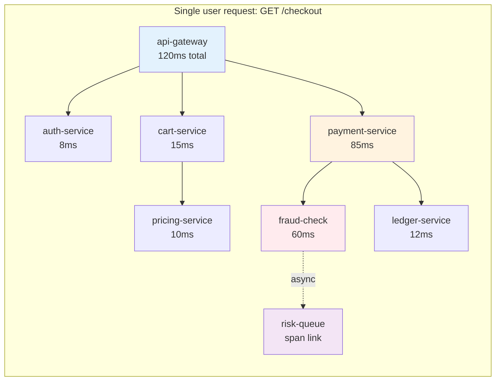
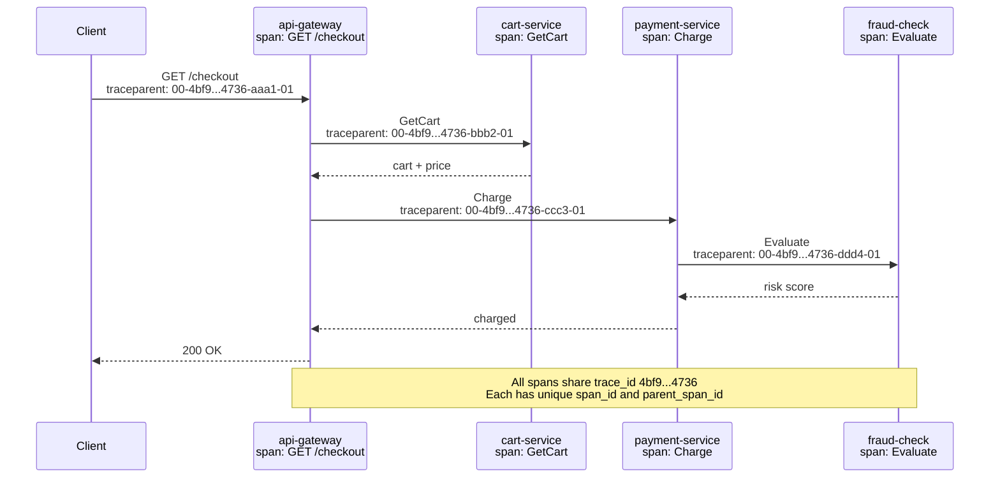
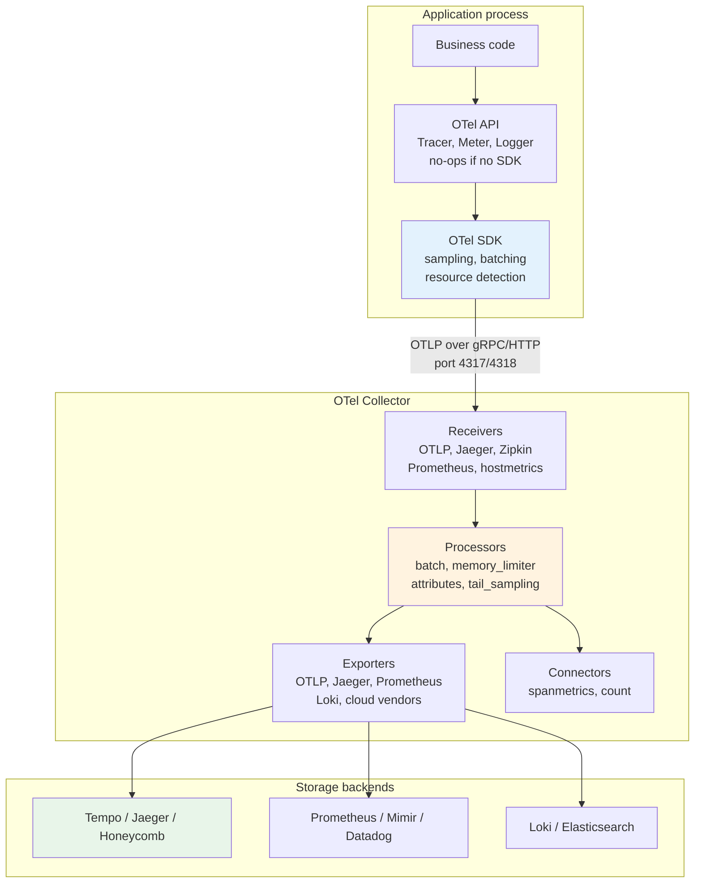
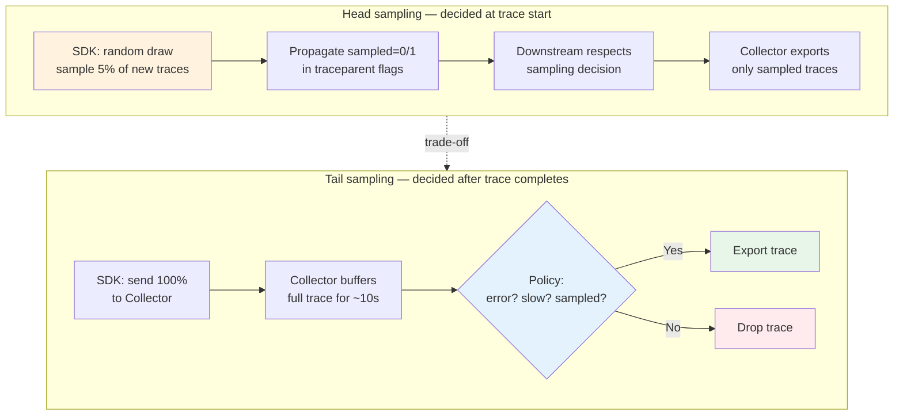
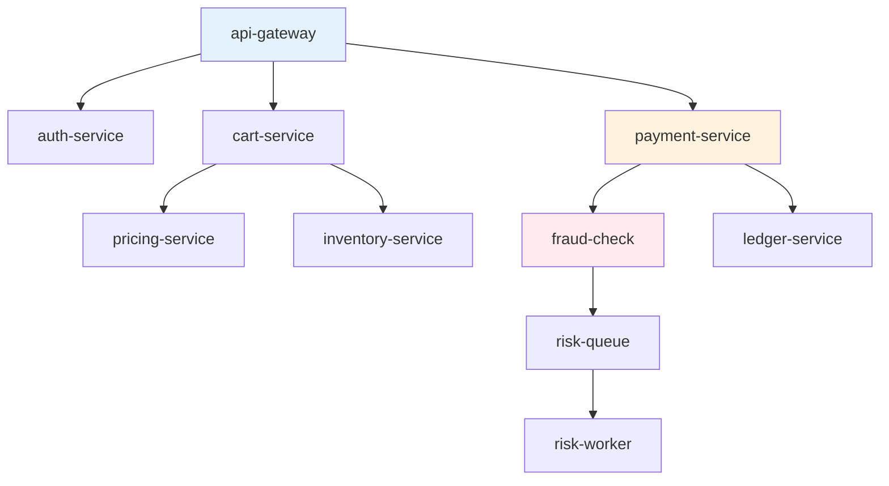
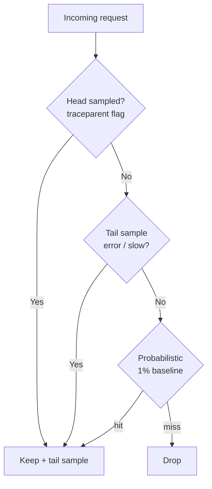
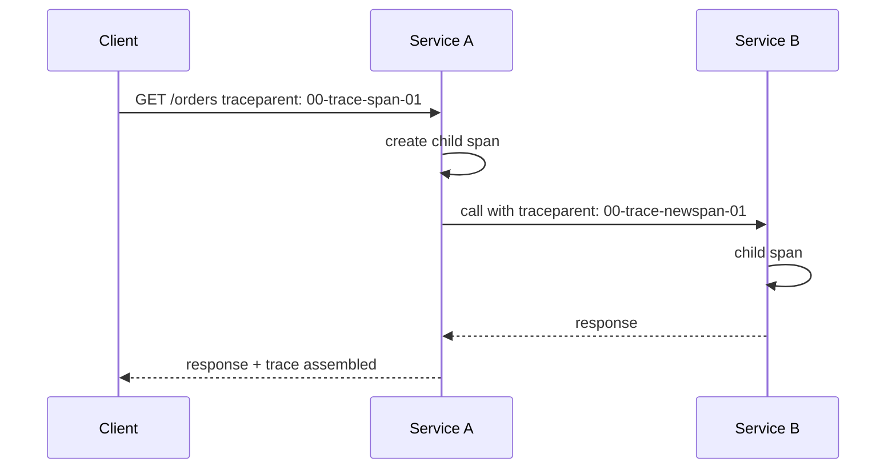

# Chapter 4 — Distributed Tracing and OpenTelemetry

**What this chapter covers.** In a system of dozens or hundreds of services, a single user request fans out into a tree of RPCs, database calls, cache lookups, and async jobs — any of which can be the source of latency or failure. Metrics tell you *that* latency spiked; logs tell you *what each service did*; traces tell you *where time went and which path failed* by stitching the entire request journey into one causal graph. This chapter covers the full tracing stack from first principles to production operation: the trace/span model, W3C context propagation, the OpenTelemetry project (API, SDK, and Collector), instrumentation patterns in Go, Java and Python, Collector pipelines with real YAML, sampling strategies that control cost without losing the traces you need, and the storage and query layer that makes traces useful during incidents. Every concept is grounded in runnable configuration.

Learning goals — after this chapter you should be able to:

- Explain the trace/span model, parent-child relationships, and why distributed context propagation is the central mechanism that makes tracing work.
- Describe the W3C Trace Context (`traceparent`/`tracestate`) and Baggage specifications and how they flow through HTTP, gRPC, and async messaging.
- Instrument services with OpenTelemetry SDKs (manual and automatic) in Go, Java, and Python, adding custom attributes, events, and span links correctly.
- Write a production OpenTelemetry Collector configuration — receivers, processors (batch, attributes, tail sampling), exporters, and pipelines — for both sidecar/agent and gateway deployment models.
- Design a sampling strategy (head, tail, adaptive) that keeps cost bounded while preserving error and high-latency traces.
- Correlate traces with metrics (exemplars) and logs (trace ID injection) and explain how that correlation accelerates incident investigation.
- Evaluate trace storage backends (Jaeger, Grafana Tempo, vendor SaaS) and query patterns (trace lookup, service map, latency histogram) for a given scale.

---

## Why tracing

### The gap that metrics and logs leave

Chapter 2 (metrics) and Chapter 3 (logging) give you two powerful lenses:

| Signal | Answers | Fails when |
|--------|---------|------------|
| Metrics | "Is the service healthy? How many requests are failing?" | You need to know *which* downstream call in a 12-service fan-out is slow |
| Logs | "What did this service do for request X?" | Request X touched 8 services — you must manually join 8 log streams by request ID |

Tracing fills the gap by recording the **causal structure** of a request. A single trace captures:

- Every service the request visited and how they called each other (the call graph).
- How long each operation took and where time was actually spent (latency breakdown).
- Which operation returned an error and how that error propagated (failure path).

Without tracing, debugging a p99 latency regression in a microservice architecture is a manual exercise in correlating timestamps across dashboards. With tracing, it is a single query: show me the slowest spans in traces where `http.route = /checkout` over the last hour.

### When tracing pays for itself

Tracing is not free — instrumentation adds latency, the Collector pipeline consumes resources, and trace storage is significant. It pays for itself when:

- **Request fan-out is deep.** A request that touches 3 services can be debugged with logs alone. A request that fans out to 15 services with parallel branches cannot.
- **Latency is a product requirement.** If p99 latency has an SLO (see Chapter 1), you need traces to attribute latency to the correct component.
- **Ownership is distributed.** When each service is owned by a different team, a trace is the shared artifact that lets teams collaborate without passing log snippets back and forth.
- **Async work is involved.** Queues, background jobs, and event-driven workflows break the request/response model that logs assume. Traces with span links connect the async pieces.



*Figure 4-1: A single checkout request as a trace. The trace reveals that 60 ms of the 85 ms in payment-service was spent in fraud-check — the obvious place to investigate a latency regression. Without the trace you would see only that payment-service is slow.*

---

## The trace data model

### Spans, traces, and relationships

The OpenTelemetry data model (inheriting from Dapper and OpenTracing) has three core concepts:

**Span** — a named, timed operation. Every span carries:

- `name` — operation name (e.g., `GET /checkout`, `SELECT orders`, `fraud.evaluate`).
- `trace_id` — 128-bit identifier shared by all spans in one trace (32 hex chars, e.g., `4bf92f3577b34da6a3ce929d0e0e4736`).
- `span_id` — 64-bit identifier unique within the trace (16 hex chars).
- `parent_span_id` — the span that caused this one. The root span has no parent.
- `start_time` / `end_time` — nanosecond timestamps. Duration is derived.
- `attributes` — key-value pairs (e.g., `http.method=GET`, `db.system=postgresql`, `user.id=42`).
- `status` — `Unset`, `Ok`, or `Error` (with optional description).
- `events` — timestamped annotations within a span (e.g., `cache miss`, `retry attempt 2`).
- `links` — references to other spans/traces (used for async and batch patterns).

**Trace** — the tree (or DAG, when links are used) of all spans sharing a `trace_id`. The trace is the unit of storage and query — you fetch an entire trace to understand one request.

**Span context** — the triple `(trace_id, span_id, trace_flags)` that must be propagated from caller to callee so the callee can create a child span linked to its parent.



*Figure 4-2: Context propagation across a request. Each hop forwards the W3C traceparent header carrying trace_id, parent span_id, and sampling flags so the callee can join the same trace.*

### Span kinds

OTel defines five span kinds that give structure to the trace graph:

| Kind | Meaning | Example |
|------|---------|---------|
| `SERVER` | Handling an incoming request | HTTP handler, gRPC service method |
| `CLIENT` | Making an outgoing request | HTTP client call, gRPC stub invocation |
| `PRODUCER` | Sending a message to a broker | Publishing to Kafka, SQS SendMessage |
| `CONSUMER` | Receiving/processing a message | Kafka consumer poll, SQS handler |
| `INTERNAL` | Work inside a service | Function call, DB query wrapper |

Correct span kinds matter because visualization tools (Jaeger, Grafana) use them to render the service map and to distinguish synchronous RPCs from async messaging.

### Semantic conventions

OTel defines [Semantic Conventions](https://opentelemetry.io/docs/specs/semconv/) — standard attribute names that make traces queryable across services regardless of language:

```
// HTTP server span attributes (semconv)
http.method = "GET"
http.route = "/checkout"
http.status_code = 200
http.scheme = "https"
net.host.name = "api-gateway-7df9b"
net.peer.ip = "10.2.3.44"

// Database span
db.system = "postgresql"
db.name = "orders"
db.statement = "SELECT * FROM orders WHERE id = $1"
db.operation = "SELECT"

// Messaging span
messaging.system = "kafka"
messaging.destination = "risk-events"
messaging.operation = "publish"
messaging.kafka.partition = 3
```

Using semconv means a query like `db.system = "postgresql" AND db.statement CONTAINS "orders"` works across every service that touches Postgres, even if they are written in different languages by different teams.

---

## Context propagation

Context propagation is the mechanism that turns isolated per-service spans into a distributed trace. Without it, each service creates disconnected spans that cannot be correlated.

### W3C Trace Context

The [W3C Trace Context](https://www.w3.org/TR/trace-context/) specification defines two HTTP headers:

**`traceparent`** — carries the span context:

```
traceparent: 00-4bf92f3577b34da6a3ce929d0e0e4736-00f067aa0ba902b7-01
             │  │                                │                │
             │  trace_id (128-bit, 32 hex)       span_id (64-bit) trace_flags (sampled=1)
             └─ version (00)
```

- `version` — always `00` today; future versions may add fields after the flags.
- `trace_flags` — bit 0 is `sampled` (1 = this trace should be recorded). Other bits reserved.

**`tracestate`** — vendor-specific trace data (e.g., tenant, sampling decisions) carried alongside `traceparent`:

```
tracestate: rojo=00f067aa0ba902b7,congo=t61rcWkgMzE
```

`tracestate` is how tail-sampling decisions and multi-tenant routing hints propagate without polluting application headers. Each vendor uses a key (e.g., `rojo`) with an opaque value.

**`baggage`** — separate from trace context, [W3C Baggage](https://www.w3.org/TR/baggage/) carries application-level key-value pairs that travel with the trace but are not part of the trace identity:

```
baggage: user_id=42,tenant=acme,feature_flag=checkout_v2
```

Baggage is powerful (it lets downstream services read `tenant` or `feature_flag` without an extra lookup) but must be used carefully — every baggage key is propagated to every downstream service, so unbounded baggage bloats every request.

### Propagation through different transports

| Transport | How traceparent is carried | Notes |
|-----------|---------------------------|-------|
| HTTP/1.1, HTTP/2 | `traceparent` / `tracestate` headers | Automatic with OTel HTTP instrumentation |
| gRPC | Same headers as HTTP/2 (gRPC is HTTP/2) | Automatic with OTel gRPC interceptors |
| Kafka / AMQP | Message headers (record headers) | Requires explicit propagator; not automatic |
| Async jobs / queues | Injected into job payload or message headers | Application must propagate manually or via SDK helper |
| Databases | Not propagated (DB is leaf span) | No downstream to propagate to |

For async messaging the propagation pattern looks like:

```python
# Producer: inject context into message headers
from opentelemetry import propagate

headers = {}
propagate.inject(headers)  # writes traceparent + tracestate + baggage
kafka_producer.send("risk-events", value=payload, headers=headers)

# Consumer: extract context and create linked span
from opentelemetry import trace, propagate
from opentelemetry.trace.propagation import get_current_span

ctx = propagate.extract(headers)  # reconstructs span context
# Option 1: child span (if consumer is direct continuation)
with trace.get_tracer(__name__).start_as_current_span(
    "process risk-event", context=ctx, kind=trace.SpanKind.CONSUMER
):
    handle_event(payload)

# Option 2: span link (if consumer is async / batch — preferred for queues)
with trace.get_tracer(__name__).start_as_current_span("process risk-event") as span:
    span.add_link(get_current_span(ctx).get_span_context())
    handle_event(payload)
```

The distinction between **child span** and **span link** matters: a child implies the producer causally triggered this specific consumer execution. A link says "this consumer processing is related to that producer trace" without claiming direct parentage — correct for batch consumers that process many producer traces in one poll.

### B3 and other propagators

Some systems still use the [B3 propagation](https://github.com/openzipkin/b3-propagation) format from Zipkin:

```
X-B3-TraceId: 4bf92f3577b34da6a3ce929d0e0e4736
X-B3-SpanId: 00f067aa0ba902b7
X-B3-Sampled: 1
```

OTel supports multiple propagators simultaneously via the composite propagator — essential during migration:

```yaml
# otel-collector.yaml — accept both W3C and B3
receivers:
  otlp:
    protocols:
      http:
        include_metadata: true
```

```go
// Go: accept W3C + B3 on incoming requests
import (
    "go.opentelemetry.io/contrib/propagators/b3"
    "go.opentelemetry.io/otel/propagation"
)
propagation.NewCompositeTextMapPropagator(
    propagation.TraceContext{}, // W3C
    propagation.Baggage{},
    b3.New(),                   // Zipkin B3 (both single and multi-header)
)
```

In SDK configuration, always propagate W3C as the primary format and add B3 only for compatibility with legacy services. New services should emit W3C exclusively.

---

## OpenTelemetry: architecture

OpenTelemetry (OTel) is the CNCF project that unifies tracing, metrics, and logs under one set of APIs, SDKs, and a collector. It is the successor to OpenTracing and OpenCensus (both now deprecated) and is the industry standard for instrumentation.



*Figure 4-3: OpenTelemetry end-to-end architecture. Application code calls the API, the SDK batches and samples, the Collector receives/processes/exports, and storage backends serve queries. The API/SDK split means uninstrumented code has near-zero overhead.*

### API vs SDK separation

This split is deliberate and important:

- **API** — interfaces (`Tracer`, `Meter`, `Logger`) that library and application code calls. The API package has no implementation — if no SDK is registered, every call is a no-op. This means libraries can instrument themselves without forcing a dependency on a specific SDK or backend.
- **SDK** — the implementation that does real work: sampling decisions, span batching, attribute processing, resource detection, and export. Applications register the SDK at startup; libraries never do.

This means you can add OTel to a shared library (`import "go.opentelemetry.io/otel"`) without worrying about which tracing backend the final application uses.

### The Collector

The [OTel Collector](https://opentelemetry.io/docs/collector/) is a standalone binary (often deployed as a sidecar, DaemonSet, or gateway) that receives, processes, and exports telemetry. It is the central control plane for observability data:

- **Decouples applications from backends.** Applications always export OTLP to the Collector; the Collector fans out to whatever backends you use. Switching from Jaeger to Tempo requires changing Collector config, not application code.
- **Centralizes processing.** Sampling, attribute enrichment, filtering, and redaction happen in one place with one configuration — not scattered across every service.
- **Handles backpressure and reliability.** The Collector buffers, retries, and applies backpressure so a slow backend does not block application threads.

Collector deployment models:

| Model | Where it runs | Use case |
|-------|---------------|----------|
| **Agent (sidecar/DaemonSet)** | Alongside each application pod or per-node | Lightweight processing, host resource detection, local batching |
| **Gateway** | Central cluster (often scaled horizontally) | Heavy processing (tail sampling), fan-out to multiple backends, cross-service correlation |
| **Agent + Gateway** | Both (recommended at scale) | Agents handle local concerns, gateways handle global concerns |

At scale, the agent+gateway pattern is standard: agents do cheap per-span work (batching, resource detection), gateways do expensive cross-trace work (tail sampling).

---

## Instrumentation

### Automatic instrumentation

Most OTel SDKs offer auto-instrumentation that wraps common frameworks without code changes:

**Java** — the most mature auto-instrumentation, via a `-javaagent`:

```bash
# No code changes — add the agent jar
java -javaagent:opentelemetry-javaagent.jar \
     -Dotel.service.name=payment-service \
     -Dotel.exporter.otlp.endpoint=http://otel-collector:4317 \
     -Dotel.traces.sampler=parentbased_traceidratio \
     -Dotel.traces.sampler.arg=0.1 \
     -jar payment-service.jar
```

The Java agent instruments Servlet, Spring MVC/WebFlux, gRPC, JDBC, Redis (Lettuce/Jedis), Kafka, and more automatically.

**Python** — via `opentelemetry-instrument`:

```bash
opentelemetry-bootstrap -a install   # auto-detect libraries
opentelemetry-instrument \
    --traces_exporter otlp \
    --exporter_otlp_endpoint http://otel-collector:4317 \
    --service_name cart-service \
    python -m myapp
```

Auto-instruments Flask, Django, FastAPI, requests, psycopg2, pymongo, Celery, and others.

**Go** — no runtime auto-instrumentation (Go lacks bytecode manipulation). Instrumentation is manual or via compile-time wrapping with `otelhttp`, `otelgrpc`, `otelsql`:

```go
import (
    "go.opentelemetry.io/contrib/instrumentation/net/http/otelhttp"
    "go.opentelemetry.io/contrib/instrumentation/google.golang.org/grpc/otelgrpc"
)

// HTTP server — one line wraps the handler
handler := otelhttp.NewHandler(http.HandlerFunc(checkoutHandler), "GET /checkout")
http.Handle("/checkout", handler)

// HTTP client — one line wraps the transport
client := &http.Client{Transport: otelhttp.NewTransport(http.DefaultTransport)}

// gRPC — interceptor on dial and server
conn, _ := grpc.Dial(target,
    grpc.WithStatsHandler(otelgrpc.NewClientHandler()),
)
grpc.NewServer(grpc.StatsHandler(otelgrpc.NewServerHandler()))
```

### Manual instrumentation

Auto-instrumentation covers framework boundaries. Custom business logic needs manual spans:

**Go:**

```go
import (
    "context"
    "go.opentelemetry.io/otel"
    "go.opentelemetry.io/otel/attribute"
    "go.opentelemetry.io/otel/codes"
    "go.opentelemetry.io/otel/trace"
)

var tracer = otel.Tracer("payment-service/charge")

func Charge(ctx context.Context, req ChargeRequest) error {
    ctx, span := tracer.Start(ctx, "payment.Charge",
        trace.WithAttributes(
            attribute.String("payment.method", req.Method),
            attribute.Int64("payment.amount_cents", req.AmountCents),
        ),
    )
    defer span.End()

    // Add events for notable moments within the span
    span.AddEvent("validating payment", trace.WithAttributes(
        attribute.String("card.last4", req.CardLast4),
    ))

    result, err := fraudCheck(ctx, req) // ctx carries span context
    if err != nil {
        span.RecordError(err)
        span.SetStatus(codes.Error, err.Error())
        return err
    }

    span.SetAttributes(attribute.String("fraud.verdict", result.Verdict))
    span.SetStatus(codes.Ok, "")
    return nil
}

func fraudCheck(ctx context.Context, req ChargeRequest) (*FraudResult, error) {
    // Child span — automatically parented via ctx
    _, span := tracer.Start(ctx, "fraud.Evaluate")
    defer span.End()
    // ... call fraud service
    return result, nil
}
```

**Python:**

```python
from opentelemetry import trace
from opentelemetry.trace import Status, StatusCode

tracer = trace.get_tracer("payment.charge")

def charge(req: ChargeRequest) -> None:
    with tracer.start_as_current_span(
        "payment.Charge",
        attributes={
            "payment.method": req.method,
            "payment.amount_cents": req.amount_cents,
        },
    ) as span:
        span.add_event("validating payment", {"card.last4": req.card_last4})

        try:
            result = fraud_check(req)  # context propagated implicitly
            span.set_attribute("fraud.verdict", result.verdict)
            span.set_status(Status(StatusCode.OK))
        except Exception as exc:
            span.record_exception(exc)
            span.set_status(Status(StatusCode.ERROR, str(exc)))
            raise
```

### Instrumentation guidelines

- **Span names should be low-cardinality.** Use `GET /checkout` or `payment.Charge`, not `GET /checkout?user=42`. High-cardinality span names make trace storage and indexing expensive and queries useless.
- **Attributes carry the high-cardinality data.** Put `user.id`, `order.id`, `http.target` in span attributes where they are queryable but do not affect span name indexing.
- **Record errors with `RecordError` / `record_exception`, not just status.** The exception event captures stack trace and type; status alone loses that.
- **Do not create spans for trivial operations.** A span per function call in a tight loop creates millions of spans per trace. Span per RPC, per DB query, per meaningful business step.
- **Propagate context through async boundaries explicitly.** Thread pools, goroutines, and queue consumers do not automatically carry trace context — you must pass `ctx` or inject/extract headers.

---

## The Collector in depth

### Pipeline model

Every Collector pipeline has three stages:

```
Receivers  →  Processors  →  Exporters
 (in)         (transform)     (out)
```

Data flows through pipelines of a single signal type (traces, metrics, or logs). Connectors bridge signals (e.g., `spanmetrics` generates metrics from trace spans).

### Production Collector configuration

Below is a production-grade Collector configuration covering the agent+gateway pattern. The agent config is lightweight; the gateway handles tail sampling and multi-backend export.

**Agent (DaemonSet / sidecar) — `otel-agent.yaml`:**

```yaml
receivers:
  otlp:
    protocols:
      grpc:
        endpoint: 0.0.0.0:4317
      http:
        endpoint: 0.0.0.0:4318

  # Collect host metrics for resource correlation
  hostmetrics:
    collection_interval: 30s
    scrapers:
      cpu: {}
      memory: {}
      load: {}

processors:
  # Detect k8s pod / node / deployment from env
  resourcedetection:
    detectors: [env, system, gcp, eks, aks]
    timeout: 5s

  k8sattributes:
    auth_type: serviceAccount
    passthrough: false
    extract:
      metadata:
        - k8s.pod.name
        - k8s.pod.uid
        - k8s.deployment.name
        - k8s.namespace.name
        - k8s.node.name
    pod_association:
      - sources:
          - from: resource_attribute
            name: k8s.pod.ip
      - sources:
          - from: resource_attribute
            name: k8s.pod.uid
      - sources:
          - from: connection

  # Enrich every span with cluster-level attributes
  resource:
    attributes:
      - key: deployment.environment
        value: production
        action: upsert
      - key: service.version
        from_attribute: app.version
        action: upsert

  memory_limiter:
    check_interval: 1s
    limit_mib: 512
    spike_limit_mib: 128

  batch:
    timeout: 5s
    send_batch_size: 512
    send_batch_max_size: 1024

  # Drop health-check spans that add noise
  filter:
    traces:
      exclude:
        match_type: strict
        bodies:
          - '.*"http.route": "/healthz".*'
        # Better: filter on span attributes (OTTL)
      spans:
        - 'attributes["http.route"] == "/healthz" or attributes["http.route"] == "/readyz"'

exporters:
  otlp/gateway:
    endpoint: otel-gateway.observability.svc.cluster.local:4317
    tls:
      insecure: false
      ca_file: /etc/otel/certs/ca.crt
      cert_file: /etc/otel/certs/tls.crt
      key_file: /etc/otel/certs/tls.key
    sending_queue:
      enabled: true
      num_consumers: 4
      queue_size: 5000
    retry_on_failure:
      enabled: true
      initial_interval: 5s
      max_interval: 30s
      max_elapsed_time: 300s

  # Also expose Prometheus metrics from the agent itself
  prometheus:
    endpoint: 0.0.0.0:8889

service:
  pipelines:
    traces:
      receivers: [otlp]
      processors: [memory_limiter, k8sattributes, resourcedetection, resource, filter, batch]
      exporters: [otlp/gateway]
    metrics:
      receivers: [otlp, hostmetrics]
      processors: [memory_limiter, resourcedetection, resource, batch]
      exporters: [otlp/gateway]

  telemetry:
    logs:
      level: info
    metrics:
      readers:
        - pull:
            exporter:
              prometheus:
                host: 0.0.0.0
                port: 8889
```

**Gateway — `otel-gateway.yaml`:**

```yaml
receivers:
  otlp:
    protocols:
      grpc:
        endpoint: 0.0.0.0:4317
        max_recv_msg_size_mib: 16
      http:
        endpoint: 0.0.0.0:4318

processors:
  memory_limiter:
    check_interval: 1s
    limit_mib: 4096
    spike_limit_mib: 512

  batch:
    timeout: 10s
    send_batch_size: 1024

  # Tail sampling — the key cost control for tracing
  tail_sampling:
    decision_wait: 10s          # how long to wait for all spans in a trace
    num_traces: 100000          # traces held in memory for decision
    expected_new_traces_per_sec: 5000
    policies:
      # Always keep errors and slow traces
      - name: errors
        type: status_code
        status_code: {status_codes: [ERROR]}
      - name: slow-traces
        type: latency
        latency: {threshold_ms: 1000}
      # Keep a sample of health + probe traces for baseline
      - name: probabilistic
        type: probabilistic
        probabilistic: {sampling_percentage: 5}
      # Keep traces for a specific tenant under investigation
      - name: debug-tenant
        type: string_attribute
        string_attribute: {key: tenant, values: [acme-debug]}
      # Composite: slow traces filtered further by attributes
      - name: slow-checkout
        type: composite
        composite:
          max_total_spans_per_second: 1000
          policy_order: [is_checkout, is_slow]
          composite_sub_policy:
            - name: is_checkout
              type: string_attribute
              string_attribute: {key: http.route, values: ["/checkout"]}
            - name: is_slow
              type: latency
              latency: {threshold_ms: 500}

  # Redact sensitive attributes before export
  attributes/redact:
    actions:
      - key: user.email
        action: delete
      - key: http.request.header.authorization
        action: delete
      - key: db.statement
        action: hash  # keep cardinality signal without leaking query text

  # Add cluster-level resource attributes
  resource:
    attributes:
      - key: collector.gateway
        value: otel-gateway
        action: upsert

  # Generate RED metrics from spans — no separate instrumentation needed
  # (configured as a connector, not processor, in newer Collector versions)

connectors:
  spanmetrics:
    namespace: traces_spanmetrics
    dimensions:
      - name: http.method
      - name: http.route
      - name: service.name
    aggregation_temporality: DELTA
    latency_histogram_bins: [2ms, 10ms, 50ms, 100ms, 250ms, 500ms, 1000ms, 2500ms]

  count:
    spans:
      payment.errors:
        description: "Count of error spans in payment-service"
        conditions:
          - 'attributes["service.name"] == "payment-service" and status.code == STATUS_CODE_ERROR'

exporters:
  # Primary trace store — Grafana Tempo
  otlp/tempo:
    endpoint: tempo.observability.svc.cluster.local:4317
    tls: {insecure: true}
    sending_queue: {enabled: true, queue_size: 5000}
    retry_on_failure: {enabled: true, initial_interval: 5s, max_interval: 30s}

  # Fallback / secondary — keep a copy in Jaeger for real-time debugging
  otlp/jaeger:
    endpoint: jaeger-collector.observability.svc.cluster.local:4317
    tls: {insecure: true}

  # Span-derived metrics to Prometheus / Mimir
  prometheusremotewrite:
    endpoint: http://mimir.observability.svc.cluster.local:9009/api/v1/push
    tls: {insecure: true}

  # Debug exporter for troubleshooting (disable in production)
  # debug:
  #   verbosity: basic
  #   sampling_initial: 5
  #   sampling_thereafter: 100

service:
  pipelines:
    traces:
      receivers: [otlp]
      processors: [memory_limiter, tail_sampling, attributes/redact, resource, batch]
      exporters: [otlp/tempo, otlp/jaeger]
    traces/spanmetrics:
      receivers: [otlp]
      processors: [batch]
      exporters: [spanmetrics]         # connector: traces → metrics
    metrics:
      receivers: [spanmetrics]
      processors: [batch]
      exporters: [prometheusremotewrite]
    metrics/count:
      receivers: [count]
      processors: [batch]
      exporters: [prometheusremotewrite]
```

Key design decisions in this configuration:

- **Health-check filtering at the agent** prevents `/healthz` spans from ever reaching the gateway — at 10 probes/second per pod across 500 pods, that is 5,000 spans/second of pure noise.
- **Tail sampling at the gateway** makes the keep/drop decision after seeing the entire trace. Head sampling (decided at the SDK) would have to decide at trace start, before knowing whether the trace contains an error. Tail sampling keeps 100% of error traces regardless of the base sampling rate.
- **Attribute redaction** (`user.email`, `Authorization` header) happens before export — sensitive data never reaches storage.
- **`spanmetrics` connector** generates RED metrics (rate, error, duration) from spans automatically. This means you get service-level latency histograms and error rates without separate metric instrumentation — though dedicated metric instrumentation (Chapter 2) is still preferred for accuracy.

---

## Sampling

Tracing every request at full fidelity is rarely affordable. A service handling 10,000 req/s that creates 5 spans per request produces 50,000 spans/s. At ~1 KB per span, that is ~4 TB/day for one service. Sampling is how you bound that cost.



*Figure 4-4: Head sampling (cheap, early decision, may drop errors) vs tail sampling (expensive, late decision, keeps all interesting traces). In practice most production systems use tail sampling at the gateway with a head-sampling fallback.*

### Sampling strategies compared

| Strategy | Where decided | Cost | Keeps errors? | Keeps slow traces? | Complexity |
|----------|---------------|------|---------------|-------------------|------------|
| **Always on** | SDK | Highest — 100% of spans | Yes | Yes | Trivial |
| **Probabilistic head** (e.g., 5%) | SDK, at trace start | Low — 5% of spans | No — errors in unsampled traces are lost | No | Low |
| **Parent-based** | SDK, inherits from parent | Low | Depends on root decision | Depends on root | Low |
| **Rate limiting** | SDK or Collector | Bounded — N traces/s | No guarantee | No guarantee | Low |
| **Tail sampling** | Collector, after trace completes | Higher — all spans reach Collector, memory for buffering | Yes — policy keeps all errors | Yes — latency policy | Medium — needs gateway memory |
| **Adaptive** | Collector, adjusts rate dynamically | Bounded + smart | Yes, with priority | Yes, with priority | High — needs feedback loop |

### Head sampling configuration

Head sampling is configured in the SDK. It is the fallback when the Collector is unavailable or when you need hard cost bounds:

```go
// Go — parent-based with 5% probabilistic fallback for root spans
import (
    sdktrace "go.opentelemetry.io/otel/sdk/trace"
)

tp := sdktrace.NewTracerProvider(
    sdktrace.WithSampler(sdktrace.ParentBased(
        sdktrace.TraceIDRatioBased(0.05), // 5% for new traces
    )),
    sdktrace.WithBatcher(exporter),
)
```

```yaml
# Collector — equivalent head sampling (applied at receive time)
processors:
  probabilistic_sampler:
    sampling_percentage: 5
```

### Tail sampling — the production choice

Tail sampling buffers every trace for a window (typically 10–30 seconds) then applies policies to decide which traces to keep. The policies shown in the gateway config above illustrate the pattern:

- **`status_code: ERROR`** — keep every trace containing an error span. Non-negotiable — you never want to lose the trace that explains an outage.
- **`latency: threshold_ms: 1000`** — keep every trace where any span exceeds 1 second. Captures latency regressions even when no error occurred.
- **`probabilistic: 5`** — keep 5% of remaining traces as a baseline for normal behavior comparison.
- **Composite policies** — combine conditions for precise targeting (e.g., slow `/checkout` traces specifically).

The cost of tail sampling is memory: the gateway must hold `num_traces` traces in RAM for `decision_wait` seconds. For a system doing 5,000 traces/second with 10-second `decision_wait`, that is 50,000 traces in memory simultaneously. At ~10 KB per trace (multiple spans), that is ~500 MB — which is why the gateway `memory_limiter` is critical.

### Adaptive and intelligent sampling

At very large scale, static tail sampling is not enough. Adaptive approaches include:

- **Rate-adaptive sampling** — the Collector monitors export throughput and adjusts the probabilistic percentage to stay within a target (e.g., 100 traces/second per service).
- **Error-biased sampling** — always keep errors, sample successes at a lower rate, sample slow successes at a higher rate.
- **Span-level filtering** — drop noisy child spans (e.g., cache lookups that succeed) even within a kept trace to reduce storage without losing the important spans.

The principle: **spend your trace budget on traces that teach you something** — errors, latency outliers, and traces for services under active investigation. Uniform random sampling wastes budget on healthy traces that look the same.

---

## Correlating traces with metrics and logs

Traces in isolation are useful; traces correlated with metrics and logs are transformative during incidents.

### Trace → metrics: exemplars and spanmetrics

**Exemplars** attach a trace ID to a metric data point, so a latency histogram bucket can link directly to the traces that fell in that bucket:

```
# Prometheus histogram with exemplar
http_server_duration_seconds_bucket{le="0.25",route="/checkout"} 4821
  # {trace_id="4bf92f3577b34da6a3ce929d0e0e4736"} 0.234

http_server_duration_seconds_bucket{le="0.5",route="/checkout"} 5103
  # {trace_id="0813a1f72d2e4a1b8c9d0e7f6a5b4c3d2"} 0.487
```

In Grafana, clicking the exemplar dot in a latency panel jumps directly to the trace. The `spanmetrics` connector in the gateway config generates these automatically from spans — every span's duration becomes a histogram observation tagged with the trace that produced it.

**Span-derived metrics** (via the `spanmetrics` connector) generate RED metrics without separate instrumentation:

```promql
# Error rate derived from spans — no separate metric instrumentation
sum(rate(traces_spanmetrics_calls_total{status_code="STATUS_CODE_ERROR"}[5m]))
  /
sum(rate(traces_spanmetrics_calls_total[5m]))

# p99 latency derived from spans
histogram_quantile(0.99,
  sum(rate(traces_spanmetrics_latency_bucket[5m])) by (le, service_name)
)
```

These are convenient but less accurate than dedicated metric instrumentation (Chapter 2) because they inherit sampling — if you sample at 5%, your span-derived metrics have 20× less data than real metrics.

### Trace → logs: trace ID injection

Every log line should carry `trace_id` and `span_id` so that searching for `trace_id=4bf9...4736` across all services reconstructs the full log story for one trace. Most OTel SDKs and log bridges do this automatically:

```go
// Go — slog with trace correlation
import (
    "log/slog"
    "go.opentelemetry.io/contrib/bridges/otelslog"
    "go.opentelemetry.io/otel/trace"
)

// otelslog bridge injects trace_id/span_id automatically
logger := otelslog.NewLogger("payment-service")

// Or manual injection:
func logWithTrace(ctx context.Context, msg string) {
    sc := trace.SpanContextFromContext(ctx)
    slog.Info(msg,
        "trace_id", sc.TraceID().String(),
        "span_id", sc.SpanID().String(),
        "trace_sampled", sc.IsSampled(),
    )
}
```

```python
# Python — structlog with trace correlation
import structlog
from opentelemetry import trace

def add_trace_info(_, __, event_dict):
    span = trace.get_current_span()
    ctx = span.get_span_context()
    if ctx.is_valid:
        event_dict["trace_id"] = format(ctx.trace_id, "032x")
        event_dict["span_id"] = format(ctx.span_id, "016x")
        event_dict["trace_sampled"] = ctx.trace_flags.sampled
    return event_dict

structlog.configure(processors=[add_trace_info, structlog.processors.JSONRenderer()])
```

```yaml
# Collector — ensure trace_id flows into log records (OTel Logs)
processors:
  transform/logs:
    log_statements:
      - context: log
        statements:
          - set(attributes["trace_id"], trace_id.string) where trace_id != nil
          - set(attributes["span_id"], span_id.string) where span_id != nil
```

In the query layer, this enables the golden incident workflow:

1. Alert fires on a metric threshold (Chapter 2).
2. Click exemplar → jump to a representative trace.
3. From the trace, click any span → jump to logs for that `trace_id`+`span_id` in that service.
4. Read the error log line that explains the failure.

This three-way correlation (metrics → traces → logs) is why OTel unifies all three signals under one context propagation mechanism.

---

## Storage and query

### Backend options

| Backend | Architecture | Query model | Strengths | Trade-offs |
|---------|-------------|-------------|-----------|------------|
| **Jaeger** | Cassandra / Elasticsearch / Badger | Trace ID lookup, service/operation search, duration filter | Mature, simple, good for small-medium scale | Elasticsearch cost at large scale; limited TraceQL |
| **Grafana Tempo** | Object storage (S3/GCS) + optionalTraceQL | TraceQL — powerful trace query language | Extremely cost-efficient (object storage), scales to massive trace volume | Newer, fewer operational guides |
| **Honeycomb** | Columnar SaaS | BubbleUp, derived columns, SLO heatmaps | Best-in-class query UX, designed for high-cardinality | Vendor lock-in, cost at scale |
| **Datadog / New Relic** | SaaS | Integrated APM (traces + metrics + logs) | Single pane of glass, zero storage ops | Highest cost, deepest lock-in |
| **ClickHouse** | ClickHouse | SQL over trace tables | Flexible, cost-efficient if you already run ClickHouse | You operate it |

For most teams, **Tempo + Grafana** is the recommended starting point for self-hosted, and a SaaS APM for teams that prefer not to operate storage.

### TraceQL and Jaeger queries

TraceQL (Tempo) lets you search traces by span attributes, duration, and structure — far beyond simple trace ID lookup:

```traceql
# Find slow checkout traces that hit payment-service
{ resource.service.name = "payment-service" && span.http.route = "/checkout" && duration > 500ms }

# Find traces with an error in any span, grouped by root service
{ status = error } | by(resource.service.name) | count() > 10

# Find traces where fraud-check was called and took > 100ms
{ span.name = "fraud.Evaluate" && duration > 100ms }

# Structural query: traces where cart-service called pricing-service
{ resource.service.name = "cart-service" } >> { resource.service.name = "pricing-service" }
```

Jaeger queries are more limited but still effective:

```
# Jaeger UI search
Service: payment-service
Operation: Charge
Tags: http.route="/checkout" error=true
Min Duration: 500ms
Lookback: 1h
Limit: 20
```

### Service map

Both Jaeger and Grafana derive a **service map** from traces — the directed graph of which services call which:



*Figure 4-5: Service map derived from traces. The Collector's servicegraph connector or Tempo's metrics-generator builds this automatically — no manual topology definition needed.*

---

## Operating tracing in production

### Overhead and performance

Tracing overhead comes from three places:

| Source | Typical overhead | Mitigation |
|--------|-----------------|------------|
| **Span creation** (allocation, timestamps) | ~1–5 µs per span | Do not create spans in tight loops; batch small operations into one span |
| **Context propagation** (header serialization) | Negligible (a few bytes per request) | No action needed |
| **Export** (serialization, network) | Batch exporter amortizes; ~1–2% CPU at 5% sampling | Tune `BatchSpanProcessor` queue size and batch timeout |
| **Collector** (processing, tail sampling memory) | Gateway memory scales with trace rate × decision_wait | Set `memory_limiter` and `num_traces` appropriately; scale gateways horizontally |

Measured overhead for a typical Go service at 5% head sampling + tail sampling at the gateway is under 2% CPU and under 5 MB heap for the SDK. Auto-instrumented Java services see slightly higher overhead (3–5% CPU) due to bytecode instrumentation.

### Resource and deployment

Collector sizing depends on trace throughput:

| Trace throughput | Agent (per node) | Gateway (per replica) | Storage (Tempo, per day) |
|-----------------|------------------|-----------------------|--------------------------|
| 100 traces/s | 0.2 CPU / 256 MB | 0.5 CPU / 512 MB | ~10 GB (with compression) |
| 1,000 traces/s | 0.5 CPU / 512 MB | 1 CPU / 2 GB | ~100 GB |
| 10,000 traces/s | 1 CPU / 1 GB | 4 CPU / 8 GB (× N replicas) | ~1 TB |

Scale gateways horizontally with a consistent hash on `trace_id` so all spans for one trace land on the same gateway instance (required for tail sampling). Most Collector distributions support this via the `loadbalancing` exporter or a hash-ring sidecar.

### Security considerations

- **Do not put PII or secrets in span attributes or names.** Span data is stored in trace backends that may have broader access than application databases. Use the `attributes/redact` processor to strip sensitive fields before export.
- **Trace IDs are not secrets but can leak information.** A `trace_id` in a URL or error message tells an attacker that tracing is active and may reveal internal service topology via error details.
- **Baggage propagation can leak tenant or user data** to every downstream service. Restrict baggage keys to non-sensitive, low-cardinality values.

### Distributed-systems lens

In a distributed backend, tracing is not optional tooling — it is the only signal that captures **causality across service boundaries**. Consider what breaks without it:

- **Debugging tail latency.** A p99 regression from 200 ms to 800 ms could be caused by any of 15 services. Metrics show *which* service's latency histogram shifted; traces show *which span inside that service* (a specific DB query, a downstream call, lock contention) is the root cause. Without traces, each team checks their own dashboards and the investigation stalls at team boundaries.

- **Understanding failure propagation.** When `payment-service` returns 500 to `api-gateway`, the trace shows whether the error originated in `payment-service` itself, in `fraud-check` downstream, or in a timeout between them — three very different remediation paths.

- **Validating async workflows.** Event-driven architectures (Chapter 10 — Messaging) break the synchronous request model. Span links are the only mechanism that connects a Kafka publish in one service to its consumption in another, minutes later, possibly in a different availability zone.

- **Capacity and dependency reasoning.** The service map derived from traces is the ground truth of runtime dependencies — not what the architecture diagram says, but what actually calls what in production, with real latency and error rate annotations. It reveals unexpected dependencies (a service you thought was isolated actually calls a shared database) and unused ones (a declared dependency that never appears in traces).

---


<!-- Batch C: additional diagrams -->

#### Sampling Decision



#### Trace Context Propagation



## Key takeaways

- A **trace** is the causal graph of one request across all services; a **span** is one timed operation within that graph. Parent-child relationships and W3C `traceparent` propagation stitch isolated per-service spans into a single distributed trace.
- **W3C Trace Context** (`traceparent` + `tracestate`) is the standard propagation format; carry it on HTTP/gRPC headers automatically and on message headers explicitly. Use **span links** (not parent-child) for async/batch consumers where one consumer handles many producer traces.
- **OpenTelemetry** separates a no-op **API** (what libraries call) from a real **SDK** (what applications configure) and a **Collector** (the pipeline that receives, processes, and exports). The Collector's agent+gateway deployment is standard at scale — agents handle local batching and enrichment, gateways handle tail sampling and multi-backend fan-out.
- **Auto-instrumentation** (Java agent, Python `opentelemetry-instrument`, Go `otelhttp`/`otelgrpc`) covers framework boundaries; **manual spans** cover business logic. Keep span names low-cardinality and put high-cardinality data in attributes.
- A production **Collector configuration** uses `memory_limiter`, `k8sattributes`, `resourcedetection`, `filter` (drop health checks), `batch`, `tail_sampling` (keep all errors + slow traces, sample the rest), `attributes/redact` (strip PII), and `spanmetrics`/`count` connectors to generate metrics from traces.
- **Head sampling** (probabilistic at the SDK) is cheap but may drop the error trace you need; **tail sampling** (at the gateway, after seeing the full trace) keeps all errors and slow traces by policy at the cost of gateway memory. Use tail sampling as the primary strategy with head sampling as a safety valve.
- **Three-way correlation** — metrics (exemplars) → traces → logs (trace ID injection) — is the fastest path from alert to root cause. Every log line should carry `trace_id`/`span_id`, and every latency histogram should carry exemplars that link back to traces.
- **Trace storage** choice (Jaeger, Tempo, Honeycomb, vendor SaaS) depends on scale, cost tolerance, and operational appetite; **TraceQL** (Tempo) is the most expressive query language, supporting duration, attribute, and structural queries.

---

## Further reading

- OpenTelemetry Documentation — *Concepts*, *Instrumentation*, *Collector* (https://opentelemetry.io/docs/concepts/signals/traces/, https://opentelemetry.io/docs/collector/)
- W3C Trace Context Specification (https://www.w3.org/TR/trace-context/) and W3C Baggage Specification (https://www.w3.org/TR/baggage/)
- OpenTelemetry Semantic Conventions — *Trace* (https://opentelemetry.io/docs/specs/semconv/general/trace/)
- OpenTelemetry Collector — *Tail Sampling Processor*, *Transform Processor*, *Connectors* (https://opentelemetry.io/docs/collector/configuration/)
- Grafana Tempo Documentation — *TraceQL* (https://grafana.com/docs/tempo/latest/traceql/)
- Jaeger Documentation — *Architecture*, *Sampling*, *Deployment* (https://www.jaegertracing.io/docs/)
- Cindy Sridharan, *Distributed Systems Observability* (O'Reilly, 2018) — still the best conceptual framing of metrics/traces/logs as a unified system.
- Ben Sigelman et al., *Dapper, a Large-Scale Distributed Systems Tracing Infrastructure* (Google, 2010) — the paper that defined the trace/span model (https://research.google/pubs/pub36356/).
- Yuri Shkuro, *Mastering Distributed Tracing* (Packt, 2019) — practical guide to Jaeger and trace data modeling.
- Honeycomb — *Distributed Tracing Concepts* (https://docs.honeycomb.io/concepts/distributed-tracing/)
