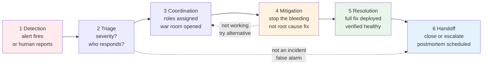
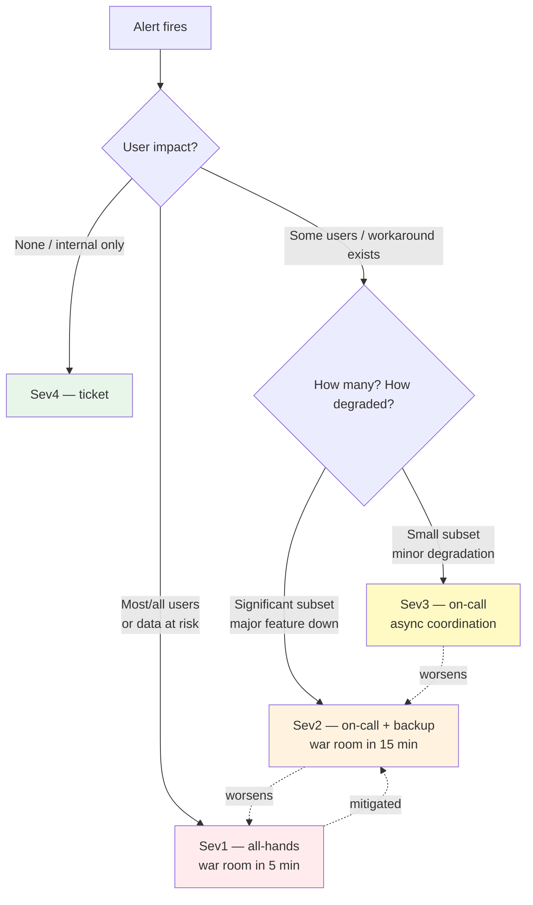
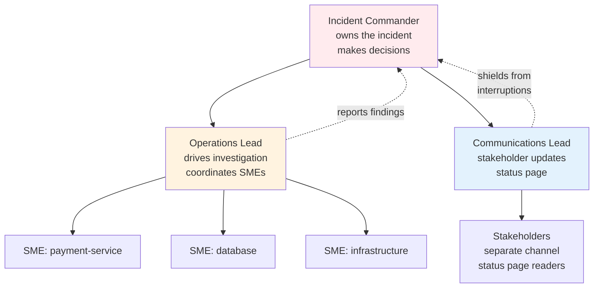
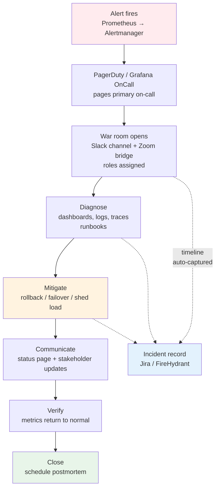

# Chapter 5 — Incident Response and On-Call

**What this chapter covers.** No matter how well you design for reliability, production will break — at 3 AM, during a deploy, under unexpected load, or from a dependency you did not know you had. What separates teams that recover in minutes from teams that flail for hours is not heroics but process: a practiced incident response framework, clear roles, reliable detection and paging, and an on-call culture that is sustainable rather than burning people out. This chapter covers the full incident lifecycle from detection to resolution to handoff, the roles and coordination mechanisms that make response effective, on-call design including rotations, paging policies, and alert quality, and the operational tooling (status pages, runbooks, incident management platforms) that supports response at scale. Every concept is grounded in production configurations: PagerDuty and Grafana OnCall schedules, Alertmanager routing, and executable runbooks.

Learning goals — after this chapter you should be able to:

- Describe the incident lifecycle — detection, triage, coordination, mitigation, resolution, and handoff — and the goal of each phase.
- Define and operate the core incident roles (Incident Commander, Communications Lead, Operations Lead, Subject Matter Experts) and explain why role separation matters under stress.
- Design an on-call rotation that balances coverage, fairness, and sustainability, including primary/secondary shadows, follow-the-sun, and compensation.
- Configure alert routing (Alertmanager, Grafana Alerting, PagerDuty) so that the right person is paged for the right severity with minimal noise.
- Write executable runbooks that guide responders through diagnosis and mitigation without requiring tribal knowledge.
- Manage incident communications — internal stakeholder updates, customer-facing status pages, and executive briefings — without slowing down the technical response.
- Explain how incident response interacts with SLIs/SLOs (Chapter 1), observability (Chapters 2–4), and postmortems (Chapter 6) as a unified reliability system.

---

## Why incident response

### Incidents are inevitable

Three facts guarantee that every production system will have incidents:

1. **Distributed systems have failure modes you cannot fully anticipate.** Network partitions, cascading overload, subtle consistency bugs, and emergent interactions between services that were correct in isolation but fail in combination. Testing and review reduce the rate but never eliminate it.

2. **Change is constant.** Hundreds of deploys per week, dependency updates, configuration changes, and infrastructure operations each carry a small probability of causing an incident. At high deploy frequency, even a 0.1% incident-per-deploy rate produces regular incidents.

3. **Humans are in the loop.** Operational mistakes — wrong config pushed, query run against production, secret rotated without updating consumers — are not moral failures but predictable consequences of complex systems operated under time pressure.

The question is not whether you will have incidents but **how quickly and calmly you recover**. That is what incident response discipline determines.

### The cost of poor response

| Failure mode | What happens | Cost |
|-------------|-------------|------|
| No clear commander | Multiple people attempt conflicting mitigations simultaneously | Longer MTTR, risk of making things worse |
| Alerts paged the wrong person | On-call for service A is woken for a failure in service B they cannot fix | Wasted attention, slower response, burnout |
| No communication structure | Stakeholders flood the response channel asking for updates | Responders context-switch away from fixing the problem |
| No runbooks | Responder must reverse-engineer the system under time pressure | Longer MTTR, inconsistent response quality |
| No severity framework | Every anomaly becomes a Sev1; responders cannot prioritize | Alert fatigue, true emergencies drowned in noise |
| Unsustainable on-call | Same people always on call, frequent night pages, no recovery time | Burnout, attrition, declining response quality |

Good incident response is not about preventing incidents (that is Chapters 7–10) but about **minimizing their duration and blast radius** when they happen — and doing so in a way that does not burn out the people responsible for responding.

---

## The incident lifecycle

Every incident moves through the same phases, though the boundaries blur and phases may overlap or repeat:



*Figure 5-1: The incident lifecycle. Mitigation and coordination loop until the bleeding stops; resolution follows only when the fix is verified. Many teams merge mitigation and resolution — the critical distinction is that mitigation restores service even if the root cause is not yet fixed.*

### Phase 1: Detection

Detection is either **automated** (an alert fires when an SLI breaches its SLO, see Chapter 1) or **human-reported** (a customer, support engineer, or internal user notices something wrong).

Automated detection quality determines everything downstream. Good detection has:

- **Low time-to-detect (TTD).** The gap between "service is broken" and "someone knows" should be seconds to low minutes, not the time until a customer reports it. This requires SLI-based alerting (Chapter 1), not just infrastructure alerts.
- **Low false positive rate.** If detection fires frequently when nothing is wrong, responders learn to ignore it. The alert that cried wolf is worse than no alert — it trains people to distrust the system.
- **Clear signal.** The alert should say *what* is wrong and *where*, not just that something somewhere is unhappy. `payment-service p99 latency > 2s for 5m` is actionable; `something is slow` is not.

Detection gaps are common. Typical blind spots: async job failures (no user-facing latency signal), data corruption (no error rate signal), and partial degradation (error rate within SLO but affecting a specific tenant or feature).

### Phase 2: Triage

Triage answers three questions:

1. **Is this a real incident?** Not every alert is an incident. A brief latency spike that self-recovers, a single pod crash that Kubernetes rescheduled, or a canary deploy that was automatically rolled back may not need a coordinated response. Triage filters signal from noise.

2. **How severe is it?** Severity drives how many people are mobilized and how urgiaently. Most organizations use a 3–4 level scale (detailed below).

3. **Who should respond?** The on-call for the affected service is the default, but triage may determine that the issue is actually in a dependency — routing to the wrong team wastes critical minutes.

Triage should take **minutes, not tens of minutes**. If triage is slow, severity defaults upward (treat it as more severe until proven otherwise) — it is cheaper to mobilize and stand down than to under-respond to a real Sev1.

### Phase 3: Coordination

Once an incident is declared, coordination begins:

- **A war room is opened** — a dedicated Slack channel, Zoom bridge, or incident management tool session where all response activity happens. One place, not scattered DMs.
- **Roles are assigned** — Incident Commander, Communications Lead, Operations Lead (detailed below). Roles are claimed explicitly ("I am IC"), not assumed.
- **Status is tracked** — a shared document or incident tool records timeline, actions taken, and current hypothesis. Without a written timeline, nobody remembers what was tried and when.

The coordination phase is where untrained teams fail most visibly. Without a designated commander, everyone talks at once, nobody has the full picture, and contradictory mitigations are attempted simultaneously.

### Phase 4: Mitigation

Mitigation means **stopping the bleeding** — restoring service to users, even if the root cause is not yet understood or fixed. Mitigation options in rough order of preference:

| Mitigation | When to use | Example |
|-----------|-------------|---------|
| **Rollback** | Recent deploy or config change is the likely cause | `kubectl rollout undo`, feature flag off, revert config |
| **Failover** | One zone/region is affected | DNS cutover, traffic shift via load balancer |
| **Load shedding / degradation** | System is overloaded | Disable non-critical features, shed low-priority traffic |
| **Scale up** | Resource exhaustion (CPU, connections, queue depth) | HPA bump, manual replica increase, DB connection pool increase |
| **Kill switch** | A specific code path or integration is causing the failure | Feature flag, circuit breaker forced open |

The key principle: **mitigate first, diagnose second**. Rolling back a suspect deploy takes seconds and may fully resolve the incident. Investigating why the deploy broke while users are still impacted trades user pain for responder curiosity.

### Phase 5: Resolution

Resolution means the **root cause is fixed, verified, and deployed**. Resolution is not the same as mitigation:

- Mitigation: "We rolled back the deploy and error rates returned to normal."
- Resolution: "We identified the N+1 query in the new code path, fixed it, verified the fix in staging, deployed it, and confirmed error rates remain normal on the new code."

Many incidents have a long gap between mitigation and resolution. The service is restored quickly (good), but the underlying bug remains on a branch waiting for a proper fix. That is acceptable — mitigation buys time for a careful resolution rather than a rushed hotfix that introduces a new incident.

### Phase 6: Handoff and closure

Closure includes:

- **Verification** that all metrics (not just the one that alerted) have returned to normal for a sustained period.
- **Customer communication** that the incident is resolved, with an initial summary.
- **Postmortem scheduling** (Chapter 6) for incidents above a severity threshold.
- **Handoff** if the incident spans an on-call rotation boundary — the outgoing IC briefs the incoming IC on current status, actions taken, and remaining work.

---

## Severity levels

Severity classification determines response urgency, who is mobilized, and what communication is required. Every organization defines its own levels; the structure below is representative:

| Severity | Definition | Response | Communication |
|----------|-----------|----------|---------------|
| **Sev1 / Critical** | Complete service outage or data loss/corruption affecting all or most users | All-hands, IC assigned immediately, war room within 5 minutes | Status page, executive notification, continuous updates every 15–30 min |
| **Sev2 / Major** | Significant degradation — elevated error rates, major feature unavailable, or performance far outside SLO | On-call + backup paged, IC assigned, war room within 15 minutes | Status page, stakeholder notification, updates every 30–60 min |
| **Sev3 / Minor** | Limited impact — small subset of users, workaround available, or early warning of potential escalation | On-call paged, async coordination in Slack | Internal channel update, no external communication unless escalates |
| **Sev4 / Low** | No user impact — internal tooling issue, non-critical alert, or anomaly worth tracking | Ticket created, handled during business hours | None |

Severity is assessed by **impact**, not cause. A one-line config typo that takes down the entire API is Sev1 regardless of how trivial the fix is. Conversely, a complex distributed systems bug that affects 0.1% of requests and has a workaround may be Sev3 even though the investigation is hard.

Severity can change during an incident. An incident that starts as Sev3 ("one availability zone showing elevated latency") may escalate to Sev1 ("latency is actually caused by a database failover that is now affecting all zones"). The IC owns severity assessment and re-classification.



*Figure 5-2: Severity classification as a decision tree. Start from user impact, not technical cause. Arrows show escalation and de-escalation paths that the IC manages.*

---

## Roles

Clear roles prevent the most common failure mode of incident response: everyone trying to do everything and nobody doing what is actually needed.

### Incident Commander (IC)

The IC owns the incident. Not the fix — the *incident*. Responsibilities:

- **Owns coordination.** Decides what to try, in what order, and who does what. Is the single point of authority for mitigation decisions.
- **Maintains situational awareness.** Keeps the timeline, tracks hypotheses, ensures the war room has a shared picture.
- **Makes the hard calls.** When to escalate severity, when to page additional teams, when to try a risky mitigation because the safe one is not working.
- **Does not fix the problem directly.** The IC who is heads-down debugging a query has stopped commanding. Hands on keyboard and command cannot coexist — the IC delegates technical work.

Anyone can be IC. In many organizations the on-call who first responds becomes IC by default until someone more senior or more appropriate takes over with an explicit handoff: "I am taking IC from you — you are now Ops Lead."

### Operations Lead (Ops Lead)

The Ops Lead drives the technical investigation and mitigation:

- Executes or delegates diagnostic steps (check dashboards, read logs, examine traces).
- Proposes mitigations to the IC for approval.
- Coordinates the technical contributors (SMEs) — assigns tasks, collects findings, reports status to the IC.

In small incidents the IC and Ops Lead may be the same person. In larger incidents they must be separate — the IC cannot simultaneously maintain the big picture and debug a database.

### Communications Lead (Comms)

The Comms Lead owns all communication *out* of the war room:

- Posts regular stakeholder updates (internal Slack, status page, executive bridge).
- Fields incoming questions so the IC and Ops Lead are not interrupted.
- Ensures status page accuracy — the single source of truth for customers.
- Prepares the initial customer-facing summary when the incident resolves.

Without a Comms Lead, every stakeholder DM goes to the IC, who must context-switch from commanding to answering the same question five times.

### Subject Matter Experts (SMEs)

SMEs are the engineers who know the affected systems deeply. They are brought in by the IC as needed:

- Diagnose within their domain (database, networking, specific service).
- Execute mitigations within their domain (run the rollback, adjust the config, scale the cluster).
- Report findings to the Ops Lead, not directly to stakeholders.

SMEs are **not** expected to manage the incident. Their job is to answer "what is happening in your system and what can we do about it" and then do what the IC decides.

### Stakeholders and observers

Everyone else — managers, product, support, executives — are observers. They belong in a separate communication channel (or the status page), not in the war room. The Comms Lead bridges the two. This is not about secrecy — it is about protecting the responders' ability to focus.



*Figure 5-3: Incident role structure. The IC sits above the technical and communication tracks; SMEs report through Ops Lead; stakeholders are shielded from the war room by the Comms Lead.*

---

## On-call

### Rotation design

On-call means being available to respond to pages outside normal working hours. How the rotation is structured determines whether it is sustainable or leads to burnout.

**Basic rotation:**

```
Week 1:  Alice  (primary)    Bob    (secondary / shadow)
Week 2:  Bob    (primary)    Carol  (secondary)
Week 3:  Carol  (primary)    Alice  (secondary)
Week 4:  Alice  (primary)    Bob    (secondary)   ← repeats
```

- **Primary** is paged first. Must acknowledge within a configured window (typically 5 minutes) or the page escalates.
- **Secondary** is paged if primary does not acknowledge, or can be pulled in by primary when the incident needs more hands.

**Patterns for larger organizations:**

| Pattern | How it works | When to use |
|---------|-------------|-------------|
| **Follow-the-sun** | On-call follows business hours across regions — APAC covers APAC hours, EMEA covers EMEA hours, Americas covers Americas hours | Global teams where night pages can be eliminated entirely |
| **Split weekday/weekend** | Different people cover weekdays vs weekends | When weekend load differs from weekday |
| **Tiered escalation** | L1 (service on-call) → L2 (platform/infra) → L3 (engineering leadership) | When incidents frequently require cross-team escalation |
| **Shadow / trainee** | A new team member shadows the primary without being paged, learning the systems | Onboarding, knowledge distribution |

**Rotation mechanics that matter:**

- **Handoff is explicit.** At rotation boundary, outgoing and incoming on-call do a live handoff: open incidents, recent deploys, known risks, pending follow-ups. A Slack message is not enough for a complex week.
- **No one is on call two weeks in a row** without explicit consent. Back-to-back rotations compound fatigue.
- **Time zone awareness.** A rotation that pages someone at 3 AM their time when a teammate in another zone is wide awake is a design failure, not an operational necessity.

### Compensation and sustainability

On-call is work. Treating it as an invisible expectation rather than compensated labor is the fastest path to burnout and attrition.

- **Compensate on-call time**, not just incident time. Being tethered to a pager — unable to travel, restricted in activities, sleeping lightly — has a cost even on quiet nights. Common models: additional pay, time off in lieu, or reduced sprint load during on-call weeks.
- **Track page frequency and out-of-hours load.** If the same service pages 3 times per week at night, the problem is not on-call — it is alert quality or service reliability. Fix the cause, not the schedule.
- **Measure and limit pages per rotation.** Industry guidelines suggest no more than 2 pages per on-call shift should require waking up; more than that indicates the service or its alerts need work.
- **Post-incident recovery.** After a severe or prolonged incident (especially at night), the responders should have explicit recovery time — no expectation to be fully productive the next morning.

### Paging policies

A paging policy defines how an alert reaches a human:

```
Alert fires
  → Route by labels (service, severity, environment)
    → Notify primary on-call via push + SMS + phone call
      → If no ack in 5 min → escalate to secondary
        → If no ack in 5 min → escalate to team lead / manager
          → If no ack → escalate to org-wide on-call
```

Real PagerDuty configuration:

```yaml
# pagerduty-service.yaml — escalation policy
escalation_policy:
  name: payment-service
  num_loops: 2                    # loop through escalation levels twice before giving up
  rules:
    - escalation_delay_in_minutes: 5
      targets:
        - type: schedule
          id: P12345              # primary rotation schedule
    - escalation_delay_in_minutes: 5
      targets:
        - type: schedule
          id: P67890              # secondary / backup schedule
    - escalation_delay_in_minutes: 10
      targets:
        - type: user
          id: U11111              # engineering manager
        - type: schedule
          id: P99999              # org-wide fallback

# Grafana OnCall — equivalent routing
# (Grafana OnCall is the open-source alternative to PagerDuty)
```

Alertmanager routing (Prometheus ecosystem):

```yaml
# alertmanager.yaml — route alerts to the correct receiver
route:
  group_by: [alertname, service, severity]
  group_wait: 30s          # wait before sending first notification (allows grouping)
  group_interval: 5m       # wait before sending additional notifications for same group
  repeat_interval: 4h      # re-notify if alert remains firing
  receiver: default
  routes:
    - matchers:
        - severity = "critical"
        - service = "payment-service"
      receiver: pagerduty-payment-critical
      continue: false
    - matchers:
        - severity = "critical"
      receiver: pagerduty-critical
    - matchers:
        - severity = "warning"
      receiver: slack-warnings
      group_interval: 30m   # warnings are less urgent — batch more aggressively
    - matchers:
        - severity = "info"
      receiver: slack-info
      group_interval: 1h

receivers:
  - name: pagerduty-payment-critical
    pagerduty_configs:
      - service_key: <pagerduty-integration-key>
        severity: critical
        details:
          firing: '{{ template "pagerduty.firing" . }}'
        client: "Prometheus Payment"
        client_url: '{{ template "pagerduty.url" . }}'

  - name: slack-warnings
    slack_configs:
      - api_url: <slack-webhook-url>
        channel: "#alerts-warnings"
        title: '{{ range .Alerts }}{{ .Annotations.summary }}{{ end }}'
        text: '{{ range .Alerts }}{{ .Annotations.description }}{{ end }}'

inhibit_rules:
  # If payment-service is fully down (critical), suppress warning alerts for same service
  - source_matchers: ['severity="critical"', 'service="payment-service"']
    target_matchers: ['severity="warning"', 'service="payment-service"']
    equal: ['service']
```

Key design principles:

- **Route by severity and service**, not by alert name. The routing tree should ensure a `critical` alert for `payment-service` pages the payment team, not a generic on-call.
- **Group related alerts** — 10 firing alerts for the same service should produce one page with 10 alert details, not 10 separate pages.
- **Inhibit lower-severity alerts** when a higher-severity alert for the same service is already firing — the responder already knows the service is down; the warning alerts add noise, not information.
- **Repeat intervals prevent silent failures** — if an alert is still firing after 4 hours, re-notify. But set them long enough that a sustained incident does not spam the on-call every 5 minutes.

---

## Alert quality

Bad alerts are the primary driver of on-call burnout. Every alert should be evaluated against four criteria:

| Criterion | Question | Bad alert | Good alert |
|-----------|----------|-----------|------------|
| **Actionable** | Does the responder know what to do? | `CPU > 80%` (so what?) | `payment-service p99 > 1s for 10m — check fraud-check downstream latency` |
| **Accurate** | Does it fire only when something is actually wrong? | Fires on every deploy due to brief latency spike | Uses `for: 10m` to require sustained breach |
| **Correctly routed** | Does it page someone who can fix it? | Infra alert pages application on-call | DB connection exhaustion pages DB on-call with app on-call CC'd |
| **Appropriately severe** | Does the urgency match the impact? | `critical` for a non-user-facing batch job delay | `warning` for batch delay, `critical` for user-facing outage |

### Alert design patterns

**SLI-based alerting (preferred):**

```yaml
# PrometheusRule — SLI burn rate alerting (see Chapter 1 for SLO math)
groups:
  - name: payment-service.slo
    rules:
      # Fast-burn: 14.4× normal burn rate — page immediately (2% budget in 1 hour)
      - alert: PaymentServiceHighBurnRate
        expr: |
          (
            sum(rate(http_requests_total{service="payment-service",status=~"5.."}[5m]))
            /
            sum(rate(http_requests_total{service="payment-service"}[5m]))
          ) > (14.4 * 0.001)  # 14.4× the 0.1% error budget
        for: 2m
        labels:
          severity: critical
          service: payment-service
        annotations:
          summary: "payment-service burning error budget at 14.4× rate"
          dashboard: "https://grafana/d/payment-service"
          runbook: "https://runbooks/runbooks/payment-service/high-error-rate.md"

      # Slow-burn: 1× burn rate sustained — ticket, not page
      - alert: PaymentServiceSlowBurn
        expr: |
          (
            sum(rate(http_requests_total{service="payment-service",status=~"5.."}[1h]))
            /
            sum(rate(http_requests_total{service="payment-service"}[1h]))
          ) > 0.001
        for: 30m
        labels:
          severity: warning
          service: payment-service
        annotations:
          summary: "payment-service slowly burning error budget"
```

**Why SLI-based is better than resource-based:** CPU at 90% is not an incident if latency and error rate are within SLO. Error rate at 5% is an incident even if CPU is at 30%. Alerting on SLIs pages people for user-visible impact; alerting on resources pages people for internal state that may not matter.

**Practical thresholds:**

```yaml
# Good: alert on what the user experiences
  - alert: CheckoutLatencyHigh
    expr: histogram_quantile(0.99, sum(rate(http_request_duration_seconds_bucket{route="/checkout"}[5m])) by (le)) > 2
    for: 10m

# Bad: alert on a resource that may not affect users
  - alert: CheckoutPodCPUHigh
    expr: avg(rate(container_cpu_usage_seconds_total{pod=~"checkout-.*"}[5m])) > 0.8
    # This pages someone whenever CPU is high, even if the service is healthy

# Alternative for resource alerts: route to dashboard, not pager
  - alert: CheckoutPodCPUHigh
    expr: avg(rate(container_cpu_usage_seconds_total{pod=~"checkout-.*"}[5m])) > 0.8
    for: 30m
    labels:
      severity: info        # not warning, not critical — informational
```

### Alert hygiene

Every alert should have:

- A **runbook link** in its annotations — the responder should be one click from guidance.
- A **dashboard link** — one click to the relevant Grafana/Datadog panel.
- A **`for` duration** that prevents flapping — brief spikes that self-recover should not page.
- An **owner** — every alert has a team that is responsible for its accuracy and for tuning it when it fires incorrectly.

Periodically audit alerts:

```bash
# How many alerts fired in the last 30 days? Which ones paged at night?
# Query your alertmanager / PagerDuty API for alert frequency analysis
# Alerts that fire frequently but never lead to action are candidates for
# downgrading severity or removing entirely.

# Prometheus: count alert firings
sum by (alertname) (increase(ALERTS{alertstate="firing"}[30d]))
```

Alerts that fire more than a few times per month without leading to action are noise — downgrade or delete them. An alert that has never fired in 6 months may have a threshold too high to catch real incidents.

---

## Runbooks

A runbook is the documented procedure for diagnosing and mitigating a specific class of incident. The difference between a good runbook and tribal knowledge is the difference between a 10-minute mitigation and a 60-minute one.

### What a runbook must contain

```markdown
# Runbook: payment-service high error rate

## Symptoms
- Alert: PaymentServiceHighBurnRate fires
- Dashboard: https://grafana/d/payment-service
- User impact: checkout failures, payment API returning 5xx

## Triage (first 5 minutes)

1. Check if a deploy just happened:
   ```bash
   kubectl rollout history deployment/payment-service -n production
   # If a deploy is in progress or just completed → suspect the deploy
   ```

2. Check downstream dependency health:
   ```bash
   # fraud-check is the most common cause of payment-service errors
   curl -s https://grafana/api/datasources/proxy/1/api/v1/query \
     --data-urlencode 'query=sum(rate(http_requests_total{service="fraud-check",status=~"5.."}[5m]))'
   ```

3. Check database connections:
   ```bash
   kubectl exec -n production deploy/payment-service -- \
     curl -s localhost:8080/debug/stats | jq .db_connections
   # If connections near max (100) → connection exhaustion — go to Mitigation B
   ```

## Mitigation

### Mitigation A: Rollback suspect deploy
```bash
kubectl rollout undo deployment/payment-service -n production
kubectl rollout status deployment/payment-service -n production --timeout=120s
# Verify: error rate returns to baseline within 2 minutes
# Dashboard: https://grafana/d/payment-service?view=error-rate
```

### Mitigation B: Connection exhaustion
```bash
# Option 1: Scale up to get more connection headroom
kubectl scale deployment payment-service -n production --replicas=20
# Option 2: Kill long-running queries blocking connections
kubectl exec -n production deploy/payment-db -- \
  psql -c "SELECT pg_terminate_backend(pid) FROM pg_stat_activity
           WHERE state = 'active' AND query_start < now() - interval '30 seconds'
           AND datname = 'payments';"
```

### Mitigation C: Downstream failure (fraud-check down)
```bash
# Enable degraded mode — skip fraud check for low-value transactions
curl -X PUT https://config-service/api/flags/payment.skip-fraud-check \
  -H "Authorization: Bearer $OPS_TOKEN" \
  -d '{"enabled": true, "max_amount_cents": 5000}'
# Verify: checkout success rate recovers for transactions < $50
```

## Escalation
- If none of the above mitigates within 15 minutes → escalate to platform team
  - PagerDuty: escalate via https://pagerduty.com/escalate/payment-service
  - Slack: #platform-oncall
- If data corruption suspected → Sev1, page DB on-call directly

## References
- Architecture: https://docs/architecture/payment-service.md
- Last updated: 2026-03-15
- Owner: @payments-team
```

### Runbook principles

- **Executable, not descriptive.** Every step should be a command the responder can copy-paste, not a paragraph describing what to think about. Under stress, people follow checklists — they do not parse prose.
- **Ordered by likelihood and speed.** The most common cause and fastest mitigation come first. Rolling back a deploy is faster than investigating a database — try it first even if you are not sure it is the cause.
- **Include verification.** Every mitigation step should say how to verify it worked. Without verification, the responder does not know whether to try the next step.
- **Include escalation.** When the runbook does not help within a time bound, say who to page next. The worst outcome is a responder stuck on a runbook that does not cover the actual failure mode, not knowing who else to call.
- **Keep it current.** A runbook that references a decommissioned dashboard or a renamed service is worse than no runbook — it actively misleads. Review runbooks quarterly and after every incident where they were used.

### Runbook automation

At mature organizations, runbooks evolve from documents to executable automation:

```python
# Example: automated runbook as a ChatOps command (Slack bot / PagerDuty automation)
# Triggered by: /incident payment-service high-error-rate

async def runbook_payment_high_error_rate():
    # Step 1: automated triage
    recent_deploy = await k8s.recent_rollout("payment-service", window="30m")
    fraud_health = await check_service_health("fraud-check")
    db_connections = await check_db_connections("payments")

    if recent_deploy:
        await slack.post(f"Recent deploy detected: {recent_deploy.version} — recommend rollback")
        await slack.post_button("Rollback?", action=rollback_payment)
    elif fraud_health.error_rate > 0.05:
        await slack.post(f"fraud-check error rate {fraud_health.error_rate:.1%} — likely downstream cause")
        await slack.post_button("Enable degraded mode?", action=enable_degraded_mode)
    elif db_connections.utilization > 0.9:
        await slack.post(f"DB connections at {db_connections.utilization:.0%} — recommend scale-up")
        await slack.post_button("Scale to 20 replicas?", action=scale_payment)
    else:
        await slack.post("No obvious cause — manual investigation needed. Dashboard: https://grafana/d/payment-service")
```

Automated triage does not replace human judgment — it accelerates the first 5 minutes so the responder starts with context rather than a blank page.

---

## Communications

### The two-channel model

Incident communications must serve two audiences with different needs:

| Audience | Channel | Content | Cadence |
|----------|---------|---------|---------|
| **Responders** (IC, Ops Lead, SMEs) | War room (Slack #incident-YYYY-MM-DD-name, Zoom bridge) | Technical detail, hypotheses, action log, timeline | Continuous |
| **Stakeholders** (support, product, executives, customers) | Status page, #incident-comms Slack, email | Impact summary, ETA, workaround if any, no internal speculation | Every 15–30 min for Sev1, every 30–60 min for Sev2 |

Never mix the two. Stakeholders asking "what is the status?" in the war room forces responders to stop fixing and start writing status updates. The Comms Lead bridges the gap — they sit in the war room, absorb the technical picture, and translate it for stakeholders.

### Status page

The status page (e.g., Atlassian Statuspage, Instatus, or self-hosted Cachet) is the **single source of truth** for external communication:

```markdown
# Status page update — example progression

## 14:32 — Investigating
We are investigating elevated error rates on the checkout API.
Some customers may experience failures when placing orders.
We will provide an update within 15 minutes.

## 14:47 — Identified
We have identified the cause as elevated latency in our payment
processing subsystem. Our team is working on a mitigation.
Workaround: retrying a failed checkout after 30 seconds may succeed.

## 15:05 — Monitoring
A fix has been deployed and error rates have returned to normal.
We are monitoring to ensure the issue is fully resolved.

## 15:30 — Resolved
This incident has been resolved. Checkout success rates have been
nominal for 25 minutes. A postmortem will be published within 5
business days.
```

Status page discipline:

- **First update within 15 minutes of Sev1 declaration**, even if you have no mitigation yet. "We are investigating" is better than silence.
- **Never speculate on root cause** in external communications. "We are investigating elevated error rates" is correct; "We think the database is down" may be wrong and creates misinformation.
- **Include workaround if one exists** — even a partial workaround ("retry after 30 seconds") reduces customer impact and support load.
- **Postmortem timeline** — commit to publishing a postmortem or incident report within a stated window (typically 5 business days for Sev1).

### Internal stakeholder updates

For internal stakeholders, the Comms Lead posts structured updates:

```
INCIDENT UPDATE — 14:47 UTC — Sev1 — payment-service elevated errors

Impact:     ~40% of checkout requests failing since 14:28 UTC
Cause:      Under investigation — suspect deploy at 14:25 UTC
Mitigation: Rollback in progress, ETA 5 minutes
Next update: 15:00 UTC or sooner if mitigated
War room:   #incident-2026-03-15-payment-errors
Status:     https://status.example.com
```

This format answers the four questions every stakeholder has: what is broken, how bad is it, what are we doing, and when will I hear more.

---

## Incident management tooling

| Tool | Role | Notes |
|------|------|-------|
| **PagerDuty / Grafana OnCall / Opsgenie** | Paging, escalation, on-call schedules | Core — without this, pages do not reach humans reliably |
| **Slack / Teams + incident bot** | War room, timeline, role assignment | Most teams use ChatOps — `/incident create` opens channel, doc, bridge |
| **Jira / Linear / incident tracker** | Incident record, timeline, action items | Permanent record; linked to postmortem |
| **Statuspage / Instatus / Cachet** | External status communication | Single source of truth for customers |
| **Grafana / Datadog** | Dashboards, log/trace correlation | Where diagnosis happens |
| **FireHydrant / Blameless / Rootly** | Incident lifecycle automation | Auto-creates channels, docs, timelines, reminders |

A minimal viable incident stack for a small team:

```bash
# Slack workflow: /incident command
/incident create --severity sev2 --service payment-service --title "elevated error rate"
# → creates #incident-2026-03-15-payment-errors
# → creates Google Doc from template (timeline + roles)
# → pages on-call via PagerDuty
# → posts to #incident-comms: "Sev2 declared for payment-service — war room: #incident-..."
# → creates Jira ticket linked to the channel
```

For larger organizations, platforms like FireHydrant or Rootly automate the full lifecycle — severity classification, role assignment, timeline capture, stakeholder notifications, and postmortem scheduling — so the IC can focus on the technical response rather than tooling.



*Figure 5-4: Incident tooling flow. The alert triggers the paging system, which opens the war room; diagnosis and mitigation loop until verified; the incident record captures the timeline automatically throughout.*

---

## Distributed-systems lens

Incident response for distributed backends has specific challenges that single-service operations do not:

**Failure crosses team boundaries.** When `checkout` fails because `payment-service` times out because `fraud-check` is overloaded because a downstream ML model is slow, the incident spans four teams. No single on-call can diagnose it alone. The IC must pull SMEs from multiple teams quickly — which requires that every service has a discoverable on-call and that escalation paths between teams are documented, not just known to managers.

**Blast radius is hard to bound.** A single misconfigured retry policy (Chapter 10 — Resilience Patterns) can turn a minor latency increase in one service into a cascading overload that takes down unrelated services through shared dependencies (databases, queues, thread pools). The IC must think about blast radius explicitly: which services share fate with the failing one, and should traffic be shed to protect them?

**Partial failure is the common case.** Total outages are dramatic but rare. Far more common is partial degradation — one availability zone slow, one tenant affected, one shard overloaded — that does not trigger a simple "is it up?" check but does violate SLOs for a subset of users. Detection must be granular enough (per-zone, per-tenant, per-shard SLIs) to catch partial failures, and triage must be nuanced enough to assess their severity correctly.

**Runbooks must cover cross-service scenarios.** A runbook for `payment-service` that only covers payment-service internals is incomplete. It must also cover: how to tell if the problem is actually in `fraud-check`, how to degrade gracefully when a dependency is down, and how to verify that the dependency has recovered before re-enabling the full path.

**On-call load scales with service count.** An organization with 100 services and one on-call rotation per service has 100 on-call slots to fill. At 5 engineers per team, that means every engineer is on call roughly every 5 weeks — sustainable. But if each service has separate primary and secondary rotations, or if platform teams are on call for shared infrastructure plus their own services, the load concentrates on a few teams. On-call design must account for the total burden across the organization, not just per-team fairness.

---

## Key takeaways

- Incident response is about **minimizing duration and blast radius**, not preventing incidents — prevention is covered by resilience and deployment practices (Chapters 7–10), but every system will still have incidents that require practiced response.
- The **incident lifecycle** — detection → triage → coordination → mitigation → resolution → handoff — gives structure to chaos; the most critical distinction is between **mitigation** (stop the bleeding, restore service) and **resolution** (fix the root cause) — mitigate first, diagnose second.
- **Severity classification** is based on user impact, not technical cause; it determines who is mobilized and how urgently, and it can change as the incident evolves — the IC owns re-classification.
- **Four roles** — Incident Commander (owns the incident), Operations Lead (drives investigation), Communications Lead (owns stakeholder updates), and SMEs (diagnose within their domain) — prevent the failure mode where everyone tries to do everything and nobody maintains the big picture.
- **On-call rotations** must balance coverage, fairness, and sustainability: explicit handoffs, no back-to-back rotations without consent, time zone awareness, follow-the-sun where possible, and **compensated** on-call time — being tethered to a pager is work even on quiet nights.
- **Paging policies** route by severity and service, group related alerts, inhibit lower-severity noise when higher-severity alerts are firing, and escalate through primary → secondary → management → org-wide fallback — configure them in PagerDuty / Grafana OnCall and Alertmanager with `group_by`, `inhibit_rules`, and `repeat_interval`.
- **Alert quality** is the primary driver of on-call sustainability: every alert must be actionable, accurate, correctly routed, and appropriately severe — prefer SLI-based alerts (user-visible impact) over resource-based alerts (internal state that may not affect users), and audit firing frequency regularly.
- **Runbooks** must be executable (copy-paste commands, not prose), ordered by likelihood and speed, include verification for every mitigation step, include escalation when the runbook does not cover the failure, and be kept current — a stale runbook is worse than no runbook.
- **Two-channel communication** — war room for responders, status page + stakeholder channel for everyone else, bridged by the Comms Lead — protects responders' focus while keeping stakeholders informed; first external update within 15 minutes of Sev1, even if the message is just "we are investigating."
- In **distributed systems**, incidents routinely cross team boundaries, blast radius is hard to bound due to shared dependencies, partial failure is the common case, and on-call load scales with service count — design detection granularity, cross-team escalation, and on-call burden at the organizational level, not just per team.

---

## Further reading

- Google SRE Book, Chapters 12–14 — *Practical Alerting*, *Being On-Call*, *Managing Incidents* (https://sre.google/sre-book/practical-alerting/, https://sre.google/sre-book/being-on-call/)
- Google SRE Workbook, Chapters 6–9 — *Incident Response*, *Postmortem Culture* (https://sre.google/workbook/table-of-contents/)
- PagerDuty — *Incident Response Documentation* (https://response.pagerduty.com/) — comprehensive, field-tested incident response guide covering roles, severity, and communications.
- Atlassian — *Incident Management Handbook* (https://www.atlassian.com/incident-management/handbook) — practical guide to severity levels, roles, and post-incident review.
- Grafana OnCall Documentation (https://grafana.com/docs/oncall/latest/) — open-source on-call scheduling and escalation.
- Prometheus Alertmanager Documentation — *Configuration*, *Routing*, *Inhibition* (https://prometheus.io/docs/alerting/latest/configuration/)
- Charity Majors, *On Call Shouldn't Suck* and related Honeycomb writings on alert quality and sustainable on-call.
- FireHydrant / Rootly Documentation — incident lifecycle automation platforms.
- Jeli (Ben Sigelman) — *Modern Incident Management* — evolving practices for incident analysis beyond the traditional postmortem.
