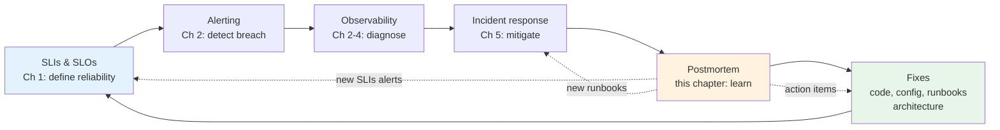
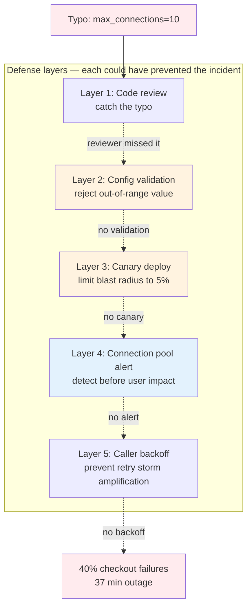
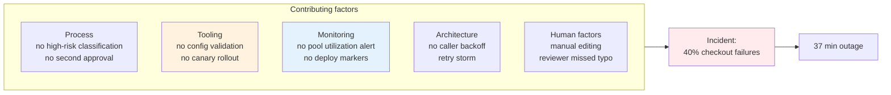
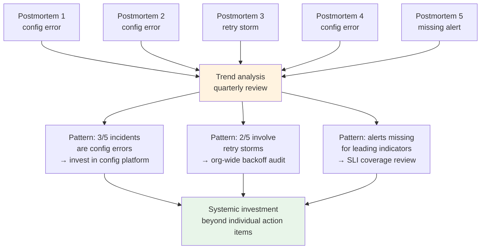
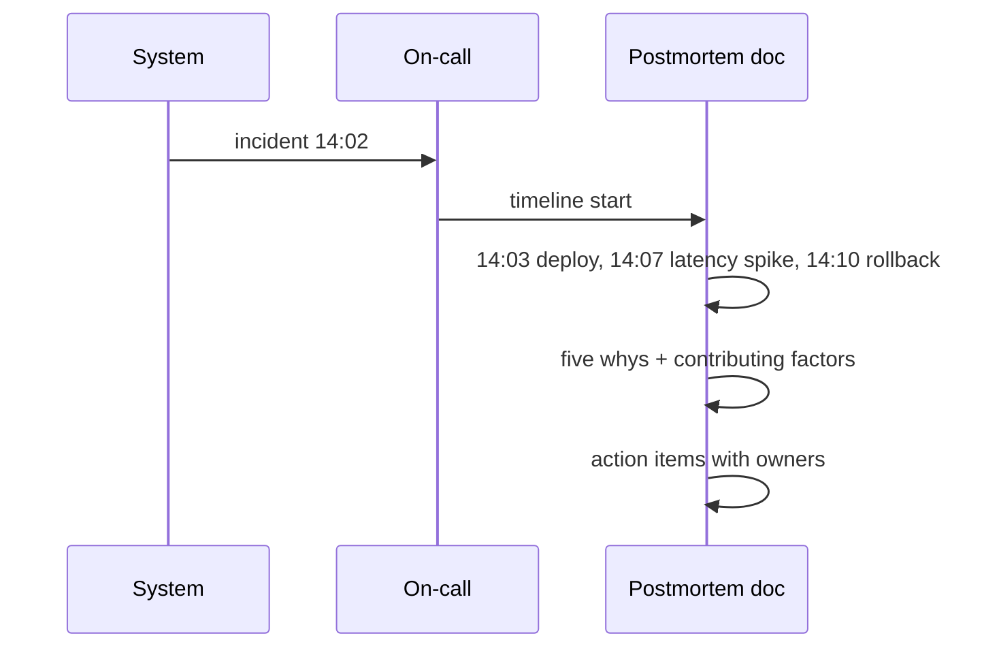
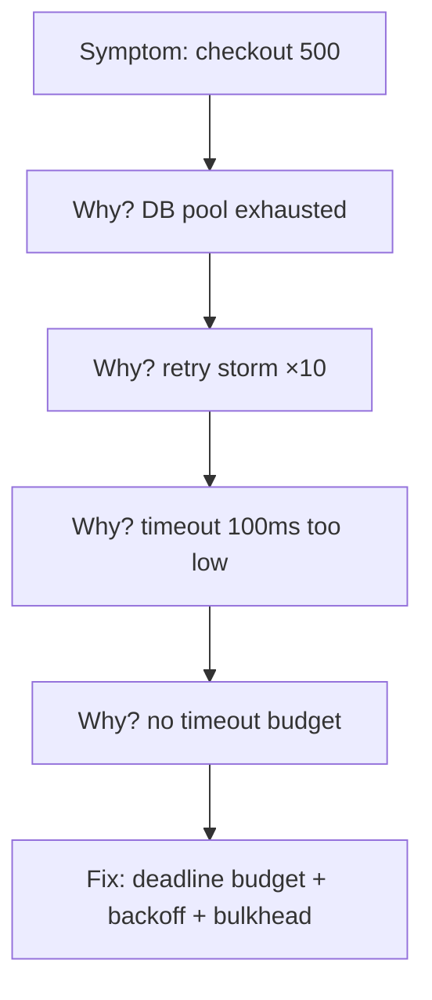
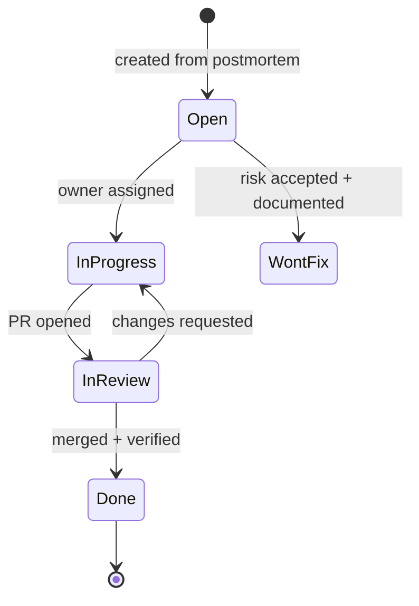

# Chapter 6 — Blameless Postmortems

**What this chapter covers.** An incident ends when service is restored — but learning from it has barely begun. Without deliberate follow-through, the same failure will recur, often with larger blast radius. The blameless postmortem is the mechanism that converts the cost of an incident into durable improvement: a structured, psychologically safe investigation that asks *how the system allowed this to happen* rather than *who caused it*, producing specific, tracked action items that make the next incident less likely or less damaging. This chapter covers when and how to write postmortems, the facilitation and cultural practices that make blamelessness real rather than performative, the anatomy of an effective postmortem document, the action item lifecycle that turns words into fixes, and how postmortems connect to the broader reliability system — error budgets, SLIs, and organizational learning.

Learning goals — after this chapter you should be able to:

- Explain why blamelessness is a practical engineering strategy, not just a cultural nicety, and how blame suppresses the information flow that postmortems need.
- Decide when a postmortem is warranted (severity thresholds, near-miss criteria) and who should write and review it.
- Facilitate a postmortem meeting that surfaces systemic causes rather than individual fault, including the language patterns that maintain psychological safety.
- Write a postmortem document with a clear timeline, impact assessment, root cause analysis, and action items — using the template provided in this chapter.
- Apply root cause analysis techniques (Five Whys, fishbone, contributing factors) without falling into the single-root-cause trap or the counterfactual trap.
- Manage the action item lifecycle — prioritization, ownership, tracking, and verification — so postmortems produce real fixes rather than documents that are read once and forgotten.
- Describe how postmortems feed into organizational learning: sharing, trend analysis, and the relationship between postmortem culture and deployment velocity.

---

## Why postmortems

### The alternative is recurrence

Every incident is a free lesson about a failure mode that exists in your system. You already paid the cost — user impact, responder time, disrupted plans. The only question is whether you extract the value.

Without postmortems, organizations exhibit a predictable pattern:

1. Incident happens. Responders fix it under pressure, often with a quick mitigation (rollback, scale-up, manual intervention).
2. Service recovers. Everyone is relieved and returns to feature work.
3. No one writes down what happened, why, or what should change.
4. Weeks or months later, the same failure recurs — sometimes worse, because the system has grown and the blast radius is larger.
5. The same responders fix it again, slightly faster this time because they remember what they did last time — but only if they are still on the team.

Postmortems break this cycle by converting **tacit knowledge** (what the responders learned under pressure) into **explicit, shared knowledge** (a document, action items, and systemic fixes that persist beyond any individual's memory or tenure).

### What postmortems are not

| Misconception | Reality |
|---------------|---------|
| A punishment mechanism | A learning mechanism. If people fear the postmortem, they will hide information — the opposite of what you need. |
| Only for Sev1 outages | Any incident or near-miss with learning value deserves one. The most valuable postmortems are often for Sev3 incidents that *could have* been Sev1. |
| A bureaucratic requirement | A technical document. The audience is the engineers who will prevent the next incident, not auditors checking a box. |
| A search for "the" root cause | Systems fail due to multiple contributing factors. Fixating on a single root cause misses the systemic improvements that prevent whole classes of failure. |
| Done when the document is written | Done when the action items are completed and verified. The document is the starting point, not the finish line. |

### The reliability feedback loop

Postmortems are one component of a larger reliability system:



*Figure 6-1: Postmortems close the reliability loop. The fixes they produce improve detection (new SLIs/alerts), response (new runbooks), and prevention (architectural changes) — making every future incident through the same path less likely.*

---

## Blameless culture

### Why blame is counterproductive

Blame feels natural — someone pushed the bad config, someone missed the review, someone should have known. But blame is actively harmful to reliability for three reasons:

**1. Blame hides information.** If the engineer who pushed the config fears being blamed, they will minimize their role: "The config was already wrong" or "I followed the usual process." The postmortem loses the most important data — what the person actually did, saw, and thought at each step. Without that, the postmortem cannot identify the systemic factors (unclear process, missing validation, insufficient testing) that allowed the mistake.

**2. Human error is never the root cause.** Saying "the engineer made a mistake" explains nothing — humans always make mistakes at some rate. The useful question is: *why did the system allow that mistake to reach production?* Was there no validation? Was the deploy process confusing? Was the reviewer overloaded? Those are fixable system properties; "try harder not to make mistakes" is not.

**3. Blame creates fear that slows response.** If responders fear blame for actions taken during an incident, they will hesitate to make bold mitigation decisions (rolling back, shedding load, failing over) that might be wrong but are the fastest path to recovery. Hesitation during incidents directly increases MTTR and user impact.

### What blameless actually means

Blameless does not mean:

- **No accountability.** People are still responsible for their work. Blameless means accountability is about *fixing the system* (writing the validation, improving the process), not about punishment.
- **No discussion of human actions.** Postmortems must describe exactly what people did — that is essential data. Blameless means describing actions without moral judgment.
- **Ignoring repeated negligence.** If someone consistently bypasses safety checks despite training and tooling, that is a management and coaching issue — but it is handled outside the postmortem, not inside it.

Blameless does mean:

- **Language matters.** Compare:
  - Blameful: "Alice deployed a broken config that took down checkout."
  - Blameless: "At 14:25 UTC, a config change was deployed to payment-service that set `max_connections` to 10 instead of 100. The deploy pipeline did not validate this value against the expected range. Checkout error rates rose to 40% within 3 minutes."

  The blameless version contains more information (what the value was, what it should have been, what validation was missing) and no judgment. It points directly at the systemic fix (add range validation to the pipeline).

- **The "reasonable person" test.** Ask: would a reasonable, competent engineer in the same situation — with the same information, time pressure, tooling, and fatigue — plausibly have made the same decision? If yes, the system needs to change, not the person.

- **Psychological safety is built, not declared.** Saying "we are blameless" while the postmortem document subtly identifies who is at fault, or while the manager has a private conversation about performance after the postmortem, is worse than not claiming blamelessness at all. People detect the gap immediately and adjust their openness accordingly.

### Building psychological safety

Concrete practices that make blamelessness real:

| Practice | What it looks like |
|----------|-------------------|
| **Leadership models it** | Senior engineers and managers openly describe their own mistakes in postmortems: "I approved that deploy without checking the load test results." |
| **Facilitator enforces language** | The postmortem facilitator redirects blameful language in real time: "Let's rephrase — what about the system made that action seem correct at the time?" |
| **No names in action items as blame** | Action items are owned by teams or roles, or by the person who volunteers — not assigned as "Alice must fix the thing Alice broke." |
| **Reward postmortem participation** | Engineers who write thorough postmortems, especially for their own incidents, are recognized — not quietly penalized with extra process. |
| **Share postmortems broadly** | When postmortems are visible org-wide, everyone sees that incidents happen to everyone, including senior staff. This normalizes fallibility. |

---

## When to write a postmortem

Not every alert or minor anomaly needs a postmortem. But the threshold should be lower than most teams initially set it.

### Severity-based triggers

| Trigger | Postmortem required? | Notes |
|---------|---------------------|-------|
| **Sev1** (full outage / data loss) | Always, within 5 business days | Non-negotiable. The highest learning value and stakeholder visibility. |
| **Sev2** (significant degradation) | Always, within 10 business days | Still significant impact and likely systemic causes. |
| **Sev3** (limited impact) | If novel or with useful lessons | A Sev3 that reveals a new failure mode is more valuable than a Sev1 that repeats a known one. |
| **Sev4** (no user impact) | Rarely, only if the near-miss is instructive | A Sev4 that *could have been* Sev1 under slightly different conditions is a near-miss worth studying. |
| **Near-miss** (caught before impact) | When the catch was luck, not design | "We caught this in staging by accident — in production it would have been Sev1" is a critical signal. |

### The near-miss principle

Near-misses are incidents that did not cause user impact only because of luck or manual intervention — not because the system handled them correctly. They are disproportionately valuable because:

- They reveal the **same systemic failures** as real incidents but without the pressure and disruption of a live incident response.
- They are **more common** than actual incidents, so studying them gives more data points.
- They are **less emotionally charged**, so postmortems are easier to conduct blamelessly.

Examples of near-misses worth a postmortem:

- A bad deploy was caught by a manual check before reaching production — but no automated test would have caught it.
- A database failover succeeded but took 10× longer than expected — next time it might not succeed at all.
- An engineer noticed a misconfigured alert that would have suppressed pages during a real incident.

The heuristic: **if the only reason this was not a worse incident is something you would not want to rely on next time, write the postmortem.**

### Who writes it

| Role | Responsibility |
|------|---------------|
| **Author** | Usually the IC or Ops Lead from the incident — the person with the most complete picture. Sometimes a dedicated postmortem owner if the IC is unavailable. |
| **Contributors** | Every responder and SME who participated, plus anyone whose system was involved — even if they were not paged. |
| **Facilitator** | For significant postmortems (Sev1/Sev2), a neutral facilitator who was not directly involved in the incident keeps the meeting focused and blameless. |
| **Reviewers** | Engineering leadership, affected teams, and anyone who owns action items. Postmortems are reviewed, not just published. |
| **Stakeholders** | Product, support, and executives receive the summary — not necessarily the full technical document. |

The author should start the document **within 24–48 hours** of the incident while memories are fresh. Waiting a week means details are lost and the postmortem becomes an exercise in reconstructing what happened from chat logs rather than from direct recall.

---

## The postmortem document

### Template

The template below is used at many organizations (derived from the Google SRE postmortem template and widely adapted). Every section earns its place — none is filler.

```markdown
# Postmortem: [service] — [brief incident description]

| Field              | Value                                              |
|--------------------|----------------------------------------------------|
| Date               | 2026-03-15                                         |
| Severity           | Sev1                                               |
| Duration           | 14:28–15:05 UTC (37 minutes)                       |
| Impact             | ~40% of checkout requests failed (HTTP 500)        |
| Detection          | Alert: PaymentServiceHighBurnRate (2 min TTD)      |
| Responders         | Alice (IC), Bob (Ops Lead), Carol (Comms), Dave (SME: payments) |
| Status             | Draft / In Review / Approved / Action Items Complete |
| Postmortem Owner   | Alice                                              |
| Review Meeting     | 2026-03-18 14:00 UTC, Room/Zoom link               |

## Summary

At 14:25 UTC on 2026-03-15, a configuration change to payment-service
set `max_connections` from 100 to 10. Within 3 minutes, checkout error
rates rose to 40% as payment-service exhausted its connection pool and
began rejecting requests. The change was rolled back at 14:52 UTC and
error rates returned to baseline by 15:05 UTC. No data loss occurred;
failed checkouts were retried successfully by most customers.

## Impact

- **Users affected:** ~12,000 checkout attempts during the 37-minute window;
  ~4,800 failed on first attempt. Retry success rate ~85%, so ~720
  checkouts required manual retry or were abandoned.
- **Revenue impact:** Estimated $18,000 in delayed/abandoned transactions
  (based on average order value — finance to confirm).
- **Duration:** 37 minutes from first user-visible failure to full recovery.
  An additional 15 minutes of elevated p99 latency (500ms → 1200ms) as
  connection pools warmed after rollback.
- **Data integrity:** No data loss or corruption. Failed payments were not
  charged; no duplicate charges observed.
- **Other services:** fraud-check and ledger-service showed elevated latency
  due to retry storms from payment-service but did not independently fail.

## Timeline (all times UTC)

| Time  | Event |
|-------|-------|
| 14:25 | Config change deployed to payment-service: `max_connections: 10` (intended: 100 — typo in config file) |
| 14:28 | `PaymentServiceHighBurnRate` alert fires (error rate 40%, threshold 5%) |
| 14:28 | PagerDuty pages Alice (primary on-call for payment-service) |
| 14:30 | Alice acknowledges, declares Sev1, opens #incident-2026-03-15-payment-errors |
| 14:31 | Bob joins as Ops Lead; Carol joins as Comms Lead |
| 14:32 | First status page update: "Investigating elevated error rates on checkout" |
| 14:33 | Bob identifies recent config deploy as suspect — checks rollout history |
| 14:35 | Dashboard confirms: payment-service DB connection pool exhausted (10/10), queue depth growing |
| 14:38 | Dave (SME) confirms: `max_connections=10` is the cause — should be 100 |
| 14:42 | Alice decides: rollback config change (no code change needed) |
| 14:52 | Config rollback deployed; connection pool recovers to 12/100 |
| 14:55 | Error rates dropping: 40% → 8% → 2% over 3 minutes |
| 14:55 | Second status page update: "Fix deployed, monitoring recovery" |
| 15:05 | Error rates at baseline (0.08%); p99 latency recovering |
| 15:10 | Incident declared resolved; war room closed |
| 15:30 | Final status page update: "Resolved" |
| 15:45 | Handoff note written; postmortem scheduled for 2026-03-18 |

## Root Cause and Contributing Factors

### Root cause

A configuration value (`max_connections: 10`) was set to 1/10th of its
correct value due to a manual editing error. The deploy pipeline applied
the config without range validation.

### Contributing factors

1. **No config validation in the deploy pipeline.** The pipeline applies
   any YAML value without checking against expected ranges. A value of 10
   for `max_connections` (valid range: 50–500) was accepted silently.
2. **No canary or staged rollout for config changes.** The config was
   deployed to 100% of payment-service instances simultaneously. A canary
   (5% of instances first, with automatic rollback on error rate increase)
   would have limited blast radius to 5% of traffic.
3. **Connection pool metric had no alert.** `payment_db_connections_used`
   approaching `max_connections` is a leading indicator that fires *before*
   user-visible errors. No alert existed for this signal.
4. **Config change was not flagged as high-risk.** The deploy was treated
   as a routine config update with no additional review or approval step,
   despite `max_connections` being a critical performance parameter.
5. **Retry storm amplified impact.** payment-service callers retried
   failed requests without backoff, generating 3× the normal request rate
   against the already-exhausted pool and spreading latency to fraud-check.

## What Went Well

- Detection was fast (2 min TTD) — SLI-based alerting worked as designed.
- Rollback was quick once the cause was identified (10 min from identification to recovery).
- Comms Lead kept stakeholders informed — no duplicate status requests
  interrupted the war room.
- No data loss — idempotency handling (Ch 10 — Messaging) ensured failed
  payments were safe to retry.

## What Went Poorly

- Config with no validation reached production — the most preventable link
  in the chain.
- Initial triage spent 5 minutes before identifying the deploy as the cause —
  the deploy event was not surfaced on the payment-service dashboard.
- Status page first update took 7 minutes after Sev1 declaration — should be
  within 5 minutes per our own policy.
- Retry storm from callers was not anticipated and not mitigated during the
  incident.

## Action Items

| # | Action | Owner | Priority | Due | Status |
|---|--------|-------|----------|-----|--------|
| 1 | Add range validation for all config values in deploy pipeline; reject values outside expected bounds | Platform team | P0 | 2026-03-25 | TODO |
| 2 | Implement canary rollout for config changes (5% → 50% → 100% with auto-rollback on error rate) | Platform team | P0 | 2026-04-15 | TODO |
| 3 | Add alert: `payment_db_connections_used / max_connections > 0.8 for 5m` → warning | Payments team | P0 | 2026-03-22 | TODO |
| 4 | Add deploy markers to payment-service Grafana dashboard | Payments team | P1 | 2026-03-25 | TODO |
| 5 | Implement exponential backoff + jitter for payment-service callers (see Ch 10 — Resilience Patterns) | API gateway team | P1 | 2026-04-10 | TODO |
| 6 | Classify `max_connections` and similar params as high-risk; require second approval for changes | Payments team | P1 | 2026-03-30 | TODO |
| 7 | Add config change integration test: deploy test config and verify service health | Payments team | P2 | 2026-04-30 | TODO |

## Lessons Learned

- **Config is code** — it needs the same validation, testing, and staged
  rollout as application code. A single unvalidated field can have the same
  impact as a code defect.
- **Leading indicators prevent incidents.** The connection pool metric was
  available but not alerted on. An alert at 80% utilization would have
  paged before any user-visible failure.
- **Retry without backoff is a reliability hazard.** Every caller that
  retries aggressively during an outage makes the outage worse. Backoff and
  circuit breaking (Ch 10) are not optional for inter-service calls.

## Appendices

### A. Graphs

- Error rate: [Grafana link — checkout error rate 14:00–16:00 UTC]
- Connection pool: [Grafana link — db_connections_used vs max]
- Latency: [Grafana link — p50/p99 for checkout, payment-service]

### B. Related Incidents

- 2026-01-20: Similar config error in inventory-service (postmortem: link)
- 2026-02-08: Retry storm during fraud-check degradation (postmortem: link)

### C. Detection and Response Metrics

| Metric | Value |
|--------|-------|
| TTD (time to detect) | 3 min (14:25 deploy → 14:28 alert) |
| TTA (time to acknowledge) | 2 min (14:28 page → 14:30 ack) |
| TTM (time to mitigate) | 24 min (14:28 alert → 14:52 rollback) |
| TTR (time to resolve) | 37 min (14:28 alert → 15:05 baseline) |
```

### What makes this postmortem effective

- **Timeline is precise and sourced.** Every entry has a timestamp and can be verified against chat logs, deploy records, and alert history. Vague timelines ("around 2:30 we noticed...") are not useful for analysis.
- **Impact is quantified.** Not "some users were affected" but "12,000 attempts, 4,800 first-attempt failures, ~720 abandoned." Quantification drives prioritization of action items.
- **Contributing factors, not single root cause.** The postmortem identifies 5 factors, any one of which — if fixed — would have prevented or mitigated the incident. This produces 5 independent defenses (defense in depth) rather than a single fix that leaves the other holes open.
- **Action items are specific, owned, prioritized, and dated.** Not "improve validation" but "add range validation for all config values in deploy pipeline; reject outside expected bounds — Platform team, P0, due 2026-03-25."
- **What went well is included.** Recognizing what worked (fast detection, quick rollback, no data loss) reinforces good practices and balances the natural focus on what went wrong.

---

## Root cause analysis

### The single-root-cause trap

Most incidents do not have a single root cause. They have a **chain of contributing factors** where removing any one link would have prevented the incident or reduced its impact. Insisting on "the" root cause leads to:

- Fixing only the most proximate cause (the typo) while leaving systemic causes (no validation, no canary) unaddressed.
- Premature closure — once "the" cause is found, investigation stops even though other important factors remain.

Instead, think in terms of **contributing factors** and **defense layers**:



*Figure 6-2: Defense in depth. The incident required every layer to fail simultaneously. Fixing any single layer prevents recurrence through that path — fixing multiple layers provides resilience even when one fix is incomplete or regresses.*

Each layer that failed is an independent action item. Even if one fix is imperfect (e.g., range validation has a gap for a new config param), the other layers still protect.

### Five Whys

Five Whys is a simple technique for drilling past the proximate cause to systemic factors. Applied to the example incident:

| Why | Answer |
|-----|--------|
| Why did checkout fail? | payment-service exhausted its DB connection pool and rejected requests. |
| Why was the pool exhausted? | `max_connections` was set to 10 instead of 100. |
| Why was it set to 10? | A config file was manually edited and the value was mistyped. |
| Why was the mistyped value deployed? | The deploy pipeline does not validate config values against expected ranges. |
| Why does the pipeline not validate? | Config validation was never implemented — config was assumed to be low-risk and reviewed only by visual inspection. |

Five Whys is useful but has pitfalls:

- **It implies a single linear chain.** Real incidents have branching causes — Five Whys on one branch misses the others (no canary, no alert, retry storm).
- **It can become blameful.** "Why did Alice make a typo?" leads to "because she was careless" — the wrong answer. The right answer is "because the system allowed a typo to reach production without validation."
- **"Why" can be asked forever.** Stop when you reach a fixable systemic cause, not when you reach philosophy.

Use Five Whys as a starting point for one causal chain, then complement it with broader contributing-factor analysis.

### Fishbone (Ishikawa) diagram

For incidents with multiple contributing factor categories, a fishbone diagram organizes them:



*Figure 6-3: Fishbone categorization of contributing factors. Each category suggests a different type of fix — process, tooling, monitoring, architecture, or human factors (where the fix is always tooling or process, not telling humans to be more careful).*

### The counterfactual trap

A common postmortem anti-pattern is the counterfactual: "If Alice had been more careful, this would not have happened" or "If the reviewer had caught the typo, we would have been fine." Counterfactuals that depend on humans being more careful are not useful — they do not produce fixes that work when humans are tired, rushed, or new to the team.

The test for a useful counterfactual:

- Useless: "If the engineer had typed 100 instead of 10..." (depends on perfect human performance)
- Useful: "If the pipeline had validated that `max_connections` is between 50 and 500..." (a concrete, automatable check)
- Useful: "If the config had been canaried to 5% of instances first..." (an architectural improvement)
- Useful: "If callers had used exponential backoff..." (a resilience pattern from Chapter 10)

Every action item should pass the counterfactual test: **would this fix still prevent the incident if a different person made the same mistake under the same conditions?**

---

## The postmortem meeting

The postmortem meeting is where the document is reviewed, debated, and refined — not where it is written for the first time. The author circulates the draft before the meeting so participants can read it in advance.

### Facilitation

| Role | Responsibility |
|------|---------------|
| **Facilitator** | Keeps discussion blameless, ensures all voices are heard, manages time, prevents rabbit holes. Ideally someone not directly involved in the incident. |
| **Author** | Presents the timeline and analysis, answers questions, captures feedback for revision. |
| **Participants** | All responders, SMEs, and stakeholders who can contribute context or challenge assumptions. |

Facilitation techniques:

- **Start with the timeline.** Walk through events chronologically. This grounds the discussion in facts before moving to analysis and judgment.
- **Ask "how" and "what," not "who" and "why did you."** "How did the deploy process allow this value through?" not "Why did you deploy a bad config?"
- **Invite dissent.** "Does anyone see a contributing factor we missed?" or "Is there a perspective from the database team we have not heard?"
- **Time-box analysis.** Postmortem meetings should be 60–90 minutes. If root cause analysis needs more depth, schedule a follow-up rather than extending the meeting. Fatigue degrades blamelessness.
- **End with action items.** The last 15 minutes should be spent reviewing each action item for specificity, ownership, and priority. An action item that no one owns at the end of the meeting will not be completed.

### Psychological safety in the meeting

The meeting is where blameless culture is most visibly tested. Warning signs that safety is eroding:

| Signal | What it means | Facilitator response |
|--------|--------------|---------------------|
| Silence from junior engineers | They fear speaking up or contradicting senior staff | Directly invite them: "You were closest to the database during the incident — what did you see?" |
| "We already know what happened" | Premature closure, likely anchoring on the first plausible cause | "Let's make sure we've considered all contributing factors before concluding." |
| Naming individuals as causes | Blameful framing | Redirect: "Let's describe the action and the system context, not the person." |
| Defensiveness or justification | Someone feels accused | Acknowledge: "This is about how the system behaved, not about anyone's competence. What would have helped you in that moment?" |
| Action items assigned as punishment | Blame disguised as accountability | Ensure items are volunteered or assigned to teams, not to individuals as consequences. |

---

## Action items: from words to fixes

A postmortem without completed action items is a story, not an improvement. The action item lifecycle is where most postmortem programs fail — documents are written, action items are created, and then they sit in a backlog until the next incident reveals they were never done.

### Prioritization

| Priority | Meaning | Timeline | Example |
|----------|---------|----------|---------|
| **P0** | Would have directly prevented this incident; blocks recurrence through the primary path | Days to 2 weeks | Config range validation, connection pool alert |
| **P1** | Would have reduced blast radius or detection time; defense-in-depth | 2–6 weeks | Canary deploys, deploy markers on dashboards, caller backoff |
| **P2** | General improvement surfaced by the incident; not specific to this failure mode | Backlog, next quarter | Config integration test, broader pipeline hardening |

P0 items should be tracked at the same urgency as incident follow-up — not as normal sprint work that can be deprioritized for feature deadlines. If P0 postmortem items are routinely delayed, the organization is choosing to accept recurrence.

### Ownership and tracking

- **Every action item has a single owner** (person or team) and a **due date**. Items without owners are wishes; items without dates are eventually forgotten.
- **Track action items in the same system as other engineering work** (Jira, Linear, GitHub issues) — not in a separate postmortem tracker that no one checks. Link each item back to the postmortem document.
- **Review action items at a regular cadence** — weekly for P0s, sprintly for P1s. Many teams have a dedicated "reliability review" meeting that covers open postmortem items alongside SLO status and error budget.
- **Verify completion.** An action item is not done when the code is merged — it is done when the fix is deployed, verified in production, and the relevant runbook or alert is updated. "Added validation" is not done until a test proves that `max_connections=10` is now rejected by the pipeline.

### Measuring action item health

```bash
# Example queries for postmortem action item hygiene
# (adapt to your tracker — Jira JQL, Linear API, etc.)

# How many P0 action items are overdue?
# JQL: project = SRE AND labels = postmortem-action AND priority = P0 AND due < now() AND status != Done

# Postmortem completion rate: what fraction of postmortems have all P0 items completed?
# Track: (postmortems with all P0s done) / (total postmortems requiring P0s)

# Mean time to P0 completion
# Track: avg(days between postmortem publication and last P0 item resolved)
```

Healthy benchmarks (approximate, varies by org size):

- P0 completion within due date: > 90%
- P1 completion within due date: > 70%
- Postmortems published within SLA (5 days for Sev1): > 95%
- No postmortem with P0 items open beyond 30 days

If these numbers slip, it usually indicates that postmortem action items are competing with feature work without explicit prioritization — an organizational signal that reliability investment needs executive support.

---

## Sharing and organizational learning

### Postmortem distribution

Postmortems should be shared as broadly as is safe and useful:

| Audience | What they get | Why |
|----------|--------------|-----|
| **Responders and involved teams** | Full document — timeline, root cause, all action items | They need the complete picture to implement fixes correctly. |
| **All engineering** | Full document or detailed summary (depending on org size) | Every team can learn from every incident — the failure mode in payment-service may exist in their service too. |
| **Engineering leadership** | Full document + trend summary | Leadership needs to see patterns (repeated config errors, missing validation) to prioritize systemic investment. |
| **Company-wide / executives** | Executive summary — impact, cause in plain language, what is being done | Executives need to understand reliability posture without reading technical deep-dives. |
| **Customers** (for Sev1) | External incident report — impact, cause (non-technical), remediation, prevention | Customers who were affected deserve a clear account. Many companies publish these on their status page or blog. |
| **Public** (optional) | Blog post or conference talk | Sharing postmortems publicly builds industry knowledge and demonstrates engineering maturity. Companies like Cloudflare, GitHub, and AWS publish detailed public postmortems. |

Storing postmortems in a searchable, centralized location (wiki, dedicated postmortem tool, or simply a well-organized document repository) ensures they are findable when a similar incident occurs. Tag postmortems by service, failure mode, and contributing factor category so trends can be analyzed.

### Trend analysis

Individual postmortems fix individual incidents. Trend analysis across many postmortems reveals systemic patterns:



*Figure 6-4: Trend analysis across postmortems. Individual action items fix individual holes; trend analysis identifies where to make systemic investments that prevent whole classes of incidents.*

Quarterly, review all postmortems for:

- **Repeated failure modes.** Three config-related incidents in a quarter is a signal that config management needs systemic investment, not three independent fixes.
- **Repeated contributing factors.** If "no validation" or "missing alert" appears in multiple postmortems, the organization has a pattern of shipping without safety nets.
- **Action item completion rate.** If P0 items are frequently overdue, the reliability investment model needs adjustment.
- **TTD/TTM trends.** Are incidents being detected and mitigated faster over time? If not, observability or runbook investment may be needed.

### Postmortems and error budgets

Postmortems connect directly to the error budget concept from Chapter 1:

- An incident that **burns significant error budget** creates urgency for its action items — the budget quantifies the cost and justifies the investment.
- If error budget is **exhausted**, feature work should slow and postmortem action items should be prioritized — this is the error budget doing its job as a governance mechanism.
- Postmortems that produce **new SLIs or tighter SLOs** (e.g., adding a connection pool utilization SLI after the incident above) improve the error budget's accuracy for future decisions.

### Postmortems and deployment velocity

There is a common fear that postmortem culture slows teams down — more process, more approvals, more caution. In practice, the opposite is true for organizations that do it well:

- **Postmortems that produce automation** (validation, canary deploys, auto-rollback) make deploys *safer and faster*, not slower. The deploy that previously required manual checklist verification now has automated guardrails.
- **Blameless culture increases deploy frequency** because engineers are not afraid to deploy. Fear of blame for incidents leads to deploy avoidance, large batch sizes, and infrequent releases — which themselves increase incident risk (larger changes are harder to debug and roll back).
- **Shared learning reduces duplicate investigation.** When every team can read every postmortem, they can proactively fix the same failure mode in their own services before it causes an incident.

The DORA research program (Forsgren et al., *Accelerate*) consistently finds that high-performing teams have both **higher deployment frequency** and **faster MTTR** — and that blameless postmortem culture is one of the capabilities that predicts both.

---

## Distributed-systems lens

Postmortems in distributed backends have specific characteristics that single-service postmortems do not:

**Contributing factors span team boundaries.** The retry storm in the example incident involved the API gateway team (callers), the payments team (service), and the platform team (deploy pipeline). The postmortem must be cross-team, with contributors from each — and action items owned by different teams. A postmortem that only involves the team whose service failed will miss the systemic fixes in adjacent teams.

**Root cause analysis must consider distributed failure modes.** Was the incident caused by a consistency issue (stale cache, eventual consistency window), a coordination failure (leader election, distributed lock), a cascading overload, or a simple local error that propagated? The analysis technique must match the failure mode — Five Whys on a cascading failure may miss the architectural question of why services share fate through a single database.

**Action items may require architectural investment.** Some postmortem findings cannot be fixed with a config change or an alert — they require architecture: bulkheads to isolate failure domains, circuit breakers to prevent retry storms, idempotency to make retries safe (all covered in Chapter 10). These action items are larger, cross-team, and longer-term — they need explicit tracking beyond the sprint.

**Postmortem sharing must cross service boundaries.** A config validation gap found in payment-service almost certainly exists in other services that use the same deploy pipeline. The postmortem's audience is not just the payments team — it is every team that deploys through the same pipeline. Broad distribution is how one incident's learning prevents the next incident in a different service.

**Near-misses in distributed systems are especially valuable.** A near-miss where a network partition *almost* caused data inconsistency, or where a failover *almost* did not complete, reveals a distributed correctness gap that testing (Chapter 12, Volume 6) may not have covered. These near-misses deserve postmortems even though no user was affected — the next partition may not be so lucky.

---


#### Postmortem Timeline



#### Five Whys



#### Action Item Lifecycle



## Key takeaways

- Postmortems convert the **cost of an incident into durable improvement** — without them, the same failure recurs with larger blast radius as the system grows, and knowledge leaves with the responders who hold it tacitly.
- **Blamelessness is a practical strategy**, not just a cultural value: blame suppresses information flow, hides systemic causes, and makes responders hesitate during incidents — all of which increase MTTR. Blameless language describes what the system allowed, not who is at fault, and passes the "reasonable person" test.
- Write postmortems for **every Sev1 and Sev2, novel Sev3s, and instructive near-misses** — especially near-misses where the only reason impact was avoided is something you would not want to rely on next time. Start the document within 24–48 hours while memories are fresh.
- An effective postmortem document contains: **metadata** (severity, duration, impact, responders), **summary**, **quantified impact**, **precise timeline**, **root cause and contributing factors** (not single root cause), **what went well / poorly**, **specific owned action items with priorities and due dates**, **lessons learned**, and **appendices** with graphs and related incidents.
- Avoid the **single-root-cause trap** — think in contributing factors and defense layers, where fixing any one layer would have prevented the incident. Every failed layer is an independent action item providing defense in depth.
- **Five Whys** is useful for drilling one causal chain but must be complemented with broader contributing-factor analysis (fishbone diagrams) and must avoid blameful counterfactuals — every fix should pass the test: would it still work if a different person made the same mistake?
- The **postmortem meeting** reviews the pre-circulated document, not writes it from scratch; the facilitator enforces blameless language, invites dissent, ensures all voices are heard, and ends with action item review (specificity, ownership, priority).
- **Action items are not done when the document is published** — they are done when the fix is deployed, verified in production, and the relevant runbook or alert is updated. Track them in the same system as other engineering work, review P0s weekly, and measure completion rates — overdue P0s are a signal that reliability investment needs executive support.
- **Share postmortems broadly** (all engineering, leadership, customers for Sev1, optionally public) and perform **quarterly trend analysis** to identify repeated failure modes and systemic investment opportunities beyond individual action items.
- Postmortems close the **reliability feedback loop**: they produce new SLIs, new alerts, new runbooks, and architectural fixes (Chapters 7–10) that make the entire system more reliable — and **blameless culture increases deployment velocity** by replacing fear with automated safety nets.

---

## Further reading

- Google SRE Book, Chapter 15 — *Postmortem Culture: Learning from Failure* (https://sre.google/sre-book/postmortem-culture/)
- Google SRE Workbook, Chapter 9 — *Postmortem Culture* (https://sre.google/workbook/postmortem-culture/)
- Etsy — *Debriefing Facilitation Guide* (https://www.etsy.com/codeascraft/debriefing-facilitation-guide) — the definitive guide to facilitating blameless postmortems, by John Allspaw.
- Sidney Dekker, *The Field Guide to Understanding Human Error* (Ashgate, 2014) — the intellectual foundation for blameless culture: human error as a symptom of systemic factors, not a cause.
- Nora Jones et al., *Incident Analysis: How to Learn from Incidents* — modern approaches to incident analysis beyond traditional postmortems.
- Jeli / Ben Sigelman — *Modern Incident Analysis* — evolving practices for learning from incidents as socio-technical system behavior.
- Forsgren, Humble, and Kim, *Accelerate* (IT Revolution, 2018) — DORA research linking blameless culture, deployment frequency, and reliability.
- Cloudflare, GitHub, and AWS public postmortems — real-world examples of transparent incident reporting (https://blog.cloudflare.com/, https://github.blog/category/engineering/, https://aws.amazon.com/blogs/architecture/).
- Lorin Hochstein, *Beyond Blameless Postmortems* — critique and extension of blameless practices for complex systems.
