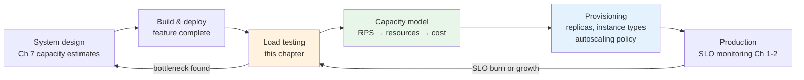
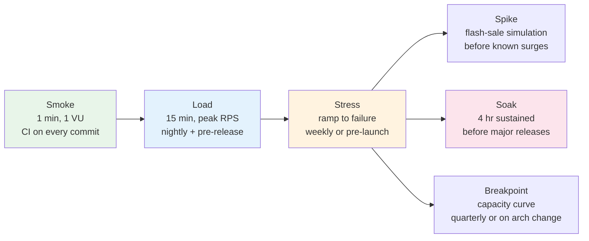
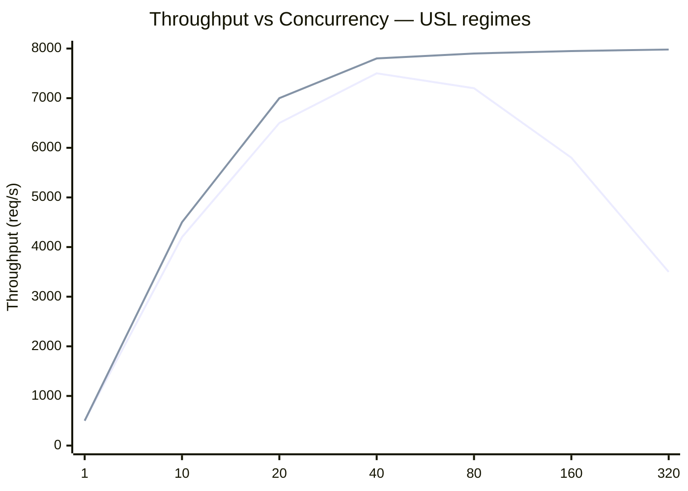
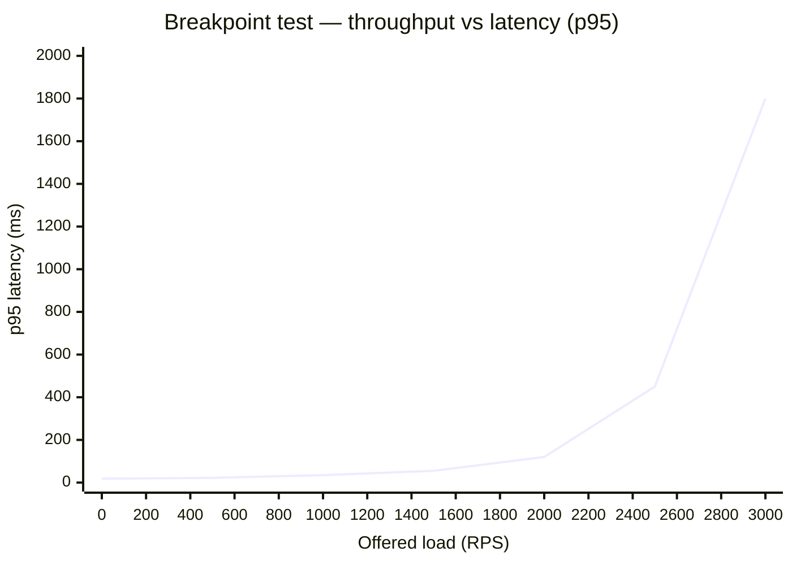
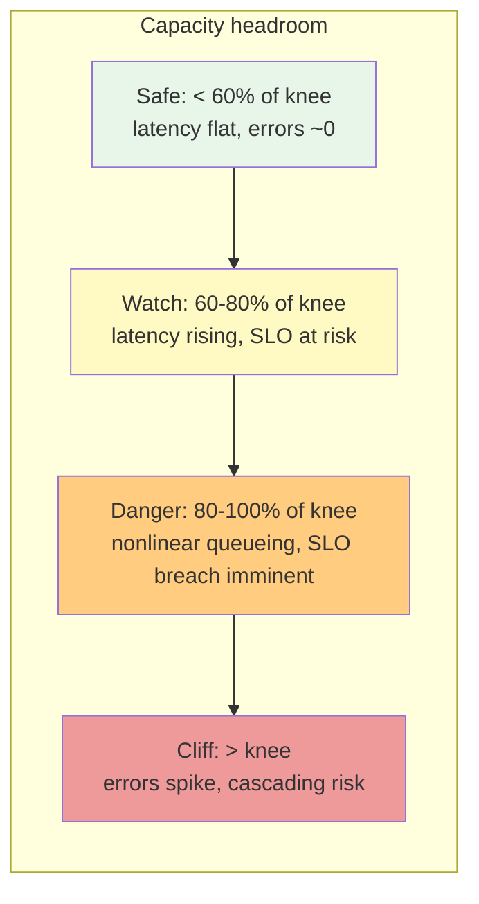

# Chapter 7 — Load Testing and Capacity Planning

**What this chapter covers.** Confidence that a system will handle next week's traffic cannot be derived from dashboards alone — it must be earned by generating realistic load and observing where the system bends and breaks, then translating those observations into concrete capacity decisions. This chapter covers the full lifecycle: why load testing is distinct from functional testing, the workload models that determine whether your results mean anything, the taxonomy of tests from smoke to soak, the queueing theory that predicts saturation, the tooling that generates load at scale (k6, Vegeta, Gatling, Locust), and the capacity planning process that turns measurements into provisioning, autoscaling, and budgeting decisions. Every concept is grounded in runnable configs and production-safe practices.

Learning goals — after this chapter you should be able to:

- Distinguish smoke, load, stress, spike, soak, and breakpoint tests and choose the right type for a given question about system behavior.
- Explain open versus closed workload models, why the choice determines whether your test measures queueing or throughput, and when to use each.
- Apply Little's Law, utilization law, and the Universal Scalability Law to predict saturation points and reason about scaling limits.
- Write, run, and interpret k6 and Vegeta tests — including thresholds, checks, custom metrics, and distributed execution — and compare them to Gatling and Locust for different use cases.
- Design realistic load scenarios from production traffic data, manage test data and environment isolation, and avoid the common pitfalls that invalidate results.
- Build a capacity model that connects RPS, latency SLOs, and resource headroom to provisioning, autoscaling policies, and error budget planning.

---

## Why load testing

### Functional tests do not answer capacity questions

A service that passes every unit and integration test can still collapse the first time traffic doubles — because functional tests verify *correctness* for a single request in isolation, while production load is *concurrent, sustained, bursty, and heterogeneous*. Load testing closes that gap by asking four questions functional tests cannot:

1. **How much can we handle?** What is the maximum throughput before latency SLOs are breached or errors spike?
2. **How does it degrade?** Is degradation graceful (latency rises linearly) or catastrophic (error rate jumps to 80% at a cliff)?
3. **How long can it sustain?** Does the system leak memory, exhaust connections, or accumulate GC pressure over hours?
4. **Where is the bottleneck?** Is it CPU, memory, I/O, downstream dependency, connection pool, or lock contention?

Without answers to these, capacity planning is guesswork — provisioning by gut feel, autoscaling by hope, and incident response by surprise.

### The cost of skipping it

Real incidents trace directly to untested capacity assumptions:

- A database connection pool sized for steady state but never tested under burst — when a downstream slowdown caused retries, the pool exhausted in seconds and every service sharing the database went down.
- An autoscaler configured with a 60-second scale-up delay but load tested only at steady state — during a flash sale, traffic tripled in 20 seconds; the scaler never caught up and the service shed 40% of requests.
- A cache layer that hit 99% hit rate in load tests with uniform key distribution — but production traffic was Zipfian (a few hot keys), so a single cache node became the hotspot and tail latency spiked to seconds.

Each of these would have been caught by a load test that modeled realistic traffic — not just high request volume.

### Where load testing sits in the reliability lifecycle



*Figure 7-1: Load testing closes the loop between design-time estimates and production reality. Results feed the capacity model, which drives provisioning — and production SLO data triggers the next round of testing as traffic and architecture evolve.*

> **Boundary note.** Back-of-envelope estimation and system-level capacity math are introduced in Volume 7, Chapter 2; this chapter applies them with measured data. Autoscaling mechanics for Kubernetes workloads are covered in Volume 12, Chapter 3; this chapter covers how to *validate* that those scalers behave correctly under load. Resilience under failure is Chapter 8 (chaos) and Chapter 10 (patterns) in this volume.

---

## Workload models: open versus closed

The single most consequential choice in load testing — and the most commonly misunderstood — is the workload model. It determines whether your test measures what production actually does.

### Closed model (concurrency-limited)

A fixed number of virtual users (VUs) each loop: send request, wait for response, think time, repeat. The arrival rate is *dependent* on response time — if the system slows down, fewer requests arrive per second.

- **Analogy:** A call center with N agents — each agent handles one call at a time; if calls take longer, fewer calls are handled per hour.
- **Use when:** Modeling user sessions where a user waits for a response before acting (browser clicks, mobile app interactions with think time).
- **Risk:** Masks queueing effects. If latency doubles, arrival rate halves, so the system *appears* to handle the load — but in production with an open arrival process, the queue would grow without bound.

### Open model (arrival-rate-limited)

Requests arrive at a fixed rate independent of response time — new arrivals keep coming even if the system is slow. The arrival rate is *exogenous*.

- **Analogy:** HTTP requests arriving from the internet — users do not coordinate; if your service slows from 50 ms to 500 ms, the same 1000 requests per second keep arriving.
- **Use when:** Modeling API traffic, webhook ingestion, or any system where callers do not wait for your response before sending the next request (which is most backend-to-backend traffic).
- **Risk:** Can overwhelm a system catastrophically if the arrival rate exceeds service rate — which is exactly what you want to observe in a stress test, but dangerous if run against shared environments without isolation.

### Why it matters: the queueing trap

Under a closed model, the classic test pattern is "ramp VUs from 10 to 500 and measure throughput." As VUs increase, throughput rises until the system saturates — then latency increases but throughput *plateaus* because VUs are blocked waiting. The tester concludes "system handles 500 VUs, throughput is X." But under an open model with the same throughput, latency would have grown unboundedly as the queue backed up — a qualitatively different result. If your production traffic is open (and for internet-facing services it almost always is), a closed-model test *underestimates tail latency by hiding queueing*.

The fix is not to always use open — both models are valid for different scenarios — but to *match the model to production traffic* and to use open models when testing backend APIs where callers do not synchronize on responses.

```mermaid
flowchart TB
    subgraph Closed["Closed model — VU-concurrency driven"]
        VU1["VU pool: N=100"] --> Req1["Request → wait → think → repeat"]
        Req1 -->|"latency ↑"| Arr1["Arrival rate ↓<br/>self-throttling"]
        Arr1 -.->|"masks queueing"| Hidden["Queue depth hidden"]
    end
    subgraph Open["Open model — arrival-rate driven"]
        Timer["Arrival timer<br/>λ = 1000 req/s"] --> Req2["Request on schedule<br/>independent of latency"]
        Req2 -->|"latency ↑"| Arr2["Arrival rate unchanged<br/>queue grows"]
        Arr2 --> Queue["Queue depth ↑ → latency ↑↑<br/>visible saturation"]
    end

    style Closed fill:#e3f2fd
    style Open fill:#fff3e0
    style Queue fill:#fce4ec
    style Hidden fill:#fff9c4
```



*Figure 7-2: Closed versus open workload models. Closed models self-throttle when latency rises, hiding queueing. Open models expose queue growth — which is why they are preferred for backend API testing.*

Most modern tools support both: k6 supports open (constant arrival rate via `ramping-arrival-rate` executor) and closed (VU-based) executors; Vegeta is inherently open (rate-driven); Gatling supports both via injection profiles.

---

## A taxonomy of load tests

Not every load test has the same goal. Choosing the wrong type wastes time or misses the signal.

| Test type | Goal | Load profile | Duration | Success signal |
|-----------|------|-------------|----------|----------------|
| **Smoke** | Verify test harness works; catch gross regressions | Minimal (1–5 VUs or low RPS) | 1–5 min | All checks pass, no errors |
| **Load** | Validate SLO compliance at expected peak | Expected peak traffic (e.g., p95 daily peak × 1.2) | 10–30 min | p95 latency within SLO, error rate < threshold |
| **Stress** | Find the breaking point | Ramp beyond peak until failure | 15–60 min | Identify cliff: RPS at which errors or latency breach SLO |
| **Spike** | Test elasticity under sudden surge | Instant jump (e.g., 100 → 5000 RPS in seconds) | 5–15 min | Autoscaler catches up, no sustained error burst |
| **Soak** | Detect slow leaks and drift | Sustained peak (or 80% of peak) | 2–12 hours | No memory leak, no GC degradation, no connection exhaustion |
| **Breakpoint** | Precisely locate capacity limit | Incremental steps with hold periods | 30–90 min | Throughput vs. latency curve, knee and cliff identified |

### How they compose into a test suite



*Figure 7-3: Progressive load test suite. Fast smoke tests gate every commit; heavier tests run on progressively longer cadences. Each type answers a different capacity question.*

**Breakpoint testing** deserves special attention because it produces the most actionable output: a curve of throughput versus latency and error rate as load increases. The *knee* (where latency starts rising superlinearly) is the practical capacity limit; the *cliff* (where errors spike) is the hard failure point. Capacity planning targets the knee, not the cliff.

---

## Capacity math: Little's Law, utilization, and the USL

Load testing produces measurements — but capacity planning requires *reasoning* about those measurements. Three laws give you the framework.

### Little's Law: concurrency = throughput × latency

```
L = λ × W
```

Where `L` is the average number of requests in the system (concurrency), `λ` is arrival rate (throughput), and `W` is average time in system (latency including queueing). This holds for any stable system regardless of distribution.

**Practical use:** If your p50 latency is 40 ms at 2000 RPS, average concurrency is `2000 × 0.04 = 80` concurrent requests. If your thread pool or connection pool has 100 slots, you have 20% headroom. If latency doubles to 80 ms at the same RPS, concurrency doubles to 160 — exceeding the pool and causing queueing or rejection. Little's Law tells you that latency and concurrency are not independent — you cannot reason about one without the other.

### Utilization law: utilization = throughput × service time

```
U = λ × S
```

Where `U` is resource utilization (0 to 1), `λ` is throughput, and `S` is mean service time at that resource. For a CPU-bound service where each request needs 2 ms of CPU, at 400 RPS the CPU utilization is `400 × 0.002 = 0.8` (80%). Beyond 80–85% utilization, queueing theory predicts latency rises sharply — which is why targeting > 85% steady-state utilization is dangerous without careful measurement.

### Universal Scalability Law (USL)

The USL models how throughput scales with concurrency, accounting for two penalties that grow with scale:

```
X(N) = N / (1 + α(N-1) + βN(N-1))
```

Where `N` is concurrency (or nodes), `α` is the contention penalty (serial fraction, Amdahl's law), and `β` is the coherency penalty (cross-node coordination cost). Fitting measured throughput versus concurrency to the USL reveals:

- **α-dominated systems** hit diminishing returns but plateau gracefully — more concurrency helps less and less.
- **β-dominated systems** exhibit *retrograde* scalability — beyond some `N`, throughput *decreases* as concurrency increases (common with contended locks, cache coherency traffic, or distributed consensus).

**Practical use:** Run a breakpoint test that measures throughput at increasing concurrency levels, fit the USL, and identify whether your next scaling investment should target contention reduction (faster locks, sharding) or coherency reduction (less cross-node coordination). If β is significant, adding more replicas may make things worse, not better.



*Figure 7-4: Two systems measured at increasing concurrency. Blue (high β) shows retrograde scaling — throughput collapses past 40 concurrent workers due to coherency costs. Green (low β) plateaus gracefully. Fitting the USL to these curves tells you which regime you are in and where to invest.*

### Queueing intuition without the heavy math

You do not need full queueing theory to make capacity decisions — one result suffices: for an M/M/1 queue (Poisson arrivals, exponential service), mean response time is:

```
R = S / (1 - U)
```

Where `S` is service time and `U` is utilization. At 50% utilization, `R = 2S`. At 80%, `R = 5S`. At 90%, `R = 10S`. The relationship is *nonlinear* — the last 10% of utilization costs 5× more latency than the first 50%. This is why capacity headroom matters and why load tests must measure latency distributions, not just throughput.

---

## Tooling: k6, Vegeta, and the landscape

### k6: scriptable, SLO-aware, developer-friendly

k6 is the default recommendation for most backend teams: JavaScript scenarios, first-class thresholds and checks, open and closed executors, and excellent Prometheus/InfluxDB output. It is written in Go, so a single binary generates significant load without the JVM overhead of Gatling.

**Installation:**

```bash
brew install k6        # macOS
# or
sudo gpg -k && sudo gpg --no-default-keyring --keyring /usr/share/keyrings/k6-archive-keyring.gpg --keyserver hkp://keyserver.ubuntu.com:80 --recv-keys C5AD60C380CEF53E8C86DF8424ECA9E5B910487D && echo "deb [signed-by=/usr/share/keyrings/k6-archive-keyring.gpg] https://dl.k6.io/deb stable main" | sudo tee /etc/apt/sources.list.d/k6.list && sudo apt-get update && sudo apt-get install k6
```

**Comprehensive k6 scenario — open model with thresholds, checks, and custom metrics:**

```javascript
// scenarios/checkout-load.js — open-model load test for a checkout API
import http from 'k6/http';
import { check, group, sleep } from 'k6';
import { Counter, Trend, Rate } from 'k6/metrics';
import { randomItem } from 'https://jslib.k6.io/k6-utils/1.4.0/index.js';

// Custom metrics
const checkoutErrors = new Counter('checkout_errors');
const checkoutLatency = new Trend('checkout_latency', true);
const paymentFailures = new Rate('payment_failures');

const BASE_URL = __ENV.BASE_URL || 'https://api.staging.example.com';
const PRODUCTS = ['sku-1001', 'sku-1002', 'sku-1003', 'sku-1004'];

export const options = {
  // Open-model: arrival-rate executors
  scenarios: {
    steady_state: {
      executor: 'ramping-arrival-rate',
      startRate: 50,
      timeUnit: '1s',
      preAllocatedVUs: 100,
      maxVUs: 500,
      stages: [
        { target: 200, duration: '2m' },   // ramp to expected peak
        { target: 200, duration: '5m' },   // hold at peak — measure SLO
        { target: 500, duration: '3m' },   // stress ramp
        { target: 500, duration: '3m' },   // hold at stress
        { target: 0, duration: '1m' },     // ramp down
      ],
    },
    // Spike scenario — runs in parallel to test burst handling
    spike: {
      executor: 'ramping-arrival-rate',
      startRate: 0,
      timeUnit: '1s',
      preAllocatedVUs: 50,
      maxVUs: 200,
      startTime: '7m',                     // starts during steady_state hold
      stages: [
        { target: 1000, duration: '10s' }, // instant spike
        { target: 1000, duration: '30s' },
        { target: 0, duration: '10s' },
      ],
    },
  },

  // Thresholds — test fails if breached (CI gate)
  thresholds: {
    http_req_failed: ['rate<0.01'],              // error rate < 1%
    http_req_duration: ['p(95)<300', 'p(99)<800'], // SLO-aligned
    checkout_latency: ['p(95)<400'],
    payment_failures: ['rate<0.005'],
    checks: ['rate>0.99'],                        // 99% of checks pass
  },
};

export function setup() {
  // Authenticate once, share token across VUs
  const res = http.post(`${BASE_URL}/auth/token`, JSON.stringify({
    client_id: __ENV.CLIENT_ID,
    client_secret: __ENV.CLIENT_SECRET,
  }), { headers: { 'Content-Type': 'application/json' } });
  check(res, { 'auth succeeded': (r) => r.status === 200 });
  return { token: res.json('access_token') };
}

export default function (data) {
  const headers = {
    'Authorization': `Bearer ${data.token}`,
    'Content-Type': 'application/json',
  };

  group('checkout flow', () => {
    // Step 1: Add to cart
    const cartRes = http.post(`${BASE_URL}/v1/cart`, JSON.stringify({
      product_id: randomItem(PRODUCTS),
      quantity: 1,
    }), { headers });

    const cartOk = check(cartRes, {
      'cart: status 201': (r) => r.status === 201,
      'cart: has cart_id': (r) => r.json('cart_id') !== undefined,
    });
    if (!cartOk) { checkoutErrors.add(1); return; }

    const cartId = cartRes.json('cart_id');

    // Step 2: Checkout — the critical path under test
    const checkoutRes = http.post(`${BASE_URL}/v1/checkout`, JSON.stringify({
      cart_id: cartId,
      payment_method: 'card_token_test',
    }), { headers });

    checkoutLatency.add(checkoutRes.timings.duration);

    const checkoutOk = check(checkoutRes, {
      'checkout: status 200': (r) => r.status === 200,
      'checkout: latency < 500ms': (r) => r.timings.duration < 500,
      'checkout: has order_id': (r) => r.json('order_id') !== undefined,
    });

    if (!checkoutOk) {
      checkoutErrors.add(1);
      if (checkoutRes.status >= 500) paymentFailures.add(1);
      else paymentFailures.add(0);
    } else {
      paymentFailures.add(0);
    }
  });

  // Closed-model think time is NOT used here — open model paces via arrival rate.
  // If modeling browser users with think time, use the 'shared-iterations' or 'per-vu-iterations' executor instead.
}

export function handleSummary(data) {
  return {
    'stdout': JSON.stringify({
      thresholds breached: Object.entries(data.metrics)
        .filter(([_, m]) => m.thresholds && Object.values(m.thresholds).some(t => !t.ok))
        .map(([name]) => name),
      p95_latency_ms: data.metrics.http_req_duration.values['p(95)'],
      p99_latency_ms: data.metrics.http_req_duration.values['p(99)'],
      error_rate: data.metrics.http_req_failed.values.rate,
      total_requests: data.metrics.http_reqs.values.count,
    }, null, 2),
    './results/summary.html': htmlReport(data),
    './results/summary.json': JSON.stringify(data, null, 2),
  };
}
```

**Running it:**

```bash
# Smoke — 1 min, low rate
k6 run --env BASE_URL=https://api.staging.example.com scenarios/checkout-load.js --vus 1 --duration 1m

# Full scenario with Prometheus remote write (for Grafana dashboarding)
k6 run --out experimental-prometheus-rw \
  --env BASE_URL=https://api.staging.example.com \
  --env CLIENT_ID=test-client --env CLIENT_SECRET="$SECRET" \
  scenarios/checkout-load.js

# Cloud/distributed execution (k6 Cloud or self-hosted k6-operator on Kubernetes)
k6 cloud scenarios/checkout-load.js   # or: kubectl apply -f k6-distributed.yaml
```

**Distributed k6 on Kubernetes (k6-operator):**

```yaml
# k8s/k6-distributed.yaml — 5 runners generating 2500 RPS aggregate
apiVersion: k6.io/v1alpha1
kind: TestRun
metadata:
  name: checkout-load-distributed
spec:
  parallelism: 5
  script:
    configMap:
      name: checkout-load-script
      file: checkout-load.js
  runner:
    image: grafana/k6:latest
    env:
      - name: BASE_URL
        value: "https://api.staging.example.com"
      - name: K6_PROMETHEUS_RW_SERVER_URL
        value: "http://prometheus.monitoring.svc:9090/api/v1/write"
    resources:
      requests: { cpu: "2", memory: "1Gi" }
      limits: { cpu: "4", memory: "2Gi" }
```

### Vegeta: minimal, open-model, ideal for quick probes

Vegeta is a single-binary, rate-driven load generator — no scripting, just a target list and an attack rate. Perfect for quick breakpoint probes and CI smoke tests where you need to answer "can this endpoint handle X RPS?" without writing scenario logic.

```bash
# Install
go install github.com/tsenart/vegeta@latest

# Define targets
cat > targets.txt <<'EOF'
GET https://api.staging.example.com/v1/products
X-Api-Key: test-key-123

POST https://api.staging.example.com/v1/cart
Content-Type: application/json
X-Api-Key: test-key-123
@cart-payload.json
EOF

cat > cart-payload.json <<'EOF'
{"product_id": "sku-1001", "quantity": 1}
EOF

# Attack: open-model at 500 RPS for 2 minutes
vegeta attack \
  -targets=targets.txt \
  -rate=500 \
  -duration=120s \
  -timeout=5s \
  -connections=100 \
  -output=results.bin | tee >(vegeta report) | vegeta plot > plot.html

# Reports
vegeta report results.bin
# Requests      [total, rate, throughput]  60000, 500.00, 498.20
# Duration      [total, attack, wait]      2m0s, 2m0s, 1.2s
# Latencies     [mean, 50, 95, 99, max]    42ms, 31ms, 87ms, 210ms, 1.8s
# Bytes         [in, out]                  12.3MB, 4.1MB
# Success       [ratio]                    99.42%
# Status Codes  [code:count]               200:59652  429:201  500:147
# Error Set:
#  429 Too Many Requests
#  500 Internal Server Error — connection pool exhausted

# Breakpoint: sweep rates to find the knee
for rate in 100 250 500 750 1000 1500 2000; do
  echo "=== Rate: ${rate} RPS ==="
  vegeta attack -targets=targets.txt -rate=$rate -duration=60s -output=/tmp/v-${rate}.bin
  vegeta report /tmp/v-${rate}.bin | grep -E "Latencies|Success|Status"
done | tee breakpoint-sweep.txt

# HdrHistogram report for tail-latency analysis
vegeta report -type="hdrplot" results.bin > latency.hdr
```

### Choosing a tool

| Tool | Model | Scripting | Best for | Limitation |
|------|-------|-----------|----------|------------|
| **k6** | Both open & closed | JavaScript | Realistic multi-step user journeys with thresholds and CI gating | Single-node limit ~30k RPS without distribution |
| **Vegeta** | Open (rate-driven) | None (target file) | Quick probes, breakpoint sweeps, CI smoke, library use (`vegeta` as Go lib) | No scenario logic; one endpoint pattern at a time |
| **Gatling** | Both (injection DSL) | Scala DSL | Complex scenarios needing rich reports; enterprise teams on JVM | JVM memory/GC; heavier for simple probes |
| **Locust** | Closed (user-based) | Python | Teams that prefer Python; highly customizable workflows | Closed model only (until recently); Python GIL limits per-worker throughput |
| **wrk / hey / fortio** | Open | None / minimal | Microbenchmarks and quick latency checks | No scenario support; single-endpoint only |

---

## Designing realistic scenarios

A load test that does not resemble production traffic produces precise but irrelevant numbers. Realism has four dimensions.

### 1. Traffic mix

Production is not one endpoint at one rate — it is a distribution across endpoints, methods, and payload sizes. Derive it from access logs or tracing (Chapter 4):

```python
# scripts/derive-traffic-mix.py — analyze access logs to produce k6 weights
import json
from collections import Counter

# Parse structured access logs (e.g., from Loki or CloudWatch)
endpoints = Counter()
with open("access.log") as f:
    for line in f:
        rec = json.loads(line)
        key = f"{rec['method']} {rec['route_template']}"  # e.g., "GET /v1/products/{id}"
        endpoints[key] += 1

total = sum(endpoints.values())
for endpoint, count in endpoints.most_common():
    pct = count / total * 100
    print(f"{endpoint:40s} {count:8d}  {pct:5.1f}%")
# Output:
# GET  /v1/products/{id}                   452310  38.2%
# POST /v1/cart                             218440  18.5%
# POST /v1/checkout                          98420   8.3%
# GET  /v1/cart/{id}                         89310   7.5%
# ...

# Generate k6 scenario weights
print("\n// k6 weights:")
for ep, count in endpoints.most_common(5):
    print(f"// {ep}: weight {count/total:.2f}")
```

Replicate this mix in the test: 38% of VUs or arrival rate should hit `GET /v1/products/{id}`, not an equal split.

### 2. Data realism

- **Do not reuse the same entity.** Hitting `GET /v1/products/sku-1001` a million times tests that one cache entry — not the cache, the database, or the shard distribution. Use a realistic key distribution (often Zipfian — a few hot keys, many cold keys).
- **Generate unique payloads.** For writes, each request should create a unique entity (unique cart, unique user) or you will hit uniqueness constraint errors that mask real capacity limits.
- **Pre-seed data.** Before the test, seed the database with a realistic volume — a test against an empty database measures the wrong thing (no index depth, no compaction pressure).

```javascript
// Zipfian key selection — a few keys get most traffic (realistic for product catalog)
function zipfianPick(keys, skew = 1.0) {
  // Simple approximation: rank-based probability ~ 1/rank^skew
  const r = Math.random();
  const rank = Math.floor(Math.pow(r, -1 / skew)) % keys.length;
  return keys[Math.min(rank, keys.length - 1)];
}
```

### 3. Network and environment fidelity

- **Test in a production-like environment** — same instance types, same replica counts, same database size, same network topology. Testing against a single-node staging database and extrapolating to a 6-node production cluster is unreliable (different replication lag, different connection limits).
- **Isolate blast radius.** Never load test a shared staging environment that other teams depend on without coordination. Prefer ephemeral preview environments or dedicated load-test clusters. If testing production, use strict rate limits, off-peak windows, and explicit opt-in from on-call (see Chapter 8's blast radius controls — the same principles apply).
- **Account for downstream dependencies.** If the service under test calls 4 downstream services, those services also experience the load test's traffic. Either mock them (and document that the test does not cover downstream saturation) or coordinate so downstream teams expect the traffic.

### 4. Warm-up and steady state

Every system has warm-up effects: JIT compilation, connection pool filling, cache population, autoscaler delays. A test that ramps to peak instantly measures warm-up, not steady state.

- **Ramp gradually** (at least 1–2 minutes to peak) to let pools and caches warm.
- **Hold at peak** for long enough that metrics stabilize — at least 2–3× the longest cache TTL or autoscaler delay in the path.
- **Discard warm-up data** when computing SLO compliance — measure the hold period, not the ramp.

---

## Running at scale and interpreting results

### Distributed generation

A single load generator has limits: CPU for TLS handshakes, file descriptor caps, network bandwidth. When you need > 10k RPS or > 1k concurrent connections:

- **k6-operator or k6 Cloud** — shard VUs or arrival rate across N Kubernetes pods; aggregate metrics centrally.
- **Vegeta sharding** — run N Vegeta instances with `-rate=R/N` and merge `results.bin` files (sum histograms externally).
- **Gatling FrontLine / Cloud** — managed distribution with coordinated ramp.
- **Locust master/worker** — built-in distribution with Python workers.

Key principle: generators must be coordinated (same ramp profile, synchronized clocks) and metrics must be aggregated with histogram-aware merging — averaging p95 across generators is wrong; merge the raw latency histograms.

### What to measure

Every load test should capture at minimum:

| Signal | Metric | Collector |
|--------|--------|-----------|
| **Throughput** | Requests/sec, success rate | Load generator (k6, Vegeta) |
| **Latency** | p50, p95, p99, max — per endpoint | Load generator + server-side histogram (Prometheus) |
| **Errors** | Rate by status code / error type | Load generator + application metrics |
| **Saturation** | CPU, memory, GC pause, event loop lag, connection pool utilization, queue depth | Prometheus / CloudWatch / Datadog |
| **Downstream** | Latency and error rate of each dependency | Tracing (Chapter 4) + dependency dashboards |
| **Autoscaler** | Desired vs. actual replicas, scale events, time to scale | Kubernetes HPA metrics |

### Reading the results

**The throughput-latency curve** is the primary output:



*Figure 7-5: Breakpoint test result. The knee at ~1500 RPS (where p95 jumps from 55 ms to 120 ms) is the practical capacity limit. Beyond ~2000 RPS the system is saturated — queueing dominates and latency grows without bound. Provision for the knee, not the cliff.*

**Red flags that invalidate a test:**

- Generator-side bottlenecks: generator CPU > 80%, file descriptor exhaustion, or `connect: cannot assign requested address` errors — the generator is saturated, not the system under test.
- Coordinated omission: the generator measures latency only for requests that completed, ignoring queueing time for requests that were delayed before being sent. k6 and Vegeta handle this by measuring from scheduled arrival time (open model) — but closed-model tests with naive timing do not.
- Cache or data artifacts: hit rate 100% because the same key was reused; database empty so index scans are trivially fast.

**USE and RED for bottleneck identification:**

When throughput plateaus or latency spikes, drill into USE (Utilization, Saturation, Errors) per resource and RED (Rate, Errors, Duration) per service:

- CPU utilization > 85% with run queue growing → CPU-bound; profile for hot spots (Volume 13, Chapter 5).
- Connection pool wait time rising while DB CPU is low → pool too small; increase or add pooling layer (PgBouncer).
- Downstream p95 spiking while local CPU is idle → downstream bottleneck; the system under test is waiting — fix downstream or add caching/circuit breaking (Chapter 10).
- GC pause time correlated with latency spikes → heap pressure; tune GC or reduce allocation rate (Volume 13).

---

## Capacity planning: from measurements to decisions

### The capacity model

A capacity model connects three variables: **demand** (RPS or concurrent users), **SLO** (latency and error budget), and **resources** (replicas, instance types, database capacity). The breakpoint test gives you the mapping; the model turns it into a provisioning decision.

**Step 1 — Establish the demand forecast.**

Combine historical growth, business events (launches, campaigns, seasonality), and SLO error budgets:

```
Peak demand estimate = current peak RPS × (1 + growth rate)^(months ahead) × burst factor

Example: 1200 RPS today, 8% monthly growth, 6 months ahead, 2× burst for campaign
         = 1200 × 1.08^6 × 2.0
         ≈ 1200 × 1.587 × 2.0
         ≈ 3809 RPS design target
```

**Step 2 — Map demand to resources via measured data.**

From the breakpoint test: the single-replica knee is 500 RPS at p95 < 300 ms. With 3 replicas and 70% target utilization (headroom for burst and rolling deploys):

```
Replicas needed = ceil(design target / (knee per replica × target utilization))
                = ceil(3809 / (500 × 0.70))
                = ceil(10.88)
                = 11 replicas
```

Add N+2 for zone failure tolerance in a 3-AZ deployment (lose one AZ and still handle peak): 11 → 13 replicas.

**Step 3 — Validate autoscaling.**

Configure the autoscaler (e.g., Kubernetes HPA on CPU or custom metric) and verify with a spike test that it scales from steady state to peak within the required time:

```yaml
# k8s/hpa.yaml — validated by spike test
apiVersion: autoscaling/v2
kind: HorizontalPodAutoscaler
metadata:
  name: checkout-api
spec:
  scaleTargetRef: { apiVersion: apps/v1, kind: Deployment, name: checkout-api }
  minReplicas: 6
  maxReplicas: 20
  metrics:
    - type: Pods
      pods:
        metric: { name: http_requests_per_second }
        target: { type: AverageValue, averageValue: "350" }  # 70% of 500 knee
  behavior:
    scaleUp:
      stabilizationWindowSeconds: 30
      policies:
        - type: Percent
          value: 100
          periodSeconds: 30
        - type: Pods
          value: 4
          periodSeconds: 30
      selectPolicy: Max
    scaleDown:
      stabilizationWindowSeconds: 300
      policies:
        - type: Percent
          value: 25
          periodSeconds: 60
```

The spike test from the k6 scenario validates this HPA: at t=7 min, load jumps from 200 to 1200 RPS — the HPA should add replicas within 30 s and recover p95 within 60 s. If it does not, tune `stabilizationWindowSeconds` or switch from CPU to a more responsive signal (requests per second or queue depth).

**Step 4 — Connect to error budget and cost.**

- If current burn rate plus projected growth will exhaust the error budget before the next scaling window, capacity is a reliability risk now — escalate.
- Translate replicas to cost (instances × hours × price) and compare scaling strategies: larger instances versus more small instances versus different instance families (Volume 12, Chapters 8–9 cover cloud cost engineering).

### Headroom and the danger zone



*Figure 7-6: Headroom model. The target operating range is the safe zone, with autoscaling configured to keep the system there. The danger zone is where utilization law predicts superlinear latency — alert here, not at the cliff.*

### Continuous load testing

Capacity planning is not a one-time exercise — every significant change can shift the knee:

- **CI gate:** Smoke test on every merge (1 min, 10 RPS) — catches gross regressions (e.g., an N+1 query that triples latency) before they reach main.
- **Nightly:** Load test at peak RPS for 15 minutes — tracks the knee over time and detects gradual drift (dependency slowdown, data growth, config change).
- **Pre-release / pre-event:** Full breakpoint + spike + soak suite before launches, migrations, and known traffic events — the authoritative capacity signal for provisioning decisions.
- **Trend dashboard:** Plot knee RPS and p95 at peak over weeks — a downward trend in knee RPS is an early warning that a recent change introduced a bottleneck, even though current peak is still below the knee.

---

## Distributed-systems lens

Load testing distributed backends has failure modes that single-service tests do not surface:

**Fan-out amplification.** A single API request may fan out to 8 internal services. At 1000 RPS at the edge, a downstream service with 3× fan-out sees 3000 RPS. The load test must either generate realistic fan-out (and measure downstream services) or explicitly document that downstream capacity is out of scope. Failing to account for amplification is why services pass edge load tests but downstream databases collapse.

**Cache and shard hotspots.** Uniform random load distributes evenly across shards and cache keys — real traffic does not. A load test that uses uniform key distribution will show healthy shard utilization while production with Zipfian distribution has one shard at 90% and the rest at 30%. Model the real distribution or test hotspot behavior explicitly.

**Retry storms under load.** When downstream latency rises under load, callers retry — multiplying the effective arrival rate at the downstream. A system that handles 1000 RPS without retries may face 3000 RPS with retries (Chapter 10 covers the circuit breaker and backoff patterns that mitigate this; load tests should measure with realistic retry behavior enabled).

**State and data growth.** A soak test against a static dataset misses the degradation caused by data growth: larger indexes, fuller LSM trees, longer compaction pauses, growing replication lag. Seed realistic data volume and, for soak tests, include a write mix that grows the dataset during the test.

**Clock and coordination pressure.** At high concurrency, contention on shared coordination (leader election, distributed locks, sequence generators) can become the bottleneck — visible as increased lock wait time, not CPU. The USL's β term captures this; if present, adding replicas makes it worse.

---

## Anti-patterns and common mistakes

| Anti-pattern | Why it hurts | Fix |
|--------------|-------------|-----|
| **Testing in a different topology** | Staging with 1 DB replica and 2 app replicas extrapolates poorly to prod with 3 DB replicas and 20 app replicas — replication lag, pool limits, and shard distribution differ. | Use production-like ephemeral environments or production with strict isolation. |
| **Averaging latencies** | Mean latency hides the tail — a mean of 80 ms with p99 of 2 s means 1% of users have a terrible experience. | Report p50, p95, p99, and max — per endpoint, over the hold period. |
| **Ignoring warm-up** | Measuring ramp latency conflates JIT/pool/cache warm-up with steady-state performance. | Ramp gradually, hold, and measure the hold window. |
| **Reusing the same test data** | Tests one cache entry and one shard; misses real distribution. | Unique data per request; model production key distribution. |
| **No thresholds / CI gating** | Load tests become reports that are read once and ignored. | Define thresholds (SLO-aligned) and fail the pipeline when breached. |
| **One-and-done testing** | A capacity model from 6 months ago does not reflect current code, data, or dependencies. | Automate a cadence: smoke on every commit, load nightly, full suite pre-release. |
| **Generator is the bottleneck** | Saturating the generator and attributing the limit to the system under test. | Monitor generator CPU/memory/FDs; distribute when needed; verify generator headroom. |
| **Coordinated omission** | Closed-model timing hides queueing; reported latency is lower than user-perceived. | Use open-model executors or generators that measure from scheduled arrival time. |

---

## Key takeaways

- Load testing answers **how much, how gracefully, and for how long** a system can handle demand — questions that functional tests cannot answer and that capacity planning depends on. Without measured data, provisioning is guesswork and autoscaling is hope.
- **Match the workload model to production traffic:** open (arrival-rate) for backend APIs where callers do not synchronize on responses (most service-to-service traffic), closed (VU-concurrency) for user-session modeling with think time. Using the wrong model hides or invents queueing and invalidates latency measurements.
- The taxonomy is purposeful: **smoke** (harness check, every commit), **load** (SLO at expected peak, nightly), **stress** (find the cliff), **spike** (elasticity under burst), **soak** (leaks over hours), **breakpoint** (precise knee and cliff). Each type answers a different capacity question — run them on different cadences, not as one monolithic test.
- **Little's Law (L = λW) and the utilization law (U = λS)** connect throughput, latency, concurrency, and utilization — you cannot reason about one without the others. The **Universal Scalability Law** reveals whether scaling is contention-limited (α) or coherency-limited (β), telling you whether adding concurrency will help or hurt.
- Queueing is **nonlinear**: at 50% utilization, response time is 2× service time; at 90%, it is 10×. Capacity headroom is not waste — it is the margin that keeps latency flat. Target the **knee** (where latency starts rising superlinearly), not the cliff, for provisioning.
- **k6** (scriptable, thresholds, open and closed executors) and **Vegeta** (minimal, open-model, ideal for quick probes and breakpoint sweeps) are the default toolkit; choose based on scenario complexity, not fashion. Distribute generators when a single node saturates, and merge histograms — not averaged percentiles.
- Realism determines relevance: replicate the **production traffic mix** (endpoint distribution from access logs), use **realistic data** (unique entities, Zipfian key distribution, seeded volume), test in a **production-like environment**, and **discard warm-up** — measure the hold period.
- A **capacity model** maps demand forecast → measured knee per replica → replicas at target utilization (typically 60–70%) plus zone-failure headroom. Validate autoscaling with **spike tests** — the scaler must catch up within the SLO window, or the policy needs tuning.
- Run load tests **continuously**: smoke on every commit, load nightly, full suite before releases and traffic events. Plot the knee over time — a downward trend is an early warning that a recent change introduced a bottleneck, even though current peak is still below it.

---

## Further reading

- Brendan Gregg, *Systems Performance: Enterprise and the Cloud* (2nd ed., Addison-Wesley, 2020) — Chapter 7 on benchmarking and Chapter 8 on performance testing methodology.
- Baron Schwartz et al., *High Performance MySQL* (O'Reilly) — capacity reasoning for database-backed services.
- Neil Gunther, *Guerrilla Capacity Planning* (Springer, 2007) and the Universal Scalability Law paper — the definitive treatment of scalability modeling.
- Leonard Kleinrock, *Queueing Systems, Volume 1* (Wiley, 1975) — the theoretical foundation for utilization and queueing analysis used in this chapter.
- k6 documentation — executors, thresholds, and distributed execution: https://k6.io/docs/using-k6/scenarios/executors/ and https://k6.io/docs/using-k6/thresholds/
- Vegeta documentation — attack, report, and histogram analysis: https://github.com/tsenart/vegeta
- Gatling injection profiles — open versus closed workload modeling: https://docs.gatling.io/reference/script/core/injection/
- Google SRE Book, Chapter 8 — *Capacity Planning* (https://sre.google/sre-book/capacity-planning/) — demand forecasting and resource modeling at Google scale.
- Gil Tene, *How NOT to Measure Latency* — coordinated omission and hdrhistogram: https://www.infoq.com/articles/Response-Time-Measure
- Philip Healy et al., *Little's Law and its applications* — practical applications in software systems.
