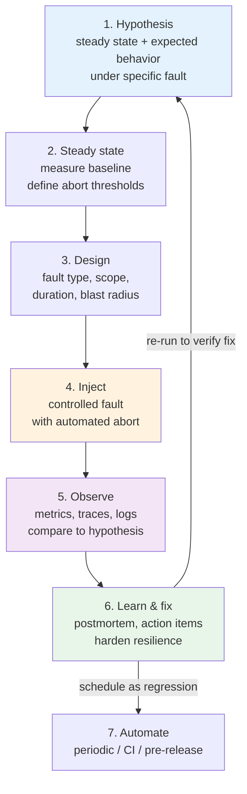
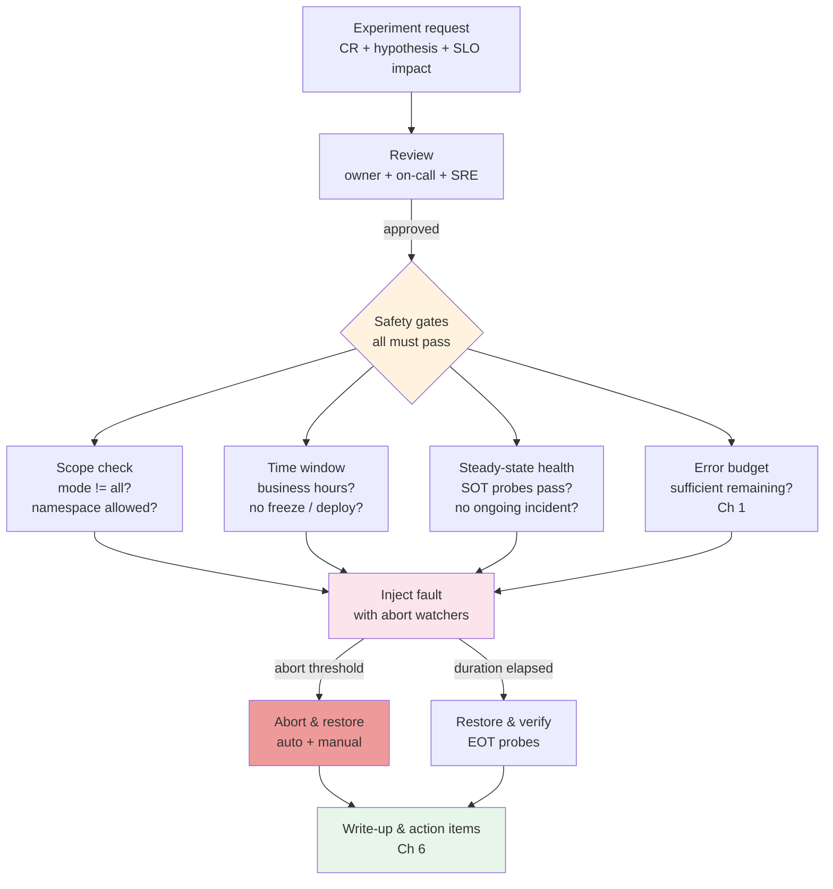
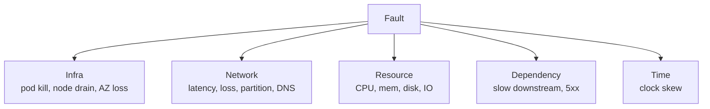
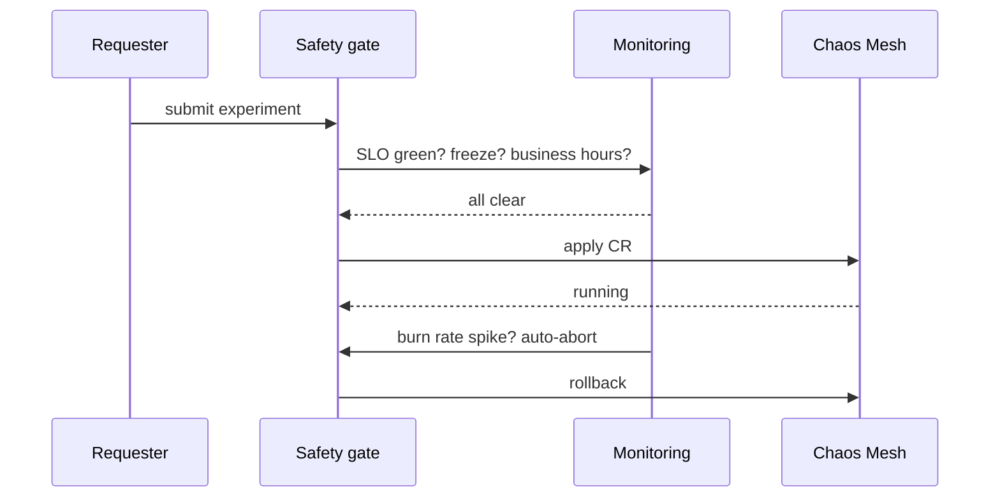
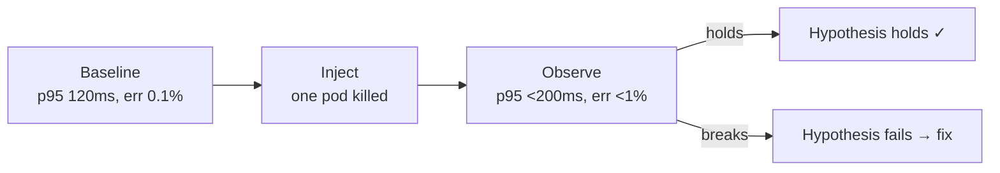

# Chapter 8 — Chaos Engineering

**What this chapter covers.** Distributed systems fail in ways that are difficult to predict from static analysis or code review — subtle interactions between retries, timeouts, caches, queues, and human procedures that only surface under real failure conditions. Chaos engineering is the discipline of *intentionally injecting controlled failures* into production or production-like systems to discover those weaknesses before they become incidents, and to build confidence that the system behaves as intended when the inevitable real failure occurs. This chapter covers principles and history, the full experiment lifecycle, the failure modes worth injecting, the tooling that makes it safe (Chaos Mesh, LitmusChaos, AWS Fault Injection Service, Gremlin), the blast radius and safety controls that keep experiments from becoming incidents, game days as a team practice, and how chaos connects to testing, observability, and resilience patterns. Every concept is grounded in runnable configs and production-safe practices.

Learning goals — after this chapter you should be able to:

- Explain what chaos engineering is and is not — how it differs from traditional testing, why it requires a steady-state hypothesis, and when it is appropriate versus premature.
- Design a chaos experiment from hypothesis through steady-state metrics, fault injection, and automated abort conditions — and distinguish experiments that teach from those that merely destroy.
- Enumerate the failure modes worth injecting — process, container, node, network, resource pressure, time, and dependency failures — and map each to the resilience pattern it validates.
- Write and run Chaos Mesh and LitmusChaos experiments on Kubernetes, including network chaos, pod kills, stress, and I/O faults, with proper scoping and RBAC.
- Implement blast radius controls — scoping, rate limiting, automatic rollback, and observability gating — that make chaos safe enough to run in production.
- Organize and facilitate game days that build team muscle memory for incident response while surfacing systemic gaps.

---

## What chaos engineering is

### The Netflix lineage

The term was coined at Netflix around 2011, when the company was migrating from a single data center to AWS — trading a controlled physical environment for a distributed cloud where failures were more frequent and less predictable. Traditional testing had not prevented outages caused by subtle interactions: a cache node failure that triggered a retry storm that saturated a downstream database that caused a different service to time out. The insight was that *you cannot predict all failure modes from first principles in a system with dozens of services, multiple data stores, and continuous deployment* — you have to *observe* how the system actually behaves when things break.

Netflix built **Chaos Monkey** (randomly terminating production instances during business hours) as the first tool. The name reflects the idea: a monkey loose in the data center pulling cables at random. If the system is resilient, the monkey does nothing noticeable; if it is not, you learn exactly where. Chaos Monkey was intentionally simple — it tested one thing: can the system tolerate instance loss? Later tools (Chaos Kong for AZ failure, Latency Monkey for network delay) expanded the repertory. The discipline generalized into *chaos engineering* with the publication of *Principles of Chaos Engineering* (chaos.community, 2017).

### Definition

> Chaos engineering is the discipline of experimenting on a system in order to build confidence in the system's capability to withstand turbulent conditions in production.

The definition has three load-bearing words:

- **Experimenting** — not random destruction. A chaos experiment has a hypothesis, a controlled scope, measured steady-state behavior, and a defined abort condition. Uncontrolled fault injection is not chaos engineering — it is just breaking things.
- **Confidence** — the goal is not to find bugs per se, but to *verify assumptions* about system behavior. "We believe the checkout service will maintain p95 < 400 ms when one payment replica is unavailable because the circuit breaker will open and fallback logic will serve cached rates." The experiment tests that belief. Whether it confirms or refutes, you have learned something precise.
- **Production** — the highest-fidelity signal comes from production, where traffic, data, and configuration are real. Experiments in staging are useful but strictly less informative — staging rarely has production's data volume, traffic shape, or cross-service interactions. The aspiration is to run in production; the practice requires earning the safety to do so (blast radius controls, gradual rollout).

### What chaos engineering is not

| Misconception | Reality |
|--------------|---------|
| Randomly breaking things | Hypothesis-driven experiments with defined scope, metrics, and abort conditions. Randomness without measurement is just outages. |
| A replacement for testing | Complements unit, integration, and load tests — it tests *emergent system behavior* under failure that component tests cannot capture. Volume 6, Chapter 12 covers distributed correctness testing (Jepsen, simulation); chaos covers *operational* resilience. |
| Only for mature hyper-scale companies | The principles apply to any distributed system with more than a few services. Start with one service and one failure mode — even a single pod-kill experiment teaches more than no experiment. |
| An excuse to cause incidents | Experiments must have blast radius limits, automatic abort, and stakeholder buy-in. An experiment that causes user-visible impact without prior risk assessment is an incident caused by the experiment, not a useful experiment. |
| A one-time activity | A continuous practice. Every architectural change, dependency addition, or scaling event can introduce new failure modes. Chaos experiments should run on a schedule, in CI/CD, and before significant releases. |

> **Boundary note.** This chapter covers chaos as *operational practice* — fault injection in running systems to validate resilience. Volume 6, Chapter 12 covers chaos as *verification of distributed correctness* (Jepsen, deterministic simulation, lineage-driven fault injection for consensus protocols). The failure modes overlap; the goals and tooling differ. Load testing (Chapter 7) measures capacity under *expected* demand; chaos measures behavior under *unexpected* failure.

---

## Principles and the experiment lifecycle

### Principles of Chaos Engineering (chaos.community)

The community principles, lightly adapted, are:

1. **Build a hypothesis around steady-state behavior.** Define what "normal" looks like in measurable terms before injecting faults. Without a steady-state definition, you cannot distinguish "the system handled the fault" from "we did not notice the impact."
2. **Vary real-world events.** Faults should resemble things that actually happen — process crashes, network partitions, slow dependencies, resource exhaustion, clock skew — not exotic conditions that would never occur in production.
3. **Run experiments in production** (or as close as safety allows). Minimize the difference between experiment and reality.
4. **Automate experiments to run continuously.** Manual experiments are run once and forgotten; automated experiments catch regressions.
5. **Minimize blast radius.** Scope experiments so the cost of an unexpected result is contained — one service, one AZ, a percentage of traffic.

### The lifecycle



*Figure 8-1: The chaos experiment lifecycle. Each experiment is a loop — hypothesis, steady state, injection, observation, learning — that either verifies resilience or surfaces a gap to fix. Verified fixes become automated regression experiments.*

**Each stage in detail:**

**1. Hypothesis** — A falsifiable statement: "If we inject fault F scoped to S, then steady-state metric M will remain within bounds B because mechanism R will activate." Example: "If we kill one of three payment-service pods, checkout p95 will remain < 400 ms because the service mesh will remove the dead endpoint within 2 s and the remaining pods have headroom."

- Specific metric and bound (not "the system will be fine").
- Named resilience mechanism (circuit breaker, retry, autoscaling, failover) — the thing the experiment validates.
- Falsifiable — the experiment can prove the hypothesis wrong, and that is valuable.

**2. Steady state** — Measure the baseline *before* injection. Steady state is not "no errors" — it is the normal operating range of the metrics you will compare:

- SLO-derived metrics: p95 latency, error rate, throughput for the affected service and its callers.
- Resource metrics: CPU, memory, queue depth, connection pool utilization.
- Business metrics (when relevant): checkout conversion rate, search result freshness.

Record for long enough that you know what normal variance looks like — a 30-second baseline is not steady state if the metric naturally oscillates over minutes. Define **abort thresholds**: if error rate exceeds X or p95 exceeds Y during the experiment, abort automatically — do not wait for a human to notice.

**3. Design** — Choose fault, scope, and duration:

- Fault type — one of the catalog in the next section.
- Scope — which service / namespace / AZ / percentage of pods or traffic.
- Duration — long enough to observe steady-state impact (including autoscaler and circuit breaker reaction time), short enough that blast radius is bounded. Typically 1–10 minutes for pod/network faults, longer for soak-style resource pressure.
- Scheduling — business hours with on-call present is the default for production experiments. Off-hours chaos is higher risk and lower observability (fewer eyes).

**4. Inject** — Execute the fault through tooling with:

- Automated abort on threshold breach.
- Manual abort (single command or button) accessible to on-call without needing the experiment owner's involvement.
- Full audit trail: what was injected, when, by whom, with what scope.

**5. Observe** — Compare metrics during injection to:

- Steady-state baseline (did the metric leave the normal range?).
- Hypothesis (did the expected resilience mechanism activate? Did fallback logic serve correct results, not just fast ones?).
- Caller impact (did *callers* of the affected service see degradation that the affected service's own metrics hid?).

Use the observability stack from Chapters 2–4: metrics for latency and errors, tracing for dependency impact and fallback path verification, logs for error details.

**6. Learn and fix** — Whether the hypothesis held or not, produce a short write-up:

- What was expected, what was observed, what was the gap.
- Root cause of any gap (missing circuit breaker, wrong timeout, insufficient headroom, misconfigured retry).
- Action items with owners — the same lifecycle as a postmortem (Chapter 6). A chaos experiment that finds a gap but does not produce a tracked fix has wasted its value.
- Re-run the experiment after the fix to verify.

**7. Automate** — Experiments that passed become regression guards: schedule them periodically (daily, weekly) or gate deployments (run before promoting to production). Experiments that failed and were fixed are re-run to verify — then promoted to regression guards as well.

### Hypothesis quality matters

Compare:

- Weak: "Killing a pod will not break the service." — Unfalsifiable in any useful sense (what does "break" mean? which metric?).
- Weak: "The system is resilient to network partitions." — Too broad; resilience to which partition, between which components, at what traffic level?
- Strong: "Partitioning payment-service from postgres-primary for 30 s will cause checkout p95 to rise to at most 600 ms (from 120 ms baseline) and error rate to at most 2% because the read replica will serve stale-but-acceptable data via the fallback path, and no checkout will be double-charged." — Specific fault, specific metrics, specific bounds, specific mechanism, specific correctness property.

Strong hypotheses force you to articulate what you believe about the system — which is where the learning lives. If you cannot articulate a strong hypothesis, you do not yet understand the system well enough for the experiment to be interpretable. That is itself a signal to invest in observability before chaos.

---

## Failure modes worth injecting

The catalog below maps fault types to the resilience patterns they validate (Chapter 10) and the historical incidents they resemble. Not every system needs every fault — prioritize by the failure modes that are most likely and most damaging for your architecture.

| Fault class | Specific faults | Validates | Resembles |
|-------------|----------------|-----------|-----------|
| **Process / pod** | Kill pod, kill container, crash loop, OOMKill, `SIGTERM` vs `SIGKILL` | Replica redundancy, graceful shutdown, readiness probes, PodDisruptionBudget | Any instance failure — the most common prod fault |
| **Node** | Drain node, kernel panic, disk full, kubelet failure | Node spread, anti-affinity, cluster autoscaler, PDB | AZ or hardware failure |
| **Network** | Latency injection (50–1000 ms), packet loss (1–30%), partition (drop 100%), bandwidth limit, DNS failure | Timeouts, retries with backoff, circuit breakers, hedged requests, fallback | Network partition, congested link, DNS outage |
| **Resource pressure** | CPU stress, memory stress, I/O stress, file descriptor exhaustion, network I/O saturation | Resource limits, QoS classes, backpressure, load shedding | Noisy neighbor, memory leak, GC pressure |
| **Time** | Clock skew (NTP drift), clock jump | Lease expiry, TTL correctness, distributed lock safety | NTP misconfiguration, VM live migration |
| **Dependency** | Downstream 500s, downstream latency, downstream unavailability, message queue stall | Timeouts, circuit breakers, bulkheads, fallbacks, idempotency | Downstream incident, dependency deploy gone wrong |
| **State** | Database failover, cache eviction/flush, queue depth spike, disk corruption | Failover, cache warming, DLQ handling (Volume 10) | DB primary failure, cache cluster loss |
| **Configuration** | Bad config push, feature flag flip, secret rotation failure | Config validation, flag defaults, secret reload | The most common cause of self-inflicted incidents |

### Why network faults are the most revealing

Network faults — latency, loss, and partitions — are disproportionately valuable because they exercise the *interaction* between services, not just the health of a single service. A pod kill tests whether replicas exist; a 500 ms latency injection tests whether timeouts, retries, and circuit breakers are correct across the call graph. The most damaging distributed systems incidents (retry storms, cascading timeouts, split-brain writes) are triggered by network behavior that is degraded but not fully failed — exactly the conditions that network chaos reproduces.

---

## Tooling

### Chaos Mesh (CNCF, Kubernetes-native)

Chaos Mesh is the most widely used Kubernetes chaos tool — a CNCF incubating project with CRD-based experiments, fine-grained scoping, and a dashboard. It covers pod, network, stress, I/O, time, kernel, DNS, HTTP, and JVM faults.

**Installation:**

```bash
# Helm install (requires Kubernetes 1.22+)
helm repo add chaos-mesh https://charts.chaos-mesh.org
helm install chaos-mesh chaos-mesh/chaos-mesh \
  --namespace chaos-mesh --create-namespace \
  --set chaosDaemon.runtime=containerd \
  --set chaosDaemon.socketPath=/run/containerd/containerd.sock \
  --set dashboard.create=true

# Verify
kubectl get pods -n chaos-mesh
# chaos-controller-manager-...   Running
# chaos-daemon-...               Running (one per node)
# chaos-dashboard-...            Running
```

**Pod kill — validate replica redundancy:**

```yaml
# experiments/pod-kill.yaml — kill one payment-service pod, verify checkout SLO holds
apiVersion: chaos-mesh.org/v1alpha1
kind: PodChaos
metadata:
  name: payment-pod-kill
  namespace: chaos-mesh
spec:
  action: pod-kill
  mode: one                          # one pod; alternatives: all, fixed: 2, fixed-percent: 50, random-max-percent: 30
  selector:
    labelSelectors:
      app: payment-service
    namespaces:
      - production
  # Optional: graceful vs immediate
  # gracePeriod: 30                  # seconds; 0 = SIGKILL, >0 = SIGTERM then SIGKILL
  duration: "60s"                    # Chaos Mesh restores automatically after duration
  scheduler:
    cron: "@every 10m"               # for continuous regression (optional)
```

```bash
kubectl apply -f experiments/pod-kill.yaml
# Watch: checkout p95 and error rate during the 60s window
# Verify: remaining payment pods handle load; no checkout errors
# Abort early if needed:
kubectl delete -f experiments/pod-kill.yaml
```

**Network latency — validate timeout and circuit breaker behavior:**

```yaml
# experiments/network-latency.yaml — inject 500ms latency to payment-service calls
apiVersion: chaos-mesh.org/v1alpha1
kind: NetworkChaos
metadata:
  name: payment-latency
  namespace: chaos-mesh
spec:
  action: delay
  mode: all                          # affect all pods matching selector
  selector:
    labelSelectors:
      app: checkout-service          # fault at the caller — egress to payment
    namespaces:
      - production
  direction: to                      # egress only
  target:
    selector:
      labelSelectors:
        app: payment-service
      namespaces:
        - production
    mode: all
  delay:
    latency: "500ms"
    jitter: "100ms"                  # 400-600ms range — more realistic than fixed
    correlation: "25"                # 25% correlation between successive packets
  duration: "120s"
```

**Network partition — validate failover and fallback:**

```yaml
# experiments/network-partition.yaml — isolate one AZ from the primary database
apiVersion: chaos-mesh.org/v1alpha1
kind: NetworkChaos
metadata:
  name: db-partition
  namespace: chaos-mesh
spec:
  action: partition
  mode: all
  selector:
    labelSelectors:
      app: checkout-service
    namespaces:
      - production
  direction: both                    # bidirectional partition
  target:
    selector:
      labelSelectors:
        app: postgres
        role: primary
      namespaces:
        - production
    mode: all
  duration: "60s"
```

**Stress — CPU, memory, and I/O pressure:**

```yaml
# experiments/stress-cpu.yaml — saturate CPU on one replica to test QoS and load shedding
apiVersion: chaos-mesh.org/v1alpha1
kind: StressChaos
metadata:
  name: checkout-cpu-stress
  namespace: chaos-mesh
spec:
  mode: one
  selector:
    labelSelectors:
      app: checkout-service
    namespaces:
      - production
  stressors:
    cpu:
      workers: 2                     # number of stressor threads
      load: 80                       # target CPU load percentage per worker
      options: ["--timeout 120s"]
  duration: "120s"
---
# experiments/stress-memory.yaml — memory pressure on a cache node
apiVersion: chaos-mesh.org/v1alpha1
kind: StressChaos
metadata:
  name: redis-memory-stress
  namespace: chaos-mesh
spec:
  mode: one
  selector:
    labelSelectors:
      app: redis
    namespaces:
      - production
  stressors:
    memory:
      workers: 1
      size: "512MB"                  # allocate 512MB — tune to trigger eviction without OOMKill
      options: ["--timeout 90s"]
  duration: "90s"
```

**I/O fault — validate disk failure handling:**

```yaml
# experiments/io-fault.yaml — I/O latency and errors on a stateful service
apiVersion: chaos-mesh.org/v1alpha1
kind: IOChaos
metadata:
  name: postgres-io-delay
  namespace: chaos-mesh
spec:
  action: latency
  mode: one
  selector:
    labelSelectors:
      app: postgres
    namespaces:
      - production
  volumePath: /var/lib/postgresql/data
  path: /var/lib/postgresql/data/**/*
  delay: "100ms"
  percent: 50                        # 50% of I/O operations delayed
  duration: "60s"
```

**Time skew — validate lease and TTL correctness:**

```yaml
# experiments/time-skew.yaml — skew clock on one replica by 5 seconds
apiVersion: chaos-mesh.org/v1alpha1
kind: TimeChaos
metadata:
  name: checkout-time-skew
  namespace: chaos-mesh
spec:
  mode: one
  selector:
    labelSelectors:
      app: checkout-service
    namespaces:
      - production
  timeOffset: "5s"                   # forward skew; use "-5s" for backward
  clockIds: ["CLOCK_REALTIME"]
  containerNames: ["checkout"]       # target specific container in multi-container pod
  duration: "60s"
```

### LitmusChaos (CNCF, Kubernetes-native, experiment-as-code)

Litmus takes an experiment-as-code approach with a central control plane (ChaosCenter), reusable experiments from ChaosHub, and explicit steady-state probes that gate fault injection and verify recovery.

**Installation:**

```bash
# Install Litmus control plane
kubectl create namespace litmus
kubectl apply -f https://raw.githubusercontent.com/litmuschaos/litmus/master/mkdocs/docs/litmus-3.0.0.yaml

# Install ChaosHub experiments
kubectl apply -f https://hub.litmuschaos.io/api/chaos/master?file=charts/generic/experiments.yaml
```

**Litmus experiment — pod delete with probes:**

```yaml
# experiments/litmus-pod-delete.yaml — delete a pod, verify via probes that SLO holds
apiVersion: litmuschaos.io/v1alpha1
kind: ChaosEngine
metadata:
  name: payment-chaos
  namespace: production
spec:
  appinfo:
    appns: production
    applabel: app=payment-service
    appkind: deployment
  engineState: active
  chaosServiceAccount: litmus-admin
  jobCleanUpPolicy: delete
  experiments:
    - name: pod-delete
      spec:
        components:
          env:
            - name: TOTAL_CHAOS_DURATION
              value: "60"
            - name: CHAOS_INTERVAL
              value: "10"
            - name: FORCE
              value: "false"         # false = graceful SIGTERM; true = SIGKILL
            - name: PODS_AFFECTED_PERC
              value: "50"            # kill 50% of matching pods
          # Probes: steady-state checks that gate the experiment
          probe:
            # Pre-chaos: verify checkout SLO before injecting
            - name: checkout-p95-probe
              type: httpProbe
              mode: SOT               # Start of Test — must pass before fault injection
              httpProbe/inputs:
                url: "http://checkout-service.production.svc:8080/health"
                expectedResponseCode: "200"
                method: get
            # Continuous: abort if error rate exceeds threshold during experiment
            - name: error-rate-probe
              type: cmdProbe
              mode: Continuous        # evaluated throughout the experiment
              runProperties:
                probeTimeout: "5s"
                interval: "5s"
                retry: 1
              cmdProbe/inputs:
                command: |
                  curl -s http://prometheus.monitoring.svc:9090/api/v1/query \
                    --data-urlencode 'query=sum(rate(http_requests_total{service="checkout",code=~"5.."}[1m])) / sum(rate(http_requests_total{service="checkout"}[1m]))' \
                  | python3 -c "import sys,json; d=json.load(sys.stdin); v=float(d['data']['result'][0]['value'][1]) if d['data']['result'] else 0; sys.exit(0 if v < 0.05 else 1)"
            # Post-chaos: verify recovery
            - name: recovery-probe
              type: httpProbe
              mode: EOT               # End of Test — must pass after fault is removed
              httpProbe/inputs:
                url: "http://checkout-service.production.svc:8080/health"
                expectedResponseCode: "200"
                method: get
```

Key difference from Chaos Mesh: Litmus probes are first-class — the experiment *cannot start* if SOT probes fail and *aborts* if continuous probes fail. This makes Litmus well-suited for automated pipelines where you need gating without human judgment.

### Choosing a tool

| Tool | Scope | Strengths | Trade-offs |
|------|-------|-----------|------------|
| **Chaos Mesh** | Kubernetes | Widest fault catalog (pod, network, stress, I/O, time, kernel, DNS, HTTP, JVM); dashboard; fine-grained scoping | Kubernetes only; daemonset per node |
| **LitmusChaos** | Kubernetes | Probe-gated experiments; ChaosHub reusable experiments; ChaosCenter UI; GitOps-friendly | Slightly more setup (control plane + CRDs + hub) |
| **AWS Fault Injection Service (FIS)** | AWS (EC2, EKS, ECS, RDS, AZ) | Managed; AZ power interruption, instance termination, throttling, network disruption; IAM-scoped; no agent required on EC2 | AWS only; narrower fault catalog than Chaos Mesh |
| **Gremlin** | Multi-platform (K8s, VMs, bare metal) | Host and container attacks; broadest platform coverage; enterprise controls (RBAC, audit, halt) | Commercial; agent required |

For Kubernetes teams, **Chaos Mesh** is the default for fault breadth and **Litmus** for probe-gated automation — many teams run both (Chaos Mesh for network/time/kernel faults, Litmus for pod/process with strict probe gating).

**AWS FIS example — AZ disruption:**

```json
{
  "description": "Disrupt AZ use1-az2 — validate multi-AZ failover",
  "targets": {
    "InstancesInAZ": {
      "resourceType": "aws:ec2:instance",
      "resourceTags": { "AZ": "use1-az2" },
      "selectionMode": "ALL"
    }
  },
  "actions": {
    "RebootInstances": {
      "actionId": "aws:ec2:reboot-instances",
      "parameters": { "duration": "PT2M" },
      "targets": { "Instances": "InstancesInAZ" }
    }
  },
  "stopConditions": [
    { "source": "aws:cloudwatch:alarm", "value": "arn:aws:cloudwatch:us-east-1:123456789:alarm:checkout-p95-high" },
    { "source": "aws:cloudwatch:alarm", "value": "arn:aws:cloudwatch:us-east-1:123456789:alarm:checkout-error-rate-high" }
  ],
  "roleArn": "arn:aws:iam::123456789:role/FISExperimentRole"
}
```

```bash
aws fis create-experiment-template --cli-input-json file://fis-az-disruption.json
aws fis start-experiment --experiment-template-id EXTxxxxxxxx
```

FIS stop conditions are the equivalent of abort thresholds — CloudWatch alarms that automatically halt the experiment if breached.

---

## Safety: blast radius, abort conditions, and guardrails

Chaos without safety controls is just risky fault injection. The following controls are non-negotiable for production experiments.

### Scoping (blast radius limits)

| Control | How | Example |
|---------|-----|---------|
| **Namespace / label scoping** | Experiment targets only pods matching label selector in specific namespaces | `app=payment-service, namespaces=[production]` — not `all` |
| **Mode limits** | Affect one or a fixed percentage, not all | `mode: one` or `fixed-percent: 25` — never `all` for destructive faults in prod |
| **AZ / zone scoping** | Limit to single AZ to validate zone isolation without full region impact | Chaos Mesh `selector` with `topology.kubernetes.io/zone` label |
| **Traffic scoping** | Use header or percentage-based routing to affect only a fraction of requests | Service mesh fault injection on 5% of traffic (Istio `fault` with `percentage`) |
| **Time scoping** | Short duration with automatic restoration | `duration: "60s"` — faults self-heal; no experiment runs unbounded |
| **Opt-in scoping** | Annotate services that are chaos-ready; experiments skip non-annotated services | `chaos.alpha.kubernetes.io/enabled: "true"` label check via OPA/Kyverno policy |

### Abort conditions

Every experiment must have at least one automated abort path:

- **Metric-based abort.** Prometheus or CloudWatch query evaluated continuously: if error rate > threshold or p95 > threshold, abort. In Litmus, this is a `Continuous` probe; in Chaos Mesh, use an external watcher (a small controller or a `Workflow` with a `StatusCheck` node that deletes the experiment CR on breach).
- **Manual abort.** A single `kubectl delete` or dashboard button that any on-call engineer can execute without needing experiment context. Document it in the experiment announcement.
- **Timeout abort.** Every experiment has a hard duration after which the fault is removed automatically — even if observation is still in progress.

### Guardrails



*Figure 8-2: Safety gates for a production chaos experiment. No experiment runs without passing scope, window, health, and budget checks — and every experiment has both automated and manual abort paths.*

**Additional guardrails:**

- **Change freeze awareness.** Do not run chaos during deploys, migrations, or active incidents — the signal is confounded and the combined blast radius is unpredictable.
- **Error budget gating.** If the service's error budget is already significantly burned (Chapter 1), skip the experiment — even a small additional error rate may breach the SLO. This makes error budgets a natural throttle for chaos aggressiveness.
- **Progressive rollout.** Start with staging, then production with `mode: one` and short duration, then expand scope only after the narrow experiment passes. Never go from "never run chaos" to "partition the primary database in production."
- **RBAC.** Restrict who can create chaos CRs. Chaos Mesh and Litmus both support Kubernetes RBAC on their CRDs — only the chaos service account and designated SREs should have `create` on `PodChaos` / `NetworkChaos` / `ChaosEngine`.

**OPA/Kyverno policy to enforce blast radius limits:**

```yaml
# policies/chaos-guardrails.yaml — Kyverno: block dangerous chaos experiments
apiVersion: kyverno.io/v1
kind: ClusterPolicy
metadata:
  name: chaos-guardrails
spec:
  validationFailureAction: Enforce
  background: true
  rules:
    - name: block-all-mode-in-production
      match:
        any:
          - resources:
              kinds: ["PodChaos", "NetworkChaos", "StressChaos", "IOChaos"]
      validate:
        message: "Chaos experiments with mode=all are forbidden in production namespaces"
        deny:
          conditions:
            any:
              - key: "{{ request.object.spec.selector.namespaces || '' }}"
                operator: AnyIn
                value: ["production"]
              - key: "{{ request.object.spec.mode }}"
                operator: Equals
                value: "all"
    - name: require-duration-limit
      match:
        any:
          - resources:
              kinds: ["PodChaos", "NetworkChaos", "StressChaos", "IOChaos"]
      validate:
        message: "Chaos experiments must declare duration <= 300s in production"
        pattern:
          spec:
            duration: "?*"
            # Duration parsing is string-based; enforce via CEL or webhook for numeric comparison.
            # Kyverno CEL variant:
            # cel:
            #   expressions:
            #     - expression: "duration(object.spec.duration) <= duration('300s')"
            #       message: "Duration exceeds 300s limit for production"
```

---

## Detection and observability during chaos

A chaos experiment is only as good as its observability — if you cannot measure the impact, you cannot verify the hypothesis. Before any experiment, confirm that the following are in place (Chapters 2–4):

- **Metrics:** Latency histograms (not averages), error rates, throughput, and resource saturation per service — with dashboards that show the affected service *and its callers*. A downstream failure may keep the downstream's own metrics healthy (it is just slow) while the caller's error rate spikes.
- **Tracing:** Distributed traces that show whether fallback paths were taken, whether retries fired, and where time was spent. After a network latency injection, traces should show the caller's timeout firing and the fallback span — if they show retries instead, the circuit breaker may not be opening as expected.
- **Logs:** Structured logs from the affected service and its callers at a level that captures circuit breaker state transitions, retry attempts, and fallback invocations — not just error logs.
- **SLO burn rate:** Multi-window burn rate alerts (Chapter 1) that fire proportionally to error budget consumption — these are the natural abort thresholds for chaos experiments because they already encode "how much error is too much."

**Chaos-specific observability:**

- Annotate chaos experiment windows in dashboards (Grafana annotations, Datadog events) so impact is visually correlated with fault injection — without this, on-call may investigate a chaos-induced anomaly as a real incident.
- Record which pods / nodes / network paths were affected and for how long — this is the experiment's ground truth for post-experiment analysis.
- Measure *correctness*, not just latency and errors. A fallback that returns stale data quickly (low latency, no errors) but serves incorrect results (wrong prices, duplicate charges) passes latency checks but fails correctness. Include correctness probes: compare fallback responses to expected behavior, verify idempotency, check for duplicate side effects.

---

## Game days

### What they are

A **game day** (sometimes called *fire drill*) is a facilitated, team-based exercise where a failure scenario is injected — via chaos tooling or manual simulation — and the team practices detection, diagnosis, and recovery as if it were a real incident. Unlike automated chaos experiments that test *system* resilience, game days test *team* resilience: does on-call know how to detect the failure, does the runbook work, does the escalation path function, can the team coordinate under time pressure?

### Format

**Before:**

1. Choose a scenario with a plausible real-world trigger: database primary failure, AZ loss, downstream dependency outage, config push gone wrong.
2. Define learning objectives: "Verify that the failover runbook completes in < 10 minutes" or "Validate that on-call can identify the root cause from dashboards alone within 5 minutes."
3. Prepare the injection: chaos experiment CR, manual steps (scale a deployment to zero, revoke a credential, introduce latency via service mesh), and abort conditions.
4. Brief participants on scope and safety — but not on the specific fault or timing if the goal is to test detection. For first game days, transparency is better than surprise — the goal is learning, not trickery.
5. Schedule during business hours with full team present, including on-call, service owner, and optionally observers from adjacent teams.

**During:**

1. Inject the fault. Start the clock.
2. Observe without intervening (unless abort threshold is breached). Note: who detected it, how long to detection, what signals were used, what actions were taken, where the runbook was unclear or wrong.
3. Facilitate lightly — answer questions about scope and safety, but do not guide diagnosis. The point is to see how the team performs without the facilitator's help.
4. After recovery (or abort), hold a brief debrief while memories are fresh: what went well, what was confusing, what took longer than expected.

**After:**

1. Write a short postmortem-style document (Chapter 6): scenario, timeline, observations, gaps, action items.
2. Track action items: fix the runbook, add the missing alert, correct the dashboard, practice again.
3. Schedule the next game day — monthly for critical services, quarterly for others. Vary scenarios to cover different failure modes over time.

### Example game day scenarios

| Scenario | Injection | Tests |
|----------|-----------|-------|
| **Database primary failure** | Kill postgres primary pod; or `kubectl scale statefulset postgres --replicas=0` for the primary | Failover automation, read-replica promotion, connection pool recovery, data loss window |
| **AZ outage** | `NetworkChaos` partition isolating one AZ; or FIS `RebootInstances` for all instances in one AZ | Zone redundancy, PDB, cross-AZ replication, load balancer draining |
| **Downstream dependency slow** | `NetworkChaos` delay 800 ms to downstream service | Timeouts, circuit breakers, fallbacks, user-facing degradation vs. full outage |
| **Credential expiry** | Revoke or rotate a service credential; or mount an expired cert | Secret reload, cert rotation automation, graceful degradation vs. crash loop |
| **Config push failure** | Apply a bad config via the normal CD pipeline | Config validation, automated rollback, blast radius of bad config |
| **Cache cluster loss** | `PodChaos` killing all redis pods; or `IOChaos` on cache volumes | Cache miss storm, database overload under cache loss, warming behavior |

### Game days and chaos experiments

They are complementary, not competing:

- **Chaos experiments** are automated, narrow, hypothesis-driven, and run continuously — they verify that a specific resilience mechanism works.
- **Game days** are manual, broad, scenario-driven, and run periodically — they verify that the *team* can handle a realistic incident end to end.

A mature program runs both: automated chaos experiments as regression guards (Litmus on a schedule, Chaos Mesh workflows in CI) and game days as team practice (monthly for tier-0 services). The chaos experiments build confidence in the system; the game days build confidence in the people.

---

## Distributed-systems lens

Chaos engineering is particularly essential — and particularly subtle — in distributed backends:

**Emergent failures.** The most interesting failures are not single-component failures but *interactions*: a slow downstream causes retries that saturate a different downstream that causes a different service to time out. Single-service chaos (kill one pod) will not surface these — you need *multi-service* chaos: inject latency in service A and observe the cascade through services B, C, and D. Design experiments that span the call graph, not just one hop.

**Consistency under partition.** Network partitions are the canonical distributed systems fault (Volume 6, Chapter 1–6). Chaos experiments that partition a consensus group (etcd, ZooKeeper, database replication) validate that the system maintains consistency (no split-brain writes) and availability (reads still served from the majority partition). These experiments are higher risk and should start in staging with Jepsen-style correctness checks before moving to production with read-only partitions.

**Coordination and leader election.** Killing the leader of a consensus group or the holder of a distributed lock tests failover correctness — but the interesting signal is not whether failover happens (it will) but *how long it takes* and *whether there is a window of unavailability or duplicate leadership*. Measure leader election latency and verify that no two nodes believe they are leader simultaneously (fencing correctness).

**Idempotency and exactly-once.** Chaos that causes retries and redelivery (network partition followed by heal, pod kill during request processing) tests whether the system's idempotency and deduplication logic is correct. Without idempotency, retried requests cause duplicate charges, duplicate messages, or inconsistent state. Verify correctness (no duplicates), not just availability (no errors) — see Volume 6, Chapter 9 and Volume 10, Chapter 2 for the theory, and test it with chaos.

**Backpressure and load shedding under induced load.** Chaos that degrades a downstream (latency injection, resource stress) increases queue depth and latency upstream — testing whether backpressure and load shedding (Chapter 10, Volume 10 Chapter 7) activate correctly. Without them, the upstream accumulates unbounded work and eventually OOMs or times out globally.

---

## Anti-patterns and common mistakes

| Anti-pattern | Why it hurts | Fix |
|-------------|-------------|-----|
| **No hypothesis** | Injecting faults without a falsifiable hypothesis produces observations that cannot be interpreted — was the system supposed to do that? | Write a hypothesis with specific metric, bound, and mechanism before every experiment. |
| **Too broad, too early** | `mode: all` on the first experiment in production — if the system is not resilient, you cause the incident you were trying to prevent. | Progressive scoping: `mode: one`, short duration, staging first, then narrow prod, then expand. |
| **Measuring only the affected service** | The affected service may appear healthy (it is just slow) while its callers are failing — the real SLO impact is at the caller. | Dashboard the affected service *and its callers*; include caller error rate in abort conditions. |
| **No abort conditions** | An experiment that degrades more than expected continues until a human notices — turning an experiment into an incident. | Automated metric-based abort (Litmus continuous probes, FIS stop conditions, or external watcher) on every experiment. |
| **Chaos without observability** | Injecting faults when dashboards and alerts cannot distinguish chaos-induced anomalies from normal variance — results are uninterpretable. | Invest in observability (Chapters 2–4) before chaos; annotate experiment windows in dashboards. |
| **One-time chaos** | Running chaos once, finding nothing, and declaring the system resilient — missing regressions introduced by the next deploy. | Automate: schedule experiments periodically and gate deployments. |
| **Blaming the chaos** | "The chaos experiment caused the incident" — technically true, but the experiment *revealed* a pre-existing weakness; the same failure would have happened from a real fault. | Blameless write-up (Chapter 6): the experiment is the messenger, not the cause. |
| **Chaos as a gate without SLOs** | Running chaos without SLO-derived abort thresholds — abort decisions are subjective and inconsistent. | Define abort thresholds from SLO burn rates (Chapter 1); chaos respects the same error budget as production traffic. |

---


#### Fault Injection Taxonomy



#### Safety Gates Sequence



#### Steady-State Hypothesis



#### Game Day Timeline

```mermaid
gantt
    title Game Day
    dateFormat HH:mm
    axisFormat %H:%M
    section Phases
    Briefing       :a1, 09:00, 30m
    Inject fault 1 :a2, after a1, 20m
    Observe + debug :a3, after a2, 30m
    Rollback + retro :a4, after a3, 40m
```



## Key takeaways

- Chaos engineering is **hypothesis-driven experimentation on the system's ability to withstand realistic failures** — not random destruction. Every experiment has a falsifiable hypothesis with a specific metric, bound, and named resilience mechanism, plus defined steady state, scope, duration, and abort conditions.
- The lifecycle is **hypothesis → steady state → design → inject → observe → learn → automate**. Experiments that verify resilience become automated regression guards; experiments that find gaps produce tracked action items (postmortem lifecycle, Chapter 6) and are re-run after fixes.
- **Strong hypotheses** are specific and falsifiable: "Partitioning payment from postgres-primary for 30 s will cause p95 to rise to at most 600 ms because the read replica fallback will activate." Weak hypotheses ("the system is resilient") are uninterpretable.
- The **failure catalog** spans process/pod, node, network (latency, loss, partition), resource pressure, time skew, dependency degradation, state loss, and config errors. **Network faults** are disproportionately valuable because they test interactions across the call graph — the source of cascading failures, retry storms, and split-brain.
- **Chaos Mesh** (widest fault catalog, Kubernetes-native CRDs) and **LitmusChaos** (probe-gated, experiment-as-code, ChaosCenter) are the defaults for Kubernetes; **AWS FIS** for managed AWS faults with IAM scoping and CloudWatch stop conditions; **Gremlin** for multi-platform coverage. Many teams combine Chaos Mesh for fault breadth with Litmus for probe-gated automation.
- **Safety is non-negotiable:** scope narrowly (`mode: one`, single namespace/AZ, short duration), abort automatically on metric thresholds (Litmus continuous probes, FIS stop conditions), allow single-command manual abort, respect change freezes and error budget state, and enforce blast radius limits via RBAC and admission policy (Kyverno/OPA). Never go from "no chaos" to broad production faults — **progressive rollout** from staging to narrow prod to expanded scope.
- **Observability determines experiment value** (Chapters 2–4): measure the affected service *and its callers*, use latency histograms and correctness probes (not just error rates), annotate experiment windows in dashboards, and set abort thresholds from **SLO burn rates** (Chapter 1).
- **Game days** test team resilience (detection, diagnosis, recovery, coordination) while **automated chaos experiments** test system resilience (specific mechanisms). A mature program runs both: automated experiments continuously as regression guards and game days periodically (monthly for tier-0) as team practice.
- In distributed systems, the most revealing chaos spans **multiple services and the call graph**, tests **consistency under partition** and **leader failover correctness**, validates **idempotency under retry**, and verifies that **backpressure and load shedding** activate when downstream degradation increases upstream queue depth.

---

## Further reading

- Principles of Chaos Engineering — https://principlesofchaos.org/ — the foundational community principles (2017).
- Casey Rosenthal et al., *Chaos Engineering: System Resiliency in Practice* (O'Reilly, 2020) — the definitive book, including the experiment lifecycle and case studies.
- Netflix — *Chaos Monkey, Chaos Kong, and the Simian Army* — https://netflixtechblog.com/tagged/chaos-engineering — the origin story and evolution.
- Chaos Mesh documentation — https://chaos-mesh.org/docs/ — fault catalog, scoping, and workflow orchestration.
- LitmusChaos documentation — https://docs.litmuschaos.io/ — ChaosCenter, probes, and ChaosHub.
- AWS Fault Injection Service — https://docs.aws.amazon.com/fis/ — managed chaos for AWS with IAM and CloudWatch integration.
- Google — *DiRT (Disaster Recovery Testing) at Google* — https://sre.google/sre-book/disaster-recovery-testing/ — Google's game day practice at scale.
- Nora Jones et al., *GameDay: The Resilience Exercise Playbook* — facilitation guide for team-based resilience exercises.
- Jepsen analyses — https://jepsen.io/analyses — distributed correctness testing under partition; complementary to operational chaos (see Volume 6, Chapter 12).
- Adrian Cockcroft, *Learning from Chaos* — early articulation of chaos as confidence building for cloud migration.
- Bruce Schneier on blameless culture and learning from failure — see Chapter 6 (postmortems) for the cultural foundation that makes chaos safe to practice.
