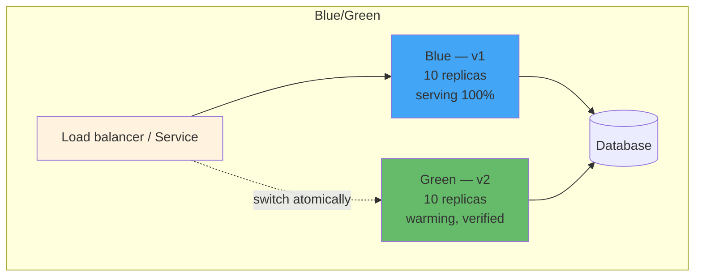
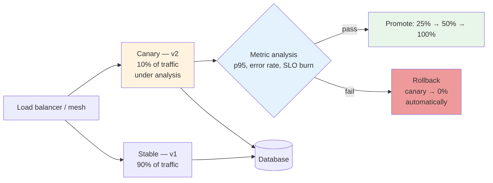
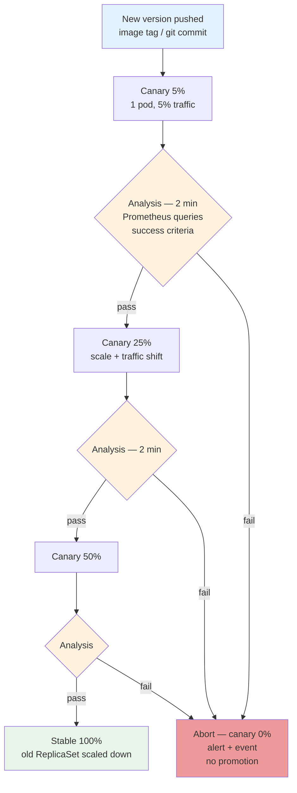
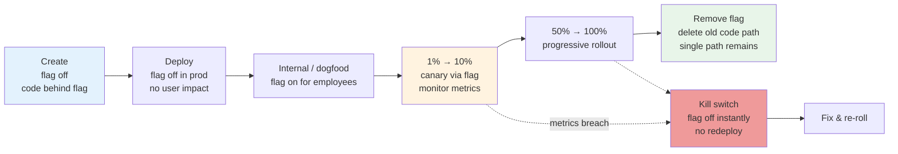
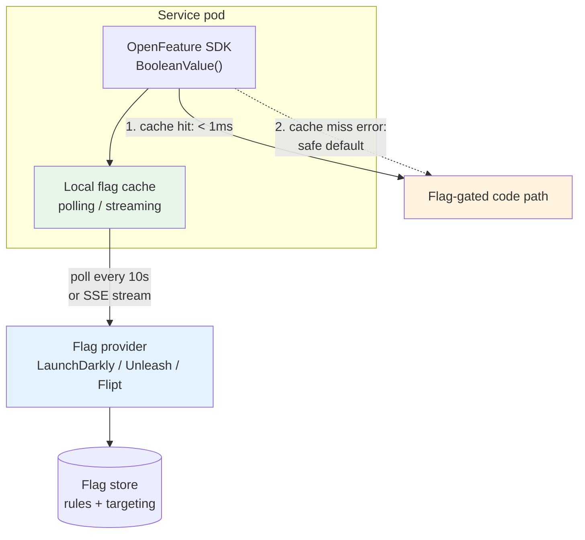
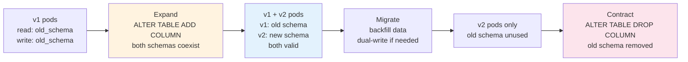
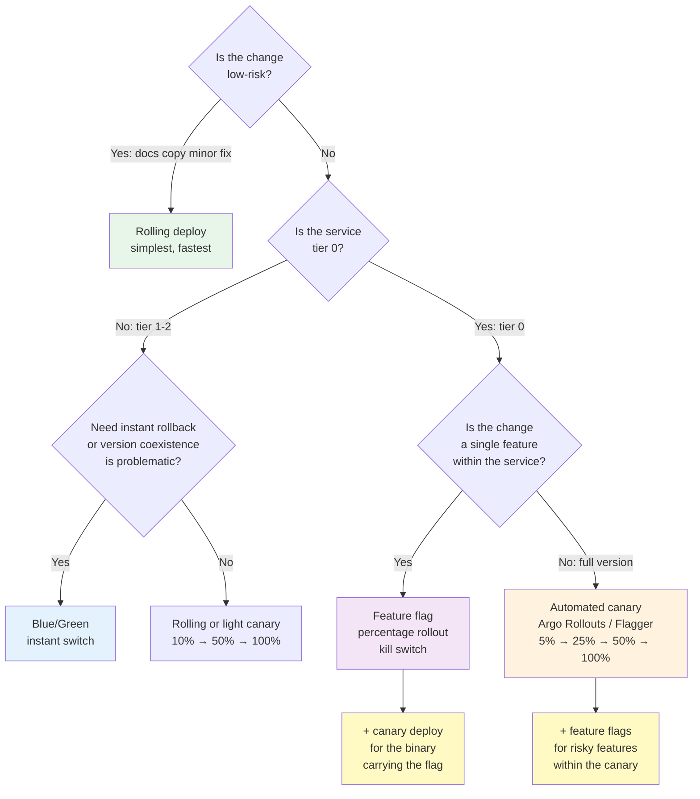
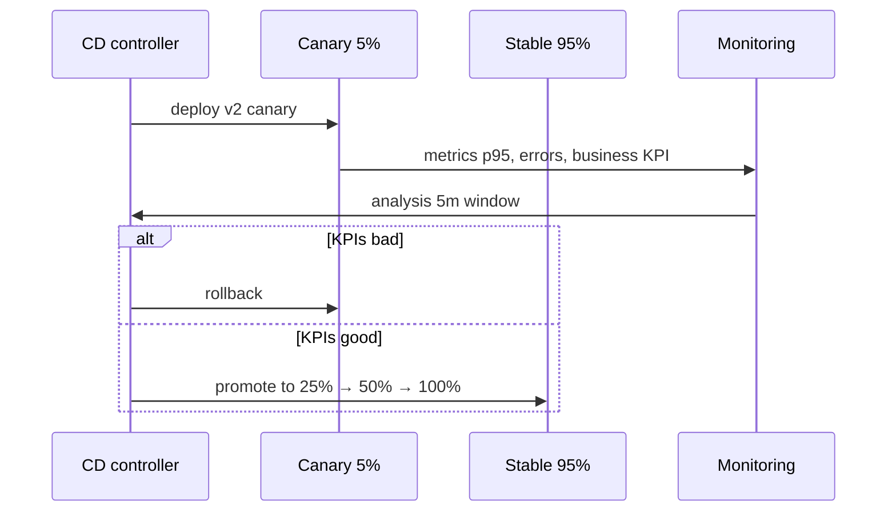

# Chapter 9 — Deployment Strategies: Blue/Green, Canary, and Feature Flags

**What this chapter covers.** Every deployment is a bet that the new version is better than the old one — but the cost of losing that bet depends entirely on how you deploy. A strategy that shifts 100% of traffic to an untested version can turn a subtle bug into a full outage in seconds; a strategy that exposes the new version to 1% of traffic with automated rollback can contain the same bug to a handful of requests. This chapter covers the deployment strategies that make deploys safe: rolling, blue/green, canary (including automated progressive delivery with Argo Rollouts and Flagger), and feature flags (including OpenFeature and flag evaluation at scale), plus the traffic management, metrics analysis, and rollback automation that make each strategy trustworthy. Every pattern is grounded in runnable Kubernetes configs and real flag evaluation code.

Learning goals — after this chapter you should be able to:

- Compare rolling, recreate, blue/green, canary, shadow (dark launch), and A/B strategies on blast radius, rollback speed, resource cost, and operational complexity — and choose the right strategy for a given service tier and risk profile.
- Explain how canary analysis works — metric templates, success criteria, and automated promotion or rollback — and why a canary without automated analysis is just a slow rolling deploy.
- Write and operate Argo Rollouts and Flagger canary pipelines on Kubernetes, including traffic management via Istio, NGINX, and Gateway API, metric analysis via Prometheus, and webhook-based custom checks.
- Design a feature flag system — flag types, evaluation models, targeting rules, and lifecycle — and implement flags with OpenFeature, including local evaluation, percentage rollouts, and kill switches.
- Implement automated rollback that triggers on SLO burn, error rate, or custom health signals — and connect rollback policy to error budgets (Chapter 1).
- Reason about the distributed-systems dimensions: database migration compatibility, cross-service deploy ordering, and the interplay between deployment strategy and capacity headroom.

---

## Why deployment strategy matters

### Deployments are the leading cause of incidents

Across industry surveys and postmortem corpora, a consistent finding is that a large fraction of Sev1 and Sev2 incidents are triggered by deployments — new code, new config, new infrastructure. The code may be correct in isolation but interact badly with production traffic, data, downstream behavior, or the previous version's state. The question is not whether deploys will sometimes be bad — they will — but whether the deployment strategy *contains* the blast radius and *recovers* quickly when they are.

A deployment strategy answers three questions:

1. **How much traffic sees the new version at each step?** (blast radius control)
2. **How is the new version evaluated?** (signal — metrics, checks, human judgment)
3. **How quickly and automatically is a bad version removed?** (rollback)

Strategies that answer these well make it safe to deploy frequently (which itself reduces risk — smaller changes are easier to reason about and roll back). Strategies that answer them poorly incentivize infrequent, large, high-risk deploys.

### The DORA connection

The DORA research program (*Accelerate*, Forsgren et al.) finds that elite teams deploy *more frequently* and have *lower change failure rates* simultaneously — and that deployment automation (including progressive delivery and feature flags) is one of the capabilities that predicts both. The mechanism is straightforward: safe deployment strategies reduce the cost of a bad deploy, which reduces the fear of deploying, which enables smaller batch sizes, which reduces the chance that any single deploy is bad. It is a virtuous cycle — but only if the strategy actually contains blast radius and automates rollback.

### What "safe" means for different tiers

Not every service needs the same strategy:

| Tier | Example | Acceptable blast radius | Strategy |
|------|---------|------------------------|----------|
| **Tier 0 — critical path** | Checkout, payments, auth | < 5% of traffic at any step; automated rollback in < 2 min | Canary with automated analysis + feature flags for risky changes |
| **Tier 1 — important, not critical** | Search, recommendations, notifications | < 25% per step; rollback in < 5 min | Canary or blue/green with metric gating |
| **Tier 2 — internal / batch** | Admin tools, analytics pipeline, internal dashboards | 50–100% acceptable; rollback in < 15 min | Rolling or blue/green; canary is often overkill |

Tier 0 services justify the complexity of automated canary analysis and flag infrastructure; tier 2 services often do not. Choose per service, not per organization.

---

## The strategy catalog

### Recreate

Delete all old pods, then create new pods. The simplest strategy — and the most disruptive: there is a window with zero replicas serving traffic. Only appropriate for non-availability-sensitive workloads (batch jobs, development environments) or single-replica services that cannot run two versions simultaneously due to resource constraints.

```yaml
# Recreate — downtime is inherent
spec:
  strategy:
    type: Recreate
```

### Rolling (Kubernetes default)

Replace pods incrementally: create one new pod, wait for it to become ready, delete one old pod, repeat. Controlled by `maxSurge` (how many extra pods above desired) and `maxUnavailable` (how many pods can be unavailable during the rollout).

```yaml
spec:
  replicas: 10
  strategy:
    type: RollingUpdate
    rollingUpdate:
      maxSurge: 2        # up to 12 pods during rollout
      maxUnavailable: 1  # at least 9 pods available throughout
```

- **Blast radius:** Gradual — one pod at a time by default. But there is no traffic splitting: once a new pod is ready, it receives its share of load immediately via the Service endpoints. New code is exercised proportionally as it rolls out.
- **Rollback:** `kubectl rollout undo` — but it is itself a rolling update in reverse, so rollback is not instant. And there is no automated signal — a human must notice the problem and trigger it.
- **When to use:** Default for most tier 1–2 services. Simple, built-in, no extra tooling. Insufficient for tier 0 where you need traffic control and automated analysis.

### Blue/Green

Run two full environments — blue (current) and green (new) — and switch traffic atomically from one to the other. Both environments run simultaneously during verification; rollback is an instant traffic switch back to blue.



*Figure 9-1: Blue/green. Both versions run at full scale; traffic switches atomically via label selector or load balancer. Rollback is an instant switch back — but the resource cost is 2× during the transition window.*

- **Blast radius:** All-or-nothing at the switch point — 0% then 100%. Verification happens before the switch (smoke tests against green), but green has not served production traffic, so load-related bugs are not caught until the switch.
- **Rollback:** Near-instant — flip the Service selector or load balancer target back. No pod churn.
- **Resource cost:** 2× during the transition (both versions at full scale). For large services this can be expensive, and the cost scales with the number of services deployed blue/green simultaneously.
- **When to use:** Services where version coexistence is problematic (incompatible state, singleton constraints), or where instant rollback is worth the 2× resource cost. Common for database-adjacent services and infrastructure components.

**Kubernetes blue/green with Argo Rollouts:**

```yaml
# rollout-bluegreen.yaml — Argo Rollouts blue/green with preview service and auto-promotion
apiVersion: argoproj.io/v1alpha1
kind: Rollout
metadata:
  name: checkout-api
  namespace: production
spec:
  replicas: 10
  strategy:
    blueGreen:
      activeService: checkout-active        # Service serving production traffic
      previewService: checkout-preview      # Service for verifying green before promotion
      autoPromotionEnabled: false           # manual promotion gate — human verifies preview
      scaleDownDelaySeconds: 600            # keep old ReplicaSet for 10 min after promotion (rollback window)
      prePromotionAnalysis:                 # analysis before promotion — must pass
        templates:
          - templateName: checkout-smoke
        args:
          - name: service-name
            value: checkout-preview
      postPromotionAnalysis:                # analysis after promotion — auto-rollback if fails
        templates:
          - templateName: checkout-slo
        args:
          - name: service-name
            value: checkout-active
      # Anti-affinity: never co-locate blue and green on same node during transition
      # (set via pod template affinity)
  selector:
    matchLabels: { app: checkout-api }
  template:
    metadata:
      labels: { app: checkout-api }
    spec:
      affinity:
        podAntiAffinity:
          preferredDuringSchedulingIgnoredDuringExecution:
            - weight: 100
              podAffinityTerm:
                labelSelector:
                  matchLabels: { app: checkout-api }
                topologyKey: kubernetes.io/hostname
      containers:
        - name: checkout
          image: registry.example.com/checkout:v2.1.0
          ports: [{ containerPort: 8080 }]
          readinessProbe:
            httpGet: { path: /health, port: 8080 }
            initialDelaySeconds: 5
            periodSeconds: 5
          resources:
            requests: { cpu: "500m", memory: "512Mi" }
            limits: { cpu: "1000m", memory: "1Gi" }
---
apiVersion: v1
kind: Service
metadata:
  name: checkout-active
  namespace: production
spec:
  selector: { app: checkout-api }
  ports: [{ port: 80, targetPort: 8080 }]
---
apiVersion: v1
kind: Service
metadata:
  name: checkout-preview
  namespace: production
spec:
  selector: { app: checkout-api }
  ports: [{ port: 80, targetPort: 8080 }]
```

Promotion is manual (`kubectl argo rollouts promote checkout-api`) or triggered by CI after preview verification. Rollback is `kubectl argo rollouts undo checkout-api` — flips the active service back to the previous ReplicaSet instantly without pod churn.

### Canary

Shift a small percentage of traffic to the new version, evaluate metrics, and progressively increase the percentage — aborting and rolling back automatically if metrics breach thresholds. The canonical safe-deploy strategy for tier 0.



*Figure 9-2: Canary. Traffic splits by weight; the canary is evaluated at each step. Automated analysis gates promotion — if metrics breach, the canary is removed without human intervention. The blast radius at any point is the canary weight.*

- **Blast radius:** Proportional to canary weight at each step — 5% canary means at most 5% of users see a bad version.
- **Rollback:** Automatic on metric breach; manual via single command otherwise. Rollback is traffic-weight removal (canary weight → 0), not pod churn — fast.
- **Resource cost:** Canary replicas only — e.g., 1 canary pod per 10 stable pods for a 10% canary is ~10% overhead, not 100% like blue/green.
- **When to use:** Tier 0 and any service where bad deploys have user-visible impact. Requires traffic management (service mesh, ingress, or Gateway API) and metric analysis infrastructure — the tooling complexity is the main cost.

### Shadow (dark launch) and A/B

- **Shadow (mirror):** Duplicate production traffic to the new version *without returning its responses to users* — the new version processes real requests but its responses are discarded. Tests the new code path under production load without any user impact. Useful for validating performance, correctness (compare shadow vs. stable responses), and downstream load — but doubles downstream traffic during the shadow period, so downstream must be prepared.
- **A/B (experiment):** Split traffic to measure *business* impact (conversion rate, engagement) rather than just technical metrics. Requires longer holds (days to weeks) and statistical significance. Typically implemented via feature flags with experiment assignment, not deployment strategy per se.

---

## Progressive delivery: automated canary analysis

A canary without automated analysis is just a slow manual deploy — a human watches dashboards and decides whether to promote. Progressive delivery automates that loop: metric queries, success criteria, and promotion/rollback decisions.

### How it works



*Figure 9-3: Automated canary progression. Each step runs a fixed analysis window of metric queries against the canary. Any failure aborts the rollout and removes canary traffic — no human in the loop for the failure path.*

### What to analyze

Canary analysis queries fall into three categories:

| Category | Query | Success criterion |
|----------|-------|-------------------|
| **Error rate** | `sum(rate(http_requests_total{service="checkout",pod=~"checkout-canary.*",code=~"5.."}[2m])) / sum(rate(http_requests_total{service="checkout",pod=~"checkout-canary.*"}[2m]))` | Canary error rate ≤ stable error rate + tolerance (e.g., +1%) |
| **Latency** | `histogram_quantile(0.95, sum(rate(http_request_duration_seconds_bucket{service="checkout",pod=~"checkout-canary.*"}[2m])) by (le))` | Canary p95 ≤ stable p95 × 1.2 (or absolute SLO threshold) |
| **SLO burn** | Multi-window burn rate for the canary slice | Burn rate < threshold (e.g., 2× normal) |
| **Custom health** | Webhook that checks business metrics (checkout conversion, queue depth, downstream error rate) | Webhook returns 200 / success JSON |

The comparison strategy matters: comparing canary to *stable* (the current version serving 95% of traffic) is more robust than comparing to an absolute threshold, because it automatically accounts for production variance — if the whole system is degraded, both canary and stable will show elevated errors and the canary will still pass relative comparison.

### Argo Rollouts — canary with Prometheus analysis

Argo Rollouts is the most widely adopted Kubernetes progressive delivery controller. It replaces the Deployment with a Rollout CRD, manages ReplicaSets for stable and canary, controls traffic via service mesh or ingress, and runs analysis from metric templates.

**Analysis templates (reusable metric queries):**

```yaml
# analysis-templates.yaml — Prometheus-backed canary analysis
apiVersion: argoproj.io/v1alpha1
kind: AnalysisTemplate
metadata:
  name: error-rate
  namespace: production
spec:
  args:
    - name: service-name
    - name: canary-hash          # injected by Rollouts — identifies canary pods
  metrics:
    - name: error-rate
      interval: 30s
      count: 4                   # 4 × 30s = 2 min analysis window per step
      successCondition: result[0] <= 0.05   # error rate ≤ 5% (generous canary threshold)
      failureLimit: 2            # 2 consecutive failures → analysis failed → abort
      provider:
        prometheus:
          address: http://prometheus.monitoring.svc:9090
          query: |
            sum(
              rate(http_requests_total{
                service="{{args.service-name}}",
                pod=~"{{args.canary-hash}}-.*",
                code=~"5.."
              }[2m])
            )
            /
            sum(
              rate(http_requests_total{
                service="{{args.service-name}}",
                pod=~"{{args.canary-hash}}-.*"
              }[2m])
            )
---
apiVersion: argoproj.io/v1alpha1
kind: AnalysisTemplate
metadata:
  name: p95-latency
  namespace: production
spec:
  args:
    - name: service-name
    - name: canary-hash
  metrics:
    - name: p95
      interval: 30s
      count: 4
      successCondition: result[0] <= 0.4    # p95 ≤ 400ms
      failureLimit: 2
      provider:
        prometheus:
          address: http://prometheus.monitoring.svc:9090
          query: |
            histogram_quantile(0.95,
              sum(
                rate(http_request_duration_seconds_bucket{
                  service="{{args.service-name}}",
                  pod=~"{{args.canary-hash}}-.*"
                }[2m])
              ) by (le)
            )
---
# Comparison template — canary vs stable (more robust than absolute threshold)
apiVersion: argoproj.io/v1alpha1
kind: AnalysisTemplate
metadata:
  name: error-rate-comparison
  namespace: production
spec:
  args:
    - name: service-name
    - name: canary-hash
    - name: stable-hash
  metrics:
    - name: error-rate-delta
      interval: 30s
      count: 4
      # Canary error rate must not exceed stable by more than 2 percentage points
      successCondition: result[0] <= 0.02
      failureLimit: 2
      provider:
        prometheus:
          address: http://prometheus.monitoring.svc:9090
          query: |
            (
              sum(rate(http_requests_total{service="{{args.service-name}}",pod=~"{{args.canary-hash}}-.*",code=~"5.."}[2m]))
              / sum(rate(http_requests_total{service="{{args.service-name}}",pod=~"{{args.canary-hash}}-.*"}[2m]))
            )
            -
            (
              sum(rate(http_requests_total{service="{{args.service-name}}",pod=~"{{args.stable-hash}}-.*",code=~"5.."}[2m]))
              / sum(rate(http_requests_total{service="{{args.service-name}}",pod=~"{{args.stable-hash}}-.*"}[2m]))
            )
---
# Webhook template — custom business health check
apiVersion: argoproj.io/v1alpha1
kind: AnalysisTemplate
metadata:
  name: checkout-conversion
  namespace: production
spec:
  args:
    - name: service-name
  metrics:
    - name: conversion-rate
      interval: 60s
      count: 3
      successCondition: result == true
      failureLimit: 1
      provider:
        web:
          url: "http://health-checker.production.svc:8080/check?service={{args.service-name}}&metric=conversion"
          timeoutSeconds: 10
          jsonPath: "{$.healthy}"
```

**Canary Rollout with Istio traffic management:**

```yaml
# rollout-canary-istio.yaml — Argo Rollouts canary via Istio VirtualService
apiVersion: argoproj.io/v1alpha1
kind: Rollout
metadata:
  name: checkout-api
  namespace: production
spec:
  replicas: 10
  strategy:
    canary:
      # Traffic management — Istio VirtualService + DestinationRule
      canaryService: checkout-canary
      stableService: checkout-stable
      trafficRouting:
        istio:
          virtualService:
            name: checkout-vs
            routes: ["primary"]       # named route in the VirtualService
          destinationRule:
            name: checkout-dr
            canarySubsetName: canary
            stableSubsetName: stable
      steps:
        - setWeight: 5                # 5% to canary
        - analysis:
            templates:
              - templateName: error-rate
              - templateName: p95-latency
            args:
              - name: service-name
                value: checkout-api
        - setWeight: 25               # 25% to canary
        - analysis:
            templates:
              - templateName: error-rate-comparison
              - templateName: p95-latency
              - templateName: checkout-conversion
            args:
              - name: service-name
                value: checkout-api
        - setWeight: 50
        - pause: { duration: 5m }     # manual observation window before 100%
        # Final step is implicit: 100% to stable (new version becomes stable)
      # Automatic rollback is built in — any analysis failure aborts to 0%
      analysis:
        templates:
          - templateName: error-rate
        args:
          - name: service-name
            value: checkout-api
        # Background analysis runs throughout the entire rollout
  selector:
    matchLabels: { app: checkout-api }
  template:
    metadata:
      labels: { app: checkout-api }
    spec:
      containers:
        - name: checkout
          image: registry.example.com/checkout:v2.1.0
          ports: [{ containerPort: 8080 }]
          readinessProbe:
            httpGet: { path: /health, port: 8080 }
            periodSeconds: 5
          resources:
            requests: { cpu: "500m", memory: "512Mi" }
            limits: { cpu: "1000m", memory: "1Gi" }
---
# Istio VirtualService — Rollouts will patch weights
apiVersion: networking.istio.io/v1beta1
kind: VirtualService
metadata:
  name: checkout-vs
  namespace: production
spec:
  hosts: ["checkout.example.com"]
  gateways: ["production/checkout-gateway"]
  http:
    - name: primary
      route:
        - destination: { host: checkout-stable.production.svc.cluster.local, subset: stable }
          weight: 100
        - destination: { host: checkout-canary.production.svc.cluster.local, subset: canary }
          weight: 0
---
apiVersion: networking.istio.io/v1beta1
kind: DestinationRule
metadata:
  name: checkout-dr
  namespace: production
spec:
  host: checkout-stable.production.svc.cluster.local
  subsets:
    - name: stable
      labels: { app: checkout-api }
    - name: canary
      labels: { app: checkout-api }
```

**NGINX Ingress variant** (for clusters without a service mesh):

```yaml
# Traffic routing via NGINX Ingress — no mesh required
  strategy:
    canary:
      canaryService: checkout-canary
      stableService: checkout-stable
      trafficRouting:
        nginx:
          stableIngress: checkout-stable-ingress
          # Rollouts patches the canary ingress weight annotation
      steps:
        - setWeight: 10
        - analysis:
            templates: [{ templateName: error-rate }]
        - setWeight: 50
        - pause: { duration: 3m }
```

```yaml
# NGINX ingresses
apiVersion: networking.k8s.io/v1
kind: Ingress
metadata:
  name: checkout-stable-ingress
  annotations:
    kubernetes.io/ingress.class: nginx
spec:
  rules:
    - host: checkout.example.com
      http:
        paths:
          - path: /
            pathType: Prefix
            backend: { service: { name: checkout-stable, port: { number: 80 } } }
---
apiVersion: networking.k8s.io/v1
kind: Ingress
metadata:
  name: checkout-canary-ingress
  annotations:
    kubernetes.io/ingress.class: nginx
    nginx.ingress.kubernetes.io/canary: "true"
    nginx.ingress.kubernetes.io/canary-weight: "0"   # patched by Rollouts
spec:
  rules:
    - host: checkout.example.com
      http:
        paths:
          - path: /
            pathType: Prefix
            backend: { service: { name: checkout-canary, port: { number: 80 } } }
```

### Flagger (Weaveworks, now FluxCD ecosystem)

Flagger is the alternative progressive delivery operator — originally tied to FluxCD but usable standalone. It automates canary analysis with a simpler model and supports more traffic providers (Istio, Linkerd, NGINX, Gateway API, App Mesh, Gloo).

**Flagger canary:**

```yaml
# flagger-canary.yaml — Flagger canary with Gateway API + Prometheus analysis
apiVersion: flagger.app/v1beta1
kind: Canary
metadata:
  name: checkout-api
  namespace: production
spec:
  targetRef:
    apiVersion: apps/v1
    kind: Deployment
    name: checkout-api
  service:
    port: 80
    targetPort: 8080
    gateways: ["production/checkout-gateway"]
    # Flagger creates primary, canary, and canary-Gateway HTTPRoute automatically
  analysis:
    interval: 30s
    threshold: 3                      # consecutive failures before rollback
    maxWeight: 50
    stepWeight: 10                    # 10% → 20% → ... → 50% → promotion
    metrics:
      - name: request-success-rate
        thresholdRange: { min: 99 }   # success rate ≥ 99%
        interval: 30s
      - name: request-duration
        thresholdRange: { max: 400 }  # p99 ≤ 400ms
        interval: 30s
        templateRef:
          name: latency-p99
          namespace: flagger-system
      # Custom metric — business health
      - name: checkout-conversion
        thresholdRange: { min: 2.5 }  # conversion rate ≥ 2.5%
        interval: 60s
        templateRef:
          name: conversion-rate
          namespace: flagger-system
    webhooks:
      - name: load-test
        type: rollout                # run once when canary is created
        url: http://flagger-loadtester.flagger-system/loadtest
        metadata:
          cmd: "hey -z 1m -q 10 -c 2 http://checkout-api-canary.production:80/health"
      - name: acceptance-test
        type: pre-rollout            # must pass before any traffic shift
        url: http://test-runner.production.svc:8080/acceptance
        timeout: 30s
        metadata:
          type: bash
          cmd: "curl -sd '{\"test\": \"checkout-flow\"}' http://checkout-api-canary.production:80/test"
      - name: slack-notify
        type: event
        url: http://event-receiver.flagger-system/notify
        metadata:
          channel: "#deploys"
    # Gateway API HTTPRoute for traffic splitting — Flagger patches weights
  # Flagger query templates (MetricTemplate CRDs)
---
apiVersion: flagger.app/v1beta1
kind: MetricTemplate
metadata:
  name: latency-p99
  namespace: flagger-system
spec:
  provider:
    type: prometheus
    address: http://prometheus.monitoring.svc:9090
  query: |
    histogram_quantile(0.99,
      sum(
        rate(http_request_duration_seconds_bucket{
          app="{{ target }}",
          route="{{ route }}"
        }[2m])
      ) by (le)
    )
---
apiVersion: flagger.app/v1beta1
kind: MetricTemplate
metadata:
  name: conversion-rate
  namespace: flagger-system
spec:
  provider:
    type: prometheus
    address: http://prometheus.monitoring.svc:9090
  query: |
    sum(rate(checkout_completed_total{service="{{ target }}"}[2m]))
    / sum(rate(checkout_started_total{service="{{ target }}"}[2m]))
    * 100
```

**Choosing between Argo Rollouts and Flagger:**

| Dimension | Argo Rollouts | Flagger |
|-----------|--------------|---------|
| **Control model** | Rollout CRD replaces Deployment; explicit step definitions | Canary CRD wraps a Deployment; convention-based steps (`stepWeight`, `maxWeight`) |
| **Traffic providers** | Istio, NGINX, ALB, Gateway API, SMI, App Mesh | Istio, Linkerd, NGINX, Gateway API, App Mesh, Gloo, Contour |
| **Analysis** | AnalysisTemplate + AnalysisRun; flexible success conditions (CEL) | MetricTemplate + threshold ranges; simpler but less expressive |
| **Ecosystem** | ArgoCD native; `kubectl argo rollouts` CLI; dashboard | FluxCD native; works standalone; Grafana dashboards included |
| **Maturity** | CNCF, widely adopted with ArgoCD | CNCF, broad traffic provider support |
| **When to choose** | Already on ArgoCD; need expressive analysis with custom success conditions | Already on FluxCD; want simpler canary config; need Linkerd or Gloo |

Both support the same core flow: create canary → shift weight → analyze → promote or rollback. Choose based on your GitOps platform and traffic provider, not on feature comparison — they converge on the same capability.

---

## Feature flags: decoupling deploy from release

Deployment strategies control *which version serves traffic*; feature flags control *which code path executes* within a version. Together they enable the most powerful safety pattern: deploy code to production with the new path disabled, then enable it progressively via flags — with instant kill-switch rollback that does not require a redeploy.

### Flag types

| Type | Purpose | Example | Lifetime |
|------|---------|---------|----------|
| **Release flag** | Gate a new feature until ready; decouple deploy from launch | `checkout_v2_enabled` — new checkout flow behind flag | Weeks to months; removed after full rollout |
| **Experiment flag** | A/B test with controlled assignment and metrics | `search_ranking_v3` — 50/50 split, measure conversion | Duration of experiment (days to weeks) |
| **Ops / kill switch** | Disable a feature or code path under incident | `payments_use_new_processor` — flip to `false` if new processor degrades | Permanent; always present as circuit breaker |
| **Permission flag** | Gate features by plan, role, or entitlement | `enterprise_sso_enabled` — only for enterprise tier | Permanent |
| **Config flag** | Dynamic configuration via flag system | `rate_limit_checkout_rps` — tune without redeploy | Permanent or until replaced by proper config |

The critical distinction: **release and experiment flags are temporary** (they accumulate debt if not removed); **ops and permission flags are permanent** (they are part of the system's control plane).

### Flag lifecycle



*Figure 9-4: Feature flag lifecycle. Code ships with the flag off (no risk), is validated internally, rolls out progressively by flag targeting, and the flag is removed after full rollout. The kill switch provides instant rollback at any stage without a redeploy.*

Flag debt is real — every flag adds a code branch that must be tested, reasoned about, and eventually removed. Teams that do not enforce flag removal accumulate combinatorial complexity: 10 flags means 1024 potential code path combinations, most untested. Track flag age, alert on flags older than their intended lifetime, and make flag removal part of the definition of done for the feature.

### OpenFeature: the vendor-neutral flag standard

OpenFeature is a CNCF standard for feature flag evaluation — a single API that works with any flag provider (LaunchDarkly, Flagsmith, Unleash, Flipt, ConfigCat, or a homegrown system). It prevents vendor lock-in and standardizes flag evaluation across services.

**OpenFeature evaluation — Go example with local flag file provider:**

```go
// flags/evaluator.go — OpenFeature evaluation with local + remote provider
package flags

import (
    "context"
    "log/slog"

    "github.com/open-feature/go-sdk/openfeature"
    "github.com/open-feature/go-sdk/openfeature/memprovider"
)

// Flags used by the checkout service
const (
    FlagCheckoutV2     = "checkout_v2_enabled"
    FlagNewProcessor   = "payments_use_new_processor"
    FlagSearchRankingV3 = "search_ranking_v3"
)

func InitFlags() {
    // In production, replace memprovider with your flag provider:
    //   LaunchDarkly:  github.com/launchdarkly/go-sdk-common
    //   Unleash:       github.com/Unleash/unleash-go-sdk
    //   Flipt:         github.com/flipt-io/flipt-client-sdks/go
    //   Flagsmith:     github.com/Flagsmith/flagsmith-go-client
    provider := memprovider.NewInMemoryProvider(map[string]memprovider.Flag{
        FlagCheckoutV2: {
            Variants:     map[string]any{"on": true, "off": false},
            DefaultVariant: "off",
        },
        FlagNewProcessor: {
            Variants:     map[string]any{"on": true, "off": false},
            DefaultVariant: "on", // kill switch — new processor is default, flag disables it
        },
    })
    openfeature.SetProvider(provider)
}

// Evaluate a boolean flag for a request context
func IsCheckoutV2Enabled(ctx context.Context, userID, region string) bool {
    client := openfeature.NewClient("checkout-service")
    enabled, err := client.BooleanValue(ctx, FlagCheckoutV2, false, openfeature.EvaluationContext{
        TargetingKey: userID,
        Attributes: map[string]any{
            "region": region,
        },
    })
    if err != nil {
        slog.Warn("flag evaluation failed, using default", "flag", FlagCheckoutV2, "error", err)
        return false // safe default — old path
    }
    return enabled
}
```

```go
// handler/checkout.go — flag-gated code path with kill switch
func (h *Handler) Checkout(w http.ResponseWriter, r *http.Request) {
    ctx := r.Context()

    // Kill switch: if new processor is flagged off, use fallback immediately
    useNewProcessor := flags.IsNewProcessorEnabled(ctx)

    // Release flag: new checkout flow vs. legacy
    if flags.IsCheckoutV2Enabled(ctx, currentUser(r), region(r)) {
        h.checkoutV2(w, r, useNewProcessor)
        return
    }
    h.checkoutV1(w, r, useNewProcessor)
}

func (h *Handler) checkoutV2(w http.ResponseWriter, r *http.Request, useNewProcessor bool) {
    // New flow — includes new processor path gated by ops flag
    var err error
    if useNewProcessor {
        err = h.processorV2.Charge(r.Context(), chargeReq)
        if err != nil {
            // Fallback: flag evaluation already decided, but processor failure
            // can also trigger local fallback — defense in depth
            slog.Error("v2 processor failed, falling back", "error", err)
            err = h.processorV1.Charge(r.Context(), chargeReq)
        }
    } else {
        err = h.processorV1.Charge(r.Context(), chargeReq)
    }
    // ...
}
```

**Flag evaluation architecture — local vs. remote:**



*Figure 9-5: Flag evaluation architecture. The SDK evaluates against a local cache that syncs from the provider — evaluation is local and fast (< 1 ms), not a network call per request. On cache miss or error, the safe default is returned.*

Key design decisions for flag infrastructure:

- **Local evaluation is mandatory for latency-sensitive paths.** A flag check that makes a network call per request adds latency and a new failure mode. The SDK must cache flags locally and evaluate without I/O. Almost all production flag systems work this way — LaunchDarkly streaming, Unleash polling, Flipt local evaluation engine.
- **Targeting rules are evaluated locally.** Percentage rollouts (1% → 10% → 100%), attribute-based targeting (region, plan, user ID hash), and prerequisite flags (enable flag B only if flag A is on) are all evaluated from the cached flag set.
- **Flag changes propagate within seconds,** not per-request. A kill switch flip takes effect within the cache poll interval (typically 5–30 s) — fast enough for incident response, not instant. For sub-second kill switches, combine flags with a separate fast-path mechanism (e.g., a config value watched via `fsnotify` or an in-memory circuit breaker).
- **Flags must have safe defaults.** If the flag provider is unreachable, the SDK returns the default value — which should be the *safe* code path (old version, not new). Never default to the new path.

**Percentage rollout with stickiness:**

A naive percentage rollout hashes the user ID and enables the flag if `hash(userID) % 100 < percentage`. This is sticky — the same user always gets the same variant — which is essential for user experience (a user should not flip between old and new checkout on every request). Most flag providers implement this as consistent hashing on the targeting key.

```yaml
# Flipt flag definition — percentage rollout with stickiness
# flags/checkout_v2.yaml
namespace: production
flags:
  - key: checkout_v2_enabled
    name: "Checkout V2"
    type: BOOLEAN
    description: "New checkout flow — progressive rollout"
    enabled: true
    rollouts:
      - description: "10% of users — sticky on user_id"
        segment:
          segmentKeys: ["beta_users"]       # explicit segment (internal team, beta group)
        rank: 1
        threshold:
          percentage: 100                   # 100% of this segment
          value: true
      - description: "10% of remaining users"
        rank: 2
        threshold:
          percentage: 10
          value: true
      # Default: false (old checkout)
    variants:
      - key: "on"
        attachment: { enabled: true }
      - key: "off"
        attachment: { enabled: false }
```

### Flags versus canary: when to use which

| Dimension | Canary (traffic split) | Feature flag (code path) |
|-----------|----------------------|------------------------|
| **Granularity** | Per-replica / per-pod traffic weight | Per-request targeting (user, region, plan) |
| **Rollback** | Traffic weight → 0 (seconds) | Flag flip (seconds, via cache poll) |
| **Testing** | New binary / image | Same binary, different code path |
| **Scope** | Entire service version | Single feature within a service |
| **Use for** | Validating a new build end-to-end | Gating a specific feature, experiment, or kill switch |

They compose: deploy a new version via canary (validate the build), then enable a feature within that version via flag (validate the feature). The canary protects against build-level regressions; the flag protects against feature-level regressions — and the flag's kill switch works even after the canary has fully promoted.

---

## Traffic management: the substrate

All deployment strategies except recreate and rolling require traffic splitting — which requires a traffic management layer.

| Layer | Mechanism | Weight granularity | When to use |
|-------|-----------|-------------------|-------------|
| **Kubernetes Service** | Label selector switching (blue/green only) | All-or-nothing (no weighted split) | Blue/green without weighted canary |
| **Istio / Linkerd** | VirtualService / TrafficSplit with weighted destinations | Per-request, any percentage | Full canary with fine-grained weights; already running a mesh |
| **NGINX Ingress** | `canary-weight` annotation | Per-request, any percentage | Canary without a mesh; simple ingress-based splitting |
| **Gateway API** | HTTPRoute with weighted `backendRefs` | Per-request, any percentage | Modern replacement for Ingress; works with any Gateway controller |
| **Application-level** | Flag-based or header-based routing in app code | Per-request, any logic | Shadow, A/B, and header-based canary (e.g., `x-canary: true` routes to new version) |

**Gateway API (the modern standard):**

```yaml
# Gateway API — weighted canary via HTTPRoute (Flagger or Rollouts with Gateway API provider)
apiVersion: gateway.networking.k8s.io/v1
kind: HTTPRoute
metadata:
  name: checkout-route
  namespace: production
spec:
  parentRefs:
    - name: production-gateway
  hostnames: ["checkout.example.com"]
  rules:
    - matches:
        - path: { type: PathPrefix, value: / }
      backendRefs:
        - name: checkout-stable
          port: 80
          weight: 90
        - name: checkout-canary
          port: 80
          weight: 10
# Progressive delivery controllers patch the weights: 90/10 → 75/25 → 50/50 → 100/0
```

Gateway API is the recommended choice for new clusters — it is vendor-neutral (works with Istio, Cilium, NGINX Gateway, Envoy Gateway, and others), supports weighted splitting natively, and replaces the Ingress API which is effectively frozen.

---

## Database migrations and cross-service ordering

Deployment strategy is not just about pods — it is about the *entire system state* that the new version depends on.

### The expand/contract pattern for database migrations

A canary that runs two versions simultaneously against the same database must handle the case where both versions' schemas coexist. The expand/contract (parallel change) pattern makes this safe:

```
Phase 1 — Expand:  Add new column/table (both versions can read; new version writes new shape)
                    Deploy new version via canary (both versions serve traffic, both schemas present)
Phase 2 — Migrate: Backfill data from old shape to new shape
Phase 3 — Contract: Remove old column/table after all replicas run the new version
```

Each phase is a separate deploy — never combine a breaking schema change with a code deploy in one step. Tools that enforce this: `golang-migrate`, `Flyway`, `Alembic`, `Atlas`, or managed solutions (PlanetScale branching, Neon branching).



*Figure 9-6: Expand/contract for zero-downtime schema changes. Both versions coexist during the canary window — the schema must be compatible with both. Contract only after the old version is fully drained.*

### Cross-service deploy ordering

When service A depends on a new API in service B, the deploy order matters:

- **Additive changes** (new field, new endpoint): Deploy B first (new API is available but unused), then A (starts calling new API). Safe with any deployment strategy — the new API is backward compatible.
- **Breaking changes** (removed field, changed semantics): Requires coordinated expand/contract — B deploys a version that supports both old and new API shapes, A migrates to the new shape, B removes the old shape. This is an API versioning problem (Volume 8, Chapter 5) — deployment strategy alone cannot solve it.

---

## Rollback: automated, fast, and connected to SLOs

Rollback is not a manual `kubectl` command run after someone notices an alert — it is an automated response to SLO breach that happens without human intervention.

### Rollback triggers

| Trigger | Signal | Latency to rollback |
|---------|--------|---------------------|
| **Canary analysis failure** | Prometheus metric breach during canary steps | Seconds (next analysis interval) |
| **SLO burn rate** | Multi-window burn rate alert (Chapter 1) | 1–5 min (alert evaluation window) |
| **Error budget exhaustion** | Error budget policy (Chapter 1) | Policy-defined (e.g., freeze deploys when budget < 25%) |
| **Webhook failure** | Custom health check (business metric, synthetic probe) | Webhook timeout (10–30 s) |
| **Manual** | Human judgment via CLI or dashboard | Human reaction time (minutes) |

### Connecting rollback to error budgets

The error budget (Chapter 1) is the natural governor for deployment aggressiveness:

- If the service has ample error budget, canary analysis can be lenient (higher error tolerance) and promotion can be faster.
- If the budget is nearly exhausted, canary analysis should be strict and deploys should be gated — or blocked entirely until the budget recovers.
- A canary-induced error rate that burns budget faster than the SLO allows should abort even if absolute error rates are low — the *rate of burn* matters, not just the absolute value.

```yaml
# Argo Rollouts — error budget-aware analysis via webhook
apiVersion: argoproj.io/v1alpha1
kind: AnalysisTemplate
metadata:
  name: error-budget-burn
  namespace: production
spec:
  metrics:
    - name: burn-rate
      interval: 30s
      count: 4
      # Multi-window burn rate query — abort if canary burn rate exceeds 5× normal
      successCondition: result[0] < 5.0
      failureLimit: 1
      provider:
        prometheus:
          address: http://prometheus.monitoring.svc:9090
          query: |
            (
              sum(rate(http_requests_total{service="checkout",code=~"5.."}[5m]))
              / sum(rate(http_requests_total{service="checkout"}[5m]))
            )
            /
            (1 - 0.999)  # 1 - SLO target (99.9%): normalized burn rate
            # Burn rate 1.0 = exactly at SLO; 5.0 = burning 5× the budget rate
```

---

## Choosing a strategy: decision framework



*Figure 9-7: Deployment strategy decision framework. Risk and tier determine the strategy; feature flags and canary compose — the safest tier-0 deploys use both.*

---

## Distributed-systems lens

Deployment strategy in distributed backends has failure modes that single-service reasoning misses:

**Version skew during rollout.** During a rolling or canary deploy, two versions serve traffic simultaneously. If v2 writes data in a new format that v1 cannot read, requests that land on v1 after v2 has written will fail — even though each version is correct in isolation. The fix is expand/contract (above) and forward-compatible serialization (Volume 8, Chapter 8) — never assume all replicas run the same version at any instant.

**Cross-service version dependencies.** If services A and B are deployed simultaneously and A v2 depends on B v2's new API, there is a window where A v2 calls B v1 (which lacks the API) or A v1 calls B v2 (which may have removed the old API). Sequence deploys (B before A for additive changes) or use expand/contract for breaking changes. Avoid simultaneous cross-service deploys that create version skew in the call graph.

**Capacity during deployment.** A rolling deploy temporarily reduces available replicas (if `maxUnavailable > 0`) or requires extra capacity (if `maxSurge > 0`). A blue/green deploy requires 2× capacity. Under high load, the reduced headroom during a rolling deploy can push the system into the danger zone (Chapter 7, Figure 7-6) — a deploy that is safe at low traffic can cause SLO breach at peak. Schedule tier-0 deploys outside peak or ensure headroom before deploying.

**Flag evaluation under partition.** If flag evaluation requires a network call (remote evaluation), a network partition makes flags unavailable — and the safe default determines whether the system degrades to the old or new path. Local evaluation (cached flags) avoids this but introduces staleness — a kill switch flip during a partition will not propagate to partitioned pods until the partition heals. Design for both: local evaluation for steady state, with a separate fast-path kill mechanism for partitions if sub-second response is required.

**Canary signal validity.** A 5% canary that receives 5% of traffic may not exercise the same code paths as 100% traffic — especially for features with low trigger rates (e.g., a checkout path that 2% of users hit: 5% canary × 2% trigger = 0.1% of total traffic exercises the new checkout code — too little for statistical significance in a 2-minute analysis window). For low-frequency paths, either increase canary weight, extend analysis duration, or use flag-based targeting that routes 100% of the relevant user segment to the canary.

---

## Anti-patterns and common mistakes

| Anti-pattern | Why it hurts | Fix |
|-------------|-------------|-----|
| **Canary without automated analysis** | A canary that requires a human to watch dashboards is just a slow rolling deploy — the human may not notice the signal in time, especially at low canary weights. | Automate analysis with metric templates and automatic rollback; human approval only for promotion after analysis passes. |
| **Absolute thresholds instead of relative comparison** | Absolute thresholds (error rate < 5%) pass when the whole system is degraded (stable is at 6%) and fail when the canary is actually fine but the threshold is too strict. | Compare canary to stable (or to pre-deploy baseline) with a delta tolerance. |
| **Flag without safe default** | If the flag provider is unreachable, the service crashes or takes the wrong path — the flag system becomes a new failure mode. | Every flag evaluation must have a safe default (old path) on error; test the provider-down scenario. |
| **Permanent flags that are never removed** | Accumulated flags create combinatorial code paths, most untested — 10 flags = 1024 combinations. | Track flag age; alert on flags older than intended lifetime; make removal part of the feature's definition of done. |
| **Breaking schema change in one deploy** | Two versions cannot coexist with an incompatible schema — the canary breaks the stable version's reads. | Expand/contract: additive migration first, code deploy second, cleanup third — three separate deploys. |
| **Deploying multiple tier-0 services simultaneously** | Simultaneous deploys create cross-service version skew and combined blast radius that is hard to attribute. | Sequence tier-0 deploys; never deploy two critical-path services concurrently. |
| **No load testing of the canary path** | Canary analysis at 5% traffic does not validate performance under full load — a canary that passes at 5% may collapse at 100%. | Complement canary with load testing (Chapter 7) and shadow traffic for performance validation. |
| **Rollback that requires a new deploy** | Rolling back by deploying the old image is itself a deploy — with its own risk and delay. | Blue/green and canary rollback is a traffic switch (weight → 0), not a redeploy — instant and safe. Feature flag rollback is a flag flip — no binary change. |

---


#### Canary Analysis and Auto-Rollback



## Key takeaways

- Deployment strategy determines **blast radius** (how much traffic sees the new version), **signal** (how the new version is evaluated), and **rollback** (how quickly a bad version is removed). The strategy is the primary lever for deployment safety — more impactful than code review or testing alone for containing bad deploys.
- **Rolling** (Kubernetes default) is simple and sufficient for tier 1–2 services but has no traffic control or automated analysis. **Blue/green** provides instant rollback via traffic switch at 2× resource cost — best when version coexistence is problematic. **Canary** provides progressive traffic shifting with automated analysis — the default for tier 0 where blast radius must be minimized.
- A **canary without automated analysis is just a slow rolling deploy**. Progressive delivery (Argo Rollouts, Flagger) automates the loop: shift weight → query Prometheus → check success criteria → promote or abort. Analysis should **compare canary to stable** (relative), not to an absolute threshold, to account for production variance.
- **Argo Rollouts** (explicit steps, expressive CEL-based analysis, ArgoCD-native) and **Flagger** (convention-based steps, broad traffic provider support, FluxCD-native) both implement the same core flow — choose based on your GitOps platform and traffic provider (Istio, NGINX, Gateway API, Linkerd). Both support the modern **Gateway API** for vendor-neutral traffic splitting.
- **Feature flags** decouple deploy from release: code ships with the flag off (no risk), is validated internally, rolls out progressively by targeting rules (percentage, attributes, segments), and is removed after full rollout. The **kill switch** (flag flip, no redeploy) is the fastest rollback path — seconds via cache poll.
- **OpenFeature** provides a vendor-neutral flag evaluation API; the SDK evaluates against a **local cache** (polling or streaming from the provider) so flag checks are < 1 ms and do not add a network call per request. Every flag must have a **safe default** (old path) for provider-down scenarios.
- **Flags and canaries compose:** canary validates the build end-to-end, flags gate individual features within the build. The safest tier-0 deploys use both — canary for the binary, flags for risky features, with flag kill switches available even after the canary has fully promoted.
- **Database migrations require expand/contract** — additive schema change first, code deploy second, cleanup third — because canary and rolling deploys run two versions simultaneously against the same database. Breaking schema changes in one deploy will break the stable version.
- **Rollback must be automated and connected to SLOs** — canary analysis failure, SLO burn rate alerts, and error budget policy should all trigger rollback without human intervention. Manual rollback is the fallback, not the primary path. The **error budget** (Chapter 1) naturally governs deployment aggressiveness.

---

## Further reading

- Argo Rollouts documentation — canary, blue/green, analysis, and traffic routing: https://argoproj.github.io/argo-rollouts/
- Flagger documentation — canary analysis, metric templates, and Gateway API: https://docs.flagger.app/
- Gateway API documentation — HTTPRoute weighted splitting: https://gateway-api.sigs.k8s.io/
- OpenFeature specification — https://openfeature.dev/docs/reference/concepts/evaluation-api — vendor-neutral flag evaluation.
- LaunchDarkly, Unleash, Flipt, Flagsmith documentation — production flag providers with local evaluation SDKs.
- Martin Fowler — *Feature Toggles (aka Feature Flags)* — https://martinfowler.com/articles/feature-toggles.html — the foundational taxonomy of flag types.
- Pete Hodgson — *Feature Toggle Patterns* and flag debt discussion.
- Forsgren, Humble, and Kim, *Accelerate* (IT Revolution, 2018) — DORA research on deployment frequency, change failure rate, and the practices that predict both.
- Google SRE Book, Chapter 16 — *Release Engineering* (https://sre.google/sre-book/release-engineering/) — safe release practices at Google scale.
- Sam Newman, *Monolith to Microservices* (O'Reilly) — expand/contract and deployment ordering for distributed systems.
