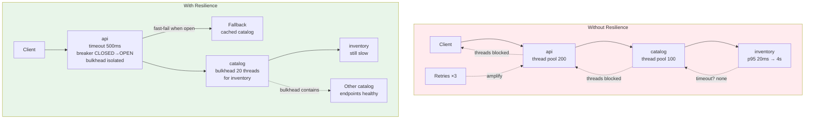
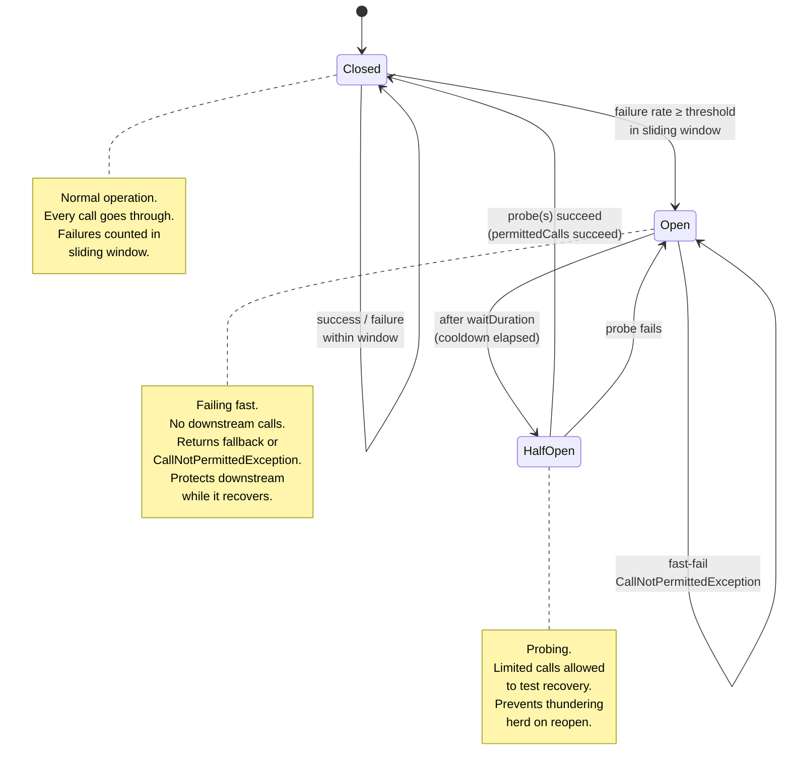
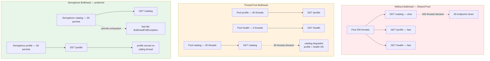
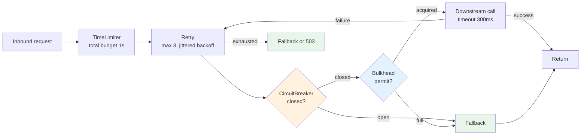
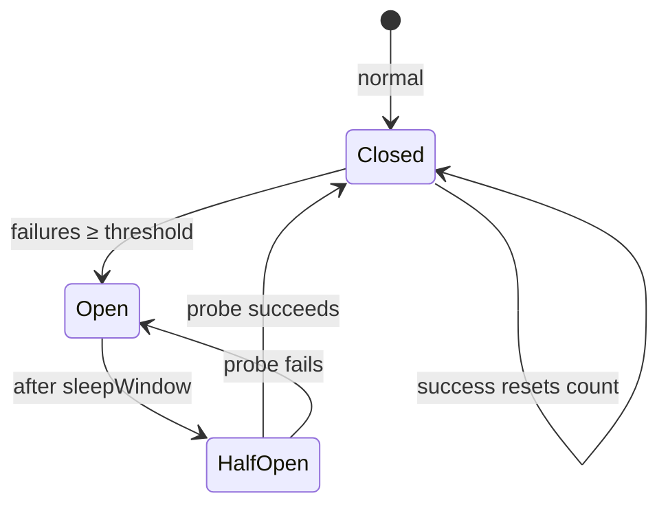
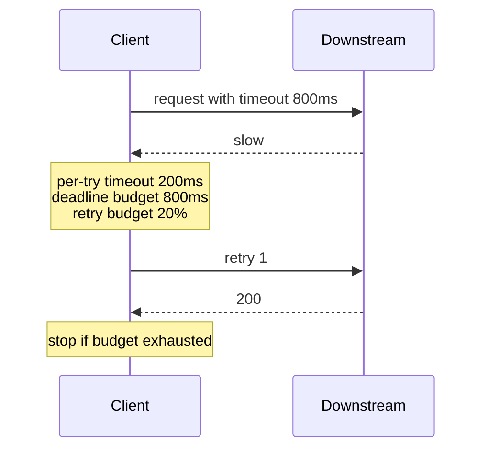
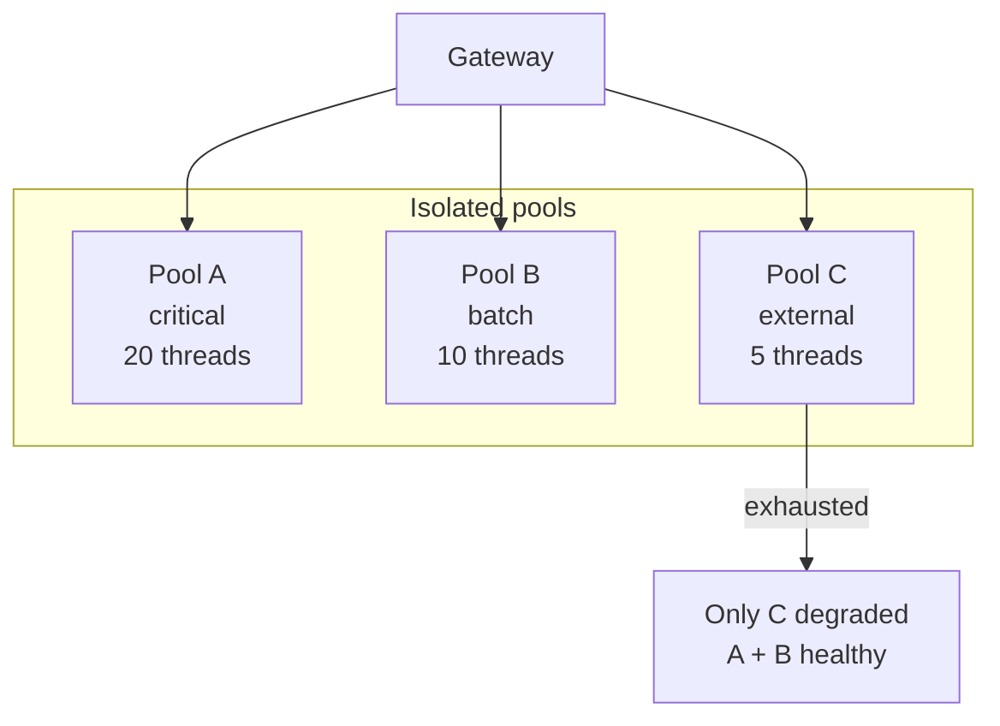

# Chapter 10 — Resilience Patterns in Production

**What this chapter covers.** A single slow downstream can cascade into a full outage if every caller blocks waiting for it — threads exhaust, queues fill, retries amplify, and suddenly the entire mesh is down because one dependency stuttered. Resilience patterns are the structural defenses that prevent local failures from becoming systemic: timeouts that bound waiting, retries that heal transient faults without amplifying them, circuit breakers that stop calling a failing dependency, bulkheads that isolate failure domains, load shedding that protects the server from its callers, and fallbacks that degrade gracefully when the happy path is unavailable. This chapter covers every pattern in the depth needed to configure it correctly in production — with real Resilience4j, Istio, and Envoy configs, the tuning trade-offs that determine whether the pattern helps or hurts, and the observability and chaos practices that prove it works before an incident does.

Learning goals — after this chapter you should be able to:

- Configure timeouts, retries with jittered backoff, hedged requests, and deadline propagation so that transient faults are healed without creating retry storms or unbounded tail latency.
- Implement circuit breakers (Resilience4j, Istio `DestinationRule`, Envoy) and bulkheads (thread-pool and semaphore) — explain the state machine, tune thresholds, and avoid the common misconfigurations that make breakers flap or never open.
- Apply concurrency limiting and adaptive load shedding (Netflix `concurrency-limits-java`, Envoy, K8s) to protect a service from overload driven by callers, and choose between shedding at the edge, at the service, and at the downstream.
- Design graceful degradation and fallback strategies — cached, stale, default, and partial responses — and decide when a fallback is safer than a failure.
- Reason about the interactions between patterns — how retries and circuit breakers compose, why a timeout is a prerequisite for every other pattern, and how bulkheads prevent breaker-induced thread starvation.
- Validate resilience with fault injection and chaos experiments, measure it with SLI/SLO burn, and operate it with dashboards and alerts that distinguish expected degradation from real incidents.

> **Boundary note.** Volume 3, Chapter 11 introduced the wire-level primitives — timeouts, retries, exponential backoff, and hedged requests — as network reliability mechanisms. This chapter is the *production* treatment: how those primitives compose with circuit breakers, bulkheads, and load shedding into a coherent resilience architecture; how to configure them in the frameworks and meshes you actually run; and how to tune and verify them under real traffic. Volume 7, Chapter 11 approached bulkheads and breakers from the system-design perspective; here we go deep on implementation, configuration, and operational reality. Volume 10, Chapter 7 covered backpressure and flow control inside messaging systems; this chapter covers request-path resilience between synchronous services.

---

## Why resilience patterns exist

### The anatomy of a cascade

Consider a service `api` that calls `catalog` that calls `inventory`. `inventory` degrades — p95 latency climbs from 20 ms to 4 s due to a bad index. Without resilience patterns:

1. `catalog` threads block for 4 s each waiting for `inventory`. Its thread pool saturates.
2. `catalog` stops responding to `api` within `api`'s timeout — or `api` also has no timeout, so `api` threads block too.
3. `api` thread pool saturates. Now every endpoint on `api` is down — even those that do not touch `inventory`.
4. Callers of `api` retry. Retry load amplifies the pressure. The incident widens.
5. Autoscaling adds pods, but new pods immediately saturate too — scaling does not help when the bottleneck is a downstream.

Total time from degraded downstream to full outage: often under 60 seconds. Every pattern in this chapter exists to interrupt this chain at a different link.



*Figure 10-1: A slow downstream without resilience cascades through thread pools and is amplified by retries. With timeouts, bulkheads, breakers, and fallbacks the failure is contained and partially degraded rather than total.*

### The prerequisites

Two mechanisms are prerequisites for every other pattern:

- **Timeouts** bound how long a caller waits. Without a timeout, no other pattern triggers — the thread simply blocks until the downstream eventually responds or the TCP connection breaks minutes later.
- **Deadlines** propagate the caller's remaining budget downstream so that work that cannot possibly be returned in time is not started.

If you take one rule from this chapter: *every outbound call must have an explicit timeout and participate in deadline propagation.* Everything else is layered on top.

---

## Timeouts, deadlines, and hedged requests

### Timeouts

A timeout is a contract: "if I have not received a response in N milliseconds, I will abandon this attempt." Correct timeout values are derived from the downstream's latency distribution and the caller's SLO — not guessed.

| Timeout strategy | How to set | When to use |
|---|---|---|
| **p99 + headroom** | Downstream p99 × 1.5–2, capped by caller SLO | Default for latency-sensitive paths |
| **SLO-derived** | Caller SLO budget minus local processing time | When the caller has a tight SLO (eimplies checkout) |
| **Tiered** | Short timeout for the first attempt, longer for a retry | When the first attempt targets a fast replica |

Timeouts must be set at every layer: client library, service mesh proxy, and gateway. A common failure is setting a timeout in application code but leaving the Envoy/NGINX proxy at its default (often 15 s or infinite), so the proxy holds the connection long after the application gave up — wasting resources for no reason.

```yaml
# Istio: per-route timeout — must be tighter than the caller's timeout
apiVersion: networking.istio.io/v1beta1
kind: VirtualService
metadata:
  name: catalog
spec:
  hosts: [catalog.prod.svc.cluster.local]
  http:
    - match: [{ uri: { prefix: /api/catalog } }]
      timeout: 500ms            # hard deadline for this route
      retries:
        attempts: 2
        perTryTimeout: 250ms    # each attempt bounded
        retryOn: 5xx,gateway-error,connect-failure,retriable-4xx
        retryRemoteLocalities: true
      route:
        - destination: { host: catalog.prod.svc.cluster.local }
```

```java
// Resilience4j: TimeLimiter + CompletableFuture — application-layer timeout
TimeLimiterConfig tlConfig = TimeLimiterConfig.custom()
    .timeoutDuration(Duration.ofMillis(500))
    .cancelRunningFuture(true)   // interrupt the thread on timeout
    .build();
TimeLimiter timeLimiter = TimeLimiter.of("catalog", tlConfig);

// Compose with other decorators (order matters — TimeLimiter outermost)
Supplier<CompletableFuture<Product>> supplier =
    TimeLimiter.decorateFutureSupplier(timeLimiter,
        () -> CompletableFuture.supplyAsync(() -> catalogClient.fetch(id)));

Supplier<Product> retrying = Retry.decorateSupplier(retry,
    CircuitBreaker.decorateSupplier(circuitBreaker,
        () -> supplier.get().join()));
```

**Anti-pattern: timeout longer than the caller's timeout.** If `api` has a 1 s timeout on its inbound request but allows 2 s for its call to `catalog`, `api` will always return 504 via its own timeout — the downstream result, even if successful at 1.5 s, is discarded. Timeouts must nest: each downstream timeout strictly less than the remaining inbound deadline.

### Deadline propagation

A deadline is an absolute timestamp ("respond by T") propagated through the call graph via headers or gRPC context. Each hop computes its remaining budget as `deadline - now()` and sets its downstream timeout accordingly. This prevents wasted work — if the caller has 40 ms left, there is no point starting a 200 ms downstream call.

gRPC deadlines are the canonical implementation — the `grpc-timeout` header is honored by every conforming implementation without application code:

```go
// Server: respect the inbound deadline propagated via context
func (s *CatalogServer) GetProduct(ctx context.Context, req *pb.GetRequest) (*pb.Product, error) {
    // ctx already carries the deadline from grpc-timeout header
    if deadline, ok := ctx.Deadline(); ok {
        remaining := time.Until(deadline)
        if remaining < 50*time.Millisecond {
            return nil, status.Error(codes.DeadlineExceeded, "insufficient budget")
        }
    }
    // Pass the same context downstream — deadline propagates automatically
    inv, err := s.inventory.Get(ctx, &invpb.GetRequest{Sku: req.Sku})
    if err != nil {
        return nil, err
    }
    // ... build product response
    return product, nil
}

// Client: set a deadline on every outbound call
ctx, cancel := context.WithTimeout(parentCtx, 500*time.Millisecond)
defer cancel()
product, err := catalogClient.GetProduct(ctx, req)
```

For HTTP/REST, propagate via a header (commonly `X-Deadline` or `X-Timeout-Ms`) and enforce in middleware:

```java
@Component
public class DeadlineFilter implements Filter {
    static final String DEADLINE_HEADER = "X-Deadline-Ms";
    @Override public void doFilter(ServletRequest req, ServletResponse res, FilterChain chain)
            throws IOException, ServletException {
        HttpServletRequest http = (HttpServletRequest) req;
        String header = http.getHeader(DEADLINE_HEADER);
        long deadlineMs = header != null ? Long.parseLong(header)
            : System.currentTimeMillis() + 1000; // default budget
        long remaining = deadlineMs - System.currentTimeMillis();
        if (remaining <= 0) {
            ((HttpServletResponse) res).sendError(504, "deadline already exceeded");
            return;
        }
        // Store remaining so downstream clients read it
        MDC.put("deadlineMs", String.valueOf(deadlineMs));
        chain.doFilter(req, res);
    }
}
```

### Hedged requests

A hedged request sends the same request to multiple replicas and uses the first response, canceling the others. It trades extra load for reduced tail latency — valuable when p99 latency is dominated by occasional slow replicas (GC pauses, noisy neighbors) rather than systemic overload.

Hedging must be used sparingly: at 10% hedging, you add 10% load; at 100% hedging (send to two replicas every time), you double load — which under overload makes the problem worse. Adaptive hedging (hedge only when p50 latency indicates the first attempt is slow) is the safe default.

```java
// Resilience4j-style hedged execution (simplified)
public <T> CompletableFuture<T> hedged(
        Supplier<CompletableFuture<T>> primary,
        Supplier<CompletableFuture<T>> hedge,
        Duration hedgeDelay,
        ScheduledExecutorService scheduler) {

    CompletableFuture<T> result = new CompletableFuture<>();
    CompletableFuture<T> p = primary.get();

    // Schedule the hedge only if primary hasn't completed within hedgeDelay
    ScheduledFuture<?> hedgeTask = scheduler.schedule(() -> {
        if (!p.isDone()) {
            hedge.get().whenComplete((v, ex) -> {
                if (ex == null) result.complete(v);
            });
        }
    }, hedgeDelay.toMillis(), TimeUnit.MILLISECONDS);

    p.whenComplete((v, ex) -> {
        hedgeTask.cancel(false);
        if (ex == null) result.complete(v);
        else if (!result.isDone()) result.completeExceptionally(ex);
    });
    return result;
}
```

Use hedging only when: the downstream is replicated, requests are idempotent and cheap to cancel, and you hedge a small fraction or adaptively. Never hedge writes or non-idempotent operations.

---

## Retries — healing without harming

### When to retry

Retry only when the failure is likely transient and the request is safe to repeat:

| Retryable | Not retryable |
|---|---|
| 503, 429, 504, TCP `connect-failure`, `reset` | 400, 401, 403, 404, 422 — caller error |
| Idempotent GET/PUT/DELETE | Non-idempotent POST without idempotency key |
| Timeout where downstream effect is unknown — retry only with idempotency | Business-logic errors (insufficient balance, invalid state) |

The Resilience4j and Istio configs below encode this explicitly — `retryOn` lists the retryable conditions rather than retrying on any failure.

### Backoff with jitter

Without backoff, retries from many callers synchronize into a thundering herd at the instant the downstream recovers — immediately overloading it again. Exponential backoff with jitter decorrelates retries:

```
delay = min(base * 2^attempt + jitter, maxDelay)
jitter ∈ [0, base * 2^attempt)   // full jitter (AWS best practice)
```

```java
RetryConfig retryConfig = RetryConfig.<Product>custom()
    .maxAttempts(3)
    .waitDuration(Duration.ofMillis(100))
    .enableExponentialBackoff()
    .exponentialBackoffMultiplier(2.0)
    .enableRandomizedWait()               // full jitter
    .randomizedWaitFactor(0.5)            // jitter up to 50% of computed delay
    .retryOnResult(p -> p == null)        // retry on null (e.g., not found due to replication lag)
    .retryOnException(e -> e instanceof TimeoutException
                        || e instanceof ConnectException
                        || (e instanceof HttpStatusException he && he.getStatusCode() >= 500))
    .retryExceptions(TimeoutException.class, ConnectException.class)
    .ignoreExceptions(BadRequestException.class, NotFoundException.class)
    .build();
Retry retry = Retry.of("catalog", retryConfig);

// Observe retry events — critical for dashboards
retry.getEventPublisher()
    .onRetry(e -> log.warn("retry catalog attempt={} wait={}ms lastError={}",
        e.getNumberOfRetryAttempts(), e.getWaitInterval().toMillis(), e.getLastThrowable().toString()))
    .onError(e -> meterRegistry.counter("catalog.retry.exhausted").increment());
```

```yaml
# Istio retry — note perTryTimeout prevents a slow retry from consuming the whole budget
retries:
  attempts: 3
  perTryTimeout: 300ms
  retryOn: 5xx,reset,connect-failure,retriable-4xx
  retryRemoteLocalities: true   # prefer different locality on retry
```

### Retry budgets

Even with correct per-request retry logic, the aggregate retry rate can overwhelm a recovering downstream. A retry budget caps retries as a fraction of total request volume — e.g., allow retries up to 20% of successful requests. When the budget is exhausted, further failures are returned immediately without retrying.

Envoy and Finagle implement retry budgets natively. In application code, a token-bucket approximates it:

```java
// Simple retry budget: allow retries up to ratio of successes
public class RetryBudget {
    private final AtomicLong success = new AtomicLong();
    private final AtomicLong retries = new AtomicLong();
    private final double maxRetryRatio; // e.g. 0.2

    public boolean tryAcquire() {
        long s = success.get();
        long r = retries.get();
        // Allow retry if retries / successes < ratio. Bootstrap: allow first N retries.
        if (s < 10) { retries.incrementAndGet(); return true; }
        if ((double) r / s < maxRetryRatio) { retries.incrementAndGet(); return true; }
        return false;
    }
    public void recordSuccess() { success.incrementAndGet(); }
}
```

**Rule of thumb:** set `maxAttempts` low (2–3 including the initial attempt), keep `perTryTimeout` short, and add a retry budget at the layer that has the broadest view of traffic (mesh or gateway rather than per-pod application code).

---

## Circuit breakers

A circuit breaker prevents a caller from hammering a downstream that is clearly failing. It tracks recent failure rate and, when a threshold is breached, *opens* — failing fast without making the downstream call at all — for a cooldown period. After the cooldown, it allows a probe request (*half-open*); success closes the breaker, failure re-opens it.

### The state machine



*Figure 10-2: Circuit breaker state machine. The breaker opens when failure rate in the sliding window exceeds the threshold, fast-fails for a cooldown, then probes in half-open before closing.*

### Resilience4j circuit breaker

```java
CircuitBreakerConfig cbConfig = CircuitBreakerConfig.custom()
    // Sliding window — count-based (last N calls) or time-based
    .slidingWindowType(CircuitBreakerConfig.SlidingWindowType.COUNT_BASED)
    .slidingWindowSize(100)                 // evaluate last 100 calls
    .minimumNumberOfCalls(20)               // need 20 calls before evaluating (avoid flapping on low traffic)
    .failureRateThreshold(50.0f)            // open if ≥50% failures in window
    .slowCallRateThreshold(60.0f)           // also consider slow calls as failures
    .slowCallDurationThreshold(Duration.ofMillis(800))
    .waitDurationInOpenState(Duration.ofSeconds(30))  // cooldown before half-open
    .permittedNumberOfCallsInHalfOpenState(5)         // probe with 5 calls
    .automaticTransitionFromOpenToHalfOpenEnabled(true)
    .recordExceptions(TimeoutException.class, ConnectException.class,
                      HttpStatusException.class)
    .ignoreExceptions(BadRequestException.class, NotFoundException.class)
    .build();

CircuitBreaker breaker = CircuitBreaker.of("catalog", cbConfig);

// Decorate — order: TimeLimiter outermost, then Retry, then CircuitBreaker, then Bulkhead innermost
Supplier<Product> guarded = Decorators.ofSupplier(() -> catalogClient.fetch(id))
    .withCircuitBreaker(breaker)
    .withBulkhead(bulkhead)
    .withFallback(throwable -> Product.cachedOrDefault(id))
    .decorate();

breaker.getEventPublisher()
    .onStateTransition(e -> log.warn("breaker {} {} -> {}",
        e.getCircuitBreakerName(), e.getStateTransition().getFromState(),
        e.getStateTransition().getToState()))
    .onCallNotPermitted(e -> meterRegistry.counter("breaker.catalog.not_permitted").increment());
```

Tuning guidance:

- `slidingWindowSize` 50–100 for high-traffic services, 10–20 for low-traffic (pair with `minimumNumberOfCalls` to avoid premature opening).
- `failureRateThreshold` 40–60% for most services. Lower thresholds open aggressively — good for critical-path protection, bad for noisy services that normally see some failures.
- `waitDurationInOpenState` 15–60 s. Too short and the downstream has not recovered; too long and you delay recovery detection.
- Always `ignoreExceptions` for caller errors (4xx) — they are not downstream failures.

### Istio / Envoy outlier detection (mesh-level breaker)

In a service mesh the breaker is configured per destination and enforced by the sidecar — no application code needed. Envoy calls it *outlier detection*.

```yaml
apiVersion: networking.istio.io/v1beta1
kind: DestinationRule
metadata:
  name: catalog-circuit-breaker
spec:
  host: catalog.prod.svc.cluster.local
  trafficPolicy:
    # Connection pool / circuit breaker — Envoy enforced
    connectionPool:
      tcp:  { maxConnections: 200 }          # total TCP connections to upstream
      http:
        http1MaxPendingRequests: 100         # queue length before shedding (HTTP/1.1)
        http2MaxRequests: 200               # max concurrent requests (HTTP/2)
        maxRequestsPerConnection: 0         # 0 = unlimited
        maxRetries: 3
    outlierDetection:
      consecutive5xxErrors: 5               # eject after 5 consecutive 5xx
      interval: 10s                         # scan interval
      baseEjectionTime: 30s                 # how long to eject (× ejection factor on consecutive)
      maxEjectionPercent: 50                # never eject more than 50% of pods
      minHealthPercent: 50                  # if <50% healthy, stop ejecting (avoid total blackout)
      splitExternalLocalOriginErrors: true  # distinguish upstream 5xx from gateway errors
  subsets:
    - name: v1
      labels: { version: v1 }
    - name: v2
      labels: { version: v2 }
      trafficPolicy:
        connectionPool:
          http: { http2MaxRequests: 50 }    # tighter limit for canary subset
```

Key differences from Resilience4j:

- **Granularity:** Resilience4j breaks per caller instance; Envoy breaks per sidecar per upstream cluster — failure on one pod does not open the breaker on another pod (but outlier ejection removes that upstream pod from the pool for *all* sidecars).
- **Signal:** Resilience4j uses failure *rate*; Envoy outlier detection uses consecutive 5xx or gateway errors by default — configure `consecutiveGatewayErrors` and `enforcingConsecutive5xx` to tune sensitivity.
- **Composition:** Use both. Mesh-level breakers protect infrastructure; application-level breakers protect with richer signals (latency, business errors) and execute fallbacks.

### Breaker pitfalls

- **Breaker on every hop without fallback** just converts a downstream failure into an immediate failure — useful for shedding load but not for graceful degradation. Pair breakers with fallbacks where the product allows it.
- **Breaker per endpoint vs. per downstream.** A single breaker per downstream service conflates endpoints with different failure modes. Prefer per-operation breakers when one downstream serves both critical and non-critical paths.
- **Breaker flap** — threshold too low or window too small causes rapid open/close cycling. Fix with larger windows and `minimumNumberOfCalls`.

---

## Bulkheads

A bulkhead isolates failure domains so that a slow or failing downstream cannot exhaust the resources needed to serve other requests. The name comes from ship compartments: one flooded compartment does not sink the ship.

Two isolation strategies dominate in backend services:



*Figure 10-3: Without bulkheads a slow downstream exhausts the shared thread pool. Thread-pool bulkheads isolate but add thread-hopping overhead. Semaphore bulkheads (preferred) limit concurrency without extra threads and fail fast.*

### Semaphore bulkhead (preferred)

Modern services on non-blocking runtimes (Netty, virtual threads) should prefer semaphore bulkheads — they limit concurrency without dedicating threads, avoid context-switch overhead, and compose naturally with circuit breakers.

```java
BulkheadConfig bhConfig = BulkheadConfig.custom()
    .maxConcurrentCalls(30)                 // max concurrent calls through this bulkhead
    .maxWaitDuration(Duration.ofMillis(50)) // how long to wait for a permit before failing
    .build();
Bulkhead bulkhead = Bulkhead.of("catalog", bhConfig);

// ThreadPoolBulkhead variant — only when caller threads must not block
ThreadPoolBulkheadConfig tpConfig = ThreadPoolBulkheadConfig.custom()
    .maxThreadPoolSize(30)
    .coreThreadPoolSize(20)
    .queueCapacity(50)
    .keepAliveDuration(Duration.ofSeconds(30))
    .build();
ThreadPoolBulkhead tpBulkhead = ThreadPoolBulkhead.of("catalog-tp", tpConfig);

// Usage — semaphore bulkhead decorates the call directly
Supplier<Product> isolated = Bulkhead.decorateSupplier(bulkhead,
    CircuitBreaker.decorateSupplier(breaker,
        () -> catalogClient.fetch(id)));
```

For Kubernetes, bulkheads also exist at the infrastructure layer — `ResourceQuota` and `LimitRange` per namespace, and per-tenant node pools — covered in Volume 12, Chapter 7.

### Choosing bulkhead boundaries

Bulkheads should follow failure domains, not just downstream names:

- **Per downstream** when downstreams fail independently — `inventory` slowness should not block `pricing`.
- **Per criticality** when one downstream serves both critical and best-effort paths — isolate checkout's call to `catalog` from the recommendation engine's call to the same service.
- **Per tenant** in multi-tenant systems — one tenant's burst should not starve others (see Volume 12, Chapter 7).

---

## Load shedding and concurrency limiting

When every caller is well-behaved but aggregate load exceeds capacity (flash sale, thundering herd after recovery), the server must protect itself by *shedding* excess work — returning 503 or 429 immediately rather than queueing until it collapses.

### Concurrency limiting (Netflix model)

The most effective server-side defense is limiting *inflight* requests rather than queueing them. Netflix's `concurrency-limits-java` implements the Vegas and Gradient algorithms that adapt the limit based on observed latency — tightening under pressure, relaxing when healthy.

```java
// Gradient limiter — adapts limit based on RTT gradient
Limit limit = GradientLimit.newBuilder()
    .initialLimit(100)
    .minLimit(20)
    .maxLimit(500)
    .rttTolerance(1.5)          // allow 1.5× baseline RTT before tightening
    .build();

// Vegas limiter — alternative, tracks queuing delay
Limit vegas = VegasLimit.newBuilder()
    .initialLimit(100)
    .maxConcurrency(500)
    .build();

// gRPC server interceptor that enforces the limit
public class ConcurrencyLimitInterceptor implements ServerInterceptor {
    private final Limiter<ServerRequest> limiter;
    @Override public <ReqT, RespT> ServerCall.Listener<ReqT> interceptCall(
            ServerCall<ReqT, RespT> call, Metadata headers, ServerCallHandler<ReqT, RespT> next) {
        Optional<Limiter.Listener> listener = limiter.acquire(call);
        if (listener.isEmpty()) {
            call.close(Status.RESOURCE_EXHAUSTED
                .withDescription("concurrency limit exceeded")
                .augmentDescription("retry-after: 50ms"), new Metadata());
            return new ServerCall.Listener<>() {};
        }
        ServerCall<ReqT, RespT> wrapped = new ForwardingServerCall.SimpleForwardingServerCall<>(call) {
            @Override public void close(Status status, Metadata trailers) {
                listener.get().onSuccess();
                super.close(status, trailers);
            }
        };
        return next.startCall(wrapped, headers);
    }
}
```

Envoy enforces concurrency limiting at the proxy without application code:

```yaml
# Envoy circuit breaker as concurrency limiter (per upstream cluster)
circuit_breakers:
  thresholds:
    - priority: DEFAULT
      max_connections: 1000
      max_pending_requests: 500
      max_requests: 500          # hard cap on inflight requests to upstream
      max_retries: 3
      track_remaining: true
      retry_budget:
        budget_percent: 20       # retries capped at 20% of active requests
        min_retry_concurrency: 5
```

### Shedding strategy

| Layer | Mechanism | Signal | Response |
|---|---|---|---|
| **Edge / gateway** | Global rate limiting (Redis/Envoy RLS) | Requests/sec per tenant or global | 429 + `Retry-After` |
| **Service** | Concurrency limiter (Vegas/Gradient) | Inflight count + RTT gradient | 503 + `Retry-After` (or 429 if caller is tenant-scoped) |
| **Downstream** | Circuit breaker + bulkhead | Failure rate, slow-call rate | Fast-fail + fallback |

Shedding at the service is more accurate than at the edge because the service knows its actual capacity; shedding at the edge is broader and protects the entire fleet. Use both in layers — edge for coarse global protection, service for precise local protection.

Always include `Retry-After` on 429/503 so well-behaved clients back off rather than retrying immediately.

---

## Fallbacks and graceful degradation

A fallback is what the caller does when the downstream is unavailable. Not every failure deserves a fallback — failing loudly is sometimes correct — but for read-heavy, user-facing paths a degraded response is far better than an error page.

### Fallback catalog

| Fallback | Freshness | Use when | Example |
|---|---|---|---|
| **Cached** | Stale but recent | Reads with tolerance for staleness | Return last-known product catalog from Redis/local cache |
| **Default / static** | Always available | Degradation is acceptable | Return generic recommendations instead of personalized |
| **Partial** | Incomplete | Some fields are optional | Return product without reviews when review service is down |
| **Empty / no-op** | N/A | Best-effort side effects | Drop analytics event, enqueue for later |
| **Fail** | N/A | Correctness requires the downstream | Payment authorization — never fallback, fail the checkout |

```java
// Resilience4j fallback — ordered by preference
Supplier<ProductView> withFallback = Decorators.ofSupplier(() -> catalogClient.fetchView(id))
    .withCircuitBreaker(breaker)
    .withBulkhead(bulkhead)
    .withFallback(List.of(
        // 1. Try stale cache
        throwable -> ProductView.fromCache(id),
        // 2. Try degraded (partial) view
        throwable -> ProductView.degraded(id)))
    .decorate();

// Distinguish fallback invocation in metrics — degraded is not success
breaker.getEventPublisher().onCallNotPermitted(e ->
    meterRegistry.counter("catalog.fallback.cache", "reason", "breaker_open").increment());

// HTTP layer — return 200 with degraded signal vs 503
@GetMapping("/products/{id}")
public ResponseEntity<ProductView> get(@PathVariable String id) {
    try {
        ProductView view = withFallback.get();
        if (view.isDegraded()) {
            return ResponseEntity.ok()
                .header("X-Degraded", "true")
                .header("Cache-Control", "no-cache")
                .body(view);
        }
        return ResponseEntity.ok(view);
    } catch (CallNotPermittedException e) {
        // No fallback available — fail fast with Retry-After
        return ResponseEntity.status(503)
            .header("Retry-After", "5")
            .build();
    }
}
```

**Rules for safe fallbacks:**

- Never fallback on writes — retry with idempotency or fail; a fallback that pretends a write succeeded causes data loss or double-charge.
- Cache fallbacks need a bounded staleness policy — `Cache-Control: stale-if-error` with explicit `stale-while-revalidate` semantics rather than unbounded stale.
- Degraded responses must be marked (`X-Degraded: true`, or a field in the envelope) so the caller and observability know the response is degraded — otherwise degraded looks like success in dashboards.

---

## Composing patterns — order and interaction

Patterns compose, but order matters. The decorator stack from outermost to innermost should be:

```
TimeLimiter → Retry → CircuitBreaker → Bulkhead → (actual call) → Fallback
```

Rationale:

- **TimeLimiter outermost** so the total time including retries is bounded.
- **Retry outside breaker** so retries are counted as breaker failures (if every retry fails, the breaker should see one logical failure, not N). Some teams place breaker outside retry so each retry attempt is individually counted — choose one and be consistent. Resilience4j recommends breaker inside retry by default.
- **Bulkhead innermost** so permits are held for the shortest time — only during the actual downstream call, not during backoff sleeps.

```java
// Canonical composition — Resilience4j Decorators helper enforces correct order
Supplier<Product> resilient = Decorators.ofSupplier(() -> catalogClient.fetch(id))
    .withTimeLimiter(timeLimiter, executor)   // outermost
    .withRetry(retry)
    .withCircuitBreaker(breaker)
    .withBulkhead(bulkhead)                   // innermost
    .withFallback(e -> Product.cachedOrDefault(id))
    .decorate();
```



*Figure 10-4: Decorator ordering for composing resilience patterns. TimeLimiter bounds total time, Retry heals transient faults, CircuitBreaker fast-fails when the downstream is clearly unhealthy, Bulkhead isolates concurrency, and Fallback provides degraded responses.*

Timeout is the foundation — without it, bulkhead permits are held indefinitely, breakers never see failures promptly, and retries wait forever. Verify every layer has a timeout before adding any other pattern.

---

## Observability — proving resilience

Resilience patterns that are not observed are indistinguishable from absent.

### Metrics

| Metric | Breaker | Bulkhead | Retry | Shedding |
|---|---|---|---|---|
| State | `breaker_state{state=open}` gauge | `bulkhead_available_permits` | — | — |
| Rate | `breaker_failures_total`, `breaker_not_permitted_total` | `bulkhead_rejected_total` | `retry_attempts_total`, `retry_exhausted_total` | `concurrency_limited_total`, `http_503_total` |
| Latency | `breaker_slow_calls_total` | `bulkhead_wait_duration_seconds` | `retry_wait_duration_seconds` | — |
| Fallback | `fallback_invocations_total{reason}` | — | — | — |

Expose breaker state as a gauge (0=closed, 1=open, 2=half-open) so dashboards show at a glance which downstreams are currently broken. Alert on state transitions, not just on open — flapping is as important as sustained open.

### Dashboard and alerts

```yaml
# Prometheus alerting — breaker open and bulkhead shedding are warning, not page,
# unless the fallback is also failing or degraded rate is high.
groups:
  - name: resilience
    rules:
      - alert: CircuitBreakerOpen
        expr: resilience_circuitbreaker_state{state="open"} == 1
        for: 2m
        labels: { severity: warning }
        annotations:
          summary: "Breaker {{ $labels.name }} open for >2m"
          runbook: "https://runbooks.prod/breaker-open"

      - alert: CircuitBreakerFlapping
        expr: increase(resilience_circuitbreaker_state_transitions_total[10m]) > 6
        labels: { severity: warning }
        annotations:
          summary: "Breaker {{ $labels.name }} flapping — threshold or window misconfigured?"

      - alert: BulkheadShedding
        expr: rate(resilience_bulkhead_rejected_total[5m]) > 10
        labels: { severity: warning }
        annotations:
          summary: "Bulkhead {{ $labels.name }} rejecting >10/s — downstream slow or limit too tight"

      - alert: FallbackFailing
        expr: rate(fallback_invocations_total{result="error"}[5m]) > 5
        labels: { severity: critical }
        annotations:
          summary: "Fallback for {{ $labels.name }} failing — degraded path is broken"

      - alert: RetryExhaustedSpike
        expr: rate(resilience_retry_exhausted_total[5m]) > 20
        labels: { severity: warning }
        annotations:
          summary: "Retries exhausted for {{ $labels.name }} — downstream not recovering with retries"
```

### Chaos validation

Every resilience pattern should have a corresponding fault-injection test that proves it activates correctly. Use Chaos Mesh, Litmus, or Toxiproxy in staging — and controlled fault injection in production (see Chapter 8).

```yaml
# Chaos Mesh — inject 2s latency into inventory to trigger catalog's breaker and bulkhead
apiVersion: chaos-mesh.org/v1alpha1
kind: NetworkChaos
metadata: { name: inventory-latency }
spec:
  action: delay
  direction: to
  selector:
    labelSelectors: { app: inventory }
  delay:
    latency: 2000ms
    jitter: 500ms
  duration: 5m
---
# Verify: catalog breaker should open within 30s, bulkhead rejections rise,
# fallback served, catalog's other endpoints (profile, health) remain healthy,
# api p95 degrades gracefully rather than spiking.
```

Test matrix for resilience patterns:

| Fault | Expected activation | Verify |
|---|---|---|
| Downstream 2 s latency | Timeout → retry → breaker open → fallback | Breaker state, fallback rate, p95 bounded |
| Downstream 100% 500 | Breaker open within window, bulkhead not saturated | Breaker transitions, no thread exhaustion |
| Downstream 0% failure but slow ramp | Bulkhead permits exhaust, concurrency limiter sheds | `bulkhead_rejected_total` rises, 503 with `Retry-After` |
| Caller burst 10× | Concurrency limiter sheds, edge rate limiter 429s | 429/503 rate, no OOM, recovery within seconds after burst |

---

## Putting it together — a resilient service template

```yaml
# Kubernetes Deployment with resilience-relevant tuning
apiVersion: apps/v1
kind: Deployment
metadata: { name: catalog }
spec:
  replicas: 3
  template:
    spec:
      containers:
        - name: catalog
          image: catalog:1.42.0
          ports: [{ containerPort: 8080 }]
          env:
            - name: CATALOG_INVENTORY_TIMEOUT_MS
              value: "300"
            - name: CATALOG_INVENTORY_BREAKER_FAILURE_RATE
              value: "50"
            - name: CATALOG_BULKHEAD_MAX_CONCURRENT
              value: "30"
          resources:
            requests: { cpu: "500m", memory: "512Mi" }
            limits:   { cpu: "1000m", memory: "1Gi" }
          readinessProbe:
            httpGet: { path: /health/ready, port: 8080 }
            periodSeconds: 5
            failureThreshold: 2
          livenessProbe:
            httpGet: { path: /health/live, port: 8080 }
            periodSeconds: 10
          # Graceful shutdown — finish inflight, respect bulkhead permits
          lifecycle:
            preStop:
              exec: { command: ["/bin/sh", "-c", "sleep 15"] }
---
apiVersion: v1
kind: Service
metadata: { name: catalog }
spec:
  selector: { app: catalog }
  ports: [{ port: 80, targetPort: 8080 }]
---
# Istio policies — timeout, retry, breaker, outlier detection
apiVersion: networking.istio.io/v1beta1
kind: VirtualService
metadata: { name: catalog }
spec:
  hosts: [catalog.prod.svc.cluster.local]
  http:
    - timeout: 500ms
      retries:
        attempts: 2
        perTryTimeout: 250ms
        retryOn: 5xx,gateway-error,connect-failure,retriable-4xx
      route: [{ destination: { host: catalog.prod.svc.cluster.local } }]
---
apiVersion: networking.istio.io/v1beta1
kind: DestinationRule
metadata: { name: catalog }
spec:
  host: catalog.prod.svc.cluster.local
  trafficPolicy:
    connectionPool:
      tcp: { maxConnections: 200 }
      http: { http2MaxRequests: 200, maxRetries: 3 }
    outlierDetection:
      consecutive5xxErrors: 5
      interval: 10s
      baseEjectionTime: 30s
      maxEjectionPercent: 50
```

Application wiring (Spring Boot + Resilience4j) in `application.yml`:

```yaml
resilience4j:
  timelimiter:
    configs:
      default: { timeout-duration: 500ms, cancel-running-future: true }
  retry:
    configs:
      default:
        max-attempts: 3
        wait-duration: 100ms
        enable-exponential-backoff: true
        exponential-backoff-multiplier: 2.0
        enable-randomized-wait: true
        randomized-wait-factor: 0.5
        retry-exceptions: [java.util.concurrent.TimeoutException, java.net.ConnectException]
        ignore-exceptions: [com.example.BadRequestException]
  circuitbreaker:
    configs:
      default:
        sliding-window-type: COUNT_BASED
        sliding-window-size: 100
        minimum-number-of-calls: 20
        failure-rate-threshold: 50
        slow-call-rate-threshold: 60
        slow-call-duration-threshold: 800ms
        wait-duration-in-open-state: 30s
        permitted-number-of-calls-in-half-open-state: 5
        automatic-transition-from-open-to-half-open-enabled: true
  bulkhead:
    configs:
      default: { max-concurrent-calls: 30, max-wait-duration: 50ms }
  bulkhead-instances:
    inventory: { max-concurrent-calls: 20, max-wait-duration: 20ms }  # tighter for known-slow downstream

management:
  endpoints.web.exposure.include: health,prometheus,circuitbreakers,bulkheads,retries
  health.circuitbreakers.enabled: true
```

---


#### Circuit Breaker States



#### Timeout and Retry Budget



#### Bulkhead Isolation



## Key takeaways

- Every outbound call needs an explicit timeout strictly less than the remaining inbound deadline — without this, no other resilience pattern can function. Propagate deadlines via gRPC context or HTTP headers so downstream work that cannot be returned in time is never started.
- Retries heal transient faults but amplify overload — retry only idempotent operations on retryable errors (503/429/504/connect-failure), use exponential backoff with full jitter, keep `maxAttempts` at 2–3, and enforce a retry budget (≤20% of success volume) at the broadest layer.
- Circuit breakers fast-fail when a downstream is clearly unhealthy, giving it time to recover and callers a chance to fallback. Tune `slidingWindowSize` (50–100), `failureRateThreshold` (40–60%), `waitDurationInOpenState` (15–60 s), and always ignore caller errors (4xx). Use both application-level (Resilience4j) and mesh-level (Istio/Envoy outlier detection) breakers — they protect at different granularities.
- Bulkheads isolate failure domains — a slow `inventory` should not exhaust the threads needed for `profile` or `health`. Prefer semaphore bulkheads over thread-pool bulkheads on modern non-blocking runtimes; size limits per downstream and per criticality, not just per service.
- Concurrency limiting with adaptive algorithms (Vegas/Gradient) is the most effective server-side defense against aggregate overload — it sheds excess work with 503/429 + `Retry-After` instead of queueing until collapse. Layer shedding at edge (global) and service (local) for defense in depth.
- Fallbacks provide degraded but useful responses — cached, stale, default, or partial — but never fallback on writes. Mark degraded responses explicitly (`X-Degraded: true`) so observability distinguishes degraded from success.
- Composition order matters: `TimeLimiter → Retry → CircuitBreaker → Bulkhead → call → Fallback`. Validate every pattern with fault injection — inject latency and errors in staging and (carefully) in production, and verify the expected breaker/bulkhead/fallback activation and bounded p95.
- Observe resilience: export breaker state as a gauge, alert on transitions and flapping, dashboard fallback rates, and treat fallback failure as critical — a broken fallback turns degradation into outage.

## Further reading

- Nygard, M. — *Release It!* (2nd ed., Pragmatic Bookshelf, 2018). The original catalog of stability patterns — circuit breaker, bulkhead, timeout, and their production consequences.
- Netflix — `concurrency-limits-java` (GitHub: `Netflix/concurrency-limits-java`) — Vegas and Gradient limiter implementations and the theory behind adaptive concurrency limiting.
- Resilience4j documentation — https://resilience4j.readme.io — configuration reference for `CircuitBreaker`, `Retry`, `Bulkhead`, `TimeLimiter`, and decorator composition.
- Istio — *Circuit Breaking* and *Outlier Detection* — https://istio.io/latest/docs/tasks/traffic-management/circuit-breaking/ and DestinationRule reference.
- Envoy — *Circuit Breakers* and *Retry Budgets* — https://www.envoyproxy.io/docs/envoy/latest/configuration/upstream/circuit_breakers and https://www.envoyproxy.io/docs/envoy/latest/configuration/http/http_filters/router_filter#retry-budget
- gRPC — *Deadlines* — https://grpc.io/docs/guides/deadlines/ — propagation semantics and language-specific handling.
- AWS Builders' Library — *Timeouts, retries and backoff with jitter* — https://aws.amazon.com/builders-library/timeouts-retries-and-backoff-with-jitter/
- Google SRE Book — Chapter 22, *Addressing Cascading Failures* — https://sre.google/sre-book/addressing-cascading-failures/
