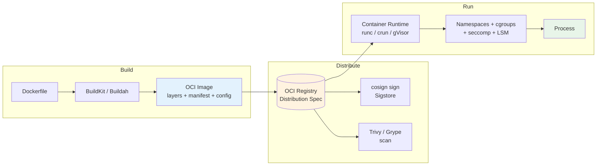
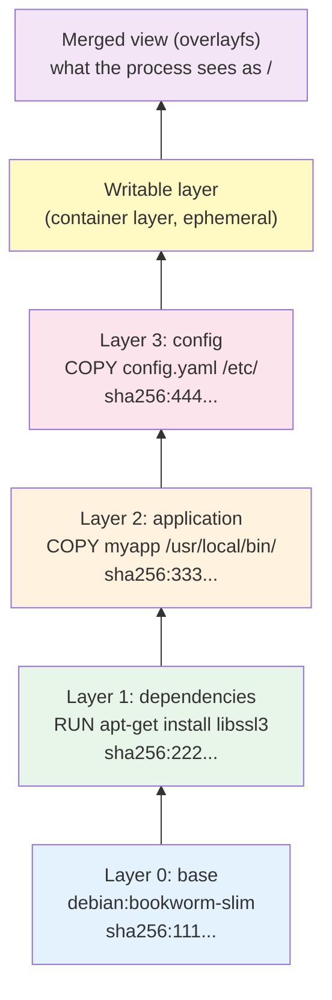
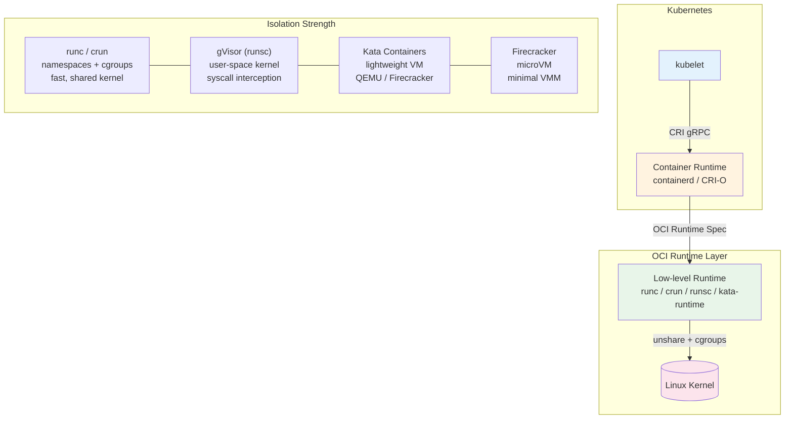
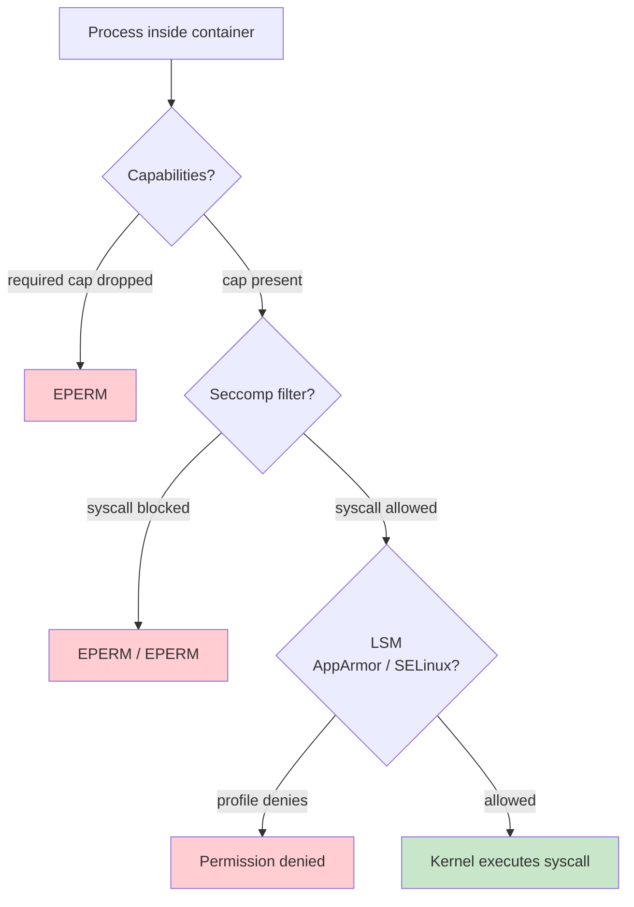

# Chapter 1 — Containers Deep Dive: Images, Runtimes, and Isolation

**What this chapter covers.** Containers are the deployment unit of modern backend systems — every microservice, batch job, and sidecar you ship to production runs inside one. Yet most engineers treat them as lightweight VMs, misunderstanding what they actually are, what they isolate, and what they do not. This chapter opens the container from bottom to top: the OCI image as a content-addressed stack of filesystem layers, the build pipeline that produces it, the runtime stack that executes it, and the Linux kernel primitives that isolate it. You will learn to write minimal, fast, cache-efficient Dockerfiles with multi-stage BuildKit builds, to read and reason about OCI manifests and layer history, to choose and configure a runtime (runc, crun, gVisor, Kata Containers), and to harden isolation with namespaces, cgroups v2, capabilities, seccomp, and mandatory access control. The chapter closes with the operational reality of running containers at scale — image distribution, signing (cosign), scanning, and debugging — grounding every abstraction in commands and manifests you run in production.

Learning goals — after this chapter you should be able to:

- Explain what a container is in terms of Linux namespaces, cgroups, and filesystem isolation — and why it is not a VM.
- Read an OCI image manifest and config, describe how content-addressed layers compose via a union filesystem, and use `crane`, `skopeo`, and `buildah` to inspect images without pulling them.
- Write production Dockerfiles that are minimal (distroless / `scratch`), cache-efficient (layer ordering, BuildKit cache mounts), reproducible, and rootless.
- Compare OCI runtimes — runc, crun, gVisor (runsc), Kata Containers, Firecracker / microVMs — on isolation strength, start latency, and overhead, and choose correctly for multi-tenant vs. trusted workloads.
- Configure isolation: namespaces (all 8 types), cgroups v2 (cpu, memory, pids, io), capability drops, seccomp profiles, AppArmor / SELinux, read-only root filesystems, and user namespaces / rootless mode.
- Operate an image supply chain: registry distribution (OCI Distribution Spec), image signing with cosign and Sigstore, SBOM generation, and vulnerability scanning with Trivy / Grype.
- Diagnose container failures with `crictl`, `nsenter`, `crun`/`runc` introspection, and eBPF-based tracing.

> **Boundary note.** Volume 2, Chapter 9 — Namespaces, cgroups, and Container Internals — develops the *kernel mechanism* in detail: how each namespace is created with `unshare`/`clone`, how cgroups v2 controllers enforce limits, and the system-call surface that containers expose. This chapter is the *platform user's view*: how images are built and shipped, which runtime to pick, how to configure isolation for production, and what breaks when you get it wrong. Read Vol 2 Ch 9 for the kernel primitives; read here for the packaging and operations layer that sits on top.

---

## What a container really is

A container is a set of kernel-enforced constraints around an ordinary Linux process. There is no hypervisor, no guest kernel, no emulated hardware. The container's process runs directly on the host kernel; the kernel merely lies to it about what it can see and how much it can consume.

```
host kernel (one kernel for all containers)
├── cgroup  /kubepods/pod-abc/container-app   (cpu.max, memory.max, pids.max)
├── mount namespace  (its own / — overlayfs)
├── pid namespace    (PID 1 inside is PID 42319 outside)
├── net namespace    (its own veth + iptables)
├── ipc, uts, user, cgroup, time namespaces
└── seccomp + capabilities + LSM (AppArmor/SELinux)
    └── process: /usr/bin/myapp  (PID 1 in the container)
```

Three properties distinguish containers from VMs:

| Property | Container | Virtual machine |
|---|---|---|
| Isolation boundary | Kernel namespaces + cgroups + LSM | Hypervisor + hardware virtualization (Intel VT-x / AMD-V, KVM) |
| Kernel | Shared with host | Own guest kernel |
| Start time | Milliseconds (fork + unshare) | Seconds (boot guest kernel + init) |
| Density | 100s–1000s per host (limited by cgroups) | 10s per host (limited by RAM for guest kernels) |
| Security boundary | Kernel is shared — a kernel exploit escapes all containers on the host | Hypervisor + guest kernel — escape requires hypervisor or hardware flaw |
| Image size | Megabytes (layers sharing a base) | Gigabytes (full disk image) |

The shared-kernel design is both the strength and the weakness. It makes containers cheap and fast, and it makes the host kernel the most critical attack surface. Every container escape in recent history — CVE-2019-5736 (runc), CVE-2022-0492 (cgroups), CVE-2024-21626 (runc internal file descriptor leak) — was a bug in the shared kernel-facing code, not in the application.

### The OCI standardization

The Open Container Initiative (OCI) standardizes three specs that let images and runtimes interoperate:

- **OCI Image Specification (v1.1)** — the format of an image (manifest, config, layers as tar+gz blobs, all content-addressed by SHA-256).
- **OCI Runtime Specification (v1.2)** — the JSON bundle (`config.json`) and lifecycle (`create` → `start` → `kill` → `delete`) that any runtime (runc, crun, gVisor, Kata) must honor.
- **OCI Distribution Specification (v1.1)** — the HTTP API that registries implement (`/v2/<name>/manifests/<ref>`, `/v2/<name>/blobs/<digest>`).

Any tool that speaks these specs interoperates: Docker can push to a Harbor registry, Podman can pull from Docker Hub, containerd can run an image built with Buildah, and Kubernetes can schedule it via any CRI runtime.



*Figure 1-1: The container lifecycle — build an OCI image, distribute through a registry with signing and scanning, run via an OCI runtime that configures kernel isolation.*

---

## OCI images: layers, manifests, and content addressing

### The anatomy of an image

An OCI image is not a single file. It is a JSON manifest that points — by SHA-256 digest — to a config blob and an ordered list of layer blobs. Every blob is immutable and deduplicated by its digest.

```
myapp:v1.42
├── Index (optional, for multi-arch)  →  manifest for amd64, manifest for arm64
└── Manifest (application/vnd.oci.image.manifest.v1+json)
    ├── config: sha256:abc123...  (JSON: env, entrypoint, exposed ports, layer diff_ids)
    ├── layer 0: sha256:111...  (tar.gz — base filesystem, e.g. debian bookworm-slim)
    ├── layer 1: sha256:222...  (tar.gz — apt-get install + dependencies)
    ├── layer 2: sha256:333...  (tar.gz — COPY app binary)
    └── layer 3: sha256:444...  (tar.gz — config files)
```

When you `docker pull myapp:v1.42`, the registry serves the manifest; the runtime fetches only the layer blobs it does not already have (deduplicated by digest across all images on the host). The union filesystem (overlayfs) stacks them:



*Figure 1-2: OCI image layers — each Dockerfile instruction creates a content-addressed tar layer. OverlayFS presents the union as a single filesystem; the top writable layer captures runtime mutations and is discarded when the container is removed.*

Key consequences:

- **Immutability.** A layer's digest is `sha256(tar.gz contents)`. Changing one byte changes the digest; you cannot mutate a layer in place. Tags (`:v1.42`, `:latest`) are mutable pointers to a manifest digest — the digest is the true identity. Always pin deployments to `myapp@sha256:abc...`, not `:latest`.
- **Deduplication.** If ten images share `debian:bookworm-slim` as a base, that layer is stored once on the host. `docker system df` shows shared size vs. unique size.
- **Copy-on-write.** OverlayFS is CoW: reading a file traverses layers top-to-bottom until found; writing a file copies it up to the writable layer (copy-up). This is fast for reads, but write-heavy workloads (databases writing to the container filesystem) pay a copy-up penalty on first write — mount a volume instead.

### Inspecting images without pulling

```bash
# Inspect a remote manifest without pulling layers (Go crane — no daemon needed)
crane manifest gcr.io/distroless/static-debian12:nonroot | jq .
# {
#   "schemaVersion": 2,
#   "mediaType": "application/vnd.oci.image.manifest.v1+json",
#   "config": { "mediaType": "...", "digest": "sha256:abc...", "size": 1234 },
#   "layers": [
#     { "mediaType": "application/vnd.oci.image.layer.v1.tar+gzip",
#       "digest": "sha256:111...", "size": 20971520 },
#     ...
#   ]
# }

# Show the config (entrypoint, env, history)
crane config gcr.io/distroless/static-debian12:nonroot | jq '{Env, Entrypoint, WorkingDir}'

# Show layer history (which Dockerfile instruction created each layer)
crane history gcr.io/distroless/static-debian12:nonroot
# or with Docker:
docker history --no-trunc gcr.io/distroless/static-debian12:nonroot

# Alternative: skopeo (Red Hat ecosystem)
skopeo inspect docker://gcr.io/distroless/static-debian12:nonroot --format '{{.Digest}}'
```

### The config blob

The config blob (`sha256:abc...` referenced by the manifest) is JSON that describes *how* to run the image:

```json
{
  "architecture": "amd64",
  "os": "linux",
  "config": {
    "Env": ["PATH=/usr/local/sbin:/usr/local/bin:/usr/sbin:/usr/bin:/sbin:/bin"],
    "Entrypoint": ["/usr/local/bin/myapp"],
    "Cmd": ["--config", "/etc/myapp/config.yaml"],
    "ExposedPorts": { "8080/tcp": {} },
    "WorkingDir": "/app",
    "User": "65532:65532"
  },
  "rootfs": {
    "type": "layers",
    "diff_ids": [
      "sha256:111...",
      "sha256:222..."
    ]
  },
  "history": [
    { "created": "2026-01-15T10:00:00Z", "created_by": "FROM gcr.io/distroless/static-debian12:nonroot" }
  ]
}
```

Note `diff_ids` are the *uncompressed* layer digests (`sha256(uncompressed tar)`), while the manifest references *compressed* digests (`sha256(gzip(tar))`). The runtime decompresses each layer and verifies both digests — a mismatch fails the pull.

---

## Building images: Dockerfiles, BuildKit, and caching

### Dockerfile best practices

A naive Dockerfile works but produces large, slow, insecure images. A production Dockerfile is minimal, cache-efficient, and reproducible.

**Anti-pattern — single-stage, runs as root, no layer caching:**

```dockerfile
# BAD — do not do this
FROM ubuntu:22.04
COPY . /app
RUN apt-get update && apt-get install -y python3 python3-pip
RUN pip install -r /app/requirements.txt
CMD ["python3", "/app/main.py"]
# Problems: 400 MB base, runs as root, COPY . invalidates cache on any file change,
# apt cache left in layer, no .dockerignore discipline
```

**Production — multi-stage, distroless, cache-efficient, non-root:**

```dockerfile
# syntax=docker/dockerfile:1.15
# Multi-stage Go build — stage 1 compiles, stage 2 ships only the binary.

# ── Stage 1: build ──────────────────────────────────────────────────
FROM golang:1.22-bookworm AS builder
WORKDIR /src

# Leverage layer caching: copy dependency manifests first, download, then copy source.
# Changing app code does NOT invalidate the dependency layer.
COPY go.mod go.sum ./
RUN --mount=type=cache,target=/go/pkg/mod \
    --mount=type=cache,target=/root/.cache/go-build \
    go mod download

COPY . .
RUN --mount=type=cache,target=/root/.cache/go-build \
    CGO_ENABLED=0 GOOS=linux go build \
      -trimpath \
      -ldflags="-s -w -extldflags '-static'" \
      -o /out/myapp ./cmd/myapp

# Optional: run tests inside the build (fail the build if tests fail)
# RUN go test ./...

# ── Stage 2: runtime ────────────────────────────────────────────────
FROM gcr.io/distroless/static-debian12:nonroot

# Copy ONLY the binary — no shell, no package manager, no OS utilities.
COPY --from=builder /out/myapp /usr/local/bin/myapp

# Non-root is already set in the distroless nonroot variant (uid 65532).
# If using `static` (root), add:
# USER 65532:65532

EXPOSE 8080
ENTRYPOINT ["/usr/local/bin/myapp"]
CMD ["--config", "/etc/myapp/config.yaml"]
```

For a Python service, the pattern is similar but uses a virtual environment to avoid system-wide installs:

```dockerfile
# syntax=docker/dockerfile:1.15
FROM python:3.12-slim-bookworm AS builder
WORKDIR /src
COPY requirements.txt ./
# Build wheels in an isolated step (cache pip downloads)
RUN --mount=type=cache,target=/root/.cache/pip \
    pip install --prefix=/out --no-warn-script-location -r requirements.txt

FROM gcr.io/distroless/python3-debian12:nonroot
COPY --from=builder /out /usr/local
COPY app/ /app/
WORKDIR /app
# Distroless python variant includes the interpreter but no shell.
ENTRYPOINT ["/usr/bin/python3", "-m", "app.main"]
```

Key techniques:

| Technique | Why it matters |
|---|---|
| **Multi-stage** | Final image contains only runtime artifacts. Build tools, caches, and intermediate files never ship. A Go binary image drops from ~1 GB to ~15 MB. |
| **Layer ordering** | Copy dependency manifests first (`go.mod`, `requirements.txt`), install, *then* copy source. Source changes do not invalidate the dependency layer — 10× faster rebuilds. |
| **BuildKit cache mounts** (`--mount=type=cache`) | `go mod` downloads and `pip` caches persist across builds without being baked into the layer. Without this, every `RUN go mod download` re-downloads the world. |
| **Distroless / `scratch`** | No shell, no `apt`, no `curl` — the attack surface is the app and its linked libraries only. `gcr.io/distroless/static` is ~2 MB; `scratch` is zero bytes. |
| **`-trimpath` + `-ldflags="-s -w"`** | Removes filesystem paths and debug symbols from Go binaries — smaller, deterministic builds. |
| **`.dockerignore`** | Exclude `.git`, `*.md`, `node_modules`, test fixtures — they bloat the build context and invalidate `COPY .` caching. |

### BuildKit and buildx

Docker's legacy builder (`docker build`) is deprecated. BuildKit (`DOCKER_BUILDKIT=1`, or `docker buildx build`) is the production builder:

```bash
# Enable BuildKit (default in Docker 23+)
export DOCKER_BUILDKIT=1

# Multi-arch build — produce amd64 + arm64 in one invocation
docker buildx create --name multi --use
docker buildx build \
  --platform linux/amd64,linux/arm64 \
  --tag ghcr.io/myorg/myapp:v1.42 \
  --push \
  .

# Inspect build cache usage
docker buildx du

# Build with provenance and SBOM attestations (SLSA / supply-chain)
docker buildx build \
  --provenance mode=max \
  --sbom true \
  --tag ghcr.io/myorg/myapp:v1.42 \
  --push .
```

BuildKit features you should use in production:

- **Parallel stage execution** — independent stages build concurrently.
- **Cache backends** — `--cache-from type=registry,ref=ghcr.io/myorg/myapp:cache --cache-to type=registry,ref=ghcr.io/myorg/myapp:cache,mode=max` shares cache across CI runners.
- **Secrets** — `--mount=type=secret,id=npmrc,target=/root/.npmrc` injects credentials without baking them into a layer.
- **Provenance attestations** — generates in-toto SLSA provenance (who built it, from which commit, with which base image) — consumed by admission controllers (see Book 6, Ch 5 — Image Signing in Kubernetes).

---

## Runtimes: runc, crun, gVisor, Kata, and beyond

### The runtime stack

When Kubernetes runs a container, the request traverses a stack of runtimes. Understanding the layering clarifies where performance and isolation are decided.



*Figure 1-3: The Kubernetes runtime stack — kubelet speaks CRI to a high-level runtime (containerd/CRI-O), which delegates to a low-level OCI runtime that configures kernel isolation.*

| Component | Role | Examples |
|---|---|---|
| **High-level runtime** | Image pull, layer unpack, snapshot management, CRI gRPC server | `containerd`, `CRI-O` |
| **Low-level (OCI) runtime** | Takes an OCI bundle (`config.json` + rootfs), calls `unshare`/`clone`, sets cgroups, execs the process | `runc` (Go, reference), `crun` (C, faster), `runsc` (gVisor), `kata-runtime` |
| **Shim** | Keeps container alive if the high-level runtime restarts | `containerd-shim-runc-v2` |

### Choosing a runtime

| Runtime | Isolation | Start latency | Memory overhead | Use case |
|---|---|---|---|---|
| **runc** | Namespaces + cgroups (shared kernel) | ~50–100 ms | ~0 (process) | Default for trusted workloads; fastest, lowest overhead |
| **crun** | Same as runc, written in C | ~30–60 ms (faster than runc) | ~0 | Drop-in runc replacement; preferred on Fedora / Podman |
| **gVisor (runsc)** | User-space kernel (Sentry) intercepts syscalls; ~200 of 300+ Linux syscalls reimplemented | ~100–200 ms | ~20–50 MB per sandbox (Go runtime) | Multi-tenant isolation stronger than runc, without VM cost; GKE Autopilot / GKE Sandbox |
| **Kata Containers** | Lightweight VM (QEMU or Firecracker) per pod; own guest kernel | ~300–800 ms (QEMU) / ~100–150 ms (Firecracker) | ~100–150 MB per VM (guest kernel + memory) | Strongest isolation for untrusted / multi-tenant workloads; IBM Cloud, Kata on bare metal |
| **Firecracker** | MicroVM — minimal VMM (AWS) | ~100–150 ms | ~5 MB VMM + guest memory | AWS Lambda / Fargate; not a standalone OCI runtime but used under Kata or directly |

Guidance for backend engineers:

- **Default to runc/crun** for first-party microservices you control. The isolation is sufficient when you trust the image.
- **Use gVisor** when running untrusted or semi-trusted code (user-submitted functions, CI jobs, multi-tenant SaaS) and you cannot afford Kata's memory cost.
- **Use Kata / Firecracker** when you need VM-grade isolation — regulatory requirements, running untrusted kernels, or when a kernel exploit must not escape to other tenants.

On a Kubernetes node you can offer multiple runtimes simultaneously via `RuntimeClass`:

```yaml
# runtimeclass-gvisor.yaml — register gVisor as a scheduling option
apiVersion: node.k8s.io/v1
kind: RuntimeClass
metadata:
  name: gvisor
handler: runsc          # must match containerd config: [plugins."io.containerd.grpc.v1.cri".containerd.runtimes.runsc]
---
# runtimeclass-kata.yaml
apiVersion: node.k8s.io/v1
kind: RuntimeClass
metadata:
  name: kata
handler: kata           # containerd runtime handler for kata-runtime
---
# Pod that opts into gVisor — scheduler places it only on nodes supporting runsc
apiVersion: v1
kind: Pod
metadata:
  name: untrusted-job
spec:
  runtimeClassName: gvisor
  containers:
  - name: worker
    image: ghcr.io/myorg/untrusted-processor:v1.42@sha256:abc...
    resources:
      requests: { cpu: "500m", memory: "256Mi" }
      limits:   { cpu: "1",    memory: "512Mi" }
```

---

## Isolation primitives

Volume 2, Chapter 9 builds each primitive from the syscall level. Here we configure them for production.

### Namespaces

Eight namespace types exist (as of Linux 6.x); containers typically use seven (time namespace is opt-in):

| Namespace | Flag | What it isolates | Visible effect inside container |
|---|---|---|---|
| `mnt` | `CLONE_NEWNS` | Filesystem mount table | Container sees its own `/` (overlayfs rootfs) |
| `pid` | `CLONE_NEWPID` | Process IDs | `ps` shows PID 1 as the app; host PIDs invisible |
| `net` | `CLONE_NEWNET` | Network stack (interfaces, routes, iptables, ports) | Container has its own `eth0` (veth pair) and port 80 does not conflict with host |
| `ipc` | `CLONE_NEWIPC` | SysV IPC, POSIX message queues | `ipcs` inside is independent of host |
| `uts` | `CLONE_NEWUTS` | Hostname and domain name | `hostname` inside is the pod name, not the node name |
| `user` | `CLONE_NEWUSER` | UID/GID mapping | Root (0) inside maps to unprivileged UID (e.g. 100000) outside |
| `cgroup` | `CLONE_NEWCGROUP` | cgroup mount view | Container sees only its own cgroup path |
| `time` | `CLONE_NEWTIME` | System clock offsets (rarely used) | Per-container clock skew for testing |

Inspect namespaces of a running container:

```bash
# Find container PID (containerd / Docker)
PID=$(crictl inspect $(crictl ps -q | head -1) | jq .info.pid)
# or: PID=$(docker inspect -f '{{.State.Pid}}' mycontainer)

# List namespaces
ls -l /proc/$PID/ns
# lrwxrwxrwx  cgroup -> 'cgroup:[4026532394]'
# lrwxrwxrwx  ipc    -> 'ipc:[4026532395]'
# lrwxrwxrwx  mnt    -> 'mnt:[4026532392]'
# lrwxrwxrwx  net    -> 'net:[4026532397]'
# lrwxrwxrwx  pid    -> 'pid:[4026532396]'
# lrwxrwxrwx  user   -> 'user:[4026531837]'
# lrwxrwxrwx  uts    -> 'uts:[4026532393]'

# Enter the container's network namespace to debug
nsenter -t $PID -n ip addr show
```

### cgroups v2

cgroups enforce resource limits. cgroups v2 (unified hierarchy, default since Kubernetes 1.25 on most distros) exposes a single tree at `/sys/fs/cgroup`:

```bash
# On the host — find the cgroup for a pod
cat /proc/$PID/cgroup
# 0::/kubepods.slice/kubepods-burstable.slice/kubepods-burstable-podabc.slice/cri-containerd-xyz.scope

# Inspect limits (cgroups v2)
cat /sys/fs/cgroup/kubepods.slice/.../memory.max        # e.g. 536870912 (512 MiB)
cat /sys/fs/cgroup/kubepods.slice/.../cpu.max           # e.g. "50000 100000" (0.5 CPU)
cat /sys/fs/cgroup/kubepods.slice/.../pids.max          # e.g. 1024
cat /sys/fs/cgroup/kubepods.slice/.../memory.oom.group  # 1 = kill whole cgroup on OOM
```

In Kubernetes you never write cgroup files directly — you set `resources.requests` / `resources.limits` and the kubelet + container runtime program cgroups for you (see Ch 3 for QoS classes and OOM behavior).

### Capabilities, seccomp, and LSM

By default, Docker and Kubernetes containers retain 14 of the 38 Linux capabilities. The principle of least privilege says drop all and add back only what the process needs.

```yaml
# Pod security — drop all capabilities, add back only what is required
apiVersion: v1
kind: Pod
metadata:
  name: hardened-app
spec:
  containers:
  - name: app
    image: ghcr.io/myorg/myapp:v1.42@sha256:abc...
    securityContext:
      runAsUser: 65532
      runAsGroup: 65532
      runAsNonRoot: true
      allowPrivilegeEscalation: false
      readOnlyRootFilesystem: true
      capabilities:
        drop: ["ALL"]
        # Add back only if the app binds to a privileged port or needs raw sockets
        # add: ["NET_BIND_SERVICE"]
      seccompProfile:
        type: RuntimeDefault        # use containerd's default seccomp filter
        # or: type: Localhost
        #     localhostProfile: profiles/myapp-seccomp.json
    resources:
      requests: { cpu: "200m", memory: "128Mi" }
      limits:   { cpu: "500m", memory: "256Mi" }
```

**seccomp** filters which syscalls the process may invoke. `RuntimeDefault` (the containerd / Docker default) blocks ~40 dangerous syscalls (`mount`, `clock_settime`, `ptrace`, `bpf`, `reboot`, etc.) while allowing the rest. Custom profiles can tighten further:

```json
{
  "defaultAction": "SCMP_ACT_ERRNO",
  "architectures": ["SCMP_ARCH_X86_64"],
  "syscalls": [
    { "names": ["read","write","open","close","fstat","mmap","munmap","brk","exit_group","futex","nanosleep","getpid","socket","connect","sendto","recvfrom","epoll_wait","epoll_ctl"], "action": "SCMP_ACT_ALLOW" }
  ]
}
```

Generate a least-privilege seccomp profile by tracing actual syscalls with `strace` or `oci-seccomp-bpf-hook`.

**AppArmor / SELinux** add mandatory access control on files and capabilities beyond DAC:

```yaml
# AppArmor profile (on Ubuntu/Debian nodes)
securityContext:
  appArmorProfile:
    type: Localhost
    localhostProfile: myapp-deny-write  # /etc/apparmor.d/myapp-deny-write on the node
```



*Figure 1-4: Layered syscall filtering — capabilities gate privileged operations, seccomp filters the syscall table, and LSM (AppArmor/SELinux) enforces file and capability policy. All three must allow the call for it to reach the kernel.*

### Rootless and user namespaces

Running the container runtime itself as an unprivileged user (rootless Docker / Podman / containerd) eliminates the daemon-as-root attack surface. Inside the container, user namespaces map container UIDs to unprivileged host UIDs:

```bash
# /etc/subuid on the host — allocate 65536 UIDs starting at 100000 for user 'ubuntu'
ubuntu:100000:65536

# Podman rootless — no daemon, no root
podman run --rm -it --user 1000:1000 alpine id
# uid=1000 gid=1000

# On the host, that process is actually uid 101000 (100000 + 1000)
ps -o pid,uid,cmd -p $PID
```

Kubernetes 1.25+ supports user namespaces for pods (`hostUsers: false`), mapping pod UIDs to host subordinate ranges — an important hardening step for multi-tenant clusters (see Ch 3 and Vol 12 Ch 7 — Multi-Tenancy).

---

## Distribution, signing, and scanning

### Registry and the OCI Distribution Spec

Registries implement a simple HTTP API. A push is: `POST /v2/<name>/blobs/uploads/` → `PUT ...?digest=sha256:...` for each layer, then `PUT /v2/<name>/manifests/<tag>` with the manifest JSON. A pull reverses it. Content negotiation supports multi-arch indexes (`application/vnd.oci.image.index.v1+json`) — the client sends `Accept: ...index...` and receives the manifest for its `GOARCH`.

Mirroring and pull-through caches are essential at scale to avoid Docker Hub / GHCR rate limits and to keep pulls fast inside the VPC:

```yaml
# containerd — /etc/containerd/config.toml — registry mirrors
[plugins."io.containerd.grpc.v1.cri".registry.mirrors]
  [plugins."io.containerd.grpc.v1.cri".registry.mirrors."docker.io"]
    endpoint = ["https://mirror.internal.example.com", "https://registry-1.docker.io"]
  [plugins."io.containerd.grpc.v1.cri".registry.mirrors."ghcr.io"]
    endpoint = ["https://mirror.internal.example.com/ghcr"]
```

### Signing with cosign and Sigstore

An unsigned image is an unauthenticated artifact — anyone who can push to the registry can substitute a malicious layer. Cosign signs the manifest digest with a key (or keyless via Fulcio/OIDC) and stores the signature as an OCI artifact alongside the image. Admission controllers (Kyverno, OPA Gatekeeper, Sigstore policy-controller) verify before scheduling.

```bash
# Keyless signing (OIDC via GitHub Actions, Fulcio issues a short-lived cert, Rekor logs)
cosign sign ghcr.io/myorg/myapp:v1.42@sha256:abc...

# Verify in CI / admission
cosign verify ghcr.io/myorg/myapp:v1.42@sha256:abc... \
  --certificate-identity-regexp "https://github.com/myorg/myapp/.github/workflows/release.yml@refs/tags/v.*" \
  --certificate-oidc-issuer https://token.actions.githubusercontent.com

# Generate and attach an SBOM
syft ghcr.io/myorg/myapp:v1.42 -o spdx-json > sbom.spdx.json
cosign attest --predicate sbom.spdx.json --type spdx ghcr.io/myorg/myapp:v1.42@sha256:abc...
```

### Scanning

Scan at build time (fail the build on `CRITICAL` with a fix), at push time (registry webhook), and continuously (new CVEs after push):

```bash
# Trivy — scan an image before push, fail on CRITICAL with fix available
trivy image --severity CRITICAL --ignore-unfixed ghcr.io/myorg/myapp:v1.42

# Grype — alternative (Anchore), better for distroless where no package DB exists in the image
grype ghcr.io/myorg/myapp:v1.42 -o json | jq '.matches[] | {vuln: .vulnerability.id, severity: .vulnerability.severity}'

# Admission-time scanning — Trivy Operator / Kyverno policy blocks pods with CRITICAL CVEs
```

Prefer scanners that read SBOMs rather than re-extracting packages from the filesystem — they are faster and less prone to false positives on distroless images that lack `dpkg` / `rpm` databases.

---

## Debugging containers in production

```bash
# crictl — the CRI-native equivalent of docker CLI (works with containerd and CRI-O)
crictl ps -a                          # list all containers (including exited)
crictl logs <container-id>            # fetch logs without kubectl
crictl inspect <container-id> | jq .  # full CRI inspect (pid, mounts, labels)
crictl exec -it <container-id> sh     # exec (if image has a shell — distroless does not)

# Distroless debugging — ephemeral debug container shares the target's namespaces
kubectl debug -it pod/myapp-xyz --image=busybox:1.36 --target=myapp -- sh
# --target shares pid + network + filesystem namespaces; busybox provides the shell

# Enter namespaces directly on the node (for node-level debugging)
nsenter -t $PID -m -u -n -i -p -- sh
# -m mount, -u uts, -n net, -i ipc, -p pid — drops you into the container's view

# Trace syscalls without a shell in the image (eBPF)
kubectl debug -it pod/myapp-xyz --image=nicolaka/netshoot --profile=sysadmin -- crictl inspect ...
# or on the node with bpftrace / kubectl-trace
bpftrace -e 'tracepoint:syscalls:sys_enter_execve { printf("%d %s %s\n", pid, comm, str(args->filename)); }'
```

---

## Key takeaways

- A container is a host kernel process with kernel-enforced lies: namespaces hide what it can see, cgroups limit what it can consume, capabilities/seccomp/LSM limit what it can do. There is no guest kernel — the host kernel is the trust boundary.
- OCI images are content-addressed stacks of tar layers referenced by SHA-256 digests. Tags are mutable pointers; digests are identities. Pin deployments to digests, share base layers for density, and prefer overlayfs CoW over writing to the container filesystem.
- Production Dockerfiles use multi-stage builds, BuildKit cache mounts, layer ordering (dependencies before source), distroless final stages, and non-root users. BuildKit (`docker buildx`) adds multi-arch, remote cache, secret mounts, and SLSA provenance.
- The runtime stack is kubelet → CRI (containerd/CRI-O) → OCI runtime (runc/crun/gVisor/Kata) → kernel. Choose runc/crun for trusted workloads, gVisor for stronger syscall isolation at moderate cost, Kata/Firecracker for VM-grade isolation of untrusted code. Offer multiple runtimes via `RuntimeClass`.
- Isolation is layered: capabilities (drop ALL), seccomp (`RuntimeDefault` or custom), AppArmor/SELinux, read-only root filesystems, and user namespaces / rootless mode. No single layer is sufficient; defense in depth is mandatory.
- Distribution is an OCI HTTP API; sign images with cosign/Sigstore, generate SBOMs with Syft, scan with Trivy/Grype, and verify at admission. Treat unsigned images as untrusted input.
- Debug without assuming a shell in the image: `crictl`, `kubectl debug --target` (ephemeral debug containers), `nsenter`, and eBPF tracing work regardless of what the image contains.

## Further reading

- OCI Specifications — Image Spec v1.1, Runtime Spec v1.2, Distribution Spec v1.1. https://opencontainers.org/ and https://github.com/opencontainers/image-spec, https://github.com/opencontainers/runtime-spec, https://github.com/opencontainers/distribution-spec
- Docker BuildKit documentation — Dockerfile frontend, cache mounts, multi-platform builds. https://docs.docker.com/build/buildkit/
- Google Distroless images. https://github.com/GoogleContainerTools/distroless
- gVisor documentation — architecture, Sentry, Gofer, runsc. https://gvisor.dev/docs/
- Kata Containers architecture. https://github.com/kata-containers/kata-containers/blob/main/docs/how-to/how-it-works.md
- Firecracker design document (AWS). https://github.com/firecracker-microvm/firecracker/blob/main/docs/design.md
- NIST SP 800-190 — Application Container Security Guide. https://csrc.nist.gov/publications/detail/sp/800-190/final
- Liz Rice — *Container Security* (O'Reilly, 2020) — practical treatment of namespaces, capabilities, and seccomp.
- Sigstore / cosign documentation — keyless signing and verification. https://docs.sigstore.dev/cosign/overview/
- Trivy and Grype — container image vulnerability scanning. https://aquasecurity.github.io/trivy/ , https://github.com/anchore/grype
