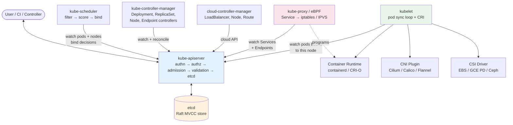
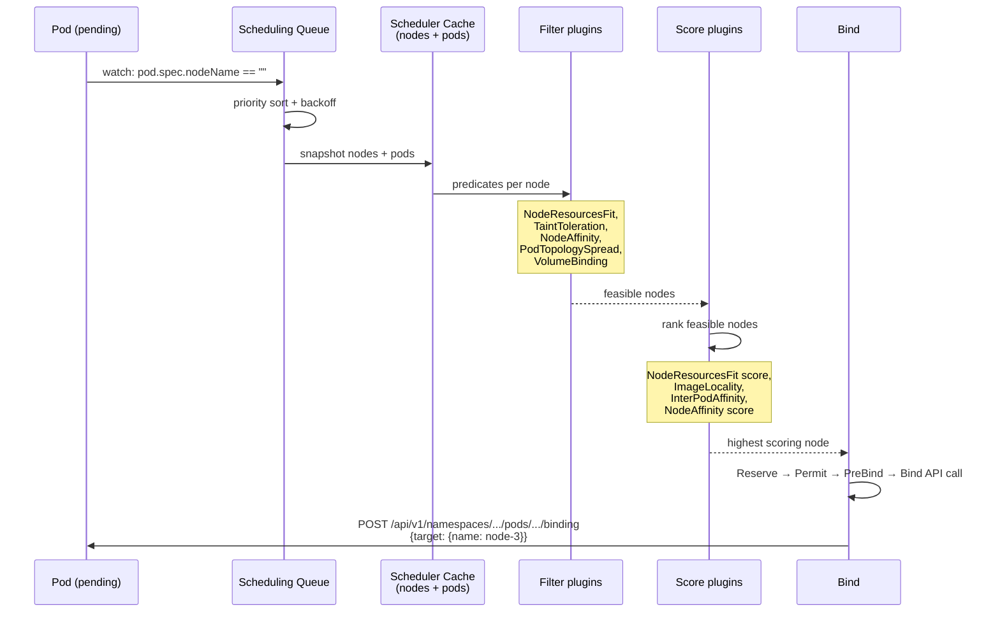
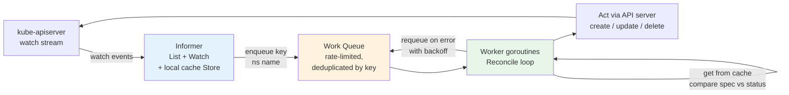
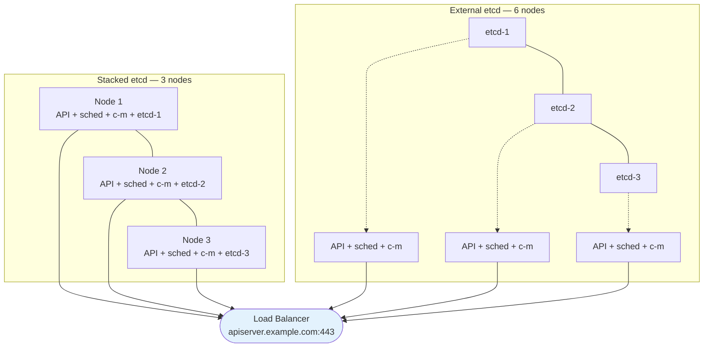
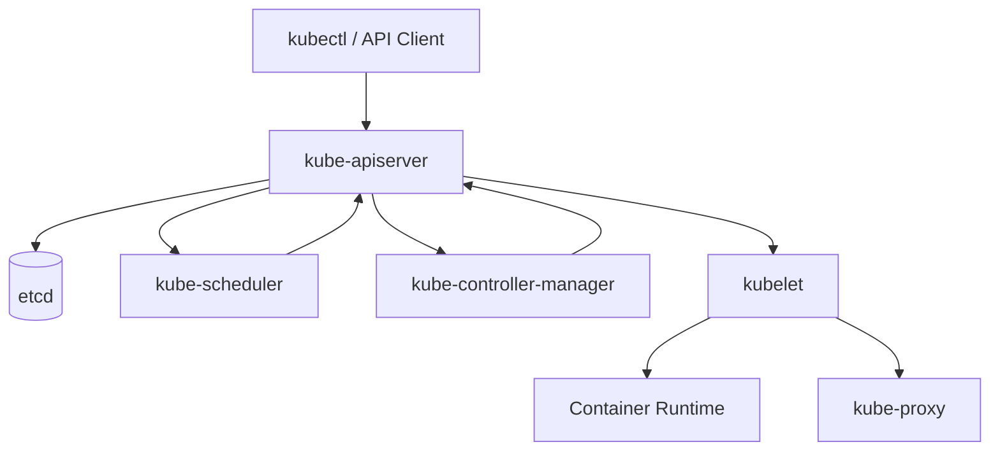
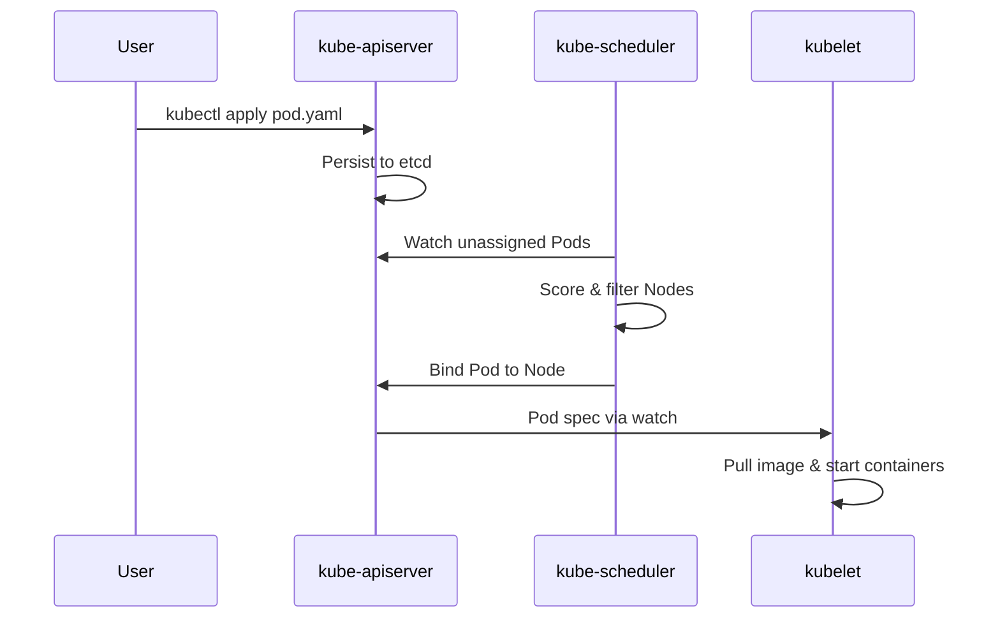
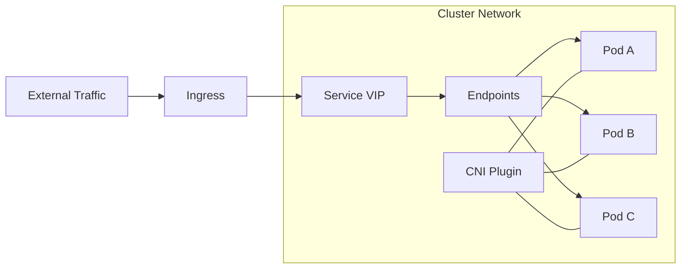

# Chapter 2 — Kubernetes Architecture: Control Plane and Data Plane

**What this chapter covers.** Kubernetes is a declarative, level-triggered control system that turns a desired state (YAML in etcd) into an observed state (containers running on nodes). Every `kubectl apply` writes an object to etcd through the API server; a constellation of controllers, schedulers, and node agents then reconciles the world until it matches. This chapter dissects that system end to end: the control plane that stores and decides (kube-apiserver, etcd, kube-scheduler, kube-controller-manager, cloud-controller-manager), the data plane that acts (kubelet, kube-proxy, the CRI runtime, CNI, CSI), and the contracts between them (the Kubernetes API conventions, the watch/informer cache, CRI, CNI, and CSI). You will learn how the API server authenticates, authorizes, admits, validates, and persists every request; how etcd provides the strongly consistent store that makes leader election and object storage correct; how the scheduler scores and binds pods; how controllers implement reconciliation loops with informers and work queues; and how the kubelet drives pod lifecycle on a single node. The chapter closes with high-availability topologies, upgrades, and failure modes — the operational reality of keeping the control plane alive while the data plane does the work.

Learning goals — after this chapter you should be able to:

- Describe the control-plane / data-plane split, name every component, and explain the contract each one fulfills.
- Trace a `kubectl apply` from TLS termination through authentication, authorization, admission, validation, and etcd persistence — and explain what `kubectl get --raw` actually hits.
- Explain etcd's role (Raft consensus, MVCC store, watch stream, compaction), why etcd health determines cluster health, and how to operate and back up an etcd cluster.
- Describe the scheduler's pipeline (queue → filter → score → bind → reserve/permit) and the Scheduling Framework extension points, and write a `KubeSchedulerConfiguration` that tunes it.
- Implement the controller pattern: informers, listers, work queues, level-triggered reconciliation, leader election, and status vs. spec — and explain why `observedGeneration` and `resourceVersion` exist.
- Explain the kubelet's responsibilities (pod sync loop, probes, static pods, CRI interaction, cgroup management) and how kube-proxy (iptables, IPVS, eBPF) implements Services — or why Cilium/eBPF replaces it.
- Reason about HA topologies (stacked vs. external etcd), API server scaling, controller-manager and scheduler leader election, and the upgrade sequence that keeps workloads running while the control plane rolls.
- Diagnose control-plane and node failures with API server audit logs, etcd metrics, scheduler events, kubelet logs, and `crictl`.

> **Boundary note.** Volume 6 — Distributed Systems — develops the consensus and coordination theory that the control plane depends on: Raft (Ch 6), linearizability and watches, and leases for leader election (Ch 8). Volume 2, Chapters 9–10 develop the Linux isolation and networking primitives that the data plane configures. This chapter is the *orchestration layer*: how Kubernetes composes etcd, the API server, scheduling, and node agents into a declarative control system. For Raft internals, read Vol 6 Ch 6; for how cgroups enforce the limits the kubelet sets, read Vol 2 Ch 9; for how a load balancer distributes traffic to the pods that Services select, read Vol 7 Ch 4. Here we focus on the Kubernetes-specific architecture that sits on top.

---

## The cluster as a control system

Kubernetes is not a script that creates containers. It is a continuously running control loop — many loops, in fact — that observe the current state of the world, compare it to the desired state stored in etcd, and act to close the gap. This is *level-triggered* reconciliation: if a controller crashes and restarts, it re-reads the desired state and retries the same actions; if a node disappears, controllers reschedule its pods; if a user edits a Deployment, the Deployment controller creates a new ReplicaSet and the old one scales down.

```
Desired state (etcd)          Observed state (nodes)
  Deployment: 3 replicas ──┐     Pod A running on node-1
  Service: app:80 → 8080   ├──→  Pod B running on node-1   gaps → actions
  ConfigMap: v2            ──┘     Pod C missing            (create Pod C)
                                   Pod D extra              (delete Pod D)
```

Two planes implement this:

- **Control plane** — the brain. Runs on dedicated nodes (or managed by a cloud provider) and never runs user workloads in production. Components: `kube-apiserver`, `etcd`, `kube-scheduler`, `kube-controller-manager`, `cloud-controller-manager`.
- **Data plane** — the muscle. The fleet of worker nodes that actually run pods. On each node: `kubelet`, `kube-proxy` (or eBPF datapath), a container runtime (containerd / CRI-O via CRI), a CNI plugin, and a CSI driver.

The API server is the only component that talks to etcd, and every other component talks to the API server. No controller, scheduler, or kubelet accesses etcd directly — the API server is the sole stateful gateway, which lets it enforce authentication, authorization, validation, admission, and audit on every read and write.



*Figure 2-1: Kubernetes control plane and data plane — every arrow passes through the API server. No component bypasses it to reach etcd.*

---

## The API server (kube-apiserver)

The API server is the front door and the only writer to etcd. It is a stateless, horizontally scalable Go HTTP server (typically 2–5 replicas behind a load balancer) that exposes a RESTful API over TLS. Understanding its request pipeline is the key to debugging every Kubernetes operation.

### Request pipeline

```
TLS termination
  → Authentication (who are you?)
  → Authorization (are you allowed?)
  → Admission — mutating webhooks and controllers (modify the object)
  → Validation — OpenAPI schema + CEL + validating webhooks (reject if invalid)
  → etcd write (persist, assign resourceVersion, emit watch event)
  → Response (201 Created / 200 OK with the stored object)
```

Every step is pluggable:

**Authentication** — the API server supports multiple authenticators simultaneously (x509 client certs, bearer tokens / ServiceAccount JWTs, OIDC, webhook token review). They run in order; the first to succeed sets `user + groups`.

```yaml
# kube-apiserver flags (managed — shown for understanding)
# /etc/kubernetes/manifests/kube-apiserver.yaml (static pod)
spec:
  containers:
  - command:
    - kube-apiserver
    - --etcd-servers=https://10.0.0.5:2379,https://10.0.0.6:2379,https://10.0.0.7:2379
    - --etcd-cafile=/etc/kubernetes/pki/etcd/ca.crt
    - --etcd-certfile=/etc/kubernetes/pki/apiserver-etcd-client.crt
    - --etcd-keyfile=/etc/kubernetes/pki/apiserver-etcd-client.key
    - --authentication-mode=Node,ServiceAccount
    - --service-account-issuer=https://kubernetes.default.svc
    - --service-account-key-file=/etc/kubernetes/pki/sa.pub
    - --authorization-mode=Node,RBAC
    - --enable-admission-plugins=NodeRestriction,MutatingAdmissionWebhook,ValidatingAdmissionWebhook,ResourceQuota
    - --audit-log-path=/var/log/kubernetes/audit.log
    - --audit-policy-file=/etc/kubernetes/audit-policy.yaml
    - --request-timeout=60s
    - --max-requests-inflight=400
    - --max-mutating-requests-inflight=200
```

**Authorization** — after authentication, every request is authorized. The built-in modes are `Node` (kubelets may only touch their own Node and pods bound to it) and `RBAC` (Role / ClusterRole bindings). Authorization is evaluated per verb (`get`, `list`, `watch`, `create`, `update`, `patch`, `delete`) on a resource in a namespace.

```yaml
# RBAC — least-privilege role for a CI deployer that may only rollout one Deployment
apiVersion: rbac.authorization.k8s.io/v1
kind: Role
metadata:
  namespace: production
  name: deployer
rules:
- apiGroups: ["apps"]
  resources: ["deployments"]
  verbs: ["get", "list", "watch", "update", "patch"]
- apiGroups: [""]
  resources: ["pods", "pods/log"]
  verbs: ["get", "list"]
---
apiVersion: rbac.authorization.k8s.io/v1
kind: RoleBinding
metadata:
  namespace: production
  name: deployer-binding
subjects:
- kind: ServiceAccount
  name: ci-deployer
  namespace: production
roleRef:
  kind: Role
  name: deployer
  apiGroup: rbac.authorization.k8s.io
```

**Admission control** — runs *after* authz but *before* persistence, in two phases:

1. **Mutating admission** — may modify the object. Built-in controllers (e.g., `DefaultStorageClass` sets `storageClassName` if absent) and `MutatingAdmissionWebhook` (e.g., Istio sidecar injection, `vault-agent` injection) add defaults, inject sidecars, or set labels.
2. **Validating admission** — may reject the object. Built-in validation (OpenAPI schema, CEL `x-kubernetes-validations`), `ValidatingAdmissionWebhook`, and the newer `ValidatingAdmissionPolicy` (CEL-based, no webhook server needed since 1.28) enforce policy.

```yaml
# ValidatingAdmissionPolicy — deny privileged pods without a webhook server
apiVersion: admissionregistration.k8s.io/v1
kind: ValidatingAdmissionPolicy
metadata:
  name: deny-privileged
spec:
  failurePolicy: Fail
  matchConstraints:
    resourceRules:
    - apiGroups: [""]
      apiVersions: ["v1"]
      operations: ["CREATE", "UPDATE"]
      resources: ["pods"]
  validations:
  - expression: "!has(object.spec.containers.exists(c, has(c.securityContext) && has(c.securityContext.privileged) && c.securityContext.privileged))"
    message: "Privileged containers are not allowed."
  - expression: "object.spec.containers.all(c, !has(c.securityContext) || !has(c.securityContext.allowPrivilegeEscalation) || c.securityContext.allowPrivilegeEscalation == false)"
    message: "allowPrivilegeEscalation must be false."
---
apiVersion: admissionregistration.k8s.io/v1
kind: ValidatingAdmissionPolicyBinding
metadata:
  name: deny-privileged-binding
spec:
  policyName: deny-privileged
  validationActions: [Deny]
  matchResources:
    namespaceSelector:
      matchLabels:
        enforce-privileged-policy: "true"
```

The API server rejects the request before it ever reaches etcd if any validating step fails — the audit log records the denial, and the client receives `400` or `403` with the policy message.

**API conventions** — every Kubernetes object shares a shape:

```yaml
apiVersion: apps/v1        # group/version — "" is the legacy core group
kind: Deployment
metadata:
  name: myapp
  namespace: production
  uid: 550e8400-e29b-41d4-a716-446655440000  # assigned by apiserver, immutable
  resourceVersion: "123456"                   # MVCC version — changes on every write
  generation: 4                               # increments only when spec changes
  creationTimestamp: "2026-01-15T10:00:00Z"
  labels: { app: myapp }
spec: {}      # desired state — what the user wants
status: {}    # observed state — what controllers report (subresource, separate RBAC)
```

`spec` is what you declare; `status` is what controllers observe and report. `resourceVersion` is the etcd MVCC revision — clients use it for optimistic concurrency (`If-Match`) and for `watch` resumption. `generation` vs. `observedGeneration` lets controllers know when they have reconciled the latest spec.

### Scaling and HA

The API server is stateless, so you scale it horizontally — 3 or 5 replicas behind a TCP load balancer (or cloud managed control plane). Each replica connects to the same etcd cluster. Requests are not sticky; any replica can serve any read or write. etcd provides the linearizability.

Flow-control (APF — API Priority and Fairness, GA since 1.26) prevents a single misbehaving client from starving the API server:

```yaml
# FlowSchema — boring workloads get lower priority
apiVersion: flowcontrol.apiserver.k8s.io/v1
kind: FlowSchema
metadata:
  name: low-priority-batch
spec:
  priorityLevelConfiguration:
    name: low-priority
  distinguisherMethod:
    type: ByUser
  matchingPrecedence: 1000
  rules:
  - resourceRules:
    - apiGroups: ["batch"]
      resources: ["jobs"]
      verbs: ["create"]
    subjects:
    - kind: Group
      group:
        name: system:serviceaccounts:batch
---
apiVersion: flowcontrol.apiserver.k8s.io/v1
kind: PriorityLevelConfiguration
metadata:
  name: low-priority
spec:
  type: Limited
  limited:
    nominalConcurrencyShares: 10
    limitResponse:
      type: Queue
      queuing:
        queues: 4
        queueLengthLimit: 20
        handSize: 3
```

---

## etcd

etcd is the single source of truth. Every object you create lives as a key in etcd's MVCC key-value store under a prefix derived from its group/version/resource and namespace:

```
/registry/pods/production/myapp-xyz
/registry/deployments.apps/production/myapp
/registry/secrets/production/myapp-tls
```

### Raft and the MVCC store

etcd is a Raft cluster (3 or 5 members; even numbers do not improve fault tolerance). One member is the leader that sequences writes; followers replicate the log. A write is committed when a majority (quorum) acknowledges it — 2 of 3, 3 of 5 — so a 3-member cluster tolerates 1 failure, a 5-member cluster tolerates 2. The MVCC store retains multiple revisions of each key, enabling `watch` from a past `resourceVersion` and optimistic concurrency.

Critical operational details:

- **Quorum, not count.** Adding a 4th member to a 3-member cluster does *not* increase fault tolerance — it still tolerates 1 failure but now needs 3 of 4 to form quorum (worse for latency). Scale from 3 → 5 when you need to tolerate 2.
- **Disk is the bottleneck.** etcd is fsync-bound — every committed write fsyncs the WAL. Slow disks (network-attached without provisioned IOPS, noisy neighbors) cause leader elections and API server timeouts. Run etcd on local SSDs or provisioned-IOPS volumes; monitor `etcd_disk_wal_fsync_duration_seconds` (p99 should be < 10ms).
- **Size limits.** The default `--quota-backend-bytes` is 8 GiB. Large objects (oversized ConfigMaps, Helm release secrets that store full release history, verbose CRDs) fill etcd and cause `etcdserver: mvcc: database space exceeded` — the cluster becomes read-only. Set `--auto-compaction-mode=periodic --auto-compaction-retention=5m`, monitor `etcd_mvcc_db_total_size_in_bytes`, and defragment periodically. Keep objects under 1 MiB; never store large blobs in etcd.
- **Defragmentation** reclaims space after compaction. It requires extra disk space (needs to copy the DB) and briefly holds a lock — run it during maintenance or rolling across members.

```bash
# etcd health and member list (from a control-plane node)
ETCDCTL_API=3 etcdctl --endpoints=https://10.0.0.5:2379,https://10.0.0.6:2379,https://10.0.0.7:2379 \
  --cacert=/etc/kubernetes/pki/etcd/ca.crt \
  --cert=/etc/kubernetes/pki/etcd/server.crt \
  --key=/etc/kubernetes/pki/etcd/server.key \
  endpoint health --cluster

# Inspect raw keys (prefix scan)
ETCDCTL_API=3 etcdctl get /registry/pods/production/ --prefix --keys-only

# Defragment one member at a time (never all at once — quorum)
ETCDCTL_API=3 etcdctl defrag --endpoints=https://10.0.0.5:2379

# Snapshot backup (the only supported backup method)
ETCDCTL_API=3 etcdctl snapshot save /var/backups/etcd-$(date +%F).db
ETCDCTL_API=3 etcdctl snapshot status /var/backups/etcd-2026-01-15.db -w table
```

### Watches

Watches are the nervous system. Instead of polling, every controller opens a long-lived `watch` on the resources it cares about (`GET /api/v1/pods?watch=1&resourceVersion=123`). etcd streams events (`ADDED`, `MODIFIED`, `DELETED`) as they occur. If the connection drops, the client resumes from the last `resourceVersion` it saw — because the MVCC store retains history until compaction, a short disconnection loses nothing. If `resourceVersion` is too old (compacted), the server returns `410 Gone` and the client must re-list.

This is why the informer cache exists — controllers list once, then watch forever, maintaining a local in-memory cache (the `Store`) without hammering the API server.

---

## The scheduler (kube-scheduler)

The scheduler's job is narrow: assign each unscheduled pod (`spec.nodeName == ""`) to a node that can run it. It does not create or delete pods — it only writes `spec.nodeName` via the `pods/binding` subresource; the kubelet on that node then notices and starts the pod.

### Scheduling pipeline



Filtering is hard constraints (a pod that needs 4 GiB cannot land on a node with 2 GiB free). Scoring is soft preferences (prefer nodes that already have the image cached). The binding is a single optimistic write — if two schedulers race to bind the same pod, one fails with `409 Conflict` and retries.

### The Scheduling Framework

Since 1.19, scheduling behavior is composed from framework plugins at extension points. You can tune, disable, or add plugins without forking the scheduler:

| Extension point | When it runs | Example plugins |
|---|---|---|
| `QueueSort` | Orders pods in the queue | `PrioritySort` (default) |
| `Filter` | Hard predicate — can this pod run on this node? | `NodeResourcesFit`, `NodePorts`, `TaintToleration`, `VolumeBinding`, `InterPodAffinity` |
| `Score` | Soft ranking of feasible nodes (0–100) | `NodeResourcesFit`, `ImageLocality`, `InterPodAffinity`, `PodTopologySpread` |
| `Reserve` | After scoring, before bind — reserve resources | `VolumeBinding` reserves PV |
| `Permit` | Approve, deny, or delay the binding | `CoScheduling` (gang scheduling via `PodGroup`) |
| `PreBind` / `PostBind` | Immediately before/after the bind API call | `VolumeBinding` provisions volume |

Custom schedulers (batch, gang, bin-packing) either configure the default scheduler via `KubeSchedulerConfiguration` or run as a second scheduler (`spec.schedulerName: my-scheduler`) that watches only pods naming it.

```yaml
# KubeSchedulerConfiguration — tune the default scheduler
apiVersion: kubescheduler.config.k8s.io/v1
kind: KubeSchedulerConfiguration
profiles:
- schedulerName: default-scheduler
  plugins:
    filter:
      disabled:
      - name: InterPodAffinity   # disable if you never use pod affinity (saves latency)
    score:
      disabled:
      - name: ImageLocality      # disable on nodes with fast image pulls
  pluginConfig:
  - name: NodeResourcesFit
    args:
      scoringStrategy:
        type: MostAllocated       # bin-pack: prefer nodes with higher utilization
        # type: LeastAllocated    # spread: prefer emptier nodes (default)
        resources:
        - name: cpu
          weight: 1
        - name: memory
          weight: 2              # weight memory more heavily for memory-bound workloads
```

---

## Controller manager

The controller manager (`kube-controller-manager`) is not one controller but a process that hosts ~30 controllers, each a reconciliation loop. The cloud-controller-manager splits out the 3 controllers that need cloud API credentials (node, route, service/load-balancer) so the core controller manager needs no cloud IAM.

### The reconciliation loop

Every controller follows the same pattern, built on `client-go`'s informer + work queue:



Key design choices:

- **Level-triggered, not edge-triggered.** The work queue stores *keys* (`namespace/name`), not events. Multiple events for the same object collapse to one key. The worker always re-reads the latest object from the informer cache — if it missed an event, the next reconciliation corrects it. This is why controllers are resilient to missed watches.
- **Rate-limited requeue.** On error, the key is requeued with exponential backoff (`5ms → 10ms → 20ms → ... → 1000s`). Transient failures (API server temporarily unavailable) retry; persistent failures do not hot-loop.
- **Status subresource.** Controllers update `status` (observed state) separately from `spec` (desired state). RBAC grants controllers `update` on `status` but not on `spec` — users own `spec`, controllers own `status`. `observedGeneration` in status records which `generation` was last reconciled.
- **Owner references and garbage collection.** When a controller creates an object, it sets `metadata.ownerReferences` pointing to itself. The garbage collector watches for owner deletion and cascades deletes (foreground, background, or orphan — controlled by `propagationPolicy`).

Key controllers and what they reconcile:

| Controller | Watches | Action |
|---|---|---|
| **Deployment** | Deployments | Creates/updates ReplicaSets; orchestrates rolling updates |
| **ReplicaSet** | ReplicaSets + Pods | Ensures `replicas` pods exist matching the selector |
| **StatefulSet** | StatefulSets + Pods + PVCs | Ordered, sticky-identity pod creation with stable network/storage |
| **Job / CronJob** | Jobs / CronJobs | Creates pods to completion, handles parallelism and deadlines |
| **Node** | Nodes + Pods | Marks nodes `NotReady` after missed heartbeats; evicts pods via taints |
| **Endpoints / EndpointSlice** | Services + Pods | Populates the set of pod IPs backing each Service |
| **ServiceAccount** | ServiceAccounts | Creates mountable tokens / projected volumes |

A minimal controller in Go (the pattern every controller follows):

```go
// Reconcile is called with the key of a changed object.
// It must be idempotent — calling it twice with the same key produces the same result.
func (c *MyController) Reconcile(ctx context.Context, key string) error {
    ns, name, _ := cache.SplitMetaNamespaceKey(key)
    obj, exists, err := c.informer.GetIndexer().GetByKey(key)
    if err != nil { return err }
    if !exists {
        // Object was deleted — clean up external resources.
        return c.handleDelete(ns, name)
    }
    desired := obj.(*MyApp).Spec
    observed := obj.(*MyApp).Status

    if observed.ObservedGeneration == obj.(*MyApp).Generation {
        return nil // already reconciled
    }
    // ... create/update child resources, set ownerReferences ...
    // ... update status with new observedGeneration ...
    return c.client.Status().Update(ctx, obj)
}
```

### Leader election

Controller-manager and scheduler are active-passive — only one replica acts at a time; the others stand by. They use a Lease object in `kube-system` (`kube-controller-manager`, `kube-scheduler`) with periodic renewals. If the leader's lease expires (it crashed or was partitioned), another replica acquires it within seconds. etcd is the linearizable store that makes this safe (see Vol 6 Ch 8 for the lease mechanics).

```bash
kubectl -n kube-system get lease kube-controller-manager -o yaml
# spec:
#   holderIdentity: kube-controller-manager-xyz_abc
#   leaseDurationSeconds: 15
#   renewTime: "2026-01-15T10:00:05Z"
```

---

## Data plane

### kubelet

The kubelet is the node agent — one per node, the only Kubernetes component that actually starts containers. Its responsibilities:

1. **Watch pods bound to this node** — the API server notifies it via watch; it also watches a local directory (`/etc/kubernetes/manifests`) for static pods (used to run the control plane itself).
2. **Sync loop (PLEG — Pod Lifecycle Event Generator)** — every second, compare desired pods (from API server + static pods) to running containers (from CRI). If a desired pod is missing, create it; if a running container should not exist, kill it; if a liveness probe fails, restart it. This is reconciliation at the node level, mirroring the control-plane controllers.
3. **Probes** — `livenessProbe` (restart the container if it fails), `readinessProbe` (remove the pod from Service endpoints if it fails), `startupProbe` (gate liveness/readiness until the app has started). All probes are executed by the kubelet, not by the pod.
4. **Resource management** — creates cgroups for pods/containers (via the cgroup driver — `systemd` is the only supported driver since 1.22), enforces `resources.limits`, reports `resources.requests` to the scheduler, and evicts pods when the node is under memory/disk pressure (`--eviction-hard=memory.available<500Mi,imagefs.available<10%`).
5. **Volume and secret mounting** — calls CSI drivers to mount volumes, fetches ConfigMaps/Secrets from the API server and projects them into the pod filesystem.
6. **Status reporting** — posts pod status, node status (conditions, capacity, allocatable), and events back to the API server.

```yaml
# KubeletConfiguration (on each node — /var/lib/kubelet/config.yaml)
apiVersion: kubelet.config.k8s.io/v1beta1
kind: KubeletConfiguration
cgroupDriver: systemd
clusterDNS: ["10.96.0.10"]
clusterDomain: cluster.local
maxPods: 110
evictionHard:
  memory.available: "500Mi"
  imagefs.available: "10%"
  nodefs.available: "10%"
evictionSoft:
  memory.available: "1Gi"
evictionSoftGracePeriod:
  memory.available: "2m"
featureGates:
  UserNamespacesSupport: true
```

**Static pods** deserve a note — the kubelet can run pods without the API server. Any YAML file placed in `--pod-manifest-path` (default `/etc/kubernetes/manifests`) is run as a pod. `kubeadm` uses this to bootstrap the control plane: the API server, scheduler, controller-manager, and etcd each run as a static pod, so the cluster can start without an API server already running.

### Container Runtime Interface (CRI)

The kubelet does not speak Docker directly (dockershim was removed in 1.24). It speaks CRI — a gRPC API (`RunPodSandbox`, `CreateContainer`, `StartContainer`, `StopContainer`, `RemoveContainer`, `ImageService.PullImage`) — to a high-level runtime:

- **containerd** (`containerd.io`) — the CNCF default; used by GKE, EKS, AKS, and kind.
- **CRI-O** — Red Hat's lightweight CRI-only runtime; used by OpenShift.

Both delegate to an OCI low-level runtime (`runc` / `crun`) for the actual `unshare`/`cgroups`/`exec` (see Ch 1 for runtime selection).

Debug CRI directly with `crictl` (not `docker`):

```bash
crictl ps -a                    # list containers via CRI (not Docker)
crictl pods --name myapp        # list pod sandboxes
crictl inspect <container-id>   # CRI inspect (pid, mounts, labels)
crictl logs <container-id>      # fetch logs via CRI log driver
crictl images                   # images known to the runtime
```

### kube-proxy and Service networking

Services are stable virtual IPs that load-balance across a dynamic set of pod IPs. kube-proxy is the component that programs that load-balancing on each node.

Three modes, in historical order:

| Mode | How it programs the datapath | Performance | Status |
|---|---|---|---|
| **userspace** (legacy) | kube-proxy process proxies every connection in user space | Slow — extra copy per packet | Removed (1.25) |
| **iptables** | kube-proxy writes `iptables` NAT rules; kernel does DNAT | Good for < 1k Services; `iptables-restore` is O(n) on rule count | Default on most clusters |
| **IPVS** | kube-proxy writes IPVS virtual servers; kernel does load-balancing | Better for large clusters; O(1) per Service, supports more LB algorithms | Opt-in (`--proxy-mode=ipvs`) |
| **eBPF (no kube-proxy)** | Cilium / Cilium-eBPF replaces kube-proxy entirely with eBPF programs | Best — no iptables traversal, socket-level LB, XDP fast path | Preferred on new clusters with Cilium |

In iptables mode, a `ClusterIP` Service `10.96.42.10:80 → pods 10.0.1.3:8080, 10.0.1.4:8080` is implemented as:

```bash
# On the node — what kube-proxy wrote (simplified)
iptables -t nat -A KUBE-SERVICES -d 10.96.42.10/32 -p tcp --dport 80 -j KUBE-SVC-XXXX
iptables -t nat -A KUBE-SVC-XXXX -m statistic --mode random --probability 0.5 -j KUBE-SEP-YYYY  # 50% → pod 1
iptables -t nat -A KUBE-SVC-XXXX -j KUBE-SEP-ZZZZ                                              # 50% → pod 2
iptables -t nat -A KUBE-SEP-YYYY -j DNAT --to-destination 10.0.1.3:8080
iptables -t nat -A KUBE-SEP-ZZZZ -j DNAT --to-destination 10.0.1.4:8080
```

Cilium in eBPF mode replaces all of this with a single eBPF map lookup at the socket layer — no iptables chain traversal, and it handles NetworkPolicy enforcement in the same program. New clusters should prefer Cilium and set `kubeProxyReplacement: true`.

Ch 3 covers Services, Ingress, Gateway API, DNS, and NetworkPolicies at the workload level — here the focus is the datapath mechanism.

### CNI and CSI

**CNI (Container Network Interface)** is the plugin that wires a pod's network namespace. The kubelet calls `ADD` on pod creation (allocate an IP, create a veth pair, attach to a bridge or eBPF datapath) and `DEL` on deletion. Popular plugins: Cilium (eBPF), Calico (BGP / eBPF), Flannel (VXLAN), Weave. Only one CNI runs per cluster.

**CSI (Container Storage Interface)** is the analogous plugin for storage. A CSI driver (EBS, GCE PD, Ceph, Longhorn) implements `CreateVolume`, `NodeStageVolume`, `NodePublishVolume` — the kubelet and the external CSI controller call these to provision and mount persistent volumes (see Ch 3).

---

## High availability, upgrades, and failure modes

### HA topologies

Two standard topologies (from `kubeadm`):

**Stacked etcd** — etcd members colocated with control-plane nodes (3 nodes, each runs API server + scheduler + controller-manager + etcd). Simpler, fewer machines, but etcd shares CPU/disk with the API server and a node loss takes both a control-plane replica and an etcd member.

**External etcd** — 3 dedicated etcd hosts + 3 control-plane nodes (6 machines). etcd gets dedicated disks and is isolated from API server load. Preferred for large or latency-sensitive clusters.

Both tolerate 1 failure with 3 members and 2 with 5. Cloud managed control planes (GKE, EKS, AKS) hide this entirely — they run a regional, multi-AZ control plane with external etcd and a managed load balancer.



*Figure 2-2: Stacked vs. external etcd — stacked is simpler but couples etcd to control-plane load; external isolates etcd on dedicated hosts with dedicated disks.*

### Upgrades

Kubernetes upgrades one minor version at a time (1.29 → 1.30, never 1.29 → 1.31). The sequence:

1. Upgrade the control plane — API server first (it must understand both old and new object versions), then controller-manager and scheduler. etcd is upgraded separately and rarely (it is backward-compatible across many Kubernetes versions).
2. Drain and upgrade worker nodes one at a time — `kubectl drain --ignore-daemonsets` evicts pods, upgrade kubelet + container runtime, `kubectl uncordon`.
3. Workloads stay running throughout — Deployments reschedule evicted pods onto remaining nodes (assuming `PodDisruptionBudget` and sufficient capacity).

Managed clusters automate this; self-hosted clusters use `kubeadm upgrade plan` / `kubeadm upgrade apply v1.30.x`.

### Failure modes

| Failure | Symptom | Mitigation |
|---|---|---|
| **etcd quorum loss** (2 of 3 down) | API server returns 500; no writes succeed; existing pods keep running but no new scheduling | Restore from snapshot; never run etcd on ephemeral disks |
| **API server overload** (too many watches or large lists) | 429 / timeouts; controllers fall behind | APF flow control; paginate lists (`limit` + `continue`); avoid `list` without label selectors |
| **Scheduler down** | New pods stay `Pending` indefinitely; running pods unaffected | Multiple scheduler replicas with leader election (or a second scheduler for critical pods) |
| **kubelet down on a node** | Node goes `NotReady` after 40s (default `node-monitor-grace-period`); pods stay bound until the Node controller evicts them (5 min default `pod-eviction-timeout` or immediately if tainted `NoExecute`) | Node auto-repair (GKE) or Cluster API machine health checks |
| **CNI failure** | Pods stuck in `ContainerCreating` (`FailedCreatePodSandBox`); network policy not enforced | CNI DaemonSet health checks; Cilium/Calico operator with self-healing |
| **etcd disk full** | API server writes fail with `database space exceeded`; cluster read-only | Compaction + defrag; quota alerts; never store large blobs in etcd |

---

## Key takeaways

- Kubernetes is a set of level-triggered reconciliation loops. The desired state lives in etcd; controllers, the scheduler, and kubelets continuously drive observed state toward it. Every loop is built on informer + work queue + compare spec vs. status.
- The API server is the sole gateway to etcd and the only place where authentication, authorization, admission, validation, and audit are enforced. It is stateless and horizontally scalable; etcd is the only stateful control-plane component.
- etcd is a Raft MVCC store. Its health determines cluster health. Run it on dedicated SSDs, keep the DB under quota (compact + defrag), never store large objects in it, back up with `etcdctl snapshot save`, and prefer 3 members (or 5 for 2-failure tolerance — never 4).
- The scheduler filters (hard predicates) then scores (soft preferences) nodes, then binds via a single optimistic `pods/binding` write. The Scheduling Framework makes filtering and scoring pluggable; tune it with `KubeSchedulerConfiguration` rather than forking.
- Controllers watch, enqueue keys, and reconcile. They collapse events, retry with backoff, and separate `spec` (user-owned) from `status` (controller-owned). Owner references drive garbage collection.
- The data plane is kubelet (pod sync loop + probes + cgroups + CRI) + container runtime (containerd/CRI-O → runc/crun) + kube-proxy or eBPF (Service load-balancing) + CNI (pod networking) + CSI (volumes). `crictl` is the CRI-native debug tool; `kubectl debug` works even for distroless images.
- HA is stacked or external etcd (3 or 5 members) with 2–5 API server replicas behind a load balancer and leader-elected scheduler/controller-manager. Upgrades are control plane first, then nodes one at a time, with `PodDisruptionBudget` protecting availability.

## Further reading

- Kubernetes Concepts — Cluster Architecture. https://kubernetes.io/docs/concepts/architecture/
- Kubernetes Reference — kube-apiserver, kube-scheduler, kube-controller-manager, kubelet. https://kubernetes.io/docs/reference/command-line-tools-reference/
- etcd documentation — operations, tuning, disaster recovery. https://etcd.io/docs/
- Kubernetes Enhancement Proposals — APF (KEP-1040), Scheduling Framework (KEP-624), ValidatingAdmissionPolicy (KEP-3488). https://github.com/kubernetes/enhancements
- Stefan Schimanski and Michael Hausenblas — *Programming Kubernetes* (O'Reilly, 2019) — informers, work queues, and controller patterns.
- Brendan Burns et al. — *Kubernetes: Up and Running*, 3rd ed. (O'Reilly, 2022) — control-plane and data-plane walkthroughs.
- Cilium documentation — eBPF datapath and kube-proxy replacement. https://docs.cilium.io/
- kubeadm — Creating Highly Available Clusters. https://kubernetes.io/docs/setup/production-environment/tools/kubeadm/high-availability/

### Kubernetes control plane components



### Pod scheduling flow



### Kubernetes networking model


