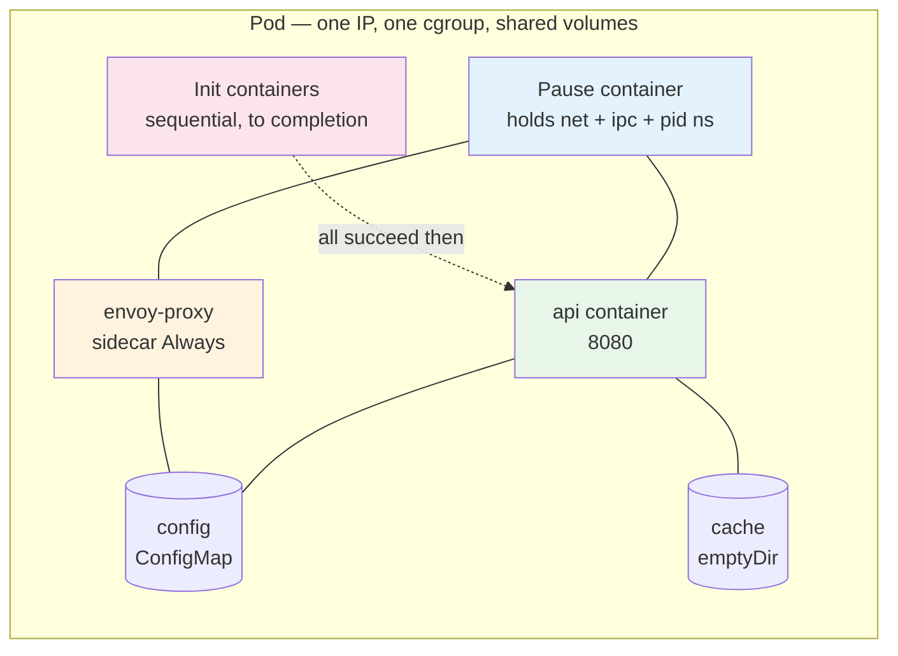
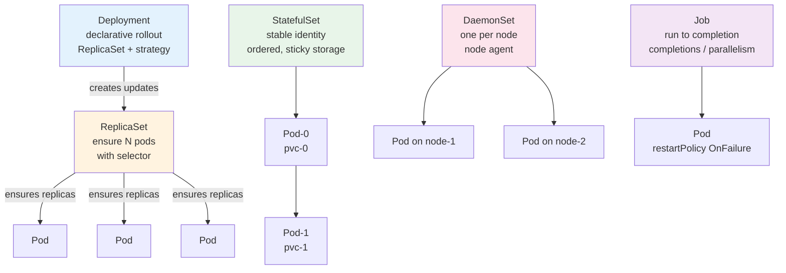
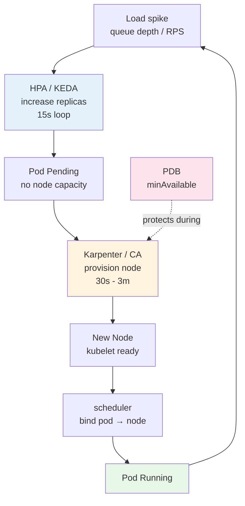
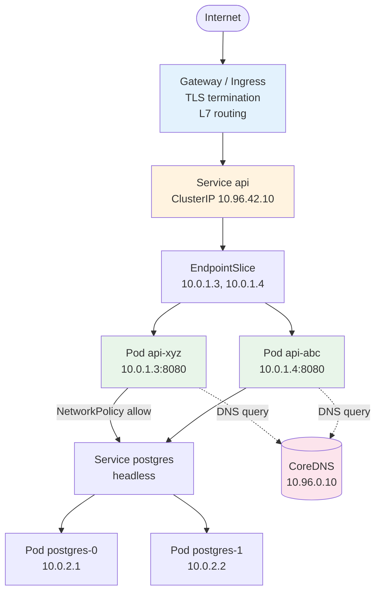
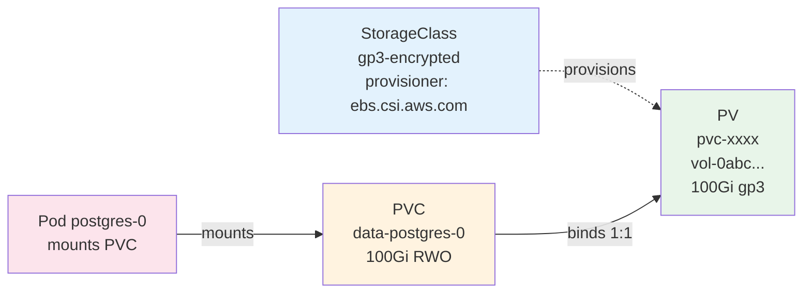
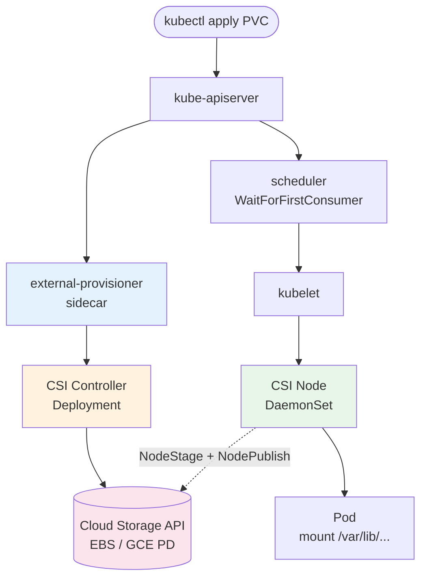
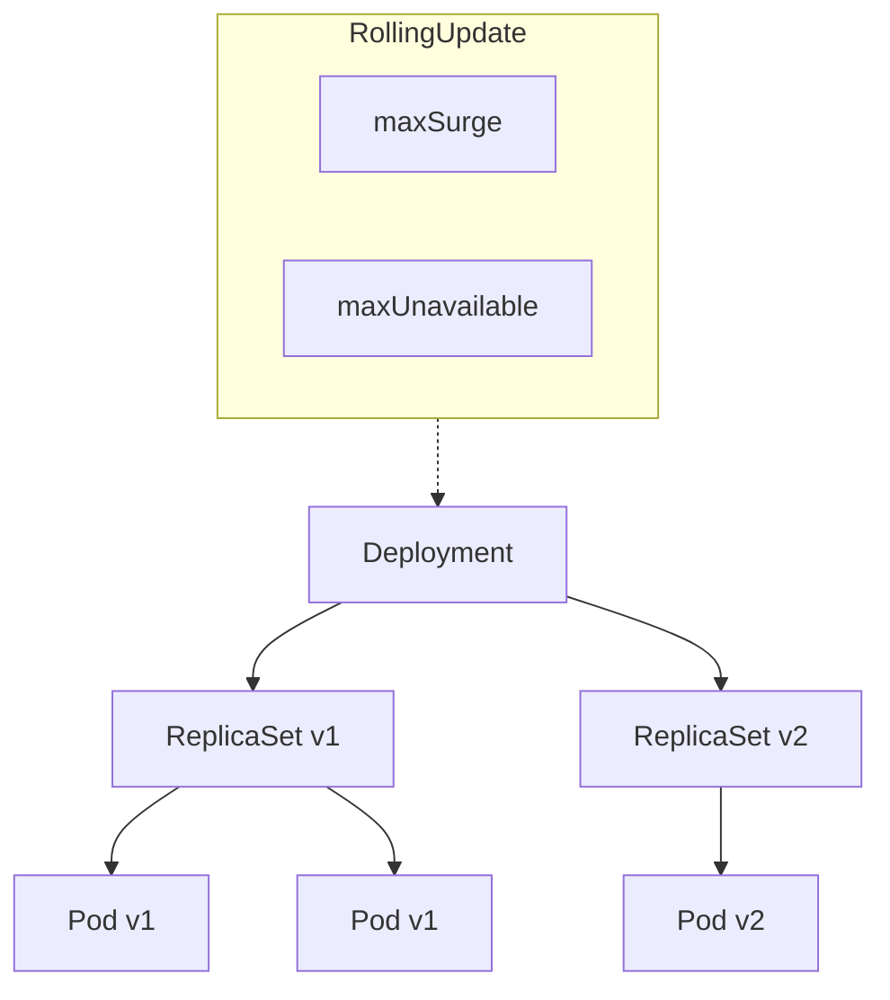

# Chapter 3 — Kubernetes Workloads, Networking, and Storage

**What this chapter covers.** Pods, Services, and PersistentVolumes are the three primitives that turn Kubernetes from a container runner into a platform that can host stateful, networked, auto-scaled backend systems. This chapter builds the workload layer that backend engineers use every day: how a Pod spec actually maps to containers, probes, lifecycle hooks, and cgroups on a node; how workload controllers (Deployment, StatefulSet, DaemonSet, Job, CronJob) provide rollout, identity, and completion semantics on top of raw pods; how autoscalers (HPA, VPA, KEDA, Karpenter/Cluster Autoscaler) close the loop between load and capacity; how Services, EndpointSlices, Ingress, Gateway API, CoreDNS, and NetworkPolicy compose the networking model; and how volumes, PersistentVolumeClaims, StorageClasses, and CSI drivers give pods durable storage with dynamic provisioning, snapshots, and topology awareness. Every abstraction is grounded in manifests you apply to a real cluster, with the failure modes and operational trade-offs that determine whether a system survives load, upgrades, and zone failures.

Learning goals — after this chapter you should be able to:

- Write correct Pod specs with multi-container patterns (sidecar, adapter, ambassador), init containers, native sidecar containers (1.29+ `restartPolicy: Always`), probes, lifecycle hooks, and resource requests/limits that produce the right QoS class.
- Choose and configure workload controllers — Deployment (stateless rollouts), StatefulSet (stable identity + ordered storage), DaemonSet (per-node agents), Job/CronJob (run-to-completion) — and explain their reconciliation guarantees.
- Configure autoscaling at three levels: pod count (HPA on CPU/custom metrics), pod resources (VPA), event-driven scaling (KEDA), and node count (Cluster Autoscaler / Karpenter), and reason about their interactions and lag.
- Describe the Service abstraction (ClusterIP, headless, NodePort, LoadBalancer, ExternalName), how EndpointSlices are populated, and how kube-proxy or Cilium/eBPF implements Service load-balancing — and when to use Ingress vs. Gateway API for L7 routing.
- Explain cluster DNS (CoreDNS), CNI networking (pod IP allocation, overlay vs. native routing), and NetworkPolicy (default-deny, namespace isolation, Cilium ClusterwideNetworkPolicy), and write correct policies that enforce tenant isolation.
- Provision storage with PVCs, StorageClasses, and CSI drivers — dynamic provisioning, `volumeBindingMode: WaitForFirstConsumer`, topology constraints, snapshots, expansion, and the lifecycle of PV/PVC/Pod binding — and explain why StatefulSet + `volumeClaimTemplates` is the correct pattern for databases.

> **Boundary note.** Chapter 2 dissected the control plane and data plane machinery (API server, etcd, scheduler, kubelet, CRI, kube-proxy/CNI/CSI as components). This chapter is the *workload author's view* — the objects you declare and the semantics they give you. Volume 6 — Distributed Systems — provides the replication and consistency theory behind StatefulSet identity and storage; Volume 3 — Networking — develops the L3/L4/L7 concepts that Services and Ingress implement; Volume 5 — Databases — covers the storage engines that run inside the pods you schedule here. Read Ch 2 for *how* the kubelet runs a pod; read here for *which* pod controller and *which* Service and *which* volume to use, and what breaks when you choose wrong.

---

## Pods: the atomic unit

A Pod is not a container — it is a *group* of containers that share fate, network, and storage. The Pod is the smallest schedulable unit; the scheduler binds an entire pod to a node, and the kubelet creates a single network namespace (the "pause" or "sandbox" container) that all containers in the pod join. They share an IP, a port space, IPC, and optionally volumes and process namespace.

### Anatomy of a Pod spec

```yaml
apiVersion: v1
kind: Pod
metadata:
  name: api-7f9c4
  namespace: production
  labels: { app: api, version: v2.1 }
spec:
  # Scheduling
  nodeSelector: { workload: api }
  affinity:
    podAntiAffinity:
      preferredDuringSchedulingIgnoredDuringExecution:
      - weight: 100
        podAffinityTerm:
          labelSelector: { matchLabels: { app: api } }
          topologyKey: kubernetes.io/hostname   # spread across nodes
  tolerations:
  - key: workload
    operator: Equal
    value: api
    effect: NoSchedule
  topologySpreadConstraints:
  - maxSkew: 1
    topologyKey: topology.kubernetes.io/zone
    whenUnsatisfiable: DoNotSchedule
    labelSelector: { matchLabels: { app: api } }

  # Security — pod-level defaults (container can override)
  securityContext:
    runAsUser: 65532
    runAsNonRoot: true
    seccompProfile: { type: RuntimeDefault }
    fsGroup: 65532

  # Volumes shared across containers in this pod
  volumes:
  - name: config
    configMap: { name: api-config }
  - name: cache
    emptyDir: {}
  - name: tls
    secret: { secretName: api-tls }

  # Init containers — run sequentially to completion before app containers start
  initContainers:
  - name: wait-for-migrations
    image: ghcr.io/myorg/migrate:v1.42@sha256:abc...
    command: ["./wait-for-db", "--timeout=120s"]
    resources: { requests: { cpu: "50m", memory: "64Mi" } }

  containers:
  # Main application container
  - name: api
    image: ghcr.io/myorg/api:v2.1@sha256:def...
    ports:
    - containerPort: 8080
      name: http
      protocol: TCP
    env:
    - name: POD_IP
      valueFrom: { fieldRef: { fieldPath: status.podIP } }
    - name: CONFIG_PATH
      value: /etc/config/config.yaml
    volumeMounts:
    - { name: config, mountPath: /etc/config }
    - { name: tls, mountPath: /etc/tls, readOnly: true }

    resources:
      requests: { cpu: "500m", memory: "512Mi" }   # scheduler uses this; also initial cgroup share
      limits:   { cpu: "1000m", memory: "768Mi" }   # cgroup hard cap; OOMKill if exceeded

    # Probes — the kubelet's health checks (not the pod's)
    startupProbe:                               # gate liveness/readiness until app has started
      httpGet: { path: /healthz/startup, port: http }
      periodSeconds: 5
      failureThreshold: 30                      # 30 × 5s = 150s startup budget
    livenessProbe:                              # restart the container if this fails
      httpGet: { path: /healthz/live, port: http }
      periodSeconds: 10
      failureThreshold: 3
    readinessProbe:                             # remove from Service endpoints if this fails
      httpGet: { path: /healthz/ready, port: http }
      periodSeconds: 5
      failureThreshold: 2
      successThreshold: 1

    lifecycle:
      preStop:                                  # called before SIGTERM
        exec:
          command: ["/bin/sh", "-c", "sleep 10"]  # give the LB time to drain

  # Native sidecar container (1.29+ — restartPolicy: Always keeps it running)
  - name: envoy-proxy
    image: ghcr.io/envoyproxy/envoy:v1.30@sha256:789...
    restartPolicy: Always
    ports:
    - { containerPort: 15001, name: proxy }
    resources: { requests: { cpu: "100m", memory: "128Mi" } }

  terminationGracePeriodSeconds: 30
  restartPolicy: Always                         # Always (Deployment) vs. OnFailure (Job) vs. Never
```

Key decisions in this spec and why they matter:

| Field | Why it matters for backend systems |
|---|---|
| `resources.requests` vs. `limits` | Requests drive scheduling (bin-packing) and initial cgroup shares; limits are the hard cap. Setting `requests == limits` gives `Guaranteed` QoS (never evicted for resource pressure). `requests < limits` is `Burstable` (can burst, but may be throttled/killed). Omitting both is `BestEffort` (first to be evicted). |
| `startupProbe` | Without it, a slow-starting app (JVM warmup, large cache load) has its liveness probe fail during startup and gets killed in a crash loop. `startupProbe` disables liveness/readiness until it succeeds. |
| `livenessProbe` vs. `readinessProbe` | Liveness = "is the process stuck?" → restart. Readiness = "can this pod serve traffic?" → remove from endpoints. Conflating them causes restart storms when a downstream dependency is slow — readiness should fail, liveness should not. |
| `preStop` + `terminationGracePeriodSeconds` | On deletion, kubelet sends `preStop`, then `SIGTERM`, waits `terminationGracePeriodSeconds` (default 30s), then `SIGKILL`. `preStop: sleep 10` gives kube-proxy/Cilium time to remove the pod from Service backends before the process stops accepting connections. |
| `topologySpreadConstraints` | Without it, the scheduler may pack all replicas onto one zone or node. `maxSkew: 1` across `topology.kubernetes.io/zone` ensures even distribution — critical for zone failure tolerance. |
| `securityContext` | `runAsNonRoot` + `RuntimeDefault` seccomp + dropping capabilities (Ch 1) should be the default for every pod. |



*Figure 3-1: Pod anatomy — init containers run to completion in order, then app and native sidecar containers start sharing the pause container's namespaces and volumes.*

### QoS classes

The kubelet and the eviction manager treat pods differently based on their resource spec:

| QoS | Condition | Eviction order | Use for |
|---|---|---|---|
| **Guaranteed** | Every container has `requests == limits` for cpu and memory (and both set) | Last to be evicted | Latency-sensitive, stateful workloads (databases, API servers) |
| **Burstable** | At least one container has `requests != limits` or only requests set | Middle — evicted after BestEffort, before Guaranteed | Most microservices — request what you need, allow burst headroom |
| **BestEffort** | No container has requests or limits | First to be evicted under pressure | Batch jobs, best-effort workers — never use for serving traffic |

Set `requests` to what the pod needs under steady state, `limits` to the maximum you will tolerate before throttling (cpu) or OOMKill (memory). For memory, `limits` should have headroom above `requests` for GC spikes; for CPU, overcommitting `limits` is common (CPU is compressible — throttling slows the pod but does not kill it).

---

## Workload controllers

Pods are ephemeral — they are not resurrected if they die. Controllers provide the semantics that make pods useful.



*Figure 3-2: Workload controller taxonomy — Deployments manage ReplicaSets for stateless rollouts; StatefulSets provide ordered identity; DaemonSets run per-node agents; Jobs run to completion.*

### Deployment — stateless rollouts

The workhorse for stateless services. A Deployment owns a ReplicaSet, which owns pods. Updating `spec.template` (new image tag) creates a new ReplicaSet and progressively shifts replicas from old to new according to `strategy`.

```yaml
apiVersion: apps/v1
kind: Deployment
metadata:
  name: api
  namespace: production
spec:
  replicas: 6
  strategy:
    type: RollingUpdate
    rollingUpdate:
      maxUnavailable: 1      # at most 1 pod unavailable during rollout (availability)
      maxSurge: 2             # at most 2 extra pods above replicas (capacity headroom)
  selector:
    matchLabels: { app: api }
  template:
    metadata:
      labels: { app: api, version: v2.1 }
    spec:
      topologySpreadConstraints:
      - maxSkew: 1
        topologyKey: topology.kubernetes.io/zone
        whenUnsatisfiable: DoNotSchedule
        labelSelector: { matchLabels: { app: api } }
      containers:
      - name: api
        image: ghcr.io/myorg/api:v2.1@sha256:def...
        ports: [{ containerPort: 8080, name: http }]
        readinessProbe:
          httpGet: { path: /healthz/ready, port: 8080 }
          periodSeconds: 5
        resources:
          requests: { cpu: "500m", memory: "512Mi" }
          limits:   { cpu: "1000m", memory: "768Mi" }
        lifecycle:
          preStop: { exec: { command: ["/bin/sh", "-c", "sleep 10"] } }
      terminationGracePeriodSeconds: 30

  # Rollout controls
  revisionHistoryLimit: 5
  progressDeadlineSeconds: 600   # mark rollout as failed if not complete in 10 min
```

Rollout mechanics:

```bash
kubectl rollout status deployment/api -n production
kubectl rollout history deployment/api -n production
kubectl rollout undo deployment/api -n production --to-revision=3
kubectl rollout pause deployment/api   # pause before next ReplicaSet scale-up (manual gate)
kubectl rollout resume deployment/api
```

During a rolling update with `maxUnavailable: 1, maxSurge: 2` and `replicas: 6`:

1. New ReplicaSet created with 0 pods; old has 6.
2. New ReplicaSet scaled to 2 (surge); 8 total, 6 available (old) + 0 ready (new, not yet passing readiness).
3. As new pods become ready (readinessProbe passes), old ReplicaSet scales down one at a time, new scales up, always keeping ≥ 5 available.
4. At completion: new ReplicaSet has 6, old has 0 (kept for rollback, scaled to 0 — not deleted).

For zero-downtime, readiness probes are essential — the Deployment waits for each new pod to become ready before continuing. Without readiness probes, the rollout proceeds pod-by-pod regardless of whether the new pods can serve traffic.

`Recreate` strategy (delete all old before creating new) is used only when pods cannot coexist (e.g., singleton writers, migration jobs that hold an exclusive lock).

### StatefulSet — stable identity and storage

When pods need identity (each replica is distinguishable) and sticky storage (each replica reattaches to the same volume after rescheduling), use StatefulSet. It is the correct controller for databases, queues, and any system where `pod-0` is not interchangeable with `pod-2`.

```yaml
apiVersion: apps/v1
kind: StatefulSet
metadata:
  name: postgres
  namespace: data
spec:
  serviceName: postgres-headless   # headless Service that gives each pod a DNS record
  replicas: 3
  podManagementPolicy: OrderedReady  # create 0 → 1 → 2, delete 2 → 1 → 0 (default)
  # podManagementPolicy: Parallel    # create all at once (faster, but no ordering)
  updateStrategy:
    type: RollingUpdate
    rollingUpdate:
      partition: 0                 # update all; set to N to canary (only pods >= N update)
  selector:
    matchLabels: { app: postgres }
  template:
    metadata:
      labels: { app: postgres }
    spec:
      terminationGracePeriodSeconds: 30
      containers:
      - name: postgres
        image: postgres:16-bookworm@sha256:abc...
        ports: [{ containerPort: 5432, name: postgres }]
        env:
        - name: PGDATA
          value: /var/lib/postgresql/data/pgdata
        volumeMounts:
        - { name: data, mountPath: /var/lib/postgresql/data }
        readinessProbe:
          exec: { command: ["pg_isready", "-U", "postgres"] }
          periodSeconds: 5
        resources:
          requests: { cpu: "1000m", memory: "2Gi" }
          limits:   { cpu: "2000m", memory: "4Gi" }
  volumeClaimTemplates:            # one PVC per pod, named data-postgres-0, data-postgres-1, ...
  - metadata: { name: data }
    spec:
      accessModes: ["ReadWriteOnce"]
      storageClassName: gp3-encrypted
      resources: { requests: { storage: 100Gi } }
---
# Headless Service — no ClusterIP, DNS returns pod IPs directly
apiVersion: v1
kind: Service
metadata:
  name: postgres-headless
  namespace: data
spec:
  clusterIP: None
  selector: { app: postgres }
  ports:
  - { port: 5432, name: postgres }
```

Guarantees:

- **Stable network identity** — pods are named `postgres-0`, `postgres-1`, `postgres-2`; DNS records `postgres-0.postgres-headless.data.svc.cluster.local` are stable across rescheduling.
- **Stable storage** — `volumeClaimTemplates` creates one PVC per ordinal; when `postgres-1` is rescheduled to a new node, it reattaches to `data-postgres-1` (the same EBS/GPD volume, subject to `volumeBindingMode` and zone topology).
- **Ordered creation and deletion** — `OrderedReady` ensures `postgres-0` is Running and Ready before `postgres-1` is created — essential for consensus systems (Raft, primary election) that bootstrap from ordinal 0.
- **At-most-one semantics** — StatefulSet never runs two pods with the same ordinal simultaneously. Scaling down deletes the highest ordinal first.

### DaemonSet — per-node agents

Runs exactly one pod per node (or per node matching a selector). Used for node-level concerns that must run everywhere:

```yaml
apiVersion: apps/v1
kind: DaemonSet
metadata:
  name: fluent-bit
  namespace: observability
spec:
  selector: { matchLabels: { app: fluent-bit } }
  updateStrategy:
    type: RollingUpdate
    rollingUpdate: { maxUnavailable: 1 }
  template:
    metadata: { labels: { app: fluent-bit } }
    spec:
      tolerations:
      - operator: Exists            # run on every node, including tainted control-plane nodes
      containers:
      - name: fluent-bit
        image: fluent/fluent-bit:3.0@sha256:abc...
        volumeMounts:
        - { name: varlog, mountPath: /var/log }
        - { name: varlibdockercontainers, mountPath: /var/lib/docker/containers, readOnly: true }
        resources: { requests: { cpu: "100m", memory: "128Mi" } }
      volumes:
      - name: varlog
        hostPath: { path: /var/log }
      - name: varlibdockercontainers
        hostPath: { path: /var/lib/docker/containers }
```

Other DaemonSet use cases: CNI plugins (Cilium, Calico), CSI node drivers, `node-exporter`, security agents (Falco), kube-proxy itself.

### Job and CronJob — run to completion

Jobs create pods that run until they succeed (`completions` successes). Unlike Deployments, `restartPolicy` is `OnFailure` or `Never` — the pod is not restarted indefinitely.

```yaml
# One-off migration job — runs exactly once to completion
apiVersion: batch/v1
kind: Job
metadata:
  name: db-migrate-v42
  namespace: production
spec:
  completions: 1
  parallelism: 1
  backoffLimit: 3                  # retry at most 3 times on failure
  activeDeadlineSeconds: 600       # kill if not complete in 10 min
  ttlSecondsAfterFinished: 3600    # auto-delete 1 hour after completion
  template:
    spec:
      restartPolicy: OnFailure
      containers:
      - name: migrate
        image: ghcr.io/myorg/migrate:v42@sha256:abc...
        command: ["./migrate", "--to=v42"]
        resources: { requests: { cpu: "500m", memory: "256Mi" } }
---
# CronJob — run a Job on a schedule (cron expression, UTC)
apiVersion: batch/v1
kind: CronJob
metadata:
  name: nightly-report
  namespace: production
spec:
  schedule: "0 2 * * *"            # 02:00 UTC daily
  concurrencyPolicy: Forbid        # Forbid concurrent runs (vs. Allow / Replace)
  startingDeadlineSeconds: 300     # skip if not started within 5 min of schedule (controller was down)
  successfulJobsHistoryLimit: 3
  failedJobsHistoryLimit: 5
  jobTemplate:
    spec:
      backoffLimit: 2
      template:
        spec:
          restartPolicy: OnFailure
          containers:
          - name: report
            image: ghcr.io/myorg/reporter:v1.42@sha256:def...
            command: ["./generate-report"]
```

For workloads that need ordered, indexed completion (sharded batch processing), use `completionMode: Indexed` — each pod gets `JOB_COMPLETION_INDEX` (0 … completions-1) and can claim a shard.

---

## Scaling

### Horizontal Pod Autoscaler (HPA)

HPA scales `replicas` based on observed metrics (CPU, memory, custom, external). The controller polls metrics every 15s and computes `desiredReplicas = ceil(currentReplicas × currentMetric / targetMetric)`.

```yaml
apiVersion: autoscaling/v2
kind: HorizontalPodAutoscaler
metadata:
  name: api
  namespace: production
spec:
  scaleTargetRef:
    apiVersion: apps/v1
    kind: Deployment
    name: api
  minReplicas: 6
  maxReplicas: 50
  metrics:
  - type: Resource
    resource:
      name: cpu
      target: { type: Utilization, averageUtilization: 70 }  # 70% of requests
  - type: Pods
    pods:
      metric: { name: http_requests_per_second }
      target: { type: AverageValue, averageValue: "1000" }    # requires custom metrics API (Prometheus Adapter)
  behavior:
    scaleDown:
      stabilizationWindowSeconds: 300   # wait 5 min before scaling down (avoid flapping)
      policies:
      - type: Percent
        value: 25
        periodSeconds: 60              # at most 25% down per minute
    scaleUp:
      stabilizationWindowSeconds: 0
      policies:
      - type: Percent
        value: 100
        periodSeconds: 30              # double at most every 30s
      - type: Pods
        value: 4
        periodSeconds: 30
      selectPolicy: Max               # take the more aggressive scale-up
```

HPA requires a metrics source — `metrics-server` for CPU/memory, or `prometheus-adapter` / `kube-metrics-adapter` for custom metrics (request rate, queue depth, p99 latency). Without metrics, HPA cannot act and the Deployment stays at its current replica count.

### Vertical Pod Autoscaler (VPA)

VPA adjusts `requests`/`limits` rather than replica count — useful for workloads that cannot scale horizontally (single-writer databases, memory-bound batch jobs). It has three modes: `Off` (recommend only), `Initial` (set on creation), `Auto` (evict and recreate pods with new resources).

VPA and HPA on the same metric (CPU/memory) conflict — do not enable both on the same resource for the same Deployment. Use VPA for right-sizing during staging, then disable it and use HPA in production — or use VPA in `Off` mode as a recommendation engine.

### KEDA — event-driven autoscaling

KEDA (Kubernetes Event-Driven Autoscaling) extends HPA to queue depth, stream lag, cron schedules, and 60+ scalers (Kafka, SQS, Redis, PostgreSQL, Prometheus). It can scale to zero (HPA cannot — `minReplicas` is at least 1 without KEDA).

```yaml
apiVersion: keda.sh/v1alpha1
kind: ScaledObject
metadata:
  name: order-processor
  namespace: production
spec:
  scaleTargetRef: { name: order-processor }  # Deployment or StatefulSet
  minReplicaCount: 0                          # scale to zero when queue is empty
  maxReplicaCount: 30
  triggers:
  - type: kafka
    metadata:
      bootstrapServers: kafka.production.svc:9092
      consumerGroup: order-processor
      topic: orders
      lagThreshold: "100"                     # scale up when lag > 100 messages per partition
      activationLagThreshold: "10"            # keep at zero until lag > 10
```

### Node scaling — Cluster Autoscaler and Karpenter

Pod autoscaling is useless if there are no nodes to schedule new pods onto.

- **Cluster Autoscaler (CA)** — watches for unschedulable pods and scales managed node groups (ASGs) up; scales down underutilized nodes. Respects `PodDisruptionBudget` when draining. Slow (minutes — ASG launch time) and tied to pre-defined node groups / instance types.

```yaml
# PodDisruptionBudget — protect availability during voluntary disruptions (drain, upgrade)
apiVersion: policy/v1
kind: PodDisruptionBudget
metadata:
  name: api-pdb
  namespace: production
spec:
  minAvailable: 4               # always keep 4 pods available (or: maxUnavailable: 2)
  selector: { matchLabels: { app: api } }
```

- **Karpenter** — provisions nodes just-in-time with the right instance type for the pending pod (no pre-defined node groups). Consolidates (replaces fragmented nodes with fewer, better-fitting ones) and is significantly faster than CA. Preferred for new clusters.

```yaml
# Karpenter NodePool — provision right-sized nodes on demand
apiVersion: karpenter.sh/v1
kind: NodePool
metadata:
  name: api-pool
spec:
  template:
    spec:
      requirements:
      - key: kubernetes.io/arch
        operator: In
        values: ["amd64"]
      - key: karpenter.k8s.aws/instance-category
        operator: In
        values: ["c", "m", "r"]
      - key: topology.kubernetes.io/zone
        operator: In
        values: ["us-east-1a", "us-east-1b", "us-east-1c"]
      nodeClassRef:
        group: karpenter.k8s.aws
        kind: EC2NodeClass
        name: default
      expireAfter: 720h
  limits:
    cpu: 1000
  disruption:
    consolidationPolicy: WhenEmptyOrUnderutilized
    consolidateAfter: 30s
```



*Figure 3-3: Autoscaling chain — HPA/KEDA scale pods on metrics, Karpenter/CA scale nodes for pending pods, PDB protects availability during disruption. End-to-end lag is 30s (HPA poll) + node launch (30s Karpenter, 2-3m CA).*

---

## Networking

### The Kubernetes networking model

Four invariants (from the original design doc, still true):

1. Every pod gets its own IP (no NAT between pods — flat network).
2. Pods can communicate with all other pods without NAT (CNI implements this).
3. Nodes can communicate with all pods without NAT.
4. The IP a pod sees as its own is the same IP others see for it.

This is implemented by the CNI plugin, which allocates a pod CIDR per node and programs routes (BGP, VXLAN overlay, or eBPF) so pod IPs are routable within the cluster.

### Services and EndpointSlices

A Service is a stable virtual IP + DNS name that selects a dynamic set of pods via label selector. The mapping from Service to pod IPs is stored in EndpointSlice objects (which replaced Endpoints in 1.21 for scalability — Endpoints was a single object per Service that hit the 1 MiB etcd limit at ~5k endpoints).

```yaml
# ClusterIP — the default; stable IP reachable only inside the cluster
apiVersion: v1
kind: Service
metadata:
  name: api
  namespace: production
spec:
  selector: { app: api }
  ports:
  - name: http
    port: 80
    targetPort: 8080        # port on the pod (named port resolves via pod spec)
    protocol: TCP
  type: ClusterIP           # also: NodePort, LoadBalancer, ExternalName
  # clusterIP: None         # headless — no virtual IP, DNS returns pod IPs (for StatefulSet)
---
# EndpointSlice — auto-populated by the EndpointSlice controller
# (shown for understanding; you never write these by hand)
apiVersion: discovery.k8s.io/v1
kind: EndpointSlice
metadata:
  name: api-xyz
  namespace: production
  labels: { kubernetes.io/service-name: api }
addressType: IPv4
ports:
- { name: http, port: 8080, protocol: TCP }
endpoints:
- addresses: ["10.0.1.3"]
  conditions: { ready: true, serving: true, terminating: false }
  targetRef: { kind: Pod, name: api-7f9c4-abcde, namespace: production }
- addresses: ["10.0.1.4"]
  conditions: { ready: true, serving: true, terminating: false }
```

Service types:

| Type | What it does | When to use |
|---|---|---|
| `ClusterIP` | Stable IP + DNS (`api.production.svc.cluster.local` → `10.96.42.10`); kube-proxy/Cilium load-balances to endpoints | Internal service-to-service communication (the default) |
| `ClusterIP: None` (headless) | No virtual IP; DNS returns the pod IPs directly (A records per pod) | StatefulSet (each pod needs direct address), or client-side load-balancing |
| `NodePort` | Allocates a port on every node's IP (30000–32767) that forwards to the ClusterIP | Rarely directly — LoadBalancer and Ingress build on it |
| `LoadBalancer` | Provisions a cloud load balancer (ELB/NLB/CLB) that forwards to NodePorts; `status.loadBalancer.ingress` gets the LB hostname/IP | Exposing a Service to the internet when you need TCP/UDP LB (not HTTP routing) |
| `ExternalName` | DNS CNAME (`my-db` → `db.example.com`) — no proxying, just DNS | Pointing a cluster-local name at an external service |

Readiness gates interaction: a pod is included in EndpointSlices only when `readinessProbe` passes *and* any `readinessGates` (custom conditions like cloud LB attachment) are true. `preStop` + `terminationGracePeriodSeconds` ensure the pod is removed from endpoints *before* `SIGTERM` stops the process — otherwise in-flight requests get `connection refused`.

### Ingress and Gateway API

Services are L4 (TCP/UDP). For L7 (HTTP routing, TLS termination, path/header-based routing), use Ingress (the legacy API, still widely deployed) or Gateway API (the successor, designed to fix Ingress's limitations).

```yaml
# Ingress — single manifest, one controller (nginx, ALB, Cilium, etc.) implements it
apiVersion: networking.k8s.io/v1
kind: Ingress
metadata:
  name: api
  namespace: production
  annotations:
    nginx.ingress.kubernetes.io/proxy-body-size: "10m"
spec:
  ingressClassName: nginx
  tls:
  - hosts: [api.example.com]
    secretName: api-tls
  rules:
  - host: api.example.com
    http:
      paths:
      - path: /v1
        pathType: Prefix
        backend: { service: { name: api, port: { number: 80 } } }
      - path: /admin
        pathType: Prefix
        backend: { service: { name: admin, port: { number: 80 } } }
```

Ingress limitations that motivate Gateway API: single resource for all routing (no RBAC separation), annotation-driven configuration (controller-specific, not portable), no first-class support for header/method/mirror/weight-based routing, and no role separation between infra operator and app developer.

```yaml
# Gateway API — role-separated: infra owns Gateway, teams own HTTPRoutes
---
apiVersion: gateway.networking.k8s.io/v1
kind: Gateway
metadata:
  name: external
  namespace: infra
spec:
  gatewayClassName: cilium        # or: istio, nginx, gke-l7-gxlb
  listeners:
  - name: https
    port: 443
    protocol: HTTPS
    hostname: "*.example.com"
    tls: { mode: Terminate, certificateRefs: [{ name: wildcard-tls }] }
    allowedRoutes:
      namespaces: { from: All }   # which namespaces may attach HTTPRoutes
---
apiVersion: gateway.networking.k8s.io/v1
kind: HTTPRoute
metadata:
  name: api-route
  namespace: production
spec:
  parentRefs:
  - { name: external, namespace: infra }
  hostnames: ["api.example.com"]
  rules:
  - matches:
    - path: { type: PathPrefix, value: /v1 }
    backendRefs:
    - name: api
      port: 80
      weight: 90
    - name: api-canary
      port: 80
      weight: 10                  # 10% canary — no annotation needed
    filters:
    - type: RequestHeaderModifier
      requestHeaderModifier:
        add: [{ name: X-Canary, value: "true" }]
  - matches:
    - path: { type: PathPrefix, value: /admin }
      headers: [{ name: X-Admin-Token, type: Exact, value: secret }]
    backendRefs:
    - { name: admin, port: 80 }
```

Gateway API also defines `GRPCRoute`, `TCPRoute`, `TLSRoute`, and `ReferenceGrant` (explicit cross-namespace backend references) — all as standard, portable APIs rather than controller-specific annotations.

### Cluster DNS (CoreDNS)

Every Service gets a DNS record. CoreDNS (a Deployment with 2+ replicas, fronted by a Service at `10.96.0.10` / `kube-dns`) serves the `cluster.local` zone.

| Query | Returns |
|---|---|
| `api.production.svc.cluster.local` | ClusterIP (`10.96.42.10`) |
| `api.production.svc.cluster.local` (headless) | Pod IPs (`10.0.1.3`, `10.0.1.4`) |
| `postgres-0.postgres-headless.data.svc.cluster.local` | Pod IP of `postgres-0` (StatefulSet stable DNS) |
| `api` (short name, same namespace) | ClusterIP (via `search production.svc.cluster.local`) |

Each pod's `/etc/resolv.conf` is configured by the kubelet:

```
nameserver 10.96.0.10
search production.svc.cluster.local svc.cluster.local cluster.local
options ndots:5
```

`ndots:5` means any name with fewer than 5 dots is tried with each search suffix before being treated as absolute — this causes extra DNS queries for external names (`google.com` → `google.com.production.svc.cluster.local` first). For pods that make many external DNS queries, set `dnsConfig: { options: [{ name: ndots, value: "2" }] }` or use fully-qualified names (`google.com.` with trailing dot).

CoreDNS tuning for large clusters — increase replicas, enable `autopath` (reduces search-suffix queries), and watch `coredns_dns_request_duration_seconds` and `coredns_cache_hits_total`:

```yaml
# CoreDNS Corefile (ConfigMap coredns in kube-system) — key plugins
.:53 {
    errors
    health
    kubernetes cluster.local in-addr.arpa ip6.arpa {
      pods insecure
      fallthrough in-addr.arpa ip6.arpa
    }
    prometheus :9153
    forward . /etc/resolv.conf
    cache 30
    loop
    reload
    loadbalance
    autopath @kubernetes    # optimize ndots search
}
```

### CNI — pod networking

The CNI plugin is called by the kubelet (via the container runtime) on every pod create/delete. Two architectural families:

| Family | How pod IPs are routed | Example | Trade-off |
|---|---|---|---|
| **Overlay** (VXLAN / Geneve) | Encapsulates pod traffic in VXLAN between nodes; no cloud route changes needed | Flannel, Calico VXLAN, Cilium VXLAN | Works on any cloud/VPC without route configuration; encapsulation overhead (~50 bytes, slight MTU reduction) |
| **Native routing** (BGP / cloud routes) | Each node's pod CIDR is advertised via BGP or cloud route table; no encapsulation | Calico BGP, Cilium native routing, AWS VPC CNI (ENI) | No encapsulation overhead; requires BGP peering or cloud route table integration |
| **eBPF** | eBPF programs on each node handle forwarding, load-balancing, and policy | Cilium eBPF | Replaces both CNI routing and kube-proxy; best performance, most features (L7 policy, Hubble observability) |

AWS's VPC CNI is a special case: it allocates real VPC IPs (ENIs) to pods, so pods are directly addressable within the VPC — no overlay, no BGP — but ENI limits per instance cap pod density.

Choose Cilium for new clusters — its eBPF datapath replaces kube-proxy, implements NetworkPolicy, and provides Hubble (network flow observability) in one component.

### NetworkPolicy — microsegmentation

By default, every pod can talk to every other pod — flat, open network. NetworkPolicy is a firewall rule that selects pods and restricts ingress/egress. Without a CNI that enforces policy (Cilium, Calico, Antrea), NetworkPolicy objects exist but do nothing.

```yaml
# Default-deny — once applied, any pod not matched by a policy is isolated
apiVersion: networking.k8s.io/v1
kind: NetworkPolicy
metadata:
  name: default-deny
  namespace: production
spec:
  podSelector: {}                  # selects ALL pods in this namespace
  policyTypes: [Ingress, Egress]
  # no ingress/egress rules → deny all
---
# Allow api pods to receive from ingress and egress to postgres + DNS + egress
apiVersion: networking.k8s.io/v1
kind: NetworkPolicy
metadata:
  name: api-allow
  namespace: production
spec:
  podSelector: { matchLabels: { app: api } }
  policyTypes: [Ingress, Egress]
  ingress:
  - from:
    - namespaceSelector: { matchLabels: { name: infra } }  # ingress controller
    - podSelector: { matchLabels: { app: api } }           # same-app traffic
    ports: [{ port: 8080 }]
  egress:
  - to:
    - namespaceSelector: { matchLabels: { name: data } }
      podSelector: { matchLabels: { app: postgres } }
    ports: [{ port: 5432 }]
  - to:
    - namespaceSelector: { matchLabels: { name: kube-system } }
      podSelector: { matchLabels: { k8s-app: kube-dns } }
    ports: [{ port: 53, protocol: UDP }, { port: 53, protocol: TCP }]
  - to:
    - podSelector: { matchLabels: { app: cache } }        # Redis in same namespace
    ports: [{ port: 6379 }]
```

Patterns for backend systems:

- **Default-deny per namespace** — apply a `podSelector: {}` deny-all in every namespace, then explicitly allow required flows. Without default-deny, a forgotten Service is reachable from any compromised pod.
- **DNS egress** — every pod that needs DNS must have an egress rule to `kube-dns` on port 53, or name resolution fails silently.
- **Cilium ClusterwideNetworkPolicy / CiliumNetworkPolicy** — adds L7 rules (HTTP method/path, Kafka topic, DNS-aware egress to `api.stripe.com`) and `toFQDNs` that standard NetworkPolicy cannot express.



*Figure 3-4: Request path — Gateway/Ingress routes externally, Service load-balances to EndpointSlices, NetworkPolicy gates pod-to-pod traffic, CoreDNS resolves Service names.*

---

## Storage

Containers are ephemeral — when a pod is deleted, its writable layer and `emptyDir` volumes disappear. Persistent storage decouples data lifetime from pod lifetime.

### Volume types

| Type | Lifetime | Scope | Use case |
|---|---|---|---|
| `emptyDir` | Pod — deleted when pod is deleted | Node-local, shared across containers in the pod | Scratch space, sidecar communication via shared filesystem |
| `configMap` / `secret` / `projected` / `downwardAPI` | Pod — projected from API server objects | Node-local (kubelet fetches and mounts) | Configuration, credentials, pod metadata |
| `hostPath` | Node — outlives pods, tied to one node | Node-local | DaemonSet agents that read host files (avoid for app data — not portable, not replicated) |
| `persistentVolumeClaim` | Independent — outlives pods, managed by CSI | Cluster-wide, bound to a PV (EBS, GCE PD, Ceph, etc.) | Databases, queues, any durable state |
| `ephemeral` (generic ephemeral volume) | Pod — like PVC but defined inline in the pod spec | Cluster-wide, provisioned per pod | Per-pod scratch that needs StorageClass features (snapshots, topology) but not persistence beyond the pod |

### PersistentVolumes, Claims, and StorageClasses

Three objects collaborate:

- **StorageClass** — the template (provisioner, parameters, binding mode, reclaim policy). Written once by the cluster operator.
- **PersistentVolumeClaim (PVC)** — a request for storage ("I need 100 Gi, ReadWriteOnce, from class gp3-encrypted"). Written by the workload author in the pod/StatefulSet spec.
- **PersistentVolume (PV)** — the actual volume (an EBS volume `vol-0abc...`, a GCE PD). Created dynamically by the CSI external-provisioner when a PVC is created, or pre-provisioned by an admin.



*Figure 3-5: Storage binding — StorageClass provisions a PV for each PVC; the PVC binds 1:1 to a PV; the pod mounts the PVC. Deleting the pod does not delete the PVC or PV.*

```yaml
# StorageClass — cluster operator defines once
apiVersion: storage.k8s.io/v1
kind: StorageClass
metadata:
  name: gp3-encrypted
provisioner: ebs.csi.aws.com          # CSI driver name
parameters:
  type: gp3
  encrypted: "true"
  kmsKeyId: arn:aws:kms:us-east-1:123456789:key/abc...
reclaimPolicy: Delete                 # Delete PV when PVC is deleted (vs. Retain)
volumeBindingMode: WaitForFirstConsumer  # provision only when a pod is scheduled (topology-aware)
allowVolumeExpansion: true            # allow PVC resize without recreation
---
# PVC — workload author requests storage (or StatefulSet's volumeClaimTemplates does)
apiVersion: v1
kind: PVC
metadata:
  name: data-postgres-0
  namespace: data
spec:
  accessModes: [ReadWriteOnce]        # RWO (one node), ROX (many nodes read), RWX (many nodes read-write)
  storageClassName: gp3-encrypted
  resources: { requests: { storage: 100Gi } }
---
# Pod mounts the PVC
apiVersion: v1
kind: Pod
metadata: { name: postgres-0, namespace: data }
spec:
  containers:
  - name: postgres
    image: postgres:16-bookworm@sha256:abc...
    volumeMounts: [{ name: data, mountPath: /var/lib/postgresql/data }]
  volumes:
  - name: data
    persistentVolumeClaim: { claimName: data-postgres-0 }
```

Critical details:

- **`volumeBindingMode: WaitForFirstConsumer`** — without it, the PV is provisioned immediately in a random zone; the pod may then be scheduled to a different zone and fail to attach (EBS/GPD volumes are zone-local). `WaitForFirstConsumer` delays provisioning until the scheduler has chosen a node, then provisions in that node's zone. Always use it for zone-local storage.
- **Access modes** — `ReadWriteOnce` (RWO) is the only mode most block storage (EBS, GCE PD) supports. `ReadWriteMany` (RWX) requires a shared filesystem (EFS, GCE Filestore, CephFS, Longhorn) — do not request RWX from an RWO-only StorageClass.
- **`allowVolumeExpansion`** — lets you `kubectl patch pvc data-postgres-0 --patch '{"spec":{"resources":{"requests":{"storage":"200Gi"}}}}'` without recreating the PVC. The CSI driver expands the underlying volume online (for most drivers, without pod restart — the kubelet resizes the filesystem).
- **Reclaim policy** — `Delete` removes the cloud volume when the PVC is deleted (convenient, dangerous — accidental `kubectl delete pvc` destroys data). `Retain` keeps the volume even after PVC deletion (safer for production databases — requires manual cleanup via cloud API).
- **Snapshots** — `VolumeSnapshot` (via the CSI external-snapshotter) creates a crash-consistent snapshot of a PV for backup or cloning:

```yaml
apiVersion: snapshot.storage.k8s.io/v1
kind: VolumeSnapshot
metadata: { name: postgres-snap-2026-01-15, namespace: data }
spec:
  volumeSnapshotClassName: gp3-snap
  source: { persistentVolumeClaimName: data-postgres-0 }
---
# Restore — create a new PVC from the snapshot
apiVersion: v1
kind: PersistentVolumeClaim
metadata: { name: data-postgres-restore, namespace: data }
spec:
  storageClassName: gp3-encrypted
  dataSource:
    name: postgres-snap-2026-01-15
    kind: VolumeSnapshot
    apiGroup: snapshot.storage.k8s.io
  accessModes: [ReadWriteOnce]
  resources: { requests: { storage: 100Gi } }
```

### CSI architecture

CSI decouples Kubernetes from storage backends. A CSI driver runs as two components:

- **Controller** (Deployment, 2+ replicas, leader-elected) — handles `CreateVolume`, `DeleteVolume`, `CreateSnapshot` — calls the cloud storage API.
- **Node** (DaemonSet, one per node) — handles `NodeStageVolume`, `NodePublishVolume`, `NodeUnpublishVolume` — mounts the volume on the node so the kubelet can bind-mount it into the pod.



*Figure 3-6: CSI volume lifecycle — external-provisioner calls the controller to create the cloud volume; after scheduling, the node driver mounts it for the pod.*

### StatefulSet storage revisited

The reason StatefulSet + `volumeClaimTemplates` exists is that Deployments cannot safely own PVCs — if a Deployment scales from 3 to 4, which PVC does the new pod get? StatefulSet solves this with ordinal-indexed PVCs (`data-postgres-0`, `data-postgres-1`, ...) that are created alongside their pod and never reassigned. Deleting a StatefulSet does *not* delete its PVCs (you must delete them explicitly), so data survives even if the controller is removed — a safety property for databases.

For local storage (NVMe on the node, for high-throughput caches or scratch), use the local CSI driver or `hostPath` with `volumeBindingMode: WaitForFirstConsumer` and `nodeAffinity` — but understand that local volumes die with the node and are not replicated.

---

## Putting it together: a production workload

```yaml
# Complete production Deployment — stateless API with HPA, PDB, NetworkPolicy, and Gateway API
---
apiVersion: apps/v1
kind: Deployment
metadata:
  name: api
  namespace: production
  labels: { app: api, version: v2.1 }
spec:
  replicas: 6
  strategy: { type: RollingUpdate, rollingUpdate: { maxUnavailable: 1, maxSurge: 2 } }
  selector: { matchLabels: { app: api } }
  template:
    metadata: { labels: { app: api, version: v2.1 } }
    spec:
      securityContext: { runAsUser: 65532, runAsNonRoot: true, seccompProfile: { type: RuntimeDefault } }
      topologySpreadConstraints:
      - { maxSkew: 1, topologyKey: topology.kubernetes.io/zone, whenUnsatisfiable: DoNotSchedule, labelSelector: { matchLabels: { app: api } } }
      affinity:
        podAntiAffinity:
          preferredDuringSchedulingIgnoredDuringExecution:
          - { weight: 100, podAffinityTerm: { labelSelector: { matchLabels: { app: api } }, topologyKey: kubernetes.io/hostname } }
      containers:
      - name: api
        image: ghcr.io/myorg/api:v2.1@sha256:def...
        ports: [{ containerPort: 8080, name: http }]
        env:
        - { name: POD_NAME, valueFrom: { fieldRef: { fieldPath: metadata.name } } }
        resources: { requests: { cpu: "500m", memory: "512Mi" }, limits: { cpu: "1000m", memory: "768Mi" } }
        startupProbe:  { httpGet: { path: /healthz/startup, port: http }, periodSeconds: 5, failureThreshold: 30 }
        livenessProbe: { httpGet: { path: /healthz/live,    port: http }, periodSeconds: 10, failureThreshold: 3 }
        readinessProbe:{ httpGet: { path: /healthz/ready,   port: http }, periodSeconds: 5, failureThreshold: 2 }
        lifecycle: { preStop: { exec: { command: ["/bin/sh", "-c", "sleep 10"] } } }
        securityContext: { allowPrivilegeEscalation: false, readOnlyRootFilesystem: true, capabilities: { drop: [ALL] } }
      terminationGracePeriodSeconds: 30
---
apiVersion: v1
kind: Service
metadata: { name: api, namespace: production }
spec:
  selector: { app: api }
  ports: [{ name: http, port: 80, targetPort: 8080 }]
  type: ClusterIP
---
apiVersion: gateway.networking.k8s.io/v1
kind: HTTPRoute
metadata: { name: api-route, namespace: production }
spec:
  parentRefs: [{ name: external, namespace: infra }]
  hostnames: [api.example.com]
  rules:
  - matches: [{ path: { type: PathPrefix, value: / } }]
    backendRefs: [{ name: api, port: 80 }]
---
apiVersion: autoscaling/v2
kind: HorizontalPodAutoscaler
metadata: { name: api, namespace: production }
spec:
  scaleTargetRef: { apiVersion: apps/v1, kind: Deployment, name: api }
  minReplicas: 6
  maxReplicas: 50
  metrics:
  - { type: Resource, resource: { name: cpu, target: { type: Utilization, averageUtilization: 70 } } }
  behavior:
    scaleDown: { stabilizationWindowSeconds: 300, policies: [{ type: Percent, value: 25, periodSeconds: 60 }] }
---
apiVersion: policy/v1
kind: PodDisruptionBudget
metadata: { name: api-pdb, namespace: production }
spec: { minAvailable: 4, selector: { matchLabels: { app: api } } }
---
apiVersion: networking.k8s.io/v1
kind: NetworkPolicy
metadata: { name: api-allow, namespace: production }
spec:
  podSelector: { matchLabels: { app: api } }
  policyTypes: [Ingress, Egress]
  ingress:
  - from: [{ namespaceSelector: { matchLabels: { name: infra } } }]
    ports: [{ port: 8080 }]
  egress:
  - to: [{ namespaceSelector: { matchLabels: { name: data } }, podSelector: { matchLabels: { app: postgres } } }]
    ports: [{ port: 5432 }]
  - to: [{ namespaceSelector: { matchLabels: { name: kube-system } }, podSelector: { matchLabels: { k8s-app: kube-dns } } }]
    ports: [{ port: 53, protocol: UDP }]
```

---

## Key takeaways

- A Pod is the schedulable unit — containers in a pod share a network namespace (one IP), IPC, and volumes via the pause container. Init containers run sequentially to completion before app containers start; native sidecar containers (`restartPolicy: Always`, 1.29+) stay running alongside the main container.
- Resource requests drive scheduling and QoS class (Guaranteed when `requests == limits`, Burstable otherwise, BestEffort when unset); limits are cgroup hard caps. Always set requests; set limits with headroom for memory spikes. Separate liveness (restart) from readiness (remove from endpoints) — conflating them causes restart storms.
- Workload controllers encode intent: Deployment for stateless rollouts (ReplicaSet + rolling update with `maxUnavailable`/`maxSurge`), StatefulSet for stable identity and sticky storage (ordinal pods + `volumeClaimTemplates` + headless Service), DaemonSet for per-node agents, Job/CronJob for run-to-completion. Choose by whether replicas are interchangeable.
- Autoscaling is three levels: HPA (pod count on metrics, needs metrics-server or Prometheus Adapter), KEDA (event-driven, scales to zero, 60+ scalers), and node scaling (Karpenter preferred over Cluster Autoscaler — faster, no pre-defined node groups). PDBs (`minAvailable`/`maxUnavailable`) protect availability during voluntary disruptions.
- Services are stable virtual IPs + DNS names backed by EndpointSlices (not the legacy Endpoints object). Types are ClusterIP (internal), headless (direct pod IPs), NodePort (node port), LoadBalancer (cloud LB), ExternalName (CNAME). Gateway API (Gateway + HTTPRoute/GRPCRoute) replaces Ingress for L7 routing with RBAC-separated, portable, annotation-free configuration.
- Cluster DNS is CoreDNS at `10.96.0.10` — watch `ndots:5` search-suffix overhead for external names. CNI (Cilium eBPF preferred) implements the flat pod network (overlay vs. native routing). NetworkPolicy is deny-by-default per namespace — apply a default-deny policy and explicitly allow required flows, including DNS egress.
- Storage is StorageClass (template) → PVC (request) → PV (volume) → pod mount, implemented by CSI (controller + node DaemonSet). Always use `volumeBindingMode: WaitForFirstConsumer` for zone-local block storage to avoid cross-zone attach failures. StatefulSet + `volumeClaimTemplates` is the correct pattern for databases — ordinal-indexed PVCs survive pod rescheduling and StatefulSet deletion.

## Further reading

- Kubernetes Concepts — Workloads (Pods, Deployments, StatefulSets, DaemonSets, Jobs, CronJobs). https://kubernetes.io/docs/concepts/workloads/
- Kubernetes Concepts — Services, Networking (Service, Ingress, Gateway API, Network Policies, DNS). https://kubernetes.io/docs/concepts/services-networking/
- Kubernetes Concepts — Storage (Volumes, Persistent Volumes, Storage Classes, CSI). https://kubernetes.io/docs/concepts/storage/
- Kubernetes Reference — Gateway API (v1.1). https://gateway-api.sigs.k8s.io/
- CoreDNS documentation — plugins, Corefile, tuning. https://coredns.io/manual/toc/
- Cilium documentation — CNI, eBPF datapath, NetworkPolicy, Hubble. https://docs.cilium.io/
- Karpenter documentation — NodePools, consolidation, drift. https://karpenter.sh/docs/
- KEDA documentation — scalers, ScaledObjects, scaling to zero. https://keda.sh/docs/
- Ian Lewis et al. — *Kubernetes Best Practices* (O'Reilly, 2019) — workload patterns and operational guidance.
- Brendan Burns et al. — *Kubernetes: Up and Running*, 3rd ed. (O'Reilly, 2022) — workloads, networking, and storage walkthroughs.

### Deployment rollout strategies


