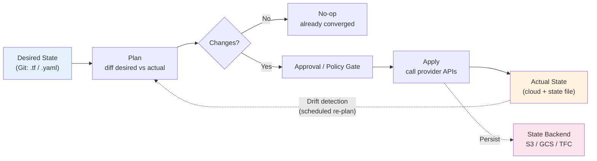
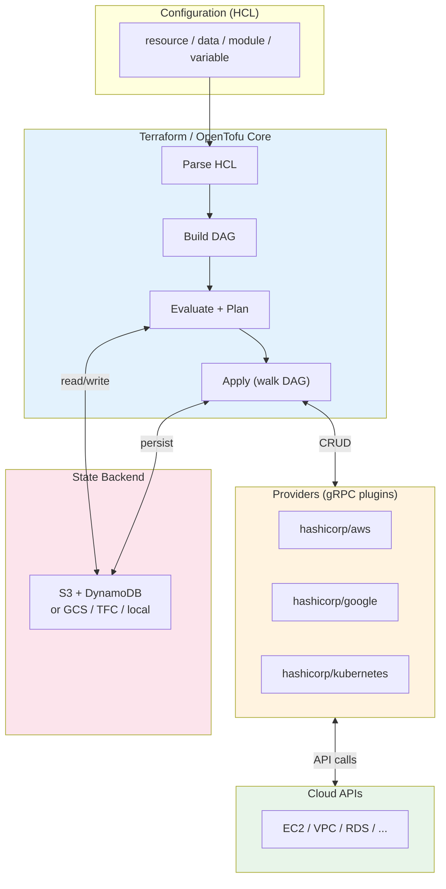
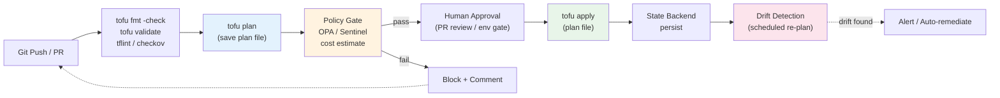
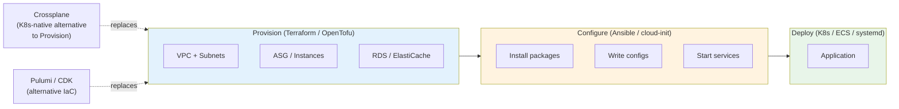
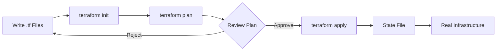
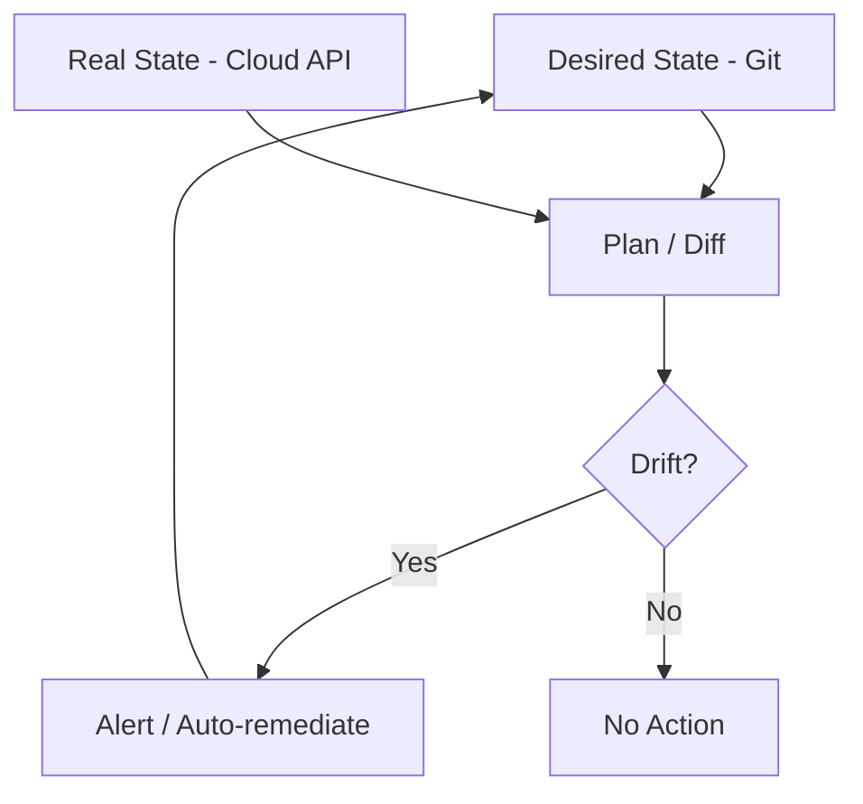
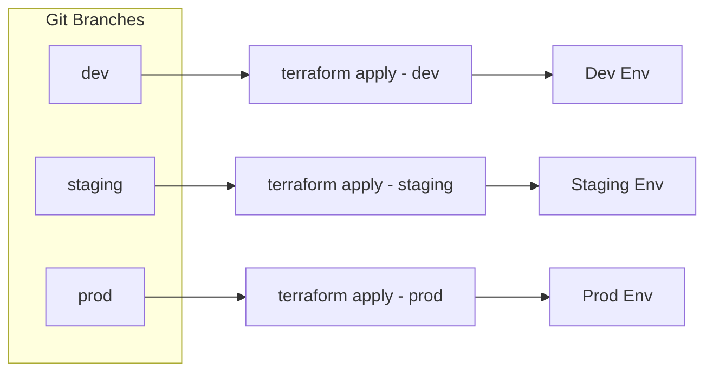

# Chapter 4 — Infrastructure as Code

**What this chapter covers.** ClickOps — provisioning infrastructure by hand in a console — does not survive contact with a team of twenty engineers deploying fifty times a day. Infrastructure as Code (IaC) replaces imperative clicks with declarative, version-controlled definitions that can be reviewed, tested, and reproducibly applied. This chapter builds the mental model and practical toolkit for managing cloud infrastructure as software: the declarative contract and convergence loop that underpins every IaC tool; Terraform and OpenTofu in depth — HCL, providers, resources, state, modules, and backends — with production-grade configurations you can apply to a real AWS account; the CI/CD pipeline that turns `terraform plan` into a safe, auditable change workflow (Atlantis, Terraform Cloud, Spacelift, GitHub Actions); drift detection, policy-as-code, and testing; secrets handling; state refactoring and import; and how IaC fits alongside configuration management (Ansible), cloud CDKs (Pulumi, AWS CDK), and Kubernetes-native provisioning (Crossplane). Every abstraction is grounded in configs that `plan` cleanly and failure modes that have taken down production when ignored.

Learning goals — after this chapter you should be able to:

- Articulate why declarative IaC dominates imperative scripting for fleet-scale infrastructure, and explain idempotency, convergence, and drift in precise terms.
- Write, structure, and operate Terraform/OpenTofu configurations — HCL, providers, resources, data sources, variables, outputs, locals, `count`/`for_each`, dynamic blocks, and modules — that pass `validate` and produce minimal, predictable plans.
- Design remote state with locking (S3 + DynamoDB, GCS, Terraform Cloud), explain the state file's role as a mapping between desired and real, and operate state safely (backups, `moved` blocks, `import`, `state mv/rm`).
- Build an IaC delivery pipeline — branch → plan → policy check → approval → apply — with drift detection, cost estimation, and automated remediation, and choose between directory-per-environment vs. workspace isolation.
- Enforce policy-as-code (OPA/Conftest, Sentinel, Checkov) and test IaC (terraform validate, tflint, Terratest, ephemeral test workspaces) before it reaches production.
- Handle secrets, sensitive outputs, and provider credentials without leaking them into state or logs, and refactor live infrastructure without downtime.

> **Boundary note.** This chapter is the *provisioning* layer — how you declare and converge the infrastructure that workloads run on. Volume 2 — Operating Systems — covers the kernel mechanisms those machines expose; Chapter 1 of this volume covers container images and runtimes that run atop them; Chapters 2–3 cover Kubernetes as the scheduler for those containers. Volume 6 — Distributed Systems — provides the consistency theory behind state backends; Volume 8 — APIs — covers the provider APIs that Terraform calls. For supply-chain concerns specific to IaC modules and providers (typosquatting, compromised registry artifacts), see the Companion Series, Book 2, Chapter 3 and Book 6, Chapter 8.

---

## Why infrastructure as code

### From ClickOps to GitOps

Every infrastructure change is a state transition on a distributed system (the cloud control plane). Doing it by hand in a console has four fatal properties at scale:

| ClickOps | IaC |
|---|---|
| **Undocumented** — the only record is CloudTrail, if enabled | Every change is a commit with author, diff, and review |
| **Unrepeatable** — the next environment is rebuilt from memory | `terraform apply` reproduces the same graph from the same commit |
| **Unreviewable** — no diff before the change | `plan` shows the exact diff; policy gates block violations |
| **Undetectable drift** — a manual tweak diverges silently | Drift detection re-plans on schedule and alerts or re-converges |

The fix is to treat infrastructure definitions as software: versioned in Git, reviewed in pull requests, tested in CI, and applied through an automated pipeline that enforces the same guarantees as application delivery.

### Declarative vs. imperative vs. idempotent

- **Imperative:** "Run these steps in order" (`aws ec2 run-instances ...; aws ec2 create-tags ...`). If a step fails halfway, re-running may duplicate or error. Order matters.
- **Declarative:** "The world should look like this" (`resource "aws_instance" "api" { instance_type = "m5.large" }`). The tool computes the diff between desired and actual and issues the minimal API calls to converge. Re-applying the same declaration is a no-op.
- **Idempotent:** Applying the operation N times has the same effect as applying it once. Declarative IaC is idempotent by construction; imperative scripts must be written carefully to be.

Terraform, OpenTofu, Pulumi (in declarative mode), CloudFormation, and Crossplane are declarative. Ansible is mostly imperative (ordered tasks) with idempotent modules. Shell scripts and AWS CLI invocations are imperative.

### The convergence loop

Every declarative IaC tool implements the same loop, whether it calls it reconciliation, convergence, or apply:



*Figure 4-1: The declarative convergence loop — desired state in Git is diffed against actual state (cloud + state file); the plan is gated and applied; drift detection re-enters the loop on a schedule.*

Drift is the inevitable divergence between desired (Git) and actual (cloud) caused by manual changes, provider-side defaults, or eventual consistency. Without scheduled re-planning, drift accumulates silently until the next apply produces a surprising, large diff.

---

## Terraform and OpenTofu: architecture

### Core, providers, and state

Terraform (HashiCorp, BSL) and OpenTofu (Linux Foundation fork, MPL-2.0, drop-in replacement as of 2024) share the same architecture. The binary is split into:

- **Core** — parses HCL, builds a dependency graph, evaluates expressions, and orchestrates plan/apply. Core has no cloud knowledge.
- **Providers** — plugins (separate binaries, e.g., `registry.opentofu.org/hashicorp/aws`) that implement CRUD for a specific API. Each resource type maps to one or more API calls. Providers are versioned independently and pinned via `required_providers`.
- **State** — a JSON file (`terraform.tfstate`) that maps each `resource` address to the real cloud object ID and its last-known attributes. State is the *only* record linking `aws_instance.api` in config to `i-0a1b2c3d4e5f` in AWS. Lose it, and Terraform forgets what it manages.



*Figure 4-2: Terraform/OpenTofu architecture — core builds a DAG from HCL, providers translate resource operations to cloud API calls, and the state backend persists the desired↔actual mapping.*

### HCL essentials

HCL (HashiCorp Configuration Language) is JSON-superset with expressions, functions, and meta-arguments. Every `.tf` file in a directory is merged into one configuration.

```hcl
# versions.tf — pin everything; unpinned versions are a supply-chain risk
terraform {
  required_version = ">= 1.8"
  required_providers {
    aws = {
      source  = "registry.opentofu.org/hashicorp/aws"
      version = "~> 5.60"
    }
    random = {
      source  = "registry.opentofu.org/hashicorp/random"
      version = "~> 3.6"
    }
  }

  # Remote state — S3 with DynamoDB locking (see State section)
  backend "s3" {
    bucket         = "myorg-tofu-state"
    key            = "prod/network/terraform.tfstate"
    region         = "us-east-1"
    dynamodb_table = "tofu-state-lock"
    encrypt        = true
  }
}

provider "aws" {
  region = var.region
  default_tags {
    tags = {
      Project     = "platform"
      Environment = var.environment
      ManagedBy   = "opentofu"
    }
  }
}
```

```hcl
# variables.tf — typed inputs with validation
variable "region" {
  type        = string
  default     = "us-east-1"
  description = "AWS region for all resources"
}

variable "environment" {
  type        = string
  description = "Deployment environment"
  validation {
    condition     = contains(["dev", "staging", "prod"], var.environment)
    error_message = "Environment must be dev, staging, or prod."
  }
}

variable "vpc_cidr" {
  type    = string
  default = "10.0.0.0/16"
  validation {
    condition     = can(cidrhost(var.vpc_cidr, 0))
    error_message = "Must be a valid CIDR block."
  }
}

variable "az_count" {
  type    = number
  default = 3
  validation {
    condition     = var.az_count >= 2 && var.az_count <= 4
    error_message = "Use 2-4 AZs."
  }
}

# locals.tf — derived values, not inputs
locals {
  azs = slice(data.aws_availability_zones.available.names, 0, var.az_count)
  common_tags = {
    Environment = var.environment
    ManagedBy   = "opentofu"
  }
}

data "aws_availability_zones" "available" {
  state = "available"
}

output "vpc_id" {
  description = "ID of the created VPC"
  value       = aws_vpc.main.id
}

output "private_subnet_ids" {
  value = aws_subnet.private[*].id
}
```

```hcl
# network.tf — the actual infrastructure
resource "aws_vpc" "main" {
  cidr_block           = var.vpc_cidr
  enable_dns_hostnames = true
  enable_dns_support   = true
  tags = merge(local.common_tags, { Name = "${var.environment}-main" })
}

resource "aws_subnet" "private" {
  count             = var.az_count
  vpc_id            = aws_vpc.main.id
  cidr_block        = cidrsubnet(var.vpc_cidr, 8, count.index)
  availability_zone = local.azs[count.index]
  tags = merge(local.common_tags, {
    Name = "${var.environment}-private-${local.azs[count.index]}"
    Type = "private"
  })
}

resource "aws_subnet" "public" {
  count                   = var.az_count
  vpc_id                  = aws_vpc.main.id
  cidr_block              = cidrsubnet(var.vpc_cidr, 8, count.index + var.az_count)
  availability_zone       = local.azs[count.index]
  map_public_ip_on_launch = false
  tags = merge(local.common_tags, {
    Name = "${var.environment}-public-${local.azs[count.index]}"
    Type = "public"
  })
}

resource "aws_internet_gateway" "main" {
  vpc_id = aws_vpc.main.id
  tags   = merge(local.common_tags, { Name = "${var.environment}-igw" })
}

resource "aws_eip" "nat" {
  count  = var.az_count
  domain = "vpc"
  tags   = merge(local.common_tags, { Name = "${var.environment}-nat-${count.index}" })
}

resource "aws_nat_gateway" "main" {
  count         = var.az_count
  allocation_id = aws_eip.nat[count.index].id
  subnet_id     = aws_subnet.public[count.index].id
  tags          = merge(local.common_tags, { Name = "${var.environment}-nat-${count.index}" })
  depends_on    = [aws_internet_gateway.main]
}

resource "aws_route_table" "private" {
  count  = var.az_count
  vpc_id = aws_vpc.main.id
  route {
    cidr_block     = "0.0.0.0/0"
    nat_gateway_id = aws_nat_gateway.main[count.index].id
  }
  tags = merge(local.common_tags, { Name = "${var.environment}-private-rt-${count.index}" })
}

resource "aws_route_table_association" "private" {
  count          = var.az_count
  subnet_id      = aws_subnet.private[count.index].id
  route_table_id = aws_route_table.private[count.index].id
}
```

### Meta-arguments: count, for_each, lifecycle, depends_on

```hcl
# for_each — preferred over count when managing named instances
variable "services" {
  type = map(object({
    port        = number
    health_path = string
    cpu         = number
    memory      = number
  }))
  default = {
    api    = { port = 8080, health_path = "/healthz", cpu = 512, memory = 1024 }
    worker = { port = 8081, health_path = "/healthz", cpu = 256, memory = 512 }
  }
}

resource "aws_security_group" "service" {
  for_each = var.services
  name     = "${var.environment}-${each.key}-sg"
  vpc_id   = aws_vpc.main.id

  ingress {
    from_port   = each.value.port
    to_port     = each.value.port
    protocol    = "tcp"
    cidr_blocks = [var.vpc_cidr]
    description = "Allow ${each.key} on ${each.value.port}"
  }
  egress {
    from_port   = 0
    to_port     = 0
    protocol    = "-1"
    cidr_blocks = ["0.0.0.0/0"]
  }
  tags = local.common_tags
}

# dynamic blocks — generate repeated nested blocks
variable "ingress_rules" {
  type = list(object({
    port        = number
    protocol    = string
    cidr_blocks = list(string)
    description = string
  }))
  default = []
}

resource "aws_security_group" "dynamic_example" {
  name   = "${var.environment}-dynamic-sg"
  vpc_id = aws_vpc.main.id

  dynamic "ingress" {
    for_each = var.ingress_rules
    content {
      from_port   = ingress.value.port
      to_port     = ingress.value.port
      protocol    = ingress.value.protocol
      cidr_blocks = ingress.value.cidr_blocks
      description = ingress.value.description
    }
  }
}

# lifecycle — control replacement and drift behavior
resource "aws_instance" "api" {
  ami           = data.aws_ami.amazon_linux.id
  instance_type = "m7i.large"
  subnet_id     = aws_subnet.private[0].id

  lifecycle {
    create_before_destroy = true          # for ASG/launch template rolls
    prevent_destroy       = true          # guard prod DB/infra from accidental destroy
    ignore_changes        = [ami]         # AMI updated out-of-band by image pipeline
    replace_triggered_by  = [aws_launch_template.api.id] # force replacement when LT changes
  }
}
```

Rules of thumb:

- Prefer `for_each` over `count` when instances have identity (named services, per-AZ resources). `count` re-indexes on removal, causing spurious replacements; `for_each` keys are stable.
- Use `lifecycle.ignore_changes` sparingly — it hides drift. Prefer fixing the source of drift.
- `depends_on` is rarely needed — Terraform infers dependencies from interpolations (`aws_vpc.main.id`). Use it only for hidden dependencies (NAT gateway needs IGW attachment to complete first).

---

## State: the source of truth you must not lose

### Why state exists

Cloud APIs are eventually consistent and have no declarative "desired state" — they only know the current state. State bridges the gap: it records what Terraform *last* created so the next plan can diff desired vs. actual. Without it, Terraform would have to list every cloud object and guess which ones it owns.

State is JSON, roughly:

```json
{
  "version": 4,
  "resources": [{
    "mode": "managed", "type": "aws_vpc", "name": "main",
    "provider": "registry.opentofu.org/hashicorp/aws",
    "instances": [{ "attributes": { "id": "vpc-0a1b2c", "cidr_block": "10.0.0.0/16" }}]
  }]
}
```

### Remote backends and locking

Local state (`terraform.tfstate` on disk) is unsuitable for teams — no sharing, no locking, secrets in plaintext on a laptop. Production always uses a remote backend with locking:

```hcl
# S3 + DynamoDB (AWS) — the most common pattern
terraform {
  backend "s3" {
    bucket         = "myorg-tofu-state"
    key            = "prod/network/terraform.tfstate"
    region         = "us-east-1"
    dynamodb_table = "tofu-state-lock"   # conditional writes for locking
    encrypt        = true                 # SSE-S3 or SSE-KMS
  }
}

# GCS (GCP) — locking is native via object preconditions
terraform {
  backend "gcs" {
    bucket = "myorg-tofu-state"
    prefix = "prod/network"
  }
}

# Terraform Cloud / Spacelift — managed state, run history, policy gates
terraform {
  cloud {
    organization = "myorg"
    workspaces { name = "network-prod" }
  }
}
```

| Backend | Locking | Versioning | Encryption | Notes |
|---|---|---|---|---|
| S3 + DynamoDB | DynamoDB conditional write | S3 versioning | SSE-S3 / KMS | Most common on AWS; set `encrypt = true` + bucket versioning |
| GCS | Native (preconditions) | GCS versioning | Google-managed / CMEK | No extra lock table needed |
| Terraform Cloud | Managed | Managed | Managed | Adds run history, variables, policy sets, drift detection |
| Local | None | None | None | Dev only; never for shared stacks |

State locking prevents two `apply` runs from concurrently mutating the same state and corrupting it. If a run crashes holding the lock, `terraform force-unlock <lock-id>` releases it — but only after confirming no other run is active.

### State operations

```bash
# Inspect state
tofu state list
# aws_vpc.main
# aws_subnet.private[0]
# aws_subnet.private[1]

tofu state show aws_vpc.main

# Import an existing resource created outside Terraform (e.g., ClickOps VPC)
tofu import aws_vpc.main vpc-0a1b2c3d4e5f

# Modern import block (declarative, reviewable in PR) — preferred over CLI import
# imports.tf
import {
  to = aws_vpc.main
  id = "vpc-0a1b2c3d4e5f"
}

# Move/rename without destroying — e.g., refactoring into a module
tofu state mv aws_subnet.private module.network.aws_subnet.private

# Declarative move (Terraform 1.1+ / OpenTofu) — reviewable, no CLI needed
moved {
  from = aws_subnet.private
  to   = module.network.aws_subnet.private
}

# Remove from state without destroying the real object (hand off to another stack)
tofu state rm aws_eip.nat[2]

# Pull/push for disaster recovery (rare — prefer backend replication)
tofu state pull > backup.tfstate
tofu state push backup.tfstate
```

Treat state as critical data: enable versioning on the bucket, replicate cross-region, restrict IAM to the CI role only, and never commit it to Git. State contains secrets in plaintext (see Secrets section).

### Workspaces vs. directory-per-environment

Two patterns for managing `dev`/`staging`/`prod`:

- **Directory-per-environment** (recommended) — `envs/dev/`, `envs/prod/` each with their own backend key and `terraform.tfvars`. Clear isolation, different IAM roles per env, no risk of `terraform workspace select` mistakes. Each directory is an independent root module.
- **Workspaces** (`terraform workspace new prod`) — same config, different state file keyed by workspace name. Convenient but error-prone: a forgotten `workspace select` applies prod config to dev state. Suitable only for ephemeral, identical environments (per-PR preview).

```
repo/
├── modules/
│   ├── network/        # reusable VPC module
│   ├── compute/        # ASG / ECS module
│   └── database/       # RDS module
├── envs/
│   ├── dev/
│   │   ├── main.tf     # calls modules/network with dev vars
│   │   ├── variables.tf
│   │   └── terraform.tfvars  # dev-specific values
│   ├── staging/
│   │   └── ...
│   └── prod/
│       ├── main.tf
│       └── terraform.tfvars
└── imports.tf          # one-off import blocks, removed after apply
```

---

## Modules: packaging reusable infrastructure

A module is a directory of `.tf` files with inputs (`variable`), outputs (`output`), and resources. Every root configuration is itself a module.

```hcl
# modules/network/variables.tf
variable "environment" { type = string }
variable "vpc_cidr"    { type = string }
variable "az_count"    { type = number default = 3 }
variable "enable_nat"  { type = bool   default = true }

# modules/network/main.tf  (the VPC + subnets from above, parameterized)
# ... (aws_vpc, aws_subnet, aws_nat_gateway, etc.)

# modules/network/outputs.tf
output "vpc_id"             { value = aws_vpc.main.id }
output "private_subnet_ids" { value = aws_subnet.private[*].id }
output "public_subnet_ids"  { value = aws_subnet.public[*].id }
output "nat_gateway_ids"    { value = aws_nat_gateway.main[*].id }

# envs/prod/main.tf — consuming the module
module "network" {
  source      = "../../modules/network"
  environment = "prod"
  vpc_cidr    = "10.0.0.0/16"
  az_count    = 3
  enable_nat  = true
}

module "database" {
  source     = "../../modules/database"
  vpc_id     = module.network.vpc_id
  subnet_ids = module.network.private_subnet_ids
  # ...
}
```

Module sources:

```hcl
module "vpc" {
  source  = "terraform-aws-modules/vpc/aws"   # Terraform Registry
  version = "~> 5.0"
}

module "network" {
  source = "git::https://github.com/myorg/tf-modules.git//network?ref=v2.1.0"  # Git
}

module "network" {
  source = "../../modules/network"  # local path
}
```

Best practices:

- Pin every external module to a version or commit SHA — unpinned `source = "github.com/...//network"` fetches `main` and breaks reproducibly.
- Keep modules small and composable (network, compute, database) rather than one mega-module.
- Expose only necessary variables; validate them. Use `nullable = false` and `validation` blocks.
- Publish internal modules to a private registry (Terraform Cloud private registry, or Git tags) so consumers get versioned, discoverable artifacts.

---

## The IaC delivery pipeline

### Plan → policy → approve → apply

The production pipeline mirrors application CI/CD but with an extra safety property: the plan is the change, and it must be reviewed before apply. No `apply` without a prior `plan` from the same commit.



*Figure 4-3: The IaC delivery pipeline — every commit is formatted, validated, planned, policy-checked, approved, and applied from the saved plan file; drift detection re-plans on a schedule.*

```yaml
# .github/workflows/tofu-plan.yaml — plan on PR, apply on merge to main
name: tofu-plan-apply
on:
  pull_request:
    paths: ["envs/**", "modules/**"]
  push:
    branches: [main]
    paths: ["envs/**", "modules/**"]

jobs:
  plan:
    if: github.event_name == 'pull_request'
    runs-on: ubuntu-latest
    permissions:
      contents: read
      pull-requests: write
      id-token: write          # OIDC to AWS — no static credentials
    strategy:
      matrix:
        env: [dev, staging, prod]
    steps:
      - uses: actions/checkout@v4
      - uses: opentofu/setup-opentofu@v1
        with: { tofu_version: "1.8.5" }
      - uses: aws-actions/configure-aws-credentials@v4
        with:
          role-to-assume: arn:aws:iam::123456789012:role/tofu-plan-${{ matrix.env }}
          aws-region: us-east-1

      - run: tofu fmt -check -recursive
      - run: tofu init -backend-config="key=${{ matrix.env }}/terraform.tfstate"
        working-directory: envs/${{ matrix.env }}
      - run: tofu validate
        working-directory: envs/${{ matrix.env }}
      - run: tflint --init && tflint
        working-directory: envs/${{ matrix.env }}
      - run: tofu plan -out=tfplan -input=false
        working-directory: envs/${{ matrix.env }}
      # Post plan as PR comment for review
      - uses: borchero/terraform-plan-comment@v2
        with:
          working-directory: envs/${{ matrix.env }}
          planfile: tfplan

  apply:
    if: github.event_name == 'push' && github.ref == 'refs/heads/main'
    runs-on: ubuntu-latest
    needs: []  # or gate on plan success via workflow_run
    environment: prod   # GitHub environment protection — requires approval
    permissions: { contents: read, id-token: write }
    steps:
      - uses: actions/checkout@v4
      - uses: opentofu/setup-opentofu@v1
      - uses: aws-actions/configure-aws-credentials@v4
        with:
          role-to-assume: arn:aws:iam::123456789012:role/tofu-apply-prod
          aws-region: us-east-1
      - run: tofu init -backend-config="key=prod/terraform.tfstate"
        working-directory: envs/prod
      - run: tofu apply -input=false -auto-approve tfplan
        working-directory: envs/prod
```

### Atlantis, Terraform Cloud, Spacelift — managed runners

Running `plan`/`apply` on a developer laptop is unsafe (stale state, leaked credentials, no audit). Managed runners enforce the pipeline:

| Runner | Model | Drift detection | Policy | Notes |
|---|---|---|---|---|
| **Atlantis** | Self-hosted, runs as a GitHub/GitLab webhook; `plan` on PR, `apply` via comment | No (add cron) | Conftest/Checkov via custom workflow | Open-source, you operate it; needs locking |
| **Terraform Cloud (TFC)** | SaaS; VCS-driven runs, remote execution, private registry | Native (health checks) | Sentinel (paid) + OPA | Remote state + run history built-in |
| **Spacelift** | SaaS; stack-per-directory, dependencies between stacks | Native | OPA natively, drift remediation | Strong multi-stack orchestration |
| **Digger / Terrateam** | GitHub Actions-native; plan/apply in Actions | Via Actions cron | OPA/Checkov | Lightweight, no extra service |

Atlantis workflow in `atlantis.yaml`:

```yaml
version: 3
projects:
  - name: network-prod
    dir: envs/prod
    workspace: default
    workflow: prod
    autoplan:
      when_modified: ["*.tf", "*.tfvars", "../../modules/network/**/*.tf"]
workflows:
  prod:
    plan:
      steps:
        - run: tofu fmt -check
        - init
        - plan
        - run: conftest test --policy policy/ plan.json
    apply:
      steps: [apply]
```

---

## Drift detection and reconciliation

Drift happens. Someone changes a security group in the console during an incident and forgets to revert; a provider default changes; an AWS-managed update modifies a resource out-of-band. Without detection, the next `plan` is a surprise.

```bash
# Scheduled drift detection — run plan on cron, alert if non-empty
# GitHub Actions cron (daily 06:00 UTC)
# .github/workflows/drift-detection.yaml
name: drift-detection
on:
  schedule: [{ cron: "0 6 * * *" }]
  workflow_dispatch:
jobs:
  drift:
    runs-on: ubuntu-latest
    strategy: { matrix: { env: [dev, staging, prod] } }
    steps:
      - uses: actions/checkout@v4
      - uses: opentofu/setup-opentofu@v1
      - uses: aws-actions/configure-aws-credentials@v4
        with: { role-to-assume: arn:aws:iam::123456789012:role/tofu-plan-${{ matrix.env }}, aws-region: us-east-1 }
      - run: tofu init -backend-config="key=${{ matrix.env }}/terraform.tfstate"
        working-directory: envs/${{ matrix.env }}
      - run: tofu plan -detailed-exitcode -input=false
        id: plan
        working-directory: envs/${{ matrix.env }}
      # exit 0 = no changes, 1 = error, 2 = drift detected
      - if: steps.plan.outputs.exitcode == '2'
        run: |
          echo "::warning::Drift detected in ${{ matrix.env }}"
          # Post to Slack / PagerDuty / create an issue
          gh issue create --title "Drift detected: ${{ matrix.env }}" --body "Plan shows unexpected changes"
```

Terraform Cloud and Spacelift have native drift detection (health assessments) that run `plan` on a schedule and surface drift in the UI. For self-hosted setups, the cron workflow above plus `driftctl` (now part of Snyk) provides deeper detection by scanning the cloud account directly, catching resources Terraform does not manage at all.

Remediation choices:

- **Alert-only** — notify and let a human reconcile Git to match reality (safe, auditable).
- **Auto-remediate** — automatically `apply` to re-converge (fast, but risks reverting an intentional hotfix during an incident). Prefer alert-only for production; auto-remediate only for tightly controlled, non-critical stacks.

---

## Policy as code and testing

### Policy gates

Policy-as-code blocks non-compliant plans before they apply. Common controls: no public S3 buckets, no `0.0.0.0/0` ingress, mandatory tags, approved instance families, encrypted volumes.

```rego
# policy/deny_public_s3.rego — OPA/Conftest
package main

deny contains msg if {
  rc := input.resource_changes[_]
  rc.type == "aws_s3_bucket_public_access_block"
  # Every S3 bucket must have a public_access_block
  not rc.change.after.block_public_acls
  msg := sprintf("S3 bucket %q must block public ACLs", [rc.address])
}

deny contains msg if {
  rc := input.resource_changes[_]
  rc.type == "aws_security_group"
  ingress := rc.change.after.ingress[_]
  ingress.cidr_blocks[_] == "0.0.0.0/0"
  ingress.from_port == 22
  msg := sprintf("Security group %q allows SSH from 0.0.0.0/0", [rc.address])
}

deny contains msg if {
  rc := input.resource_changes[_]
  rc.type == "aws_db_instance"
  not rc.change.after.storage_encrypted
  msg := sprintf("RDS instance %q must have storage_encrypted = true", [rc.address])
}
```

```bash
# Run in CI — convert plan to JSON, evaluate against policy
tofu show -json tfplan > plan.json
conftest test --policy policy/ plan.json
# FAIL - plan.json - main - S3 bucket "aws_s3_bucket.data" must block public ACLs
```

Alternatives: **Sentinel** (TFC-native, similar to Rego), **Checkov** / **tfsec** (static analysis on HCL, no plan needed — `checkov -d envs/prod`), **OPA via Spacelift** (native integration).

### Testing IaC

| Layer | Tool | What it checks | When |
|---|---|---|---|
| **Format/lint** | `tofu fmt -check`, `tflint` | Syntax, naming, provider rules | Every PR |
| **Validate** | `tofu validate` | HCL validity, variable types | Every PR |
| **Static analysis** | Checkov, tfsec, KICS | Security/compliance on HCL | Every PR |
| **Policy gate** | Conftest/OPA, Sentinel | Plan JSON against org policy | Every plan |
| **Unit test** | `tofu test` (1.6+) / Terratest | Resource attributes after apply in ephemeral env | PR or nightly |
| **Integration** | Terratest (Go), Kitchen-Terraform | Real infra in a sandbox account, then destroy | Nightly / on module release |

```hcl
# tests/network.tftest.hcl — native tofu test (1.6+, also in OpenTofu)
run "vpc_has_correct_cidr" {
  command = plan
  variables { environment = "test", vpc_cidr = "10.1.0.0/16", az_count = 2 }
  assert {
    condition     = aws_vpc.main.cidr_block == "10.1.0.0/16"
    error_message = "VPC CIDR mismatch"
  }
  assert {
    condition     = length(aws_subnet.private) == 2
    error_message = "Expected 2 private subnets"
  }
}

run "vpc_tags_present" {
  command = plan
  assert {
    condition     = aws_vpc.main.tags["ManagedBy"] == "opentofu"
    error_message = "Missing ManagedBy tag"
  }
}
```

```go
// terratest — Go integration test that applies, validates, and destroys
func TestNetworkModule(t *testing.T) {
  opts := &terraform.Options{
    TerraformDir: "../envs/dev",
    Vars: map[string]interface{}{
      "environment": "test",
      "vpc_cidr":    "10.1.0.0/16",
    },
  }
  defer terraform.Destroy(t, opts)
  terraform.InitAndApply(t, opts)
  vpcID := terraform.Output(t, opts, "vpc_id")
  assert.NotEmpty(t, vpcID)
  // Verify via AWS API
  subnets := aws.GetSubnetsForVpc(t, vpcID, "us-east-1")
  assert.Equal(t, 3, len(subnets))
}
```

Run `tofu test` is fast (no real apply) and catches logic errors; Terratest is slow (real apply/destroy, ~2–5 min) but catches provider and IAM errors. Use both: `tofu test` on every PR, Terratest nightly or on module version bumps.

---

## Secrets and sensitive data

State is the Achilles' heel: every resource attribute — including passwords, keys, and tokens — is stored in plaintext in the state file. Anyone with state read access sees all secrets.

```hcl
# BAD — password in plaintext in config and state
resource "aws_db_instance" "main" {
  password = "supersecret123"  # committed to Git, stored in state, shown in plan
}

# GOOD — generate or fetch, mark sensitive, use a secrets manager
resource "random_password" "db" {
  length  = 32
  special = true
}

resource "aws_secretsmanager_secret" "db" {
  name = "${var.environment}/db/password"
  tags = local.common_tags
}

resource "aws_secretsmanager_secret_version" "db" {
  secret_id     = aws_secretsmanager_secret.db.id
  secret_string = random_password.db.result
}

resource "aws_db_instance" "main" {
  # Reference the secret version — the password still appears in state via
  # aws_db_instance.password, but at least it was never in Git.
  # For stronger isolation, create the DB outside Terraform and inject via secrets manager.
  password = random_password.db.result  # still in state — see mitigations below
  lifecycle { ignore_changes = [password] } # avoid perpetual diff if rotated externally
}

# Mark outputs sensitive so they are redacted in CLI output
output "db_password" {
  value     = random_password.db.result
  sensitive = true
}

# Variables that carry secrets
variable "github_token" {
  type      = string
  sensitive = true  # redacted in plan/apply output
}
```

Mitigations, in order of strength:

1. **Do not put secrets in Terraform at all** — create the secret out-of-band (manual, or a separate secrets-management pipeline) and reference it via `data "aws_secretsmanager_secret_version"` (read-only). The secret value still briefly appears in state if any resource consumes it, but the source of truth is outside IaC.
2. **Encrypt state at rest** — `encrypt = true` on the S3 backend (KMS), GCS CMEK, or TFC encryption. This protects against bucket exfiltration but not against anyone with state read IAM.
3. **Restrict state access** — IAM policy allowing `s3:GetObject` on the state bucket only to the CI runner role; no human `GetObject`. Use `terraform_cloud` remote execution so humans never download state.
4. **Use ephemeral values** (Terraform 1.10+ / OpenTofu) — `ephemeral` resources and `write-only` arguments that never persist to state. Emerging pattern for secrets — track provider support.
5. **Rotate after exposure** — if state was ever stored unencrypted or committed to Git, rotate every secret that appeared in it.

Provider credentials themselves should never be in config — use OIDC federation (GitHub Actions → AWS IAM role via `id-token: write`), environment variables, or a credentials helper. Never `provider "aws" { access_key = "..." }`.

---

## Refactoring, import, and lifecycle management

Infrastructure lives for years; the IaC that describes it must be refactored without destroying what it manages.

```hcl
# Rename a resource address without destroying — declarative (1.1+)
moved {
  from = aws_instance.api
  to   = aws_instance.api_v2
}

# Move into a module
moved {
  from = aws_vpc.main
  to   = module.network.aws_vpc.main
}

# Change a resource type (rare, e.g., aws_s3_bucket → module)
moved {
  from = aws_s3_bucket.data
  to   = module.storage.aws_s3_bucket.this[0]
}

# Import existing infrastructure declaratively
import {
  to = aws_vpc.existing
  id = "vpc-0a1b2c3d4e5f"
}
# Then run plan — Terraform shows the diff between the imported actual and desired,
# so you can adjust config until plan is clean before applying.

# Remove from management without destroying (hand off or decommission outside IaC)
removed {
  from = aws_eip.legacy
  lifecycle { destroy = false }  # keep the real EIP, just stop managing it
}
```

Operational tips:

- Always `plan` after a `moved` or `import` block before `apply` — verify the diff is empty or minimal.
- For large refactors, move one resource type at a time and apply incrementally.
- `terraform state mv` / `import` CLI commands still work but are not reviewable — prefer the declarative blocks in Git.
- When renaming a `for_each` key, Terraform sees it as destroy+create (different key) — use `moved` with the old and new key: `moved { from = aws_security_group.service["old"] to = aws_security_group.service["new"] }`.

---

## Alternatives and complements

| Tool | Language | State | Strength | Weakness |
|---|---|---|---|---|
| **Terraform / OpenTofu** | HCL | Remote (S3/GCS/TFC) | Largest provider ecosystem, mature, declarative | HCL is not a general-purpose language; complex logic is awkward |
| **Pulumi** | TypeScript, Python, Go, etc. | Pulumi Cloud / S3 / local | Real language, loops, tests, IDE support | Smaller provider coverage; state model less transparent |
| **AWS CDK / CDKTF** | TypeScript/Python (CDK), HCL synth (CDKTF) | CloudFormation / Terraform state | Best for AWS-native stacks; constructs are high-level | AWS-centric; abstraction leaks when you need raw control |
| **Crossplane** | YAML (K8s CRDs) | etcd (K8s state) | K8s-native, GitOps with ArgoCD/Flux, drift via controllers | K8s required; provider maturity varies |
| **Ansible** | YAML (playbooks) | None (push-based) | Great for config management inside VMs; agentless | Not declarative for infra; no state/drift tracking |
| **CloudFormation / SAM** | YAML/JSON | AWS-managed | No state to operate; rollback native | AWS-only, verbose, slower iteration |

Choosing:

- **Default to Terraform/OpenTofu** for cloud infrastructure — the provider ecosystem and module registry are unmatched, and every cloud hire knows it.
- **Use Pulumi** when your infra logic is complex (dynamic graph construction, heavy abstraction) and your team prefers a real language.
- **Use Crossplane** when you already run Kubernetes and want infra as K8s objects reconciled by controllers (platform teams exposing `XRD`/`Composition` to tenants).
- **Use Ansible** for *configuration inside* the machines Terraform provisions (install packages, write configs, start services) — not for provisioning the machines themselves. The classic split: Terraform provisions, Ansible configures.



*Figure 4-4: The provisioning → configuration → deployment pipeline — Terraform/OpenTofu provisions the infrastructure, Ansible or cloud-init configures the machines, and the scheduler deploys the application; Crossplane and Pulumi/CDK are alternative provisioning paths.*

---

## Anti-patterns and operational lessons

**Unpinned providers and modules.** `source = "terraform-aws-modules/vpc/aws"` without `version` fetches the latest on every `init` — a breaking change can silently alter your next plan. Always pin: `version = "~> 5.0"` or `?ref=v2.1.0`.

**Monolithic root module.** One directory with 200 resources, one state file, one blast radius. A bad apply touches everything; plan takes minutes; locking blocks all teams. Split by blast radius and lifecycle: `network` (rarely changes), `compute` (frequently), `data` (stateful, guarded).

**State in Git.** Committing `terraform.tfstate` to Git leaks secrets and creates merge conflicts. Use a remote backend from day one.

**Manual console fixes without back-porting.** An on-call engineer opens a security group in the console to restore traffic, then forgets to commit the fix. Drift detection catches it — but only if you run it.

**`count` with unstable ordering.** `count = length(var.subnets)` where `var.subnets` is a list that can reorder — removing the first element shifts every index, causing Terraform to destroy and recreate all subsequent resources. Use `for_each` with stable keys.

**Ignoring plan output.** Approving a plan without reading it. A plan that says `forces replacement` on a database means downtime and data loss. Require plan review and policy gates; block `forces replacement` on stateful resources via policy.

**No `prevent_destroy` on stateful resources.** One `terraform destroy` or a bad `for_each` key change deletes the production database. Set `lifecycle { prevent_destroy = true }` on every stateful resource and require an explicit config change to remove it.

---

## Key takeaways

- IaC replaces imperative ClickOps with declarative, versioned, reviewable definitions that converge actual state toward desired state via a plan/apply loop with drift detection.
- Terraform/OpenTofu's architecture — core + providers + remote state — is the de facto standard; pin providers and modules, use HCL's type system and validation, and prefer `for_each` over `count` for named resources.
- State is critical data — encrypt it, version it, lock it, and restrict access; never commit it to Git and assume every secret that touches a resource appears in state.
- The delivery pipeline is `fmt → validate → plan → policy gate → approval → apply (from saved plan)`; managed runners (Atlantis, TFC, Spacelift) enforce it, and scheduled re-planning catches drift.
- Policy-as-code (OPA/Conftest, Sentinel, Checkov) and testing (`tofu test`, Terratest) shift compliance and correctness left — block violations before they reach the cloud.
- Refactor safely with declarative `moved`/`import`/`removed` blocks and `lifecycle` guards; split stacks by blast radius and lifecycle, not into one monolithic root.
- Choose the right tool for the layer: Terraform/OpenTofu for provisioning, Ansible/cloud-init for host configuration, and Crossplane or Pulumi when K8s-native or general-purpose-language ergonomics justify the trade-off.

## Further reading

- OpenTofu documentation — https://opentofu.org/docs/ (language, CLI, state, modules, backends)
- Terraform documentation — https://developer.hashicorp.com/terraform/docs (providers, registry, CDKTF)
- Terraform AWS Provider — https://registry.terraform.io/providers/hashicorp/aws/latest/docs
- Atlantis — https://www.runatlantis.io/docs
- OPA / Rego — https://www.openpolicyagent.org/docs/latest/policy-language/
- Checkov — https://www.checkov.io/ and tfsec — https://aquasecurity.github.io/tfsec/
- Terratest — https://terratest.gruntwork.io/docs/
- Pulumi vs. Terraform — https://www.pulumi.com/docs/concepts/vs/terraform/
- Crossplane — https://docs.crossplane.io/latest/
- Infracost (cost estimation in plan) — https://www.infracost.io/docs/

### Terraform workflow lifecycle



### IaC drift detection loop



### Environment promotion with IaC


