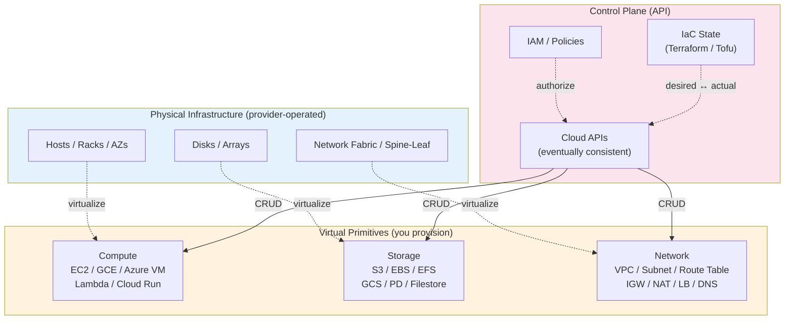
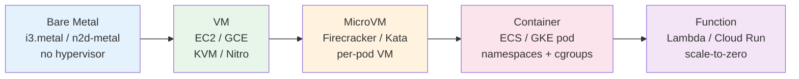
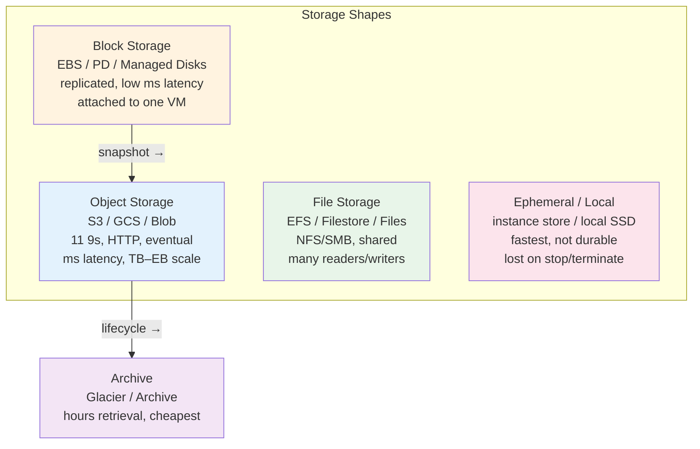
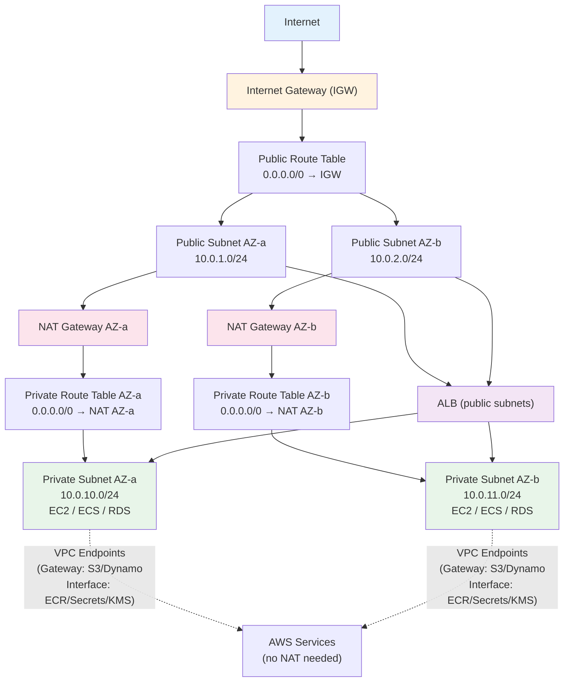
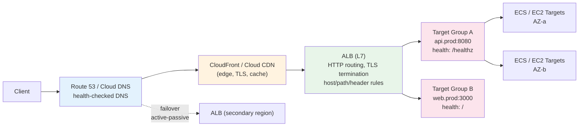
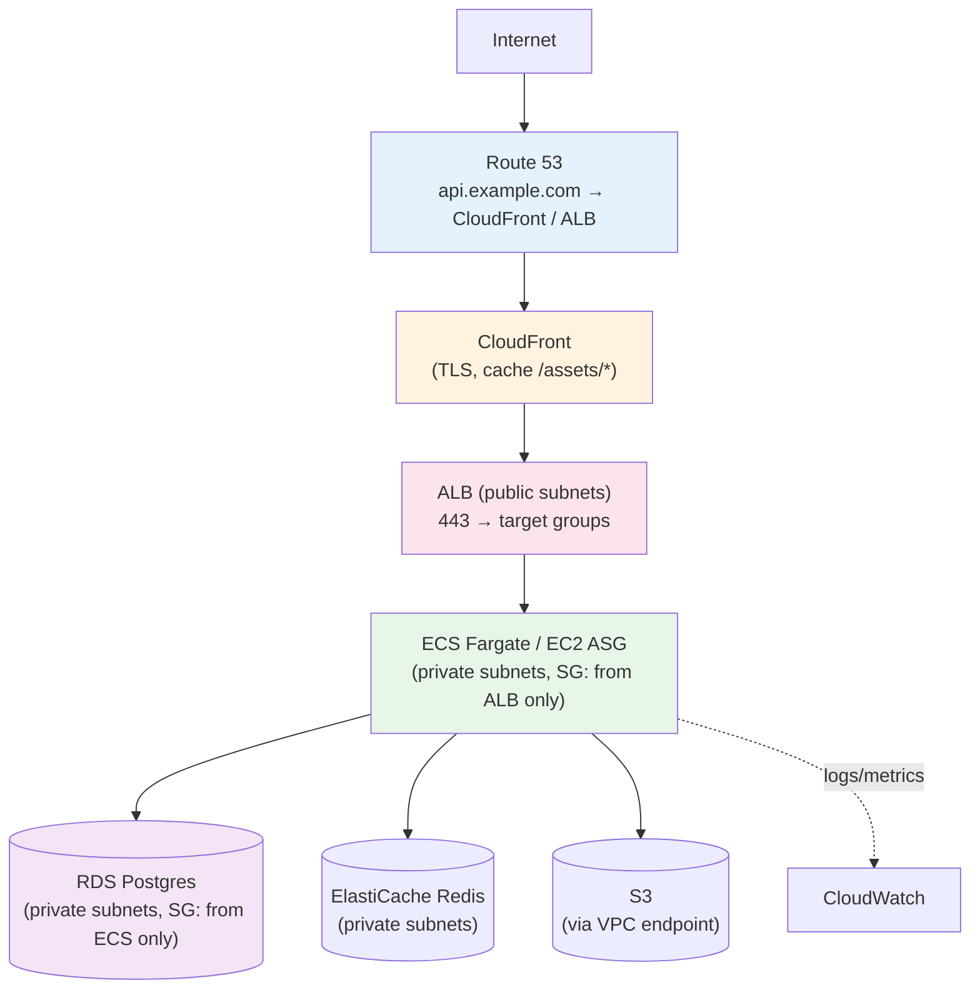
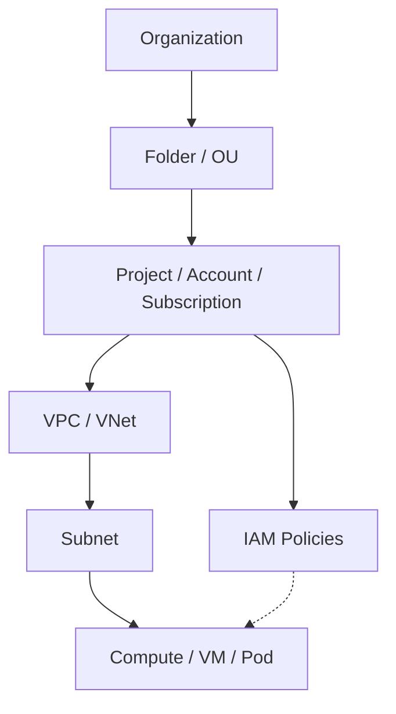

# Chapter 5 — Cloud Primitives: Compute, Storage, and Network

**What this chapter covers.** Every cloud workload — whether it runs on Kubernetes, on VMs, or on managed services — composes the same three primitives: compute that runs code, storage that persists bytes, and network that moves packets between them. The primitives differ across providers in naming and API but converge on architecture: virtualized compute with varying isolation (VMs, containers, functions), storage with distinct durability/latency/consistency trade-offs (object, block, file, ephemeral), and a software-defined network (VPC, subnets, routing, load balancing, DNS, CDN) that gives you a private data center inside a shared physical fabric. This chapter builds the mental model for each primitive, shows how cloud providers actually implement them (AWS as primary, with GCP/Azure mappings), and grounds every abstraction in production-grade Terraform/OpenTofu and cloud-native configs you can apply — including the failure modes that only appear at scale.

Learning goals — after this chapter you should be able to:

- Model the compute spectrum — bare metal, VMs, containers, functions — and choose the right primitive for a workload based on isolation, start latency, cost, and operational overhead.
- Provision and operate EC2 (and its GCP/Azure equivalents) with launch templates, auto scaling, placement, tenancy, and lifecycle hooks, and explain what actually happens when a VM boots inside a VPC.
- Distinguish object (S3/GCS), block (EBS/PD), file (EFS/Filestore), and ephemeral storage by durability, latency, consistency, and access pattern, and select correctly for databases, assets, shared state, and scratch.
- Design a VPC — CIDR planning, subnets, AZs, route tables, NAT, Internet and VPC endpoints, peering vs. Transit Gateway, PrivateLink — and reason about packet flow from public internet to private subnet.
- Configure L4 and L7 load balancing (NLB/ALB, GLB/ALB equivalents), DNS, and CDN (CloudFront/Cloud CDN) with health checks, TLS termination, and failover, and explain how they compose with the VPC data path.
- Apply cost and resilience trade-offs across primitives — Spot/Preemptible, Savings Plans, storage tiers, NAT Gateway vs. NAT instance, single-AZ vs. multi-AZ — and avoid the common misconfigurations that cause outages or bill shock.

> **Boundary note.** Chapter 1 covered container images and runtimes as the packaging and isolation layer; Chapters 2–3 covered Kubernetes as the scheduler that orchestrates those containers. This chapter is the *cloud substrate* those schedulers run on — the VMs, disks, and networks that Kubernetes nodes, databases, and load balancers are built from. Volume 3 — Networking — develops packet-level mechanics (TCP, TLS, DNS, HTTP); this chapter shows how cloud providers virtualize those mechanics into managed primitives. Volume 7 — System Design — uses these primitives as building blocks for multi-region architectures; Chapter 8 (Cloud Cost) optimizes their economics.

---

## The cloud as a virtual data center

A cloud region is a set of isolated data centers (Availability Zones) connected by high-bandwidth, low-latency fiber, presented as a single logical data center with an API. The provider virtualizes physical resources — servers, disks, switches — into primitives you provision declaratively. Understanding the mapping from physical to virtual clarifies every performance and failure characteristic.



*Figure 5-1: The cloud as a virtual data center — physical hosts, disks, and fabric are virtualized into compute, storage, and network primitives exposed through eventually consistent control-plane APIs governed by IAM and driven by IaC state.*

Cross-provider mapping (names differ, architecture converges):

| Primitive | AWS | GCP | Azure | Abstraction |
|---|---|---|---|---|
| **VM** | EC2 | Compute Engine (GCE) | Virtual Machines | Virtualized host with vCPU/RAM/disk |
| **Container host** | ECS / EKS | Cloud Run / GKE | Container Instances / AKS | Managed container scheduling |
| **Function** | Lambda | Cloud Functions / Cloud Run Jobs | Functions | Event-driven, scale-to-zero |
| **Object storage** | S3 | Cloud Storage (GCS) | Blob Storage | Durable, eventually-consistent blob store |
| **Block storage** | EBS | Persistent Disk (PD) | Managed Disks | Network-attached low-latency volume |
| **File storage** | EFS | Filestore | Files | NFS/SMB shared filesystem |
| **Network** | VPC | VPC | VNet | Isolated L3 domain |
| **L7 LB** | ALB | External ALB / GLB | Application Gateway | HTTP-aware load balancing |
| **L4 LB** | NLB | Network LB / TCP Proxy | Load Balancer | TCP/UDP load balancing |
| **CDN** | CloudFront | Cloud CDN | Front Door / CDN | Edge caching and acceleration |

We use AWS as the primary example (largest API surface, most documentation) and note GCP/Azure equivalents where they diverge.

---

## Compute

### The isolation spectrum

Compute primitives trade isolation strength for density and start latency — the same spectrum introduced in Chapter 1 for container runtimes, now at the cloud level:



| Primitive | Isolation | Start latency | Density | When to use |
|---|---|---|---|---|
| **Bare metal** | Physical (no sharing) | Minutes (provision) | 1 tenant / host | DPDK, HPC, licensing that forbids virtualization |
| **VM (EC2)** | Hypervisor (KVM/Nitro) | ~30–90 s (boot + init) | ~10–100 VMs/host | General-purpose, databases, stateful workloads |
| **MicroVM** | Lightweight VM per sandbox | ~100–150 ms | ~100s/host | Multi-tenant, untrusted code (Fargate, GKE Sandbox) |
| **Container** | Kernel namespaces + cgroups | ~1–5 s (image pull + start) | ~100s/host | Microservices on ECS/EKS/GKE |
| **Function** | MicroVM or container, managed | ~10–500 ms (cold start) | 1000s/host (provider managed) | Event-driven, spiky, short-lived (<15 min) |

Most backend systems compose two or three: VMs or containers for the steady-state API, functions for async/event-driven work, and bare metal only when virtualization overhead is measurable (high-throughput packet processing, NVMe-local databases).

### EC2 in depth

An EC2 instance is a VM with vCPU, RAM, network, and storage defined by an instance type, launched from an AMI into a subnet, governed by security groups and IAM.

**Instance families** — the first letter defines the optimization:

| Family | Optimizes | Examples | Use case |
|---|---|---|---|
| `m` (general) | Balanced | `m7i.large` (2 vCPU, 8 GB) | Application servers, default choice |
| `c` (compute) | vCPU per dollar | `c7i.xlarge` | CPU-bound API, batch |
| `r` (memory) | RAM per vCPU | `r7i.2xlarge` (8 vCPU, 64 GB) | Caches, in-memory DBs |
| `i` / `d` (storage) | NVMe-local disk | `i4i.large` (NVMe SSD) | Kafka, Cassandra, local NVMe cache |
| `g` / `p` (accelerated) | GPU | `g5.xlarge` (A10G), `p4d.24xlarge` (A100) | ML training/inference |

Suffix letters denote CPU generation: `m7i` = 7th gen, Intel; `m7g` = 7th gen, Graviton (ARM); `m7a` = 7th gen, AMD. Graviton (`g`) instances are ~20–40% cheaper per unit of performance for compiled languages — prefer them when your toolchain supports ARM.

**Launch template** — the declarative definition of how to launch an instance (replaces the older launch configuration):

```hcl
# ec2.tf — launch template + auto scaling group
data "aws_ami" "al2023" {
  most_recent = true
  owners      = ["amazon"]
  filter { name = "name"   values = ["al2023-ami-*-x86_64"] }
  filter { name = "virtualization-type" values = ["hvm"] }
}

resource "aws_launch_template" "api" {
  name_prefix   = "${var.environment}-api-"
  image_id      = data.aws_ami.al2023.id
  instance_type = "m7i.large"          # or m7g.large for Graviton
  key_name      = var.key_name         # prefer SSM Session Manager over SSH keys

  iam_instance_profile { name = aws_iam_instance_profile.api.name }

  vpc_security_group_ids = [aws_security_group.api.id]

  block_device_mappings {
    device_name = "/dev/xvda"
    ebs {
      volume_size           = 30
      volume_type           = "gp3"     # gp3 is cheaper and more configurable than gp2
      iops                  = 3000
      throughput            = 125       # MB/s — gp3 allows independent tuning
      encrypted             = true
      delete_on_termination = true
    }
  }

  metadata_options {
    http_endpoint               = "enabled"
    http_tokens                 = "required"   # IMDSv2 — mitigates SSRF token exfiltration
    http_put_response_hop_limit = 1
  }

  tag_specifications {
    resource_type = "instance"
    tags = merge(local.common_tags, { Role = "api" })
  }

  user_data = base64encode(templatefile("${path.module}/user-data.sh", {
    environment = var.environment
  }))

  lifecycle { create_before_destroy = true }
}

resource "aws_autoscaling_group" "api" {
  name                = "${var.environment}-api"
  vpc_zone_identifier = module.network.private_subnet_ids
  min_size            = 3
  max_size            = 20
  desired_capacity    = 6
  health_check_type   = "ELB"
  health_check_grace_period = 90

  launch_template {
    id      = aws_launch_template.api.id
    version = "$Latest"
  }

  instance_refresh {
    strategy = "Rolling"
    preferences {
      checkpoint_delay       = 60
      checkpoint_percentages = [50, 100]
      min_healthy_percentage = 90
    }
  }

  tag {
    key                 = "Name"
    value               = "${var.environment}-api"
    propagate_at_launch = true
  }

  lifecycle { create_before_destroy = true }
}

# Target-tracking autoscaling — scale on CPU or request count
resource "aws_autoscaling_policy" "cpu_tracking" {
  name                   = "${var.environment}-api-cpu-tracking"
  autoscaling_group_name = aws_autoscaling_group.api.name
  policy_type            = "TargetTrackingScaling"
  target_tracking_configuration {
    predefined_metric_specification { predefined_metric_type = "ASGAverageCPUUtilization" }
    target_value = 55.0
  }
}

# Scheduled scaling — handle known traffic patterns (e.g., 9am spike)
resource "aws_autoscaling_schedule" "morning_ramp" {
  scheduled_action_name  = "morning-ramp"
  autoscaling_group_name = aws_autoscaling_group.api.name
  recurrence             = "0 8 * * MON-FRI"
  desired_capacity       = 10
  min_size               = 6
}
```

```bash
# user-data.sh — runs once on first boot (cloud-init style)
#!/bin/bash
set -euo pipefail
dnf update -y
dnf install -y amazon-cloudwatch-agent aws-cli

# Join ECS cluster or bootstrap k8s / systemd service
cat >/etc/myapp/config.yaml <<EOF
environment: ${environment}
log_level: info
EOF

systemctl enable --now myapp
/opt/aws/amazon-cloudwatch-agent/bin/amazon-cloudwatch-agent-ctl \
  -a fetch-config -m ec2 -s -c ssm:AmazonCloudWatch-linux
```

Key details:

- **`gp3` over `gp2`** — gp3 lets you provision IOPS and throughput independently of volume size; gp2 ties them to size (3 IOPS/GB). For most workloads gp3 is cheaper and avoids the "small volume, low IOPS" trap.
- **IMDSv2 (`http_tokens = required`)** — mitigates SSRF where an attacker tricks the app into fetching `http://169.254.169.254/latest/meta-data/iam/security-credentials/` — IMDSv2 requires a `PUT` to fetch a token first, which SSRF typically cannot do.
- **`instance_refresh`** — rolling replacement on launch template change; without it, updating the AMI or instance type requires manual instance replacement.
- **Lifecycle hooks** can pause termination to drain connections or flush state: `aws_autoscaling_lifecycle_hook` with a heartbeat timeout and an SQS/Lambda handler.

**Placement and tenancy:**

- **Spread** (default for ASG) — instances distributed across AZs for availability.
- **Cluster placement group** — instances in the same AZ, same network, for low-latency HPC (10 Gbps+, jumbo frames). Single-AZ, single failure domain.
- **Partition placement group** — spread across logical partitions for large distributed systems (HDFS, Cassandra) — limits blast radius within an AZ.
- **Dedicated hosts / tenancy** — `tenancy = "dedicated"` pins to a physical host (licensing, compliance); otherwise `default` shares the host.

**Purchasing options:**

| Option | Discount | Commitment | Interruption | Use case |
|---|---|---|---|---|
| On-Demand | — | None | Never | Baseline, auto scaling |
| Spot | ~60–70% | None | 2-min warning | Batch, stateless, fault-tolerant |
| Reserved (1/3 yr) | ~30–60% | 1 or 3 years | Never | Steady-state baseline |
| Savings Plan | ~20–40% | $/hr commitment | Never | Flexible across families/regions |
| Dedicated Host | — | Host reservation | Never | BYOL licensing |

Mix Spot + On-Demand in an ASG for cost without availability risk:

```hcl
resource "aws_autoscaling_group" "mixed" {
  mixed_instances_policy {
    launch_template { launch_template_specification { launch_template_id = aws_launch_template.api.id } }
    instances_distribution {
      on_demand_base_capacity                  = 2      # always 2 on-demand
      on_demand_percentage_above_base_capacity = 30      # 30% on-demand above base, rest Spot
      spot_allocation_strategy                 = "price-capacity-optimized"
    }
    # Allow multiple instance types — ASG picks cheapest available
    launch_template {
      launch_template_specification { launch_template_id = aws_launch_template.api.id }
      override { instance_type = "m7i.large" }
      override { instance_type = "m7g.large" }
      override { instance_type = "m6i.large" }
    }
  }
}
```

### Containers on cloud

Managed container services remove the need to operate the control plane or the host fleet:

| Service | Abstraction | You manage | Provider manages |
|---|---|---|---|
| **ECS + EC2** | Containers on your VMs | Cluster, scaling, AMI | Scheduling, service discovery |
| **ECS + Fargate** | Containers, no VMs | Task definition, scaling | Hosts, patching, bin-packing |
| **EKS + managed node group** | K8s on your VMs | Node group, add-ons | Control plane (API server, etcd) |
| **EKS + Fargate** | K8s pods, no nodes | Pod spec | Nodes, patching, scaling |
| **Lambda** | Function | Code + event binding | Everything (invoke, scale, isolate) |

```hcl
# ecs.tf — ECS service on Fargate (no EC2 to manage)
resource "aws_ecs_cluster" "main" {
  name = "${var.environment}-main"
  setting { name = "containerInsights" value = "enabled" }
}

resource "aws_ecs_task_definition" "api" {
  family                   = "${var.environment}-api"
  network_mode             = "awsvpc"
  requires_compatibilities = ["FARGATE"]
  cpu                      = 512
  memory                   = 1024
  execution_role_arn       = aws_iam_role.ecs_execution.arn
  task_role_arn            = aws_iam_role.ecs_task.arn
  container_definitions = jsonencode([{
    name      = "api"
    image     = "${aws_ecr_repository.api.repository_url}:v1.42"
    essential = true
    portMappings = [{ containerPort = 8080, protocol = "tcp" }]
    logConfiguration = {
      logDriver = "awslogs"
      options = {
        awslogs-group         = aws_cloudwatch_log_group.api.name
        awslogs-region        = var.region
        awslogs-stream-prefix = "api"
      }
    }
    environment = [{ name = "ENVIRONMENT", value = var.environment }]
    secrets = [{
      name      = "DATABASE_URL"
      valueFrom = aws_secretsmanager_secret.db.arn
    }]
    healthCheck = {
      command     = ["CMD-SHELL", "curl -f http://localhost:8080/healthz || exit 1"]
      interval    = 30, timeout = 5, retries = 3, startPeriod = 30
    }
  }])
}

resource "aws_ecs_service" "api" {
  name            = "${var.environment}-api"
  cluster         = aws_ecs_cluster.main.id
  task_definition = aws_ecs_task_definition.api.arn
  desired_count   = 6
  launch_type     = "FARGATE"
  network_configuration {
    subnets          = module.network.private_subnet_ids
    security_groups  = [aws_security_group.api.id]
    assign_public_ip = false
  }
  load_balancer {
    target_group_arn = aws_lb_target_group.api.arn
    container_name   = "api"
    container_port   = 8080
  }
  # ECS deployment circuit breaker — auto-rollback on failed deployment
  deployment_circuit_breaker { enable = true, rollback = true }
}
```

### Functions

Lambda (and equivalents) trades control for operational simplicity — no capacity planning, scale-to-zero, pay-per-invocation. Constraints: 15 min max duration, 10 GB RAM, 512 MB `/tmp`, cold start latency, and concurrency limits that can throttle under burst.

```hcl
# lambda.tf — event-driven function
resource "aws_lambda_function" "ingest" {
  function_name = "${var.environment}-ingest"
  role          = aws_iam_role.lambda.arn
  package_type  = "Image"
  image_uri     = "${aws_ecr_repository.ingest.repository_url}:v1.42"
  timeout       = 30
  memory_size   = 512
  architectures = ["arm64"]  # Graviton — cheaper, same perf for most workloads

  environment { variables = { ENVIRONMENT = var.environment } }

  # VPC-attached — needs NAT for outbound; adds ENI cold-start latency (~1s)
  vpc_config {
    subnet_ids         = module.network.private_subnet_ids
    security_group_ids = [aws_security_group.lambda.id]
  }

  # Provisioned concurrency — eliminates cold start for latency-sensitive paths
  # (costs like always-warm; use only for p99-critical functions)
}

resource "aws_lambda_event_source_mapping" "sqs" {
  event_source_arn = aws_sqs_queue.ingest.arn
  function_name    = aws_lambda_function.ingest.arn
  batch_size       = 10
  maximum_batching_window_in_seconds = 5
  function_response_types = ["ReportBatchItemFailures"]  # partial failure — only retry failed messages
}

# Concurrency guard — prevents runaway scale from poisoning downstream
resource "aws_lambda_function" "ingest_concurrency" {
  # reserved_concurrent_executions = 100  # cap at 100 concurrent invocations
  # provisioned_concurrent_executions = 10  # keep 10 warm
}
```

When to use functions vs. containers:

- **Functions win** when invocations are infrequent or spiky (webhooks, S3 events, cron), duration is short, and you want zero idle cost.
- **Containers/VMs win** when you need long-lived connections (WebSocket, gRPC streaming), large memory/disk, or predictable latency without cold starts.

---

## Storage

### The four storage shapes

Cloud storage is not one thing — four shapes with different trade-offs, often confused because all are "durable":



*Figure 5-2: The four storage shapes — object (durable, HTTP, EB-scale), block (low-latency, VM-attached), file (shared, POSIX), and ephemeral (fastest, non-durable) — with lifecycle and snapshot relationships.*

| Dimension | Object (S3) | Block (EBS gp3) | File (EFS) | Ephemeral (instance store) |
|---|---|---|---|---|
| **Durability** | 11 9s (cross-AZ replication) | Replicated within AZ (snapshot to S3 for cross-AZ) | 11 9s (regional) | None (lost on stop) |
| **Latency** | ~10–100 ms (first byte) | ~1–2 ms (gp3), sub-ms (io2) | ~1–5 ms | ~0.1–1 ms (local NVMe) |
| **Throughput** | 5.5 GB/s per prefix (scales with prefix) | 125–1000 MB/s per volume | Burst or provisioned | GB/s (local) |
| **Access** | HTTP (GET/PUT), any host | Block device, one VM (or multi-attach io1/io2) | NFS v4.1, many VMs | Block device, one VM |
| **Consistency** | Strong read-after-write (since 2020) | POSIX block | POSIX file | POSIX block |
| **Scale** | Unlimited objects, 5 TB per object | 1 GB – 64 TB per volume | PB-scale, elastic | Fixed per instance type |
| **Cost (us-east-1)** | $0.023/GB-mo (Standard) | $0.08/GB-mo (gp3) + IOPS | $0.30/GB-mo (Standard) | Included in instance cost |

### Object storage (S3) in depth

S3 is the default for every durable artifact that is not a database: build artifacts, logs, backups, data lake, static assets, and increasingly the primary store for data systems (lakehouse).

```hcl
# s3.tf — production bucket with encryption, versioning, lifecycle, and access logging
resource "aws_s3_bucket" "assets" {
  bucket = "${var.environment}-assets-${data.aws_caller_identity.current.account_id}"
  tags   = local.common_tags
}

resource "aws_s3_bucket_versioning" "assets" {
  bucket = aws_s3_bucket.assets.id
  versioning_configuration { status = "Enabled" }  # required for replication, recovery from overwrite
}

resource "aws_s3_bucket_server_side_encryption_configuration" "assets" {
  bucket = aws_s3_bucket.assets.id
  rule {
    apply_server_side_encryption_by_default {
      sse_algorithm     = "aws:kms"
      kms_master_key_id = aws_kms_key.s3.arn
    }
    bucket_key_enabled = true  # reduces KMS calls by ~99% — always enable with KMS
  }
}

resource "aws_s3_bucket_public_access_block" "assets" {
  bucket                  = aws_s3_bucket.assets.id
  block_public_acls       = true
  block_public_policy     = true
  ignore_public_acls      = true
  restrict_public_buckets = true
}

resource "aws_s3_bucket_lifecycle_configuration" "assets" {
  bucket = aws_s3_bucket.assets.id
  rule {
    id     = "transition-and-expire"
    status = "Enabled"
    transition { days = 30, storage_class = "STANDARD_IA" }
    transition { days = 90, storage_class = "GLACIER" }
    expiration { days = 365 }
    noncurrent_version_expiration { noncurrent_days = 90 }
    abort_incomplete_multipart_upload { days_after_initiation = 7 }
  }
}

# Replication to another region for DR (requires versioning on both buckets)
resource "aws_s3_bucket_replication_configuration" "assets" {
  bucket = aws_s3_bucket.assets.id
  role   = aws_iam_role.s3_replication.arn
  rule {
    id     = "replicate-all"
    status = "Enabled"
    destination {
      bucket        = aws_s3_bucket.assets_replica.arn
      storage_class = "STANDARD"
      encryption_configuration { replica_kms_key_id = aws_kms_key.s3_replica.arn }
    }
  }
}

# Access via CloudFront (OAC), not public bucket policy
resource "aws_cloudfront_origin_access_control" "assets" {
  name                              = "${var.environment}-assets-oac"
  origin_access_control_origin_type = "s3"
  signing_behavior                  = "always"
  signing_protocol                  = "sigv4"
}
```

S3 consistency and performance details that matter:

- **Strong consistency** — since December 2020, S3 is strongly consistent for all operations (read-after-write, list-after-write). The old "eventual consistency for overwrite/delete" caveat is gone, but many blog posts still claim it.
- **Request rate** — S3 scales to 5,500 GET and 3,500 PUT per second *per prefix* (the part of the key before the last `/`). Randomizing key prefixes (e.g., `assets/{uuid}/file`) avoids hot partitions; sequential keys (`assets/000001`, `assets/000002`) concentrate load on one partition. For most workloads the default partitioning is sufficient, but high-throughput data pipelines must design key layout.
- **Multipart upload** — required for objects >5 GB, recommended for >100 MB (parallel upload, retry per part). Always set `abort_incomplete_multipart_upload` lifecycle to avoid paying for abandoned parts.
- **Pre-signed URLs** — grant temporary access without bucket policy changes: `aws s3 presign s3://bucket/key --expires-in 3600`. The backend generates the URL; the client uploads/downloads directly to S3, offloading bandwidth.

### Block storage (EBS)

EBS volumes are network-attached block devices — they behave like a local disk but are replicated within a single AZ and can be snapshot-restored to another AZ.

```hcl
# ebs.tf — gp3 volume with snapshot lifecycle
resource "aws_ebs_volume" "data" {
  availability_zone = local.azs[0]
  size              = 100
  type              = "gp3"
  iops              = 3000
  throughput        = 125
  encrypted         = true
  kms_key_id        = aws_kms_key.ebs.arn
  tags              = merge(local.common_tags, { Name = "${var.environment}-data" })
}

# DLM — automated snapshot lifecycle (replaces cron + aws ec2 create-snapshot)
resource "aws_dlm_lifecycle_policy" "ebs_snapshots" {
  description = "Daily EBS snapshots, 30-day retention"
  state       = "ENABLED"
  execution_role_arn = aws_iam_role.dlm.arn
  policy_details {
    resource_types = ["VOLUME"]
    target_tags    = { Snapshot = "true" }
    schedule {
      name = "daily"
      create_rule { interval = 24, interval_unit = "HOURS", times = ["03:00"] }
      retain_rule { count = 30 }
      copy_tags = true
    }
  }
}
```

| EBS type | Latency | Max IOPS | Max throughput | Durability | Use case |
|---|---|---|---|---|---|
| `gp3` | ~1–2 ms | 16,000 | 1,000 MB/s | AZ-replicated | Default for boot and data |
| `io2` / `io2 Block Express` | sub-ms | 64,000 / 256,000 | 1,000 / 4,000 MB/s | Higher (99.999%) | Databases needing provisioned IOPS |
| `st1` (throughput) | ~5 ms | 500 | 500 MB/s | AZ-replicated | Big data, sequential |
| `sc1` (cold HDD) | ~10 ms | 250 | 250 MB/s | AZ-replicated | Infrequent access |

For databases, `io2` with multi-attach (attach one volume to multiple instances in the same AZ) enables active-active clustering without shared storage replication — but only `io1`/`io2` support it, and the filesystem must handle concurrent access (OCFS2, GFS2, or application-level).

### File storage (EFS) and ephemeral

```hcl
# efs.tf — elastic NFS for shared state (e.g., WordPress uploads, ML checkpoints)
resource "aws_efs_file_system" "shared" {
  creation_token = "${var.environment}-shared"
  encrypted      = true
  kms_key_id     = aws_kms_key.efs.arn
  throughput_mode = "bursting"  # or "elastic" / "provisioned" for predictable perf
  tags           = local.common_tags
}

resource "aws_efs_mount_target" "shared" {
  for_each       = toset(module.network.private_subnet_ids)
  file_system_id = aws_efs_file_system.shared.id
  subnet_id      = each.value
  security_groups = [aws_security_group.efs.id]
}
# Mount on EC2: mount -t efs -o tls fs-abc123.efs.us-east-1.amazonaws.com:/ /mnt/shared
# Or via ECS/EKS: volume { efs_volume_configuration { file_system_id = aws_efs_file_system.shared.id } }
```

Ephemeral (instance store) — NVMe SSDs physically attached to the host, exposed as `/dev/nvme*n1`. Fastest and cheapest per IOPS but *data is lost on stop, terminate, or host failure*. Use for scratch, shuffle, page cache, or Kafka log segments that are replicated elsewhere — never as the sole copy.

---

## Network

### VPC: your private data center

A VPC is an isolated L3 domain with its own CIDR, route tables, and gateways. Every resource (EC2, RDS, ECS task) lives in a subnet inside a VPC; nothing is reachable without an explicit route and security group rule.



*Figure 5-3: Canonical VPC layout — public subnets with IGW, private subnets with per-AZ NAT, ALB in public subnets forwarding to private workloads, and VPC endpoints for AWS services that bypass NAT.*

CIDR planning — the most common irreversible mistake. Choose a range that will not collide when you peer VPCs or connect on-prem:

- Use RFC 1918 private space: `10.0.0.0/8`, `172.16.0.0/12`, `192.168.0.0/16`. Prefer `10.x.0.0/16` per VPC with room to peer.
- Size for growth: `/16` (65k IPs) per VPC is safe; `/20` (4k) is tight once you count ENIs per pod (EKS assigns one IP per pod by default). Account for secondary CIDRs if you outgrow the primary.
- Avoid `10.0.0.0/16` everywhere — every VPC and on-prem network that uses the same CIDR cannot peer without NAT. Allocate distinct `/16`s per VPC (e.g., `10.1.0.0/16` prod, `10.2.0.0/16` staging, `10.100.0.0/16` shared services).

```hcl
# vpc.tf — complete VPC with per-AZ NAT and VPC endpoints
# (extends the network.tf from Chapter 4)

# Gateway endpoint — S3 and DynamoDB via route table (no ENI, no cost)
resource "aws_vpc_endpoint" "s3" {
  vpc_id       = aws_vpc.main.id
  service_name = "com.amazonaws.${var.region}.s3"
  route_table_ids = aws_route_table.private[*].id  # adds route to S3 prefix list
  tags = local.common_tags
}

# Interface endpoints — ECR, Secrets Manager, KMS via PrivateLink (ENI per AZ, ~$7/mo each)
resource "aws_vpc_endpoint" "ecr_api" {
  vpc_id              = aws_vpc.main.id
  service_name        = "com.amazonaws.${var.region}.ecr.api"
  vpc_endpoint_type   = "Interface"
  private_dns_enabled = true
  subnet_ids          = aws_subnet.private[*].id
  security_group_ids  = [aws_security_group.vpc_endpoints.id]
}

resource "aws_vpc_endpoint" "secretsmanager" {
  vpc_id              = aws_vpc.main.id
  service_name        = "com.amazonaws.${var.region}.secretsmanager"
  vpc_endpoint_type   = "Interface"
  private_dns_enabled = true
  subnet_ids          = aws_subnet.private[*].id
  security_group_ids  = [aws_security_group.vpc_endpoints.id]
}

# NAT cost note: one NAT Gateway per AZ ≈ $32/mo + $0.045/GB processed.
# For dev/low-traffic VPCs, a NAT instance (t4g.nano) or sharing one NAT across AZs
# saves cost but sacrifices AZ isolation — a NAT AZ failure takes all private subnets offline.
```

### Security groups and NACLs

Two firewall layers, often confused:

| Layer | Scope | State | Rules | Evaluation |
|---|---|---|---|---|
| **Security group** | Per-ENI (instance/task) | Stateful (return traffic auto-allowed) | Allow only | All rules evaluated (union) |
| **NACL** | Per-subnet | Stateless (explicit egress for return) | Allow + deny, numbered | First matching rule wins |

Security groups are the primary control — stateful, tied to the workload, and composable (reference another SG as source: `security_groups = [aws_security_group.api.id]`). NACLs are a coarse subnet-level guardrail (e.g., block an abusive CIDR at the subnet boundary). In practice, most teams use security groups exclusively and leave NACLs at default-allow; NACLs become relevant for compliance requiring subnet-level deny or for blocking at the subnet before traffic reaches the instance.

```hcl
# sg.tf — least-privilege security groups with SG-to-SG references
resource "aws_security_group" "alb" {
  name   = "${var.environment}-alb"
  vpc_id = aws_vpc.main.id
  ingress {
    from_port   = 443
    to_port     = 443
    protocol    = "tcp"
    cidr_blocks = ["0.0.0.0/0"]
    description = "HTTPS from internet"
  }
  egress {
    from_port       = 8080
    to_port         = 8080
    protocol        = "tcp"
    security_groups = [aws_security_group.api.id]  # only to API — not 0.0.0.0/0
    description     = "Forward to API"
  }
}

resource "aws_security_group" "api" {
  name   = "${var.environment}-api"
  vpc_id = aws_vpc.main.id
  ingress {
    from_port       = 8080
    to_port         = 8080
    protocol        = "tcp"
    security_groups = [aws_security_group.alb.id]
    description     = "From ALB only"
  }
  egress {
    from_port   = 443
    to_port     = 443
    protocol    = "tcp"
    cidr_blocks = ["0.0.0.0/0"]
    description = "Outbound HTTPS (ECR, Secrets Manager via NAT or endpoint)"
  }
  # No SSH ingress — use SSM Session Manager (no open port, IAM-audited)
}

resource "aws_security_group" "db" {
  name   = "${var.environment}-db"
  vpc_id = aws_vpc.main.id
  ingress {
    from_port       = 5432
    to_port         = 5432
    protocol        = "tcp"
    security_groups = [aws_security_group.api.id]
    description     = "Postgres from API only"
  }
  # No egress needed — DB does not initiate connections
}
```

### Connectivity beyond one VPC

| Mechanism | Scope | L3 behavior | Use case |
|---|---|---|---|
| **VPC Peering** | 2 VPCs, same or cross-region | Non-transitive (A↔B, B↔C does not imply A↔C) | Simple two-VPC connect |
| **Transit Gateway** | Hub for many VPCs + on-prem (VPN/Direct Connect) | Transitive via route tables (like a router) | Multi-VPC, multi-account, hybrid |
| **PrivateLink** | Service-to-service, cross-VPC/account | No peering, no CIDR overlap concern | Expose a service (ALB/NLB) privately to another VPC |
| **VPN / Direct Connect** | On-prem ↔ VPC | IPsec or dedicated fiber | Hybrid cloud, migration |

Peering is simple but does not scale — N VPCs need O(N²) peerings. Transit Gateway is the hub that scales: each VPC attaches once, and route tables control which VPCs can reach which.

### Load balancing

Two tiers, often both present:



*Figure 5-4: Load balancing composition — DNS failover across regions, CDN at the edge, ALB for L7 routing to target groups, with health-checked targets across AZs.*

| LB type | Layer | Protocols | TLS | Routing | Use case |
|---|---|---|---|---|---|
| **ALB** | L7 (HTTP) | HTTP/1.1, HTTP/2, gRPC | Terminate | Host, path, header, query, weighted | Web APIs, microservices |
| **NLB** | L4 (TCP/UDP) | TCP, TLS, UDP | Pass-through or terminate | TCP, weighted | Low-latency, non-HTTP, static IP |
| **GLB** (GCP) / **GWLB** (AWS) | L3 | GENEVE | — | — | Transparent firewall insertion |

```hcl
# alb.tf — ALB with HTTPS, target group, and health checks
resource "aws_lb" "main" {
  name               = "${var.environment}-main"
  load_balancer_type = "application"
  subnets            = module.network.public_subnet_ids
  security_groups    = [aws_security_group.alb.id]
  # Access logs to S3 — essential for debugging 502/504 and WAF analysis
  access_logs {
    bucket  = aws_s3_bucket.alb_logs.id
    prefix  = "alb"
    enabled = true
  }
  tags = local.common_tags
}

resource "aws_lb_target_group" "api" {
  name        = "${var.environment}-api"
  port        = 8080
  protocol    = "HTTP"
  vpc_id      = module.network.vpc_id
  target_type = "ip"  # for Fargate/ECS awsvpc; use "instance" for EC2

  health_check {
    path                = "/healthz"
    healthy_threshold   = 2
    unhealthy_threshold = 3
    timeout             = 5
    interval            = 15
    matcher             = "200"
  }

  # Deregistration delay — time to drain in-flight requests on deploy/scale-in
  deregistration_delay = 30

  # Stickiness — only if you need it (stateful sessions); prefer stateless
  # stickiness { type = "lb_cookie" enabled = true }
}

resource "aws_lb_listener" "https" {
  load_balancer_arn = aws_lb.main.arn
  port              = 443
  protocol          = "HTTPS"
  ssl_policy        = "ELBSecurityPolicy-TLS13-1-2-2021-06"  # TLS 1.2+1.3 only
  certificate_arn   = aws_acm_certificate.main.arn

  default_action {
    type             = "forward"
    target_group_arn = aws_lb_target_group.api.arn
  }
}

# Path-based routing — /api/* to API, /* to web
resource "aws_lb_listener_rule" "api" {
  listener_arn = aws_lb_listener.https.arn
  priority     = 10
  condition { path_pattern { values = ["/api/*"] } }
  action { type = "forward" target_group_arn = aws_lb_target_group.api.arn }
}

# HTTP → HTTPS redirect
resource "aws_lb_listener" "http" {
  load_balancer_arn = aws_lb.main.arn
  port              = 80
  protocol          = "HTTP"
  default_action {
    type = "redirect"
    redirect { port = "443" protocol = "HTTPS" status_code = "HTTP_301" }
  }
}
```

Health check design:

- Check a dedicated `/healthz` that verifies the app can serve (not just that the process is alive). A `200` that returns while the DB pool is exhausted is a lying health check — include dependency checks or at least a DB ping with a short timeout.
- `healthy_threshold = 2` / `unhealthy_threshold = 3` balances detection speed vs. flapping. Lower thresholds detect faster but flap on transient errors.
- `deregistration_delay` must exceed your longest request duration — otherwise in-flight requests are killed on deploy. For gRPC streaming, set it to minutes or use connection draining at the app layer.

### DNS and CDN

Route 53 (AWS), Cloud DNS (GCP), and Azure DNS are authoritative DNS with health-checked routing:

- **Alias / ANAME** — point an apex domain (`example.com`, not just `www.example.com`) to an ALB/CloudFront without a CNAME (which the DNS spec forbids at apex). Route 53 alias to ALB is free and health-aware.
- **Health-checked failover** — Route 53 health checks probe an endpoint; on failure, DNS fails over to a secondary (another region, a static S3 error page, or a standby ALB). TTL controls failover speed — lower TTL (60s) fails faster but increases DNS query cost.
- **Latency-based and geoproximity routing** — route users to the nearest healthy region.

CloudFront / Cloud CDN — edge caching and acceleration in front of S3 or ALB:

```hcl
# cloudfront.tf — CDN in front of ALB + S3
resource "aws_cloudfront_distribution" "main" {
  enabled = true
  aliases = ["api.example.com"]

  origin {
    domain_name = aws_lb.main.dns_name
    origin_id   = "alb-origin"
    custom_origin_config {
      http_port              = 80
      https_port             = 443
      origin_protocol_policy = "https-only"
      origin_ssl_protocols   = ["TLSv1.2"]
    }
  }
  origin {
    domain_name              = aws_s3_bucket.assets.bucket_regional_domain_name
    origin_id                = "s3-assets"
    origin_access_control_id = aws_cloudfront_origin_access_control.assets.id
  }

  default_cache_behavior {
    target_origin_id       = "alb-origin"
    viewer_protocol_policy = "redirect-to-https"
    allowed_methods        = ["GET", "HEAD", "OPTIONS", "PUT", "POST", "PATCH", "DELETE"]
    cached_methods         = ["GET", "HEAD"]
    cache_policy_id        = data.aws_cloudfront_cache_policy.caching_disabled.id  # API — no cache
  }
  ordered_cache_behavior {
    path_pattern           = "/assets/*"
    target_origin_id       = "s3-assets"
    viewer_protocol_policy = "redirect-to-https"
    allowed_methods        = ["GET", "HEAD"]
    cached_methods         = ["GET", "HEAD"]
    cache_policy_id        = data.aws_cloudfront_cache_policy.caching_optimized.id
    compress               = true
  }

  viewer_certificate {
    acm_certificate_arn      = aws_acm_certificate.main.arn
    ssl_support_method       = "sni-only"
    minimum_protocol_version = "TLSv1.2_2021"
  }
}
```

Cache invalidation (`aws cloudfront create-invalidation --distribution-id EDFDVBD6EXAMPLE --paths "/assets/*"`) is eventually consistent (~1–2 min) and costs after the free tier — prefer versioned asset URLs (`/assets/app.v1.42.js`) so invalidation is rarely needed.

---

## Putting it together: a minimal production stack



*Figure 5-5: Minimal production stack on AWS — Route 53 → CloudFront → ALB → ECS/EC2 in private subnets → RDS + ElastiCache + S3, with VPC endpoints and security-group isolation.*

This is the stack that Chapters 4 (IaC) provisions, Chapter 6 (Managed Services) extends with data services, and Chapter 10 (Cloud Networking & IAM) secures.

---

## Anti-patterns and operational lessons

**Single-AZ everything.** One AZ is one data center — a power or network failure takes the whole workload offline. Run at least two AZs for every tier (ALB, ECS/EC2, RDS Multi-AZ, ElastiCache with replica). The extra NAT Gateway cost is the price of availability.

**Public subnets for workloads.** Running EC2/RDS in a public subnet (route to IGW) exposes them to direct internet scanning even if the security group blocks it — a single SG misconfiguration is then an open port. Private subnets with no IGW route are a second layer of defense.

**Oversized VPC CIDR or overlapping CIDRs.** A `/20` that seemed generous becomes exhausted when EKS allocates one IP per pod; overlapping `10.0.0.0/16` across VPCs blocks peering. Plan CIDRs as carefully as you plan schema.

**Ignoring ENI/IP exhaustion.** EKS (default VPC CNI) allocates one ENI IP per pod; a `t3.medium` has ~17 IPs. At scale you hit `InsufficientFreeAddressesInSubnet` — monitor `IPAddressUtilization` and use prefix delegation or secondary CIDRs.

**ALB health check that always returns 200.** A health check that does not verify dependencies keeps unhealthy targets in rotation, causing 5xx for users. Make `/healthz` fail when the app cannot serve.

**Unencrypted EBS / S3 without versioning.** Unencrypted volumes leak data on snapshot sharing or host decommission; S3 without versioning cannot recover from accidental overwrite. Enable both by default via SCP/organization policy.

---

## Key takeaways

- Cloud primitives are virtualized physical resources — compute, storage, network — exposed through eventually consistent APIs governed by IAM and driven by IaC.
- Compute spans VM → MicroVM → container → function; choose by isolation, latency, and operational overhead, and use mixed Spot/On-Demand for cost without sacrificing availability.
- Storage has four shapes — object (S3, 11 9s, HTTP), block (EBS, low-latency, AZ-bound), file (EFS, shared POSIX), ephemeral (local, non-durable) — each with distinct durability, latency, and access trade-offs; S3's strong consistency and prefix-based scaling govern data pipeline design.
- A production VPC uses private subnets for workloads, per-AZ NAT, VPC endpoints for AWS services, SG-to-SG references for least privilege, and Transit Gateway for multi-VPC scale; CIDR planning is irreversible and must account for pod IP allocation.
- ALB (L7) and NLB (L4) compose with Route 53 health-checked DNS and CloudFront/CDN for resilient, edge-accelerated delivery; health checks must verify serving readiness and deregistration delay must cover in-flight requests.
- The minimal stack — Route 53 → CloudFront → ALB → ECS/EC2 (private) → RDS/ElastiCache/S3 — is the foundation that IaC provisions and managed services extend.

## Further reading

- AWS Well-Architected Framework — Reliability and Performance pillars — https://docs.aws.amazon.com/wellarchitected/latest/framework/
- EC2 instance types and Nitro — https://aws.amazon.com/ec2/instance-types/ and https://aws.amazon.com/ec2/nitro/
- EBS volume types — https://docs.aws.amazon.com/ebs/latest/userguide/ebs-volume-types.html
- S3 performance and consistency — https://docs.aws.amazon.com/AmazonS3/latest/userguide/optimizing-performance.html
- VPC and Transit Gateway — https://docs.aws.amazon.com/vpc/latest/userguide/ and https://docs.aws.amazon.com/vpc/latest/tgw/
- ALB/NLB — https://docs.aws.amazon.com/elasticloadbalancing/latest/application/ and https://docs.aws.amazon.com/elasticloadbalancing/latest/network/
- CloudFront — https://docs.aws.amazon.com/AmazonCloudFront/latest/DeveloperGuide/Introduction.html
- GCP networking and storage — https://cloud.google.com/vpc/docs/overview and https://cloud.google.com/storage/docs
- Azure networking — https://learn.microsoft.com/en-us/azure/virtual-network/

### Cloud resource hierarchy


