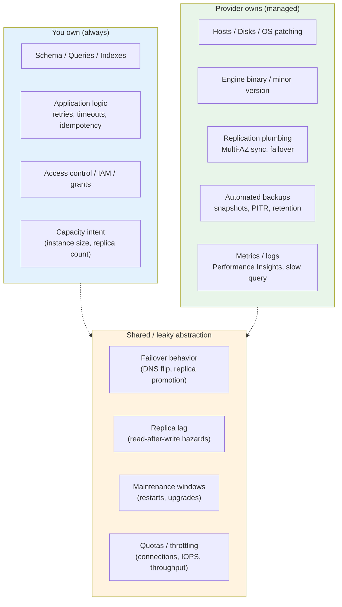
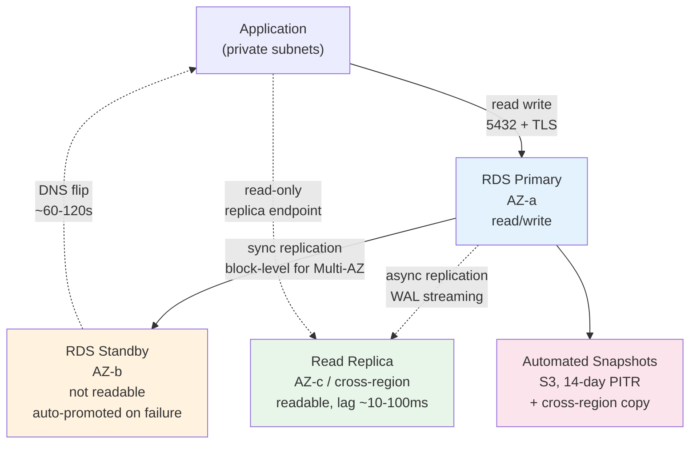
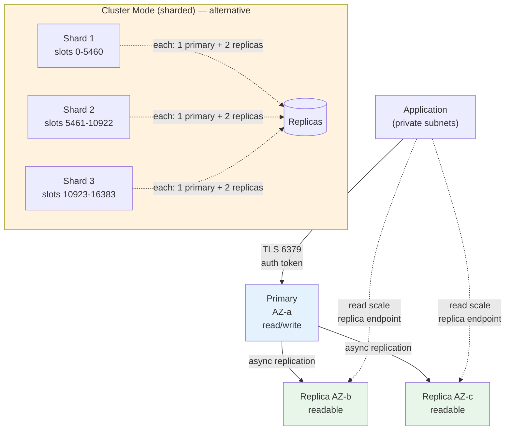
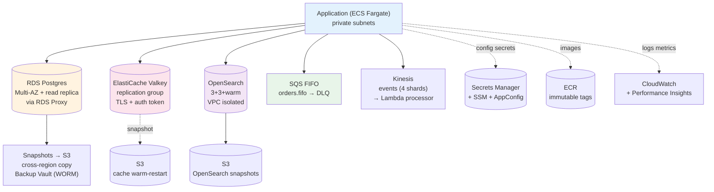
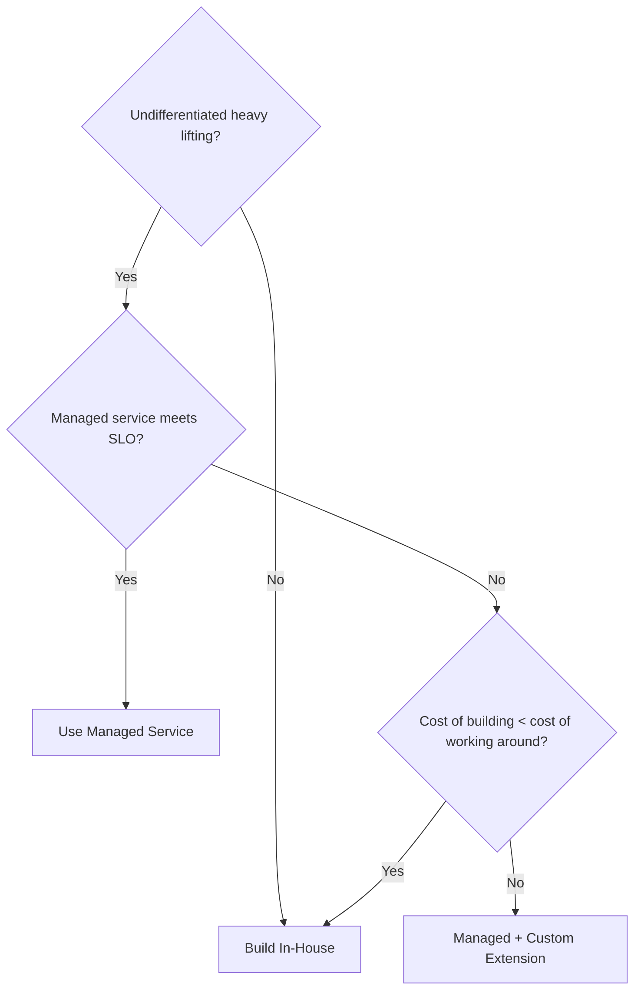
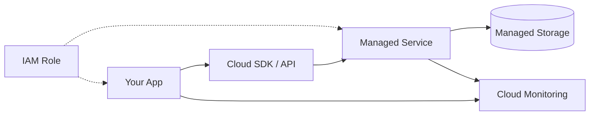
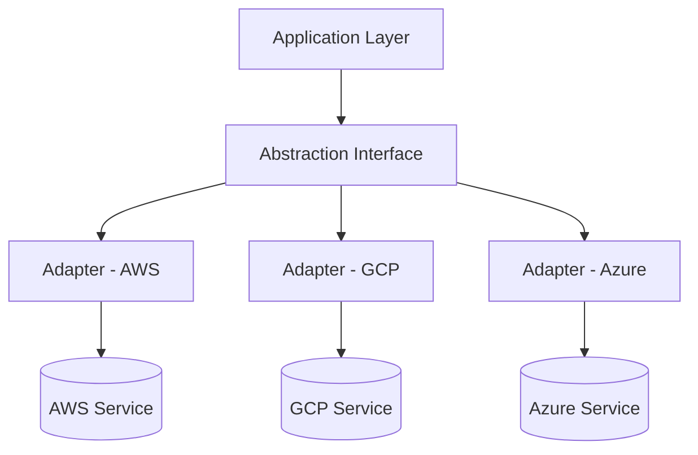

# Chapter 6 — Managed Data and Platform Services

**What this chapter covers.** Running a production database, cache, or search cluster on raw EC2 is a second full-time job — patching, backups, replication, failover, monitoring, and 3 AM pages. Managed services trade a degree of control for a decisive reduction in operational burden: the provider automates the undifferentiated heavy lifting while you retain control over schema, queries, and application semantics. This chapter covers the managed data and platform services every backend engineer provisions — relational databases (RDS/Aurora/Cloud SQL), caches (ElastiCache/Memorystore), search and analytics (OpenSearch/BigQuery/Redshift/Athena), and the platform glue (Secrets Manager, Parameter Store, ECR, queue and stream services) — with production-grade Terraform/OpenTofu, the failure modes that survive the managed abstraction, and a decision framework for when managed is the right call and when self-hosting still wins.

Learning goals — after this chapter you should be able to:

- Decide build-vs-managed for databases, caches, and search by weighing operational cost, scale, compliance, and escape velocity, and articulate what managed does *not* absolve you from.
- Provision RDS Postgres (and Aurora) with Multi-AZ, read replicas, parameter and option groups, automated backups, point-in-time recovery, and performance insights, and explain the replication and failover mechanics underneath.
- Right-size and operate ElastiCache for Redis/Valkey (and its GCP/Azure equivalents) — cluster vs. replication group, sharding, persistence, and eviction — and explain when a cache should be managed vs. embedded.
- Use managed search (OpenSearch Service) and analytics (Athena/Redshift/BigQuery) for log search and warehousing without operating the underlying cluster, and reason about indexing, partitioning, and cost.
- Consume platform services — Secrets Manager, Systems Manager Parameter Store, AppConfig, ECR, SQS/SNS/Kinesis — as the glue that replaces self-operated infrastructure, with IaC that wires them to the VPC from Chapter 5.
- Detect and handle the failure modes managed services do not hide: replica lag, failover DNS propagation, cache avalanche, backup retention gaps, maintenance windows, and the provider's own control-plane outages.

> **Boundary note.** Chapter 4 provisioned infrastructure with IaC; Chapter 5 built the compute/storage/network substrate. This chapter adds the *stateful managed services* that run on that substrate — the databases and caches your application connects to, and the platform services it depends on. Volume 5 — Databases — develops storage engines, indexing, transactions, and replication theory; this chapter is the *operational* view — how those engines are offered as a service and what you must still get right. Volume 10 — Messaging & Streaming — is the deep treatment of queues, logs, and delivery semantics; this chapter covers the managed *provisioning* of those primitives. Volume 11 — Reliability & SRE — builds the observability and incident-response practices that keep managed services healthy in production.

---

## Why managed services

### The undifferentiated heavy lifting

Every stateful system requires the same operational work regardless of whether it stores orders, sessions, or search indexes:

- OS and engine patching (Postgres minor versions, Redis CVEs)
- Backups, point-in-time recovery, and restore drills
- Replication, failover, and split-brain handling
- Monitoring, alerting, and performance tuning
- Capacity planning and vertical/horizontal scaling
- Encryption at rest and in transit, audit logging

Self-hosting means owning all of it. Managed means the provider owns the *infrastructure* layer — host, disk, OS, engine binary, replication plumbing, backup automation — while you own the *data* layer — schema, queries, indexes, access control, and application-level resilience to the failure modes that remain.



*Figure 6-1: The managed-service responsibility split — the provider owns host, engine, replication plumbing, and backup automation; you own schema, queries, and application resilience; the boundary leaks around failover, lag, maintenance, and limits.*

What managed does **not** do:

- **Not zero-downtime** — failover takes 30–120 seconds (RDS Multi-AZ) or longer (Aurora Global); the application must handle DNS re-resolution, connection retries, and transaction replay.
- **Not infinitely scalable** — every managed service has quotas (max connections, IOPS, storage, shard count) that must be planned for, just like self-hosted.
- **Not free of data modeling** — a bad schema or missing index is slow on RDS exactly as it is on bare EC2.
- **Not a backup strategy alone** — automated backups are necessary but not sufficient; you still need cross-region copies, restore drills, and retention that matches compliance.

### Decision framework: managed vs. self-hosted

| Factor | Prefer managed | Prefer self-hosted |
|---|---|---|
| **Team size** | Small platform team, few DBAs | Dedicated storage team, deep engine expertise |
| **Scale** | Up to ~10 TB, ~100k QPS per cluster | 100 TB+, custom sharding, bespoke engine tuning |
| **Compliance** | Provider handles patching, encryption, audit | Air-gapped, custom hardening, exotic OS |
| **Feature velocity** | Standard Postgres/Redis/Search features | Engine forks, extensions, custom builds |
| **Cost at scale** | Cheaper below ~$10k/mo; premium at high throughput | Cheaper at sustained high I/O when you can bin-pack hosts |
| **Escape velocity** | Accept provider-specific extensions carefully | Need portability across clouds/on-prem |

Default to managed. Self-host only when you have a concrete, measured reason that managed cannot satisfy — and budget for the operational team that self-hosting requires.

---

## Managed relational databases

### RDS for PostgreSQL / MySQL

RDS is a managed VM running the database engine with automated provisioning, patching, backup, and Multi-AZ replication. The instance class, storage type, and parameter group define the performance envelope; everything else is API-driven.

```hcl
# rds.tf — production RDS Postgres with Multi-AZ, encrypted storage, and secrets integration

resource "aws_db_subnet_group" "main" {
  name       = "${var.environment}-main"
  subnet_ids = module.network.private_subnet_ids  # private subnets, no public access
  tags       = local.common_tags
}

resource "aws_db_parameter_group" "postgres16" {
  name   = "${var.environment}-postgres16"
  family = "postgres16"

  # Production-tuned — override defaults that are wrong for backend workloads
  parameter {
    name  = "shared_preload_libraries"
    value = "pg_stat_statements,auto_explain"
  }
  parameter {
    name  = "log_min_duration_statement"
    value = "1000"  # log queries >1s
  }
  parameter {
    name  = "rds.force_ssl"
    value = "1"     # require TLS — no plaintext connections
  }
  parameter {
    name         = "max_connections"
    value        = "200"  # explicit, not the engine default that scales with RAM
    apply_method = "pending-reboot"
  }
}

resource "aws_secretsmanager_secret" "db_master" {
  name = "${var.environment}/rds/master"
  tags = local.common_tags
}

resource "random_password" "db_master" {
  length  = 32
  special = false  # avoid characters that break connection strings
}

resource "aws_secretsmanager_secret_version" "db_master" {
  secret_id     = aws_secretsmanager_secret.db_master.id
  secret_string = jsonencode({ username = "platform_admin", password = random_password.db_master.result })
}

# KMS key for storage encryption (customer-managed, not aws/rds default — so you control rotation and grants)
resource "aws_kms_key" "rds" {
  description             = "${var.environment} RDS encryption"
  deletion_window_in_days = 10
  enable_key_rotation     = true
  tags                    = local.common_tags
}

resource "aws_db_instance" "main" {
  identifier     = "${var.environment}-main"
  engine         = "postgres"
  engine_version = "16.4"
  instance_class = "db.r7g.large"   # Graviton — ~20% cheaper than r7i for Postgres
  # For MySQL: engine = "mysql", engine_version = "8.0.36", instance_class = "db.r7g.large"

  db_name  = "appdb"
  username = jsondecode(aws_secretsmanager_secret_version.db_master.secret_string)["username"]
  password = jsondecode(aws_secretsmanager_secret_version.db_master.secret_string)["password"]

  db_subnet_group_name   = aws_db_subnet_group.main.name
  vpc_security_group_ids = [aws_security_group.db.id]
  publicly_accessible    = false
  port                   = 5432

  # Storage — gp3 with independent IOPS/throughput, encrypted
  allocated_storage     = 100
  max_allocated_storage = 500          # autoscaling — grows automatically to 500 GB
  storage_type          = "gp3"
  storage_encrypted     = true
  kms_key_id            = aws_kms_key.rds.arn
  iops                  = 6000
  storage_throughput    = 250          # MB/s — gp3 allows tuning without IOPS coupling

  # Availability — Multi-AZ synchronous standby in another AZ
  multi_az               = true
  availability_zone      = null         # let RDS choose; pin only for debugging
  backup_retention_period = 14          # days — PITR window
  backup_window          = "03:00-04:00"
  maintenance_window     = "sun:04:00-sun:05:00"
  copy_tags_to_snapshot  = true
  delete_automated_backups = false      # retain backups after instance deletion (safety)
  deletion_protection    = true
  skip_final_snapshot    = false
  final_snapshot_identifier = "${var.environment}-main-final-${formatdate("20060102-150405", timestamp())}"

  parameter_group_name   = aws_db_parameter_group.postgres16.name
  enabled_cloudwatch_logs_exports = ["postgresql", "upgrade"]

  # Performance Insights — instrumented query-level latency, free for 7-day retention
  performance_insights_enabled          = true
  performance_insights_retention_period = 7
  performance_insights_kms_key_id       = aws_kms_key.rds.arn

  # Enhanced Monitoring — OS-level metrics at 30s granularity (requires IAM role)
  monitoring_interval = 30
  monitoring_role_arn = aws_iam_role.rds_enhanced_monitoring.arn

  auto_minor_version_upgrade = false   # pin minor version — upgrade explicitly via IaC, not silently

  tags = local.common_tags

  lifecycle {
    prevent_destroy = true
    ignore_changes  = [password]       # rotated via Secrets Manager, not Terraform
  }
}

# Read replica — async, cross-AZ or cross-region
resource "aws_db_instance" "read_replica" {
  identifier             = "${var.environment}-main-ro"
  replicate_source_db    = aws_db_instance.main.identifier
  instance_class         = "db.r7g.large"
  publicly_accessible    = false
  skip_final_snapshot    = true
  auto_minor_version_upgrade = false
  tags                   = merge(local.common_tags, { Role = "read-replica" })
}
```



*Figure 6-2: RDS Multi-AZ and read replica topology — synchronous standby for HA (automatic DNS failover), asynchronous read replica for scale-out, and automated snapshots for PITR.*

**Replication and failover — what actually happens:**

- **Multi-AZ** is block-level synchronous replication to a standby in another AZ — not Postgres streaming replication. The standby is not readable and shares no data with read replicas. On primary failure (host, AZ, or engine crash), RDS promotes the standby, flips the DNS record (`<id>.<hash>.<region>.rds.amazonaws.com`), and the application must re-resolve DNS and reconnect. Failover takes ~60–120 seconds; during that window writes fail.
- **Read replicas** use Postgres WAL streaming (async). Lag is typically 10–100 ms but can spike to seconds under write pressure or large transactions. Never read-your-writes from a replica without handling lag — either use the primary for read-after-write, or gate on `pg_last_wal_replay_lag`.
- **Connection handling** — RDS has a hard `max_connections` (tunable via parameter group, but memory-bound). Use a pooler (RDS Proxy, PgBouncer, or application-level pooling) rather than opening a connection per request. RDS Proxy also handles failover more gracefully by preserving pooled connections across DNS flips.

**RDS Proxy** — managed PgBouncer for RDS/Aurora, essential when using Lambda (which can open thousands of concurrent connections):

```hcl
resource "aws_db_proxy" "main" {
  name                   = "${var.environment}-main-proxy"
  engine_family          = "POSTGRESQL"
  role_arn               = aws_iam_role.rds_proxy.arn
  vpc_security_group_ids = [aws_security_group.db_proxy.id]
  vpc_subnet_ids         = module.network.private_subnet_ids
  auth {
    iam_auth      = "REQUIRED"   # IAM database auth — no password in app config
    secret_arn    = aws_secretsmanager_secret.db_master.arn
  }
  connection_pool_config {
    max_connections_percent      = 80
    max_idle_connections_percent = 50
    connection_borrow_timeout    = 10
  }
}

resource "aws_db_proxy_default_target_group" "main" {
  db_proxy_name = aws_db_proxy.main.name
  connection_pool_config {
    max_connections_percent = 80
  }
}

resource "aws_db_proxy_target" "main" {
  db_proxy_name          = aws_db_proxy.main.name
  target_group_name      = aws_db_proxy_default_target_group.main.name
  db_instance_identifiers = [aws_db_instance.main.identifier]
}
```

### Aurora: when RDS is not enough

Aurora is a re-implementation of the MySQL/Postgres wire protocol on a distributed, multi-tenant storage layer (6 copies across 3 AZs, quorum writes). It separates compute (the instance) from storage (the Aurora storage fleet), enabling instant failover, storage autoscaling to 128 TB, and Global Database (cross-region with <1 s replication lag).

| Dimension | RDS Postgres | Aurora Postgres |
|---|---|---|
| **Storage** | EBS gp3/io2, per-instance, manual scaling | Distributed, 6-way, auto-scales to 128 TB |
| **Failover** | 60–120 s (DNS flip, promote standby) | ~30 s (storage already has the data, just promote) |
| **Read scale** | 5 read replicas (async WAL) | 15 Aurora Replicas, shared storage (no WAL replay lag) |
| **Cross-region** | Snapshot copy or async replica | Global Database (<1 s lag, 1 s RTO) |
| **Cost** | Lower for small/medium | Higher baseline, cheaper at scale (storage-only replicas) |
| **Compatibility** | Native Postgres | Postgres-compatible (~95% — check extension support) |

```hcl
# aurora.tf — Aurora Postgres cluster with two instances and Global Database readiness
resource "aws_rds_cluster" "aurora" {
  cluster_identifier   = "${var.environment}-aurora"
  engine               = "aurora-postgresql"
  engine_version       = "15.4"
  database_name        = "appdb"
  master_username      = "platform_admin"
  master_password      = random_password.db_master.result
  db_subnet_group_name = aws_db_subnet_group.main.name
  vpc_security_group_ids = [aws_security_group.db.id]
  storage_encrypted    = true
  kms_key_id           = aws_kms_key.rds.arn
  backup_retention_period = 14
  preferred_backup_window = "03:00-04:00"
  deletion_protection  = true
  copy_tags_to_snapshot = true
  enabled_cloudwatch_logs_exports = ["postgresql"]

  # Serverless v2 — scales ACUs (Aurora Capacity Units) automatically within bounds
  # Use for variable workloads; use provisioned for steady-state
  # serverlessv2_scaling_configuration { min_capacity = 0.5 max_capacity = 16 }

  lifecycle { prevent_destroy = true }
}

resource "aws_rds_cluster_instance" "aurora" {
  count              = 2
  identifier         = "${var.environment}-aurora-${count.index}"
  cluster_identifier = aws_rds_cluster.aurora.id
  instance_class     = "db.r7g.large"   # or db.serverless for Serverless v2
  engine             = aws_rds_cluster.aurora.engine
  engine_version     = aws_rds_cluster.aurora.engine_version
  performance_insights_enabled = true
  monitoring_interval = 30
  monitoring_role_arn = aws_iam_role.rds_enhanced_monitoring.arn
}

# Cluster endpoints — writer and reader (reader load-balances across replicas)
# Writer: <cluster>.cluster-abc.us-east-1.rds.amazonaws.com  → current primary
# Reader: <cluster>.cluster-ro-abc.us-east-1.rds.amazonaws.com → load-balanced replicas
```

When to choose Aurora over RDS:

- You need sub-minute failover or cross-region Global Database.
- Storage exceeds ~10 TB or grows unpredictably (Aurora autoscales; RDS requires `modify` with downtime for large grows).
- You need many read replicas without per-replica storage cost (Aurora replicas share the storage fleet).
- You can tolerate the ~5% Postgres incompatibility (check `aurora_postgresql` extension coverage) and higher baseline cost.

---

## Managed caches

### ElastiCache for Redis / Valkey

ElastiCache offers Redis (and its open-source fork Valkey, adopted after Redis's 2024 license change) as a managed in-memory store with replication, persistence, and cluster-mode sharding. Memorystore (GCP) and Azure Cache for Redis are the equivalents.

Two deployment modes:

| Mode | Topology | Scaling | Use case |
|---|---|---|---|
| **Replication group** (non-cluster) | 1 primary + up to 5 replicas, single shard | Vertical (instance size) | Dataset fits one host, simple |
| **Cluster mode (sharded)** | Up to 500 shards × (1 primary + 5 replicas) | Horizontal (add shards, reshard online) | Dataset exceeds one host, high throughput |

```hcl
# elasticache.tf — Redis/Valkey replication group with cluster mode, TLS, and persistence

resource "aws_elasticache_subnet_group" "main" {
  name       = "${var.environment}-cache"
  subnet_ids = module.network.private_subnet_ids
}

resource "aws_elasticache_parameter_group" "valkey8" {
  name   = "${var.environment}-valkey8"
  family = "valkey8"
  parameter {
    name  = "maxmemory-policy"
    value = "noeviction"  # for cache-aside with explicit TTLs — never silently evict
    # Alternatives: allkeys-lru (pure cache), volatile-lru (only keys with TTL)
  }
  parameter {
    name  = "timeout"
    value = "0"           # no idle timeout — let the app manage connection lifecycle
  }
}

resource "aws_elasticache_replication_group" "main" {
  replication_group_id = "${var.environment}-cache"
  description          = "${var.environment} Valkey cluster"
  engine               = "valkey"
  engine_version       = "8.0"
  node_type            = "cache.r7g.large"
  num_cache_clusters   = 3            # 1 primary + 2 replicas (non-cluster mode)
  # For cluster mode (sharded):
  # num_node_groups         = 3        # 3 shards
  # replicas_per_node_group = 2        # 2 replicas per shard
  # automatic_failover_enabled = true

  subnet_group_name  = aws_elasticache_subnet_group.main.name
  security_group_ids = [aws_security_group.cache.id]
  parameter_group_name = aws_elasticache_parameter_group.valkey8.name
  port               = 6379

  # Security — encryption in transit and at rest, auth token via Secrets Manager
  at_rest_encryption_enabled = true
  transit_encryption_enabled = true
  auth_token                 = random_password.cache_auth.result  # stored in Secrets Manager
  kms_key_id                 = aws_kms_key.cache.arn

  # Persistence — snapshot to S3 for warm restart (not a backup — Redis is a cache)
  snapshot_retention_limit = 7
  snapshot_window          = "02:00-03:00"
  maintenance_window       = "sun:03:00-sun:04:00"
  auto_minor_version_upgrade = false

  # Automatic failover — promotes replica on primary failure (~1-2 min without cluster mode, seconds with)
  automatic_failover_enabled = true
  multi_az_enabled           = true

  apply_immediately = false  # changes wait for maintenance window — set true only for urgent fixes

  tags = local.common_tags
}

resource "aws_secretsmanager_secret" "cache_auth" {
  name = "${var.environment}/cache/auth-token"
}
resource "random_password" "cache_auth" {
  length  = 32
  special = false
}
```



*Figure 6-3: ElastiCache Valkey/Redis — replication group (primary + replicas for HA and read scale) and cluster mode (sharded across slots, each shard independently replicated).*

Operational details that survive the managed abstraction:

- **Eviction policy** — `noeviction` returns errors on OOM (safe for session stores that must not lose data); `allkeys-lru` silently evicts (safe for pure caches). Choosing wrong causes either silent data loss or unexpected write errors.
- **Persistence is not durability** — ElastiCache snapshots are for warm restarts, not for recovery of critical data. If the data must survive cache loss, the source of truth is the database; the cache is reconstructible.
- **Failover still blips** — replica promotion takes seconds to minutes; the application must retry with backoff and handle `READONLY` errors during the transition.
- **Client sharding vs. cluster mode** — with cluster mode, the client must support `MOVED`/`ASK` redirections (most modern clients do); with replication group, the client connects to a single endpoint.

**Serverless cache (ElastiCache Serverless / Memorystore Serverless)** — pay-per-request, scales to zero, no node sizing. Ideal for spiky or unpredictable workloads; more expensive per operation at sustained high throughput than provisioned nodes. Use when you cannot predict capacity or want zero idle cost.

### Choosing the cache layer

| Pattern | Where | Managed service | When |
|---|---|---|---|
| **Look-aside (lazy)** | App ↔ cache ↔ DB | ElastiCache / Memorystore | Default for read-heavy workloads; app loads on miss |
| **Write-through** | App → cache → DB (sync) | Same | Strong consistency between cache and DB (rare — adds latency) |
| **Write-behind** | App → cache → DB (async) | Same + queue | High write throughput, eventual durability is OK |
| **Embedded (in-process)** | App heap (Caffeine, groupcache) | None | Sub-ms, no network hop, but per-instance, not shared |

Most backend systems use look-aside with a managed cache for shared state (sessions, rate-limit counters, feature flags) and an embedded cache (Caffeine in Java, `singleflight` in Go) for per-instance hot keys — two layers, complementary.

---

## Managed search and analytics

### OpenSearch Service

Managed OpenSearch (fork of Elasticsearch 7.10) for log search, product search, and observability. The service manages cluster provisioning, patching, snapshots to S3, and AZ awareness — you manage index templates, mappings, and shard strategy.

```hcl
# opensearch.tf — domain with fine-grained access control and VPC isolation
resource "aws_opensearch_domain" "logs" {
  domain_name    = "${var.environment}-logs"
  engine_version = "OpenSearch_2.15"

  cluster_config {
    instance_type            = "r7g.large.search"
    instance_count           = 3
    zone_awareness_enabled   = true
    zone_awareness_config { availability_zone_count = 3 }
    dedicated_master_enabled = true
    dedicated_master_type    = "r7g.medium.search"
    dedicated_master_count   = 3
    warm_enabled             = true
    warm_count               = 2
    warm_type                = "ultrawarm1.medium.search"  # for older, infrequently queried indexes
  }

  ebs_options {
    ebs_enabled = true
    volume_type = "gp3"
    volume_size = 100
    iops        = 3000
    throughput  = 125
  }

  vpc_options {
    subnet_ids         = module.network.private_subnet_ids
    security_group_ids = [aws_security_group.opensearch.id]
  }

  encrypt_at_rest { enabled = true, kms_key_id = aws_kms_key.opensearch.arn }
  node_to_node_encryption { enabled = true }
  domain_endpoint_options { enforce_https = true, tls_security_policy = "Policy-Min-TLS-1-2-2019-07" }

  advanced_security_options {
    enabled                        = true
    internal_user_database_enabled = false
    master_user_arn                = aws_iam_role.opensearch_admin.arn
  }

  log_publishing_options {
    cloudwatch_log_group_arn = aws_cloudwatch_log_group.opensearch_search.arn
    log_type                 = "SEARCH_SLOW_LOGS"
  }

  snapshot_options { automated_snapshot_start_hour = 3 }

  tags = local.common_tags
}

# Index template — control sharding and mapping before data arrives
# (applied via API after domain creation, not Terraform — shown as curl for clarity)
# PUT _index_template/logs
# {
#   "index_patterns": ["logs-*"],
#   "template": {
#     "settings": {
#       "number_of_shards": 3,        # size for ~30 GB per shard — oversharding kills heap
#       "number_of_replicas": 1,
#       "index.lifecycle.name": "logs-30d",
#       "index.codec": "best_compression"
#     },
#     "mappings": {
#       "properties": {
#         "timestamp": { "type": "date" },
#         "level":     { "type": "keyword" },
#         "message":   { "type": "text" }
#       }
#     }
#   }
# }
```

Pitfalls that survive the managed label:

- **Oversharding** — each shard is a Lucene index with heap overhead. 1000 small shards on a 3-node cluster will OOM the heap. Rule of thumb: ~20–50 GB per shard, shards ≈ data size / 30 GB.
- **Mapping explosion** — dynamic mapping creates a field per unique JSON key; high-cardinality fields (UUIDs as field names) can create thousands of fields and crash the cluster. Use `dynamic: strict` or `index.mapping.total_fields.limit`.
- **No cross-AZ awareness without `zone_awareness_enabled`** — without it, all replicas may land in one AZ, losing HA.

### Analytics: Athena, Redshift, BigQuery

| Service | Model | Query engine | Storage | When |
|---|---|---|---|---|
| **Athena** | Serverless, pay-per-TB-scanned | Presto/Trino on S3 | S3 (Parquet/ORC) | Ad-hoc, infrequent, data already in S3 |
| **Redshift** | Provisioned or Serverless, columnar | Custom (Postgres-derived) | Managed (or S3 via Spectrum) | Frequent, complex, warehouse workloads |
| **BigQuery** (GCP) | Serverless, pay-per-TB or slots | Dremel | Colossus (managed) | GCP-native, large-scale analytics |
| **Snowflake** (cross-cloud) | Multi-cluster, pay-per-second | Custom | S3/GCS/Azure Blob | Cross-cloud, strong isolation |

```sql
-- Athena — query S3 access logs without loading into a warehouse
-- Partition by date so each query scans only one day's data (10x cost reduction)
CREATE EXTERNAL TABLE alb_logs (
  type            string,
  time            string,
  elb             string,
  client_ip       string,
  target_ip       string,
  request_processing_time double,
  target_processing_time  double,
  response_processing_time double,
  elb_status_code int,
  target_status_code int
)
PARTITIONED BY (dt string)
STORED AS INPUTFORMAT 'org.apache.hadoop.mapred.TextInputFormat'
OUTPUTFORMAT 'org.apache.hadoop.hive.ql.io.HiveIgnoreKeyTextOutputFormat'
LOCATION 's3://myorg-alb-logs/prod/'
TBLPROPERTIES ('projection.enabled' = 'true',
               'projection.dt.type' = 'date',
               'projection.dt.range' = '2024-01-01,NOW',
               'projection.dt.format' = 'yyyy-MM-dd',
               'storage.location.template' = 's3://myorg-alb-logs/prod/dt=${dt}/');

-- Then: SELECT elb_status_code, count(*) FROM alb_logs WHERE dt = '2026-08-19' GROUP BY 1;
```

Cost control for analytics is storage layout: partition by date, use Parquet/ORC (columnar, compressed), and compress with `gzip` or `zstd`. An unpartitioned JSON scan over a year of ALB logs can cost 100× more than a partitioned Parquet scan over one day.

---

## Platform services: the glue

Beyond data stores, managed platform services replace self-operated infrastructure for the cross-cutting concerns that every service needs.

### Secrets, parameters, and configuration

| Service | AWS | GCP | Azure | Use case |
|---|---|---|---|---|
| **Secrets** | Secrets Manager | Secret Manager | Key Vault | DB passwords, API keys — rotation, audit |
| **Parameters** | SSM Parameter Store | — (Secret Manager) | App Configuration | Non-secret config, feature flags |
| **App config** | AppConfig | — | App Configuration | Validated, staged rollouts of config |

```hcl
# platform.tf — secrets, parameters, and ECR

# Secrets Manager — rotation via Lambda (managed rotation for RDS is one-click)
resource "aws_secretsmanager_secret" "api_key" {
  name                    = "${var.environment}/api/external-key"
  recovery_window_in_days = 30       # soft-delete so recovery is possible
  kms_key_id              = aws_kms_key.secrets.arn
  tags                    = local.common_tags
}

# SSM Parameter Store — hierarchical, versioned, free for standard tier
resource "aws_ssm_parameter" "feature_flags" {
  name  = "/${var.environment}/api/feature_flags"
  type  = "String"
  value = jsonencode({ new_checkout = true, dark_mode = false })
  tags  = local.common_tags
}

# AppConfig — validated, staged config rollout with automatic rollback on CloudWatch alarm
resource "aws_appconfig_application" "main" {
  name        = "${var.environment}-main"
  description = "Application configuration"
}
resource "aws_appconfig_environment" "prod" {
  application_id = aws_appconfig_application.main.id
  name           = "prod"
  monitor {
    alarm_arn      = aws_cloudwatch_metric_alarm.error_rate.arn
    alarm_role_arn = aws_iam_role.appconfig.arn
  }
}
resource "aws_appconfig_configuration_profile" "flags" {
  application_id = aws_appconfig_application.main.id
  name           = "feature-flags"
  location_uri   = "hosted"
  type           = "AWS.Freeform"
  validator { type = "JSON_SCHEMA" content = file("${path.module}/flags.schema.json") }
}
# Deploy with validators — invalid JSON is rejected before rollout; alarm triggers auto-rollback

# ECR — private container registry (replaces self-hosted Harbor/registry)
resource "aws_ecr_repository" "api" {
  name                 = "${var.environment}/api"
  image_tag_mutability = "IMMUTABLE"           # prevent tag overwrite — deploy by digest
  image_scanning_configuration { scan_on_push = true }
  encryption_configuration { encryption_type = "KMS" kms_key = aws_kms_key.ecr.arn }
  tags = local.common_tags
}

resource "aws_ecr_lifecycle_policy" "api" {
  repository = aws_ecr_repository.api.name
  policy = jsonencode({
    rules = [{
      rulePriority = 1
      description  = "Keep last 50 images"
      selection    = { tagStatus = "any", countType = "imageCountMoreThan", countNumber = 50 }
      action       = { type = "expire" }
    }]
  })
}
```

Application consumption — IAM-authenticated, no static credentials:

```python
# Python — fetch config at startup, refresh on schedule (not per-request)
import boto3, json, os

ssm = boto3.client("ssm")
appconfig = boto3.client("appconfigdata")

# Simple parameter
flags = json.loads(ssm.get_parameter(Name=f"/{os.environ['ENVIRONMENT']}/api/feature_flags")["Parameter"]["Value"])

# AppConfig — session-based polling with token (efficient, long-poll)
session = appconfig.start_configuration_session(
    ApplicationIdentifier="prod-main",
    EnvironmentIdentifier="prod",
    ConfigurationProfileIdentifier="feature-flags",
)
# Poll with NextPollInterval from response; update is pushed when config changes
resp = appconfig.get_latest_configuration(ConfigurationToken=session["InitialConfigurationToken"])

# Secrets — cached with rotation awareness (use aws-secretsmanager-caching if available)
secrets = boto3.client("secretsmanager")
creds = json.loads(secrets.get_secret_value(SecretId=f"{os.environ['ENVIRONMENT']}/rds/master")["SecretString"])
```

### Queues, notifications, and streams

| Primitive | AWS | GCP | Azure | Semantics |
|---|---|---|---|---|
| **Queue** | SQS (Standard/FIFO) | Pub/Sub (pull) | Queue Storage / Service Bus | At-least-once (Standard) / exactly-once per group (FIFO) |
| **Pub/Sub** | SNS | Pub/Sub (push) | Event Grid / Service Bus Topics | Fan-out, push to SQS/Lambda/HTTP |
| **Stream** | Kinesis Data Streams | Pub/Sub (streaming) | Event Hubs | Ordered, replayable, sharded log |
| **Managed Kafka** | MSK / MSK Serverless | — | HDInsight Kafka | Kafka API, managed brokers |

These are the managed provisioning of the primitives from Volume 10. The delivery semantics are identical — managed does not change at-least-once vs. exactly-once — but the operational burden (broker patching, partition rebalancing, consumer lag monitoring) is absorbed.

```hcl
# messaging.tf — SQS + SNS + Kinesis as the managed messaging fabric

resource "aws_sqs_queue" "orders" {
  name                       = "${var.environment}-orders.fifo"  # FIFO for ordering + dedup
  fifo_queue                 = true
  content_based_deduplication = true
  visibility_timeout_seconds = 60
  message_retention_seconds  = 1209600  # 14 days
  redrive_policy = jsonencode({
    deadLetterTargetArn = aws_sqs_queue.orders_dlq.arn
    maxReceiveCount     = 5
  })
  tags = local.common_tags
}

resource "aws_sqs_queue" "orders_dlq" {
  name       = "${var.environment}-orders-dlq.fifo"
  fifo_queue = true
  tags       = local.common_tags
}

resource "aws_sns_topic" "order_events" {
  name = "${var.environment}-order-events.fifo"
  fifo_topic                  = true
  content_based_deduplication = true
  tags = local.common_tags
}

# Fan-out: SNS → SQS (each consumer gets its own queue, no polling contention)
resource "aws_sns_topic_subscription" "orders_to_queue" {
  topic_arn = aws_sns_topic.order_events.arn
  protocol  = "sqs"
  endpoint  = aws_sqs_queue.orders.arn
}

resource "aws_kinesis_stream" "events" {
  name             = "${var.environment}-events"
  shard_count      = 4
  retention_period = 48  # hours — replay window
  shard_level_metrics = ["IncomingRecords", "OutgoingRecords", "ReadProvisionedThroughputExceeded"]
  stream_mode_details { stream_mode = "PROVISIONED" }
  # For variable throughput: stream_mode = "ON_DEMAND" (scales automatically, higher per-record cost)
  encryption_type = "KMS"
  kms_key_id      = aws_kms_key.kinesis.arn
  tags            = local.common_tags
}

# Lambda consumer for the stream (alternative to Kinesis Data Analytics / Flink)
resource "aws_lambda_event_source_mapping" "kinesis_to_lambda" {
  event_source_arn  = aws_kinesis_stream.events.arn
  function_name     = aws_lambda_function.stream_processor.arn
  starting_position = "TRIM_HORIZON"
  batch_size        = 100
  bisect_batch_on_function_error = true
  maximum_record_age_in_seconds  = 3600
}
```

For Kafka workloads, MSK (Managed Streaming for Apache Kafka) or MSK Serverless provides the Kafka API without operating brokers, ZooKeeper/KRaft, or partition reassignment — but Volume 10, Chapter 3 is the deep treatment of Kafka architecture; here you provision it.

---

## Cross-cutting concerns

### Backups, retention, and restore drills

Automated backups are necessary but not sufficient. A production backup strategy answers:

- **RTO/RPO** — how long to restore, how much data can be lost. RDS PITR gives ~5 min RPO (continuous WAL archiving) and ~10–30 min RTO (restore to new instance). S3 versioning gives immediate RPO for object overwrites.
- **Cross-region** — a region failure must not lose backups. Enable cross-region snapshot copy (RDS `copy_automated_backups_to_region`), S3 cross-region replication, and ElastiCache snapshot copy.
- **Retention vs. compliance** — `backup_retention_period = 14` may not satisfy a 7-year retention requirement. Export snapshots to S3 and lifecycle to Glacier for long-term retention.
- **Restore drills** — a backup that has never been restored is not a backup. Automate a monthly drill: restore to a temporary instance, run `pg_checksums` or application-level consistency checks, tear down.

```hcl
# backup.tf — AWS Backup for centralized, cross-service backup with vault lock
resource "aws_backup_vault" "main" {
  name        = "${var.environment}-main"
  kms_key_arn = aws_kms_key.backup.arn
}

resource "aws_backup_vault_lock_configuration" "main" {
  backup_vault_name   = aws_backup_vault.main.name
  min_retention_days  = 30
  max_retention_days  = 365
  changeable_for_days = 3  # after 3 days, retention is immutable (WORM — compliance)
}

resource "aws_backup_plan" "main" {
  name = "${var.environment}-main"
  rule {
    rule_name         = "daily-cross-region"
    target_vault_name = aws_backup_vault.main.name
    schedule          = "cron(0 3 * * ? *)"
    lifecycle { delete_after = 30 }
    copy_action {
      destination_vault_arn = aws_backup_vault.replica.arn  # cross-region vault
      lifecycle { delete_after = 90 }
    }
  }
  advanced_backup_setting {
    backup_options = { WindowsVSS = "enabled" }  # for Windows EC2, if applicable
    resource_type  = "EC2"
  }
}
```

### Scaling and maintenance

Every managed service has a maintenance window and scaling mechanics that affect availability:

| Service | Scaling | Maintenance impact | Mitigation |
|---|---|---|---|
| **RDS** | `modify` instance class (brief failover) or storage autoscaling (online for gp3) | Minor version upgrades restart the instance (~1–2 min) | Multi-AZ for HA, `auto_minor_version_upgrade = false`, schedule upgrades explicitly |
| **Aurora** | Add/remove instances, Serverless v2 auto-scales ACUs | Same as RDS, but storage never needs scaling | Global Database for cross-region, Serverless v2 for variable load |
| **ElastiCache** | Vertical (modify node type, brief failover) or sharded (online reshard) | Engine upgrades restart nodes | Multi-AZ + cluster mode, test client `MOVED` handling |
| **OpenSearch** | Add nodes (blue/green deploy, ~10–30 min) | Upgrades are blue/green with no downtime but double capacity during | Provision with headroom, use warm/cold tiers |
| **SQS/Kinesis** | SQS scales automatically; Kinesis provisioned shards need manual reshard | None (serverless) | Use ON_DEMAND for Kinesis if throughput is unpredictable |

Never set `apply_immediately = true` on production stateful resources — changes should wait for the maintenance window and be applied during a planned deployment, not mid-day.

### Monitoring the managed abstraction

Managed does not mean unmonitored. The provider exposes metrics, but you must alert on them:

```hcl
# monitoring.tf — CloudWatch alarms for the managed data layer
resource "aws_cloudwatch_metric_alarm" "rds_cpu" {
  alarm_name          = "${var.environment}-rds-cpu-high"
  comparison_operator = "GreaterThanThreshold"
  threshold           = 80
  evaluation_periods  = 3
  metric_name         = "CPUUtilization"
  namespace           = "AWS/RDS"
  dimensions          = { DBInstanceIdentifier = aws_db_instance.main.identifier }
  statistic           = "Average"
  period              = 300
  alarm_actions       = [aws_sns_topic.alerts.arn]
}

resource "aws_cloudwatch_metric_alarm" "rds_replica_lag" {
  alarm_name          = "${var.environment}-rds-replica-lag"
  comparison_operator = "GreaterThanThreshold"
  threshold           = 5000  # ms — alert when replica falls behind
  evaluation_periods  = 2
  metric_name         = "ReplicaLag"
  namespace           = "AWS/RDS"
  dimensions          = { DBInstanceIdentifier = aws_db_instance.read_replica.identifier }
  statistic           = "Maximum"
  period              = 60
  alarm_actions       = [aws_sns_topic.alerts.arn]
}

resource "aws_cloudwatch_metric_alarm" "cache_evictions" {
  alarm_name          = "${var.environment}-cache-evictions"
  comparison_operator = "GreaterThanThreshold"
  threshold           = 100  # evictions/min — indicates undersized cache or bad policy
  evaluation_periods  = 2
  metric_name         = "Evictions"
  namespace           = "AWS/ElastiCache"
  dimensions          = { CacheClusterId = aws_elasticache_replication_group.main.id }
  statistic           = "Sum"
  period              = 300
  alarm_actions       = [aws_sns_topic.alerts.arn]
}

resource "aws_cloudwatch_metric_alarm" "opensearch_cpu" {
  alarm_name          = "${var.environment}-opensearch-cpu"
  comparison_operator = "GreaterThanThreshold"
  threshold           = 80
  evaluation_periods  = 3
  metric_name         = "CPUUtilization"
  namespace           = "AWS/ES"
  dimensions          = { DomainName = aws_opensearch_domain.logs.domain_name, ClientId = data.aws_caller_identity.current.account_id }
  statistic           = "Maximum"
  period              = 300
  alarm_actions       = [aws_sns_topic.alerts.arn]
}
```

Beyond CloudWatch, enable **Performance Insights** (RDS/Aurora) for query-level latency attribution, **ElastiCache slowlog** for hot-key detection, and **OpenSearch slow logs** for expensive queries — the managed console surfaces these, but they must be actively monitored, not just enabled.

---

## Putting it together: service dependencies on managed infrastructure



*Figure 6-4: A backend service's managed dependencies — RDS + Proxy for primary data, ElastiCache for shared cache, OpenSearch for search, SQS/Kinesis for messaging, Secrets/SSM/AppConfig for configuration, ECR for images, and centralized backup — all in private subnets with VPC endpoints.*

This is the data and platform layer that Chapters 4–5 provision and that application code connects to. Chapter 7 (Multi-Tenancy) isolates these dependencies per tenant; Chapter 8 (Cost) optimizes their spend; Chapter 10 (Networking & IAM) secures their access.

---

## Anti-patterns and operational lessons

**Treating managed as magic.** "RDS handles HA so the app doesn't need retries." It doesn't — failover still drops connections, and the app must reconnect with backoff. Every managed service has a failure mode that reaches the application; handle it.

**No read-replica lag handling.** Reading from a replica immediately after writing to the primary and assuming the read reflects the write. Under load, lag spikes and users see stale data or duplicate submissions. Use the primary for read-after-write or gate on lag.

**Cache as source of truth.** Storing the only copy of critical data in ElastiCache with `snapshot_retention_limit = 1`. A cluster replacement or AZ failure loses it. Caches are reconstructible; the database is the source of truth.

**Oversized or undersized cache eviction policy.** `allkeys-lru` on a session store silently evicts active sessions; `noeviction` on a pure cache returns errors when full. Match policy to data class.

**Unencrypted or publicly accessible data stores.** `publicly_accessible = true` on RDS or `block_public_acls = false` on S3 — both have been the root cause of breaches. Default to private subnets, `publicly_accessible = false`, and `block_public_acls = true`; require explicit justification to relax.

**No backup restore drills.** Automated snapshots exist but have never been restored. The first restore attempt during an actual incident discovers that the snapshot is corrupt, the KMS grant is missing, or the subnet group was deleted.

**Pinning to provider-specific extensions without escape hatch.** Using Aurora-only or BigQuery-only features pervasively makes migration prohibitively expensive. Isolate provider-specific code behind an interface; keep the core SQL portable.

---

## Key takeaways

- Managed services absorb host, patching, replication plumbing, and backup automation — you retain ownership of schema, queries, access control, and application-level resilience to the failure modes that leak through.
- RDS Postgres with Multi-AZ (synchronous block replication, 60–120 s failover) and async read replicas, plus RDS Proxy for connection pooling and IAM auth, is the default for relational workloads; Aurora trades higher baseline cost for distributed storage, 30 s failover, and Global Database.
- ElastiCache for Valkey/Redis offers replication groups (single shard) and cluster mode (500 shards); choose eviction policy by data class (`noeviction` for session stores, `allkeys-lru` for pure caches) and never treat the cache as the sole copy.
- OpenSearch Service requires disciplined index design (shard sizing ~30 GB, strict mappings, zone awareness); analytics on S3 via Athena/Redshift/BigQuery is cost-controlled by partitioning and columnar formats (Parquet/ORC).
- Platform services — Secrets Manager, SSM Parameter Store, AppConfig (with staged rollout and alarm-driven rollback), ECR (immutable tags, scan on push), SQS/SNS/Kinesis — replace self-operated glue and are consumed via IAM, not static credentials.
- Every managed service still requires backup strategy (cross-region, WORM vault, restore drills), maintenance window planning, scaling mechanics, and alerting on the metrics that matter (replica lag, evictions, CPU, shard pressure).

## Further reading

- RDS User Guide — https://docs.aws.amazon.com/AmazonRDS/latest/UserGuide/Welcome.html
- Aurora documentation — https://docs.aws.amazon.com/AmazonRDS/latest/AuroraUserGuide/CHAP_AuroraOverview.html
- RDS Proxy — https://docs.aws.amazon.com/AmazonRDS/latest/UserGuide/rds-proxy.html
- ElastiCache for Valkey/Redis — https://docs.aws.amazon.com/AmazonElastiCache/latest/dg/WhatIs.html
- OpenSearch Service — https://docs.aws.amazon.com/opensearch-service/latest/developerguide/what-is.html
- Athena — https://docs.aws.amazon.com/athena/latest/ug/what-is.html and Redshift — https://docs.aws.amazon.com/redshift/latest/dg/c_intro.html
- AWS Backup — https://docs.aws.amazon.com/aws-backup/latest/devguide/whatisbackup.html
- GCP managed data — Cloud SQL, Memorystore, BigQuery — https://cloud.google.com/products/databases and https://cloud.google.com/bigquery/docs
- Azure managed data — https://learn.microsoft.com/en-us/azure/product-categories/databases

### Build vs buy decision tree



### Managed service integration pattern



### Vendor lock-in mitigation


