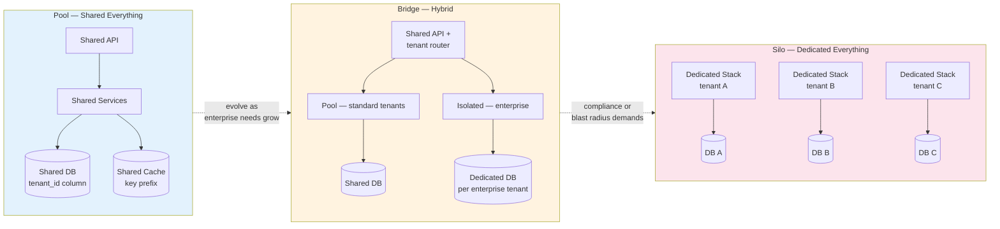
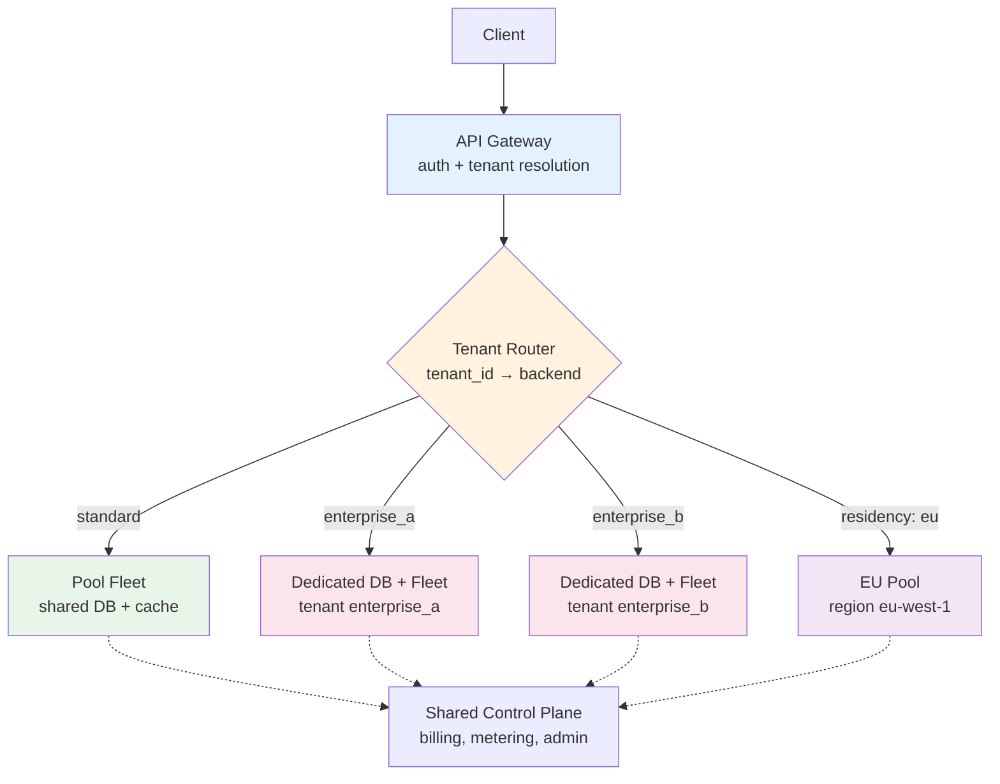
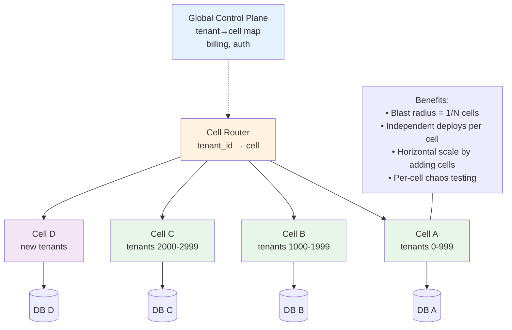

# Chapter 7 — Multi-Tenancy and Isolation

**What this chapter covers.** Every SaaS product is multi-tenant — many customers share the same fleet, the same control plane, and often the same data stores. How thoroughly you isolate tenants determines your blast radius, your compliance posture, your cost structure, and your operational complexity. Isolate too little and one tenant's burst, bug, or breach spills onto everyone; isolate too much and you reimplement single-tenancy at SaaS prices. This chapter covers the tenancy models that span that spectrum — silo, pool, bridge, and cell — the isolation mechanisms at each layer (compute, data, network, identity), the Kubernetes and cloud primitives that enforce them, and the hard trade-offs — noisy neighbors, data residency, per-tenant rate limiting, and migration between models — with production-grade configs for namespaces, quotas, network policies, row-level security, and tenant-aware routing.

Learning goals — after this chapter you should be able to:

- Compare silo, pool, bridge (hybrid), and cell-based tenancy on isolation strength, cost efficiency, operational overhead, and blast radius — and choose the right model per tier (free, pro, enterprise) and per compliance requirement.
- Design data isolation — discriminator column, schema-per-tenant, database-per-tenant, and physical sharding — with row-level security, per-tenant encryption, and backup/restore that respects tenancy boundaries.
- Implement Kubernetes multi-tenancy with namespaces, RBAC, `ResourceQuota`, `LimitRange`, `NetworkPolicy`, `PodSecurity`, hierarchical namespaces (Capsule/vCluster), and node-level isolation (taints, `RuntimeClass` with gVisor/Kata).
- Enforce tenant context propagation — JWT claims, header-based routing, and service-mesh tenancy — and build per-tenant rate limiting, bulkheads, and concurrency limits that prevent noisy neighbors.
- Reason about control-plane vs. data-plane isolation, cell-based architecture for blast-radius containment, and the noisy-neighbor problem at every layer.
- Plan tenancy migrations — pool → bridge → silo — with dual-write, backfill, and per-tenant cutover strategies.

> **Boundary note.** Volume 2, Chapter 9 covered the kernel mechanisms — namespaces and cgroups — as isolation primitives. Volume 12, Chapter 1 showed how containers use them at fleet scale. This chapter is the *SaaS architecture* layer — how those primitives compose into tenancy models, how data and identity are isolated above the kernel, and how platform teams enforce tenancy at the API, mesh, and storage layers. Volume 5 — Databases — covers storage engines and replication; here we focus on tenancy-aware schema design and row-level enforcement. Volume 11, Chapter 10 covered bulkheads and concurrency limiting as resilience patterns; here we apply them per tenant.

---

## Why multi-tenancy

A tenant is a security and resource boundary — typically a customer organization, but also a team, environment, or workload class that must be isolated from others. Multi-tenancy is the discipline of sharing infrastructure among tenants while preserving isolation where it matters and sharing where it is safe.

The tension is fundamental:

- **Sharing** improves utilization, reduces cost, and simplifies operations — one deployment, one pipeline, one upgrade.
- **Isolation** contains failures, protects data, satisfies compliance, and prevents noisy neighbors — at the cost of duplication and operational overhead.

Every tenancy decision is a placement on this spectrum, and different tenants often deserve different placements. A free tier with 10,000 small tenants is efficiently served by a shared pool; a single enterprise tenant paying six figures and requiring SOC 2 + data residency may justify a dedicated silo. Most mature SaaS products end up with a *tiered* tenancy model — pool for the many, bridge or silo for the few.



*Figure 7-1: Tenancy spectrum — pool shares everything with logical isolation, bridge shares the control plane but isolates data/compute for enterprise tenants, silo dedicates a full stack per tenant. Most SaaS evolves left to right as requirements grow.*

### Isolation dimensions

Isolation must be considered at every layer — a gap at any layer breaks the boundary:

| Dimension | Shared (pool) | Isolated (silo/cell) | Mechanism |
|---|---|---|---|
| **Compute** | Shared pods/nodes, cgroup limits | Dedicated nodes or clusters | `ResourceQuota`, taints, `RuntimeClass` |
| **Data** | Row-level (`tenant_id`) + RLS | Dedicated DB/schema per tenant | Postgres RLS, schema-per-tenant, DB-per-tenant |
| **Network** | Shared VPC, logical separation | Dedicated VPC or subnet per tenant | `NetworkPolicy`, VPC per tenant, PrivateLink |
| **Identity** | Shared IdP, tenant claim in JWT | Per-tenant IdP or OIDC issuer | JWT `tenant_id` claim, per-tenant `ClusterRole` |
| **Noisy neighbor** | Per-tenant rate limits + bulkheads | Physical isolation | Token bucket per tenant, concurrency limits |
| **Blast radius** | One bad deploy affects all tenants | Cell contains failure to subset | Cell-based architecture |
| **Compliance** | Logical controls, shared audit log | Physical data residency, per-tenant encryption keys | KMS per tenant, region pinning |

A common failure is strong isolation at one layer with none at another — e.g., per-tenant databases but a shared Redis without key prefixing, so one tenant's cache flush evicts everyone's entries.

---

## Tenancy models

### Pool (shared everything, logically isolated)

Every tenant shares the same deployment, the same database, the same cache. Tenancy is a *column* — `tenant_id` on every row — and a *claim* in the JWT. This is the most cost-efficient model and the correct default for tenants with similar requirements and no data-residency constraints.

Data access must be tenant-scoped at the query layer — every query includes `WHERE tenant_id = ?`, and row-level security (RLS) enforces it even if application code forgets:

```sql
-- Postgres row-level security — tenant isolation at the database layer
ALTER TABLE orders ENABLE ROW LEVEL SECURITY;

CREATE POLICY tenant_isolation ON orders
    USING (tenant_id = current_setting('app.current_tenant')::uuid);

-- Application sets the tenant before every transaction — no query can escape
BEGIN;
SET LOCAL app.current_tenant = 'a1b2c3d4-...';  -- from JWT claim
SELECT * FROM orders WHERE status = 'pending';  -- RLS appends tenant_id filter automatically
COMMIT;

-- Per-tenant encryption — each tenant's sensitive columns encrypted with its own KMS key
CREATE TABLE tenant_keys (
    tenant_id uuid PRIMARY KEY,
    kms_key_arn text NOT NULL,
    created_at timestamptz DEFAULT now()
);
-- Application encrypts PII with tenant's key before writing; decrypts on read
```

```java
// Tenant context propagation — Spring middleware sets tenant from JWT, RLS enforces at DB
@Component
public class TenantFilter implements Filter {
    @Override public void doFilter(ServletRequest req, ServletResponse res, FilterChain chain)
            throws IOException, ServletException {
        HttpServletRequest http = (HttpServletRequest) req;
        String token = http.getHeader("Authorization").replace("Bearer ", "");
        Claims claims = jwtParser.parseClaimsJws(token).getBody();
        String tenantId = claims.get("tenant_id", String.class);
        if (tenantId == null) {
            ((HttpServletResponse) res).sendError(403, "missing tenant_id claim");
            return;
        }
        TenantContext.set(tenantId);
        MDC.put("tenant_id", tenantId);  // structured logging per tenant
        try (Connection c = dataSource.getConnection()) {
            c.createStatement().execute("SET LOCAL app.current_tenant = '" + tenantId + "'");
            chain.doFilter(req, res);
        } finally {
            TenantContext.clear();
            MDC.remove("tenant_id");
        }
    }
}
```

Pool trade-offs: minimal operational overhead, best bin-packing, simplest deployments — but noisy neighbors share the same failure domain, and a query without `tenant_id` (or an RLS bypass via superuser) leaks data across tenants. Mitigate with mandatory RLS, per-tenant rate limiting, and query auditing.

### Silo (dedicated everything)

Each tenant gets its own deployment, database, and often its own VPC or cluster. Tenancy is physical — there is no cross-tenant query to get wrong because there is no shared store. This is the strongest isolation and the simplest to reason about for compliance — but cost scales linearly with tenant count and operations multiply.

Silo is appropriate when: the tenant count is small (tens, not thousands), per-tenant revenue justifies dedicated infrastructure, compliance requires physical data residency or dedicated encryption domains, or blast-radius containment demands that no single failure affects more than one tenant.

Infrastructure as code for a per-tenant silo (Terraform/OpenTofu pattern):

```hcl
# Per-tenant silo — one module instantiation per enterprise tenant
module "tenant_silo" {
  for_each = var.enterprise_tenants  # map of tenant_id -> config
  source   = "./modules/tenant-silo"

  tenant_id   = each.key
  tenant_name = each.value.name
  region      = each.value.region          # data residency
  cidr_block  = each.value.cidr            # dedicated VPC

  db_instance_class = each.value.db_class
  kms_key_arn       = aws_kms_key.tenant[each.key].arn  # per-tenant encryption
  domain            = "${each.value.slug}.app.example.com"
}

# Tenant silo module — VPC + EKS node group + RDS per tenant
resource "aws_vpc" "tenant" {
  cidr_block           = var.cidr_block
  enable_dns_hostnames = true
  tags = { Tenant = var.tenant_id, Type = "silo" }
}

resource "aws_db_instance" "tenant" {
  identifier          = "db-${var.tenant_id}"
  engine              = "postgres"
  instance_class      = var.db_instance_class
  allocated_storage   = 100
  storage_encrypted   = true
  kms_key_id          = var.kms_key_arn
  vpc_security_group_ids = [aws_security_group.db.id]
  db_subnet_group_name   = aws_db_subnet_group.tenant.name
  backup_retention_period = 7
  tags = { Tenant = var.tenant_id }
}
```

Silo trade-offs: strongest isolation, simplest compliance narrative, contained blast radius — but N tenants means N databases to patch, N deployments to roll out, N dashboards to watch. Automation is non-negotiable; without it, silo becomes an operational nightmare beyond ~20 tenants.

### Bridge (hybrid — shared control plane, isolated data)

Bridge is the pragmatic middle: the control plane (API gateway, routing, auth, billing) is shared, but the data plane isolates per tenant where it matters. Standard tenants share a pool database; enterprise tenants get a dedicated database; routing decides at request time.



*Figure 7-2: Bridge model — shared gateway and control plane, tenant-aware routing to pool or dedicated backends per tenant tier and region. Combines pool efficiency for the many with silo isolation for the few.*

Tenant-aware routing at the gateway (Envoy / Istio):

```yaml
# Istio VirtualService — route by tenant header (set by gateway after JWT verification)
apiVersion: networking.istio.io/v1beta1
kind: VirtualService
metadata: { name: tenant-router }
spec:
  hosts: [api.example.com]
  gateways: [prod-gateway]
  http:
    - match: [{ headers: { x-tenant-id: { exact: enterprise-a } } }]
      route:
        - destination: { host: api-enterprise-a.prod.svc.cluster.local }
          headers:
            request:
              set: { x-tenant-tier: silo }
    - match: [{ headers: { x-tenant-id: { exact: enterprise-b } } }]
      route:
        - destination: { host: api-enterprise-b.prod.svc.cluster.local }
    - route:  # default — pool
        - destination: { host: api-pool.prod.svc.cluster.local }
---
# Envoy rate limiting per tenant — token bucket at the gateway
apiVersion: networking.istio.io/v1alpha1
kind: EnvoyFilter
metadata: { name: per-tenant-ratelimit }
spec:
  workloadSelector: { labels: { istio: ingressgateway } }
  configPatches:
    - applyTo: HTTP_FILTER
      match: { context: GATEWAY }
      patch:
        operation: INSERT_BEFORE
        value:
          name: envoy.filters.http.ratelimit
          typed_config:
            "@type": type.googleapis.com/envoy.extensions.filters.http.ratelimit.v3.RateLimit
            domain: tenant_ratelimit
            request_type: external
            rate_limit_service:
              grpc_service: { envoy_grpc: { cluster_name: ratelimit } }
              transport_api_version: V3
```

### Cell-based architecture

Cells extend the bridge model by sharding *all* tenants — including pool tenants — into isolated failure domains called cells. Each cell is a full copy of the stack (compute + data) serving a subset of tenants. A failure in one cell affects only its tenants, not the entire fleet. AWS, Stripe, and Slack use cells to bound blast radius at scale.



*Figure 7-3: Cell-based architecture — tenants are sharded across independent cells, each a full stack. The cell router maps tenant to cell; the global control plane manages the mapping. Blast radius is one cell, not the fleet.*

Cell assignment is typically consistent hashing on `tenant_id` so that adding a cell reassigns minimal tenants. Cell routing metadata is stored in a global, low-latency lookup (DynamoDB Global Tables, Spanner, or etcd) that the gateway reads on every request.

---

## Kubernetes multi-tenancy

Kubernetes has no native hard multi-tenancy — namespaces are a soft boundary. True isolation requires layering several primitives:

### Namespace isolation — the baseline

```yaml
# Namespace per tenant (or per tenant tier)
apiVersion: v1
kind: Namespace
metadata:
  name: tenant-enterprise-a
  labels:
    tenant: enterprise-a
    tier: silo
    pod-security.kubernetes.io/enforce: restricted  # no privileged pods
---
# ResourceQuota — cap aggregate consumption per tenant
apiVersion: v1
kind: ResourceQuota
metadata: { name: quota, namespace: tenant-enterprise-a }
spec:
  hard:
    requests.cpu: "8"
    requests.memory: 16Gi
    limits.cpu: "16"
    limits.memory: 32Gi
    count/pods: "20"
    count/services: "10"
    requests.storage: 100Gi
---
# LimitRange — default and max per pod/container (prevents one pod from grabbing the whole quota)
apiVersion: v1
kind: LimitRange
metadata: { name: limits, namespace: tenant-enterprise-a }
spec:
  limits:
    - type: Container
      default: { cpu: 500m, memory: 512Mi }
      defaultRequest: { cpu: 200m, memory: 256Mi }
      max: { cpu: "2", memory: 4Gi }
      min: { cpu: 100m, memory: 128Mi }
    - type: Pod
      max: { cpu: "4", memory: 8Gi }
---
# NetworkPolicy — deny cross-tenant traffic by default, allow only within namespace
apiVersion: networking.k8s.io/v1
kind: NetworkPolicy
metadata: { name: deny-cross-tenant, namespace: tenant-enterprise-a }
spec:
  podSelector: {}
  policyTypes: [Ingress, Egress]
  ingress:
    - from:
        - podSelector: {}          # only same-namespace pods
        - namespaceSelector:
            matchLabels: { name: ingress-nginx }  # plus ingress
      ports: [{ port: 8080 }]
  egress:
    - to: [{ podSelector: {} }]    # only same-namespace
    - to: [{ namespaceSelector: { matchLabels: { name: kube-system } } }]
      ports: [{ port: 53, protocol: UDP }]  # DNS
    - to: [{ namespaceSelector: { matchLabels: { name: tenant-enterprise-a } } }]
---
# RBAC — per-tenant access, no cross-namespace
apiVersion: rbac.authorization.k8s.io/v1
kind: Role
metadata: { name: tenant-admin, namespace: tenant-enterprise-a }
rules:
  - apiGroups: ["", apps, networking.k8s.io]
    resources: [pods, deployments, services, ingresses, configmaps, secrets]
    verbs: [get, list, watch, create, update, patch, delete]
---
apiVersion: rbac.authorization.k8s.io/v1
kind: RoleBinding
metadata: { name: tenant-admin, namespace: tenant-enterprise-a }
subjects: [{ kind: Group, name: enterprise-a:developers, apiGroup: rbac.authorization.k8s.io }]
roleRef: { kind: Role, name: tenant-admin, apiGroup: rbac.authorization.k8s.io }
```

For stronger isolation, two extensions are common:

- **Capsule / Hierarchical Namespace Controller (HNC)** — enforces quota and policy inheritance across namespace hierarchies, prevents tenants from escaping their subtree, and manages per-tenant `ResourceQuota` centrally.
- **vCluster** — gives each tenant a virtual Kubernetes control plane (virtual apiserver + etcd) inside a host cluster namespace. Tenants get full cluster-admin within their vCluster without host-cluster privileges. Appropriate when tenants need CRDs or operators.

### Node-level isolation

When cgroup and namespace isolation is insufficient (noisy neighbors at the kernel or hardware level, or compliance requiring dedicated hardware), isolate at the node:

```yaml
# Dedicated node pool per enterprise tenant — taint + toleration + nodeSelector
apiVersion: v1
kind: Node
metadata:
  labels: { tenant: enterprise-a, node-pool: enterprise-a }
spec:
  taints: [{ key: tenant, value: enterprise-a, effect: NoSchedule }]
---
apiVersion: apps/v1
kind: Deployment
metadata: { name: api, namespace: tenant-enterprise-a }
spec:
  template:
    spec:
      tolerations: [{ key: tenant, value: enterprise-a, effect: NoSchedule }]
      nodeSelector: { tenant: enterprise-a }
      runtimeClassName: gvisor  # extra kernel isolation via gVisor
      containers:
        - name: api
          image: api:1.42.0
          resources:
            requests: { cpu: 500m, memory: 512Mi }
            limits: { cpu: 1000m, memory: 1Gi }
---
# RuntimeClass — gVisor for tenant workloads needing stronger syscall filtering
apiVersion: node.k8s.io/v1
kind: RuntimeClass
metadata: { name: gvisor }
handler: runsc
---
# Kata Containers alternative — VM-level isolation per pod
apiVersion: node.k8s.io/v1
kind: RuntimeClass
metadata: { name: kata }
handler: kata
```

| Isolation level | Mechanism | Overhead | Use when |
|---|---|---|---|
| Namespace + quota | `ResourceQuota`, `LimitRange`, `NetworkPolicy` | Negligible | Default for all tenants |
| Node pool | Taints, `nodeSelector`, dedicated ASG | Low (bin-packing loss) | Enterprise, noisy-neighbor sensitive |
| Sandbox runtime | gVisor (`runsc`) | ~5–10% syscall overhead | Untrusted tenant code execution |
| VM isolation | Kata Containers / Firecracker | ~50–100 ms cold start, higher memory | Strongest isolation, compliance |

---

## Data isolation in depth

### Choosing the model

| Model | Isolation | Cost | Operations | Migration |
|---|---|---|---|---|
| **Discriminator column** (`tenant_id`) | Logical — RLS enforced | 1 DB for N tenants | Simplest | Trivial |
| **Schema per tenant** | Logical — schema search_path | 1 DB, N schemas | Moderate — per-schema migrations | Moderate |
| **Database per tenant** | Physical — separate DB | N DBs | Heavy — per-DB patching/backups | Heavy |
| **Shard per tenant group** | Physical — tenant → shard map | Shards scale with tenants | Heavy — rebalancing | Complex |

Decision factors: tenant count, per-tenant data size, compliance (dedicated encryption domain), and query patterns (cross-tenant analytics is trivial with discriminator, impossible with DB-per-tenant without ETL).

### Schema-per-tenant (Postgres)

```sql
-- One schema per tenant — search_path isolates
CREATE SCHEMA tenant_enterprise_a;
CREATE SCHEMA tenant_enterprise_b;

-- Per-tenant tables — identical DDL, isolated data
CREATE TABLE tenant_enterprise_a.orders (
    id uuid PRIMARY KEY DEFAULT gen_random_uuid(),
    amount_cents int NOT NULL,
    status text NOT NULL,
    created_at timestamptz DEFAULT now()
);

-- Application sets search_path per request
SET search_path TO tenant_enterprise_a, public;
SELECT * FROM orders;  -- resolves to tenant_enterprise_a.orders

-- Migration runner — applies DDL to every tenant schema
DO $$
DECLARE s text;
BEGIN
  FOR s IN SELECT schema_name FROM information_schema.schemata WHERE schema_name LIKE 'tenant_%'
  LOOP
    EXECUTE format('CREATE INDEX IF NOT EXISTS idx_orders_status ON %I.orders(status)', s);
  END LOOP;
END $$;
```

Schema-per-tenant simplifies per-tenant backup/restore (`pg_dump --schema=tenant_enterprise_a`) and per-tenant PITR, but schema count in Postgres has practical limits (~hundreds before catalog bloat and `pg_dump` slowness) and every migration must fan out to N schemas.

### Per-tenant encryption

Whether using pool or silo, encrypt tenant-sensitive data with a per-tenant KMS key so that key revocation immediately renders that tenant's data unreadable — and a compromised key affects only one tenant:

```python
# Envelope encryption per tenant — DEK per record, KEK per tenant in KMS
import boto3
kms = boto3.client("kms")

def encrypt_for_tenant(tenant_id: str, plaintext: bytes) -> dict:
    key_arn = tenant_key_arn(tenant_id)  # lookup tenant -> KMS key
    resp = kms.generate_data_key(KeyId=key_arn, KeySpec="AES_256")
    dek_plaintext, dek_encrypted = resp["Plaintext"], resp["CiphertextBlob"]
    # Encrypt record with DEK, store DEK_encrypted alongside
    ciphertext = aes_gcm_encrypt(dek_plaintext, plaintext)
    return {"ciphertext": ciphertext, "dek_encrypted": dek_encrypted, "key_arn": key_arn}

def decrypt_for_tenant(record: dict) -> bytes:
    dek_plaintext = kms.decrypt(CiphertextBlob=record["dek_encrypted"])["Plaintext"]
    return aes_gcm_decrypt(dek_plaintext, record["ciphertext"])
```

---

## Noisy neighbors — per-tenant fairness

Sharing without fairness is just contention. Every shared resource — CPU, downstream concurrency, cache, database connections — needs per-tenant limits.

### Per-tenant rate limiting and concurrency

Apply at the gateway (Envoy RLS) and at the service (application-level token bucket per tenant). Gateway limits protect the fleet; service limits protect the downstream.

```java
// Per-tenant token bucket — Caffeine-backed, tenant_id -> bucket
public class PerTenantRateLimiter {
    private final LoadingCache<String, Bucket> buckets = Caffeine.newBuilder()
        .expireAfterAccess(Duration.ofMinutes(10))
        .build(tenantId -> {
            TenantTier tier = tenantService.tierOf(tenantId);
            // Tier-aware limits — free: 100 rps, pro: 1000 rps, enterprise: 5000 rps
            Bandwidth limit = Bandwidth.classic(tier.rps(), Refill.greedy(tier.rps(), Duration.ofSeconds(1)));
            return Bucket.builder().addLimit(limit).build();
        });

    public boolean tryConsume(String tenantId) {
        Bucket bucket = buckets.get(tenantId);
        ConsumptionProbe probe = bucket.tryConsumeAndReturnRemaining(1);
        if (!probe.isConsumed()) {
            meterRegistry.counter("ratelimit.exceeded", "tenant", tenantId).increment();
        }
        return probe.isConsumed();
    }
}

// Per-tenant bulkhead — prevents one tenant's slow requests from starving others
public class PerTenantBulkhead {
    private final ConcurrentHashMap<String, Bulkhead> bulkheads = new ConcurrentHashMap<>();
    public <T> T execute(String tenantId, Supplier<T> call) {
        Bulkhead bh = bulkheads.computeIfAbsent(tenantId,
            id -> Bulkhead.of("tenant-" + id,
                BulkheadConfig.custom().maxConcurrentCalls(20).maxWaitDuration(Duration.ofMillis(50)).build()));
        return Bulkhead.decorateSupplier(bh, call).get();
    }
}
```

### noisy-neighbor detection

Alert on tenant-level p95 and error rate, not just global — a global p95 of 80 ms can hide one tenant at 2 s:

```yaml
groups:
  - name: tenancy
    rules:
      - alert: TenantP95High
        expr: histogram_quantile(0.95, rate(http_request_duration_seconds_bucket{tenant!=""}[5m])) > 0.5
        for: 5m
        labels: { severity: warning }
        annotations: { summary: "Tenant {{ $labels.tenant }} p95 >500ms" }

      - alert: TenantErrorRateHigh
        expr: rate(http_requests_total{status=~"5..", tenant!=""}[5m]) / rate(http_requests_total{tenant!=""}[5m]) > 0.05
        for: 3m
        labels: { severity: warning }
        annotations: { summary: "Tenant {{ $labels.tenant }} 5xx rate >5%" }

      - alert: TenantQuotaExhaustion
        expr: kube_resourcequota{type="used", resource="requests.cpu"} / kube_resourcequota{type="hard", resource="requests.cpu"} > 0.9
        labels: { severity: info }
        annotations: { summary: "Namespace {{ $labels.namespace }} quota >90%" }
```

---

## Control plane vs. data plane

The control plane (tenant lifecycle, billing, auth, routing map, admin APIs) is global and shared — it must be strongly consistent and highly available. The data plane (request serving, storage, caching) is per-tenant or per-cell and can be eventually consistent within the cell.

Isolate them physically:

- **Separate clusters or namespaces** — control plane in `control-plane` cluster, data-plane cells in `cell-*` clusters. A data-plane outage does not take down tenant provisioning or billing.
- **Separate data stores** — control-plane state (tenant → cell mapping, entitlements) in a global strongly-consistent store (DynamoDB Global Tables, Spanner); cell state in the cell's own database.
- **Separate deploy pipelines** — control-plane deploys do not roll data-plane cells simultaneously; canary one cell at a time.

This separation also enables *reconciliation* — the control plane can detect that a cell is unhealthy and re-route tenants or trigger failover without coupling to the cell's own health.

---

## Migrating between models

Tenancy migrations are among the highest-risk operations in SaaS — they move live customer data. Three patterns cover most cases:

| Migration | Strategy | Downtime |
|---|---|---|
| Pool → bridge (one tenant to dedicated DB) | Dual-write + backfill + cutover per tenant | Zero with careful cutover |
| Bridge → silo (dedicated DB to dedicated VPC) | Snapshot + restore to new VPC, DNS cutover | Seconds (DNS TTL) |
| Pool → cells (shard tenants) | Consistent-hash reassignment, per-cell backfill | Zero — tenants moved one by one |

Pool → bridge cutover (per tenant, zero-downtime):

```
Phase 1: Provision dedicated DB for tenant, enable CDC from pool (Debezium).
Phase 2: Dual-write — application writes to both pool and dedicated DB for this tenant.
Phase 3: Backfill — copy historical rows for this tenant from pool to dedicated DB.
Phase 4: Verify — row counts, checksums, canary reads against dedicated DB.
Phase 5: Flip router — tenant_router now points tenant_id → dedicated DB.
Phase 6: Drain — after TTL (e.g., 7 days), remove tenant rows from pool, disable dual-write.
```

Each phase must be reversible. Keep the pool rows until the dedicated path has served production traffic for at least one full business cycle.

---

## Key takeaways

- Tenancy is a spectrum — pool (shared everything, `tenant_id` column + RLS) for cost efficiency at scale, silo (dedicated stack per tenant) for strongest isolation and compliance, bridge (shared control plane, isolated data plane per tier) for the pragmatic middle, and cells (sharded full stacks) for blast-radius containment at large scale. Most SaaS uses a tiered model: pool for the many, dedicated for the few.
- Isolation must be enforced at every layer — compute (`ResourceQuota`, node pools), data (RLS or schema/DB per tenant, per-tenant KMS keys), network (`NetworkPolicy`, VPC per tenant), and identity (tenant claim in JWT, per-tenant RBAC). A gap at any layer breaks the boundary.
- Kubernetes namespaces are soft boundaries — layer `ResourceQuota`, `LimitRange`, `NetworkPolicy`, `PodSecurity`, and RBAC as the baseline; add Capsule/HNC for hierarchy enforcement, vCluster for virtual control planes, and `RuntimeClass` (gVisor/Kata) or dedicated node pools when kernel or hardware isolation is required.
- Noisy neighbors are prevented with per-tenant rate limiting (token bucket at gateway + service), per-tenant bulkheads and concurrency limits, and tier-aware quotas. Alert on per-tenant p95 and error rate, not just global — global metrics hide per-tenant degradation.
- Cell-based architecture bounds blast radius to one cell (1/N of tenants) and enables independent deploys and chaos testing per cell. Control plane (tenant mapping, billing) must be isolated from data-plane cells in separate clusters and stores.
- Migrating tenancy models is high-risk — use dual-write + backfill + per-tenant cutover with verification and a drain period; never move all tenants at once. Keep the old path until the new path has served production traffic for a full business cycle.

## Further reading

- AWS SaaS Boost and SaaS Factory — *SaaS Tenant Isolation Strategies* — https://docs.aws.amazon.com/whitepapers/latest/saas-tenant-isolation-strategies/saas-tenant-isolation-strategies.html — authoritative survey of pool/silo/bridge with AWS primitives.
- *Multi-Tenant Architecture for SaaS* — Microsoft Learn — https://learn.microsoft.com/en-us/azure/architecture/guide/multitenant/overview — tenancy models, data partitioning, and noisy-neighbor guidance for Azure.
- Kubernetes — *Multi-tenancy* documentation — https://kubernetes.io/docs/concepts/security/multi-tenancy/ — namespace isolation, quotas, and policy enforcement.
- Capsule — https://capsule.clastix.io — policy-based multi-tenancy operator for Kubernetes.
- vCluster — https://www.vcluster.com/docs — virtual clusters for hard multi-tenancy.
- Postgres — *Row Security Policies* — https://www.postgresql.org/docs/current/ddl-rowsecurity.html — RLS syntax and performance considerations.
- Oracle — *Cell-Based Architecture* (AWS re:Invent talk, Adrian Hornsby) — https://www.youtube.com/watch?v=8pQ9I8J8J8Q — practical cell design at AWS scale.
